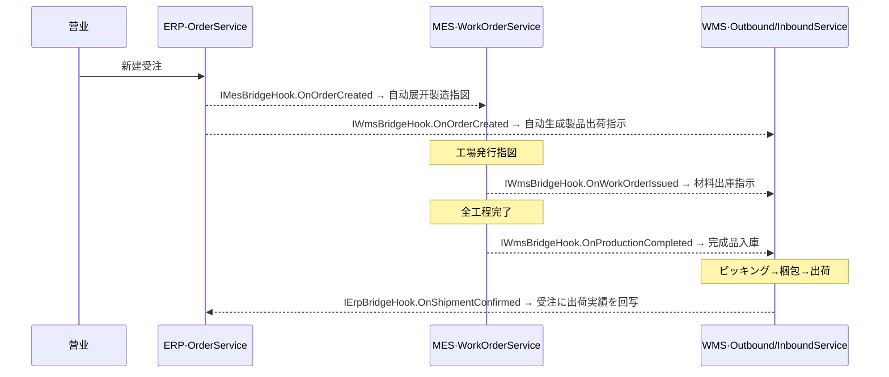

# CP6 代码地图（CODEMAP）— 初学者的第一份导航

> **这份文档是给谁的？** 第一次打开 CP6 仓库、想搞懂"这一大坨代码到底是怎么组织的"的人。
>
> **它解决三个问题**：
> 1. 我该**怎么学**这个项目？（→ §7 学习路线，按天 / 按角色）
> 2. **每个文件夹 / 关键文件**是干什么的？（→ §2 仓库全景、§3 模块地图、§8 速查表）
> 3. 各个功能**怎么连在一起**？（→ §4 一个请求怎么穿过全系统、§5 功能之间怎么连）
>
> **它和其它文档的分工**（别看重了）：
> | 文档 | 角色 | 一句话 |
> |---|---|---|
> | **本文 `CODEMAP.md`** | 🗺️ **地图 / 索引** | 你在哪、周围有什么、该往哪走 |
> | `docs/learning/`（16 篇丛书） | 🔬 **精读** | 每章拆 1~2 个真实文件讲"为什么这么写" |
> | `DEVELOPMENT-GUIDE.md` | 🛠️ **教程** | 从零把这个项目搭起来的步骤 |
> | `docs/PROJECT_STRUCTURE.md` | 📐 **参考手册** | ER 图 + 业务流 + 模块清单（偏 ERP/MES/WMS，部分已被本文更新） |
> | `README.md` | 🚪 **入口** | 项目是什么 + 文档地图导航 |
>
> 👉 **建议把本文当目录**：看到感兴趣的点，顺着链接跳进对应源码或精读章节。
>
> *状态：2026-06-22 实测仓库生成。后端 4 个 .NET 项目 + 1 个 Vue 前端，112 个 Controller / ~200 个实体 / 180 个测试文件（约 970+ 用例）。*

---

## 0. 先认识 CP6 是什么

CP6 是一套**纸箱包装企业的一体化 ERP / MES / WMS 系统**（源自日本 Crown Package 的核心系统刷新项目，现代化重写为独立 Web 系统）。

用一句话串起业务主线：

> **接单（販売/ERP）→ 生产（製造/MES）→ 出入库与发货（倉庫/WMS）**，三段自动联动成一个闭环；外加**财务、采购、OA 审批、权限平台、计划中台（MRP）**等中后台模块，目标做成可售的 SaaS 产品。

技术栈一览：

| 层 | 技术 |
|---|---|
| 后端 | **ASP.NET Core (.NET 8/10)** · EF Core（CRUD）+ Dapper（报表）· SQL Server · JWT · SignalR（实时）· Kafka（日志流）· RabbitMQ（业务通知） |
| 前端 | **Vue 3 + TypeScript** · Element Plus · Pinia（状态）· vue-router · vue-i18n（5 语）· Vite · Playwright |
| 部署 | Docker Compose / Kubernetes / cloudflared 隧道 |

---

## 1. 30 秒建立心智模型

整个系统就是**「一个 Vue 前端」 ＋ 「四层 .NET 后端」**，数据从右往左流，依赖严格单向：

```
┌─────────────┐   HTTP (REST) + WebSocket (SignalR)   ┌──────────────────────────────────────────┐
│   cp6.web   │ ───────────────────────────────────►  │              后端 4 层（单向依赖）           │
│  (Vue 3 SPA)│                                        │                                          │
│             │  ◄───────  {code,message,data}  ────── │  CP6.WebApi  →  CP6.Core  →  CP6.Entity   │
└─────────────┘                                        │  (HTTP入口)    (业务逻辑)     (数据模型)    │
                                                       │       ▲                                  │
                                                       │  CP6.Tests（测试，依赖 Core/WebApi）       │
                                                       └──────────────────────────────────────────┘
```

记住三件事，你就不会迷路：

1. **依赖只能从左往右**：`WebApi → Core → Entity`。Entity 不认识任何人，是最底层的纯数据。前端只通过 HTTP 认识 WebApi。
2. **文件夹 = 命名空间 = 业务域**。后端三层和前端，都用**同一套业务域子目录**切分（见下表）。知道一个文件属于哪个域，就知道它在哪个文件夹。
3. **每个业务功能是一条竖线**：`前端页面 → api → Controller → Service → Entity → 数据库`，外加可能触发的**跨模块联动（Bridge Hook）**。看懂一条竖线（§4 的"受注"），其它都是同一个套路。

### 11 个业务域，三层 + 前端全对齐

| 业务域 | 含义 | 后端 Controller | 后端 Service | 实体 | 前端 views |
|---|---|---|---|---|---|
| **Sys** | 系统底座：用户/角色/菜单/字典/多语言/日志/部门/权限 | `Controllers/Sys/` (11) | `Services/Sys/` | `DomainModels/Sys/` (19) | `views/pms/` |
| **Erp** | 販売管理：見積/御見積/製品/受注/取引先/FSC… | `Controllers/Erp/` (15) | `Services/Erp/` | `DomainModels/Erp/` (21) | `views/erp/` |
| **Mes** | 製造執行：製造指図/実績/品質/設備/OEE | `Controllers/Mes/` (11) | `Services/Mes/` | `DomainModels/Mes/` (15) | `views/mes/` |
| **Wms** | 倉庫管理（最大）：在庫/入出庫/棚卸/紙器特化 | `Controllers/Wms/` (32) | `Services/Wms/` | `DomainModels/Wms/` (39) | `views/wms/` |
| **Fin** | 财务会计：总账/AP/AR/成本/资产/预算/银行对账 | `Controllers/Fin/` (23) | `Services/Fin/` | `DomainModels/Fin/` (31) | `views/fin/` |
| **Pur** | 采购：供应商/PO/收货/三单匹配/PR/RFQ/外注 | `Controllers/Pur/` (8) | `Services/Pur/` | `DomainModels/Pur/` (13) | `views/pur/` |
| **Wf** | OA 审批引擎：流程/表单/待办/高级流程 | `Controllers/Wf/` (5) | `Services/Wf/` | `DomainModels/Wf/` (8) | `views/wf/` |
| **Pub** | 公共平台：附件/采番/代码生成/Excel | `Controllers/Pub/` (3) | `Services/Pub/` | `DomainModels/Pub/` (4) | （组件复用） |
| **Plan** | 计划中台：MRP/物料计划策略 | `Controllers/Plan/` (2) | `Services/Plan/` | `DomainModels/Plan/` (5) | `views/plan/` |
| **Integration** | 跨模块联动：Bridge Hook / 集成事件 | `Controllers/Integration/` (1) | `Services/Integration/` | `DomainModels/Integration/` (1) | — |
| **Common** | 横切共享：租户上下文/用量内核 | — | `Services/Common/` | `DomainModels/Common/` (4) | — |

> ✅ **这就是"每个文件是什么作用"的钥匙**：拿到任何一个文件名，先看它在哪个域、哪一层，作用就八九不离十了。比如 `Services/Wms/StockMovementService.cs` = WMS 域的业务逻辑层，管库存移动。

---

## 2. 仓库全景：每个文件夹是什么

### 2.1 仓库根目录

```
D:\CP6\
├── CP6.Entity/        # 【后端·实体层】数据模型（实体 + DTO）—— 最底层，不依赖任何项目
├── CP6.Core/          # 【后端·核心层】业务逻辑（Service + 仓储基类 + EF 上下文 + 迁移）
├── CP6.WebApi/        # 【后端·API 层】HTTP 入口（Controller + 中间件 + Hub + 后台服务 + Program.cs）
├── CP6.Tests/         # 【后端·测试层】xUnit + EF InMemory，180 个测试文件
├── cp6.web/           # 【前端】Vue 3 + TS 单页应用
├── docs/              # 【文档】学习丛书 / 规格 / 计划 / 种子 SQL / 操作手册（见 README 文档地图）
├── k8s/               # 【部署】Kubernetes 清单
├── docker-compose.yml # 【部署】单机 Compose
├── cloudflared-docker/# 【部署】cloudflared 公网隧道（cp6.uk）
├── CP6.slnx           # .NET 解决方案文件（新式 XML 格式，含 4 个 csproj）
├── README.md          # 项目入口 + 文档地图
├── DEVELOPMENT-GUIDE.md # 从零搭建教程
└── *.ps1 / *.bat / *.sh # 部署 / 启动 / 种子脚本
```

### 2.2 后端三层，每个文件夹装什么

#### `CP6.Entity/`（实体层 — 纯数据，没有逻辑）

```
CP6.Entity/
├── BaseEntity.cs          # 所有实体的根基类：Id / Creator / CreateDate / Modifier / ModifyDate（审计字段）
├── BaseTenantEntity.cs    # ↑ + TenantId（多租户行级隔离）
├── BaseBizEntity.cs       # ↑ + IsDeleted（软删除）+ RowVersion（乐观锁）—— 99% 业务实体继承它
├── DomainModels/          # 实体（= 数据库表），按 11 个业务域分子目录
│   ├── Common/ Sys/ Erp/ Mes/ Wms/ Fin/ Pur/ Wf/ Pub/ Plan/ Integration/
└── DTOs/                  # 数据传输对象（前端 ↔ Controller 用），镜像 DomainModels 的域分目录
```

> **实体 vs DTO 的区别**（初学者最容易混）：
> - **实体（DomainModels）** = 数据库里一张表的结构，一行一对象。
> - **DTO** = 一次 HTTP 请求/响应的"打包形状"。一个 DTO 常聚合多张表 —— 例如 `OrderDto` 一个对象里同时装了「受注头 + 多条明细 + 多条工程 + 多条材料」，前端一次 POST 全提交。

#### `CP6.Core/`（核心层 — 业务逻辑都在这）

```
CP6.Core/
├── BaseProvider/          # ⭐通用 CRUD 框架（最该先读）
│   ├── IRepository.cs / RepositoryBase.cs   # 泛型仓储：增删改查/分页，直接操作 DbSet
│   └── IService.cs / ServiceBase.cs         # 泛型服务：默认 CRUD 实现，子类按需 override
├── EFDbContext/
│   └── CP6Context.cs      # ⭐EF 数据库上下文：注册 100+ DbSet + OnModelCreating（索引/唯一键/租户过滤）
├── Services/              # ⭐业务服务，按 11 个域分子目录；每个功能一对 I{X}Service.cs + {X}Service.cs
│   ├── Common/ Sys/ Erp/ Mes/ Wms/ Fin/ Pur/ Wf/ Pub/ Plan/ Integration/
├── Auth/                  # 认证相关辅助（JWT 生成等）
├── Pub/                   # 公共能力实现
├── Options/               # 强类型配置类（IntegrationEventOptions / SecurityOptions…）
├── Utilities/             # 工具类（采番、加密、扩展方法…）
└── Migrations/            # EF Core 迁移（Code-First 建库历史）
```

> **新功能 90% 的工作量在 `Services/` 里**。一个业务功能 = `Services/<域>/` 下一对接口+实现。

#### `CP6.WebApi/`（API 层 — HTTP 边界 + 横切关注点）

```
CP6.WebApi/
├── Program.cs            # ⭐启动编排：所有 DI 注册 + 中间件管线（2000+ 行，是后端的"接线总图"）
├── Controllers/          # HTTP 端点，按域分子目录（根目录只有 LocalizedControllerBase 基类）
│   ├── Sys/ Erp/ Mes/ Wms/ Fin/ Pur/ Wf/ Pub/ Plan/ Integration/
├── Middleware/           # 中间件（按请求顺序跑）：租户 / 异常本地化 / CSRF / 强制改密
├── Filters/              # 过滤器：OperLogFilter（全局操作日志审计）
├── Hubs/                 # SignalR 实时推送 Hub（MES/WMS/通知）
├── BackgroundServices/   # 后台常驻任务：Kafka 消费 / 重试 Worker / OEE 计算 / 折旧 / 对账…
├── Localization/         # DB 驱动的 i18n（DbStringLocalizer 读 Sys_Lang 表）
├── Observability/        # 可观测性（Prometheus 指标采集器）
├── Services/             # WebApi 层专属服务（SignalR 通知实现、语言发布…）
├── Seed/                 # 种子数据
└── wwwroot/              # 静态资源（前端构建产物落点）
```

#### `CP6.Tests/`（测试层）

xUnit + Moq + EF Core InMemory。180 个测试文件，按域组织（`WmsTests/`、`FinTests/` …），覆盖每个 Service 的正常 / 异常 / 边界路径。**合并前 `dotnet test` 必须全绿**。

### 2.3 前端 `cp6.web/src/` 每个文件夹装什么

```
cp6.web/src/
├── main.ts            # ⭐应用启动点：装 Pinia / 路由 / i18n / 权限指令，挂到 #app
├── App.vue            # 根组件，就一个 <RouterView/>
├── views/             # ⭐业务页面，按域分子目录：erp/ mes/ wms/ fin/ pur/ wf/ plan/ pms/ dashboard
│                      #   命名：XxxView.vue（详情/编辑）、XxxListView.vue（列表）、XxxEntryView.vue（录入向导）
│                      #   另有 LoginView.vue（登录）、LayoutView.vue（带侧边菜单的全局外壳）
├── api/               # ⭐HTTP 调用封装，按域分子目录 + 一个核心文件
│   ├── http.ts        #   ⭐axios 实例：自动加 JWT token、统一解包 {code,message,data}、401 跳登录、错误码 i18n
│   └── erp/ mes/ wms/ fin/ pur/ wf/ pub/ sys/ plan/   # 每个文件导出一个 xxxApi 对象
├── stores/            # Pinia 状态：permission.ts（操作权限）/ order.ts（受注向导态）/ estimate.ts …
├── router/
│   └── index.ts       # ⭐路由：静态路由（登录/Layout）+ 动态路由（登录后按菜单 addDynamicRoutes 注入，懒加载）
├── types/             # TypeScript DTO 类型，镜像后端 DTO，按域分子目录
├── i18n/
│   └── index.ts       # 多语言：5 语 + 伪本地化；live 模式按页面拉命名空间，publish 模式拉版本化静态包
├── components/        # 可复用组件：VolTable（通用表格）/ VolForm / MenuTreeItem（递归菜单）/ 各种 Dialog
├── composables/       # 组合式函数：useBreakpoint（响应式断点）/ useValidation / usePubExcel / useConflictHandler（乐观锁冲突）
├── directives/
│   └── permission.ts  # v-permission 指令：无权限就移除元素（仅 UX，真正校验在后端）
├── utils/             # signalr.ts（实时连接）/ mesHub.ts / wmsHub.ts / format.ts（格式化）
└── assets/            # 全局样式 + logo
```

---

## 3. 11 个业务域地图（每个域有哪些关键功能）

> 用法：想找某个业务功能的代码，先在这里定位到域和关键文件名，再去 §8 速查表或直接搜文件名。

### 3.1 Sys — 系统底座（`views/pms/`）

| 功能 | Controller | 前端页面 |
|---|---|---|
| 登录 / 认证 | `Sys/AuthController` | `LoginView` |
| 用户 / 角色 / 用户角色 | `Sys/UserController` `RoleController` `UserRoleController` | `pms/UserView` `RoleView` |
| 菜单 / 权限点 | `Sys/MenuController` `RolePermController` | `pms/MenuView` `PermissionView` |
| 部门（组织树） | `Sys/DeptController` | `pms/DeptView` |
| 字典 / 多语言 | `Sys/DictController` `LangController` | `pms/DictView` `LangView` |
| 操作日志 / 仪表盘 | `Sys/OperLogController` `DashboardController` | `pms/OperLogView` `dashboard/` |

### 3.2 Erp — 販売管理（`views/erp/`）

見積計算 → 御見積 → 製品マスタ → **受注**（核心，§4 拿它当例子）→ 取引先 / FSC / シート単価 / 版型木型。关键：`Erp/OrderController` + `Services/Erp/OrderService` + `DomainModels/Erp/Order`。受注一建好，会自动触发 MES 和 WMS（见 §5）。

### 3.3 Mes — 製造執行（`views/mes/`）

生産計画ボード → **製造指図（WorkOrder）** → 製造実績 → 品質検査 / 不良 → 設備 / OEE / 工作中心 / 工程费率。关键：`Mes/WorkOrderController`。指図発行会触发 WMS 材料出庫。

### 3.4 Wms — 倉庫管理（最大的域，`views/wms/`）

核心：倉庫/Location → 在庫照会 → 入庫指示/実績 → 出庫指示 → ピッキング → 梱包/出荷 → 棚卸 → 補充。
扩展（紙器业特化）：Kit/Pallet/Slotting/QC/Lot追溯/期限/サンプル/Cross-Dock/残材/インキ/原紙ロール/版型在庫。
業界連携：RF Mobile/WCS/IoT/VMI/RMA/帳票センター。

> ⚠️ **WMS 的铁律**：库存表 `T_Stock` 严禁直接改，必须经 `IStockMovementService`（见 §6）。这是整个系统最重要的不变式。

### 3.5 Fin — 财务会计（23 个 Controller，`views/fin/`）

总账内核：科目（`GlAccountController`）→ 凭证（`JournalEntryController`，借贷恒等 + maker-checker + 红冲）→ 试算平衡 → 资产负债表/损益表。
往来：应付 AP（发票/付款/核销/账龄）、应收 AR（发票/收款/信用控制）。
扩展：成本归集与结转、固定资产（卡片/折旧/处置）、预算、银行对账。
对外接口：`Services/Fin/FinBridgeHook`（WMS 出货 → 自动开应收发票）。

### 3.6 Pur — 采购（`views/pur/`）

供应商价表 → 采购申请 PR → 询价 RFQ → 采购订单 PO → 收货 GR → **三单匹配**（PO↔GR↔发票，自动建应付）→ 外注加工 → 采购对账。关键：`Pur/ThreeWayMatchService`。采购通过适配器委托财务建应付、委托 WMS 入库（见 §5 的"直线委托"）。

### 3.7 Wf — OA 审批引擎（`views/wf/`）

流程定义 → 表单引擎（JSON schema）→ 流程引擎状态机（会签/条件/幂等）→ 待办中心 → 高级流程（超时/退回/加签/委派）。
**业务接入点**：`Services/Wf/IApprovalService` + `ApprovalCallback`。财务凭证、预算、采购 PO/PR 都通过实现 `IApprovalCallback` 接入审批（终态回调）。

### 3.8 Pub — 公共平台（组件复用，无独立 views 子目录）

附件存储（`AttachmentController`）/ 富采番（`SeqController`）/ 代码生成（`CodeGenController`）/ Excel 导入导出。前端对应 `api/pub/` + `components/PubUpload.vue` `PubImportDialog.vue`。

### 3.9 Plan — 计划中台（`views/plan/`）

物料计划策略 → 低层码 → 供给 → **MRP 引擎**（净需求计算）→ 计划转单（→采购 PR / →MES 工单，目前部分为桩）。关键：`Plan/MrpController` + `Services/Plan/MrpEngine`。

### 3.10 Integration — 跨模块联动（看 §5）

四个 Bridge Hook 接口 + 集成事件持久化 + 重试 Worker + 死信告警。这是把上面各域"缝"成闭环的胶水层。

### 3.11 Common — 横切共享

`ITenantContext`（当前租户上下文）/ `ITenantEnumerator`（活跃租户枚举，后台任务用）/ `IMaterialUsageCalculator`（見積与 MRP 共用的用量内核）。

---

## 4. 一个请求怎么穿过全系统（看懂这条竖线，就看懂了 90%）

以**"受注（Order）"**为例，追一次"新建受注"从前端点击到落库再到跨模块联动的全程。**所有业务功能都是这个套路**，换个名字而已。

### 4.1 全链路图

```
【前端 cp6.web】
  OrderEntryView.vue（3 步向导页）
    │  用户填头+明细+工程+材料，点保存
    ▼
  useOrderStore().buildDto()   ── 把向导里散落的状态打包成一个 OrderDto
    │
    ▼
  orderApi.create(dto)         ── src/api/erp/order.ts
    │
    ▼
  http.ts （axios 拦截器）      ── 自动加 Authorization: Bearer <token>、加 CSRF 头
    │  POST /api/orders   { 头 + details[] + processes[] + materials[] }
    │
════╪═══════════════════ HTTP 边界 ═══════════════════════════════
    │
【后端 CP6.WebApi】
  中间件管线（按顺序）：CORS → JWT认证 → 租户(TenantMiddleware) → i18n → 异常本地化 → CSRF → 强制改密 → 授权
    │   ↑ 租户中间件从 JWT 解出 tenant_id，写进 ITenantContext（这次请求所有 DB 操作都只认这个租户）
    ▼
  Controllers/Erp/OrderController.Create([FromBody] OrderDto)
    │  调 IOrderService.CreateAsync(dto, 当前用户)
    ▼
【后端 CP6.Core】
  Services/Erp/OrderService.CreateAsync()
    │  1. 采番拿 WebOrderNo（统一采番接口，不手拼字符串）
    │  2. 冻结当时的外汇汇率（多通货）
    │  3. 构建 Order 头 + OrderDetail/OrderProcess/OrderMaterial 子表
    │  4. _db.SaveChangesAsync()  ← 一次性原子提交
    ▼
  EFDbContext/CP6Context（SaveChanges 时）
    │  自动给所有新行盖 TenantId = 当前租户、刷新 RowVersion
    ▼
【数据库 SQL Server】
    │  INSERT Order / OrderDetail / OrderProcess / OrderMaterial（每行都带 TenantId）
    │
    ▼  （回到 Service，提交成功后）
  触发跨模块联动（Best-Effort，失败不回滚受注）：
    ├─► IWmsBridgeHook.OnOrderCreatedAsync(webOrderNo)  → WMS 自动生成「製品出荷指示」
    └─► IMesBridgeHook.OnOrderCreatedAsync(webOrderNo)  → MES 自动展开「製造指図」
    ▼
  OperLogFilter（全局过滤器）── 记录这次请求：谁/什么方法/路径/参数/状态码/耗时 → Kafka（或降级写库）
    │
════╪═══════════════════ HTTP 返回 ═══════════════════════════════
    ▼
  { "code": 0, "message": "OK", "data": { "webOrderNo": "WO202606..." } }
    │  http.ts 自动解包出 data
    ▼
  页面提示"保存成功"，跳回 OrderListView.vue
```

### 4.2 这条竖线涉及的真实文件（照着点开读一遍）

| 阶段 | 文件 |
|---|---|
| 前端页面 | `cp6.web/src/views/erp/OrderEntryView.vue`（+ `order/Step1~3*.vue` 子组件） |
| 前端状态 | `cp6.web/src/stores/order.ts` |
| 前端 API | `cp6.web/src/api/erp/order.ts` → `cp6.web/src/api/http.ts` |
| 前端类型 | `cp6.web/src/types/erp/order.ts` |
| 后端入口 | `CP6.WebApi/Controllers/Erp/OrderController.cs` |
| 后端逻辑 | `CP6.Core/Services/Erp/OrderService.cs` |
| 数据模型 | `CP6.Entity/DomainModels/Erp/Order.cs`（+ OrderDetail/Process/Material） |
| 传输对象 | `CP6.Entity/DTOs/Erp/OrderDto.cs` |
| 跨模块胶水 | `CP6.Core/Services/Integration/IWmsBridgeHook.cs` `IMesBridgeHook.cs` |
| 接线总图 | `CP6.WebApi/Program.cs`（搜 `IOrderService` 看它怎么被注册） |

> 🎯 **学习建议**：把上面这 10 个文件按顺序读一遍，你就完整走通了一个功能的"前端→后端→数据库→联动"。之后看 WMS 入库、财务凭证、采购 PO，全是同一条竖线换业务。
>
> 📚 **想要逐行、带真实代码片段和错误码的"代码级"版本**？11 个业务域已全部覆盖：[`codemap-erp`](codemap-erp/README.md) / [`mes`](codemap-mes/README.md) / [`wms`](codemap-wms/README.md) / [`fin`](codemap-fin/README.md) / [`pur`](codemap-pur/README.md) / [`wf`](codemap-wf/README.md) / [`pub`](codemap-pub/README.md) / [`plan`](codemap-plan/README.md)（均在 `docs/codemap-*/`）。把**每个页面动作**都拆到了真实源码行。本节是"地图级"的受注一例，那些是"放大镜级"。

---

## 5. 功能之间怎么连（系统级关联关系）

各业务域不是孤岛。它们靠下面几种机制连成一个整体。

### 5.1 主线闭环：接单 → 生产 → 出库 → 回写（靠 Bridge Hook）

这是 CP6 最有特色的设计——**跨模块联动只通过 `I*BridgeHook` 接口**，谁也不直接 `using` 对方的 Service。



四个 Bridge Hook 的共同设计原则：**Best-Effort（失败不阻塞主流程）+ 幂等（重复触发自动 Skip）+ appsettings 可一键禁用（换 NoOp 实现）+ 集成事件持久化（失败进重试队列，5 次进死信 + 告警）**。

| 接口 | 谁触发 | 干什么 |
|---|---|---|
| `IMesBridgeHook` | 受注作成 | 自动展开製造指図 |
| `IWmsBridgeHook` | 受注作成 / 指図発行 / 工程完了 | 出荷指示 / 材料出庫 / 完成品入庫 |
| `IErpBridgeHook` | 出荷確定 / RMA確認 | 出荷実績回写 / 信用票据 |
| `IOrderCancelBridgeHook` | 受注取消 | 反向级联取消 Outbound + WorkOrder |

详细机制看精读丛书 [`docs/learning/06-bridge-hook-pattern.md`](learning/06-bridge-hook-pattern.md)。

### 5.2 跨子系统的"连接键"

模块之间用业务编号互相追踪（不是外键，是松耦合的字符串键）：

| 来源 | 字段 | 去向 |
|---|---|---|
| ERP `Order.WebOrderNo` | → | MES `WorkOrder.WebOrderNo`、WMS `OutboundOrder.WebOrderNo` |
| MES `WorkOrder.WorkOrderNo` | → | WMS 材料出庫 / 完成品入庫 |
| WMS `OutboundOrder.OutboundNo` | → | ERP `OrderDetail.ShippedQty`（出荷実績回写） |

### 5.3 另一种连法：直线委托（采购/财务/计划用）

不是所有模块都用 Bridge Hook。**采购、财务、计划**之间用**适配器直线委托**（同步调用，DI 按配置切真实/桩）：

- 采购三单匹配 → `IFinApService` 适配器 → 委托财务建应付凭证
- 采购收货 → `IWmsReceiveService` 适配器 → 委托 WMS 真实入库
- 各业务终态 → `IApprovalCallback` → 接入 OA 审批引擎

> 📌 区别记忆：**主线（ERP↔MES↔WMS）走 Bridge Hook 事件**（异步、可重试、可禁用）；**中后台（采购/财务/计划/OA）走适配器直线委托**（同步、强一致）。

### 5.4 横切关注点（每个请求都经过，不属于任何单一业务）

| 关注点 | 怎么连 | 关键文件 |
|---|---|---|
| **多租户隔离** | 中间件从 JWT 解 `tenant_id` 写入 `ITenantContext`；`CP6Context` 查询时自动加 `WHERE TenantId=?`、写入时自动盖章 | `Middleware/TenantMiddleware.cs` + `Services/Common/TenantContext.cs` + `CP6Context.cs` |
| **认证 / 安全** | JWT（access 放 httpOnly cookie）+ BCrypt 密码 + 登录锁定 + 刷新令牌轮换 + jti 黑名单 + CSRF 双提交 + 强制改密 | `Services/Sys/`（`BCryptPasswordHasher`/`LoginSecurityService`/`RefreshTokenService`/`AuthCookieWriter`…）+ `Middleware/CsrfMiddleware.cs` `MustChangePasswordMiddleware.cs` |
| **操作审计** | 全局 `OperLogFilter` 拦截每个 Controller，记录请求 → Kafka 高吞吐流（不可用降级写库） | `Filters/OperLogFilter.cs` |
| **多语言 i18n** | 翻译落 DB（`Sys_Lang` 表，5 语）；后端 `DbStringLocalizer` 读它，前端 `vue-i18n` 拉 `/api/lang` | `Localization/DbStringLocalizer.cs` + 前端 `i18n/index.ts` |
| **菜单 / 权限** | 后端菜单树 `Sys_Menu`；登录拉当前用户有权菜单 → 前端 `addDynamicRoutes` 动态注册路由；按钮级 `v-permission` + 后端 `[RequirePermission]` 强校验 | 前端 `router/index.ts` + `directives/permission.ts` + 后端 `Sys/RolePermController` |
| **实时推送** | SignalR Hub 把 MES 工单状态、WMS 库存预警、死信告警推给前端 | `Hubs/` + 前端 `utils/signalr.ts` `mesHub.ts` `wmsHub.ts` |

---

## 6. 不可违反的约定（新手最容易踩的雷）

这些是"碰了就出事"的硬规则，加新代码前务必遵守：

1. **库存写入唯一入口** — `T_Stock` 严禁直接 `Add`/`Update`，必经 `IStockMovementService.ApplyAsync/MoveAsync`，由它同步写 `T_StockTransaction`（不变日志）。👉 精读 [`05-stock-invariant.md`](learning/05-stock-invariant.md)
2. **采番统一接口** — 业务编号经 `IWmsSequenceService` / `IMesSequenceService` / 财务采番等，禁手工拼字符串。
3. **Controller 返回形状固定** — 所有 API 返回 `{code, message, data}`，前端 `http.ts` 统一解包。别自创返回结构。
4. **跨模块只走接口** — 主线联动经 `I*BridgeHook`，中后台经适配器接口，禁直接 `using` 对方 Service 命名空间。
5. **i18n 落 DB** — 新字段/按钮的翻译写进 `Sys_Lang` 种子 SQL，别在前端硬编码中文字符串。
6. **菜单要注册种子** — 新页面路由必须同步 `Sys_Menu` 种子，否则左侧导航不出现。
7. **OperLogFilter 是全局的** — 别在 Controller 里重复记日志。
8. **新 Service 必须配测试** — 在 `CP6.Tests` 加正常+异常+边界用例，`dotnet test` 全绿才合并。
9. **租户隔离自动生效** — 业务实体继承 `BaseBizEntity` 就自动带 `TenantId` 过滤；别写绕过过滤的裸 SQL（除非像 refresh token 那种确需 `IgnoreQueryFilters` 的特例）。
10. **乐观锁要带 RowVersion** — 更新业务实体时回传 `RowVersion`，并发冲突会被 EF 挡下。

---

## 7. 学习路线（按这个顺序，别东一榔头西一棒）

### 7.1 第一周·按天走（推荐零基础进项目用）

| 天 | 目标 | 做什么 |
|---|---|---|
| **D1·建心智模型** | 看清骨架 | 读本文 §0~§2 + 精读 [`01-architecture-layering.md`](learning/01-architecture-layering.md)。把仓库每个文件夹点开扫一眼。 |
| **D2·跑起来** | 环境能动 | 照 `DEVELOPMENT-GUIDE.md` 起后端（`dotnet run --project CP6.WebApi`）+ 前端（`cd cp6.web && npm i && npm run dev`），登录进去点几下。 |
| **D3·走通一条竖线** | 看懂一个功能全程 | 照本文 §4，把"受注"那 10 个文件按顺序读一遍，对照页面操作。 |
| **D4·CRUD 套路** | 会自己加功能 | 精读 [`04-repository-service-pattern.md`](learning/04-repository-service-pattern.md)。读 `BaseProvider/` + 一个简单 master（`BusinessPartnerService`）。 |
| **D5·横切关注点** | 懂"看不见的连接" | 读本文 §5。精读 [`02-di-and-program.md`](learning/02-di-and-program.md)（看 `Program.cs` 怎么接线）+ [`07-jwt-and-operlog-filter.md`](learning/07-jwt-and-operlog-filter.md)。 |
| **D6·跨模块闭环** | 懂业务联动 | 读本文 §5.1 + 精读 [`06-bridge-hook-pattern.md`](learning/06-bridge-hook-pattern.md)。跟一遍 ERP→MES→WMS。 |
| **D7·前端 + 测试** | 补全两翼 | 精读 [`09-vue3-frontend.md`](learning/09-vue3-frontend.md) + [`11-testing.md`](learning/11-testing.md)。读 `http.ts` / `router/index.ts` / 一个 `*Tests.cs`。 |

> `docs/learning-basics/` 是同样 16 章的**基础版**（语法门槛更低），`docs/learning/` 是**进阶版**（讲设计取舍、面试怎么问）。基础薄就先 basics，想冲高级岗就读 learning。

### 7.2 按角色挑重点（已有基础、按目标抄近路）

| 你想做 | 重点路线 |
|---|---|
| **后端开发** | §1→§2.2→§4→§6 ＋ 精读 01→02→03→04→05→06→07 |
| **前端开发** | §1→§2.3→§4（前端段）＋ 精读 09→10，读 `http.ts`/`router/index.ts`/`stores/` |
| **加一个新业务模块** | §3 找最像的域抄结构 ＋ §6 十条约定 ＋ §4 竖线 ＋ `DEVELOPMENT-GUIDE.md` |
| **排查跨模块联动问题** | §5.1 ＋ `appsettings*.json` 的 `*Bridge:Enabled` ＋ Integration 域 + 死信告警 |
| **面试准备** | 精读 [`16-mock-interview.md`](learning/16-mock-interview.md)（60 题） |

### 7.3 "我想加一个新页面/新接口"——最短路径

**后端**（加一个功能）：① `DomainModels/<域>/X.cs` 建实体 → ② `CP6Context` 注册 DbSet → ③ `Services/<域>/IXService.cs` + `XService.cs`（继承 `ServiceBase` 或自写）→ ④ `DTOs/<域>/XDto.cs` → ⑤ `Controllers/<域>/XController.cs` → ⑥ `Program.cs` 注册服务 → ⑦ `CP6.Tests` 加用例 → ⑧ `dotnet ef migrations add` 建迁移。

**前端**（加一个页面）：① `types/<域>/x.ts` 定类型 → ② `api/<域>/x.ts` 定 `xApi` → ③ `views/<域>/XView.vue` 写页面 → ④ `router/index.ts` 注册懒加载路由 → ⑤ 后端插 `Sys_Menu` 种子让菜单出现。

---

## 8. 速查表（"X 在哪个文件"）

### 8.1 后端核心骨架

| 找什么 | 文件 |
|---|---|
| 通用仓储基类 | `CP6.Core/BaseProvider/IRepository.cs` · `RepositoryBase.cs` |
| 通用服务基类 | `CP6.Core/BaseProvider/IService.cs` · `ServiceBase.cs` |
| 实体根基类（审计字段） | `CP6.Entity/BaseEntity.cs` |
| 实体租户基类 | `CP6.Entity/BaseTenantEntity.cs` |
| 实体业务基类（软删/乐观锁） | `CP6.Entity/BaseBizEntity.cs` |
| 数据库上下文 | `CP6.Core/EFDbContext/CP6Context.cs` |
| 所有 DI 注册 + 中间件管线 | `CP6.WebApi/Program.cs` |

### 8.2 横切关注点

| 找什么 | 文件 |
|---|---|
| 多租户上下文 | `CP6.Core/Services/Common/ITenantContext.cs` · `TenantContext.cs` |
| 租户中间件 | `CP6.WebApi/Middleware/TenantMiddleware.cs` |
| 全局异常本地化 | `CP6.WebApi/Middleware/BizExceptionMiddleware.cs` |
| CSRF 校验 | `CP6.WebApi/Middleware/CsrfMiddleware.cs` |
| 强制改密 | `CP6.WebApi/Middleware/MustChangePasswordMiddleware.cs` |
| 操作日志 | `CP6.WebApi/Filters/OperLogFilter.cs` |
| 密码哈希 / 策略 / 锁定 | `CP6.Core/Services/Sys/BCryptPasswordHasher.cs` · `PasswordPolicyService.cs` · `LoginSecurityService.cs` |
| 刷新令牌 / Cookie | `CP6.Core/Services/Sys/RefreshTokenService.cs` · `AuthCookieWriter.cs` |
| 登录端点 | `CP6.WebApi/Controllers/Sys/AuthController.cs` |
| 实时推送 Hub | `CP6.WebApi/Hubs/` |
| 后台任务 | `CP6.WebApi/BackgroundServices/` |

### 8.3 前端核心

| 找什么 | 文件 |
|---|---|
| axios 封装（token/解包/错误） | `cp6.web/src/api/http.ts` |
| 路由（动态注册/懒加载/守卫） | `cp6.web/src/router/index.ts` |
| 应用启动 | `cp6.web/src/main.ts` |
| 全局布局 / 登录 | `cp6.web/src/views/LayoutView.vue` · `LoginView.vue` |
| 操作权限指令 | `cp6.web/src/directives/permission.ts` |
| i18n 加载 | `cp6.web/src/i18n/index.ts` |
| 实时连接 | `cp6.web/src/utils/signalr.ts` |
| 通用表格 / 表单 | `cp6.web/src/components/VolTable.vue` · `VolForm.vue` |
| 改 API 地址 / 端口 | `cp6.web/vite.config.ts`（proxy）+ `cp6.web/src/api/http.ts`（baseURL） |
| npm 脚本（dev/build/test/e2e） | `cp6.web/package.json` |

### 8.4 受注（拿来当模板抄）

| 层 | 文件 |
|---|---|
| 页面 | `cp6.web/src/views/erp/OrderEntryView.vue` · `OrderListView.vue` |
| 状态 | `cp6.web/src/stores/order.ts` |
| API / 类型 | `cp6.web/src/api/erp/order.ts` · `cp6.web/src/types/erp/order.ts` |
| Controller | `CP6.WebApi/Controllers/Erp/OrderController.cs` |
| Service | `CP6.Core/Services/Erp/OrderService.cs` |
| 实体 / DTO | `CP6.Entity/DomainModels/Erp/Order.cs` · `CP6.Entity/DTOs/Erp/OrderDto.cs` |

---

## 9. 继续深入的延伸阅读

- **代码级实现手册**（本文的"放大镜"续篇，逐页逐行+真实代码片段+错误码）：
  - [`docs/codemap-erp/`](codemap-erp/README.md) —— ERP 販売主线（見積→御見積→製品→受注→出荷回写）
  - [`docs/codemap-mes/`](codemap-mes/README.md) —— MES 製造執行（製造指図→製造実績→品質→設備/OEE→計画板）
  - [`docs/codemap-wms/`](codemap-wms/README.md) —— WMS 倉庫管理（库存铁律→入庫→出庫/出荷→棚卸/期限→紙器特化→業界連携）
  - [`docs/codemap-fin/`](codemap-fin/README.md) —— Fin 财务会计（总账内核→往来AP/AR→三表/成本/对账→资产/预算）
  - [`docs/codemap-pur/`](codemap-pur/README.md) —— Pur 采购（主数据/PO/收货/三单匹配→申请/询价/外注/对账）
  - [`docs/codemap-wf/`](codemap-wf/README.md) —— Wf OA审批引擎（流程引擎/业务回调接缝/高级流程/审批人解析）
  - [`docs/codemap-pub/`](codemap-pub/README.md) —— Pub 权限平台（四粒度权限/组织/采番/附件/代码生成/Excel）
  - [`docs/codemap-plan/`](codemap-plan/README.md) —— Plan 计划中台（物料策略/MRP净需求/计划转单）
- **精读 16 章**：`docs/learning/`（进阶）/ `docs/learning-basics/`（基础）—— 每章拆真实文件讲设计
- **从零搭建**：`DEVELOPMENT-GUIDE.md`
- **ER 图 + 业务流参考**：`docs/PROJECT_STRUCTURE.md`、`docs/MSBBWM_ER_Diagram.md`
- **需求规格底稿**：`docs/MSBBWM_Requirements.txt`、`docs/MES_Requirements.txt`、`docs/detailed-spec/`
- **战略 / 路线**：`docs/00-功能盘点.md`、`docs/00-执行计划总盘.md`、`docs/00-product-blueprint.md`
- **各新模块设计丛书**：`docs/{finance,procurement,oa,pub,approval,space}/`

---

*生成于 2026-06-22。基于实测仓库（112 Controller / ~200 实体 / 180 测试文件 / 11 业务域三层对齐）。代码大改动后，§1 的域对齐表和 §3 模块地图最值得回来更新。*
