# CP6 目标完整 ERP 蓝图与当前实现状态（含 3D Space 主业务）

## 图例

- 绿色：当前已有主要实现。
- 蓝色：平台、治理和公共能力。
- 紫色：财务能力。
- 黄色：已有实现，但闭环不完整或存在风险。
- 红色虚线：当前缺失或需要重构。

## 3D Space 定位

3D Space 不是单纯的展示组件，而是连接低成本建模、空间主数据、WMS 库位、实时库存、人员与设备状态、运营决策和执行反馈的数字孪生主业务。蓝图参考菜鸟数字空间的“人、货、场”模型，并按 CP6 代码的真实状态标注：当前已具备地图编辑基础、空间层级、库位编码发布、Three.js 查看、库存叠加、跨层路径与工作量热图；CAD/Excel 语义建模、人员轨迹、真实设备数据和优化执行反馈仍未闭环。

更详细的 3D Space 闭环及代码差距见：

- [CP6 3D Space 端到端闭环蓝图](./CP6-Space3D-end-to-end-blueprint.svg)
- [菜鸟案例研究、CP6 代码对照与实施路线](./CP6-Space3D-Cainiao-benchmark-and-closure.md)

## 文件

- `CP6-ERP-end-to-end-blueprint.svg`：推荐查看，可无限放大。
- `CP6-ERP-end-to-end-blueprint.png`：适合发送或插入普通文档。
- `CP6-ERP-end-to-end-blueprint.mmd`：Mermaid 可编辑源文件。
- `CP6-Space3D-end-to-end-blueprint.svg/png/mmd`：可单独阅读、尺寸更紧凑的 3D Space 主业务图。
