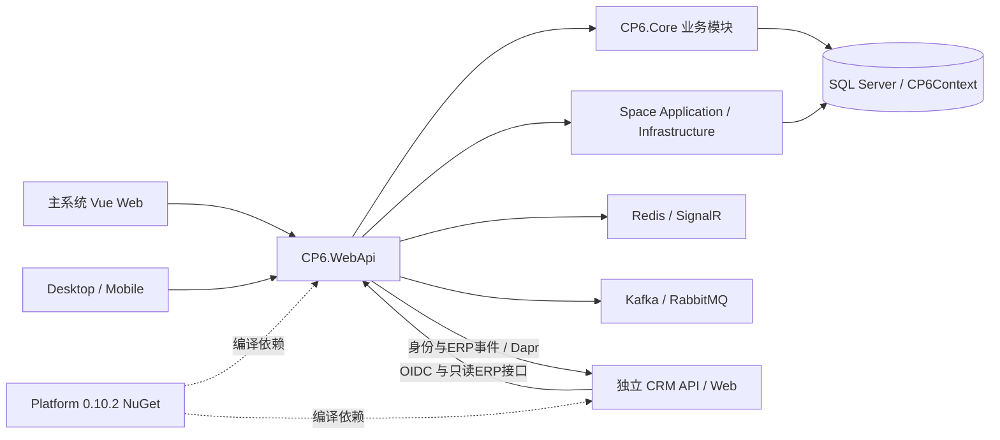

# CP6 主系统架构、数据与交付盘点

审计基线：CP6 `5f39a020a9c535fb0bd515cc419bc0e99b90fe07`。本页代码位置均相对此仓库。结论来自源码、项目引用、注册与调用链；没有启动应用、连接数据库、执行构建/业务测试或核查云端运行状态。历史验收只按历史证据引用。

## 1. 实际架构

CP6 主系统是按业务目录组织的 ASP.NET Core 模块化单体，包含逐步独立出来的 Space 分层及 CRM 接缝。目录名不等于独立部署服务。

| 边界 | 实现 | 代码证据 |
| --- | --- | --- |
| HTTP 入口 | 一个 WebApi 承载 ERP、PUR、MES、PLAN、WMS、FIN、OA/WF、SYS/PUB、Space、内部身份/ERP接口及后台任务 | `CP6.WebApi/Program.cs:24`；`CP6.WebApi/Program.cs:3058` |
| 公共业务层 | CP6.Core 引用 Entity，同时依赖 ASP.NET 共享框架、EF Core、Dapper、缓存、消息、Excel、S3等；并非纯领域程序集 | `CP6.Core/CP6.Core.csproj:1` |
| 数据层 | CP6Context 统一多数业务的映射、租户过滤、审计与身份事件事务；Dapper 连接也来自同一 DefaultConnection | `CP6.Core/EFDbContext/CP6Context.cs:609`；`CP6.WebApi/Program.cs:155`；`CP6.WebApi/Program.cs:202` |
| Space | Domain / Application / Contracts / Infrastructure / Client 独立项目，但 Infrastructure 适配既有WMS，运行于同一API宿主、同一连接字符串 | `CP6.WebApi/CP6.WebApi.csproj:27`；`CP6.WebApi/Program.cs:171`；`CP6.Space.Infrastructure/SpaceInfrastructureRegistration.cs:37` |
| CRM跨仓接口 | 主系统提供OIDC、组织/身份事件和ERP商业权威；CRM是另一仓库和运行时，不在Core进程内承载完整CRM应用 | `CP6.WebApi/Program.cs:73`；`CP6.WebApi/Configuration/CrmIdentityConfiguration.cs:1`；`CP6.WebApi/Configuration/ErpIntegrationConfiguration.cs:22` |
| Platform消费 | Core/Messaging、Core/EntityFramework、WebApi/AspNetCore均固定消费 `[0.10.2]` NuGet 包 | `CP6.Core/CP6.Core.csproj:14`；`CP6.WebApi/CP6.WebApi.csproj:10` |
| 客户端 | Vue Web与桌面/移动业务客户端共存，另有生成式Space SDK；并非每端都有全部模块 | `CP6.slnx:1`；详见界面分报告 |

图中的跨仓箭头表示接口及消费机制存在，不代表完整销售业务链已通过生产验收。Platform是共享库，不是另一个线上控制台。

## 2. 数据与业务边界

| 数据范围 | 当前实现 | 升级含义 |
| --- | --- | --- |
| ERP/PUR/MES/PLAN/WMS/FIN/OA/WF/SYS | 大量实体位于 `CP6.Entity/DomainModels/`，多数进入同一CP6Context | 跨模块直接数据访问与单体事务仍是既有事实；拆库前先确认对象所有者、读模型与写入边界 |
| Space设计 | SpaceContext，独立迁移历史 `__EFMigrationsHistory_Space`，Tenant执行上下文 | 是逻辑持久化边界，不可仅凭Context名称推断已独立数据库 |
| 身份事件 | `IdentityMessagingContext` / `crm_identity_priority`，Platform事务消息映射 | 不能把旧日志Kafka通道当作身份权威事件通道 |
| ERP集成 | `ErpIntegrationContext`，命令/交付/重放等持久化 | 接收请求、ERP落单、发出结果是有约束的业务过程，不应由CRM直接写ERP表 |
| 旧CRM | 本次基线已将旧模型/状态机转入测试夹具，保留身份/ERP新接缝 | 旧表物理删除是独立任务；文档与历史迁移中的旧名字不代表当前生产EF模型仍注册 |

证据：`CP6.Space.Infrastructure/SpaceContext.cs:8`、`CP6.Core/Services/CrmIdentity/IdentityMessagingContext.cs:7`、`CP6.Core/Services/ErpIntegration/ErpIntegrationContext.cs:1`、`CP6.Tests/CP6.Tests.csproj:24`、`eng/crm/legacy-model-fixture/`。

本次扫描提取319处Core仓库的非测试 `public DbSet<T>` 声明：当前应用目录316处（CP6Context 228、SpaceContext 83、ErpIntegrationContext 5），另有文档内CPX参考代码3处，详细列在 [persistence.csv](data/persistence.csv)。**这不是319张已部署数据库表**：一个实体可以在不同Context重复出现，平台消息实体可以仅由modelBuilder注册，迁移/实际数据库也可能不同步。未访问真实数据库，不能给出“全部生产表已核对”的结论。

## 3. 已有业务联动与实际限制

### 3.1 订单到生产、库存和财务

订单创建先保存，再调用WMS、MES桥；C03来源订单另走事务内持久任务路径。MES自动展开开关默认false。生产报工事务提交后再推送通知、完成品入库、反冲与成本结转；某些后续失败不会回滚已提交报工。因此，界面中的“报工成功”与“库存/成本全部完成”应展示为不同状态。

证据：`CP6.Core/Services/Erp/OrderService.cs:247`、`CP6.WebApi/Program.cs:735`、`CP6.Core/Services/Mes/ProductionResultService.cs:250`、`CP6.Core/Services/Mes/ProductionResultService.cs:267`。

### 3.2 两代集成机制并存

- 既有业务使用BridgeHook和IntegrationEvent持久重试。`BridgeHookBase.PersistEventAsync`捕获持久化异常并记日志，属于best-effort语义；不能宣称任何失败都必然入Outbox。
- `IntegrationEventDispatcher`有明确ERP→MES/WMS、MES→WMS/FIN、WMS→ERP/FIN、Space→WMS以及WF重放路由。
- C02身份投影使用Platform Inbox/Outbox。C03 ERP命令保留Platform Outbox，但显式排除通用Inbox及aggregate checkpoint，使用专用CommandInbox/receipt和领域版本校验：同版本命令仍须比较业务幂等键及payload，不能套用投影“旧版本忽略”的规则。ERP订单桥另有专门worker。

证据：`CP6.Core/Services/Integration/BridgeHookBase.cs:46`、`CP6.Core/Services/Integration/BridgeHookBase.cs:94`、`CP6.Core/Services/Integration/IntegrationEventDispatcher.cs:19`、`CP6.Core/Services/ErpIntegration/ErpIntegrationContext.cs:18`、`CP6.WebApi/Configuration/ErpIntegrationConfiguration.cs:48`。

升级优先项是对关键业务链定义统一的“提交成功、下游待处理、失败待补偿、已对账”语义，并补故障注入证据。当前差异是架构风险定位，不是本次实测的数据丢失事故。

### 3.3 财务能力和估算边界

科目、期间、凭证、应收应付、收付款/核销、汇兑、成本、资产、预算和报表均有实际服务及控制器。不能把它归为只有CRUD的空壳。但成本服务默认 `StrictCostRate=false`；缺少工序/费率时允许整单回退标准估算，材料成本依赖BOM供给单价。报表升级应标明实际/标准/回退来源，不能将估算展示成已验证的实际成本。

证据：`CP6.WebApi/Program.cs:365`、`CP6.Core/Services/Fin/CostCollectService.cs:10`、`CP6.Core/Services/Fin/CostCollectService.cs:28`、`CP6.Core/Services/Fin/CostCollectService.cs:45`。本次未进行账务平衡、库存金额、税务规则或生产凭证复核。

### 3.4 工业设备与工作流连接器

WCS实现任务创建、派发、执行、完成的数据库状态转换；IoT实现传感器、读数和阈值告警。仅这些代码不能证明已接通AGV/PLC/真实传感器协议。

WF引擎有实际节点/审批/异步作业/通知/触发器；但注册的 `erpEcho` 是不发HTTP请求的演示连接器，`sampleWriteback`只是流程变量计算，不执行采购确认或财务过账。评估“低代码自动化”时必须逐一核对真正业务执行器。

证据：`CP6.Core/Services/Wms/WcsService.cs:51`、`CP6.Core/Services/Wms/IotService.cs:78`、`CP6.Core/Services/Wf/Executors/EchoConnector.cs:7`、`CP6.Core/Services/Wf/Executors/SampleDataWritebackExecutor.cs:6`、`CP6.WebApi/Program.cs:325`。

### 3.5 Space能力与外部Provider

Space已具备版本化模型、文件隔离、CAD/Excel处理、编辑租约、校验、发布、WMS投影/采用、规划比较、运行态设备/人员事件及外部授权等较大范围实现。发布/恢复/幂等对象进入持久化模型，不能将整个Space视为3D演示页。

同时AI额度与保留授权默认注册Closed实现；CAD远端worker要显式启用并绑定批准清单、Provider版本和输入身份；标准仓库与WMS Simulator的注册是模拟能力，不能证明真实仓库集成或商业CAD提供商已经部署。

证据：`CP6.Space.Infrastructure/SpaceContext.cs:26`、`CP6.Space.Infrastructure/SpaceInfrastructureRegistration.cs:71`、`CP6.Space.Infrastructure/SpaceInfrastructureRegistration.cs:82`、`CP6.Space.Infrastructure/SpaceInfrastructureRegistration.cs:348`、`CP6.WebApi/Program.cs:174`、`CP6.Space.Infrastructure/SpaceCadRemoteWorkerProvider.cs:56`。

## 4. 身份、权限、租户与审计

| 能力 | 核实事实 | 升级必须保留/核查 |
| --- | --- | --- |
| 身份 | 既有Web/原生Bearer身份与CRM OIDC/服务身份共存 | 统一主体标识和退出/撤销语义，不以换一个登录页代替整合 |
| 操作权限 | `[RequirePermission(menu, action)]` 后端强校验，独立于前端按钮 | 新导航/组件继续对应服务端权限；不能只隐藏按钮 |
| 权限缓存 | 分布式缓存与按用户/角色失效 | 多副本下验证撤权传播；本次未实测时延 |
| 租户 | TenantMiddleware读 `tenant_id`，缺失时保留默认租户；CP6Context对BaseTenantEntity反射加全局过滤和写入盖章 | 默认租户兼容路径、Dapper/原生SQL、后台任务及跨租户管理均须独立测试；“有过滤器”不能证明全部隔离 |
| 审计 | IAuditable标记、字段拒名单、事务内审计保存；Space审计另有限制 | 对敏感字段、批量操作和恢复重放保持审计上下文 |
| 请求防护 | CSRF中间件，Bearer与特定OIDC/sidecar路径有定向处理 | 新BFF、跨域或应用切换需核对Cookie和CSRF语义 |

证据：`CP6.Core/Auth/RequirePermissionAttribute.cs:17`、`CP6.Core/Services/Sys/CurrentPermissionContext.cs:10`、`CP6.WebApi/Middleware/TenantMiddleware.cs:15`、`CP6.Core/Services/Common/ITenantContext.cs:17`、`CP6.Core/EFDbContext/CP6Context.cs:2550`、`CP6.Core/EFDbContext/CP6Context.cs:2759`、`CP6.WebApi/Middleware/CsrfMiddleware.cs:1`、`CP6.WebApi/Program.cs:3023`。

这是一份架构盘点，不是渗透测试。本页没有据静态兼容逻辑宣称已发现可利用漏洞。

## 5. 测试与维护成本

测试项目包括主业务、客户端、Space单元/集成、OIDC与eng下CRM接缝、工具测试。主项目使用xUnit并同时提供InMemory、SQLite、SQL Server测试依赖。Space SQL测试在未设置 `CP6_TEST_SQLSERVER` 时会跳过，因此“dotnet test退出0”不能自动等同真实SQL门禁完成。浏览器端还存在Vitest/Playwright/Space性能专用入口。

证据：`CP6.Tests/CP6.Tests.csproj:10`、`CP6.Space.IntegrationTests/SqlServerFactAttribute.cs:3`、`cp6.web/package.json:6`；全部项目见 [projects.csv](data/projects.csv)。`CP6.slnx`列20个项目，而全仓跟踪40个csproj，其中6个在docs内（CPX参考工程5个、SSO mock工程1个）；只构建解决方案不能证明eng和工具下全部验收程序均执行过。参考工程没有进入当前主解决方案，不作为额外已交付产品。

集中度已可量化：`SpaceDesignV1Service.cs` 7,619行、`SpaceContext.cs` 6,846行、`Program.cs` 3,120行、`CP6Context.cs` 2,863行。行数包含注释/空行，是维护热点线索，不是缺陷数量。生成客户端和迁移快照应从人工业务复杂度中分开。本次抽查了注册、权限、数据、事件与业务接缝，没有逐行人工审查所有源文件，也没有生成覆盖率百分比。

## 6. DevOps真实配置及文档时点差异

本次先读取 `docs/devops/README.md` 与 `docs/client/r2/README.md`，再核对实际YAML和生产模板。

| 事项 | 本基线事实 | 不能推导的结论 |
| --- | --- | --- |
| 普通GitHub验证 | 工作流保留 `workflow_dispatch`，无普通push/PR自动编译测试 | 不能认为每次合并都有远端CI重新验证 |
| Azure根流水线 | `trigger: none`、`pr: none`；桥接经SHA/摘要验证的GitHub运行包 | 不是旧描述中的.NET/Node编译流水线，也不是生产镜像构建器 |
| Azure DEV | YAML有流水线资源完成触发，依赖成功上游Artifact；根CI当前手动 | 不能称全部部署触发都已移除；本次没有触发上游流水线 |
| R2候选 | 受保护版本tag触发、要求指向当前main；包含构建/扫描/签名/证据链 | 有YAML不代表某个候选已经存在并满足Go条件 |
| R2部署 | 手动workflow + GitHub Environment + 专用runner + 不可变候选链校验 | 不授予普通CI身份生产权限 |
| 生产初始化 | `db-init`与API使用同一个指定镜像；API禁用自动迁移，先运行一次性初始化 | 不能使用根开发compose替代生产模板 |
| Registry | 最新DevOps文档记录GitHub R2/GHCR唯一权威，Azure为桥/DEV/Shadow | 不需要在本次盘点重新决定Registry，更不能另造同版本权威制品 |

证据：`.github/workflows/client-contract.yml:4`、`.github/workflows/r2-candidate.yml:3`、`.github/workflows/r2-deploy.yml:3`、`azure-pipelines.yml:3`、`azure-pipelines-dev.yml:7`、`deploy/production/compose/compose.yaml:4`、`docs/devops/README.md:5`。

根工作区较早版本的说明、任务输入中的旧DevOps摘要、最新DevOps正文之间存在时间差。盘点采用固定主线上的可执行配置；旧描述仍作为历史上下文，不以其中“尚未决策”覆盖最新已记录ADR。本次没有修改任何发布门禁、数据库、服务、环境或Secret。

## 7. 升级前架构决策清单

1. 明确客户/联系人/组织/业务伙伴/产品/订单/库存/凭证分别由哪个模块写入，哪些只是投影或关联。
2. 为报价→订单→工单→出入库→应收/成本、询盘→线索→客户/商机建立端到端状态表和失败补偿表。
3. 统一请求身份、权限词典、Tenant与组织/站点语义；保留现有服务端强制校验。
4. 优先收敛旧best-effort桥、固定值/空实现和实际成本来源，再扩大自动化与业务看板。
5. 对Space编辑/发布、流程设计器、库存与财务高风险命令建立清晰内部边界，再决定是否拆服务；本次证据不足以支持全系统一次性微服务化。
6. 按任务关联验证执行，继续区分代码就绪、候选就绪、环境就绪、真实试点通过四种结果。
