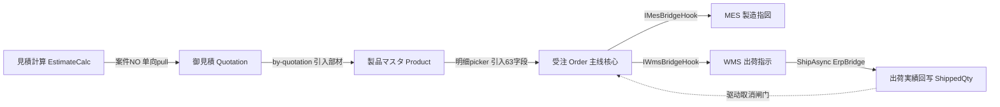

# ERP 販売主线 · 代码级实现手册

> **这是什么**：把 ERP 販売（销售）主线的**每个页面功能**，从前端点击一路追到后端落库、再到跨模块联动，**逐文件、逐行、带真实代码片段和错误码**地讲清楚。
>
> **和 `docs/CODEMAP.md` 的关系**：`CODEMAP.md` 是**地图**（鸟瞰：有哪些模块、怎么分层、一个请求大致怎么走）；**本手册是放大镜**（落到一个功能的真实源码行）。先看地图建立心智模型，再用本手册逐页深挖。
>
> **覆盖范围**：販売主线 `見積計算 → 御見積 → 製品マスタ → 受注 → 出荷実績回写`，外加主数据锚点 `取引先`。其它模块（MES/WMS/财务/采购…）按同一模板后续扩展。
>
> **准确性说明**：所有 `文件:行号` 与代码片段均由勘察实测于 **2026-06-22 仓库快照**。行号会随代码改动漂移，**逐字代码片段是更稳的锚点**——按片段在文件里搜，比按行号定位更可靠。

---

## 📖 目录（按页面功能）

| # | 功能 | 画面ID | 文件 | 看点 |
|---|---|---|---|---|
| 1 | 取引先マスタ BusinessPartner | PA110/120 | [`01-取引先-businesspartner.md`](01-取引先-businesspartner.md) | 最基础 CRUD；**反范例**：不继承泛型基类 |
| 2 | 見積計算書 EstimateCalc | PA010 | [`02-見積計算-estimatecalc.md`](02-見積計算-estimatecalc.md) | 计算引擎在哪、公式怎么算 |
| 3 | 御見積書 Quotation | PA030/040 | [`03-御見積-quotation.md`](03-御見積-quotation.md) | 見積→御見積 的束ね（pull 模型） |
| 4 | 製品マスタ Product | PA050/060 | [`04-製品マスタ-product.md`](04-製品マスタ-product.md) | 5 页向导 + 子表全删全插 + 乐观锁冲突弹窗 |
| 5 | 受注 Order（主线核心） | PA070/080/090 | [`05-受注-order.md`](05-受注-order.md) | 全套动作 + MES/WMS 联动 + 出荷回写 |

> 每个功能文件的结构都一样：**按页面动作（列表/新建/加载/订正/删除/…）各一张卡片**，卡片内分 `页面入口 / 前端实现 / 后端实现 / 校验与错误码 / 数据流`。

---

## 🗺️ 流程图



## §0 公共约定（所有功能共享，先读这一节，后面不再重复）

5 个功能都建立在同一套地基上。这些机制**只在这里讲一次**，各功能文件只讲它自己独有的部分。

### 0.1 一个请求的代码级走法

```
【前端】 XxxView.vue (用户操作)
   → useXxxStore().buildDto()          组装一个聚合 DTO（头+子表）
   → xxxApi.create(dto)                api/erp/xxx.ts
   → http.ts                           axios：自动加 JWT + CSRF 头
   → POST /api/xxx                     { code,message,data } 形状
【后端】 XxxController.Create([FromBody] XxxDto)   Controllers/Erp/
   → IXxxService.CreateAsync(dto, user)           Services/Erp/
   → _db.SaveChangesAsync()                        EFDbContext/CP6Context
   → (受注独有) 触发 I*BridgeHook 跨模块联动
   → return { code:0, data: fresh }
【前端】 http.ts 自动解包出 data → store.loadFromDto(data) → 切到 Edit 模式
```

### 0.2 `http.ts` —— axios 封装（`cp6.web/src/api/http.ts`）

所有 api 方法都经它。要点（5 个 agent 一致实测）：
- **响应拦截器 `return response.data`**（`http.ts:56`）→ 所以 api 方法拿到的直接是后端 `{ code, message, data }` 这一层；判断成功用 `res.code === 0`。
- 请求拦截器自动加 `Authorization: Bearer <token>` 与 CSRF 头。
- **401** → 自动走 refresh，失败跳登录。
- **409（乐观锁冲突）故意不弹 toast**（`http.ts:82-84`）——留给业务层的冲突处理器弹专用对话框（见 §0.5）。

### 0.3 实体基类链 + 审计/租户/软删/乐观锁

业务实体（`Order`/`ProductMaster`/`Quotation`/`EstimateCalc`/`BusinessPartner`…）统一继承这条链：

```
BaseEntity            Id(Guid PK) + Creator/CreateDate/Modifier/ModifyDate   ← 审计
  └ BaseTenantEntity  + TenantId                                              ← 多租户行级隔离（SaveChanges 自动盖章）
      └ BaseBizEntity + IsDeleted(软删) + [Timestamp] RowVersion(乐观锁)      ← 99% 业务实体在这一层
```
（`CP6.Entity/BaseEntity.cs` / `BaseTenantEntity.cs` / `BaseBizEntity.cs`）

- **业务主键是字符串编号**（`WebOrderNo`/`ProductCd`/`QtnNo`/`QtnCalcNo`/`BpCd`），不是 `Id`。`Id`(Guid) 只是物理 PK。
- **软删除**：业务"删除"= `IsDeleted=true`，不物理删。查询统一 `.Where(x => !x.IsDeleted)` 起手。

### 0.4 采番 `DocNumber.NextAsync(db, code)`（`CP6.Core/Services/Common/DocNumber.cs`）

所有单据号统一采番：格式 `{机能code}{yyyyMM}{自增4位}` = 13 桁。主线用到的前缀：

| 前缀 | 单据 | 例 |
|---|---|---|
| `EMC` | 見積計算書 | `EMC2026060001`（再 +`-01` 枝番） |
| `QTN` | 御見積書 | `QTN2026060001-01` |
| `PRD` | 製品（品目CD） | `PRD2026060001`（再拼枝番1=行号、枝番2/3=`MCNULLVAL`） |
| `ORD` | 受注 | `ORD2026060001` |

### 0.5 乐观锁全链路（5 个功能完全一致的模式，务必理解一次）

并发覆盖保护，前后端一条线：

```
读  GetByXxx → entity.RowVersion(byte[]) → DTO.RowVersion(Base64 下传) → store 存住
写  store.buildDto() 把 rowVersion 原样回送 → PUT/DELETE body
后端 _db.Entry(entity).Property(x => x.RowVersion).OriginalValue = dto.RowVersion;
     await _db.SaveChangesAsync();   // EF 生成 UPDATE ... WHERE RowVersion=@original
     受影响行=0 → 抛 DbUpdateConcurrencyException
Ctrl catch → HTTP 409 { code:409, msgId:"MSG-W10002", message:本地化文案 }
前端 useConflictHandler / useProductConflictHandler 识别 409 →
     ElMessageBox「最新版を取得」→ 确认后重新 getByXxx 拉回最新 rowVersion → 强制重编辑
```
（冲突处理器：`cp6.web/src/composables/useConflictHandler.ts`，製品专用版 `useProductConflictHandler.ts`）

### 0.6 操作种别状态机 + 字段控制

编辑页顶部有「操作种别」单选：**新規 / 訂正(Edit) / 流用(Copy) / 照会(View) / 削除(Delete)**。它驱动：
- 字段可编辑性（`useFieldControl.ts` 的 E可编辑/RO只读/D禁用/R必填 矩阵）；
- 按钮显隐（保存/删除/确定…）；
- 加载后通常自动切到 `Edit`。

### 0.7 泛型基类 `ServiceBase<T>` / `RepositoryBase<T>` —— 用与不用

`CP6.Core/BaseProvider/` 提供按 **Guid 主键**设计的泛型 CRUD 基类。但**販売主线的复杂主数据大多不继承它们**，而是「直注 `CP6Context` + 手工 DTO 映射」——因为它们的业务键是字符串编号（`BpCd`/`ProductCd`…）、且有多子表/状态机/采番等复杂逻辑，泛型基类反而不合身（详见取引先文件的说明）。**别拿泛型基类当所有 Service 的模板**。

### 0.8 错误码体系（混合现实，照实记录，别被误导）

主线里错误码**不是统一前缀**，而是历史分层叠加的多套体系。grep 实证如下：

| 体系 | 形如 | 用在哪 | 例 |
|---|---|---|---|
| **E10xxx**（5 位数字）| `E10022` | 取引先、受注列表/単価订正 | E10008无结果 / E10009明细空 / E10013件数上限 / E10022必填 / E10031格式 / E10034乐观锁 / E10036 FROM≤TO / E10107复制上限 |
| **MSG-xxx** | `MSG-111` | 見積計算校验、御見積 | MSG-111~129 必填 / MSG-W10010~12 业务校验 / MSG-002/003/008/009/102/004 御見積 |
| **MSG-W10002** | `MSG-W10002` | **全功能通用**：乐观锁 409 | 唯一跨功能统一码 |
| **PA-MSG-CANCEL-xxx** | `PA-MSG-CANCEL-001` | 受注取消状态机 | 001已取消/002出荷済/003有出荷实绩/404不存在 |
| **平文日文异常**（无码）| `"得意先 CD は必須です。"` | 受注 CreateAsync 入力校验 | Controller catch→400 |

> ⚠️ **三个坑（agent 实测）**：
> 1. `E-PA-xxx` 这种前缀**全主线未发现**（我最初问你时预览里的 `E-PA-001` 是占位示例，真码不是这样——所以才让 agent 去 grep 真码）。
> 2. 製品的 `E10007/W20011/W20016`、取引先的 `MSG-018` **只存在于前端注释**，不是真正的 i18n 词条键。
> 3. 同一个"乐观锁"在不同功能文案码可能写成 `MSG-W10002` 或 `W10002` 或 `E10034`，但语义一致（409 并发冲突）。

---

## §1 主链：見積 → 御見積 → 製品 → 受注 → 出荷回写（功能怎么串起来）

这 5 个功能不是孤立的，它们是一条业务流水线。下面是**功能之间真实的数据接力**（每一跳都标了真实代码点）：

```
①見積計算 EstimateCalc                                  ②御見積 Quotation
  T_EstimateCalc (QtnCalcNo)                              T_Quotation + T_QuotationCalc(指针) + T_QuotationDetail(快照)
  CalculateAsync 算出 ConfirmedUnitPrice/DecidedQty  ──①→②──  按 customerCd+案件NO pull 候选
        │  (EstimateCalcService 0 引用 Quotation,单向)         勾「使用✓」复制展示字段到 QuotationDetail
        │                                                      確定登録要求 QtnDiv="20"(決定見積)
        ▼
③製品マスタ Product                                      ④受注 Order
  T_ProductMaster + 4子表(工程/材料/ロット単価/連産品)     T_Order + 4子表(明细/工程/工程备考/材料)
  by-quotation 从 QuotationDetail 引入部材  ──②→③         明细 picker 引入 ProductMaster 63 字段  ──③→④
        │                                                      CreateAsync 后触发：
        │                                                        IMesBridgeHook → 製造指図 WorkOrder
        │                                                        IWmsBridgeHook → 出荷指示 OutboundOrder
        ▼                                                            │
   共享计算内核 MaterialUsageCalculator                              ▼
   (見積 与 MRP 共用 CalcDimensional)                       ⑤出荷実績回写 ErpBridgeHook
                                                            WMS OutboundService.ShipAsync 出荷確定
                                                              → OnShipmentConfirmedAsync 按製品CD充当
                                                              → OrderDetail.ShippedQty/ShipStatus 回写
                                                              → 这个 ShipStatus 又驱动受注取消的状态机闸门
```

**关键连接键**：
- `EstimateCalc.QtnCalcNo` —— 御見積中间表 `T_QuotationCalc` 只存这个指针，展示内容每次 JOIN `T_EstimateCalc` 实时回填。
- `Order.WebOrderNo` —— 全系统的跨模块追踪键（MES `WorkOrder.WebOrderNo`、WMS `OutboundOrder.WebOrderNo` 都靠它回指受注）。
- `ProductMaster.ProductCd` —— 受注明细引入製品的键。
- `OutboundOrder.OutboundNo` + 製品CD —— 出荷回写时把 `ShippedQty` 充当回 `OrderDetail`。

**跨模块联动的两条铁律**（主线只用得到第一条，但要知道）：
1. ERP↔MES↔WMS 走 **`I*BridgeHook` 事件**（best-effort、幂等、`*Bridge:Enabled` 可禁用、`IntegrationEvent` 持久化+重试）。受注 Create 触发 MES/WMS，出荷确定触发回 ERP，取消触发反向级联。
2. 关停任一 Hook（`appsettings` 配 `Enabled=false`）→ DI 注入对应 `NoOp*BridgeHook`，全 hook 回 Skipped，主流程不受影响。

---

## §2 怎么用这份手册学

| 你想… | 看哪 |
|---|---|
| 先看懂"一个最简单的 CRUD 全栈怎么写" | 文件 1 取引先（注意它是反范例，不用泛型基类） |
| 搞懂"计算/业务公式落在哪一层" | 文件 2 見積計算（计算只在后端 `CalculateAsync`） |
| 学"主从表（头+多子表）一次提交" | 文件 4 製品 或 文件 5 受注（buildDto → 子表全删全插） |
| 学"乐观锁并发冲突前后端怎么配合" | §0.5 + 文件 4 製品（有专用冲突弹窗） |
| 看懂"一个功能怎么触发别的模块" | 文件 5 受注的「跨模块联动专讲」+「出荷回写专讲」 |
| 照着加一个**新的 ERP 功能** | 任选一个最像的功能文件当模板抄；公共部分照 §0 |

---

*生成于 2026-06-22。基于 5 个并行勘察 agent 对真实源码的逐行核对。下一步可按同一模板扩展 MES/WMS/财务/采购模块。*
