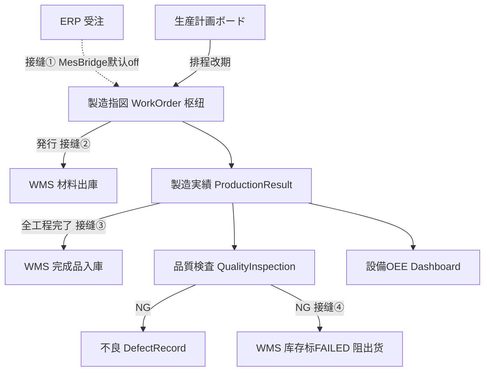

# MES 製造執行 · 代码级实现手册

> **这是什么**：把 MES（製造執行）的**每个页面功能**，从前端到后端逐文件、逐行、带真实代码片段和错误码地讲清楚。与 [`docs/codemap-erp/`](../codemap-erp/README.md) 同一套模板，是 [`docs/CODEMAP.md`](../CODEMAP.md) 地图的"放大镜"续篇。
>
> **公共机制不重复**：`http.ts`、实体基类链（`BaseEntity→BaseTenantEntity→BaseBizEntity`）、`{code,message,data}` 形状、乐观锁全链路、软删除——这些在 [`codemap-erp/README.md` §0](../codemap-erp/README.md) 已讲过，本册只讲 MES **不一样的地方**。
>
> **准确性说明**：所有 `文件:行号` 与代码片段实测于 2026-06-22 仓库快照；逐字代码片段是比行号更稳的锚点。

---

## 📖 目录（按页面功能）

| # | 功能 | 画面ID | 文件 | 看点 |
|---|---|---|---|---|
| 1 | 製造指図 WorkOrder（**枢纽**） | ME020/030 | [`01-製造指図-workorder.md`](01-製造指図-workorder.md) | 受注展开 + 発行→WMS 材料出庫 两接缝 |
| 2 | 製造実績 ProductionResult | ME040/050 | [`02-製造実績-productionresult.md`](02-製造実績-productionresult.md) | append-only 流水 + 全工程完了→WMS 完成品入庫 |
| 3 | 品質検査+不良 QualityInspection/Defect | ME060/070/080 | [`03-品質検査-不良.md`](03-品質検査-不良.md) | QC NG → 建不良 + 标库存 FAILED → Phase7 阻止出货 |
| 4 | 設備+OEE Machine/Oee | Phase4 | [`04-設備-oee.md`](04-設備-oee.md) | OEE 三率公式 + 两后台 Worker + SignalR 实时 |
| 5 | 計画板+主数据+分析 | ME010/A2/ME090 | [`05-計画板-主数据-分析.md`](05-計画板-主数据-分析.md) | 甘特改期 / 工时×费率 / 达成率 / Dashboard(EF+SP) |

---

## 🗺️ 流程图



## §0 MES 特有约定（先读这节）

### 0.1 MES 主链：生産計画 → 製造指図 → 製造実績 → 品質 →（設備/OEE 分析）

MES 是 ERP→MES→WMS 闭环的中段。製造指図 `WorkOrder` 是枢纽：上游受注经 Bridge Hook 自动展开成它，它的发行/完了又触发 WMS。

```
【ERP】受注 Order.CreateAsync
   └─(MesBridge:Enabled=true)→ IMesBridgeHook.OnOrderCreatedAsync
        └→ WorkOrderService.ExpandFromOrderAsync        ← 接缝① 受注明细 → 製造指図(+工程+材料,按PA050 BOM/路由)
①生産計画ボード PlanningBoard ──排程/改期──► ②製造指図 WorkOrder
                                                │  发行 IssueAsync
                                                │   └→ IWmsBridgeHook.OnWorkOrderIssuedAsync ← 接缝② → WMS 材料出庫指示
                                                ▼
                                          ③製造実績 ProductionResult（按工程 開始/中断/完了/数量報告）
                                                │  全工程完了
                                                │   └→ IWmsBridgeHook.OnProductionCompletedAsync ← 接缝③ → WMS 完成品入庫
                                                ▼
                                          ④品質検査 QualityInspection
                                                │  判 NG
                                                │   ├→ 自动建 DefectRecord 不良
                                                │   └→ StockQcService.MarkLinkedStockByWorkOrder(FAILED) ← 接缝④ → WMS 出库引当排除(Phase7)
                                                ▼
                                          ⑤設備/OEE · Dashboard（消费 实绩/停机/不良 做分析）
```

**四个跨模块接缝**（全部 best-effort + `IntegrationEvent` 持久化审计，Hook 内 try/catch 吞错绝不让父操作回滚）：

| 接缝 | 触发 | 目标 | 开关 |
|---|---|---|---|
| ① 受注→指図 | `Order.CreateAsync` 后 | `ExpandFromOrderAsync` 展开製造指図 | `MesBridge:Enabled`（**默认 false**，需手动展开或开启） |
| ② 指図発行→材料出庫 | `WorkOrder.IssueAsync` 后 | WMS `CreateFromWorkOrderAsync` 生成材料出庫指示(类型=Material,仓 W01) | `WmsBridge:Enabled`（默认 true） |
| ③ 全工程完了→完成品入庫 | `ProductionResult` 完了判定 | WMS `CreateFinishedGoodsFromWorkOrderAsync`（用累计良品 `wo.CompletedQty`，入完成品仓） | `WmsBridge:Enabled` |
| ④ QC NG→阻止出货 | `QualityInspection.CreateAsync` 判 NG | `StockQcService` 把关联库存标 `FAILED`，WMS 出库引当 `FindCandidateStockAsync` 用 `QcStatus != FAILED` 排除 | （无独立开关，`IStockQcService` 可选注入） |

> 接缝①②③ 的对端实现详见 WMS 篇；本册讲 MES 侧的触发点。

### 0.2 三表一体 + 子表全删全插

製造指図/品質等都是「头 + N 子表」一次事务写入。**更新时子表走"全删除→全插入"**（`RemoveRange(old)` 后 `foreach Add`），不做行级 diff（源码注释明示「複雑な diff は Phase 3 以降で最適化」）。

### 0.3 ⚠️ 采番：注释与实现不符（重要）

`MesSequenceService.NextAsync(key)` 实际产出 **`{key}{yyyyMM}{NNNN}`**（月级、无日、无连字符，如 `WO2026060001`），**全期间累计永不重置**。但多处实体注释写的是 `WOYYYYMMDD-NNNN`（带日带连字符）——**注释是错的，以实现为准**。主线前缀：`WO`(指図) `PR`(实绩) `DT`(停机) `QC`(检查) `DF`(不良)。

### 0.4 乐观锁：MES 大多**不做**并发检测（与 ERP 不同）

ERP 主线的 Update 普遍盖 `RowVersion.OriginalValue` 做乐观锁；**MES 的 `WorkOrderService.UpdateAsync` 未读/校验 `RowVersion`**（子表全删全插），乐观锁仅在 `DeleteAsync` 用到（`if(rowVersion!=null) wo.RowVersion=rowVersion`）。这是实现现状，记住别误以为 MES 更新有并发保护。

### 0.5 ⚠️ 错误码体系（ME-MSG-xxx，但 i18n 大量缺口）

MES 用 `ME-MSG-NNN` 字符串码（Service 直接 `throw new InvalidOperationException("ME-MSG-xxx")`，Controller catch→400/404）。**坑点（全 agent grep 实证）**：

| 现象 | 实情 |
|---|---|
| 有 i18n 词条的 | `ME-MSG-001/002/003/004/006/007/011/012/014/020/021/022/023/030/031/041`（`I18nMesScreenSeed.cs`） |
| **无 i18n 词条**（前端裸码显示） | `ME-MSG-005/040/042/043`、`ME-MSG-CANCEL-001` |
| **码被复用、与原义不符** | 設備校验复用 `ME-MSG-001`（原义"手配/製品CD未入力"）、`ME-MSG-031`（原义"不良内容未入力"） |
| A2 主数据另一套 | `E-A2-WC-001/003`、`E-A2-RATE-001/003/004`、成本侧 `E-A2-RATE-002`/`W-A2-COST-001` |
| 取消状态机 | `ME-MSG-CANCEL-001`（着手済不可取消，仅源码无 i18n） |

> 和 ERP 一样：**错误码不是统一前缀**，需逐功能看。MES 主体是 `ME-MSG-NNN`，A2 主数据是 `E-A2-xxx`。

### 0.6 实时与后台（MES 特有基建）

- **SignalR**：`/hubs/mes`（`MesHub`），`IMesNotifier`→`SignalRMesNotifier` 推送 `ProductionReported`/`DefectIssued`/`MachineStatusChanged`/`WorkOrderStatusChanged`/`DowntimeRegistered`。前端 `utils/mesHub.ts` 单例连接，ControlTower/Dashboard 订阅。依赖逆转：Core 只依赖 `IMesNotifier` 接口，SignalR 实现在 WebApi 层（测试用 `NoOpMesNotifier`）。
- **两个后台 Worker**（均经 `TenantScopeRunner` 逐租户隔离）：`OeeCalculationService`（每 5 分钟重算 OEE 落 `T_OeeDaily`，跨日补前日，**不推 SignalR**）、`MachineStatusMonitor`（每 30 秒扫空闲设备[10 分无实绩]→自动停机→**推 SignalR**）。
- **Dashboard 双版本**：EF 聚合版（前端默认用）+ Dapper/存储过程性能版（`/sp` 端点，配覆盖索引，前端未接入，是性能样板）。

---

## §1 状态机速查（製造指図 WorkOrder.Status）

贯穿整个 MES 的核心状态（`WorkOrder.cs:89-118` `WorkOrderStatus`）：

| 值 | 状态 | 触发 |
|---|---|---|
| 0 | 下書き | 手动新建 |
| 1 | 確定済 | 受注展开直后 / 确定 |
| 2 | 発行済 | `IssueAsync`（→ 触发 WMS 材料出庫） |
| 3 | 着手中 | `ProductionResult` 開始 |
| 4 | 完了 | 全工程完了（→ 触发 WMS 完成品入庫） |
| 5 | 中断中 | 工程中断 |
| 6 | 検査済 | 品質検査全合格 |
| 9 | 取消 | 受注取消级联（`IsCancellable` 仅 0/1/2 可取消，着手 ≥3 不可） |

> 可编辑/可删除/可发行：仅 `Status∈{0,1}`（Service 层硬校验，否则抛 `ME-MSG-042`）。

---

*生成于 2026-06-22。基于 5 个并行勘察 agent 对真实源码的逐行核对。续 [`codemap-erp/`](../codemap-erp/README.md)，下一份 WMS。*
