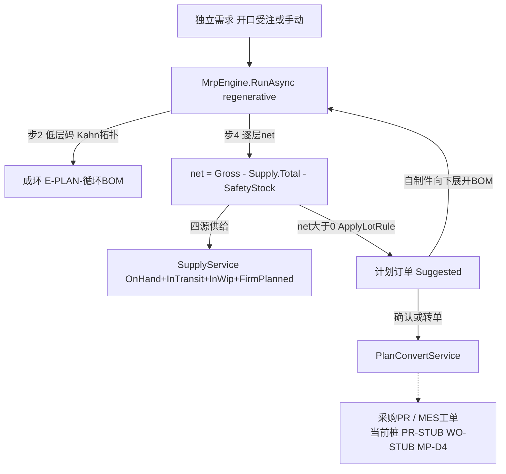

# Plan 计划中台 · 代码级实现手册

> 与 [`codemap-erp`](../codemap-erp/README.md)/[`mes`](../codemap-mes/README.md)/[`wms`](../codemap-wms/README.md) 同模板；公共机制见 [`codemap-erp/README.md` §0](../codemap-erp/README.md)。是 [`CODEMAP.md`](../CODEMAP.md) 的放大镜续篇。

## 📖 目录
| # | 功能 | 文件 | 看点 |
|---|---|---|---|
| 1 | 物料计划策略 + MRP 引擎 | [`01-mrp.md`](01-mrp.md) | 低层码 + 净需求 + 批量定批 + 转单(桩) |

## 🗺️ 流程图



## §0 Plan 特有约定

- **MRP = regenerative 全量复算**（MP-D5）：每次运算把"建议态"计划订单作废重生，"确认/转单"态保留并计入供给。
- **采番** `DocNumber.NextAsync(_db, "MRP")` → 运算批次 `Plan_MrpRun`。
- **错误码** `E-PLAN-xxx`（中文短语码，如 `E-PLAN-无需求`/`E-PLAN-循环BOM`/`E-PLAN-状态非法`）。⚠️ `MP-D1~D6` 是**设计决策编号**（计划文档），**不是代码错误码**。
- **跨模块复用**：用量内核 `IMaterialUsageCalculator`（`CalcDimensional`/`CalcFixed`）与 ERP 見積 `EstimateCalcService` 共用同一公式（见 [codemap-erp 見積篇](../codemap-erp/02-見積計算-estimatecalc.md)）。
- ⚠️ **转单是桩**（MP-D4）：`PlanConvertService.ConvertAsync` 经 DI 注入的 `PlanToPrServiceStub`/`PlanToWorkOrderServiceStub` 返回 `PR-STUB-{ItemCd}`/`WO-STUB-{ItemCd}`，**不实建 PR/工单**；采购/MES 真实落地后经 DI 替换实现即可，无需改引擎。

## §1 MRP 数据流
```
独立需求(开口受注/手动) → MrpEngine.RunAsync
  ├ 步0 采番 Plan_MrpRun(Running)
  ├ 步1 作废旧"建议态"计划订单+Pegging(确认/转单态保留)
  ├ 步2 载 BOM → LowLevelCodeService 算低层码(Kahn拓扑,成环→E-PLAN-循环BOM)
  ├ 步3 独立需求 → 成品毛需求累加器
  ├ 步4 按低层码 0→N 逐层 net：
  │     net = Gross - Supply.Total - SafetyStock (下限0)
  │     Supply.Total = OnHand+InTransit+InWip+FirmPlanned (SupplyService 四源)
  │     net>0 → ApplyLotRule 定批 → Plan_PlannedOrder(Suggested) + releaseDate=bucket-leadDays
  │     自制件向下展开 BOM(ComputeUsage,纸箱尺寸料用 CalcDimensional)→子料毛需求汇入更低层
  ├ 步5 落 Plan_Pegging(钉住溯源) + Plan_NetRequirement(留痕供钻取)
  └ Status=Completed
看板确认/转单/忽略 → PlanConvertService → (转单)IPlanToPr/WorkOrderService 桩 → 回填 ConvertedDocNo
```

*生成于 2026-06-22，基于真实源码逐行核对。*
