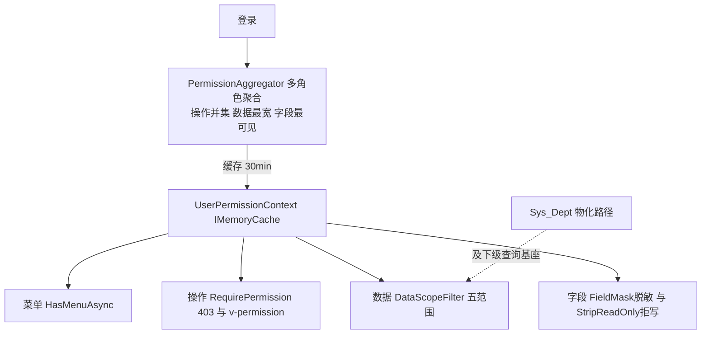

# Pub 权限平台 / 公共 · 代码级实现手册

> 同模板；公共机制见 [`codemap-erp/README.md` §0](../codemap-erp/README.md)。是 [`CODEMAP.md`](../CODEMAP.md) 的放大镜续篇。

## 📖 目录
| # | 功能 | 文件 | 看点 |
|---|---|---|---|
| 1 | 权限四粒度 + 组织 + 公共模组 | [`01-权限平台.md`](01-权限平台.md) | 菜单/操作/数据/字段四粒度强校验 + 部门树 + 采番/附件/代码生成/Excel |

## 🗺️ 流程图



## §0 Pub 特有约定

- **四粒度强校验三大落点**：菜单(`Sys_Menu`树→`HasMenuAsync`)、操作(`[RequirePermission]`→403 + `v-permission` UX)、数据(`DataScopeFilter` 注入 Where)、字段(`[FieldMask]` 脱敏 + `StripReadOnly` 拒写)。
- **登录时一次性聚合**：`PermissionAggregator.BuildAsync` 把多角色合并为 `UserPermissionContext`（**操作并集 / 数据最宽MAX / 字段最可见MIN**——两者方向相反，易错点），缓存于 `IMemoryCache`(30min 滑动)，三强校验点零额外查库。角色/用户变更经 `InvalidateByRole`/`Invalidate` 失效。
- **错误码** `E-PUB-xxx`（grep 实证仅此一族，无 `E-SYS-`/裸 `PUB-`）；`E-PUB-404`=用户/附件不存在。
- ⚠️ **手写控制器全只用 `[Authorize]`**（RolePerm/Dept/Seq/CodeGen/Attachment/Menu），操作强校验 `[RequirePermission]` **仅由 CodeGen 产出的 `BaseCrudController` 子类承载**。
- **CodeGen 产物开箱装四粒度**：Entity 实现 `IDataScoped`、Service 继承 `BaseCrudService`、Controller 贴 `[FieldMask]`+`[RequirePermission]`。`BaseCrudService` 把数据范围/字段拒写/采番固化进 CRUD。

## §1 四粒度落点速查
```
菜单：Sys_RoleMenu→ctx.MenuKeys  → PermissionService.HasMenuAsync（仅附件下载鉴权实际调用）
操作：Sys_RoleAction→ctx.ActionKeys("menuKey:action") → [RequirePermission]→403 / v-permission UX
数据：Sys_RoleDataScope+DataScopeRegistry → DataScopeFilter.Apply (5范围:1本人Creator/2本部门DeptId/3及下级Path前缀/4自定义/5全部) → BaseCrudService.QueryAsync 自动注入
字段：Sys_RoleFieldPerm+FieldRegistry(Access 1可读写/2只读/3隐藏) → [FieldMask]掩码隐藏 + StripReadOnly拒写(≥2)
组织：Sys_Dept 物化路径 /{root}/.../{self}/ → 数据范围3"及下级"的查询基座（耦合接缝）
```

*生成于 2026-06-22，基于真实源码逐行核对。*
