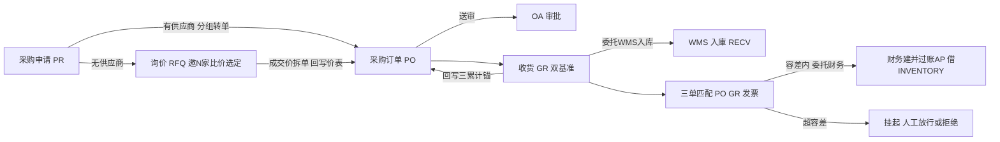

# Pur 采购 · 代码级实现手册

> 同模板；公共机制见 [`codemap-erp/README.md` §0](../codemap-erp/README.md)。是 [`CODEMAP.md`](../CODEMAP.md) 的放大镜续篇。

## 📖 目录
| # | 功能 | 文件 | 看点 |
|---|---|---|---|
| 1 | 主数据 + PO + 收货 + 三单匹配 | [`01-主数据-PO-收货-匹配.md`](01-主数据-PO-收货-匹配.md) | 三累计锚 + 三接缝全接真实(WMS入库/财务建应付/OA送审) |
| 2 | 申请 + 询价 + 外注 + 对账 | [`02-申请-询价-外注-对账.md`](02-申请-询价-外注-对账.md) | PR需求驱动/PR→PO分组转单/外注委托WMS出料+财务入成本/堵三漏 |

## 🗺️ 流程图



## §0 Pur 特有约定

- **三累计锚**：`PurchaseOrderLine.ReceivedQty/AcceptedQty/InvoicedQty` 是全链共同锚——GR 写 Received(+着荷 Accepted)、QC 写 Accepted、匹配写 Invoiced；**PO 状态全部由 `DeriveStatus` 从锚投影**(非手工)。`可开票量 = AcceptedQty - InvoicedQty` 是匹配硬约束。
- **跨模块委托走适配器(Contracts)**：GR→`WmsReceiveServiceAdapter`(委托 WMS `IInboundService` 真实入库,落 RECV 暂存位)、匹配→`FinApServiceAdapter`(委托财务 `IFinAp` 建**并过账**应付,借方 GL 角色 `INVENTORY`)、外注出料→`WmsIssueServiceAdapter`(委托 `IStockMovementService` OUT,`RelatedType=SUBCONTRACT`)、外注成本→`FinCostServiceAdapter`(委托 `IAutoVoucherEngine`,借FG贷INVENTORY)、送审→`ApprovalServiceAdapter`(委托 OA `Wf.IApprovalService`,无绑定兜底直通)。
- **错误码** `E-PUR-xxx`（连续段 011~080，grep 实证；无 `PUR-` 无连字符形态）。外注库存不足被适配器本地化为 `E-PUR-080`。
- ⚠️ **`Program.cs:178-182` 有一段过时注释**声称几个适配器为 Stub，与 `:163-168` 实际 `AddScoped` 注册的真实适配器矛盾——**以注册为准**（与记忆"采购跨模块委托全接真实零桩"一致）。桩类仍在仓库供单测，未在主链注册。
- ⚠️ **PR 需求驱动生成无触发缝**：`PrGenerationService`(缺料反流/工单BOM缺料)落码完整但无 Controller 端点、无生产调用方(仅 DI+单测)——已知遗留(工单BOM缺料驱动PR待MES数据)。

## §1 采购主链
```
①PR 采购申请(手工/需求驱动) ──批准──► PR→PO 按建议供应商分组拆单
   无建议供应商的行 ──► ②RFQ 询价(邀N家→收报价矩阵→比价rank→选定→回写价表Source=rfq→成交价拆PO)
③PO 采购订单(带价:手填>阶梯价解析,无价挡单 / 派生状态机 / 送审→OA)
   └──► ④GR 双基准收货(着荷/检收) ──委托WMS真实入库──► 回写PO三累计锚 ReceivedQty(+Accepted)
        检收基准 ──apply-qc──► 委托WMS查QcInspection ──► 累加 AcceptedQty
   └──► ⑤三单匹配(PO↔GR↔发票,容差判定) ──容差内委托财务建应付(借INVENTORY)──► 累加 InvoicedQty → PO派生Closed
                                          超容差/财务失败 → Suspended → 人工release(建AP)/reject
⑥外注(PO Type=2):发支給材委托WMS OUT(SUBCONTRACT) → 收成品成本=加工费+支給材成本委托财务(借FG贷INVENTORY)
⑦采购对账(只读诊断):堵三漏 虚开(Invoiced>Accepted)/超收(Received>Qty)/外协吞料(IssuedQty>应耗)
```

*生成于 2026-06-22，基于真实源码逐行核对。*
