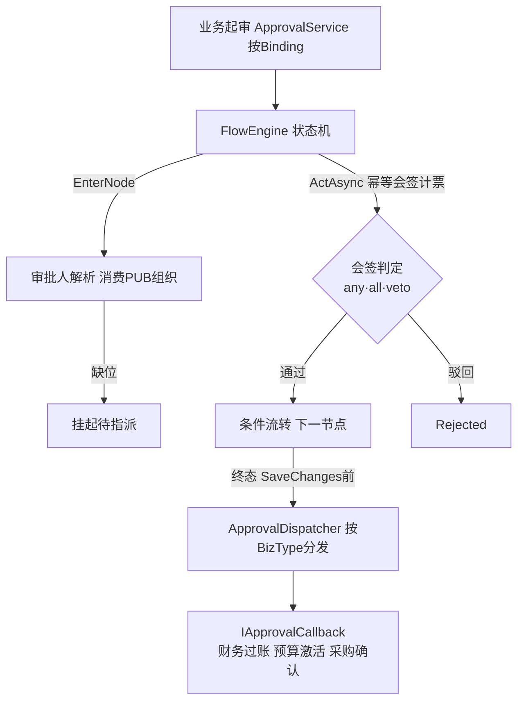

# Wf OA审批引擎 · 代码级实现手册

> 与 [`codemap-erp`](../codemap-erp/README.md) 等同模板；公共机制见 [`codemap-erp/README.md` §0](../codemap-erp/README.md)。是 [`CODEMAP.md`](../CODEMAP.md) 的放大镜续篇。

## 📖 目录
| # | 功能 | 文件 | 看点 |
|---|---|---|---|
| 1 | 审批引擎全栈 | [`01-审批引擎.md`](01-审批引擎.md) | 流程引擎状态机 + 业务终态回调接缝 + 高级流程 + 审批人解析消费PUB |

## 🗺️ 流程图



## §0 Wf 特有约定

- **编译期单向 + 运行时多态**：OA **不引用任何业务模块**；业务模块实现 `IApprovalCallback` 注册 DI，OA 走到终态由 `ApprovalDispatcher` 按 `BizType` 运行时多态直调（财务凭证/预算/采购PO/PR 四回调）。
- **原子性铁律**（OA2-D5）：回调与引擎**共享同一 scoped DbContext**，分发在引擎最终 `SaveChanges` **之前**调用；回调抛异常 → 流程终态与业务变更**一并回滚**——绝不"OA 已通过、业务没落地"。
- ⚠️ **无结构化错误码**：Wf 服务层**未定义任何 `E-WF`/`WF-`/`OA-` 前缀码**（grep 实证），校验失败一律 `throw new InvalidOperationException(中文消息)` → Controller 翻成 `{code:400, message}`。`OA-D*` 仅是注释里的设计决策编号。
- **求值器统一**：流程条件边 + 表单规则后端复算共用一份 `ExpressionEvaluator`（手写递归下降，**绝不 eval 任意代码**，防 schema 注入，任何错误安全失败）。前端 `ruleEngine.ts` 同语义。

## §1 状态机 + 接缝全景
```
ApprovalService.SubmitAsync(bizType,bizId,formSnapshot)   ← 业务起审唯一入口(不碰业务表)
  └ 按 Wf_ApprovalBinding(BizType→FlowKey) 起 FlowEngine.SubmitAsync
FlowEngine 状态机：EnterNode(审批人解析→建待办/缺则挂起) → ActAsync(幂等→会签计票→条件流转/驳回)
  └ 终态 DispatchIfFinishedAsync(在最终SaveChanges前) → ApprovalDispatcher.OnInstanceFinished
       └ 按 BizType 找 IApprovalCallback → OnApproved/OnReject (同步直调,业务走自己状态机)
          ├ FinJournalPost → JournalApprovalCallback → PostAsync 过账(幂等+maker-checker)
          ├ A5_Budget      → BudgetApprovalCallback → 激活版本/驳回可重编
          ├ PUR_PO         → PoApprovalCallback → Confirmed/Draft
          └ PUR_PR         → PrApprovalCallback → Approved/Draft
高级流程(仅后端REST,无前端UI)：退回sendback / 加签addsign(前/后) / 委派delegate
超时扫描 WfTimeoutScanWorker(每1min,按租户)：remind软/approve|reject|escalate硬(双幂等)
审批人解析 ApproverResolver(消费PUB)：DirectManager(Sys_User.ManagerId上溯)/DeptLeader(Sys_Dept树)/Role/Specified/Starter
待办推送 IWfNotifier→SignalRWfNotifier(复用 NotifyHub 广播 WfTodoCreated)
```

*生成于 2026-06-22，基于真实源码逐行核对。*
