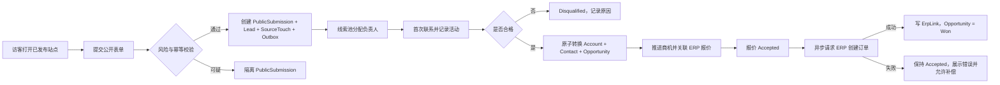

# CP6 CRM 产品框架

状态：Approved implementation-planning baseline；不得据此跳过实施、验收或生产审批

最后核验：2026-08-13（`main == origin/main == c68d9b53b4cf3adb5925b8258c36969fdebda753`）

配套工程规格：[CRM-V1-EXECUTABLE-SPEC.md](./CRM-V1-EXECUTABLE-SPEC.md)

审阅证据：工程/设计审阅计划 `C8574D3...01A08`、QA 测试计划 `1A6995...F281`、采用优先产品设计 `C60FA7...2DF7`。完整 SHA-256 和受控工件位置记录在本任务的项目记忆中；审批结论冻结产品和实施规划，不代表任何业务代码、仓库、云资源、迁移或部署已经完成。

## 1. 产品定位

CP6 CRM 是面向纸箱、包装及相邻离散制造企业的 B2B“获客到 ERP 订单”前台。它不是一个脱离生产系统的通用联系人数据库，也不是营销自动化套件。它把公开官网、人工线索、销售跟进、企业与联系人、商机、ERP 报价和 ERP 订单串成一条可追踪、可审计、按租户隔离的收入链路。

CP6 现有 ERP/MES/WMS 负责报价、订单、生产、库存和履约。CRM 负责订单发生之前的客户意向、关系、协作、来源和商机。双方以明确的数据主权和异步流程连接，避免销售在 CRM 和 ERP 之间重复录入，也避免 CRM 复制法定、财务或交易主数据。

### 1.1 核心价值

| 对象 | 当前痛点 | V1 交付的变化 |
| --- | --- | --- |
| 潜在客户 | 官网咨询后不知道是否被接收、销售响应不稳定 | 提交有幂等回执、风险分流和可测量的首次响应 SLA |
| 销售 | 线索散落在表格、聊天和 ERP 草稿中，来源与跟进断链 | 在一个时间线中分配、协作、跟进、转化和追踪 ERP 结果 |
| 销售经理 | 无法可靠回答线索从哪里来、卡在哪、为什么输 | 固定漏斗、阶段历史、SLA、来源归因和可复算报表 |
| 市场与内容团队 | 官网发布和线索接收割裂，内容变更缺审批边界 | 多语言受控内容、草稿/发布/回滚、表单和来源触点闭环 |
| ERP 运营人员 | 客户、报价、订单请求被重复提交或手工重录 | 通过幂等异步流程创建/关联 Business Partner 和订单 |
| 审计与隐私负责人 | 个人信息、租户范围和关键操作缺少一致证据 | PII 单独授权、24 个月匿名化、不可变审计和跨租户拒绝证据 |

### 1.2 北极星指标

`可追踪 CRM 来源订单金额 = 在 CRM 中存在 Won 商机、有效 ERP Order 关联且保留来源触点的 ERP 订单金额总和`。

该指标只统计已经由 ERP 确认创建的订单。报价被接受、订单请求已发送或人工把商机改成“赢单”都不能计入。

### 1.3 产品原则

1. ERP 是法定、财务和交易主数据权威；CRM 是售前关系、来源和商机权威。
2. Won 是 ERP 订单创建成功的结果，不是销售主观判断。
3. 所有管理端访问先有用户身份和租户；所有公开访问先由 `siteKey` 解析租户。
4. 权限、数据范围、PII 权限分别判断，任何一层失败都不得返回敏感数据。
5. 公开提交、转换、合并和 ERP 请求必须幂等；消息至少一次投递不等于业务至少执行一次。
6. 来源、活动、合并和阶段历史只追加或显式更正，不通过覆盖历史制造“干净漏斗”。
7. V1 使用固定状态机和受控内容区块，先保证可审计闭环，不提供任意流程或任意 HTML。
8. 部署不是成功口径。Pilot、Lead Adoption 和 Full Journey Adoption 均为不可豁免的产品门禁；采用证据未通过时 CRM V1 Epic 保持 blocked。
9. 可用性与正确性优先于功能数量。Lead Pilot 先验证分配、首次响应和两租户隔离，再解锁完整交易旅程、CMS、迁移候选和生产发布。
10. CRM V1 是行业获客与售前工作台，不是 CP6 产品商城或登录后客户产品门户。未来软件目录、订阅、授权和统一产品入口必须按独立 bounded context 立项，不能把各产品业务代码塞进 CRM。

## 2. 用户与角色

### 2.1 用户角色

| 角色 | 主要目标 | 典型范围 |
| --- | --- | --- |
| 公开访客/潜客 | 浏览企业内容并提交咨询 | 无登录，仅能访问已发布站点和启用表单 |
| 内容编辑 | 维护站点、页面、翻译和媒体草稿 | `crm-site:query/edit` |
| 内容发布者 | 发布、回滚、配置站点和表单 | `crm-site:query/edit/publish/configure` |
| 线索协调员 | 审核公开提交、维护线索池、分配、移交、合并 | `crm-lead:query/add/edit/assign/merge/view-pii` |
| 销售代表 | 管理本人或协作范围内的线索、客户和商机 | 线索、企业、商机的 `query/add/edit`，按需 `convert/view-pii` |
| 销售经理 | 管理部门漏斗、重新分配、审批敏感动作 | 三个业务域的完整业务动作和部门数据范围 |
| ERP 协调员 | 核实报价接受、发起订单请求、处理失败补偿 | `crm-opportunity:accept-quote/create-order/query` |
| CRM 管理员 | 配置摄取规则、权限、站点和全租户 CRM 功能 | 已种入的 22 个 CRM 动作，数据范围 5 |
| 隐私/审计人员 | 查询授权范围内的 PII、审计匿名化和关键事件 | 查询 + 必需的 `view-pii`；跨租户审计仍走平台专用权限 |
| 平台运维 | 发布、监控、密钥轮换和故障处置 | 服务身份，不获得业务人员 PII 浏览权限 |

角色是产品模板，不是硬编码角色 ID。租户管理员把已有动作授权给本租户角色；CRM 只消费本地授权投影，不把权限列表塞进 JWT。

### 2.2 固定权限目录

V1 保留 Foundation 已种入的 22 个动作：

| 资源 | 动作 |
| --- | --- |
| `crm-dashboard` | `query` |
| `crm-lead` | `query`, `add`, `edit`, `assign`, `merge`, `convert`, `view-pii` |
| `crm-account` | `query`, `add`, `edit`, `view-pii` |
| `crm-opportunity` | `query`, `add`, `edit`, `accept-quote`, `create-order`, `view-pii` |
| `crm-site` | `query`, `edit`, `publish`, `configure` |

数据范围继续使用：1=本人、2=部门、3=部门及下级、4=自定义、5=全部。`view-pii` 只能解除字段遮罩，不能扩大行级数据范围。

## 3. 获客渠道

### 3.1 V1 渠道

| 渠道 | 入口 | 身份/归因 | 失败处理 |
| --- | --- | --- | --- |
| 营销官网 | 已发布页面中的公开表单 | `siteKey`、表单、首末触点、UTM、Referrer | 限流、蜜罐、幂等、风险隔离；不静默丢失已接受提交 |
| 人工录入 | CRM 管理台 | 当前用户、租户、选填来源说明 | 同步校验重复候选；失败不产生半成品 Lead |

V1 不把广告平台、邮件、电话、展会或伙伴推荐伪装成已集成渠道。人工录入可以选择这些业务来源标签，但不会自动拉取、对账或回写外部系统。

### 3.2 VNext 渠道

- 邮箱/日历同步、电话/短信、展会扫码、伙伴转介。
- 广告平台、社交平台和第三方表单连接器。
- Excel 导入、开放 API、Webhook 和批量回填。
- 客户门户、自定义域名、电子签名和营销自动化。

## 4. 端到端用户旅程

### 4.1 官网访客到 ERP 订单

验收口径：每个 Won 商机必须能追到唯一订单关联、来源触点、转换来源 Lead 和 ERP 成功事件。

### 4.2 人工线索旅程

1. 有 `crm-lead:add` 的用户输入企业、联系人、需求和来源。
2. 系统归一化企业名、邮箱和电话并生成重复候选。
3. 用户仍可保存非确定性重复项；确定性幂等冲突返回已有资源。
4. 线索进入 New 或 Assigned；直接指定负责人时进入 Assigned。
5. 后续状态、转换和 ERP 链路与官网线索一致。

### 4.3 分配、协作和 SLA

1. New Lead 进入配置的 Intake 队列。
2. 协调员或分配策略设置唯一负责人；其他用户只能作为协作人。
3. 默认首次响应 SLA 是 4 个租户业务小时，由公开提交事务冻结的版本化 `BusinessCalendar` 计算。正常提交从 `PublicSubmission.ReceivedAtUtc` 起算；隔离提交释放后仍保留原始 SLA 锚点，释放时已经逾期则立即形成 breach。人工 Lead 从创建时刻起算。夜间、周末和假日不从 Eligible Lead 中排除；非工作时段不累计，跨非工作时段顺延。
4. 第一条客户面对型 Call、Email、Meeting 或 CustomerMessage 活动设置 `FirstResponseAt`；Note 和 System 不算响应。
5. 距 SLA 60 分钟时预警，超时后产生可查询的 breach 指标；通知失败不能回滚业务活动。
6. 移交负责人必须记录原负责人、新负责人、操作者、原因和时间。
7. V1 不提供任意暂停、重启或人工改写 SLA 的 API。隔离、确定性合并和测试数据通过明确规则排除；其余生产 Lead 均保留在测量口径中。

### 4.3A 公开提交审核与恢复

1. 公开提交在 BFF 中生成与浏览器会话、站点、表单、载荷摘要和有效期绑定的稳定 `attemptId`；结果不确定时只使用同一 attempt 重试，不要求访客重新填写或创建第二条 Lead。
2. 正常提交在一个事务内形成 Lead；风险命中进入 `Leads → Intake → Needs Review`，此时仍是 PublicSubmission，不伪装成 Lead。
3. 有现有 Lead 权限且满足 Intake/部门数据范围的协调员可以查看、释放或驳回；释放原子创建唯一 Lead，驳回和审核到期随后按策略匿名化 PII。
4. 线索负责人 30 分钟分配指标从释放并成为 Eligible Lead 起算；首次响应 SLA 继续从访客原始 `ReceivedAtUtc` 起算。隔离时长、最老积压、释放、驳回和到期必须独立报告，不能用长期隔离美化采用指标。
5. CRM 数据库不可用时，同源 BFF 只可写入受控、加密、不可人工改写且有 TTL/容量上限的应急 Spool；恢复后用原 attempt 幂等导入并做 100% 计数/哈希对账。Spool 不成为 CRM 或 ERP 权威。

### 4.4 重复候选与合并

1. 公司标准名、标准化邮箱和标准化电话产生带原因与置信度的候选。
2. 合并不是自动动作。用户必须有 `crm-lead:merge`，能访问源与目标，且两者属于同一租户。
3. 源 Lead 进入 Merged 并指向目标；不得删除源记录、来源触点、活动或审计。
4. 目标时间线聚合展示合并来源，报表按目标 Lead 去重但保留来源贡献。
5. 已 Converted、Disqualified 或 Merged 的 Lead 不允许作为源再次合并；已 Converted 的目标也不允许接收合并。

### 4.5 Lead 转换

1. 只有 Qualified Lead 可转换。
2. 用户选择“创建或关联”Account 和 Contact；跨租户 ID 一律按不存在处理。
3. 系统在一个事务内创建/关联 Account、Contact、Opportunity，更新 Lead 为 Converted，记录 StageHistory 和 Outbox。
4. 同一 Lead 只能产生一个 Opportunity；重复请求返回第一次转换结果。
5. 转换不直接创建 ERP Business Partner。需要时由异步 IntegrationProcess 请求创建或关联。

### 4.6 商机与 ERP

1. 销售依序推进 Qualification、NeedsAnalysis、Proposal、Negotiation。
2. 登记 Accepted 时必须提供已被 ERP 或授权流程确认的报价编号。
3. Accepted 后，有 `create-order` 的用户显式发起订单请求。
4. CRM 写 IntegrationProcess 与 Outbox 后立即返回 202；页面显示处理中，不阻塞等待 ERP。
5. ERP 成功回执写入订单 ErpLink 并把商机转为 Won；失败回执保留 Accepted 和可操作的失败原因。
6. 重试、回放或重复回执不得创建第二张 ERP 订单。

### 4.7 内容发布旅程

1. 编辑创建页面修订和多语言翻译，仅使用受控 `BodyJson` 区块。
2. 预览使用短期、一次用途或可撤销的预览令牌，不把草稿暴露给公开路由。
3. 发布者执行发布，系统原子更新 PublishedRevision、记录审计并发出 `site.published` 事件。
4. Next.js 消费事件并按站点/页面缓存标签重验证。
5. 回滚是把一个历史修订重新发布成新的发布动作，不篡改旧修订。
6. CMS 只允许固定页面模板、命名槽位、批准区块和有限变体；V1 不允许任意拖拽排序、任意 HTML 或脚本。

### 4.8 隐私保留旅程

1. Lead、Contact、活动详情、来源 URL、IP 哈希和 User-Agent 均按 PII 处理。
2. 默认保留锚点是终态时间或最后一次客户面对型活动时间的较晚者，再加 24 个月。
3. 到期任务按字段策略置空、占位或不可逆散列，并记录不含原值的匿名化审计。
4. 匿名化不会删除订单号、商机金额、阶段、来源类别和聚合报表所需的非 PII 字段。
5. 法律保留如需延长，必须由独立受控任务引入；V1 不提供任意永久保留开关。

## 5. V1 边界

### 5.1 V1 必须完成

- 独立 CRM 仓库、单一 CRM 服务、独立 SQL Server 数据库和 Next.js 全栈前端。
- 官网与人工两种获客入口、首末触点、风险隔离和幂等。
- Lead 池、分配/移交、协作、活动时间线、4 小时 SLA、重复候选和合并。
- Account/Contact、Lead 转换、Opportunity 固定状态机和阶段历史。
- ERP Business Partner/报价/订单关联，订单创建成功驱动 Won。
- 轻量 CMS、多语言、媒体、受控区块、SSR/ISR、发布和回滚。
- 本地授权投影、PII 遮罩、数据范围和无默认租户上下文。
- 漏斗、来源、SLA 和集成状态报表。
- 20 张旧表迁移、迁移演练、30 分钟切换窗口和前向修复策略。
- SLO、威胁模型、可观测性、测试矩阵、三仓 System Release Manifest 和生产门禁。
- Observation、Pilot UAT、Lead Adoption 和 Full Journey Adoption 的真实采用证据与不可豁免门禁。

### 5.2 VNext

- 自定义漏斗、评分、自动分配、销售节奏和营销自动化。
- 邮件/日历/电话连接器、开放 API、Webhook、Excel 导入导出。
- 客户门户、自定义域名、电子签名、合同和订阅。
- AI 摘要、推荐、生成内容和预测；必须另做数据使用与提示注入威胁评审。
- CP6 软件产品目录、第三方商品、统一客户产品中心、订阅、授权、支付和产品启动入口。
- 多区域、Helm、额外 Service Mesh、Dapr Actors/Workflow/State Store/Bindings。

### 5.3 明确非目标

- 不把 CP6 的 `Core`、`Entity`、`CP6Context` 或 ERP 实现复制到新仓库。
- 不让 CRM 成为法定客户、财务、信用、报价或订单主数据权威。
- 不允许任意 HTML、任意脚本或可视化页面搭建器。
- 不在 V1 拆分 Identity、Space 或重写全部旧 Bridge。
- 不引入 Avro/Schema Registry，不为“未来可能需要”引入 Actors、Workflow 或 State Store。
- 不创建独立 Portal 仓库，不把未来自研产品的代码、数据库或部署生命周期放入 CRM 仓库。
- 不在本规划任务创建生产环境、Secret、云资源或执行部署。

## 6. 信息架构与 UX

### 6.1 管理台路由

| 路由 | 主要内容 | 最低权限 |
| --- | --- | --- |
| `/crm/dashboard` | 漏斗、来源、SLA、待处理集成、我的任务 | `crm-dashboard:query` |
| `/crm/leads` | 线索池、筛选、批量分配入口 | `crm-lead:query` |
| `/crm/leads/intake` | Lead 队列和 Needs Review 隔离提交 | `crm-lead:query`；原始 PII 再要求 `view-pii` |
| `/crm/leads/[leadId]` | 摘要、PII、活动、协作、来源、重复、转换 | `crm-lead:query` |
| `/crm/accounts` | 企业和联系人列表 | `crm-account:query` |
| `/crm/accounts/[accountId]` | 企业、联系人、关联商机和 ERP 关联 | `crm-account:query` |
| `/crm/opportunities` | 商机列表/看板、阶段和金额 | `crm-opportunity:query` |
| `/crm/opportunities/[opportunityId]` | 阶段、报价、ERP 流程、活动和历史 | `crm-opportunity:query` |
| `/crm/site` | 站点、页面、翻译、表单和媒体总览 | `crm-site:query` |
| `/crm/site/pages/[pageId]` | 区块编辑、预览、发布历史 | `crm-site:edit` |
| `/crm/site/forms/[formId]` | 表单和 Intake 配置 | `crm-site:configure` |

菜单根路径保持 Foundation 已种入的五个路由。详情页是子路由，不新增一级菜单。

Lead Pilot 固定采用已批准的 C 分栏工作台：宽屏左侧是按 SLA 风险排序的 Lead 队列，右侧只承载负责人分配和首次客户响应；复杂历史、查重、转换和窄屏操作进入 `/crm/leads/[leadId]`。Pilot 不以 Dashboard、看板或全量 CRM 菜单替代这一主任务面。

### 6.2 公开站点路由

- 默认语言首页：`/site/{siteKey}`。
- 默认语言页面：`/site/{siteKey}/{slug}`。
- 非默认语言：`/site/{siteKey}/{locale}/{slug?}`。
- 提交回执：`/site/{siteKey}/receipt/{receiptId}`。高熵查询凭据只能保存在有界、加密、`Secure`/`HttpOnly`/`SameSite=Lax` 的 `__Host-cp6-receipts` Cookie 中，不得进入 URL、HTML、浏览器 JavaScript、日志或分析事件。
- 公开表单提交：浏览器只调用同源 Next.js Server Action/Route Handler；BFF 通过自己的 Dapr sidecar 调用 CRM 内部提交 API。Gateway 不发布浏览器直达 CRM submission POST，回执秘密只返回受信任 BFF。
- 未发布、禁用、过期或未知路由均返回 404，不泄露租户或目标 ID。

公开首页顺序固定为：价值主张与“提交需求” → 信任证据 → 核心能力 → 行业场景 → 合作流程 → 案例/资质 → 最终 CTA → 页脚。主 CTA 使用“提交需求”，次 CTA 使用“查看能力”；不得暗示即时自动报价。

视觉方向固定为“工程精度 + 材料质感”：暖纸色背景、深墨色正文、CP6 青绿作为单一行动色、真实材料摄影和克制刀模线。禁止通用 SaaS 三卡片首屏、紫蓝渐变、轮播和装饰性大圆角。CRM09 开始前，首页、能力/行业页、联系/回执页的桌面、平板和移动高保真稿必须由 Product/UX Owner 批准。

### 6.3 统一页面状态

| 状态 | 用户看到什么 | 系统行为 |
| --- | --- | --- |
| Loading | 骨架屏，保留页面结构 | 不显示上一租户的缓存数据 |
| Empty | 面向任务的空态和合法下一步 | 只有具备动作权限时显示 CTA |
| Forbidden | 403 页面或字段遮罩 | 不通过 404/403 差异泄露跨租户资源 |
| Not found | 资源不存在或不可见 | 管理 API 对跨租户 ID 返回同一 404 语义 |
| Conflict | 数据已被他人修改 | 412 保留未提交文本，刷新服务端快照并显示差异；用户显式确认后才能重试，绝不自动覆盖 |
| Integration pending | 订单请求处理中 | 轮询或事件刷新，禁用重复提交按钮 |
| Integration failed | 稳定错误码、可重试条件和支持引用号 | 不显示连接串、堆栈或原始 ERP 负载 |
| Partial report | 报表数据有延迟 | 显示数据截至时间和事件积压状态 |

### 6.4 交互规则

- 列表使用服务端筛选和游标分页；默认 20 条，最大 100 条。
- 资源修改使用 ETag/`If-Match`；创建 Lead 不使用 `If-Match`。409/412 时不得静默覆盖，412 必须保留未提交文本并提供服务端差异。
- 无 `view-pii` 时姓名保留首字符，其余遮罩；邮箱和电话只显示不可反推出原值的局部掩码。
- 危险动作要求原因：Disqualify、Merge、Lost、负责人移交、发布回滚和失败补偿。
- 键盘可操作、焦点可见、表单错误与字段关联；正文至少 16 px、触控目标至少 44 px，目标 WCAG 2.2 AA。
- 管理台至少支持 `zh-CN`、`ja-JP`、`en-US`；站点语言由各 Site 的 EnabledLocales 决定。
- 移动端“提交需求”使用独立全屏表单，不把桌面侧栏或浮层机械压缩到窄屏。
- CRM 仓在实现 UI 前建立 `DESIGN.md`：继承 CP6 青绿色义但重建可访问 Token；公开站点使用 Source Sans 3 / Source Han Sans SC/JP，展示衬线使用 Newsreader / Source Han Serif，管理台使用 IBM Plex Sans。字体自托管、按语言子集，首屏字体预算不超过 180 KiB；间距基线 4 px，公开站点圆角只允许 0/4/8 px。

### 6.5 缓存规则

- `/crm/**`：用户和权限相关数据 `no-store`，不得跨用户或跨租户共享缓存。
- 已发布站点页面：ISR，默认 5 分钟兜底；发布事件触发按 `tenant:site:page:locale` 标签重验证。
- 表单定义可短缓存 60 秒；提交端点永不缓存。
- 预览和所有带令牌页面 `private, no-store`。
- 回执页面和查询响应 `private, no-store`、`no-referrer`、`noindex`；Cookie 缺失、过期、篡改或与 receiptId 不匹配时统一显示中性 Not Found，不区分是否存在内部提交。

### 6.6 回执公开状态

- PublicSubmission 完成持久事务后才能显示回执。ConvertedToLead、Quarantined、Rejected 和 Expired 对外只映射为“已收到/审核中”或中性不可用，不公开内部处置结果。
- 回执永不显示内部风险、隔离原因、LeadId、负责人、租户、拒绝原因或 ERP 状态；无可用查询凭据时不通过页面内容、状态码差异或分析事件泄露存在性。

## 7. KPI 与上线口径

### 7.1 业务 KPI 定义

| KPI | 公式 | V1 说明 |
| --- | --- | --- |
| 首次响应达标率 | `FirstResponseAt <= SlaDueAt 的 Lead / 观察窗口内已到期或已响应的 SLA 适用 Lead` | 默认 4 个租户业务小时；测试、Merged 和窗口结束时尚未到期且未响应的 Lead 排除；Quarantined 尚不是 Lead，release 后按原 ReceivedAt 进入分母；夜间/周末不排除，未响应且已超时必须留在分母；按来源/团队分组 |
| Lead 合格率 | `Qualified Lead / 非隔离且非合并 Lead` | Merged 不重复计入分母 |
| Lead 转换率 | `Converted Lead / Qualified Lead` | 以转换发生时间分桶 |
| 商机赢单率 | `Won / (Won + Lost)` | Accepted 不计入已关闭 |
| Accepted 到订单成功率 | `Won / 发起过订单请求的 Accepted` | 失败后成功仍计成功，保留尝试次数 |
| 来源订单金额 | 按首触点、末触点分别汇总 Won 的 ERP 订单金额 | 两套归因同时展示，不混为单一“真相” |
| 公开提交接受率 | `ConvertedToLead / 总有效提交` | Quarantined 单列，不当成系统错误 |
| ERP 流程成功率 | `Succeeded / 终态 IntegrationProcess` | 按操作类型和错误码分组 |

在没有真实使用基线前，不编造增长百分比。Observation Gate 在开发前建立脱敏基线；生产切换后的 Lead Adoption 与 Full Journey Gate 直接测量真实使用和业务交易，再由 Product Owner 为各租户设置后续业务目标。

### 7.2 技术 SLO

- 管理 API p95 < 300 ms。
- 公开 SSR TTFB p95 < 500 ms。
- 公开提交服务端处理 p95 < 500 ms。
- 99% ERP 异步流程在 30 秒内到达成功或可操作失败状态。
- CRM 管理与公开读取月可用性 99.9%。

测量窗口、排除项和告警见工程 Spec；这些指标是发布与运营门禁，不是只写在仪表盘上的目标。

### 7.3 V1 Go-Live 口径

只有同时满足以下条件，才可称为 V1 上线：

1. 官网和人工两条旅程都能在生产等价环境走到 ERP 订单和 Won。
2. 迁移 20 张表的计数、规范化哈希和业务不变量全部通过，未知实体类型为 0。
3. 三仓固定 SHA、镜像 digest、包/契约/Dapr 版本和迁移版本写入同一 System Release Manifest。
4. 0 个未豁免 Critical/High 安全问题，0 个租户越权或 PII 泄露测试失败。
5. 所有必需测试与发布门禁真实通过；不得用跳过、合成成功或手工口头确认代替。
6. CRM 菜单只在对应 API、页面、权限和 E2E 全部通过后启用。
7. 生产维护窗口不超过 30 分钟，并保存迁移、部署、审批、健康和发布身份证据。
8. Pilot UAT 达到本节采用门禁，且没有开放 P0/P1。
9. CRM V1 的唯一 Registry/候选权威为 GitHub R2/GHCR；Azure 只能执行 CI、DEV 学习链、影子验证或消费相同 digest，不得为同一版本重建候选。

技术 Go-Live 只授权单次生产切换，不关闭 Epic。Lead Adoption Gate 与 Full Journey Gate 都通过后，才可称为 CRM V1 产品完成。

### 7.4 采用门禁

| 门禁 | 最低样本/时长 | 硬通过条件 |
| --- | --- | --- |
| Observation Gate | 3 人/15 条 Lead 定性观察；8 名用户、2 个部门、100 个事件、10 个工作日脱敏定量基线 | Sponsor、Product Owner、Sales Operations Owner、cohort、任务 manifest 和基线证据均实名冻结 |
| Pilot UAT | 8–12 名销售、2 个部门、至少 2 名主管；固定 manifest 至少 120 个任务且每人至少 10 个 | 正常路径无引导完成率 ≥90%，成功任务 median ≤60 秒、p90 ≤120 秒；预期拒绝与恢复结果各 100%；正确性、租户隔离和 PII 隔离 100%；0 开放 P0/P1 或主流程 P2 |
| Lead Adoption Gate | 生产切换后至少 10 个工作日且至少 200 条 Eligible Lead | Website/Manual 100% 进入新 CRM且旧写为 0；≥90% 30 分钟内分配 Owner 或进入可见异常队列；≥85% 在 4 个业务小时内首次响应；各部门 Eligible Active User-Day 的真实业务动作率均 ≥80%；0 P0/P1 数据、安全或集成事故 |
| Full Journey Gate | 最多 30 个自然日；至少 20 个 Conversion 和 10 个 OrderRequest | 所有自然发生的 Qualified→Converted、Accepted→OrderRequest 在 CRM 完成；ERP 零丢失/重复订单，失败/重试/冲突有证据，Dashboard/归因/漏斗与 canonical SQL 100% 对账 |

Pilot manifest 至少包含 Website/Manual 各 20、重复候选 15、跨部门移交 15、无 Owner 10、并发冲突 10、跨非工作时段 SLA 10 个任务。`Eligible Active User-Day` 是“启用且需要 CRM 完成职责的 cohort 用户，在当天存在其权限范围内可行动工作”的用户日。只允许预先批准的休假、账号停用、正式入职/培训期和无可行动工作排除；临时声称培训不足、性能慢、用户绕过系统或数据错误不是排除理由。

所有采用阈值不可豁免。门禁失败后系统继续运行、旧系统保持只读，只允许修复并冻结新范围/候选；最多两个固定版本整改窗口，期间 CRM V1 Epic 保持 blocked。第二次仍失败时必须由 Sponsor 重新立项或终止，不得降低阈值追认通过。

## 8. 产品验收场景

1. 同一公开表单和幂等键重复提交 10 次，只产生 1 个 PublicSubmission、最多 1 个 Lead 和 1 个业务事件。
2. 租户 A 用户不能通过列表、ID 猜测、导出、缓存、事件或错误信息获得租户 B 数据。
3. 无 `view-pii` 的销售经理即使数据范围为 5，也只能看到遮罩后的 PII。
4. Qualified Lead 并发转换两次，只返回同一个 Account/Contact/Opportunity 结果。
5. 报价未接受时不能进入 Accepted；ERP 订单未成功时不能进入 Won。
6. ERP 超时、重复消费和乱序回执不会创建第二张订单，也不会把失败商机误标 Won。
7. 发布页面后，公开站点在 60 秒内显示新修订；回滚后旧修订以新发布动作恢复。
8. 到期匿名化后，业务指标仍可复算，但原姓名、邮箱、电话、来源 URL、IP 哈希和 User-Agent 不可恢复。
9. 切换后首次 CRM 写入之前可停止并恢复旧入口；首次新库写入之后只允许前向修复，不做覆盖式回切。
10. `POST /leads` 缺少 `Idempotency-Key` 返回 428；同 key/同规范化载荷重放返回原资源，同 key/不同载荷返回 409，且不要求 `If-Match`。
11. Assignment 和 Activity 同时要求 `If-Match` 与 `Idempotency-Key`；缺失返回 428、RowVersion 过期返回 412，任何验证或冲突都零写入。
12. Merge 同时携带 source/target RowVersion；任一过期整笔 412，源/目标、活动、审计和 Outbox 都不产生部分写入。
13. 回执查询凭据只存在 `__Host-cp6-receipts` 加密 Cookie；过期、篡改、缺失和错配显示相同中性状态，页面、日志和分析均找不到 token。
14. 首页/能力/行业/联系/回执在桌面、平板、移动端满足批准高保真稿、受控 CMS Schema、WCAG 2.2 AA、16 px 正文和 44 px 触控目标。
15. Pilot、Lead Adoption 和 Full Journey 三套固定 manifest 使用真实 cohort 与生产/生产等价数据通过；失败样本不能被事后排除或改写口径。
