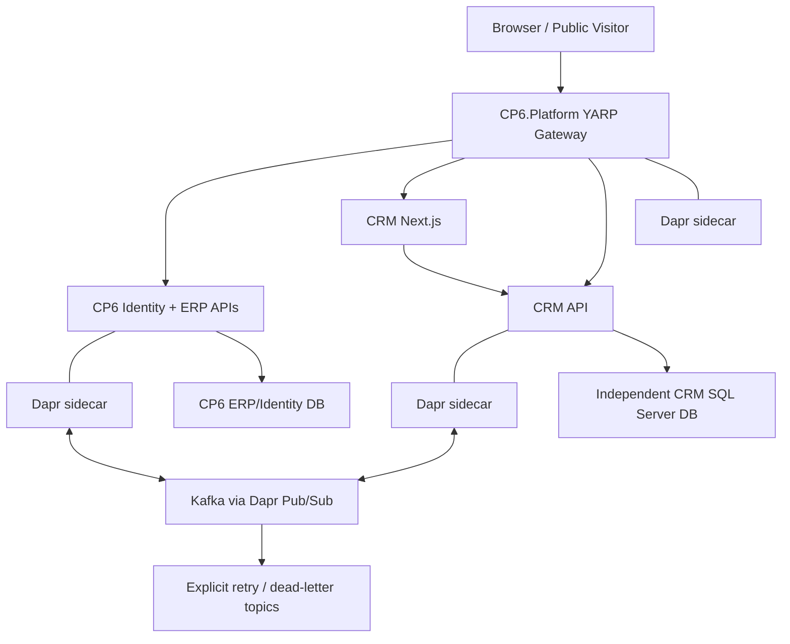
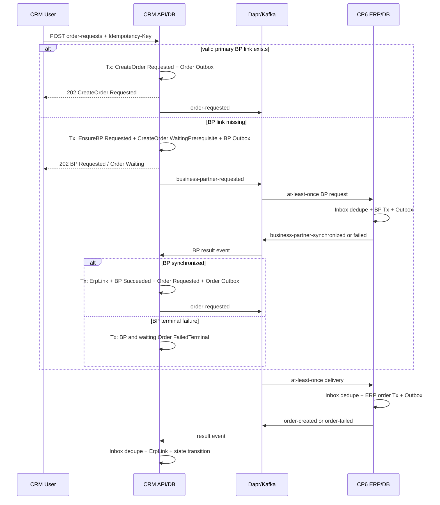
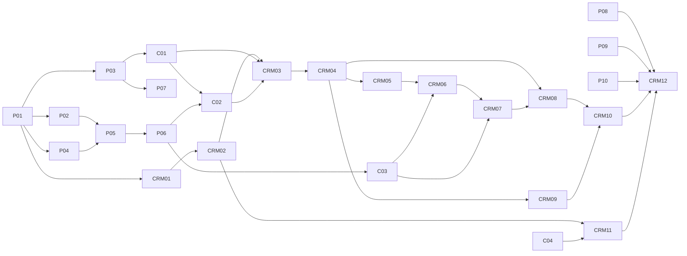

# CP6 CRM V1 可执行工程规格

状态：Draft for approval，禁止据此直接上线

最后核验：2026-08-11

产品框架：[CRM-PRODUCT-FRAMEWORK.md](./CRM-PRODUCT-FRAMEWORK.md)

Foundation 基线：[CRM-V1-SPEC.md](./CRM-V1-SPEC.md)

## 1. 目的与交付边界

本 Spec 把已经锁定的 CRM 方向转换为三仓库可执行计划。实现者不再决定仓库边界、前后端技术、身份协议、消息格式、数据主权或迁移策略；这些内容是输入约束。每个实施分支仍需把本 Spec 的里程碑拆为 1–3 天、可独立验证的子任务。

本规划任务只交付规格和审阅证据，不创建新仓库、不实现服务、不创建云资源、不配置生产 Secret、不发布镜像、不执行数据迁移或部署。

## 2. 已锁定决策

1. 三个独立仓库：`GTX537/CP6`、`GTX537/CP6.Platform`、`GTX537/CP6.CRM`。
2. CRM 仓库包含单一 CRM 后端、独立数据库和全部 Next.js 前端；公开站点使用 SSR/ISR，管理端在 `/crm/**`。
3. YARP Gateway 是独立入口；Dapr sidecar 负责服务调用和 Pub/Sub；Kafka 是 Pub/Sub 底层。现有操作审计主题保持独立。
4. 同步只用于只读查询；跨服务写入使用异步事件。
5. CP6 是身份发行方，使用 RS256、OIDC Discovery、JWKS、`kid` 轮换和 `CP6.Web`/`CP6.Services` audiences。
6. 权限不写入 JWT。CRM 维护用户、组织、授权和撤销的本地投影。
7. 请求上下文只读且没有默认租户。管理请求缺租户为 403；公开请求先由 `siteKey` 解析租户。
8. CloudEvents 是唯一 envelope，Data 使用 JSON Schema。扩展属性必须包含 tenant、correlation、causation、aggregate、version、schema。
9. 业务数据与 Outbox 在同一 DbContext/事务提交；Inbox 唯一键为 `ConsumerName + MessageId`。
10. CRM 管售前客户、线索、联系人、商机和来源；ERP 管法定、财务和交易主数据。
11. 现有 20 张 CRM/CMS 表是迁移来源；Activity、Collaborator、StageHistory 改用显式 LeadId/OpportunityId。
12. V1 在一次生产切换前完成；维护窗口上限 30 分钟；切换后产生新写入时只允许前向修复。
13. 当前生产发布权威仍是 GitHub R2/GHCR。Registry 和发布权威未决前，不得由 Azure 与 GitHub 对同一版本重复 Build。

## 3. 已验证当前状态

验证基线：`main == origin/main == f149c75eed77edc0b4bb10a4921af43a78c4abf9`，验证日期 2026-08-11。

| 观察 | 证据 | 结论 |
| --- | --- | --- |
| CRM Foundation 已合入 main | commit `5b8354a5`，merge `defc8fc0` | 可以把 20 张表当迁移源，不能把它当端到端完成 |
| 现有目标只写了短基线 | `docs/crm/CRM-V1-SPEC.md:5-41` | 需要本 Spec 补齐产品、契约、迁移和发布细节 |
| 20 个 DbSet 已进入单体 CP6Context | `CP6.Core/EFDbContext/CP6Context.cs:47-67` | 当前数据库边界仍在 CP6，不是独立 CRM 数据库 |
| 状态机和 Accepted/Won 守卫已存在 | `CP6.Core/Services/Crm/CrmStateMachine.cs:8-64` | 目标服务需保留语义并迁到 CRM Domain |
| Activity/Collaborator/StageHistory 仍是弱引用 | `CrmLeadModels.cs:51-71`、`CrmOpportunityModels.cs:30-40` | 迁移预检必须识别类型并写显式外键 |
| 当前上下文可变且回退默认租户 A1 | `ITenantContext.cs:8-19`、`CP6Context.cs:33-45` | 新服务禁止引用或复制该实现 |
| 当前 JWT 使用 HMAC SHA-256 | `CP6.Core/Utilities/JwtHelper.cs:58-59,94-95`、`Program.cs:844-857` | CP6 C01 必须先完成 RS256/OIDC/JWKS |
| WebApi 跨层引用 Core 与 Space 多项目 | `CP6.WebApi/CP6.WebApi.csproj` | 新模板只允许窄 NuGet 与本仓分层引用 |
| 当前前端是 Vue/Vite 且无 CRM 路由 | `cp6.web/package.json:7-59`、`router/index.ts:1-149` | CRM Next.js 是新仓交付，不在旧 Vue 中加页面 |
| CRM 只有菜单种子，没有 Controller/Service/UI | `CP6.WebApi/Seed/CrmMenuPermissionSeed.cs:13-36` | API、业务逻辑和 UX 全部仍待实现 |
| 已种 6 个菜单和 22 个动作且默认禁用 | `CrmMenuPermissionSeed.cs:13-36,41-124` | 迁移期间保持键和值稳定，完成后按门禁启用 |
| 当前 Azure 只做 CI | `azure-pipelines.yml:1-92` | CRM 发布必须继承 R2 等价门禁，不能把 Azure CI 当部署 |
| 聚焦 Foundation 回归通过 | `dotnet test --filter FullyQualifiedName~CP6.Tests.Crm` | 16 passed，0 failed，0 skipped |

### 3.1 当前可保留的业务语义

- Lead 和 Opportunity 的枚举值及终态语义。
- Accepted 要求已接受报价；Won 要求已创建 ERP 订单。
- 五个菜单根路由、22 个动作和数据范围 1–5。
- 公开路由是跨租户解析注册表且不得存业务内容或 PII。
- 24 个月 PII 匿名化、首末触点、4 小时首次响应 SLA。

### 3.2 不得复制的历史结构

- `CP6.Core`、`CP6.Entity`、`CP6Context`、ERP 实现项目或 `bin` DLL。
- 可变 `ITenantContext` 和默认租户 A1。
- HS256 Secret、权限塞入 Token 或只在网关验证 JWT。
- `EntityType + EntityId` 无外键关联。
- 现有 best-effort Bridge、直接 Kafka/RabbitMQ 发送或跨服务数据库写入。
- Vue 路由、根开发 Compose 或根 `k8s/` 作为 CRM 生产资产。

### 3.3 产品定位、用户角色与获客渠道

CRM 是 CP6 面向包装和制造企业的行业化售前工作台，负责把官网或人工获客转为可追溯 Lead、售前 Account/Contact、Opportunity 和 ERP 订单请求。它不是通用营销自动化平台，也不复制 ERP 的法定客户、财务、报价和订单权威。产品细节以 [CRM 产品框架](./CRM-PRODUCT-FRAMEWORK.md) 为准，本节是工程验收必须保留的产品契约。

| 用户角色 | V1 核心工作 | 授权边界 |
| --- | --- | --- |
| 租户管理员 | 启用 CRM、维护成员和数据范围 | 只管理本租户；PII 导出仍需独立权限 |
| 市场运营 | 管理 Site/CMS/Form、来源和归因 | 不读取无业务需要的完整 PII，不变更 ERP 主数据 |
| 销售经理 | 查看漏斗、分配/移交、处理重复和超时 | 受部门或全部数据范围约束 |
| 销售人员 | 跟进 Lead、维护 Account/Contact、推进 Opportunity | 默认只访问本人及协作记录 |
| 协作人员 | 查看和记录被授权 Lead/Opportunity 活动 | 不能移交、合并、接受报价或请求订单 |
| 内容编辑 | 编辑、预览和发布受控内容块 | 不能注入 HTML/脚本或查看 Lead 原始表单 |
| ERP 集成运营 | 查看 IntegrationProcess、重试可重试失败 | 不能手工伪造 ERP 成功或直接改为 Won |
| 隐私/审计人员 | 执行保留、匿名化和审计取证 | 受独立动作权限、理由和不可变审计约束 |
| 公开访客 | 浏览站点、提交表单、获得回执 | 不接触 TenantId、LeadId、风险原因或内部状态 |

V1 获客渠道只有 `Website` 和 `Manual`。Website 先通过 `siteKey` 解析租户，再执行速率限制、蜜罐、幂等和风险分流；Manual 由授权员工录入并保留操作者和来源。广告、活动、邮件、合作伙伴、电话、社交、导入和外部连接器归入 VNext；V1 可保存标准 UTM/Referrer，但不声称已经接入这些平台。

### 3.4 端到端旅程与 V1/VNext 边界

V1 的验收主链为：公开访客访问已发布页面 → 提交表单 → 同一事务写 PublicSubmission、Lead 或 Quarantine、SourceTouch 和 Outbox → 线索池分配并启动 4 个自然小时首次响应 SLA → 销售记录活动、查重和合格 → 一次转换创建或关联 Account、Contact、Opportunity → 同步只读校验 ERP 报价 → 报价接受后进入 Accepted → 用户显式请求 ERP Business Partner/Order → 异步成功后进入 Won。失败必须停留在可恢复状态，不允许以人工改字段伪造闭环。

| 边界 | 包含 | 不包含 |
| --- | --- | --- |
| V1 | Website/Manual 获客、线索池/SLA/协作/查重、转换、固定商机漏斗、报价接受、ERP 订单桥、Site/CMS、多语言 SSR/ISR、归因、PII 匿名化和运营报表 | 外部渠道连接器、营销自动化、邮件/日历同步、任意页面搭建、AI 评分、独立 Identity/Space 微服务拆分 |
| VNext | 渠道连接器、活动/名单、邮件日历同步、评分路由、可配置工作流、A/B 实验、更丰富 CMS、区域化扩展 | 只有在 V1 SLO、数据质量和审计证据稳定后单独立项；不得提前改变 V1 合同 |

### 3.5 决策、审批与责任

每个 Owner 在项目系统中必须绑定一名可追责人员和一名替补；表中的角色不能由 Spec 作者自行代签。未记录决策编号、结论、日期、证据链接和复审条件时，对应前置仍视为未完成。

| 决策/门禁 | Accountable 角色 | 最迟关闭点 | 必需证据 |
| --- | --- | --- | --- |
| DEC-CRM-001 唯一 Registry、发布权威、候选清单和影子期 | Release Owner | P01/CRM01 建候选流水线前 | 批准的 ADR + R2/Azure 等价矩阵 |
| DEC-CRM-002 私有 NuGet 源、source mapping、签名和保留 | Platform Owner | P01 第一个包发布前 | 包源 ADR + 消费/撤回演练 |
| DEC-CRM-003 定位、角色、V1/VNext、KPI | Product Owner | CRM04 开始前 | 产品框架逐项签收 |
| DEC-CRM-004 20 表列合同、转换和保留 | Data Owner | CRM02 Schema 合并前 | 列合同 + migration map + golden vectors |
| DEC-CRM-005 BP/Quotation/Order 契约、幂等和错误码 | ERP Owner | C03/CRM06 开始前 | OpenAPI/Event Schema 消费方签收 |
| DEC-CRM-006 RS256/JWKS、租户、PII、威胁模型 | Security Owner | C01/CRM03 开始前 | 安全 ADR + 负向测试计划 |
| DEC-CRM-007 SLO、容量、告警和故障预算 | SRE Owner | CRM12 性能门禁前 | 负载配置 + Dashboard/Alert review |
| DEC-CRM-008 T-7/T-1/生产 Go/No-Go | Release Owner | 每次推广前 | 各 Owner 签字的不可变清单 |

例外由 Product Owner、System Architect 和 Security Owner 三方共同审批，必须写明范围、风险、补偿控制、负责人和不超过 30 天的到期日。跨租户隔离、JWT 验证、订单幂等、迁移哈希、发布 digest 身份、生产 Secret、未修复 Critical 漏洞及新写 fence 后的数据回退不可豁免；High 漏洞只有供应商无修复且存在已验证补偿控制时才可限时豁免。

## 4. 三仓系统结构



### 4.1 `GTX537/CP6.Platform`

允许的产物：

- `CP6.Platform.Abstractions`：只读 RequestContext、时钟、ID、相关性和小型结果契约。
- `CP6.Platform.AspNetCore`：JWT/JWKS、请求上下文、ProblemDetails、审计相关中间件。
- `CP6.Platform.Messaging`：CloudEvents、Dapr Pub/Sub、JSON Schema、相关性和分区键。
- `CP6.Platform.EntityFramework`：Outbox/Inbox、租户模型约定和拦截器。
- `CP6.Platform.Testing`：契约、租户、消息和认证测试夹具。
- `CP6.Platform.Contracts`：纯 BCL DTO/常量；不依赖 ASP.NET、EF、Dapr 或业务项目。
- YARP Gateway、Dapr 组件/订阅/弹性配置、生产部署模板和 System Release Manifest schema。

### 4.2 `GTX537/CP6.CRM`

```text
src/
  CP6.Crm.Domain
  CP6.Crm.Application
  CP6.Crm.Infrastructure
  CP6.Crm.Api
  CP6.Crm.Contracts
  CP6.Crm.Migrator
  web/                         # Next.js App Router
tests/
  CP6.Crm.Domain.Tests
  CP6.Crm.Application.Tests
  CP6.Crm.IntegrationTests
  CP6.Crm.ContractTests
  e2e/
deploy/
  compose/
  kubernetes/
contracts/
  events/
  api/
```

依赖方向：Domain 不依赖 Platform；Application 只依赖 Domain、Contracts 和 Abstractions；Infrastructure 依赖 Application、Messaging、EntityFramework；API 依赖 Application、Infrastructure 和 ASP.NET 集成；Contracts 只依赖 BCL。

### 4.3 `GTX537/CP6`

- 发行 RS256 Token、OIDC Discovery 和 JWKS。
- 发布租户、用户、部门、授权、禁用和撤销事件。
- 消费 CRM 的 Business Partner/Order 请求并以 ERP 幂等键处理。
- 保持报价和订单权威，返回稳定业务错误码，不暴露内部异常。
- 提供旧 CRM 写入冻结、迁移源只读和切换后旧表退役能力。

## 5. 领域模型、边界与聚合

| 子域 | 聚合/实体 | 负责 | 不负责 |
| --- | --- | --- | --- |
| Acquisition | PublicSubmission, SourceTouch, DuplicateCandidate | 来源、公开风险、幂等、归因 | 广告平台对账、营销自动化 |
| Lead | Lead, IntakeConfig, IntakeMember, MergeRecord | 线索池、SLA、分配、合格、合并、转换 | ERP 客户/报价/订单 |
| Customer | Account, Contact | 售前企业和联系人关系 | 法定名称、税务、信用、付款条款 |
| Opportunity | Opportunity, StageHistory | 固定漏斗、金额、阶段、Accepted/Won 守卫 | 报价计算、订单记账 |
| Collaboration | Activity, Collaborator | 跟进时间线、下一步、协作范围 | 邮件/日历自动同步 |
| Site/CMS | Site, SitePage, PageRevision, PageTranslation, MediaAsset, PublicForm, PublicRoute | 多语言内容、发布、表单 | 任意 HTML、脚本和页面搭建器 |
| Integration | ErpLink, IntegrationProcess | 跨服务幂等流程、补偿、外部关联 | ERP 内部表和交易规则 |
| Authorization | Tenant/User/Dept/Grant/Revocation projections | 本地授权决策 | 身份发行和角色管理 UI |
| Operations | Outbox, Inbox, AuditEntry, RetentionRun | 投递、去重、审计、匿名化证据 | 业务报表事实本身 |

## 6. 状态机

### 6.1 Lead

```text
New --------> Assigned -------> Contacted -------> Qualified -------> Converted
 |               |                  |                  |
 +---------------+------------------+------------------+------> Disqualified
 +---------------+------------------+------------------+------> Merged
```

| 转换 | 前置条件 | 原子副作用 | 失败码 |
| --- | --- | --- | --- |
| New → Assigned | OwnerUserId 有效且在本租户 | 写 Owner/Dept、StageHistory、Activity(System) | `CRM_OWNER_INVALID` |
| New/Assigned → Contacted | 存在客户面对型活动 | 只在首次设置 FirstResponseAt | `CRM_CONTACT_ACTIVITY_REQUIRED` |
| Contacted → Qualified | CompanyName、联系方式至少一项、ProductInterest | 写 QualifiedAt | `CRM_QUALIFICATION_DATA_REQUIRED` |
| Active → Disqualified | 500 字内原因必填 | 写 ClosedAt、原因 | `CRM_DISQUALIFICATION_REASON_REQUIRED` |
| Active → Merged | 同租户目标、非终态、非自己、权限通过 | 写 MergeRecord、MergedIntoLeadId、ClosedAt | `CRM_MERGE_TARGET_INVALID` |
| Qualified → Converted | 幂等键、Account/Contact 选择有效 | 创建/关联 Account、Contact、Opportunity，写 Outbox | `CRM_CONVERSION_CONFLICT` |

Converted、Disqualified、Merged 是终态。V1 不提供 reopen；需要恢复时创建新 Lead 并在审计中引用旧记录。

允许边集合固定为：`New→Assigned/Contacted/Disqualified/Merged`、`Assigned→Contacted/Disqualified/Merged`、`Contacted→Qualified/Disqualified/Merged`、`Qualified→Converted/Disqualified/Merged`。表中的 Active 仅指这些非终态来源；除此以外全部返回 `CRM_LEAD_TRANSITION_INVALID`。

### 6.2 Opportunity

```text
Qualification -> NeedsAnalysis -> Proposal <-> Negotiation -> Accepted -> Won
       |               |              |             |            |
       +---------------+--------------+-------------+------------+-> Lost
```

| 转换 | 前置条件 | 副作用 |
| --- | --- | --- |
| Qualification → NeedsAnalysis | Account/Contact 已关联，需求摘要存在 | 记录阶段历史 |
| NeedsAnalysis → Proposal | ExpectedAmount > 0、ISO 4217 Currency、ExpectedCloseDate | 概率派生为 50 |
| Proposal/Negotiation → Accepted | 已接受报价编号存在且 ERP 校验通过 | 写 AcceptedAt/Quotation ErpLink，发 `opportunity.accepted` |
| Accepted → Negotiation | 报价被撤回或需重谈，原因必填 | 清除当前 Accepted 标记但保留历史报价关联 |
| Active/Accepted → Lost | LostReason 必填 | 写 ClosedAt、概率 0 |
| Accepted → Won | ERP Order 成功事件、唯一 Order ErpLink、WinningOrderNo | 写 WonAt/ClosedAt，概率 100 |

Won、Lost 是终态。Probability 由状态机派生，不持久化为可编辑字段。

允许边集合固定为：`Qualification→NeedsAnalysis/Lost`、`NeedsAnalysis→Proposal/Lost`、`Proposal→Negotiation/Accepted/Lost`、`Negotiation→Proposal/Accepted/Lost`、`Accepted→Negotiation/Won/Lost`。除此以外全部返回 `CRM_OPPORTUNITY_TRANSITION_INVALID`；任何边都必须用命令和 ETag，禁止 PATCH Stage。

### 6.3 PublicSubmission

| 状态 | 进入条件 | 允许后续 |
| --- | --- | --- |
| Accepted | 语法、令牌、幂等、限流和风险检查通过 | 同事务转换为 Lead，正常结果应直接到 ConvertedToLead |
| Quarantined | 中风险、蜜罐、异常频率或策略命中 | 有权限人员释放为 Lead 或保持隔离到期匿名化 |
| ConvertedToLead | 已创建 Lead 且关联写入成功 | 终态 |

硬拒绝请求不落 PII：无效站点/表单、超大 Body、非法 Content-Type、明显协议攻击返回 4xx。

### 6.4 IntegrationProcess

```text
WaitingPrerequisite -> Requested -> Processing -> Succeeded
                          ^             |
                          +-- FailedRetryable
                                        +-> FailedTerminal
```

- 操作类型固定为 `EnsureBusinessPartner`、`CreateOrder`；Quotation 在 V1 是同步只读校验，不创建 IntegrationProcess。
- 唯一业务键：`TenantId + Operation + AggregateId + RequestVersion`。
- `WaitingPrerequisite` 只用于等待 Business Partner 的 CreateOrder。BP 成功事件在同一事务写 ErpLink、把子流程改为 Requested 并写 Order Outbox；BP 终态失败把子流程改为 FailedTerminal。
- Requested 只能由 worker 租约推进 Processing；Processing 只能进入 Succeeded、FailedRetryable 或 FailedTerminal；到期调度器把 FailedRetryable 重新放回 Requested。同一行不允许其它边。
- `CreateOrder` 成功后禁止重新进入 Requested。
- Retryable 使用指数退避和上限；Terminal 需要人工修正业务数据后产生新 RequestVersion。

## 7. 数据模型

### 7.1 全局约定

所有租户业务表必须包含：

```text
Id uniqueidentifier not null
TenantId uniqueidentifier not null
CreatedAtUtc datetime2 not null
CreatedByUserId uniqueidentifier null
UpdatedAtUtc datetime2 not null
UpdatedByUserId uniqueidentifier null
IsDeleted bit not null default 0
DeletedAtUtc datetime2 null
RowVersion rowversion not null
```

- 主键为 `Id`；另建唯一键 `(TenantId, Id)`。
- 租户表之间全部使用 `(TenantId, ForeignId) -> (TenantId, Id)` 复合外键，数据库层拒绝跨租户关联。
- 业务唯一索引必须以 TenantId 开头；全局 `PublicRoute.PublicKey/TokenHash` 是明确例外。
- 时间只存 UTC `datetime2(7)`；API 使用 ISO 8601 `Z`。
- 金额为 `decimal(18,2)`；货币为大写 ISO 4217 三字符。
- 所有写入使用 RowVersion/ETag 乐观并发。
- 软删除实体的普通查询默认过滤；审计、迁移和保留任务使用专用仓储，不开放通用 `IgnoreQueryFilters`。
- Lead、Account、Contact、Opportunity、Site、Page、Form 和配置实体只允许受权限控制的软删除；存在未关闭商机、已发布引用、ERP 关联或活动引用时拒绝删除。Published Revision、StageHistory、MergeRecord、AuditEntry、Inbox/Outbox 业务证据不可由普通 API 删除。
- PublicRoute 使用 Enable/ExpiresAtUtc 退役，不使用软删除；目标退役且保留窗口结束后才可由专用 Job 物理删除。MediaAsset 必须在无 Revision 引用并完成对象存储 tombstone 后删除。PublicSubmission/Lead 的 24 个月任务匿名化 PII，保留非识别性漏斗事实和引用完整性。

### 7.2 20 张迁移表

| 表 | 核心字段 | 目标约束/变化 |
| --- | --- | --- |
| Account | Name, NormalizedName, Website, Industry, OwnerUserId, DeptId | `(TenantId, NormalizedName)` 查询索引；不存财务/信用主数据 |
| Contact | AccountId?, FullName, Email/NormalizedEmail, Phone/NormalizedPhone, JobTitle, Consent | 复合 Account FK；PII 字段遮罩和匿名化 |
| Lead | LeadNo, Subject, Company/Contact/Channel, Status, Owner/Dept, SLA, consent, conversion refs, attribution | `(TenantId, LeadNo)` 唯一；Account/Contact/Opportunity/Merged target 均复合 FK |
| Collaborator | LeadId?, OpportunityId?, UserId, Role | 恰好一个目标；`TenantId + target + UserId` 唯一 |
| Activity | LeadId?, OpportunityId?, Type, Subject, Details, OccurredAtUtc, NextActionAtUtc | 恰好一个目标；客户面对型活动驱动 FirstResponseAt |
| SourceTouch | LeadId, Source, Medium, Campaign, Content, Term, LandingPage, Referrer, TouchedAtUtc | Lead 复合 FK；URL 按 PII 保留 |
| PublicSubmission | FormId, LeadId?, IdempotencyHash, IpHash, UserAgent, Status, RiskReason | `(TenantId, FormId, IdempotencyHash)` 唯一 |
| Opportunity | OpportunityNo, LeadId, AccountId?, PrimaryContactId?, Stage, amount/currency/date, accepted/won/lost fields | `(TenantId, LeadId)`、`(TenantId, OpportunityNo)` 唯一 |
| StageHistory | LeadId?, OpportunityId?, FromStage, ToStage, Reason, ChangedAtUtc, ChangedBy | 恰好一个目标；只追加 |
| ErpLink | AccountId?, OpportunityId?, ErpSystem, ErpEntityType, ErpEntityKey, IsPrimary, LastVerifiedAtUtc | 恰好一个 CRM 目标；外部键唯一规则按实体类型定义 |
| MergeRecord | SourceLeadId, TargetLeadId, Reason, MergedBy, MergedAtUtc | Source 唯一；两端同租户复合 FK |
| IntakeConfig | Name, DefaultDeptId?, DefaultOwnerUserId?, SlaMinutes, WarningMinutes, notification flags | 启用配置同名不得重复；默认 SLA 240 |
| IntakeMember | IntakeConfigId, UserId | `(TenantId, IntakeConfigId, UserId)` 唯一 |
| Site | SiteKey, SiteName, DefaultLocale, EnabledLocalesJson, Status, DefaultFormId, publish fields | `(TenantId, SiteKey)` 唯一；公开访问不直接按此索引跨租户查 |
| SitePage | SiteId, PageType, PageKey, PublishedRevisionId, SortOrder, Enable | `(TenantId, SiteId, PageKey)` 唯一 |
| PageRevision | PageId, Version, Status, publish fields | `(TenantId, PageId, Version)` 唯一；已发布内容不可改 |
| PageTranslation | SiteId, RevisionId, Locale, Slug, Title, Summary, BodyJson, SEO | 修订/语言和站点/语言/Slug 均租户内唯一 |
| MediaAsset | SiteId, FileName, StoreKey, ContentType, Size, FileHash, publish state | 禁止存机器路径；对象存储 Key 不含租户 PII |
| PublicForm | SiteId, FormKey, Name, IntakeConfigId?, PrivacyPolicyVersion, Enable, TokenRotatedAtUtc | `(TenantId, SiteId, FormKey)` 唯一 |
| PublicRoute | TenantId, RouteType, PublicKey?, TokenHash?, TargetId, Enable, ExpiresAtUtc | 无软删除/业务内容/PII；PublicKey/TokenHash 全局唯一 |

### 7.3 新增支持表

| 表 | 目的 | 必需唯一键/保留 |
| --- | --- | --- |
| DuplicateCandidate | 保存候选、匹配原因、置信度和处置结果 | `(TenantId, SourceLeadId, CandidateLeadId, AlgorithmVersion)` |
| IntegrationProcess | Operation、AggregateId、RequestVersion、Status、PrerequisiteProcessId?、尝试/下次重试、错误码和外部结果 | 业务键唯一；前置流程同租户 FK；错误详情必须脱敏 |
| OutboxMessage | 同事务待发布 CloudEvent | Id 唯一；成功 7 天、失败转 DLQ |
| InboxMessage | 消费去重、处理状态和数据哈希 | `(ConsumerName, MessageId)` 唯一；30 天 |
| DeadLetterRecord | 失败消息证据、重放状态 | 90 天；Payload 按 PII 分类和加密 |
| TenantProjection | 租户启用状态、版本 | TenantId 唯一 |
| UserProjection | 用户启用、部门、显示名最小投影 | `(TenantId, UserId)` 唯一 |
| DepartmentProjection | 部门父子/Path 和启用状态 | `(TenantId, DeptId)` 唯一 |
| PermissionProjection | 用户/角色到 22 动作和数据范围 | `(TenantId, SubjectId, Resource, Action, ScopeVersion)` |
| RevokedToken | Jti、用户、撤销/过期时间 | `(Issuer, Jti)` 唯一；到 Token 过期后删除 |
| AuditEntry | 关键命令、操作者、目标、结果、相关性和字段名 | 只追加，不存 Secret 和 PII 原值 |
| RetentionRun | 匿名化批次、计数、失败和证据哈希 | 不保存被擦除原值 |

### 7.4 显式目标约束

```sql
CHECK (
  (LeadId IS NOT NULL AND OpportunityId IS NULL) OR
  (LeadId IS NULL AND OpportunityId IS NOT NULL)
)
```

Activity、Collaborator、StageHistory 使用该约束。ErpLink 使用同型约束，但字段为 AccountId/OpportunityId。迁移预检发现未知 `EntityType`、空目标或双目标时必须失败，禁止自动猜测。

### 7.5 受控 BodyJson

根结构：

```json
{
  "schemaVersion": 1,
  "blocks": [
    {
      "id": "01H...",
      "type": "hero",
      "props": {
        "heading": "Custom packaging",
        "body": "...",
        "imageAssetId": "...",
        "cta": { "label": "Contact us", "href": "/contact" }
      }
    }
  ]
}
```

V1 类型只允许 `hero`、`richText`、`image`、`productGrid`、`serviceCards`、`cta`、`formEmbed`。`richText` 存受限 AST，不存任意 HTML；链接协议只允许 `https`、`mailto`、`tel` 和站内相对路径。

### 7.6 列合同与迁移映射门禁

本节表格冻结聚合和关键约束，不替代逐列 Schema。CRM02 第一张 Schema 实现分支前必须先合并以下版本化合同：

- `contracts/data/crm-v1-column-contract.yaml`：20 张来源表和支持表的每一列，包含 SQL 类型、长度/精度、nullability、default/computed、PK/FK/index、软删除/保留、PII 分类和 API 可见性。
- `contracts/migration/crm-v1-map.yaml`：每个源列到目标列的 copy/rename/transform/drop 规则、时区、枚举、正规化函数、拒绝条件和目标依赖顺序。
- `contracts/migration/golden/`：覆盖 null、最大长度、Unicode、DST 歧义、弱引用、软删除和每个枚举的输入/预期输出。

合同必须由 CRM Domain、Data Owner 和 Security Owner 共同审阅。EF Migration、SQL DDL、OpenAPI/JSON Schema 和 migrator 都从同一合同生成或做 drift 比对；存在未分类列、隐式截断、无理由 drop 或合同/数据库差异时 CRM02 失败。Foundation 的现有实体和迁移是映射输入，不自动成为目标列合同。

## 8. API 契约

### 8.1 通用规则

- 管理 API 前缀 `/api/crm/v1`；公开 API 前缀 `/api/public/v1`；内部服务 API 前缀 `/internal/v1`。
- JSON 使用 camelCase；ID 为 UUID；金额用 JSON string 避免浮点误差。
- Body 不接受 TenantId、Owner 权限范围或系统审计字段。
- 列表使用 `cursor`、`pageSize`、`sort` 和明确白名单筛选；默认 20，最大 100。
- 创建返回 201；异步跨服务命令返回 202；幂等重放返回原状态和相同资源 ID。
- 修改要求 `If-Match: "<rowVersion>"`；缺失返回 428，冲突返回 412。
- 错误使用 RFC 9457 Problem Details，并带稳定 `code`、`traceId`、`correlationId`。

本节端点表是必须实现的产品表面，不是可发布的逐字段合同。每个 API slice 必须先更新 `contracts/api/crm-v1.openapi.yaml`，为 operationId、参数、request/response、required/nullability、长度/格式、分页、ETag、幂等、权限、Problem Details 和示例定版；生成的 C# / TypeScript client 必须无 drift。缺 OpenAPI、存在未引用自由对象或 breaking diff 未升 major 时，handler 和 UI 分支不得合并。

分页响应：

```json
{
  "items": [],
  "nextCursor": "opaque-or-null",
  "hasMore": false,
  "asOfUtc": "2026-08-11T15:00:00Z"
}
```

错误响应：

```json
{
  "type": "https://errors.cp6.example/crm/concurrency-conflict",
  "title": "The record changed",
  "status": 412,
  "code": "CRM_CONCURRENCY_CONFLICT",
  "traceId": "00-...",
  "correlationId": "..."
}
```

### 8.2 公开端点

| 方法与路径 | 用途 | 认证/限流 |
| --- | --- | --- |
| GET `/api/public/v1/sites/{siteKey}/content?locale=&path=` | Next.js SSR 获取已发布内容 | 无 JWT；按 IP/site 限流，只返回发布投影 |
| GET `/api/public/v1/sites/{siteKey}/forms/{formKey}` | 获取启用表单和隐私版本 | 无 JWT；短缓存 |
| POST `/api/public/v1/sites/{siteKey}/forms/{formKey}/submissions` | 公开提交 | `Idempotency-Key` 必填；Body ≤ 32 KiB |
| GET `/api/public/v1/submissions/{receiptId}` | 返回接收/隔离的粗粒度状态 | 需要不可逆 receipt token；不返回 Lead/租户 ID |

提交请求：

```json
{
  "companyName": "Example Packaging",
  "contactName": "Li",
  "email": "sales@example.invalid",
  "phone": "+1...",
  "subject": "Custom corrugated box",
  "message": "...",
  "productInterest": "Printed cartons",
  "locale": "en-US",
  "privacyConsent": true,
  "privacyPolicyVersion": "2026-08",
  "source": {
    "landingPath": "/products/printed",
    "referrer": "https://...",
    "utmSource": "search",
    "utmMedium": "cpc",
    "utmCampaign": "summer"
  },
  "honeypot": ""
}
```

提交响应只返回 `receiptId`、`status`、`receivedAtUtc`。不返回 LeadId、TenantId、风险原因或内部队列信息。

默认防滥用策略：单 IP 哈希每 10 分钟 10 次、每天 50 次；单 Site/Form 每分钟 120 次。阈值可由运维配置但不得由公开请求控制。蜜罐命中进入隔离；明显协议攻击直接拒绝。

### 8.3 Lead 端点

| 方法与路径 | 权限 | 说明 |
| --- | --- | --- |
| GET `/leads` | `crm-lead:query` | status、owner、dept、source、SLA、created range 筛选 |
| POST `/leads` | `crm-lead:add` | 人工创建；支持 Idempotency-Key |
| GET `/leads/{id}` | `query` + 数据范围 | PII 按 `view-pii` 遮罩 |
| PATCH `/leads/{id}` | `edit` + 数据范围 | 不允许直接改 Status/Owner/转换字段 |
| POST `/leads/{id}/assignments` | `assign` | 分配或移交，原因必填 |
| POST `/leads/{id}/activities` | `edit` | 追加活动，客户面对型可触发 Contacted |
| POST `/leads/{id}/collaborators` | `edit` | 添加协作人 |
| DELETE `/leads/{id}/collaborators/{userId}` | `edit` | 不能移除唯一负责人 |
| POST `/leads/{id}/qualify` | `edit` | Contacted → Qualified |
| POST `/leads/{id}/disqualify` | `edit` | 原因必填 |
| GET `/leads/{id}/duplicates` | `query` | 只返回用户可访问候选 |
| POST `/leads/{id}/merge` | `merge` | `targetLeadId`、reason、Idempotency-Key |
| POST `/leads/{id}/convert` | `convert` | 原子转换；返回 Account/Contact/Opportunity ID |

转换请求：

```json
{
  "account": { "mode": "create", "existingId": null },
  "contact": { "mode": "create", "existingId": null },
  "opportunity": {
    "name": "Example Packaging - Printed cartons",
    "expectedAmount": "25000.00",
    "currency": "USD",
    "expectedCloseDate": "2026-10-31"
  }
}
```

### 8.4 Account/Contact 端点

| 方法与路径 | 权限 | 说明 |
| --- | --- | --- |
| GET/POST `/accounts` | `query`/`add` | 服务端查询或创建售前企业 |
| GET/PATCH `/accounts/{id}` | `query`/`edit` | ETag 并发；PII 规则作用于嵌套联系人 |
| GET/POST `/accounts/{id}/contacts` | `query`/`add` | Contact 复合租户 FK |
| GET/PATCH `/contacts/{id}` | `query`/`edit` | 不通过 Account 路径也必须做数据范围检查 |
| POST `/accounts/{id}/erp-link-requests` | `edit` | 异步请求创建/关联 Business Partner |

### 8.5 Opportunity 端点

| 方法与路径 | 权限 | 说明 |
| --- | --- | --- |
| GET/POST `/opportunities` | `query`/`add` | 手工直建必须在同一事务创建 `Manual` 来源 Lead 并立即转化；目标 Opportunity 的 LeadId 始终必填 |
| GET/PATCH `/opportunities/{id}` | `query`/`edit` | Stage 只能走 transition 命令 |
| POST `/opportunities/{id}/transitions` | `edit` | 目标阶段、原因、ETag、Idempotency-Key |
| POST `/opportunities/{id}/accepted-quotation` | `accept-quote` | 报价编号，先同步只读校验 ERP |
| POST `/opportunities/{id}/order-requests` | `create-order` | 写 IntegrationProcess/Outbox，返回 202 |
| GET `/opportunities/{id}/integration-processes` | `query` | 返回脱敏状态与支持引用号 |
| POST `/integration-processes/{id}/retry` | `create-order` | 仅 Retryable；Terminal 需新 RequestVersion |

### 8.6 Site/CMS 与报表端点

| 方法与路径 | 权限 | 说明 |
| --- | --- | --- |
| GET/POST `/sites` | `query`/`configure` | 创建时同时注册唯一 PublicRoute |
| GET/PATCH `/sites/{id}` | `query`/`configure` | Locale、启停、默认表单 |
| GET/POST `/sites/{id}/pages` | `query`/`edit` | PageKey 租户/站点内唯一 |
| POST `/pages/{id}/revisions` | `edit` | BodyJson 先做 Schema + 安全校验 |
| POST `/revisions/{id}/preview-tokens` | `edit` | 短期、可撤销、no-store |
| POST `/revisions/{id}/publish` | `publish` | 发布并发出缓存重验证事件 |
| POST `/pages/{id}/rollback` | `publish` | 历史 RevisionId + reason |
| POST `/sites/{id}/media` | `edit` | 允许类型/大小/病毒扫描通过后可引用 |
| GET/POST/PATCH `/sites/{id}/forms` | `query`/`configure` | 表单与 IntakeConfig |
| GET `/dashboard` | `crm-dashboard:query` | 漏斗、来源、SLA、集成积压和 asOfUtc |
| GET `/reports/funnel` | `crm-dashboard:query` | 时间、owner、dept、source 筛选 |
| GET `/reports/sources` | `crm-dashboard:query` | 首触点/末触点分开展示 |

### 8.7 稳定错误码

至少实现：

`CRM_TENANT_REQUIRED`、`CRM_FORBIDDEN`、`CRM_PII_FORBIDDEN`、`CRM_NOT_FOUND`、`CRM_CONCURRENCY_CONFLICT`、`CRM_IDEMPOTENCY_CONFLICT`、`CRM_VALIDATION_FAILED`、`CRM_LEAD_TRANSITION_INVALID`、`CRM_OPPORTUNITY_TRANSITION_INVALID`、`CRM_ACCEPTED_QUOTATION_REQUIRED`、`CRM_ORDER_REQUIRED_FOR_WON`、`CRM_MERGE_TARGET_INVALID`、`CRM_PUBLIC_ROUTE_NOT_FOUND`、`CRM_PUBLIC_RATE_LIMITED`、`CRM_PUBLIC_QUARANTINED`、`CRM_ERP_UNAVAILABLE`、`CRM_ERP_REJECTED`、`CRM_EVENT_SCHEMA_INVALID`。

## 9. 事件契约

### 9.1 CloudEvents 结构

Kafka 消息值就是结构化 CloudEvent，不再包一层 `event/payload/envelope`：

```json
{
  "specversion": "1.0",
  "id": "018f...",
  "source": "urn:cp6:crm",
  "type": "com.gtx537.crm.opportunity.order-requested.v1",
  "subject": "tenants/tenant-id/opportunities/opportunity-id",
  "time": "2026-08-11T15:00:00Z",
  "datacontenttype": "application/json",
  "dataschema": "https://contracts.cp6.example/events/crm/opportunity-order-requested/v1/schema.json",
  "tenantid": "tenant-id",
  "correlationid": "correlation-id",
  "causationid": "command-or-event-id",
  "aggregateid": "opportunity-id",
  "aggregateversion": 7,
  "schemaversion": "1.0.0",
  "data": {
    "requestId": "integration-process-id",
    "opportunityId": "opportunity-id",
    "accountId": "account-id",
    "acceptedQuotationKey": "Q-2026-001",
    "requestVersion": 1
  }
}
```

规则：

- `id` 全局唯一且作为 Inbox MessageId。
- Kafka partition key 固定为 `{tenantid}:{aggregateid}`。
- `correlationid` 从入口请求开始贯穿；`causationid` 指向直接触发本事件的命令或事件。
- `aggregateversion` 必须单调递增；消费者拒绝倒退状态，但仍把重复消息记为已处理。
- Data 不包含未经批准的 PII。业务需要引用联系人时只传 ID，消费者按权限同步只读查询。
- Schema 在各生产者仓库版本化，Platform Contracts 发布索引和校验工具。

### 9.2 Topic 和订阅

| Topic | 生产者 | 消费者 | 说明 |
| --- | --- | --- | --- |
| `cp6.platform.events.v1` | CP6 | CRM | tenant/user/dept/permission/revocation 投影 |
| `cp6.crm.events.v1` | CRM | CP6、Next.js revalidator、报表消费者 | Lead、Opportunity、Site 和 ERP 请求 |
| `cp6.erp.events.v1` | CP6 | CRM | Business Partner、Quotation、Order 结果 |
| `cp6.crm.deadletter.v1` | Dapr/CRM worker | 运维重放工具 | 失败证据，禁止普通业务消费者订阅 |
| 现有审计 Topic | CP6 | 现有审计链 | 不迁入 CRM Pub/Sub，不改变现有语义 |

生产 Topic、分区数、保留期和 ACL 由显式 provision job 创建；生产禁止 broker 自动建 Topic。

### 9.3 事件目录

| Type | 关键 Data | 消费者责任 |
| --- | --- | --- |
| `com.gtx537.platform.tenant.changed.v1` | tenantId, enabled, version | 更新 TenantProjection；禁用立即拒绝新请求 |
| `com.gtx537.platform.user.changed.v1` | userId, deptId, enabled, version | 更新 UserProjection，停用用户清会话 |
| `com.gtx537.platform.department.changed.v1` | deptId, parentId, path, version | 更新部门树和数据范围 |
| `com.gtx537.platform.permission.changed.v1` | subjectId, resource, action, scope, version | 原子替换该 subject 的授权投影 |
| `com.gtx537.platform.token.revoked.v1` | issuer, jti, subjectId, expiresAtUtc | 写 RevokedToken，TTL 到 Token 过期 |
| `com.gtx537.crm.public-submission.accepted.v1` | submissionId, leadId, formId, source summary | 只用于运营/告警，不包含表单原文 |
| `com.gtx537.crm.lead.created.v1` | leadId, sourceChannel, ownerId?, slaDueAtUtc | 报表和通知 |
| `com.gtx537.crm.lead.converted.v1` | leadId, accountId, contactId, opportunityId | 下游只读投影 |
| `com.gtx537.crm.opportunity.accepted.v1` | opportunityId, quotationKey, acceptedAtUtc | ERP/报表准备 |
| `com.gtx537.crm.erp.business-partner-requested.v1` | requestId, accountId, requestVersion | CP6 幂等创建/关联 BP |
| `com.gtx537.erp.business-partner-synchronized.v1` | requestId, accountId, businessPartnerKey, resultVersion | CRM 写 ErpLink/IntegrationProcess |
| `com.gtx537.crm.erp.order-requested.v1` | requestId, opportunityId, businessPartnerKey, quotationKey, requestVersion | CP6 幂等创建订单 |
| `com.gtx537.erp.order-created.v1` | requestId, opportunityId, orderKey, bookedAmount, currency | CRM 写 Order ErpLink 并转 Won |
| `com.gtx537.erp.order-failed.v1` | requestId, opportunityId, errorCode, retryable | CRM 保持 Accepted，更新失败状态 |
| `com.gtx537.crm.site.published.v1` | siteId, pageId, locale list, publishVersion | Next.js 触发标签重验证 |

### 9.4 兼容和重放

- Event Type 末尾 major 版本。删除/改名/收紧语义属于 breaking change，发布新的 `.v2`。
- V1 可新增可选字段；消费者必须忽略未知字段，已发布 required 字段不得变为可空或改变含义。
- JSON Schema 为 Draft 2020-12；对象边界允许未知扩展字段，required 和格式仍严格验证。
- 生产者提交 Schema、示例、兼容性测试和消费者责任；没有 Schema 的事件不得发布。
- 消费者先写 Inbox Processing，再执行业务；成功与业务写入同事务提交。崩溃后可安全重放。
- Poison message 经过有界重试后进入 DLQ；重放产生新的操作审计，但保留原 CloudEvent id。

每个 Event Type 必须在 `contracts/events/<producer>/<event-type>/v1/schema.json` 保存完整 JSON Schema，并附 valid、missing-required、unknown-optional、wrong-type 和 PII-negative 样例。Schema 必须固定 CloudEvents extensions、Data required/nullability/format/maxLength、additionalProperties 策略和兼容规则；生产者、消费者及 bundle 索引三方验证通过后才能启用 Topic 订阅。事件目录只是所有权和语义索引，不能替代这些文件。

## 10. 身份、权限、PII 和租户隔离

### 10.1 JWT/JWKS

- CP6 Discovery：`/.well-known/openid-configuration`；JWKS：`/.well-known/jwks.json`。
- 管理用户 Token：audience `CP6.Web`；服务 Token：audience `CP6.Services`。
- 签名只接受配置的 RS256，拒绝 `alg=none`、HS/RS confusion、未知 issuer/audience 和缺失 `kid`。
- Gateway 验证第一层；CRM API 和 CP6 下游再次独立验证。
- JWKS 按 Cache-Control 缓存，并在未知 kid 时单次刷新；刷新失败使用未过期缓存，超过最大陈旧期则 fail closed。
- 轮换顺序：先发布新公钥，再使用新 kid 签发，等待最大 Token TTL，最后移除旧公钥。

管理请求最小 claims：`iss`、`aud`、`sub`、`tenant_id`、`jti`、`iat`、`nbf`、`exp`。权限和数据范围不在 Token 中。

### 10.2 只读 RequestContext

```csharp
public interface IRequestContext
{
    Guid TenantId { get; }
    Guid? UserId { get; }
    string Subject { get; }
    string Audience { get; }
    string CorrelationId { get; }
    string? TokenId { get; }
    bool IsPublic { get; }
}
```

- 管理入口缺 `tenant_id`、TenantId 为空或 TenantProjection 禁用均返回 403。
- 公开入口先用专用 `IPublicRouteRepository` 跨租户解析 `siteKey`，再创建只读公开 Context。
- Gateway 删除来自外部的 `X-User-*`、`X-Tenant-*`、`X-Forwarded-Client-Cert` 等伪造身份头；下游从已验证 Token/受信代理元数据重建上下文。
- 后台任务必须遍历显式 TenantId；不能在无上下文时回退 A1。

### 10.3 授权决策顺序

1. Token、issuer、audience、jti 和用户/租户启用状态。
2. `resource:action` 本地 PermissionProjection。
3. 数据范围 1–5 对 Owner、Collaborator、DeptPath 或自定义范围判断。
4. PII 字段单独检查 `view-pii`。
5. 业务守卫和状态机。

任何失败先于数据 materialize。列表、详情、计数、导出、搜索建议和报表使用同一行级 predicate；不得先查全量再在内存过滤。

### 10.4 PII 分类与字段策略

| 类别 | 字段 | 无 `view-pii` | 24 个月到期 |
| --- | --- | --- | --- |
| 直接标识 | ContactName/FullName | 部分遮罩 | 占位符 |
| 联系方式 | Email/Phone 及 normalized 值 | 局部遮罩 | 置空 |
| 自由文本 | Lead Description、Activity Details、提交 Message | 完全隐藏或摘要不可用 | 置空 |
| 网络标识 | IP Hash、User-Agent | 不返回 UI | 置空 |
| 来源 URL | LandingPage、Referrer | 去查询串后按权限显示 | 置空或只留 path 分类 |
| 同意证据 | Consent、时间、policy version | 可显示非 PII 状态 | 保留状态/版本，移除直接标识 |

PII 禁止进入 URL query、日志、Trace attributes、Metric labels、事件 Data、错误详情和发布证据。数据库备份、对象存储、Kafka 和传输链必须加密；Secret 只从受保护配置注入。

### 10.5 投影一致性

- Permission/User/Dept 事件按 aggregateversion 更新，旧版本忽略并记指标。
- 每 15 分钟执行只读 reconciliation，与 CP6 投影版本摘要比对；发现漂移 fail closed 到受影响用户并告警。
- 用户禁用、租户禁用和 Token 撤销是高优先事件；目标 99% 在 30 秒内生效。
- Projection 不可用时，公开发布内容继续服务；所有需要管理授权的请求 fail closed。

## 11. Next.js 实现契约

### 11.1 App Router 分区

```text
app/
  (public)/site/[siteKey]/[[...segments]]/page.tsx
  (public)/preview/[token]/page.tsx
  (crm)/crm/dashboard/page.tsx
  (crm)/crm/leads/page.tsx
  (crm)/crm/leads/[leadId]/page.tsx
  (crm)/crm/accounts/page.tsx
  (crm)/crm/accounts/[accountId]/page.tsx
  (crm)/crm/opportunities/page.tsx
  (crm)/crm/opportunities/[opportunityId]/page.tsx
  (crm)/crm/site/page.tsx
  (crm)/crm/site/pages/[pageId]/page.tsx
  (crm)/crm/site/forms/[formId]/page.tsx
  api/revalidate/route.ts
```

- Server Components 默认承担读取；Client Components 只用于表格交互、表单、看板和编辑器。
- 浏览器只调用同源 Next.js Backend-for-Frontend；Token 不写 localStorage。
- `/crm/**` 使用 HttpOnly、Secure、SameSite cookie 或受控 OIDC 会话；所有 mutation 做 CSRF 校验。
- 权限决定路由、按钮和字段可见性，但后端仍是最终强制层。

### 11.2 表单和编辑器

- 使用共享 Zod/JSON Schema 生成客户端校验，但以后端验证为准。
- 自动保存只保存草稿 Revision，500 ms debounce；发布永远是显式动作。
- Block 编辑器只发结构化 AST；禁止 `dangerouslySetInnerHTML` 渲染用户 HTML。
- 媒体上传采用服务端签名上传或流式代理，验证 MIME、扩展名、尺寸、大小和恶意文件扫描。

### 11.3 缓存与重验证

- 管理请求 `cache: no-store`。
- 发布页面使用 `revalidateTag(tenant:site:page:locale)`；消费事件要通过 Inbox 去重。
- 事件丢失时 ISR 5 分钟兜底；失败时继续服务上一已发布修订，不回退到草稿。
- 缓存键必须包含 TenantId/SiteId/Locale/RevisionVersion，不能只用 Slug。

## 12. ERP 集成

### 12.1 数据主权

| 数据 | CRM | ERP |
| --- | --- | --- |
| 售前企业显示名、兴趣、来源、负责人 | 权威 | 可选投影 |
| 联系人和售前同意 | 权威 | 只有业务必需时引用 |
| 法定名称、税号、账期、信用、币种政策 | 不拥有 | 权威 |
| 报价行、价格、税、有效期 | 只存引用/状态快照 | 权威 |
| 订单号、订单行、金额、状态 | 只存引用/只读投影 | 权威 |

### 12.2 同步只读查询

CRM 可经 Dapr service invocation 调用：

- `GET /internal/erp/v1/business-partners/{key}`：显示和验证关联。
- `GET /internal/erp/v1/quotations/{key}`：验证租户、客户、状态、金额、币种和是否已接受。
- `GET /internal/erp/v1/orders/{key}`：故障对账和只读详情。

调用携带 `CP6.Services` Token、tenant/correlation metadata，并由 CP6 再验证 TenantId 与资源归属。

### 12.3 跨服务写流程

Order 的 Business Partner 前置固定如下：

1. `POST order-requests` 重新同步只读校验 Accepted Quotation，并检查 Opportunity Account 的主 `BusinessPartner` ErpLink。
2. 有已验证 Link 时，同一事务只创建 `CreateOrder/Requested` 和 Order Outbox。
3. 无 Link 时，同一事务创建或复用 `EnsureBusinessPartner/Requested`、创建 `CreateOrder/WaitingPrerequisite` 并关联 `PrerequisiteProcessId`，只发布 BP requested。HTTP 202 返回一个聚合 tracking id 和两个流程状态。
4. CP6 以 `TenantId + AccountId + RequestVersion` 幂等创建或关联 BP。CRM 消费成功事件时，同一事务写主 ErpLink、完成 BP 流程、把匹配的 CreateOrder 改为 Requested 并写 Order Outbox。
5. BP Retryable 失败保持子流程等待；BP Terminal 失败把子流程标为 `CRM_ERP_BP_REQUIRED` Terminal。用户修正主数据后必须发新 RequestVersion，不能复用终态流程。
6. CP6 收到 Order 请求后再次验证 tenant、BP、Quotation、金额/币种和幂等键；任一不匹配返回稳定 Terminal error，不创建部分订单。



ERP 幂等键为 `TenantId + OpportunityId + RequestVersion`。ERP 创建订单和写成功 Outbox 必须同事务；CRM 消费成功事件和 Opportunity → Won 必须同事务。

### 12.4 错误与补偿

| 类别 | 示例 | CRM 行为 |
| --- | --- | --- |
| Retryable technical | timeout、broker unavailable、ERP 5xx | 保持 Accepted，指数退避，显示处理中/暂时失败 |
| Retryable contention | ERP lock、并发更新 | 延迟重试，不增加 RequestVersion |
| Terminal business | 报价过期、客户冻结、缺必填主数据 | FailedTerminal，用户修正后新 RequestVersion |
| Duplicate success | 重放 order-created | Inbox 命中，返回已处理，不再推进状态 |
| Out-of-order failure | 成功之后到达旧失败 | aggregateversion/requestVersion 低，忽略并审计 |

## 13. 数据迁移与切换

### 13.1 工具

`CP6.Crm.Migrator` 只提供：

```text
preflight
migrate
verify
cutover-check
```

每个命令要求显式源/目标连接 Secret 引用、RunId、`Migration:LegacyTimeZoneId` 和证据目录。源连接只读，目标连接只写；日志、报告、哈希输入摘要和错误不得包含 PII 原值。

### 13.2 Preflight 硬门禁

1. 源/目标 Schema 和预期迁移版本一致，目标 20 张业务表为空。
2. 20 张表按租户计数，TenantId 为空/零值为 0。
3. 所有 FK、软删除引用、转换引用和发布修订可解析且同租户。
4. Activity/Collaborator/StageHistory 的 EntityType 仅为 lead/opportunity，目标 ID 存在；未知数为 0。
5. 所有目标唯一键无重复，包括 LeadNo、OpportunityNo、SiteKey、Page Slug 和 PublicRoute Key。
6. 状态/枚举有效，Accepted 有报价，Won 有订单关联，Converted Lead 有唯一 Opportunity。
7. BodyJson 符合受控 Schema；媒体 StorePath 能映射为对象存储 Key。
8. 本地时间按显式时区转换无 invalid/ambiguous time。任一歧义阻断，不猜夏令时偏移。
9. PII 长度、字符和字段策略可迁移；证据路径不位于仓库或公开共享目录。
10. 最近一次演练在同规模数据上 `migrate + verify` ≤ 17 分钟，给 30 分钟窗口保留切换与冒烟余量。

### 13.3 Migrate

- 在目标数据库一个显式事务内按依赖顺序复制 20 张表。
- 保留 Id、TenantId、IsDeleted、Created/Updated 审计字段；RowVersion 在目标重建。
- 所有时间先转换 UTC；所有字符串按目标长度和正规化规则验证，禁止截断。
- 三张弱引用表映射到显式 LeadId/OpportunityId；未知类型、孤儿或双目标立即回滚整个事务。
- 不使用 upsert、`INSERT IGNORE` 或“最后一行赢”掩盖重复和脏数据。
- 支持表在业务迁移成功后初始化；Outbox 不为历史业务批量伪造事件。

### 13.4 Verify

- 每租户/每表比较行数和排除 RowVersion 的规范化 SHA-256。
- Hash 输入由 `crm-v1-map.yaml` 唯一定义：源行先执行与 migrate 相同的目标转换；源期望行和目标实际行都按 column-contract 的固定列顺序编码为 UTF-8 canonical JSON array。UUID 使用小写 `D`、UTC 使用 7 位小数 `Z`、decimal 使用 invariant scale、bool 使用 true/false、binary 使用小写 hex、string 使用 Unicode NFC、null 显式为 JSON null；排除 RowVersion、数据库计算列和迁移运行元数据。
- 行按目标 Id 的 RFC 4122 byte 顺序排序，先计算每行 SHA-256，再对 `rowCount + length-prefixed row hashes` 计算租户/表摘要，避免分隔符碰撞和内存拼接差异。源/目标使用同一共享 canonicalizer 和同一版本；golden vectors 必须在 SQL Server 与 migrator 进程得到相同摘要。
- 校验跨表业务不变量、复合租户 FK、唯一键、状态机、发布引用和 ERP 关联。
- 抽样只能补充，不能替代全量计数/哈希。
- 输出 content-free evidence：RunId、map/canonicalizer 版本、计数、聚合哈希、耗时、通过/失败和工具 SHA。禁止输出 canonical row、逐字段哈希、Email/Phone/URL 或可逆 PII。

### 13.5 Cutover

| 时间 | 动作 |
| --- | --- |
| T-7 天 | 生产备份恢复副本全量演练；记录耗时、差异和修复 |
| T-1 天 | 冻结 Schema/版本/迁移工具；再演练并完成 Go/No-Go |
| 0–5 分钟 | 停旧 CRM 写入口，排空相关 Outbox，确认写入计数不再变化 |
| 5–17 分钟 | 执行 migrate 单事务 |
| 17–22 分钟 | verify 全量计数、哈希和业务不变量 |
| 22–25 分钟 | 切 Gateway/配置到新 CRM；保持新写暂禁 |
| 25–28 分钟 | 认证、租户、列表、公开读取、提交 dry-run/事务回滚冒烟 |
| 28–30 分钟 | 开启新写并记录 write fence；或在 fence 前恢复旧入口 |

若任何步骤超预算、未知实体类型非 0、哈希不一致或身份/租户冒烟失败，则 No-Go。

### 13.6 回退边界

- 新系统写 fence 之前：可把路由恢复旧入口，回滚目标未提交事务，旧库解除只读。
- 新系统产生第一条业务写之后：禁止用旧库覆盖目标库，禁止双写追平；只允许前向修复和更高版本迁移。
- 旧 20 张表至少保留一个发布周期只读。先从 CP6 EF 模型快照解除，再以独立受控任务物理 DROP。

## 14. 可观测性与 SLO

### 14.1 信号

- OpenTelemetry Trace：Gateway、Next.js server、CRM API、Dapr 调用、Outbox dispatch、Kafka consume、CP6 ERP handler。
- Prometheus Metric：请求延迟/错误、授权拒绝、SLA、Outbox/Inbox、consumer lag、IntegrationProcess、缓存重验证、匿名化和迁移。
- Structured Log：稳定事件名、TenantId/UserId 仅用内部 ID、correlation/trace；不记录 PII、Token、Cookie、消息 Data 或连接信息。
- Grafana/Tempo：按环境和 Release Manifest 版本过滤；告警链接包含 Runbook，不包含 Secret。

### 14.2 健康端点

| 端点 | 内容 | 失败影响 |
| --- | --- | --- |
| `/health/live` | 进程事件循环/线程池存活 | 容器重启 |
| `/health/startup` | 配置、Schema、JWKS 初始载入、Dapr sidecar 可达 | 未完成前不接流量 |
| `/health/ready` | CRM DB、必要授权投影、Dapr、关键依赖 | 摘除流量；公开已发布页面可按 Next.js 降级策略继续 |
| `/health/release` | version、Git SHA、image digest、migration、contract bundle | 身份不匹配即部署失败；`no-store` |

Web 同时提供 `/release.json`，字段与 System Release Manifest 对账且 `no-store`。

### 14.3 SLO 定义

| SLI/SLO | 测量点 | 30 天目标 |
| --- | --- | --- |
| 管理 API latency | Gateway 到 CRM 响应，排除客户端网络 | p95 < 300 ms，5xx 仍计入样本 |
| 公开 SSR TTFB | 受控外部探针到首字节 | p95 < 500 ms |
| 公开提交处理 | Gateway 接收至 2xx/隔离响应 | p95 < 500 ms；硬拒绝 4xx 不计成功率但计容量 |
| ERP 异步完成 | CRM 请求事务提交至 Succeeded/FailedTerminal | 99% < 30 s |
| 管理/公开读取可用性 | 非 5xx 且延迟 < 2 s | 99.9%，计划维护也计入 |
| Outbox dispatch | 业务事务提交至 broker ack | 99% < 5 s，p99 < 30 s |
| 撤销生效 | CP6 撤销事务至 CRM 拒绝 | 99% < 30 s |
| CMS 发布可见 | 发布事务至公开页面新版本 | 99% < 60 s |

告警：5 分钟 fast burn 和 1 小时 slow burn；Outbox oldest age > 30 秒、consumer lag 持续增长、跨租户拒绝异常下降、JWKS 过期或 ERP Terminal 失败率突增均告警。

### 14.4 容量与降级

- 首版容量基线以每租户 100 万 Lead、500 万 Activity、每秒 20 个公开提交的测试集验证；不是销售预测。
- 报表走只读投影/预聚合，不能让大范围 dashboard 扫描阻塞交易写入。
- Kafka 不可用时业务事务可成功写 Outbox，但 readiness 和积压告警必须反映；Outbox 达保护阈值后拒绝新的跨服务命令，不拒绝只读。
- ERP 不可用时保持 Accepted 并排队，不把商机误标 Won。
- 授权投影不可用时管理端 fail closed；公开已发布内容可以继续只读服务。

### 14.5 可复制负载配置

CRM12 必须把下表固化为 `tests/performance/crm-v1-slo` 配置；DEV 用于趋势，UAT 等规格环境是发布门禁。数据集为 100 个租户，其中最大租户 100 万 Lead/500 万 Activity/20 万 Opportunity；先预热 5 分钟，统计窗口不含预热，运行时禁止 Debug、mock ERP 或内存数据库。

| Profile | 持续/负载 | 通过条件 |
| --- | --- | --- |
| admin-read | 30 分钟，100 RPS，60% list/25% detail/15% dashboard，50 个并发用户 | API p95 < 300 ms、5xx < 0.1%、SQL 无全表扫描回归 |
| public-ssr | 30 分钟，50 RPS，70% ISR hit/30% miss，3 locale | 外部 TTFB p95 < 500 ms、5xx < 0.1%、无跨租户缓存 |
| public-submit | 30 分钟 20 RPS + 5 分钟 40 RPS burst，10% 幂等重放/5% quarantine | 处理 p95 < 500 ms、无重复 Lead、无丢失 accepted submission |
| event-flow | 30 分钟 100 event/s；中段 Kafka 停 5 分钟后恢复 | 正常 Outbox 99% < 5 秒；恢复 15 分钟内清空，零丢失/重复副作用 |
| erp-order | 30 分钟 5 request/s，注入 1% timeout/1% duplicate/1% out-of-order | 99% 终态 < 30 秒；每幂等键最多一单，状态不倒退 |
| soak | 8 小时按预期峰值 50% 混合流量 | 无持续内存/连接增长，错误预算消耗 < 10%，积压回到基线 |

每次报告固定 release manifest、环境规格、数据集 hash、脚本 SHA、开始/结束 UTC、SLI 分位数、错误率和资源曲线。硬件或数据集不等价时结果只作诊断，不得用于 UAT/PROD 签收。

## 15. 安全威胁模型

| 威胁 | 攻击路径/后果 | 控制 | 必需验证 |
| --- | --- | --- | --- |
| JWT 伪造或算法混淆 | HS key/`alg=none`/错误 audience 获得访问 | RS256 allowlist、issuer/audience/kid、下游复验 | 负向 Token 矩阵、旧/新 kid 轮换 |
| JWKS 投毒或陈旧 | 恶意/过期 key 被接受 | HTTPS 固定 issuer、缓存上限、未知 kid 单次刷新、fail closed | DNS/HTTP 失败和缓存过期故障注入 |
| 身份头注入 | 外部伪造 Tenant/User header | Gateway 清除，Context 只来自验证身份 | 直连和代理头测试 |
| Token 重放/撤销延迟 | 被盗 Token 在到期前继续用 | jti、RevokedToken、短 TTL、高优先事件 | 30 秒撤销 SLO |
| 租户 IDOR/BOLA | 猜 UUID 读取/修改他租数据 | 无默认租户、复合 FK、统一 predicate、跨租户返回 404 | 两租户全端点矩阵 |
| 数据范围绕过 | 详情/报表/计数与列表策略不同 | 单一 Policy Query builder，数据库侧过滤 | owner/collaborator/dept/custom/all 矩阵 |
| PII 泄露 | 日志、Trace、Event、URL、缓存、错误回显 | 分类、遮罩、最小事件、日志 redaction、no-store | Canary PII 扫描和日志断言 |
| 公开表单滥用 | Spam、DoS、枚举、重复 Lead | 限流、Body 上限、蜜罐、风险隔离、幂等、粗粒度 receipt | 速率、重放、并发和 fuzz |
| CMS 存储型 XSS | BodyJson/链接/媒体注入脚本 | 受控 AST、Schema、协议 allowlist、CSP、无任意 HTML | XSS corpus 和 CSP 浏览器测试 |
| SSRF/恶意媒体 | URL 抓取内网、上传恶意文件 | 不抓取任意外链、对象存储、MIME/病毒扫描、大小限制 | 私网 URL、双扩展、压缩炸弹测试 |
| CSRF/会话窃取 | 管理 Mutation 被第三方触发 | HttpOnly/Secure/SameSite、CSRF token、Origin 校验 | 跨站 POST/预检测试 |
| Kafka 重放/乱序/篡改 | 重复订单、状态倒退、毒消息 | Inbox、业务幂等、aggregateversion、ACL/TLS、DLQ | duplicate/out-of-order/poison 测试 |
| Dapr sidecar 绕过 | 未授权服务调用内部端点 | mTLS、App ID allowlist、K8s NetworkPolicy、服务 JWT | 非允许 AppId/SA 调用拒绝 |
| YARP 绕过 | 直接打后端避开第一层校验 | 后端独立 JWT、NetworkPolicy、内部端口不公开 | 直连负向测试 |
| Outbox 非原子 | 业务成功但事件丢失或反之 | 同 DbContext/事务、dispatcher lease | kill-after-save 故障注入 |
| NuGet/容器供应链 | 恶意包或漂移镜像 | package source mapping、lock、签名、SBOM、provenance、digest | 依赖/镜像扫描和来源验证 |
| Secret 泄露 | YAML、日志、迁移证据含凭据 | Vault/受保护变量、临时文件、redaction | Secret scan、日志/Artifact 扫描 |
| 迁移数据泄露/损坏 | PII 出现在日志，脏数据被静默截断 | 源只读、目标只写、单事务、无 upsert、content-free evidence | 恢复副本演练和差异门禁 |
| 权限投影漂移 | 已撤权用户仍有权限 | version、reconciliation、fail closed | 丢事件和乱序事件测试 |

安全事件的 AuditEntry 至少记录 action、subject ID、tenant ID、resource ID、result、reason code、correlation 和 UTC；不得记录 PII 原值、Token 或请求 Body。

## 16. 测试与质量矩阵

| 层 | 范围 | 最低场景/门禁 |
| --- | --- | --- |
| Domain unit | Lead/Opportunity/Integration 状态机、概率、SLA、风险评分、BodyJson | 每条合法/非法边、终态、guard、边界时间 |
| Application unit | 命令、权限组合、PII 投影、幂等、错误码 | 22 动作 × 适用命令；无权限无数据 materialize |
| SQL Server integration | Schema、复合 FK、唯一键、RowVersion、事务、Outbox/Inbox | Testcontainers SQL Server；禁止用 InMemory 代替关系门禁 |
| API integration | JWT/JWKS、ProblemDetails、ETag、分页、公开限流 | 正向 + 缺 claim/错误 audience/跨租户/并发 |
| Contract | OpenAPI、CloudEvents JSON Schema、Package API | producer/consumer 样例、向后兼容、未知字段 |
| Dapr/Kafka integration | service invocation、Pub/Sub、分区、重放、DLQ | Compose 真 Kafka/Dapr；重复、乱序、broker 重启 |
| CP6 ERP integration | BP、报价校验、订单幂等、错误映射 | 同 tenant/opportunity 并发请求只建一单 |
| Next.js unit/component | 权限隐藏、PII 遮罩、表单、编辑器、错误态 | Server/Client boundary、a11y、i18n |
| Browser E2E | 官网→Lead→转换→Accepted→ERP→Won；CMS 发布 | Playwright，三角色、两租户、三语言 |
| Security | BOLA、XSS、CSRF、SSRF、header/JWT、Secret/PII scan | 0 Critical/High 未豁免；租户矩阵 100% 通过 |
| Performance | API、SSR、提交、Outbox、ERP flow、百万级查询 | k6/受控负载达到 §14 阈值，无错误预算爆发 |
| Resilience | Kafka/ERP/JWKS/DB/sidecar 故障 | 恢复后无重复订单、无状态倒退、积压可清 |
| Migration | preflight/migrate/verify/cutover-check | 脱敏生产恢复副本；全量计数/哈希/不变量 |
| Deployment | Compose 和 Kubernetes 原始 YAML | db-init 先行、探针、identity、digest、NetworkPolicy |

### 16.1 必需 E2E 场景

1. 官网正常提交、幂等重放、隔离和速率限制。
2. 人工 Lead、分配、客户面对型活动、SLA 和 Qualified。
3. 重复候选、合并、来源/活动保留和跨租户目标拒绝。
4. 原子转换并发冲突，最终只产生一个 Opportunity。
5. 报价 Accepted 守卫、订单请求、成功 Won、Retryable/Terminal 失败。
6. 消息重复、乱序、消费者崩溃恢复和 DLQ 重放。
7. CMS 草稿、预览、发布、缓存重验证、回滚和 XSS 负向样例。
8. 数据范围 1–5、协作人、PII、有权/无权和禁用用户。
9. RS256 key rotation、JWKS 暂不可用、Token 撤销。
10. 迁移后 20 表计数/哈希/状态/关联与生产前切换冒烟。

### 16.2 禁止的伪验收

- 只跑 EF InMemory 或 mocked Kafka/Dapr 后宣称数据库/消息完成。
- 用合成数据代替生产恢复副本迁移验收。
- 跳过 SQL/E2E/安全门禁但把 Pipeline 标为成功。
- 只看到容器 Running、HTTP 200 或菜单可见就宣称上线。
- 人工改目标库或忽略重复行让迁移“通过”。

### 16.3 标准门禁命令

三个仓库必须提供同名、非交互 PowerShell 7 入口；在 Windows Agent 和 Linux container runner 均可执行。缺少适用 Gate 时必须明确返回“不适用”并由 repo contract 测试校验，禁止静默成功。

```powershell
pwsh ./eng/verify.ps1 -Gate Format
pwsh ./eng/verify.ps1 -Gate Build
pwsh ./eng/verify.ps1 -Gate Unit
pwsh ./eng/verify.ps1 -Gate Integration
pwsh ./eng/verify.ps1 -Gate Contract
pwsh ./eng/verify.ps1 -Gate Security
pwsh ./eng/verify.ps1 -Gate E2E
pwsh ./eng/verify.ps1 -Gate Performance -Profile crm-v1-slo
pwsh ./eng/verify.ps1 -Gate Migration -Profile crm-v1-cutover
```

Platform 仓再提供系统入口：

```powershell
pwsh ./eng/system-verify.ps1 -Manifest ./release/system-release-manifest.yaml -Gate Compose
pwsh ./eng/system-verify.ps1 -Manifest ./release/system-release-manifest.yaml -Gate Contracts
pwsh ./eng/system-verify.ps1 -Manifest ./release/system-release-manifest.yaml -Gate Security
pwsh ./eng/system-verify.ps1 -Manifest ./release/system-release-manifest.yaml -Gate Slo
```

命令必须失败关闭、透传工具退出码，并输出 JUnit、机器可读 summary 和 content-free evidence 目录。CI 与本地使用同一入口；README 中复制命令必须可直接执行。CRM01/P01/C01 各自负责先建立 runner contract，后续任务不得另造不可复现的门禁路径。

## 17. 发布与环境门禁

### 17.1 System Release Manifest

每个系统候选必须固定：

```yaml
systemVersion: 1.0.0
cp6:
  gitSha: <full-sha>
  apiImage: <repository@sha256:digest>
  databaseMigration: <actual-latest>
platform:
  gitSha: <full-sha>
  gatewayImage: <repository@sha256:digest>
  packages:
    abstractions: <version>
    aspnetCore: <version>
    messaging: <version>
    entityFramework: <version>
  daprComponentsVersion: <version>
crm:
  gitSha: <full-sha>
  apiImage: <repository@sha256:digest>
  webImage: <repository@sha256:digest>
  databaseMigration: <actual-latest>
contractsBundleDigest: sha256:<digest>
forwardOnly: true
```

SemVer/Git SHA 用于追踪；环境只部署 digest。三个仓库各自 Build once，DEV/UAT/PROD 推广同一组 digest。

### 17.2 Registry 和发布权威

- 在 `docs/devops/AZURE-PIPELINES-PLAN.md` Phase 2 决策完成前，GHCR/GitHub R2 是权威。
- Azure 可以做影子验证或消费既有候选，但不得对同一版本重新 Build 并宣称候选。
- 若迁移 ACR，必须先固定候选清单、复制/重建禁令、影子期、等价矩阵、退出条件和恢复 GitHub R2 的时限。

### 17.3 Repo 级门禁

每个仓库：格式、编译、unit/integration、contract、静态分析、依赖/Secret scan、许可证、SBOM、provenance、High/Critical 漏洞和镜像签名。CRM 还需 Next.js type/lint/test/build，CP6 还需现有全量、SQL、OpenAPI/SDK 与 ERP contract 门禁。

### 17.4 系统集成门禁

1. 三仓 Contract 版本可解析，禁止 snapshot/local package。
2. Dapr/Kafka/SQL Server/Next.js/CP6 Compose E2E 全通过。
3. RS256/JWKS、权限投影、订单幂等和两租户安全矩阵通过。
4. 迁移在生产恢复副本完成，哈希/不变量和时间预算通过。
5. 性能、故障注入、DLQ 重放、PII/Secret 扫描通过。
6. System Release Manifest、SBOM、签名、扫描和测试证据不可变归档。

### 17.5 环境推广

- DEV：同一候选 digest，先 db-init，再 API/Web/Gateway；健康、发布身份和 Smoke。
- UAT：推广 DEV 同一 digest；业务 Owner 验收产品旅程和报表。
- PROD：受保护环境 Approval/Checks、Branch control、允许 Pipeline、维护窗口、Exclusive lock。
- 生产只使用各仓 `deploy/production/compose/compose.yaml` 或 `deploy/production/kubernetes/`；根开发资产禁止。
- 任一 identity、migration、digest、contract 或健康核对不一致都按失败处理。
- 数据库只前向迁移；应用回退必须先证明与当前 Schema 兼容。

## 18. 里程碑、任务和依赖

以下编号是任务族/里程碑，不是单个大 PR，也不能直接分配给开发者。每个编号必须先拆成 `P04-S01` 形式的 1–3 天单任务分支；一个子票据只改一个仓库、交付一个可观察行为或一个原子合同/迁移，并包含 named DRI、reviewer、前置、输入/输出文件、验收命令、失败/前向修复和 DoD。任一字段缺失不得进入 Ready。

| 前缀/门禁 | 默认 Accountable | 必需 Reviewer |
| --- | --- | --- |
| P01–P10 | Platform Owner | Security、SRE；合同变更再加消费方 Owner |
| C01–C02 | Identity Owner | Security、CRM Owner |
| C03 | ERP Owner | CRM Owner、Data Owner、Security |
| C04 | CP6 Owner | Data Owner、Release Owner |
| CRM01–CRM10 | CRM Engineering Owner | Product/UX 或对应 Platform/ERP Owner |
| CRM11 | Data Owner | CRM Owner、DBA、Security、Release Owner |
| CRM12 | Release Owner | SRE、Security、QA、三仓 Owner |

里程碑出口按依赖而非日期承诺：M0 关闭 DEC-CRM-001–007；M1 完成 P01–P06、C01–C03、CRM01–CRM03；M2 完成 CRM04–CRM05；M3 完成 CRM06–CRM07；M4 完成 CRM08–CRM10；M5 完成 CRM11–CRM12 和 UAT；M6 由 DEC-CRM-008 批准生产切换。上游出口证据未完成时，下游只允许合同原型和测试夹具，不允许发布候选。

### 18.1 Platform P01–P10

| ID | 交付 | 前置 | 完成证据 |
| --- | --- | --- | --- |
| P01 | 新仓、分层、CI、版本/包源/源码映射、标准 verify runner | DEC-CRM-001/002 | 空模板编译、包签名、runner contract、无跨仓 ProjectReference |
| P02 | Abstractions + 只读 RequestContext + 无默认租户 | P01 | 单元/ASP.NET 集成测试 |
| P03 | RS256/JWKS 验证、ProblemDetails、correlation | P01 | Token 负向矩阵和轮换测试 |
| P04 | CloudEvents + JSON Schema + contract bundle | P01 | Schema/兼容测试和示例 |
| P05 | Dapr service invocation/PubSub + Kafka conventions | P02,P04 | 真 Dapr/Kafka 集成测试 |
| P06 | EF Outbox/Inbox、lease、retention、DLQ | P02,P04,P05 | kill/replay/duplicate SQL 测试 |
| P07 | YARP Gateway、路由、header 清理、限流 | P03 | 直连/伪造头/路由 E2E |
| P08 | OTel、健康、resiliency、Runbook | P03,P05,P06 | Trace 跨服务、故障注入 |
| P09 | Compose/K8s Dapr 组件、订阅、Topic/ACL provision | P05,P08 | 非生产部署演练 |
| P10 | NuGet/镜像 release、System Manifest schema、证据 | P01-P09 | 签名候选和消费方验证 |

### 18.2 CP6 C01–C04

| ID | 交付 | 前置 | 完成证据 |
| --- | --- | --- | --- |
| C01 | RS256 issuer、Discovery、JWKS、kid/audience/轮换 | P03 contract 可用 | CP6.Web/Services Token 和轮换 E2E |
| C02 | Tenant/User/Dept/Permission/Revocation Outbox 事件 | P04,P06,C01 | 投影契约、reconciliation、撤销 SLO |
| C03 | ERP BP/Quotation/Order 内部 API 与 Inbox/Outbox handler | P04-P06,C01 | 订单并发幂等和错误映射 |
| C04 | 旧 CRM 写冻结、迁移源支持、切换开关和后续 EF 解除 | CRM11 前置数据完成 | cutover 演练；旧表一个周期只读 |

### 18.3 CRM01–CRM12

| ID | 交付 | 前置 | 完成证据 |
| --- | --- | --- | --- |
| CRM01 | CRM 仓分层、Next.js、CI、本地 Compose/Multi-App Run、标准 verify runner | P01,DEC-CRM-001/002 | 全栈空壳、健康、runner contract、依赖规则测试 |
| CRM02 | 列合同/migration map、独立 DB、20 表目标模型、支持表、复合租户 FK | CRM01,P02,P06,DEC-CRM-004 | 合同/DDL drift + SQL Server Schema/tenant/outbox 测试 |
| CRM03 | JWT、RequestContext、授权/撤销投影、PII/DataScope | CRM02,P03,C01,C02 | 22 动作 × 范围 × PII 矩阵 |
| CRM04 | 官网/人工 Intake、Lead、SLA、重复、合并、活动/协作 | CRM02,CRM03,P07 | Intake API/消息/E2E |
| CRM05 | Account/Contact 和原子 Lead 转换 | CRM04 | 并发转换、复合 FK、审计 |
| CRM06 | Opportunity、阶段历史、报价 Accepted | CRM05,C03 read API | 状态边/ERP 报价校验 E2E |
| CRM07 | IntegrationProcess、BP/Order async、Won | CRM06,C03,P05,P06 | duplicate/out-of-order/failure E2E |
| CRM08 | Dashboard、漏斗、来源、SLA、集成运营报表 | CRM04,CRM07 | KPI 公式对账和性能 |
| CRM09 | Site/CMS/Form/Media、公开 SSR/ISR、发布重验证 | CRM02-CRM04,P07 | 多语言、XSS、缓存和表单 E2E |
| CRM10 | `/crm/**` 完整 IA/UX、a11y/i18n/权限状态 | CRM04-CRM09 | 角色旅程、WCAG 和浏览器 E2E |
| CRM11 | Migrator、24 月匿名化、T-7/T-1/cutover | CRM02,C04，业务 Schema 冻结 | 恢复副本全量哈希、≤30 分钟 |
| CRM12 | OTel/SLO、安全/性能/故障、生产资产、候选门禁 | P08-P10,CRM01-CRM11 | System Manifest、UAT/Go-No-Go evidence |

### 18.4 依赖图



顺序理由：身份、租户、事件和原子消息是业务写入的安全前置；ERP handler 可与 CRM 核心并行，但 Accepted/Won 不能在 C03 可验证前收口；迁移工具在目标 Schema 稳定后实现，正式演练在全部业务行为冻结后执行；UI 可以按 API slice 并行，但一级菜单只能在整条对应旅程通过后启用。

### 18.5 推荐小分支序列

1. P01/C01/CRM01 并行启动。
2. P02/P03/P04 后，CRM02 与 C02/C03 并行。
3. CRM03 安全底座通过后，CRM04 和 CRM09 的 CMS 只读/草稿部分并行。
4. CRM05→CRM06→CRM07 保持交易主链顺序。
5. CRM08、CRM10 按已完成 API slice 增量交付，但不提前启用死链接菜单。
6. CRM11 在业务 Schema 冻结后执行；CRM12 从第一天持续接入，最后收敛系统候选。

## 19. Definition of Done

### 19.1 每个子任务

1. 子票据有 named DRI/reviewer、单仓范围、前置、输入/输出、验收命令和失败处理；从最新 `main` 创建唯一 `codex/` 任务分支，只包含该任务文件。
2. 代码、迁移、契约、测试和必要文档同一范围闭环。
3. 新行为有自动化覆盖；无法自动化的步骤有可重复命令、输入和证据。
4. 完整 diff 审查无 Secret、机器路径、调试残留、跨仓禁引用和范围漂移。
5. 必需门禁全绿后提交；失败或跳过不能标完成。

### 19.2 每个仓库

1. 分层依赖测试通过，只有批准的 Platform NuGet/Contracts 跨仓共享。
2. Package/image/SBOM/provenance/signature 可追到完整 Git SHA。
3. Column Contract、migration map、OpenAPI、Event JSON Schema 与生成代码无 drift；兼容测试和消费者验证通过。
4. 健康、发布身份、OTel、Secret/PII redaction 和安全扫描通过。
5. 仓库自己的迁移只由一次性 Job/Bundle 执行，Web 进程不自动迁移。

### 19.3 CRM V1

1. 产品框架 §4 全旅程和 §8 产品验收场景通过。
2. 22 个动作、数据范围 1–5、PII 和两租户负向矩阵全部通过。
3. Won 均有唯一 ERP Order link；不存在 Accepted 无报价、Won 无订单或重复订单。
4. 20 表迁移计数/哈希/不变量全通过，未知/歧义数据为 0，切换 ≤30 分钟。
5. SLO 负载、Kafka/Dapr/ERP/JWKS 故障和恢复验证通过。
6. Security threat matrix 每项有自动化或演练证据，0 未豁免 Critical/High。
7. System Release Manifest 固定三仓 SHA、所有 image digest、包/契约/Dapr/Schema/迁移版本。
8. DEV 和 UAT 消费同一候选 digest 并通过；PROD 有资源侧审批和不可变证据。
9. 新写 fence 后只执行前向修复；旧表只读保留一个发布周期，物理删除另立任务。
10. 同步更新三个仓库的项目状态、完成项、待办和 AI 变更记录后，才可声明完成。
11. DEC-CRM-001–008 全部有有效审批和证据；没有过期例外、无 named Owner 任务或未关闭硬停条件。

## 20. 发布前硬停条件

- Registry、候选清单或 GitHub/Azure 发布权威没有唯一答案。
- CP6 仍使用 HS256 或 CRM/Gateway 任一层未独立验证 JWT。
- 任何管理路径存在默认租户或接受外部 Tenant/User header。
- Activity/Collaborator/StageHistory 仍是无约束弱引用，或迁移有未知 EntityType。
- Outbox 不与业务数据同事务，Inbox 没有 `(ConsumerName, MessageId)` 唯一键。
- ERP Order handler 未证明幂等，或 Won 能由人工直接写入。
- 生产 Topic/ACL 依赖自动创建，或 Dapr/服务内部端口公开。
- 迁移演练使用合成数据、超过时间预算、哈希不一致或含歧义本地时间。
- 必需门禁跳过、存在未豁免 Critical/High、发布身份/digest/迁移不匹配。

## 21. Do Not Touch / 暂缓

- 保留现有审计 Topic 和已验证 R2 发布链，直到等价迁移验收。
- 保留五个 CRM 菜单路由、22 动作和数据范围语义。
- 不拆 Identity/Space，不重写全部旧 Bridge，不引入双写数据库。
- 暂缓 Dapr Actors/Workflow/State Store/Bindings、Avro/Schema Registry、Helm、多区域和额外 Service Mesh。
- 不在同一版本完成旧 EF 模型解除和物理 DROP。

## 22. 规格审阅清单

- [ ] 产品 Owner 确认定位、角色、V1/VNext 和 KPI 公式。
- [ ] System Architect 确认三仓分层、同步/异步边界、合同所有权和依赖图。
- [ ] 安全 Owner 确认 RS256/JWKS、投影、PII、威胁模型和 Secret 边界。
- [ ] 数据 Owner 确认 20 表映射、显式目标、时区、哈希和切换 fence。
- [ ] ERP Owner 确认 Business Partner/Quotation/Order 权威、幂等键和错误码。
- [ ] 前端 Owner 确认 Next.js IA、SSR/ISR、缓存、BodyJson、a11y/i18n。
- [ ] 平台/运维 Owner 确认 Dapr/Kafka/YARP、SLO、Topic/ACL、探针和 Runbook。
- [ ] QA Owner 确认测试矩阵、两租户负向场景、性能 Profile、门禁命令和证据格式。
- [ ] 发布 Owner 先完成 Registry/Authority 决策，再确认 System Manifest 和 R2 等价矩阵。
- [ ] 三仓里程碑拆成 1–3 天子票据，依赖和验收逐票落地。

所有勾选都必须引用实际评审或可复现证据；不能由 Spec 作者自行代签。
