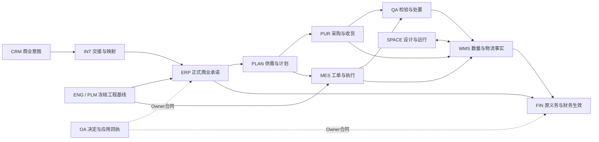

# CP6系统边界与开发地图

状态：整理中的系统设计导航。本页综合当前模块整合与上一轮固定来源分析；逐模块规范附件仍在补读，不能将此总图视为125个目标均已完成实现设计或运行验收。

## 1. 系统解决什么问题

CP6把客户需求、商业承诺、工程版本、生产与采购执行、库存物理事实、财务义务和协作审批连成可追溯业务链。开发时最重要的问题是：**谁有权改变哪个事实，改变发生在哪个事务里，调用方如何确认原操作的真实结果。**

一个业务页面可以同时展示多个领域的事实，但展示者不会因此取得其他领域的写权。流程审批、消息送达、库存记账和财务过账各有自己的身份与结果，不能用一个“成功”字段覆盖所有阶段。来源与现有代码差异继承自[上一轮系统分析](D:/CP6/docs/CP6_编码前整合_20261009/00-设计理解与整合报告.md:29)；精确合同继续收敛于各模块正文与本目录合同索引。

## 2. 领域职责与开发入口

| 领域 | 目标数 | 主要事实与职责 | 与邻域的边界 |
|---|---:|---|---|
| CRM | 7 | 询盘、线索、客户/联系人、商机、销售活动与过程 | CRM持有商业意图与关系，正式商业承诺及数量事实交给Main对应Owner |
| ERP | 8 | 商业主数据、估价、价格、报价、订单、信用与履约 | 报价接受、正式订单、库存履约、财务生效分别有结果 |
| INT | 3 | CRM/Main的身份与商业交接、可靠操作 | 保存映射与交接证据，不增设第二套客户/订单业务账 |
| ENG | 5 | 产品技术身份、技术修订与基线、BOM、工艺、工具技术定义 | ENG固定技术内容；ERP业务主数据、WMS实物工具、REL用途许可各归原Owner |
| PLM | 9 | 需求、工程活动、受控文档、验证、变更、偏差、发布、反馈与生命周期 | REQ/ITER/DOC/VER/CHG/DEV/REL/FBK/LIFE分责；共享CFG解释组合与映射，不接管ENG源BOM/工艺 |
| PLAN | 7 | 需求、计划策略、MRP、供需建议与承诺计算 | ATP建议不等于预留、订单确认或扣库存 |
| PUR | 7 | 采购、收货、匹配、退货与商业原义务 | 采购许可、物理移动、财务应用分开；退货不能反写消除原收货事实 |
| MES | 7 | 工单、执行、领退料、消耗、报工与产出 | 工单义务源于冻结工程基线；MOVE和CONSUME是不同事实 |
| QA | 4 | 检验规则、检验结果、不合格与处置 | 质量处置决定不直接代替Stock或FIN的应用结果 |
| WMS | 25 | 数量核、预留、入出库、物流、标识、追溯与控制 | Stock是数量权威；Claim、Root、批次、序列、LPN分别建模 |
| FIN | 13 | 财务核算、应收应付、资金、发票、成本与结账 | 原义务与过账预算由准确Owner管理，不能因重试重复占用或核销 |
| OA | 5 | 流程定义、表单、任务、审批绑定与连接器 | Workflow决定、Owner收件、Owner业务应用和应用回执各有事务 |
| SYS | 10 | 身份、组织、权限、租户、隐私、审计与管理 | 当前读权及最终写权检查在服务端完成；本地投影不替代权威 |
| PLT | 7 | 上下文、HTTP、消息、投递、可观测性、发布及测试能力 | 共用能力支持业务Owner；租约、投递或checkpoint不是业务生效证明 |
| SPACE | 8 | 空间主数据、资产、设计、发布与运行状态 | 源设计冻结、WMS采用、Runtime期望及实际状态分别记录 |

工程职责按准确册定位：ENG-REV拥有技术内容、基线与冻结回执，ITER拥有工程活动/评审上下文，VER拥有试验评价，REL拥有试制/量产用途许可与采用；技术冻结本身不授权生产。CFG的选择与映射引用原结构、操作发生及输出身份，不把相同ProductId当完整技术身份。[ENG职责与冻结边界](<D:/CP6/docs/CP6_完整成果归档_20261009/完整成果/docs/originals/17/1799cd319ae35310__03_ENG_当前阅读主册.md:39>)；[CFG原发生映射](<D:/CP6/docs/CP6_完整成果归档_20261009/完整成果/docs/originals/07/0791595ffb0d298a__08_CFG_当前阅读主册.md:174>)。

目标计数和既有归属取自[125目标固定矩阵](D:/CP6/docs/CP6_编码前整合_20261009/01-125目标整合矩阵.json)。这些是设计职责，不是125个微服务或125个数据库的部署决定。

图中箭头仅表示责任关系。逻辑Owner、代码项目、物理数据库和部署进程是四种不同边界。每条路由应明确是本地共同提交、分阶段事实交接，还是具名跨库保护协议；这些条件不能由箭头或通用消息库代填。详见[事务与恢复](D:/CP6/docs/CP6_开发设计文档_20261010/architecture/02-事务回执与恢复.md)。

## 3. 从业务目标选择阅读链

| 要实现的业务 | 主阅读链 | 必须同时确认 |
|---|---|---|
| 网站询盘转销售线索 | CRM-INQ → CRM-LEAD，H01 | 浏览器绑定公开回执、Winner Submission、去重与匿名化、CRM同事务写集 |
| 线索转客户/联系人/商机 | CRM-LEAD → CRM-ACC / CRM-CON / CRM-OPP，H02 | preview冻结选择、真正共同事务、原转换Manifest及未知提交查询 |
| 正式商业承诺到履约 | ERP-EST / ERP-PRICE → ERP-QTN → ERP-ORD / ERP-FUL | 正文强制组合、报价原字节、接受范围、来源授权和类型化回执 |
| 工程到生产 | ENG / PLM → MES-WO → MES-MAT / EXEC | 产品、修订、配置、Baseline、Release身份分开；旧工单快照固定 |
| 收货与库存生效 | PUR-GR / QA / WMS-IN → WMS-STOCK | 真实SourceParticipant、Claim/Allowance、容量义务、全部必要Owner参加事务 |
| 预留、拣配与发运 | WMS-RSV → WMS-OUT → WMS-STOCK → ERP-FUL | Pick不等于Ship；完整UseLegs；真实Movement、原结果及来源快照 |
| 采购退货 | PUR-RETURN / PUR-MATCH → WMS-OUT / STOCK → FIN | H31原义务预算、真实物理Part、SourceReceipt与财务独立回执 |
| 客退与销售贷项 | WMS-RMA / QA-NCR → ERP-CREDIT / FIN-INV / FIN-AR | 准确后继采用范围、Required fencing、Stage100组合、各Owner真实结果 |
| 审批后业务应用 | OA-DEF / FORM / TASK / APP → 实际业务Owner | pins、最终授权、DecisionOutbox、TxInbox、TxApplication与连续Receipt链 |
| 空间设计投产 | SPACE设计/冻结 → SPACE-PUB → WMS采用 → Runtime | 完整Target、FrozenSourceBinding、准确APPLIED与Desired/Actual分别判断 |

这是阅读顺序，不是已授权的编码或发布批次。没有参加特定合同的模块不自动获得该合同的写权；反之，合同要求的参与方不能因“首版范围小”被省略。

## 4. 现有实现起点

本任务新建文档分支的Main基线为`90c871fe571fd6b390f53e8678376d7ce60bcb60`。上一轮只读对照固定CRM为`c778a3052a4416b82facb07b1244fc98fb6ad8a1`，Platform为`30bd23af6808d217a23878bd9437513043c52834`；这两个SHA是继承的核对结果，不宣称本轮又检查了最新远端。

| 已知实现事实 | 整合含义 |
|---|---|
| Main有既有分层、多客户端及Space项目，Web采用Vue/Vite | 新设计沿实际模块与部署边界接入，不凭Target目录决定拆服务 |
| CRM Web采用Next/React | CRM设计中的Vue示例保留业务交互与权限约束后适配实际栈 |
| Main已合入SQL Server/PostgreSQL兼容工作 | 归档SQL Server专用锁、rowversion、DDL仍要逐项说明Provider实现与验证范围 |
| Platform运行消费版本为0.10.2，开发默认版本字符串另有历史原因 | 开发输入固定包ID、版本、哈希、发布源码与消费方，不能只看一个props默认值 |
| 现有审批有同步业务回调，新OA设计要求持久交接和Owner应用回执 | 新旧实例需明确唯一应用路径，不能同步回调与异步消费同时写一次业务 |
| PLM WP0为未合入Main的候选实现资产 | 需移植评估，不能称主线已具备完整工程发布能力 |

证据：[固定代码基线与逐项定位](D:/CP6/docs/CP6_编码前整合_20261009/03-现有代码基线.md:1)、[原始只读对照证据](D:/CP6/docs/CP6_编码前整合_20261009/analysis/code-baseline-evidence.json)。本轮没有运行编译、业务测试、迁移或生产验证。

## 5. 一个可交给开发者的任务至少包含什么

每个实现任务先固定Target与具体用例、当前规范组合及SHA、写事实的Owner、依赖合同版本、物理事务边界、业务意图键与原结果查询、最终授权与并发门、实际页面所属应用，以及正常/重试/未知/取消/失权的验收断言。存在未读规范附件时先补读该任务依赖的附件；存在外部缺件时记录准确身份与影响范围。

“当前版本正文在”“独审静态接受”“候选实现存在”“本地业务验证通过”“生产候选合格”分别记录。当前手册的整理进度不得替代这些事实。

## 6. 公共库与应用Owner怎样分工

Main IAM掌握身份/租户权威，原业务Owner解释对象、用途、字段与最终效果；Platform提供可信上下文、codec、HTTP策略、可靠投递和测试原语。应用持有实际事务、业务意图账与回执，公共库参与调用方事务而不自行commit。公共实现应落在准确包合同与应用adapter之间，不能把采购、库存、财务、PLM许可规则塞进一个全局“成功/重试”服务。[SYS身份边界](<D:/CP6/docs/CP6_完整成果归档_20261009/完整成果/docs/originals/d8/d84f5873e46c4c98__S5_SYS-IAM-01_完整设计候选_v0.2.md:5>)；[Platform可靠收发边界](<D:/CP6/docs/CP6_完整成果归档_20261009/完整成果/docs/originals/64/642a2fbc35d17fbf__PLT-DEL-01_完整静态设计_v0.2.1.md:7>)。

工程到制造已有后继专业设计，不能再总称“缺接口设计”：PO CP22对PLM/CFG/ENG/DEV/REL的准确新合同记录ADOPT，MES仍只transport原issuer证据；PREPARE四capture、后续三步十一capture必须来自同preparation链。普通DEV消费仅有据的NOT_APPLICABLE_PROVEN且refs为空，REL pre-root授权与post-root reservation分开。该记录同时明确17个actualAdopted为0、Core providerGrant为0、37 AC NOT_RUN；不扩大RC1原批准。[CP22准确技术消费](<D:/CP6/docs/CP6_完整成果归档_20261009/完整成果/docs/originals/cb/cbd38c11127b763e__OWNER_TECH_CP22_PROFESSIONAL_DELTA_ADOPTION_20261004.md:113>)；[CP22实际采用边界](<D:/CP6/docs/CP6_完整成果归档_20261009/完整成果/docs/originals/cb/cbd38c11127b763e__OWNER_TECH_CP22_PROFESSIONAL_DELTA_ADOPTION_20261004.md:173>)。

EXC CP12另有97叶/10 proposal的准确新scope；PO CP22/Core17设计采用不能替EXC签名或授权。EXC自身仍实际采用/授权0、103 AC NOT_RUN。以上0仅指这些指定记录，不是全系统已有软件能力计数。[EXC独立采用范围](<D:/CP6/docs/CP6_完整成果归档_20261009/完整成果/docs/originals/77/77b33224eaeb51c0__PLAN-EXC-01_缺料与供给异常处置_前后端开发Spec_v1.11_CP12_REVIEW_COPY.md:787>)；[EXC运行边界](<D:/CP6/docs/CP6_完整成果归档_20261009/完整成果/docs/originals/77/77b33224eaeb51c0__PLAN-EXC-01_缺料与供给异常处置_前后端开发Spec_v1.11_CP12_REVIEW_COPY.md:971>)。

接下来的开发切片与退出条件见[编码顺序与适配门](D:/CP6/docs/CP6_开发设计文档_20261010/architecture/05-编码顺序与适配门.md)。这份手册仍在整理；模块必要附件闭合、实际Owner采用与运行验收分别记录，不由总图一次性宣布完成。
