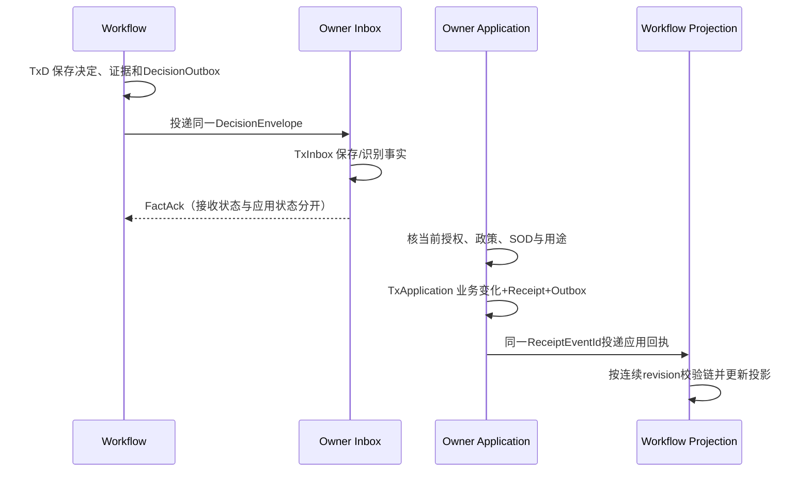

# 事务、回执与恢复

状态：全局合同一致性整理稿，随逐模块必要附件补读继续维护。这里解释跨域合同的共同问题；隔离级别、锁顺序、编码算法、错误码及字段集合仍按具名合同执行。

## 1. 先区分五种结果

| 看到的结果 | 它证明什么 | 不能由此推出什么 |
|---|---|---|
| HTTP成功/传输ACK | 这次运输层请求得到响应 | 业务Owner已产生经济或数量效果 |
| Inbox/事实接收回执 | 接收方保存或识别了原事实 | 当前授权已经核过、业务已应用 |
| PENDING/UNKNOWN/NOT_OBSERVED | 已知处理状态或查询者当前知识边界 | 原操作一定没发生，可以换键重做 |
| Owner的具名业务回执 | 指定作用域、原操作和指定版本的生效结果 | 后来当前状态仍未改变、其他Owner也已生效 |
| 当前快照/连续投影 | 在其准确cut、版本与授权下可见的状态 | 可以改写原回执，或用补历史链结果冒充最新状态 |

OA明确把`FactAck`与`ApplicationReceipt`分开；应用链恢复又有`PENDING_GAP`等独立状态。[OA-APP原规范](D:/CP6/docs/CP6_完整成果归档_20261009/完整成果/docs/originals/0c/0cc2a482fd1dc879__OA-APP-01_业务审批绑定与回调_前后端开发Spec_v1.1.2_R2_REVIEW.md:318)；发运更正的`APPLIED_AS_OF`与fresh cut区别见[OUT原规范](D:/CP6/docs/CP6_完整成果归档_20261009/完整成果/docs/originals/7e/7e25b78ea1261553__WMS-OUT-01_出库拣配包装与发运_前后端开发Spec_v1.3_R3_REVIEW_CANDIDATE.md:905)。

## 2. 同一事务必须落实到实际资源

共同数据库名、同一进程、依次调用几个服务或都调用SaveChanges，都不能单独证明共同事务。**明确要求本地同UoW的路由**必须绑定实际`DbConnection`与`DbTransaction`，由唯一顶层协调者决定提交；参与者不能自行commit、另建连接或以第二条创建消息代替本次写集。参与事务不转移数据Owner。

这不是要求所有跨Owner操作使用一个全系统数据库。OA决定/收件/应用、XDOCK的入库与出库、设备事实与业务应用等本来就分阶段推进；每个阶段保存自己的持久结果。若某条路由明确要求同连接共同门，而部署无法参加，就保留该动作的Required fence；只有准确版本另有已采用的协议时才能按其语义适配，不能用“最终一致”自行放宽原合同。QTN明确规定网络预读仅用于定位，正式动作不能加入共同连接/锁计划时关闭。[QTN共同资源规划](<D:/CP6/docs/CP6_完整成果归档_20261009/完整成果/docs/originals/45/45ac9a34dec6e8e4__ERP-QTN-01_正式报价与客户接受_前后端开发Spec_v1.0.3_REVIEW_R2_CANDIDATE.md:752>)。

| 合同/路由 | 同次提交的核心写集 | 关键边界 |
|---|---|---|
| CRM H01 | Winner Submission、Lead相关图、审计与Outbox等规范写集 | 公开回执不承担内部授权；枚举采用已接受10/20解释 |
| CRM H02 | 本次Lead转换及Account/Contact/可选主商机、Manifest、审计/Outbox | preview冻结选择；不同Owner必须真正enlist；原操作查询不补建资源 |
| Stock Claim与RSV SourceParticipant | Stock数量/Claim/Allowance/Receipt与RSV来源映射、使用和Outbox | 数量核仍归Stock；参加事务不转移业务权威 |
| OUT销售Shipment | Stock效果、RSV Use/Map、ERP/OUT来源、OUT结果与Outbox | 完整UseLegs及Required参与方；准备或开始不能显示已发运 |
| OUT采购物理退运H31 | Stock → PhysicalFact → RETURN/MRX.PhysicalApply → SourceReceipt → OUT Result/Outbox | 原GR事实保留，财务完成另有回执，不能以物理成功代替财务应用 |
| OA Task到Decision（TxD） | Task/History/Token/Instance、DecisionEvidence、AppDecision/DecisionOutbox、Command/Audit | 同库同事务Recorder；缺能力则回滚新写 |
| OA业务应用（TxA） | 当前Owner资格/政策检查后的业务变化、ApplicationReceipt、OwnerOutbox、Command/Audit | 与Inbox事务分离；Owner最终写门仍必须真实存在 |

详细规则与准确定位见[商业合同](D:/CP6/docs/CP6_开发设计文档_20261010/contracts/commercial-contracts.json)、[库存执行合同](D:/CP6/docs/CP6_开发设计文档_20261010/contracts/operations-contracts.json)、[协作平台合同](D:/CP6/docs/CP6_开发设计文档_20261010/contracts/platform-engineering-contracts.json)。本表是语义索引，不是可代替原文的DTO定义。

## 3. OA审批有两次不同的事实推进

图不要求重新发明Worker或部署形态。它要求两个决定点分别持久化并保留各自的结果；同进程也必须经过DecisionOutbox→OwnerInbox→ApplicationReceipt，旧同步OnApproved回调不能成为新接入的旁路。[OA应用事务要求](<D:/CP6/docs/CP6_完整成果归档_20261009/完整成果/docs/originals/0c/0cc2a482fd1dc879__OA-APP-01_业务审批绑定与回调_前后端开发Spec_v1.1.2_R2_REVIEW.md:226>)。缺当前Owner应用能力时可以记录收到的事实及BLOCKED状态，不能把收到审批当成已执行审批。回执有缺口时补连续链，不能重新执行业务来补投影。

`receiptStream`以Scope、InstanceId、SubjectRevision、ApplicationUnitId区分；第一个revision为1且previous为空，后续引用准确前件。只有BLOCKED可在规则允许的新授权应用后追加；APPLIED、STALE、CONFLICT的原终态不能被覆盖。恢复按revision而非收到时间排序。[OA-APP写集](D:/CP6/docs/CP6_完整成果归档_20261009/完整成果/docs/originals/0c/0cc2a482fd1dc879__OA-APP-01_业务审批绑定与回调_前后端开发Spec_v1.1.2_R2_REVIEW.md:218)、[链恢复](D:/CP6/docs/CP6_完整成果归档_20261009/完整成果/docs/originals/0c/0cc2a482fd1dc879__OA-APP-01_业务审批绑定与回调_前后端开发Spec_v1.1.2_R2_REVIEW.md:648)。

## 4. 身份、摘要和重试

业务意图身份、运输请求键、消息ID、尝试次数、行版本、流版本、租约token和授权epoch有不同用途。重试保留合同要求的原意图与原语义；运输别名不得绕过业务槽创建第二次效果。同键异内容应走合同规定的冲突路径。

摘要不能统一成一个“全项目JSON hash”。例如SFS的WFC-CJ-1与OA-APP已接受wire分别有编码规则；APP字段全量/排除字段、数组保序、Unicode处理均按原规范。CRM H02也有专门的OPP选择canonical，不能用Lead本地摘要代替。源码中的`string`、`null`、字段缺席、大小写和顺序可能都是合同一部分。

开发者应为每个入口写清下面四行，而不是只写“支持幂等”：

1. 哪些字段确定同一业务意图，哪些字段只是本次运输身份。
2. 同意图同内容、同意图异内容、不同运输键分别返回什么原结果或冲突。
3. 原结果存在、提交未知、没有观测到三种情况从哪个权威查询。
4. 什么持久证明可以裁定最终无效果，如何同时封住所有旧worker和别名的晚到写入。

具体实例见[CRM-LEAD](D:/CP6/docs/CP6_开发设计文档_20261010/modules/CRM-LEAD-01.md)、[OA-APP](D:/CP6/docs/CP6_开发设计文档_20261010/modules/OA-APP-01.md)、[Stock](D:/CP6/docs/CP6_开发设计文档_20261010/modules/WMS-STOCK-01.md)。

## 5. UNKNOWN、取消和无效果证明

网络超时后优先用原操作身份查询。查询404、未观测、租约过期、空列表或一次失败，不等于全域未应用。若要关闭一个意图，必须由具有实际写入权的Owner在同裁决点保存最终结果及持久阻断，覆盖所有相关执行别名和参与者。

Stock的`SO03/SO03a`按Canonical和完整SourceOccurrenceLeaf集合裁决：已POSTED则回原成功；能封闭未执行意图时才保存`SEALED_NO_EFFECT`，推进epoch并生成ClosureReceipt等写集。解除尚未确认时保持`RELEASE_PENDING`；真实现场发生的ActualFact不能被数据库无效果结论抹去。[Stock封闭规范](D:/CP6/docs/CP6_完整成果归档_20261009/完整成果/docs/originals/5a/5aed7ccb52e1878b__WMS-STOCK-01_库存数量账与移动_前后端开发Spec_v1.1.1_REVIEW.md:1441)。

RSV释放/重绑还要求完整参与者集合的`NoFurtherUseProof`。一个Use可能有多条UseLeg；只确认其中一个腿未执行不能释放整个Claim。`NOT_OBSERVED`或TTL不代替`CLOSED_NO_EXECUTION`。已POSTED效果按准确恢复权威处理，不改造成“从未执行”。[RSV关闭与释放](D:/CP6/docs/CP6_完整成果归档_20261009/完整成果/docs/originals/43/43eb8a01d98631be__WMS-RSV-01_库存预留与批次分配_前后端开发Spec_v1.1.2_REPAIR_CANDIDATE.md:831)。

## 6. 锁与最终授权必须按具名路由对齐

共同原则是：需要保护的授权、业务身份、预算和来源事实应与新效果处于同一可靠的决定边界。实际锁资源及顺序由合同规定，不能把一个模块的隔离级别和锁排序泛化到全仓。

Workflow `WF_AUTH`必须映射到APP已采用的唯一持久ScopeAuthorizationFence域，不能另建一个同名逻辑锁，也不能按actor/task分成互不相见的锁。授权撤销写者也参加同门并推进epoch；UI权限和TTL缓存不能替代最终检查。跨Owner的TxA仍在实际业务Owner本地门下执行。[WF_AUTH合同索引](D:/CP6/docs/CP6_开发设计文档_20261010/contracts/platform-engineering-contracts.json)。

DEL的`DEL-SOURCE-FENCE-1`是专门适配：相关Stock SX05更正、OUT OCX01/关联阶段与DEL Proof提交必须在同一物理连接和SERIALIZABLE事务中，先取原Movement完整Ref的F0，再取Owner Canonical。不能已持旧内层锁后补取F0。相关解释提交推进epoch，DEL最终按fresh cut、完整sourceSet及OUT heads核permit，Proof/Outbox/PermitDecision共同提交。它不授予DEL数量写权，也未证明运行已采用。[DEL适配原文](D:/CP6/docs/CP6_完整成果归档_20261009/完整成果/docs/originals/c3/c30b6885dde887be__WMS-DEL-01_承运与交付证明_前后端开发Spec_v1.3_R3_REVIEWED.md:15270)。

RMA收货还存在需要明确采用的锁序差异：RMA正文把Scope、来源及ReturnEntitlement置于Stock Canonical之前，而Stock/RSV/OUT共同序以Canonical及叶先行。RMA同时要求IN/Stock/RMA真实共同事务。当前整理只登记文本差异，不认定已发生运行死锁，也不擅自改写任一Owner规范；该组合实现前须给出经准确采用的共同资源收集和唯一顺序。[RMA锁序及同UoW](<D:/CP6/docs/CP6_完整成果归档_20261009/完整成果/docs/originals/dc/dc0ca1dd23d08f92__WMS-RMA-01_客户退货实物处理_前后端开发Spec_v1.0_DRAFT(3).md:699>)。

QTN的BP/EST组合已有明确锁规划，不应与RMA差异一起笼统标为“没有共同顺序”：事务前收集完整依赖，采用注册表中BP先于EST的强制边，再进入原Owner内部顺序；缺依赖或有环时LOCK_PLAN_UNPROVEN，源writer不能持锁反向回调QTN。实际注册与全writer参加仍须证明。[QTN已定义组合序](<D:/CP6/docs/CP6_完整成果归档_20261009/完整成果/docs/originals/45/45ac9a34dec6e8e4__ERP-QTN-01_正式报价与客户接受_前后端开发Spec_v1.0.3_REVIEW_R2_CANDIDATE.md:752>)。

## 7. 授权保护不是一个可全局替换的协议

| 路由/用途 | 本版要求 | 不足时的准确边界 |
|---|---|---|
| ACT附件Add/Retain/Remove | File Owner认可的LOCAL_AUTHORITATIVE_GUARD是生效点；相关变化writer与Activity提交参加同Gate | 仅remote GET、TTL票据或reserve/confirm时NO_COMMIT_GUARANTEE / COMMIT_WINDOW_UNPROVEN，相关动作禁用；不因Platform有lease就升级此模式 |
| S6新业务效果 | 真实Owner当前IAM/安全/字段最终门保持至commit；撤权/管理员/worker等全部相关writer参加 | 跨库无实际采用的等价共同门则AUTHORITY_FENCE_UNAVAILABLE；合法历史只读、事实接收、技术重投分别核本类权限 |
| INT-COM有限源用途保护 | 仅MAIN_INTAKE_NEW_EFFECT与CRM_RESULT_PROJECTION，源与消费方各自持久状态机、完整参与集、不可自动过期grant | 不宣称跨库原子；原Owner不接受该用途撤销顺序或全writer未参加则Disabled；不能拿grant代敏感读取或安全门 |

来源：[ACT完整附件差分与唯一提交模式](<D:/CP6/docs/CP6_完整成果归档_20261009/完整成果/docs/originals/67/67dc3667fb852c56__CRM-ACT-01_互动记录与修订追踪_前后端开发Spec_v1.1.1_REVIEW.md:525>)；[S6四类动作与跨库关闭](<D:/CP6/docs/CP6_完整成果归档_20261009/完整成果/docs/originals/d9/d9b57a039e18a689__S6_INT-ID_INT-OPS_完整设计候选_v0.2.md:243>)；[INT-COM有限用途保护](<D:/CP6/docs/CP6_完整成果归档_20261009/完整成果/docs/originals/52/5282d5545f8c9b1d__INT-COM-01_CRM与Main商业交接合同_前后端开发Spec_v1.0.2_REVIEW_R2_CANDIDATE.md:582>)。

INT-COM撤销先关闭新grant入口，既有grant由消费方Execution终态竞争收口；撤销请求先提交、但业务已持有合法grant时，仍可能由业务先持Execution根而commit。必须区分NEW_GRANTS_BLOCKED与EXISTING_GRANTS_SETTLED，不能将所有协议归纳成“请求撤权早于commit就绝无业务效果”。历史敏感披露仍按当前权限另核。[INT-COM提交和撤销顺序](<D:/CP6/docs/CP6_完整成果归档_20261009/完整成果/docs/originals/52/5282d5545f8c9b1d__INT-COM-01_CRM与Main商业交接合同_前后端开发Spec_v1.0.2_REVIEW_R2_CANDIDATE.md:629>)。

## 8. 验收最小集合

每条跨Owner副作用链的实现验证至少覆盖：正常一次效果；原键重复回原结果；同键异内容冲突；竞争提交只产生合规结果；本地共同提交内参与者失败整体回滚、跨阶段已提交事实保留并按原结果恢复；commit之后响应丢失；权限/政策按本版确定的最终门和撤销顺序竞争；旧epoch/lease晚到；取消与正在提交并发；恢复连续回执但不重执行业务；读取历史原结果与读取当前状态分别授权。

这些是从已整理合同归纳的开发检查方向。具体业务AC、支持的数据库Provider和真实运行结果仍按模块验收表登记；本页不把静态fixture或历史PASS改称本次业务验证通过。

ATP当前附件另有声明Replay→Evaluation与终结SQL先Evaluation再Replay的静态顺序差异；尚无运行死锁证据，须先完成共同调用栈/资源顺序论证，见[PLAN-IF-005](D:/CP6/docs/CP6_开发设计文档_20261010/evidence/root-planning-integration-findings.json)。
