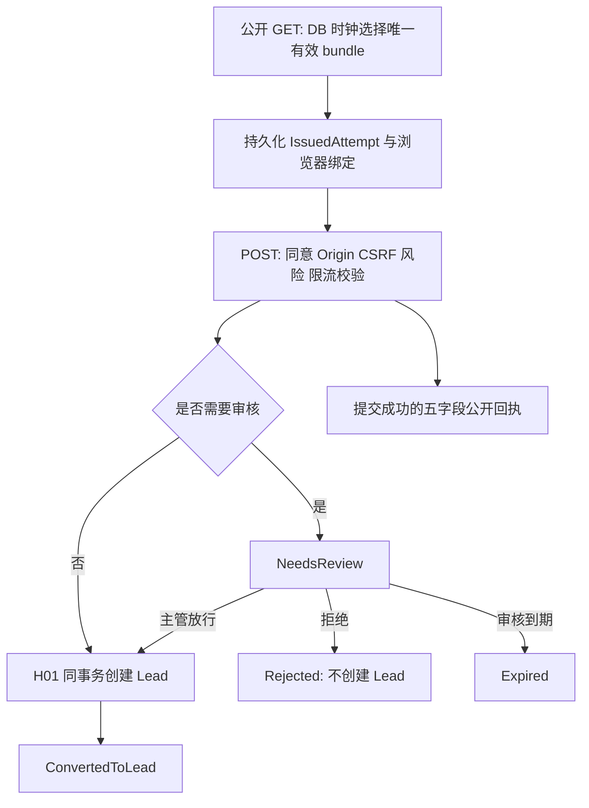

# CRM-INQ-01 公开询盘与受理

整理状态：`core_semantics_consolidated`。这是接受设计的开发说明，未实施、未运行验收。当前正文、物理 SQL、接受记录已补读；大型 fixture 与生成语言实现仍保留精确入口和未读范围，不能据此标记必需材料全部整理完。

## 1. 业务目的、使用者与边界

访客在公开站点提交姓名、联系方式和需求，获得只证明提交结果的浏览器绑定回执；主管在受理队列对风险询盘放行或拒绝；站点配置人员维护表单、工作日历和版本化政策。放行的终点是可追溯的 CRM Lead。该行为不创建商机、报价、订单，也不代表 Won。[范围与公开流程][main7]

CRM 拥有询盘、同意事实和受理结果。SYS-IAM 控制真实授权，SYS-PRIV 控制隐私政策采用，CRM-LEAD 控制 H01 目标图。设计接受没有转移这些 Owner 的生产权限；缺少真实采用证据的接口仍为 RequiredFenced。这里的 AuditFact 是本地审计设计，不能直接宣称已复用 CRM-ACT。[接受范围][ua38]

## 2. 有效版本与强制组合

有效正文是 **RECOVERY-R3 final V15**，不是丢失的历史 R8，也不能继承旧 PASS。组合如下，精确成员索引在阅读证据中保留。

| 材料 | SHA-256 / 作用 |
|---|---|
| 正文 `B-CRM-INQ-R3-V15-FINAL-MAIN.md` | `fa7d0f3388911b30992162f693b8f3340739171d17ae6256c4e72fc569f7890d` |
| 完整冻结包 `B-CRM-INQ-RECOVERY-R3-FINAL-V15.zip` | `3e6b7b43df95b7a04140b208a4902daf9df0516ee1d8a087b2eac4659c9113f5`；包含语言、wire、SQL、UI、fixture 和证据 |
| canonical contract | `ce845bdee6789102605a224991be0e1e959e93b1e4ac82305c0eca71ae935a0e`；38 个 DTO 定义的精确字段入口 |
| SQL | `7308a8affce200278328bf904e501eedc50bde2c19847de92c1fdf3cfed50ae9`；481 行目标物理设计 |
| 正式接受 UA-20261002-B-CRM-INQ-MD01 | `ba52542b2bc18d1e14a191d17675ebb64a9e08d3b56b2e07b8daa184d8143850`；原四个 SPEC 的设计接受 |

采用顺序：V15 最终增补与 RECOVERY-R3 权威执行增补覆盖正文早期示例；随后应用 **CRM-LEAD CP22 已接受 ERRATA 的 H01 限定**。INQ 第 31、193、194 行中旧 `Website=20/New=10` 物理示例不能照搬；采用已确认 `Website=10、Manual=20、New=0`。勘误没有声称遗失的历史 R2/H01 原件已完整恢复。[权威增补][main495] [H01 勘误][errata8]

## 3. 数据、身份和版本轴

| 对象 | 身份 / 关键内容 | 实现含义 |
|---|---|---|
| FormBundleVersion | `(TenantId, Id)`；Site/Form 身份、各自版本、IntakeConfig、BusinessCalendar、PrivacyPolicy、完整 policy、canonical draft、rendered form 和三类 hash | 所有提交解释都冻结到具体 bundle；不能从当前配置重新解释旧提交 |
| FormActivationGuard | `(TenantId, SiteId, FormId)`；CurrentBundleId、Generation、RowVersion | 同站点表单的发布仲裁行 |
| IssuedAttempt | `(TenantId, Id)`；完整 Site/Form/Bundle tuple、BrowserBindingHash、CsrfHash、FingerprintKeyVersion、有效期、状态、消费后 Submission/Receipt/Fingerprint | 公开 GET 就持久化；不能用只在提交成功后才存在的旧 PublicAttempt 表示未提交状态 |
| PublicAttempt / PublicSubmission | 保留当前 `crm_v1` 图；增加精确 bundle、attempt、consent、receipt 绑定 | 复合外键必须同时包含租户和绑定身份，字符串物理形状为 nvarchar(200) BIN2 |
| ConsentFact | `(TenantId, Id)`，另有 `(TenantId, SubmissionId, Purpose)` 唯一；Granted、RecordedAt、PolicyVersion、NoticeHash、WithdrawnAt、RetainUntil、ErasedAt | 同意与撤回有独立事实；匿名化保留不可逆证据，不保留原同意明文 |
| ReceiptProof | `(TenantId, Id)`；租户内 ReceiptId 唯一，SubmissionId、CredentialHash、BrowserBindingHash、Expires/Revoked/Tombstoned 时间 | receiptId 是定位符，单独的 256-bit proof 才是浏览器凭据 |
| CommandReplay | `(TenantId, ActorId, Operation, ResourceId, RequestKeyHash)`；NormalizedPayloadHash、原状态/ETag、Protected/RedactedResult、保留时钟 | payload hash 是占槽后的比较值，不能放进唯一键以允许同键换内容 |
| PrivacyExportJob / Artifact | Job 绑定 Submission 和请求人；Artifact 绑定 Job+Submission，密文、明文 hash、到期、tombstone | 成功下载必须重新验当前权限和一次性 proof，不能发送长期可公开访问 URL |
| AuditFact / OutboxFact / ConsumerInbox | 租户内审计、事件身份；Outbox `(TenantId, AggregateId, AggregateVersion, EventType)` 唯一；Inbox `(TenantId, ConsumerName, EventId)` | 从同一个已持久化赢家派生，消息重投不重复业务写入 |

表与约束的精确列定义见 [SQL 31–132][sql31]、[SQL 279–365][sql279]、[SQL 379–417][sql379]。本模块没有金额和计量单位。时间使用 UTC `Z`；日历计算冻结日历版本。业务序号、bundle/version、rowversion/ETag、事件 aggregateversion、BindingGeneration 各有用途，不能相互替代。

公开输入：`contactName` 1–200、`need` 1–4000 Unicode 标量；email ≤254 且有效格式，phone 为 E.164 `+` 加 7–15 位有效号码；email/phone 至少一个非 null；company 可 null ≤200；consent 必须 true；website 是蜜罐字段 ≤500。所有七个键均 required，nullable 与键缺失不同。拒绝未知/重复键，字符串先 NFC，长度按 Unicode 标量，不能用 UTF-16 单元长度替代。[精确输入][main247]

公开回执恰好五字段：`receiptId、displayReference、receivedAtUtc、message、expiresAtUtc`。其中 displayReference 为 12 位大写字母/数字；不含 SubmissionId、LeadId、风险、状态详情、权限投影。[回执字段][main251]

## 4. 正常流程与状态

流程图中的回执只对应成功提交；后续内部处理不会把内部状态暴露给匿名访问者。[公开流程][main15] [事务写集][main217]

| 状态轴 | 允许转移 | 禁止行为 |
|---|---|---|
| 表单 | Draft→Previewed→Scheduled/Active；Scheduled→Active/Superseded；Active→Superseded/Retired | 改写旧 bundle；用 preview 发放公开 attempt |
| Attempt | Issued→ConsumedWithReceipt 或 Expired；两者→Tombstoned | tombstone 后重新创建业务事实 |
| 受理 | NeedsReview→ConvertedToLead / Rejected / Expired | 重开终态；非 ConvertedToLead 带 LeadId |
| PII | Retained→Anonymized | 通过 replay、导出或缓存恢复敏感内容 |
| 隐私导出 | 20→30/90/99；30→99 | 接受 40/50；终态保留活跃 artifact/proof |

精确状态机在 [canonical stateMachines][canon4012]。Anonymized 或 piiMasked=true 时姓名/联系方式/公司/需求为 null，riskCategories 和 allowedActions 为空。Rejected/Expired/ConvertedToLead 都不得出现审核动作。[响应约束][main259]

公开提交在一个 CRM 外层事务内消费 IssuedAttempt，写 PublicAttempt、PublicSubmission、Received/decision 历史、风险、ConsentFact、ReceiptProof、可选 Lead+LeadHistory、replay、audit、outbox。自动受理与主管放行使用同一精确 H01 图；拒绝不接触 Lead 表。`SaveChanges` 只是阶段性落行，不能替代 commit；循环 FK 在外层事务内先 GraphBindingStatus=0、插 ConsentFact、再改为 10，不暴露半成品。[写集][main217] [SQL 循环 FK][sql419]

H01 必须带原 ReceivedAt、可信操作者、完整签名权限投影及不可变 digest、精确 bundle、日历、同意、联系方式、expectedSubmissionEtag、commandSlot。输出包含 Submission/Lead IDs、两类 ETag、分配/SLA 时钟、原接收时刻及恰好两项 auditIds/eventIds。Website 初始历史 actor 为 null，人工决定历史使用可信操作人；不虚构 landing/UTM/productInterest 等不存在来源。[H01 DTO][main323] [62 列映射][main150] [最终赢家规则][main501]

## 5. API、事件与跨 Owner 合同

| 路径（省略 `/api` 前缀） | 方法 / 成功响应 | 行为 |
|---|---|---|
| `/site/{siteKey}/forms/{formKey}` | GET 200 PublicFormView | 发放并持久化 attempt；返回完整冻结 bundle |
| `/site/{siteKey}/forms/{formKey}/submissions` | POST 201 PublicReceipt | 绑定 attempt+cookie+Origin+CSRF；公开幂等 |
| `/site/{siteKey}/receipts/{receiptId}` | GET 200 PublicReceipt | 验 ReceiptProof、浏览器、行有效期与 PII 状态 |
| `/crm/v1/intake/submissions`、`/{submissionId}` | GET 200 SubmissionPage / IntakeSubmission | 内部队列/详情；pageSize≤30 |
| `/crm/v1/intake/submissions/{id}/release`、`/reject` | POST 200 IntakeSubmission | ReasonRequest；If-Match、稳定命令槽 |
| `/crm/v1/configuration` | GET 200 / POST 201 ConfigurationView | 保存不可变新版本 |
| `/crm/v1/configuration/preview`、`/activate` | POST 200 ConfigurationView | 操作精确保存版本；激活消费一次性 proof |
| `/crm/v1/intake/submissions/{id}/privacy-exports` | POST 202 PrivacyExportView | 请求导出；异步完成 |
| `/crm/v1/intake/submissions/{id}/privacy-exports/{jobId}`、其 `/download` | GET 200 对应状态/下载视图 | 下载使用 CRM bearer 和单独 X-Download-Proof |
| `/crm/v1/intake/submissions/{id}/consent-withdrawals` | POST 200 ConsentWithdrawalView | 签名的撤回动作、If-Match 与同意资源锁 |

精确路径以 [正文 API 表][main42] 和 [OpenAPI][openapi] 为准，表中 `{id}` 是阅读缩写而非新 wire。DTO/错误体以 [canonical definitions][canon379] 为准，拒绝额外字段。OpenAPI、TS、C# 是同一 canonical 的派生实现；不另造响应包装。[严格解码][main61]

事件分两组：原 CRM 精确来源 `public-submission.received / lead.created / pii.anonymized`，与询盘设计本地的 released/rejected/decision/privacy-export/consent/configuration 生命周期事件。后者不是 source-exact。使用 `aggregateid、aggregateversion、schemaversion` 和 HTTPS dataschema；correlationid 为 `hmac:<64hex>`，tenantid 必须等于 data.tenantId，aggregate/subject 必须与资源身份一致。事件禁止姓名、email、phone、company、need、riskReason、browserNonce、proof、permissionProjection。[事件定义][main347] [事件映射与禁止字段][canon4548]

## 6. 事务、并发、幂等和恢复

锁顺序为三类限流桶→稳定 replay 槽→bundle/attempt→submission→lead→history/risk→replay→audit→outbox。限流桶按 IP/browser/form 的 10/20/30 顺序一次性增量，Retry-After 取三类剩余等待最大值。所有当前资源、权限及终态条件在锁内复验。[锁序][main87] [限流][main26]

同 attempt、同 canonical payload HMAC 重放原结果；同 key 换内容或冻结 bundle 不一致冲突且零业务写。内部槽保存 requestKey 的 HMAC，payload hash 只作不可变比较。配置保存额外使用 `(TenantId, ActorId, Operation=configuration.save, RequestKeyHash)` 唯一索引，必须先占槽再分配新 bundle ID；否则重试会产生第二个配置。[稳定槽][main24] [特殊索引][sql327] [配置槽语义][canon4516]

| 失败位置 | 必须得到的结果 |
|---|---|
| begin/锁后/业务行后、commit 前 | 整个 Owner 本地事务回滚，重试重新锁定 |
| commit 成功但响应丢失 | 在原槽读取原 status/body/ETag；按当前 PII 状态/字段授权投影，不能重新执行业务 |
| 响应已回但消息未发 | outbox 继续投递，业务命令不重跑 |
| 消息重复 | Inbox 按 tenant+consumer+eventId 去重 |
| 持续投递失败 | 有界退避；第 5 次进入隔离并告警，保留原事件 |
| 死锁/锁超时 | 未响应前最多 3 次抖动重试，仍失败则 503 crm.lock_timeout |

原记录存在但绑定 attempt/submission 不在，视为恢复/保留证据，绝不能据 replay 重建。Tombstone 的优先级高于旧命令结果。[恢复规则][main136] [canonical recovery][canon4191]

迁移必须使用同一连接、同一事务和 transaction-owned applock，加 PublicAttempt `TABLOCKX,HOLDLOCK` 贯穿快照、generation 分配、约束/trigger 安装、双向集合校验、不可逆 Closed 和 commit。只允许切换时已是 runtime-v2 的快照记录留在 generation 1；默认新记录 generation 2，tuple 必须完整；关闭后 registry 和 cutover state 禁止 INSERT/UPDATE/DELETE。迁移门检查未解决隔离行和有效区间重叠，不能伪造缺失历史 bundle/consent。[原子切换][sql133] [门禁][sql436]

## 7. 权限、租户和隐私

内部受理的基础条件是可信租户匹配 **且** IsSupervisor **且** managedDepartmentIds 包含资源 departmentId；不能以 owner/collaborator 绕过。query 只允许读脱敏投影，完整 PII 还需 view-pii 及逐字段 grant。放行另需 add，拒绝需 edit；操作用的 contactName/email/phone/company/need/riskCategories 必須全有权限。配置使用独立 crm-site:query/configure 与 site/form scope，不以线索权限替代。[权限矩阵][main63]

签名权限投影先严格 shape 再解码；Ed25519，核对可信 issuer/key/catalog、有效期、轮换/撤销、tenant/subject/purpose，最长年龄 5 分钟；Deny 即使重新签名也不能转成 Allow。字段/资源集合不全即拒绝，锁内再次检查当前授权。隐私导出/撤回/worker 的 crm-privacy:* 名称仍需 SYS-PRIV 真实映射，无映射 fail closed。[投影][main79] [canonical authorization][canon64]

匿名回执访问对未知、错误浏览器、缺凭据、跨租户、到期、撤销、匿名化均返回相同 404。proof 不入 URL/日志。所有公开成功和错误响应都带 Date、no-store、frame-ancestors none、no-referrer、nosniff。下载还要求 Content-Disposition 与 X-Content-SHA256。[公开安全响应][main505] [下载最终修订][main529]

保留时间按持久化行时钟，不能用后台执行时刻重算延长。设计值：receipt/NeedsReview 11520 分钟，Converted 24 个日历月，Rejected/Expired 1440 分钟；分配 30、响应 240 个工作分钟。实际政策采用尚未证实。撤回是立即持久化事实，不自动缩短已批准的清除截止；需要 Owner 签名的版本化规则才可改变。Legal hold 排除到期行但不推进截止。清除涵盖 Lead/Submission/搜索标记、敏感历史、replay、导出 artifact/proof、cookie/缓存和风险等，保持不可逆。[保留/撤回][main95] [最终配置与隐私规则][main507]

## 8. 页面与交互

六种页面共 49 个判别联合状态：公开表单、回执、受理队列、受理详情、配置、隐私导出。schema 规定每种状态的 required/forbidden 字段，不允许前端用一个宽松对象装全部状态。[UI 入口][main103] [UI 状态定义][main291]

- 公开表单 submitting 后丢响应进入 ambiguous，只保存本地草稿与安全重试信息；不得凭超时生成新 key。
- 回执把所有不可见情形显示成一个 notFound；不解释后台内部状态。
- 详情 deciding 携带明确 release/reject；终态没有动作；stale 提示刷新并重新决定，不能自动把旧决定套到新版本。
- accessLost 清空敏感状态；配置 dirty=false；公开表单 fieldErrors=[]，避免残留敏感输入。
- 队列 cursor 绑定 tenant、subject、purpose、filter、排序、pageSize、末行 identity/version、签发/到期和密钥版本；在查询前验证，不能拿旧 cursor 切换租户或查询条件。[cursor][main379]

前后端都实施未知/重复键、真实公历日期、时区工作区间不重叠、Unicode 标量等校验。前端按钮只显示服务器 allowedActions，服务器仍负责最终授权。[最终字典与解码][main517]

## 9. 实施顺序与已有代码差异

建议先落实 H01 枚举覆盖和 canonical 严格 DTO，再建立迁移与精确外键图、稳定命令槽、公开安全管线、内部审核、配置生效，最后接隐私 worker 和消息投递。这个顺序来自前置绑定和事务依赖，是整理建议，不是已批准编码排期。

正文固定的代码证据 SHA 为 `c778a3052a4416b82facb07b1244fc98fb6ad8a1`，范围冻结 SHA 为 `3195d7d0a810833cf46147865e0fe473f68e3484`。其旧 PublicAttempt 只在提交后创建，需增加 IssuedAttempt；62 列 Lead codec/graph store 可作适配基础，actor/hash/签名政策不能宣称旧 CreateWebsite 已具备。本次没有重新审查当前工作区运行实现。[固定证据和差异][main3] [图适配][main29]

H01 的 Website/New 值须用 CP22 勘误覆盖所有映射、语言/fixture 和集成约束，不能只改 UI 枚举。SQL 只是设计文本，迁移器还需按明确阶段顺序执行并在真实可丢弃环境验证事务/并发；本次未运行它。[勘误][errata8] [SQL 阶段说明][sql419]

## 10. 验收场景与证据状态

接受包列有 60 个业务 AC，全部 NOT_RUN。以下是实施验收的重点，不是本次结果：

| 场景 | 应验证的可观察结果 |
|---|---|
| 同 attempt 同内容；同 key 换内容 | 前者原结果，后者冲突；均不产生第二 Submission/Lead |
| 放行与拒绝并发；放行与清除并发 | 只有一个终态赢家；败方无部分 Lead/历史/消息 |
| commit 后断响应 | 原 status/body/ETag 能恢复；不重新执行 H01 |
| 新表单发布后旧 attempt 提交 | 使用原 bundle，完整身份匹配，不偷换到新政策 |
| 伪造/撤销/过期/部分字段权限 | fail closed；UI 清 PII；锁内撤权仍阻止写入 |
| 错浏览器/跨租户/匿名化回执 | 完全相同 404 形状，不泄露内部身份 |
| 清除后旧 replay/导出下载 | 不恢复 PII；proof 与 artifact 一起失效 |
| migration 快照期间写入及关闭后追加 registry | 排他锁/不可变 guard 拒绝绕过 generation 规则 |

原终审的 70/70 manifest、设计脚本结果和 DESIGN-TEXT PASS 仅为历史设计证据；原终审也明确没有逐字读完 136 个 fixture steps。TypeScript/C#/SQL 产品运行、政策/IAM/PRIV/Owner 采用仍未证明，ImplementationAuthorized=false。[终审界限][review53] [接受运行界限][ua51]

生成契约补读：canonical 的38定义与正文原样字典、wire/UI schema、TS和C#内嵌schema逐对象相等。公共提交在成功时必须发两个独立Set-Cookie（清attempt，再签receipt）；receipt查询未知／错浏览器／过期／匿名化／撤销均同404。隐私下载的Authorization是CRM会话，X-Download-Proof另承一次性artifact证明，仍重核当前字段/资源权限及CSRF/Origin。公开receipt只含安全确认字段，不能泄露内部LeadId或受理决策。[OpenAPI](<D:/CP6/docs/CP6_完整成果归档_20261009/完整成果/docs/originals/85/8538042210844249__crm-inq.openapi.json:1>)、[授权矩阵](<D:/CP6/docs/CP6_完整成果归档_20261009/完整成果/docs/originals/6f/6fccccd4f384871d__authorization-matrix.json:1>)

TS严格JSON先拒重复／转义等价成员，再递归验证并深冻结；C#先JsonDocument及重复成员检查，再schema和typed decode，49页面状态经六个显式codec路由。任何语言层类型都不替代Winner锁内当前权限／资源重核。[TS L104](<D:/CP6/docs/CP6_完整成果归档_20261009/完整成果/docs/originals/ef/ef9b6e0bc3ac1b3f__B-CRM-INQ-R3-V15-TYPESCRIPT-CONTRACTS.ts:104>)、[C# L171](<D:/CP6/docs/CP6_完整成果归档_20261009/完整成果/docs/originals/25/253daab4784b29ba__B-CRM-INQ-R3-V15-CSHARP-CONTRACTS.cs:171>)、[C# L292](<D:/CP6/docs/CP6_完整成果归档_20261009/完整成果/docs/originals/25/253daab4784b29ba__B-CRM-INQ-R3-V15-CSHARP-CONTRACTS.cs:292>)

136步合成样例的实现含义已按请求、授权、响应、写集和事务逐步归并；以下补充直接影响落库与恢复。所有例值仍是未采用的设计数据。

| 实现点 | 规则与边界 | 精确原例 |
|---|---|---|
| H01分阶段落库 | 同一外层事务先建SubmissionId为空的Lead，再建GraphBindingStatus=0的staging Submission，写Consent，更新双方互引，最后追加回放/历史/审计/消息；每次SQL语句仍即时满足FK/CHECK。所有阶段统一回滚，不能拆成多个已提交事务。 | [FX03-S01](<D:/CP6/docs/CP6_完整成果归档_20261009/完整成果/docs/originals/89/8907803dd2e284d0__B-CRM-INQ-R3-V15-FIXTURES-FULL.json:6280>) |
| 限流窗口 | 三维10/20/30按固定顺序锁定；准确窗口边界滚动计数。429可只持久化桶阻断状态，Retry-After取最大剩余时间，不产生Submission/Lead。 | [FX08-S01–04](<D:/CP6/docs/CP6_完整成果归档_20261009/完整成果/docs/originals/89/8907803dd2e284d0__B-CRM-INQ-R3-V15-FIXTURES-FULL.json:20017>) |
| 受理读面与命令 | 队列游标绑定主体/租户/purpose/筛选/排序/页大小/位置/期限；没有完整PII字段授权就投影null。release/reject锁内重核，每个所需字段即使本次值为null也必须获准。 | [FX14/15](<D:/CP6/docs/CP6_完整成果归档_20261009/完整成果/docs/originals/89/8907803dd2e284d0__B-CRM-INQ-R3-V15-FIXTURES-FULL.json:52202>)；[FX21-S06](<D:/CP6/docs/CP6_完整成果归档_20261009/完整成果/docs/originals/89/8907803dd2e284d0__B-CRM-INQ-R3-V15-FIXTURES-FULL.json:82699>) |
| 提交未知 | commit前失败全回滚；commit后丢响应以同键恢复原status/body/ETag。Outbox重投只做Inbox去重/投递状态，第五次失败进入隔离，不能重跑H01。expectedAudit/Outbox数组包含既有事实，新增效果看writeSet。 | [FX22/23](<D:/CP6/docs/CP6_完整成果归档_20261009/完整成果/docs/originals/89/8907803dd2e284d0__B-CRM-INQ-R3-V15-FIXTURES-FULL.json:84079>)；[FX24](<D:/CP6/docs/CP6_完整成果归档_20261009/完整成果/docs/originals/89/8907803dd2e284d0__B-CRM-INQ-R3-V15-FIXTURES-FULL.json:96633>) |
| 导出事务 | 待办job先存在，再写artifact，最后job进入30并绑定artifact/proof；到期先将job改99解除引用，再清artifact密文。一次性下载proof不是CRM登录凭据；消费与审计同事务。 | [FX25-S05–09](<D:/CP6/docs/CP6_完整成果归档_20261009/完整成果/docs/originals/89/8907803dd2e284d0__B-CRM-INQ-R3-V15-FIXTURES-FULL.json:107696>) |
| 同意与保留 | 撤回同意不重设不可变保留截止。可信retention service不要求人类Supervisor；提前清除拒绝，LegalHold仅排除本次选择而不延长期限。到期同时处理Consent、Lead/Submission、receipt/attempt、Replay、export、risk、cache，保留非PII证据。 | [FX25-S10–23](<D:/CP6/docs/CP6_完整成果归档_20261009/完整成果/docs/originals/89/8907803dd2e284d0__B-CRM-INQ-R3-V15-FIXTURES-FULL.json:120602>) |
| 配置版本 | save→preview→activate使用同一内容及强ETag；激活关旧有效区间、更新guard、消费proof并写证据。回退另建v3，禁止回写v1/v2。proof过期/重用、错主体、范围丢失、重叠、stale ETag均不得发布。 | [FX26-S01–24](<D:/CP6/docs/CP6_完整成果归档_20261009/完整成果/docs/originals/89/8907803dd2e284d0__B-CRM-INQ-R3-V15-FIXTURES-FULL.json:146758>) |

## 11. 具体未确认项与当前整理缺口

1. 真实限流/保留/轮换政策值、批准人、排程、IAM/PRIV 映射及 Owner 采用不能从接受文书补造；激活必须解析 server-owned signed approval fact，缺失/撤销/不匹配就阻止发布。[采用绑定][canon4516]
2. CP22 明确遗失的 R2/H01 原始字节尚未证明恢复；当前采用的是限定替代证据。全历史逐字恢复与当前设计可解释性是两个不同状态。[勘误][errata8]
3. 当前必要规则与136步骤语义已闭合；完整数据库快照的合成字面值、历史CP1和旧源码不冒充全文审计。生成契约与例值差异如下，必须在采用时处理。
4. 后续增补 S001–S052 的有效后继筛查由全局索引协调。本模块当前只采用已冻结组合，不凭新到文件名改换权威。

49个UI样例已完整结构读，其中expired导出例的statusCode=99、expiresAtUtc仍为原到期时间；TS/C#的PrivacyExportView直接入口却要求90/99的expiry/artifact/proof为null。页面入口没有递归执行此附加语义，故须统一“历史到期时间保留”与“到期响应清空”契约后再编码，不能照两份样例各自实现。[UI原例 L1642](<D:/CP6/docs/CP6_完整成果归档_20261009/完整成果/docs/originals/22/229813cf102aad92__ui-positive-cases.json:1642>)、[原例到期值 L1645](<D:/CP6/docs/CP6_完整成果归档_20261009/完整成果/docs/originals/22/229813cf102aad92__ui-positive-cases.json:1645>)

附例不能替代响应契约：FX25-S06 transport.proofLocation仍写Authorization bearer，而其实际headers已经分为CRM会话与X-Download-Proof；FX26-S02/S05页面样例保留旧ETag，与同一步expectedHttp的新ETag不同，前端应采用当前响应。FX27-S03/S04虽名为长度负例，实际预期是先被idempotency_key_invalid挡住，因此不能把它们当作长度验证已经通过的证据。这些是样例采用边界，未运行或改写原接受结论。[下载注释](<D:/CP6/docs/CP6_完整成果归档_20261009/完整成果/docs/originals/89/8907803dd2e284d0__B-CRM-INQ-R3-V15-FIXTURES-FULL.json:113200>)、[响应ETag](<D:/CP6/docs/CP6_完整成果归档_20261009/完整成果/docs/originals/89/8907803dd2e284d0__B-CRM-INQ-R3-V15-FIXTURES-FULL.json:148974>)、[页面ETag](<D:/CP6/docs/CP6_完整成果归档_20261009/完整成果/docs/originals/89/8907803dd2e284d0__B-CRM-INQ-R3-V15-FIXTURES-FULL.json:149244>)、[长度例实际预期](<D:/CP6/docs/CP6_完整成果归档_20261009/完整成果/docs/originals/89/8907803dd2e284d0__B-CRM-INQ-R3-V15-FIXTURES-FULL.json:178594>)

采用前核验：OpenAPI独立根没有 `$defs`，而components.schemas中仍有55个 `#/$defs/...` 引用（首处L4748）；生成TS事件同时声明字符串字段与 `[additional: string]: boolean`；C#数组uniqueItems采用原JSON文本相等，TS采用键排序后的结构相等。前两项分别需要引用定位与类型表达核验，第三项需同值对象键序互换案例核验。这些是本轮静态事实及实施风险推断，未运行编译/解析器/测试；不改原接受结论。完整范围见[整合发现](<D:/CP6/docs/CP6_开发设计文档_20261010/evidence/commercial-integration-findings.json>)。[OpenAPI L4748](<D:/CP6/docs/CP6_完整成果归档_20261009/完整成果/docs/originals/85/8538042210844249__crm-inq.openapi.json:4748>)、[TS L38](<D:/CP6/docs/CP6_完整成果归档_20261009/完整成果/docs/originals/ef/ef9b6e0bc3ac1b3f__B-CRM-INQ-R3-V15-TYPESCRIPT-CONTRACTS.ts:38>)、[C# L255](<D:/CP6/docs/CP6_完整成果归档_20261009/完整成果/docs/originals/25/253daab4784b29ba__B-CRM-INQ-R3-V15-CSHARP-CONTRACTS.cs:255>)

## 12. 来源与实际阅读覆盖

正文530行（含28家族／136步历史fixture摘要）、SQL481、终审86、接受60全文已读。canonical全部根规则／15端点结构补读，38定义与正文原样字典精确对象相等复用；wire/UI/OpenAPI的38定义和TS/C#内嵌schema同样准确相等。OpenAPI全部14路径15方法分三组结构阅读，152相同对象按JSON pointer复用，重建0差异；TS138／C#371行除超长内嵌schema以准确复用外全部源码只读。授权矩阵、语言manifest、CURRENT／freeze完整结构读；70成员manifest校核0差异。没有执行源代码或原验证脚本。

全部49 UI实例按完整结构及24精确复用对象读完；60AC／源追踪规则与已读主文逐条准确相等，AC全部NOT_RUN。固定来源packet271行、NEXT371行、source/derivative匿名化事件schema全文；136fixture每步语义与27类图键/字段/关系已合读，312个before/after图未逐合成值阅读（准确JSON pointer和行段在台账）。CP1仅历史身份/assertions/五段UoW，46图与15输入模板未全文；72原包成员完成角色分类，62固定源码SHA/Git blob精确核对不等于源码全文。当前5登记必要输入为 `required_materials_consolidated`，其含义限于有效设计规则和必要附件语义闭合。V15最终TS／C#／DB／runtime仍NOT_RUN，60业务AC NOT_RUN，Owner UNPROVEN。更细范围与完整SHA见[commercial-reading.json](<D:/CP6/docs/CP6_开发设计文档_20261010/evidence/commercial-reading.json>)，合同入口见[commercial-contracts.json](<D:/CP6/docs/CP6_开发设计文档_20261010/contracts/commercial-contracts.json>)。

[main3]: <D:/CP6/docs/CP6_完整成果归档_20261009/完整成果/docs/originals/fa/fa7d0f3388911b30__B-CRM-INQ-R3-V15-FINAL-MAIN.md:3>
[main7]: <D:/CP6/docs/CP6_完整成果归档_20261009/完整成果/docs/originals/fa/fa7d0f3388911b30__B-CRM-INQ-R3-V15-FINAL-MAIN.md:7>
[main15]: <D:/CP6/docs/CP6_完整成果归档_20261009/完整成果/docs/originals/fa/fa7d0f3388911b30__B-CRM-INQ-R3-V15-FINAL-MAIN.md:15>
[main24]: <D:/CP6/docs/CP6_完整成果归档_20261009/完整成果/docs/originals/fa/fa7d0f3388911b30__B-CRM-INQ-R3-V15-FINAL-MAIN.md:24>
[main26]: <D:/CP6/docs/CP6_完整成果归档_20261009/完整成果/docs/originals/fa/fa7d0f3388911b30__B-CRM-INQ-R3-V15-FINAL-MAIN.md:26>
[main29]: <D:/CP6/docs/CP6_完整成果归档_20261009/完整成果/docs/originals/fa/fa7d0f3388911b30__B-CRM-INQ-R3-V15-FINAL-MAIN.md:29>
[main42]: <D:/CP6/docs/CP6_完整成果归档_20261009/完整成果/docs/originals/fa/fa7d0f3388911b30__B-CRM-INQ-R3-V15-FINAL-MAIN.md:42>
[main61]: <D:/CP6/docs/CP6_完整成果归档_20261009/完整成果/docs/originals/fa/fa7d0f3388911b30__B-CRM-INQ-R3-V15-FINAL-MAIN.md:61>
[main63]: <D:/CP6/docs/CP6_完整成果归档_20261009/完整成果/docs/originals/fa/fa7d0f3388911b30__B-CRM-INQ-R3-V15-FINAL-MAIN.md:63>
[main79]: <D:/CP6/docs/CP6_完整成果归档_20261009/完整成果/docs/originals/fa/fa7d0f3388911b30__B-CRM-INQ-R3-V15-FINAL-MAIN.md:79>
[main87]: <D:/CP6/docs/CP6_完整成果归档_20261009/完整成果/docs/originals/fa/fa7d0f3388911b30__B-CRM-INQ-R3-V15-FINAL-MAIN.md:87>
[main95]: <D:/CP6/docs/CP6_完整成果归档_20261009/完整成果/docs/originals/fa/fa7d0f3388911b30__B-CRM-INQ-R3-V15-FINAL-MAIN.md:95>
[main103]: <D:/CP6/docs/CP6_完整成果归档_20261009/完整成果/docs/originals/fa/fa7d0f3388911b30__B-CRM-INQ-R3-V15-FINAL-MAIN.md:103>
[main136]: <D:/CP6/docs/CP6_完整成果归档_20261009/完整成果/docs/originals/fa/fa7d0f3388911b30__B-CRM-INQ-R3-V15-FINAL-MAIN.md:136>
[main150]: <D:/CP6/docs/CP6_完整成果归档_20261009/完整成果/docs/originals/fa/fa7d0f3388911b30__B-CRM-INQ-R3-V15-FINAL-MAIN.md:150>
[main217]: <D:/CP6/docs/CP6_完整成果归档_20261009/完整成果/docs/originals/fa/fa7d0f3388911b30__B-CRM-INQ-R3-V15-FINAL-MAIN.md:217>
[main247]: <D:/CP6/docs/CP6_完整成果归档_20261009/完整成果/docs/originals/fa/fa7d0f3388911b30__B-CRM-INQ-R3-V15-FINAL-MAIN.md:247>
[main251]: <D:/CP6/docs/CP6_完整成果归档_20261009/完整成果/docs/originals/fa/fa7d0f3388911b30__B-CRM-INQ-R3-V15-FINAL-MAIN.md:251>
[main259]: <D:/CP6/docs/CP6_完整成果归档_20261009/完整成果/docs/originals/fa/fa7d0f3388911b30__B-CRM-INQ-R3-V15-FINAL-MAIN.md:259>
[main291]: <D:/CP6/docs/CP6_完整成果归档_20261009/完整成果/docs/originals/fa/fa7d0f3388911b30__B-CRM-INQ-R3-V15-FINAL-MAIN.md:291>
[main323]: <D:/CP6/docs/CP6_完整成果归档_20261009/完整成果/docs/originals/fa/fa7d0f3388911b30__B-CRM-INQ-R3-V15-FINAL-MAIN.md:323>
[main347]: <D:/CP6/docs/CP6_完整成果归档_20261009/完整成果/docs/originals/fa/fa7d0f3388911b30__B-CRM-INQ-R3-V15-FINAL-MAIN.md:347>
[main379]: <D:/CP6/docs/CP6_完整成果归档_20261009/完整成果/docs/originals/fa/fa7d0f3388911b30__B-CRM-INQ-R3-V15-FINAL-MAIN.md:379>
[main495]: <D:/CP6/docs/CP6_完整成果归档_20261009/完整成果/docs/originals/fa/fa7d0f3388911b30__B-CRM-INQ-R3-V15-FINAL-MAIN.md:495>
[main501]: <D:/CP6/docs/CP6_完整成果归档_20261009/完整成果/docs/originals/fa/fa7d0f3388911b30__B-CRM-INQ-R3-V15-FINAL-MAIN.md:501>
[main505]: <D:/CP6/docs/CP6_完整成果归档_20261009/完整成果/docs/originals/fa/fa7d0f3388911b30__B-CRM-INQ-R3-V15-FINAL-MAIN.md:505>
[main507]: <D:/CP6/docs/CP6_完整成果归档_20261009/完整成果/docs/originals/fa/fa7d0f3388911b30__B-CRM-INQ-R3-V15-FINAL-MAIN.md:507>
[main517]: <D:/CP6/docs/CP6_完整成果归档_20261009/完整成果/docs/originals/fa/fa7d0f3388911b30__B-CRM-INQ-R3-V15-FINAL-MAIN.md:517>
[main529]: <D:/CP6/docs/CP6_完整成果归档_20261009/完整成果/docs/originals/fa/fa7d0f3388911b30__B-CRM-INQ-R3-V15-FINAL-MAIN.md:529>
[sql31]: <D:/CP6/docs/CP6_完整成果归档_20261009/完整成果/docs/originals/73/7308a8affce20027__crm-inq-target-schema.sql:31>
[sql133]: <D:/CP6/docs/CP6_完整成果归档_20261009/完整成果/docs/originals/73/7308a8affce20027__crm-inq-target-schema.sql:133>
[sql279]: <D:/CP6/docs/CP6_完整成果归档_20261009/完整成果/docs/originals/73/7308a8affce20027__crm-inq-target-schema.sql:279>
[sql327]: <D:/CP6/docs/CP6_完整成果归档_20261009/完整成果/docs/originals/73/7308a8affce20027__crm-inq-target-schema.sql:327>
[sql379]: <D:/CP6/docs/CP6_完整成果归档_20261009/完整成果/docs/originals/73/7308a8affce20027__crm-inq-target-schema.sql:379>
[sql419]: <D:/CP6/docs/CP6_完整成果归档_20261009/完整成果/docs/originals/73/7308a8affce20027__crm-inq-target-schema.sql:419>
[sql436]: <D:/CP6/docs/CP6_完整成果归档_20261009/完整成果/docs/originals/73/7308a8affce20027__crm-inq-target-schema.sql:436>
[canon64]: <D:/CP6/docs/CP6_完整成果归档_20261009/完整成果/docs/originals/ce/ce845bdee6789102__canonical-contract.json:64>
[canon379]: <D:/CP6/docs/CP6_完整成果归档_20261009/完整成果/docs/originals/ce/ce845bdee6789102__canonical-contract.json:379>
[canon4012]: <D:/CP6/docs/CP6_完整成果归档_20261009/完整成果/docs/originals/ce/ce845bdee6789102__canonical-contract.json:4012>
[canon4191]: <D:/CP6/docs/CP6_完整成果归档_20261009/完整成果/docs/originals/ce/ce845bdee6789102__canonical-contract.json:4191>
[canon4516]: <D:/CP6/docs/CP6_完整成果归档_20261009/完整成果/docs/originals/ce/ce845bdee6789102__canonical-contract.json:4516>
[canon4548]: <D:/CP6/docs/CP6_完整成果归档_20261009/完整成果/docs/originals/ce/ce845bdee6789102__canonical-contract.json:4548>
[ua38]: <D:/CP6/docs/CP6_完整成果归档_20261009/完整成果/docs/originals/ba/ba52542b2bc18d1e__UA-20261002-B-CRM-INQ-MD01.md:38>
[ua51]: <D:/CP6/docs/CP6_完整成果归档_20261009/完整成果/docs/originals/ba/ba52542b2bc18d1e__UA-20261002-B-CRM-INQ-MD01.md:51>
[review53]: <D:/CP6/docs/CP6_完整成果归档_20261009/完整成果/docs/originals/fd/fd52e07094ec36dc__SR-20261002-B-CRM-INQ-MD01-FINAL.md:53>
[errata8]: <D:/CP6/docs/CP6_完整成果归档_20261009/完整成果/docs/originals/e9/e97177633a150540__ERRATA.json:8>
[openapi]: <D:/CP6/docs/CP6_完整成果归档_20261009/完整成果/docs/originals/85/8538042210844249__crm-inq.openapi.json:1>
