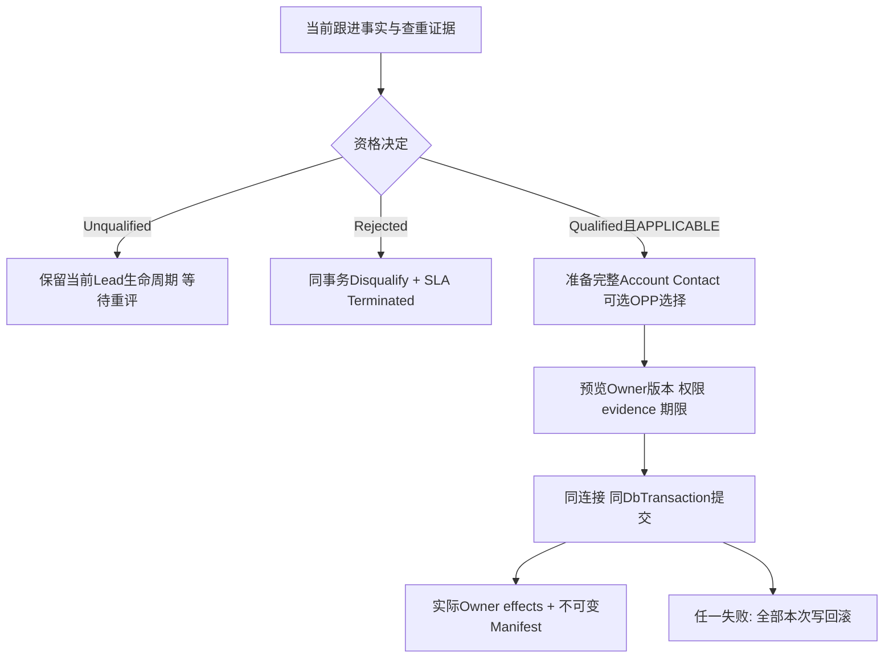

# CRM-LEAD-01 线索管理与资格确认

整理状态：`required_materials_consolidated`。当前CP22五SPEC、60AC、125 schema、H01 38定义、16 API、47表审计图、27表/67FK、治理与26角色采用、正常流程及必要字节关系已完成语义整理。重复合成值、历史源码和作者检查按第12节明确分类；所有业务验收与实际运行采用仍为 NOT_RUN/UNPROVEN。

## 1. 业务目的、操作者和边界

销售在自己的线索中跟进、识别重复、记录资格；主管在管理部门范围分配 Owner/协作者、处理分配和首响 SLA；满足资格后，操作者明确选择 Account、1–20 名 Contact 和是否新建主商机，由 CRM 协调器一次事务转换。后台分别执行 SLA 观察、通知投递、PII 清除和无 Lead 的入站隔离清除。它们是独立账本，不能把通知送达或请求超时当业务状态。[列表和进入][m20] [资格和转换目的][m182]

Lead 始终拥有自己的当前生命周期、活动事实、首响和分配。CRM-ACT v1.1.1 的原生写者范围是 Account/Contact；给其他活动附加 Lead 引用不会产生 Lead Activity，也不能完成首响。ACC/CON/OPP 保留各自资源、权限、版本、保留和 Enlist 责任，LEAD 不直接操作 ERP 客户或订单。[Activity 权威][m130] [接受限定][ua13]

## 2. 有效版本、组合和接受层

当前设计为 **CP22 原五 SPEC 整册**；正文仍保留候选口吻，由后续根接受决定确定有效状态，不能凭文件标题再降为未接受。

| 材料 | 精确身份与作用 |
|---|---|
| 主书 | SHA `23151de8bc435698c04dbed3004683db14eee5bad9f77f315b168cabac2c8cb1`，131963B / 726 行，完整收入16个规范组成部分 |
| 完整冻结包 | SHA `4578f839e4094db347c28b66e97aa7f54bd1623b5ba997b45d59bbae5ceb26bb`，19855996B / 916 成员；分片、重组与成员入口见全局 required-inputs/container-members |
| 原 AC catalogue | SHA `9f8fd4357559f8d246614fe8c9b89f1948cc6afcc6f42327c96f60d2d9f5cc94`，保留原60条规则，不将退回 R3 整册升为接受 |
| 当前 AC mapping | SHA `aeda22b512c5c6202749c23f4e11b06ae4917ac558b432ff9c05c0dd0067909e`；五SPEC交叉覆盖不能相加成74条AC |
| 根接受决定 | SHA `53fcd58e983c1f5d9fb9adc8f9e70622b678e0b8475f8559057e679432d4cea4`；接受原五SPEC、60AC设计覆盖及 Q1–Q5、两项勘误 |

规范次序：当前 CP22 整册+准确冻结包→接受限定和 ERRATA；CP4/7/12/19 有界原设计作为指定继承，CP20/21 原件、被退回 R3 和 historical v3 保持历史身份。当前 audit 为 version4 / `crm-lead:audit-state:cp22:v4`，不是主文450行旧文案中的3；旧1/2/3行仍按其冻结 codec 分派。H01采用 Website10/Manual20/New0；未恢复历史 R2/3069B 勘误的逐字原件不由本次推定恢复。[冻结身份][ua8] [勘误][ua19] [完整限定][e8]

26条专业设计采用记录覆盖13个scope：scope01–09由18条领域/应用/H01/H02/ACC/CON/OPP/Activity/SLA/Notice责任记录采用；scope10–13由8条保留、无Lead维护、privacy/legal、key/backup、IAM/PRIV消费及persistence/UoW记录采用。记录由两名被任命的执行者承担多个功能角色，不是26位历史作者或生产Owner的签署。治理报告签发时仍待root决定；后续CURRENT明确在2026-10-04T02:08:22Z接受到Stage100，全部运行门继续UNPROVEN，ImplementationAuthorized=false。[治理结论](<D:/CP6/docs/CP6_完整成果归档_20261009/完整成果/docs/originals/72/72abaa330c2489fd__CRM-LEAD-CP22-COORD-FINAL-DESIGN-ACCEPTANCE-GOVERNANCE-REVIEW-GPT61-XHIGH.txt:8>)、[领域采用边界](<D:/CP6/docs/CP6_完整成果归档_20261009/完整成果/docs/originals/df/df00bd55c307ae0b__DOMAIN-ADOPTION-REPORT.txt:3>)、[保留等采用边界](<D:/CP6/docs/CP6_完整成果归档_20261009/完整成果/docs/originals/60/606ff8cb8631fe26__REPORT.txt:4>)、[当前接受](<D:/CP6/docs/CP6_完整成果归档_20261009/完整成果/docs/originals/9b/9bdc840679d417ac__CURRENT.json:1>)

Q1–Q5必须随采用保留：ACC是有界umbrella接受的支持文本；INQ缺失R2/3069B H01历史正文不假称恢复；H02采用同库/同连接/同事务原子模式，旧条件性Saga规则保留追踪；SYS只采用本版受围栏约束的消费合同；CP4/7/12/19静态PASS不升级为旧整册或运行成功，Lead原生活动和各Owner保留职责不转移。两项勘误只更正caller/main的audit版本3→4以及Notice引用末行27→23，冻结原bytes不改。[准确限定与勘误](<D:/CP6/docs/CP6_完整成果归档_20261009/完整成果/docs/originals/72/72abaa330c2489fd__CRM-LEAD-CP22-COORD-FINAL-DESIGN-ACCEPTANCE-GOVERNANCE-REVIEW-GPT61-XHIGH.txt:434>)

## 3. 核心数据、业务身份和版本轴

| 对象 | 主事实、身份和版本 | 开发约束 |
|---|---|---|
| 当前 Lead 图 | `crm_v1.Lead` 62列；Activity、FactCorrection、Collaborator、History、BusinessCalendar | 每个 mutation 认证完整图/seal，保留非空子图，不能只更新外观 DTO |
| QualificationDecision/Head | Outcome=Qualified/Unqualified/Rejected；append-only 决定、head 前驱、version和强headEtag | 不新增 current Qualified/Converted enum；decision适用性另为 APPLICABLE/STALE/RESTRICTED |
| QualificationCurrentEffect | Rejected 同命令真实 Disqualify 的 before/after RV、after seal | 适用性绑定其合法 after，不把自身写入误判为STALE |
| ConversionPreview/Participants/State | PreviewId、reservedConversionId、participantId、完整受保护选择、Owner observations、issued/expiry、READY/consumed/ERASED | 预留身份不是已建资源；SELECTED_ACCOUNT在commit解析一次 |
| ConversionManifest / effect receipts | 业务槽 `(TenantId,LeadAuthority,LeadId,LEAD_CONVERSION)`；Lead原版本、资格版本、selection digest、真实Account/Contact/可空Opp links、真实Owner audit/event IDs | 一生最多一份成功转换；业务相同换运输key仍原Manifest，异选择冲突 |
| Assignment/SLA | 分配interval/head；clock/head、responseFact、lifecycle、pause、policy/calendar | 首次分配和首响双时钟独立；重分配不重启首响 |
| DuplicateObservation / Item / ItemToken / DispositionRevision/Head | 完整 source/candidate 身份、RV、normalizer/key/policy、observed/expires、每candidate决定 | 无 observation 总disposition；零item=[]；高匹配不自动merge或复用对象 |
| Query horizon / members | context revision、全授权/search-matched roster摘要、逐根依赖、原queryAt、排序tuple、expiry | 只是非PII查询元数据；不保存旧授权或可读PII快照 |
| NoticeDispatch / Delivery / Attempt | Dispatch `(T,EventId)`；Delivery unique `(T,EventId,RecipientId,Channel)` 和 `(T,SendIdentity)` | 发送前持久SendIdentity；状态与SLA观察独立 |
| Inbound rejection / retention / hold / erasure | `(T,InboundId)`，来源unique `(T,SourceAuthority,SourceMessageId)` | 无Lead父、不造假Lead、不借用Lead deadline/hold |

当前 Lead RV（binary8）、target head revision（十进制字符串/强tag）、Owner opaque版本、preview状态RV、query context digest、audit codec version 各自独立。不能用详情hash代替写入If-Match，不能将 Int64 revision 转 JS Number。Money 的 `amount` 是字符串，连同currency、`basis=NET_EX_TAX_AFTER_DISCOUNT`、currencyPolicyVersion；转换不会新增 pipeline/stage/直接Won输入。[当前图][m24] [三个业务状态轴][m186] [Manifest][m303] [wire单位][m400]

资格请求全部required：outcome、reasonCode(1–64)、reason(NFC/trim后1–1000 Unicode codepoints)、evidenceRefs(0–100)、expectedHead。evidence项严格 `{kind,id,version}`，kind=ACTIVITY/DUPLICATE_OBSERVATION；kind/id排序去重，不能重复计数。expectedHead首次null，后续包含decisionId/decisionVersion/headEtag；If-Match另绑current Lead。[资格字段][m194] [精确 schema][s61]

转换 preview 的精确 wire 是 `qualification、accountChoice、contactChoices、opportunityChoice、candidateDisposition、reason`，并非把主文叙述字段平铺到请求。ContactChoices 1–20，commit正文只 `{previewToken}`，长度1–8192。[Preview请求][s2242] [Commit请求][s2281]

审计及读取图不是整库或公共DTO序列化。当前v4按47张登记表闭合，即使没有行也必须保留空表；每张表采用登记的主键、UTF8 BIN2排序、SQL类型/nullable和canonical normalization。安全投影排除PII、任意JSON、明文无密钥hash和搜索token值；只有OwnerAuditIdsJson/OwnerOutboxIdsJson这两个安全标识数组例外。跨表必须逐边校Tenant，候选图仍是私有对象，另验当前对象和字段权限。[47表投影](<D:/CP6/docs/CP6_完整成果归档_20261009/完整成果/docs/originals/fb/fb5d1daa07b4b50b__CP22-AUDIT-PROJECTION.json:52>)

| 物理/读取边界 | 实施规则 |
|---|---|
| 根、子表和来源表 | Lead root按Id；ActivityFactCorrection经ActivityId→已选Lead；SubmissionHistory/Risk经已选Lead.SubmissionId→PublicSubmission；不能通用地用row.Id=LeadId。 |
| 重复检测 | source及已绑定候选的token完整revision/head，原观察及处置完整历史；tenant cutover保留该租户完整不可变历史。CandidateLeadId不授权序列化候选PII。 |
| 无Lead入站维护 | LeadInboundRejection和InboundPayloadPrivacyState在Lead业务图恒为空；真实清理按InboundId、政策、hold、密钥和独立receipt执行。 |
| PreviewState | audit只绑State/ConsumedByConversionId，生成的RV单独进入读取dependency；实际最终图仍须重捕获，不能因audit排除RV而放松CAS。 |
| 当前建模与历史集合 | 27张successor表/67条tenant FK给出本次增补物理约束；96模型/177FK的source catalog保留多代来源，旧Batch/Map与旧Qualification/Preview字段不能整体导入当前迁移。安装和采用须逐原source核定。 |

[范围和排除](<D:/CP6/docs/CP6_完整成果归档_20261009/完整成果/docs/originals/fb/fb5d1daa07b4b50b__CP22-AUDIT-PROJECTION.json:3703>)、[当前DDL](<D:/CP6/docs/CP6_完整成果归档_20261009/完整成果/docs/originals/5f/5fd37f5ccc2c3cb5__CP20-additive-schema.sql:5>)、[多代来源目录](<D:/CP6/docs/CP6_完整成果归档_20261009/完整成果/docs/originals/f0/f08d5a222e6981b8__CP22-SOURCE-SCHEMA-CATALOG.json:2>)。

## 4. 正常流程、状态与写集

### 4.1 进入、查询和分配

手工创建只接受联系内容、departmentId和合法ownerId；禁止浏览器填 tenant/source/status/期限/consent/qualified/关系字段。先查稳定手工槽，再调用真实CreateManual/CreateNative/GraphStore Enlist，写完整62列、日历、search tokens、assignment1、SLA1/head/lifecycle/queue、audit/outbox/terminal一次提交。[手工进入][m58]

H01有两个合法分支：源coordinator尚未创建赢家，receiver在同事务Enlist创建一个Lead；源SubmitPublic/Release已经创建赢家，则验证Submission↔Lead、完整codec图及原receipt，仅初始化缺少target事实。只有lead.created最小事件时为WAITING_SOURCE，不从事件重建PII/receipt，不再次CreateWebsite。响应anchor=originalReceivedAt，分配anchor=operationAt，按冻结日历分别+240/+30工作分钟；Owner空、首响空、资格Undecided、conversion NONE。[H01接收][m62]

分配必须核source与目标部门管理权、Owner是目标部门有效成员、协作者同部门有效且唯一并排除Owner。集合按文本UUID排序，完整取代不能把隐藏/未分页成员当空。真实Owner/部门改变关闭旧interval并追加连续后继；新键相同合法集合是semantic no-op，仍可有命令receipt；同键重放不新增命令。Owner失效保留ID/历史不自动换本人；已转换Manifest不被归属变更改写，外域对象Owner也不跟着改。[分配与协作][m89]

### 4.2 首响与 SLA

最早有效响应来自当前实际Lead Activity：Phone+Connected、Email/Message+Sent、Meeting+Held，按 effectiveOccurredAt/recordedAt/ActivityId 排序；事实更正重算、内容更正不制造事实。早于创建的真实响应保留并标 EXCLUDED_PRECREATION，不完成SLA；撤回唯一有效事实追加resolution/head。Rejected真实Disqualify并终止SLA，转换本身不终止Lead。[双时钟与响应事实][m124]

唯一v2 overlay状态优先级：**Terminated→Responded→Paused→Breached→DueSoon→OnTrack**。仅 ResolutionKind=QUALIFYING且ExcludedFromSla=false为Responded。open pause未提交关闭前，即使达到cap仍Paused；effectiveDue=storedDue+min(cap,按冻结日历累计的open pause工作分钟)，closed pause已入storedDue不得重复加。UTC now>=due才Breached；DueSoon按剩余工作分钟阈值，不能用经过30分钟兜底。assignment即使response暂停仍可独立超时。[唯一SLA读取算法][m482]

日历发布不可变、有效区间不重叠；按operationAt必须唯一有效policy。当前calendar仅支持same-day periods/holidays，不认识的exception/跨日段返回503 CALENDAR_CONTRACT_UNSUPPORTED。DST gap边界逐分钟移至合法；ambiguous start取首次/end取最后，累计elapsed UTC工作分钟。业务Activity的模糊本地时刻必须让用户选offset，不能套日历边界规则。[日历及政策][m116]

### 4.3 资格、准备和转换

资格决定是append-only，evidence后来变化旧决定不改、applicability变STALE；服务器不得替换请求旧evidence version后继续写。Qualified/Unqualified不改current domain，Rejected必须同事务调用真实Disqualify、同步生命周期、head、queue、audit/outbox/terminal。已有Manifest阻止矛盾新资格和第二转换。[证据][m208] [资格事务][m224]

Account只能USE_EXISTING或完整CREATE，不凭同名复用；CREATE使用原CreateAccountRequest，不能使用R3简化legalName字段。Contact每项唯一clientRef，CREATE使用完整原DTO；USE_EXISTING须精确现有relation版本，新增关系必须用原RelationshipPlan/ApplyPlan，不能把复用悄悄变为改关系。`accountRef=SELECTED_ACCOUNT`指本次选择，其他显式AccountId保持原身份。Opportunity仅NONE/CREATE_PRIMARY，后者带完整OpportunitySeed/Requirement/Forecast/stakeholders；没有任意复用无关Opportunity入口。[Account选择][m242] [Contact选择][m251] [Opportunity选择][m261]

原子提交先证实所有Enlist能力，再按公共顺序锁command/conversion guard、policy、Account→Contact→Lead/current/qualification/preview/candidate→新OPP根和尾表。锁内复验原选择、全部版本、权限、资格与期限。依次执行真实Account/Contact/可选OPP原用例；从实际Owner效果构造Manifest，不预造成功资源ID。Audit/Outbox是即时FK父，必须先于Manifest/effect尾行存在；完整actual-final校验后才admission/terminal/status和唯一commit。任何失败回滚本次新对象/关联/清单，不删除先前已存在对象。[逐调用和DML顺序][m428]

## 5. 接口、事件与 Owner 合同

| 新目标入口 | 输入/输出、用途 |
|---|---|
| POST `/api/crm/v2/leads/query` | LeadQueryRequest→LeadQueryPage；稳定horizon/keyset，不接v1 offset cursor |
| GET `/api/crm/v2/leads/{leadId}?childPageSize=...` | closed LeadDetailTarget，childPageSize1–30，默认30 |
| GET `/api/crm/v2/leads/{leadId}/qualification-context` | 当前Head、reason/outcome规则、字段能力、可选授权证据 |
| POST `/api/crm/v1/leads/{leadId}/qualification-decisions` | QualificationDecisionRequest→安全决定/admission；强If-Match+原key |
| POST `/api/crm/v1/leads/{leadId}/conversion-previews` | 完整Owner选择→受保护Preview与安全handle |
| POST `/api/crm/v1/leads/{leadId}/conversions` | `{previewToken}`→原子转换/admission |
| GET `/api/crm/v1/leads/{leadId}/conversion` | NONE / COMMITTED及当前授权Manifest /受限投影 |
| GET `/api/crm/v1/commands/{commandId}` | 当前授权完整命令结果或redacted tombstone |
| POST `/api/crm/v1/leads/{leadId}/command-results/query` | 按本人operation/key查原槽；读取原本人命令槽，不创建业务mutation |
| POST v2 `/activities/query`、`/history/query`、`/qualification-history/query`、`/sla/pauses/query`、`/sla/breaches/query` | ChildPageRequest={contextId,contextRevision,cursor,pageSize}；均为读操作，不带mutation Idempotency-Key/If-Match |
| GET v2 `/notice-deliveries`、`/api/crm/v2/notifications` | 前者Lead下当前授权投递元数据，后者当前授权PUBLISHED通知 |

接口不得因旧/current命名相近冒称已部署。精确schema入口为 [CP20-qualification-h02.schema.json](<D:/CP6/docs/CP6_完整成果归档_20261009/完整成果/docs/originals/24/2428190864cfd501__CP20-qualification-h02.schema.json:1>)，OpenAPI为 [CP20-qualification-h02.openapi.json](<D:/CP6/docs/CP6_完整成果归档_20261009/完整成果/docs/originals/ce/ce54223a07bb5aeb__CP20-qualification-h02.openapi.json:1>)；H01独立 [accepted wire](<D:/CP6/docs/CP6_完整成果归档_20261009/完整成果/docs/originals/12/12f9f2e205c63916__CP20-h01-accepted-wire.schema.json:1>)。125个主schema、独立H01的38defs、OpenAPI全部16入口及TS/C#的685字段已结构合读：H01逐值复用准确INQ定义，OpenAPI只改引用命名空间。静态类型仍需实际strict decoder；C#字符串enum/abstract union不能直接等同闭合wire校验，CommandCommitted在wire同时属于CommandView/MutationResponse，单继承DTO需要显式适配。[详情和后续页][m532] [未知commandId恢复][m404]

跨Owner Enlist需要真实DbProvider/DatabaseIdentity/DbContext/ConnectionId/联接路径/原contract digest/锁序/无内部commit边界；`CanEnlist=true`不够。参与者不得自行commit、HTTP另建或发第二创建消息；无法证明时业务写前503 COMMIT_GUARD_UNPROVEN。OPP `H02-OPP-SELECTION-CANON-1`只剔临时leadReadToken/EvidenceRef.proofRef，业务证据身份保留；本地selection摘要不能冒充OPP摘要。[Enlist][m282] [真实Provider输入输出][m406]

## 6. 事务、幂等、并发与恢复

新动作稳定槽为 `(T,Actor,Operation,LeadId,RequestKeyHash)`；新Idempotency-Key是UUID，原CP4/7/12/19仍为1–200字符串。六项fingerprint为method/path/LeadId/原IfMatch/canonicalBody/semanticTail。**Cp18Frame**的NULL optional尾成员省略；**Cp18FrameStringArray**的六个槽保留null sentinel；新**Cp21Frame4**有固定四槽。三者不能互换，只因名称接近就统一实现会破坏原键和摘要。[精确请求与摘要协议][m400] [旧与新codec][m459]

顺序是当前结果读权→原槽replay/conflict→新写CAS/领域检查→单事务Enlist→完整audit→outbox/body/result→安全admission/授权terminal→唯一commit。同键replay返回原非PII AdmissionReplay，敏感详情另经GET当前授权；不让历史成功payload绕当前撤权。commit尝试后无确定结果是UNKNOWN；NOT_OBSERVED只表示当前未见，允许同原key/冻结意图查询或重试，不授权新key/新Owner对象。相同业务选择不同运输key仍原Manifest；不同选择409 H02_CONVERSION_CONFLICT。[错误与未知恢复][m311] [统一调用顺序][m673]

当前audit v4固定47表/661列的safe registry和明确scope join，不从样本/运行表结构猜列；未知semantic表/列或不完整范围写前fail closed。ActivityFactCorrection按ActivityId连父，不能拿其Id或不存在LeadId过滤；SubmissionHistory/Risk按SubmissionId连父；LeadSlaPause无RowVersion，绑定完整实际tuple。PII、cipher/wrapped key、任意文本/JSON和非密钥敏感hash不能混进safe graph。[完整图范围][m694]

即时FK循环采用actual before→非循环写及actual生成版本→typed pending tail→immutable Audit/Outbox父→实际tail/CAS→完整actual after recapture→ConfirmCp22AuditAfterEnlisted→commit。只为解环从audit排除PreviewState.RowVersion，它仍在read dependency单独绑定；不得预测数据库RV或回头修改immutable audit。确认缺失或hash不符整笔回滚。[实际后像确认][m708]

SLA worker用tenant/shard lease与严格递增fencing，观测unique `(TenantId,LeadId,ClockRevision,RuleCode)`；旧worker失去租约后不可写。Notice首个consumer一次事务持久完整收件计划和所有slots；变政策不能悄然给旧事件加收件者。每次发送前写STARTED，响应丢失即UNKNOWN，按原SendIdentity查询，即使ProviderMessageId还为null。撤权以同identity SuppressProvider形成真正fence，UNKNOWN不能直接改SUPPRESSED；PUBLISHED需要真实message ID/receipt。[SLA worker][m134] [持久投递][m564]

操作SQL均是内部设计文本，不能单独代替调用方的完整校验或对浏览器开放。资格子过程核同事务、命令父、当前Lead/RV/policy、完整head前驱与证据source RV；事实更正、有效类型/时间、当前主体和字段权限还由可信caller锁内复验。终结命令先有原Admission，再写唯一Terminal、把原status revision1/ADMITTED CAS成revision2/COMMITTED；这些返回行在唯一顶层commit前都不是外部成功。[资格和终结](<D:/CP6/docs/CP6_完整成果归档_20261009/完整成果/docs/originals/e7/e789f4c77bce40d5__CP20-enlisted-writes.sql:14>)

通知provider调用在本地claim/finish事务外。每次claim增fencing，start先落STARTED和attempt号；finish必须匹配owner/fence/RV且lease尚有效。CLAIMED过期时，有STARTED转UNKNOWN并查询原SendIdentity；未开始才回WAITING。PUBLISHED须真实providerMessageId+receipt，SUPPRESSED须FENCED_SUPPRESSED，超时不能自行推断已抑制。[通知恢复](<D:/CP6/docs/CP6_完整成果归档_20261009/完整成果/docs/originals/b0/b087d4792b837f26__CP21-notice-ledger.sql:71>)

查询延续会在新的短SNAPSHOT内重建完整授权且search-matched人群，包括前页没有出现的新匹配行；每根全依赖、零item observation、candidate权限、到期边界也要比较。源Lead RV不变不代表context有效。任一差异409 CURSOR_STALE，provider缺失503且不返回部分页或计数；到期最多五分钟，还须早于所有SLA、证明、PII和权限边界。[完整查询窗口](<D:/CP6/docs/CP6_完整成果归档_20261009/完整成果/docs/originals/2a/2aabb3564dc17d24__CP20-QUERY-HORIZON.md:13>)

## 7. 权限、租户和隐私

Mine仅当前Owner/有效协作者，创建者身份不扩权；Managed需当前管理部门权限。动作、字段input/write/read、purpose、资源scope分别核验：query/detail=crm-lead:query，create=add，assign=assign，activity=follow-up，qualify=qualify，preview=convert-preview，commit=convert。Rejected另需current edit/PII及policy要求的主管；新Contact inputNew不要求具备历史PII read；相反响应里的旧个人字段仍需read。范围外与不存在同404，action/field拒绝403，IAM/catalog/revocation/provider无法验证503。[权限矩阵][a4] [附加守卫][a131]

联系人/搜索内容不写URL/localStorage/sessionStorage/普通日志。Search最多200，NFC trim后SearchHashes逐token AND，需personalSearch及检索字段探测能力，retained且未到deadline才参加；provider缺失503而非明文扫描或伪空结果。隐藏重复候选不返回名字、数量、证据，也不参与资格门。[完整查询][m30] [重复候选][m157]

Lead保留anchor原originalReceivedAt，UTC+24日历月，分配、资格、转换不延期；Submission可能更早到期，独立清。清除必须锁完整hold/current privacy图并认证seal，清实际历史tokens/reasons、命令终端、current联系人/活动敏感内容；immutable protected payload通过销毁wrapped-key companion并CRYPTO_ERASED，不能只改状态留可用key。duplicate双向引用先删ItemToken叶再Head/全部TokenRevision，保留TokenErasureFact。Manifest最小业务证明保留，恢复不能再Enlist重建PII。外域Account/Contact/OPP由各Owner清除。[deadline及hold][m607] [完整清除事务][m613]

无Lead隔离raw单独按冻结InboundRetentionPolicy的retainSeconds计算PurgeAt，不能套24个月。policy/key不可用时NEVER_RETAINED、零raw/key，PurgeAt=ReceivedAt，仅保留最小身份/安全code/keyed digest。独立hold只阻止销毁，不授到期后的普通raw读取。purge先取得真实UPDATE OUTPUT的新privacy RV，再构造不可变安全receipt；旧源消息重试只返回原拒绝/清除tombstone，不重新接入raw。SQL清key不是KMS/备份全局销毁证明；恢复开放业务前必须应用不回退的erasure watermark。[独立入站保留][m646] [备份恢复门][m626]

## 8. 页面、查询和服务端验证

列表默认排序priority ASC/nextAction ASC/receivedAt ASC/Id ASC，另允许receivedAtDesc、updatedAtDesc并加UUID BIN2补序。pageSize1–100；counts与items来自同短SNAPSHOT的完整当前授权过滤集合，cursor只决定页成员。current source FirstResponseAt不作为v2响应真值，必须消费同事务完整SLA overlay。[排序计数][m42] [rank和overlay][m490]

v2 context绑定完整prefilter roster、每根safe graph、zero-item observation身份/到期、每candidate当前可见性及disposition、qualification适用性、SLA时间边界、Manifest/preview状态与字段/权限stamp。最大5分钟且早于任何依赖到期；新匹配对象、无RV变化的到期/zero-item观察也会使下一页409 CURSOR_STALE。不能按原Lead ETag给304或悄悄重算now后沿旧context续页。[完整context协议][m501]

详情真实返回原actor、content/fact corrections、资格reason/evidence/history、SLA pause/breach、Manifest。被拒字段null+redactedFields，真实null则没有redaction；缺依赖503，不返看似完整的空列表。单个Activity所有corrections都要完整，太大先RESPONSE_TOO_LARGE，不能暗设max1000裁掉。每类child cursor同detail revision并封存kind/Lead/subject/time/size；Back/Close/new request使旧generation失效，双next只按ID追加一次。[详情与子分页][m532]

资格/转换UI区分qualifiedApplicable、qualifiedStale、previewReady/Expired、submitting、resultUnknown、committed、versionConflict、dependencyUnavailable、accessLost。只有Applicable能prepare；编辑选择废弃旧token；unknown禁止生成新转换；committed仅可导航当前授权Manifest链接。撤权清PII、候选、drafts、observations和preview，不保留离线工作集。[交互状态][m330]

## 9. 实施顺序与既有代码差异

固定来源是CRM `c778a3052a4416b82facb07b1244fc98fb6ad8a1`。当前领域没有Qualified/Converted transition，也没有已证明采用的ACC/CON/OPP独立writer；目标新增状态/路由/表/Enlist均为待实现合同。本次未重新审当前工作区代码。旧ExecuteLeadAsync、FinalizeLeadCommand等自带事务方法不能冒称参加外层H02；需真正无commit的Enlist/Finalize消费者。[当前领域差异][m178] [调用边界][m394]

建议依赖顺序：固定codec/version dispatch和权限provider→完整current图认证/新safe registry→稳定命令与结果查询→policy/calendar及SLA overlay→query/detail contexts→assignment/duplicate/qualification→Owner真实Enlist+H02→通知和完整privacy恢复。该次序是整理建议，未代用户批准实现或政策。迁移要证明module-only写权限、签名角色、CHECK(1,2,3,4)、v4 Record/Confirm以及旧版本不重解释。[真实采用门][rv142]

## 10. 验收场景及证据状态

原60AC全部NOT_RUN、执行0。原独审FULL_FIVE_SPEC_STATIC_DESIGN_PASS关闭39项静态设计问题，随后根接受；历史独审中的检查数量不是本轮执行结果。[原独审结论][rv6] [运行边界][ua23]

| 场景 | 需要实现验证的结果 |
|---|---|
| H01源已存在Lead，换运输MessageId重复 | 验原赢家仅补target，无第二Lead；无完整源证据WAITING_SOURCE |
| same-key分配 / new-key同集合 / 并发同RV | 原replay / semantic no-op / 只一winner且另一412 |
| 非空precreation首响、open pause与DST | 排除首响仍Awaiting；effective due按工作分钟；不重加closed pause |
| 零候选观察刷新、到期、隐藏候选撤权 | Lead RV可不变，context仍stale；无泄露count/旧页 |
| Rejected合法Disqualify | 同事务after-effect、Terminated、准确pause close；不自标STALE |
| 新Account+新Contact+可选Opp任一失败 | 整笔本次写回滚，既有对象不删，未提交ID不可导航 |
| commit丢响应且无CommandId | 原operation/key查询；NOT_OBSERVED不是创建许可 |
| 同业务选择换key/改变选择 | 原Manifest/冲突；无第二Owner调用 |
| audit缺一child或尾CAS不符 | actual-final Confirm失败，外层完整rollback |
| 首通知PUT丢响应+撤权+晚PUT | 原SendIdentity query/suppress仲裁，无第二message |
| 到期+hold竞争、恢复旧备份 | 锁内hold生效或fail closed；清token/key/历史；watermark前不开放PII |
| no-Lead policy不可用 | NEVER_RETAINED零raw/key，原源重试只安全tombstone |

原AC048–052条件复杂批次规则继续保留；当前采用原子替代，`NOT_APPLICABLE_TO_ATOMIC_MODE`不等于实现了Saga。[AC分组与替代][rv136]

125定义的字段语义补充（用于实现精确DTO；完整字段仍以原schema为准）：

| 合同 | 开发约束 | 原定义 |
|---|---|---|
| 版本与时间 | decision/contact/relation/clock等Int64版本是十进制字符串，不能转JS Number；LEAD时间严格UTC七位小数，CON原时间为三位小数，必须显式无舍入适配。金额按OPP字符串decimal(19,4)，需求数量六位小数，不能混入浮点。 | [版本](<D:/CP6/docs/CP6_完整成果归档_20261009/完整成果/docs/originals/24/2428190864cfd501__CP20-qualification-h02.schema.json:7>)；[CON时间](<D:/CP6/docs/CP6_完整成果归档_20261009/完整成果/docs/originals/24/2428190864cfd501__CP20-qualification-h02.schema.json:779>)；[金额](<D:/CP6/docs/CP6_完整成果归档_20261009/完整成果/docs/originals/24/2428190864cfd501__CP20-qualification-h02.schema.json:1866>) |
| Account/Contact选择 | ACC只传接受字段；没有legalName/status/sourceLeadId/ERP字段。CON wrapper将accountId改为显式AccountBinding，交Owner前还原准确DTO；额外明确选定关系须保留，至少一条关系连接本次所选Account；purposeCodes不能自动授予渠道同意。 | [ACC](<D:/CP6/docs/CP6_完整成果归档_20261009/完整成果/docs/originals/24/2428190864cfd501__CP20-qualification-h02.schema.json:424>)；[关系](<D:/CP6/docs/CP6_完整成果归档_20261009/完整成果/docs/originals/24/2428190864cfd501__CP20-qualification-h02.schema.json:804>)；[渠道](<D:/CP6/docs/CP6_完整成果归档_20261009/完整成果/docs/originals/24/2428190864cfd501__CP20-qualification-h02.schema.json:868>) |
| 关系变更 | ADD/END/CORRECT与primary ADD/REVISE/WITHDRAW各需对应版本。整集合token、expectedSetVersion与preserveUnmentioned=true同时保留；合计变更不得超过100，不静默改写Owner plan。 | [关系计划](<D:/CP6/docs/CP6_完整成果归档_20261009/完整成果/docs/originals/24/2428190864cfd501__CP20-qualification-h02.schema.json:1503>) |
| 重复候选与准备 | 当前可见observation每条绑定真实处置head；零可见项合法为空，隐藏项不泄漏、不计数。preview保留conversionId/participantId只供准备，选择变化必须重新准备；提交输入仅previewToken并锁内重读当前证据。 | [候选绑定](<D:/CP6/docs/CP6_完整成果归档_20261009/完整成果/docs/originals/24/2428190864cfd501__CP20-qualification-h02.schema.json:1827>)；[准备结果](<D:/CP6/docs/CP6_完整成果归档_20261009/完整成果/docs/originals/24/2428190864cfd501__CP20-qualification-h02.schema.json:2336>) |
| 提交与未知 | Manifest至少Account和1–20 Contact；Opportunity可显式NONE，成功仍需2–22 participant receipts及Audit/Event。权限不足返回COMMITTED_RESTRICTED，不能伪装NONE；NOT_OBSERVED的commitKnowledge=UNKNOWN，只查原命令或重送冻结原意图。 | [结果Manifest](<D:/CP6/docs/CP6_完整成果归档_20261009/完整成果/docs/originals/24/2428190864cfd501__CP20-qualification-h02.schema.json:2626>)；[未知](<D:/CP6/docs/CP6_完整成果归档_20261009/完整成果/docs/originals/24/2428190864cfd501__CP20-qualification-h02.schema.json:3057>) |
| 列表与子页 | 主列表1–100，Activity/History/Qualification/Pause/Breach子页1–30；DetailReadContext同时绑定各子集合摘要、字段投影、Lead ETag、accessStamp和到期。重复检查不可用时不是“0候选”，保留NOT_AUTHORIZED/TEMPORARILY_UNAVAILABLE等状态。 | [主列表](<D:/CP6/docs/CP6_完整成果归档_20261009/完整成果/docs/originals/24/2428190864cfd501__CP20-qualification-h02.schema.json:3784>)；[子页上下文](<D:/CP6/docs/CP6_完整成果归档_20261009/完整成果/docs/originals/24/2428190864cfd501__CP20-qualification-h02.schema.json:5205>) |
| Worker与隐私 | SLA lease中的fencingToken必须和库中真实lease重核；notice以sendIdentity查询未知投递，状态可SUPPRESSED/QUARANTINED。无Lead的H01隔离raw另有策略/截止/hold/keyVersion和稳定purge键，不能靠Lead保留任务顺带覆盖。 | [SLA lease](<D:/CP6/docs/CP6_完整成果归档_20261009/完整成果/docs/originals/24/2428190864cfd501__CP20-qualification-h02.schema.json:4221>)；[通知查询](<D:/CP6/docs/CP6_完整成果归档_20261009/完整成果/docs/originals/24/2428190864cfd501__CP20-qualification-h02.schema.json:5606>)；[无Lead清除](<D:/CP6/docs/CP6_完整成果归档_20261009/完整成果/docs/originals/24/2428190864cfd501__CP20-qualification-h02.schema.json:5819>) |

60项AC的历史规则与当前映射已经逐条对齐。AC042、048–052明确以ConversionManifest、准备时固定参与者身份、同一个DbTransaction和唯一顶层commit取代返回版Saga/ConversionMap/部分成功批次。旧catalogue中的“202后部分成功待恢复”不是当前验收预期；未知提交仍查原命令和原conversion业务槽，NOT_OBSERVED不证明没有迟到效果。AC035旧expected提hiddenCount，也不能据此在闭合的当前响应DTO新增隐藏对象计数。当前mapping保存旧条文是追踪历史，验收应针对后继主文、闭合schema和currentRule。[后继AC048起](<D:/CP6/docs/CP6_完整成果归档_20261009/完整成果/docs/originals/ae/aeda22b512c5c620__CP20-60-AC-MAPPING.json:2174>)、[原AC035](<D:/CP6/docs/CP6_完整成果归档_20261009/完整成果/docs/originals/9f/9f8fd4357559f8d2__AC-CATALOGUE.json:668>)

C#生成附件L519的`LeadQueryFilters.ownerId`写成`string??`，应按闭合schema的UUID或`unassigned`或null实现为单层nullable string并保留值约束。TS该字段正确；这是已定位的采用前类型文本修正，未执行编译，不能从附件标题推定可直接编译。[生成DTO差异](<D:/CP6-archives/consolidation-20261010/commercial-cache/lead/CONTRACTS/CrmLeadCp20Contracts.cs:519>)

### 正常数据如何连接到开发行为

这些是互相隔离的设计世界，UUID、时间和策略值用于说明关系；不能把各分支行合并成一个运行库，也不能把示例默认成企业配置。

| 世界/触发 | 必须保留的业务及事务效果 | 原件入口 |
|---|---|---|
| 主链9快照、8命令 | 事实采用→duplicate token完整采用→Unqualified→Qualified→刷新候选→prepare→commit→erase。资格前两次决定不改Lead旧生命周期；prepare只固定身份和受保护选择，commit才产生Owner效果和Manifest。 | [关系原件](<D:/CP6-archives/consolidation-20261010/commercial-cache/lead/NORMAL_DATA/CP20-NORMAL-FLOW-INDEX.json:61>) |
| 使用现有ACC/CON并建主商机 | Account revision7、Contact13和Relation1为REUSED，Owner审计/Outbox空；OPP revision1为CREATED_PRIMARY，必须带真实Owner审计/Outbox。Lead当前ConvertedOpportunityId仍不承载此结果。 | [关系原件](<D:/CP6-archives/consolidation-20261010/commercial-cache/lead/NORMAL_DATA/CP20-OWNER-LOGICAL-EFFECT-ROWS.json:1>) |
| 全部新建且Opportunity=NONE | SELECTED_ACCOUNT只解析一次；新Contact channel从UNVERIFIED开始。两Owner效果同事务提交；失败时完整回到preparedTables，不能留下一个已建客户。 | [关系原件](<D:/CP6-archives/consolidation-20261010/commercial-cache/lead/NORMAL_DATA/CP20-ALL-NEW-COMPLETE-WORLD.json:2622>) |
| Rejected从S02分叉 | 要求当前supervisor+qualify+edit+PII能力；同事务写CurrentEffect before/after、Lead Disqualified、History、SLA Terminated及queue。此合法after仍APPLICABLE，conversion始终禁止。 | [关系原件](<D:/CP6-archives/consolidation-20261010/commercial-cache/lead/NORMAL_DATA/CP20-REJECTED-COMPLETE-BRANCH.json:1>) |
| H01赢家采用 | 现有Lead/Submission已由源赢家创建；接收端只建target ledger，重复返回原source receipt。改变source digest冲突；不能再次创建Lead或用已擦除Submission重构原命令。 | [关系原件](<D:/CP6-archives/consolidation-20261010/commercial-cache/lead/NORMAL_DATA/CP20-H01-COMPLETE-NORMAL-WORLD.json:913>) |
| H01关联擦除 | 保护命令不可变cipher保留而key companion清除；当前Lead/Submission去PII并追加历史，Risk清空。原winner receipt及其原ETag不随擦除改写，KMS/backup证明仍UNPROVEN。 | [关系原件](<D:/CP6-archives/consolidation-20261010/commercial-cache/lead/NORMAL_DATA/CP20-H01-LINKED-ERASURE-GRAPH.json:431>) |
| 完整35根查询 | 捕获全部授权根再筛选/计数/分页：示例35总数、34待首响且超时、30+5两页。旧one-root/Mine observation对新Managed35为STALE，旧CP19 observation为EXPIRED；不能合成CURRENT或0候选成功。 | [关系原件](<D:/CP6-archives/consolidation-20261010/commercial-cache/lead/NORMAL_DATA/CP20-FULL-QUERY-NORMAL-PAGES.json:2294>) |
| 详情权限变化 | Activity/History/Qualification/Pause/Breach同一readContext；事实更正后的NoAnswer不是有效首响。字段权限变化使旧cursor失效并清旧PII，再返回新redaction；不可继续拼旧页。 | [关系原件](<D:/CP6-archives/consolidation-20261010/commercial-cache/lead/NORMAL_DATA/CP21-DETAIL-COMPLETE-READ-RELATIONS.json:446>) |
| SLA只读计算 | 创建前首响保留事实但excluded=true，示例仍DueSoon且awaitingResponse；开放pause以冻结cap和业务分钟计算effectiveDue，读取不产生业务mutation。 | [关系原件](<D:/CP6-archives/consolidation-20261010/commercial-cache/lead/NORMAL_DATA/CP21-SLA-READ-RELATIONS.json:599>) |
| 无Lead保留与重试 | hold期间不清除；释放后用原稳定键、privacy RV和decisionDigest清除，receipt绑定实际OUTPUT后的RV。策略不可用即NEVER_RETAINED/零TTL；同source message+payload重试只返回原tombstone，变payload冲突。 | [关系原件](<D:/CP6-archives/consolidation-20261010/commercial-cache/lead/NORMAL_DATA/CP21-INBOUND-COMPLETE-RETENTION-RELATIONS.json:435>) |
| 首次通知响应丢失 | UNKNOWN后Query同SendIdentity得到原provider message；另一收件人权限撤销须FENCED_SUPPRESSED。delivery attempt/fencing可推进，业务超时观察与Outbox不能再造一次。 | [关系原件](<D:/CP6-archives/consolidation-20261010/commercial-cache/lead/NORMAL_DATA/CP21-NOTICE-COMPLETE-RELATIONS.json:39039>) |

本地选择摘要与OPP选择摘要是两套域：`crm-lead:h02-selection:v1`保留本地选择语义；`H02-OPP-SELECTION-CANON-1`绑定已解析的完整Owner输入，仅剔除`leadReadToken`与`EvidenceRef.proofRef`。不能进一步剔除金额、revision、关系或业务reason以制造同选择。[精确移除集合](<D:/CP6-archives/consolidation-20261010/commercial-cache/lead/PREIMAGES/CP20-h02-selection.json:212>)

正常数据的策略例为分配30、首响240、临期30业务分钟；CUSTOMER_DELAY上限480且必填note，Qualified须至少1个Activity、Rejected须supervisor。它们是固定版本输入例，实际读取必须用可信有效PolicyVersion与摘要，不硬编码。[完整示例策略](<D:/CP6-archives/consolidation-20261010/commercial-cache/lead/NORMAL_DATA/S00_INITIAL_CURRENT_FACTS.json:217>)

CP22修正两个all-new不可变保护载荷时分配了新PayloadId/KeyId，并保留旧CP21原件；不能UPDATE已安装旧immutable payload。示例RowVersion常量91000/91001只为文档，真实写者必须读取数据库OUTPUT。[后继身份与版本说明](<D:/CP6-archives/consolidation-20261010/commercial-cache/lead/PREIMAGES/CP22-PROTECTED-FINAL-SOURCE-RELATIONS.json:4>)

## 11. 未确认项和整理余量

实际IAM/catalog/watermark、Owner Enlist实例/数据库身份/共同事务、calendar host/tzdb、normalizer/key protector、worker/notice provider、legal policy/hold、KMS/backup、module签名/DDL迁移均UNPROVEN。每项有具体fail-closed/503/never-retain出口，不能填演示值当企业默认。[采用前件][rv142]

当前有效规则和必要附件语义已闭合。需要开发继续证明的是实际数据库/Owner/权限等采用、严格decoder和生成C#修正；历史源码及重复fixture逐值审计另保阅读边界。全量载体和增补后继筛查由统一索引维护，不凭文件到达时间替换已冻结CP22。

## 12. 来源和实际阅读覆盖

本轮：主文1–726、原独审1–160、终审JSON1–107、接受JSON1–115、根决定1–27、ERRATA1–45、权限矩阵1–141全文读；schema全部125定义及所有字段/约束按7组实读，210相同子schema精确复用并重建0差异；16分件与已读完整主文连续原段准确相等。原AC catalogue/mapping全部60规则/预期及六处后继变更已完整结构读，路径/ID/返回组另作元数据；并未据mapping假称所指fixture已读或已执行。证据文件保留SHA、对象/行范围和未读区间：[commercial-reading.json](<D:/CP6/docs/CP6_开发设计文档_20261010/evidence/commercial-reading.json>)。

必要附件补读包括：47表的661列（540安全/121排除）、完整scope join/类型/PK/UQ；125 schema与全部16 API/685 TS+C#属性、H01全部38定义；27表/67FK物理模型和当前SQL/操作规范；治理26角色、39整改及70接受归档pins；31份正常关系的全部有效规则、19组逐表mutation差分和字节域/请求/结果关系。86完全相同子对象和55编码JSON关系按精确内容复用，35查询成员按所有业务字段的差异类别读。

136个当前safe graph（96 audit前后图、2历史非空scope的v4投影、38内嵌read dependency图）逐表列集/顺序/arity与已读注册表核对；这只证明结构与阅读复用。29物理图、64表类别及824出现字段已覆盖，重复UUID/hash/密文/rowversion和合成实例值未逐值审计，精确原件范围保存在阅读账本的`literal_value_unread_pointers`。915 payload本地bytes/SHA和70接受pins核对不等于915文件语义全读。

916冻结成员已分类：当前正文/契约/操作/正常关系与接受输入为本册规则依据；177 ACCEPTED_SLICES、158 FIXED_INPUTS、5 BASELINES保留原继承范围，42 RETURNED_R3、131历史CP21及各轮review输入保持历史身份；23 AUTHORING仅源码材料，从未执行。作者38102静态检查只记录其原声明，不继承为本轮测试。历史CP1等源码、未逐值图数据和真实Owner/运行/视觉验收均不在全文阅读或通过声明内。

[m20]: <D:/CP6/docs/CP6_完整成果归档_20261009/完整成果/docs/originals/23/23151de8bc435698__CRM-LEAD-01_CP22_FULL-FIVE-SPEC-REVIEW-CANDIDATE.md:20>
[m182]: <D:/CP6/docs/CP6_完整成果归档_20261009/完整成果/docs/originals/23/23151de8bc435698__CRM-LEAD-01_CP22_FULL-FIVE-SPEC-REVIEW-CANDIDATE.md:182>
[m130]: <D:/CP6/docs/CP6_完整成果归档_20261009/完整成果/docs/originals/23/23151de8bc435698__CRM-LEAD-01_CP22_FULL-FIVE-SPEC-REVIEW-CANDIDATE.md:130>
[ua13]: <D:/CP6/docs/CP6_完整成果归档_20261009/完整成果/docs/originals/53/53fcd58e983c1f5d__UA-20261004-B-CRM-LEAD-CP22-ROOT-DECISION.txt:13>
[ua8]: <D:/CP6/docs/CP6_完整成果归档_20261009/完整成果/docs/originals/53/53fcd58e983c1f5d__UA-20261004-B-CRM-LEAD-CP22-ROOT-DECISION.txt:8>
[ua19]: <D:/CP6/docs/CP6_完整成果归档_20261009/完整成果/docs/originals/53/53fcd58e983c1f5d__UA-20261004-B-CRM-LEAD-CP22-ROOT-DECISION.txt:19>
[e8]: <D:/CP6/docs/CP6_完整成果归档_20261009/完整成果/docs/originals/e9/e97177633a150540__ERRATA.json:8>
[m24]: <D:/CP6/docs/CP6_完整成果归档_20261009/完整成果/docs/originals/23/23151de8bc435698__CRM-LEAD-01_CP22_FULL-FIVE-SPEC-REVIEW-CANDIDATE.md:24>
[m186]: <D:/CP6/docs/CP6_完整成果归档_20261009/完整成果/docs/originals/23/23151de8bc435698__CRM-LEAD-01_CP22_FULL-FIVE-SPEC-REVIEW-CANDIDATE.md:186>
[m303]: <D:/CP6/docs/CP6_完整成果归档_20261009/完整成果/docs/originals/23/23151de8bc435698__CRM-LEAD-01_CP22_FULL-FIVE-SPEC-REVIEW-CANDIDATE.md:303>
[m400]: <D:/CP6/docs/CP6_完整成果归档_20261009/完整成果/docs/originals/23/23151de8bc435698__CRM-LEAD-01_CP22_FULL-FIVE-SPEC-REVIEW-CANDIDATE.md:400>
[m194]: <D:/CP6/docs/CP6_完整成果归档_20261009/完整成果/docs/originals/23/23151de8bc435698__CRM-LEAD-01_CP22_FULL-FIVE-SPEC-REVIEW-CANDIDATE.md:194>
[s61]: <D:/CP6/docs/CP6_完整成果归档_20261009/完整成果/docs/originals/24/2428190864cfd501__CP20-qualification-h02.schema.json:61>
[s2242]: <D:/CP6/docs/CP6_完整成果归档_20261009/完整成果/docs/originals/24/2428190864cfd501__CP20-qualification-h02.schema.json:2242>
[s2281]: <D:/CP6/docs/CP6_完整成果归档_20261009/完整成果/docs/originals/24/2428190864cfd501__CP20-qualification-h02.schema.json:2281>
[m58]: <D:/CP6/docs/CP6_完整成果归档_20261009/完整成果/docs/originals/23/23151de8bc435698__CRM-LEAD-01_CP22_FULL-FIVE-SPEC-REVIEW-CANDIDATE.md:58>
[m62]: <D:/CP6/docs/CP6_完整成果归档_20261009/完整成果/docs/originals/23/23151de8bc435698__CRM-LEAD-01_CP22_FULL-FIVE-SPEC-REVIEW-CANDIDATE.md:62>
[m89]: <D:/CP6/docs/CP6_完整成果归档_20261009/完整成果/docs/originals/23/23151de8bc435698__CRM-LEAD-01_CP22_FULL-FIVE-SPEC-REVIEW-CANDIDATE.md:89>
[m124]: <D:/CP6/docs/CP6_完整成果归档_20261009/完整成果/docs/originals/23/23151de8bc435698__CRM-LEAD-01_CP22_FULL-FIVE-SPEC-REVIEW-CANDIDATE.md:124>
[m482]: <D:/CP6/docs/CP6_完整成果归档_20261009/完整成果/docs/originals/23/23151de8bc435698__CRM-LEAD-01_CP22_FULL-FIVE-SPEC-REVIEW-CANDIDATE.md:482>
[m116]: <D:/CP6/docs/CP6_完整成果归档_20261009/完整成果/docs/originals/23/23151de8bc435698__CRM-LEAD-01_CP22_FULL-FIVE-SPEC-REVIEW-CANDIDATE.md:116>
[m208]: <D:/CP6/docs/CP6_完整成果归档_20261009/完整成果/docs/originals/23/23151de8bc435698__CRM-LEAD-01_CP22_FULL-FIVE-SPEC-REVIEW-CANDIDATE.md:208>
[m224]: <D:/CP6/docs/CP6_完整成果归档_20261009/完整成果/docs/originals/23/23151de8bc435698__CRM-LEAD-01_CP22_FULL-FIVE-SPEC-REVIEW-CANDIDATE.md:224>
[m242]: <D:/CP6/docs/CP6_完整成果归档_20261009/完整成果/docs/originals/23/23151de8bc435698__CRM-LEAD-01_CP22_FULL-FIVE-SPEC-REVIEW-CANDIDATE.md:242>
[m251]: <D:/CP6/docs/CP6_完整成果归档_20261009/完整成果/docs/originals/23/23151de8bc435698__CRM-LEAD-01_CP22_FULL-FIVE-SPEC-REVIEW-CANDIDATE.md:251>
[m261]: <D:/CP6/docs/CP6_完整成果归档_20261009/完整成果/docs/originals/23/23151de8bc435698__CRM-LEAD-01_CP22_FULL-FIVE-SPEC-REVIEW-CANDIDATE.md:261>
[m428]: <D:/CP6/docs/CP6_完整成果归档_20261009/完整成果/docs/originals/23/23151de8bc435698__CRM-LEAD-01_CP22_FULL-FIVE-SPEC-REVIEW-CANDIDATE.md:428>
[m532]: <D:/CP6/docs/CP6_完整成果归档_20261009/完整成果/docs/originals/23/23151de8bc435698__CRM-LEAD-01_CP22_FULL-FIVE-SPEC-REVIEW-CANDIDATE.md:532>
[m404]: <D:/CP6/docs/CP6_完整成果归档_20261009/完整成果/docs/originals/23/23151de8bc435698__CRM-LEAD-01_CP22_FULL-FIVE-SPEC-REVIEW-CANDIDATE.md:404>
[m282]: <D:/CP6/docs/CP6_完整成果归档_20261009/完整成果/docs/originals/23/23151de8bc435698__CRM-LEAD-01_CP22_FULL-FIVE-SPEC-REVIEW-CANDIDATE.md:282>
[m406]: <D:/CP6/docs/CP6_完整成果归档_20261009/完整成果/docs/originals/23/23151de8bc435698__CRM-LEAD-01_CP22_FULL-FIVE-SPEC-REVIEW-CANDIDATE.md:406>
[m459]: <D:/CP6/docs/CP6_完整成果归档_20261009/完整成果/docs/originals/23/23151de8bc435698__CRM-LEAD-01_CP22_FULL-FIVE-SPEC-REVIEW-CANDIDATE.md:459>
[m311]: <D:/CP6/docs/CP6_完整成果归档_20261009/完整成果/docs/originals/23/23151de8bc435698__CRM-LEAD-01_CP22_FULL-FIVE-SPEC-REVIEW-CANDIDATE.md:311>
[m673]: <D:/CP6/docs/CP6_完整成果归档_20261009/完整成果/docs/originals/23/23151de8bc435698__CRM-LEAD-01_CP22_FULL-FIVE-SPEC-REVIEW-CANDIDATE.md:673>
[m694]: <D:/CP6/docs/CP6_完整成果归档_20261009/完整成果/docs/originals/23/23151de8bc435698__CRM-LEAD-01_CP22_FULL-FIVE-SPEC-REVIEW-CANDIDATE.md:694>
[m708]: <D:/CP6/docs/CP6_完整成果归档_20261009/完整成果/docs/originals/23/23151de8bc435698__CRM-LEAD-01_CP22_FULL-FIVE-SPEC-REVIEW-CANDIDATE.md:708>
[m134]: <D:/CP6/docs/CP6_完整成果归档_20261009/完整成果/docs/originals/23/23151de8bc435698__CRM-LEAD-01_CP22_FULL-FIVE-SPEC-REVIEW-CANDIDATE.md:134>
[m564]: <D:/CP6/docs/CP6_完整成果归档_20261009/完整成果/docs/originals/23/23151de8bc435698__CRM-LEAD-01_CP22_FULL-FIVE-SPEC-REVIEW-CANDIDATE.md:564>
[a4]: <D:/CP6/docs/CP6_完整成果归档_20261009/完整成果/docs/originals/86/8687daa01e670a9a__CP20-authorization-matrix.json:4>
[a131]: <D:/CP6/docs/CP6_完整成果归档_20261009/完整成果/docs/originals/86/8687daa01e670a9a__CP20-authorization-matrix.json:131>
[m30]: <D:/CP6/docs/CP6_完整成果归档_20261009/完整成果/docs/originals/23/23151de8bc435698__CRM-LEAD-01_CP22_FULL-FIVE-SPEC-REVIEW-CANDIDATE.md:30>
[m157]: <D:/CP6/docs/CP6_完整成果归档_20261009/完整成果/docs/originals/23/23151de8bc435698__CRM-LEAD-01_CP22_FULL-FIVE-SPEC-REVIEW-CANDIDATE.md:157>
[m607]: <D:/CP6/docs/CP6_完整成果归档_20261009/完整成果/docs/originals/23/23151de8bc435698__CRM-LEAD-01_CP22_FULL-FIVE-SPEC-REVIEW-CANDIDATE.md:607>
[m613]: <D:/CP6/docs/CP6_完整成果归档_20261009/完整成果/docs/originals/23/23151de8bc435698__CRM-LEAD-01_CP22_FULL-FIVE-SPEC-REVIEW-CANDIDATE.md:613>
[m646]: <D:/CP6/docs/CP6_完整成果归档_20261009/完整成果/docs/originals/23/23151de8bc435698__CRM-LEAD-01_CP22_FULL-FIVE-SPEC-REVIEW-CANDIDATE.md:646>
[m626]: <D:/CP6/docs/CP6_完整成果归档_20261009/完整成果/docs/originals/23/23151de8bc435698__CRM-LEAD-01_CP22_FULL-FIVE-SPEC-REVIEW-CANDIDATE.md:626>
[m42]: <D:/CP6/docs/CP6_完整成果归档_20261009/完整成果/docs/originals/23/23151de8bc435698__CRM-LEAD-01_CP22_FULL-FIVE-SPEC-REVIEW-CANDIDATE.md:42>
[m490]: <D:/CP6/docs/CP6_完整成果归档_20261009/完整成果/docs/originals/23/23151de8bc435698__CRM-LEAD-01_CP22_FULL-FIVE-SPEC-REVIEW-CANDIDATE.md:490>
[m501]: <D:/CP6/docs/CP6_完整成果归档_20261009/完整成果/docs/originals/23/23151de8bc435698__CRM-LEAD-01_CP22_FULL-FIVE-SPEC-REVIEW-CANDIDATE.md:501>
[m330]: <D:/CP6/docs/CP6_完整成果归档_20261009/完整成果/docs/originals/23/23151de8bc435698__CRM-LEAD-01_CP22_FULL-FIVE-SPEC-REVIEW-CANDIDATE.md:330>
[m178]: <D:/CP6/docs/CP6_完整成果归档_20261009/完整成果/docs/originals/23/23151de8bc435698__CRM-LEAD-01_CP22_FULL-FIVE-SPEC-REVIEW-CANDIDATE.md:178>
[m394]: <D:/CP6/docs/CP6_完整成果归档_20261009/完整成果/docs/originals/23/23151de8bc435698__CRM-LEAD-01_CP22_FULL-FIVE-SPEC-REVIEW-CANDIDATE.md:394>
[rv142]: <D:/CP6/docs/CP6_完整成果归档_20261009/完整成果/docs/originals/20/204710685bb9c362__CRM-LEAD-CP22-INDEPENDENT-FULL-FIVE-SPEC-REVIEW.txt:142>
[rv6]: <D:/CP6/docs/CP6_完整成果归档_20261009/完整成果/docs/originals/20/204710685bb9c362__CRM-LEAD-CP22-INDEPENDENT-FULL-FIVE-SPEC-REVIEW.txt:6>
[ua23]: <D:/CP6/docs/CP6_完整成果归档_20261009/完整成果/docs/originals/53/53fcd58e983c1f5d__UA-20261004-B-CRM-LEAD-CP22-ROOT-DECISION.txt:23>
[rv136]: <D:/CP6/docs/CP6_完整成果归档_20261009/完整成果/docs/originals/20/204710685bb9c362__CRM-LEAD-CP22-INDEPENDENT-FULL-FIVE-SPEC-REVIEW.txt:136>
