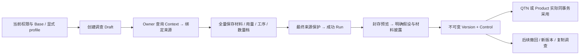

# ERP-EST-01 · 商业估算与报价计算

整理状态：`core_semantics_consolidated`。当前设计是 v1.0.1 基础规范与 `EST-GENERAL-R2` 的唯一组合；新材料模型采用 `EST-GENERAL/2`、`EST-CALC-2`，旧 v1 原件、算法与哈希保留。已补读基础核心规则、全部 110 AC、23 个准确字段窗口和 R2 全文；基础 15,296 行中 12,088 行连续样例仍未语义读完，因此不宣称全部必需材料已整理。设计接受不等于授权编码、实际 Owner 采用或运行验收。[C1][D7][J246]

## 1. 业务目的、操作者与责任边界

估算人员在客户、产品、工程、材料和价格仍可能不完整时，登记一个可追踪的商业测算方案；按数量档计算成本和建议价，明确所有人工假设与未计价范围，封存不可变版本供正式报价或产品 Owner 准确采用。内部估算不要求先造完整制造 BOM、BP 或正式 Quote。必需的创建组织/Base、标题和当前操作者权限成立后，未知客户、产品、币种保持 null；产品类型仍 UNKNOWN 时不能计算。已存在 BP 的只读身份、冻结状态与真实交易资格分开，EST 不扩展 BP 四种 `UsePurpose`。[S25][S39][S484]

|操作者/Owner|本模块提供或要求的事实|不能从 EST 推导的许可|
|---|---|---|
|估算人员|草稿、准确来源绑定、材料和工序成本范围、数量档、计算、版本封存、复制调查|封存不等于价格批准或客户接受|
|Main 商业请求 Owner|真实 `ESTIMATE_AND_QUOTE` 请求、完整 SourceHandoff、方案 OptionKey 唯一槽|不由 EST 创造 CRM 交接或补造未解析 BP|
|产品、工程、PLM Owner|产品准确版本、工程 Item/BOM/Route、原生身份、双摘要、当前用途保护|Baseline FROZEN 不等于 VER PASS，更不等于制造允许|
|物料/映射/单位/币种/价格 Owner|准确材料身份、已归一毛用量、维度、币种舍入政策及参数|同名/同码、标签、旧 signed selector 都不等于新当前来源证明|
|QTN / Product 消费者|同实际目标事务的 I03 采用与 I05 历史更正；准确版本和披露决定|EST 不替消费者批准价格、技术条件、发出报价或客户接受|

该范围覆盖常规离散制造材料的每输出单位用量、每数量档一次的固定消耗，以及显式选用纸材 profile 的面积计价。每个数量档代表独立测算情景；`PER_LOT` 不是自动推算的生产批次数。真实多批、非线性配方、联副产分摊尚不在该后继能力内，必须保持具体未支持原因，不能按一个乘数冒充全部行业成本模型。[G40][G165][G568]

## 2. 当前组合、接受与历史结论

|有效输入|精确身份与角色|阅读/接受边界|
|---|---|---|
|v1.0.1 基础主文|SHA `f7d7141b4ceffa15b0909fae8d21227b12de4a6ddc28e3369a1b2a2de1c29f03`；15,296 行|5 个 SPEC、H05；保留旧 wire/算法/AC；新 v2 被 R2 明确替换的部分按 R2|
|通用材料后继 R2|SHA `c48a0460236a9a6e596adf138379026f251fc3348098d1a42e646840a5175d2f`；870 行|唯一当前 successor；R1 successor 是历史，不是第三份并行规范|
|基础 UA 与 FINAL review|2026-09-30；精确原件未修改|关闭 F1–F5 文本问题；10 个生产 Gate 仍 UNPROVEN，110 AC NOT_RUN|
|R2 CURRENT-COMPOSITION / ACCEPTANCE / ROOT-ACCEPTANCE|2026-10-08；明确 base + R2|根协调接受，不能改述成用户直接逐条签署；覆盖原文候选/STOPPED 历史标签|
|R2 定点独审|仅 R01 创建纸模型与 R02 价格覆盖两根静态回归|不是对 165 基础 JSON 的新全量业务执行|
|AC 传播与开发任务|110 原 AC、52 GAC、8 直接断言；10 项开发任务|原 AC 字节未变，v2 按传播处置；任务 PLANNED_NOT_AUTHORIZED|

基础 F1 保留继承 `ContractRev` 为字符串；F2 要求复制 Main 来源时原子占新 Claim、A10/A13 独立再查；F3 把 VersionNo 加入 Outbox 唯一域；F4 真实当前 Quote 三轴/代次检查；F5 真实 M2/JOB UOM 与 RATE 依赖闭包。R2 原 `SUCCESSOR_CANDIDATE_NOT_ACCEPTED` 等行属于候选生成时标签，由明确根接受记录确定当前组合，不能据文件名或局部旧状态否定接受。[U35][R1][J56][X1][D7]

旧“通用制造必须纸层/整张”的 B01 已由 R2 当前设计静态闭合；仍未证明 Main 实现、真实价格适配器、decoder、锁序或业务执行。本文只把这些保留门列为后续实施条件，不重新把旧 B01 当当前缺陷。[D22][V29][V43]

## 3. 核心实体、字段、身份与计算量纲

|实体/轴|身份与不可混用的含义|存储/约束|
|---|---|---|
|Estimate Root|`(Tenant,LegalEntity,EstimateId)`；EstimateNo 服务器分配、永不重用|模型 schema 在 Root 固定；不能原地把 v1 Root 变 v2|
|Draft|一个可继续编辑的输入快照；DraftRevision + ETag|OPEN / ARCHIVED；归档与版本撤回互不替代|
|Binding|Root 内 `bindingId + digest`；Owner 原件、selector、依赖闭包、人工假设|不可变；当前 knowledge/observation 独立，不改旧绑定金额|
|Run|`RunNo`、准确已存 Draft/inputDigest、formula/model、完整输入与结果|只有 SUCCEEDED；拒绝写 Command，不制造零成本成功 Run|
|Version|`estimateId + versionNo + digest`、准确 Run、父版本和披露|不可变；新 Version 的 Control 初值 1；AVAILABLE/WITHDRAWN|
|Control|准确 Version 自己的 `ControlRevision`|撤回不删历史或 Usage；恢复应形成新版本，不加 Restore 按钮|
|Usage / Receipt|消费者真实 Owner、对象/版本/用途、UseKey、准确 EST Version|实际共同事务生成；旧 Receipt 不是今后业务动作的许可|
|Material / Process / CostLine|Root 内稳定 UUID；过程显示序号不是身份|材料 ≤200，过程/成本行各 ≤200；重排不换身份|
|SourceOptionClaim|`(T,L,MainOwner,businessRootKey,OptionKey)`|只能有一个正式 Root；复制必须新的 OptionKey 与本次真实 Claim|

本域 `EstRev` 是 ≤2^53−1 的正整数 number。BP revision、MappingRevision、SourceHandoff 等继承 `ContractRev` 保持原 int64 十进制字符串；即使值是 1 也不能同时接受 number。`SourceRef.version` 保持原 Owner 不透明标识。不得把外域字符串强转 JS Number，或给原 BP semanticHash 加 EST 的域前缀。[S74][S295][S441][S601][G56]

### 当前 v2 的材料、位置和来源结构

|结构|必须表达的字段/闭合取值|业务约束|
|---|---|---|
|ModelIdentity2|schemaVersion=`EST-GENERAL/2`；formulaVersion=`EST-CALC-2`；formulaDigest；profile；profileRevision=`1`|Root 的模型与 Run/Version 的算法身份可准确回放；旧引擎不可用报 REPLAY_ENGINE_UNAVAILABLE|
|DraftBody2|schemaVersion、profile、profileRevision、info、paper、materials、materialDisposition、noMaterialReason、costLines、processes；继承其余基础 Draft 槽|profile 可暂 null，只能保存调查，不能计算|
|MaterialIdentity2|kind=`OWNER_REFERENCE`/`ESTIMATE_SPECIFICATION`；materialBinding、displayName、specification、declaredReason|人工规格必须有完整说明/理由，不能冒称 Owner Item；人工材料价格只能明确 RATE 假设|
|MaterialSubject2|materialId、identity、costDisposition=`COSTED`/`NOT_COSTED`、noCostReason|COSTED 至少一成本行；NOT_COSTED 无收费行且有原因|
|MaterialUse2|materialId、positionRequirement、position、positionReason、usageBinding、usageBasis=`GROSS_PLANNED_CONSUMPTION`、usageReason、paperRole|Owner 用量和人工输入都必须说清毛消耗；纸角色 F/C/B/WHOLE_SHEET/null|
|ConsumptionPosition2|kind=`ESTIMATE_PROCESS`/`OWNER_OCCURRENCE`；processId、usageBinding、occurrenceId|来源确需 occurrence 时不可缺；不需要位置时允许 null，不编造工序|
|ProcessInput2|继承原过程字段；增 routingStep={routeReference,routeStepId} 或 null|保留真实 Route/Step；displaySequence 不替代它|
|CostLine2|lineId、basisKey、kind MATERIAL/PROCESS/OTHER、label、mode、measureUnit及Binding、usage、factor、rate、processId、material、justification|每条材料费指向准确材料/位置；过程引用必须属于本 Root 当前草稿|
|MaterialValue2|reference、nativeIdentity、engineeringItem、erpMaterial、mapping、displayCode、displayName、specification|工程或 ERP 身份至少一边；双边存在须有同 T/L/用途真实映射；不按同码猜匹配|
|MaterialUsageValue2|reference/nativeIdentity/materialReference/productReference/bomReference/occurrenceId/routeReference/routeStepId/mode/usage/measureUnit/outputUnit/quantityBasis/normalizationEvidence/applicableQuantities|Owner 证明 BOM 位置与适用数量档的毛用量归一；净量/非线性转换未证则不支持|
|NativeIdentity2|schemaVersion、bodyJson、bodyDigest|保存外域原生完整身份与原版本，不把 EST ID 冒充物料主档|

`materialDisposition=PRESENT` 要求材料非空，`NONE_CONFIRMED` 要求空材料且有无材料原因，`UNRESOLVED` 允许保存但不能计算。所有成本行为空始终不能计算。人工材料规格 displayName 1–100、specification/reason 1–1000；这里只建立本次测算说明，不写外域主档/BOM。[G69][G151][G177][G198]

### 通用与纸材 profile 的精确分界

`GENERAL_MATERIAL` 必须 `paper=null`，不得携带纸字段或 DIMENSIONAL。`PAPER_SHEET` 必须有 `PaperProfile2(revision=1,primaryModel,paperInfo)`，创建时显式选 `WHOLE_SHEET` 或 `LAYER_MATERIAL`，不从 Options 排序或默认值猜。纸 profile 调查草稿可保存空材料/费率；不能因为还不能算而拒绝创建。profile=null 时 paper 也必须 null。[G124][G155][G407][G510]

v2 从基础 `info` 移到 `paper.paperInfo` 的准确字段是：`fscProductDiv, fscMaterialDiv, sheetFlute, paperCdF, printCdF, embossCdF, patternCntF, paperCdC, printCdC, embossCdC, paperCdB, printCdB, embossCdB, patternCntB, sheetPrint, bladeWidth, bladeFlow, gutterFb, gutterLr, sheetDimW, sheetDimF, recyclePayment, idMark, adShape, strategicDivs, printNote`。其余原 Info 留在 `GeneralInfo2`。FSC/环保原输入只是记录，无真实政策证据不证明合规。[G129][S163]

### 原 70 主字段与 24 过程字段的保真映射

以下完整列出基础映射，供旧 DTO/调查采用对照；列中的 `info.<纸字段>` 是 **v1 位置**，v2 按上段移动，不可原样当作 GENERAL 的 payload。R/Source/Struct/Split 不应作为普通自由编辑列。原 DTO 的未知值保持 null，不能通过空串或零补全。[S88][S165]

|旧成员|旧类型|新归属|类别|精确定义/变更|
|---|---|---|---|---|
|QtnCalcNo|string?|EstimateNo|R|服务器不可重用编号，旧号留LegacyObservation|
|QtnBaseCd|string|info.qtnBaseCd|W|NFC，长度1–10或null；已填写代码由本次Options字典/组织核实|
|OrderBaseCd|string|info.orderBaseCd|W|NFC，长度1–10或null；已填写代码由本次Options字典/组织核实|
|StaffCd|string|info.staffCd|W|NFC，长度1–10或null；已填写代码由本次Options字典/组织核实|
|ProCd|string?|productBinding|SOURCE|A06 PRODUCT→A07；原Code仅只读显示，不代原ProductId/Version|
|CustomerCd|string?|customerBinding|SOURCE|A06 BP→A07；准确BpId/L，代码仅显示；不新增BP/Account|
|ProjectNoParent|string?|info.projectNoParent|W|NFC，长度1–15或null|
|ProjectNoChild|string?|info.projectNoChild|W|NFC，长度1–15或null|
|ProjectNoMaterial|string?|info.projectNoMaterial|W|NFC，长度1–15或null|
|OrderType|string?|info.orderType|W|NFC，长度1–4或null；已填写代码由本次Options字典/组织核实|
|ProductCategoryBig|string?|info.productCategoryBig|W|NFC，长度1–4或null；已填写代码由本次Options字典/组织核实|
|ProductCategoryMid|string?|info.productCategoryMid|W|NFC，长度1–4或null；已填写代码由本次Options字典/组织核实|
|ProductCategorySml|string?|info.productCategorySml|W|NFC，长度1–6或null；已填写代码由本次Options字典/组织核实|
|CustomerProductName1|string?|info.customerProductName1|W|NFC，长度1–100或null|
|CustomerProductName2|string?|info.customerProductName2|W|NFC，长度1–100或null|
|OrderQty|decimal?|info.orderQty|W|非负decimal(18,6)；未知null；适用计算要求正值|
|OrderYm|string?|info.orderYm|W|NFC，长度1–6或null；YYYYMM、月份01–12|
|ParentChildDiv|string?|info.parentChildDiv|W|NFC，长度1–2或null；已填写代码由本次Options字典/组织核实|
|FscProductDiv|string?|info.fscProductDiv|W|NFC，长度1–4或null；已填写代码由本次Options字典/组织核实|
|FscMaterialDiv|string?|info.fscMaterialDiv|W|NFC，长度1–4或null；已填写代码由本次Options字典/组织核实|
|SheetFlute|string?|info.sheetFlute|W|NFC，长度1–4或null；已填写代码由本次Options字典/组织核实|
|PaperCdF|string?|info.paperCdF|W|NFC，长度1–10或null；已填写代码由本次Options字典/组织核实|
|PrintCdF|string?|info.printCdF|W|NFC，长度1–10或null；已填写代码由本次Options字典/组织核实|
|EmbossCdF|string?|info.embossCdF|W|NFC，长度1–10或null；已填写代码由本次Options字典/组织核实|
|PatternCntF|decimal?|info.patternCntF|W|非负decimal(18,6)；未知null；适用计算要求正值|
|PaperCdC|string?|info.paperCdC|W|NFC，长度1–10或null；已填写代码由本次Options字典/组织核实|
|PrintCdC|string?|info.printCdC|W|NFC，长度1–10或null；已填写代码由本次Options字典/组织核实|
|EmbossCdC|string?|info.embossCdC|W|NFC，长度1–10或null；已填写代码由本次Options字典/组织核实|
|PaperCdB|string?|info.paperCdB|W|NFC，长度1–10或null；已填写代码由本次Options字典/组织核实|
|PrintCdB|string?|info.printCdB|W|NFC，长度1–10或null；已填写代码由本次Options字典/组织核实|
|EmbossCdB|string?|info.embossCdB|W|NFC，长度1–10或null；已填写代码由本次Options字典/组织核实|
|PatternCntB|decimal?|info.patternCntB|W|非负decimal(18,6)；未知null；适用计算要求正值|
|SheetPrint|string?|info.sheetPrint|W|NFC，长度1–4或null；已填写代码由本次Options字典/组织核实|
|BladeWidth|decimal?|info.bladeWidth|W|非负decimal(18,6)；未知null；适用计算要求正值|
|BladeFlow|decimal?|info.bladeFlow|W|非负decimal(18,6)；未知null；适用计算要求正值|
|GutterFb|decimal?|info.gutterFb|W|非负decimal(18,6)；未知null；适用计算要求正值|
|GutterLr|decimal?|info.gutterLr|W|非负decimal(18,6)；未知null；适用计算要求正值|
|SheetDimW|decimal?|info.sheetDimW|W|非负decimal(18,6)；未知null；适用计算要求正值|
|SheetDimF|decimal?|info.sheetDimF|W|非负decimal(18,6)；未知null；适用计算要求正值|
|FinalMachineProc|string?|info.finalMachineProc|W|NFC，长度1–4或null；已填写代码由本次Options字典/组织核实|
|ProductShape1|string?|info.productShape1|W|NFC，长度1–4或null；已填写代码由本次Options字典/组织核实|
|ProductShape2|string?|info.productShape2|W|NFC，长度1–4或null；已填写代码由本次Options字典/组织核实|
|DistDiv|string?|info.distDiv|W|NFC，长度1–4或null；已填写代码由本次Options字典/组织核实|
|RecyclePayment|string?|info.recyclePayment|W|NFC，长度1–1或null；已填写代码由本次Options字典/组织核实|
|IdMark|string?|info.idMark|W|NFC，长度1–4或null；已填写代码由本次Options字典/组织核实|
|AdShape|string?|info.adShape|W|NFC，长度1–4或null；已填写代码由本次Options字典/组织核实|
|StrategicDivs|bool[]|info.strategicDivs|W|恰10槽；null未知，不默认false；不影响成本，除非明确配置来源规则|
|PrintNote|string?|info.printNote|W|NFC，长度1–32或null|
|MfgNote|string?|info.mfgNote|W|NFC，长度1–32或null|
|SlipNote|string?|info.slipNote|W|NFC，长度1–32或null|
|DeliveryNote|string?|info.deliveryNote|W|NFC，长度1–32或null|
|ShipNote1|string?|info.shipNote1|W|NFC，长度1–32或null|
|ShipNote2|string?|info.shipNote2|W|NFC，长度1–32或null|
|EstimateQtys|decimal?[]|tiers[].quantity|STRUCT|原8档映射slot1..8，空档无活动行；计算至少1档|
|PalletCnts|decimal?[]|tiers[].palletCount|STRUCT|对应原slot，null未知；取消ceil(q/100)隐含假设，不参与成本|
|ProposalLot1|decimal?|info.proposalLot1|W|非负decimal(18,6)；未知null；适用计算要求正值|
|ProposalLot2|decimal?|info.proposalLot2|W|非负decimal(18,6)；未知null；适用计算要求正值|
|Unit|string?|unitBinding|SOURCE|A06 UOM；单位来自字典，不猜EA|
|DecidedQty|decimal?|selectedTierSlot|STRUCT|显式选择已有档位；旧量仅唯一匹配活动quantity时可映射|
|QtnDiv|string?|mode + LegacyObservation|SPLIT|新INTERNAL_ESTIMATE/QUOTE_BASIS_PROPOSAL；旧10/20与A/B/C不直接互换|
|EstimateSqm|decimal?|Run.tiers[].area|R|按精确尺寸和该档数量计算；不接受客户端计算回写|
|StandardUnitPrice|decimal?|Run.tiers[].unitCost|R|商业估算单位成本，不是实际制造成本|
|EstimateUnitPrice|decimal?|Run.tiers[].suggestedPrice|R|成本加成计算建议价，非正式报价价|
|ConfirmedUnitPrice|decimal?|pricing.manualPrices[].unitPrice|SPLIT|MANUAL模式显式建议价、理由及当前est.price.write；不是批准|
|Processes|List<EstimateCalcProcessDto>|processes[]|STRUCT|稳定processId+displaySequence，原24成员全部见下表|
|RowVersion|byte[]?|DraftRevision + ETag|R|服务器CAS，缺If-Match=428；旧RowVersion仅Legacy值|
|QtnDate|DateTime?|basisDate|W|明确计算适用日期；不再忽略输入；UTC/业务日期按Options回显|
|RefQtnCalcNo|string?|parentVersion + LegacyObservation|R|复制/重估引用准确父版本，旧号无版本不假补|
|CreateDate|DateTime?|createdAt|R|服务器UTC|
|ModifyDate|DateTime?|updatedAt|R|服务器UTC|

|旧成员|旧类型|新归属|约束|
|---|---|---|---|
|SeqNo|int|processes[].displaySequence|1..200唯一；稳定processId由A08首次创建，重排不重用他行身份|
|ProcessCd|string?|processes[].processCd|NFC 1–10或null；过程代码/资源/版模等已填写引用由Owner字典核查，名称是记录说明不授予资格|
|ProcessName|string?|processes[].processName|NFC 1–100或null；过程代码/资源/版模等已填写引用由Owner字典核查，名称是记录说明不授予资格|
|TaskCd|string?|processes[].taskCd|NFC 1–10或null；过程代码/资源/版模等已填写引用由Owner字典核查，名称是记录说明不授予资格|
|TaskName|string?|processes[].taskName|NFC 1–100或null；过程代码/资源/版模等已填写引用由Owner字典核查，名称是记录说明不授予资格|
|WgCd|string?|processes[].wgCd|NFC 1–10或null；过程代码/资源/版模等已填写引用由Owner字典核查，名称是记录说明不授予资格|
|MfgLocation|string?|processes[].mfgLocation|NFC 1–50或null；过程代码/资源/版模等已填写引用由Owner字典核查，名称是记录说明不授予资格|
|Spec1Label|string?|processes[].spec1Label|NFC 1–50或null；过程代码/资源/版模等已填写引用由Owner字典核查，名称是记录说明不授予资格|
|Spec1Val|string?|processes[].spec1Val|NFC 1–100或null；过程代码/资源/版模等已填写引用由Owner字典核查，名称是记录说明不授予资格|
|Spec2Label|string?|processes[].spec2Label|NFC 1–50或null；过程代码/资源/版模等已填写引用由Owner字典核查，名称是记录说明不授予资格|
|Spec2Val|string?|processes[].spec2Val|NFC 1–100或null；过程代码/资源/版模等已填写引用由Owner字典核查，名称是记录说明不授予资格|
|Spec3Label|string?|processes[].spec3Label|NFC 1–50或null；过程代码/资源/版模等已填写引用由Owner字典核查，名称是记录说明不授予资格|
|Spec3Val|string?|processes[].spec3Val|NFC 1–100或null；过程代码/资源/版模等已填写引用由Owner字典核查，名称是记录说明不授予资格|
|Spec4Label|string?|processes[].spec4Label|NFC 1–50或null；过程代码/资源/版模等已填写引用由Owner字典核查，名称是记录说明不授予资格|
|Spec4Val|string?|processes[].spec4Val|NFC 1–100或null；过程代码/资源/版模等已填写引用由Owner字典核查，名称是记录说明不授予资格|
|Spec5Label|string?|processes[].spec5Label|NFC 1–50或null；过程代码/资源/版模等已填写引用由Owner字典核查，名称是记录说明不授予资格|
|Spec5Val|string?|processes[].spec5Val|NFC 1–100或null；过程代码/资源/版模等已填写引用由Owner字典核查，名称是记录说明不授予资格|
|Spec6Label|string?|processes[].spec6Label|NFC 1–50或null；过程代码/资源/版模等已填写引用由Owner字典核查，名称是记录说明不授予资格|
|Spec6Val|string?|processes[].spec6Val|NFC 1–100或null；过程代码/资源/版模等已填写引用由Owner字典核查，名称是记录说明不授予资格|
|Spec7Label|string?|processes[].spec7Label|NFC 1–50或null；过程代码/资源/版模等已填写引用由Owner字典核查，名称是记录说明不授予资格|
|Spec7Val|string?|processes[].spec7Val|NFC 1–100或null；过程代码/资源/版模等已填写引用由Owner字典核查，名称是记录说明不授予资格|
|PlateNo|string?|processes[].plateNo|NFC 1–20或null；过程代码/资源/版模等已填写引用由Owner字典核查，名称是记录说明不授予资格|
|ProcNote1|string?|processes[].procNote1|NFC 1–200或null；过程代码/资源/版模等已填写引用由Owner字典核查，名称是记录说明不授予资格|
|ProcNote2|string?|processes[].procNote2|NFC 1–200或null；过程代码/资源/版模等已填写引用由Owner字典核查，名称是记录说明不授予资格|

新过程额外有 `processId`、`costDisposition`、`noCostReason`；原 SeqNo 只映射 `displaySequence`，1–200 唯一。每个过程恰有 COSTED 关联费用或 NOT_COSTED 理由；不能按过程条数乘固定 5。首次新行 UUID 由客户端提出、服务器核本 Root 不被其他行占用，已有行不能换 ID 掩盖替换。[S194]

### 数量、精度和公式

|对象|范围与运算规则|
|---|---|
|数量/用量/尺寸|decimal(18,6)，非负十进制字符串；适用计算时正值，不能指数、空白或 `+`；明确技术上限 10^9|
|价格/成本|decimal(24,6)；中间 decimal(38,12) 或精确有理数；溢出拒绝，不能截断归零|
|数量档|1–8 个活动 slot，slot 与 quantity 分别唯一；至少一个正数量；各档独立，不能合计为订单总额|
|单位/币种|真实同 Root Owner Binding；单币种，不做 FX，不默认 JPY/EA，不按显示名换单位|
|币种政策|minorDigits 0–4、priceDigits 0–6；HALF_EVEN；当前政策精确版本作为依赖|
|PER_OUTPUT|精确用量 = usage × q|
|PER_LOT|精确用量 = usage，每个独立数量情景一次；已声明本情景总量，不自动乘生产批次|
|DIMENSIONAL|只适用 PAPER 主材、真实 AREA 维度 M2；精确用量 = W×F/10^6×factor×q|
|行成本|Round6(精确用量×rate)；展示用量 Round12 不拿回去重新计算|
|总成本/单位成本|先累加各已舍入行成本，再 Round6(total/q)；无成本行拒绝|
|COST_ONLY|suggestedPrice、proposedAmount、margin 全 null，不以 0 冒充可发正式报价|
|MARKUP|加成百分比 0–1000 是技术范围，不是审批线；价格 Round(priceDigits,unitCost×(1+m/100))|
|MANUAL|准确 slot 明确建议价、理由和当前价格写权；负值拒绝；0 必须理由|
|金额/毛利|金额 Round(minorDigits,q×已舍入建议价)；毛利 Round6((price−unitCost)/price×100)，可负；price=0 时 null|

用量为已包含损耗的 `GROSS_PLANNED_CONSUMPTION`；PER_OUTPUT/PER_LOT 的 factor 必须 null，不能用默认 1 代替损耗归一。Source usage 与人工修改不同值时必须先明确转人工并去掉 usageBinding，不能仍声称 Owner 来源。PAPER 的 WHOLE_SHEET 与 F/C/B 主材互斥，但 glue 等真实辅料允许 paperRole=null，不能为了辅料强造纸层。相同材料的不同真实 occurrence 分别计费；同 occurrence 重复行不会因 basisKey 或费率不同而合法。[S74][S511][S525][G159][G165][G349]

示例是设计算术，不是生产默认：v2 通用材料 q100 时钢材 2.5KG/EA×8、两个独立紧固件位置各 2EA/EA×0.5、每档清洁剂 3L×10、加工 5/EA、准备费 100/JOB，成本 2830、单位 28.3；20% 加成价 33.96、金额 3396。q200 成本 5530、单位 27.65、价 33.18、金额 6636。没有面积时 area=null。基础纸例 q100/q200 成本 2350/4500、建议价 28.2/27 在 PAPER 模型保留相同算术，但不复用 v1 hash。[G665][S537]

## 4. 正常流程、状态转移和写集

|动作|前置条件和业务含义|同一次提交的事实|
|---|---|---|
|A03 创建|Actor/T/L/Base 管理权；PAPER 显式 primaryModel；GENERAL/null 不得带纸主材字段|新 Root/No、Draft、History、Command；零 Run、Quote、BP、Usage；未知保 null|
|A06→A07 查源/绑定|真实完整 Owner 查询形成 10 分钟 Context；Actor/T/L/Root/DraftRevision/criteria 均准确；只绑定 MATCH|新不可变 Binding、证据/依赖；DraftRevision+1；不暗改业务 Body 槽|
|A08 保存|完整可读可写 Body；If-Match；所有已填字段真实字典、同根引用、selector 一致|整份 Draft 替换与历史，Revision+1；不覆盖既有 Run/Version|
|A09 假设|仅授权 RATE/FACTOR；明示理由；真实 UOM/币种依赖|新 ASSUMPTION Binding；不改 Owner 原件，不伪 Owner proof|
|A10 计算|已保存 inputDigest/Revision 精确；至少一成本行；材料/工序范围闭合；所有最终 Owner Guard 与 Claim|Run/输入来源快照/结果/原回执共同成立；任一条件失败零 Run|
|A12→A13 封存|Run 与当前 Draft 一致；10 分钟 plan、当前观察代次/Actor 全部相符；准确假设集及 v2 disclosure ack|Version、Control1、History、Outbox、Command 同提交；不代表价格/工程审批|
|A22 控制|准确 Version/Control ETag 和当前控制权限|Control+1、审计、同版本 Outbox；历史内容及旧 Usage 不改|
|A23 复制|精确源 Version、同 L 目标 Base；真实 Main 来源新 OptionKey 和当前 BIND Claim|新 Root/No、ParentVersion、全部本地 ID/ref 重绑的 Draft/Bindings；UNKNOWN、零 Run/Usage|
|A24 归档/重开|准确 Draft CAS|只影响 Draft state/revision；不撤回、恢复 Version，不清 UNKNOWN|
|I03 下游采用|消费者当前真实对象版本/决定、准确 Version/披露、所有当前用途门|消费者目标效果 + EST Usage/Receipt 一起 commit，否则整体回滚|

版本业务唯一性原为 Run + purposeNote + 假设集；v2 再包含 model 与 disclosure。同业务封存新 Key 返回原版本 NO_CHANGE，不重复 VersionNo。parentVersion 是该 Root 最近实际 Version（可已撤回），否则准确复制父版本，否则 null；不能按当前“最新有效”悄悄替换父系。[S553][S559][G510][G516][G518]

Main 来源首次关联时建立 Claim；从此不允许换另一个 Main 业务根、也不能清除来源伪装 MANUAL。Main 同根后继要求准确前驱证明；未解析 BP 时 SourceHandoff 八字段保真而 customerBinding=null。Main 已解析 BP 后，草稿客户必须符合该精确 account/mapping。首次关联只影响当前后继 Draft/Version，不给旧内部版本追填来源。[S484][S505]

复制按无依赖 UOM/CURRENCY → MATERIAL/USAGE → RATE 等拓扑重写本 Root 引用，保留 source native identity。旧签署 PRICE 覆盖原件只留父历史；新绑定 `paperCoverageEvidence=null`，调查可读但新计算/封存/采用必须重新经过 A06/A07 获得新准确证明、A08 接入。Refresh 不能修补不可变签署体，也不能仅 PRIMARY 变绿就恢复所有来源。[S565][G520]

## 5. API、事件与 Owner 契约

公共 v1 前缀 `/api/main/v1/estimates`；新 v2 前缀 `/api/main/v2/estimates`，A01–A28 保留动作 ID 与 tail，精确 DTO 用匹配 schema。不能把 v1 未知命令转发 v2 当重试。变更带 Idempotency-Key；Draft If-Match 为 `"EST-DRAFT:{id}:{rev}"`，Control 为 `"EST-CONTROL:{id}:{version}:{control}"`；创建无现存 Draft ETag。[S290][G407]

|入口|路由 tail / 返回作用|
|---|---|
|A01/A02/A03|GET `/options`；POST `/query`；POST 根路径创建|
|A04/A05|GET `/{id}` 安全摘要；GET `/{id}/edit` 全量编辑视图|
|A06/A07/A08/A09|POST `/{id}/lookups`；POST `/{id}/bindings`；PUT `/{id}/draft`；POST `/{id}/assumptions`|
|A10/A11|POST `/{id}/calculations`；GET `/{id}/calculations/{runId}`|
|A12/A13|POST `/{id}/seal-preview`；POST `/{id}/versions`|
|A14/A15/A16|POST `/{id}/versions/query`；GET `/{id}/versions/{versionNo}`；POST `/{id}/versions/compare`|
|A17/A18/A19|POST `/{id}/reference-context`；POST `/{id}/usages/query`；GET `/commands/{key}`|
|A20/A21|POST `/{id}/source-refresh`；GET `/{id}/source-refresh/{jobId}`|
|A22/A23/A24|POST `/{id}/versions/{v}/control`；POST `/copies`；POST `/{id}/lifecycle`|
|A25/A26/A27|POST `/legacy/query`；POST `/legacy/adoption-preview`；POST `/legacy/adoptions`|
|A28|POST `/{id}/readiness/query`，当前三轴只读，不产生业务 Command|
|v2 A29/A30/A31|GET `/{id}/versions/{n}/model`；POST `/model-adoption-preview`；POST `/model-adoptions`|

准确请求/返回类型入口见基础 295–379 行、各连续 JSON 与 R2 69–148、179–289、407–450 行。路由清单仅定位，不授权忽略原封闭类型、nullable 必现或服务端错误分支。[S295][S385][S717][G407]

|Owner 合同|必须获得/保护的真实内容|失败含义|
|---|---|---|
|I01 OwnerDirectory.Query|完整受权查询、准确 selector、候选全文、原件和当前控制/可信证明|INCOMPLETE/UNPROVEN 不能当“没有候选”而自动创建或随便选第一条；该名称不是已存在物理通用 API 的证明|
|I02 CurrentEstimateSourceParticipant.Enlist|实际 DbTransaction 内保护本次准确来源与当前用途；所有 writer 遵守 Scope|不能参与真实同库事务时关闭新计算/封存/采用，不用 TTL、跨库 HTTP 或队列假原子|
|I03 EstimateUseParticipant|当前消费者真实对象/版本、决定、准确 EST Version/假设/v2 disclosure 及最终来源保护|不能先写 EST Usage 后异步写 Quote；零孤立 Usage|
|I04 source-notices|`/internal/main/v1/estimates/source-notices` 原完整消息、来源身份、冲突与失效|只记录影响并置未知，不改历史版本，不自动新采用|
|I05 UsageCorrection|准确旧 ReceiptDigest、原消费者、真实同 Owner 同聚合后继、更正决定|纠正历史不要求旧源当前前向 USABLE；换版本时新 I03 +旧 I05 与消费者修订同事务|
|I06 QuoteReadinessOwner.QueryExact|QTN 自己一致性读的当前 Quote、技术/价格 readiness、商业状态、policyRevision、headWatermark、未满足条件、asOf 与完整 proof|不拿 EST 工程快照或另一个 Quote 证明替代；实际 QTN 未提供时 OWNER_REQUIRED/UNKNOWN|

[S418][S448][S672]

### v2 价格、材料角色与多来源保护

RATE 的 `dependencyRoles` 明确 currency、measureUnit、outputUnit、material、usage、engineering；`dependencies` 必须等于所有非空角色 ref 的去重集合。UOM/币种只接受真实 Owner，ASSUMPTION RATE 仍需准确同 Root 单位/币种；FACTOR 无货币量纲，dependencies 为空。RATE 引用的输出单位也不能只按同 code 匹配。[S443][G244][G295]

`sourceMembers` 的每个 PRIMARY/MATERIAL/ERP_MAPPING/ENGINEERING/BOM/ROUTE/UOM/PRICE_COVERAGE_POLICY 保留准确 SourceRef 和 Evidence，分别有 generation、knowledge、ownerControlVersion、asOf。只有完整依赖各成员都成立才能当前 KNOWN；PRIMARY 查询成功不能覆盖映射或 BOM 失证。每个唯一 `(bindingRef,SourceRef)` 都有最终 GuardReceipt，并保持至同次 commit。[G186][G303][G516]

|materialCoverage tuple|允许的准确范围|
|---|---|
|GENERAL_MATERIAL / null / null / IDENTIFIED_MATERIAL|一般材料，不含纸构成|
|PAPER_SHEET / 当前 primaryModel / null / IDENTIFIED_MATERIAL|胶等独立辅料|
|PAPER_SHEET / LAYER_MATERIAL / F、C 或 B / PAPER_LAYER_ONLY|准确单层主材，F 与 B 不同 selector|
|PAPER_SHEET / WHOLE_SHEET / WHOLE_SHEET / WHOLE_SHEET_COMPOSITION|完整整张构成|

A06/A09 为未来行先显式提交 coverage，避免必须先绑定费率才能构造行的循环；A08 从 proposed Body、A10 从 Draft、A13 从 Run、I03 从 Version 分别独立重建 coverage，并把明文 `expectedMaterialCoverage` 提交 Guard。同一 Binding 被多行引用时，每行 tuple 必须相同。只比 hash 或客户端自报 coverage 不够。[G326][G333][G335]

PRICE 旧 v1 接口/13 列不变。新 `PaperEstimateSourceV2` 仅覆盖完整 WHOLE_SHEET tuple，必须由真实、版本化 `coveragePolicy` 原件及当前控制证明身份、构成、单位、scope；保存完整 `PaperPriceCoverageEvidence2`、criteria/roles、政策 SourceMember，最终同事务保护。分层或辅料返回 PAPER_PRICE_COVERAGE_UNSUPPORTED；不能把整张价当单层价。合法其他来源或显式人工假设仍可按准确范围使用，旧 v1 签名/selectorHash 不能包装成 v2 Owner proof。[G339]

### QTN、事件与三轴 readiness

QTN 的现有 EstimateTier/EstimateBasis wire 不新增材料数组；真实 v2 decoder 读完整原件和披露，消费决定覆盖准确 Version + DisclosureDigest；旧 `acceptedAssumptions=[]` 不替代材料范围确认。Q13/I03 任一实际 decoder/门未满足，零新 QuoteVersion/零孤立 Usage。`SourceSetDigest2` 对 QTN 是不透明值，保存后原样传 I06，不能用 v1 算法重算。`SUBMIT_ESTIMATE` renderer 未支持 v2 时阻该文档，不顺势阻已满足自身规则的普通 Quotation。EST 材料不能直接写 OrderMaterial/BOM，ORD 仍走真实 Quote/H07/技术门。[G568]

工程知识、计算 readiness、报价 readiness 是三个独立轴：SERVICE/PURCHASE_ONLY 可为工程 NOT_REQUIRED_FOR_ESTIMATE，但币种/UOM 未知仍计算 INCOMPLETE，无真实 Quote 仍 OWNER_REQUIRED。OWNER_PROVEN 只针对本次准确 Quote 版本/asOf，不是发出许可、客户接受或制造许可。A28 每次先 checkGeneration+1 并置 UNKNOWN，固定 Actor、Draft/Version/Control、SourceSetDigest、各 Binding generations、Quote 目标；返回后 CAS 全向量。迟到响应 `currentApplicable=false`，客户端也核 pageGeneration。当前查询失败时仅可显示受权的 `lastProven.current=false`，不能继续绿灯。[S458][S470][P975][P1067]

`EST-VERSION-REF/1` 消息包含 Tenant、准确 VersionNo/digest、aggregateKind/version、eventKind/control 等精确引用，不携带财务正文。传输去重与业务唯一域均要含 VersionNo，V1/Control2 与 V2/Control2 是两件可共存事件；消费者只失效/查源，不按消息自动采用或跨版本覆盖。[S627][S749]

## 6. 事务、幂等、并发与未知恢复

Command 唯一域为 `(T,Actor,commandKey)`，fingerprint 包括 operation、路由、body、If-Match；v1/v2 共享唯一域且新 schema 进入 fingerprint。同 key 改 body、ETag、model、profile 或 route 必须 COMMAND_KEY_REUSED，不通过“兼容重试”再执行。终态历史先按当前读取/披露权返回原回执与 hash，再判断真正新意图的写权；快读未见后必须在有序锁内重查，避免原事务刚提交、写权刚撤时错误拒绝有权历史。当前读权撤销不能泄露旧私密 hash。[S543][G407][G524]

规范锁序是 IAM → EST Command → 按 `(Owner,T,L,ScopeKey)` 排序的 externalSourceScopes → EstScope → Root → children → Usage/Outbox。保护、当前授权、来源使用与最后写集共享真实事务，不以进程内互斥或“先读再写”替代。与 BP 自己 IAM→BpScope→BPCommand 的顺序需要对实际参与链验证非反转；本文保留各 Owner 的准确顺序，没有推断一套未证明的全局通用锁模板。[S543]

响应丢失、超时、deadlock 或技术提交不确定都必须保留原 key/body/header，A19 查原命令；NOT_OBSERVED/IN_FLIGHT 的 `noEffectProven=false` 不能作为新建第二意图的依据。已经确定的业务 REJECTED 原样重放；修正输入后用明确新意图。v1 不明结果不能换 v2 route 重试。Outbox 重投原 EventId/body，不能伪造新成功事件覆盖未知交付。[S543][S627][S15227][G524]

Notice 命中任一 sourceMember，即保存完整原始载荷/可信证据并提升 generation、当前置 UNKNOWN。RefreshJob 持久化完整查询、选择、代次和结果；进程重启继续原 job，旧成功只在当前全向量一致时应用。相同 eventId 异 body 保留原与候选形成冲突；普通较新 USABLE 不能清冲突，必须真实 Owner 更正覆盖精确冲突集合和原件。旧 Run 算术从不被 Refresh 或通知重写。[S585][G522]

I05 不是回滚原报价的技术按钮。必须由消费者提交明确历史更正/新实际业务修订，证明准确旧 Reference/Receipt 与后继同聚合关系；若换 EST Version，则新 I03 与原 I05 同实际目标事务，任一步失败全部回滚。源已撤回不应阻碍必要历史纠正，但禁止把更正路径用来绕过新采用当前门。[S672][G568]

## 7. 权限、租户、法人和敏感数据

服务端从当前身份/组织确定 T/L 与 Base；客户端传入法人、按钮可用、旧 canApply 都不能授予权限。全量 Edit、Run、Compare 必须具备本次所需成本、价格、来源等完整读取；A08 全量替换另需各分区写权，不能给缺权用户返回可回写的 null 假体。安全 Summary 可脱敏，但同时隐藏能反推成本/利润的派生比例、原 body、私密摘要与回执 hash。[S53][S543][S15185]

精确 Main/产品/工程/材料/价格/UOM 来源都核同 T/L/用途以及当前披露授权；copy 跨 L 拒绝，不搬用源授权。人工规格、RATE/FACTOR 假设和 MANUAL price 各需相应当前权限与理由。v2 material/source/private sections 继承完整分区权限；隐去一部分后不得让 UI 把缺失值写回清空。DEMO Actor/Verifier/身份在真实写入前拒绝，不能改变生产观察头。[S565][S15268][G646]

不可变原件存储应同时保留完整 payload、body digest、加密 key version 和可审计访问；hash 存在不能代替原件，也不证明 Owner 签署。真实 IAM、证据密文/保留、各 verifier 能力仍是生产门，没有在本文运行验证。[S601][S713]

## 8. 页面、交互和服务端校验

|页面|可实现的具体交互|必须显示/阻止的情况|
|---|---|---|
|P01 列表/创建|按当前 Base/权限查询，创建选 profile；PAPER 再选主材模型|未知 profile 可调查；PAPER 不默认 WHOLE_SHEET；列表不泄露成本|
|P02 草稿与材料|完整 Info、材料卡片、真实/人工身份、成本覆盖、位置、毛用量、单位、工序、数量档|材料 ID 与 occurrence 稳定；同名不合并；未计价项明确理由|
|P03 工程|准确产品/工程来源和双摘要、原版本/当前影响|工程 Frozen、VER 状态、制造许可分开，不能一个绿色“完成”|
|P04 参数来源|Owner 实际 lookup→完整候选→明确绑定；展示明文 coverage、角色与依赖|INCOMPLETE 不选第一条；旧 Context/旧页面响应不应用；参数改变明确新绑定|
|P05 计算|先保存准确草稿，显式计算；每档成本分解/范围/假设/价与毛利|不在 mount 自动计算并回写“确定单价”；未知 null 不画 0|
|P06 版本/比较|精确版本、模型/算法、父系、完整披露与当前影响并列|旧原件不随 latest 改；版本撤回仍保历史；无完整权限不给可推算 diff|
|P07 引用/ready|准确消费者 Usage、实际 Quote 目标、三轴当前与 asOf|OwnerRequired/Unknown/lastProven 区分；读上下文不作执行许可|
|P08 恢复|原 commandKey/route/body/ETag、查询原结果、刷新 job|NOT_OBSERVED 不引导新建重复意图；私密结果仍核当前读取权|

Profile、主材模型、材料角色、单位、构成改变时，UI 展示受影响行和参数的明确差异，让用户解决不兼容项；不能静默删纸字段或保留已经失配的旧 RATE。尺寸建议可显示 `W=BladeWidth+2×GutterLr`、`F=BladeFlow+2×GutterFb` 的来源，但用户确认才保存；托盘数无 `ceil(q/100)` 默认。服务端重新检查所有规则，不能以组件完成校验替代。[S53][S163][G646]

## 9. 实施顺序与固定基线差异

下面是从当前规范推导的开发依赖顺序，不是额外业务批准：

1. 建立版本化封闭 schema/decimal/hash 与不可变原件读取，v1/v2 分开回放；Root 的 model 固定，Command 唯一性跨路由共享。
2. 实现完整 Draft/Binding/来源闭包、材料/位置/覆盖/量纲校验和当前 IAM/所有 writer 保护，再实现精确 CALC2；拒绝默认价/单位/损耗。
3. 接入真实 OwnerDirectory、Material/Usage/映射/UOM/PRICE v2 policy 原件及 verifier；证明每 member 的实际最终事务保护和非反转锁序。
4. 实现 Run/Version/Control/Disclosure、SourceOptionClaim、复制调查、Notice/Refresh/current generation 和原键恢复。
5. QTN/Product 接入真实 v2 decoder 与同事务 I03/I05、确切披露决定/模板；ORD 保持原 Quote/H07 主链。
6. 清点并收敛全部旧写入口，然后才允许有保护的 Legacy/model adoption；完成对应 AC 后才能改变实际门状态。

源文在固定 Main `157630...` 对旧 EstimateCalcService 的记录为：材料 fallback 30、因子 1.00、过程条数×5、加成 1.20、金额 0 位；旧页面 onMounted 触发计算并回写确定价；旧 QtnDiv A/B/C 与实体 10/20 不等义，旧 RowVersion 可选。R2 在固定 Main `90c871fe` 的核对保留这些旧实现观察。本文引用归档内固定 SHA/Blob 事实，没有把本轮静态资料阅读宣称成新的代码全审。上述 fallback、自动写回、可选 CAS 不得充当当前已接受规范。[S688][G19]

旧实体还包括 QtnCalcNoMain/Branch、FscManagementNo、TotalAmount、Status 等 DTO 外字段，须保留 LegacyObservation，不升格为新 Version/批准/FSC 证书。A25–A27 从真实旧完整 70+24 字段、实体附加槽、8 字节 RowVersion、scope/writer 证明形成 10 分钟采用 plan，唯一 `(T,L,legacyOwner,rowKey)` 官方 Link 与新调查 Root/Draft/Command 同事务；源变化或已采用拒绝，零可信 Run。币种/单位/参数未知保持未知，初始 COST_ONLY。[S717]

v1→v2 不是改 schema flag：A30/A31 指定准确 source Version，新 Root、ParentVersion、AdoptionLink、Main Claim、Command 同事务，唯一域含 `(T,L,sourceEstimate,sourceVersion,targetSchema,optionKey)`。转 PAPER 可保原纸字段，但转 GENERAL 不把 PaperCd 重命名成钢材；材料仍待明确，零成功 Run。回退是停止新动作并保留历史读取，不批量降级 v2。旧 writer 未受同样保护时新采用门保持未证。[G632]

## 10. 验收场景与真实状态

基础 110 AC、52 个 GAC、8 个 R01/R02 直接断言均 `NOT_RUN`。基础历史 165 JSON/318 静态断言零失败只是当时文本检查记录；本轮仅文档阅读/引用与静态文件核对，未执行业务测试。10 个原 Owner Gate，加模型 decoder、材料 Owner、PRICE v2 adapter、消费者 v2 等门仍 UNPROVEN。[J246][J254][D22][G868]

|验收组|必须验证的具体结果|来源|
|---|---|---|
|调查与权限|未知客户/币种可建草稿但不可计算；撤读权不得取旧敏感回执；部分权不产生可回写空体|基础 AC001–006、044–046、090|
|数值|纸例 2350/4500；通用例 2830/5530；逐行6位/金额币种位；PER_LOT 不乘 q；0价毛利 null；无行不能0成功|基础 AC015–036；GAC17–26/51|
|材料身份与范围|同名不同 Owner 不合并；真实左右 occurrence 各计；重复 occurrence 拒绝；NOT_COSTED 明确排除|GAC06–16、21–24|
|来源闭包|无真实 JOB UOM 拒绝、跨 Root 同 code 拒绝、换输出单位版本旧 RATE 失配；任一 member 失证不绿|AC108–110；GAC05/31–33|
|纸创建 R01|显式 WHOLE/LAYER 回显；PAPER 缺选择/null 400 零 Root；GENERAL/null 带纸字段400；空调查草稿往返合法零Run|R01-A/B/C|
|覆盖 R02|F→B 或主材→辅料改变 selector；PRICE 拒分层/辅料；完整整张政策+明文roles才 MATCH；最终失证零新结果|R02-A/B/C/D/E|
|并发/恢复|响应丢失原 Key 唯一 Run；跨v1/v2重用Key异义409；撤写保读仍回原回执；晚Refresh/Quote成功不覆盖新UNKNOWN|AC038–048/065–070/103–105；GAC33–37|
|Main Claim/版本消息|copy 原子新 OptionKey Claim；A10/A13 独立缺Claim拒绝；V1/Control2与V2/Control2共存|AC095–100；GAC40|
|消费者|无v2 decoder零QuoteVersion/Usage；真实同事务新采用+旧更正任一步失败全回滚；Estimate材料不得直写OrderMaterial|AC058–064；GAC43–49|
|旧数据/旧writer|旧A/B/C原值保留；旧RV缺失不绕CAS；legacy唯一Link；所有入口参与后才切换|AC081–088；GAC41/42/50|

准确全部验收文字入口为基础末尾 AC 表、AC-AND-SPEC-PROPAGATION 的每一原行及处置、R2 GAC 与直接断言表；这些条目是未来测试输入，不是现成已运行证据。[S15175][X1][G777][G838]

## 10.1 连续样例如何落实当前组合

基础连续对象保留v1准确历史/算法证据。新通用材料写入走R2的ModelIdentity、materialCoverage、EST-CALC-2和明确PAPER primaryModel；不得把下表纸成本例重新扩成所有制造业必填纸字段。

| 对象族 | 开发解释与不可混同事项 | 原文 |
|---|---|---|
| E01–E15、R1U：明确输入才计算 | Options分别声明字段类型/长度/scale与独立权限；strategicDivs长度10、元素可null。绑定CURRENCY/EA/M2/JOB只新增不可变Binding和revision，不暗改Draft；RATE须实际本根UOM和currency两依赖，FACTOR无币种。纸profile例0.5m²/件×1.1×30，100件材料1650＋加工500＋每批200=2350，单位23.5；200件总4500、单位22.5。20%为成本加成，毛利率16.666667，非20%。这些DEMO值不作默认，通用材料新建采用R2。 | [基础 L769](<D:/CP6/docs/CP6_完整成果归档_20261009/完整成果/docs/originals/f7/f7d7141b4ceffa15__ERP-EST-01_商业估算与报价计算_前后端开发Spec_v1.0.1_REVIEW_R1_CANDIDATE.md:769>) |
| E16–E28：封存与消费者采用 | Seal逐项确认四假设产生Version1；不改变工程知识或批准价格。ReferenceContext只准备，不是复用许可。真实QTN Consumer、intent、useKey、decision与全部Owner保护到同事务结束才EstUseReceipt。写权撤销后相同终态可以回原Receipt，但当前披露权撤销拒绝读取；重放不执行第二次Seal。 | [基础 L4480](<D:/CP6/docs/CP6_完整成果归档_20261009/完整成果/docs/originals/f7/f7d7141b4ceffa15__ERP-EST-01_商业估算与报价计算_前后端开发Spec_v1.0.1_REVIEW_R1_CANDIDATE.md:4480>) |
| E29–E45：来源变化与明确后继 | 币种政策1撤销事件到达后，旧代刷新返回KNOWN不能清新通知；NOT_OBSERVED命令不证明无效果。Version1撤回只阻新用，Usage保历史且由目标Owner纠正。选择同JPY代码政策2后必须重新保存三项RATE，使依赖准确policy2；显式Save/Calculate/Seal生成Version2，原Version1/撤回及引用不改。Compare的序列化leftJson/rightJson均解析为准确原对象，无摘要代正文。 | [基础 L5921](<D:/CP6/docs/CP6_完整成果归档_20261009/完整成果/docs/originals/f7/f7d7141b4ceffa15__ERP-EST-01_商业估算与报价计算_前后端开发Spec_v1.0.1_REVIEW_R1_CANDIDATE.md:5921>) |
| E46–E66：调查复制、价格与Main来源 | 复制撤回版本只调查，新绑定UNKNOWN；币种不一致、整张重复纸层、缺factor分别拒绝。手工价20低于成本时毛利−17.5%，价0毛利为null，仍非批准。Main真实已受理需求可BP未解决；工程FROZEN/验证IN_PROGRESS能记录，不等报价Owner批准。改变真实产品后清旧费率，重新取31材料假设及5/200/1.1，100件2405→建议28.86，200件4610→27.66；新来源通知到来仍阻Seal。 | [基础 L9010](<D:/CP6/docs/CP6_完整成果归档_20261009/完整成果/docs/originals/f7/f7d7141b4ceffa15__ERP-EST-01_商业估算与报价计算_前后端开发Spec_v1.0.1_REVIEW_R1_CANDIDATE.md:9010>) |
| E67–E71：历史原件与准备上下文 | 旧Status9、ConfirmedUnitPrice28.2和总2820留rawBody，不能恢复批准状态。调查采用保两档100/200及托盘1/2，币种、UOM、组织角色、工程和成本缺口显式UNKNOWN；不默认JPY。E71完整Context固定Actor/T/L/Root/revision、criteria、全部Owner结果、水位、有效期与依赖；Seal另含Run/inputDigest/assumptions/generations。 | [基础 L11981](<D:/CP6/docs/CP6_完整成果归档_20261009/完整成果/docs/originals/f7/f7d7141b4ceffa15__ERP-EST-01_商业估算与报价计算_前后端开发Spec_v1.0.1_REVIEW_R1_CANDIDATE.md:11981>) |
| R1F/R1C/R1N：精确身份与原子复制 | 继承ContractRev字符串9007199254740993/9223372036854775807不可number化；EST自身计数仍本域整数。Main同sourceRoot下OPTION-B复制须同事务新Root＋SourceOptionClaim；已有竞争Claim则两者都0，新根不能绕Claim直接Calculate/Seal。两个Estimate Version各Control2的Outbox key包含versionNo，不能相互去重；通知回执WAITING_QUERY不等采用。 | [基础 L12410](<D:/CP6/docs/CP6_完整成果归档_20261009/完整成果/docs/originals/f7/f7d7141b4ceffa15__ERP-EST-01_商业估算与报价计算_前后端开发Spec_v1.0.1_REVIEW_R1_CANDIDATE.md:12410>) |
| R1Q：三准备轴与当前关系 | 工程缺资料不阻内部保存；SERVICE/PURCHASE_ONLY工程轴NOT_REQUIRED_FOR_ESTIMATE仍计算缺币种/UOM且报价Owner必需。确切报价DRAFT可显示Owner条件已证，不表示已发/客户接受。当前查询超时立即UNKNOWN，历史lastProven.current=false；恢复需真实新policy/head证据，迟到旧page/check代不覆盖新页；撤销REVOKED只反映当前关系，不改历史Run。 | [基础 L14126](<D:/CP6/docs/CP6_完整成果归档_20261009/完整成果/docs/originals/f7/f7d7141b4ceffa15__ERP-EST-01_商业估算与报价计算_前后端开发Spec_v1.0.1_REVIEW_R1_CANDIDATE.md:14126>) |

**样例采用前待修：**R1Q09当前政策POL-2（[基础 L14620](<D:/CP6/docs/CP6_完整成果归档_20261009/完整成果/docs/originals/f7/f7d7141b4ceffa15__ERP-EST-01_商业估算与报价计算_前后端开发Spec_v1.0.1_REVIEW_R1_CANDIDATE.md:14620>)）在同proof/head/asOf的R1Q10被写回POL-1（[基础 L14687](<D:/CP6/docs/CP6_完整成果归档_20261009/完整成果/docs/originals/f7/f7d7141b4ceffa15__ERP-EST-01_商业估算与报价计算_前后端开发Spec_v1.0.1_REVIEW_R1_CANDIDATE.md:14687>)）；后者不是lastProven历史栏。Lookup例20:00:04取得、20:30到期（[基础 L2218](<D:/CP6/docs/CP6_完整成果归档_20261009/完整成果/docs/originals/f7/f7d7141b4ceffa15__ERP-EST-01_商业估算与报价计算_前后端开发Spec_v1.0.1_REVIEW_R1_CANDIDATE.md:2218>)），而正文[基础 L412](<D:/CP6/docs/CP6_完整成果归档_20261009/完整成果/docs/originals/f7/f7d7141b4ceffa15__ERP-EST-01_商业估算与报价计算_前后端开发Spec_v1.0.1_REVIEW_R1_CANDIDATE.md:412>)及[R2 L512](<D:/CP6/docs/CP6_完整成果归档_20261009/完整成果/docs/originals/c4/c48a0460236a9a6e__ERP-EST-01_GENERAL_MATERIAL_SUCCESSOR_R2.md:512>)为10分钟。当前规则不因此变更；准确fixture和受影响摘要需有界修订，未把本轮文字检查当业务运行。

## 11. 实际未确认事项与跨域退出条件

|仍需完成的工作|当前准确边界|可以关闭的证据|
|---|---|---|
|完整精确样例语义整理|基础 12,088 行未读；已有源入口/23准确窗口不能替代完整165 JSON|逐块补读并记录对应 wire/错误/状态，阅读账本清零相应未读段|
|PRICE 整张覆盖政策|13列/旧签名不证明新v2范围，真实政策/成员控制未证|实际 versioned policy 原件、完整v2读/签/Guard、并发失效测试；不得另行默认业务政策|
|共同事务与锁序|各Owner局部顺序明确；整体QTN/Product/BP参与链未实证|真实Connection/DbTransaction共享、全writer约束与锁序无反转、失败回滚/原键恢复证据|
|材料/用量真实契约|v2定义了所需原生身份/映射/归一证据，未宣称Owner已实现|实际Owner完整原件、准确用途 verifier、所有sourceMember最终保护|
|QTN v2消费/文档|wire可以维持，decoder/披露决定/renderer仍需采用|准确Version+DisclosureDigest的真实Q13/I03同事务证据、模板支持及不足时明确阻断|
|复杂工艺|真实多批、非线性配方、联副产不是本次设计覆盖|由相应业务Owner另给明确受接受设计；不能本文推断倍数规则|
|Legacy与历史|旧工作簿/所有低层样例、旧入口共同保护尚未全量整理/验证|准确原件逐字段对照与全writer收敛；不拿过去静态PASS或当前目录齐备代替|

上述是设计明确保留门或阅读未完成项，不是新发现业务错误。历史 B01、F1–F5、R01/R02 只按其接受范围关闭；不能据关闭记录顺势改写运行状态。跨域核对也见 [commercial-integration-findings.json](D:/CP6/docs/CP6_开发设计文档_20261010/evidence/commercial-integration-findings.json)。

## 12. 来源与实际阅读覆盖

状态：**required_materials_consolidated**。14必要输入全部有效语义已读。基础15296行：原主干/23字段窗口及全部非围栏说明已读，新增165JSON完整唯一字段/关系/每步请求和结果；469原JSON准确重复子树复用，45内嵌JSON字符串先解析再对准确对象复用。摘要字面仅身份元数据，未声称重复对象逐行重读。曾截断J020已单独补读。

R2 870行和字段包1775行全文；110原AC处置、52GAC、8断言、5SPEC传播、任务及全部独审/接受/组合保留此前全文或结构证据。PAYLOAD-READBACK-RECEIPT898行按全部顶层语义、7响应、68文件身份类别/路径/共同字段读取；1484485B是作者固定commit发布回读范围，非本代理远端复验。68成员中的R1候选/历史、旧源码和所列上游原册仅按作用分类，不冒称所有正文全文。

原所有业务AC与实际Owner门继续 **NOT_RUN / UNPROVEN**；通用材料消费者、PRICE coverage、共同事务等采用条件及新发现两项fixture差异保留。没有执行源脚本、运行API/数据库、构建或远端写入。

证据：[165对象语义视图](<D:/CP6-archives/consolidation-20261010/commercial-cache/est/fixture-reading-view.json>)、[准确重复及45内嵌JSON身份](<D:/CP6-archives/consolidation-20261010/commercial-cache/est/fixture-exact-reuse.json>)、[出版元数据分类](<D:/CP6-archives/consolidation-20261010/commercial-cache/est/publication-metadata-reading.json>)、[商业阅读台账](<D:/CP6/docs/CP6_开发设计文档_20261010/evidence/commercial-reading.json>)、[整合差异账](<D:/CP6/docs/CP6_开发设计文档_20261010/evidence/commercial-integration-findings.json>)。

[C1]: <D:/CP6/docs/CP6_完整成果归档_20261009/完整成果/docs/originals/2f/2f35e00399b1507c__CURRENT-COMPOSITION.json:1>
[D7]: <D:/CP6/docs/CP6_完整成果归档_20261009/完整成果/docs/originals/33/33bce26e8b054d3b__ROOT-ACCEPTANCE.md:7>
[J246]: <D:/CP6/docs/CP6_完整成果归档_20261009/完整成果/docs/originals/30/30976a9b568a3a64__CURRENT.json:246>
[S25]: <D:/CP6/docs/CP6_完整成果归档_20261009/完整成果/docs/originals/f7/f7d7141b4ceffa15__ERP-EST-01_商业估算与报价计算_前后端开发Spec_v1.0.1_REVIEW_R1_CANDIDATE.md:25>
[S39]: <D:/CP6/docs/CP6_完整成果归档_20261009/完整成果/docs/originals/f7/f7d7141b4ceffa15__ERP-EST-01_商业估算与报价计算_前后端开发Spec_v1.0.1_REVIEW_R1_CANDIDATE.md:39>
[S484]: <D:/CP6/docs/CP6_完整成果归档_20261009/完整成果/docs/originals/f7/f7d7141b4ceffa15__ERP-EST-01_商业估算与报价计算_前后端开发Spec_v1.0.1_REVIEW_R1_CANDIDATE.md:484>
[G40]: <D:/CP6/docs/CP6_完整成果归档_20261009/完整成果/docs/originals/c4/c48a0460236a9a6e__ERP-EST-01_GENERAL_MATERIAL_SUCCESSOR_R2.md:40>
[G165]: <D:/CP6/docs/CP6_完整成果归档_20261009/完整成果/docs/originals/c4/c48a0460236a9a6e__ERP-EST-01_GENERAL_MATERIAL_SUCCESSOR_R2.md:165>
[G568]: <D:/CP6/docs/CP6_完整成果归档_20261009/完整成果/docs/originals/c4/c48a0460236a9a6e__ERP-EST-01_GENERAL_MATERIAL_SUCCESSOR_R2.md:568>
[U35]: <D:/CP6/docs/CP6_完整成果归档_20261009/完整成果/docs/originals/82/8218b261273f41c1__HISTORY__handoffs__PLAN-REUSE-01B__documentation__MD02__acceptances__A-CRM__ERP-EST-01__UA-20260930-A-ERP-EST-MD01.md.txt:35>
[R1]: <D:/CP6/docs/CP6_完整成果归档_20261009/完整成果/docs/originals/30/30114a837da576ca__SR-20260930-A-ERP-EST-MD01-FINAL.md:1>
[J56]: <D:/CP6/docs/CP6_完整成果归档_20261009/完整成果/docs/originals/30/30976a9b568a3a64__CURRENT.json:56>
[X1]: <D:/CP6/docs/CP6_完整成果归档_20261009/完整成果/docs/originals/40/40c7dfc986a23e17__AC-AND-SPEC-PROPAGATION.json:1>
[D22]: <D:/CP6/docs/CP6_完整成果归档_20261009/完整成果/docs/originals/33/33bce26e8b054d3b__ROOT-ACCEPTANCE.md:22>
[V29]: <D:/CP6/docs/CP6_完整成果归档_20261009/完整成果/docs/originals/5e/5ed929691a76596c__ERP_EST_GENERAL_R2_两根定点静态回归_PASS_20261008.txt:29>
[V43]: <D:/CP6/docs/CP6_完整成果归档_20261009/完整成果/docs/originals/5e/5ed929691a76596c__ERP_EST_GENERAL_R2_两根定点静态回归_PASS_20261008.txt:43>
[S74]: <D:/CP6/docs/CP6_完整成果归档_20261009/完整成果/docs/originals/f7/f7d7141b4ceffa15__ERP-EST-01_商业估算与报价计算_前后端开发Spec_v1.0.1_REVIEW_R1_CANDIDATE.md:74>
[S295]: <D:/CP6/docs/CP6_完整成果归档_20261009/完整成果/docs/originals/f7/f7d7141b4ceffa15__ERP-EST-01_商业估算与报价计算_前后端开发Spec_v1.0.1_REVIEW_R1_CANDIDATE.md:295>
[S441]: <D:/CP6/docs/CP6_完整成果归档_20261009/完整成果/docs/originals/f7/f7d7141b4ceffa15__ERP-EST-01_商业估算与报价计算_前后端开发Spec_v1.0.1_REVIEW_R1_CANDIDATE.md:441>
[S601]: <D:/CP6/docs/CP6_完整成果归档_20261009/完整成果/docs/originals/f7/f7d7141b4ceffa15__ERP-EST-01_商业估算与报价计算_前后端开发Spec_v1.0.1_REVIEW_R1_CANDIDATE.md:601>
[G56]: <D:/CP6/docs/CP6_完整成果归档_20261009/完整成果/docs/originals/c4/c48a0460236a9a6e__ERP-EST-01_GENERAL_MATERIAL_SUCCESSOR_R2.md:56>
[G69]: <D:/CP6/docs/CP6_完整成果归档_20261009/完整成果/docs/originals/c4/c48a0460236a9a6e__ERP-EST-01_GENERAL_MATERIAL_SUCCESSOR_R2.md:69>
[G151]: <D:/CP6/docs/CP6_完整成果归档_20261009/完整成果/docs/originals/c4/c48a0460236a9a6e__ERP-EST-01_GENERAL_MATERIAL_SUCCESSOR_R2.md:151>
[G177]: <D:/CP6/docs/CP6_完整成果归档_20261009/完整成果/docs/originals/c4/c48a0460236a9a6e__ERP-EST-01_GENERAL_MATERIAL_SUCCESSOR_R2.md:177>
[G198]: <D:/CP6/docs/CP6_完整成果归档_20261009/完整成果/docs/originals/c4/c48a0460236a9a6e__ERP-EST-01_GENERAL_MATERIAL_SUCCESSOR_R2.md:198>
[G124]: <D:/CP6/docs/CP6_完整成果归档_20261009/完整成果/docs/originals/c4/c48a0460236a9a6e__ERP-EST-01_GENERAL_MATERIAL_SUCCESSOR_R2.md:124>
[G155]: <D:/CP6/docs/CP6_完整成果归档_20261009/完整成果/docs/originals/c4/c48a0460236a9a6e__ERP-EST-01_GENERAL_MATERIAL_SUCCESSOR_R2.md:155>
[G407]: <D:/CP6/docs/CP6_完整成果归档_20261009/完整成果/docs/originals/c4/c48a0460236a9a6e__ERP-EST-01_GENERAL_MATERIAL_SUCCESSOR_R2.md:407>
[G510]: <D:/CP6/docs/CP6_完整成果归档_20261009/完整成果/docs/originals/c4/c48a0460236a9a6e__ERP-EST-01_GENERAL_MATERIAL_SUCCESSOR_R2.md:510>
[G129]: <D:/CP6/docs/CP6_完整成果归档_20261009/完整成果/docs/originals/c4/c48a0460236a9a6e__ERP-EST-01_GENERAL_MATERIAL_SUCCESSOR_R2.md:129>
[S163]: <D:/CP6/docs/CP6_完整成果归档_20261009/完整成果/docs/originals/f7/f7d7141b4ceffa15__ERP-EST-01_商业估算与报价计算_前后端开发Spec_v1.0.1_REVIEW_R1_CANDIDATE.md:163>
[S88]: <D:/CP6/docs/CP6_完整成果归档_20261009/完整成果/docs/originals/f7/f7d7141b4ceffa15__ERP-EST-01_商业估算与报价计算_前后端开发Spec_v1.0.1_REVIEW_R1_CANDIDATE.md:88>
[S165]: <D:/CP6/docs/CP6_完整成果归档_20261009/完整成果/docs/originals/f7/f7d7141b4ceffa15__ERP-EST-01_商业估算与报价计算_前后端开发Spec_v1.0.1_REVIEW_R1_CANDIDATE.md:165>
[S194]: <D:/CP6/docs/CP6_完整成果归档_20261009/完整成果/docs/originals/f7/f7d7141b4ceffa15__ERP-EST-01_商业估算与报价计算_前后端开发Spec_v1.0.1_REVIEW_R1_CANDIDATE.md:194>
[S511]: <D:/CP6/docs/CP6_完整成果归档_20261009/完整成果/docs/originals/f7/f7d7141b4ceffa15__ERP-EST-01_商业估算与报价计算_前后端开发Spec_v1.0.1_REVIEW_R1_CANDIDATE.md:511>
[S525]: <D:/CP6/docs/CP6_完整成果归档_20261009/完整成果/docs/originals/f7/f7d7141b4ceffa15__ERP-EST-01_商业估算与报价计算_前后端开发Spec_v1.0.1_REVIEW_R1_CANDIDATE.md:525>
[G159]: <D:/CP6/docs/CP6_完整成果归档_20261009/完整成果/docs/originals/c4/c48a0460236a9a6e__ERP-EST-01_GENERAL_MATERIAL_SUCCESSOR_R2.md:159>
[G349]: <D:/CP6/docs/CP6_完整成果归档_20261009/完整成果/docs/originals/c4/c48a0460236a9a6e__ERP-EST-01_GENERAL_MATERIAL_SUCCESSOR_R2.md:349>
[G665]: <D:/CP6/docs/CP6_完整成果归档_20261009/完整成果/docs/originals/c4/c48a0460236a9a6e__ERP-EST-01_GENERAL_MATERIAL_SUCCESSOR_R2.md:665>
[S537]: <D:/CP6/docs/CP6_完整成果归档_20261009/完整成果/docs/originals/f7/f7d7141b4ceffa15__ERP-EST-01_商业估算与报价计算_前后端开发Spec_v1.0.1_REVIEW_R1_CANDIDATE.md:537>
[S553]: <D:/CP6/docs/CP6_完整成果归档_20261009/完整成果/docs/originals/f7/f7d7141b4ceffa15__ERP-EST-01_商业估算与报价计算_前后端开发Spec_v1.0.1_REVIEW_R1_CANDIDATE.md:553>
[S559]: <D:/CP6/docs/CP6_完整成果归档_20261009/完整成果/docs/originals/f7/f7d7141b4ceffa15__ERP-EST-01_商业估算与报价计算_前后端开发Spec_v1.0.1_REVIEW_R1_CANDIDATE.md:559>
[G516]: <D:/CP6/docs/CP6_完整成果归档_20261009/完整成果/docs/originals/c4/c48a0460236a9a6e__ERP-EST-01_GENERAL_MATERIAL_SUCCESSOR_R2.md:516>
[G518]: <D:/CP6/docs/CP6_完整成果归档_20261009/完整成果/docs/originals/c4/c48a0460236a9a6e__ERP-EST-01_GENERAL_MATERIAL_SUCCESSOR_R2.md:518>
[S505]: <D:/CP6/docs/CP6_完整成果归档_20261009/完整成果/docs/originals/f7/f7d7141b4ceffa15__ERP-EST-01_商业估算与报价计算_前后端开发Spec_v1.0.1_REVIEW_R1_CANDIDATE.md:505>
[S565]: <D:/CP6/docs/CP6_完整成果归档_20261009/完整成果/docs/originals/f7/f7d7141b4ceffa15__ERP-EST-01_商业估算与报价计算_前后端开发Spec_v1.0.1_REVIEW_R1_CANDIDATE.md:565>
[G520]: <D:/CP6/docs/CP6_完整成果归档_20261009/完整成果/docs/originals/c4/c48a0460236a9a6e__ERP-EST-01_GENERAL_MATERIAL_SUCCESSOR_R2.md:520>
[S290]: <D:/CP6/docs/CP6_完整成果归档_20261009/完整成果/docs/originals/f7/f7d7141b4ceffa15__ERP-EST-01_商业估算与报价计算_前后端开发Spec_v1.0.1_REVIEW_R1_CANDIDATE.md:290>
[S385]: <D:/CP6/docs/CP6_完整成果归档_20261009/完整成果/docs/originals/f7/f7d7141b4ceffa15__ERP-EST-01_商业估算与报价计算_前后端开发Spec_v1.0.1_REVIEW_R1_CANDIDATE.md:385>
[S717]: <D:/CP6/docs/CP6_完整成果归档_20261009/完整成果/docs/originals/f7/f7d7141b4ceffa15__ERP-EST-01_商业估算与报价计算_前后端开发Spec_v1.0.1_REVIEW_R1_CANDIDATE.md:717>
[S418]: <D:/CP6/docs/CP6_完整成果归档_20261009/完整成果/docs/originals/f7/f7d7141b4ceffa15__ERP-EST-01_商业估算与报价计算_前后端开发Spec_v1.0.1_REVIEW_R1_CANDIDATE.md:418>
[S448]: <D:/CP6/docs/CP6_完整成果归档_20261009/完整成果/docs/originals/f7/f7d7141b4ceffa15__ERP-EST-01_商业估算与报价计算_前后端开发Spec_v1.0.1_REVIEW_R1_CANDIDATE.md:448>
[S672]: <D:/CP6/docs/CP6_完整成果归档_20261009/完整成果/docs/originals/f7/f7d7141b4ceffa15__ERP-EST-01_商业估算与报价计算_前后端开发Spec_v1.0.1_REVIEW_R1_CANDIDATE.md:672>
[S443]: <D:/CP6/docs/CP6_完整成果归档_20261009/完整成果/docs/originals/f7/f7d7141b4ceffa15__ERP-EST-01_商业估算与报价计算_前后端开发Spec_v1.0.1_REVIEW_R1_CANDIDATE.md:443>
[G244]: <D:/CP6/docs/CP6_完整成果归档_20261009/完整成果/docs/originals/c4/c48a0460236a9a6e__ERP-EST-01_GENERAL_MATERIAL_SUCCESSOR_R2.md:244>
[G295]: <D:/CP6/docs/CP6_完整成果归档_20261009/完整成果/docs/originals/c4/c48a0460236a9a6e__ERP-EST-01_GENERAL_MATERIAL_SUCCESSOR_R2.md:295>
[G186]: <D:/CP6/docs/CP6_完整成果归档_20261009/完整成果/docs/originals/c4/c48a0460236a9a6e__ERP-EST-01_GENERAL_MATERIAL_SUCCESSOR_R2.md:186>
[G303]: <D:/CP6/docs/CP6_完整成果归档_20261009/完整成果/docs/originals/c4/c48a0460236a9a6e__ERP-EST-01_GENERAL_MATERIAL_SUCCESSOR_R2.md:303>
[G326]: <D:/CP6/docs/CP6_完整成果归档_20261009/完整成果/docs/originals/c4/c48a0460236a9a6e__ERP-EST-01_GENERAL_MATERIAL_SUCCESSOR_R2.md:326>
[G333]: <D:/CP6/docs/CP6_完整成果归档_20261009/完整成果/docs/originals/c4/c48a0460236a9a6e__ERP-EST-01_GENERAL_MATERIAL_SUCCESSOR_R2.md:333>
[G335]: <D:/CP6/docs/CP6_完整成果归档_20261009/完整成果/docs/originals/c4/c48a0460236a9a6e__ERP-EST-01_GENERAL_MATERIAL_SUCCESSOR_R2.md:335>
[G339]: <D:/CP6/docs/CP6_完整成果归档_20261009/完整成果/docs/originals/c4/c48a0460236a9a6e__ERP-EST-01_GENERAL_MATERIAL_SUCCESSOR_R2.md:339>
[S458]: <D:/CP6/docs/CP6_完整成果归档_20261009/完整成果/docs/originals/f7/f7d7141b4ceffa15__ERP-EST-01_商业估算与报价计算_前后端开发Spec_v1.0.1_REVIEW_R1_CANDIDATE.md:458>
[S470]: <D:/CP6/docs/CP6_完整成果归档_20261009/完整成果/docs/originals/f7/f7d7141b4ceffa15__ERP-EST-01_商业估算与报价计算_前后端开发Spec_v1.0.1_REVIEW_R1_CANDIDATE.md:470>
[P975]: <D:/CP6/docs/CP6_完整成果归档_20261009/完整成果/docs/originals/bb/bb11c4f8c416c316__ERP-EST_R1_准确字段审阅包_20260930.md:975>
[P1067]: <D:/CP6/docs/CP6_完整成果归档_20261009/完整成果/docs/originals/bb/bb11c4f8c416c316__ERP-EST_R1_准确字段审阅包_20260930.md:1067>
[S627]: <D:/CP6/docs/CP6_完整成果归档_20261009/完整成果/docs/originals/f7/f7d7141b4ceffa15__ERP-EST-01_商业估算与报价计算_前后端开发Spec_v1.0.1_REVIEW_R1_CANDIDATE.md:627>
[S749]: <D:/CP6/docs/CP6_完整成果归档_20261009/完整成果/docs/originals/f7/f7d7141b4ceffa15__ERP-EST-01_商业估算与报价计算_前后端开发Spec_v1.0.1_REVIEW_R1_CANDIDATE.md:749>
[S543]: <D:/CP6/docs/CP6_完整成果归档_20261009/完整成果/docs/originals/f7/f7d7141b4ceffa15__ERP-EST-01_商业估算与报价计算_前后端开发Spec_v1.0.1_REVIEW_R1_CANDIDATE.md:543>
[G524]: <D:/CP6/docs/CP6_完整成果归档_20261009/完整成果/docs/originals/c4/c48a0460236a9a6e__ERP-EST-01_GENERAL_MATERIAL_SUCCESSOR_R2.md:524>
[S15227]: <D:/CP6/docs/CP6_完整成果归档_20261009/完整成果/docs/originals/f7/f7d7141b4ceffa15__ERP-EST-01_商业估算与报价计算_前后端开发Spec_v1.0.1_REVIEW_R1_CANDIDATE.md:15227>
[S585]: <D:/CP6/docs/CP6_完整成果归档_20261009/完整成果/docs/originals/f7/f7d7141b4ceffa15__ERP-EST-01_商业估算与报价计算_前后端开发Spec_v1.0.1_REVIEW_R1_CANDIDATE.md:585>
[G522]: <D:/CP6/docs/CP6_完整成果归档_20261009/完整成果/docs/originals/c4/c48a0460236a9a6e__ERP-EST-01_GENERAL_MATERIAL_SUCCESSOR_R2.md:522>
[S53]: <D:/CP6/docs/CP6_完整成果归档_20261009/完整成果/docs/originals/f7/f7d7141b4ceffa15__ERP-EST-01_商业估算与报价计算_前后端开发Spec_v1.0.1_REVIEW_R1_CANDIDATE.md:53>
[S15185]: <D:/CP6/docs/CP6_完整成果归档_20261009/完整成果/docs/originals/f7/f7d7141b4ceffa15__ERP-EST-01_商业估算与报价计算_前后端开发Spec_v1.0.1_REVIEW_R1_CANDIDATE.md:15185>
[S15268]: <D:/CP6/docs/CP6_完整成果归档_20261009/完整成果/docs/originals/f7/f7d7141b4ceffa15__ERP-EST-01_商业估算与报价计算_前后端开发Spec_v1.0.1_REVIEW_R1_CANDIDATE.md:15268>
[G646]: <D:/CP6/docs/CP6_完整成果归档_20261009/完整成果/docs/originals/c4/c48a0460236a9a6e__ERP-EST-01_GENERAL_MATERIAL_SUCCESSOR_R2.md:646>
[S713]: <D:/CP6/docs/CP6_完整成果归档_20261009/完整成果/docs/originals/f7/f7d7141b4ceffa15__ERP-EST-01_商业估算与报价计算_前后端开发Spec_v1.0.1_REVIEW_R1_CANDIDATE.md:713>
[S688]: <D:/CP6/docs/CP6_完整成果归档_20261009/完整成果/docs/originals/f7/f7d7141b4ceffa15__ERP-EST-01_商业估算与报价计算_前后端开发Spec_v1.0.1_REVIEW_R1_CANDIDATE.md:688>
[G19]: <D:/CP6/docs/CP6_完整成果归档_20261009/完整成果/docs/originals/c4/c48a0460236a9a6e__ERP-EST-01_GENERAL_MATERIAL_SUCCESSOR_R2.md:19>
[G632]: <D:/CP6/docs/CP6_完整成果归档_20261009/完整成果/docs/originals/c4/c48a0460236a9a6e__ERP-EST-01_GENERAL_MATERIAL_SUCCESSOR_R2.md:632>
[J254]: <D:/CP6/docs/CP6_完整成果归档_20261009/完整成果/docs/originals/30/30976a9b568a3a64__CURRENT.json:254>
[G868]: <D:/CP6/docs/CP6_完整成果归档_20261009/完整成果/docs/originals/c4/c48a0460236a9a6e__ERP-EST-01_GENERAL_MATERIAL_SUCCESSOR_R2.md:868>
[S15175]: <D:/CP6/docs/CP6_完整成果归档_20261009/完整成果/docs/originals/f7/f7d7141b4ceffa15__ERP-EST-01_商业估算与报价计算_前后端开发Spec_v1.0.1_REVIEW_R1_CANDIDATE.md:15175>
[G777]: <D:/CP6/docs/CP6_完整成果归档_20261009/完整成果/docs/originals/c4/c48a0460236a9a6e__ERP-EST-01_GENERAL_MATERIAL_SUCCESSOR_R2.md:777>
[G838]: <D:/CP6/docs/CP6_完整成果归档_20261009/完整成果/docs/originals/c4/c48a0460236a9a6e__ERP-EST-01_GENERAL_MATERIAL_SUCCESSOR_R2.md:838>
[P1]: <D:/CP6/docs/CP6_完整成果归档_20261009/完整成果/docs/originals/bb/bb11c4f8c416c316__ERP-EST_R1_准确字段审阅包_20260930.md:1>
[I1]: <D:/CP6/docs/CP6_完整成果归档_20261009/完整成果/docs/originals/55/5540f88016cade16__INDEX_ERP-EST-01_v1.0.1_REVIEW_R1_CANDIDATE.md:1>
[J37]: <D:/CP6/docs/CP6_完整成果归档_20261009/完整成果/docs/originals/30/30976a9b568a3a64__CURRENT.json:37>
