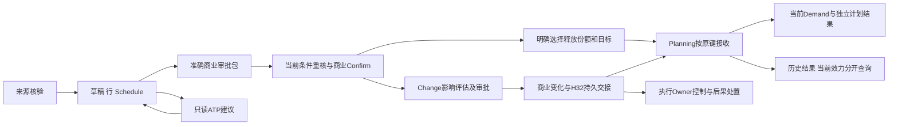

# ERP-ORD-01｜销售订单全生命周期开发设计

状态：`core_semantics_consolidated`。本册整理当前获认可的订单功能文本组合，保留物理适配、真实 Owner 实例和业务验证的独立状态；不是已运行的软件说明。[P:535] 本次已读 R01、R02、R03、R04 正文全篇，订单工作簿全部提取文本采用结构合读，未做原生视觉验收。详见第 12 节。

## 1. 业务目的、操作者与边界

Sales 把客户明确的采购意图转为可追溯的商业责任，并决定哪些具体交期份额交给 Planning。业务路径是“合法来源→订单草稿→行与交期→商业确认→明确释放→Planning 接收”，随后根据真实发运、交付与取消后果判断本订单责任。保存订单、查询 ATP、商业 Confirm 都不创建 Demand、WO、PR、OUT，也不占 REL 制造许可。[R1:50] [R2:2891]

Owner 划分须落实到服务写权限：Sales 拥有 Order、OrderLine、Schedule、OrderVersion、SalesRelease 和商业 Change；Planning 拥有 Demand、DemandVersion、计划控制和 Pegging；WMS 拥有实物发运/预留；Shipping 拥有签收证据；Finance 拥有信用承诺、票据和收款；OA 只决定准确审批包；PLM 各 Owner 决定技术/用途资格。Sales 协调变化不能替任何对方修改终态。[R1:69] [R2:2774]

操作者区分 Reader、Exporter、SalesEditor/SourceReceiver、SalesConfirmer、SalesReleaser、ChangeRequester/Approver/Applier、PlanningReceiver/Controller、原执行 Owner 和 ExceptionCoordinator。角色名称是功能职责，真实岗位、组织、Site、委托和职责隔离实例仍需配置。异常协调者可以分派和结束协调事项，不能因此取得“强制成功”权限。[R2:37] [R2:1910]

当前详细分支是普通实物订单；服务里程碑、预测、安全库存等原范围继续保留，不能因为标题叫“独立需求”就把未定义来源送入货物 MRP。现货发运与新制造采用不同活动条件；不能为现货重复申请制造预约，也不能把少量 TRIAL 当 PRODUCTION。[R1:264] [R2:2565] [R2:4703]

## 2. 当前组合与接受边界

| 材料 | 身份与作用 | 当前可作何种依据 |
|---|---|---|
| R01 联合骨架 | SHA `9c8e50210c608b244d52b68d679ca1c5b59c378da44e9986a537f4756ea357de`，366 行 | R01 对象/Owner/数量/取消/释放骨架及 7 DEC；APR-R01 覆盖其认可状态，原保留项继续。[A1:11] |
| R02 页级详细设计 | SHA `5096115db2722db7c80fbe461ee437e172cfd10998daa2895746c4ddfa769b01`，4746 行 | 54 REQ/ACT/PROC、140 逻辑字段、50 检查、122 AC、10 DEC。APR-R02 明确认可功能稿及十项 DEC，原件 REVIEW/PROPOSED 字节不改。[A2:7] |
| R03 跨 Owner 合同 | SHA `24d39db15ecc62889338bde26d80fafab387e4dc83edaf6aa028cf14d6e14933`，2865 行 | 12 个功能合同、14 类策略实例卡、70 AC 和 8 条跨页序列。不能把其所有历史候选参数/物理方案解释为新获批准。[P:66] |
| R04 正文、HTML、两册 XLSX | 订单 XLSX SHA `2d96e5c7c861f340031225780131513d501c800b8640d6435b35bbb22d0f3f11`；DEM XLSX SHA `68b233cc95c6237b98fd0217d3c7ffb2fe669e78ac8f98e130ea0975ed4e2cd7` | ORD 13 页面实例/60 sheets；DEM 5/44；COM01 镜像只算一个，合计 17 个逻辑页组。[R4:11] |
| PB01 当前认可归档 | ERP-ORD-01：Main Sales，原 9 SPEC，当前功能文本基线认可 | 用户对 R04 的认可覆盖该轮交付与当前 Order/Demand 文本；不能伪造独立 R03 全部参数批准、外部批准 ID、实现进度或运行通过。[P:66] [P:512] |

版本取舍不能按文件名时间或最大文档选择。R04 原文/工作簿保留“R03、R04 REVIEW”，须结合 PB01 的后继有限认可阅读；APR-R02 已覆盖其十项旧 PROPOSED 文案；这些历史标签既不能当当前全部未认可，也不能被擦成物理方案已冻结。[A2:7] [R4:16] [P:66]

相邻 Owner 的后继详细设计对本模块具有实施约束：H07 必须对齐当前 [ERP-QTN-01](D:/CP6/docs/CP6_开发设计文档_20261010/modules/ERP-QTN-01.md)，H08 对齐 [CRM-OPP-01](D:/CP6/docs/CP6_开发设计文档_20261010/modules/CRM-OPP-01.md) 与 [INT-COM-01](D:/CP6/docs/CP6_开发设计文档_20261010/modules/INT-COM-01.md)，业务伙伴准入采用 [ERP-BP-01](D:/CP6/docs/CP6_开发设计文档_20261010/modules/ERP-BP-01.md) 的准确用途与提交保护。R02 的逻辑字段名不自动成为这些 Owner 的物理 wire。[R2:17] [Q:694]

## 3. 核心数据、身份、版本与计算

### 3.1 开发时必须分开的轴

| 业务对象/轴 | 身份与不变量 |
|---|---|
| Order / Line / Schedule | 三层稳定 ID。相同 SKU、不同价/不同来源的行不能合并。行号与排序不是身份；单一交期也保留 ScheduleId；改日期不换身份，技术转移保留后继关系。[R1:93] [R2:102] |
| 商业版本 | EffectiveOrderVersion 与 EditingVersion 并存，如有效 v3 + 编辑 v4；编辑和审批不覆盖正式版。提交审批冻结准确内容，实质变化重新建立包。[R2:67] [R2:182] |
| 供给谱系 | ReleaseLineageId 定位同一供给责任；SalesReleaseLineId 标识一次释放明细；SourceVersion、DemandVersion、技术 Revision 各归 Owner，不跨域比数字。[R1:101] [R2:2232] |
| 真正前驱 | ExpectedAcceptedSourceVersion 是最后真实接受版。v1 接受、v2 明确拒绝、v3 可带 v2 终态引用 v1；v2 UNKNOWN 时普通 v3 不能跳过。[R2:213] |
| 控制 | RequestedControl/ControlProof 独立于 Demand。尚无 Demand 时也可持久源谱系停止控制；不能造 0 件 Demand 代控制。[R2:1185] |
| 事实结果 | OperationKey+规范化原内容定位原操作；ResultId/Version 定位对方真实结果；CurrentSourceEffectivity 表示现在是否有效，不能覆盖旧成功事实。[R2:219] |
| 技术/用途 | TechnicalScope 包含 Item、Revision、Baseline、配置/生效范围；SalesRelease、PLM ReleaseRecord、UseAuthorization 是不同类型，互不替代。[R2:2205] |
| 商业与供给兼容 | 纯改价等变化可由 CommercialSupplyScopeMap 证明原版与当前版供给字段等同，保留旧 H10 关系；不能复制旧商业审批到新价格。[R2:71] [R2:4477] |

必要性与证据状态也分别建模：`REQUIRED / JUSTIFIED_NOT_APPLICABLE / UNDETERMINED` 表示是否需要；`SATISFIED / NOT_SATISFIED / UNKNOWN / STALE` 表示证据情况。未知不能被空配置变成 N/A，已知失败也不能因接口暂不可读而降格成未知来放行。[R2:176] [R3:2189]

### 3.2 数量与价格如何算

在同一责任范围、同一 Item/UOM、完整且当前的事实下：`Q = 原商业量 + 已批准增加 − 已生效减少`；`R = 当前真实接受的释放目标`；`S = 有效发运`；确定未释放量 `U = Q − R`；已释放待补给责任 `R − S`；尚未发运商业责任 `Q − S`。R 已包含其已发部分，不能再加 S。UNKNOWN 释放不能作为 U；异常负差或实际超发不能 `max(0,…)` 裁掉。[R2:112] [R2:118] [R2:4651]

| 情形 | 正确后果 |
|---|---|
| 已接收目标 30，本次目标 40 | 当前 Demand 40，解释增量 +10；历史 30 留档，不能累加成 70。[R2:971] |
| Q100/R60/S20/U40，只取消未释放 30 | Q70/R60/U10；已释放待补给40，商业待发50；不发虚假 H32 减 Demand30。[R2:4413] |
| 同上，取消50=未释放40+已接受10 | Q50/R50/S20/U0；待补给30，取消总量只扣一次。[R2:4427] |
| S1 已接受40，S2 释放60结果未知 | 60 单列未知；停止请求可以先建立，但不能认定无 Demand 或返额。[R2:4441] |
| 已存在 Demand100，真实发0，有权全取消 | 同一 Demand 的后继目标可为0并保留历史100；不能新建0件对象。[R2:4469] |
| 初次释放尚未处理，取消先到 | 只持久源控制；旧初次释放不得新建有效需求。[R2:4455] |
| 已发100/签收80 | 普通重复补给责任为0，仍追签收20；不能自动再造20需求。[R2:1838] |
| 原发100被原 Owner 证明误记10 | 有效发90，保留原关闭历史并进入关闭后复核；不自动新建 Demand10。[R3:1999] |

金额用精确十进制和真实策略：价格单位数量 ÷ `PriceBasisQty` × `UnitPrice`，之后按准确税、折扣、舍入点处理。120元/10件 ×25件=300元；null 价格是待计价，0价要求明确免费范围及授权。币种不同不能相加；UOM 缺换算不能默认1:1；只允许整件时25.5不能静默改25或26。物理 decimal 精度、最大值和长度未冻结，不能直接搬用 QTN/EST 的数值范围当 ORD 全域决定。[R2:151] [R2:153] [R2:284] [R3:2399]

改价必须限定作用份额：原100件单价10，40已开票400，60未开票获准变12，当前商业责任400+720=1120，旧票据不能改480。量、期、Site、技术未变且供给等同性可证时，Demand 仍100。信用与财务后果由 Finance 单独判断。[R3:2019] [R3:2759]

### 3.3 复合值的成员

以下是逻辑结构，不能实现成一个无约束 `JSON` 并让调用方填写权威结论。

| 结构 | 必需成员与含义 | Owner／效力 |
|---|---|---|
| TypedScope / LineMap | Tenant、Order/Line/Schedule或原来源行、数量/UOM、版本、Site、适用时段；明确一对多映射 | 原Owner；显示行号不代稳定身份  [R2:292] |
| VersionedEvidence | EvidenceId、原DOC/专业Owner、准确版本、证明的对象/字段/范围、发生/签署时间、可读/真实性状态、后继 | 附件地址/标题不能代证据身份；无权时不泄漏  [R2:293] |
| Condition | ConditionId、Requiredness及策略/Owner、EvidenceState及原引用、最晚阶段、阻塞动作、后继 | 必需且UNKNOWN/STALE不放行；N_A有据  [R2:294] |
| FactWatermark | 产生Owner、对象/份额范围、版本/截止点、完整性、查询时间及未知原因 | 全范围覆盖才可判断确知0；单次空结果不充分  [R2:295] |
| Conversion | FromUom/ToUom、正分子/分母、转换方向、精度/整包要求、版本、生效及适用Item/Site | UOM Owner；不同量纲不默认变换  [R2:296] |
| PriceTerms | PriceUom、PriceBasisQty>0、UnitPrice、Currency、税含否、折扣类型/顺序、舍入点/精度、适用范围 | Sales/Finance；输入不可缺省成0价  [R2:297] |
| TransitDerivation | 源/目标日期节点、Site/物流线路、日历/时区版本、运输/装卸/截止参数、推导结果/依据或明确人工承诺 | Planning/物流；无数据不能擅减天数  [R2:298] |
| ApprovalBinding | ApprovalInstance、对象/版本、动作、范围、内容证明、策略、申请/审批人及委托、决定时间、结果/应用 | OA与业务Owner分账；不以Approved布尔值解锁所有动作  [R2:299] |
| CommercialSupplyScopeMap | 原商业版、当前商业版、供给相关字段集合及等同性证据、范围、Owner、当前控制/信用重评、适用源谱系 | Sales；只解释不变供给关联，不替新商业批准  [R2:300] |
| RequestedControl / ControlProof | ReasonId/Owner、ControlVersion、来源谱系/份额、禁止动作、生效时点、在途范围、落实凭证/水位、解除条件 | 原控制/执行Owner；请求不等已落实  [R2:301] |
| BusinessResult | 原键/输入版/内容证明、ResultId/Version、Owner、实际处理结果、Demand映射、历史事实、当前效力、原因/恢复及水位 | 目标Owner；不得覆盖原成功历史  [R2:302] |
| ImpactItem / OwnerDecision | ImpactId、Change版、原对象/份额/单位、共享关系、执行水位、可改/不可改/部分/未知、所需控制/处置、回执与后继 | 每个Owner只裁自身范围；协调者不代签  [R2:303] |
| Transfer / ActivationGroup | 原/后继身份及量/UOM、技术范围、转出/转入守恒、价格责任、组成员、准备回执、控制/切换结果 | Sales+Planning；准备不当有效输入  [R2:304] |
| CancelSlice | Schedule/子范围、UNRELEASED/ACCEPTED/UNKNOWN、取消请求与可应用量、所依据R/S水位、对应新目标/控制和回执 | Sales+Planning；同量不能多次扣除  [R2:305] |
| ClosureEvidence | 本次范围和结束原因、必须证明的义务、真实结果、必要未知/执行风险、独立未结、承接Owner/对象 | 本业务Owner；有百分比不等可以Closed  [R2:306] |
| QuerySelection / ExportSelection | 筛选表达式、可见组织、稳定排序、分页大小/令牌、指定字段、对象/版本范围、格式和快照要求 | 查询Owner逐次核准；输入请求不等已取得导出快照  [R2:307] |
| Import/ExportSnapshot | 格式/版本/编码、原文件摘要、稳定批/行键、目标编辑版、列映射/错误、授权筛选/列、数据水位、提交/导出结果 | 草稿Owner/查询Owner；预检不等保存  [R2:308] |

### 3.4 全部 140 项逻辑字段

以下保留 R02 的原字段身份、最晚门、来源、Owner 和编辑边界，方便直接拆 DTO/表单/校验。**这不是 140 个数据库列，也不是新物理 wire。** 特别是 FLD-021/023/024 的旧 Quote `ONE_SHOT/LIMITED_QUANTITY`、Claim/H→C 表达，需要按第 5 节映射到当前 QTN 合同，不能另建第二套额度主账。[R2:2093] [Q:694]

### 共同身份、查询与并发上下文（11项）

| 原字段 | 名称／逻辑型 | 最晚必需／初值来源 | Owner／编辑边界 | 精确业务检查 |
|---|---|---|---|---|
| `OD-R02-FLD-001` | TenantContext / TrustedId | 全部；初值：会话可信上下文 | IAM；不可编辑 | 客户传参不得改变租户 [R2:2100] |
| `OD-R02-FLD-002` | ObjectScope / TypedRef | 全部；初值：当前授权对象 | IAM+Owner；不可越权扩大 | 含对象类型/ID/Site及动作资格 [R2:2101] |
| `OD-R02-FLD-003` | OperationKey / OpaqueId | 每次写动作；初值：首次生成后固定 | 发起Owner；只读 | 重试同键同内容；新业务意图新键 [R2:2102] |
| `OD-R02-FLD-004` | ExpectedVersion / VersionToken | 已有对象写入；初值：打开时真实版本 | 对象Owner；只读 | 与提交时当前版不符返回冲突 [R2:2103] |
| `OD-R02-FLD-005` | ContentProof / DigestOrEquivalent | 已持久写请求；初值：规范化原内容生成 | 对象Owner；只读 | 不代身份/权限/签署 [R2:2104] |
| `OD-R02-FLD-006` | CorrelationId / OpaqueId | 交接/恢复；初值：本链关联号 | 系统；只读 | 诊断相关不作来源去重键 [R2:2105] |
| `OD-R02-FLD-007` | FactWatermark / Record | 查询/评估/应用；初值：原Owner响应 | 事实Owner；只读 | 包含范围、截止点、完整性；空值不等0 [R2:2106] |
| `OD-R02-FLD-008` | ActorAudit / Record | 写动作；初值：可信Actor+时间 | IAM+Owner；只读 | 保留代办/委托及授权范围，不伪造审批人 [R2:2107] |
| `OD-R02-FLD-009` | MissingConditions / List<Condition> | 草稿/阻塞结果；初值：按实际校验生成 | 条件Owner；只能补证不能勾成功 | 必要性/证据状态/最晚时点分别表示 [R2:2108] |
| `OD-R02-FLD-010` | RecordLifecycle / Enum | 全部；初值：新草稿DRAFT | 对象Owner；通过动作变化 | 不等运输或审批状态 [R2:2109] |
| `OD-R02-FLD-139` | QuerySelection / Record | 列表/历史查询；初值：明确可见筛选；不默认全租户 | 查询Owner；用户可改有权条件 | 筛选、稳定排序、页大小/令牌、水位与列权限均核；失败不当空集 [R2:2110] |

### 来源、报价与客户接受（15项）

| 原字段 | 名称／逻辑型 | 最晚必需／初值来源 | Owner／编辑边界 | 精确业务检查 |
|---|---|---|---|---|
| `OD-R02-FLD-011` | SourceType / Enum | 受理保存；初值：无默认 | Sales；首次受理选定；核验后改型需重核 | QUOTE_ACCEPTED/DIRECT_EVIDENCED/EXTERNAL_AUTHORIZED/REPEAT_REFERENCE为R02逻辑值 [R2:2117] |
| `OD-R02-FLD-012` | SourceOwner / OwnerRef | 受理保存；初值：按入口 | Sales；不可伪装 | 与来源证据及对象类型一致 [R2:2118] |
| `OD-R02-FLD-013` | SourceSystem / Text | 外部来源；初值：无 | 来源契约；核验前可选 | 按租户授权系统清单；大小写规范依来源版本 [R2:2119] |
| `OD-R02-FLD-014` | ExternalOrderNumber / Text | 外部来源；初值：无 | 外部原件；核验前输入 | 不自行去零或改大小写；规范化规则持版本 [R2:2120] |
| `OD-R02-FLD-015` | SourceObjectId / TypedId | 引用型来源；初值：无 | 原来源Owner；从有权候选选 | 不能按显示号猜ID [R2:2121] |
| `OD-R02-FLD-016` | SourceObjectVersion / VersionRef | 引用型来源；初值：无 | 原来源Owner；准确选择 | 引用客户已接受版；不自动latest [R2:2122] |
| `OD-R02-FLD-017` | SourceIntentKey / TextOrId | 外部/复购确认新意图；初值：原来源操作或新意图 | Sales/外部Owner；受理后只读 | 同意图重试不新单；复购新意图关联旧单 [R2:2123] |
| `OD-R02-FLD-018` | SourceEvidenceRefs / List<VersionedEvidence> | 来源核验/Confirm；初值：空表示待补 | Sales+DOC；追加/后继更正 | 拒绝用附件文件名代版本及访问资格 [R2:2124] |
| `OD-R02-FLD-019` | CustomerAcceptanceRef / VersionedEvidence | Confirm适用时；初值：无 | Sales/客户渠道；受控登记 | 接受的订单/报价内容、数量/日期范围可证 [R2:2125] |
| `OD-R02-FLD-020` | OriginLineMap / List<LineMap> | 报价/外部创建；初值：逐行显式映射 | Sales+Quote；提交后不可改原映射 | 原行身份不能按SKU合并；一个原行拆多新行须可追 [R2:2126] |
| `OD-R02-FLD-021` | QuoteConversionPolicyRef / VersionedPolicyRef | 报价转单；初值：无 | Quote原Owner；引用只读 | ONE_SHOT或LIMITED_QUANTITY；缺配置不能无限转 [R2:2127] |
| `OD-R02-FLD-022` | QuoteConversionScope / TypedScope | 有转用限制；初值：策略定义 | Quote原Owner；只读 | 跨报价修订是否共额由准确谱系范围决定 [R2:2128] |
| `OD-R02-FLD-023` | QuoteDraftClaimRef / TypedRef | 受控转单草稿；初值：Quote确认真实占用后产生 | Quote原Owner；只读 | 商业转用占用，不是WMS/REL预约 [R2:2129] |
| `OD-R02-FLD-024` | QuoteCommittedUsageRef / TypedRef | 报价来源Confirm；初值：源Owner实际转用回执 | Quote原Owner；只读 | 已确认转用取消不自动返额 [R2:2130] |
| `OD-R02-FLD-025` | SourceCheckResult / Enum+Reasons | 来源检查后；初值：UNVERIFIED | Sales/Quote；不能人工改PASS | VERIFIED/CONFLICT/UNAVAILABLE/REFERENCE_ONLY分开 [R2:2131] |

### 订单头与有效/编辑版本（20项）

| 原字段 | 名称／逻辑型 | 最晚必需／初值来源 | Owner／编辑边界 | 精确业务检查 |
|---|---|---|---|---|
| `OD-R02-FLD-026` | OrderId / OpaqueId | 受理保存；初值：首次成功生成 | Sales；只读 | 业务号变更不换身份 [R2:2138] |
| `OD-R02-FLD-027` | OrderNumber / Text | 成功保存；初值：编号规则 | Sales；只读或授权更正 | 唯一范围由组织策略确定；不从编号解析Tenant [R2:2139] |
| `OD-R02-FLD-028` | EffectiveOrderVersion / VersionRef | 存在正式版时；初值：无 | Sales；只读 | 尚无正式版显示未确认，不显示v0已确认 [R2:2140] |
| `OD-R02-FLD-029` | EditingVersion / VersionRef | 草稿/Change；初值：本次编辑版本 | Sales；受控维护 | 不覆盖有效版；绑定ExpectedVersion [R2:2141] |
| `OD-R02-FLD-030` | SalesOrganization / OrgRef | Confirm；初值：有权组织候选可建议 | Sales/IAM；草稿；确认后Change | 不能默认当前用户所有Site可访问 [R2:2142] |
| `OD-R02-FLD-031` | SoldToParty / PartyRef | Confirm；初值：来源有据建议 | BP+Sales；草稿；正式后Change | 与来源客户匹配；停用/冻结按当前动作规则 [R2:2143] |
| `OD-R02-FLD-032` | BillToParty / PartyRef | Confirm；初值：只有策略允许继承SoldTo | BP+Sales；草稿/Change | 不同抬头授权关系可证 [R2:2144] |
| `OD-R02-FLD-033` | PayerParty / PartyRef | Confirm；初值：仅有据默认 | BP+Finance；草稿/Change | 信用责任主体不按收货人猜 [R2:2145] |
| `OD-R02-FLD-034` | PartySnapshotVersion / VersionRef | Confirm；初值：确认时固定 | BP+Sales；只读 | 刷新新主数据不得改历史抬头 [R2:2146] |
| `OD-R02-FLD-035` | Currency / CurrencyCode | Confirm；初值：来源有据建议 | Sales；草稿/Change | 一个订单商业总额同币种；多币种拆明确对象 [R2:2147] |
| `OD-R02-FLD-036` | PaymentTermsRef / VersionedTerms | Confirm；初值：来源快照或明确选择 | Sales/Finance；草稿/Change | 预付条件核Finance真实结果，不信手工已收款 [R2:2148] |
| `OD-R02-FLD-037` | PricingPolicyRef / VersionedPolicy | 计算/Confirm；初值：无 | Sales/Finance；受控选择 | 计价单位/税含否/折扣/舍入规则完整 [R2:2149] |
| `OD-R02-FLD-038` | DeliveryTermsRef / VersionedTerms | Confirm；初值：来源有据 | Sales；草稿/Change | 节点与责任明确，不在本稿解释法律归属 [R2:2150] |
| `OD-R02-FLD-039` | HeaderShipToSnapshot / AddressSnapshot | 有默认收货范围时；初值：来源有据 | BP+Sales；草稿/Change | 行交期覆盖须显式；不等DemandSite [R2:2151] |
| `OD-R02-FLD-040` | ResponsibleSalesActor / ActorRef | Confirm；初值：操作者可建议 | Sales/IAM；授权分派 | 历史批准人不随负责人改名 [R2:2152] |
| `OD-R02-FLD-041` | CustomerOrderReference / Text | 依来源策略；初值：无 | 客户原件；草稿/Change | 同号重复与真实追加意图区分 [R2:2153] |
| `OD-R02-FLD-042` | CustomerRequiredAcceptance / Enum+Evidence | Confirm；初值：UNDETERMINED | Sales；有权裁决 | 必需/有据N_A/未知，不把未知当客户默认同意 [R2:2154] |
| `OD-R02-FLD-043` | CommercialConfirmation / Record | Confirm成功；初值：真实动作产物 | Sales；只读 | Version、范围、确认人、依据和时间全有 [R2:2155] |
| `OD-R02-FLD-044` | ChangeId / OpaqueId | 已确认实质变化；初值：首次创建 | Sales；只读 | 不因页面刷新更换 [R2:2156] |
| `OD-R02-FLD-045` | Notes / Text | 选填；初值：空 | Sales；授权备注追加 | 管理备注不得暗含价格/技术改动 [R2:2157] |

### 商业行、价格与数量（20项）

| 原字段 | 名称／逻辑型 | 最晚必需／初值来源 | Owner／编辑边界 | 精确业务检查 |
|---|---|---|---|---|
| `OD-R02-FLD-046` | OrderLineId / OpaqueId | 存在商业行；初值：首次生成 | Sales；只读 | 排序号或SKU不是身份 [R2:2164] |
| `OD-R02-FLD-047` | DisplayLineNumber / Integer | 显示；初值：顺序建议 | Sales；草稿可排序 | 重排不改变源映射 [R2:2165] |
| `OD-R02-FLD-048` | LineKind / Enum | Confirm；初值：无 | Sales/产品策略；草稿/Change | GOODS/SERVICE等为适用分类；服务不自动投货物MRP [R2:2166] |
| `OD-R02-FLD-049` | ItemId / ItemRef | 货物Confirm；初值：来源有据 | 产品Owner；草稿/Change | 草稿未解析可待补；正式不能造虚Item [R2:2167] |
| `OD-R02-FLD-050` | CustomerItemRef / Text+MapVersion | 客户物料涉及时；初值：来源有据 | Sales/产品映射；草稿/Change | 客户物料号不能代内部技术身份 [R2:2168] |
| `OD-R02-FLD-051` | ItemDescriptionSnapshot / Text | Confirm；初值：准确产品版 | 产品Owner；只读快照 | 订单说明与技术规格分开 [R2:2169] |
| `OD-R02-FLD-052` | OriginalCommercialQty / Quantity | 首次Confirm；初值：无 | Sales；正式后只读 | 严格正数；不可用0行表示取消 [R2:2170] |
| `OD-R02-FLD-053` | ApprovedIncreaseQty / Quantity | 变化后；初值：有据变化累计 | Sales；只读 | 仅计已生效增加；待批不计入 [R2:2171] |
| `OD-R02-FLD-054` | EffectiveDecreaseQty / Quantity | 减少后；初值：有据变化累计 | Sales；只读 | 取消与转出在分别账项，不重扣 [R2:2172] |
| `OD-R02-FLD-055` | CurrentCommercialQty / Quantity | 正式数量展示；初值：同范围计算 | Sales；只读 | 原量+增加-生效减少；超发显示差额 [R2:2173] |
| `OD-R02-FLD-056` | TransactionUom / UomRef | 数量输入；初值：来源有据 | 产品/UOM Owner；草稿/Change | 箱/件/重量不可随意互换 [R2:2174] |
| `OD-R02-FLD-057` | StandardUom / UomRef | 供给Release；初值：有权产品配置 | 产品/UOM Owner；只读引用 | 数量比较只同准确量纲/范围 [R2:2175] |
| `OD-R02-FLD-058` | ConversionPolicyRef / VersionedConversion | 交易与标准单位不同时；初值：无 | UOM Owner；受控引用 | 分子分母、有效范围、精度可证 [R2:2176] |
| `OD-R02-FLD-059` | UnitPrice / DecimalExact | 货物金额计算/Confirm；初值：无 | Sales+Quote；草稿/Change | 零价须免费原因和授权；缺价不默认为0 [R2:2177] |
| `OD-R02-FLD-060` | PriceBasisQty / PositiveDecimal | 金额计算；初值：来源/计价策略 | Sales；草稿/Change | 100元/10件不是100元/件；必须大于0 [R2:2178] |
| `OD-R02-FLD-061` | PriceUom / UomRef | 金额计算；初值：来源/计价策略 | Sales；草稿/Change | 与交易单位不同需准确换算 [R2:2179] |
| `OD-R02-FLD-062` | DiscountTerms / Record | 折扣适用时；初值：只有明确无折扣才0 | Sales；草稿/Change | 比例/固定额和先后规则不可同时模糊叠加 [R2:2180] |
| `OD-R02-FLD-063` | TaxTreatmentRef / VersionedPolicy | 含税金额/Confirm适用时；初值：无 | Finance原策略；受控引用 | 不硬编码税率；不猜辖区 [R2:2181] |
| `OD-R02-FLD-064` | LineNetAmount / Money | 金额可计算时；初值：确定性规则计算 | Sales；只读 | 币种和舍入点明确；来源缺项显示未计价 [R2:2182] |
| `OD-R02-FLD-065` | PriceChangeScope / TypedScope | 价格变更；初值：无 | Sales/Finance；受控选择 | 作用份额与已开票范围显式，不追改原票据 [R2:2183] |

### 交期、地点、技术和供给模式（20项）

| 原字段 | 名称／逻辑型 | 最晚必需／初值来源 | Owner／编辑边界 | 精确业务检查 |
|---|---|---|---|---|
| `OD-R02-FLD-066` | ScheduleId / OpaqueId | 正式分交期；初值：首次生成 | Sales；只读 | 日期改变不换ID；技术拆分有后继 [R2:2190] |
| `OD-R02-FLD-067` | ParentOrderLineId / OpaqueId | Schedule存在；初值：所属商业行 | Sales；只读 | 不跨行任意挪动已释放份额 [R2:2191] |
| `OD-R02-FLD-068` | ScheduleQty / Quantity | Confirm/Release；初值：用户明确分配 | Sales；草稿/Change | 同量纲分配守恒；未分配缺口不得Confirm [R2:2192] |
| `OD-R02-FLD-069` | CustomerRequiredDate / BusinessDateTime | Confirm；初值：客户原件 | Sales；草稿/Change | 保留原要求；改承诺不覆盖要求 [R2:2193] |
| `OD-R02-FLD-070` | CustomerDateNode / Enum | 有要求日期；初值：明确来源 | Sales；草稿/Change | ARRIVAL/SHIP等逻辑节点，不按字段名字猜 [R2:2194] |
| `OD-R02-FLD-071` | PromisedDate / BusinessDateTime | Confirm依策略/Release必需；初值：无 | Sales；采纳/承诺动作 | 不能由ATP查询隐式回写 [R2:2195] |
| `OD-R02-FLD-072` | PromiseNode / Enum | 有承诺日期；初值：无 | Sales；草稿/Change | 承诺送达或可发运等准确节点 [R2:2196] |
| `OD-R02-FLD-073` | DemandRequiredDate / BusinessDateTime | Release；初值：受控推导或有据录入 | Sales+Planning；草稿/Change | 不能缺省客户送达日 [R2:2197] |
| `OD-R02-FLD-074` | DemandDateNode / Enum | Release；初值：策略明确 | Planning；受控引用 | 工厂可用/可发运等节点；无定义阻塞 [R2:2198] |
| `OD-R02-FLD-075` | CalendarVersion / VersionRef | 日期推导/Release；初值：策略引用 | Planning；只读 | 假期/工作时段按版本；变更产生重评 [R2:2199] |
| `OD-R02-FLD-076` | TimeZoneRef / ZoneRef | 时间解释/Release；初值：Site配置有据 | Planning/物流；受控引用 | 仅日期保留日期语义；不强造午夜UTC [R2:2200] |
| `OD-R02-FLD-077` | TransitDerivation / Record | 日期由节点转换时；初值：无 | 物流/Planning；受控引用 | 运输、装卸、截止时间及版本；不凭空减天数 [R2:2201] |
| `OD-R02-FLD-078` | DemandSite / SiteRef | Release；初值：明确供给责任地点 | Sales+Planning；草稿/Change | 不同于客户地址/具体发货仓 [R2:2202] |
| `OD-R02-FLD-079` | ShipToSnapshot / AddressSnapshot | Confirm/Release；初值：有据继承头部后固定 | Sales/BP；草稿/Change | 改地址需评估已配货/在途后果 [R2:2203] |
| `OD-R02-FLD-080` | SupplyMode / Enum+Policy | Release；初值：无 | Planning/产品策略；受控确定 | 现货/新制造/外购/返工等活动分支，不新建Purpose [R2:2204] |
| `OD-R02-FLD-081` | TechnicalScope / Record | Release适用；初值：原技术Owner证据 | ENG/CFG；只读引用 | Item、Revision、Baseline、配置/生效范围准确 [R2:2205] |
| `OD-R02-FLD-082` | TechnicalApplicability / List<Condition> | Confirm/Release；初值：UNKNOWN直到有据 | PLM各Owner；只读结论 | N_A须Owner/策略版/范围 [R2:2206] |
| `OD-R02-FLD-083` | PurposeEvidenceRefs / List<TypedRef> | Release适用；初值：无 | REL/原用途Owner；只读 | SalesRelease、ReleaseRecord、UseAuthorization不同类型 [R2:2207] |
| `OD-R02-FLD-084` | DeliveryConstraintGroup / GroupRef | 不可拆/配套约束适用；初值：无约束须明确 | Sales；草稿/Change | 允许分批发运不等允许一组部分启用 [R2:2208] |
| `OD-R02-FLD-085` | PredecessorSuccessorRefs / List<TypedRef> | 拆分/技术后继；初值：真实关系 | Sales+Planning；只读 | 转出转入守恒；原件仍能回查 [R2:2209] |

### ATP、承诺、审批与信用（10项）

| 原字段 | 名称／逻辑型 | 最晚必需／初值来源 | Owner／编辑边界 | 精确业务检查 |
|---|---|---|---|---|
| `OD-R02-FLD-086` | AtpRequestSnapshot / Record | ATP查询；初值：准确输入固定 | Sales；只读 | 含自身Demand排除范围，不能排除他人需求 [R2:2216] |
| `OD-R02-FLD-087` | AtpEvaluationId / TypedId | ATP成功；初值：Planning真实返回 | Planning；只读 | 失败不造评估成功号 [R2:2217] |
| `OD-R02-FLD-088` | AtpSegments / List<QtyDate> | ATP成功；初值：真实评估结果 | Planning；只读 | 分段量与总量/约束一致 [R2:2218] |
| `OD-R02-FLD-089` | AtpLimitations / List<Reason> | ATP结果；初值：原Owner返回 | Planning；只读 | 无CTP能力不宣称有限产能保证 [R2:2219] |
| `OD-R02-FLD-090` | AtpValidity / Record | ATP采纳；初值：输入指纹+水位+策略时效 | Planning；只读 | 任何关键输入变化即重评；时间未到也可失效 [R2:2220] |
| `OD-R02-FLD-091` | PromiseBasis / Record | 采纳或人工承诺；初值：本次明确选择 | Sales；受控填写 | 可含ATP/客户协商/获准例外，不能伪写ATP可交 [R2:2221] |
| `OD-R02-FLD-092` | ApprovalBinding / Record | 需审批动作；初值：准确对象版/范围/动作 | Sales+OA；只读 | 不同动作批准不互代 [R2:2222] |
| `OD-R02-FLD-093` | ApprovalResult / Record | OA回执；初值：OA真实结果 | OA；只读 | 通过/拒绝/撤回/未知及应用结果分开 [R2:2223] |
| `OD-R02-FLD-094` | CreditDecisionRef / VersionedDecision | 信用必需时；初值：Finance当前结果 | Finance；只读 | 只读评估不等信用额度已占用；有并发额度需Owner承诺 [R2:2224] |
| `OD-R02-FLD-095` | ExceptionDecisionRef / VersionedDecision | 例外适用时；初值：无 | 有权政策Owner；只读引用 | 硬前置/权限/计量不得靠普通例外跳过 [R2:2225] |

### 释放、源版本、需求及回执（21项）

| 原字段 | 名称／逻辑型 | 最晚必需／初值来源 | Owner／编辑边界 | 精确业务检查 |
|---|---|---|---|---|
| `OD-R02-FLD-096` | SalesReleaseId / OpaqueId | 释放持久提交；初值：真实动作生成 | Sales；只读 | 不是PLM发布号 [R2:2232] |
| `OD-R02-FLD-097` | SalesReleaseLineId / OpaqueId | 释放明细；初值：每个提交份额生成 | Sales；只读 | 同源重传不另造有效份额 [R2:2233] |
| `OD-R02-FLD-098` | ReleaseLineageId / OpaqueId | 供给责任谱系；初值：首次合法释放谱系 | Sales；只读 | 取消先到时也能定位，无Demand不造假 [R2:2234] |
| `OD-R02-FLD-099` | SourceVersion / VersionRef | H10/H32；初值：严格推进的源版 | Sales；只读 | 拒绝版保留；实质改内容用新版本 [R2:2235] |
| `OD-R02-FLD-100` | ExpectedAcceptedSourceVersion / VersionRefOrNone | 变化应用；初值：确知前驱 | Sales+Planning；只读 | 接收v1后v2被拒，v3需指向真实已接受v1而非假设v2成立 [R2:2236] |
| `OD-R02-FLD-101` | DesiredTargetQty / Quantity | 数量释放/变化；初值：明确目标总量 | Sales；提交前选择 | 30变40输入40；减少走Change而非负数新释放 [R2:2237] |
| `OD-R02-FLD-102` | PreviousAcceptedQty / QuantityOrUnknown | 释放预览/变化；初值：Planning权威结果 | Planning；只读 | 未知不作0；拒绝初次无需求与目标0不同 [R2:2238] |
| `OD-R02-FLD-103` | TargetDelta / SignedQuantity | 变化显示；初值：新目标减前驱目标 | Sales+Planning；只读 | 用于解释，不作为再次累加载荷 [R2:2239] |
| `OD-R02-FLD-104` | StandardTargetQty / Quantity | H10；初值：准确换算结果 | Sales；只读 | 保留原交易量/标准量/转换版本 [R2:2240] |
| `OD-R02-FLD-105` | ReleaseBatchId / OpaqueId | 多份额提交；初值：批次关联 | Sales；只读 | 只是分组不替明细事务 [R2:2241] |
| `OD-R02-FLD-106` | ActivationGroupId / OpaqueId | 不可拆/拆分联合启用；初值：明确组合 | Sales+Planning；只读 | 准备与生效分开；未知不能双重有效 [R2:2242] |
| `OD-R02-FLD-107` | RequestedControl / Record | 暂停/取消/后继控制；初值：有权决定 | Sales/控制Owner；通过动作 | 原因集、范围、控制版本、作用动作和时点 [R2:2243] |
| `OD-R02-FLD-108` | ProcessingState / Enum | 交接处理；初值：NOT_SUBMITTED | 产生状态的Owner；只读 | 传输ACK不得映射BUSINESS_ACCEPTED [R2:2244] |
| `OD-R02-FLD-109` | BusinessResult / Record | 已处理/回查；初值：目标实际结果 | Planning；只读 | 原输入版、ResultId、Demand版、历史与当前效力 [R2:2245] |
| `OD-R02-FLD-110` | DemandId / OpaqueIdOrNone | 实际成立后；初值：真实接收产物 | Planning；只读 | 无Demand明确无对象，不返回占位ID [R2:2246] |
| `OD-R02-FLD-111` | DemandVersion / VersionRef | 实际Demand结果；初值：Planning版本 | Planning；只读 | 不同于SourceVersion/技术Revision [R2:2247] |
| `OD-R02-FLD-112` | CurrentSourceEffectivity / Record | 查询原结果；初值：当前Owner事实 | Planning+Sales；只读 | 历史成功可当前取消；不覆写原回执 [R2:2248] |
| `OD-R02-FLD-113` | DispositionItems / List<ImpactItem> | 有下游后果；初值：逐Owner评估 | 各执行Owner；各自处理 | 共享供给按份额，含未知/不可撤销 [R2:2249] |
| `OD-R02-FLD-114` | ReplayEligibility / Record | 恢复按钮；初值：当前有权判断 | 原操作Owner；只读 | 允许只补投影/原内容重放/新后继，不通用重试全部 [R2:2250] |
| `OD-R02-FLD-115` | ProjectionSyncState / Record | 跨Owner投影；初值：同步事实 | 投影Owner；只读 | 投影失败不回滚真实业务成功 [R2:2251] |
| `OD-R02-FLD-137` | CommercialSupplyScopeMap / Record | 商业版变而供给相关内容未变时；初值：Sales有据对照 | Sales；只读后继映射 | 原OrderVersion→现版；量/期/地点/技术/供给条件等同范围可证；不复制旧审批到新商业内容 [R2:2252] |

### 变化、取消、履约、批量与结束（23项）

| 原字段 | 名称／逻辑型 | 最晚必需／初值来源 | Owner／编辑边界 | 精确业务检查 |
|---|---|---|---|---|
| `OD-R02-FLD-116` | ChangeClass / EnumSet | 变化申请；初值：明确变化内容 | Sales；编辑版 | 价格/量/期/地点/技术/控制分别识别 [R2:2259] |
| `OD-R02-FLD-117` | ChangeScope / TypedScope | 变化申请；初值：明确行/交期份额 | Sales；编辑版 | 不得默认全单 [R2:2260] |
| `OD-R02-FLD-118` | ChangeDiff / Record | 评估/审批；初值：旧新不可变差分 | Sales；审批后变动需后继 | 标出不影响Demand的商业变化 [R2:2261] |
| `OD-R02-FLD-119` | ImpactAssessmentVersion / VersionRef | 应用变化；初值：本次评估版 | 协调Owner；只读 | 已发/在制等关键水位变动触发失效 [R2:2262] |
| `OD-R02-FLD-120` | OwnerDecision / Record | 每个影响项；初值：原Owner裁决 | 对应Owner；仅本Owner写 | 可改/部分/不可改/需处置/未知及数量范围 [R2:2263] |
| `OD-R02-FLD-121` | ControlProof / Record | 声称已停止旧动作前；初值：目标Owner真实凭证 | 目标Owner；只读 | 覆盖对象/动作/版本和在途请求；禁用页面不算 [R2:2264] |
| `OD-R02-FLD-122` | RequestedCancelQty / Quantity | 取消申请；初值：无 | Sales；申请中 | >0且不超过已核未发范围；客户全部取消诉求与可应用量分列 [R2:2265] |
| `OD-R02-FLD-123` | EffectiveCancelQty / Quantity | 商业取消生效；初值：真实生效范围 | Sales；只读 | 有据生效后保留，即使执行处置未完 [R2:2266] |
| `OD-R02-FLD-124` | TransferOutInMap / List<Transfer> | 拆分切换；初值：明确原份额→后继 | Sales+Planning；提交后不可变 | 非同量纲转换需合法映射；不当新增销售 [R2:2267] |
| `OD-R02-FLD-125` | BackorderReason / Enum+Text | 欠交处理；初值：责任Owner确认 | Sales+Planning；追加历史 | 变更承诺不删除原到期未履约事实 [R2:2268] |
| `OD-R02-FLD-126` | EffectiveShipmentQty / QuantityOrUnknown | 履约/取消/关闭；初值：WMS有效事件映射 | WMS；只读 | 普通退货不减历史发运；更正来自后继事实 [R2:2269] |
| `OD-R02-FLD-127` | EffectiveDeliveredQty / QuantityOrUnknown | 交付展示；初值：Shipping真实证明 | Shipping；只读 | 不可由已发直接赋值 [R2:2270] |
| `OD-R02-FLD-128` | ActualReturnQty / QuantityOrUnknown | 退货展示；初值：原退货Owner事实 | WMS/售后；只读 | 不自动重开Demand [R2:2271] |
| `OD-R02-FLD-129` | RemainingSupplyResponsibility / QuantityOrUnknown | 普通货物结果；初值：目标与已发同范围计算 | Planning；只读 | 数据陈旧或超发异常不能截0掩盖 [R2:2272] |
| `OD-R02-FLD-130` | CoverageResultRef / VersionedRunResult | 计划结果展示；初值：后续Planning Run | Planning；只读 | 当前资格与有效输入版可辨 [R2:2273] |
| `OD-R02-FLD-131` | ActualReservationRef / VersionedFact | 实物占用展示；初值：WMS真实事实 | WMS；只读 | 预留包含其分配，不重复扣 [R2:2274] |
| `OD-R02-FLD-132` | ClosureReason / Enum | 业务结束；初值：无 | Sales/Planning各自；受控动作 | FULFILLED/CANCELLED/MIXED等准确范围，需求终结不叫全额交付 [R2:2275] |
| `OD-R02-FLD-133` | ClosureEvidence / List<Condition> | 业务结束；初值：逐项现有结果 | 各Owner；只读 | 必要未知未清不得整体结束；独立账不级联 [R2:2276] |
| `OD-R02-FLD-134` | ImportBatchKey / OpaqueId | 导入提交；初值：首次生成 | Sales；只读 | 重复整批查回同结果；改单内容新批或后继 [R2:2277] |
| `OD-R02-FLD-135` | ImportRowKey / Text | 导入明细；初值：文件稳定行键 | 来源文件；预检前 | 空/重复拒绝；不只依Excel行号 [R2:2278] |
| `OD-R02-FLD-136` | ExportSnapshotRef / Record | 导出；初值：授权范围+水位+格式版 | 查询Owner；只读 | 导出无权信息不落到文件；不默认导出全租户 [R2:2279] |
| `OD-R02-FLD-138` | CancelAllocationMap / List<CancelSlice> | 部分释放后的取消评估/应用；初值：用户明确范围+Owner核验 | Sales+Planning；候选可编辑，批准后新版本 | 未释放/已接受/结果未知各分量；总和等于本次取消；未知不得按0或未释放处理 [R2:2280] |
| `OD-R02-FLD-140` | ExportSelection / Record | 导出预检/提交；初值：明确当前选定范围/格式 | 查询Owner；用户选择；服务端重核 | 指定对象/筛选、字段、有效/历史版本、格式及快照要求；不默认全量 [R2:2281] |

## 4. 正常流程、变化与状态转移

图中的箭头是有权业务交接，不表示一个全局事务。Sales 只落自己的确认/释放/变化及持久请求；Planning 落 Demand/控制/原结果；对方结果未知时保留 Pending，不把 HTTP 成功当对方业务提交。[R2:230] [R2:278]

### 4.1 来源、草稿、Confirm

来源区分 `QUOTE_ACCEPTED`、`DIRECT_EVIDENCED`、`EXTERNAL_AUTHORIZED`、`REPEAT_REFERENCE`。报价引用客户真正接受的准确版本；外部来源保留授权系统与编号规范，不猜“001=1”；复购必须新的业务意图并关联旧单，不能复活旧 Cancelled。直接订单需要自身证据，不能伪选类型绕过报价限制。[R2:79] [R2:88] [R2:486]

草稿可保留缺项，但 Confirm 必须补齐本动作必要信息：真实交易角色、接受证据、数量分配、价格规则、技术适用性、信用/付款、当前审批和权限。所有 Schedule 量必须等于商业行量，缺10不得自动补最后一行。OA Approved 与 Sales Applied 分轴；OA通过后信用失败，界面保留“审批通过/业务未应用”。[R2:104] [R2:169] [R2:848] [R2:876]

R03 的 ApplyIntent 描述跨参与者的协调责任：固定对象/版本/动作/内容；取得 Quote/Finance 等实际保证；Sales 实际确认和 H08 持久事实只应用一次；结果未知不返承诺。只有原 Owner 能证明原操作已终结且以后不能应用，才允许安全解除或返额。协调状态 `WAITING_PARTICIPANT / APPLIED_NOTIFY_PENDING / NOT_APPLIED_FINAL / OUTCOME_UNKNOWN` 不能覆盖参与者真实状态。[R3:204] [R3:230] [R3:1599]

### 4.2 Release、Cancel、技术后继

每个独立 Schedule 有自己的原操作键、内容和回执，批次仅汇总。例如40成功、60拒绝，批次是部分结果；不可拆组合不能按独立批次自动部分成功。预检只提供条件矩阵，提交时还要重核当前版本/控制/Owner事实。[R2:916] [R2:944] [R2:973]

普通释放只增加至当前获准商业范围中的目标总量；减少必须走 Change。一个谱系普通数量/技术变化最多一个未知操作；紧急停止可以用独立更高控制阻止风险，但不能抹掉未知操作或真实旧结果。[R2:107] [R2:2587]

取消先分清 `UNRELEASED / ACCEPTED / UNKNOWN` 并记录 CancelAllocationMap。申请量与实际可取消上限分栏；重新获取 WMS 发运和在途事实，若评估时已发40、提交前又发10，旧取消60必须失效重评。商业取消可以真实成立，同时采购不可撤销/WIP需处置；两者不能互相删除。[R2:125] [R2:1198] [R2:4159]

“停止已收到”“新执行已阻止”“在途已核清”是不同证明级别；还要记录完整入口集合、控制原因 Owner、范围、版本、生效时点、在途以及未来不会发生旧动作的依据。新增未覆盖入口使旧证明对该范围不完整。解除 Planning 原因仍保留 QA/Sales/工程原因；仅页面禁用不是执行入口已阻止。[R3:357] [R3:397] [R2:1659]

技术 A100 已发30，剩70改成 B40/C30：原 A30保留，B/C先准备但不进入正式 MRP/执行。启用前重核真实剩余量并取得全组唯一效力，确保旧70退出、新70进入；一个成员未知则整组不启用。未证明原子切换或实际协调能力时禁用该模式，不能先建新需求再删旧需求。[R2:1298] [R2:1326] [R3:690]

### 4.3 Sales 与共用页全部动作

表中 ACT 采用原 `OD-R02-ACT-*`。输入字段、前置检查列表、原 REQ/PROC 与直接验收位于每行引用处；表内给出执行顺序、写集边界与成功凭证。Planning 的 ACT-034～045由 [PLAN-DEM-01](D:/CP6/docs/CP6_开发设计文档_20261010/modules/PLAN-DEM-01.md) 展开：Sales 不实现一套代写 Demand 的同名动作。

| 动作 | 操作者与可执行态 | 顺序与判断 | 所属提交／产物 |
|---|---|---|---|
| ACT-001 查询、筛选及下钻 | Reader/有权业务角色；任意可见态。 | 固化筛选与可见组织范围。 查询对应快照与稳定排序。 返回可见结果、水位、未决标记。 下钻重新校验具体对象权限。 | 只读；可留访问审计，不改变订单状态。 成功凭证：查询快照＋每行准确Order/Line/Schedule引用。 [R2:364] |
| ACT-002 创建待办处理入口 | 有权Sales/ExceptionCoordinator；存在本人可处理事项。 | 选具体阻塞事项。 校验对应Owner与允许动作。 跳转原页携带原键和版本，不预先执行。 | 仅任务分派/导航，非业务状态修改。 成功凭证：责任人/转派审计；导航显示原操作。 [R2:391] |
| ACT-003 核验来源及可转用范围 | SalesEditor；未核/待补/引用来源。 | 按来源类型核合法身份和新商业意图。 报价读取准确接受版及转用策略。 外部读取来源系统的归一规则与业务键。 返回核验结果和不足，不由读核验自动占用。 | 检查结果/审计可保存；转用正式占用在创建动作。 成功凭证：核验范围、内容指纹、Quote版本与可用快照。 [R2:431] |
| ACT-004 创建有据订单草稿 | SalesEditor/授权外部入口；已核或允许来源待补草案。 | 核验原请求是否已成功。 报价受控取得草稿转用Claim。 形成Order/Line/来源映射与审计。 确认草稿与Claim关联结果。 非共同提交时保留待核关系并阻塞Confirm。 | Sales草稿+来源+审计同一逻辑提交；Quote占用有独立真实回执；失败需核安全解除，不盲返额。 成功凭证：OrderId/编辑版/来源状态/真实Claim引用，未商业确认。 [R2:458] |
| ACT-005 以旧订单作复购参考 | SalesEditor；有权旧单任意态。 | 读取旧单允许复制的商业字段。 明确新客户意图和新OperationKey。 去除Confirm/Release/Demand/旧审批与预约资格。 提示主数据及技术需重核。 创建新草稿并留引用。 | 新草稿自己的身份；旧单不改。 成功凭证：新OrderId＋旧OrderId/Version参考＋缺项。 [R2:486] |
| ACT-006 保存订单头/编辑版 | SalesEditor；草稿或Change编辑。 | 读取准确有效版与编辑版。 仅校验本阶段必需及字段权限。 记录客户/商业快照与缺项。 以ExpectedVersion提交新编辑修订。 | 只改允许编辑版；正式有效版保持；结果与审计同边界。 成功凭证：编辑版本与缺项清单；有效版指针未变。 [R2:528] |
| ACT-007 放弃编辑或作废未确认草稿 | SalesEditor；未确认编辑稿且无未知Confirm。 | 辨别放弃候选还是作废首次草稿。 核没有已应用确认/在途确认。 保留作废理由及版本历史。 报价占用仅在确认不可能再应用后请求源Owner释放。 结果未知保留占用待核。 | 草稿作废与相关控制留痕；Quote释放按真实回执单列。 成功凭证：作废记录或编辑稿放弃；有效版不改；Quote余额真实结果。 [R2:555] |
| ACT-008 撤回待审批内容 | SalesEditor/申请人；审批中且未应用。 | 固定撤回对象及ApprovalInstance。 向OA请求撤回。 Sales保留不应用该旧包的有权控制。 若确认已实际成功则转Change不称撤回成功。 返回双边结果。 | 撤回请求与内容保护事实；不删除审批历史。 成功凭证：OA撤回结果＋Sales应用控制；未知显示待确认。 [R2:583] |
| ACT-009 新增或维护商业行 | SalesEditor；草稿/Change编辑。 | 保留稳定商业行身份及来源行映射。 输入数量与计价条件。 按准确策略计算可计算金额。 缺项保持未计价。 更新编辑版并生成分交期待分配量。 | 商业行/编辑版/审计一起提交，未生效前不改Demand。 成功凭证：行ID、计算依据、金额或缺项。 [R2:625] |
| ACT-010 维护或分配交期份额 | SalesEditor；未确认草稿/获授权后继编辑。 | 从准确商业行创建稳定Schedule。 输入数量/技术/地点。 校验合计与未分配。 草稿可保存不完整但标Confirm阻塞。 正式份额修改转Change而非原地改。 | 编辑Schedule与分配校验结果同边界。 成功凭证：ScheduleId集合＋已分配与差额。 [R2:653] |
| ACT-011 移除尚未生效的草稿行/交期 | SalesEditor；编辑稿且该范围未正式使用。 | 核该身份是否已确认/释放/被外部引用。 仅允许移除纯编辑内容。 保存撤销痕迹和来源Claim差量待办。 重新计算未分配，不调整已发。 | 逻辑移除候选；不物理删除正式历史。 成功凭证：候选删除/作废记录与余量缺项。 [R2:681] |
| ACT-012 查询ATP | SalesEditor/SalesConfirmer；具备查询所需输入。 | 固化Item/Revision/Site/量/请求节点与自身需求排除。 向Planning只读查询。 接收分段建议/水位/限制。 失败显示未评估。 不改承诺。 | 只读及独立评估记录；无订单/需求/预留写入。 成功凭证：AtpEvaluationId或明确未评估；输入快照。 [R2:722] |
| ACT-013 采纳ATP建议为编辑承诺 | SalesEditor/SalesConfirmer；ATP适用且允许编辑。 | 比较当前输入与评估指纹/水位。 明确采纳的段及数量。 核客户分批/组合约束。 有依据生成承诺及需求日期。 正式版变更进入Change。 | 只保存编辑承诺或Change候选；不回写已生效源版。 成功凭证：PromiseBasis＋新编辑版，非Release回执。 [R2:750] |
| ACT-014 登记人工协商或例外承诺 | SalesConfirmer/授权承诺人；有明确协商或例外依据。 | 保留原客户要求/ATP不利结果。 核人工承诺权及客户接受适用。 绑定明确日期节点和风险责任。 硬技术/用途前置不被覆盖。 保存候选待确认。 | 商业承诺候选及依据；不伪造ATP可交。 成功凭证：人工承诺记录及未免除条件。 [R2:778] |
| ACT-015 提交商业确认审批包 | SalesEditor；编辑版完整且需审批。 | 固定整份内容及动作/数量/技术/金额范围。 核确认前完整性。 选择有权审批策略。 建立审批请求并锁定该包内容。 审批中改稿须撤回/后继。 | Sales审批绑定+请求可恢复记录；OA创建结果独立。 成功凭证：ApprovalInstanceId或待确认原键；编辑包摘要。 [R2:820] |
| ACT-016 执行商业Confirm | SalesConfirmer/有权业务应用；准确编辑版满足确认条件。 | 回查同一确认操作是否已应用。 重核当前对象/审批/信用及活动技术。 报价把本草稿Claim转为确认使用并取得一致结果。 Sales提交有效商业版/确认事实/H08待回传。 仅返回真实确认结果。 | Sales确认+有效版+H08持久结果绑定；Quote/Finance若不能共提交则明确应用待确认与控制，不宣称跨域已原子。 成功凭证：OrderId/ConfirmedVersion/确认范围与依据；H08另显示同步。 [R2:848] |
| ACT-017 查询审批和业务应用结果 | SalesEditor/SalesConfirmer；已提交审批/确认。 | 分别查询OA决定与Sales应用。 展示通过但未应用原因。 历史审批与当前候选版并列。 仅缺回传时走投影恢复。 | 只读或有权修复查询投影，不重Confirm。 成功凭证：OA结果＋Sales确认回执分栏。 [R2:876] |
| ACT-018 预检选定释放份额 | SalesReleaser；已确认且无冲突控制。 | 选准确有效商业版与Schedule。 查真实前驱和未决。 算目标与差量。 逐项核本活动技术/单位/交期/地点。 输出每份额准入，不发送H10。 | 仅预检快照；不是释放事实或供给占用。 成功凭证：逐份额条件矩阵及预检有效输入。 [R2:917] |
| ACT-019 提交独立份额释放 | SalesReleaser；预检通过且提交时再核。 | 按谱系锁定本次内容及原键。 重核预检后变化。 提交Sales释放事实与H10关系/持久交接。 共同事务可证时一并生成目标结果。 否则保留Pending。 汇总各明细真实回执。 | 每独立份额各有一致提交；批次不是跨份额事务。共事务能力留待技术验证，不假定。 成功凭证：SalesRelease/明细/来源版＋Demand接收或待确认。 [R2:945] |
| ACT-020 查询批次及逐明细回执 | SalesReleaser/Reader；存在已提交批次。 | 按每条原键查询Planning结果。 分开历史接受与当前效力。 展示未决份额及数量。 只补缺投影。 失败分支分别给恢复入口。 | 只读/投影补齐不重业务应用。 成功凭证：批次PARTIAL等汇总及每条Demand准确映射。 [R2:974] |
| ACT-021 建立实质变化候选 | SalesEditor；已确认/释放订单。 | 固定旧有效版和受影响份额。 分类商业与供给变化。 填写原因及新客户依据。 形成新候选。 旧正式版及需求不提前改。 | Change候选＋编辑版本＋审计。 成功凭证：旧新差分、预计需参加Owner列表。 [R2:1016] |
| ACT-022 收集逐Owner影响评估 | Sales/授权Change协调者；明确Change候选。 | 取Planning需求/Pegging及执行Owner事实。 每项记录对象/份额/版本/完整性。 请求可改/不可改/部分/未知判断。 登记需要的控制和批准。 任一必要未知明确阻塞依赖应用。 | 评估包版本与各Owner原结果引用；不改其实际单据。 成功凭证：逐项影响表＋水位＋剩余未知。 [R2:1044] |
| ACT-023 应用已批准商业变化 | SalesChangeApplier；准确影响包获准且当前可用。 | 核已取得的批准是否绑定当前变化内容及影响评估版；此动作本身不代替审批。 应用前重核关键执行水位/当前资格。 落实必要控制凭证。 提交商业后继。 按变化类型生成H32请求或仅财务商业更正。 逐项回执追踪。 | 商业变化与对应持久交接绑定；执行Owner各自提交；任一失败保留已成功事实。 成功凭证：新有效商业版、准确H32来源版或有据无供给变化、未决项。 [R2:1072] |
| ACT-053 提交变化或取消审批包 | SalesChangeRequester；影响范围及审批必需内容已明确。 | 固定变化/取消差分及影响包。 按已配置职责选审批流程。 锁定请求版和待补条件。 独立风险控制已有结果一并附上。 待审批不先应用商业变化。 | 审批申请与内容绑定；OA决定/业务应用独立。 成功凭证：审批实例/原键及准确ChangeVersion。 [R2:1101] |
| ACT-024 计算并展示可取消范围 | SalesEditor/Change协调者；取消申请已定位。 | 保留客户请求量。 从WMS取准确有效发运与在途结果。 核当前有效商业量。 按未发份额计算可评估上限。 列已发转售后及共享供给后果。 | 只形成评估，不生效取消。 成功凭证：原请求/可应用上限/水位/需处置分栏。 [R2:1143] |
| ACT-025 请求受影响范围停止控制 | Sales有权控制人；风险范围明确；可有未知旧释放。 | 生成准确更高控制版本与原因。 向会执行旧范围的Owner请求落实。 区分收到/承诺阻止/已落实及在途结果。 无Demand时仍持久源谱系控制。 未知继续列明。 | Sales源控制/请求持久；各Owner控制凭证独立；不生成0件Demand。 成功凭证：控制范围/版本/各Owner证明或未知。 [R2:1171] |
| ACT-026 应用商业取消并交接需求变化 | Sales取消应用权限；有据批准＋当前取消范围可用。 | 重核请求量与当前已发。 固定有权实际取消范围。 Sales保存商业取消及历史数量。 向Planning发送后继目标及控制。 登记不能撤销的WIP/采购/库存后果。 不等待伪全局事务。 | Sales取消事实+H32持久请求；Planning及执行处理单独回执。 成功凭证：取消量/当前商业量/源需求处理状态/处置清单。 [R2:1199] |
| ACT-027 结清取消处置范围 | Sales/Planning各自关闭权限；具体后果已确定或有权承接。 | 逐Owner核影响项及后继处置身份。 核旧操作不能再发生的必要证明。 未知不以人工备注消除。 确定后只关闭本取消协调范围。 保留财务/PLM独立状态。 | 本范围关闭记录与证据，不改其他Owner终态。 成功凭证：已处置/已明确承接的项目及剩余独立义务。 [R2:1228] |
| ACT-028 登记欠交与处理责任 | Sales+Planning按原因；未完成承诺存在。 | 对原承诺和真实发运/交付核差。 按短缺/客户延迟/质量/物流等有据分类。 分派处理。 保留原承诺与当前重承诺。 不由标欠交创建新单。 | 欠交事实/原因和任务，非数量增加。 成功凭证：准确欠交范围及原日期历史。 [R2:1270] |
| ACT-029 准备后继份额拆分/转移 | Sales+Planning受控设计；已批准转移方案。 | 固定原剩余份额与目的对象。 校验数量/价格责任/单位及技术映射。 为新份额生成稳定后继ID。 请求逐Owner准备与控制。 新份额保持不可用于正式计划。 | 后继准备记录＋组成员关系，不产生第二份有效供给输入。 成功凭证：转出/转入映射＋准备回执＋未启用状态。 [R2:1298] |
| ACT-030 启用后继组并退休原剩余份额 | Sales+Planning有权应用；所有成员准备且关键事实不变。 | 回查组是否已切换。 再核准备范围/控制/源事实。 通过可证原子切换或协调提交使原剩余无效、新剩余有效。 未知时保持受控和查询原组。 不得仅先新建需求再补删旧。 | 联合生效协议必须在技术设计证明；未证明前该动作仅设计可用、不声称可实施。 成功凭证：组启用结果、原退休版、新有效版及守恒证明。 [R2:1326] |
| ACT-031 读取履约与财务原证据 | 有权Reader；任意可见订单。 | 分别读发运/签收/退回/发票和各自映射。 按份额与单位去重。 显示数据水位与权限限制。 展示缺口但不写原事实。 | 只读投影；原事件版本可查。 成功凭证：多账数量及每笔事件深链。 [R2:1368] |
| ACT-032 发起补发/重新购买等后继决定 | Sales有权角色；历史取消/退货/交付异常。 | 定位真实异常及原商业范围。 明确补发是否形成新收费/免费责任。 取得当前准入/客户及费用处理依据。 创建新候选与原单关系。 不直接复活原Demand。 | 新商业意图/Change候选；任何释放另行处理。 成功凭证：后继对象/来源和未满足条件。 [R2:1395] |
| ACT-033 结束订单业务范围 | SalesClosure权限；该范围履约/取消/后果可核。 | 选择整单/行/份额范围。 核目标责任、真实履行/取消与必要后果。 分类FULFILLED/CANCELLED/MIXED。 记录签收/财务等独立状态。 不级联关闭。 | Sales业务结束与原因证据，不更改库存/财务/PLM。 成功凭证：结束范围/理由/数量/独立未结。 [R2:1423] |
| ACT-046 查询原操作权威结果 | 原动作有权角色；已持久原请求或明确原业务键。 | 定位原不可变请求及Owner。 查询原结果与当前源控制。 单次未找到维持未知并查覆盖。 保存诊断引用。 返回允许后继动作。 | 只读/诊断；不改变原请求键与业务量。 成功凭证：真实结果或明确未知，非推测拒绝。 [R2:1855] |
| ACT-047 仅修复已成功业务的显示投影 | 原动作有权恢复角色；目标已有可验证成功，仅本地投影缺失。 | 查原Owner真实成功回执和当前效力。 验证本地投影差异与恢复权限。 按原ResultId和版本仅补正确投影。 记录恢复尝试与来源；禁止重新调用创建/释放业务。 | 投影恢复及审计；无目标业务重执行。 成功凭证：原业务ID保持不变、尝试链可查。 [R2:1883] |
| ACT-048 分派异常并关闭协调事项 | ExceptionCoordinator；有准确异常及结果依据。 | 指定责任Owner/期限/待证内容。 收集真实后果和结果。 检验本事项关闭所依赖的事实。 不能以任务Resolved改变Demand/Order。 保持业务记录独立。 | 仅异常任务状态与证据审计。 成功凭证：异常关闭理由＋业务仍未完成的独立状态。 [R2:1910] |
| ACT-054 重放同键同内容的未决原请求 | 原动作有权恢复角色；原请求结果未定且策略允许受控重放。 | 先回查权威结果。 已成功转仅修复投影，不再重执。 仍未定且允许时发送原键原内容。 目标重新核当前控制并幂等处理。 回执保留历史成功与当前效力。 | 恢复尝试记录与目标实际幂等结果；不改变原载荷。 成功凭证：原OperationKey、实际原业务对象或仍未知。 [R2:1938] |
| ACT-049 预检草稿明细导入 | SalesEditor；支持格式且目标可编辑。 | 解析声明格式/列和文本编码。 不执行公式。 校验每稳定行键与字段。 核总量/同SKU不同价身份/来源映射。 返回逐行错误及预检摘要。 | 预检报告可保存；业务草稿无写入。 成功凭证：行级位置、字段错误、汇总，明确未保存。 [R2:1980] |
| ACT-050 提交全部合格导入为草稿 | SalesEditor；全量预检通过且目标版未变。 | 核预检内容摘要及当前编辑版。 重核整批条件。 一次保存全部行/Schedule/来源关联。 保存批次回执。 超时查同批结果而非重新创建。 | 整批草稿提交+回执同一逻辑边界；无部分成功模式。 成功凭证：ImportBatchResult/编辑版/行数/金额与量纲分组总检。 [R2:2008] |
| ACT-051 导出授权范围与证据快照 | 获授权Exporter；明确查询或单据范围。 | 固定范围/列/水位和格式版本。 服务端逐字段裁剪。 保留币种/单位/版本及未决标记。 危险单元格按声明文本安全输出。 记录导出审计。 | 只读导出快照及审计，不更改事实。 成功凭证：范围/时间/水位/列权限说明与完整或部分标签。 [R2:2036] |
| ACT-052 追加或替换证据引用 | Sales有权角色/DOC维护者；草稿或正式证据后继。 | 记录原DOC对象/准确版本/证据范围。 扫描/可读状态由DOC真实提供。 草稿引用可改且审计。 正式证据更正作后继。 若改变审批内容则重新审查。 | 证据关系新版本与审计；原附件/签署记录保留。 成功凭证：准确EvidenceRef及对确认/审批的影响。 [R2:2064] |

## 5. API、事件与跨 Owner 合同

**本组合冻结的是功能合同 OD-R02.0.1，不提供可直接照抄的 HTTP 路由、Topic、DDL、物理 ID 编码或 decimal 类型。** 不得依据 H07/H08/H10/H32 等蓝图编号发明 REST 路径。[R2:192] [R2:284] 精确 wire 应从相应 Owner 的已接受详细规范进入；尚未建立物理映射的部分保持待技术冻结。

| 合同 | 输入、输出和实施约束 |
|---|---|
| CON-001 Quote→Sales | 旧功能表达包含 QuoteScope、SourceIntent、ClaimIntent、目标量、ExpectedClaimVersion、原操作和确认转用结果。所有余额由 Quote 原 Owner 管理；未知占用不返还。[R3:101] **当前 H07 实施优先核 QTN R2**：server OrderIntent、数量坐标 allocation、准确客户证据/Fact、BP_NEW_SOURCE 与 OrderDraft/Lines/receipt 同事务；QTN 当前 I11 只接受从未确认且已永久取消草稿的真凭证，不把旧 Claim 模型照搬为第二主账。[Q:694] [Q:704] |
| CON-002 BP/Finance→Sales | SoldTo/BillTo/Payer、适用动作与金额口径、当前信用决定、ExposureLineageStage、承诺/释放、真实 PrepaymentAllocation。CHECK_ONLY 与 COMMITMENT_REQUIRED 分别处理；两张80不能仅凭同一100余额查询都确认。预收到50但本单分配20，只能证明20。[R3:152] [R3:1459] [R3:1499] |
| CON-003 OA/参与者→Sales | 准确 ApplyIntent、审批绑定、参与者保证、ApplicationOutcome、AbortFinality。共同数据库事务必须有实际证明；否则持久协调和原键回查，不伪装成分布式原子提交。[R3:204] |
| CON-004 Sales↔ATP | 精确物料/技术/Site/量/UOM/日期节点、组约束、自身 Demand 排除引用；返回 Evaluation/Segments/Limitations/水位/有效性。只能排除明确自己的需求，不能排除同客户全部需求；建议不锁资源，TTL未到也会因质量或供给变化失效。[R3:255] |
| CON-005 Sales↔Planning H10/H32 | SourceOperation、SourceControl、OperationResult、CurrentEffectivity、覆盖/终局证据。INITIAL_RELEASE为正量新来源；REVISE_TARGET发送目标总量；REVISE_NONQUANTITY改变非数量；CANCEL_EXISTING对已有对象可归0；CONTROL_SOURCE不造 Demand；PREPARE_SUCCESSOR/ACTIVATE_GROUP严格区分准备和有效。[R2:198] [R3:305] |
| CON-006 执行 Owner→协调者 | 完整 ImpactScopeManifest、控制请求、实际 Proof、共享供给处置、接收 Owner 的有权承接单和范围。Sales取消不删PO，Planning不撤MES，未知风险不能靠移到待办而算闭合。[R3:357] |
| CON-007 Planning/WMS→覆盖展示 | 真实 RunResultScope、Demand/策略/供给水位、Pegging、SupplyOccurrence 与 Reservation。阶段相互替代：计划40+PO未到30+合格到货30=100；不能再加原计划100。Reservation内含Allocation，不二次扣。[R3:410] [R3:1859] |
| CON-008 WMS/Shipping→履约 | 原事实 Owner/ID/Version、发生/记录时间、份额映射、Qty/UOM、Snapshot/Delta、CorrectionRef。POD累计80→100取100，不加180；迟到真实旧发运不按旧OrderVersion丢弃；普通退货与误记更正分开。[R3:460] [R3:1939] |
| CON-009 Sales↔Finance | 准确价格范围、开票来源/正式票据、核销分配、退款/贷项及信用各自后继。开票申请ID不是已开票，退货不是已退款，已收整笔不能全部计到本单。[R3:511] |
| CON-010 Sales→CRM H08 | 功能上保留历史确认与当前贡献、取消/拆分/复购关系、原映射与金额币种。实施对齐 OPP/INT-COM 当前完整责任组替换、行唯一认领、首次成交与当前金额分轴。Created 不制造 WON；取消A不抹同商机B；不得自行开启 FX 折算。[R3:562] |
| CON-011 PLM→Sales/Planning | ProductType×Activity 的 Requiredness/EvidenceState、精确技术/用途证据、ImpactItem/实际采用。ECN读到/已评估/已采用是不同事实；评估60期间新增20需要补评。[R3:613] |
| CON-012 Sales/Planning→全组消费者 | GroupManifest、旧新份额与真实前驱、各成员准备、权威 EffectiveMembershipDecision、执行控制和 Abort/Successor。所有实际计划/转换/执行消费者都需采用同一有效成员决定；仅UI联动不足。[R3:664] |

**H07 版本整合项目前不是发现已运行冲突。** 当前 QTN 在草稿转单阶段有真实同事务占用与坐标分配；R02/R03 描述更早的 H/C 功能账。必须形成字段/状态/释放条件逐项映射，证明没有第二次扣减、确认时重复消费、取消误返量，才能宣称 ORD 对当前 QTN 已可实施。不要把本册保留旧字段解释为允许更改 QTN wire。[R2:88] [R3:127] [Q:694]

## 6. 事务、幂等、并发和恢复

所有写动作统一按 C0～C5实施：当前可信身份/对象/动作授权→原 OperationKey/内容回查→ExpectedVersion、真实前驱和控制→本次准确 Owner 事实→仅自身写集、回执和持久交接→实际结果与允许恢复入口。每个已有对象写入都比较当前 Owner 版本，冲突保留用户编辑候选，不做最后写入覆盖。[R2:278] [R2:2605]

同键同规范内容先返回原结果；同键换量、版本、成员清单冲突。新业务意图用新键，已发送旧意图 UNKNOWN 不能用新键绕过。相关 ID、关联号、内容摘要各有用途：CorrelationId 仅诊断，ContentProof 不能代替身份/权限/签署。[R2:2102] [R2:2332] [R3:2319]

同数据库、同 DbContext/连接、子动作不自行 commit、业务写集与结果同提交、提交后可查都需事实证明，不能只因为部署在 Main 就认定共同事务。确实共事务时可以一致生成双方结果；不能证明时，各 Owner 持久自己的事实和原请求关系，显示中间状态。[R2:230] [R2:959]

| 情况 | 允许的恢复 | 禁止的推断或副作用 |
|---|---|---|
| Planning已成立Demand，Sales投影缺失 | 按原 ResultId/版本/当前效力仅补本地投影 | 不重新 Create/Release，不换 DemandId。[R2:1883] |
| 请求结果未知且策略允许重放 | 先权威回查；仍未定才发原键原内容；目标再核当前控制 | 不改 payload、不换键；已成功转投影修复。[R2:1938] |
| 单次 NOT_FOUND、超时或空列表 | 明确查询覆盖/在途及未知原因，继续受控取证 | 不推定从未执行、S=0、可返额或可关闭。[R2:1855] [R2:2748] |
| 旧成功回执晚到 | 留历史成功，并显示当前取消/后继 | 不回退当前有效版或恢复旧需求。[R2:2670] |
| 旧真实发运晚到 | 保留实际事实，比较业务发生时点/控制生效/消息到达，更新后果 | 不按到达晚删除；不能把它当旧命令过滤。[R2:2917] |
| 商业取消已生效，Finance释放未知 | 保留取消和信用待确认分栏，续原Finance键 | Sales不自增信用余额、不把取消改失败。[R3:1519] |
| 组切换未知 | 保持控制，查询原ActivationGroup及全清单；明确暂缺 | 不能单用已准备成员，也不能新建组重做成功业务。[R3:2279] |
| 关闭后源事实被更正 | 接收更正并建立精确关闭后复核，保留原关闭依据 | 不拒收更正，不自动制造新Demand/工单。[R3:1999] |

补偿仅由实际原 Owner、基于已知真实结果和安全终局证据执行。超时、到期、管理员按钮不是最终无效果证据；任何协调任务 Resolved 不改变 Order/Demand/Finance 的独立状态。[R3:1599] [R2:1924]

## 7. 租户、权限与敏感字段

TenantContext 来自可信会话，客户端参数不能改租户；每次查询、导出、附件、恢复和提交都重新核对象/Site/字段/动作权限，页面已加载不授永久权限。无权对象不透露存在、标题、总额、附件地址或隐藏总数；恢复不扩大原可见范围。[R2:2100] [R2:2293] [R2:4637]

对象可见不等成本、技术附件可见；字段只读不会因为它出现在提交条件中变成用户可填写。Planning共用字典只能只读 Sales字段或发源纠正，不能改源数量/交期；OA通过不授Sales写权限；系统管理员不得默认充当审批人。[R2:2306] [R2:1593] [R2:4682] [X:5069]

ActorAudit 保留真实操作者、委托、授权范围、时间、原因、原输入与结果；批准包绑定准确对象版本/动作/内容，不以自带 Approved 布尔解锁。真实岗位映射、委托期限、企业自批约束仍需有权实例；不放宽已批准 PLM 的更严格职责隔离。[R2:2107] [R2:299] [R3:802]

导入仅支持声明的纯数据格式，不执行宏/公式；未知列按版本拒绝或明确定义。导出服务端先裁授权字段，再按固定范围/水位/版本输出；公式样式文本安全呈现，但不改业务原值。批量格式、大小、行数、文本限制未配置时保持批量入口未启用，不能默认无限。[R2:312] [R2:2852] [R3:2589]

## 8. 页面、交互和服务端校验

订单 13 个画面实例：ORD01工作台、ORD02来源、ORD03订单头/版本、ORD04行/Schedule、ORD05ATP/承诺、ORD06确认、ORD07释放、ORD08变化、ORD09取消、ORD10欠交/拆分、ORD11履约/结束、COM01恢复、COM02导入导出。每个画面有独立処理页；完整字典、角色与检查是服务端约束，不能只做禁用按钮。[R4:30] [X:438]

R04将八项既有门明确呈现到界面：提交前列准确版本与当前水位；批次逐明细显示部分/未知；Planning不偷偷缩来源量；查询/补投影/重放分按钮；历史接受与当前取消并列；停止收到/阻新执行/在途核清分栏；关闭后更正有独立复核；策略null显示缺真实实例，不当0或无限。[R4:51] [R4:71] [R4:91] [R4:111] [R4:121]

列表以准确 ID 打破排序同值，分页与统计绑定快照或明确非快照；不同币种/Item/UOM 不合成误导总数。获取失败、局部无权、空结果分别显示。欠交保留原承诺和后来重承诺，不因改期删除原违约事实。[R2:2865] [R2:1270]

### 8.1 全部 50 个检查与恢复边界

以下编号沿用 `OD-R02-CHK/ERR/MSG-*`，属于设计命名空间，不宣称当前程序已有错误码。消息用参数化多语言资源 `cp6.ordDem.r02.*`，内容受权限裁剪。拒绝、待补、陈旧、技术错误和未知提交不能合并成一个“失败”。[R2:2285]

| 原检查／错误／消息 | 服务端规则 | 恢复边界 |
|---|---|---|
| CHK/ERR/MSG-001 可信租户与对象授权 | `OD-R02-BR-001` 服务端核可信Tenant、对象/Site/动作；客户端同号不得跨租户。 | 回当前有权范围，不显示外租户是否存在。 [R2:2288] |
| CHK/ERR/MSG-002 字段及附件权限 | `OD-R02-BR-002` 字段权限与对象权限都核，恢复不提升可见范围。 | 用原Owner授权渠道补证，不能把无权当不存在。 [R2:2301] |
| CHK/ERR/MSG-003 合法来源与新意图 | `OD-R02-BR-003` 来源类型及身份、版本、证据可核；未知可留待核草稿，不能标已核或Confirm。 | 补证或选择真实来源类型；不能伪选报价。 [R2:2314] |
| CHK/ERR/MSG-004 同源同键不同内容 | `OD-R02-BR-004` 同OperationKey和同规范内容查原结果；同键异内容冲突；新的外部编号不能绕过原意图唯一。 | 回查原内容，实质更正用新版本/意图，不覆盖。 [R2:2327] |
| CHK/ERR/MSG-005 接受报价准确版本 | `OD-R02-BR-005` 核接受范围和策略有效性；不自动采用最新；失效规则由Quote裁决。 | 重新核原接受版或取得新接受证据。 [R2:2340] |
| CHK/ERR/MSG-006 报价转用占用和确认使用 | `OD-R02-BR-006` 报价原Owner按转用谱系同时核C/H/本次q；未决占用不归零；跨版不能重获额。 | 查原Claim或另获有权新增来源，不退单即自动返额。 [R2:2353] |
| CHK/ERR/MSG-007 客户及交易角色有效性 | `OD-R02-BR-007` SoldTo/BillTo/Payer关联、组织和冻结策略适用；旧快照留历史，当前资格另核。 | 补合法角色或原Owner解除限制后重评。 [R2:2366] |
| CHK/ERR/MSG-008 阶段性必填 | `OD-R02-BR-008` 缺字段按最晚动作阻塞；UNKNOWN不等N_A；草稿允许范围明示。 | 显示字段位置、Owner、证据要求及最晚时点。 [R2:2379] |
| CHK/ERR/MSG-009 行与分交期守恒 | `OD-R02-BR-009` 同一有效商业行Schedule分配合计等于当前商业量；未分配可留草稿，正式不可缺失。 | 补分配/受控改量，不静默补最后一行。 [R2:2392] |
| CHK/ERR/MSG-010 数量正值/精度/边界 | `OD-R02-BR-010` 普通新货物数量>0，超出有权精度或范围拒绝；控制动作无数量用独立类型。 | 改合法值或取得新计量策略；禁止静默四舍五入。 [R2:2405] |
| CHK/ERR/MSG-011 量纲与换算依据 | `OD-R02-BR-011` 保存方向、比率、版本和适用范围；无转换不默认1:1；整包装要求另核。 | 由UOM Owner补据；保留原交易量。 [R2:2418] |
| CHK/ERR/MSG-012 计价单位与基数 | `OD-R02-BR-012` 金额按价格UOM转换后的数量÷PriceBasisQty×UnitPrice等准确策略计算；基数>0。 | 补计价规则并重算，不能按每件价格猜。 [R2:2431] |
| CHK/ERR/MSG-013 零价不等缺价 | `OD-R02-BR-013` 空价待计价；0价有免费原因、范围和授权；折扣不得形成未经许可负价。 | 补真实免费/优惠批准或正常价格。 [R2:2444] |
| CHK/ERR/MSG-014 币种、税折扣及舍入 | `OD-R02-BR-014` 同对象币种、价格作用范围、税含否、折扣先后和舍入点明确；未知保持未计价。 | 请求准确策略，已成立票据由Finance后继更正。 [R2:2457] |
| CHK/ERR/MSG-015 日期节点与时区 | `OD-R02-BR-015` 要求、承诺、需求日期节点分开；仅日期不伪造瞬时；Site日历版本固定。 | 补节点及日历/时区，不直接复制客户到货日。 [R2:2470] |
| CHK/ERR/MSG-016 节点转换与日历 | `OD-R02-BR-016` 只有准确运输/装卸/截止时点/日历规则才推导；不凭空扣固定天数。 | 改有据人工承诺或补推导参数后重评。 [R2:2483] |
| CHK/ERR/MSG-017 ATP输入和依据有效性 | `OD-R02-BR-017` 关键输入或计划水位变化即重评；缓存TTL未过不是充分有效证据。 | 以新准确输入查询；人工例外只能另列有权依据。 [R2:2496] |
| CHK/ERR/MSG-018 客户接受范围 | `OD-R02-BR-018` 必需客户接受绑定准确内容和范围；报价接受不覆盖后续额外改价改期。 | 取得准确新接受或合法不适用决定。 [R2:2509] |
| CHK/ERR/MSG-019 审批绑定及状态 | `OD-R02-BR-019` 对象版、动作、范围、结果来源和审批撤回均核；不得自带通过标志。 | 查原审批；新实质版重提；OA成功历史保留。 [R2:2522] |
| CHK/ERR/MSG-020 信用及付款前置 | `OD-R02-BR-020` 由Finance提供当前决定及额度承诺；查PASS不等预占；未规定占用协议不得声称并发信用安全。 | 查询原Finance事实或有权例外，Sales不能勾选已收款。 [R2:2535] |
| CHK/ERR/MSG-021 技术必要性和精确范围 | `OD-R02-BR-021` 沿用PLM已批准活动矩阵；必需/有据N_A/未知三态；不可用空BOM充数。 | 补准确Owner证据；不重做无关现货制造预约。 [R2:2548] |
| CHK/ERR/MSG-022 用途与活动不混同 | `OD-R02-BR-022` TRIAL不继承PRODUCTION；发运活动不新增SALE Purpose；Sales释放不占REL制造额度。 | 取得原Owner正确依据，不自动升用途。 [R2:2561] |
| CHK/ERR/MSG-023 释放数量上限 | `OD-R02-BR-023` DesiredTarget在当前有效商业份额内且不低于前驱接受目标；减少转Change。待确认范围不得再占。 | 查原结果或开Change，不发送负释放/第二需求。 [R2:2574] |
| CHK/ERR/MSG-024 同谱系未知操作阻塞 | `OD-R02-BR-024` 同谱系数量/技术普通变化仅一个未决；无结果不能新键绕过；有权停止控制可独立。 | 查询/原内容重放；停止风险走独立控制。 [R2:2587] |
| CHK/ERR/MSG-025 乐观版本与差分 | `OD-R02-BR-025` Compare ExpectedVersion与Owner当前版；不同操作者不能最后写入覆盖。 | 保留编辑内容为候选；重新评估后提交。 [R2:2600] |
| CHK/ERR/MSG-026 版本目标不累加 | `OD-R02-BR-026` 同谱系新目标替代已接受前驱，只解释差量；保留原版本不再当有效输入。 | 按真实前驱与准确新目标重新申请，不累加两版。 [R2:2613] |
| CHK/ERR/MSG-027 单份额整体接收 | `OD-R02-BR-027` 合法100需求整体接收，覆盖可0；不因供给60接收成60。原意图拆分须Sales明确。 | 合法则接收100另列缺口；不合法明确拒绝/待补。 [R2:2626] |
| CHK/ERR/MSG-028 不可拆与联合启用 | `OD-R02-BR-028` 独立份额可各自接收；不可拆组全成员准备、约束可证才共同生效；协议不具备时禁用该模式。 | 补本组缺项/结果，不把准备中成员计入MRP。 [R2:2639] |
| CHK/ERR/MSG-029 真实接受前驱 | `OD-R02-BR-029` SourceVersion序列不等于接受版；可跳过明确拒绝的v2但须完整引用结果；未知不能跳过。 | 回查前驱与控制，再提交后继。 [R2:2652] |
| CHK/ERR/MSG-030 晚到结果和当前效力 | `OD-R02-BR-030` 旧结果保留真实历史；当前源控制/业务版不被旧消息回退。 | 仅补历史与影响处置，不恢复旧需求。 [R2:2665] |
| CHK/ERR/MSG-031 多原因控制 | `OD-R02-BR-031` 任何未解除的适用控制仍阻塞；各Owner只解除自己范围；控制未知不能当已停止。 | 转对应Owner处置，不用万能Resume。 [R2:2678] |
| CHK/ERR/MSG-032 未发取消范围 | `OD-R02-BR-032` 以有水位WMS有效发运核未发上限；取消请求可大于可应用但不能据请求抹已发。 | 保留客户原请求，重评数量；已发走售后/合法更正。 [R2:2691] |
| CHK/ERR/MSG-033 评估后执行变化 | `OD-R02-BR-033` 关键执行水位变化则旧影响评估失效；应用前控制覆盖相关旧操作。 | 重评并重获受影响批准；独立控制维持至有据处置。 [R2:2704] |
| CHK/ERR/MSG-034 共享供给份额 | `OD-R02-BR-034` 只调本需求Pegging及合法执行份额；不能因A取消删除共享WO/PO。 | 原执行Owner评估，保留其他需求份额及真实执行。 [R2:2717] |
| CHK/ERR/MSG-035 一次业务应用与回查 | `OD-R02-BR-035` Owner事实+该版本回执在可证本地提交边界一致；重复只查结果；已成功只补丢失投影。 | 仅回填投影/回执，不重跑成功业务。 [R2:2730] |
| CHK/ERR/MSG-036 未知不等0 | `OD-R02-BR-036` 返回范围、完整性、版本及截止点；缺必要事实或单次NOT_FOUND不能证明未发生。 | 补权威覆盖/在途结果，不自动释放余额或结束。 [R2:2743] |
| CHK/ERR/MSG-037 独立业务结束条件 | `OD-R02-BR-037` 明确理由及范围；必要未知/继续执行风险未清不能整体结束；其他独立账不级联。 | 逐项获得结果或有权确定承接，不伪造全部履行。 [R2:2756] |
| CHK/ERR/MSG-038 Owner动作隔离 | `OD-R02-BR-038` Sales不写Demand/WO/库存终态；Planning不改源商业量；OA不直接改业务终态。 | 提交准确纠正/处置申请并等待原Owner结果。 [R2:2769] |
| CHK/ERR/MSG-039 技术身份变化保留后继 | `OD-R02-BR-039` 旧实际对象/发运仍A；新B份额需准确技术/CFG/许可；无自动latest替换。 | 建立有据后继/联合切换，不覆盖原技术。 [R2:2782] |
| CHK/ERR/MSG-040 发运/交付/退货分账 | `OD-R02-BR-040` 有效发运结束普通重复补给；未签收/正常退回不自动新造需求；WMS更正另核。 | 提出补发等新商业决定，保留原发运及退回。 [R2:2795] |
| CHK/ERR/MSG-041 旧数据不补造 | `OD-R02-BR-041` 旧状态原样有据展示，缺映射明确未知；不扫描建需求、不重置Draft、不伪造审批。 | 留旧链或经另行批准兼容；当前不迁移。 [R2:2808] |
| CHK/ERR/MSG-042 导入逐行身份/格式 | `OD-R02-BR-042` 格式版本、稳定行键、必需列、长度/精度/来源和引用逐行校验；未知列显式拒绝或由版本定义。 | 给具体列与原值，修改后新预检，不偷偷跳行。 [R2:2821] |
| CHK/ERR/MSG-043 导入草稿整体提交 | `OD-R02-BR-043` 预检不是写入；全部行合格且总检通过才一次草稿提交；技术未知查原批，不自动重建。 | 原批回查；失败修改新内容预检，不只重传已成功行。 [R2:2834] |
| CHK/ERR/MSG-044 文件/单元格/证据安全 | `OD-R02-BR-044` 不执行公式/宏；CSV危险前缀按声明格式保护为文本；大小/格式策略必须给值后启用。 | 用支持纯数据格式；导出显式文本转义，不改业务原值。 [R2:2847] |
| CHK/ERR/MSG-045 查询/分页/统计一致 | `OD-R02-BR-045` 稳定排序含ID破同值；筛选/分页绑定快照或明确非快照；统计只可见范围且不混币种单位。 | 刷新新水位/重新导出；不混新旧分页当全量。 [R2:2860] |
| CHK/ERR/MSG-046 短交/超发/替代例外 | `OD-R02-BR-046` 无有权例外不许普通超发；短交结清须明确减量/取消；实际超发仍记录并列异常不截数。 | 原Owner批准准确范围或改合法数量；实际事实不删除。 [R2:2873] |
| CHK/ERR/MSG-047 动作禁止副作用 | `OD-R02-BR-047` 这些动作不自动生成Demand/WO/PR/OUT，不自动占REL制造额。 | 转明确Release/后续Owner独立动作。 [R2:2886] |
| CHK/ERR/MSG-048 拆分/转移守恒 | `OD-R02-BR-048` 转出和转入保持同来源责任/量纲，历史保留；不把转移记商业取消或新增销售。 | 修正范围并重新准备启用组。 [R2:2899] |
| CHK/ERR/MSG-049 控制生效与事件发生时点 | `OD-R02-BR-049` 区分业务发生时刻、Owner控制生效时刻与收到消息时刻；保留晚到真实发生及不合规线索。 | 核真实发生时间与在途控制，登记实际后果，不删消息。 [R2:2912] |
| CHK/ERR/MSG-050 已终结不直接复活 | `OD-R02-BR-050` Cancelled或终结的原范围不以Resume改回有效；新意图有来源/数量/授权/后继。 | 新商业决定，重新核适用条件；不复制原许可/预约。 [R2:2925] |

### 8.2 计算示例只作设计核对

工作簿 `計算例・凡例!Q16` 先核完整性与 Q/R/S、取消分配合法性，再允许后续数量式；未知返回 UNKNOWN，非法返回 BLOCKED，不能把事实裁成0。Q17～Q21缓存70/60/10/40/50对应只取消未释放30；Q27/Q28缓存10/40对应目标30→40；Q34缓存300对应计价基数；Q40=100只合互斥供给阶段；Q46=30只取原Reservation；Q52=100是信用阶段替代示例；Q59=1120是分范围改价；Q64=100是最新累计签收。21公式及缓存均已读，未计算或执行，不能用原缓存证明业务测试通过。[X:8888]

## 9. 实施顺序与既有代码差异边界

以下为依据规范提出的实施顺序，**不是已实施状态**。

1. 先固定 Order/Line/Schedule/ReleaseLineage 的身份与各版本轴、原操作结果、当前效力和多原因控制；把 Quantity/Money/UOM/DateNode/Watermark 与 Unknown 建为明确类型。否则后续重试和取消会混账。[R2:284] [R2:292]
2. 建立按权限可存待补的草稿、准确有效/编辑版与审批绑定，完成140字段的阶段性校验。真实策略缺失只阻塞依赖动作，不伪造默认值。[R2:169] [R2:2093]
3. 对齐当前 QTN/BP/OPP/INT-COM 专册后再实现 H07、Confirm 与 H08。H07 采用当前 QTN 的真实同事务 OrderDraft/分配/凭证；禁止根据旧功能 H/C 模型再次独立扣额。[Q:694]
4. 与 Planning共同冻结 H10/H32物理合同、唯一性、准确前驱、SourceControl与结果回查，再实现按份额释放。不能通过扫描旧订单自动补Demand。[R3:305] [R2:2813]
5. 接入当前WMS/Shipping/Finance真实事实与控制证明，再实现取消、组切换和关闭。联合启用实际保证未证时保持该模式禁用；不能用页面模拟。[R3:357] [R3:664]
6. 在真实格式限制、授权与事务保证齐备后开放整批导入；100行任一错误0行业务写入，预检绑定旧编辑版失效即重检。补充与风险相称的未来验证，但本次没有执行业务测试。[R2:2008] [R3:2579]

本轮未读取 ORD 当前源码/数据库，不提供猜测的类名、表名、迁移 SQL 或“已复用某服务”的结论。归档自身也将 Order/Line/Schedule、SourceIntent/Claim、Release/Demand、技术、履约、供给、OA/Finance、CRM 的现存字段和真实事务映射列为 `NOT_READ_FROM_RUNTIME`。[X:9341] 本项目已确认工作树基线 `90c871fe571fd6b390f53e8678376d7ce60bcb60` 仅是文档任务上下文，不能当 ORD 功能已经满足设计的证据。

兼容旧数据应保留能证明的已发/已确认历史，缺 ReleaseLineage 时只读/隔离并走另行批准的映射，不重置 Draft、不补造审批、不为了打开新页自动建立新 Demand。实际迁移必须在独立实施任务中核准确旧类目和样本。[R2:2813] [R3:1129]

## 10. 验收设计与真实状态

R01 36、R02 122、R03 70、R04 8组分别保留原编号，不能相加当唯一功能或成功数。全部为 `NOT_RUN`，不存在本次 RunId、环境或实际证据；静态公式/字段对应检查也不是业务验收。[R2:2939] [R3:2836] [R4:167]

| 必须验证的行为 | 反例与预期 | 精确入口 |
|---|---|---|
| 授权全入口 | 撤权后旧页提交/导出/重放/附件均拒绝，不泄漏B租户或隐藏字段 | R02 AC055/056/121 [R2:3711] [R2:4637] |
| 同意图与准确来源 | 原键100改120冲突；旧单复购要新意图；报价v2接受不覆盖v3 | R02 AC058/059 [R2:3753] |
| Confirm零执行副作用 | 商业批准且信用/Quote满足后只确认订单，无Demand/WO/PR/OUT | R02 AC016/101 [R2:3163] [R2:4355] |
| 目标/前驱 | 30→40只有40；v2拒绝可带证明走v3，v2未知不能跳过 | R02 AC080/112；R03 AC017/018 [R2:4061] [R2:4511] [R3:1699] |
| 部分释放取消 | Q100/R60/S20取消U30→Q70/R60；取消U40+R10→Q50/R50 | R02 AC105/106 [R2:4413] [R2:4427] |
| 先停止/晚事实 | 无Demand先存控制；旧真实发10仍入事实、当前取消不复活 | R02 AC108；R03 AC066 [R2:4455] [R3:2703] |
| 并发真实信用 | 两单各80争100，最多一个无例外承诺；未分配预收不冒用 | R03 AC005/007 [R3:1459] [R3:1499] |
| Apply未知终局 | Quote/Finance成功但Sales未知，只查原意图，不能到期自动返额 | R03 AC009～012/064 [R3:1539] [R3:2648] |
| 跨Owner关闭 | 仅收到停止而WMS在途未知，不许关闭；具体库存处置有据承接后可结束协调、库存单仍独立 | R03 AC021/024 [R3:1779] [R3:1839] |
| 技术组完整性 | 旧剩70→40+30，准备不进MRP；一成员未知或又发10不能用旧清单启用 | R03 AC045～048/067 [R3:2259] [R3:2731] |
| 供给/预留去重 | 当前计划40+PO30+收货30=100；Reservation30内Allocation20仍只扣30 | R03 AC025/026 [R3:1859] [R3:1879] |
| 履约与更正 | POD累计80→100为100；普通退货不冲S；误记更正100→90建关闭后复核 | R03 AC029～032/069 [R3:1939] [R3:2787] |
| 价格/财务/CRM | 40已票400+60新价720=1120，另单2000当前3120，Demand100不变 | R03 AC068 [R3:2759] |
| 导入与策略 | 100行一行错0写；预检v4后已v5/委托到期/策略同级冲突全部阻塞依赖提交 | R02 AC097；R03 AC070 [R2:4299] [R3:2814] |

实际实现还须用后继 QTN wire验证 Quote 来源场景，不能拿旧 H/C fixture 通过就宣称当前 H07 协议通过。本次仅完成规范理解和原件结构核对。

## 11. 具体未决项与整合退出条件

| 项目 | 已知设计与缺口 | 退出条件 |
|---|---|---|
| 当前QTN对应 | 旧R02 Claim/H→C逻辑与后继QTN坐标分配/同事务草稿存在有意版本差异；还不是已运行冲突 | 建成字段/身份/状态/取消与释放的一一对应，实际证明只有QTN一套转用权威。见商业 findings `COM-ORD-QTN-H07-SUCCESSOR`。[R2:88] [Q:694] |
| 物理接口与事务 | 140逻辑字段、12合同不是路由/表/序列化规范；同DB实际事务能力未证 | 固定具体代码SHA与数据库架构，核真实ID/长度/decimal/唯一约束/端点/Topic/查询和终局保证；不由本册发明。[R2:284] [R3:351] |
| 14类真实策略 | 来源规范化、Quote转用、角色SoD、UOM、价格税、BP/信用、接受审批、日期物流、ATP、产品活动、组合超短交、控制、文件、安全兼容；合同有最晚门但实例值仍缺 | 有权Owner提供PolicyInstanceId/Version/Scope/生效区间/批准/冲突优先级/真实值；不能用示例100/80、2天、默认税率填充。[R2:4676] [R3:717] |
| Joint activation | 功能要求全组唯一效力，未证明当前所有消费者采用 | 证明准备不消费、旧退出/新启用、并发发运重核、未知回查、入口全覆盖；能力未证维持禁用。[R3:690] |
| 执行控制证明 | 收到、阻新执行、在途核清、明确后果承接分别有定义 | 各真实Owner提供实际入口和在途清单与回执；未知不得靠人工备注、超时或任务Resolved清除。[R3:397] |
| 后继Owner设计适配 | R02历史OPEN-003/004称ATP、CRM尚缺；现已存在独立后继册 | 在具体版本组合核真实采用，不能继续把历史“尚未设计”重复登记成当前新缺陷，也不能只因对方接受就宣布本组合已采用。[R2:4701] [R2:4702] |
| 原件合读余项 | DEM工作簿由根规划组独占阅读；追踪JSON/源保全/历史载体未全部逐关系语义核对 | 合并根规划组准确台账，再完成第12节剩余材料；本册不提前标`required_materials_consolidated`。 |
| 画布视觉 | 已核全部提取文本及字段关系，但未原生Excel打印/母版全部图形对照 | 单独完成有记录的原生展示核对；文本正确不自动代表视觉保真。[R4:26] |

真实政策未配置不代表所有合法单笔业务都被无限期锁死，应只阻塞依赖缺项的动作。反过来，也不能为了开放路径把缺项改 N/A、把旧批准自动扩展到新范围，或把待实施能力声明成生产已具备。[R3:2529] [R3:2589]

## 12. 来源、实读覆盖与尚未处理范围

逐文件 SHA、行段、未读范围、复用方式在 [commercial-reading.json](D:/CP6/docs/CP6_开发设计文档_20261010/evidence/commercial-reading.json)。当前阅读事实：

| 文件/载体 | 本轮实际阅读 |
|---|---|
| R01/R02/R03/R04 MD | 全文366/4746/2865/194行。R02/R03 AC段分批读全部语义，仅省略空行/HTML锚点/重复表头并可逆缩写重复编号；没有跳过Given/When/Then、失败恢复或映射。 |
| APR-R01 / APR-R02 | 全文31/34行，准确覆盖旧标签，不伪造外部签署。 |
| PB01 | 选段1–67、512–545、690–719；全文件3788行，不宣称其他Target记录已读。 |
| ORD R04 XLSX | 60 sheets / 9289非空cells。5677种“值+类型+缓存+批注”中3143种精确复用本轮已全文读正文；其余2534种先直接读取570，再将余项按显示分隔符拆为已读准确文字及868种新片段，所有新增片段均读完。140字段×5组单元格与R02同一原行核对700处0差异；21公式和缓存全文读、未执行。整体记`structured`，不是视觉/逐关联全面验收。[X:3949] [X:8888] |
| R04 HTML | 230个可见文本节点，224节点与已读R04正文规范化一致，6新增标题/导航/层次文字全文读；HTML/CSS源码和视觉未逐行核对，记`structured`。 |
| DEM R04 XLSX | 复用root-planning准确同SHA结构合读：44 sheets／7056 cells，4688种值＋类型＋缓存＋批注，4231与本组ORD一致复用，457新增全文；21公式/缓存另读，未重算。不是本组新一轮逐格或完整视觉验收。 |
| 组合追踪与历史附件 | 已复用root 8辅助JSON的精确业务字符串比对与新增语义实读；R02单独122AC共610内容单元精确存在已读R02；14策略实例仍NOT_CONFIGURED/null；R04两册1886锚点逐单元格值精确0差异。编号/定位/hash机械处理，引用历史原件不自动全文。源PASS仍是原文档检查。 |

当前19登记材料的必要规范语义已归并，状态为required_materials_consolidated；[共享页面/验收/定位说明](<D:/CP6/docs/CP6_开发设计文档_20261010/indexes/ORD-DEM-shared-trace.md>)与[准确复用证据](<D:/CP6/docs/CP6_开发设计文档_20261010/evidence/PLAN-DEM-01-auxiliary-reading.json>)保留17页要求、8展示细化和1886锚点。页面显示字段不表示可编辑，Planning只能读来源并申请源Owner纠正。完整物理实现、原生视觉及被引用历史原件保持独立边界。未执行源脚本、公式、业务代码、SQL、构建、测试、Actions、远端写入或迁移。

[A1:11]: <D:/CP6/docs/CP6_完整成果归档_20261009/完整成果/docs/originals/48/487a02a796999645__APR-CP6-ORD-DEM-R01-001.md:11>
[A2:7]: <D:/CP6/docs/CP6_完整成果归档_20261009/完整成果/docs/originals/24/24b5e036c7dfdba8__APR-CP6-ORD-DEM-R02-001.md:7>
[P:66]: <D:/CP6/docs/CP6_完整成果归档_20261009/完整成果/docs/originals/61/6174494a5420f95a__CP6_PROGRESS_PB01.json:66>
[P:512]: <D:/CP6/docs/CP6_完整成果归档_20261009/完整成果/docs/originals/61/6174494a5420f95a__CP6_PROGRESS_PB01.json:512>
[P:535]: <D:/CP6/docs/CP6_完整成果归档_20261009/完整成果/docs/originals/61/6174494a5420f95a__CP6_PROGRESS_PB01.json:535>
[Q:694]: <D:/CP6/docs/CP6_完整成果归档_20261009/完整成果/docs/originals/45/45ac9a34dec6e8e4__ERP-QTN-01_正式报价与客户接受_前后端开发Spec_v1.0.3_REVIEW_R2_CANDIDATE.md:694>
[Q:704]: <D:/CP6/docs/CP6_完整成果归档_20261009/完整成果/docs/originals/45/45ac9a34dec6e8e4__ERP-QTN-01_正式报价与客户接受_前后端开发Spec_v1.0.3_REVIEW_R2_CANDIDATE.md:704>
[R1:50]: <D:/CP6/docs/CP6_完整成果归档_20261009/完整成果/docs/originals/9c/9c8e50210c608b24__ORD_R01.md:50>
[R1:69]: <D:/CP6/docs/CP6_完整成果归档_20261009/完整成果/docs/originals/9c/9c8e50210c608b24__ORD_R01.md:69>
[R1:93]: <D:/CP6/docs/CP6_完整成果归档_20261009/完整成果/docs/originals/9c/9c8e50210c608b24__ORD_R01.md:93>
[R1:101]: <D:/CP6/docs/CP6_完整成果归档_20261009/完整成果/docs/originals/9c/9c8e50210c608b24__ORD_R01.md:101>
[R1:264]: <D:/CP6/docs/CP6_完整成果归档_20261009/完整成果/docs/originals/9c/9c8e50210c608b24__ORD_R01.md:264>
[R2:17]: <D:/CP6/docs/CP6_完整成果归档_20261009/完整成果/docs/originals/50/5096115db2722db7__ORD_R02.md:17>
[R2:37]: <D:/CP6/docs/CP6_完整成果归档_20261009/完整成果/docs/originals/50/5096115db2722db7__ORD_R02.md:37>
[R2:67]: <D:/CP6/docs/CP6_完整成果归档_20261009/完整成果/docs/originals/50/5096115db2722db7__ORD_R02.md:67>
[R2:71]: <D:/CP6/docs/CP6_完整成果归档_20261009/完整成果/docs/originals/50/5096115db2722db7__ORD_R02.md:71>
[R2:79]: <D:/CP6/docs/CP6_完整成果归档_20261009/完整成果/docs/originals/50/5096115db2722db7__ORD_R02.md:79>
[R2:88]: <D:/CP6/docs/CP6_完整成果归档_20261009/完整成果/docs/originals/50/5096115db2722db7__ORD_R02.md:88>
[R2:102]: <D:/CP6/docs/CP6_完整成果归档_20261009/完整成果/docs/originals/50/5096115db2722db7__ORD_R02.md:102>
[R2:104]: <D:/CP6/docs/CP6_完整成果归档_20261009/完整成果/docs/originals/50/5096115db2722db7__ORD_R02.md:104>
[R2:107]: <D:/CP6/docs/CP6_完整成果归档_20261009/完整成果/docs/originals/50/5096115db2722db7__ORD_R02.md:107>
[R2:112]: <D:/CP6/docs/CP6_完整成果归档_20261009/完整成果/docs/originals/50/5096115db2722db7__ORD_R02.md:112>
[R2:118]: <D:/CP6/docs/CP6_完整成果归档_20261009/完整成果/docs/originals/50/5096115db2722db7__ORD_R02.md:118>
[R2:125]: <D:/CP6/docs/CP6_完整成果归档_20261009/完整成果/docs/originals/50/5096115db2722db7__ORD_R02.md:125>
[R2:151]: <D:/CP6/docs/CP6_完整成果归档_20261009/完整成果/docs/originals/50/5096115db2722db7__ORD_R02.md:151>
[R2:153]: <D:/CP6/docs/CP6_完整成果归档_20261009/完整成果/docs/originals/50/5096115db2722db7__ORD_R02.md:153>
[R2:169]: <D:/CP6/docs/CP6_完整成果归档_20261009/完整成果/docs/originals/50/5096115db2722db7__ORD_R02.md:169>
[R2:176]: <D:/CP6/docs/CP6_完整成果归档_20261009/完整成果/docs/originals/50/5096115db2722db7__ORD_R02.md:176>
[R2:182]: <D:/CP6/docs/CP6_完整成果归档_20261009/完整成果/docs/originals/50/5096115db2722db7__ORD_R02.md:182>
[R2:192]: <D:/CP6/docs/CP6_完整成果归档_20261009/完整成果/docs/originals/50/5096115db2722db7__ORD_R02.md:192>
[R2:198]: <D:/CP6/docs/CP6_完整成果归档_20261009/完整成果/docs/originals/50/5096115db2722db7__ORD_R02.md:198>
[R2:213]: <D:/CP6/docs/CP6_完整成果归档_20261009/完整成果/docs/originals/50/5096115db2722db7__ORD_R02.md:213>
[R2:219]: <D:/CP6/docs/CP6_完整成果归档_20261009/完整成果/docs/originals/50/5096115db2722db7__ORD_R02.md:219>
[R2:230]: <D:/CP6/docs/CP6_完整成果归档_20261009/完整成果/docs/originals/50/5096115db2722db7__ORD_R02.md:230>
[R2:278]: <D:/CP6/docs/CP6_完整成果归档_20261009/完整成果/docs/originals/50/5096115db2722db7__ORD_R02.md:278>
[R2:284]: <D:/CP6/docs/CP6_完整成果归档_20261009/完整成果/docs/originals/50/5096115db2722db7__ORD_R02.md:284>
[R2:292]: <D:/CP6/docs/CP6_完整成果归档_20261009/完整成果/docs/originals/50/5096115db2722db7__ORD_R02.md:292>
[R2:293]: <D:/CP6/docs/CP6_完整成果归档_20261009/完整成果/docs/originals/50/5096115db2722db7__ORD_R02.md:293>
[R2:294]: <D:/CP6/docs/CP6_完整成果归档_20261009/完整成果/docs/originals/50/5096115db2722db7__ORD_R02.md:294>
[R2:295]: <D:/CP6/docs/CP6_完整成果归档_20261009/完整成果/docs/originals/50/5096115db2722db7__ORD_R02.md:295>
[R2:296]: <D:/CP6/docs/CP6_完整成果归档_20261009/完整成果/docs/originals/50/5096115db2722db7__ORD_R02.md:296>
[R2:297]: <D:/CP6/docs/CP6_完整成果归档_20261009/完整成果/docs/originals/50/5096115db2722db7__ORD_R02.md:297>
[R2:298]: <D:/CP6/docs/CP6_完整成果归档_20261009/完整成果/docs/originals/50/5096115db2722db7__ORD_R02.md:298>
[R2:299]: <D:/CP6/docs/CP6_完整成果归档_20261009/完整成果/docs/originals/50/5096115db2722db7__ORD_R02.md:299>
[R2:300]: <D:/CP6/docs/CP6_完整成果归档_20261009/完整成果/docs/originals/50/5096115db2722db7__ORD_R02.md:300>
[R2:301]: <D:/CP6/docs/CP6_完整成果归档_20261009/完整成果/docs/originals/50/5096115db2722db7__ORD_R02.md:301>
[R2:302]: <D:/CP6/docs/CP6_完整成果归档_20261009/完整成果/docs/originals/50/5096115db2722db7__ORD_R02.md:302>
[R2:303]: <D:/CP6/docs/CP6_完整成果归档_20261009/完整成果/docs/originals/50/5096115db2722db7__ORD_R02.md:303>
[R2:304]: <D:/CP6/docs/CP6_完整成果归档_20261009/完整成果/docs/originals/50/5096115db2722db7__ORD_R02.md:304>
[R2:305]: <D:/CP6/docs/CP6_完整成果归档_20261009/完整成果/docs/originals/50/5096115db2722db7__ORD_R02.md:305>
[R2:306]: <D:/CP6/docs/CP6_完整成果归档_20261009/完整成果/docs/originals/50/5096115db2722db7__ORD_R02.md:306>
[R2:307]: <D:/CP6/docs/CP6_完整成果归档_20261009/完整成果/docs/originals/50/5096115db2722db7__ORD_R02.md:307>
[R2:308]: <D:/CP6/docs/CP6_完整成果归档_20261009/完整成果/docs/originals/50/5096115db2722db7__ORD_R02.md:308>
[R2:312]: <D:/CP6/docs/CP6_完整成果归档_20261009/完整成果/docs/originals/50/5096115db2722db7__ORD_R02.md:312>
[R2:364]: <D:/CP6/docs/CP6_完整成果归档_20261009/完整成果/docs/originals/50/5096115db2722db7__ORD_R02.md:364>
[R2:391]: <D:/CP6/docs/CP6_完整成果归档_20261009/完整成果/docs/originals/50/5096115db2722db7__ORD_R02.md:391>
[R2:431]: <D:/CP6/docs/CP6_完整成果归档_20261009/完整成果/docs/originals/50/5096115db2722db7__ORD_R02.md:431>
[R2:458]: <D:/CP6/docs/CP6_完整成果归档_20261009/完整成果/docs/originals/50/5096115db2722db7__ORD_R02.md:458>
[R2:486]: <D:/CP6/docs/CP6_完整成果归档_20261009/完整成果/docs/originals/50/5096115db2722db7__ORD_R02.md:486>
[R2:528]: <D:/CP6/docs/CP6_完整成果归档_20261009/完整成果/docs/originals/50/5096115db2722db7__ORD_R02.md:528>
[R2:555]: <D:/CP6/docs/CP6_完整成果归档_20261009/完整成果/docs/originals/50/5096115db2722db7__ORD_R02.md:555>
[R2:583]: <D:/CP6/docs/CP6_完整成果归档_20261009/完整成果/docs/originals/50/5096115db2722db7__ORD_R02.md:583>
[R2:625]: <D:/CP6/docs/CP6_完整成果归档_20261009/完整成果/docs/originals/50/5096115db2722db7__ORD_R02.md:625>
[R2:653]: <D:/CP6/docs/CP6_完整成果归档_20261009/完整成果/docs/originals/50/5096115db2722db7__ORD_R02.md:653>
[R2:681]: <D:/CP6/docs/CP6_完整成果归档_20261009/完整成果/docs/originals/50/5096115db2722db7__ORD_R02.md:681>
[R2:722]: <D:/CP6/docs/CP6_完整成果归档_20261009/完整成果/docs/originals/50/5096115db2722db7__ORD_R02.md:722>
[R2:750]: <D:/CP6/docs/CP6_完整成果归档_20261009/完整成果/docs/originals/50/5096115db2722db7__ORD_R02.md:750>
[R2:778]: <D:/CP6/docs/CP6_完整成果归档_20261009/完整成果/docs/originals/50/5096115db2722db7__ORD_R02.md:778>
[R2:820]: <D:/CP6/docs/CP6_完整成果归档_20261009/完整成果/docs/originals/50/5096115db2722db7__ORD_R02.md:820>
[R2:848]: <D:/CP6/docs/CP6_完整成果归档_20261009/完整成果/docs/originals/50/5096115db2722db7__ORD_R02.md:848>
[R2:876]: <D:/CP6/docs/CP6_完整成果归档_20261009/完整成果/docs/originals/50/5096115db2722db7__ORD_R02.md:876>
[R2:916]: <D:/CP6/docs/CP6_完整成果归档_20261009/完整成果/docs/originals/50/5096115db2722db7__ORD_R02.md:916>
[R2:917]: <D:/CP6/docs/CP6_完整成果归档_20261009/完整成果/docs/originals/50/5096115db2722db7__ORD_R02.md:917>
[R2:944]: <D:/CP6/docs/CP6_完整成果归档_20261009/完整成果/docs/originals/50/5096115db2722db7__ORD_R02.md:944>
[R2:945]: <D:/CP6/docs/CP6_完整成果归档_20261009/完整成果/docs/originals/50/5096115db2722db7__ORD_R02.md:945>
[R2:959]: <D:/CP6/docs/CP6_完整成果归档_20261009/完整成果/docs/originals/50/5096115db2722db7__ORD_R02.md:959>
[R2:971]: <D:/CP6/docs/CP6_完整成果归档_20261009/完整成果/docs/originals/50/5096115db2722db7__ORD_R02.md:971>
[R2:973]: <D:/CP6/docs/CP6_完整成果归档_20261009/完整成果/docs/originals/50/5096115db2722db7__ORD_R02.md:973>
[R2:974]: <D:/CP6/docs/CP6_完整成果归档_20261009/完整成果/docs/originals/50/5096115db2722db7__ORD_R02.md:974>
[R2:1016]: <D:/CP6/docs/CP6_完整成果归档_20261009/完整成果/docs/originals/50/5096115db2722db7__ORD_R02.md:1016>
[R2:1044]: <D:/CP6/docs/CP6_完整成果归档_20261009/完整成果/docs/originals/50/5096115db2722db7__ORD_R02.md:1044>
[R2:1072]: <D:/CP6/docs/CP6_完整成果归档_20261009/完整成果/docs/originals/50/5096115db2722db7__ORD_R02.md:1072>
[R2:1101]: <D:/CP6/docs/CP6_完整成果归档_20261009/完整成果/docs/originals/50/5096115db2722db7__ORD_R02.md:1101>
[R2:1143]: <D:/CP6/docs/CP6_完整成果归档_20261009/完整成果/docs/originals/50/5096115db2722db7__ORD_R02.md:1143>
[R2:1171]: <D:/CP6/docs/CP6_完整成果归档_20261009/完整成果/docs/originals/50/5096115db2722db7__ORD_R02.md:1171>
[R2:1185]: <D:/CP6/docs/CP6_完整成果归档_20261009/完整成果/docs/originals/50/5096115db2722db7__ORD_R02.md:1185>
[R2:1198]: <D:/CP6/docs/CP6_完整成果归档_20261009/完整成果/docs/originals/50/5096115db2722db7__ORD_R02.md:1198>
[R2:1199]: <D:/CP6/docs/CP6_完整成果归档_20261009/完整成果/docs/originals/50/5096115db2722db7__ORD_R02.md:1199>
[R2:1228]: <D:/CP6/docs/CP6_完整成果归档_20261009/完整成果/docs/originals/50/5096115db2722db7__ORD_R02.md:1228>
[R2:1270]: <D:/CP6/docs/CP6_完整成果归档_20261009/完整成果/docs/originals/50/5096115db2722db7__ORD_R02.md:1270>
[R2:1298]: <D:/CP6/docs/CP6_完整成果归档_20261009/完整成果/docs/originals/50/5096115db2722db7__ORD_R02.md:1298>
[R2:1326]: <D:/CP6/docs/CP6_完整成果归档_20261009/完整成果/docs/originals/50/5096115db2722db7__ORD_R02.md:1326>
[R2:1368]: <D:/CP6/docs/CP6_完整成果归档_20261009/完整成果/docs/originals/50/5096115db2722db7__ORD_R02.md:1368>
[R2:1395]: <D:/CP6/docs/CP6_完整成果归档_20261009/完整成果/docs/originals/50/5096115db2722db7__ORD_R02.md:1395>
[R2:1423]: <D:/CP6/docs/CP6_完整成果归档_20261009/完整成果/docs/originals/50/5096115db2722db7__ORD_R02.md:1423>
[R2:1593]: <D:/CP6/docs/CP6_完整成果归档_20261009/完整成果/docs/originals/50/5096115db2722db7__ORD_R02.md:1593>
[R2:1659]: <D:/CP6/docs/CP6_完整成果归档_20261009/完整成果/docs/originals/50/5096115db2722db7__ORD_R02.md:1659>
[R2:1838]: <D:/CP6/docs/CP6_完整成果归档_20261009/完整成果/docs/originals/50/5096115db2722db7__ORD_R02.md:1838>
[R2:1855]: <D:/CP6/docs/CP6_完整成果归档_20261009/完整成果/docs/originals/50/5096115db2722db7__ORD_R02.md:1855>
[R2:1883]: <D:/CP6/docs/CP6_完整成果归档_20261009/完整成果/docs/originals/50/5096115db2722db7__ORD_R02.md:1883>
[R2:1910]: <D:/CP6/docs/CP6_完整成果归档_20261009/完整成果/docs/originals/50/5096115db2722db7__ORD_R02.md:1910>
[R2:1924]: <D:/CP6/docs/CP6_完整成果归档_20261009/完整成果/docs/originals/50/5096115db2722db7__ORD_R02.md:1924>
[R2:1938]: <D:/CP6/docs/CP6_完整成果归档_20261009/完整成果/docs/originals/50/5096115db2722db7__ORD_R02.md:1938>
[R2:1980]: <D:/CP6/docs/CP6_完整成果归档_20261009/完整成果/docs/originals/50/5096115db2722db7__ORD_R02.md:1980>
[R2:2008]: <D:/CP6/docs/CP6_完整成果归档_20261009/完整成果/docs/originals/50/5096115db2722db7__ORD_R02.md:2008>
[R2:2036]: <D:/CP6/docs/CP6_完整成果归档_20261009/完整成果/docs/originals/50/5096115db2722db7__ORD_R02.md:2036>
[R2:2064]: <D:/CP6/docs/CP6_完整成果归档_20261009/完整成果/docs/originals/50/5096115db2722db7__ORD_R02.md:2064>
[R2:2093]: <D:/CP6/docs/CP6_完整成果归档_20261009/完整成果/docs/originals/50/5096115db2722db7__ORD_R02.md:2093>
[R2:2100]: <D:/CP6/docs/CP6_完整成果归档_20261009/完整成果/docs/originals/50/5096115db2722db7__ORD_R02.md:2100>
[R2:2101]: <D:/CP6/docs/CP6_完整成果归档_20261009/完整成果/docs/originals/50/5096115db2722db7__ORD_R02.md:2101>
[R2:2102]: <D:/CP6/docs/CP6_完整成果归档_20261009/完整成果/docs/originals/50/5096115db2722db7__ORD_R02.md:2102>
[R2:2103]: <D:/CP6/docs/CP6_完整成果归档_20261009/完整成果/docs/originals/50/5096115db2722db7__ORD_R02.md:2103>
[R2:2104]: <D:/CP6/docs/CP6_完整成果归档_20261009/完整成果/docs/originals/50/5096115db2722db7__ORD_R02.md:2104>
[R2:2105]: <D:/CP6/docs/CP6_完整成果归档_20261009/完整成果/docs/originals/50/5096115db2722db7__ORD_R02.md:2105>
[R2:2106]: <D:/CP6/docs/CP6_完整成果归档_20261009/完整成果/docs/originals/50/5096115db2722db7__ORD_R02.md:2106>
[R2:2107]: <D:/CP6/docs/CP6_完整成果归档_20261009/完整成果/docs/originals/50/5096115db2722db7__ORD_R02.md:2107>
[R2:2108]: <D:/CP6/docs/CP6_完整成果归档_20261009/完整成果/docs/originals/50/5096115db2722db7__ORD_R02.md:2108>
[R2:2109]: <D:/CP6/docs/CP6_完整成果归档_20261009/完整成果/docs/originals/50/5096115db2722db7__ORD_R02.md:2109>
[R2:2110]: <D:/CP6/docs/CP6_完整成果归档_20261009/完整成果/docs/originals/50/5096115db2722db7__ORD_R02.md:2110>
[R2:2117]: <D:/CP6/docs/CP6_完整成果归档_20261009/完整成果/docs/originals/50/5096115db2722db7__ORD_R02.md:2117>
[R2:2118]: <D:/CP6/docs/CP6_完整成果归档_20261009/完整成果/docs/originals/50/5096115db2722db7__ORD_R02.md:2118>
[R2:2119]: <D:/CP6/docs/CP6_完整成果归档_20261009/完整成果/docs/originals/50/5096115db2722db7__ORD_R02.md:2119>
[R2:2120]: <D:/CP6/docs/CP6_完整成果归档_20261009/完整成果/docs/originals/50/5096115db2722db7__ORD_R02.md:2120>
[R2:2121]: <D:/CP6/docs/CP6_完整成果归档_20261009/完整成果/docs/originals/50/5096115db2722db7__ORD_R02.md:2121>
[R2:2122]: <D:/CP6/docs/CP6_完整成果归档_20261009/完整成果/docs/originals/50/5096115db2722db7__ORD_R02.md:2122>
[R2:2123]: <D:/CP6/docs/CP6_完整成果归档_20261009/完整成果/docs/originals/50/5096115db2722db7__ORD_R02.md:2123>
[R2:2124]: <D:/CP6/docs/CP6_完整成果归档_20261009/完整成果/docs/originals/50/5096115db2722db7__ORD_R02.md:2124>
[R2:2125]: <D:/CP6/docs/CP6_完整成果归档_20261009/完整成果/docs/originals/50/5096115db2722db7__ORD_R02.md:2125>
[R2:2126]: <D:/CP6/docs/CP6_完整成果归档_20261009/完整成果/docs/originals/50/5096115db2722db7__ORD_R02.md:2126>
[R2:2127]: <D:/CP6/docs/CP6_完整成果归档_20261009/完整成果/docs/originals/50/5096115db2722db7__ORD_R02.md:2127>
[R2:2128]: <D:/CP6/docs/CP6_完整成果归档_20261009/完整成果/docs/originals/50/5096115db2722db7__ORD_R02.md:2128>
[R2:2129]: <D:/CP6/docs/CP6_完整成果归档_20261009/完整成果/docs/originals/50/5096115db2722db7__ORD_R02.md:2129>
[R2:2130]: <D:/CP6/docs/CP6_完整成果归档_20261009/完整成果/docs/originals/50/5096115db2722db7__ORD_R02.md:2130>
[R2:2131]: <D:/CP6/docs/CP6_完整成果归档_20261009/完整成果/docs/originals/50/5096115db2722db7__ORD_R02.md:2131>
[R2:2138]: <D:/CP6/docs/CP6_完整成果归档_20261009/完整成果/docs/originals/50/5096115db2722db7__ORD_R02.md:2138>
[R2:2139]: <D:/CP6/docs/CP6_完整成果归档_20261009/完整成果/docs/originals/50/5096115db2722db7__ORD_R02.md:2139>
[R2:2140]: <D:/CP6/docs/CP6_完整成果归档_20261009/完整成果/docs/originals/50/5096115db2722db7__ORD_R02.md:2140>
[R2:2141]: <D:/CP6/docs/CP6_完整成果归档_20261009/完整成果/docs/originals/50/5096115db2722db7__ORD_R02.md:2141>
[R2:2142]: <D:/CP6/docs/CP6_完整成果归档_20261009/完整成果/docs/originals/50/5096115db2722db7__ORD_R02.md:2142>
[R2:2143]: <D:/CP6/docs/CP6_完整成果归档_20261009/完整成果/docs/originals/50/5096115db2722db7__ORD_R02.md:2143>
[R2:2144]: <D:/CP6/docs/CP6_完整成果归档_20261009/完整成果/docs/originals/50/5096115db2722db7__ORD_R02.md:2144>
[R2:2145]: <D:/CP6/docs/CP6_完整成果归档_20261009/完整成果/docs/originals/50/5096115db2722db7__ORD_R02.md:2145>
[R2:2146]: <D:/CP6/docs/CP6_完整成果归档_20261009/完整成果/docs/originals/50/5096115db2722db7__ORD_R02.md:2146>
[R2:2147]: <D:/CP6/docs/CP6_完整成果归档_20261009/完整成果/docs/originals/50/5096115db2722db7__ORD_R02.md:2147>
[R2:2148]: <D:/CP6/docs/CP6_完整成果归档_20261009/完整成果/docs/originals/50/5096115db2722db7__ORD_R02.md:2148>
[R2:2149]: <D:/CP6/docs/CP6_完整成果归档_20261009/完整成果/docs/originals/50/5096115db2722db7__ORD_R02.md:2149>
[R2:2150]: <D:/CP6/docs/CP6_完整成果归档_20261009/完整成果/docs/originals/50/5096115db2722db7__ORD_R02.md:2150>
[R2:2151]: <D:/CP6/docs/CP6_完整成果归档_20261009/完整成果/docs/originals/50/5096115db2722db7__ORD_R02.md:2151>
[R2:2152]: <D:/CP6/docs/CP6_完整成果归档_20261009/完整成果/docs/originals/50/5096115db2722db7__ORD_R02.md:2152>
[R2:2153]: <D:/CP6/docs/CP6_完整成果归档_20261009/完整成果/docs/originals/50/5096115db2722db7__ORD_R02.md:2153>
[R2:2154]: <D:/CP6/docs/CP6_完整成果归档_20261009/完整成果/docs/originals/50/5096115db2722db7__ORD_R02.md:2154>
[R2:2155]: <D:/CP6/docs/CP6_完整成果归档_20261009/完整成果/docs/originals/50/5096115db2722db7__ORD_R02.md:2155>
[R2:2156]: <D:/CP6/docs/CP6_完整成果归档_20261009/完整成果/docs/originals/50/5096115db2722db7__ORD_R02.md:2156>
[R2:2157]: <D:/CP6/docs/CP6_完整成果归档_20261009/完整成果/docs/originals/50/5096115db2722db7__ORD_R02.md:2157>
[R2:2164]: <D:/CP6/docs/CP6_完整成果归档_20261009/完整成果/docs/originals/50/5096115db2722db7__ORD_R02.md:2164>
[R2:2165]: <D:/CP6/docs/CP6_完整成果归档_20261009/完整成果/docs/originals/50/5096115db2722db7__ORD_R02.md:2165>
[R2:2166]: <D:/CP6/docs/CP6_完整成果归档_20261009/完整成果/docs/originals/50/5096115db2722db7__ORD_R02.md:2166>
[R2:2167]: <D:/CP6/docs/CP6_完整成果归档_20261009/完整成果/docs/originals/50/5096115db2722db7__ORD_R02.md:2167>
[R2:2168]: <D:/CP6/docs/CP6_完整成果归档_20261009/完整成果/docs/originals/50/5096115db2722db7__ORD_R02.md:2168>
[R2:2169]: <D:/CP6/docs/CP6_完整成果归档_20261009/完整成果/docs/originals/50/5096115db2722db7__ORD_R02.md:2169>
[R2:2170]: <D:/CP6/docs/CP6_完整成果归档_20261009/完整成果/docs/originals/50/5096115db2722db7__ORD_R02.md:2170>
[R2:2171]: <D:/CP6/docs/CP6_完整成果归档_20261009/完整成果/docs/originals/50/5096115db2722db7__ORD_R02.md:2171>
[R2:2172]: <D:/CP6/docs/CP6_完整成果归档_20261009/完整成果/docs/originals/50/5096115db2722db7__ORD_R02.md:2172>
[R2:2173]: <D:/CP6/docs/CP6_完整成果归档_20261009/完整成果/docs/originals/50/5096115db2722db7__ORD_R02.md:2173>
[R2:2174]: <D:/CP6/docs/CP6_完整成果归档_20261009/完整成果/docs/originals/50/5096115db2722db7__ORD_R02.md:2174>
[R2:2175]: <D:/CP6/docs/CP6_完整成果归档_20261009/完整成果/docs/originals/50/5096115db2722db7__ORD_R02.md:2175>
[R2:2176]: <D:/CP6/docs/CP6_完整成果归档_20261009/完整成果/docs/originals/50/5096115db2722db7__ORD_R02.md:2176>
[R2:2177]: <D:/CP6/docs/CP6_完整成果归档_20261009/完整成果/docs/originals/50/5096115db2722db7__ORD_R02.md:2177>
[R2:2178]: <D:/CP6/docs/CP6_完整成果归档_20261009/完整成果/docs/originals/50/5096115db2722db7__ORD_R02.md:2178>
[R2:2179]: <D:/CP6/docs/CP6_完整成果归档_20261009/完整成果/docs/originals/50/5096115db2722db7__ORD_R02.md:2179>
[R2:2180]: <D:/CP6/docs/CP6_完整成果归档_20261009/完整成果/docs/originals/50/5096115db2722db7__ORD_R02.md:2180>
[R2:2181]: <D:/CP6/docs/CP6_完整成果归档_20261009/完整成果/docs/originals/50/5096115db2722db7__ORD_R02.md:2181>
[R2:2182]: <D:/CP6/docs/CP6_完整成果归档_20261009/完整成果/docs/originals/50/5096115db2722db7__ORD_R02.md:2182>
[R2:2183]: <D:/CP6/docs/CP6_完整成果归档_20261009/完整成果/docs/originals/50/5096115db2722db7__ORD_R02.md:2183>
[R2:2190]: <D:/CP6/docs/CP6_完整成果归档_20261009/完整成果/docs/originals/50/5096115db2722db7__ORD_R02.md:2190>
[R2:2191]: <D:/CP6/docs/CP6_完整成果归档_20261009/完整成果/docs/originals/50/5096115db2722db7__ORD_R02.md:2191>
[R2:2192]: <D:/CP6/docs/CP6_完整成果归档_20261009/完整成果/docs/originals/50/5096115db2722db7__ORD_R02.md:2192>
[R2:2193]: <D:/CP6/docs/CP6_完整成果归档_20261009/完整成果/docs/originals/50/5096115db2722db7__ORD_R02.md:2193>
[R2:2194]: <D:/CP6/docs/CP6_完整成果归档_20261009/完整成果/docs/originals/50/5096115db2722db7__ORD_R02.md:2194>
[R2:2195]: <D:/CP6/docs/CP6_完整成果归档_20261009/完整成果/docs/originals/50/5096115db2722db7__ORD_R02.md:2195>
[R2:2196]: <D:/CP6/docs/CP6_完整成果归档_20261009/完整成果/docs/originals/50/5096115db2722db7__ORD_R02.md:2196>
[R2:2197]: <D:/CP6/docs/CP6_完整成果归档_20261009/完整成果/docs/originals/50/5096115db2722db7__ORD_R02.md:2197>
[R2:2198]: <D:/CP6/docs/CP6_完整成果归档_20261009/完整成果/docs/originals/50/5096115db2722db7__ORD_R02.md:2198>
[R2:2199]: <D:/CP6/docs/CP6_完整成果归档_20261009/完整成果/docs/originals/50/5096115db2722db7__ORD_R02.md:2199>
[R2:2200]: <D:/CP6/docs/CP6_完整成果归档_20261009/完整成果/docs/originals/50/5096115db2722db7__ORD_R02.md:2200>
[R2:2201]: <D:/CP6/docs/CP6_完整成果归档_20261009/完整成果/docs/originals/50/5096115db2722db7__ORD_R02.md:2201>
[R2:2202]: <D:/CP6/docs/CP6_完整成果归档_20261009/完整成果/docs/originals/50/5096115db2722db7__ORD_R02.md:2202>
[R2:2203]: <D:/CP6/docs/CP6_完整成果归档_20261009/完整成果/docs/originals/50/5096115db2722db7__ORD_R02.md:2203>
[R2:2204]: <D:/CP6/docs/CP6_完整成果归档_20261009/完整成果/docs/originals/50/5096115db2722db7__ORD_R02.md:2204>
[R2:2205]: <D:/CP6/docs/CP6_完整成果归档_20261009/完整成果/docs/originals/50/5096115db2722db7__ORD_R02.md:2205>
[R2:2206]: <D:/CP6/docs/CP6_完整成果归档_20261009/完整成果/docs/originals/50/5096115db2722db7__ORD_R02.md:2206>
[R2:2207]: <D:/CP6/docs/CP6_完整成果归档_20261009/完整成果/docs/originals/50/5096115db2722db7__ORD_R02.md:2207>
[R2:2208]: <D:/CP6/docs/CP6_完整成果归档_20261009/完整成果/docs/originals/50/5096115db2722db7__ORD_R02.md:2208>
[R2:2209]: <D:/CP6/docs/CP6_完整成果归档_20261009/完整成果/docs/originals/50/5096115db2722db7__ORD_R02.md:2209>
[R2:2216]: <D:/CP6/docs/CP6_完整成果归档_20261009/完整成果/docs/originals/50/5096115db2722db7__ORD_R02.md:2216>
[R2:2217]: <D:/CP6/docs/CP6_完整成果归档_20261009/完整成果/docs/originals/50/5096115db2722db7__ORD_R02.md:2217>
[R2:2218]: <D:/CP6/docs/CP6_完整成果归档_20261009/完整成果/docs/originals/50/5096115db2722db7__ORD_R02.md:2218>
[R2:2219]: <D:/CP6/docs/CP6_完整成果归档_20261009/完整成果/docs/originals/50/5096115db2722db7__ORD_R02.md:2219>
[R2:2220]: <D:/CP6/docs/CP6_完整成果归档_20261009/完整成果/docs/originals/50/5096115db2722db7__ORD_R02.md:2220>
[R2:2221]: <D:/CP6/docs/CP6_完整成果归档_20261009/完整成果/docs/originals/50/5096115db2722db7__ORD_R02.md:2221>
[R2:2222]: <D:/CP6/docs/CP6_完整成果归档_20261009/完整成果/docs/originals/50/5096115db2722db7__ORD_R02.md:2222>
[R2:2223]: <D:/CP6/docs/CP6_完整成果归档_20261009/完整成果/docs/originals/50/5096115db2722db7__ORD_R02.md:2223>
[R2:2224]: <D:/CP6/docs/CP6_完整成果归档_20261009/完整成果/docs/originals/50/5096115db2722db7__ORD_R02.md:2224>
[R2:2225]: <D:/CP6/docs/CP6_完整成果归档_20261009/完整成果/docs/originals/50/5096115db2722db7__ORD_R02.md:2225>
[R2:2232]: <D:/CP6/docs/CP6_完整成果归档_20261009/完整成果/docs/originals/50/5096115db2722db7__ORD_R02.md:2232>
[R2:2233]: <D:/CP6/docs/CP6_完整成果归档_20261009/完整成果/docs/originals/50/5096115db2722db7__ORD_R02.md:2233>
[R2:2234]: <D:/CP6/docs/CP6_完整成果归档_20261009/完整成果/docs/originals/50/5096115db2722db7__ORD_R02.md:2234>
[R2:2235]: <D:/CP6/docs/CP6_完整成果归档_20261009/完整成果/docs/originals/50/5096115db2722db7__ORD_R02.md:2235>
[R2:2236]: <D:/CP6/docs/CP6_完整成果归档_20261009/完整成果/docs/originals/50/5096115db2722db7__ORD_R02.md:2236>
[R2:2237]: <D:/CP6/docs/CP6_完整成果归档_20261009/完整成果/docs/originals/50/5096115db2722db7__ORD_R02.md:2237>
[R2:2238]: <D:/CP6/docs/CP6_完整成果归档_20261009/完整成果/docs/originals/50/5096115db2722db7__ORD_R02.md:2238>
[R2:2239]: <D:/CP6/docs/CP6_完整成果归档_20261009/完整成果/docs/originals/50/5096115db2722db7__ORD_R02.md:2239>
[R2:2240]: <D:/CP6/docs/CP6_完整成果归档_20261009/完整成果/docs/originals/50/5096115db2722db7__ORD_R02.md:2240>
[R2:2241]: <D:/CP6/docs/CP6_完整成果归档_20261009/完整成果/docs/originals/50/5096115db2722db7__ORD_R02.md:2241>
[R2:2242]: <D:/CP6/docs/CP6_完整成果归档_20261009/完整成果/docs/originals/50/5096115db2722db7__ORD_R02.md:2242>
[R2:2243]: <D:/CP6/docs/CP6_完整成果归档_20261009/完整成果/docs/originals/50/5096115db2722db7__ORD_R02.md:2243>
[R2:2244]: <D:/CP6/docs/CP6_完整成果归档_20261009/完整成果/docs/originals/50/5096115db2722db7__ORD_R02.md:2244>
[R2:2245]: <D:/CP6/docs/CP6_完整成果归档_20261009/完整成果/docs/originals/50/5096115db2722db7__ORD_R02.md:2245>
[R2:2246]: <D:/CP6/docs/CP6_完整成果归档_20261009/完整成果/docs/originals/50/5096115db2722db7__ORD_R02.md:2246>
[R2:2247]: <D:/CP6/docs/CP6_完整成果归档_20261009/完整成果/docs/originals/50/5096115db2722db7__ORD_R02.md:2247>
[R2:2248]: <D:/CP6/docs/CP6_完整成果归档_20261009/完整成果/docs/originals/50/5096115db2722db7__ORD_R02.md:2248>
[R2:2249]: <D:/CP6/docs/CP6_完整成果归档_20261009/完整成果/docs/originals/50/5096115db2722db7__ORD_R02.md:2249>
[R2:2250]: <D:/CP6/docs/CP6_完整成果归档_20261009/完整成果/docs/originals/50/5096115db2722db7__ORD_R02.md:2250>
[R2:2251]: <D:/CP6/docs/CP6_完整成果归档_20261009/完整成果/docs/originals/50/5096115db2722db7__ORD_R02.md:2251>
[R2:2252]: <D:/CP6/docs/CP6_完整成果归档_20261009/完整成果/docs/originals/50/5096115db2722db7__ORD_R02.md:2252>
[R2:2259]: <D:/CP6/docs/CP6_完整成果归档_20261009/完整成果/docs/originals/50/5096115db2722db7__ORD_R02.md:2259>
[R2:2260]: <D:/CP6/docs/CP6_完整成果归档_20261009/完整成果/docs/originals/50/5096115db2722db7__ORD_R02.md:2260>
[R2:2261]: <D:/CP6/docs/CP6_完整成果归档_20261009/完整成果/docs/originals/50/5096115db2722db7__ORD_R02.md:2261>
[R2:2262]: <D:/CP6/docs/CP6_完整成果归档_20261009/完整成果/docs/originals/50/5096115db2722db7__ORD_R02.md:2262>
[R2:2263]: <D:/CP6/docs/CP6_完整成果归档_20261009/完整成果/docs/originals/50/5096115db2722db7__ORD_R02.md:2263>
[R2:2264]: <D:/CP6/docs/CP6_完整成果归档_20261009/完整成果/docs/originals/50/5096115db2722db7__ORD_R02.md:2264>
[R2:2265]: <D:/CP6/docs/CP6_完整成果归档_20261009/完整成果/docs/originals/50/5096115db2722db7__ORD_R02.md:2265>
[R2:2266]: <D:/CP6/docs/CP6_完整成果归档_20261009/完整成果/docs/originals/50/5096115db2722db7__ORD_R02.md:2266>
[R2:2267]: <D:/CP6/docs/CP6_完整成果归档_20261009/完整成果/docs/originals/50/5096115db2722db7__ORD_R02.md:2267>
[R2:2268]: <D:/CP6/docs/CP6_完整成果归档_20261009/完整成果/docs/originals/50/5096115db2722db7__ORD_R02.md:2268>
[R2:2269]: <D:/CP6/docs/CP6_完整成果归档_20261009/完整成果/docs/originals/50/5096115db2722db7__ORD_R02.md:2269>
[R2:2270]: <D:/CP6/docs/CP6_完整成果归档_20261009/完整成果/docs/originals/50/5096115db2722db7__ORD_R02.md:2270>
[R2:2271]: <D:/CP6/docs/CP6_完整成果归档_20261009/完整成果/docs/originals/50/5096115db2722db7__ORD_R02.md:2271>
[R2:2272]: <D:/CP6/docs/CP6_完整成果归档_20261009/完整成果/docs/originals/50/5096115db2722db7__ORD_R02.md:2272>
[R2:2273]: <D:/CP6/docs/CP6_完整成果归档_20261009/完整成果/docs/originals/50/5096115db2722db7__ORD_R02.md:2273>
[R2:2274]: <D:/CP6/docs/CP6_完整成果归档_20261009/完整成果/docs/originals/50/5096115db2722db7__ORD_R02.md:2274>
[R2:2275]: <D:/CP6/docs/CP6_完整成果归档_20261009/完整成果/docs/originals/50/5096115db2722db7__ORD_R02.md:2275>
[R2:2276]: <D:/CP6/docs/CP6_完整成果归档_20261009/完整成果/docs/originals/50/5096115db2722db7__ORD_R02.md:2276>
[R2:2277]: <D:/CP6/docs/CP6_完整成果归档_20261009/完整成果/docs/originals/50/5096115db2722db7__ORD_R02.md:2277>
[R2:2278]: <D:/CP6/docs/CP6_完整成果归档_20261009/完整成果/docs/originals/50/5096115db2722db7__ORD_R02.md:2278>
[R2:2279]: <D:/CP6/docs/CP6_完整成果归档_20261009/完整成果/docs/originals/50/5096115db2722db7__ORD_R02.md:2279>
[R2:2280]: <D:/CP6/docs/CP6_完整成果归档_20261009/完整成果/docs/originals/50/5096115db2722db7__ORD_R02.md:2280>
[R2:2281]: <D:/CP6/docs/CP6_完整成果归档_20261009/完整成果/docs/originals/50/5096115db2722db7__ORD_R02.md:2281>
[R2:2285]: <D:/CP6/docs/CP6_完整成果归档_20261009/完整成果/docs/originals/50/5096115db2722db7__ORD_R02.md:2285>
[R2:2288]: <D:/CP6/docs/CP6_完整成果归档_20261009/完整成果/docs/originals/50/5096115db2722db7__ORD_R02.md:2288>
[R2:2293]: <D:/CP6/docs/CP6_完整成果归档_20261009/完整成果/docs/originals/50/5096115db2722db7__ORD_R02.md:2293>
[R2:2301]: <D:/CP6/docs/CP6_完整成果归档_20261009/完整成果/docs/originals/50/5096115db2722db7__ORD_R02.md:2301>
[R2:2306]: <D:/CP6/docs/CP6_完整成果归档_20261009/完整成果/docs/originals/50/5096115db2722db7__ORD_R02.md:2306>
[R2:2314]: <D:/CP6/docs/CP6_完整成果归档_20261009/完整成果/docs/originals/50/5096115db2722db7__ORD_R02.md:2314>
[R2:2327]: <D:/CP6/docs/CP6_完整成果归档_20261009/完整成果/docs/originals/50/5096115db2722db7__ORD_R02.md:2327>
[R2:2332]: <D:/CP6/docs/CP6_完整成果归档_20261009/完整成果/docs/originals/50/5096115db2722db7__ORD_R02.md:2332>
[R2:2340]: <D:/CP6/docs/CP6_完整成果归档_20261009/完整成果/docs/originals/50/5096115db2722db7__ORD_R02.md:2340>
[R2:2353]: <D:/CP6/docs/CP6_完整成果归档_20261009/完整成果/docs/originals/50/5096115db2722db7__ORD_R02.md:2353>
[R2:2366]: <D:/CP6/docs/CP6_完整成果归档_20261009/完整成果/docs/originals/50/5096115db2722db7__ORD_R02.md:2366>
[R2:2379]: <D:/CP6/docs/CP6_完整成果归档_20261009/完整成果/docs/originals/50/5096115db2722db7__ORD_R02.md:2379>
[R2:2392]: <D:/CP6/docs/CP6_完整成果归档_20261009/完整成果/docs/originals/50/5096115db2722db7__ORD_R02.md:2392>
[R2:2405]: <D:/CP6/docs/CP6_完整成果归档_20261009/完整成果/docs/originals/50/5096115db2722db7__ORD_R02.md:2405>
[R2:2418]: <D:/CP6/docs/CP6_完整成果归档_20261009/完整成果/docs/originals/50/5096115db2722db7__ORD_R02.md:2418>
[R2:2431]: <D:/CP6/docs/CP6_完整成果归档_20261009/完整成果/docs/originals/50/5096115db2722db7__ORD_R02.md:2431>
[R2:2444]: <D:/CP6/docs/CP6_完整成果归档_20261009/完整成果/docs/originals/50/5096115db2722db7__ORD_R02.md:2444>
[R2:2457]: <D:/CP6/docs/CP6_完整成果归档_20261009/完整成果/docs/originals/50/5096115db2722db7__ORD_R02.md:2457>
[R2:2470]: <D:/CP6/docs/CP6_完整成果归档_20261009/完整成果/docs/originals/50/5096115db2722db7__ORD_R02.md:2470>
[R2:2483]: <D:/CP6/docs/CP6_完整成果归档_20261009/完整成果/docs/originals/50/5096115db2722db7__ORD_R02.md:2483>
[R2:2496]: <D:/CP6/docs/CP6_完整成果归档_20261009/完整成果/docs/originals/50/5096115db2722db7__ORD_R02.md:2496>
[R2:2509]: <D:/CP6/docs/CP6_完整成果归档_20261009/完整成果/docs/originals/50/5096115db2722db7__ORD_R02.md:2509>
[R2:2522]: <D:/CP6/docs/CP6_完整成果归档_20261009/完整成果/docs/originals/50/5096115db2722db7__ORD_R02.md:2522>
[R2:2535]: <D:/CP6/docs/CP6_完整成果归档_20261009/完整成果/docs/originals/50/5096115db2722db7__ORD_R02.md:2535>
[R2:2548]: <D:/CP6/docs/CP6_完整成果归档_20261009/完整成果/docs/originals/50/5096115db2722db7__ORD_R02.md:2548>
[R2:2561]: <D:/CP6/docs/CP6_完整成果归档_20261009/完整成果/docs/originals/50/5096115db2722db7__ORD_R02.md:2561>
[R2:2565]: <D:/CP6/docs/CP6_完整成果归档_20261009/完整成果/docs/originals/50/5096115db2722db7__ORD_R02.md:2565>
[R2:2574]: <D:/CP6/docs/CP6_完整成果归档_20261009/完整成果/docs/originals/50/5096115db2722db7__ORD_R02.md:2574>
[R2:2587]: <D:/CP6/docs/CP6_完整成果归档_20261009/完整成果/docs/originals/50/5096115db2722db7__ORD_R02.md:2587>
[R2:2600]: <D:/CP6/docs/CP6_完整成果归档_20261009/完整成果/docs/originals/50/5096115db2722db7__ORD_R02.md:2600>
[R2:2605]: <D:/CP6/docs/CP6_完整成果归档_20261009/完整成果/docs/originals/50/5096115db2722db7__ORD_R02.md:2605>
[R2:2613]: <D:/CP6/docs/CP6_完整成果归档_20261009/完整成果/docs/originals/50/5096115db2722db7__ORD_R02.md:2613>
[R2:2626]: <D:/CP6/docs/CP6_完整成果归档_20261009/完整成果/docs/originals/50/5096115db2722db7__ORD_R02.md:2626>
[R2:2639]: <D:/CP6/docs/CP6_完整成果归档_20261009/完整成果/docs/originals/50/5096115db2722db7__ORD_R02.md:2639>
[R2:2652]: <D:/CP6/docs/CP6_完整成果归档_20261009/完整成果/docs/originals/50/5096115db2722db7__ORD_R02.md:2652>
[R2:2665]: <D:/CP6/docs/CP6_完整成果归档_20261009/完整成果/docs/originals/50/5096115db2722db7__ORD_R02.md:2665>
[R2:2670]: <D:/CP6/docs/CP6_完整成果归档_20261009/完整成果/docs/originals/50/5096115db2722db7__ORD_R02.md:2670>
[R2:2678]: <D:/CP6/docs/CP6_完整成果归档_20261009/完整成果/docs/originals/50/5096115db2722db7__ORD_R02.md:2678>
[R2:2691]: <D:/CP6/docs/CP6_完整成果归档_20261009/完整成果/docs/originals/50/5096115db2722db7__ORD_R02.md:2691>
[R2:2704]: <D:/CP6/docs/CP6_完整成果归档_20261009/完整成果/docs/originals/50/5096115db2722db7__ORD_R02.md:2704>
[R2:2717]: <D:/CP6/docs/CP6_完整成果归档_20261009/完整成果/docs/originals/50/5096115db2722db7__ORD_R02.md:2717>
[R2:2730]: <D:/CP6/docs/CP6_完整成果归档_20261009/完整成果/docs/originals/50/5096115db2722db7__ORD_R02.md:2730>
[R2:2743]: <D:/CP6/docs/CP6_完整成果归档_20261009/完整成果/docs/originals/50/5096115db2722db7__ORD_R02.md:2743>
[R2:2748]: <D:/CP6/docs/CP6_完整成果归档_20261009/完整成果/docs/originals/50/5096115db2722db7__ORD_R02.md:2748>
[R2:2756]: <D:/CP6/docs/CP6_完整成果归档_20261009/完整成果/docs/originals/50/5096115db2722db7__ORD_R02.md:2756>
[R2:2769]: <D:/CP6/docs/CP6_完整成果归档_20261009/完整成果/docs/originals/50/5096115db2722db7__ORD_R02.md:2769>
[R2:2774]: <D:/CP6/docs/CP6_完整成果归档_20261009/完整成果/docs/originals/50/5096115db2722db7__ORD_R02.md:2774>
[R2:2782]: <D:/CP6/docs/CP6_完整成果归档_20261009/完整成果/docs/originals/50/5096115db2722db7__ORD_R02.md:2782>
[R2:2795]: <D:/CP6/docs/CP6_完整成果归档_20261009/完整成果/docs/originals/50/5096115db2722db7__ORD_R02.md:2795>
[R2:2808]: <D:/CP6/docs/CP6_完整成果归档_20261009/完整成果/docs/originals/50/5096115db2722db7__ORD_R02.md:2808>
[R2:2813]: <D:/CP6/docs/CP6_完整成果归档_20261009/完整成果/docs/originals/50/5096115db2722db7__ORD_R02.md:2813>
[R2:2821]: <D:/CP6/docs/CP6_完整成果归档_20261009/完整成果/docs/originals/50/5096115db2722db7__ORD_R02.md:2821>
[R2:2834]: <D:/CP6/docs/CP6_完整成果归档_20261009/完整成果/docs/originals/50/5096115db2722db7__ORD_R02.md:2834>
[R2:2847]: <D:/CP6/docs/CP6_完整成果归档_20261009/完整成果/docs/originals/50/5096115db2722db7__ORD_R02.md:2847>
[R2:2852]: <D:/CP6/docs/CP6_完整成果归档_20261009/完整成果/docs/originals/50/5096115db2722db7__ORD_R02.md:2852>
[R2:2860]: <D:/CP6/docs/CP6_完整成果归档_20261009/完整成果/docs/originals/50/5096115db2722db7__ORD_R02.md:2860>
[R2:2865]: <D:/CP6/docs/CP6_完整成果归档_20261009/完整成果/docs/originals/50/5096115db2722db7__ORD_R02.md:2865>
[R2:2873]: <D:/CP6/docs/CP6_完整成果归档_20261009/完整成果/docs/originals/50/5096115db2722db7__ORD_R02.md:2873>
[R2:2886]: <D:/CP6/docs/CP6_完整成果归档_20261009/完整成果/docs/originals/50/5096115db2722db7__ORD_R02.md:2886>
[R2:2891]: <D:/CP6/docs/CP6_完整成果归档_20261009/完整成果/docs/originals/50/5096115db2722db7__ORD_R02.md:2891>
[R2:2899]: <D:/CP6/docs/CP6_完整成果归档_20261009/完整成果/docs/originals/50/5096115db2722db7__ORD_R02.md:2899>
[R2:2912]: <D:/CP6/docs/CP6_完整成果归档_20261009/完整成果/docs/originals/50/5096115db2722db7__ORD_R02.md:2912>
[R2:2917]: <D:/CP6/docs/CP6_完整成果归档_20261009/完整成果/docs/originals/50/5096115db2722db7__ORD_R02.md:2917>
[R2:2925]: <D:/CP6/docs/CP6_完整成果归档_20261009/完整成果/docs/originals/50/5096115db2722db7__ORD_R02.md:2925>
[R2:2939]: <D:/CP6/docs/CP6_完整成果归档_20261009/完整成果/docs/originals/50/5096115db2722db7__ORD_R02.md:2939>
[R2:3163]: <D:/CP6/docs/CP6_完整成果归档_20261009/完整成果/docs/originals/50/5096115db2722db7__ORD_R02.md:3163>
[R2:3711]: <D:/CP6/docs/CP6_完整成果归档_20261009/完整成果/docs/originals/50/5096115db2722db7__ORD_R02.md:3711>
[R2:3753]: <D:/CP6/docs/CP6_完整成果归档_20261009/完整成果/docs/originals/50/5096115db2722db7__ORD_R02.md:3753>
[R2:4061]: <D:/CP6/docs/CP6_完整成果归档_20261009/完整成果/docs/originals/50/5096115db2722db7__ORD_R02.md:4061>
[R2:4159]: <D:/CP6/docs/CP6_完整成果归档_20261009/完整成果/docs/originals/50/5096115db2722db7__ORD_R02.md:4159>
[R2:4299]: <D:/CP6/docs/CP6_完整成果归档_20261009/完整成果/docs/originals/50/5096115db2722db7__ORD_R02.md:4299>
[R2:4355]: <D:/CP6/docs/CP6_完整成果归档_20261009/完整成果/docs/originals/50/5096115db2722db7__ORD_R02.md:4355>
[R2:4413]: <D:/CP6/docs/CP6_完整成果归档_20261009/完整成果/docs/originals/50/5096115db2722db7__ORD_R02.md:4413>
[R2:4427]: <D:/CP6/docs/CP6_完整成果归档_20261009/完整成果/docs/originals/50/5096115db2722db7__ORD_R02.md:4427>
[R2:4441]: <D:/CP6/docs/CP6_完整成果归档_20261009/完整成果/docs/originals/50/5096115db2722db7__ORD_R02.md:4441>
[R2:4455]: <D:/CP6/docs/CP6_完整成果归档_20261009/完整成果/docs/originals/50/5096115db2722db7__ORD_R02.md:4455>
[R2:4469]: <D:/CP6/docs/CP6_完整成果归档_20261009/完整成果/docs/originals/50/5096115db2722db7__ORD_R02.md:4469>
[R2:4477]: <D:/CP6/docs/CP6_完整成果归档_20261009/完整成果/docs/originals/50/5096115db2722db7__ORD_R02.md:4477>
[R2:4511]: <D:/CP6/docs/CP6_完整成果归档_20261009/完整成果/docs/originals/50/5096115db2722db7__ORD_R02.md:4511>
[R2:4637]: <D:/CP6/docs/CP6_完整成果归档_20261009/完整成果/docs/originals/50/5096115db2722db7__ORD_R02.md:4637>
[R2:4651]: <D:/CP6/docs/CP6_完整成果归档_20261009/完整成果/docs/originals/50/5096115db2722db7__ORD_R02.md:4651>
[R2:4676]: <D:/CP6/docs/CP6_完整成果归档_20261009/完整成果/docs/originals/50/5096115db2722db7__ORD_R02.md:4676>
[R2:4682]: <D:/CP6/docs/CP6_完整成果归档_20261009/完整成果/docs/originals/50/5096115db2722db7__ORD_R02.md:4682>
[R2:4701]: <D:/CP6/docs/CP6_完整成果归档_20261009/完整成果/docs/originals/50/5096115db2722db7__ORD_R02.md:4701>
[R2:4702]: <D:/CP6/docs/CP6_完整成果归档_20261009/完整成果/docs/originals/50/5096115db2722db7__ORD_R02.md:4702>
[R2:4703]: <D:/CP6/docs/CP6_完整成果归档_20261009/完整成果/docs/originals/50/5096115db2722db7__ORD_R02.md:4703>
[R3:101]: <D:/CP6/docs/CP6_完整成果归档_20261009/完整成果/docs/originals/24/24d39db15ecc6288__ORD_R03.md:101>
[R3:127]: <D:/CP6/docs/CP6_完整成果归档_20261009/完整成果/docs/originals/24/24d39db15ecc6288__ORD_R03.md:127>
[R3:152]: <D:/CP6/docs/CP6_完整成果归档_20261009/完整成果/docs/originals/24/24d39db15ecc6288__ORD_R03.md:152>
[R3:204]: <D:/CP6/docs/CP6_完整成果归档_20261009/完整成果/docs/originals/24/24d39db15ecc6288__ORD_R03.md:204>
[R3:230]: <D:/CP6/docs/CP6_完整成果归档_20261009/完整成果/docs/originals/24/24d39db15ecc6288__ORD_R03.md:230>
[R3:255]: <D:/CP6/docs/CP6_完整成果归档_20261009/完整成果/docs/originals/24/24d39db15ecc6288__ORD_R03.md:255>
[R3:305]: <D:/CP6/docs/CP6_完整成果归档_20261009/完整成果/docs/originals/24/24d39db15ecc6288__ORD_R03.md:305>
[R3:351]: <D:/CP6/docs/CP6_完整成果归档_20261009/完整成果/docs/originals/24/24d39db15ecc6288__ORD_R03.md:351>
[R3:357]: <D:/CP6/docs/CP6_完整成果归档_20261009/完整成果/docs/originals/24/24d39db15ecc6288__ORD_R03.md:357>
[R3:397]: <D:/CP6/docs/CP6_完整成果归档_20261009/完整成果/docs/originals/24/24d39db15ecc6288__ORD_R03.md:397>
[R3:410]: <D:/CP6/docs/CP6_完整成果归档_20261009/完整成果/docs/originals/24/24d39db15ecc6288__ORD_R03.md:410>
[R3:460]: <D:/CP6/docs/CP6_完整成果归档_20261009/完整成果/docs/originals/24/24d39db15ecc6288__ORD_R03.md:460>
[R3:511]: <D:/CP6/docs/CP6_完整成果归档_20261009/完整成果/docs/originals/24/24d39db15ecc6288__ORD_R03.md:511>
[R3:562]: <D:/CP6/docs/CP6_完整成果归档_20261009/完整成果/docs/originals/24/24d39db15ecc6288__ORD_R03.md:562>
[R3:613]: <D:/CP6/docs/CP6_完整成果归档_20261009/完整成果/docs/originals/24/24d39db15ecc6288__ORD_R03.md:613>
[R3:664]: <D:/CP6/docs/CP6_完整成果归档_20261009/完整成果/docs/originals/24/24d39db15ecc6288__ORD_R03.md:664>
[R3:690]: <D:/CP6/docs/CP6_完整成果归档_20261009/完整成果/docs/originals/24/24d39db15ecc6288__ORD_R03.md:690>
[R3:717]: <D:/CP6/docs/CP6_完整成果归档_20261009/完整成果/docs/originals/24/24d39db15ecc6288__ORD_R03.md:717>
[R3:802]: <D:/CP6/docs/CP6_完整成果归档_20261009/完整成果/docs/originals/24/24d39db15ecc6288__ORD_R03.md:802>
[R3:1129]: <D:/CP6/docs/CP6_完整成果归档_20261009/完整成果/docs/originals/24/24d39db15ecc6288__ORD_R03.md:1129>
[R3:1459]: <D:/CP6/docs/CP6_完整成果归档_20261009/完整成果/docs/originals/24/24d39db15ecc6288__ORD_R03.md:1459>
[R3:1499]: <D:/CP6/docs/CP6_完整成果归档_20261009/完整成果/docs/originals/24/24d39db15ecc6288__ORD_R03.md:1499>
[R3:1519]: <D:/CP6/docs/CP6_完整成果归档_20261009/完整成果/docs/originals/24/24d39db15ecc6288__ORD_R03.md:1519>
[R3:1539]: <D:/CP6/docs/CP6_完整成果归档_20261009/完整成果/docs/originals/24/24d39db15ecc6288__ORD_R03.md:1539>
[R3:1599]: <D:/CP6/docs/CP6_完整成果归档_20261009/完整成果/docs/originals/24/24d39db15ecc6288__ORD_R03.md:1599>
[R3:1699]: <D:/CP6/docs/CP6_完整成果归档_20261009/完整成果/docs/originals/24/24d39db15ecc6288__ORD_R03.md:1699>
[R3:1779]: <D:/CP6/docs/CP6_完整成果归档_20261009/完整成果/docs/originals/24/24d39db15ecc6288__ORD_R03.md:1779>
[R3:1839]: <D:/CP6/docs/CP6_完整成果归档_20261009/完整成果/docs/originals/24/24d39db15ecc6288__ORD_R03.md:1839>
[R3:1859]: <D:/CP6/docs/CP6_完整成果归档_20261009/完整成果/docs/originals/24/24d39db15ecc6288__ORD_R03.md:1859>
[R3:1879]: <D:/CP6/docs/CP6_完整成果归档_20261009/完整成果/docs/originals/24/24d39db15ecc6288__ORD_R03.md:1879>
[R3:1939]: <D:/CP6/docs/CP6_完整成果归档_20261009/完整成果/docs/originals/24/24d39db15ecc6288__ORD_R03.md:1939>
[R3:1999]: <D:/CP6/docs/CP6_完整成果归档_20261009/完整成果/docs/originals/24/24d39db15ecc6288__ORD_R03.md:1999>
[R3:2019]: <D:/CP6/docs/CP6_完整成果归档_20261009/完整成果/docs/originals/24/24d39db15ecc6288__ORD_R03.md:2019>
[R3:2189]: <D:/CP6/docs/CP6_完整成果归档_20261009/完整成果/docs/originals/24/24d39db15ecc6288__ORD_R03.md:2189>
[R3:2259]: <D:/CP6/docs/CP6_完整成果归档_20261009/完整成果/docs/originals/24/24d39db15ecc6288__ORD_R03.md:2259>
[R3:2279]: <D:/CP6/docs/CP6_完整成果归档_20261009/完整成果/docs/originals/24/24d39db15ecc6288__ORD_R03.md:2279>
[R3:2319]: <D:/CP6/docs/CP6_完整成果归档_20261009/完整成果/docs/originals/24/24d39db15ecc6288__ORD_R03.md:2319>
[R3:2399]: <D:/CP6/docs/CP6_完整成果归档_20261009/完整成果/docs/originals/24/24d39db15ecc6288__ORD_R03.md:2399>
[R3:2529]: <D:/CP6/docs/CP6_完整成果归档_20261009/完整成果/docs/originals/24/24d39db15ecc6288__ORD_R03.md:2529>
[R3:2579]: <D:/CP6/docs/CP6_完整成果归档_20261009/完整成果/docs/originals/24/24d39db15ecc6288__ORD_R03.md:2579>
[R3:2589]: <D:/CP6/docs/CP6_完整成果归档_20261009/完整成果/docs/originals/24/24d39db15ecc6288__ORD_R03.md:2589>
[R3:2648]: <D:/CP6/docs/CP6_完整成果归档_20261009/完整成果/docs/originals/24/24d39db15ecc6288__ORD_R03.md:2648>
[R3:2703]: <D:/CP6/docs/CP6_完整成果归档_20261009/完整成果/docs/originals/24/24d39db15ecc6288__ORD_R03.md:2703>
[R3:2731]: <D:/CP6/docs/CP6_完整成果归档_20261009/完整成果/docs/originals/24/24d39db15ecc6288__ORD_R03.md:2731>
[R3:2759]: <D:/CP6/docs/CP6_完整成果归档_20261009/完整成果/docs/originals/24/24d39db15ecc6288__ORD_R03.md:2759>
[R3:2787]: <D:/CP6/docs/CP6_完整成果归档_20261009/完整成果/docs/originals/24/24d39db15ecc6288__ORD_R03.md:2787>
[R3:2814]: <D:/CP6/docs/CP6_完整成果归档_20261009/完整成果/docs/originals/24/24d39db15ecc6288__ORD_R03.md:2814>
[R3:2836]: <D:/CP6/docs/CP6_完整成果归档_20261009/完整成果/docs/originals/24/24d39db15ecc6288__ORD_R03.md:2836>
[R4:11]: <D:/CP6/docs/CP6_完整成果归档_20261009/完整成果/docs/originals/0e/0ee734b209d8281c__CP6_订单与独立需求_R04_画布收口与Review摘要_v0.1.md:11>
[R4:16]: <D:/CP6/docs/CP6_完整成果归档_20261009/完整成果/docs/originals/0e/0ee734b209d8281c__CP6_订单与独立需求_R04_画布收口与Review摘要_v0.1.md:16>
[R4:26]: <D:/CP6/docs/CP6_完整成果归档_20261009/完整成果/docs/originals/0e/0ee734b209d8281c__CP6_订单与独立需求_R04_画布收口与Review摘要_v0.1.md:26>
[R4:30]: <D:/CP6/docs/CP6_完整成果归档_20261009/完整成果/docs/originals/0e/0ee734b209d8281c__CP6_订单与独立需求_R04_画布收口与Review摘要_v0.1.md:30>
[R4:51]: <D:/CP6/docs/CP6_完整成果归档_20261009/完整成果/docs/originals/0e/0ee734b209d8281c__CP6_订单与独立需求_R04_画布收口与Review摘要_v0.1.md:51>
[R4:71]: <D:/CP6/docs/CP6_完整成果归档_20261009/完整成果/docs/originals/0e/0ee734b209d8281c__CP6_订单与独立需求_R04_画布收口与Review摘要_v0.1.md:71>
[R4:91]: <D:/CP6/docs/CP6_完整成果归档_20261009/完整成果/docs/originals/0e/0ee734b209d8281c__CP6_订单与独立需求_R04_画布收口与Review摘要_v0.1.md:91>
[R4:111]: <D:/CP6/docs/CP6_完整成果归档_20261009/完整成果/docs/originals/0e/0ee734b209d8281c__CP6_订单与独立需求_R04_画布收口与Review摘要_v0.1.md:111>
[R4:121]: <D:/CP6/docs/CP6_完整成果归档_20261009/完整成果/docs/originals/0e/0ee734b209d8281c__CP6_订单与独立需求_R04_画布收口与Review摘要_v0.1.md:121>
[R4:167]: <D:/CP6/docs/CP6_完整成果归档_20261009/完整成果/docs/originals/0e/0ee734b209d8281c__CP6_订单与独立需求_R04_画布收口与Review摘要_v0.1.md:167>
[X:438]: <D:/CP6-archives/consolidation-20261010/office/2d96e5c7c861f340031225780131513d501c800b8640d6435b35bbb22d0f3f11.md:438>
[X:3949]: <D:/CP6-archives/consolidation-20261010/office/2d96e5c7c861f340031225780131513d501c800b8640d6435b35bbb22d0f3f11.md:3949>
[X:5069]: <D:/CP6-archives/consolidation-20261010/office/2d96e5c7c861f340031225780131513d501c800b8640d6435b35bbb22d0f3f11.md:5069>
[X:8888]: <D:/CP6-archives/consolidation-20261010/office/2d96e5c7c861f340031225780131513d501c800b8640d6435b35bbb22d0f3f11.md:8888>
[X:9341]: <D:/CP6-archives/consolidation-20261010/office/2d96e5c7c861f340031225780131513d501c800b8640d6435b35bbb22d0f3f11.md:9341>
