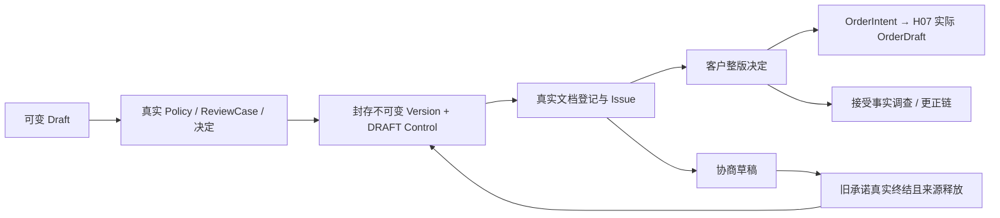

# ERP-QTN-01 · 正式报价与客户接受

整理状态：`required_materials_consolidated`。有效主文为 **v1.0.3 REVIEW R2**，SHA `45ac9a34dec6e8e49c7fceaa0020e314f2e753f631b93a03cf280eec1fae29da`。D-QTN01–14 已由 UA 正式接受。核心设计、类型、44入口、存储、218 AC，以及445个JSON与全部嵌套来源/证明/准备原文已完成必要语义阅读；重复原件按准确同值复用，不称60,201行逐字重读。6项必要输入及CURRENT引用的两个补核包闭合。12个生产门保持UNPROVEN，218 AC均NOT_RUN。[U3][C271]

## 1. 业务目的、操作者和 Owner 边界

销售报价人员把内部测算、真实客户/BP、商品或技术依据、价格、税与交付条款形成可评审草稿；经有权评审形成不可变报价版本，再登记真实对客文档、发布、记录准确客户决定，并把已接受来源按数量配额交给 Main Sales 创建订单草稿。每一步都有自己的事实和当前门；保存、批准、封存、发布、客户接受、订单草稿或 Broker ACK 都不能单独把 CRM 商机变为 Won。[S19][S33]

|操作者/Owner|本册职责|其余职责归属|
|---|---|---|
|报价编辑人|草稿商业行/条款、精确来源选择、复制、协商、准备订单意图|不能伪造 BP/EST/工程/客户证据原件|
|价格/技术评审人|依真实当前 Policy 的 requirement、能力、人数、分离规则作独立决定|旧 EstimateCheckFlg、MasterConfirmFlg、PA090、POWER EGG NoOp 不能替代批准|
|发行人员与 Document Owner|当前门下发布；真实 PDF 字节、不可变对象及 Manifest 与状态共同登记|文件名不是 PDF；文档上传不是客户接受|
|客户证据 Owner / 记录人员|实际客户有权代表、精确整版商业内容、动作/时点/文档证据|不能由前端手填 customerActor/hash 成为客户事实|
|专业接受事实更正 Owner|调查同一历史接受的证据关联，给有据评估|补证/事实未证不是客户撤销，不修改报价价格数量或原决定|
|Main Sales|H07 同事务真实 OrderDraft、来源、BP用途、数量配额；必要时准确历史释放|后续 Confirm/Release/订单变更、Demand、库存、信用、Won 归相应 Owner|
|CRM|消费 Main H06 报价引用及后续商业结果|不维护第二份正式报价，不把投影 ACK 当商业成功|

无 CRM 的直接报价合法：明确 manualOriginReason，BP 可无 Account Mapping；按真实政策可无 EST，SERVICE/PURCHASE_ONLY 不强造制造 BOM。该路径仍有客户交易、价格、税、文档等自身门，没有 CRM 来源就不伪造 SourceHandoff 或 H06。[S254][S589][S716]

## 2. 当前规范组合与接受边界

|材料|准确作用|范围限制|
|---|---|---|
|R2 主文，3,628,943 bytes / 60,201 行|7 SPEC，H06/H07，DP04/08/10/12/13；44公共入口|不把邻接 SC/PLM AC 冒充本册原直接编号；原 scenarios 与 plm_acceptance_ids 为空|
|UA-20261001-A-ERP-QTN-MD01|2026-10-01T02:37:00Z 授权代理接受 R2 与 D-QTN01–14|覆盖原待审标签；不授权本轮实施或运行|
|CURRENT.json|冻结 R2、原件 SHA、决定、12保留门和接受/评审身份|全字节读回与 O1 语义审阅明确不同；撤回曾称全文60k行实读的错误表述|
|找回独审 REVIEW_45ac9a34_R2_contract.md|SHA `d23739ed233e6a2a33d3eeb9b3da9cae0dae014007d651011fad12e06892a690`；54行|PASS 仅原 F1–F4 和直接传播，不是另一次3.6MB全部业务审|
|SR FINAL 与 INDEX|保存同一冻结对象及独审/静态检查来源|作者445 JSON/类型/断言通过不等本轮业务执行|
|EST 通用材料 R2 后继|对消费者 v2 decoder/完整披露/多成员守卫的当前要求|QTN 原 EstimateBasis/I03/I05 wire 保持；实施需同时满足该后继，不用旧空假设数组替材料范围确认|

独审 F1 关闭历史补证与当前承诺头竞争；F2 关闭新 H07 Fact/有效证据与旧订单历史隔离；F3 关闭更正准备和未证 cut 持久判别；F4 关闭 Fact 强 ETag、真实收到 header 与 HMAC/终态恢复。它只扩展未实施的 QTN 自有 Required H07 合同，已接受 BP/EST/OPP 原 wire 未改。[R15][R17][R25][R33][R39][C80][G568]

本轮直接读所列原件，不访问外部链接、不执行其中命令。已接受设计的后继实现与当前生产状态分别记录；历史 Stage100 仅文档成熟度。[C271][C287]

## 3. 实体、字段、版本轴与金额

|对象|身份/版本轴|不可合并的事实|
|---|---|---|
|QuoteRoot|`(T,QuoteId)`；QuoteKey 终生唯一；L、RootRevision、CurrentVersionNo、ActiveAcceptanceId、AllocationSetRevision|一个 Root 一条当前承诺链；显示枝番不是版本|
|QuoteDraft|DraftRevision、DraftDigest、OPEN/ARCHIVED|可编辑业务输入，允许0行和未知币种/客户/价格|
|ReviewCase/Decision/Head|CaseId/CaseRevision；ReviewId/Revision；唯一 `(T,CaseId,RequirementId,Reviewer)`|PENDING/APPROVED/REJECTED/WITHDRAWN 是评审，不是 QuoteControl|
|QuoteVersion|QuoteId/QuoteKey/versionNo/不透明 quoteVersion/digest；准确 supersedes|不可变正文/行/金额/来源/技术/有效期；OPP 中 DRAFT 指此已封版本，非可变草稿|
|QuoteControl|每版 ControlRevision + ETag；DRAFT/ISSUED/ACCEPTED/REJECTED/WITHDRAWN|状态可有准确后继，不修改该版金额/币种/来源|
|CustomerDecision|DecisionId/Revision/前一决定、原证据、DecisionDigest|原客户行为不可变；每版首次 ACCEPT 唯一|
|AcceptanceFactHead|原DecisionId/Digest、FactRevision、PROVEN/UNPROVEN、effectiveEvidence、latestCorrection、ETag|证据当前知识独立于客户行为和当前承诺|
|DocumentManifest|DocumentId、PublicQuoteIdentity、CommercialContentDigest、内容hash/长度/type/登记时间|不向对客文档暴露私有 VersionDigest、成本/memo|
|OrderIntent|服务器Id/Revision、显式clientIntentRef、准确Quote/接受/行意图|PREPARED不占数量；COMMITTED与真实订单/分配同commit|
|OrderAllocation|AllocationId/Revision、准确每原行ranges/金额、COMMITTED/OWNER_RELEASED|来源防重配额，不是库存/履约/成交账|
|Source/Observation/ReadCut|不可变来源原件与各自当前水位/代次分表|KNOWN不能覆盖冲突；多个时点的绿色结果不能拼成共同当前事实|
|H06 Transport|producer/contract/epoch/ordinal与前驱digest|传输顺序独立于版本与Control；ACK不推进商业状态|

本域 QtnRev/EstRev 为 1..9007199254740991 number，外域 ContractRev 为 1..9223372036854775807 十进制字符串；不透明 SourceRef.version/quoteVersion 不能按数字或字典序判断新旧。Key 原样保留，nullable 显式 null，extra/重复 JSON key 拒绝。Id 小写 UUID，Hash 64小写，UTC毫秒Z。来源 native wire/hash 不因本域规范化改写。[S53][S217][S780]

### 当前业务正文

`QuoteDraftBody` 完整成员为 title、baseCd、staffCd、offerKey、manualOriginReason、request、partner、productType、mode、currency、validUntilUtc、orderType、estimates[]、engineering、taxPolicy、terms、lines[]、internalMemo[3]、supersedesVersion、unknowns。`QuoteTerms` 含项目父/子/材料号、contactPerson、deliveryLocation、deliveryDeadlineText、orderDeliveryDate、freightText、paymentCondition、notes[15]、dimensionPrint、calcNotes[8]、printTotal。旧映射表出现 quoteNo/QuotePresentation 等概念名称时，以主文 §5/§7.1 的这些准确 DTO 成员优先，不生成多套字段。[S279][S577]

`QuoteLineInput` 包含稳定 lineId、displaySequence、两个 itemName、product、quantity、真实 UnitRef、unitPrice、priceSource、estimateTier、ownerPrice、priceReason、zeroPriceReason、printTotal、lineTerms。priceSource 为 ESTIMATE_PROPOSED/MANUAL_PROPOSED/OWNER_PRICE；EST 引用精确 VersionRef+slot，多个不同数量档不能当订单总量合并。产品相同但价格/条款不同仍保持独立 lineId。复制新 Root 分配新 LineId，同 Root 协商保原身份；displaySequence 1–200唯一。固定报价批费也须真实 BATCH_COUNT 单位和 quantity=1，不默认 JOB 或无单位“一口价”。[S279][S581]

本域人工文本服务端 NFC 后按 UTF-16 单元校验：title1–200；两 itemName 各≤200；联系人≤200；交付地/自由交期/运费/付款各≤500；notes15槽各≤1000、calcNotes8槽各≤1000、dimensionPrint≤500；memo3槽各≤2000、lineTerms≤1000、动作reason1–1000。外域 Key 不改大小写/NFC。新建只有结构性 printTotal=true，商业条款与15/8/3槽未知保持 null，不从样例填“已批准”文字。[S579][S585]

### 完整旧字段映射

这些表用于逐字段旧资料保真；当前准确结构按上段与原 §5 DTO，不把 Legacy 状态自动升格成新批准。原 QtnNoMain/QtnNoBranch、AcceptedContentSha256、Calc.FscManagementNo 和 Issue 文件名仍有独立 Legacy 槽。[S122][S202]

|旧成员|旧类型|新归属|类别|规则|
|---|---|---|---|---|
|QtnNo|string?|QuoteRoot.quoteNo|R|业务显示号，稳定不复用；不等Version|
|RefQtnNo|string?|QuoteDraft.parentQuoteRef|R/W|仅复制来源显示；规范后继另用supersedesVersion|
|BaseCd|string|QuoteDraft.baseCd|W|必须Q01候选且同L|
|StaffCd|string|QuoteDraft.staffRef|W|受权员工候选|
|CustomerCd|string|QuoteDraft.bpRef|SOURCE|代码仅显示；真实BpRef/Mapping|
|CustomerName|string?|QuoteDraft.customerDisplay|R|由BP受权读，客户端不成Owner|
|ProjectNoParent|string?|QuoteTerms.project.parent|W|NFC，可空|
|ProjectNoChild|string?|QuoteTerms.project.child|W|NFC，可空|
|ProjectNoMaterial|string?|QuoteTerms.project.material|W|NFC，可空|
|FscMgmtNo|string?|LegacyObservation.fscMgmtNo|LEGACY|无FSC Owner证明不作为正式许可|
|FscChecklistDate|DateTime?|LegacyObservation.fscChecklistDate|LEGACY|只读历史|
|ContactPerson|string?|QuoteTerms.contactPerson|W|客户联系人显示文字；不替CRM Contact身份|
|DeliveryLocation|string?|QuoteTerms.deliveryLocation|W|正式版本不可变|
|DeliveryDeadline|string?|QuoteTerms.deliveryDeadlineText|W|旧自由文本保留；结构化交期另字段|
|Freight|string?|QuoteTerms.freightText|W|不暗加net/tax|
|PaymentCondition|string?|QuoteTerms.paymentCondition|W|正式版本不可变|
|ValidityPeriod|string?|LegacyObservation.validityPeriodText|LEGACY|新有效期使用validUntilUtc|
|CurrencyCd|string?|QuoteDraft.currency|SOURCE|必须CurrencyPolicy，未知不猜|
|ValidUntilUtc|DateTimeOffset?|QuoteDraft.validUntilUtc|W/POLICY|正式Issue必须未来UTC|
|OrderType|string?|QuoteDraft.orderType|W|H07准确快照，Q01候选|
|OrderDeliveryDate|DateTime?|QuoteDraft.orderDeliveryDate|W|结构化日期|
|CustomerAcceptedAtUtc|DateTimeOffset?|CustomerDecision.acceptedAt|R|不由普通Draft写|
|CustomerAcceptanceReference|string?|CustomerDecision.evidence.reference|R|独立客户事实|
|CustomerAcceptedBy|string?|CustomerDecision.recordedBy|R|记录者，不冒客户账号|
|QtnNotes|string?[]|QuoteTerms.notes[15]|W|固定15槽|
|DimensionPrint|string?|QuotePresentation.dimensionPrint|W|只影响文档呈现|
|CalcNotes|string?[]|QuotePresentation.calcNotes[8]|W|固定8槽|
|QtnIssueDate|DateTime?|QuoteControl.issuedAt|R|仅正式Issue事务产生|
|CalcIssueDate|DateTime?|LegacyObservation.calcIssueDate|LEGACY|新EST文档引用不由此代表发布|
|TotalAmount|decimal?|QuoteVersion.net.amount|R|服务器按商业行重算；不接收客户端总额|
|PrintTotalFlg|bool|QuotePresentation.printTotal|W|只显示，不决定商业net|
|EstimateCheckFlg|int|LegacyObservation.estimateCheckFlg|LEGACY|不是ReviewDecision|
|EstimateCheckDate|DateTime?|LegacyObservation.estimateCheckDate|LEGACY|不冒批准时间|
|MasterConfirmFlg|int|LegacyObservation.masterConfirmFlg|LEGACY|不是QuoteControl/客户接受|
|MasterConfirmDate|DateTime?|LegacyObservation.masterConfirmDate|LEGACY|不冒版本创建/发布|
|Memo1|string?|QuoteInternalMemo.memo1|W/PRIVATE|不进客户正式文档|
|Memo2|string?|QuoteInternalMemo.memo2|W/PRIVATE|不进客户正式文档|
|Memo3|string?|QuoteInternalMemo.memo3|W/PRIVATE|不进客户正式文档|
|Calcs|List<QuotationCalcDto>|QuoteDraft.estimateRefs|SPLIT|迁移为精确EST VersionRef/Usage，不按QtnCalcNo latest|
|Details|List<QuotationDetailDto>|QuoteDraft.lines|STRUCT|商业行，server amount|
|RowVersion|byte[]?|DraftRevision/ETag|R|新写缺If-Match=428|
|CreateDate|DateTime?|QuoteRoot.createdAt|R|UTC|
|ModifyDate|DateTime?|QuoteRoot.updatedAt|R|UTC|

|旧成员|旧类型|新归属|类别|规则|
|---|---|---|---|---|
|QtnCalcNo|string|EstimateVersionRef|LEGACY→SOURCE|只作为旧键显示；新引用必须EstimateId/versionNo/digest|
|EstimateCheckFlg|int|LegacyEstimateLink.reviewFlag|LEGACY|不代表QTN内部评审|
|EstimateCheckDate|DateTime?|LegacyEstimateLink.reviewDate|LEGACY|只读|
|MasterConfirmFlg|int|LegacyEstimateLink.confirmFlag|LEGACY|不代表QuoteControl|
|MasterConfirmDate|DateTime?|LegacyEstimateLink.confirmDate|LEGACY|只读|
|QtnCalcDate|DateTime?|LegacyEstimateProjection.calcDate|R|历史显示|
|CustomerProductName1|string?|QuoteLine.itemName1|ADOPTABLE|采用需绑定准确EST/Product来源|
|CustomerProductName2|string?|QuoteLine.itemName2|ADOPTABLE|同上|
|EstimateQty|decimal?|QuoteLine.quantity|ADOPTABLE|只能从精确EST Version选定tier复制|
|ConfirmedUnitPrice|decimal?|QuoteLine.unitPrice|ADOPTABLE|旧手工值不是批准价；需QTN评审|
|Unit|string?|QuoteLine.unit|ADOPTABLE|需真实UOM ref|
|Amount|decimal?|QuoteLine.netAmount|R|服务器公式重算，不信旧0兜底|
|QtnDiv|string?|LegacyObservation.qtnDiv|LEGACY|10/20/A/B/C不自动映射|

|旧成员|旧类型|新归属|类别|规则|
|---|---|---|---|---|
|DetailNo|int|QuoteLine.lineNo|STRUCT|1..200，版本内稳定|
|ItemName1|string?|QuoteLine.itemName1|W|正式版本不可变|
|ItemName2|string?|QuoteLine.itemName2|W|正式版本不可变|
|Quantity|decimal?|QuoteLine.quantity|W|Dec+UOM，>0|
|UnitPrice|decimal?|QuoteLine.unitPrice|W/PRICE|正式价，不等EST建议价|
|Unit|string?|QuoteLine.unit|SOURCE|真实UOM|
|Amount|decimal?|QuoteLine.netAmount|R|server Round(quantity×unitPrice)|
|PrintTotalFlg|bool|QuoteLine.printTotal|W|只影响呈现|
|QtnCalcNo|string?|QuoteLine.estimateLineage|LEGACY→SOURCE|新用精确EST Version/Tier|

### 数量、税、价格与舍入

Draft 允许 quantity/unit/unitPrice=null，但已填值必须合法，零价即使草稿也需理由。正式版本1–200行，数量>0、价格≥0，零价另须真实 Policy 允许；单币种，真实 UnitRef dimension/quantityScale；价格位数来自 CurrencyPolicy.priceDigits≤6、金额 minorDigits≤4，HALF_EVEN。Dec 非负规范十进制，无指数或多余尾0；先精确相乘，再每行净额按 minorDigits 舍入，按已舍入 lineNet 算税并同位数舍入，gross=net+tax，头汇总全部商业行。[S217][S316]

TaxPolicy 仅真实 EXEMPT（rate='0'）或 ONE_RATE_EXCLUSIVE（0<rate≤100）；未知税不填0。正式净/税/含税金额需在 decimal(19,4) 可表达范围，≤999999999999999.9999，任何值/乘积超 decimal(24,6) 或该正式范围拒绝。无 FX。头和行 printTotal 只影响呈现，全部商业行都计净额；隐藏行小计不能隐藏应交付客户的行/价格/条件。H06 仍只输出四位净额，tax/gross 严格 null，不把本域税偷塞 NET。[S316][S247]

QuoteVersionDigest 只对完整 QuoteVersionContent；EST receipts 另存且同事务形成，避免 receipt→consumerDigest→VersionDigest 自指。CustomerDecisionDigest 不包含引用自身的 BpUseReceipt。对客 CommercialContentDigest 与私有 VersionDigest 分开，保准确报价、BP/L、币种/有效期、全部条款/行/技术条件和原数量坐标舍入规则。[S318][S633][S645]

## 4. 业务流程、状态转移与写集

|动作|前置与状态|实际事务写集|
|---|---|---|
|Q03 创建|当前Base/Staff、手工来源理由、合法字段|Root/Draft1/History/Audit/Command；无Version/Usage/H06|
|Q06→Q09 来源保存|同DraftRevision所有完整Context；每新/变源恰一SelectionUse且逐字段等候选|Draft/行/不可变Binding/准确SourceOfferClaim/ReverseIndex/History；旧Case失效、Observation+1UNKNOWN|
|Q31 评审提交|Q10真实完整Policy和plan|真实Case OPEN；预览不冒提交、不批准|
|Q11 评审决定|真Case ETag、准确Draft/Policy、当前能力/分离/互斥|Decision新修订/Head/CaseRevision/Audit/Command；不变Control|
|Q13 封存|当前Review quorum、源/价格/税/技术、Root前驱与Claim；全部准确EST假设|SealBusiness、EST Usage/Receipt、Version/Lines/来源、Control1 DRAFT、Root头、Case DECIDED；有CRM才H06|
|Q17 发布|Version DRAFT且当前头、未过期、全部当前门、真文档和BP SALES_NEW_SOURCE|IssueRecord/Manifest/BPUse/Control ISSUED/H06/Audit/Command同commit|
|Q20 ACCEPT|当前已ISSUED整版、未过期、无其他活跃接受、真实客户证据、BP SALES_CONFIRM|Decision/Fact1 PROVEN/当前接受指针/Control ACCEPTED/H06；无订单/Won|
|Q20 REJECT / REVOKE、Q21停止|真实对应客户动作或允许的发行方停止专用门|准确停止后继、影响/H06/审计；保旧决定/Usage/订单/配额|
|Q22 协商|当前已封版本，同Root准确前驱，无另一未完成工作稿|新Draft修订、supersedes、旧Case失效、UNKNOWN；旧Control不变|
|Q33 / Q35 意图|准确已接受版，显式clientIntentRef；取消仅PREPARED无真实订单|本地Intent/Revision；无数量占用、BPUse/Order|
|Q24 H07|准确当前接受Fact/证据、全量配额向量与Sales创建能力交集|真实Order/Lines/Source/OrderCommand/BPUse + QTN Intent/Allocation/Receipt整体提交|
|Q44 事实更正|专业Owner评估、Control+Fact双ETag、完整承诺矩阵/受影响集|Correction/Fact/RootRevision、允许的Control/指针/H06、Observation/订单影响；不新客户行为/交易Use|

[S761]

### 来源、评审与版本

Lookup Context 10分钟，保存 Actor/T/L/Root/DraftRevision、完整 criteria/page、OwnerRead/候选/水位/证明；hash不能恢复原筛选。Q09 body 的新来源逐字段等选中 payload，多个 Context 应同一次 DraftRevision 一次保存；不逐个保存使后面 Context 过期。来源不可见/伪造/跨域拒绝；合法待补身份可留草稿，SAVE_SOURCE 不要求制造READY或BP已REGISTERED。[S583]

有 Main 来源的 Claim 唯一 `(T,L,MainOwner,businessRootKey,offerKey)`；首次绑定原子拿槽，此后不能改 offerKey、换客户/L/业务根，后继必须 Main 确证同根 supersedes。Copy 是新Root/offerKey/LineIds，保父引用/调查内容、UNKNOWN，清所有评审/客户/Usage/文档/订单意图，源Claim同commit；Q13/Q17还独立再核Claim。Negotiation 才是同Root supersedes 链，不把 Copy 当替代承诺。[S589][S593]

Policy 每 requirement 最低1–5人、总1–20项，实际 capability 必须可解。NOT_DRAFT_EDITOR 排除该 Draft 谱系全部商业/技术编辑者（含创建/复制者）；incompatibleRequirements 对称；同人同槽仅一票。当前任何 REJECTED 阻 Seal，须该人有据撤回，不能删别人拒绝。Draft/source/Policy变化、批准者失权令旧批准不适用，但保历史；Q13/Q17/ACCEPT/H07均再核当前 Review heads/资格，不拿当年批准作永久许可。[S603]

Q13稳定 SealBusinessSubject 包含准确 Draft/Case/Policy/reviewHeads/supersedes/EST版本/假设集合；不含Key、PlanId/TTL、reason、Root预期、VersionNo或createdAt。先恢复原Command，再在来源锁之前拿稳定业务键范围锁找原封存事实；换新CommandKey但同准确已提交业务返回自己的 NO_CHANGE 回执、原Version/原Control历史，零新Usage/H06。Plan过期不阻受权历史恢复，仅阻新封存；缺完整原subject或碰撞不静默成功。新业务才核当前CAS/TTL/门。[S615][S619][S621]

### Issue、客户决定和有效期

Q41真实模板目录→Q16以完整准确Version/模板/locale/renderSpec保存实际 PDF 暂存字节、完整读回hash/长度。QUOTATION恰一且必需；SUBMIT_ESTIMATE仅真实EST及有权外发允许字段。模板须含全部商业行、数量、价、税、条款、有效期、工程条件和分批舍入规则，不能靠模板名宣称完整。Q17在事务中保护不可变对象与DB引用，Manifest、BPUse和ISSUED一起提交；无法证明对象不被清理/替换则失败，不先ISSUED再异步补文件。登记后正式对象不随 staging TTL 删除。[S627][S631]

有效区间 `[issuedAt,validUntilUtc)`；端点即过期。新 Issue/ACCEPT/H07均要求未过期，停止/历史/协商可继续；到期不后台制造 WITHDRAWN，不延长原版期限。客户端显式UTC确认，Options时区未知可显示UTC，不从旧自由文字猜当地午夜。[S437][S639]

客户仅能 WHOLE_VERSION 接受准确完整对客商业承诺；并非接受内部成本/memo/私有证据。CustomerEvidence绑定已登记documentId/hash、CommercialContentDigest、准确Quote、BP及真实有权customerActor、动作/发生与记录时间；收到附件/邮件字符串不够。部分接受、附新条件或改价必须协商后继。初次ACCEPT有唯一事实；异证据不能覆盖Decision，而走专业Fact纠错。[S493][S633][S643]

REJECT从ISSUED；REVOKE从ACCEPTED，或事实未证撤下但仍有原接受的WITHDRAWN，后一分支必须后来真实客户撤销证据。停止专用门不要求旧BP/EST/Quote恢复前向可用。Q21发行方只能撤DRAFT/ISSUED，不能一键抹ACCEPTED。历史版本停止不清别版ActiveAcceptance、不回退H06；先H07提交保订单并记录来源停止影响，先停止提交则新H07拒绝。[S647][S649]

### 单承诺头与接受事实更正矩阵

Q42专业I18原件读→Q43当前完整承诺/订单影响预览→Q44真实同Root/Control/Fact/Allocation共同门。只纠正同一历史整版接受的证据关联，不改变价格数量客户或创造新客户行为。EVIDENCE_REPLACED证明同一历史接受并换有效佐证；ACCEPTANCE_UNPROVEN表明原关联不能证明接受。原Decision不改，`customerRevocationAsserted=false`；FactRevision恰+1，Correction连准确前驱，RootRevision每次都+1，即使历史补证。[S537][S651]

|目标/当前事实|commercialEffect|准确后果|
|---|---|---|
|当前头、无后继/别的活跃接受/独立停止/祖先争议，仅此纠错链撤下|RESTORED_CURRENT|有据补证可恢复本Decision/本版ACCEPTED，Control+1/H06|
|当前头仍ACCEPTED且指针为本Decision|CURRENT_EVIDENCE_ONLY|Fact/Correction/Observation/影响变化；Control/H06不动|
|目标非当前或已有任一已封后继|HISTORICAL_ONLY|仅修历史Fact/影响，不回退Root、指针、Control或旧H06|
|真实客户撤销/拒绝或合法独立停止存在|HISTORICAL_ONLY|历史Fact可PROVEN，商业停止优先，不复活|
|另一ActiveAcceptance或未解祖先争议|HISTORICAL_ONLY + 当前争议|Q28/I06 UNKNOWN，拒新H07与替代Seal|
|当前头新判ACCEPTANCE_UNPROVEN|CURRENT_EFFECT_WITHDRAWN|只清等于本Decision的指针、撤本版可证明效力并发本版H06；不伪客户撤销|

`canApply=true` 可只表示可记录历史，不能解释为 `canRestoreCurrent=true`。只建协商草稿不是已封后继，不阻有据恢复；已封任何后继都阻恢复旧版。Fact UNPROVEN不是客户同意终结，旧头仅因它WITHDRAWN仍不允许替代Seal；恢复先拿Root锁则旧ACCEPTED阻Seal，Seal先拿锁则拒未证终结，两种顺序不产生两个当前承诺。历史缺陷已留v2只读取为调查事实，不能标成R2合法创建。[S665]

更正与订单影响同commit，但原Order/Receipt/Allocation仍保原A/Fact1字节和COMMITTED数量。Sales收到 FactImpact只标来源UNKNOWN/BLOCKED/OWNER_REVALIDATION_REQUIRED，不能取消Order、释放配额或改Won；通知延迟也不放行新效果，Sales新写须同步保护QTN当前Fact。Fact影响Outbox按OriginalDecisionId/FactRevision唯一，因为仅补证可不推进Control；H06仍只在当前头实际Control后继时生成。[S659][S661][S919]

## 5. API、H06/H07 与跨 Owner 契约

公共前缀 `/api/main/v1/quotations`，所有写 Idempotency-Key=UUID。Draft ETag `"QTN-DRAFT:{quoteId}:{draftRevision}"`，Control `"QTN-CONTROL:{quoteId}:{versionNo}:{controlRevision}"`；跨版另 body.expectedRootRevision 来自真实读，不能猜hash。Q11用Review ETag；Q24/Q35另X-Intent-If-Match；Q44另Fact ETag。完整44入口如下，响应指Envelope.data。[S322][S435]

|ID|Method/Path|封闭请求→data响应|当前能力/具体条件|
|---|---|---|---|
|Q01|GET /options?legalEntityKey|OptionsResult|qtn.read；L/Base/Staff逐项当前可见|
|Q02|POST /query|QuoteQuery→QuoteQueryResult|qtn.read；page≥1/pageSize1–100，筛选不枚举无权数据|
|Q03|POST /|CreateQuoteInput→CommandResponse|qtn.create+Base管理；先建无CRM源合法草稿|
|Q04|GET /{id}|QuoteSummary|qtn.read安全摘要|
|Q05|GET /{id}/edit|QuoteDraftRead|qtn.edit及正文全部read；不足只Q04|
|Q06|POST /{id}/lookups|LookupInput→LookupResult|qtn.source.read及源当前字段权；实际Owner前置|
|Q07|POST /copies/preview|CopyPreviewInput→CopyPreview|源完整read和qtn.copy/create及目标Base管理|
|Q08|POST /copies|CopyInput→CommandResponse|重新核Q07复合权；原子新Root/源Claim|
|Q09|PUT /{id}/draft|SaveQuoteInput→CommandResponse|qtn.edit和全部所改字段read/write；真实来源选择|
|Q10|POST /{id}/review-preview|ReviewPreviewInput→ReviewPreview|qtn.review.submit+完整review资料read|
|Q11|POST /{id}/reviews|ReviewDecisionInput→CommandResponse|qtn.review.decide及该Requirement实际capability；body版本+ReviewCase If-Match|
|Q12|POST /{id}/versions/preview|SealPreviewInput→SealPreview|qtn.version.seal及完整正文读取|
|Q13|POST /{id}/versions|SealVersionInput→CommandResponse|准确Review quorum、同UoW EST采用、源/税/价格当前门|
|Q14|POST /{id}/versions/query|VersionQueryInput→VersionQueryResult|qtn.read，limit1–100安全版本列表|
|Q15|GET /{id}/versions/{versionNo}|QuoteVersionRead|完整正文/成本/来源/客户证据读；不足Q14|
|Q16|POST /{id}/versions/{versionNo}/issue-preview|IssuePreviewInput→IssuePreview|qtn.issue+完整对客文档read；真实暂存文档|
|Q17|POST /{id}/versions/{versionNo}/issues|IssueInput→CommandResponse|所有最后当前门及BP SALES_NEW_SOURCE|
|Q18|GET /{id}/documents/{documentId}|DocumentRead|qtn.document.read+当前对象/文档披露；下载另短期同Actortoken|
|Q19|POST /{id}/versions/{versionNo}/customer-decision-preview|CustomerDecisionPreviewInput→CustomerDecisionPreview|qtn.customer.decide+evidence.read；实际Q32回执来源|
|Q20|POST /{id}/versions/{versionNo}/customer-decisions|CustomerDecisionInput→CommandResponse|当前决定权及证据Owner最终参加；仅ACCEPT新交易门|
|Q21|POST /{id}/versions/{versionNo}/control|ControlInput→CommandResponse|qtn.control；停止专用门，不要求失效源先恢复可新用|
|Q22|POST /{id}/versions/{versionNo}/negotiations|NegotiationInput→CommandResponse|qtn.negotiate/edit+当前根版本；同根新草稿修订|
|Q23|POST /{id}/versions/{versionNo}/order-source-preview|OrderSourcePreviewInput→OrderSourcePreview|qtn.order-source.prepare与Sales创建资格预览|
|Q24|POST /{id}/versions/{versionNo}/order-source-requests|OrderSourceInput→CommandResponse|qtn.order-source.prepare+真实Sales创建能力；quote/control及Intent If-Match|
|Q25|GET /commands/{commandKey}|CommandRead|原Actor当前qtn.command.read与全部回执披露；审计他人需audit权限|
|Q26|POST /{id}/source-refresh|RefreshInput→CommandResponse|qtn.source.refresh；只建原Owner读job，不改商业事实|
|Q27|GET /{id}/source-refresh/{jobId}|RefreshRead|当前源read和jobActor或audit；保查读原输入|
|Q28|POST /{id}/readiness/query|QuoteCurrentQuery→QuoteCurrentRead|当前完整read；每次实际源/当前头核查，非执行许可|
|Q29|POST /{id}/history/query|HistoryQuery→HistoryRead|qtn.audit.read；每项当前字段剪裁，摘要可null|
|Q30|POST /legacy/query|LegacyQuery→LegacyResult|qtn.legacy.read及旧源作用域证据|
|Q31|POST /{id}/review-submissions|ReviewSubmitInput→CommandResponse|qtn.review.submit；创建准确ReviewCase，绝不批准|
|Q32|POST /{id}/customer-evidence/query|EvidenceQuery→EvidenceRead|qtn.customer.evidence.read+Owner当前披露；无上传即接受捷径|
|Q33|POST /{id}/versions/{versionNo}/order-intents|OrderIntentInput→CommandResponse|qtn.order-source.prepare；分配真实OrderIntentId及可见etag；只准备|
|Q34|GET /{id}/order-intents/{intentId}|OrderIntentRead|当前对象read及order-source.read|
|Q35|POST /{id}/order-intents/{intentId}/cancel|OrderIntentCancelInput→CommandResponse|仅PREPARED意图且无订单事实；qtn.order-source.prepare|
|Q36|POST /legacy/adoption-preview|LegacyAdoptionInput→LegacyAdoptionPlan|qtn.legacy.adopt+create及旧/新Base管理|
|Q37|POST /legacy/adoptions|LegacyAdoptionApply→CommandResponse|原件RowVersion、完整源权限及一次LegacyLink共同事务|
|Q38|POST /{id}/versions/compare|CompareInput→CompareRead|两版本完整read；不泄露一边隐藏值|
|Q39|POST /{id}/archive|ArchiveInput→CommandResponse|qtn.archive；无活跃已发/接受版本或未结原动作方可ARCHIVE|
|Q40|GET /{id}/review-cases/{caseId}|ReviewCase|当前review.read完整商业资料；etag供Q11|
|Q41|POST /{id}/document-templates/query|TemplateQuery→TemplateRead|当前文档read/issue及对客字段范围，真实模板目录|
|Q42|POST /{id}/acceptance-fact-corrections/query|AcceptanceCorrectionQuery→AcceptanceCorrectionRead|qtn.acceptance-fact.correct及完整历史/证据读；真实I18评估原件|
|Q43|POST /{id}/acceptance-fact-corrections/preview|AcceptanceCorrectionPreviewInput→AcceptanceCorrectionPreview|同Q42，准确当前Fact/Control/受影响Order集合|
|Q44|POST /{id}/acceptance-fact-corrections|AcceptanceCorrectionInput→CommandResponse|同Q42及I18事实更正参与；无伪客户撤销/新交易用途|

|Owner接口|准确用途与最终保护|
|---|---|
|I01 QuoteSourceOwner.Query|Main Intake/BP/EST/Product/UOM/Currency/Price/Tax/ENG的真实候选、完整payload/水位/Proof，CandidateValue恰一分支非null|
|I02 CurrentQuoteSourceParticipant|同意图逐源完整依赖、Policy、全部批准者资格，真实锁持到commit；漏/多/重复/另scope/held=false都拒绝|
|I03 EST Use / I14 EST Correction|Q13精确QUOTE_BASIS消费者；真实替换才I05，不为保留历史的协商擅关旧Usage|
|I04 BP Use|Issue SALES_NEW_SOURCE；客户ACCEPT SALES_CONFIRM；Sales H07另独立SALES_NEW_SOURCE；不同consumer/useKey|
|I05 ReviewPolicy / I07 EngineeringQuoteOwner|真实完整审批需求与本次技术用途决定，不能NoOp或自行默认阈值|
|I06 QuoteReadinessOwner.QueryExact|给EST的真实已采用Version当前证明，不执行Seal/Issue|
|I08 CustomerEvidenceOwner|真实整版/文档/客户授权/动作证据查询与同txn最终核|
|I09 DocumentStager/Registry；I16 TemplateOwner|真实bytes/模板/白名单；最终登记文档与Issue共同保护|
|I10 SalesOrderSourceParticipant|真实同DB OrderDraft/Lines/Source/BPUse，独立验证Fact/证据和当前资格|
|I11 OrderSourceCorrectionParticipant|真实从未商业确认、无未知/需求/库存效果的取消与原全allocation释放同txn|
|I12 source-notices|受信完整原件/Trust保存与反向索引全影响失效，不自动业务动作|
|I13 original-results/query|按ordinal准确完整H06历史与Trust，缺口重投原体，不造中间结果|
|I15 LegacyQuotationOwner|完整旧DTO/extra/RV/scope读和全部writer同txn fence|
|I17 QuoteConsistentReadCoordinator|同实际事务全部共享门的共同时间点cut，非多HTTP或本地CAS拼绿|
|I18 AcceptanceFactOwner|专业历史事实评估与更正保护，customerRevocationAsserted=false|
|I19 SalesQuoteSourceImpact / QtnAcceptanceFact.QueryCurrent|影响Inbox与当前Fact完整链；后续新效果同步查，不等消息到达|

[S473][S535][S537][S539][S879]

### H07来源、配额和舍入尾差

Q33显式clientIntentRef唯一 `(T,QuoteId,clientIntentRef)`，同标签异版/异行集冲突，真实OrderIntentId由服务器分配。PREPARED不占数量。Q23对每条原报价行数量坐标 `[0,VersionQuantity)` 取COMMITTED分配并集的补集，从最小空闲起点确定性取1–200段；段按from升序、不交、精度等真实UOM、长度和=requestedQuantity。不同lineId不合并，即使同产品。plan冻结完整range与所有分配revision/hash，Q24不得静默另取剩余范围。[S690][S692]

当前 `QuoteOrderSource` 完整包含 acceptanceFact、quote、acceptanceId/digest、orderIntentId、可空SourceHandoff、BpRef/Mapping、CurrencyPolicy、lines、engineeringBasisDigest、CustomerEvidence、TaxPolicy、sourceDigest。Fact quote/id/digest分别对应原Decision，必须PROVEN且effectiveEvidence非空，source.customerEvidence逐字段等它；Fact>1有准确Correction完整链。SourceDigest覆盖全source除自身；Receipt另含FactSnapshotDigest。Q24与I10同txn再核当前Root/ActiveAcceptance/无祖先争议、完整Fact及Owner依据；仅重算digest不能让旧A变成当前B。旧订单恢复仍返旧A/Fact1原件，新Key/新Intent才用B/Fact3。[S362][S694][S696][S917]

对原行定义 `F(x)=RoundMinor(x×unitPrice)`，`G(x)=RoundMinor(F(x)×taxRate/100)`（真实EXEMPT为0）。每段[a,b)净额=F(b)−F(a)，税=G(b)−G(a)，多段相加；roundingAdjustment=分配net−RoundMinor(requestedQuantity×unitPrice)，保有符号尾差，单位价不变。这样任意不重叠满覆盖都等原行金额，中段释放再用也不洗历史尾差。例如0.335×3、minor2、三次1应0.34+0.33+0.33=1.00，不能每单0.34造成1.02。Sales必须存原range/尾差，不平均改单价；真实BATCH_COUNT批费quantity1只可整次，不拆0.5。[S698][S60096]

Q24当前QTN权限与Sales创建/组织/字段权取交集；UQ `(T,SourceOwner=QTN,OrderIntentId)` 防第二订单，命中需完整SourceDigest同义。真实OrderDRAFT、Lines、source、OrderCommand、BP SALES_NEW_SOURCE、QTN Receipt/Allocation/Intent一体commit；无 Confirm/Release/Demand/库存/Won。I11只在Sales同事务实际取消且证明**从未**商业Confirm、无未知效果/需求库存时，整条原allocation一次OWNER_RELEASED；后续曾Confirm再取消不适用这个有界释放。QTN不能凭“查不到订单”释放。[S700][S702][S704][S708]

### H06与当前查询

H06仅有真实CRM源时发OPP-QUOTE/1，流键 `(T,MainQuoteAuthority,L,QuoteKey)`；producer/contract/epoch来自受理冻结路由，ordinal正Int64字符串，后继恰+1且绑定前一BusinessDigest，耗尽拒绝而不换epoch逃避。BusinessDigest排除eventId及ownerEvidence.proofRef，保其余业务时点/状态/来源/前驱；BodyHash是实际UTF8全消息。Outbox重投原event/body/ordinal；30秒租约、1/5/30/120/600秒退避、20次DEAD为技术参数，非商业许可。CRM投影回执和Broker ACK均不等客户接受/Won。[S867][S869][S871]

I06先证明真实已存在QuoteVersion及EstimateUse consumer精确匹配，不接受未来QuoteId或仅Draft。每次ReadSlot+1/UNKNOWN，I17在所有源/IAM/审批/BP/EST/技术/税/价格/文档/QTNRoot/Review/Fact共同共享保护下重读，在最后门取得之后、释放前签cut；observedAt=capturedAt。实际ESTControl不能回显expected假匹配。CAS只排迟到，不能代替共同cut；任一参与者/闭包/部署跨库未证则UNKNOWN、proof/observedAt=null。[S734][S736][S738]

完整当前目标/EST关系相符且无撤销/过期/冲突、ACCEPTED的Fact为PROVEN、当前Issue条件成立才可能READY。缺正式文档DRAFT返回DOCUMENT_NOT_REGISTERED/NOT_READY；有后继返回真实currentQuote与TARGET_VERSION_CHANGED而不偷换请求目标；不可见不泄别版字段。READY也只证明明确asOf，不是未来Issue/制造许可。[S740][S742]

### EST v2 后继消费要求

当前 [EST设计](D:/CP6/docs/CP6_开发设计文档_20261010/modules/ERP-EST-01.md) 的 R2 要求真实 decoder 读取 EST-GENERAL/2 完整原件、材料范围和 DisclosureDigest，真实消费决定准确覆盖 Version+Disclosure；保原EstimateBasis/Tier/I03/I05 wire，不新增材料数组。完整多sourceMembers保护不可压成PRIMARY；SourceSetDigest2存为不透明值传I06，不按v1重算。无decoder零QuoteVersion/Usage；无SUBMIT_ESTIMATE v2 renderer只阻该类文档，不影响已满足条件的普通Quotation。材料清单不是OrderMaterial/BOM写入口。[G568]

## 6. 事务、并发、幂等和恢复

当前规范已给出组合锁规划，不能仅看各模块局部序列：事务前定位完整依赖闭包；IAM/全部被引用审批人策略→QTN Command→Q13 SealBusiness范围→按已采用Owner锁注册表的非QTN来源Scopes（强制 BP来源先于EST）→BP Mapping/ReverseClaim/Root→已持所有source后的EST Scope/Root/Control/Usage→QtnScope/Root/Claim/Draft/Review/Version/Control/Acceptance/Fact/Intent/Allocation/观察→Sales真实业务槽/新根→Audit/Outbox。各层内准确排序，缺依赖/有环即LOCK_PLAN_UNPROVEN。[S752]

BP/EST Enlist只能复核已经规划持有的门，不在持QtnRoot后新拿更早源门；不改其内部锁序。源writer不持源锁回调QTN；通知投影另txn只取QtnScope。所有外域网络定位读取在持锁外，最终须实际同DB/同连接事务持到commit；不拿TTL、HTTP串联、队列或Saga称同UoW。只读I17同样需要真实共同门，不能用Generation/CAS修补从未同时成立的green。[S759]

Command唯一 `(T,Actor,CommandKey)`。安全历史读/披露→完整原HMAC指纹→终态同义返回原receipt，异义409；新写门在锁内重查确定无原终态之后才执行。快读未见、原调用随后commit、写权撤销仍可按当前读权恢复。REJECTED只在安全独立事务记本地确定领域拒绝，不在可能半跟踪的失败Context保存假确定失败。技术未知按Q25原Key查询，IN_FLIGHT/NOT_OBSERVED均`noEffectProven=false`，不能换Key重复业务。[S748][S750][S877]

Q44需Control If-Match和X-Acceptance-Fact-If-Match=`"QTN-ACCEPTANCE-FACT:{lowerUUID}:{positiveRevNoLeadingZero}"`；correctionKey=Idempotency-Key。缺428；弱W/、*、列表、多同名值、控制/转义字符400；仅header名忽略大小写、值去首尾HTTP OWS。合法但异header先按原终态HMAC判COMMAND_KEY_REUSED；新意图才核header对象/修订与route/plan/body相等，否则PRECONDITION_BODY_MISMATCH，再查当前值。[S541][S552]

FullRequest明确 operation/method/route/idempotencyKey/bodyCanonicalJson 与三个nullable预条件headers；HMAC主体 `{T,Actor,request}`、服务器密钥版本持久。原实际收到header名和所有values加密审计，不从body伪造。FullRequest.headers需与OriginalIfMatch/Intent/Fact列逐字段相等；无法解原件或key则REPLAY_EVIDENCE_UNAVAILABLE，不回成功。OWS规范同义可重放，但原审计保原字节。[S554][S817][S915]

所有Plan保存完整ExpectedVector：Root/Draft/Version/Control、Observation、每源水位/代次/Proof、ReviewCase与全部ReviewHeads、Policy/IAM、Fact、Intent、AllocationSetRevision及含OWNER_RELEASED历史的全部AllocationStamp。分配后释放余额恢复、批准撤回再批准、同码源内容恢复，都推进相应revision/generation而使旧Plan失效；不只比金额、剩余量或RootRevision。[S900][S902][S904]

## 7. 权限、隐私和证据存储

Tenant/Actor来自可信会话，body不自报；Base/Staff/L来自真实Options并核组织。qtn.read只安全头，price.read控制价/净税总额/利润，costbasis.read控制EST成本假设，source.read控制来源，customer.evidence.read控制证据，audit.read控制历史；create/edit/copy/review.submit/review.decide/version.seal/issue/customer.decide/negotiate/order-source.prepare/control/command.read/source.refresh分别授权。部分权走Summary/VersionSummary的nullable金额+redactedFields，完整Draft/Version/Receipt不足权限403，不能造可回写masked null。[S109][S314]

公开文档使用 PublicQuoteIdentity和商业摘要，不能把内部VersionDigest、Memo、完整成本/私有证据印给客户。下载token绑定当前Actor/T/DocumentId/immutablehash并再次验权，不能由前端构造storage locator；已登记文件暂不可用显示UNAVAILABLE、重试原ID，不能把Quote退DRAFT或同ID换另一文件。[S633][S635]

Qtn表本域FK包含Tenant，L在Root/Version与引用核；跨域UUID不当同Tenant证明。完整JSON原件同步hash和密钥版本，nullable必须明示，不留只有digest无法恢复的记录；证据损坏保持CORRUPT/UNPROVEN，不能用当前GET替过去payload。ReadCut PROVEN须Vector/Proof/CapturedAt/Coordinator非空且Held=true；UNPROVEN三证明字段null、Held=false，Coordinator真未知可null。cut失败不创建可执行Plan；cut成功而事实证据仍未知可安全返回knowledge UNPROVEN，但Q43不可执行。[S782][S830][S835][S911][S913]

## 8. 页面和交互设计

|页面|开发时必须呈现的操作与区别|
|---|---|
|P01列表/P02编辑|当前安全筛选和完整编辑权限区分；未知字段可留，真实条款只用户输入后存在；0价明确理由|
|P03来源/P04工程|准确EST版本/tier、全部假设/当前影响；产品/工程双摘要和用途分层，Frozen不画PASS|
|P05评审|真实Policy需求/能力/人数/分离，先提交真实Case再决定；不能无Case批准或默认管理员|
|P06版本/比较|旧新不可变内容、supersedes、Control与当前来源分开；不读latest EST重算旧金额|
|P07发布|真模板/locale/暂存PDF/hash、当前Guard与未过期；所有必需商业内容渲染成功才可发布|
|P08客户决定/纠错|实际Q32证据；Q42/43并列当前头、Fact、独立停止、祖先争议、canApply与canRestore；显示Q44实际effect|
|P09协商|允许先保存后继草稿，封存前显示旧承诺必须真实终结及订单来源释放条件|
|P10订单来源|实际Intent/ETag、精确ranges/尾差、当前FactRevision/Correction/有效证据；旧订单原A单独历史|
|P11当前知识/恢复|asOf、UNKNOWN/CONFLICT/lastProven，原Key查询；迟到响应核pageGeneration，不自动重做|
|P12旧资料|原DTO/extra/RV/旧接受hash/文件名只历史；采用新调查稿不能改成新批准/PDF/客户接受|

页面mount不自动写、发布、接受或建单；按钮仅提示，最终事务重新授权。Q23之后更正Fact或换证必须重新预览，不能悄改旧plan。草稿有未保存实质编辑时协商要求明确覆盖理由，已有同supersedes工作稿拒DRAFT_ALREADY_IN_PROGRESS。[S90][S213][S597]

## 9. 实施顺序和既有代码差异

归档明确旧Quotation CRUD/Copy/Confirm/CancelConfirm/Issue和独立customer-acceptance实际存在；本设计是收敛增强，不能写成系统原无能力。旧Issue只更新时间/回文件名未证明PDF；旧Confirm只核传入EST QtnDiv=20，未证集合等报价全部使用；旧动态QtnCalcNo join会读当前EST，旧Flags与UI阈值也不等当前状态。旧RowVersion可缺、Factory同Opportunity一单与当前多Intent有冲突，旧Order创建可能默认Confirmed。这里只引用主文固定输入观察，没有本轮重审今日源码；实施前需在实际代码SHA/文件/行确认。[S39][S202][S704]

以下是据规范依赖整理的开发顺序，不新增业务规则或实施授权：

1. 确定唯一writer/真实IAM与闭合wire；建立原件/版本/Command/当前观察分离及完整恢复存储，字段映射以§5/§7.1准确DTO为准。
2. 建立Owner锁注册表与完整闭包，先证明BP→EST→QTN→Sales组合、I17共享cut和历史终态优先，再开放依赖正式动作。
3. 实现草稿/实际候选/Claim/lineage、金额税与Review真实Policy/quorum/职责分离。
4. SealBusiness跨Key唯一封存及EST精确I03；接入当前EST R2完整decoder/披露。
5. 真PDF模板/存储/登记/BP用途与Issue，客户整版证据/停止以及R2 Fact纠错完整矩阵。
6. H07准确Fact+effectiveEvidence+数量坐标金额，同Sales真订单事务，最后补I11取消前释放/原Key恢复和所有通知失效。
7. 真实旧Owner一致性读、8字节RV、全旧writer fence与唯一LegacyLink证明后才允许调查采用；分别执行所需AC。

Legacy读取保43/13/9字段、固定数组、原UTF8 Base64/SHA、同读extra、8字节RowVersion；不能从QtnNo猜枝番、从旧数值伪补合法0。Q36调查稿保已知文本/数量/候选价格，BP/Currency/UOM/Product/EST/Engineering/Tax均等待真实新选，不拿旧flag9/hash/文件名升级事实。Q37所有旧writer fence与新Root/Link同txn；未证只读，不伪迁移。[S859][S861][S863]

## 10. 验收场景和未运行状态

全部218 AC及12 Gate准确原文在 [当前接受记录][C271]。独审445JSON解析、39ReceiptHash、97vectorDigest、9SourceDigest、12Correction摘要、44准备digest、3HMAC复算属于历史文书检查，次数含重复对象，不当唯一业务成功数量。本轮未做HTTP/DB/并发/渲染/构建/测试/CI。[R45]

|关键验收组|必须出现的结果|原AC|
|---|---|---|
|未知草稿/字段保真|无BP币种可建调查；43/13/9旧字段不变批准；商业条款不从DEMO默认填|001–020、191–195|
|Review/金额|同人一票、分离/互斥；撤权阻新封存；printTotal=false仍计净；税未知不0|021–046、125–128|
|Seal/文档|EST失败整txn回滚；同业务新Key不重复；PDF字节/模板缺项不Issue；私有摘要不公开|047–070、134–140、182–186|
|客户与停止|整版证据、部分接受走后继；来源失效仍可真实停止；既有订单保留|071–084、136–137、149–151|
|H07金额/配额|三次1的0.335尾差合1.00；并发同range后一失败；曾Confirm不释放|085–098、141–148|
|共同cut|Owner交错绿无共同时点则UNKNOWN；通知未到仍同步发现撤销；cut后变化仅保asOf|157–173|
|Fact更正|不伪REVOKE；订单A不改；恢复无新Use；旧Fact新来源拒绝；真停止优先|174–181、198–208|
|向量/恢复|余额/批准值恢复原样仍识别ABA；快读miss锁内终态优先；缺key/原体不伪成功|162、187–190、212–218|
|持久判别|CORRECTION_READ/ CORRECTION准确落Plan；未证cut允许真未知Coordinator=null但不可成功plan|209–211|
|事件身份|Fact3/Fact4同Control仍可各自Outbox；H06只真实Control链，不把更正当客户事件|217及R2传播|

[S59949][S60124][S60153]

### 10.1 连续样例的开发语义与验收路径

以下覆盖全部445块的业务族；原件中的成功/拒绝都是静态合同样例，不能变成本轮执行结果。各支线从明确版本头分叉，不把重复EventId或不同终态串成一次真实运行。

|样例族与原行入口|应实现的连续行为和精确判别|
|---|---|
|J001–040，929–4493|空调查稿未知值不补默认；真实Intake/BP/EST/Product/工程/UOM/Currency/Tax逐项查询，BP等外域修订允许超JS安全整数，仍用字符串。每个候选携真实共同readCut但不成为未来执行许可。保存两条同产品lineId，100EA×28.2加10EA×30，第二行printTotal=false仍合净3120。|
|J041–060，4498–7315|Review策略要求非编辑者批准；提交Case不等canSeal，准确当前决策才通过。Seal用完整依赖向量/审批人资格与同事务EST QUOTE_BASIS，生成不可变v1及DRAFT Control。H06只投影净额，tax/gross仍null。|
|J061–090，7320–12391|模板只允许客户可见字段；894字节PDF先staging，真实Issue登记Manifest及BP SALES_NEW_SOURCE后Control=ISSUED。客户证据绑定该文档、商业摘要、有权客户及WHOLE_VERSION；另BP SALES_CONFIRM后ACCEPTED和Fact1 PROVEN，仍不等订单确认或Won。|
|J091–151，12396–17391|第一意图按原行分配50+10，真实OrderDraft/Line/Source/QTNAllocation/BPUse同commit；禁止Confirm/Demand/WO/PR/PO/库存/Won。第二意图请求60超剩余，另明确50才取[50,100)。未知恢复按原Key返回原receipt；NOT_READY/UNKNOWN与历史接受并存。0.335×3的逐坐标分配为0.34/0.33/0.33，释放中段后重用仍取0.33。|
|J152–206，17396–25857|真实客户撤回使Control WITHDRAWN并发SourceStopped，不取消已有订单。只有Sales证明从未商业确认、无未知效果/需求/库存并同txn真实取消，才能整条原allocation释放。拒绝支线由另一个ISSUED基点开始，协商新稿改价29形成3200，重新Review/Seal v2，旧v1原件不变。|
|J207–249，25862–31277|Copy创建新Root/offer/LineId但无复制审批/接受/Usage/订单。Legacy完整原DTO只有调查稿资格，flags9不当批准；全部旧writer需同txn fence。通知迟到仍同步查当前Owner发现撤销；两个Owner各自在不同时间绿，无法证明共同绿，必须UNKNOWN。新Command同封存业务返回原版，改reason重用同Key拒绝；分配和评审ABA即使值恢复也使旧Plan失效。|
|J250–297，31282–40001|原接受证据错配只形成事实UNPROVEN，原客户Decision保留，不能伪造客户撤回/新BPUse。有订单时发准确Fact影响，Sales BLOCKED但不取消/释放。补证为同历史接受的有效证据后可Fact3 PROVEN；只有当前承诺无独立停止才恢复ACCEPTED。通知只要求Owner重新核验，不能自动解除阻断。|
|J298–377，40006–46831|无CRM直接SERVICE仍逐项取得BP/Product/UOM/Currency/Price/Tax/工程适用性原件；2HOUR×5000=10000，真实政策允许无EST，不伪造H06。工程NOT_APPLICABLE须Owner/政策/业务规格证明。CUSTOM可把未来制造准备留条件，但本次报价必须的LOAD_TEST当前FAIL不能延期，也不产生制造许可。|
|J378–394，46836–49535|Fact UNPROVEN不是独立终止；不能因此封后继。恢复先拿锁则旧承诺活跃阻Seal，Seal先拿锁也不能借未证Fact越过旧承诺。已有v2的历史缺陷输入只允许旧v1 HISTORICAL_ONLY补证；不回滚current、不发H06、不改既有订单，并保祖先争议。|
|J395–413，49540–52371|纠错后新H07必须携完整Fact3、准确Correction和替换后的有效证据；旧订单A仍保Fact1/原证据A。旧A搭新Fact拒MISMATCH，旧Fact1拒STALE。I10本次完整原件与最终保护不能只带内部sourceRef/hash，新的sourceDigest覆盖本次全部来源。|
|J414–425，52376–53902|CORRECTION_READ和CORRECTION持久保存完整输入/响应与共同cut。UNPROVEN可存真实失败记录，不能伪PROVEN而缺vector/proof；不产生可执行plan。同Key原Fact2 header可按当前读权恢复，写权撤销不改变原终态；改Fact3 header则COMMAND_KEY_REUSED。|
|J426–442，53907–56025|缺Fact header为428；弱ETag、通配、多值、非法格式拒绝；body/header错配拒绝。真客户撤回在Fact未证之后仍可凭专用证据独立终止，后继资格才可能成立；并非自动封存。Fact3/Fact4即使同Control5也各有事件身份。外层OWS规范同义可重放，原收到headers仍单独保真。|
|J443–445，56030–59894|Z01保40完整Owner来源原文；Z02的380 proof preimage分别绑定精确查询、返回、向量、意图、冲突对及纠错事实，不只存ProofRef。Z03的44上下文绑定T/L/actor/quoteId/kind/TTL、fullInput、完整preparedDataWithoutPlan、policy、sourceVector与readCut；LOOKUP/TEMPLATE/EVIDENCE/REVIEW/SEAL/ISSUE/CUSTOMER/ORDER/COPY/LEGACY/CORRECTION_READ/CORRECTION不能互换。Legacy根quoteId可null而不伪造现Root。|

[S929][S4498][S7320][S12396][S17396][S25862][S31282][S40006][S46836][S49540][S52376][S53907][S56030]

这些例子约束开发者保存完整来源与每个版本轴，尤其三种不同恢复：**技术未知恢复原命令**、**同一历史接受补证**、**真实客户终止**。前者不新写商业结果，第二种不造新客户行为，第三种须独立客户证据。UI也须保留这三类入口与结果，不能合成一个“恢复报价”按钮。

## 11. 实际待核事项与退出条件

|当前未闭合项|不能做的推断|关闭所需真实证据|
|---|---|---|
|静态实例与真实Owner运行|445块语义已读不等运行成功；摘要与凭证样值不可当生产原件|按准确当前Owner执行218AC及真实事务/文档检查，保留本轮NOT_RUN边界|
|I17共同cut/锁注册表实际采用|有文字锁序不等已具备部署/共享事务|实际Owner全闭包与同连接参与、锁注册无环、切片签署/失败与ABA定向证据|
|QTN↔EST通用材料R2|QTN旧EstimateBasis wire保持不等可直接吃v2|真实decoder/DisclosureDigest决定、全member最终Guard及模板适配|
|真实价格/税/Review政策|DEMO管理员/阈值/税率不可当生产默认|Owner实际规则版本、适用范围/审批人当前能力、数值策略与负向AC|
|Document/客户证据Owner|文件名/上传成功不等Issue/接受|完整PDF/下载与不可变注册保护；客户身份/文档/动作真实性及最终Verifier|
|H07与ORD|QTN订单草稿接缝不等ORD全生命周期；独立更正不自动取消订单|真实Sales字段/尾差/来源Fact存储、DRAFT-only创建、同步当前源检查和旧writer收敛|
|Legacy/固定源码与Office|主文旧事实不当今日代码扫描或旧Excel全核|实际目标SHA逐入口/字段/旧来源原件验证，准确未读附件补齐|

BP/EST局部锁序差异已有QTN明确组合文字，不报告成“缺全局设计”；保留的是实际采用门。R0六项和R2 F1–F4只按对应有界接受关闭，不重新作为当前文书阻断。其实现/运行门仍独立未证。详见 [跨域核对](D:/CP6/docs/CP6_开发设计文档_20261010/evidence/commercial-integration-findings.json)。

## 12. 来源、schema入口与实读覆盖

本轮原核心4,346行非JSON正文/TS/说明/218AC实读；其余55,855行的445个JSON已完成全部字段语义阅读。J001–J080按完整字段视图；后续按完整基例与全部递归差异、2796处原JSON子树精确相等复用；差异视图可还原445对象且相等，机械核对只证明抽取完整性。470个JSON字符串独立解码，包括Z01的40来源原文、Z02的380证明原文和Z03的44准备上下文；不能只核digest/引用。准确每块原行、复用原路径和未逐字重读范围保存在阅读账。[S56030][S56397][S59492]

J144的894字节PDF原流与J216的1668字节Legacy原JSON已分别解码阅读并核原SHA/长度。PDF有完整静态报价文字/对象流，但未渲染视觉；Legacy数值原文与parsed十进制字符串不同，保留原类型，不用旧flags=9或日期证明客户接受。[S16519][S27381]

独审54行、INDEX35、CURRENT321行全文；UA/SR各379行的非JSON全文和CURRENT内嵌同字段准确复用已经闭合。1835行窗口包33窗/1528原行、1326行五对象包5窗/1273原行，逐窗与已读主文连续字节相等，原WindowSHA256/WindowBytes重算相符；所有窗口外新增标题与范围说明已读。窗口中“未正式接受”是原冻结历史，当前准确UA优先，不改写原件。EST R2消费者传播复用该模块870行实读。[W1][W2]

- [主文完整封闭类型与原wire][S215]，公共模型[类型][S258]，44动作[路由][S387]，当前向量与Fact[类型][S496]，存储[设计表][S780]。
- [445连续JSON入口][S921]、[218AC][S59949]、[R1/R2传播定位][S60191]。
- 逐原件SHA/实读段/未读段见 [commercial-reading.json](D:/CP6/docs/CP6_开发设计文档_20261010/evidence/commercial-reading.json)；准确章节/每个fenced block定位见 [required-source-structure.json](D:/CP6/docs/CP6_开发设计文档_20261010/indexes/required-source-structure.json)。

[U3]: <D:/CP6/docs/CP6_完整成果归档_20261009/完整成果/docs/originals/30/302635c6761cbc93__UA-20261001-A-ERP-QTN-MD01.md:3>
[C271]: <D:/CP6/docs/CP6_完整成果归档_20261009/完整成果/docs/originals/19/19221255afb86ead__CURRENT.json:271>
[S19]: <D:/CP6/docs/CP6_完整成果归档_20261009/完整成果/docs/originals/45/45ac9a34dec6e8e4__ERP-QTN-01_正式报价与客户接受_前后端开发Spec_v1.0.3_REVIEW_R2_CANDIDATE.md:19>
[S33]: <D:/CP6/docs/CP6_完整成果归档_20261009/完整成果/docs/originals/45/45ac9a34dec6e8e4__ERP-QTN-01_正式报价与客户接受_前后端开发Spec_v1.0.3_REVIEW_R2_CANDIDATE.md:33>
[S254]: <D:/CP6/docs/CP6_完整成果归档_20261009/完整成果/docs/originals/45/45ac9a34dec6e8e4__ERP-QTN-01_正式报价与客户接受_前后端开发Spec_v1.0.3_REVIEW_R2_CANDIDATE.md:254>
[S589]: <D:/CP6/docs/CP6_完整成果归档_20261009/完整成果/docs/originals/45/45ac9a34dec6e8e4__ERP-QTN-01_正式报价与客户接受_前后端开发Spec_v1.0.3_REVIEW_R2_CANDIDATE.md:589>
[S716]: <D:/CP6/docs/CP6_完整成果归档_20261009/完整成果/docs/originals/45/45ac9a34dec6e8e4__ERP-QTN-01_正式报价与客户接受_前后端开发Spec_v1.0.3_REVIEW_R2_CANDIDATE.md:716>
[R15]: <D:/CP6/docs/CP6_完整成果归档_20261009/CP6_遗漏原包补充_20261009/优先找回评审原件/REVIEW_45ac9a34_R2_contract.md:15>
[R17]: <D:/CP6/docs/CP6_完整成果归档_20261009/CP6_遗漏原包补充_20261009/优先找回评审原件/REVIEW_45ac9a34_R2_contract.md:17>
[R25]: <D:/CP6/docs/CP6_完整成果归档_20261009/CP6_遗漏原包补充_20261009/优先找回评审原件/REVIEW_45ac9a34_R2_contract.md:25>
[R33]: <D:/CP6/docs/CP6_完整成果归档_20261009/CP6_遗漏原包补充_20261009/优先找回评审原件/REVIEW_45ac9a34_R2_contract.md:33>
[R39]: <D:/CP6/docs/CP6_完整成果归档_20261009/CP6_遗漏原包补充_20261009/优先找回评审原件/REVIEW_45ac9a34_R2_contract.md:39>
[C80]: <D:/CP6/docs/CP6_完整成果归档_20261009/完整成果/docs/originals/19/19221255afb86ead__CURRENT.json:80>
[G568]: <D:/CP6/docs/CP6_完整成果归档_20261009/完整成果/docs/originals/c4/c48a0460236a9a6e__ERP-EST-01_GENERAL_MATERIAL_SUCCESSOR_R2.md:568>
[C287]: <D:/CP6/docs/CP6_完整成果归档_20261009/完整成果/docs/originals/19/19221255afb86ead__CURRENT.json:287>
[S53]: <D:/CP6/docs/CP6_完整成果归档_20261009/完整成果/docs/originals/45/45ac9a34dec6e8e4__ERP-QTN-01_正式报价与客户接受_前后端开发Spec_v1.0.3_REVIEW_R2_CANDIDATE.md:53>
[S217]: <D:/CP6/docs/CP6_完整成果归档_20261009/完整成果/docs/originals/45/45ac9a34dec6e8e4__ERP-QTN-01_正式报价与客户接受_前后端开发Spec_v1.0.3_REVIEW_R2_CANDIDATE.md:217>
[S780]: <D:/CP6/docs/CP6_完整成果归档_20261009/完整成果/docs/originals/45/45ac9a34dec6e8e4__ERP-QTN-01_正式报价与客户接受_前后端开发Spec_v1.0.3_REVIEW_R2_CANDIDATE.md:780>
[S279]: <D:/CP6/docs/CP6_完整成果归档_20261009/完整成果/docs/originals/45/45ac9a34dec6e8e4__ERP-QTN-01_正式报价与客户接受_前后端开发Spec_v1.0.3_REVIEW_R2_CANDIDATE.md:279>
[S577]: <D:/CP6/docs/CP6_完整成果归档_20261009/完整成果/docs/originals/45/45ac9a34dec6e8e4__ERP-QTN-01_正式报价与客户接受_前后端开发Spec_v1.0.3_REVIEW_R2_CANDIDATE.md:577>
[S581]: <D:/CP6/docs/CP6_完整成果归档_20261009/完整成果/docs/originals/45/45ac9a34dec6e8e4__ERP-QTN-01_正式报价与客户接受_前后端开发Spec_v1.0.3_REVIEW_R2_CANDIDATE.md:581>
[S579]: <D:/CP6/docs/CP6_完整成果归档_20261009/完整成果/docs/originals/45/45ac9a34dec6e8e4__ERP-QTN-01_正式报价与客户接受_前后端开发Spec_v1.0.3_REVIEW_R2_CANDIDATE.md:579>
[S585]: <D:/CP6/docs/CP6_完整成果归档_20261009/完整成果/docs/originals/45/45ac9a34dec6e8e4__ERP-QTN-01_正式报价与客户接受_前后端开发Spec_v1.0.3_REVIEW_R2_CANDIDATE.md:585>
[S122]: <D:/CP6/docs/CP6_完整成果归档_20261009/完整成果/docs/originals/45/45ac9a34dec6e8e4__ERP-QTN-01_正式报价与客户接受_前后端开发Spec_v1.0.3_REVIEW_R2_CANDIDATE.md:122>
[S202]: <D:/CP6/docs/CP6_完整成果归档_20261009/完整成果/docs/originals/45/45ac9a34dec6e8e4__ERP-QTN-01_正式报价与客户接受_前后端开发Spec_v1.0.3_REVIEW_R2_CANDIDATE.md:202>
[S316]: <D:/CP6/docs/CP6_完整成果归档_20261009/完整成果/docs/originals/45/45ac9a34dec6e8e4__ERP-QTN-01_正式报价与客户接受_前后端开发Spec_v1.0.3_REVIEW_R2_CANDIDATE.md:316>
[S247]: <D:/CP6/docs/CP6_完整成果归档_20261009/完整成果/docs/originals/45/45ac9a34dec6e8e4__ERP-QTN-01_正式报价与客户接受_前后端开发Spec_v1.0.3_REVIEW_R2_CANDIDATE.md:247>
[S318]: <D:/CP6/docs/CP6_完整成果归档_20261009/完整成果/docs/originals/45/45ac9a34dec6e8e4__ERP-QTN-01_正式报价与客户接受_前后端开发Spec_v1.0.3_REVIEW_R2_CANDIDATE.md:318>
[S633]: <D:/CP6/docs/CP6_完整成果归档_20261009/完整成果/docs/originals/45/45ac9a34dec6e8e4__ERP-QTN-01_正式报价与客户接受_前后端开发Spec_v1.0.3_REVIEW_R2_CANDIDATE.md:633>
[S645]: <D:/CP6/docs/CP6_完整成果归档_20261009/完整成果/docs/originals/45/45ac9a34dec6e8e4__ERP-QTN-01_正式报价与客户接受_前后端开发Spec_v1.0.3_REVIEW_R2_CANDIDATE.md:645>
[S761]: <D:/CP6/docs/CP6_完整成果归档_20261009/完整成果/docs/originals/45/45ac9a34dec6e8e4__ERP-QTN-01_正式报价与客户接受_前后端开发Spec_v1.0.3_REVIEW_R2_CANDIDATE.md:761>
[S583]: <D:/CP6/docs/CP6_完整成果归档_20261009/完整成果/docs/originals/45/45ac9a34dec6e8e4__ERP-QTN-01_正式报价与客户接受_前后端开发Spec_v1.0.3_REVIEW_R2_CANDIDATE.md:583>
[S593]: <D:/CP6/docs/CP6_完整成果归档_20261009/完整成果/docs/originals/45/45ac9a34dec6e8e4__ERP-QTN-01_正式报价与客户接受_前后端开发Spec_v1.0.3_REVIEW_R2_CANDIDATE.md:593>
[S603]: <D:/CP6/docs/CP6_完整成果归档_20261009/完整成果/docs/originals/45/45ac9a34dec6e8e4__ERP-QTN-01_正式报价与客户接受_前后端开发Spec_v1.0.3_REVIEW_R2_CANDIDATE.md:603>
[S615]: <D:/CP6/docs/CP6_完整成果归档_20261009/完整成果/docs/originals/45/45ac9a34dec6e8e4__ERP-QTN-01_正式报价与客户接受_前后端开发Spec_v1.0.3_REVIEW_R2_CANDIDATE.md:615>
[S619]: <D:/CP6/docs/CP6_完整成果归档_20261009/完整成果/docs/originals/45/45ac9a34dec6e8e4__ERP-QTN-01_正式报价与客户接受_前后端开发Spec_v1.0.3_REVIEW_R2_CANDIDATE.md:619>
[S621]: <D:/CP6/docs/CP6_完整成果归档_20261009/完整成果/docs/originals/45/45ac9a34dec6e8e4__ERP-QTN-01_正式报价与客户接受_前后端开发Spec_v1.0.3_REVIEW_R2_CANDIDATE.md:621>
[S627]: <D:/CP6/docs/CP6_完整成果归档_20261009/完整成果/docs/originals/45/45ac9a34dec6e8e4__ERP-QTN-01_正式报价与客户接受_前后端开发Spec_v1.0.3_REVIEW_R2_CANDIDATE.md:627>
[S631]: <D:/CP6/docs/CP6_完整成果归档_20261009/完整成果/docs/originals/45/45ac9a34dec6e8e4__ERP-QTN-01_正式报价与客户接受_前后端开发Spec_v1.0.3_REVIEW_R2_CANDIDATE.md:631>
[S437]: <D:/CP6/docs/CP6_完整成果归档_20261009/完整成果/docs/originals/45/45ac9a34dec6e8e4__ERP-QTN-01_正式报价与客户接受_前后端开发Spec_v1.0.3_REVIEW_R2_CANDIDATE.md:437>
[S639]: <D:/CP6/docs/CP6_完整成果归档_20261009/完整成果/docs/originals/45/45ac9a34dec6e8e4__ERP-QTN-01_正式报价与客户接受_前后端开发Spec_v1.0.3_REVIEW_R2_CANDIDATE.md:639>
[S493]: <D:/CP6/docs/CP6_完整成果归档_20261009/完整成果/docs/originals/45/45ac9a34dec6e8e4__ERP-QTN-01_正式报价与客户接受_前后端开发Spec_v1.0.3_REVIEW_R2_CANDIDATE.md:493>
[S643]: <D:/CP6/docs/CP6_完整成果归档_20261009/完整成果/docs/originals/45/45ac9a34dec6e8e4__ERP-QTN-01_正式报价与客户接受_前后端开发Spec_v1.0.3_REVIEW_R2_CANDIDATE.md:643>
[S647]: <D:/CP6/docs/CP6_完整成果归档_20261009/完整成果/docs/originals/45/45ac9a34dec6e8e4__ERP-QTN-01_正式报价与客户接受_前后端开发Spec_v1.0.3_REVIEW_R2_CANDIDATE.md:647>
[S649]: <D:/CP6/docs/CP6_完整成果归档_20261009/完整成果/docs/originals/45/45ac9a34dec6e8e4__ERP-QTN-01_正式报价与客户接受_前后端开发Spec_v1.0.3_REVIEW_R2_CANDIDATE.md:649>
[S537]: <D:/CP6/docs/CP6_完整成果归档_20261009/完整成果/docs/originals/45/45ac9a34dec6e8e4__ERP-QTN-01_正式报价与客户接受_前后端开发Spec_v1.0.3_REVIEW_R2_CANDIDATE.md:537>
[S651]: <D:/CP6/docs/CP6_完整成果归档_20261009/完整成果/docs/originals/45/45ac9a34dec6e8e4__ERP-QTN-01_正式报价与客户接受_前后端开发Spec_v1.0.3_REVIEW_R2_CANDIDATE.md:651>
[S665]: <D:/CP6/docs/CP6_完整成果归档_20261009/完整成果/docs/originals/45/45ac9a34dec6e8e4__ERP-QTN-01_正式报价与客户接受_前后端开发Spec_v1.0.3_REVIEW_R2_CANDIDATE.md:665>
[S659]: <D:/CP6/docs/CP6_完整成果归档_20261009/完整成果/docs/originals/45/45ac9a34dec6e8e4__ERP-QTN-01_正式报价与客户接受_前后端开发Spec_v1.0.3_REVIEW_R2_CANDIDATE.md:659>
[S661]: <D:/CP6/docs/CP6_完整成果归档_20261009/完整成果/docs/originals/45/45ac9a34dec6e8e4__ERP-QTN-01_正式报价与客户接受_前后端开发Spec_v1.0.3_REVIEW_R2_CANDIDATE.md:661>
[S919]: <D:/CP6/docs/CP6_完整成果归档_20261009/完整成果/docs/originals/45/45ac9a34dec6e8e4__ERP-QTN-01_正式报价与客户接受_前后端开发Spec_v1.0.3_REVIEW_R2_CANDIDATE.md:919>
[S322]: <D:/CP6/docs/CP6_完整成果归档_20261009/完整成果/docs/originals/45/45ac9a34dec6e8e4__ERP-QTN-01_正式报价与客户接受_前后端开发Spec_v1.0.3_REVIEW_R2_CANDIDATE.md:322>
[S435]: <D:/CP6/docs/CP6_完整成果归档_20261009/完整成果/docs/originals/45/45ac9a34dec6e8e4__ERP-QTN-01_正式报价与客户接受_前后端开发Spec_v1.0.3_REVIEW_R2_CANDIDATE.md:435>
[S473]: <D:/CP6/docs/CP6_完整成果归档_20261009/完整成果/docs/originals/45/45ac9a34dec6e8e4__ERP-QTN-01_正式报价与客户接受_前后端开发Spec_v1.0.3_REVIEW_R2_CANDIDATE.md:473>
[S535]: <D:/CP6/docs/CP6_完整成果归档_20261009/完整成果/docs/originals/45/45ac9a34dec6e8e4__ERP-QTN-01_正式报价与客户接受_前后端开发Spec_v1.0.3_REVIEW_R2_CANDIDATE.md:535>
[S539]: <D:/CP6/docs/CP6_完整成果归档_20261009/完整成果/docs/originals/45/45ac9a34dec6e8e4__ERP-QTN-01_正式报价与客户接受_前后端开发Spec_v1.0.3_REVIEW_R2_CANDIDATE.md:539>
[S879]: <D:/CP6/docs/CP6_完整成果归档_20261009/完整成果/docs/originals/45/45ac9a34dec6e8e4__ERP-QTN-01_正式报价与客户接受_前后端开发Spec_v1.0.3_REVIEW_R2_CANDIDATE.md:879>
[S690]: <D:/CP6/docs/CP6_完整成果归档_20261009/完整成果/docs/originals/45/45ac9a34dec6e8e4__ERP-QTN-01_正式报价与客户接受_前后端开发Spec_v1.0.3_REVIEW_R2_CANDIDATE.md:690>
[S692]: <D:/CP6/docs/CP6_完整成果归档_20261009/完整成果/docs/originals/45/45ac9a34dec6e8e4__ERP-QTN-01_正式报价与客户接受_前后端开发Spec_v1.0.3_REVIEW_R2_CANDIDATE.md:692>
[S362]: <D:/CP6/docs/CP6_完整成果归档_20261009/完整成果/docs/originals/45/45ac9a34dec6e8e4__ERP-QTN-01_正式报价与客户接受_前后端开发Spec_v1.0.3_REVIEW_R2_CANDIDATE.md:362>
[S694]: <D:/CP6/docs/CP6_完整成果归档_20261009/完整成果/docs/originals/45/45ac9a34dec6e8e4__ERP-QTN-01_正式报价与客户接受_前后端开发Spec_v1.0.3_REVIEW_R2_CANDIDATE.md:694>
[S696]: <D:/CP6/docs/CP6_完整成果归档_20261009/完整成果/docs/originals/45/45ac9a34dec6e8e4__ERP-QTN-01_正式报价与客户接受_前后端开发Spec_v1.0.3_REVIEW_R2_CANDIDATE.md:696>
[S917]: <D:/CP6/docs/CP6_完整成果归档_20261009/完整成果/docs/originals/45/45ac9a34dec6e8e4__ERP-QTN-01_正式报价与客户接受_前后端开发Spec_v1.0.3_REVIEW_R2_CANDIDATE.md:917>
[S698]: <D:/CP6/docs/CP6_完整成果归档_20261009/完整成果/docs/originals/45/45ac9a34dec6e8e4__ERP-QTN-01_正式报价与客户接受_前后端开发Spec_v1.0.3_REVIEW_R2_CANDIDATE.md:698>
[S60096]: <D:/CP6/docs/CP6_完整成果归档_20261009/完整成果/docs/originals/45/45ac9a34dec6e8e4__ERP-QTN-01_正式报价与客户接受_前后端开发Spec_v1.0.3_REVIEW_R2_CANDIDATE.md:60096>
[S700]: <D:/CP6/docs/CP6_完整成果归档_20261009/完整成果/docs/originals/45/45ac9a34dec6e8e4__ERP-QTN-01_正式报价与客户接受_前后端开发Spec_v1.0.3_REVIEW_R2_CANDIDATE.md:700>
[S702]: <D:/CP6/docs/CP6_完整成果归档_20261009/完整成果/docs/originals/45/45ac9a34dec6e8e4__ERP-QTN-01_正式报价与客户接受_前后端开发Spec_v1.0.3_REVIEW_R2_CANDIDATE.md:702>
[S704]: <D:/CP6/docs/CP6_完整成果归档_20261009/完整成果/docs/originals/45/45ac9a34dec6e8e4__ERP-QTN-01_正式报价与客户接受_前后端开发Spec_v1.0.3_REVIEW_R2_CANDIDATE.md:704>
[S708]: <D:/CP6/docs/CP6_完整成果归档_20261009/完整成果/docs/originals/45/45ac9a34dec6e8e4__ERP-QTN-01_正式报价与客户接受_前后端开发Spec_v1.0.3_REVIEW_R2_CANDIDATE.md:708>
[S867]: <D:/CP6/docs/CP6_完整成果归档_20261009/完整成果/docs/originals/45/45ac9a34dec6e8e4__ERP-QTN-01_正式报价与客户接受_前后端开发Spec_v1.0.3_REVIEW_R2_CANDIDATE.md:867>
[S869]: <D:/CP6/docs/CP6_完整成果归档_20261009/完整成果/docs/originals/45/45ac9a34dec6e8e4__ERP-QTN-01_正式报价与客户接受_前后端开发Spec_v1.0.3_REVIEW_R2_CANDIDATE.md:869>
[S871]: <D:/CP6/docs/CP6_完整成果归档_20261009/完整成果/docs/originals/45/45ac9a34dec6e8e4__ERP-QTN-01_正式报价与客户接受_前后端开发Spec_v1.0.3_REVIEW_R2_CANDIDATE.md:871>
[S734]: <D:/CP6/docs/CP6_完整成果归档_20261009/完整成果/docs/originals/45/45ac9a34dec6e8e4__ERP-QTN-01_正式报价与客户接受_前后端开发Spec_v1.0.3_REVIEW_R2_CANDIDATE.md:734>
[S736]: <D:/CP6/docs/CP6_完整成果归档_20261009/完整成果/docs/originals/45/45ac9a34dec6e8e4__ERP-QTN-01_正式报价与客户接受_前后端开发Spec_v1.0.3_REVIEW_R2_CANDIDATE.md:736>
[S738]: <D:/CP6/docs/CP6_完整成果归档_20261009/完整成果/docs/originals/45/45ac9a34dec6e8e4__ERP-QTN-01_正式报价与客户接受_前后端开发Spec_v1.0.3_REVIEW_R2_CANDIDATE.md:738>
[S740]: <D:/CP6/docs/CP6_完整成果归档_20261009/完整成果/docs/originals/45/45ac9a34dec6e8e4__ERP-QTN-01_正式报价与客户接受_前后端开发Spec_v1.0.3_REVIEW_R2_CANDIDATE.md:740>
[S742]: <D:/CP6/docs/CP6_完整成果归档_20261009/完整成果/docs/originals/45/45ac9a34dec6e8e4__ERP-QTN-01_正式报价与客户接受_前后端开发Spec_v1.0.3_REVIEW_R2_CANDIDATE.md:742>
[S752]: <D:/CP6/docs/CP6_完整成果归档_20261009/完整成果/docs/originals/45/45ac9a34dec6e8e4__ERP-QTN-01_正式报价与客户接受_前后端开发Spec_v1.0.3_REVIEW_R2_CANDIDATE.md:752>
[S759]: <D:/CP6/docs/CP6_完整成果归档_20261009/完整成果/docs/originals/45/45ac9a34dec6e8e4__ERP-QTN-01_正式报价与客户接受_前后端开发Spec_v1.0.3_REVIEW_R2_CANDIDATE.md:759>
[S748]: <D:/CP6/docs/CP6_完整成果归档_20261009/完整成果/docs/originals/45/45ac9a34dec6e8e4__ERP-QTN-01_正式报价与客户接受_前后端开发Spec_v1.0.3_REVIEW_R2_CANDIDATE.md:748>
[S750]: <D:/CP6/docs/CP6_完整成果归档_20261009/完整成果/docs/originals/45/45ac9a34dec6e8e4__ERP-QTN-01_正式报价与客户接受_前后端开发Spec_v1.0.3_REVIEW_R2_CANDIDATE.md:750>
[S877]: <D:/CP6/docs/CP6_完整成果归档_20261009/完整成果/docs/originals/45/45ac9a34dec6e8e4__ERP-QTN-01_正式报价与客户接受_前后端开发Spec_v1.0.3_REVIEW_R2_CANDIDATE.md:877>
[S541]: <D:/CP6/docs/CP6_完整成果归档_20261009/完整成果/docs/originals/45/45ac9a34dec6e8e4__ERP-QTN-01_正式报价与客户接受_前后端开发Spec_v1.0.3_REVIEW_R2_CANDIDATE.md:541>
[S552]: <D:/CP6/docs/CP6_完整成果归档_20261009/完整成果/docs/originals/45/45ac9a34dec6e8e4__ERP-QTN-01_正式报价与客户接受_前后端开发Spec_v1.0.3_REVIEW_R2_CANDIDATE.md:552>
[S554]: <D:/CP6/docs/CP6_完整成果归档_20261009/完整成果/docs/originals/45/45ac9a34dec6e8e4__ERP-QTN-01_正式报价与客户接受_前后端开发Spec_v1.0.3_REVIEW_R2_CANDIDATE.md:554>
[S817]: <D:/CP6/docs/CP6_完整成果归档_20261009/完整成果/docs/originals/45/45ac9a34dec6e8e4__ERP-QTN-01_正式报价与客户接受_前后端开发Spec_v1.0.3_REVIEW_R2_CANDIDATE.md:817>
[S915]: <D:/CP6/docs/CP6_完整成果归档_20261009/完整成果/docs/originals/45/45ac9a34dec6e8e4__ERP-QTN-01_正式报价与客户接受_前后端开发Spec_v1.0.3_REVIEW_R2_CANDIDATE.md:915>
[S900]: <D:/CP6/docs/CP6_完整成果归档_20261009/完整成果/docs/originals/45/45ac9a34dec6e8e4__ERP-QTN-01_正式报价与客户接受_前后端开发Spec_v1.0.3_REVIEW_R2_CANDIDATE.md:900>
[S902]: <D:/CP6/docs/CP6_完整成果归档_20261009/完整成果/docs/originals/45/45ac9a34dec6e8e4__ERP-QTN-01_正式报价与客户接受_前后端开发Spec_v1.0.3_REVIEW_R2_CANDIDATE.md:902>
[S904]: <D:/CP6/docs/CP6_完整成果归档_20261009/完整成果/docs/originals/45/45ac9a34dec6e8e4__ERP-QTN-01_正式报价与客户接受_前后端开发Spec_v1.0.3_REVIEW_R2_CANDIDATE.md:904>
[S109]: <D:/CP6/docs/CP6_完整成果归档_20261009/完整成果/docs/originals/45/45ac9a34dec6e8e4__ERP-QTN-01_正式报价与客户接受_前后端开发Spec_v1.0.3_REVIEW_R2_CANDIDATE.md:109>
[S314]: <D:/CP6/docs/CP6_完整成果归档_20261009/完整成果/docs/originals/45/45ac9a34dec6e8e4__ERP-QTN-01_正式报价与客户接受_前后端开发Spec_v1.0.3_REVIEW_R2_CANDIDATE.md:314>
[S635]: <D:/CP6/docs/CP6_完整成果归档_20261009/完整成果/docs/originals/45/45ac9a34dec6e8e4__ERP-QTN-01_正式报价与客户接受_前后端开发Spec_v1.0.3_REVIEW_R2_CANDIDATE.md:635>
[S782]: <D:/CP6/docs/CP6_完整成果归档_20261009/完整成果/docs/originals/45/45ac9a34dec6e8e4__ERP-QTN-01_正式报价与客户接受_前后端开发Spec_v1.0.3_REVIEW_R2_CANDIDATE.md:782>
[S830]: <D:/CP6/docs/CP6_完整成果归档_20261009/完整成果/docs/originals/45/45ac9a34dec6e8e4__ERP-QTN-01_正式报价与客户接受_前后端开发Spec_v1.0.3_REVIEW_R2_CANDIDATE.md:830>
[S835]: <D:/CP6/docs/CP6_完整成果归档_20261009/完整成果/docs/originals/45/45ac9a34dec6e8e4__ERP-QTN-01_正式报价与客户接受_前后端开发Spec_v1.0.3_REVIEW_R2_CANDIDATE.md:835>
[S911]: <D:/CP6/docs/CP6_完整成果归档_20261009/完整成果/docs/originals/45/45ac9a34dec6e8e4__ERP-QTN-01_正式报价与客户接受_前后端开发Spec_v1.0.3_REVIEW_R2_CANDIDATE.md:911>
[S913]: <D:/CP6/docs/CP6_完整成果归档_20261009/完整成果/docs/originals/45/45ac9a34dec6e8e4__ERP-QTN-01_正式报价与客户接受_前后端开发Spec_v1.0.3_REVIEW_R2_CANDIDATE.md:913>
[S90]: <D:/CP6/docs/CP6_完整成果归档_20261009/完整成果/docs/originals/45/45ac9a34dec6e8e4__ERP-QTN-01_正式报价与客户接受_前后端开发Spec_v1.0.3_REVIEW_R2_CANDIDATE.md:90>
[S213]: <D:/CP6/docs/CP6_完整成果归档_20261009/完整成果/docs/originals/45/45ac9a34dec6e8e4__ERP-QTN-01_正式报价与客户接受_前后端开发Spec_v1.0.3_REVIEW_R2_CANDIDATE.md:213>
[S597]: <D:/CP6/docs/CP6_完整成果归档_20261009/完整成果/docs/originals/45/45ac9a34dec6e8e4__ERP-QTN-01_正式报价与客户接受_前后端开发Spec_v1.0.3_REVIEW_R2_CANDIDATE.md:597>
[S39]: <D:/CP6/docs/CP6_完整成果归档_20261009/完整成果/docs/originals/45/45ac9a34dec6e8e4__ERP-QTN-01_正式报价与客户接受_前后端开发Spec_v1.0.3_REVIEW_R2_CANDIDATE.md:39>
[S859]: <D:/CP6/docs/CP6_完整成果归档_20261009/完整成果/docs/originals/45/45ac9a34dec6e8e4__ERP-QTN-01_正式报价与客户接受_前后端开发Spec_v1.0.3_REVIEW_R2_CANDIDATE.md:859>
[S861]: <D:/CP6/docs/CP6_完整成果归档_20261009/完整成果/docs/originals/45/45ac9a34dec6e8e4__ERP-QTN-01_正式报价与客户接受_前后端开发Spec_v1.0.3_REVIEW_R2_CANDIDATE.md:861>
[S863]: <D:/CP6/docs/CP6_完整成果归档_20261009/完整成果/docs/originals/45/45ac9a34dec6e8e4__ERP-QTN-01_正式报价与客户接受_前后端开发Spec_v1.0.3_REVIEW_R2_CANDIDATE.md:863>
[R45]: <D:/CP6/docs/CP6_完整成果归档_20261009/CP6_遗漏原包补充_20261009/优先找回评审原件/REVIEW_45ac9a34_R2_contract.md:45>
[S59949]: <D:/CP6/docs/CP6_完整成果归档_20261009/完整成果/docs/originals/45/45ac9a34dec6e8e4__ERP-QTN-01_正式报价与客户接受_前后端开发Spec_v1.0.3_REVIEW_R2_CANDIDATE.md:59949>
[S60124]: <D:/CP6/docs/CP6_完整成果归档_20261009/完整成果/docs/originals/45/45ac9a34dec6e8e4__ERP-QTN-01_正式报价与客户接受_前后端开发Spec_v1.0.3_REVIEW_R2_CANDIDATE.md:60124>
[S60153]: <D:/CP6/docs/CP6_完整成果归档_20261009/完整成果/docs/originals/45/45ac9a34dec6e8e4__ERP-QTN-01_正式报价与客户接受_前后端开发Spec_v1.0.3_REVIEW_R2_CANDIDATE.md:60153>
[S215]: <D:/CP6/docs/CP6_完整成果归档_20261009/完整成果/docs/originals/45/45ac9a34dec6e8e4__ERP-QTN-01_正式报价与客户接受_前后端开发Spec_v1.0.3_REVIEW_R2_CANDIDATE.md:215>
[S258]: <D:/CP6/docs/CP6_完整成果归档_20261009/完整成果/docs/originals/45/45ac9a34dec6e8e4__ERP-QTN-01_正式报价与客户接受_前后端开发Spec_v1.0.3_REVIEW_R2_CANDIDATE.md:258>
[S387]: <D:/CP6/docs/CP6_完整成果归档_20261009/完整成果/docs/originals/45/45ac9a34dec6e8e4__ERP-QTN-01_正式报价与客户接受_前后端开发Spec_v1.0.3_REVIEW_R2_CANDIDATE.md:387>
[S496]: <D:/CP6/docs/CP6_完整成果归档_20261009/完整成果/docs/originals/45/45ac9a34dec6e8e4__ERP-QTN-01_正式报价与客户接受_前后端开发Spec_v1.0.3_REVIEW_R2_CANDIDATE.md:496>
[S921]: <D:/CP6/docs/CP6_完整成果归档_20261009/完整成果/docs/originals/45/45ac9a34dec6e8e4__ERP-QTN-01_正式报价与客户接受_前后端开发Spec_v1.0.3_REVIEW_R2_CANDIDATE.md:921>
[S60191]: <D:/CP6/docs/CP6_完整成果归档_20261009/完整成果/docs/originals/45/45ac9a34dec6e8e4__ERP-QTN-01_正式报价与客户接受_前后端开发Spec_v1.0.3_REVIEW_R2_CANDIDATE.md:60191>
[S929]: <D:/CP6/docs/CP6_完整成果归档_20261009/完整成果/docs/originals/45/45ac9a34dec6e8e4__ERP-QTN-01_正式报价与客户接受_前后端开发Spec_v1.0.3_REVIEW_R2_CANDIDATE.md:929>
[S4498]: <D:/CP6/docs/CP6_完整成果归档_20261009/完整成果/docs/originals/45/45ac9a34dec6e8e4__ERP-QTN-01_正式报价与客户接受_前后端开发Spec_v1.0.3_REVIEW_R2_CANDIDATE.md:4498>
[S7320]: <D:/CP6/docs/CP6_完整成果归档_20261009/完整成果/docs/originals/45/45ac9a34dec6e8e4__ERP-QTN-01_正式报价与客户接受_前后端开发Spec_v1.0.3_REVIEW_R2_CANDIDATE.md:7320>
[S12396]: <D:/CP6/docs/CP6_完整成果归档_20261009/完整成果/docs/originals/45/45ac9a34dec6e8e4__ERP-QTN-01_正式报价与客户接受_前后端开发Spec_v1.0.3_REVIEW_R2_CANDIDATE.md:12396>
[S17396]: <D:/CP6/docs/CP6_完整成果归档_20261009/完整成果/docs/originals/45/45ac9a34dec6e8e4__ERP-QTN-01_正式报价与客户接受_前后端开发Spec_v1.0.3_REVIEW_R2_CANDIDATE.md:17396>
[S25862]: <D:/CP6/docs/CP6_完整成果归档_20261009/完整成果/docs/originals/45/45ac9a34dec6e8e4__ERP-QTN-01_正式报价与客户接受_前后端开发Spec_v1.0.3_REVIEW_R2_CANDIDATE.md:25862>
[S31282]: <D:/CP6/docs/CP6_完整成果归档_20261009/完整成果/docs/originals/45/45ac9a34dec6e8e4__ERP-QTN-01_正式报价与客户接受_前后端开发Spec_v1.0.3_REVIEW_R2_CANDIDATE.md:31282>
[S40006]: <D:/CP6/docs/CP6_完整成果归档_20261009/完整成果/docs/originals/45/45ac9a34dec6e8e4__ERP-QTN-01_正式报价与客户接受_前后端开发Spec_v1.0.3_REVIEW_R2_CANDIDATE.md:40006>
[S46836]: <D:/CP6/docs/CP6_完整成果归档_20261009/完整成果/docs/originals/45/45ac9a34dec6e8e4__ERP-QTN-01_正式报价与客户接受_前后端开发Spec_v1.0.3_REVIEW_R2_CANDIDATE.md:46836>
[S49540]: <D:/CP6/docs/CP6_完整成果归档_20261009/完整成果/docs/originals/45/45ac9a34dec6e8e4__ERP-QTN-01_正式报价与客户接受_前后端开发Spec_v1.0.3_REVIEW_R2_CANDIDATE.md:49540>
[S52376]: <D:/CP6/docs/CP6_完整成果归档_20261009/完整成果/docs/originals/45/45ac9a34dec6e8e4__ERP-QTN-01_正式报价与客户接受_前后端开发Spec_v1.0.3_REVIEW_R2_CANDIDATE.md:52376>
[S53907]: <D:/CP6/docs/CP6_完整成果归档_20261009/完整成果/docs/originals/45/45ac9a34dec6e8e4__ERP-QTN-01_正式报价与客户接受_前后端开发Spec_v1.0.3_REVIEW_R2_CANDIDATE.md:53907>
[S56030]: <D:/CP6/docs/CP6_完整成果归档_20261009/完整成果/docs/originals/45/45ac9a34dec6e8e4__ERP-QTN-01_正式报价与客户接受_前后端开发Spec_v1.0.3_REVIEW_R2_CANDIDATE.md:56030>
[S56397]: <D:/CP6/docs/CP6_完整成果归档_20261009/完整成果/docs/originals/45/45ac9a34dec6e8e4__ERP-QTN-01_正式报价与客户接受_前后端开发Spec_v1.0.3_REVIEW_R2_CANDIDATE.md:56397>
[S59492]: <D:/CP6/docs/CP6_完整成果归档_20261009/完整成果/docs/originals/45/45ac9a34dec6e8e4__ERP-QTN-01_正式报价与客户接受_前后端开发Spec_v1.0.3_REVIEW_R2_CANDIDATE.md:59492>
[S16519]: <D:/CP6/docs/CP6_完整成果归档_20261009/完整成果/docs/originals/45/45ac9a34dec6e8e4__ERP-QTN-01_正式报价与客户接受_前后端开发Spec_v1.0.3_REVIEW_R2_CANDIDATE.md:16519>
[S27381]: <D:/CP6/docs/CP6_完整成果归档_20261009/完整成果/docs/originals/45/45ac9a34dec6e8e4__ERP-QTN-01_正式报价与客户接受_前后端开发Spec_v1.0.3_REVIEW_R2_CANDIDATE.md:27381>
[W1]: <D:/CP6/docs/CP6_完整成果归档_20261009/完整成果/docs/originals/4f/4ff122ca97721cc3__A1_O1_ERP-QTN-01_R2_准确正文窗口包_20261001.md:1>
[W2]: <D:/CP6/docs/CP6_完整成果归档_20261009/完整成果/docs/originals/dc/dc0b1fa59cf092c3__O1_ERP-QTN-01_R2_S211_S224_S235_S236_S259_准确补核包_20261001.md:1>
