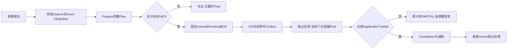

# FIN-GL-01 会计事件与凭证过账

整理状态：**required_materials_consolidated**。当前正文、强制接受/独审及必要规范语义已整理，14个JSON族全部业务字段已补读。案例、文档等价核对和实际运行证据分列：79AC仍NOT_RUN，G01–G12仍UNPROVEN。

## 1. 业务目的、操作者与权威边界

GL把来源Owner冻结的事实变成可追溯会计事件、凭证和过账结果。来源服务接收物流/库存价值、应收应付、成本及收付款证据；财务制单人保存草稿，审批人在OA作决定，有权过账者或登记自动服务独立应用，恢复人员按原腿续作，审计人员读原证据。GL不维护第二套AP/AR余额，不替成本Owner标Settled，不执行真实付款、开票或库存移动。H27数量/收入/价值条件、H29成本版本与结转腿、H38银行/分配证据各自保留，物流Completed不自动触发财务终止确认。[S原件L54](<D:/CP6/docs/CP6_完整成果归档_20261009/完整成果/docs/originals/da/dabe7fa5cc4da4e4__FIN-GL-01_会计事件与凭证过账_前后端开发Spec_v1.0_R2_REVIEW_CANDIDATE.md:54>) [S原件L58](<D:/CP6/docs/CP6_完整成果归档_20261009/完整成果/docs/originals/da/dabe7fa5cc4da4e4__FIN-GL-01_会计事件与凭证过账_前后端开发Spec_v1.0_R2_REVIEW_CANDIDATE.md:58>)

原范围七SPEC为业务来源、会计事件、凭证审批、分段过账、续作、冲销、原始事实引用；H27/H29/H34/H37/H38。原Catalogue接口是FIN-MASTER/OA-APP，新增Source/Period等Required参与者只说明GL必要适配，不把来源Owner整册并入GL。[S原件L14](<D:/CP6/docs/CP6_完整成果归档_20261009/完整成果/docs/originals/da/dabe7fa5cc4da4e4__FIN-GL-01_会计事件与凭证过账_前后端开发Spec_v1.0_R2_REVIEW_CANDIDATE.md:14>)

## 2. 有效版本、接受与组合

当前主正文准确为v1.0 R2，32339行、1502253字节、SHA256 `dabe7fa5cc4da4e422a86eb64c1950be8802a64f2ce008009291c849e798abfd`。2026-10-01接受记录明确采用这一冻结正文；主文NOT_ACCEPTED历史标签被接受记录覆盖，不是另一个未接受版本。D01–D29是数据表，不是产品决策29条。[A原件L7](<D:/CP6/docs/CP6_完整成果归档_20261009/完整成果/docs/originals/d6/d615ae9da7fee0a4__FIN-GL-acceptance.md:7>) [A原件L22](<D:/CP6/docs/CP6_完整成果归档_20261009/完整成果/docs/originals/d6/d615ae9da7fee0a4__FIN-GL-acceptance.md:22>) [A原件L108](<D:/CP6/docs/CP6_完整成果归档_20261009/完整成果/docs/originals/d6/d615ae9da7fee0a4__FIN-GL-acceptance.md:108>)

本册直接保留已接受FIN-MASTER v1.3 R3 `fe309313…` 和OA-APP v1.1.2 R2 `0cc2a482…` wire，附录A/B属于实现合读规范，类型不能凭同名统一。找到的40行R2独审关闭R1-R01/R02/R03和传播；原F1–F9无剩余设计阻断。它是有界设计审查，不是重新逐行审查全部32339行，不是Owner实际采用。79AC全NOT_RUN、G01–G12全UNPROVEN。[S原件L20](<D:/CP6/docs/CP6_完整成果归档_20261009/完整成果/docs/originals/da/dabe7fa5cc4da4e4__FIN-GL-01_会计事件与凭证过账_前后端开发Spec_v1.0_R2_REVIEW_CANDIDATE.md:20>) [S原件L31780](<D:/CP6/docs/CP6_完整成果归档_20261009/完整成果/docs/originals/da/dabe7fa5cc4da4e4__FIN-GL-01_会计事件与凭证过账_前后端开发Spec_v1.0_R2_REVIEW_CANDIDATE.md:31780>) [S原件L31955](<D:/CP6/docs/CP6_完整成果归档_20261009/完整成果/docs/originals/da/dabe7fa5cc4da4e4__FIN-GL-01_会计事件与凭证过账_前后端开发Spec_v1.0_R2_REVIEW_CANDIDATE.md:31955>) [R原件L3](<D:/CP6/docs/CP6_完整成果归档_20261009/找回原件/20261010/FIN-GL-01_v1.0_R2_BOUNDED_REVIEW.md:3>) [R原件L36](<D:/CP6/docs/CP6_完整成果归档_20261009/找回原件/20261010/FIN-GL-01_v1.0_R2_BOUNDED_REVIEW.md:36>)

## 3. 核心数据、身份、金额与版本

Scope `S=(environmentId,tenantId,legalEntityKey,ledgerKey,mode)`贯穿PK/FK、锁、缓存、命令和唯一键。前3可信环境/租户/模式由认证路由，法人账套来自授权FinanceContext；Company精确对应legalEntityKey。跨账套事件拒SCOPE_MIXED，由来源拆独立事件。外域Ref的大小写/版本字节不可转换，GL UUID小写；CAS rowVersion不是业务版本。[S原件L26](<D:/CP6/docs/CP6_完整成果归档_20261009/完整成果/docs/originals/da/dabe7fa5cc4da4e4__FIN-GL-01_会计事件与凭证过账_前后端开发Spec_v1.0_R2_REVIEW_CANDIDATE.md:26>) [S原件L28](<D:/CP6/docs/CP6_完整成果归档_20261009/完整成果/docs/originals/da/dabe7fa5cc4da4e4__FIN-GL-01_会计事件与凭证过账_前后端开发Spec_v1.0_R2_REVIEW_CANDIDATE.md:28>) [S原件L50](<D:/CP6/docs/CP6_完整成果归档_20261009/完整成果/docs/originals/da/dabe7fa5cc4da4e4__FIN-GL-01_会计事件与凭证过账_前后端开发Spec_v1.0_R2_REVIEW_CANDIDATE.md:50>)

|对象/身份|必须保存的意义|
|---|---|
|Event自然键N|S+sourceOwner/factId/lineId/eventType/sourceVersion/policy完整Ref；整单由Owner提供稳定AGGREGATE及成员版本，不用显示单号|
|跨版本SourceGuard|S+sourceOwner/factId/lineId/eventType；新版及Policy变更不能绕旧已过账，必须correctionOf；未过账替代须明确supersede并冻结旧版|
|Leg|S+EventId+稳定PostingLegKey；全状态占一个JournalId，Draft也防重|
|JournalRevision|不可变内容/原分配/Policy/makers；送审固定revision+hash，PostedRevision永久保留|
|PlanRevision|完整腿集/适用性/依赖DAG/源与政策；readiness单独UNRESOLVED或READY|
|PostedFact|每Event/Leg和Journal唯一；冲销不删除占位或原事实|
|ReceiptStream|S+instanceId+subjectRevision+applicationUnitId；revision从1、准确前驱；业务应用终态不可覆盖|
|AdoptionBatch|purpose/ordinal/itemKeys/batchKey/intent/proof/useReceipt/consumerResult/uowId完整映射，不能只保存第一批|

这些身份对应D01–D29，immutable payload禁UPDATE/DELETE，头允许CAS；外域引用保原件/摘要，不假建跨库FK。SourceBusinessCore只排transportEventId和payloadDigest；其余包括sourceDocNo及数组顺序均在业务核心；同hash还比较canonical bytes。不同运输同核心alias首次canonicalReceipt，不建立alias链。[S原件L32](<D:/CP6/docs/CP6_完整成果归档_20261009/完整成果/docs/originals/da/dabe7fa5cc4da4e4__FIN-GL-01_会计事件与凭证过账_前后端开发Spec_v1.0_R2_REVIEW_CANDIDATE.md:32>) [S原件L34](<D:/CP6/docs/CP6_完整成果归档_20261009/完整成果/docs/originals/da/dabe7fa5cc4da4e4__FIN-GL-01_会计事件与凭证过账_前后端开发Spec_v1.0_R2_REVIEW_CANDIDATE.md:34>) [S原件L198](<D:/CP6/docs/CP6_完整成果归档_20261009/完整成果/docs/originals/da/dabe7fa5cc4da4e4__FIN-GL-01_会计事件与凭证过账_前后端开发Spec_v1.0_R2_REVIEW_CANDIDATE.md:198>) [S原件L202](<D:/CP6/docs/CP6_完整成果归档_20261009/完整成果/docs/originals/da/dabe7fa5cc4da4e4__FIN-GL-01_会计事件与凭证过账_前后端开发Spec_v1.0_R2_REVIEW_CANDIDATE.md:202>) [S原件L32250](<D:/CP6/docs/CP6_完整成果归档_20261009/完整成果/docs/originals/da/dabe7fa5cc4da4e4__FIN-GL-01_会计事件与凭证过账_前后端开发Spec_v1.0_R2_REVIEW_CANDIDATE.md:32250>)

金额/数量/单价decimal(28,8)字符串，汇率decimal(28,12)>0；不JS number/指数/容差，超位拒。Policy指定币种小数0–8、汇率0–12、HALF_UP/HALF_EVEN、逐行转换；原币×率按政策舍入后严格借贷平衡，差额须明确ROUNDING来源腿/行。缺金额是MISSING，不是0；缺汇率不是1；合法零只在专业zeroTreatment批准下形成NoEffect。FM.Utc比GL通用Instant更窄，固定24字符`YYYY-MM-DDTHH:mm:ss.SSSZ`，补毫秒必须重算全引用链。[S原件L30](<D:/CP6/docs/CP6_完整成果归档_20261009/完整成果/docs/originals/da/dabe7fa5cc4da4e4__FIN-GL-01_会计事件与凭证过账_前后端开发Spec_v1.0_R2_REVIEW_CANDIDATE.md:30>) [S原件L74](<D:/CP6/docs/CP6_完整成果归档_20261009/完整成果/docs/originals/da/dabe7fa5cc4da4e4__FIN-GL-01_会计事件与凭证过账_前后端开发Spec_v1.0_R2_REVIEW_CANDIDATE.md:74>) [S原件L32300](<D:/CP6/docs/CP6_完整成果归档_20261009/完整成果/docs/originals/da/dabe7fa5cc4da4e4__FIN-GL-01_会计事件与凭证过账_前后端开发Spec_v1.0_R2_REVIEW_CANDIDATE.md:32300>)

## 4. 业务流程、状态和写集

1. **接收**：可信service→封闭schema/hash→准确登记合同及原事实→SourceGuard→运输/业务防重；SourceReceipt/Event PENDING/Command/Audit同Tx。原件暂不可达只Inbox PENDING_VALIDATION，不能形成已核Event。同运输异包409，同N异核心409并保冲突；GL_SOURCE_RECORDED仅接收。[S原件L60](<D:/CP6/docs/CP6_完整成果归档_20261009/完整成果/docs/originals/da/dabe7fa5cc4da4e4__FIN-GL-01_会计事件与凭证过账_前后端开发Spec_v1.0_R2_REVIEW_CANDIDATE.md:60>)
2. **准备**：锁内保存完整Plan、每腿稳定Journal及草稿、SourceAllocation、Command/Audit。Applicable需要已知非零和完整分录，NA需要准确批准依据，UNKNOWN/MISSING阻整个Plan。所有腿READY前任何腿不得先过账。零Posted且无活动审批才可补证新PlanRevision；已有成功腿不能原位变金额/政策。全NA产生NO_ACCOUNTING_EFFECT，不发H37 posted成功。[S原件L70](<D:/CP6/docs/CP6_完整成果归档_20261009/完整成果/docs/originals/da/dabe7fa5cc4da4e4__FIN-GL-01_会计事件与凭证过账_前后端开发Spec_v1.0_R2_REVIEW_CANDIDATE.md:70>) [S原件L74](<D:/CP6/docs/CP6_完整成果归档_20261009/完整成果/docs/originals/da/dabe7fa5cc4da4e4__FIN-GL-01_会计事件与凭证过账_前后端开发Spec_v1.0_R2_REVIEW_CANDIDATE.md:74>) [S原件L78](<D:/CP6/docs/CP6_完整成果归档_20261009/完整成果/docs/originals/da/dabe7fa5cc4da4e4__FIN-GL-01_会计事件与凭证过账_前后端开发Spec_v1.0_R2_REVIEW_CANDIDATE.md:78>) [S原件L32210](<D:/CP6/docs/CP6_完整成果归档_20261009/完整成果/docs/originals/da/dabe7fa5cc4da4e4__FIN-GL-01_会计事件与凭证过账_前后端开发Spec_v1.0_R2_REVIEW_CANDIDATE.md:32210>)
3. **草稿/送审**：手工也建立MANUAL来源事件/单腿身份，草稿可暂不平衡或缺Master，送审则必须完整；Draft/Rejected修改追加Revision并累积makers。冻结Submission/Snapshot/Outbox/PendingReview同commit，OA离线只DISPATCH_PENDING。自动来源/金额/映射不可前端改成手工。[S原件L88](<D:/CP6/docs/CP6_完整成果归档_20261009/完整成果/docs/originals/da/dabe7fa5cc4da4e4__FIN-GL-01_会计事件与凭证过账_前后端开发Spec_v1.0_R2_REVIEW_CANDIDATE.md:88>) [S原件L92](<D:/CP6/docs/CP6_完整成果归档_20261009/完整成果/docs/originals/da/dabe7fa5cc4da4e4__FIN-GL-01_会计事件与凭证过账_前后端开发Spec_v1.0_R2_REVIEW_CANDIDATE.md:92>)
4. **决定入站**：I0只原bytes/Inbox后202；I1核精确Subject、policy、binding/timeline/flow版本、sequence=1和原证据后保存Fact/Stream/Ack，仍不Post。旧revision迟到记STALE；同实例不同决定隔离。HUMAN_TASK、SYSTEM_EXECUTION、SUBMITTER_WITHDRAWAL三型保原字段；SYSTEM终态而decisionMode HUMAN仍必须真实人票。[S原件L98](<D:/CP6/docs/CP6_完整成果归档_20261009/完整成果/docs/originals/da/dabe7fa5cc4da4e4__FIN-GL-01_会计事件与凭证过账_前后端开发Spec_v1.0_R2_REVIEW_CANDIDATE.md:98>) [S原件L100](<D:/CP6/docs/CP6_完整成果归档_20261009/完整成果/docs/originals/da/dabe7fa5cc4da4e4__FIN-GL-01_会计事件与凭证过账_前后端开发Spec_v1.0_R2_REVIEW_CANDIDATE.md:100>) [S原件L102](<D:/CP6/docs/CP6_完整成果归档_20261009/完整成果/docs/originals/da/dabe7fa5cc4da4e4__FIN-GL-01_会计事件与凭证过账_前后端开发Spec_v1.0_R2_REVIEW_CANDIDATE.md:102>)
5. **独立应用**：Subject GL_JOURNAL_POST+MANUAL/AUTO走POST；GL_REVERSAL_POST+REVERSAL走REVERSE_POST，普通gl.post不授权逆向。REJECTED独立应用可Receipt APPLIED，但Journal Rejected，APPLIED并不等Posted。失败Post全回滚，另Tx追加BLOCKED r1；恢复可APPLIED r2且精确previous。Posted、应用Receipt、OA回执Outbox、Command/Audit必须同commit。[S原件L106](<D:/CP6/docs/CP6_完整成果归档_20261009/完整成果/docs/originals/da/dabe7fa5cc4da4e4__FIN-GL-01_会计事件与凭证过账_前后端开发Spec_v1.0_R2_REVIEW_CANDIDATE.md:106>) [S原件L108](<D:/CP6/docs/CP6_完整成果归档_20261009/完整成果/docs/originals/da/dabe7fa5cc4da4e4__FIN-GL-01_会计事件与凭证过账_前后端开发Spec_v1.0_R2_REVIEW_CANDIDATE.md:108>) [S原件L32150](<D:/CP6/docs/CP6_完整成果归档_20261009/完整成果/docs/originals/da/dabe7fa5cc4da4e4__FIN-GL-01_会计事件与凭证过账_前后端开发Spec_v1.0_R2_REVIEW_CANDIDATE.md:32150>)
6. **逐腿过账**：每次明确一个legKey，完整READY和依赖Posted、准确来源/政策/审批/金额、当前Master/Period/适用银行预算门通过才执行。该腿全部FM批、PostedFact、Head、Attempt、Event重算、必要Completion、OA Receipt、采号、Outbox/Audit同外层commit；不能包一个跨腿大事务。[S原件L116](<D:/CP6/docs/CP6_完整成果归档_20261009/完整成果/docs/originals/da/dabe7fa5cc4da4e4__FIN-GL-01_会计事件与凭证过账_前后端开发Spec_v1.0_R2_REVIEW_CANDIDATE.md:116>) [S原件L120](<D:/CP6/docs/CP6_完整成果归档_20261009/完整成果/docs/originals/da/dabe7fa5cc4da4e4__FIN-GL-01_会计事件与凭证过账_前后端开发Spec_v1.0_R2_REVIEW_CANDIDATE.md:120>) [S原件L241](<D:/CP6/docs/CP6_完整成果归档_20261009/完整成果/docs/originals/da/dabe7fa5cc4da4e4__FIN-GL-01_会计事件与凭证过账_前后端开发Spec_v1.0_R2_REVIEW_CANDIDATE.md:241>)
7. **事件完成**：锁内检查完整固定Plan；全Applicable有效Posted才POSTED_COMPLETE；已有成功但其他执行失败为PARTIAL；后继冲销改当前REVERSED/PARTIALLY_REVERSED，原Completion仍历史原件。最后腿与Completion/Notice同Tx，来源收到的Ack固定sourceBusinessApplied=false。[S原件L80](<D:/CP6/docs/CP6_完整成果归档_20261009/完整成果/docs/originals/da/dabe7fa5cc4da4e4__FIN-GL-01_会计事件与凭证过账_前后端开发Spec_v1.0_R2_REVIEW_CANDIDATE.md:80>) [S原件L32232](<D:/CP6/docs/CP6_完整成果归档_20261009/完整成果/docs/originals/da/dabe7fa5cc4da4e4__FIN-GL-01_会计事件与凭证过账_前后端开发Spec_v1.0_R2_REVIEW_CANDIDATE.md:32232>) [S原件L32236](<D:/CP6/docs/CP6_完整成果归档_20261009/完整成果/docs/originals/da/dabe7fa5cc4da4e4__FIN-GL-01_会计事件与凭证过账_前后端开发Spec_v1.0_R2_REVIEW_CANDIDATE.md:32236>)

**冲销**：申请只保存Request和独立反向Draft，原仍Posted；须新批准/当前更正Policy/指定开放期/银行及适用预算门，不能默认今天或重开期。反向逐行原币/率/金额/维度镜像，历史Master UseReceipt映射准确且专业许可允许。REVERSE_POST同时写反向Posted、原Reversed投影、Completion/Receipt/Outbox；失败原不动。首版只整腿整凭证一次镜像，部分冲销拒；冲销后正向重试返回REVERSED。净额应读一正一反事实，不只筛当前status=Posted。[S原件L164](<D:/CP6/docs/CP6_完整成果归档_20261009/完整成果/docs/originals/da/dabe7fa5cc4da4e4__FIN-GL-01_会计事件与凭证过账_前后端开发Spec_v1.0_R2_REVIEW_CANDIDATE.md:164>) [S原件L170](<D:/CP6/docs/CP6_完整成果归档_20261009/完整成果/docs/originals/da/dabe7fa5cc4da4e4__FIN-GL-01_会计事件与凭证过账_前后端开发Spec_v1.0_R2_REVIEW_CANDIDATE.md:170>) [S原件L172](<D:/CP6/docs/CP6_完整成果归档_20261009/完整成果/docs/originals/da/dabe7fa5cc4da4e4__FIN-GL-01_会计事件与凭证过账_前后端开发Spec_v1.0_R2_REVIEW_CANDIDATE.md:172>) [S原件L174](<D:/CP6/docs/CP6_完整成果归档_20261009/完整成果/docs/originals/da/dabe7fa5cc4da4e4__FIN-GL-01_会计事件与凭证过账_前后端开发Spec_v1.0_R2_REVIEW_CANDIDATE.md:174>) [S原件L176](<D:/CP6/docs/CP6_完整成果归档_20261009/完整成果/docs/originals/da/dabe7fa5cc4da4e4__FIN-GL-01_会计事件与凭证过账_前后端开发Spec_v1.0_R2_REVIEW_CANDIDATE.md:176>)

## 5. API、Owner与wire合同

public根`/api/fin/gl/v1`；来源`/internal/finance-gl/sources/v1`；OA决定固定`/internal/finance-gl/approval-results/v2`，不存在旧OA-APPROVAL身份兜底。公共请求封闭DTO，未知字段拒422/重复JSON属性400，nullable显式null，判别联合无关字段缺席。[S原件L28](<D:/CP6/docs/CP6_完整成果归档_20261009/完整成果/docs/originals/da/dabe7fa5cc4da4e4__FIN-GL-01_会计事件与凭证过账_前后端开发Spec_v1.0_R2_REVIEW_CANDIDATE.md:28>) [S原件L250](<D:/CP6/docs/CP6_完整成果归档_20261009/完整成果/docs/originals/da/dabe7fa5cc4da4e4__FIN-GL-01_会计事件与凭证过账_前后端开发Spec_v1.0_R2_REVIEW_CANDIDATE.md:250>) [S原件L335](<D:/CP6/docs/CP6_完整成果归档_20261009/完整成果/docs/originals/da/dabe7fa5cc4da4e4__FIN-GL-01_会计事件与凭证过账_前后端开发Spec_v1.0_R2_REVIEW_CANDIDATE.md:335>)

|动作|主要路径|返回含义|
|---|---|---|
|Options与安全Master选择|GET /options、/master-selections、/journals/{id}/edit-context|有权观察/安全locator，非执行许可|
|来源与计划|service POST/GET /sources/v1；POST /events/{eventId}/prepare|Recorded/PendingValidation；不可变Plan|
|草稿与审批|POST /journals、/{id}/revisions、/submit、/apply-decision、/withdraw|revision/送审/独立应用不同结果|
|逐腿与恢复|POST /events/{id}/post-leg、/retry；GET /commands/{commandId}|普通Post遇REVERSAL拒422；未知按原键查|
|冲销|POST /journals/{id}/reversals、/reversals/{id}/post|申请与真正反向结果分开|
|审计|GET /evidence/{locator}、原revision；POST/GET /exports|exact历史安全视图，每页/下载重验|
|结果消费者|internal /events/{id}/legs/{legKey}/result、/completion-receipts/{id}、/events/{id}/completion|精确Leg/全Plan历史完成及当前逆向状态|
|OA回执链|internal /approval-application-streams/{id}/result、/receipts|登记无Receipt=NOT_APPLIED，未登记与空流不同|

准确API01–26/状态/错误见原文。公共修订API06采用唯一ReviseDraftV2：SELECT(locator)/KEEP(token)/CLEAR；KEEP绑定实际人、S、journal/revision/line/field/originalRef/RV，只保原引用，不授送审权。内部JournalLine保FM五字段Ref，浏览器只原Master VersionLocator；R-GL-SELECTION-1须Owner真实采用，不从公开安全读面偷digest。[S原件L331](<D:/CP6/docs/CP6_完整成果归档_20261009/完整成果/docs/originals/da/dabe7fa5cc4da4e4__FIN-GL-01_会计事件与凭证过账_前后端开发Spec_v1.0_R2_REVIEW_CANDIDATE.md:331>) [S原件L356](<D:/CP6/docs/CP6_完整成果归档_20261009/完整成果/docs/originals/da/dabe7fa5cc4da4e4__FIN-GL-01_会计事件与凭证过账_前后端开发Spec_v1.0_R2_REVIEW_CANDIDATE.md:356>) [S原件L32160](<D:/CP6/docs/CP6_完整成果归档_20261009/完整成果/docs/originals/da/dabe7fa5cc4da4e4__FIN-GL-01_会计事件与凭证过账_前后端开发Spec_v1.0_R2_REVIEW_CANDIDATE.md:32160>) [S原件L32164](<D:/CP6/docs/CP6_完整成果归档_20261009/完整成果/docs/originals/da/dabe7fa5cc4da4e4__FIN-GL-01_会计事件与凭证过账_前后端开发Spec_v1.0_R2_REVIEW_CANDIDATE.md:32164>) [S原件L32176](<D:/CP6/docs/CP6_完整成果归档_20261009/完整成果/docs/originals/da/dabe7fa5cc4da4e4__FIN-GL-01_会计事件与凭证过账_前后端开发Spec_v1.0_R2_REVIEW_CANDIDATE.md:32176>) [S原件L32234](<D:/CP6/docs/CP6_完整成果归档_20261009/完整成果/docs/originals/da/dabe7fa5cc4da4e4__FIN-GL-01_会计事件与凭证过账_前后端开发Spec_v1.0_R2_REVIEW_CANDIDATE.md:32234>)

八类Required参与者：SourceFact、AccountingPolicy、PeriodPosting、适用Bank/Budget/Source Guard、FM ConsumerIntent、ApprovalCurrent、Correction和CompletionDelivery。每个返回准确原件、当前资源门及完整issues；仅valid=true不够。Period不存在NOT_CONFIGURED，不EnsureOpen。来源、银行、预算具体业务仍原Owner；无法同门时Post UNPROVEN。[S原件L360](<D:/CP6/docs/CP6_完整成果归档_20261009/完整成果/docs/originals/da/dabe7fa5cc4da4e4__FIN-GL-01_会计事件与凭证过账_前后端开发Spec_v1.0_R2_REVIEW_CANDIDATE.md:360>)

FM Scope只法人/账套，tenant/mode在TrustedContext；OA Scope只环境/tenant，GL以已登记Subject→S绑定补足法人/账套/mode，不能相同tenant就跨账套。OA三字段Ref与FM五字段Ref无损分存，转换保完整映射；FM typeName+LF摘要与GL裸canonical、OA Digest各用原Owner算法。[S原件L32136](<D:/CP6/docs/CP6_完整成果归档_20261009/完整成果/docs/originals/da/dabe7fa5cc4da4e4__FIN-GL-01_会计事件与凭证过账_前后端开发Spec_v1.0_R2_REVIEW_CANDIDATE.md:32136>) [S原件L32196](<D:/CP6/docs/CP6_完整成果归档_20261009/完整成果/docs/originals/da/dabe7fa5cc4da4e4__FIN-GL-01_会计事件与凭证过账_前后端开发Spec_v1.0_R2_REVIEW_CANDIDATE.md:32196>)

## 6. 事务、分批、幂等与恢复

锁外读取准确不可变证据并收集闭包，HTTP/人类等待/下载不在持锁事务。最终顺序是外域IAM/注册/账套/专业Policy/Source/Period/适用BankBudget前置门→FM Scope→BP Scope→已登记Machine/Organization后置门→GL Command→SourceGuard/Cutover→Event→Leg/Journal（原与反向同序）→Revision/ApprovalFact→ReceiptStream→结果→Sequence→Outbox/Audit。writer同资源X、consumer S持到commit。Inbox接收只独立Pending，不能持Inbox反取业务头。键不存在也用事务级范围锁/验证等价方案；同DbContext不等同事务。[S原件L46](<D:/CP6/docs/CP6_完整成果归档_20261009/完整成果/docs/originals/da/dabe7fa5cc4da4e4__FIN-GL-01_会计事件与凭证过账_前后端开发Spec_v1.0_R2_REVIEW_CANDIDATE.md:46>) [S原件L48](<D:/CP6/docs/CP6_完整成果归档_20261009/完整成果/docs/originals/da/dabe7fa5cc4da4e4__FIN-GL-01_会计事件与凭证过账_前后端开发Spec_v1.0_R2_REVIEW_CANDIDATE.md:48>) [S原件L50](<D:/CP6/docs/CP6_完整成果归档_20261009/完整成果/docs/originals/da/dabe7fa5cc4da4e4__FIN-GL-01_会计事件与凭证过账_前后端开发Spec_v1.0_R2_REVIEW_CANDIDATE.md:50>)

全事件≤32腿，每腿≤500行且不同Master Root≤64、父链≤32、依赖≤256。FM每次items≤64指行条件项，不是去重Root；每用途lineKey ASCII升序，GL_MANUAL或GL_AUTO加可选COST_ATTRIBUTION，分64+末批。全腿全部用途闭包预先持门，不能批间释放/后找新资源。65行两Root仍64+1；每批GLB:batchKey、GLU:batchKey与聚合腿effectRoot分开。[S原件L50](<D:/CP6/docs/CP6_完整成果归档_20261009/完整成果/docs/originals/da/dabe7fa5cc4da4e4__FIN-GL-01_会计事件与凭证过账_前后端开发Spec_v1.0_R2_REVIEW_CANDIDATE.md:50>) [S原件L32180](<D:/CP6/docs/CP6_完整成果归档_20261009/完整成果/docs/originals/da/dabe7fa5cc4da4e4__FIN-GL-01_会计事件与凭证过账_前后端开发Spec_v1.0_R2_REVIEW_CANDIDATE.md:32180>) [S原件L32182](<D:/CP6/docs/CP6_完整成果归档_20261009/完整成果/docs/originals/da/dabe7fa5cc4da4e4__FIN-GL-01_会计事件与凭证过账_前后端开发Spec_v1.0_R2_REVIEW_CANDIDATE.md:32182>)

每批同真实MainUow暂存Intent→Proof→UseReceipt→FinalizeAdoptionBatchInUow→原ConsumerResultBody，再关联PostedResult.adoptions。resultId在READY Plan一次预留，换attempt/租约不变。ConsumerCommitInput取该批uowId、intentRef、useReceiptRef、GLB业务键、subjectDigest；结果字段名masterUseReceiptRef。COMMITTED正文可事务内构造计算Ref，但唯一外层commit后才对外；任何批/用途失败，所有新采用、ConsumerResult、Posted/OA应用/Completion/Outbox全回滚，READY身份保留不算业务效果。[S原件L32184](<D:/CP6/docs/CP6_完整成果归档_20261009/完整成果/docs/originals/da/dabe7fa5cc4da4e4__FIN-GL-01_会计事件与凭证过账_前后端开发Spec_v1.0_R2_REVIEW_CANDIDATE.md:32184>) [S原件L32306](<D:/CP6/docs/CP6_完整成果归档_20261009/完整成果/docs/originals/da/dabe7fa5cc4da4e4__FIN-GL-01_会计事件与凭证过账_前后端开发Spec_v1.0_R2_REVIEW_CANDIDATE.md:32306>) [S原件L32312](<D:/CP6/docs/CP6_完整成果归档_20261009/完整成果/docs/originals/da/dabe7fa5cc4da4e4__FIN-GL-01_会计事件与凭证过账_前后端开发Spec_v1.0_R2_REVIEW_CANDIDATE.md:32312>) [S原件L32318](<D:/CP6/docs/CP6_完整成果归档_20261009/完整成果/docs/originals/da/dabe7fa5cc4da4e4__FIN-GL-01_会计事件与凭证过账_前后端开发Spec_v1.0_R2_REVIEW_CANDIDATE.md:32318>) [S原件L32320](<D:/CP6/docs/CP6_完整成果归档_20261009/完整成果/docs/originals/da/dabe7fa5cc4da4e4__FIN-GL-01_会计事件与凭证过账_前后端开发Spec_v1.0_R2_REVIEW_CANDIDATE.md:32320>)

幂等先认证S与当前结果披露权→原主体/method/route/commandId比较完整body/expectedHeads→已终态只读原结果。即使现关期/停Master/撤gl.post，仍有读权就可重放已完成；无读权仍拒。非终态才走新写门，Command槽内再次判终态；前置门拒不能盖住并发刚成功，释放新写资源后只读Command槽二次裁决，绝不反取FM门。[S原件L32202](<D:/CP6/docs/CP6_完整成果归档_20261009/完整成果/docs/originals/da/dabe7fa5cc4da4e4__FIN-GL-01_会计事件与凭证过账_前后端开发Spec_v1.0_R2_REVIEW_CANDIDATE.md:32202>) [S原件L32204](<D:/CP6/docs/CP6_完整成果归档_20261009/完整成果/docs/originals/da/dabe7fa5cc4da4e4__FIN-GL-01_会计事件与凭证过账_前后端开发Spec_v1.0_R2_REVIEW_CANDIDATE.md:32204>)

未知结果202，数据库/依赖不可达503 UNKNOWN，不能当NOT_OBSERVED或换键。NOT_OBSERVED只当时未观察，原键原body重送；worker leaseEpoch防旧ack，租约不改业务identity。SC15复用已成功WIP全部原ID，FG原Journal恢复，再处理VAR，真实全适用完成才可来源判断。SC16已Invoice+Journal Draft仍PENDING_JOURNAL。OA回执丢失只补原receipt链，不再Post。[S原件L138](<D:/CP6/docs/CP6_完整成果归档_20261009/完整成果/docs/originals/da/dabe7fa5cc4da4e4__FIN-GL-01_会计事件与凭证过账_前后端开发Spec_v1.0_R2_REVIEW_CANDIDATE.md:138>) [S原件L142](<D:/CP6/docs/CP6_完整成果归档_20261009/完整成果/docs/originals/da/dabe7fa5cc4da4e4__FIN-GL-01_会计事件与凭证过账_前后端开发Spec_v1.0_R2_REVIEW_CANDIDATE.md:142>) [S原件L144](<D:/CP6/docs/CP6_完整成果归档_20261009/完整成果/docs/originals/da/dabe7fa5cc4da4e4__FIN-GL-01_会计事件与凭证过账_前后端开发Spec_v1.0_R2_REVIEW_CANDIDATE.md:144>) [S原件L146](<D:/CP6/docs/CP6_完整成果归档_20261009/完整成果/docs/originals/da/dabe7fa5cc4da4e4__FIN-GL-01_会计事件与凭证过账_前后端开发Spec_v1.0_R2_REVIEW_CANDIDATE.md:146>)

历史镜像HISTORY_ONLY不是新采用许可。GL从原PostedResult.adoptions对每个originalUseReceiptRef找唯一consumerResultRef，核Intent/effect/subject/Uow；不得腿根冒批键或以Journal.status证明关联。缺legacy UseReceipt是UNPROVEN_LEGACY_HISTORY，不补签过去资格。[S原件L172](<D:/CP6/docs/CP6_完整成果归档_20261009/完整成果/docs/originals/da/dabe7fa5cc4da4e4__FIN-GL-01_会计事件与凭证过账_前后端开发Spec_v1.0_R2_REVIEW_CANDIDATE.md:172>) [S原件L32339](<D:/CP6/docs/CP6_完整成果归档_20261009/完整成果/docs/originals/da/dabe7fa5cc4da4e4__FIN-GL-01_会计事件与凭证过账_前后端开发Spec_v1.0_R2_REVIEW_CANDIDATE.md:32339>)

## 7. 权限、SOD与敏感数据

gl.read/history/source.ingest/draft/revise/submit/withdraw/post/retry/reverse.request/reverse.post/audit.read/export/cutover.manage分别授权，能力与S/对象/字段AND；角色名不授能力。所有制单/修订真实principal进入makers，审批/过账principal与actualHandler均不能在makers；代理还核grant/scope/有效期。AUTO须真实service/execution/专业允许/来源批准和适用人工职责，不把SYSTEM当免SOD。[S原件L38](<D:/CP6/docs/CP6_完整成果归档_20261009/完整成果/docs/originals/da/dabe7fa5cc4da4e4__FIN-GL-01_会计事件与凭证过账_前后端开发Spec_v1.0_R2_REVIEW_CANDIDATE.md:38>) [S原件L40](<D:/CP6/docs/CP6_完整成果归档_20261009/完整成果/docs/originals/da/dabe7fa5cc4da4e4__FIN-GL-01_会计事件与凭证过账_前后端开发Spec_v1.0_R2_REVIEW_CANDIDATE.md:40>)

无完整字段权原件API整体403，安全投影REDACTED不返隐藏摘要供猜值；跨S不存在/无权统一404。查询、重放、导出与下载均当前重验；切S/退出/403清缓存，不将财务载荷写localStorage。Evidence只登记Owner resolver，不访问payload任意URL。原id/version异digest隔离，404缺件、503失证、NOT_VISIBLE分别表示。[S原件L38](<D:/CP6/docs/CP6_完整成果归档_20261009/完整成果/docs/originals/da/dabe7fa5cc4da4e4__FIN-GL-01_会计事件与凭证过账_前后端开发Spec_v1.0_R2_REVIEW_CANDIDATE.md:38>) [S原件L184](<D:/CP6/docs/CP6_完整成果归档_20261009/完整成果/docs/originals/da/dabe7fa5cc4da4e4__FIN-GL-01_会计事件与凭证过账_前后端开发Spec_v1.0_R2_REVIEW_CANDIDATE.md:184>)

## 8. 页面与交互

七页为来源收件、会计事件、凭证/审批、过账Attempt、恢复、冲销、原证据。直达先Options，未选S显示选择器不默认第一账套。列表默认20最大100；固定snapshot keyset分页，筛选变化新快照，晚响应不能覆盖新generation/撤权。来源状态、计价状态、审批决定、GL应用、腿结果、当前逆向与来源通知分栏；不能一个绿色Approved表示入账。[S原件L56](<D:/CP6/docs/CP6_完整成果归档_20261009/完整成果/docs/originals/da/dabe7fa5cc4da4e4__FIN-GL-01_会计事件与凭证过账_前后端开发Spec_v1.0_R2_REVIEW_CANDIDATE.md:56>) [S原件L72](<D:/CP6/docs/CP6_完整成果归档_20261009/完整成果/docs/originals/da/dabe7fa5cc4da4e4__FIN-GL-01_会计事件与凭证过账_前后端开发Spec_v1.0_R2_REVIEW_CANDIDATE.md:72>) [S原件L88](<D:/CP6/docs/CP6_完整成果归档_20261009/完整成果/docs/originals/da/dabe7fa5cc4da4e4__FIN-GL-01_会计事件与凭证过账_前后端开发Spec_v1.0_R2_REVIEW_CANDIDATE.md:88>) [S原件L186](<D:/CP6/docs/CP6_完整成果归档_20261009/完整成果/docs/originals/da/dabe7fa5cc4da4e4__FIN-GL-01_会计事件与凭证过账_前后端开发Spec_v1.0_R2_REVIEW_CANDIDATE.md:186>)

凭证草稿可保存验证问题，送审严格平衡/科目/来源/率/维度齐全；Master选择不可见为REDACTED_SELECTION而非null，KEEP不能清除或授权，改选当前版必须明确操作。Plan UNRESOLVED禁所有Post；READY+PARTIAL才显示续作。恢复页不提供强制成功、关闭唯一索引或自动开期；冲销申请后原票继续显示Posted直到反向成功。[S原件L90](<D:/CP6/docs/CP6_完整成果归档_20261009/完整成果/docs/originals/da/dabe7fa5cc4da4e4__FIN-GL-01_会计事件与凭证过账_前后端开发Spec_v1.0_R2_REVIEW_CANDIDATE.md:90>) [S原件L138](<D:/CP6/docs/CP6_完整成果归档_20261009/完整成果/docs/originals/da/dabe7fa5cc4da4e4__FIN-GL-01_会计事件与凭证过账_前后端开发Spec_v1.0_R2_REVIEW_CANDIDATE.md:138>) [S原件L32164](<D:/CP6/docs/CP6_完整成果归档_20261009/完整成果/docs/originals/da/dabe7fa5cc4da4e4__FIN-GL-01_会计事件与凭证过账_前后端开发Spec_v1.0_R2_REVIEW_CANDIDATE.md:32164>) [S原件L32212](<D:/CP6/docs/CP6_完整成果归档_20261009/完整成果/docs/originals/da/dabe7fa5cc4da4e4__FIN-GL-01_会计事件与凭证过账_前后端开发Spec_v1.0_R2_REVIEW_CANDIDATE.md:32212>)

## 9. 实现整合顺序与旧代码差距

建议先S/SourceGuard/不可变Event-Plan-Leg-Journal全状态身份与精度约束，再专业Policy/Source/Period等共同门、FM分批及最终结果、OA冻结/决定/独立应用，随后Completion/未知恢复与历史镜像，最后查询/安全选择与切换。这是依赖排序建议，不表示真实生产门已经满足。

原文固定Main `157630594e3371fe181955d2f6227ff3b6962c84`：旧Post已有制审分离、锁期、借贷/科目/Partner/银行预算保护；应保留并补精确版本和共同门。旧AutoPost SYSTEM双身份/内部SaveChanges不作新资格；预算是否适用由精确Policy。旧Reverse创建反向即原Reversed，目标必须反向真正过账才改变原。旧Source+单号+Posted复用、缺率1/缺额0、逐腿内部SaveChanges及invoice存在即成功需重接，不能宣称本轮已修。旧18,2/18,6精度迁移待实施；FinBridgeHook已有零成本外围保护，不能泛称旧系统全无。[S原件L395](<D:/CP6/docs/CP6_完整成果归档_20261009/完整成果/docs/originals/da/dabe7fa5cc4da4e4__FIN-GL-01_会计事件与凭证过账_前后端开发Spec_v1.0_R2_REVIEW_CANDIDATE.md:395>)

切换按S/sourceOwner/eventType/batch登记唯一writer与epoch，证明旧producer停写、连续队列水位、未定键、来源/期/Journal对账再启新writer；保旧唯一约束过渡。无真实版本/Actor/UseReceipt的legacy明确UNPROVEN，不补版本1。回退只停新命令/发送并保事实；已切换旧客户端410，不能重启双写。[S原件L188](<D:/CP6/docs/CP6_完整成果归档_20261009/完整成果/docs/originals/da/dabe7fa5cc4da4e4__FIN-GL-01_会计事件与凭证过账_前后端开发Spec_v1.0_R2_REVIEW_CANDIDATE.md:188>)

## 10. 验收设计与案例族

79AC=原59+R1 16+R2 4，全部NOT_RUN。本次只读文档，没有执行原validator、业务服务或真实DB。必验：同N异额拒/跨版本受控；完整READY才首腿；WIP成功FG失败原腿续作；OA批准不等Post、拒绝APPLIED不等Posted；Master停用与使用竞争；64+1第二批失败全回滚；结果重放只需当前读权；当前逆向不能复用正向；原UseReceipt历史映射；SOD/导出撤权/唯一writer切换。[S原件L32051](<D:/CP6/docs/CP6_完整成果归档_20261009/完整成果/docs/originals/da/dabe7fa5cc4da4e4__FIN-GL-01_会计事件与凭证过账_前后端开发Spec_v1.0_R2_REVIEW_CANDIDATE.md:32051>) [S原件L32073](<D:/CP6/docs/CP6_完整成果归档_20261009/完整成果/docs/originals/da/dabe7fa5cc4da4e4__FIN-GL-01_会计事件与凭证过账_前后端开发Spec_v1.0_R2_REVIEW_CANDIDATE.md:32073>) [S原件L32272](<D:/CP6/docs/CP6_完整成果归档_20261009/完整成果/docs/originals/da/dabe7fa5cc4da4e4__FIN-GL-01_会计事件与凭证过账_前后端开发Spec_v1.0_R2_REVIEW_CANDIDATE.md:32272>) [S原件L32332](<D:/CP6/docs/CP6_完整成果归档_20261009/完整成果/docs/originals/da/dabe7fa5cc4da4e4__FIN-GL-01_会计事件与凭证过账_前后端开发Spec_v1.0_R2_REVIEW_CANDIDATE.md:32332>)

|JSON族/准确原文范围|完整语义及实现约束|
|---|---|
|14.1 L421–4297|SC15：借WIP/贷MATERIAL 300；借FG/贷WIP 280；借VAR/贷WIP 20。三腿不同UoW；FG原BLOCKED/PERIOD_CLOSED回执revision1→同流APPLIED revision2，previousReceipt精确前驱；全部适用腿完成才生成Completion。 [S原件L421](<D:/CP6/docs/CP6_完整成果归档_20261009/完整成果/docs/originals/da/dabe7fa5cc4da4e4__FIN-GL-01_会计事件与凭证过账_前后端开发Spec_v1.0_R2_REVIEW_CANDIDATE.md:421>)|
|14.2 L4303–7312|SC12：60×5=300，收货事件借INVENTORY/贷GRNI；AP清账另事件借GRNI/贷AP，不再借库存。MatchReceipt关联准确收货来源、收货Completion与发票来源，matched/cumulative=60、remaining=0；sourceContract同时要求SOURCE_FACT和MATCH_RECEIPT。 [S原件L4303](<D:/CP6/docs/CP6_完整成果归档_20261009/完整成果/docs/originals/da/dabe7fa5cc4da4e4__FIN-GL-01_会计事件与凭证过账_前后端开发Spec_v1.0_R2_REVIEW_CANDIDATE.md:4303>)|
|14.3 L7318–10110|SC16先记录、准备原Journal；关期首次命令REJECTED且0Posted，恢复后用新retry命令引用同Journal。冲销申请只造DRAFT；HISTORY_ONLY保原UseReceipt，不发新许可，当前EXACT_MIRROR授权后新独立审批/反向过账。原Completion保历史事实，查询currentState=REVERSED。 [S原件L7318](<D:/CP6/docs/CP6_完整成果归档_20261009/完整成果/docs/originals/da/dabe7fa5cc4da4e4__FIN-GL-01_会计事件与凭证过账_前后端开发Spec_v1.0_R2_REVIEW_CANDIDATE.md:7318>)|
|14.4 L10116–25186|65行全部读取：1–33借WIP各1；34–64贷MATERIAL各1；65贷MATERIAL 2，借贷各33。按lineKey ASCII排64+1；第二批是原lineNo43，绝非“第65行”。两批同uowId、各自Intent/Proof/UseReceipt/ConsumerResult及GLB键，聚合Posted完整列两次采用。 [S原件L10116](<D:/CP6/docs/CP6_完整成果归档_20261009/完整成果/docs/originals/da/dabe7fa5cc4da4e4__FIN-GL-01_会计事件与凭证过账_前后端开发Spec_v1.0_R2_REVIEW_CANDIDATE.md:10116>)|
|14.5 L25192–25309|候选SELECTABLE仍isExecutionPermit=false；locator只由当前实际Actor和Scope解出内部Ref，页面不泄漏digest；撤披露权转REDACTED_SELECTION/keepToken，KEEP不授Submit。 [S原件L25192](<D:/CP6/docs/CP6_完整成果归档_20261009/完整成果/docs/originals/da/dabe7fa5cc4da4e4__FIN-GL-01_会计事件与凭证过账_前后端开发Spec_v1.0_R2_REVIEW_CANDIDATE.md:25192>)|
|14.6 L25315–25696|另transportEventId及payloadDigest而业务核心完全相同，回原canonicalReceipt并给aliasReceipt；同原业务身份把300改301，409 SOURCE_CONTENT_CONFLICT且0新事件。 [S原件L25315](<D:/CP6/docs/CP6_完整成果归档_20261009/完整成果/docs/originals/da/dabe7fa5cc4da4e4__FIN-GL-01_会计事件与凭证过账_前后端开发Spec_v1.0_R2_REVIEW_CANDIDATE.md:25315>)|
|14.7 L25702–25807|SYSTEM_EXECUTION仅人工终态的互斥替代；decisionMode仍HUMAN，复用真实人票和FINANCE_REVIEW。排除原decision与Posted；businessApplication NOT_SHOWN且三结果集合空，不宣称系统过账。 [S原件L25702](<D:/CP6/docs/CP6_完整成果归档_20261009/完整成果/docs/originals/da/dabe7fa5cc4da4e4__FIN-GL-01_会计事件与凭证过账_前后端开发Spec_v1.0_R2_REVIEW_CANDIDATE.md:25702>)|
|14.8 L25813–25978|Owner用户命令与出站withdraw命令区分；冻结withdrawal fact含前/后RowVersion、准确用户请求摘要及SUBMITTER_WITHDRAWAL Actor。Workflow只消费该事实生成WITHDRAWN；为任何审批/过账前的替代分支。 [S原件L25813](<D:/CP6/docs/CP6_完整成果归档_20261009/完整成果/docs/originals/da/dabe7fa5cc4da4e4__FIN-GL-01_会计事件与凭证过账_前后端开发Spec_v1.0_R2_REVIEW_CANDIDATE.md:25813>)|
|14.9 L25984–26018|当前gl.post=false、period=CLOSED、Master=SUSPENDED而gl.read=true；回原成功结果，Intent/UseReceipt/Posted新写均0。 [S原件L25984](<D:/CP6/docs/CP6_完整成果归档_20261009/完整成果/docs/originals/da/dabe7fa5cc4da4e4__FIN-GL-01_会计事件与凭证过账_前后端开发Spec_v1.0_R2_REVIEW_CANDIDATE.md:25984>)|
|14.10 L26024–26046|第二批Owner未证，外层ROLLED_BACK；Intent、Proof、UseReceipt、PostedFact、ApplicationReceipt、ConsumerResult六类提交均0；重试保两原批键。 [S原件L26024](<D:/CP6/docs/CP6_完整成果归档_20261009/完整成果/docs/originals/da/dabe7fa5cc4da4e4__FIN-GL-01_会计事件与凭证过账_前后端开发Spec_v1.0_R2_REVIEW_CANDIDATE.md:26024>)|
|14.11 L26052–26189|VAR缺真实成本证据时整个Plan UNRESOLVED；即使WIP已知也PLAN_NOT_READY、0Posted。只有0Posted且无active approval，才能用完整原证据生成新READY Plan并重新送审。 [S原件L26052](<D:/CP6/docs/CP6_完整成果归档_20261009/完整成果/docs/originals/da/dabe7fa5cc4da4e4__FIN-GL-01_会计事件与凭证过账_前后端开发Spec_v1.0_R2_REVIEW_CANDIDATE.md:26052>)|
|14.12 L26195–26234|仅gl.read/gl.post不得应用GL_REVERSAL_POST；ACTION_DENIED，镜像事实、原票Reversed投影、APPLIED回执三写均0。 [S原件L26195](<D:/CP6/docs/CP6_完整成果归档_20261009/完整成果/docs/originals/da/dabe7fa5cc4da4e4__FIN-GL-01_会计事件与凭证过账_前后端开发Spec_v1.0_R2_REVIEW_CANDIDATE.md:26195>)|
|14.13 L26240–29789|89原件全业务字段读：7个科目Release/Timeline/Control、资格/账套/注册/审批、5来源及规则/映射/政策、票据和授权、MatchReceipt、纠正策略及Alias。DEMO专业资格、假定publication和ENABLED不能变成真实生产采用。 [S原件L26240](<D:/CP6/docs/CP6_完整成果归档_20261009/完整成果/docs/originals/da/dabe7fa5cc4da4e4__FIN-GL-01_会计事件与凭证过账_前后端开发Spec_v1.0_R2_REVIEW_CANDIDATE.md:26240>)|
|14.14 L29795–31776|165条Ref/typeName/算法/JSONPointer全部分类并解析到已读正文，165摘要相符；FM采用typeName+LF+canonical，其余按各登记算法。这里只关闭引用定位/字节一致性，未执行业务。 [S原件L29795](<D:/CP6/docs/CP6_完整成果归档_20261009/完整成果/docs/originals/da/dabe7fa5cc4da4e4__FIN-GL-01_会计事件与凭证过账_前后端开发Spec_v1.0_R2_REVIEW_CANDIDATE.md:29795>)|

案例中7个科目只演示DEMO的明确会计角色，当前例均不带Partner/CostCenter；真实科目是否控制户、是否必需伙伴或成本归属，仍由实际FIN-MASTER版本和专业Policy决定。注册原件只列GL_MANUAL、GL_AUTO、COST_ATTRIBUTION三种用途；示例GL_AUTO/GL_MANUAL采用不代替真实注册或其他用途采用。[S原件L26343](<D:/CP6/docs/CP6_完整成果归档_20261009/完整成果/docs/originals/da/dabe7fa5cc4da4e4__FIN-GL-01_会计事件与凭证过账_前后端开发Spec_v1.0_R2_REVIEW_CANDIDATE.md:26343>) [S原件L27782](<D:/CP6/docs/CP6_完整成果归档_20261009/完整成果/docs/originals/da/dabe7fa5cc4da4e4__FIN-GL-01_会计事件与凭证过账_前后端开发Spec_v1.0_R2_REVIEW_CANDIDATE.md:27782>)

本轮把所有UUID和摘要按一一对应符号表示，重复对象保准确原件指针；327个完整表示还原后与源对象逐值相等，8个Base64快照精确解码为已读Journal，165 Ref与body的登记摘要相等。此为本地文档核对；历史独审的63个FM Schema检查和3414项作者静态结果仍保原归属，没有重跑原检查器，也没有把它们改称本次业务验收。[S原件L414](<D:/CP6/docs/CP6_完整成果归档_20261009/完整成果/docs/originals/da/dabe7fa5cc4da4e4__FIN-GL-01_会计事件与凭证过账_前后端开发Spec_v1.0_R2_REVIEW_CANDIDATE.md:414>) [S原件L32326](<D:/CP6/docs/CP6_完整成果归档_20261009/完整成果/docs/originals/da/dabe7fa5cc4da4e4__FIN-GL-01_会计事件与凭证过账_前后端开发Spec_v1.0_R2_REVIEW_CANDIDATE.md:32326>)

## 11. 未确认与实施边界

专业DP01/06所有权/准则/法人/币种/收入/计价/暂估/成本参数、当前IAM/SOD、全部writer共同门、FM选择/Intent/每批Finalize、OA实际接线、Period/Bank/Budget/Source同UoW、DB键范围/回滚、历史镜像许可、迁移水位与Owner采用均需真实证据。缺一项不偷用DEMO/默认率额或静态登记。这里没有新增未关闭设计评审问题；这些是已接受设计明确保留的G01–G12生产门。[S原件L378](<D:/CP6/docs/CP6_完整成果归档_20261009/完整成果/docs/originals/da/dabe7fa5cc4da4e4__FIN-GL-01_会计事件与凭证过账_前后端开发Spec_v1.0_R2_REVIEW_CANDIDATE.md:378>) [S原件L380](<D:/CP6/docs/CP6_完整成果归档_20261009/完整成果/docs/originals/da/dabe7fa5cc4da4e4__FIN-GL-01_会计事件与凭证过账_前后端开发Spec_v1.0_R2_REVIEW_CANDIDATE.md:380>) [A原件L262](<D:/CP6/docs/CP6_完整成果归档_20261009/完整成果/docs/originals/d6/d615ae9da7fee0a4__FIN-GL-acceptance.md:262>)

来源合同H27/H29/H38仍需逐当前AP/AR/INV/COST/CASH的准确生产者核对字段、单位、更正及Completion消费。GL本册的原生接口与DEMO来源已完整整理；跨Owner实际双边采用另列，不因GL必要阅读闭合而宣称全部后继已经接通。

## 12. 来源与实际阅读覆盖

当前正文非JSON业务规范1–419及31780–32339已全文实读，含全部FM/OA wire、79AC、R1/R2修订；14个JSON族421–31776的全部业务字段已按完整基例、每个递归增删改、精确重复对象复用读取，无剩余实质当前章节。所有章节、327完整记录和来源行号保存在阅读账；原始逐行范围与结构语义范围分列，未把Base64原字符或机器目录假称人工逐字阅读。

接受330行、独审40行、最终审查包装319行、INDEX46行、CURRENT272行已完整读取。另37个阅读窗口及11个字段窗口与所标原件逐字节和SHA相等，全部外围说明已读；11窗中前2为已闭合FIN-MASTER Schema的精确窗口，其余复用本册原字段。找回独审的两个本地路径字节相等，使用统一SHA识别。

全部身份、范围与复用依据见[operations-reading.json](D:/CP6/docs/CP6_开发设计文档_20261010/evidence/operations-reading.json)。原始48来源、旧代码和历史候选按各自原归属保留，未因此宣称全文阅读或运行。没有执行归档脚本、业务代码、数据库、构建、测试、Actions或发布。
