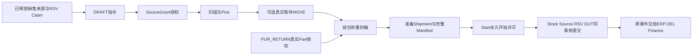

# WMS-OUT-01 出库、拣配、包装与发运

整理状态：**required_materials_consolidated**。当前接受正文的全部业务规则、476个JSON/900语义节点、411个Owner payload、15个Stock canonical、136 AC、冻结依赖类型及强制共同组合已读。全部摘要和补读窗口核对仅证明静态材料一致；13个真实采用门仍UNVERIFIED，业务执行仍NOT_RUN。另有独审摘要引用的次级报告未定位，边界见§11。

## 1. 业务目的、操作者与模块边界

出库员根据销售已释放的订单行/交期/需求及RSV原Claim建立指令；拣货员扫描并提交准确Allocation的Pick；搬运员登记真实暂存Move；包装员装箱、称重、封箱；发运员开始并提交一次实际Shipment；协调员查原结果、关闭未知作业或处理真实差异。采购退运从PUR_RETURN的正式Part授权进入，使用相同实物作业设施，但商业来源、许可和消费者不同。[出库原文L28](<D:/CP6/docs/CP6_完整成果归档_20261009/完整成果/docs/originals/7e/7e25b78ea1261553__WMS-OUT-01_出库拣配包装与发运_前后端开发Spec_v1.3_R3_REVIEW_CANDIDATE.md:28>) [出库原文L66](<D:/CP6/docs/CP6_完整成果归档_20261009/完整成果/docs/originals/7e/7e25b78ea1261553__WMS-OUT-01_出库拣配包装与发运_前后端开发Spec_v1.3_R3_REVIEW_CANDIDATE.md:66>) [出库原文L315](<D:/CP6/docs/CP6_完整成果归档_20261009/完整成果/docs/originals/7e/7e25b78ea1261553__WMS-OUT-01_出库拣配包装与发运_前后端开发Spec_v1.3_R3_REVIEW_CANDIDATE.md:315>)

OUT拥有指令、扫描、包装覆盖、执行工作、物理回执映射和出站消息。Stock拥有唯一库存数量/Claim事实；RSV拥有来源映射和Use协调；ERP拥有销售释放和来源预算；PUR_RETURN拥有退运许可/原收货域预算；DEL拥有交付证明；Finance拥有财务应用。标签、承运商Delivered文本、Stock出库、签收、收入、成本与到账必须分轴显示。[出库原文L495](<D:/CP6/docs/CP6_完整成果归档_20261009/完整成果/docs/originals/7e/7e25b78ea1261553__WMS-OUT-01_出库拣配包装与发运_前后端开发Spec_v1.3_R3_REVIEW_CANDIDATE.md:495>) [出库原文L835](<D:/CP6/docs/CP6_完整成果归档_20261009/完整成果/docs/originals/7e/7e25b78ea1261553__WMS-OUT-01_出库拣配包装与发运_前后端开发Spec_v1.3_R3_REVIEW_CANDIDATE.md:835>)

首批销售可以发至EXTERNAL，或在精确来源采用下转入自有TRANSIT；DEL不再第二次OUT。VMI/客户所有物料的新正常发运尚无本册首批采用，不默认SELF。真实客户退回走RMA；错误发运记录走Stock Correction。[出库原文L28](<D:/CP6/docs/CP6_完整成果归档_20261009/完整成果/docs/originals/7e/7e25b78ea1261553__WMS-OUT-01_出库拣配包装与发运_前后端开发Spec_v1.3_R3_REVIEW_CANDIDATE.md:28>) [出库原文L847](<D:/CP6/docs/CP6_完整成果归档_20261009/完整成果/docs/originals/7e/7e25b78ea1261553__WMS-OUT-01_出库拣配包装与发运_前后端开发Spec_v1.3_R3_REVIEW_CANDIDATE.md:847>) [出库原文L899](<D:/CP6/docs/CP6_完整成果归档_20261009/完整成果/docs/originals/7e/7e25b78ea1261553__WMS-OUT-01_出库拣配包装与发运_前后端开发Spec_v1.3_R3_REVIEW_CANDIDATE.md:899>)

## 2. 有效版本、强制合读与接受边界

有效原件为v1.3_R3，98913行、3423710字节、SHA256 `7e25b78ea1261553bb139c12b89f7d43394845aaaf752a93ba25e1b4762152f9`。准确接受记录明确覆盖正文和D-OUT01–12全部十二项，不受历史CANDIDATE/PROPOSED/NOT_ACCEPTED标签限制。独审记录RemainingBlockingFindings为空，但仅属于历史设计审查。[准确接受L10](<D:/CP6/docs/CP6_完整成果归档_20261009/完整成果/docs/originals/b3/b30486855fd82d89__OUT_ACCEPTANCE.md:10>) [准确接受L23](<D:/CP6/docs/CP6_完整成果归档_20261009/完整成果/docs/originals/b3/b30486855fd82d89__OUT_ACCEPTANCE.md:23>) [准确接受L31](<D:/CP6/docs/CP6_完整成果归档_20261009/完整成果/docs/originals/b3/b30486855fd82d89__OUT_ACCEPTANCE.md:31>) [原审查L33](<D:/CP6/docs/CP6_完整成果归档_20261009/完整成果/docs/originals/d3/d3b544383c62fdbb__SR-20260930-D-WMS-OUT-MD01-FINAL.md:33>)

强制组合包括`4581907feb287595__CURRENT.json`及`d69d65cde52092ea__SHARED_ACCEPTANCE.md`所指H31 v0.7、MRX v0.2、OUT-EFFECTIVE v3和Stock更正发现只读补充。共同接受保持原Stock/GR等旧字节不变，新增适配不是“原Stock已经部署”的API。正文内旧采用声明按此后续准确接受理解。[准确接受L46](<D:/CP6/docs/CP6_完整成果归档_20261009/完整成果/docs/originals/b3/b30486855fd82d89__OUT_ACCEPTANCE.md:46>) [准确接受L55](<D:/CP6/docs/CP6_完整成果归档_20261009/完整成果/docs/originals/b3/b30486855fd82d89__OUT_ACCEPTANCE.md:55>) [出库原文L1180](<D:/CP6/docs/CP6_完整成果归档_20261009/完整成果/docs/originals/7e/7e25b78ea1261553__WMS-OUT-01_出库拣配包装与发运_前后端开发Spec_v1.3_R3_REVIEW_CANDIDATE.md:1180>)

接受的是设计：O-OUT01–13真实Owner/同UoW/权限/生产切换等门仍未验证；136项业务AC全部NOT_RUN。历史静态DTO/JSON检查没有证明真实数据库原子性、现场状态或生产采用。[准确接受L57](<D:/CP6/docs/CP6_完整成果归档_20261009/完整成果/docs/originals/b3/b30486855fd82d89__OUT_ACCEPTANCE.md:57>) [原审查L23](<D:/CP6/docs/CP6_完整成果归档_20261009/完整成果/docs/originals/d3/d3b544383c62fdbb__SR-20260930-D-WMS-OUT-MD01-FINAL.md:23>)

## 3. 数据、业务身份、单位与版本轴

|对象|必须保留的身份和范围|不得压扁的轴|
|---|---|---|
|Instruction/Line|准确OrderLine、Schedule、Release、Demand、DemandShare、Reservation/Claim/Map、商业快照|输入Version与WorkflowRevision不同；授权流程升版不重签业务输入|
|Selection/Pick|一个Claim、一个Binding、一个Allocation、Root半开区间、地点、基本单位、来源谱系|首批一个Pick只处理一Allocation；跨Binding为明确多个任务|
|Stage|一个Claim的完整selections/Use legs、原Root和目标地点|实际MOVE不同于PICK；跨Claim需明确独立任务|
|Package/Version|每行SourceLine、Root范围、原PickReceipt或采购OriginMapping、重量证明|内容Version、Seal、Assignment和历史Label分别保留|
|ShipmentWork/Intent|请求根、完整冻结Intent、实际Manifest/Occurrence leaves、StockCanonical、原StartReceipt|Work revision、worker epoch、Stock前驱、Source当前头不可互换|
|ShipmentReceipt/Line|真实Stock Receipt三字段、MovementId、每原SourcePart/范围/UOM、商业快照|原回执不嵌入后来变化的消费者状态|
|ShipmentEffectStream|原结果完整Ref、originalLineKey、originalMovement/Receipt|历史初始量与当前有效量；Stock来源cut与OUT版本是两轴|

这些结构的闭合DTO在原文4章；所有表按Tenant隔离，原Version/Event不可UPDATE/DELETE，可变Head/Work使用rowversion和业务Revision。长键hash只作索引，仍保存原值并检查碰撞。[出库原文L127](<D:/CP6/docs/CP6_完整成果归档_20261009/完整成果/docs/originals/7e/7e25b78ea1261553__WMS-OUT-01_出库拣配包装与发运_前后端开发Spec_v1.3_R3_REVIEW_CANDIDATE.md:127>) [出库原文L141](<D:/CP6/docs/CP6_完整成果归档_20261009/完整成果/docs/originals/7e/7e25b78ea1261553__WMS-OUT-01_出库拣配包装与发运_前后端开发Spec_v1.3_R3_REVIEW_CANDIDATE.md:141>) [出库原文L152](<D:/CP6/docs/CP6_完整成果归档_20261009/完整成果/docs/originals/7e/7e25b78ea1261553__WMS-OUT-01_出库拣配包装与发运_前后端开发Spec_v1.3_R3_REVIEW_CANDIDATE.md:152>) [出库原文L173](<D:/CP6/docs/CP6_完整成果归档_20261009/完整成果/docs/originals/7e/7e25b78ea1261553__WMS-OUT-01_出库拣配包装与发运_前后端开发Spec_v1.3_R3_REVIEW_CANDIDATE.md:173>) [出库原文L225](<D:/CP6/docs/CP6_完整成果归档_20261009/完整成果/docs/originals/7e/7e25b78ea1261553__WMS-OUT-01_出库拣配包装与发运_前后端开发Spec_v1.3_R3_REVIEW_CANDIDATE.md:225>) [出库原文L259](<D:/CP6/docs/CP6_完整成果归档_20261009/完整成果/docs/originals/7e/7e25b78ea1261553__WMS-OUT-01_出库拣配包装与发运_前后端开发Spec_v1.3_R3_REVIEW_CANDIDATE.md:259>) [出库原文L933](<D:/CP6/docs/CP6_完整成果归档_20261009/完整成果/docs/originals/7e/7e25b78ea1261553__WMS-OUT-01_出库拣配包装与发运_前后端开发Spec_v1.3_R3_REVIEW_CANDIDATE.md:933>)

Q是固定8位正数量，Total允许0；汇总用decimal(38,8)，实际SQL Q为decimal(21,8)。串号不得小数，第9位不舍入。重量使用真实重量UOM，毛重≥皮重且封箱毛重>0，不能把EA当KG；PO Qty6桥接必须完全精确。ReceiptRef只有owner/id/version，不能擅加digest；EvidenceRef才带digest。[出库原文L58](<D:/CP6/docs/CP6_完整成果归档_20261009/完整成果/docs/originals/7e/7e25b78ea1261553__WMS-OUT-01_出库拣配包装与发运_前后端开发Spec_v1.3_R3_REVIEW_CANDIDATE.md:58>) [出库原文L369](<D:/CP6/docs/CP6_完整成果归档_20261009/完整成果/docs/originals/7e/7e25b78ea1261553__WMS-OUT-01_出库拣配包装与发运_前后端开发Spec_v1.3_R3_REVIEW_CANDIDATE.md:369>) [出库原文L443](<D:/CP6/docs/CP6_完整成果归档_20261009/完整成果/docs/originals/7e/7e25b78ea1261553__WMS-OUT-01_出库拣配包装与发运_前后端开发Spec_v1.3_R3_REVIEW_CANDIDATE.md:443>) [出库原文L688](<D:/CP6/docs/CP6_完整成果归档_20261009/完整成果/docs/originals/7e/7e25b78ea1261553__WMS-OUT-01_出库拣配包装与发运_前后端开发Spec_v1.3_R3_REVIEW_CANDIDATE.md:688>) [出库原文L933](<D:/CP6/docs/CP6_完整成果归档_20261009/完整成果/docs/originals/7e/7e25b78ea1261553__WMS-OUT-01_出库拣配包装与发运_前后端开发Spec_v1.3_R3_REVIEW_CANDIDATE.md:933>)

OUT/H31摘要使用各自规范域：业务输入与Stock EFFECT-2/动态CAS分开；同键异文冲突。H31对象键ordinal、GUID小写、数量8位、集合先拒重复再按业务键排序，null/presence不同，不trim业务字符串。OriginMapping不反向含自身Origin；DestinationTarget先于批准，Seed先于完整授权，避免自引用摘要。[出库原文L60](<D:/CP6/docs/CP6_完整成果归档_20261009/完整成果/docs/originals/7e/7e25b78ea1261553__WMS-OUT-01_出库拣配包装与发运_前后端开发Spec_v1.3_R3_REVIEW_CANDIDATE.md:60>) [出库原文L684](<D:/CP6/docs/CP6_完整成果归档_20261009/完整成果/docs/originals/7e/7e25b78ea1261553__WMS-OUT-01_出库拣配包装与发运_前后端开发Spec_v1.3_R3_REVIEW_CANDIDATE.md:684>) [出库原文L715](<D:/CP6/docs/CP6_完整成果归档_20261009/完整成果/docs/originals/7e/7e25b78ea1261553__WMS-OUT-01_出库拣配包装与发运_前后端开发Spec_v1.3_R3_REVIEW_CANDIDATE.md:715>) [出库原文L722](<D:/CP6/docs/CP6_完整成果归档_20261009/完整成果/docs/originals/7e/7e25b78ea1261553__WMS-OUT-01_出库拣配包装与发运_前后端开发Spec_v1.3_R3_REVIEW_CANDIDATE.md:722>) [出库原文L753](<D:/CP6/docs/CP6_完整成果归档_20261009/完整成果/docs/originals/7e/7e25b78ea1261553__WMS-OUT-01_出库拣配包装与发运_前后端开发Spec_v1.3_R3_REVIEW_CANDIDATE.md:753>)

## 4. 正常流程、状态、前置与写集

销售指令DRAFT可用expectedRevision/ETag修改；AUTHORIZED后核心量/来源冻结。授权请求先持久再外调，未知回DRAFT＋真实grantRequestRef＋SOURCE_UNKNOWN，不能虚构Grant或再次领预算。取消只覆盖来源批准的准确剩余范围，已发30保留历史，余70另处置。[出库原文L361](<D:/CP6/docs/CP6_完整成果归档_20261009/完整成果/docs/originals/7e/7e25b78ea1261553__WMS-OUT-01_出库拣配包装与发运_前后端开发Spec_v1.3_R3_REVIEW_CANDIDATE.md:361>) [出库原文L377](<D:/CP6/docs/CP6_完整成果归档_20261009/完整成果/docs/originals/7e/7e25b78ea1261553__WMS-OUT-01_出库拣配包装与发运_前后端开发Spec_v1.3_R3_REVIEW_CANDIDATE.md:377>) [出库原文L395](<D:/CP6/docs/CP6_完整成果归档_20261009/完整成果/docs/originals/7e/7e25b78ea1261553__WMS-OUT-01_出库拣配包装与发运_前后端开发Spec_v1.3_R3_REVIEW_CANDIDATE.md:395>)

Pick要求ALLOCATED/PICKED真实Root背书，Unbacked不是实物。扫描是不可变观察，重复scanKey回原件，另一键重复同一串号/范围仍冲突。Shortage可观察0但不自动LOSS、不改原任务请求数量；原100短拣80要先得到原作业无效果/准确处置，再由源批准新的80后继。Pick成功只让ClaimBinding成为PICKED，P/Open/Free不再减少。[出库原文L397](<D:/CP6/docs/CP6_完整成果归档_20261009/完整成果/docs/originals/7e/7e25b78ea1261553__WMS-OUT-01_出库拣配包装与发运_前后端开发Spec_v1.3_R3_REVIEW_CANDIDATE.md:397>) [出库原文L409](<D:/CP6/docs/CP6_完整成果归档_20261009/完整成果/docs/originals/7e/7e25b78ea1261553__WMS-OUT-01_出库拣配包装与发运_前后端开发Spec_v1.3_R3_REVIEW_CANDIDATE.md:409>) [出库原文L413](<D:/CP6/docs/CP6_完整成果归档_20261009/完整成果/docs/originals/7e/7e25b78ea1261553__WMS-OUT-01_出库拣配包装与发运_前后端开发Spec_v1.3_R3_REVIEW_CANDIDATE.md:413>) [出库原文L417](<D:/CP6/docs/CP6_完整成果归档_20261009/完整成果/docs/originals/7e/7e25b78ea1261553__WMS-OUT-01_出库拣配包装与发运_前后端开发Spec_v1.3_R3_REVIEW_CANDIDATE.md:417>) [出库原文L1091](<D:/CP6/docs/CP6_完整成果归档_20261009/完整成果/docs/originals/7e/7e25b78ea1261553__WMS-OUT-01_出库拣配包装与发运_前后端开发Spec_v1.3_R3_REVIEW_CANDIDATE.md:1091>)

Stage必须显式真实MOVE，全部retainedClaimIds及多Use legs齐备，原Root/Claim随位置变化；两腿和容量同组，企业总Physical/Open保持。封包后不能绕包当前状态直接Move；先关闭未执行Assignment、合法重开、真实Move，再形成新内容和Seal。[出库原文L423](<D:/CP6/docs/CP6_完整成果归档_20261009/完整成果/docs/originals/7e/7e25b78ea1261553__WMS-OUT-01_出库拣配包装与发运_前后端开发Spec_v1.3_R3_REVIEW_CANDIDATE.md:423>) [出库原文L429](<D:/CP6/docs/CP6_完整成果归档_20261009/完整成果/docs/originals/7e/7e25b78ea1261553__WMS-OUT-01_出库拣配包装与发运_前后端开发Spec_v1.3_R3_REVIEW_CANDIDATE.md:429>)

包装销售行须真实PickReceipt；采购行的selection/pickReceipt可以null，但必须有完整授权和OriginMapping。PackCoverage在Root范围门下排他，属于元数据而非第二库存预留。OPEN替换内容要原覆盖退出、新覆盖同次生效，旧重量/标签/Seal不继续有效。每个SEALED包整体进一次Shipment；部分发运须完整Split成所有子包，范围无交叠且并集等原包，子包独立称重，同事务旧包VOID_METADATA及子包/覆盖/Seal齐成，数量效果0。[出库原文L435](<D:/CP6/docs/CP6_完整成果归档_20261009/完整成果/docs/originals/7e/7e25b78ea1261553__WMS-OUT-01_出库拣配包装与发运_前后端开发Spec_v1.3_R3_REVIEW_CANDIDATE.md:435>) [出库原文L439](<D:/CP6/docs/CP6_完整成果归档_20261009/完整成果/docs/originals/7e/7e25b78ea1261553__WMS-OUT-01_出库拣配包装与发运_前后端开发Spec_v1.3_R3_REVIEW_CANDIDATE.md:439>) [出库原文L445](<D:/CP6/docs/CP6_完整成果归档_20261009/完整成果/docs/originals/7e/7e25b78ea1261553__WMS-OUT-01_出库拣配包装与发运_前后端开发Spec_v1.3_R3_REVIEW_CANDIDATE.md:445>)

Shipment按真实批定义Manifest和SourceOccurrence leaves；原源100分30/50/20是三次真实批，共同预算仍100。不同订单行/交期/Claim/Binding/价格/单位/用途不合并成商品总量。多Claim可由预声明子域及完整Use legs进入一个Posting组，但所有RequestedUse必须兼容，不允许清空技术/Demand字段绕过。[出库原文L455](<D:/CP6/docs/CP6_完整成果归档_20261009/完整成果/docs/originals/7e/7e25b78ea1261553__WMS-OUT-01_出库拣配包装与发运_前后端开发Spec_v1.3_R3_REVIEW_CANDIDATE.md:455>) [出库原文L459](<D:/CP6/docs/CP6_完整成果归档_20261009/完整成果/docs/originals/7e/7e25b78ea1261553__WMS-OUT-01_出库拣配包装与发运_前后端开发Spec_v1.3_R3_REVIEW_CANDIDATE.md:459>) [出库原文L463](<D:/CP6/docs/CP6_完整成果归档_20261009/完整成果/docs/originals/7e/7e25b78ea1261553__WMS-OUT-01_出库拣配包装与发运_前后端开发Spec_v1.3_R3_REVIEW_CANDIDATE.md:463>)

|动作|最终共同写集|成功意味着什么|
|---|---|---|
|Pick|Stock ClaimBinding/Event/Receipt＋RSV Use/Map＋OUT执行/扫描应用/审计|已拣，Physical没有OUT|
|Stage Move|Stock两腿/Root位置/Pool/容量＋Claim跟随＋RSV Use/Map＋OUT结果|真实当前位置变化|
|Package编辑/封箱/拆分|OUT版本/范围覆盖/Seal/谱系/标签/审计|元数据闭合，无数量变化|
|Start|Source Part STARTED和永久许可＋OUT StartIntent/Assignment/Work|允许进入原执行；Physical仍0|
|销售Ship|Stock Movement/Claim消费/Allowance/Receipt＋RSV Use/Map＋ERP/OUT来源消费＋OUT Receipt/Package SHIPPED/Work/Outbox|一个真实批已提交|
|采购Ship|Stock原SHIP＋OUT PhysicalFact＋PUR_RETURN/MRX范围应用＋SourceReceipt＋OUT Result/包/Outbox|一个真实退运Part已完整提交|

该写集是原文明确规则；不能Stock先独立commit再依靠HTTP回调宣称原子。顶层commit以前内部COMMITTED结果仍是待提交候选，不发HTTP成功或消息。[出库原文L473](<D:/CP6/docs/CP6_完整成果归档_20261009/完整成果/docs/originals/7e/7e25b78ea1261553__WMS-OUT-01_出库拣配包装与发运_前后端开发Spec_v1.3_R3_REVIEW_CANDIDATE.md:473>) [出库原文L765](<D:/CP6/docs/CP6_完整成果归档_20261009/完整成果/docs/originals/7e/7e25b78ea1261553__WMS-OUT-01_出库拣配包装与发运_前后端开发Spec_v1.3_R3_REVIEW_CANDIDATE.md:765>) [出库原文L917](<D:/CP6/docs/CP6_完整成果归档_20261009/完整成果/docs/originals/7e/7e25b78ea1261553__WMS-OUT-01_出库拣配包装与发运_前后端开发Spec_v1.3_R3_REVIEW_CANDIDATE.md:917>) [出库原文L929](<D:/CP6/docs/CP6_完整成果归档_20261009/完整成果/docs/originals/7e/7e25b78ea1261553__WMS-OUT-01_出库拣配包装与发运_前后端开发Spec_v1.3_R3_REVIEW_CANDIDATE.md:929>)

采购H31首批一ReturnLine固定一个GR原ReceiptCoordinateDomain、同原Root、一个PO SourcePortion/交易单位；同Root多当前位置仍为一个Part同原子组。SourceAllowance每child准确对应child source三字段，另有跨Part/跨ReturnVersion原域共享保护。使用AUTHORIZED_FREE、claimSpends=[]，现存Claim须RSV先有权处置；Quality拒收/冻结库存必须有明确SUPPLIER_RETURN用途许可，不能清全局Hold。[出库原文L497](<D:/CP6/docs/CP6_完整成果归档_20261009/完整成果/docs/originals/7e/7e25b78ea1261553__WMS-OUT-01_出库拣配包装与发运_前后端开发Spec_v1.3_R3_REVIEW_CANDIDATE.md:497>) [出库原文L501](<D:/CP6/docs/CP6_完整成果归档_20261009/完整成果/docs/originals/7e/7e25b78ea1261553__WMS-OUT-01_出库拣配包装与发运_前后端开发Spec_v1.3_R3_REVIEW_CANDIDATE.md:501>) [出库原文L503](<D:/CP6/docs/CP6_完整成果归档_20261009/完整成果/docs/originals/7e/7e25b78ea1261553__WMS-OUT-01_出库拣配包装与发运_前后端开发Spec_v1.3_R3_REVIEW_CANDIDATE.md:503>) [出库原文L729](<D:/CP6/docs/CP6_完整成果归档_20261009/完整成果/docs/originals/7e/7e25b78ea1261553__WMS-OUT-01_出库拣配包装与发运_前后端开发Spec_v1.3_R3_REVIEW_CANDIDATE.md:729>) [出库原文L736](<D:/CP6/docs/CP6_完整成果归档_20261009/完整成果/docs/originals/7e/7e25b78ea1261553__WMS-OUT-01_出库拣配包装与发运_前后端开发Spec_v1.3_R3_REVIEW_CANDIDATE.md:736>)

H31最终执行顺序固定为Stock→OUT不可变PhysicalFact→PUR_RETURN读同事务原Fact并调用MRX.PhysicalApply→SourceReceipt→OUT DispatchResult/Outbox。不同真实Part4+6与同Part跨地点4/6不同；第一Part4成、第二6未知时Actual4/Unknown6/未保护可退0。原GR Received/E不因退运减少。[出库原文L761](<D:/CP6/docs/CP6_完整成果归档_20261009/完整成果/docs/originals/7e/7e25b78ea1261553__WMS-OUT-01_出库拣配包装与发运_前后端开发Spec_v1.3_R3_REVIEW_CANDIDATE.md:761>) [出库原文L806](<D:/CP6/docs/CP6_完整成果归档_20261009/完整成果/docs/originals/7e/7e25b78ea1261553__WMS-OUT-01_出库拣配包装与发运_前后端开发Spec_v1.3_R3_REVIEW_CANDIDATE.md:806>) [出库原文L823](<D:/CP6/docs/CP6_完整成果归档_20261009/完整成果/docs/originals/7e/7e25b78ea1261553__WMS-OUT-01_出库拣配包装与发运_前后端开发Spec_v1.3_R3_REVIEW_CANDIDATE.md:823>) [出库原文L827](<D:/CP6/docs/CP6_完整成果归档_20261009/完整成果/docs/originals/7e/7e25b78ea1261553__WMS-OUT-01_出库拣配包装与发运_前后端开发Spec_v1.3_R3_REVIEW_CANDIDATE.md:827>)

## 5. API、事件与跨Owner合同

public根`/api/wms/out/v1`；internal根`/internal/wms/out/v1`。schema闭合，unknown field拒绝。metadata Idempotency-Key绑定原requestKey，不能代业务Source/StockCanonical。[出库原文L104](<D:/CP6/docs/CP6_完整成果归档_20261009/完整成果/docs/originals/7e/7e25b78ea1261553__WMS-OUT-01_出库拣配包装与发运_前后端开发Spec_v1.3_R3_REVIEW_CANDIDATE.md:104>) [出库原文L315](<D:/CP6/docs/CP6_完整成果归档_20261009/完整成果/docs/originals/7e/7e25b78ea1261553__WMS-OUT-01_出库拣配包装与发运_前后端开发Spec_v1.3_R3_REVIEW_CANDIDATE.md:315>)

|接口组|准确入口与结果|调用方责任|
|---|---|---|
|上下文与选择器|GET /context；POST /work-queue/query、/sources/search、/allocations/search、/locations/search、/units/query|返回真实Owner版本/范围，候选admissionGrant=false|
|指令|POST /instructions，PATCH /instructions/{id}，POST /authorize、/cancel|授权/取消实际后缀接在指令ID后；DRAFT与范围处置分开|
|拣货|POST /picks；/picks/{id}/scans、/shortages、/prepare、/execute|扫描/短缺无数量效果，提交使用原Plan/ScanReceipt|
|暂存|POST /staging-moves；POST /staging-moves/commit|原Stock MOVE组；202可无完整StageView但有AuxWork|
|包|POST /packages；PATCH /packages/{id}；POST /seal、/reopen、/split|后缀接包ID；版本/内容摘要/称量证明必核|
|销售发运|POST /shipments/prepare、/start、/commit|准备/开始不等已发；FOUND须原真实回执|
|恢复关闭|POST /operations/lookup；GET /operations/{id}；POST /resume、/close|只定位原Work，下一步来自当前nextActions|
|Aux恢复|POST /picks/lookup、/staging-moves/lookup；/aux-operations/{id}/resume、/close、/disposition、/successor-authorizations、/physical-disposition-read；POST /aux-successors|Pick/Stage独立AuxWork，不能强转ShipmentWork|
|采购退运|internal /purchase-return-dispatches/prepare、/start、/execute、/query、/close|注册PUR_RETURN服务和Tenant范围；Prepare可能没有Stock身份|
|有效发运|internal POST /shipment-corrections/link、/shipment-effects/events/query、/shipment-effects/applications；public POST /shipment-effects/query、/shipment-effects/refresh|关联原Stock证据，替换同一效果解释，不再写Stock|

各请求/响应闭合DTO及精确权限在接口目录；错误语义为400结构、403动作、不可见404、409内容/业务、412CAS、422资格、503未知读取，202只代表待办/未知。[出库原文L317](<D:/CP6/docs/CP6_完整成果归档_20261009/完整成果/docs/originals/7e/7e25b78ea1261553__WMS-OUT-01_出库拣配包装与发运_前后端开发Spec_v1.3_R3_REVIEW_CANDIDATE.md:317>) [出库原文L363](<D:/CP6/docs/CP6_完整成果归档_20261009/完整成果/docs/originals/7e/7e25b78ea1261553__WMS-OUT-01_出库拣配包装与发运_前后端开发Spec_v1.3_R3_REVIEW_CANDIDATE.md:363>) [出库原文L1045](<D:/CP6/docs/CP6_完整成果归档_20261009/完整成果/docs/originals/7e/7e25b78ea1261553__WMS-OUT-01_出库拣配包装与发运_前后端开发Spec_v1.3_R3_REVIEW_CANDIDATE.md:1045>) [出库原文L1117](<D:/CP6/docs/CP6_完整成果归档_20261009/完整成果/docs/originals/7e/7e25b78ea1261553__WMS-OUT-01_出库拣配包装与发运_前后端开发Spec_v1.3_R3_REVIEW_CANDIDATE.md:1117>)

ConsumerEvent的eventId仅运输；businessRef与semanticDigest绑定完整原业务正文。Sales消费者按ShipmentLine/version及原Schedule量应用；收到HTTP200仅RECEIVED，不自动APPLIED。事件嵌入提交时固定Receipt快照，后来ConsumerApplication另存，不能把变化状态回填原hash。[出库原文L839](<D:/CP6/docs/CP6_完整成果归档_20261009/完整成果/docs/originals/7e/7e25b78ea1261553__WMS-OUT-01_出库拣配包装与发运_前后端开发Spec_v1.3_R3_REVIEW_CANDIDATE.md:839>) [出库原文L843](<D:/CP6/docs/CP6_完整成果归档_20261009/完整成果/docs/originals/7e/7e25b78ea1261553__WMS-OUT-01_出库拣配包装与发运_前后端开发Spec_v1.3_R3_REVIEW_CANDIDATE.md:843>)

采购仅由PUR_RETURN续GR/PO/Finance链，canonical观察者为PUR_RETURN_OBSERVER，按ReturnId/Line/Part/SourcePart/originalMovement分流；父ReturnRef只存parentReturnRef，禁止旧父版本第二套Notice。受信读入口是`POST /internal/pur/return/v1/return-effect-observations/read`。[出库原文L831](<D:/CP6/docs/CP6_完整成果归档_20261009/完整成果/docs/originals/7e/7e25b78ea1261553__WMS-OUT-01_出库拣配包装与发运_前后端开发Spec_v1.3_R3_REVIEW_CANDIDATE.md:831>)

采购单效果观察的字段适配：B18o先持久完整观察流，父商业ReturnRef仅放parentReturnRef；B19的producerOwner和returnRef.owner均为PUR_RETURN_OBSERVER。虽然字段名是stockMovementRef，它传的是原Stock Receipt，由adapter解析movementId；不把字段名称当ID类型推断。原GR有效100/质量接受90不因这条10EA观察直接改写，财务仍续原Owner链。[观察原件](<D:/CP6/docs/CP6_完整成果归档_20261009/完整成果/docs/originals/c9/c91018e761543054__RETURN-OBSERVATION-EXACT-B18o-B19.json:150>) [Receipt适配说明](<D:/CP6/docs/CP6_完整成果归档_20261009/完整成果/docs/originals/c9/c91018e761543054__RETURN-OBSERVATION-EXACT-B18o-B19.json:185>) [完整读结果类型](<D:/CP6/docs/CP6_完整成果归档_20261009/完整成果/docs/originals/f3/f353ed3cf64fbb71__RETURN-OBSERVATION.types.ts:18>)

## 6. 同UoW、幂等、并发与失败恢复

MainUow是组合器注入的真实同DbConnection/DbTransaction及注册上下文，不是HTTP字段、字符串token或远程Validate许可。资源先完整收集最强模式，再按全部Canonical/Occurrence→所有Scope祖先→全Owner细资源ordinal取锁；普通Scope S，fence/控制变更X，禁止持锁临时升级。SQL Server事务级applock必须同数据库/主体才同一把锁；负返回/死锁rollback。锁后出现未锁新成员必须rollback/recollect。[出库原文L676](<D:/CP6/docs/CP6_完整成果归档_20261009/完整成果/docs/originals/7e/7e25b78ea1261553__WMS-OUT-01_出库拣配包装与发运_前后端开发Spec_v1.3_R3_REVIEW_CANDIDATE.md:676>) [出库原文L686](<D:/CP6/docs/CP6_完整成果归档_20261009/完整成果/docs/originals/7e/7e25b78ea1261553__WMS-OUT-01_出库拣配包装与发运_前后端开发Spec_v1.3_R3_REVIEW_CANDIDATE.md:686>) [出库原文L905](<D:/CP6/docs/CP6_完整成果归档_20261009/完整成果/docs/originals/7e/7e25b78ea1261553__WMS-OUT-01_出库拣配包装与发运_前后端开发Spec_v1.3_R3_REVIEW_CANDIDATE.md:905>)

采购源Location物理减少仍参加容量域。每个真实sourcePlace都要一份完整SourceCapacitySnapshot；有控制时所有当前metrics齐备，无控制必须当前锁住的空metricSet＋NO_REGISTERED_METRICS证明，不能空数组推N/A。同Root两地点40/60发4/6，各减至36/54，共一StockReceipt；漏第二地点、规则变更或源位置变化，整Part重收集，不能部分提交。资源数49/60只是具体例，不能写成部署固定常量。[出库原文L790](<D:/CP6/docs/CP6_完整成果归档_20261009/完整成果/docs/originals/7e/7e25b78ea1261553__WMS-OUT-01_出库拣配包装与发运_前后端开发Spec_v1.3_R3_REVIEW_CANDIDATE.md:790>) [出库原文L804](<D:/CP6/docs/CP6_完整成果归档_20261009/完整成果/docs/originals/7e/7e25b78ea1261553__WMS-OUT-01_出库拣配包装与发运_前后端开发Spec_v1.3_R3_REVIEW_CANDIDATE.md:804>)

Work revision控制业务前驱，epoch控制worker派送权；租约到期不释放业务范围。所有OwnerCall先保存完整原请求，StockPrepareDispatch由NOT_STARTED到MAY_HAVE_BEEN_SENT的CAS与真实body/digest绑定同次持久后才发送。只有确认未commit、输入和资源语义未变时允许最多3次技术重试，否则WAITING/UNKNOWN。[出库原文L857](<D:/CP6/docs/CP6_完整成果归档_20261009/完整成果/docs/originals/7e/7e25b78ea1261553__WMS-OUT-01_出库拣配包装与发运_前后端开发Spec_v1.3_R3_REVIEW_CANDIDATE.md:857>) [出库原文L869](<D:/CP6/docs/CP6_完整成果归档_20261009/完整成果/docs/originals/7e/7e25b78ea1261553__WMS-OUT-01_出库拣配包装与发运_前后端开发Spec_v1.3_R3_REVIEW_CANDIDATE.md:869>) [出库原文L1062](<D:/CP6/docs/CP6_完整成果归档_20261009/完整成果/docs/originals/7e/7e25b78ea1261553__WMS-OUT-01_出库拣配包装与发运_前后端开发Spec_v1.3_R3_REVIEW_CANDIDATE.md:1062>)

|已知窗口|允许恢复/关闭|保留的保护|
|---|---|---|
|授权未回|查原Grant；源相同决定点安装before-grant墓碑或返回真实Grant并fence|不能另键领预算|
|派送门NOT_STARTED|全注册路径排他CAS FENCED_NEVER_SENT，源精确收尾|不造未来Stock身份/Closure|
|MAY_HAVE_BEEN_SENT但Plan未知|先永久fence，按原metadata查回Plan|Source/Package/Use全部保留|
|已有Plan|源全路径fence→Stock同Canonical SO03a裁决→源精确收尾|NOT_OBSERVED不等无效果|
|Stock永久REJECTED|读取完整原Canonical/FrozenIntent/全叶/全aliases/源fence，生成准确RejectedNoEffectProof|不伪造Stock Closure；原状态不改SEALED|
|Stock已成功|返回原Effect/Receipt；缺链走RECORD_LINK|不再SP02、不逆向抹事实|
|现场实物已离场但正常组未成|ActualFact/Resolution与SourceReconciliationHold|RECONCILIATION_REQUIRED，不补余冒原子成功|

销售、采购、Aux各有类型明确的关闭方法。SourceFinalize只释放准确未用份额；已用或未知保留。关闭一个Shipment不撤销已执行Pick/Move；OUT全后继处置与实际位置证明齐备后，只能向RSV提供本域Disposition，最终全Claim NoFurtherUse仍由RSV协调。[出库原文L873](<D:/CP6/docs/CP6_完整成果归档_20261009/完整成果/docs/originals/7e/7e25b78ea1261553__WMS-OUT-01_出库拣配包装与发运_前后端开发Spec_v1.3_R3_REVIEW_CANDIDATE.md:873>) [出库原文L885](<D:/CP6/docs/CP6_完整成果归档_20261009/完整成果/docs/originals/7e/7e25b78ea1261553__WMS-OUT-01_出库拣配包装与发运_前后端开发Spec_v1.3_R3_REVIEW_CANDIDATE.md:885>) [出库原文L895](<D:/CP6/docs/CP6_完整成果归档_20261009/完整成果/docs/originals/7e/7e25b78ea1261553__WMS-OUT-01_出库拣配包装与发运_前后端开发Spec_v1.3_R3_REVIEW_CANDIDATE.md:895>) [出库原文L1068](<D:/CP6/docs/CP6_完整成果归档_20261009/完整成果/docs/originals/7e/7e25b78ea1261553__WMS-OUT-01_出库拣配包装与发运_前后端开发Spec_v1.3_R3_REVIEW_CANDIDATE.md:1068>) [出库原文L1083](<D:/CP6/docs/CP6_完整成果归档_20261009/完整成果/docs/originals/7e/7e25b78ea1261553__WMS-OUT-01_出库拣配包装与发运_前后端开发Spec_v1.3_R3_REVIEW_CANDIDATE.md:1083>)

有效发运更正保持原Shipment/Stock事实不可变。E0是原Root集合，R为有权已提交直接逆向范围的无重叠并集，有效量取E0−R；原30错5变25，再全逆变0。真实退回不是错误逆向。一次Stock更正跨多OUT结果时，完整目标集合必须由原ReversalUsage推导，统一Association并在一个OUT事务CAS全部Head，缺项不部分宣布完成。[出库原文L1109](<D:/CP6/docs/CP6_完整成果归档_20261009/完整成果/docs/originals/7e/7e25b78ea1261553__WMS-OUT-01_出库拣配包装与发运_前后端开发Spec_v1.3_R3_REVIEW_CANDIDATE.md:1109>) [出库原文L1115](<D:/CP6/docs/CP6_完整成果归档_20261009/完整成果/docs/originals/7e/7e25b78ea1261553__WMS-OUT-01_出库拣配包装与发运_前后端开发Spec_v1.3_R3_REVIEW_CANDIDATE.md:1115>) [出库原文L1125](<D:/CP6/docs/CP6_完整成果归档_20261009/完整成果/docs/originals/7e/7e25b78ea1261553__WMS-OUT-01_出库拣配包装与发运_前后端开发Spec_v1.3_R3_REVIEW_CANDIDATE.md:1125>) [出库原文L1131](<D:/CP6/docs/CP6_完整成果归档_20261009/完整成果/docs/originals/7e/7e25b78ea1261553__WMS-OUT-01_出库拣配包装与发运_前后端开发Spec_v1.3_R3_REVIEW_CANDIDATE.md:1131>)

EffectiveSnapshotEvent是替换一个原效果的快照，不是新增25。原ConsumerEvent与v1按同EffectIdentity归一，v3先到保raw/ObservedHigh、补v2后顺序应用；异义同revision进入CONFLICT。Stock漏通知须通过新CAPTURE_CURRENT完整快照发现，OCX05按EXACT_SNAPSHOT补齐只称APPLIED_AS_OF；随后新的当前查询仍需新readKey/new cut。旧cut落后本地或不可比保持UNKNOWN，不回退head；未知显示lastConfirmed，不用0。[出库原文L1139](<D:/CP6/docs/CP6_完整成果归档_20261009/完整成果/docs/originals/7e/7e25b78ea1261553__WMS-OUT-01_出库拣配包装与发运_前后端开发Spec_v1.3_R3_REVIEW_CANDIDATE.md:1139>) [出库原文L1141](<D:/CP6/docs/CP6_完整成果归档_20261009/完整成果/docs/originals/7e/7e25b78ea1261553__WMS-OUT-01_出库拣配包装与发运_前后端开发Spec_v1.3_R3_REVIEW_CANDIDATE.md:1141>) [出库原文L1152](<D:/CP6/docs/CP6_完整成果归档_20261009/完整成果/docs/originals/7e/7e25b78ea1261553__WMS-OUT-01_出库拣配包装与发运_前后端开发Spec_v1.3_R3_REVIEW_CANDIDATE.md:1152>) [出库原文L1164](<D:/CP6/docs/CP6_完整成果归档_20261009/完整成果/docs/originals/7e/7e25b78ea1261553__WMS-OUT-01_出库拣配包装与发运_前后端开发Spec_v1.3_R3_REVIEW_CANDIDATE.md:1164>) [出库原文L1172](<D:/CP6/docs/CP6_完整成果归档_20261009/完整成果/docs/originals/7e/7e25b78ea1261553__WMS-OUT-01_出库拣配包装与发运_前后端开发Spec_v1.3_R3_REVIEW_CANDIDATE.md:1172>) [出库原文L1219](<D:/CP6/docs/CP6_完整成果归档_20261009/完整成果/docs/originals/7e/7e25b78ea1261553__WMS-OUT-01_出库拣配包装与发运_前后端开发Spec_v1.3_R3_REVIEW_CANDIDATE.md:1219>)

### 与DEL证明准入的限定共同锁前缀

后继DEL-SOURCE-FENCE-1对OUT OCX01及OCX05真正关联阶段、有效head与影响DEL准入的知识推进增加外层F0：以(Tenant,Mode,原StockMovement完整Ref)收集整个原子组，**在原Owner Canonical之前**取共同fence；然后保持原Canonical→Scope→Source相对顺序。相关Stock/OUT解释与DEL Proof准入共享同物理Connection、同SERIALIZABLE DbTransaction，成功解释同commit推进epoch，回滚不推进。旧入口已经持Canonical后不能补F0，缺wrapper采用必须拒相关准入。[DEL共同合同L15272](<D:/CP6/docs/CP6_完整成果归档_20261009/完整成果/docs/originals/c3/c30b6885dde887be__WMS-DEL-01_承运与交付证明_前后端开发Spec_v1.3_R3_REVIEWED.md:15272>) [全writer锁序L15278](<D:/CP6/docs/CP6_完整成果归档_20261009/完整成果/docs/originals/c3/c30b6885dde887be__WMS-DEL-01_承运与交付证明_前后端开发Spec_v1.3_R3_REVIEWED.md:15278>)

此限定只用于影响原Shipment解释的参与路由和DEL最终/当前组合读，不能推广为所有库存/出库业务全部采用SERIALIZABLE。DEL只读Stock/OUT并写自己的Proof，原Quantity/Correction审批/源关闭语义不变；最终新Stock cut核epoch/sourceSet/OUT heads后Proof/Permit同提交。真实共同采用仍UNPROVEN。[最终决定L15294](<D:/CP6/docs/CP6_完整成果归档_20261009/完整成果/docs/originals/c3/c30b6885dde887be__WMS-DEL-01_承运与交付证明_前后端开发Spec_v1.3_R3_REVIEWED.md:15294>) [接受保留L169](<D:/CP6/docs/CP6_完整成果归档_20261009/完整成果/docs/originals/1f/1fd0c2f53e99a13c__DEL_acceptance.md:169>) 详见[WMS-DEL-01](<D:/CP6/docs/CP6_开发设计文档_20261010/modules/WMS-DEL-01.md>)。

## 7. 权限、租户与敏感字段

动作能力区分read/source.read、指令write/authorize、pick.record/prepare/execute、move、package、ship、operation.read/resume/close、reconcile.link、export。包装权限不授予Stock写权；服务Producer只能来自注册身份，浏览器不能自报PUR_RETURN/Finance。所有FK、唯一键、消息、导出和查询受Tenant/Scope约束，价格/协议等按字段权遮蔽；部分遮蔽不能签完整来源证明。[出库原文L90](<D:/CP6/docs/CP6_完整成果归档_20261009/完整成果/docs/originals/7e/7e25b78ea1261553__WMS-OUT-01_出库拣配包装与发运_前后端开发Spec_v1.3_R3_REVIEW_CANDIDATE.md:90>) [出库原文L315](<D:/CP6/docs/CP6_完整成果归档_20261009/完整成果/docs/originals/7e/7e25b78ea1261553__WMS-OUT-01_出库拣配包装与发运_前后端开发Spec_v1.3_R3_REVIEW_CANDIDATE.md:315>) [出库原文L674](<D:/CP6/docs/CP6_完整成果归档_20261009/完整成果/docs/originals/7e/7e25b78ea1261553__WMS-OUT-01_出库拣配包装与发运_前后端开发Spec_v1.3_R3_REVIEW_CANDIDATE.md:674>) [出库原文L933](<D:/CP6/docs/CP6_完整成果归档_20261009/完整成果/docs/originals/7e/7e25b78ea1261553__WMS-OUT-01_出库拣配包装与发运_前后端开发Spec_v1.3_R3_REVIEW_CANDIDATE.md:933>) [出库原文L1205](<D:/CP6/docs/CP6_完整成果归档_20261009/完整成果/docs/originals/7e/7e25b78ea1261553__WMS-OUT-01_出库拣配包装与发运_前后端开发Spec_v1.3_R3_REVIEW_CANDIDATE.md:1205>)

人的当前读权可撤销，但合法既成事实不能删除；服务收件按真实来源/授予范围保全。未应用原件失权保BLOCKED_AUTH，恢复后续原槽；REAL入口拒DEMO/模拟Owner，不只改mode绕过。导出生成与下载各重核权限，过期410。[出库原文L851](<D:/CP6/docs/CP6_完整成果归档_20261009/完整成果/docs/originals/7e/7e25b78ea1261553__WMS-OUT-01_出库拣配包装与发运_前后端开发Spec_v1.3_R3_REVIEW_CANDIDATE.md:851>) [出库原文L989](<D:/CP6/docs/CP6_完整成果归档_20261009/完整成果/docs/originals/7e/7e25b78ea1261553__WMS-OUT-01_出库拣配包装与发运_前后端开发Spec_v1.3_R3_REVIEW_CANDIDATE.md:989>) [出库原文L357](<D:/CP6/docs/CP6_完整成果归档_20261009/完整成果/docs/originals/7e/7e25b78ea1261553__WMS-OUT-01_出库拣配包装与发运_前后端开发Spec_v1.3_R3_REVIEW_CANDIDATE.md:357>)

## 8. 页面与服务端验证

九个工作页覆盖待办、指令创建/详情、Pick、Stage、Package、Shipment、恢复、采购退运。空白页先Context→Source→Allocation→Location/UOM；响应给真实版本和准确范围，不要求用户猜ID。列表按entityKind约束state白名单；分页固定capturedAt、Scope、filter/sort和权限版本，不能拼两个当前快照假完整。[出库原文L66](<D:/CP6/docs/CP6_完整成果归档_20261009/完整成果/docs/originals/7e/7e25b78ea1261553__WMS-OUT-01_出库拣配包装与发运_前后端开发Spec_v1.3_R3_REVIEW_CANDIDATE.md:66>) [出库原文L365](<D:/CP6/docs/CP6_完整成果归档_20261009/完整成果/docs/originals/7e/7e25b78ea1261553__WMS-OUT-01_出库拣配包装与发运_前后端开发Spec_v1.3_R3_REVIEW_CANDIDATE.md:365>)

前端显示各轴量及覆盖：requested/scanned/picked/packed/shipped/delivered；Shortage页把申请100、观察80、原效果知识和源后继批准80分四列。准备202不亮“已拣/已发”，UNKNOWN只提供查原结果/续原步骤/安全关闭；CLOSING禁新prepare/execute。服务端依原Work.nextActions和最后锁内验证裁定，按钮置灰不能代权限或并发控制。[出库原文L144](<D:/CP6/docs/CP6_完整成果归档_20261009/完整成果/docs/originals/7e/7e25b78ea1261553__WMS-OUT-01_出库拣配包装与发运_前后端开发Spec_v1.3_R3_REVIEW_CANDIDATE.md:144>) [出库原文L361](<D:/CP6/docs/CP6_完整成果归档_20261009/完整成果/docs/originals/7e/7e25b78ea1261553__WMS-OUT-01_出库拣配包装与发运_前后端开发Spec_v1.3_R3_REVIEW_CANDIDATE.md:361>) [出库原文L1105](<D:/CP6/docs/CP6_完整成果归档_20261009/完整成果/docs/originals/7e/7e25b78ea1261553__WMS-OUT-01_出库拣配包装与发运_前后端开发Spec_v1.3_R3_REVIEW_CANDIDATE.md:1105>)

有效发运页显示原30/当前有效25/已证实逆向5/截至cut/财务应用；UNKNOWN展示“最后确认25”而非“当前25”。采购工作台从原授权查完整封包集合，READY但缺包时显示PACKING_INCOMPLETE，不暗减Part量；发运后的DEL/Finance只读原Owner结果，cashReceipt=null不能显示到账。[出库原文L819](<D:/CP6/docs/CP6_完整成果归档_20261009/完整成果/docs/originals/7e/7e25b78ea1261553__WMS-OUT-01_出库拣配包装与发运_前后端开发Spec_v1.3_R3_REVIEW_CANDIDATE.md:819>) [出库原文L849](<D:/CP6/docs/CP6_完整成果归档_20261009/完整成果/docs/originals/7e/7e25b78ea1261553__WMS-OUT-01_出库拣配包装与发运_前后端开发Spec_v1.3_R3_REVIEW_CANDIDATE.md:849>) [出库原文L1145](<D:/CP6/docs/CP6_完整成果归档_20261009/完整成果/docs/originals/7e/7e25b78ea1261553__WMS-OUT-01_出库拣配包装与发运_前后端开发Spec_v1.3_R3_REVIEW_CANDIDATE.md:1145>) [出库原文L1158](<D:/CP6/docs/CP6_完整成果归档_20261009/完整成果/docs/originals/7e/7e25b78ea1261553__WMS-OUT-01_出库拣配包装与发运_前后端开发Spec_v1.3_R3_REVIEW_CANDIDATE.md:1158>)

每Instruction最多100行、Shipment最多200 parts，并同时满足Stock500行/2MiB/2000spans限制；不是自行选一个最宽上限。无统一30分钟业务TTL；未知保护不能按UI超时自动释放。[出库原文L84](<D:/CP6/docs/CP6_完整成果归档_20261009/完整成果/docs/originals/7e/7e25b78ea1261553__WMS-OUT-01_出库拣配包装与发运_前后端开发Spec_v1.3_R3_REVIEW_CANDIDATE.md:84>)

## 9. 实现整合顺序与旧代码差距

以下为整理建议，基于上述已接受依赖，不是新增业务决策：先闭合Stock/RSV原身份与MainUoW资源注册，再落来源Grant/Use/派送门与原键工作台，随后Pick/Move、Package、实际Shipment，最后接消费者/有效量发现及存量切换。先实现未知恢复和全部写集，再启新数量入口，才能避免只具备happy path却不能安全接管。[出库原文L1017](<D:/CP6/docs/CP6_完整成果归档_20261009/完整成果/docs/originals/7e/7e25b78ea1261553__WMS-OUT-01_出库拣配包装与发运_前后端开发Spec_v1.3_R3_REVIEW_CANDIDATE.md:1017>) [出库原文L1035](<D:/CP6/docs/CP6_完整成果归档_20261009/完整成果/docs/originals/7e/7e25b78ea1261553__WMS-OUT-01_出库拣配包装与发运_前后端开发Spec_v1.3_R3_REVIEW_CANDIDATE.md:1035>)

原文对固定旧代码的差距是设计证据：OutboundService导入缺准确OrderLine、单Stock分配/聚合RSV、全余量Ship、最佳努力Sales/Finance回写和按ProductCd取价；旧UI扫描/短缺本地state及随机运单号不是真实回执。这里没有重读当前实现，不把旧静态风险称线上事故。[出库原文L992](<D:/CP6/docs/CP6_完整成果归档_20261009/完整成果/docs/originals/7e/7e25b78ea1261553__WMS-OUT-01_出库拣配包装与发运_前后端开发Spec_v1.3_R3_REVIEW_CANDIDATE.md:992>)

切换按Tenant/Site/SourceKind/源执行集合登记唯一Writer。旧PartialAllocated/Cancelled要逐真实范围核对原Stock和分配；缺Root/Claim/源行/价格/回执不补造。冻结旧worker、可审计转换/旧链完成、原防重身份保留、备份关联恢复及只读回退都要有据，O-OUT12未满足不启生产。[出库原文L994](<D:/CP6/docs/CP6_完整成果归档_20261009/完整成果/docs/originals/7e/7e25b78ea1261553__WMS-OUT-01_出库拣配包装与发运_前后端开发Spec_v1.3_R3_REVIEW_CANDIDATE.md:994>)

## 10. 验收口径与未运行范围

原136项AC全部NOT_RUN。核心验收应观察持久Source/Work/Manifest/Claim/Root/Package/StockReceipt和消费者，不能只看HTTP200。直接覆盖：100分30/50/20仅一次消费；一组任一条件失败全rollback；同Claim多Use leg完整；封包部分拆分并集完整；原键丢包恢复；取消与commit竞争；Source/Stock/MRX同rollback；同Part多地点完整容量；Stock漏通知发现与新cut；不同商业行同SKU保持3×10+2×12=54。[出库原文L97473](<D:/CP6/docs/CP6_完整成果归档_20261009/完整成果/docs/originals/7e/7e25b78ea1261553__WMS-OUT-01_出库拣配包装与发运_前后端开发Spec_v1.3_R3_REVIEW_CANDIDATE.md:97473>) [出库原文L97523](<D:/CP6/docs/CP6_完整成果归档_20261009/完整成果/docs/originals/7e/7e25b78ea1261553__WMS-OUT-01_出库拣配包装与发运_前后端开发Spec_v1.3_R3_REVIEW_CANDIDATE.md:97523>) [出库原文L97536](<D:/CP6/docs/CP6_完整成果归档_20261009/完整成果/docs/originals/7e/7e25b78ea1261553__WMS-OUT-01_出库拣配包装与发运_前后端开发Spec_v1.3_R3_REVIEW_CANDIDATE.md:97536>) [出库原文L97575](<D:/CP6/docs/CP6_完整成果归档_20261009/完整成果/docs/originals/7e/7e25b78ea1261553__WMS-OUT-01_出库拣配包装与发运_前后端开发Spec_v1.3_R3_REVIEW_CANDIDATE.md:97575>) [出库原文L97591](<D:/CP6/docs/CP6_完整成果归档_20261009/完整成果/docs/originals/7e/7e25b78ea1261553__WMS-OUT-01_出库拣配包装与发运_前后端开发Spec_v1.3_R3_REVIEW_CANDIDATE.md:97591>) [出库原文L97606](<D:/CP6/docs/CP6_完整成果归档_20261009/完整成果/docs/originals/7e/7e25b78ea1261553__WMS-OUT-01_出库拣配包装与发运_前后端开发Spec_v1.3_R3_REVIEW_CANDIDATE.md:97606>) [出库原文L97612](<D:/CP6/docs/CP6_完整成果归档_20261009/完整成果/docs/originals/7e/7e25b78ea1261553__WMS-OUT-01_出库拣配包装与发运_前后端开发Spec_v1.3_R3_REVIEW_CANDIDATE.md:97612>)

本轮只做文档读取和来源定位，没有构建、数据库、并发/迁移/运行验收。历史472类型/476JSON/411证明静态检查是原评审报告的数据，未重新执行，不转为本轮测试。[原审查L23](<D:/CP6/docs/CP6_完整成果归档_20261009/完整成果/docs/originals/d3/d3b544383c62fdbb__SR-20260930-D-WMS-OUT-MD01-FINAL.md:23>)

H31 `SC20-H31-SHARED-FIXTURE_v1.6` 的56个案例及48证据原件现已完成全部字段语义，按153个完整节点/逐差异整理：采购原收货100、质量接受90/拒10，退的是已接受中的[10,20)十EA；物理100→90，GR历史/effective仍100，原匹配[0,60)历史不改。该离线重置分支不与GR VOID后继、取消分支或多库位分支串成多次真实发货。[H31 L2](D:/CP6/docs/CP6_完整成果归档_20261009/完整成果/docs/originals/45/4508fb47cead6f26__SC20-H31-SHARED-FIXTURE_v1.6.json:2) [H31 L292](D:/CP6/docs/CP6_完整成果归档_20261009/完整成果/docs/originals/45/4508fb47cead6f26__SC20-H31-SHARED-FIXTURE_v1.6.json:292)

|案例族|实现约束与覆盖|
|---|---|
|RD01/02、R01–10|先固定供应商/收货人/地址target，再有协议和审批，最后物流授权；GuardSeed先于授权，不形成摘要环；原Root/PO portion逐段映射，不能按产品汇总替代。[H31 L49](D:/CP6/docs/CP6_完整成果归档_20261009/完整成果/docs/originals/45/4508fb47cead6f26__SC20-H31-SHARED-FIXTURE_v1.6.json:49)|
|R11–15、RCAP01、R16–25|先持久PREPARING请求；缺封包Start阻断。START的Work2/Guard1/Package2与EXECUTE的Work3/Guard2/Package3不同；每phase完整重核49资源与当前质量用途、批准和目的地。[H31 L1221](D:/CP6/docs/CP6_完整成果归档_20261009/完整成果/docs/originals/45/4508fb47cead6f26__SC20-H31-SHARED-FIXTURE_v1.6.json:1221)|
|R26–29、RCAP02、RF01/02|同一外层事务Stock减实物→OUT暂存物理事实→Source按原domain记10并推进generation→OUT完整结果；容量confirmed100→90KG，未收0→0，不二次消耗收货占容。只有commit后外部可见。[H31 L4140](D:/CP6/docs/CP6_完整成果归档_20261009/完整成果/docs/originals/45/4508fb47cead6f26__SC20-H31-SHARED-FIXTURE_v1.6.json:4140)|
|R30/31、RF03|丢回执按发送前可算原请求digest查同Stock/Source/OUT结果；提交前NOT_OBSERVED仍UNKNOWN、不能推无效果。[H31 L4904](D:/CP6/docs/CP6_完整成果归档_20261009/完整成果/docs/originals/45/4508fb47cead6f26__SC20-H31-SHARED-FIXTURE_v1.6.json:4904)|
|RC01–09|与成功互斥：先Source永久fence全注册路径且不返额，再按原locator封Stock，Source消费准确SEALED证据后才释放未用10，永久fence保留。[H31 L5119](D:/CP6/docs/CP6_完整成果归档_20261009/完整成果/docs/originals/45/4508fb47cead6f26__SC20-H31-SHARED-FIXTURE_v1.6.json:5119)|
|RJ01–06|另一互斥分支：Stock REJECTED/POOL_STALE没有StockClosure；须有权核全Canonical/叶/alias永久关闭及实际/对账效果均不存在，才能REJECTED_NO_EFFECT并释放。[H31 L5612](D:/CP6/docs/CP6_完整成果归档_20261009/完整成果/docs/originals/45/4508fb47cead6f26__SC20-H31-SHARED-FIXTURE_v1.6.json:5612)|
|RG01、RCAP03、RD03|仓库祖先停用、同Location跨Pool容量/规则变更、地址变更分别拒绝，0新提交；新增库位祖先、Package或其他实际资源须回滚再收集，禁止持锁后隐式扩张。[H31 L6319](D:/CP6/docs/CP6_完整成果归档_20261009/完整成果/docs/originals/45/4508fb47cead6f26__SC20-H31-SHARED-FIXTURE_v1.6.json:6319)|

153节点全部还原与原JSON相等，48 payload摘要与三个canonical摘要相符；只是本地文书保真。资源registry和actualSameUow布尔值均为DEMO说明，实际采用未证。另两份OUT-EFFECTIVE v3与MULTILOC现也完成全部业务字段，见下表；外围组合及真实采用仍单独核对。[H31 L14448](D:/CP6/docs/CP6_完整成果归档_20261009/完整成果/docs/originals/45/4508fb47cead6f26__SC20-H31-SHARED-FIXTURE_v1.6.json:14448)

三份JSON共491节点、229案例、158证据原件均已逐基例及全部递归差异读取；重复子树按精确路径复用，逐节点可逆还原0差异，全部158 payload与10 canonical摘要相符。这是文书读取/保真结果；H2示例含REAL字段也不能改变文件整体`NOT_RUN`，H3是独立重置分支。[H2 L2](<D:/CP6/docs/CP6_完整成果归档_20261009/完整成果/docs/originals/73/73bf775cc3d6d728__OUT-EFFECTIVE-SHARED-FIXTURE_v3.json:2>) [H3 L20527](<D:/CP6/docs/CP6_完整成果归档_20261009/完整成果/docs/originals/57/57f3a7ec38d3c587__SC20-H31-MULTILOC-FIXTURE_v1.json:20527>)

|案例族|完整读取后落实的行为|
|---|---|
|ES01/02、ES1A–I、ES2A–I|销售30EA先逆[25,30)五EA再逆[0,25)二十五EA；Stock先执行准确审批/SourceClosure/ClaimRestore，更正后OUT只增加关联与全快照30→25→0。Claim只从原ConsumedEvent恢复RESERVED，不恢复Picked；旧关闭路径不重开。[H2 L198](<D:/CP6/docs/CP6_完整成果归档_20261009/完整成果/docs/originals/73/73bf775cc3d6d728__OUT-EFFECTIVE-SHARED-FIXTURE_v3.json:198>) [H2 L425](<D:/CP6/docs/CP6_完整成果归档_20261009/完整成果/docs/originals/73/73bf775cc3d6d728__OUT-EFFECTIVE-SHARED-FIXTURE_v3.json:425>) [H2 L1959](<D:/CP6/docs/CP6_完整成果归档_20261009/完整成果/docs/originals/73/73bf775cc3d6d728__OUT-EFFECTIVE-SHARED-FIXTURE_v3.json:1959>)|
|ER01/02、ER1A–I、ER2A–I|采购退运10EA先逆[18,20)二EA再逆[10,18)八EA，有效10→8→0；AUTHORIZED_FREE无ClaimRestore，历史GR仍不改。它是单独更正分支，不等于新收货或普通退回。[H2 L3281](<D:/CP6/docs/CP6_完整成果归档_20261009/完整成果/docs/originals/73/73bf775cc3d6d728__OUT-EFFECTIVE-SHARED-FIXTURE_v3.json:3281>) [H2 L4479](<D:/CP6/docs/CP6_完整成果归档_20261009/完整成果/docs/originals/73/73bf775cc3d6d728__OUT-EFFECTIVE-SHARED-FIXTURE_v3.json:4479>)|
|ES30–38、ER30–38|UNKNOWN不能生成0；v3先到保v1并等待准确v2，补完整事件页后按连续版本替换同一原效果快照。运输eventId重放不改业务snapshotRef/digest；原量永久保留。[H2 L2454](<D:/CP6/docs/CP6_完整成果归档_20261009/完整成果/docs/originals/73/73bf775cc3d6d728__OUT-EFFECTIVE-SHARED-FIXTURE_v3.json:2454>) [H2 L2615](<D:/CP6/docs/CP6_完整成果归档_20261009/完整成果/docs/originals/73/73bf775cc3d6d728__OUT-EFFECTIVE-SHARED-FIXTURE_v3.json:2615>) [H2 L2954](<D:/CP6/docs/CP6_完整成果归档_20261009/完整成果/docs/originals/73/73bf775cc3d6d728__OUT-EFFECTIVE-SHARED-FIXTURE_v3.json:2954>)|
|FDS00–14、FDR00–14|漏通知时只用原Movement即可新CAPTURE_CURRENT，发现完整Stock更正集合；本地未关联返回UNKNOWN及lastConfirmed/pending。OCX05固定刚取snapshotRef，再读完整原更正并复用OCX01，不额外写Stock；补齐只称APPLIED_AS_OF。[H2 L6386](<D:/CP6/docs/CP6_完整成果归档_20261009/完整成果/docs/originals/73/73bf775cc3d6d728__OUT-EFFECTIVE-SHARED-FIXTURE_v3.json:6386>) [H2 L6637](<D:/CP6/docs/CP6_完整成果归档_20261009/完整成果/docs/originals/73/73bf775cc3d6d728__OUT-EFFECTIVE-SHARED-FIXTURE_v3.json:6637>) [H2 L7441](<D:/CP6/docs/CP6_完整成果归档_20261009/完整成果/docs/originals/73/73bf775cc3d6d728__OUT-EFFECTIVE-SHARED-FIXTURE_v3.json:7441>)|
|FDS/FDR15A/B/C、15–21、21A/B、22–25、24A/B/C|每次当前确认必须新readKey/新cut；旧key重放只回旧cut。第二更正提交后本地25/8不能对完整两更正的新cut称COMPLETE；补到v3后再新取当前cut才确认0。来源不可用返回UNKNOWN且不能推无更正。[H2 L7492](<D:/CP6/docs/CP6_完整成果归档_20261009/完整成果/docs/originals/73/73bf775cc3d6d728__OUT-EFFECTIVE-SHARED-FIXTURE_v3.json:7492>) [H2 L7987](<D:/CP6/docs/CP6_完整成果归档_20261009/完整成果/docs/originals/73/73bf775cc3d6d728__OUT-EFFECTIVE-SHARED-FIXTURE_v3.json:7987>) [H2 L8210](<D:/CP6/docs/CP6_完整成果归档_20261009/完整成果/docs/originals/73/73bf775cc3d6d728__OUT-EFFECTIVE-SHARED-FIXTURE_v3.json:8210>) [H2 L8573](<D:/CP6/docs/CP6_完整成果归档_20261009/完整成果/docs/originals/73/73bf775cc3d6d728__OUT-EFFECTIVE-SHARED-FIXTURE_v3.json:8573>) [H2 L8954](<D:/CP6/docs/CP6_完整成果归档_20261009/完整成果/docs/originals/73/73bf775cc3d6d728__OUT-EFFECTIVE-SHARED-FIXTURE_v3.json:8954>)|
|MC-RD01/02、MC-R01/05–12|同一Root/原域[10,20)按实际库位拆4+6，child键分别RET-SRC-10-A与RET-SRC-10-A-B；每叶有自己的准确Allowance、Occurrence与4/6封包，不能每叶都授父10。[H3 L222](<D:/CP6/docs/CP6_完整成果归档_20261009/完整成果/docs/originals/57/57f3a7ec38d3c587__SC20-H31-MULTILOC-FIXTURE_v1.json:222>) [H3 L476](<D:/CP6/docs/CP6_完整成果归档_20261009/完整成果/docs/originals/57/57f3a7ec38d3c587__SC20-H31-MULTILOC-FIXTURE_v1.json:476>) [H3 L18022](<D:/CP6/docs/CP6_完整成果归档_20261009/完整成果/docs/originals/57/57f3a7ec38d3c587__SC20-H31-MULTILOC-FIXTURE_v1.json:18022>)|
|MC-R14–31、MC-RCAP01/01B/02/02B、MC-RF01|START/EXECUTE各核完整60资源，两个具体Package与容量域都显式持有；A40→36、B60→54同一StockReceipt，全Part10一次提交Source/OUT，丢回执同原key恢复。[H3 L2060](<D:/CP6/docs/CP6_完整成果归档_20261009/完整成果/docs/originals/57/57f3a7ec38d3c587__SC20-H31-MULTILOC-FIXTURE_v1.json:2060>) [H3 L3632](<D:/CP6/docs/CP6_完整成果归档_20261009/完整成果/docs/originals/57/57f3a7ec38d3c587__SC20-H31-MULTILOC-FIXTURE_v1.json:3632>) [H3 L4993](<D:/CP6/docs/CP6_完整成果归档_20261009/完整成果/docs/originals/57/57f3a7ec38d3c587__SC20-H31-MULTILOC-FIXTURE_v1.json:4993>) [H3 L5819](<D:/CP6/docs/CP6_完整成果归档_20261009/完整成果/docs/originals/57/57f3a7ec38d3c587__SC20-H31-MULTILOC-FIXTURE_v1.json:5819>)|
|MC-N01–04|独立空指标分支：第二库位当前metricSet确为空且有Owner有权证明，仍锁该集合。其计划55资源不含不存在指标的规则/头；不得从数组为空自行推N/A。[H3 L6061](<D:/CP6/docs/CP6_完整成果归档_20261009/完整成果/docs/originals/57/57f3a7ec38d3c587__SC20-H31-MULTILOC-FIXTURE_v1.json:6061>) [H3 L14620](<D:/CP6/docs/CP6_完整成果归档_20261009/完整成果/docs/originals/57/57f3a7ec38d3c587__SC20-H31-MULTILOC-FIXTURE_v1.json:14620>)|
|MC-D01P/I/01、D02P/I/02、D03I/03|故意不完整的拒绝输入不是合法Owner收集结果。缺第二库位、指标不齐、第二库位规则变化依次SOURCE_CAPACITY_LOCATION_MISSING、SOURCE_CAPACITY_METRIC_SET_INCOMPLETE、SOURCE_CAPACITY_SECOND_LOCATION_RULE_CHANGED；整Part拒绝且无验证回执。[H3 L7304](<D:/CP6/docs/CP6_完整成果归档_20261009/完整成果/docs/originals/57/57f3a7ec38d3c587__SC20-H31-MULTILOC-FIXTURE_v1.json:7304>) [H3 L7978](<D:/CP6/docs/CP6_完整成果归档_20261009/完整成果/docs/originals/57/57f3a7ec38d3c587__SC20-H31-MULTILOC-FIXTURE_v1.json:7978>) [H3 L8755](<D:/CP6/docs/CP6_完整成果归档_20261009/完整成果/docs/originals/57/57f3a7ec38d3c587__SC20-H31-MULTILOC-FIXTURE_v1.json:8755>) [H3 L8863](<D:/CP6/docs/CP6_完整成果归档_20261009/完整成果/docs/originals/57/57f3a7ec38d3c587__SC20-H31-MULTILOC-FIXTURE_v1.json:8863>)|

### 连续案例如何落到页面与事务

销售链从有权来源选项、准确RSV分配及UOM换算开始。选项和库位条件读取不授予入账权；DRAFT只保存指令，SourceRequest必须先持久，ERP回包丢失继续查询原请求，不能编未来Grant。授权100与原商业行/交期/Claim映射冻结；指令处理修订推进不替换原输入身份。S/A族与P族表明，扫描只记所见实物；PICK同UoW把100从Allocated转Picked，Stock结果movementId为null、roots为空，实物仍在原库位。[出库原文L1251](<D:/CP6/docs/CP6_完整成果归档_20261009/完整成果/docs/originals/7e/7e25b78ea1261553__WMS-OUT-01_出库拣配包装与发运_前后端开发Spec_v1.3_R3_REVIEW_CANDIDATE.md:1251>) [出库原文L56324](<D:/CP6/docs/CP6_完整成果归档_20261009/完整成果/docs/originals/7e/7e25b78ea1261553__WMS-OUT-01_出库拣配包装与发运_前后端开发Spec_v1.3_R3_REVIEW_CANDIDATE.md:56324>) [出库原文L57443](<D:/CP6/docs/CP6_完整成果归档_20261009/完整成果/docs/originals/7e/7e25b78ea1261553__WMS-OUT-01_出库拣配包装与发运_前后端开发Spec_v1.3_R3_REVIEW_CANDIDATE.md:57443>)

三批30/50/20分别封箱并发运，共用原100行预算。每批有独立Shipment/Manifest/Occurrence叶与Use，消费后的Claim余额依次70、20、0；换运输EventId不再扣Stock、不另生商业份额。实物交接证明不证明会计控制转移；FIN-INV成本未知保WAITING_VALUATION，FIN-AR缺政策保WAITING_POLICY，不能补零金额。ShipmentReceiptLine的stockMovementRef按本合同实际指Stock结果receipt，movementId另取原CommandResponse，两者不可互换。[出库原文L180](<D:/CP6/docs/CP6_完整成果归档_20261009/完整成果/docs/originals/7e/7e25b78ea1261553__WMS-OUT-01_出库拣配包装与发运_前后端开发Spec_v1.3_R3_REVIEW_CANDIDATE.md:180>) [出库原文L475](<D:/CP6/docs/CP6_完整成果归档_20261009/完整成果/docs/originals/7e/7e25b78ea1261553__WMS-OUT-01_出库拣配包装与发运_前后端开发Spec_v1.3_R3_REVIEW_CANDIDATE.md:475>) [出库原文L58888](<D:/CP6/docs/CP6_完整成果归档_20261009/完整成果/docs/originals/7e/7e25b78ea1261553__WMS-OUT-01_出库拣配包装与发运_前后端开发Spec_v1.3_R3_REVIEW_CANDIDATE.md:58888>) [出库原文L59860](<D:/CP6/docs/CP6_完整成果归档_20261009/完整成果/docs/originals/7e/7e25b78ea1261553__WMS-OUT-01_出库拣配包装与发运_前后端开发Spec_v1.3_R3_REVIEW_CANDIDATE.md:59860>) [出库原文L61091](<D:/CP6/docs/CP6_完整成果归档_20261009/完整成果/docs/originals/7e/7e25b78ea1261553__WMS-OUT-01_出库拣配包装与发运_前后端开发Spec_v1.3_R3_REVIEW_CANDIDATE.md:61091>) [出库原文L62390](<D:/CP6/docs/CP6_完整成果归档_20261009/完整成果/docs/originals/7e/7e25b78ea1261553__WMS-OUT-01_出库拣配包装与发运_前后端开发Spec_v1.3_R3_REVIEW_CANDIDATE.md:62390>) [出库原文L28025](<D:/CP6/docs/CP6_完整成果归档_20261009/完整成果/docs/originals/7e/7e25b78ea1261553__WMS-OUT-01_出库拣配包装与发运_前后端开发Spec_v1.3_R3_REVIEW_CANDIDATE.md:28025>)

同SKU两订单行的C13独立分支保持两Claim、两价格、两准确SourceLine，不按SKU合并商业身份：3×10与2×12得到54。一个包装5件只聚合实物包装，其两line来源范围仍各在；一个原子发运处理两Use，重投只复用同Shipment。该54只是Finance DEMO原件，不能称真实发票或到账。多Allocation的M族又是独立重置分支：25＋15的两legs在一个MOVE Use/Stock组中移动40，保Claim与原Root；原位置60、新位置40，不能用释放再预留替代。[出库原文L63107](<D:/CP6/docs/CP6_完整成果归档_20261009/完整成果/docs/originals/7e/7e25b78ea1261553__WMS-OUT-01_出库拣配包装与发运_前后端开发Spec_v1.3_R3_REVIEW_CANDIDATE.md:63107>) [出库原文L64313](<D:/CP6/docs/CP6_完整成果归档_20261009/完整成果/docs/originals/7e/7e25b78ea1261553__WMS-OUT-01_出库拣配包装与发运_前后端开发Spec_v1.3_R3_REVIEW_CANDIDATE.md:64313>) [出库原文L65956](<D:/CP6/docs/CP6_完整成果归档_20261009/完整成果/docs/originals/7e/7e25b78ea1261553__WMS-OUT-01_出库拣配包装与发运_前后端开发Spec_v1.3_R3_REVIEW_CANDIDATE.md:65956>) [出库原文L65999](<D:/CP6/docs/CP6_完整成果归档_20261009/完整成果/docs/originals/7e/7e25b78ea1261553__WMS-OUT-01_出库拣配包装与发运_前后端开发Spec_v1.3_R3_REVIEW_CANDIDATE.md:65999>) [出库原文L66687](<D:/CP6/docs/CP6_完整成果归档_20261009/完整成果/docs/originals/7e/7e25b78ea1261553__WMS-OUT-01_出库拣配包装与发运_前后端开发Spec_v1.3_R3_REVIEW_CANDIDATE.md:66687>)

短拣90对原100只产生差异记录，原意图、Claim及Stock数量不自动改90；错Lot/Serial/Scope拒绝。已密封未分配的30包若分发10＋20，先完成完整覆盖Split并各自称重，旧包成为VOID_METADATA；ASSIGNED包不可直接编辑，包装动作本身数量效果为0。TRIAL技术放行只适用于原requested purpose，既存DENY族必须同流后继，质量ACCEPTED不等任意销售放行。[出库原文L19479](<D:/CP6/docs/CP6_完整成果归档_20261009/完整成果/docs/originals/7e/7e25b78ea1261553__WMS-OUT-01_出库拣配包装与发运_前后端开发Spec_v1.3_R3_REVIEW_CANDIDATE.md:19479>) [出库原文L19505](<D:/CP6/docs/CP6_完整成果归档_20261009/完整成果/docs/originals/7e/7e25b78ea1261553__WMS-OUT-01_出库拣配包装与发运_前后端开发Spec_v1.3_R3_REVIEW_CANDIDATE.md:19505>) [出库原文L18644](<D:/CP6/docs/CP6_完整成果归档_20261009/完整成果/docs/originals/7e/7e25b78ea1261553__WMS-OUT-01_出库拣配包装与发运_前后端开发Spec_v1.3_R3_REVIEW_CANDIDATE.md:18644>) [出库原文L69311](<D:/CP6/docs/CP6_完整成果归档_20261009/完整成果/docs/originals/7e/7e25b78ea1261553__WMS-OUT-01_出库拣配包装与发运_前后端开发Spec_v1.3_R3_REVIEW_CANDIDATE.md:69311>) [出库原文L19717](<D:/CP6/docs/CP6_完整成果归档_20261009/完整成果/docs/originals/7e/7e25b78ea1261553__WMS-OUT-01_出库拣配包装与发运_前后端开发Spec_v1.3_R3_REVIEW_CANDIDATE.md:19717>) [出库原文L20013](<D:/CP6/docs/CP6_完整成果归档_20261009/完整成果/docs/originals/7e/7e25b78ea1261553__WMS-OUT-01_出库拣配包装与发运_前后端开发Spec_v1.3_R3_REVIEW_CANDIDATE.md:20013>)

采购RP包装链的位置固定：RP01–05在PACKING_INCOMPLETE后、Start前，RP06–07随Source Start事务绑定ASSIGNED，RP08–09随实际Stock/Source/OUT提交变SHIPPED。MC两库位4＋6为同一Part/Stock原子组，两箱分别只能装本处原坐标，最终START一次冻结两包、Stock一次完成10，不能拆成两份授权。拒收10没有真实专用用途采用时仍拒退运；采购不得路由销售AR。[出库原文L26812](<D:/CP6/docs/CP6_完整成果归档_20261009/完整成果/docs/originals/7e/7e25b78ea1261553__WMS-OUT-01_出库拣配包装与发运_前后端开发Spec_v1.3_R3_REVIEW_CANDIDATE.md:26812>) [出库原文L27769](<D:/CP6/docs/CP6_完整成果归档_20261009/完整成果/docs/originals/7e/7e25b78ea1261553__WMS-OUT-01_出库拣配包装与发运_前后端开发Spec_v1.3_R3_REVIEW_CANDIDATE.md:27769>) [出库原文L27974](<D:/CP6/docs/CP6_完整成果归档_20261009/完整成果/docs/originals/7e/7e25b78ea1261553__WMS-OUT-01_出库拣配包装与发运_前后端开发Spec_v1.3_R3_REVIEW_CANDIDATE.md:27974>) [出库原文L54049](<D:/CP6/docs/CP6_完整成果归档_20261009/完整成果/docs/originals/7e/7e25b78ea1261553__WMS-OUT-01_出库拣配包装与发运_前后端开发Spec_v1.3_R3_REVIEW_CANDIDATE.md:54049>) [出库原文L55586](<D:/CP6/docs/CP6_完整成果归档_20261009/完整成果/docs/originals/7e/7e25b78ea1261553__WMS-OUT-01_出库拣配包装与发运_前后端开发Spec_v1.3_R3_REVIEW_CANDIDATE.md:55586>)

AP/AM恢复族把原PICK/STAGE请求键、inputDigest、metadataKey、revision/epoch及已登记Use保存在AuxWork。响应未知先永久fence全部路径，仍WAITING；恢复同metadata的原准备后，Stock SO03a竞争封闭或取得原拒绝证明，再向RSV报告该Use的CLOSED_NO_EXECUTION，且不因此释放Claim。查不到不是无效果；已成功PICK/MOVE保原结果，经真实位置证据及处置后交给RSV自己的完整participant关闭/释放流程。源批准的新80后继须引用原闭合、准确新输入与唯一Authority，重放回同一后继作业。[出库原文L28569](<D:/CP6/docs/CP6_完整成果归档_20261009/完整成果/docs/originals/7e/7e25b78ea1261553__WMS-OUT-01_出库拣配包装与发运_前后端开发Spec_v1.3_R3_REVIEW_CANDIDATE.md:28569>) [出库原文L28756](<D:/CP6/docs/CP6_完整成果归档_20261009/完整成果/docs/originals/7e/7e25b78ea1261553__WMS-OUT-01_出库拣配包装与发运_前后端开发Spec_v1.3_R3_REVIEW_CANDIDATE.md:28756>) [出库原文L29318](<D:/CP6/docs/CP6_完整成果归档_20261009/完整成果/docs/originals/7e/7e25b78ea1261553__WMS-OUT-01_出库拣配包装与发运_前后端开发Spec_v1.3_R3_REVIEW_CANDIDATE.md:29318>) [出库原文L31090](<D:/CP6/docs/CP6_完整成果归档_20261009/完整成果/docs/originals/7e/7e25b78ea1261553__WMS-OUT-01_出库拣配包装与发运_前后端开发Spec_v1.3_R3_REVIEW_CANDIDATE.md:31090>) [出库原文L32422](<D:/CP6/docs/CP6_完整成果归档_20261009/完整成果/docs/originals/7e/7e25b78ea1261553__WMS-OUT-01_出库拣配包装与发运_前后端开发Spec_v1.3_R3_REVIEW_CANDIDATE.md:32422>) [出库原文L32979](<D:/CP6/docs/CP6_完整成果归档_20261009/完整成果/docs/originals/7e/7e25b78ea1261553__WMS-OUT-01_出库拣配包装与发运_前后端开发Spec_v1.3_R3_REVIEW_CANDIDATE.md:32979>)

ES/ER、更正失通知FDS/FDR都从声明的独立前驱出发，不能拼进三批全部发运后的同一次流水。更正追加原事实解释，全量有效快照按前驱连续应用；旧cut重放只证明旧时点。补齐后再次声称当前必须用全新CAPTURE_CURRENT键取得完整来源cut，来源失败不能签空更正集，也不能把未知投影成0。OUT关联Stock已提交更正时不重写Stock。[出库原文L33192](<D:/CP6/docs/CP6_完整成果归档_20261009/完整成果/docs/originals/7e/7e25b78ea1261553__WMS-OUT-01_出库拣配包装与发运_前后端开发Spec_v1.3_R3_REVIEW_CANDIDATE.md:33192>) [出库原文L39362](<D:/CP6/docs/CP6_完整成果归档_20261009/完整成果/docs/originals/7e/7e25b78ea1261553__WMS-OUT-01_出库拣配包装与发运_前后端开发Spec_v1.3_R3_REVIEW_CANDIDATE.md:39362>) [出库原文L40777](<D:/CP6/docs/CP6_完整成果归档_20261009/完整成果/docs/originals/7e/7e25b78ea1261553__WMS-OUT-01_出库拣配包装与发运_前后端开发Spec_v1.3_R3_REVIEW_CANDIDATE.md:40777>) [出库原文L41252](<D:/CP6/docs/CP6_完整成果归档_20261009/完整成果/docs/originals/7e/7e25b78ea1261553__WMS-OUT-01_出库拣配包装与发运_前后端开发Spec_v1.3_R3_REVIEW_CANDIDATE.md:41252>) [出库原文L42231](<D:/CP6/docs/CP6_完整成果归档_20261009/完整成果/docs/originals/7e/7e25b78ea1261553__WMS-OUT-01_出库拣配包装与发运_前后端开发Spec_v1.3_R3_REVIEW_CANDIDATE.md:42231>)

§20冻结镜像保留PO/Stock/GR/RSV/IN各自Ref、nullable、数量类型和状态枚举。Stock EvidenceRef有digest、ReceiptRef没有；RSV数量decimal(21,8)、聚合decimal(38,8)，半开区间只能在所属坐标域解释。自动FEFO/FIFO的manualSelectionApproval只能为null，人工选择须绑定准确计划、数量、范围摘要、规则与权威。宽TypeScript string/object不免除正文业务约束；这些是准确冻结版本的消费合同，不自动替换后继Owner采用。[出库原文L97671](<D:/CP6/docs/CP6_完整成果归档_20261009/完整成果/docs/originals/7e/7e25b78ea1261553__WMS-OUT-01_出库拣配包装与发运_前后端开发Spec_v1.3_R3_REVIEW_CANDIDATE.md:97671>) [出库原文L97765](<D:/CP6/docs/CP6_完整成果归档_20261009/完整成果/docs/originals/7e/7e25b78ea1261553__WMS-OUT-01_出库拣配包装与发运_前后端开发Spec_v1.3_R3_REVIEW_CANDIDATE.md:97765>) [出库原文L98424](<D:/CP6/docs/CP6_完整成果归档_20261009/完整成果/docs/originals/7e/7e25b78ea1261553__WMS-OUT-01_出库拣配包装与发运_前后端开发Spec_v1.3_R3_REVIEW_CANDIDATE.md:98424>) [出库原文L98442](<D:/CP6/docs/CP6_完整成果归档_20261009/完整成果/docs/originals/7e/7e25b78ea1261553__WMS-OUT-01_出库拣配包装与发运_前后端开发Spec_v1.3_R3_REVIEW_CANDIDATE.md:98442>) [出库原文L98612](<D:/CP6/docs/CP6_完整成果归档_20261009/完整成果/docs/originals/7e/7e25b78ea1261553__WMS-OUT-01_出库拣配包装与发运_前后端开发Spec_v1.3_R3_REVIEW_CANDIDATE.md:98612>) [出库原文L98781](<D:/CP6/docs/CP6_完整成果归档_20261009/完整成果/docs/originals/7e/7e25b78ea1261553__WMS-OUT-01_出库拣配包装与发运_前后端开发Spec_v1.3_R3_REVIEW_CANDIDATE.md:98781>)

## 11. 明确未确认与范围

1. O-OUT01–13的真实采用证据：同连接事务/全writer统一锁、ERP源预算、PUR_RETURN/MRX全前向入口、RSV Use与NoFurtherUse、Quality/PLM/MASTER当前控制、容量集合、跨库等价协议、真实权限/切换/只读发现适配，仍需实现阶段逐项取证；设计已接受不等运行门已打开。[出库原文L1015](<D:/CP6/docs/CP6_完整成果归档_20261009/完整成果/docs/originals/7e/7e25b78ea1261553__WMS-OUT-01_出库拣配包装与发运_前后端开发Spec_v1.3_R3_REVIEW_CANDIDATE.md:1015>)
2. 采购SourceStart明确传validationReceiptRef；销售SourceStartInput类型保work/intent/guard/expectedSourceRevision，但没有同名字段。正文要求销售Start仍同最终UoW核，不能自行添加wire或用异步GET替代。接口实现时应核来源Owner的精确已采用方法及上下文关联；此处是需要跨册核对的适配问题，不宣告已接受原件发生阻断缺陷。[出库原文L207](<D:/CP6/docs/CP6_完整成果归档_20261009/完整成果/docs/originals/7e/7e25b78ea1261553__WMS-OUT-01_出库拣配包装与发运_前后端开发Spec_v1.3_R3_REVIEW_CANDIDATE.md:207>) [出库原文L550](<D:/CP6/docs/CP6_完整成果归档_20261009/完整成果/docs/originals/7e/7e25b78ea1261553__WMS-OUT-01_出库拣配包装与发运_前后端开发Spec_v1.3_R3_REVIEW_CANDIDATE.md:550>) [出库原文L909](<D:/CP6/docs/CP6_完整成果归档_20261009/完整成果/docs/originals/7e/7e25b78ea1261553__WMS-OUT-01_出库拣配包装与发运_前后端开发Spec_v1.3_R3_REVIEW_CANDIDATE.md:909>)
3. 当前正文全部实质语义和组合必要材料已读；静态同构数据采用完整基例/全差异与精确相等复用，没有抽样后升全。现有OPS-IF-043示例文案差异仍按退出条件待Owner对齐，不作为业务运行BUG。
4. 最终评审及接受已读；最终摘要引用的次级`BOUNDED-INDEPENDENT-REVIEW.md` SHA `bf65c3c085959cc8596d8010a0884c3172e9f2b9b354c0cc85a637aabdc8130c`未在本地SHA映射/容器索引定位，不能声明本轮全文读该件。CURRENT的准确接受决定、最终评审及主文均在，不能将此扩写为正文或当前组合缺失。46窗补读包已逐字/hash核验，24 OUT窗复用本组、22 RETURN窗复用商业组同SHA语义阅读。[最终评审L23](D:/CP6/docs/CP6_完整成果归档_20261009/完整成果/docs/originals/d3/d3b544383c62fdbb__SR-20260930-D-WMS-OUT-MD01-FINAL.md:23) [补包限定](D:/CP6/docs/CP6_完整成果归档_20261009/完整成果/docs/originals/92/9240b08c6ba7e4c4__RETURN-OUT_R3_O1_准确字段补读包_20260930.md:3)

H3有两处示例文案差异需对齐：MC-RCAP02标题仍称100→90，字段实际40→36；resourceSemantics的具体Package例仍为b300前缀，当前60资源及包装集合是b310前缀的两件。实现应核完整类型/资源集合，不能照抄旧标题或单个标识；此项登记OPS-IF-043，不推断运行缺陷。[H3 L4993](<D:/CP6/docs/CP6_完整成果归档_20261009/完整成果/docs/originals/57/57f3a7ec38d3c587__SC20-H31-MULTILOC-FIXTURE_v1.json:4993>) [H3 L20521](<D:/CP6/docs/CP6_完整成果归档_20261009/完整成果/docs/originals/57/57f3a7ec38d3c587__SC20-H31-MULTILOC-FIXTURE_v1.json:20521>) [H3 L18022](<D:/CP6/docs/CP6_完整成果归档_20261009/完整成果/docs/originals/57/57f3a7ec38d3c587__SC20-H31-MULTILOC-FIXTURE_v1.json:18022>)

## 12. 来源与实际阅读

主文1–1237和97471–98913逐行已读，包括136 AC、来源清单和完整1245行冻结类型镜像。§17 L1238–97470的全部478行非标题条件说明直接读；472场景JSON、411独立Owner payload、15 canonical、两业务摘要及resourceSemantics共900节点以完整新字段/全部递归差异及相等子树复用全部读完。复用只来自较早实读节点或已完整语义闭合的H31三独立JSON，不把先抽出的对象算作已读。900节点可逆还原、411 payload/15 canonical摘要全部0差。

全部原JSON指针、原件准确行段、逐节点实读标记在[operations-reading.json](D:/CP6/docs/CP6_开发设计文档_20261010/evidence/operations-reading.json)的同SHA记录；read_ranges只记录逐行阅读，literal_not_reread_ranges是未逐字重印的格式行，unread_semantic_ranges为空。原稿3,423,710字节/SHA与CURRENT一致。

OUT接受64、最终评审67、CURRENT170、INDEX9已全文；共同CURRENT/SHARED_ACCEPTANCE/MANIFEST/B-final-review和六短规范按同SHA复用[Stock/RSV补读账](D:/CP6/docs/CP6_开发设计文档_20261010/evidence/WMS-STOCK-RSV-supplement-reading.json)。H31三长JSON491节点已在本组完整语义读取。46窗补包2482行逐窗来源、字节、SHA全部一致；24 OUT窗口来自已读主文，22 RETURN窗口明确复用商业组同SHA在L1126–53775范围内的全部业务节点语义。[补包](D:/CP6/docs/CP6_完整成果归档_20261009/完整成果/docs/originals/92/9240b08c6ba7e4c4__RETURN-OUT_R3_O1_准确字段补读包_20260930.md:1)

当前L1/L2七引用必要语义已齐。旧Main 18源码/20来源身份清单只按§19的固定身份、角色及历史差距阅读，没有读其全部旧源码；次级独审原件未定位的限制保留§11。必要材料阅读闭合不消除真实采用门或样例待核点，不等运行、编译、测试、Actions、提交或推送。
