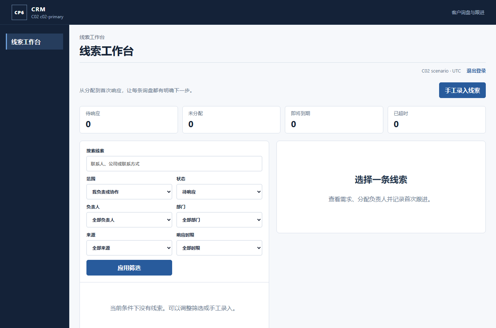

# 2026-09-10 本地 Release 发布检查

用户因 Actions 月额度耗尽，明确授权以本地发布检查替代普通必需检查。Core API / CRM API 的 Release 发布、CRM Next 生产构建和已验证的同源码 Core Vue 产物均已实际启动。**3/3 发布 HTTP/消息场景通过；实际 Chromium 密码登录、PKCE、工作区请求和安全 Cookie 检查通过。** 原始执行来源见 [verification.json](verification.json)，四个组件共 1,060 个发布文件的长度与 SHA-256 见 [publication-manifest.json](publication-manifest.json)。

实际浏览器从 CRM 组织登录进入 Core Vue 密码页，再返回生产 Next 的线索工作台；真实 session 与 workspace 返回 200，浏览器未得到 access token，实际会话 Cookie 为 Secure / HttpOnly / SameSite=Lax。验证没有模拟 API 响应或替换认证处理器。这里只证明隔离本地开发交付，不是 R2/GHCR 生产候选、生产部署或生产性能验收。

## 执行与复用边界

- 第二轮 [summary](attempt-2/summary.json) / [JUnit](attempt-2/junit.xml) 为三个真实场景：两租户源端快照与 Inbox 基线、实际登录和管理请求、角色/权限/部门业务修改通过真实 Dapr/Kafka 到达 CRM。它不重复或冒充此前 13 场景及三类各 100 样本的验收；那些原始证据在 CRM `docs/delivery/c02/real-transport/2026-09-10/`，继续按其逐项来源复用。
- 实际执行源为 Core `9bc1507f65c06546ddc613b9818803f224a445f3`、CRM `e98dd44c0407d4d409d1e018054e32fc212a7f6e`。API 与 Web 分别保留实际构建来源；CRM API 构建后的变化仅为两个 Web 页面入口与记录，API 源码/依赖相同。
- Core API 的四次编译内存不足记录保留在本地审计日志；第五次使用一个处理器、6 GiB 堆上限完成 Release 编译。此前同源码分析和自动化结果复用，本次发布命令不重复运行分析器。编译器仍输出一个原有 CS1998 警告，没有改仓库分析规则或测试设置。
- CRM API 一次发布通过；CRM Web 首次生产构建的页面参数错误通过两个无参数包装入口修复，第二次构建连同 TypeScript 检查通过。Core Vue 的源码及依赖 Git 子树完全相同，原包直接复用；其原 `release.json` 的 `0.0.0-dev / unknown` 保留，不改写成新构建或生产身份。
- 第一轮 [运行失败](attempt-1/summary.json) 是本地预览代理漏转发 `/internal/crm/identity/`，返回页面而非读取 API；两个租户均记录 `C02_RECONCILIATION_RESPONSE_INVALID`。[自有资源清理成功](attempt-1/cleanup.json)。仅修复隔离代理后重跑，应用产物没有重建。
- 首轮 [浏览器检查失败](attempt-2/browser-summary.json) 是检查脚本误要求主区域包含英文 CRM；实际界面已显示“线索工作台”。按实际页面标题检查后，[第二轮浏览器结果](attempt-2/browser-summary-attempt-2.json)通过，未修改应用界面或登录行为。
- 第二轮环境保留给 owner 本机检查，[ready](attempt-2/ready.json)记录实际入口。四个独立数据库、专属 Compose 项目和进程仍属于该预览；当前不宣称已清理。停止文件到达后，入口会核对进程创建时间并只清理自己的数据库与 Compose 项目。原 `cp6`/`cp6-dev` 环境未被替换。

## 复现

[精确检查入口源码包](publication-harness.zip)基于同一 CRM C02 验收入口，显式改为执行已发布 API，增加 HTTPS Vue 静态代理及生产 Next 服务器。包不含应用二进制、证书、密钥、连接串或登录凭据；解压至 Git 外，使用已安装的 .NET 8.0.424 / 8.0.30 和 Node 22.22.0。

1. 对上述提交准备 `core-api`、`crm-api`、`core-web`、`crm-web` 四个目录及锁定 Node 依赖，按发布 manifest 核对文件；API 使用 Release。Core/CRM 源码与依赖已受审查，源码无变化时复用已有结果。
2. 用 CRM 原 `NuGet.config` 恢复 `PublishedSmoke.csproj`，传入 `CrmRepositoryRoot`；编译检查入口时设置 `BuildProjectReferences=false`，复用已生成的 CRM Release 依赖。保留 Core 的已生成 identity fixture。
3. 私下提供 `CP6_C02_TEST_SQL` 和已受信任的 localhost PFX 配置（`path` / `password`），运行 `invoke-published-smoke.ps1`，显式传入 CoreRoot、CrmRoot、PublishRoot、NodeCommand、CertificateConfig、PrivateParent、全新 EvidencePath 与 DotnetCommand。默认只执行这三个场景；`-KeepRunning` 会保留预览，私有 `stop-preview` 文件触发自有资源清理。
4. 对私有 run manifest 执行 `node check-published-browser.cjs <manifest> <fresh-attempt-number>`。正常证书验证始终启用；预览服务只监听 loopback，BFF 客户端地址由本地服务器根据真实 socket 覆盖，用户输入不能替换它。

外部运行状态文件和凭据只留在本地受限目录，不上传 Git。GitHub Actions 仍未运行；本地发布文件不能冒充 Azure/GitHub 成功 Artifact。正式生产门禁继续适用。
