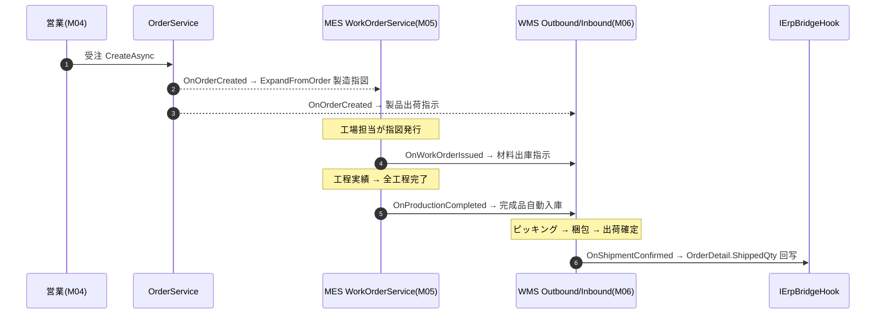

# CP6 系统总览说明手册

> **文档性质**：模块手册集的总览（导航 + 全景）。各模块的细节见同目录下的分册（01~13），代码路径速查见 `99-模块索引与代码路径对照表.md`。
> **基准快照**：基于仓库分支 `feat/wfs-inbox-core` 的真实代码盘点（2026-06-28）。所有结论来自真实文件，不确定处标注「待确认」。
> **读者**：业务人员看「系统能做什么 / 谁用哪块」，开发人员看「代码在哪 / 怎么连」。

---

## 1. 模块定位

CP6 源于日本某大型纸箱包装企业（Crown Package）核心系统刷新项目，原为 mcframe7 ERP 平台的 Add-on，现重构为**独立 Web 系统**，技术栈现代化（Vue 3 + .NET）。

**业务定位**：面向**纸箱包装行业**的 **ERP / MES / WMS 一体化系统**，并向「完整 ERP + 可售 SaaS」演进。

一句话现状：CP6 已是一套**完整核心制造业 ERP**——

```
販売(MSBB) → 生産(MES) → 在庫物流(WMS) 正向链
        + ERP→MES→WMS 闭环全通（Bridge Hook + IntegrationEvent）
        + 采购 / 财务会计 / OA审批·工作流 / 计划中台MRP
        + PUB权限组织 / SaaS多租户与安全合规 / 5语 i18n
        + Space 3D 空间数字底座（数据模型层已就位，API/UI 建设中）
```

---

## 2. 适用角色

CP6 的角色由 PUB 权限平台（M02）的「角色—菜单—操作—数据范围—字段」体系定义。下表为系统级典型角色及其主要触达模块：

| 角色 | 主要使用模块 | 说明 |
|---|---|---|
| 系统管理员 | M01/M02/M03/M12 | 用户/角色/菜单/字典/多语言/租户/安全配置 |
| 平台超级管理员（PlatformAdmin） | M12 | 跨租户运营：建租户、impersonation、GDPR、跨租户审计（带外标志绕租户过滤） |
| 营业 / 销售员 | M04 | 取引先、見積、御見積、受注、单价订正、未出荷查询 |
| 生产计划员 | M05/M11 | 製造指図、計画ボード、MRP 净需求、达成率 |
| 现场作业员 / 设备管理员 | M05 | 製造実績、品質検査、不良记录、设备/OEE |
| 仓库管理员 / 库管员 | M06/M07 | 入出庫、棚卸、拣货梱包、补充、纸器特化库存、闭环健康看板 |
| 采购员 | M09 | PR/PO、收货、三单匹配、RFQ 比价、外注、对账 |
| 财务人员 / 会计 | M08 | 总账凭证、AP/AR、三大报表、成本、固定资产、银行对账、预算 |
| 审批人 / 发起人 | M10 | OA 审批待办、我的申请、流程追踪、低代码表单/流程设计 |
| 数据/合规审计员 | M02/M12 | 操作日志、字段级审计、安全日志、跨租户访问审计 |

> 注：角色与权限点为**数据驱动**（落 `Sys_Role` / `Sys_RoleAction` / `Sys_RoleMenu` 等表 + 种子 SQL），不同部署的实际角色以租户配置为准。本表为典型划分，「待确认」具体租户清单。

---

## 3. 功能范围（模块全景清单）

> 完成度判定：四件套（Controller+Service+Entity+前端 view）俱全且文档标注已 QA = **✅ 已实现**；核心已落地但某子能力未完工 = **🟡 部分实现**；仅实体/迁移无 API/UI = **🟠 仅数据模型**；仅 spec/plan = **📝 仅文档**。

| 编号 | 模块 | 业务域(folder) | 后端 Controller（代表） | 主要实体 | 前端 | 完成度 | 对应手册 |
|---|---|---|---|---|---|---|---|
| M01 | 登录认证与账户安全 | Sys | `Sys/Auth`、`TwoFactorPolicy`、`SsoConfig`、`SecurityLog` | `Sys_User`、`Sys_RefreshToken`、`Sys_PasswordHistory`、`Sys_SecurityLog` | `LoginView`、`pms/TwoFactor*`、`SsoLanding`、`ChangePassword`、`SecurityLog` | ✅ | 01 |
| M02 | PUB 权限与组织（RBAC 四粒度） | Sys/Pub | `Sys/User`、`Role`、`Menu`、`RolePerm`、`Dept`、`FieldAudit` | `Sys_Role`、`Sys_Menu(Action)`、`Sys_Role{Action,Menu,DataScope,FieldPerm}`、`Sys_Dept`、`Sys_FieldAuditLog` | `pms/User`、`Role`、`Permission`、`RolePerm`、`DataScope`、`FieldPerm`、`DeptTree`、`FieldAudit` | ✅ | 10 |
| M03 | 系统基础资料与公共模组 | Sys/Pub | `Sys/Dict`、`Lang`、`OperLog`、`Dashboard`、`Pub/Seq`、`CodeGen`、`Attachment` | `Sys_DictType/Data`、`Sys_Lang`、`Sys_OperLog`、`Pub_DocSequence`、`Pub_Attachment`、`GenTable/Column` | `pms/Dict`、`Lang`、`OperLog`、`Seq`、`CodeGen`、`dashboard/*` | ✅ | 06 |
| M04 | 销售管理 MSBB / ERP | Erp | `Erp/Order`、`Quotation`、`EstimateCalc`、`Product`、`BusinessPartner`、`SheetUnitPrice`、`PlateMold`、`Fsc`、`Backorder`、`CreditNote`、`FxRate`、`OtdReport`、`OrderTrace` | `Order(Detail/Process/Material)`、`Quotation(Calc/Detail)`、`EstimateCalc`、`ProductMaster`、`CreditNote`、`FxRate`、`PlateMold`、`SheetUnitPrice`、`FscChecklist` | `views/erp/*` | ✅ | 02 |
| M05 | 生产管理 MES | Mes | `Mes/WorkOrder`、`ProductionResult`、`QualityInspection`、`DefectRecord`、`Machine`、`Oee`、`PlanningBoard`、`MesDashboard`、`PlanAchievement`、`WorkCenter`、`ProcessCostRate` | `WorkOrder(Material)`、`ProductionResult`、`QualityInspection(Item)`、`DefectRecord/Category`、`Machine/Downtime`、`OeeDaily`、`InspectionTemplate` | `views/mes/*` | ✅ | 03 |
| M06 | 库存物流 WMS（纸器业特化） | Wms | ~39：`Warehouse/Stock/Inbound*/Outbound*/Shipping/StockTake/Replenish/CrossDock/Kitting/Rma/QcInspection/LotTrace/Expiry/Slotting/Pallet/PaperRoll/Ink/Remnant/PlateMold/SampleStock/Vmi/Carrier/Wcs/Iot/Mobile/MaterialShortage/StockDwell/StockQc/ReportCenter/WmsDashboard` | `Stock/StockTransaction`、`Warehouse/Location`、`Inbound/Outbound*`、`StockTake`、`PaperRoll`、`InkLot`、`Pallet`、`RemnantMaterial`、`KitMaster`、`RmaHeader` 等 ~40 | `views/wms/*` | ✅ | 04 |
| M07 | ERP-MES-WMS 闭环集成 | Integration | `Integration/BridgeHealth` | `IntegrationEvent` + 各域 `*BridgeHook` | `wms/BridgeHealthView` | ✅ | 05 |
| M08 | 财务会计 Fin | Fin | 23：`GlAccount/JournalEntry/TrialBalance/Period/Ap*/Ar*/Payment/Receipt/Cost/Report/CreditControl/Asset*/Bank*/Budget*/CostCenter` | `JournalLine`、`Ap/ArInvoice`、`Ap/ArSettlement`、`Payment/Receipt`、`PostingRule`、`FiscalPeriod`、`BankAccount`、`CostCenter`、`TaxCode` | `views/fin/*`（22） | ✅ | 07 |
| M09 | 采购管理 Pur | Pur | `Pur/PurchaseOrder`、`PurchaseRequest`、`GoodsReceipt`、`ThreeWayMatch`、`Rfq`、`Subcontract`、`SupplierPrice`、`PurReconcile` | `PurchaseOrder(Line)`、`PurchaseRequest(Line)`、`GoodsReceipt`、`ThreeWayMatch/MatchTolerance`、`Rfq(Line/Quote/Supplier)`、`PoConsignMaterial`、`SupplierPrice` | `views/pur/*`（8） | ✅ | 08 |
| M10 | OA 审批 / WFS 工作流引擎 | Wf | `Wf/Flow`、`Form`、`Task`、`Approval`、`AdvancedFlow` | `Wf_FlowDef/FormDef/FlowData/FormData/FlowHistory/ApprovalBinding/FlowDelegate` + `Wf_FlowToken/FlowInstance/FlowTask/FlowFormTo/FlowCc` | `views/wf/*`（TodoCenter、MyApplications、FlowTrace、DynamicForm、designer/） | 🟡 | 09 |
| M11 | 计划中台 MRP | Plan | `Plan/Mrp`、`ItemPlanningPolicy` | `Plan_MrpRun`、`Plan_NetRequirement`、`Plan_PlannedOrder`、`Plan_Pegging`、`Plan_ItemPlanningPolicy` | `views/plan/{MrpBoard,ItemPolicy}` | 🟡 | 11 |
| M12 | SaaS 多租户与安全合规平台 | Platform | `Platform/Tenant`、`PlatformAdmin`、`Impersonation`、`CrossTenantAudit`、`Gdpr` | `Sys_Tenant`、`Sys_TenantSsoConfig`、`Sys_FieldAuditLog`、`Sys_SecurityLog`（行级 `TenantId`） | `views/platform/*`（5） | ✅ | 13 |
| M13 | Space 3D 空间数字底座 | Space | （本分支无） | `Space_Site/Floor/Zone/Aisle/Rack/Location/Template/CodeRule/Marker`（9）+ 迁移 `SpaceP1Init` | （本分支无） | 🟠 | 12 |

> **真实代码盘点（本分支）**：后端 Controller **121** 个、领域实体 **175** 个、前端 view **168** 个、API 封装 ~70 个 ts、单一路由文件 `cp6.web/src/router/index.ts`。

---

## 4. 业务流程（端到端闭环）

CP6 的主干是「受注 → 製造 → 出荷 → 回写」的跨模块闭环，由 4 个 Bridge Hook 驱动：



并行/支撑链：
- **采购链（M09）**：PR → PO → 收货 → 三单匹配 → 自动建 AP（接财务 M08）；外注委托接 WMS 出库 + 财务成本入账。
- **计划链（M11）**：受注/预测 × BOM 展开 − 库存 − 在途 − 在制 → 建议采购/工单。
- **财务链（M08）**：各业务单据 → 自动凭证引擎 → 总账 → 三大报表；AP/AR、固定资产折旧、银行对账、预算管控。
- **审批链（M10）**：业务单据挂 OA 流程（审批绑定 `Wf_ApprovalBinding`）；WFS token 内核驱动顺签/并签/退回。

---

## 5. 技术架构与分层

### 5.1 技术栈

| 层 | 技术 |
|---|---|
| 后端 | ASP.NET Core（TargetFramework `net8.0`；战略文档规划升级 .NET 10）· EF Core + Dapper · SQL Server · JWT · SignalR · Kafka(日志) |
| 前端 | Vue 3 + TypeScript · Element Plus · Pinia · vue-i18n(5 语) · Vite · Playwright |
| 部署 | Docker Compose / K8s / cloudflared 隧道 |

### 5.2 解决方案结构（folder = namespace）

```
D:\CP6\
├── CP6.Entity/   实体层  DomainModels/{Common,Sys,Erp,Mes,Wms,Integration,Fin,Pur,Plan,Wf,Pub,Space} + DTOs
├── CP6.Core/     核心层  Services/<域> + BaseProvider + EFDbContext(CP6Context) + Migrations + Options + Utilities
├── CP6.WebApi/   API层   Controllers/<域> + BackgroundServices + Hubs(SignalR) + Filters + Observability + Program.cs(DI)
├── CP6.Tests/    测试    xUnit + EF Core InMemory
├── cp6.web/      前端    src/{views,api,stores,types,components,composables,i18n,router}/<模块>
└── docs/         文档    00 战略三件套 / CODEMAP / codemap-* / superpowers(specs,plans) / 各模块丛书 / manuals
```

分层依赖（严格单向）：`CP6.WebApi → CP6.Core → CP6.Entity`；`cp6.web ─HTTP/WS→ CP6.WebApi`。

---

## 6. 跨模块联动（Bridge Hook + IntegrationEvent）

闭环联动**只能**通过 `I*BridgeHook` 接口，禁止直接 `using` 对方 Service。共同设计：Best-Effort + 幂等 + `appsettings` 可禁用 + `IntegrationEvent` 持久化。

| 接口 | 触发点 | 目标动作 |
|---|---|---|
| `IMesBridgeHook.OnOrderCreatedAsync` | ERP 受注作成成功后 | MES 自动展开製造指図 |
| `IWmsBridgeHook.OnWorkOrderIssuedAsync` | MES 指図発行后 | WMS 材料出庫指示 |
| `IWmsBridgeHook.OnOrderCreatedAsync` | ERP 受注作成后 | WMS 製品出荷指示 |
| `IWmsBridgeHook.OnProductionCompletedAsync` | MES 全工程完了 | WMS 完成品入庫 |
| `IErpBridgeHook.OnShipmentConfirmedAsync` | WMS 出荷確定后 | ERP 出荷実績回写 |
| `IErpBridgeHook.OnReturnConfirmedAsync` | WMS RMA 確認后 | ERP CreditNote 自动回写 |
| `IOrderCancelBridgeHook.OnOrderCancelledAsync` | ERP 受注取消 | Outbound→WorkOrder 反向级联取消 |

失败可观测：`IntegrationEventRetryWorker` 每 60s 重试 Failed；5 次转 DeadLetter → `IDeadLetterNotifier` 双通道告警（SignalR `WmsHub` + `Sys_OperLog.IsAlert=true`）；健康看板见 M07（`/wms/bridge-health`）。

**禁用切换**：`appsettings.json` 的 `MesBridge:Enabled` / `WmsBridge:Enabled` / `ErpBridge:Enabled` / `OrderCancelBridge:Enabled = false` → DI 注入对应 `NoOp*BridgeHook`，全 hook 回 Skipped。

---

## 7. 全局约定与不变式

新增/改动模块时必须遵守的硬规则（详见 `docs/PROJECT_STRUCTURE.md` §六）：

1. **库存写入唯一入口** — `T_Stock` 严禁直接 `Add`/`Update`，必经 `IStockMovementService.ApplyAsync/MoveAsync`，由其同时写不变日志 `T_StockTransaction`。
2. **采番统一接口** — 业务编号经 `IWmsSequenceService.NextAsync(prefix)` / `IMesSequenceService` / `DocNumber.NextAsync(db,code)`，禁手工拼字符串。
3. **Controller 返回形状** — 所有 API 返回 `{ code:int, message:string, data:T }`，前端 axios 拦截器（`api/http.ts`）统一解包，`code===0` 为成功。
4. **跨模块联动只走 BridgeHook**（见 §6）。
5. **i18n 落 DB** — 翻译走 `Sys_Lang`（key + ZhCN/ZhTW/En/Ja/Ko 五列）MERGE 种子，前端 vue-i18n 加载后端 `/api/lang` 输出，禁前端硬编码。
6. **菜单注册** — 新模块路由必须同步 `Sys_Menu` 种子，否则左侧导航不出现。
7. **OperLogFilter 全局拦截** — 不在 Controller 内重复记录日志。
8. **实体基类链** — `BaseEntity`(审计) → `BaseTenantEntity`(+TenantId 行级隔离) → `BaseBizEntity`(+IsDeleted 软删 + `[Timestamp]` RowVersion 乐观锁)；业务主键是字符串编号，`Id`(Guid) 仅物理 PK。
9. **乐观锁 409** — 并发冲突统一 HTTP 409（`msgId=MSG-W10002`），前端冲突处理器弹「取最新版」对话框。

---

## 8. 权限与菜单体系总览

- **认证（M01）**：JWT Bearer（cookie `cp6_at`），刷新令牌、BCrypt 密码、登录锁定、2FA、SSO(OIDC/SAML)。
- **授权（M02 PUB）**：四粒度后端强校验 = 菜单（`Sys_RoleMenu`）/ 操作点（`Sys_RoleAction` × `Sys_MenuAction`）/ 数据范围（`Sys_RoleDataScope`）/ 字段权限（`Sys_RoleFieldPerm`）。
- **多租户（M12）**：行级 `TenantId` 隔离，`SaveChanges` 自动盖章；平台超管 `IsPlatformAdmin` 带外标志绕租户过滤 + `[RequirePlatformAdmin]` 三道闸。
- **菜单入口**：`Sys_Menu` 树形（`MenuId int` + `ParentId`）；前端 `LayoutView.vue` 渲染左侧导航，`router/index.ts` 动态 import 按需加载。
- **i18n key 命名**：按模块前缀，如销售 `sales.*`（`sales.term.*` 字段 / `sales.btn.*` 按钮 / `sales.list.*` 列表）。

> 部分历史控制器仅 `[Authorize]`（JWT 登录级），细粒度通过菜单/操作点把关（如 `OrderController`）；少数用 `[Authorize(Roles="1,Admin")]`（如 `BusinessPartnerController` 删除）。具体以各模块手册「8. 权限与菜单」为准。

---

## 9. 完成度总表

| 状态 | 模块 |
|---|---|
| ✅ 已实现（全栈 + QA） | M01 登录安全、M02 PUB 权限组织、M03 基础资料、M04 销售、M05 MES、M06 WMS、M07 闭环、M08 财务、M09 采购、M12 SaaS 平台 |
| 🟡 部分实现 | M10 OA/WFS（审批引擎+设计器已上线；WFS token 内核/信箱读模型实体已落地，**电子表单信箱 UI 本分支建设中**）、M11 MRP（A1 净需求已实现；**P2 预测/MPS、P4 CRP 仅文档待编码**） |
| 🟠 仅数据模型 | M13 Space 3D（9 几何实体 + DbSet + 迁移 `SpaceP1Init`；**Controller/Service/3D 前端不在本分支**，据项目记忆在隔离 worktree） |

---

## 10. 手册导航

| 文件 | 模块 | 状态 |
|---|---|---|
| `00-CP6系统总览说明手册.md` | 全局（本文） | — |
| `01-系统登录与权限说明手册.md` | M01 登录认证与账户安全 | ✅ |
| `02-销售管理MSBB说明手册.md` | M04 销售 | ✅（样板本） |
| `03-生产管理MES说明手册.md` | M05 生产 | ✅ |
| `04-库存物流WMS说明手册.md` | M06 库存 | ✅ |
| `05-ERP-MES-WMS闭环说明手册.md` | M07 集成闭环 | ✅ |
| `06-系统基础资料说明手册.md` | M03 基础资料 | ✅ |
| `07-财务会计说明手册.md` | M08 财务 | ✅ |
| `08-采购管理说明手册.md` | M09 采购 | ✅ |
| `09-OA审批说明手册.md` | M10 OA/WFS | 🟡 |
| `10-PUB权限平台说明手册.md` | M02 权限组织 | ✅ |
| `11-计划中台MRP说明手册.md` | M11 MRP | 🟡 |
| `12-Space3D空间底座说明手册.md` | M13 Space 3D | 🟠（数据模型+设计说明） |
| `13-SaaS多租户与安全合规说明手册.md` | M12 SaaS 平台 | ✅ |
| `99-模块索引与代码路径对照表.md` | 全局速查 | — |

---

## 11. 代码路径索引（顶层）

| 关注点 | 路径 |
|---|---|
| 后端 Controller | `CP6.WebApi/Controllers/<域>/` |
| 后端 Service | `CP6.Core/Services/<域>/`（`I{X}Service.cs` + `{X}Service.cs` 成对） |
| DbContext（DbSet/索引/唯一键） | `CP6.Core/EFDbContext/CP6Context.cs` |
| 迁移 | `CP6.Core/Migrations/` |
| 领域实体 | `CP6.Entity/DomainModels/<域>/` |
| DTO | `CP6.Entity/DTOs/<域>/`（部分域 DTO 内联于 Controller/Service） |
| 前端页面 | `cp6.web/src/views/<模块>/` |
| 前端 API 封装 | `cp6.web/src/api/<模块>/*.ts`（统一经 `api/http.ts`） |
| 前端类型 | `cp6.web/src/types/<模块>/` |
| 前端路由 | `cp6.web/src/router/index.ts` |
| i18n | DB `Sys_Lang` + `cp6.web/src/i18n/`（`keys.generated.*`） |
| 测试 | `CP6.Tests/` |
| 代码级实现手册（逐行） | `docs/CODEMAP.md` + `docs/codemap-{erp,mes,wms,fin,pur,wf,pub,plan}/` |

---

## 最后更新来源

- 代码：`CP6.WebApi/Controllers/**`、`CP6.Core/Services/**`、`CP6.Entity/DomainModels/**`、`CP6.Core/EFDbContext/CP6Context.cs`、`CP6.Core/Migrations/20260627105640_SpaceP1Init.cs`、`cp6.web/src/{views,api,router,i18n}/**`
- 文档：`README.md`、`docs/PROJECT_STRUCTURE.md`、`docs/00-功能盘点.md`、`docs/CODEMAP.md`、`docs/codemap-erp/README.md`
- 基准：分支 `feat/wfs-inbox-core`，盘点日 2026-06-28
