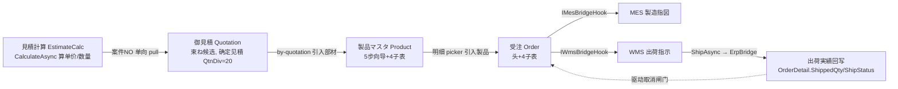
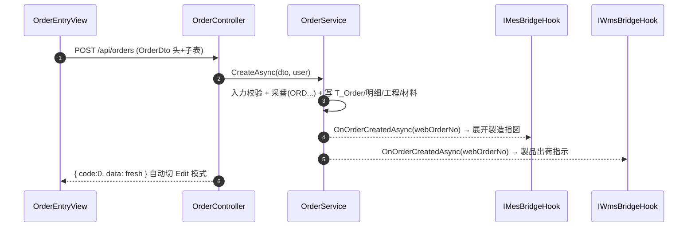

# 销售管理 MSBB 说明手册

> **模块编号**：M04　**业务域**：Erp（`MSBBPA*` 系列）　**完成度**：✅ 已实现
> **基准快照**：分支 `feat/wfs-inbox-core`，2026-06-28。所有路由/字段/错误码均实测于真实代码，不确定处标注「待确认」。
> **配套深读**：本手册是「业务 + 操作 + 接口」视角；逐行源码级实现见 `docs/codemap-erp/`（01 取引先 / 02 見積計算 / 03 御見積 / 04 製品 / 05 受注）。

---

## 1. 模块定位

销售管理（MSBB / 販売管理 PA 系列）是 CP6 的**业务起点**，承载纸箱厂「接单」全过程：从客户与产品主数据，到报价计算、正式报价、产品建档，最终落到**受注（销售订单）**，并作为整个 ERP→MES→WMS 闭环的触发源。

主链（业务流水线）：

```
見積計算 EstimateCalc(PA010) → 御見積 Quotation(PA030) → 製品マスタ Product(PA050)
   → 受注 Order(PA070) → 出荷実績回写(WMS 出荷確定 → ErpBridgeHook)
```

受注一旦创建，自动触发 MES 製造指図展开与 WMS 出荷指示生成（见 §4）。因此本模块在系统中的位置是「**最上游 + 闭环驱动器**」。

---

## 2. 适用角色

| 角色 | 在本模块的职责 |
|---|---|
| 营业 / 销售员 | 录入取引先、做見積計算、出御見積、登记受注、查未出荷、单价订正 |
| 营业主管 | 受注审核/取消决策（半路状态强制确认）、价格订正批量更新 |
| 系统管理员 | 取引先删除（需 `Roles=1,Admin`）、シート単価/版型木型/FSC 等主数据维护 |
| 财务（关联） | 通过受注金额 / CreditNote / 為替（多币种）衔接应收（M08） |

---

## 3. 功能范围

| 功能 | 功能说明 | 前端页面 | 后端接口（路由基址） | 涉及实体 | 状态 |
|---|---|---|---|---|---|
| 取引先マスタ | 客户/发注先/买掛先等多 Tab 主数据 | `/business-partner`、`/business-partner-list` | `api/business-partners` | `BusinessPartner` | ✅ |
| 見積計算書 PA010 | 报价成本计算（计算引擎在后端） | `/estimate-calc`、`/estimate-calc-list` | `api/estimate-calcs` | `EstimateCalc`、`EstimateCalcProcess` | ✅ |
| 御見積書 PA030 | 由見積計算束ね生成正式报价 | `/quotation`、`/quotation-list` | `api/quotations` | `Quotation`、`QuotationCalc`、`QuotationDetail` | ✅ |
| 製品マスタ PA050 | 5 步向导建产品（工程/材料/ロット单价/连产品） | `/product`、`/product-list` | `api/products` | `ProductMaster`、`ProductCoProduct`、`ProductLotPrice` | ✅ |
| 受注 PA070 | 销售订单录入（头+4 子表 + 引入 + 多校验） | `/order`、`/order-list` | `api/orders` | `Order`、`OrderDetail`、`OrderProcess`、`OrderMaterial` | ✅ |
| 受注一覧 PA080 | 检索 + CSV 导出 + 伝票 PDF | `/order-list` | `api/orders/list` | 同上 | ✅ |
| 単価訂正 PA090 | 订正对象检索 + 实时算金额 + 批量更新 | `/order-price-correction` | `api/orders/price-correction/*` | `Order`、`OrderDetail` | ✅ |
| 受注取消 | 探查 + 反向级联取消（Phase 6） | `/order-list`（弹窗 `OrderCancelDialog`） | `POST api/orders/{no}/cancel` | `Order` + Bridge | ✅ |
| 受注済未出荷 | 还没发齐的订单看板 + CSV | Dashboard widget | `api/orders/unshipped/*` | `Order`+WO+Outbound | ✅ |
| 订单追溯 | 受注 → MES/WMS 全链追踪 | `/erp/order-trace` | `api/order-trace` | 跨模块 | ✅ |
| 未出荷/欠品 Backorder | 未交付订单台账 | `/erp/backorder` | `api/backorder` | `Order` | ✅ |
| 信用单 CreditNote | RMA 回写应收调整 | `/erp/credit-note` | `api/credit-note` | `CreditNote` | ✅ |
| 為替レート FxRate | 多币种汇率维护 | `/erp/fx-rate` | `api/erp/fx-rate` | `FxRate` | ✅ |
| OTD 报表 | 准时交付率分析 | `/erp/otd-report` | `api/otd-report` | `Order` | ✅ |
| シート単価 | 13 项复合键决定单价 | `/sheet-unit-price` | `api/sheet-unit-prices` | `SheetUnitPrice` | ✅ |
| 版型・木型 | 印版/木型主数据 | `/plate-mold`、`/plate-mold-list` | `api/plate-molds` | `PlateMold` | ✅ |
| FSC チェック | 环境认证检查表 | `/fsc-checklist` | `api/fsc-checklists` | `FscChecklist` | ✅ |

---

## 4. 业务流程

### 4.1 主链数据接力



**关键连接键**：
- `EstimateCalc.QtnCalcNo`：御見積中间表 `T_QuotationCalc` 只存指针，展示时 JOIN 实时回填。
- `Order.WebOrderNo`：全系统跨模块追踪键（MES `WorkOrder.WebOrderNo`、WMS `OutboundOrder.WebOrderNo` 都靠它回指）。
- `ProductMaster.ProductCd`：受注明细引入製品的键。

### 4.2 受注创建联动



### 4.3 受注取消（Phase 6 反向级联）

```mermaid
flowchart TD
  A[POST /orders/{no}/cancel force=false] --> B{状态机判定}
  B -->|已出荷/已取消/ShipStatus>=5| R[Rejected 拒绝]
  B -->|有半路 WO/Outbound| N[NeedsDecision 返回现状, DB不变]
  B -->|可全自动取消| D[探查结果]
  N -->|营业确认| F[force=true 强制实施]
  F --> O[先取消 Outbound 自动UNRSV → 再取消 WorkOrder → 最后取消 Order头]
  O --> C1[Cancelled 或 PartiallyCancelled]
```

---

## 5. 页面说明

### 5.1 受注入力 `/order`（`views/erp/OrderEntryView.vue`，含 `order/` 多步子组件）

- **用途**：录入/订正/流用/照会/删除一张受注（头 + 明细 + 工程 + 工程备考 + 材料）。
- **操作种别状态机**（顶部单选）：新規 / 訂正(Edit) / 流用(Copy) / 照会(View) / 削除(Delete) → 驱动字段可编辑性、按钮显隐，加载后通常自动切 Edit。
- **5 套引入仕様**（减少手工录入）：
  - 手配NO 检索引入既存受注（`by-haibai-no`）
  - セット製品CD 部材引入（`by-set-product/{cd}`）
  - 製品基本マスタ → 第2画面引入（`lookup-product-master/{cd}`）
  - 製品加工工程/材料マスタ引入（`lookup-product-processes/{cd}`、`lookup-product-materials/{cd}`）
- **主要业务计算/校验**（保存前）：采番（`next-seq`）、isEditable 判定、仕掛チェック（`check-wip`）、与信チェック（`credit-check`）、預り売上数チェック（`consigned-check`）、加工予定日（`lead-time`）、製品区分自动设定（`calc-product-category`）、材料 BOM 展开（`calc-materials`）、客先纳期 vs 合计 LT（`check-delivery-lt`）。
- **保存**：POST `/api/orders`（新規）/ PUT `/api/orders/{no}`（訂正）→ 返回最新 DTO（含 RowVersion）→ 切 Edit。
- **注意事项**：业务主键是 `WebOrderNo`（非 Guid）；并发冲突走乐观锁 409 弹窗；删除为软删除（`IsDeleted=true`）。

### 5.2 受注一覧 `/order-list`（`views/erp/OrderListView.vue`）

- **查询条件**：拠点CD、得意先CD（FROM/TO）、受注区分、受注日（FROM/TO）、客先纳期（FROM/TO）；
  高级检索（折叠）：手配NO1（FROM/TO）、注文書NO、製品CD、顧客品名、シート段、原紙CD、印刷CD、エンボスCD、メーカCD、運送会社、勾选「預り売上のみ」「mc 未転送のみ」。
- **表格字段**（部分）：行No、得意先CD/名、担当、注文書NO、手配NO1、不適合手配NO、注文NO(mc)、受注日、客先納期、製品CD、CP品名/構成、段、表/中/裏構成、数量、単位、個別単価、セット単価、受注金額、通貨(@汇率)、預り売上。
- **按钮**：检索、クリア、CSV 出力（`list/export.csv`，UTF-8）。列支持 `sortable="custom"` 服务端排序。
- **校验**：日期/数量/金额 FROM≤TO（`E10036`）。
- **注意事项**：移动端有简化卡片视图（`isMobile` 分支）。

### 5.3 単価訂正 `/order-price-correction`（`views/erp/OrderPriceCorrectionView.vue`）

- **用途**：批量修正受注明细单价。检索对象 → 改个别/套单价 → 实时算金额 → 批量提交。
- **接口**：检索 `price-correction/list`；实时算金额 `price-correction/{no}/{detailNo}/amount`；批量更新 `PUT price-correction/batch`。
- **注意事项**：批量更新带乐观锁，冲突返回 409（`MSG-W10002`）。

### 5.4 其余页面（取引先 / 見積 / 御見積 / 製品 / 単価 / 版型 / FSC）

> 这些页面共享同一套地基（操作种别状态机、采番、乐观锁、軟删、子表全删全插）。详细逐页源码见 `docs/codemap-erp/01~04`。
- **取引先 `/business-partner`**：多 Tab（基本/得意先/仕入先/買掛/支払…）；删除需 `Roles=1,Admin`。
- **見積計算 `/estimate-calc`**：计算只在后端 `CalculateAsync`；前端不算公式。
- **御見積 `/quotation`**：从見積計算单向 pull 候选，勾「使用✓」复制展示字段；確定登録要求 `QtnDiv=20`（決定見積）。
- **製品 `/product`**：5 页向导 + 子表全删全插 + 乐观锁专用冲突弹窗（`useProductConflictHandler`）。

---

## 6. 接口说明

> Controller 基类 `LocalizedControllerBase`（多语言 + FROM≤TO 校验 helper）；统一返回 `{ code, message, data }`；权限默认 `[Authorize]`（JWT 登录级），细粒度由菜单/操作点把关。

### 6.1 `OrderController`（`Controllers/Erp/OrderController.cs`，`[Route("api/orders")]`）

| 路由 | 方法 | 请求 | 返回 | 场景 |
|---|---|---|---|---|
| `next-seq` | GET | — | `{ sequence }` | 新规采番 |
| `by-haibai-no` | GET | `no1/no2/no3` | `OrderDto` | 手配NO 引入既存受注 |
| `by-set-product/{cd}` | GET | path cd | `OrderDetailDto[]` | セット製品部材引入 |
| `lookup-product-master/{cd}` | GET | path cd | `OrderDetailDto` | 製品マスタ → 第2画面 |
| `lookup-product-processes/{cd}` | GET | path cd | `OrderProcessDto[]` | 加工工程引入 |
| `lookup-product-materials/{cd}` | GET | path cd | `OrderMaterialDto[]` | 加工材料引入 |
| `calc-is-editable` | GET | `orderType,catBig,productCd` | `IsEditableResultDto` | 可编辑判定 |
| `check-wip` | GET | `webOrderNo,detailNo` | `OrderWipCheckResultDto` | 仕掛チェック |
| `credit-check` | GET | `customerCd,amount` | `CreditCheckResultDto` | 与信チェック |
| `consigned-check` | GET | `webOrderNo,detailNo,qty` | `{ ok }` | 預り売上数チェック |
| `lead-time` | POST | `LeadTimeRequestDto` | `string[]` 日付 | 加工予定日计算 |
| `calc-product-category` | POST | `CalcProductCategoryRequest` | `{ catBig,catMid,catSml }` | 製品区分自动设定 |
| `calc-materials` | POST | `CalcMaterialsRequest` | 材料行 | BOM 展开 |
| `check-delivery-lt` | GET | `productCd,orderDate,deliveryDate` | `{ ok,ltSumDays,message }` | 纳期 vs LT |
| `list` | GET | `OrderQueryDto` | `{ rows,total }` | 受注一覧检索 |
| `list/export.csv` | GET | `OrderQueryDto` | CSV file | 一覧 CSV |
| `report` | POST | `ReportRequest{Keys}` | file | 受注伝票 PDF（简易 txt） |
| `price-correction/list` | GET | `OrderPriceCorrectionQueryDto` | `{ rows,total }` | 订正对象检索 |
| `price-correction/{no}/{detailNo}/amount` | GET | `indPrice,setPrice` | `{ amount }` | 实时算金额 |
| `price-correction/batch` | PUT | `OrderPriceCorrectionBatchUpdateDto` | 结果 | 批量更新（409 乐观锁） |
| `{webOrderNo}` | GET | `includeDeleted?` | `OrderDto` | 受注详细 |
| `（根）` | POST | `OrderDto` | `OrderDto` | 受注登録（触发 Bridge） |
| `{webOrderNo}` | PUT | `OrderDto` | `OrderDto` | 受注訂正（404/409/400） |
| `{webOrderNo}` | DELETE | `rowVersion?` | — | 軟删除（404/409） |
| `{webOrderNo}/cancel` | POST | `OrderCancelRequest{Reason,Force}` | `OrderCancelResult` | 受注取消（探查/实施） |

> **路由顺序坑**：`{webOrderNo}` 这类通配路由放在文件最后，否则会吞掉 `list` / `next-seq` 等具名路由。

### 6.2 其他 ERP Controller 路由基址

| Controller | 路由基址 | 权限 |
|---|---|---|
| `BusinessPartnerController` | `api/business-partners` | `[Authorize]`；删除 `Roles=1,Admin` |
| `EstimateCalcController` | `api/estimate-calcs` | `[Authorize]` |
| `QuotationController` | `api/quotations` | `[Authorize]` |
| `ProductController` | `api/products` | `[Authorize]` |
| `SheetUnitPriceController` | `api/sheet-unit-prices` | `[Authorize]` |
| `PlateMoldController` | `api/plate-molds` | `[Authorize]` |
| `FscChecklistController` | `api/fsc-checklists` | `[Authorize]` |
| `MasterDataController` | `api/master` | `[Authorize]` |
| `BackorderController` | `api/backorder` | `[Authorize]` |
| `CreditNoteController` | `api/credit-note` | `[Authorize]` |
| `FxRateController` | `api/erp/fx-rate` | `[Authorize]` |
| `OrderTraceController` | `api/order-trace` | `[Authorize]` |
| `OtdReportController` | `api/otd-report` | `[Authorize]` |
| `UnshippedOrderController` | `api/orders/unshipped` | `[Authorize]` |

---

## 7. 数据模型

核心实体 `Order`（表 `T_Order`，DbSet 见 `CP6Context`）：

| 字段 | 含义 | 关系/约定 |
|---|---|---|
| `WebOrderNo` | Web受注NO（业务 PK，采番 `ORD...`） | 跨模块追踪键 |
| `CustomerCd` | 得意先コード | → `BusinessPartner` |
| `OrderType` | 受注区分（加工製品/シート/原紙/購買品…） | 汎用マスタ |
| `OrderDate` / `CustomerDeliveryDate` | 受注日 / 客先納期 | |
| `Quantity` | 伝票合计数量 `decimal(21,8)` | |
| `SalesPriceDiv` | 売価区分 1=个别 / 2=套单价 | |
| `CurrencyCd` / `FxRate` | 受注通貨 / 冻结汇率（JPY=1.0） | 多币种 Gap4.3 |
| `McOrderNo` / `Status` / `McTransferFlg` | mcframe7 连携（0=未转送/9=转送済） | |
| `ShipStatus` / `ActualShipDate` | 出荷状态(0/5/9) / 实出荷日 | WMS 回写（Phase4） |
| `OrderStatus` | 生命周期（CONFIRMED/IN_PRODUCTION/SHIPPED/CANCELLED/PARTIALLY_CANCELLED） | 与 `Status` 独立轴（Phase6） |
| `CancelledAt` / `CancelReason` | 取消时刻 / 理由（必填，审计） | |
| `Details` | 导航：`List<OrderDetail>` | 1→多 |

继承链：`Order : BaseBizEntity`（→ `BaseTenantEntity` → `BaseEntity`）= `Id`(Guid PK) + 审计字段 + `TenantId` + `IsDeleted` + `[Timestamp] RowVersion`。

关联实体：`OrderDetail`（明细）、`OrderProcess`（工程予定）、`OrderProcessNote`（工程备考）、`OrderMaterial`（材料）。常量类 `OrderLifecycleStatus`、`FxConstants.BaseCurrency`。

---

## 8. 权限与菜单

- **菜单入口**：受注相关菜单经 `Sys_Menu` 种子注入；路由 `/order`、`/order-list`、`/order-price-correction`、`/erp/order-trace` 等（`router/index.ts`）。
- **权限点**：`OrderController` 仅 `[Authorize]`（JWT 登录级），可见性/操作由 PUB 菜单与操作点把关；`BusinessPartnerController` 删除限 `Roles=1,Admin`。
- **i18n key**（前端，`sales.*` 命名空间，落 DB `Sys_Lang`）：
  - 字段：`sales.term.base/customer/orderType/orderDate/deliveryDate/haibaiNo/orderSheet/productCd/staff/bpName`
  - 按钮：`sales.btn.search/clear/exportCsv`
  - 列表/区段：`sales.list.no/totalCount`、`sales.section.advSearch`、`sales.order.consignedSale/mcUntransferred`
  - 部分历史标签直接以日文/中文键回退（如 `t('注文書NO')`），「待确认」是否已全部归一到 key。

---

## 9. 异常与边界

| 场景 | 行为 | 错误码 |
|---|---|---|
| 必填缺失（得意先 CD 等） | Service 抛 `InvalidOperationException` → Controller catch → 400 平文日文 | 平文（无码） |
| 检索无结果 | 404 | `E10008` |
| 明细为空 / 件数上限 | 400 | `E10009` / `E10013` |
| FROM > TO（日期/数量/金额） | 400 | `E10036` |
| 复制（流用）超上限 | 400 | `E10107` |
| 并发修改（乐观锁） | 409，前端弹「取最新版」 | `MSG-W10002`（亦见 `W10002`/`E10034`，语义同） |
| 受注取消状态机拒绝（已出荷/已取消） | 状态机 Rejected | `PA-MSG-CANCEL-001/002/003`、不存在 `404` |
| 取消半路状态 | 返回 `NeedsDecision`，需 force=true 二次确认 | — |
| 取消理由为空 | 400 | 必填校验 |

> **错误码体系说明（重要）**：本主线错误码**非统一前缀**，为历史分层叠加：`E10xxx`（取引先/受注列表/订正）、`MSG-xxx`（見積計算/御見積）、`MSG-W10002`（全功能通用乐观锁）、`PA-MSG-CANCEL-xxx`（取消状态机）、平文日文异常（受注入力校验）。注意 `E-PA-xxx` 前缀在主线**不存在**；製品/取引先前端注释里的部分码（`E10007/W20011/MSG-018` 等）只是注释，非真 i18n 键。详见 `docs/codemap-erp/README.md` §0.8。

边界：业务删除恒为软删除；查询统一 `.Where(x=>!x.IsDeleted)` 起手；多租户行级 `TenantId` 自动隔离。

---

## 10. 操作示例

**场景：创建一张加工製品受注并触发后段闭环**

1. 进入「受注入力」`/order`，操作种别选「新規」，点采番获取 `WebOrderNo`（`ORD...`）。
2. 录入头信息：得意先CD（触发与信チェック）、受注区分=加工製品、受注日、客先納期、通貨（默认 JPY）。
3. 明细：用「製品マスタ引入」按製品CD 拉入产品（自动带工程/材料/区分），或手配NO 引入既存受注复制。
4. 系统自动算：製品区分（`calc-product-category`）、材料 BOM（`calc-materials`）、加工予定日（`lead-time`）、纳期 vs LT（`check-delivery-lt`）。
5. 点「保存」→ POST `/api/orders` → 成功返回最新 DTO，页面切 Edit。
6. 后台自动联动：MES 展开「製造指図」、WMS 生成「製品出荷指示」（Bridge Hook，可在 `appsettings` 关停）。
7. 后续：MES 完工 → WMS 入庫 → 拣货梱包 → **出荷確定**，`ErpBridgeHook` 把 `ShippedQty/ShipStatus` 回写到本受注（在 `/erp/order-trace` 可看全链状态）。

**场景：取消一张半路订单**

1. 在 `/order-list` 选中订单 → 取消（`OrderCancelDialog`），输入理由，先以 force=false 探查。
2. 若返回 `NeedsDecision`（已有 WO/Outbound 着手）→ 弹半路状态清单 → 营业确认。
3. force=true 实施 → 先取消 Outbound（自动 UNRSV 解锁库存）→ 再取消 WorkOrder → 最后取消 Order 头 → 结果 `Cancelled` 或 `PartiallyCancelled`。

---

## 11. 代码路径索引

| 类别 | 路径 |
|---|---|
| 前端页面 | `cp6.web/src/views/erp/OrderEntryView.vue`、`OrderListView.vue`、`OrderPriceCorrectionView.vue`、`OrderCancelDialog.vue`、`OrderTraceView.vue`、`BackorderListView.vue`、`CreditNoteListView.vue`、`FxRateView.vue`、`OtdReportView.vue`、`QuotationView.vue`、`EstimateCalcView.vue`、`ProductMasterListView.vue`、`BusinessPartnerView.vue`、`SheetUnitPriceView.vue`、`PlateMoldView.vue`、`FscChecklistView.vue`、`erp/order/`·`erp/estimate/`·`erp/product/`·`erp/bp/`（多步子组件） |
| API 封装 | `cp6.web/src/api/erp/order.ts`、`quotation.ts`、`estimateCalc.ts`、`product.ts`、`businessPartner.ts`、`sheetUnitPrice.ts`、`plateMold.ts`、`fsc.ts`、`backorder.ts`、`creditNote.ts`、`fxRate.ts`、`orderTrace.ts`、`otdReport.ts`、`master.ts`（统一经 `api/http.ts`） |
| 类型定义 | `cp6.web/src/types/erp/order.ts`（及同目录其他 erp 类型） |
| 后端 Controller | `CP6.WebApi/Controllers/Erp/OrderController.cs` 等 15 个；基类 `Controllers/LocalizedControllerBase.cs` |
| Service | `CP6.Core/Services/Erp/*`（`IOrderService`/`OrderService` 等）；采番 `Services/Common/DocNumber.cs` |
| Entity | `CP6.Entity/DomainModels/Erp/Order.cs`、`OrderDetail.cs`、`OrderProcess.cs`、`OrderProcessNote.cs`、`OrderMaterial.cs`、`Quotation*.cs`、`EstimateCalc*.cs`、`ProductMaster.cs`、`CreditNote.cs`、`FxRate.cs`、`PlateMold.cs`、`SheetUnitPrice.cs`、`FscChecklist.cs` |
| DTO | `CP6.Entity/DTOs/Erp/*`（`OrderDto`/`OrderDetailDto`/`OrderQueryDto`/`OrderPriceCorrection*Dto` 等） |
| DbContext / 迁移 | `CP6.Core/EFDbContext/CP6Context.cs`、`CP6.Core/Migrations/` |
| 跨模块 Hook | `CP6.Core/Services/Mes/MesBridgeHook.cs`、`Wms/ErpBridgeHook.cs`、`Wms/WmsBridgeHook.cs` |
| 测试 | `CP6.Tests/`（ERP/受注/Bridge 相关用例）「待确认」具体文件名 |
| 逐行源码手册 | `docs/codemap-erp/05-受注-order.md`（及 01~04） |

---

## 最后更新来源

- 代码：`CP6.WebApi/Controllers/Erp/OrderController.cs`、`CP6.Entity/DomainModels/Erp/Order.cs`、`cp6.web/src/api/erp/order.ts`、`cp6.web/src/views/erp/OrderListView.vue`、`cp6.web/src/router/index.ts`、`CP6.WebApi/Controllers/Erp/*`（路由 grep）
- 文档：`docs/codemap-erp/README.md`、`docs/codemap-erp/05-受注-order.md`、`docs/PROJECT_STRUCTURE.md`（§4.2 ERP 清单）
- 基准：分支 `feat/wfs-inbox-core`，盘点日 2026-06-28
