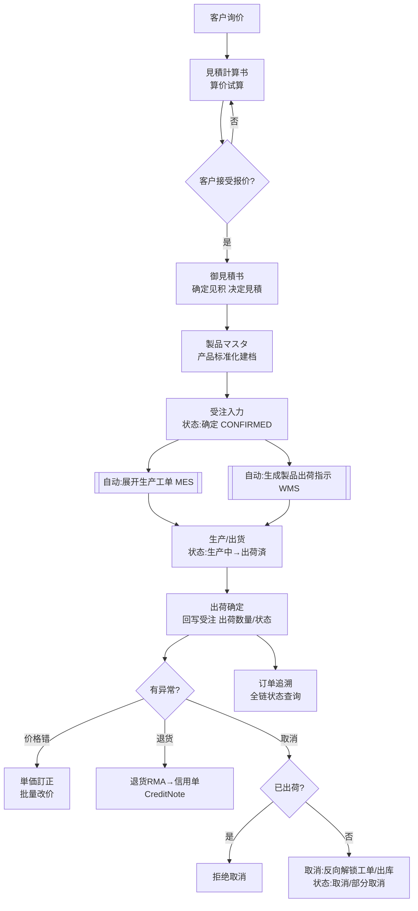
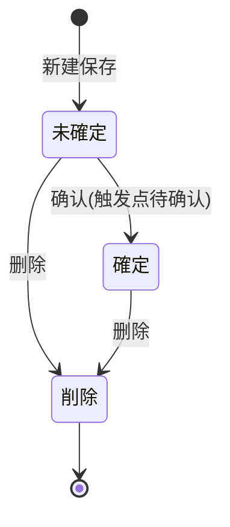
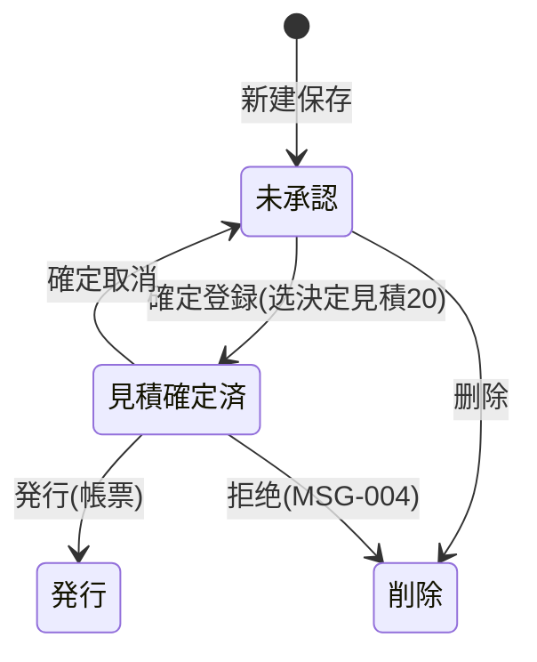
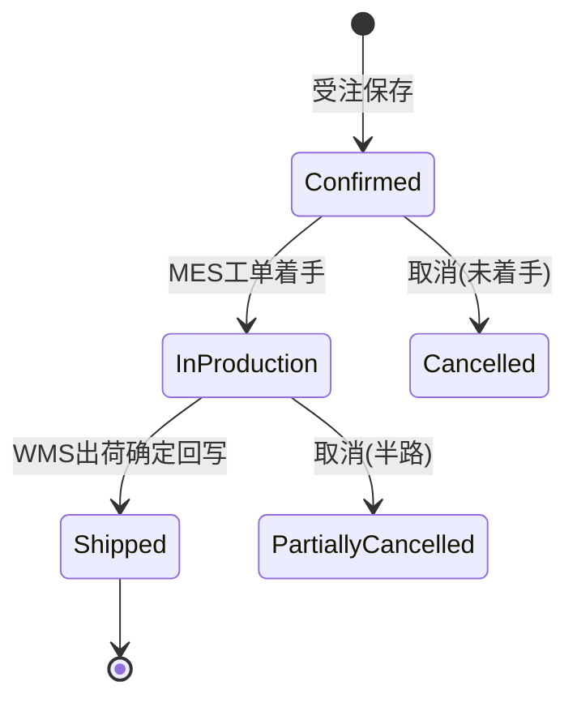
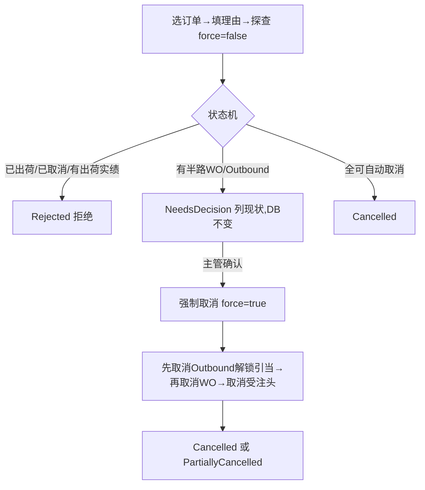

# 销售管理 MSBB 最详细用户操作培训手册

> **模块编号**：M04　**业务域**：Erp（`MSBBPA*` 系列）　**完成度**：✅ 已实现
> **文档定位**：业务用户培训 + 测试用例设计依据 + 开发自测对照 + UAT 验收基线。**面向业务与测试人员**，不写代码实现细节。
> **基准快照**：分支 `feat/wfs-inbox-core`，2026-06-28。所有页面/字段/按钮/状态/错误码均实测于真实代码；查不到的标 `待业务确认` / `代码未发现` / `仅设计文档`。
> **本册覆盖范围（核心主链 10 页）**：見積計算書、見積計算一覧、御見積書、御見積一覧、製品マスタ、製品マスタ一覧、受注入力、受注一覧、単価訂正、注文追溯。销售模块其余页面（取引先、信用单、為替、OTD、Backorder、シート単価、版型木型、FSC）见文末 §待补清单。
> **配套**：逐行源码级实现见 `docs/codemap-erp/`；全模块页面索引见 `docs/manuals/user-training/00-用户操作手册页面盘点表.md`。

---

## 0. 本手册使用的培训样例数据

> 以下为**培训样例数据**（标注「培训样例」= 非系统内置，需在测试环境预置主数据；带"系统采番"的编号由系统自动生成，下面给的是示例格式）。本手册所有页面操作步骤、SOP、测试用例尽量沿用这一套数据，便于培训讲解一致、测试用例可复用。

| 数据项 | 培训样例值 | 来源/说明 |
|---|---|---|
| 客户代码 / 名称 | `C0001` / A社（株式会社A） | 培训样例，须先在「取引先マスタ」建档 |
| 报价/受注据点 | `BASE01` 本社 | 培训样例，下拉来源 `masterApi.getBases()` |
| 担当者 | `STAFF01` 山田 | 培训样例，随据点联动 |
| 产品名称 | A社向け 5号 BC楞 4色印刷箱 | 培训样例 |
| 楞型（シート・フルート） | `BC` | 汎用マスタ `SheetFlute` |
| 原紙（表/中/裏） | `K280` / 中芯 / `K210` | 汎用マスタ `Paper` |
| 印刷（表） | 4色オフセット | 汎用マスタ `M014` |
| 最終工程 | 製函 | 汎用マスタ `M038` |
| 数量阶梯 | 1000 / 3000 / 5000 / 10000 | 培训样例（見積数量1~8） |
| 单位 | 枚 | 汎用マスタ `Unit` |
| 報価単価（@5000） | ¥120/枚（確定単価示例） | 培训样例（实际由计算引擎算出） |
| 客先納期 | 2026-07-10 | 培训样例 |
| 見積計算書No | `EMC2026070001-01`（系统采番，前缀 EMC） | 系统采番 |
| 御見積書No | `QTN2026070001-01`（系统采番，前缀 QTN） | 系统采番 |
| 製品CD | `PRD2026070001`（系统采番，前缀 PRD） | 系统采番 |
| Web受注NO | `WO20260701000001`（系统采番，前缀 ORD/WO） | 系统采番 |
| 手配NO1 | 系统采番（明细级） | 系统采番 |
| 关联 MES 製造指図 | 受注保存后自动展开（编号系统采番） | Bridge 自动 |
| 关联 WMS 製品出荷指示 | 受注保存后自动生成（编号系统采番） | Bridge 自动 |
| 出荷状态 ShipStatus | 0 未出荷 →（出荷确定）→ 9 出荷済 | 出荷回写 |
| 外币场景客户 | `C0002` / B社，币种 `USD` @150（培训样例汇率） | 用于 5.x 外币/汇率冻结场景 |

> ⚠️ 培训样例中除"系统采番"项外，其余主数据（客户/产品/原紙/印刷/工程/汇率）须**先在对应主数据页建档**，否则页面下拉为空、引入失败。各页面"业务前置检查清单"会再次提示。

---

## 1. 模块业务定位

**销售管理（MSBB / 販売管理）是 CP6 的业务起点和"订单源头"。** 纸箱厂的一切生产、采购、出货、收款，都从一张**受注（销售订单）**开始；而受注之前，要先经过"算价 → 报价 → 产品建档"的准备链路。

- **解决什么业务问题**：把"客户要做一款纸箱、要多少钱、做不做得出、按什么工艺做、最后接多少单"这件事，从询价算价、正式报价、产品标准化建档，一直管到正式接单与后续追踪。
- **为什么需要**：纸箱是**按图定制**产品，每款箱型的材质、楞型、印刷、刀模、尺寸都不同，价格随数量阶梯变化。没有标准的算价/报价/建档流程，就会报价混乱、成本算不准、接单后生产无依据。
- **在 CP6 整体流程中的位置**：最上游 + **闭环驱动器**。受注一旦成立，系统自动驱动下游。

| 维度 | 内容 |
|---|---|
| 上游模块 | 取引先主数据（客户/供应商）、シート単価/版型木型/FSC 等主数据；客户询价（线下） |
| 本模块主链 | 見積計算（算价）→ 御見積（报价）→ 製品マスタ（产品建档）→ 受注（接单）→ 单价订正 / 订单追溯 / 取消 |
| 下游模块 | **MES 生产**（受注创建自动展开製造指図）、**WMS 物流**（受注创建自动生成製品出荷指示；出荷确定回写受注）、**财务**（受注金额→应收；退货→信用单 CreditNote）、**计划 MRP**（受注作为需求来源） |
| 数据影响面 | 影响：生产工单、出库/出荷、库存引当、应收账款、准时交付率(OTD)、各类销售报表；取消订单会反向解锁工单与出库 |

---

## 2. 适用角色与职责

| 角色 | 主要职责 | 可操作页面 | 常用功能 | 不能随意操作的内容 | 备注 |
|---|---|---|---|---|---|
| 销售人员（营业） | 算价、报价、建产品、录入受注、查未出荷 | 見積計算、御見積、製品、受注入力、受注一覧、订单追溯 | 新建/编辑/复制/查询/导出 | 已出荷订单的取消、他人订单的单价订正（视权限） | 主力用户 |
| 销售主管 | 审核报价与受注、单价订正、取消决策 | 単価訂正、受注一覧（取消）、御見積 | 批量改价、取消半路订单确认 | 跨部门数据（视数据范围权限） | — |
| 主数据维护员 | 维护产品、取引先、シート単价、版型 | 製品、取引先、シート単价、版型木型 | 主数据 CRUD | 取引先删除需管理员角色 | — |
| 财务人员 | 关注受注金额、信用单、汇率 | 信用单、為替、订单追溯（只读） | 查询、汇率维护 | 受注业务数据修改 | 跨模块只读为主 |
| 系统管理员 | 取引先删除、权限/菜单配置 | 取引先（删除）、PUB 权限页 | 删除、授权 | — | 取引先删除限角色 `1,Admin` |

> 角色与权限为**数据驱动**（PUB 四粒度），上表为业务典型划分；具体某用户能否进入某页/点某按钮，以租户的角色配置为准（`待业务确认`）。

---

## 3. 模块完整业务流程

**流程背景**：客户拿来一款纸箱需求 → 销售要先算出成本与报价、出正式报价单、客户确认后把产品标准化建档、最终下达受注，受注驱动生产与出货，出货后回写实绩，全程可追溯，必要时可取消。

**起点**：客户询价（线下/邮件）。
**终点**：受注出荷完了、实绩回写、可对账。
**中间单据/页面**：見積計算書 → 御見積書 →（客户确认）→ 製品マスタ → 受注 →（生产/出货）→ 出荷实绩回写 →（异常）单价订正 / 取消 / 退货信用单。
**参与角色**：销售人员、销售主管、（下游）生产计划员、库管员、财务。
**状态变化**：見積（未確定→確定）、受注 `OrderStatus`（确定 CONFIRMED→生产中 IN_PRODUCTION→出荷済 SHIPPED；或 取消 CANCELLED/部分取消 PARTIALLY_CANCELLED）、出荷状态 `ShipStatus`（0 未出荷→5 一部→9 出荷済）。
**对下游影响**：受注创建即触发 MES 工单展开 + WMS 出荷指示；取消则反向解锁。

---

## 4. 模块菜单与页面总览

| 序号 | 菜单路径(待确认) | 页面名称 | 页面用途 | 页面类型 | 适用角色 | 主要操作 | 当前状态 | 影响下游 |
|---|---|---|---|---|---|---|---|---|
| 1 | 销售管理→見積計算書 | 見積計算書 | 报价算价(3步向导) | 业务执行/表单 | 销售 | 新建/编辑/复制/计算/保存/删除 | ✅已实现 | 间接(转报价) |
| 2 | 销售管理→見積計算一覧 | 見積計算一覧 | 报价检索台账 | 查询列表页 | 销售 | 查询/导出/打开编辑 | ✅已实现 | 否 |
| 3 | 销售管理→御見積書 | 御見積書 | 正式报价单 | 业务执行/表单 | 销售/主管 | 束ね/确定登录/保存 | ✅已实现 | 间接(转产品) |
| 4 | 销售管理→御見積一覧 | 御見積一覧 | 报价单检索 | 查询列表页 | 销售 | 查询/打开 | ✅已实现 | 否 |
| 5 | 销售管理→製品マスタ | 製品マスタ | 产品建档(5步向导) | 主数据维护页 | 销售/主数据 | 新建/编辑/复制/保存 | ✅已实现 | 是(受注引入) |
| 6 | 销售管理→製品マスタ一覧 | 製品マスタ一覧 | 产品检索 | 查询列表页 | 销售/主数据 | 查询/打开 | ✅已实现 | 否 |
| 7 | 销售管理→受注入力 | 受注入力 | 销售订单录入 | 业务执行页 | 销售 | 采番/引入/校验/保存/取消 | ✅已实现 | **是(驱动MES/WMS)** |
| 8 | 销售管理→受注一覧 | 受注一覧 | 订单检索+取消+导出 | 查询列表页 | 销售/主管 | 查询/CSV/PDF/取消 | ✅已实现 | 是(取消反向解锁) |
| 9 | 销售管理→単価訂正 | 単価訂正 | 批量改明细单价 | 编辑表单(批量) | 主管 | 检索/算金额/批量更新 | ✅已实现 | 影响应收金额 |
| 10 | 销售管理→注文追溯 | 注文追溯 | 受注全链追踪 | 明细查看页 | 销售/客服 | 查询 | ✅已实现 | 否(只读) |
| 11 | 销售管理→取引先マスタ | 取引先マスタ | 客户/供应商主数据(9属性FLG/9Tab) | 主数据维护页 | 主数据/销售 | 事前·本登録/订正/删除(管理者) | ✅已实现 | **是(全单据前置主数据)** |
| 12 | 销售管理→シート単価マスタ | シート単価マスタ | 纸板单价(13复合键,Excel导入) | 主数据维护页 | 价格管理 | Excel导入/参照 | ✅已实现 | **是(見積算价价格源PA130)** |

> 销售模块其余待补页面（取引先一覧、信用单、為替、OTD报表、Backorder、シート単价、版型木型、FSC）见文末 §12 待补清单；**取引先マスタ 已细化至 §5.11**。

---

## 5. 页面详细操作说明

### 5.1 見積計算書

#### 5.1.1 页面业务目的
报价的核心算价页。销售为一款纸箱录入完整基本信息（产品/客户/材质/印刷/尺寸/数量等）+ 加工工程明细，由系统**后端计算引擎**算出見積面積、標準原価、見積単価，并可手改確定単価。这是"这款箱子做出来要多少钱、报客户多少钱"的源头。

- **何时进入**：收到客户询价、需要算价/报价时。
- **解决的业务问题**：把分散的材质/工艺/尺寸/数量阶梯，统一算成可报价的单价。
- **与上下游关系**：上游=取引先/汎用主数据（下拉来源）；下游=御見積（按案件号 pull 本计算结果）。
- **操作后的业务影响**：保存生成一条見積計算書（采番 `EMC...`，主键 `見積計算書No`，格式 `8位主番-2位枝番`）；**计算本身不落库**，只有保存才落库。
- **数据增改删**：新建/编辑/复制时新增或更新該見積計算書及其工程明细（子表）；删除为**逻辑删除**（软删，不可恢复）。

#### 5.1.1a 业务前置检查清单（操作前必看）

| 检查项 | 为什么要检查 | 不满足会怎样 | 处理方法 |
|---|---|---|---|
| 客户(C0001)是否已建档 | 顧客コード手输，需对应取引先 | 后续御見積/受注关联不上 | 先到「取引先マスタ」建客户 |
| 汎用主数据(原紙/印刷/工程/楞型/单位)是否维护 | Step1 下拉来源 | 下拉为空、选不了必填项 | 联系系统管理员维护汎用マスタ |
| 据点/担当是否已配置 | 見積拠点/担当者必填 | 必填卡住保存 | 先维护据点与担当 |
| 是否已知数量阶梯与目标单价 | 算价输入 | 算出单价无意义 | 先与客户/主管确认数量与目标价 |
| 是否复用历史报价 | 决定新建 or 复制 | 重复录入浪费工时 | 相似单走「コピー」 |

#### 5.1.1b 关键字段业务填写口径

| 字段 | 业务填写口径 | 谁提供值 | 常见错误填法 | 填错影响部门 | 保存后可改? | 与下游关系 |
|---|---|---|---|---|---|---|
| 顧客コード `customerCd` | 填客户主数据代码，非客户简称 | 销售/取引先建档 | 手打客户中文名 | 销售/财务(应收) | 可改 | 御見積按客户+案件pull本计算书 |
| 受注数量 `orderQty` | 本次询价总数，必须>0 | 客户询价 | 填0或留空 | 生产/采购(算量错) | 可改 | 影响算价基数 |
| シート・フルート `sheetFlute` | 楞型(如BC)，决定材质成本 | 技术/销售 | 选错楞型 | 生产/采购(成本错) | 可改 | 影响标準原価 |
| 原紙(F) `paperCdF` | 面纸代码 | 技术 | 用停用纸 | 采购/生产 | 可改 | 影响成本 |
| 印刷(F) `printCdF` | 面纸印刷方式 | 技术/销售 | 色数不符 | 生产 | 可改 | 影响成本 |
| 最終工程 `finalMachineProc` | 最后加工工序(如製函) | 技术 | 选错工程 | 生产 | 可改 | 影响工艺/区分自动判定 |
| 数量阶梯 `estimateQtys` | 1~8段报价数量，至少1段>0 | 销售 | 全空 | 销售 | 可改 | 阶梯定价依据 |
| 確定単価 `confirmedUnitPrice` | 最终对客单价，可手改 | 销售/主管 | 误填成本价 | 销售/财务 | 可改(重算不覆盖) | 御見積/製品ロット単価引入 |

#### 5.1.1c 灰按钮 / 不可操作说明

| 按钮 | 何时不可用 | 为什么 | 用户应怎么处理 | 测试关注点 |
|---|---|---|---|---|
| 訂正/コピー/参照/削除(操作种别) | 无采番号时禁用 | 没有可操作的报价对象 | 先「読込」一张已有报价 | 无号时禁用 |
| 下一步 | Step1 必填未通过 | 防带病进入下一步 | 补齐 19 必填 | 校验拦截 |
| 保存 | 参照/削除模式 | 这两模式只读/仅删 | 切到新建/訂正 | 模式按钮显隐 |
| 删除 | 非删除模式/无号 | 只有删除模式可删 | 切删除模式并载入 | — |

#### 5.1.1d 完成后检查点与下游验证

| 操作 | 当前页面检查 | 列表页检查 | 下游/关联检查 | 数据状态检查 | 测试关注点 |
|---|---|---|---|---|---|
| 保存报价 | 顶部出现采番号(EMC...)、转编辑态 | 見積計算一覧能查到 | 御見積书 Tab3 候选里能出现(同客户+案件) | Status=0 未確定 | 采番/列表可见/可被pull |
| 计算 | Step3 显示見積面積/標準原価/見積単価 | — | — | 不落库(仅store) | 计算正确、手改单价保留 |
| 删除 | 提示删除完成、清空 | 列表不再显示 | 已被御見積引用的不应再被pull | IsDeleted=true | 软删 |

#### 5.1.1e 详细操作场景（SOP）

##### 场景一：为新客户新箱型新建报价并算价
- **业务背景**：A社首次询一款 5号 BC楞 4色印刷箱，要 5000 个，销售需算价并出单价。
- **使用数据**：客户 C0001、楞型 BC、原紙 K280、印刷 4色、最終工程 製函、数量阶梯 1000/3000/5000/10000、单位 枚、客先納期 2026-07-10。
- **前置条件**：1) 已登录有销售权限；2) C0001 已在取引先建档；3) 原紙/印刷/工程/单位等汎用主数据已维护。
- **详细操作步骤**：
  1. 进入【销售管理 → 見積計算書】，默认"新建"模式。
  2. 在 Step1 →【商品コード】填产品代码；【見積日】选今天；【見積拠点】选 BASE01；【受注拠点】选 BASE01；【担当者】选 山田。
  3. 【顧客コード】填 `C0001`；【受注形態】选 加工製品。
  4. 【大分類】选 段ボール →【中分類】选对应项（未选大分类时中分类禁用）。
  5. 【顧客品名1】填 "A社向け5号箱"；【受注数量】填 `5000`。
  6. 【親子区分】选项；【シート・フルート】选 `BC`；【原紙(F)】选 `K280`；【印刷(F)】选 4色；【最終工程】选 製函；【形状1】选 A式；【流通区分】选项；【単位】选 枚。
  7. 在【見積数量1~4】分别填 1000/3000/5000/10000。
  8. 点【下一步】→ Step2 →【行追加】添加工程行，选工程CD、填规格/版No。
  9. 点【下一步】→ Step3，系统自动计算，查看【見積単価】；如需对客价不同，手改【確定単価】为 ¥120。
  10. 点【保存】。
- **完成后检查**：
  1. 顶部出现采番号（形如 `EMC2026070001-01`），页面转编辑态；
  2. 到【見積計算一覧】按客户 C0001 查询，能看到该报价；
  3. 計算結果数量段金额与录入一致；
  4. 重新打开该单，確定単価仍为 ¥120（手改未被覆盖）。
- **异常处理**：
  - 提示 MSG-111~129：对应必填项为空 → 按提示补填；
  - 提示 MSG-W10011：数量段全空 → 至少填 1 段 >0；
  - 提示 MSG-W10012：填了刃渡り未填流れ → 补流れ；
  - 下拉为空 → 主数据未维护，联系管理员。
- **测试用例拆分**：正常新建保存(P0)、19必填逐项(P0)、数量=0(P0)、数量段全空(P1)、刃渡り/流れ成对(P1)、计算正确(P0)、手改单价保留(P1)。

##### 场景二：复用历史报价改数量重算
- **业务背景**：A社复单，规格相同仅数量变 8000，不重新从零报价。
- **使用数据**：原報価 `EMC2026070001-01`、新数量 8000。
- **前置条件**：1) 原报价未删除；2) 有流用权限。
- **详细操作步骤**：
  1. 进入【見積計算書】，操作种别选「コピー」（或从一覧点复制）。
  2. 在检索区填原号 `EMC2026070001-01` →【读込】（コピー会自动生成新号）。
  3. Step1 改【見積数量】为 8000。
  4. 点【下一步】到 Step3 →【再計算】。
  5. 查看新【見積単価】，必要时改【確定単価】。
  6. 点【保存】。
- **完成后检查**：1) 生成**新**采番号；2) 原 `EMC2026070001-01` 内容未变；3) 一覧两条都在。
- **异常处理**：无源号时提示 `E10022` → 先填/载入源号。
- **测试用例拆分**：复制生成新号(P1)、源单不被改(P1)、重算正确(P1)。

##### 场景三：参照查看已删除/历史报价
- **业务背景**：核对历史报价细节，仅查看不改。
- **使用数据**：`EMC2026070001-01`。
- **前置条件**：有查看权限。
- **详细操作步骤**：1) 操作种别选「参照」；2) 填号【读込】（参照模式带 includeDeleted=true 可看已删）；3) 逐 Tab 查看，整页只读。
- **完成后检查**：页面只读、无保存/删除按钮、数据完整呈现。
- **异常处理**：号不存在 → 404 `MSG-102`。
- **测试用例拆分**：参照只读(P2)、查看已删单(P2)。

##### 场景四：删除作废报价
- **业务背景**：报错单作废。
- **使用数据**：待删 `EMC2026070099-01`。
- **前置条件**：有删除权限、该单未被御見積引用（业务约定，`待业务确认`是否强校验）。
- **详细操作步骤**：1) 操作种别选「削除」；2) 填号【读込】；3) 点【删除】→确认。
- **完成后检查**：1) 一覧不再显示；2) 物理数据保留(软删)；3) 已被御見積引用的不应能再被 pull（`待业务确认`）。
- **异常处理**：并发 409 `MSG-W10002` → 取最新版。
- **测试用例拆分**：软删(P1)、删后不可编辑(P1)、并发(P2)。

#### 5.1.2 适用角色

| 角色 | 使用目的 | 常用操作 | 权限说明 |
|---|---|---|---|
| 销售人员 | 给客户算价报价 | 新建/编辑/复制/计算/保存 | 登录即可（`[Authorize]`），细粒度待确认 |
| 销售主管 | 审核/复用历史报价 | 参照/复制 | 同上 |

#### 5.1.3 进入路径
系统菜单 → 销售管理 → 見積計算書（`/estimate-calc`）；或从「見積計算一覧」行操作以**新页签独立窗口**打开（`/estimate-calc/window?op=...&no=...`）。菜单正式名称 `待业务确认（以 Sys_Menu 种子为准）`。

#### 5.1.4 页面区域说明

| 页面区域 | 作用 | 用户需关注 | 备注 |
|---|---|---|---|
| 顶部操作种别区 | 选择"新建/訂正/コピー/参照/削除"，显示采番号与步骤条 | 当前是什么操作模式、第几步 | 无采番号时除"新建"外其余禁用 |
| 查询入力区 | 按見積計算書No 加载已有报价（非新建时显示） | 输入正确的号 | 新建模式不显示 |
| 步骤内容区 | 渲染 Step1 基本信息 / Step2 工程明细 / Step3 计算结果 | 按步填写 | 参照/删除模式整页只读 |
| 底部操作按钮区 | 上一步/下一步/保存/删除/取消/关闭 | 按钮按模式显隐 | 移动端为固定底栏 |

#### 5.1.5 查询条件字段说明（查询入力区）

| 查询栏位 | 业务含义 | 填写方式 | 示例 | 必填 | 默认值 | 数据来源 | 注意事项 | 测试关注点 |
|---|---|---|---|---|---|---|---|---|
| 見積計算書No（`searchNo`，i18n `sales.term.calcNo`） | 要加载的报价书编号 | 手输完整号 | `00000001-01` | 否 | 空 | 用户输入 | 号不存在返回 404（`MSG-102`） | 输错号的报错；空号点加载的提示(`E10022`) |

#### 5.1.6 列表字段说明
本页为表单向导页，**无列表**（列表见 5.2 見積計算一覧）。

#### 5.1.7 新增/编辑表单字段说明（Step1 基本信息，10 个分区共约 60 字段）

> 字段极多，下表**完整列出必填字段（19 条 MSG-111~129）**并给业务说明；可选字段按分区归纳。控件类型：下拉=选项来自汎用マスタ`GenericCode`，日期=date picker，数值=number。

**A. 必填字段（缺一不能进入下一步/保存）**

| 栏位 | 业务含义 | 必填校验码 | 数据来源 | 示例 | 填错影响 | 测试关注点 |
|---|---|---|---|---|---|---|
| 商品コード `proCd` | 该报价对应的产品代码 | MSG-111 | 手输 | `PRD2026...` | 关联不到产品 | 空值拦截 |
| 見積日 `qtnDate` | 报价日期 | MSG-112 | 日期选择 | 2026-06-28 | 报价时点错 | 默认今天；空值拦截 |
| 見積拠点 `qtnBaseCd` | 报价所属据点 | MSG-113 | 下拉(`masterApi.getBases`) | 本社 | 据点归属错 | 下拉来源、空值 |
| 受注拠点 `orderBaseCd` | 接单据点 | MSG-114 | 下拉(getBases) | 工場 | 接单归属错 | 同上 |
| 担当者 `staffCd` | 负责销售 | MSG-115 | 下拉(`getStaffs(orderBaseCd)`) | 山田 | 责任人错 | **未选受注据点时担当下拉禁用** |
| 顧客コード `customerCd` | 客户代码 | MSG-116 | 手输 | C0001 | 客户错 | 空值；与取引先一致性 |
| 受注形態 `orderType` | 受注区分(加工製品/シート…) | MSG-117 | 下拉(`OrderType`) | 加工製品 | 业务类型错 | 选项来源 |
| 大分類 `productCategoryBig` | 产品大分类 | MSG-118 | 下拉(`ProductCategoryBig`) | 段ボール | 分类错 | 级联清空中/小 |
| 中分類 `productCategoryMid` | 产品中分类 | MSG-119 | 下拉(按大分类过滤) | — | 分类错 | **未选大分类时禁用**；级联 |
| 顧客品名1 `customerProductName1` | 客户处的品名 | MSG-120 | 手输 | A社向け箱 | 品名缺失 | 空值；长度100 |
| 受注数量 `orderQty` | 受注总数 | MSG-121(>0) | 手输 | 5000 | 数量错→算价错 | **必须>0**；0/负值拦截 |
| 親子区分 `parentChildDiv` | 親子区分 | MSG-122 | 下拉(`ParentChildDiv`) | — | — | 选项来源 |
| シート・フルート `sheetFlute` | 楞型(E/B/C/BC…) | MSG-123 | 下拉(`SheetFlute`) | BC | 材质算价错 | 选项来源 |
| 原紙(F) `paperCdF` | 面纸原纸 | MSG-124 | 下拉(`Paper`) | K280 | 成本错 | 选项来源 |
| 印刷(F) `printCdF` | 面纸印刷 | MSG-125 | 下拉(`M014`) | 4色 | 成本错 | 选项来源 |
| 最終工程 `finalMachineProc` | 最后加工工程 | MSG-126 | 下拉(`M038`) | 製函 | 工艺错 | 选项来源 |
| 形状1 `productShape1` | 製品形状 | MSG-127 | 下拉(`ProductShape1`) | A式 | — | 选项来源 |
| 流通区分 `distDiv` | 物流区分 | MSG-128 | 下拉(`DistDiv`) | — | — | 选项来源 |
| 単位 `unit` | 数量单位 | MSG-129 | 下拉(`Unit`) | 枚 | 单位错 | 选项来源 |

**B. 可选字段（按分区归纳，填错一般不阻断保存但影响算价/展示）**

| 分区 | 包含字段(可选) | 业务作用 | 测试关注点 |
|---|---|---|---|
| 商品分類・案件 | 小分類、親/子/部材案件No、顧客品名2 | 细分类与案件关联；小分类填了中分类必填(MSG-W10010) | 小分类无中分类时拦截 |
| 材質・印刷・成型 | 原紙/印刷/エンボス(C/B)、型数F/B、シート印刷、FSC製品/原紙区分 | 多层材质与环保认证；FSC≥1 触发原紙FSC校验 | FSC 联动 |
| 刃・シート寸法 | 刃渡り、流れ、のりしろFB/LR、シート寸法W/F | 尺寸与算面积；**刃渡り填了流れ必填(MSG-W10012)** | 刃渡り/流れ成对校验 |
| 戦略区分 | 戦略01~10(勾选；01FSC/02TKP/03スマパピ…) | 营销战略标记 | 勾选保存 |
| 見積数量・パレット | 数量1~8、パレット1~8 | 阶梯数量与每段托盘数；**至少1段数量>0(MSG-W10011)** | 全空时拦截 |
| 提案ロット・単位 | 提案ロット1/2、決定予定 | 建议批量 | — |
| 備考 | 印刷/製造/伝票/納入/出荷備考 | 各类备注 | 长度32 |

> **校验小结**：19 条必填(MSG-111~129) + 3 条业务校验(MSG-W10010 小分类需中分类 / MSG-W10011 至少1段数量 / MSG-W10012 刃渡り需流れ)。**見積計算書No 永远只读**（系统采番）。

#### 5.1.8 明细行字段说明（Step2 工程明细）

| 明细栏位 | 业务含义 | 填写规则 | 必填 | 数据来源 | 示例 | 与表头关系 | 填错影响 | 测试关注点 |
|---|---|---|---|---|---|---|---|---|
| 順番 `seqNo` | 工程顺序 | 系统自动重排 1..N | 自动 | 系统 | 1 | 属该报价书 | — | 增删行后重排 |
| 工程 `processCd` | 加工工程 | 下拉(`M038`)，选后回填工程名 | 待确认 | GenericCode | 製函 | 决定加工步骤 | 工艺错 | 下拉来源；回填工程名 |
| 作業 `taskName` | 作业名 | 手输 | 否 | 输入 | — | — | — | — |
| WG `wgCd` | WG 代码 | 手输 | 否 | 输入 | — | — | — | — |
| 製造拠点 `mfgLocation` | 制造据点 | 手输 | 否 | 输入 | — | — | — | — |
| 規格1~3 `spec1~3 Label/Val` | 工程规格(标签+值) | 手输 | 否 | 输入 | — | — | — | 界面仅3组(实体有7) |
| 版No `plateNo` | 印版号 | 手输 | 否 | 输入 | — | 关联版型 | — | — |
| 工程備考1/2 `procNote1/2` | 工程备注 | 手输 | 否 | 输入 | — | — | — | — |

> 工具栏「リサイクル法 A/B/C」弹窗可按容器包装再生法批量追加工程行（工程名前缀 `ﾘｻｲｸﾙ法{type}`）。

#### 5.1.9 按钮功能说明

| 按钮 | 功能 | 使用时机 | 前置条件 | 点击后系统动作 | 影响状态 | 影响库存 | 影响生产 | 影响财务 | 影响下游单据 | 注意事项 | 测试关注点 |
|---|---|---|---|---|---|---|---|---|---|---|---|
| 加载 | 按No载入报价 | 编辑/查看已有 | 输入No | 调 `getByNo`，回填表单 | 否 | 否 | 否 | 否 | 否 | 号不存在404 | 正常载入/错误号 |
| 新建 | 重置为新建 | 新报价 | — | `store.reset()` | 否 | 否 | 否 | 否 | 否 | 脏数据先确认 | 脏数据提示 |
| 上一步/下一步 | 向导翻页 | 分步填写 | 下一步在Step1先校验 | 切步 | 否 | 否 | 否 | 否 | 否 | Step1校验不过不能下一步 | 必填拦截 |
| 计算(Step3 再計算) | 触发后端试算 | Step3 | 基本信息+工程齐 | 调 `calculate`，回填面积/原价/单价 | 否(不落库) | 否 | 否 | 否 | 否 | 確定単価仅空/0时覆盖 | 计算结果正确性；手改单价不被覆盖 |
| 保存 | 落库 | New/Edit/Copy | 19必填+3业务校验通过 | 调 `create`/`update`，转编辑态，通知列表刷新 | 见积確定逻辑 | 否 | 否 | 否 | 否(报价阶段) | 409冲突弹窗 | 必填/业务校验/落库/并发409 |
| 删除 | 逻辑删除 | Delete模式 | 有采番号 | 确认后 `remove(no,rowVersion)`，软删 | →删除 | 否 | 否 | 否 | 否 | 不可恢复 | 软删；并发409 |
| 取消/关闭 | 放弃/关窗 | 任意 | — | reset 或 `window.close()` | 否 | 否 | 否 | 否 | 否 | 独立窗口关闭 | 脏数据提示 |

#### 5.1.10 状态流转说明

| 状态(`Status`) | 业务含义 | 进入条件 | 可做 | 不可做 | 下一状态 | 触发 | 测试关注点 |
|---|---|---|---|---|---|---|---|
| 0 未確定 | 草稿报价 | 新建保存 | 编辑/计算/删除 | — | 1 確定 / 9 削除 | 保存/删除 | — |
| 1 確定 | 已确定 | 待确认触发点 | 参照/复制 | — | 9 削除 | — | `待业务确认`触发点 |
| 9 削除 | 逻辑删除 | 删除 | — | 编辑 | — | 删除 | 软删后列表不显示 |

> ⚠️ **代码现状与文档差异**：实体 `Status`(0/1/9) 存在，但**列表 DTO 未投影、两页面 UI 均未使用**；Step3 的「見積区分」下拉用 `A 積算/B 実績/C 概算`，而实体 `QtnDiv` 注释为 `10 通常見積/20 決定見積` → **口径不一致，标 `待业务确认`**。

#### 5.1.11 标准操作步骤

**场景一：新建一张見積計算書并算价**
- 业务背景：客户询一款 BC 楞 4 色印刷箱，要 5000 个的报价。
- 前置条件：①已登录且有销售权限 ②取引先/汎用主数据已维护 ③知道产品基本规格。
- 操作步骤：1) 菜单进入見積計算書（默认新建）；2) Step1 填 19 项必填（商品コード/見積日/拠点/担当/顧客/受注形態/分类/品名/数量5000/楞型/原紙/印刷/最終工程/形状/流通/単位）；3) 下一步→Step2 行追加工程；4) 下一步→Step3 自动计算，查看見積単価，必要时手改確定単価；5) 保存。
- 预期结果：1) 提示保存完成；2) 生成 `EMC...` 采番号；3) 页面转编辑态；4) 列表页能查到；5) 计算结果与录入一致。
- 异常情况：必填空(MSG-111~129)；至少1段数量为空(MSG-W10011)；刃渡り填了流れ空(MSG-W10012)；并发(MSG-W10002)。
- 测试关注点：正常保存 / 19必填 / 3业务校验 / 计算正确 / 手改单价保留 / 落库 / 刷新后仍在。

**场景二：复制历史报价改价**
- 背景：老客户复单，规格相同要重新报价。
- 步骤：1) 切"コピー"或列表点复制；2) 系统 `copy(no)` 生成新号；3) 改数量/单价；4) Step3 重算；5) 保存。
- 预期：生成新采番号，原单不变。
- 异常：无源号时提示 `E10022`。
- 测试点：复制后号唯一、源单不被改。

**场景三：删除一张报价**
- 步骤：1) 切"削除"载入；2) 点删除确认；3) 软删。
- 预期：列表不再显示，物理数据保留。
- 异常：并发 409。
- 测试点：软删、删除后不可编辑、并发。

#### 5.1.12 常见问题与处理方法

| 问题 | 可能原因 | 处理方法 | 需联系管理员 | 测试关注点 |
|---|---|---|---|---|
| 保存失败 | 必填空/业务校验不过 | 看红字提示补填 | 否 | 校验提示 |
| 下一步点不动 | Step1 必填未过 | 补必填 | 否 | 校验 |
| 担当者下拉是空/灰 | 未先选受注拠点 | 先选受注拠点 | 否 | 联动禁用 |
| 中分类选不了 | 未选大分类 | 先选大分类 | 否 | 级联 |
| 提示"已被他人更新" | 并发(MSG-W10002) | 取最新版重编辑 | 否 | 乐观锁 |
| 找不到客户/原纸下拉项 | 主数据未维护 | 先维护汎用主数据 | 是 | 主数据依赖 |

#### 5.1.13 用户注意事项
- 19 项必填务必认真填，尤其**受注数量必须>0**、**楞型/原紙/印刷**影响成本。
- **計算不等于保存**：算完一定要点保存才落库。
- 確定単価手改后，重新计算不会覆盖（除非清空/为0）。
- 删除是逻辑删除、不可恢复，删前确认。
- 主数据（客户/原纸/印刷/工程）缺失会导致下拉为空，需先维护。

#### 5.1.14 本页面测试点汇总

| 编号 | 测试类型 | 测试内容 | 前置条件 | 操作步骤摘要 | 预期结果 | 优先级 |
|---|---|---|---|---|---|---|
| EC-01 | 新增 | 正常新建+保存 | 主数据齐 | 填必填→算→存 | 采番成功、列表可见 | P0 |
| EC-02 | 必填校验 | 逐个清空必填 | — | 留空保存 | MSG-111~129 提示 | P0 |
| EC-03 | 数据格式 | 受注数量=0/负 | — | 填0保存 | MSG-121 拦截 | P0 |
| EC-04 | 业务校验 | 小分类无中分类 | — | 只填小分类 | MSG-W10010 | P1 |
| EC-05 | 业务校验 | 数量段全空 | — | 不填数量段 | MSG-W10011 | P1 |
| EC-06 | 业务校验 | 刃渡り无流れ | — | 填刃渡り | MSG-W10012 | P1 |
| EC-07 | 计算 | 试算正确 | 录入齐 | Step3再計算 | 面积/原价/单价合理 | P0 |
| EC-08 | 计算 | 手改単価保留 | 已算 | 改確定単価再算 | 不被覆盖 | P1 |
| EC-09 | 编辑 | 载入改存 | 已有单 | 加载→改→存 | 落库 | P0 |
| EC-10 | 复制 | 流用 | 已有单 | 复制 | 新号、源不变 | P1 |
| EC-11 | 删除 | 软删 | 已有单 | 删除 | 列表消失、物理保留 | P1 |
| EC-12 | 并发 | 乐观锁 | 两端同改 | 同时存 | 后者409 MSG-W10002 | P2 |
| EC-13 | 联动 | 担当/中分类禁用 | — | 不选前置 | 后置禁用 | P2 |
| EC-14 | 权限 | 无权用户 | 无权账号 | 进页面 | 待确认(菜单/按钮隐藏) | P2 |

---

### 5.2 見積計算一覧

#### 5.2.1 页面业务目的
報價計算書的查询台账（MSBBPA020）。销售在此按编号/客户/据点/见积日范围检索历史报价，分页与表头排序，并对某条以新页签打开查看/编辑/复制/删除。是"找回历史报价、复用、维护"的入口。

- **何时进入**：要找历史报价、复用报价、批量查看时。
- **与上下游关系**：上承見積計算書（数据源），行操作以新页签打开 5.1 编辑页。
- **操作影响**：查询不改数据；删除为软删。

#### 5.2.1a 业务前置检查清单（操作前必看）

| 检查项 | 为什么要检查 | 不满足会怎样 | 处理方法 |
|---|---|---|---|
| 是否已有报价数据 | 列表才有内容 | 查询空 | 先到 5.1 建报价 |
| 浏览器是否允许弹窗 | 编辑/复制是新页签 | 点了没反应 | 允许本站弹窗 |
| 检索范围是否合理 | 范围过大慢、过小漏 | 查不到/超时 | 缩小客户/日期范围 |

#### 5.2.1b 关键字段业务填写口径

| 字段 | 业务填写口径 | 谁提供 | 常见错误 | 说明 |
|---|---|---|---|---|
| 見積計算書No | 可填前缀做模糊(待确认是否支持) | 销售 | 填错枝番 | 精确/前缀 |
| 顧客CD | 客户主数据代码 | 销售 | 填名称 | 按客户过滤 |
| 拠点 | 下拉选 | — | — | 默认全部 |
| 見積日范围 | FROM≤TO | 销售 | 倒置 | 范围过滤 |

#### 5.2.1c 灰按钮 / 不可操作说明

| 按钮 | 何时不可用 | 为什么 | 处理 | 测试关注点 |
|---|---|---|---|---|
| 編集/参照/复制/删除(行内) | 未选行 | 需先定位行 | 先在列表选/双击行 | — |
| 删除 | （列表删除不带版本号） | 并发保护弱于编辑页 | 重要单建议进编辑页删 | `待业务确认` |

#### 5.2.1d 完成后检查点与下游验证

| 操作 | 当前页面检查 | 下游/关联检查 | 数据状态检查 | 测试关注点 |
|---|---|---|---|---|
| 检索 | 结果符合条件、总数正确 | — | — | 条件组合 |
| 打开复制 | 新页签打开编辑页 | 子页签保存后列表自动刷新 | — | postMessage刷新 |
| 删除 | 行从列表消失 | 物理数据保留 | IsDeleted=true | 软删 |

#### 5.2.1e 详细操作场景（SOP）

##### 场景一：按客户+日期范围查报价
- **业务背景**：主管要看 A社本月所有报价。
- **使用数据**：客户 C0001、見積日 2026-07-01~2026-07-31。
- **前置条件**：已有报价数据。
- **详细操作步骤**：1) 进入【見積計算一覧】；2)【顧客CD】填 `C0001`；3)【見積日】选 2026-07-01 ~ 2026-07-31；4) 点【查询】；5) 查看列表与总数；6) 双击某行查看详情。
- **完成后检查**：1) 结果均属 C0001 且在日期范围；2) 分页/总数正确；3) 双击进入参照页。
- **异常处理**：FROM>TO → 提示/无结果，调正范围；无数据 → 放宽条件。
- **测试用例拆分**：单条件(P0)、组合(P1)、范围边界(P2)、分页排序(P2)。

##### 场景二：复用历史报价
- **业务背景**：复单走流用。
- **使用数据**：目标行 `EMC2026070001-01`。
- **前置条件**：浏览器允许弹窗。
- **详细操作步骤**：1) 查到目标行；2) 点行内【复制】；3) 新页签打开编辑页(已生成新号)；4) 改数量；5) 保存；6) 回列表重新查询确认新单存在。
- **完成后检查**：1) 新单有新号；2) 原单不变；3) 列表刷新后两单都在。
- **异常处理**：弹窗被拦截 → 允许弹窗后重试。
- **测试用例拆分**：复制链路(P1)、列表自动刷新(P2)。

##### 场景三：删除作废报价
- **业务背景**：清理错误报价。
- **使用数据**：待删行。
- **前置条件**：有删除权限。
- **详细操作步骤**：1) 定位行；2) 点【删除】；3) 确认"论理删除、复旧不可"。
- **完成后检查**：1) 列表消失；2) 物理保留。
- **异常处理**：并发 → 后端 404/409 由拦截器提示。
- **测试用例拆分**：软删(P1)、删后刷新(P2)。

#### 5.2.2 适用角色

| 角色 | 使用目的 | 常用操作 | 权限说明 |
|---|---|---|---|
| 销售人员 | 查找/复用报价 | 查询/查看/复制 | `[Authorize]`，细粒度待确认 |
| 销售主管 | 复核/删除 | 删除 | 同上 |

#### 5.2.3 进入路径
系统菜单 → 销售管理 → 見積計算一覧（`/estimate-calc-list`）。菜单正式名 `待业务确认`。

#### 5.2.4 页面区域说明

| 区域 | 作用 | 关注 | 备注 |
|---|---|---|---|
| 查询区 | 多条件检索 | 范围条件 FROM≤TO | — |
| 列表区 | 结果表格(桌面)/卡片(移动) | 双击行查看 | 移动端卡片视图 |
| 分页区 | 翻页/每页条数 | 总数 | 10/20/50 |

#### 5.2.5 查询条件字段说明

| 查询栏位 | 业务含义 | 填写方式 | 示例 | 必填 | 默认值 | 数据来源 | 注意事项 | 测试关注点 |
|---|---|---|---|---|---|---|---|---|
| 見積計算書No `qtnCalcNo` | 报价编号(可前缀) | 手输 | `00000001` | 否 | 空 | 输入 | 支持部分匹配(待确认) | 模糊/精确 |
| 顧客CD `customerCd`（`sales.term.customer`） | 客户代码 | 手输 | C0001 | 否 | 空 | 输入 | — | 按客户过滤 |
| 拠点 `baseCd`（`sales.term.base`） | 据点 | 下拉(可清空) | 本社 | 否 | 全部 | `getBases` | 默认全部 | 下拉来源 |
| 見積日 `dateFrom/dateTo`（`sales.qtn.qtnDate`） | 报价日范围 | 日期区间 | 2026-06-01~30 | 否 | 无 | 选择 | FROM≤TO | 范围边界 |

#### 5.2.6 列表字段说明

| 列名 | 业务含义 | 数据来源 | 用户怎么看 | 可点击 | 可排序 | 对业务影响 | 注意事项 | 测试关注点 |
|---|---|---|---|---|---|---|---|---|
| 見積計算書No | 报价唯一编号 | EstimateCalc | 双击查看 | 是(双击) | 是 | 全链关联键 | — | 排序/双击 |
| 見積日 | 报价日期 | qtnDate | 日期 | 否 | 是 | — | 格式化slice10 | — |
| 拠点 | 见积据点 | qtnBaseCd | — | 否 | 是 | — | — | — |
| 担当者 | 负责人 | staffCd | — | 否 | 是 | — | — | — |
| 顧客 | 客户 | customerCd | — | 否 | 是 | — | — | — |
| 顧客品名 | 品名 | customerProductName1 | tooltip | 否 | 是 | — | 超长省略 | — |
| 受注数量 | 数量 | orderQty | 右对齐 | 否 | 是 | — | 千分位 | — |
| 見積単価 | 单价 | estimateUnitPrice | 右对齐 | 否 | 是 | — | 货币格式 | — |
| 見積区分 | qtnDiv 原值 | qtnDiv | — | 否 | 是 | — | 口径见5.1.10 | — |
| 最終更新 | 更新时间 | modifyDate‖createDate | — | 否 | 是 | — | — | — |
| 操作 | 查看/编辑/复制/删除 | — | 4按钮 | 是 | 否 | — | — | 各按钮 |

#### 5.2.7 新增/编辑表单字段说明
本页**无内嵌表单**，新增/编辑以新页签打开 5.1 见 5.1.7。

#### 5.2.8 明细行字段说明
无明细子表。

#### 5.2.9 按钮功能说明

| 按钮 | 功能 | 使用时机 | 前置 | 点击后动作 | 影响状态 | 影响库存 | 影响生产 | 影响财务 | 影响下游 | 注意事项 | 测试关注点 |
|---|---|---|---|---|---|---|---|---|---|---|---|
| 查询 | 按条件检索 | 找单 | — | `getList`，分页 | 否 | 否 | 否 | 否 | 否 | — | 各条件组合 |
| 清空 | 重置条件 | 重查 | — | 清空后查 | 否 | 否 | 否 | 否 | 否 | — | 重置 |
| 新建 | 开新报价 | 新单 | — | 新页签 `?op=new` | 否 | 否 | 否 | 否 | 否 | 可能被拦截 | 弹窗拦截提示 |
| 查看/编辑/复制 | 打开对应模式 | 维护 | 选行 | 新页签 `?op=view/edit/copy&no=` | 否 | 否 | 否 | 否 | 否 | 弹窗拦截 | 各模式 |
| 删除 | 逻辑删除 | 作废 | 选行 | 确认→`remove(no)`(**不传rowVersion**)→reload | →删除 | 否 | 否 | 否 | 否 | 不可恢复 | 软删；删后刷新 |

#### 5.2.10 状态流转说明
本页仅展示，不改状态；展示 `qtnDiv` 原值。`代码未发现`列表层状态机。

#### 5.2.11 标准操作步骤

**场景一：按客户+日期范围查报价** — 进入→填顾客CD+見積日范围→查询→列表出结果→双击查看。预期：结果符合条件、分页正确。异常：FROM>TO。测试点：条件组合/分页/排序。

**场景二：复用历史报价** — 查到目标行→点复制→新页签生成新号→改→存。预期：新号。测试点：复制链路。

**场景三：删除作废报价** — 选行→删除→确认→软删。预期：列表消失。测试点：软删、刷新。

#### 5.2.12 常见问题与处理方法

| 问题 | 可能原因 | 处理方法 | 需联系管理员 | 测试关注点 |
|---|---|---|---|---|
| 列表无数据 | 条件过严/无数据 | 放宽条件 | 否 | 空结果 |
| 新页签打不开 | 浏览器拦截弹窗 | 允许弹窗 | 否 | 拦截提示 |
| 删除后还在 | 未刷新 | 自动reload/手动刷新 | 否 | 刷新 |
| 排序无效 | 待确认 | — | 否 | 排序字段 |
| 导出？ | 本页未见CSV导出按钮 | `代码未发现`本页导出 | 否 | — |

#### 5.2.13 用户注意事项
- 删除不可恢复；删除走列表时不带版本号（并发保护弱于编辑页，`待业务确认`）。
- 编辑/复制是新页签，注意浏览器弹窗权限；子页签保存后列表自动刷新。

#### 5.2.14 本页面测试点汇总

| 编号 | 测试类型 | 测试内容 | 前置 | 步骤摘要 | 预期 | 优先级 |
|---|---|---|---|---|---|---|
| ECL-01 | 查询 | 单条件 | 有数据 | 输号查询 | 命中 | P0 |
| ECL-02 | 查询 | 组合条件 | — | 客户+日期 | 命中 | P1 |
| ECL-03 | 边界 | FROM>TO | — | 倒置日期 | 提示/无果 | P2 |
| ECL-04 | 分页 | 翻页/改条数 | 多数据 | 翻页 | 数据正确 | P1 |
| ECL-05 | 排序 | 表头排序 | — | 点列头 | 排序生效 | P2 |
| ECL-06 | 下游联动 | 打开编辑 | 选行 | 编辑 | 新页签载入 | P1 |
| ECL-07 | 删除 | 软删 | 选行 | 删除 | 列表消失 | P1 |
| ECL-08 | 权限 | 无权 | 无权号 | 进页面 | 待确认 | P2 |

---

### 5.3 御見積書

#### 5.3.1 页面业务目的
正式报价书（御見積書）的录入/修改/复制/确认/发行页。它是**聚合根**：一张御見積書通过"束ね（pull）"勾选聚合 N 张「見積計算書」，并持有 N 行打印用明细。录入完成后经"確定登録"锁定（仅当所选計算書为"決定見積 QtnDiv=20"），再"発行"产出帳票。

- **何时进入**：算价完成、需出正式报价单给客户时。
- **解决的业务问题**：把多张报价计算结果汇总成一张可对外的正式报价单。
- **与上下游关系**：上游=見積計算書（束ね候选来源）；下游=製品マスタ（按御見積書NO 引入部材）、FSC 管理。
- **操作后的业务影响**：保存生成御見積書（采番 `QTN...`）；确定后锁定（`MasterConfirmFlg=9`）；发行写发行日（**当前未生成真实 PDF，仅返回文件名/发行日 — 见 §异常**）。

#### 5.3.1a 业务前置检查清单（操作前必看）

| 检查项 | 为什么要检查 | 不满足会怎样 | 处理方法 |
|---|---|---|---|
| 見積計算書是否已做且为"決定見積(20)" | 確定登録闸门=必须20 | 確定登録报 MSG-003 | 先到 5.1 把目标計算书定为决定見積 |
| 客户/案件号是否准确 | Tab3 束ね候选按客户+案件pull | 候选为空、束ね不到 | 核对顧客コード/親子案件 |
| 是否需要对外发行 | 决定是否走"発行" | 漏发/重复发 | 与销售流程确认 |
| 浏览器允许弹窗 | 列表操作是独立窗口 | 打不开 | 允许弹窗 |

#### 5.3.1b 关键字段业务填写口径

| 字段 | 业务填写口径 | 谁提供 | 常见错误 | 保存后可改? | 与下游关系 |
|---|---|---|---|---|---|
| 顧客 `customerCd` | 客户主数据代码 | 销售 | 填名称 | 编辑态只读 | 决定束ね候选 |
| 案件No(親/子/材質) | 与計算书一致的案件号 | 销售 | 案件号不一致 | 可改(触发候选刷新) | 决定束ね候选 |
| 束ね候选"使用✓" | 勾选要纳入本报价的決定見積 | 销售 | 勾了通常見積(10) | 确定前可改 | 确定/明细来源 |
| QtnDiv(区分) | 候选行显示10通常/20決定 | 计算书侧决定 | 误确定10 | 计算书侧 | **确定闸门** |
| 合計金額 | 由明细合计自动 | 系统 | 误以为手填 | 自动 | 报价总额 |
| 発行日 | 发行后自动写 | 系统 | — | 只读 | 帳票 |

#### 5.3.1c 灰按钮 / 不可操作说明

| 按钮 | 何时不可用 | 为什么 | 处理 | 测试关注点 |
|---|---|---|---|---|
| 訂正/流用/参照/削除 | 无 No 时 | 无操作对象 | 先读込/新建 | — |
| 保存 | 已确定済 | 确定后锁定 | 先確定取消 | 确定后只读 |
| 削除 | 已确定済 | 确定后不可删 | 先確定取消(否则 MSG-004) | 确定済拦截 |
| 確定取消 | 未确定 | 没东西可取消 | — | — |
| 明细行删除(束ね行) | 该行有"関連見積No" | 束ね行不可手删 | 回Tab3取消"使用✓" | 束ね行锁删 |
| 束ね"使用✓" | 已确定済 | 确定后不可改组合 | 先確定取消 | — |

#### 5.3.1d 完成后检查点与下游验证

| 操作 | 当前页面检查 | 列表页检查 | 下游/关联检查 | 数据状态检查 | 测试关注点 |
|---|---|---|---|---|---|
| 保存 | 出现 QTN... 号、Tab4 明细已生成 | 御見積一覧能查到 | — | MasterConfirmFlg=0 未承認 | 采番/束ね带出明细 |
| 確定登録 | 状态 tag 变"見積確定済"、束ね"使用✓"和保存灰掉 | 列表状态=見積確定済 | 製品マスタ可按本御見積No引入部材 | MasterConfirmFlg=9 | 两段确定/锁定 |
| 確定取消 | 可重新编辑 | 列表状态回未确定 | — | MasterConfirmFlg<9 | 解锁 |
| 発行 | 御見積書発行日/計算書発行日有值 | — | 帳票(当前不出真实PDF) | — | 发行日回写 |

#### 5.3.1e 详细操作场景（SOP）

##### 场景一：束ね生成正式报价（不确定，仅保存草稿）
- **业务背景**：把 A社 的決定見積汇总成一张正式报价单，先存草稿待复核。
- **使用数据**：客户 C0001、案件号（与計算书一致）、決定見積 `EMC2026070001-01`。
- **前置条件**：1) `EMC2026070001-01` 已是決定見積(20)；2) 有报价权限。
- **详细操作步骤**：
  1. 进入【御見積書】（新建）。
  2. Tab1 →【拠点】BASE01、【担当者】山田、【顧客コード】`C0001`、【親案件No】填案件号。
  3. 切 Tab3「関連見積計算書」→ 点【候補再取得】。
  4. 在候选列表勾选 `EMC2026070001-01` 的【使用✓】（系统自动在 Tab4 生成对应打印明细）。
  5. 切 Tab4「印刷明細」核对品名/数量/单价/金额；如需打印合计，勾【合計印字】。
  6. （可选）Tab2 填納期/支払条件/見積有効期限；Tab6 备注。
  7. 点【保存】。
- **完成后检查**：1) 顶部出现 `QTN...` 号；2) Tab4 明细已带出；3) 御見積一覧能查到，状态"未承認"。
- **异常处理**：候选为空 → 核对客户/案件号后【候補再取得】；并发 409 `MSG-W10002` → 取最新版。
- **测试用例拆分**：束ね生成明细(P0)、采番(P0)、合计口径(P2)。

##### 场景二：确定报价（两段式确定登录）
- **业务背景**：报价复核通过，正式确定锁定。
- **使用数据**：草稿 `QTN2026070001-01`。
- **前置条件**：所选計算书均为決定見積(20)。
- **详细操作步骤**：
  1. 读込 `QTN2026070001-01`（或操作种别"訂正"）。
  2. 点【確定登録】→ 系统自动切到 Tab3 并提示"在确定列勾选后再点一次"。
  3. 在 Tab3 候选的【確定】勾选要确定的计算书行。
  4. 再点一次【確定登録】。
- **完成后检查**：1) 状态变"見積確定済"；2)【保存】【束ね使用✓】变灰；3) 列表状态=見積確定済；4) 製品マスタ可按本 No 引入。
- **异常处理**：勾了通常見積(10) → `MSG-003`"含决定见积未登录的数据"，改勾决定见积；未勾任何确定行 → 提示选至少1件。
- **测试用例拆分**：两段流程(P0)、QtnDiv=20闸门(P0)、确定后锁定(P1)。

##### 场景三：确定后需改价（确定取消再改）
- **业务背景**：确定后客户要求改数量/单价。
- **使用数据**：已确定 `QTN2026070001-01`。
- **前置条件**：有权限。
- **详细操作步骤**：1) 读込该单；2) 点【確定取消】；3) Tab4 改数量/单价（金额自动重算）；4) 必要时 Tab3 调整束ね；5) 重新【確定登録】(两段)。
- **完成后检查**：改动生效、状态重新确定。
- **异常处理**：未先确定取消直接改 → 保存/删除被拒(MSG-004)。
- **测试用例拆分**：确定取消解锁(P1)、改后重确定(P1)。

##### 场景四：发行报价单给客户
- **业务背景**：确定后需出对外帳票。
- **使用数据**：已确定 `QTN2026070001-01`。
- **前置条件**：单已确定/非新建/非复制/非删除态。
- **详细操作步骤**：1) 读込该单；2) 点【発行】；3) 在弹窗输入要发行的种类 `Q,SC,C`（Q=御見積書/SC=提出用計算書/C=計算書）；4) 确认。
- **完成后检查**：1) 御見積書発行日/計算書発行日 填入；2) 提示"発行しました：{文件}"。
- **异常处理**：**当前不生成真实 PDF**（仅回写发行日/文件名，标 `待实现`）；若需真实帳票联系开发。
- **测试用例拆分**：发行日回写(P1)、发行种类解析(P2)。

#### 5.3.2 适用角色

| 角色 | 使用目的 | 常用操作 | 权限说明 |
|---|---|---|---|
| 销售人员 | 出报价单 | 束ね/保存/发行 | `[Authorize]`，细粒度待确认 |
| 销售主管 | 确定/取消确定 | 確定登録/確定取消 | 同上 |

#### 5.3.3 进入路径
系统菜单 → 销售管理 → 御見積書（`/quotation`）；列表行操作以独立窗口打开（`/quotation/window?op=...&no=...`，op ∈ new/edit/view/delete/copy/confirm）。菜单正式名 `待业务确认`。

#### 5.3.4 页面区域说明

| 区域 | 作用 | 关注 | 备注 |
|---|---|---|---|
| 顶部 header | 操作种别 + 御見積書No + 状态 tag | 当前状态(未承認/承認済/見積確定済) | — |
| 检索区 | 按No载入(非新规时) | 输入正确No | — |
| 主体 6 Tab | ①ヘッダー/案件 ②御見積書 ③関連見積計算書(束ね) ④印刷明細 ⑤提出用計算書 ⑥メモ | Tab3 勾选束ね、Tab4 明细 | Tab3/4 带数量徽标 |
| 底部按钮 | 保存/確定登録/確定取消/発行/削除/閉じる | 按状态显隐 | 移动端吸底 |

#### 5.3.5 查询条件字段说明（检索区）

| 查询栏位 | 业务含义 | 填写方式 | 示例 | 必填 | 默认值 | 数据来源 | 注意事项 | 测试关注点 |
|---|---|---|---|---|---|---|---|---|
| 御見積書No `searchNo` | 要载入的报价单号 | 手输+回车 | `Q00000001` | 点读込时必填 | 空 | 输入 | 不存在→404 `MSG-102` | 空号提示/错误号 |

#### 5.3.6 列表字段说明
本页为表单页，无列表（列表见 5.4）。

#### 5.3.7 新增/编辑表单字段说明（按 Tab）

**Tab1 ① ヘッダー/案件**

| 栏位 | 业务含义 | 必填 | 数据来源 | 可编辑 | 填错影响 | 测试关注点 |
|---|---|---|---|---|---|---|
| 拠点 `baseCd` | 报价据点 | 是 | 下拉(getBases) | 仅新规/复制 | 据点错 | 必填；编辑态只读 |
| 担当者 `staffCd` | 负责人 | 是 | 下拉(getStaffs(baseCd)) | 同上 | 责任人错 | **未选拠点时禁用** |
| 顧客コード `customerCd` | 客户 | 是 | 手输 | 编辑态只读 | 客户错 | 必填(blur) |
| 顧客名 `customerName` | 客户名 | 否 | 手输 | 可 | — | — |
| 親/子/材質案件No | 案件号(3级) | 否 | 手输 | 可 | 影响束ね候选 | **变更触发候选刷新** |
| FSC管理No `fscMgmtNo` | FSC 管理号 | 否 | 手输/FSC页 | 可 | — | — |
| CoC確認日 `fscChecklistDate` | FSC 确认日 | 否 | 日期 | 可 | — | — |
| 御見積書発行日/計算書発行日 | 发行日 | 自动 | 发行时回写 | 只读 | — | 发行后才有值 |
| 合計金額 `totalAmount` | 合计 | 自动 | 明细合計 | 只读 | — | 口径见 §异常 |
| 合計印字 `printTotalFlg` | 是否打印合计 | 否 | 开关 | 可 | 打印缺合计 | 默认 true |

**Tab2 ② 御見積書**（全可编辑、无必填）：担当者名 `contactPerson`、納入場所 `deliveryLocation`、納期 `deliveryDeadline`、運賃 `freight`、支払条件 `paymentCondition`、見積有効期限 `validityPeriod`；備考01~15 `qtnNotes[0..14]`（各 maxlength 100）。
**Tab5 ⑤ 提出用計算書**：寸法印字 `dimensionPrint`、メモ01~08 `calcNotes[0..7]`（各 100）。
**Tab6 ⑥ メモ**：メモ1/2/3（textarea，前端 maxlength 500，**但实体 MaxLength=100 — 超长入库行为待确认**）。

#### 5.3.8 明细行字段说明

**Tab3 関連見積計算書（束ね候选表）** — 勾"使用✓"把计算书纳入本报价：

| 列 | 含义 | 数据来源 | 与表头关系 |
|---|---|---|---|
| 使用(勾选) | 是否纳入 | 用户勾 | 勾→push 到 calcs 并自动生成一条打印明细 |
| 見積計算書No `qtnCalcNo` | 计算书号 | EstimateCalc | 指针 |
| 見積日/顧客品名1/2/数量/単価/単位/金額 | 展示快照 | JOIN EstimateCalc 回填 | 只读展示 |
| 区分 `qtnDiv` | 10通常/20決定見積 | EstimateCalc | **確定登録闸门=必须20** |
| 確定(勾选) | 确定时选择 | 仅 op=confirm 出现 | 二段确定用 |

**Tab4 印刷明細（QuotationDetail，打印用）**：

| 列 | 含义 | 填写规则 | 与表头关系 | 填错影响 | 测试关注点 |
|---|---|---|---|---|---|
| No `detailNo` | 行号 | 自增 | — | — | — |
| 品名1/2 `itemName1/2` | 打印品名 | 束ね带出或手填 | — | 打印品名错 | — |
| 数量 `quantity` | 数量 | number(2)，改触发算金额 | — | 金额错 | 算金额 |
| 単価 `unitPrice` | 单价 | number(2)，改触发算金额 | — | 金额错 | 算金额 |
| 単位 `unit` | 单位 | 手输 | — | — | — |
| 金額 `amount` | =数量×单价 | 只读自动 | 累加进合计 | — | 计算正确 |
| 合計印字 `printTotalFlg` | 是否计入合计 | 勾选 | **仅 true 行计入前端合计** | 合计偏差 | 前后端口径 |
| 関連見積No `qtnCalcNo` | 来源计算书 | 只读 | 束ね行有值 | — | — |
| 操作 | 删除 | **束ね行不可手删**(须取消使用✓) | — | 误删 | 束ね行删除禁用 |

#### 5.3.9 按钮功能说明

| 按钮 | 功能 | 使用时机 | 前置条件 | 点击后动作 | 影响状态 | 影响库存/生产/财务 | 影响下游 | 注意事项 | 测试关注点 |
|---|---|---|---|---|---|---|---|---|---|
| 読込/新規 | 载入/重置 | 维护 | 输No | getByNo/reset | 否 | 否 | 否 | — | 错误号 |
| 保存 | 落库 | New/Edit/Copy 且未确定 | 必填齐 | create/update | — | 否 | 否 | 否 | 确定后不可保存 | 必填/409 |
| 確定登録 | 锁定报价 | 未确定 | 选至少1张決定見積 | **两段**：1次进确定模式跳Tab3；2次提交`confirm` | →確定(9) | 否 | 否 | 否 | **仅QtnDiv=20可确定** | 两段流程/非决定见积拦截 |
| 確定取消 | 解除确定 | 已确定 | — | `cancelConfirm` | →未确定 | 否 | 否 | 否 | — | 取消后可改 |
| 発行 | 出帳票 | 非新规/复制/删除 | 有No | prompt(Q,SC,C)→`issue`，回写发行日 | 否 | 否 | 否 | 否 | **当前不生成真实PDF** | 发行日回写 |
| 削除 | 逻辑删除 | Delete 且未确定 | — | `remove(no,rowVersion)` | →删除 | 否 | 否 | 否 | **确定済不能删(MSG-004)** | 确定済拦截 |
| 候補再取得 | 刷新束ね候选 | Tab3 | 填客户/案件 | `getCalcCandidates` | 否 | 否 | 否 | 否 | — | 候选刷新 |

#### 5.3.10 状态流转说明

| 状态 | 业务含义 | 进入条件 | 可做 | 不可做 | 下一状态 | 触发 | 测试关注点 |
|---|---|---|---|---|---|---|---|
| 未承認(MasterConfirmFlg=0) | 草稿 | 新建保存 | 编辑/束ね/删除/确定 | — | 承認済/確定済 | 保存/确定 | — |
| 承認済(EstimateCheckFlg=9) | 已承认 | 待确认触发点 | — | — | 確定済 | — | `待业务确认` |
| 見積確定済(MasterConfirmFlg=9) | 已确定锁定 | 確定登録 | 確定取消/发行/参照 | **编辑/删除(MSG-004)** | 未确定(取消后) | 確定取消 | 确定后只读 |

#### 5.3.11 标准操作步骤

**场景一：束ね生成正式报价并确定** — 进入新规→Tab1 填拠点/担当/顧客/案件→Tab3 点候補再取得→勾选決定見積(20)的计算书(自动生成明细)→Tab4 核对明细→保存→点確定登録(第1次跳Tab3)→勾确定行→再点確定登録→确定锁定。预期：生成`QTN...`、确定后`見積確定済`。异常：勾了非決定見積→`MSG-003`；未勾→提示。测试点：束ね/两段确定/QtnDiv闸门。

**场景二：确定后需改价** — 已确定单→点確定取消→改明细→重新確定登録。预期：可改。测试点：确定取消解锁。

**场景三：发行报价单** — 选已确定单→发行→输入 `Q,SC,C`→回写发行日。预期：发行日有值。异常：当前不出真实PDF。测试点：发行日回写。

#### 5.3.12 常见问题与处理方法

| 问题 | 可能原因 | 处理方法 | 需联系管理员 | 测试关注点 |
|---|---|---|---|---|
| 确定登录报"含非决定见积" | 勾了 QtnDiv≠20 | 只勾决定见积 | 否 | MSG-003 |
| 点一次确定没反应 | 两段式第一段 | 再点一次(先勾确定行) | 否 | 两段流程 |
| 明细行删不掉 | 束ね行 | 回Tab3取消使用✓ | 否 | 束ね行锁删 |
| 确定済删不了 | 已锁定 | 先确定取消 | 否 | MSG-004 |
| 合计对不上 | 仅 printTotalFlg=true 行计入前端 | 以保存后后端值为准 | 否 | 前后端口径差异 |
| 提示已被他人更新 | 并发 | 取最新版 | 否 | MSG-W10002 |

#### 5.3.13 用户注意事项
- **確定登録是两段式**：第1次进确定模式跳Tab3，勾选后再点1次才真正确定；只有"決定見積(20)"能确定。
- **束ね明细行不可手删**，须回Tab3取消"使用✓"。
- **合计口径前后端不一致**（前端只算打印行，后端全行求和），合计以保存后为准。
- **发行当前不生成真实PDF**（仅回写发行日/文件名）。
- メモ前端可输500字但实体限100，超长入库行为待确认。

#### 5.3.14 本页面测试点汇总

| 编号 | 测试类型 | 测试内容 | 前置 | 步骤摘要 | 预期 | 优先级 |
|---|---|---|---|---|---|---|
| QT-01 | 新增 | 束ね+保存 | 有决定见积 | 勾使用→存 | 生成QTN、明细自动带出 | P0 |
| QT-02 | 状态流转 | 两段确定 | 已存 | 確定登録×2 | 確定済 | P0 |
| QT-03 | 校验 | 勾非决定见积确定 | — | 勾20以外 | MSG-003 | P0 |
| QT-04 | 状态流转 | 确定取消 | 已确定 | 確定取消 | 可改 | P1 |
| QT-05 | 删除 | 确定済删除 | 已确定 | 删除 | MSG-004拦截 | P1 |
| QT-06 | 明细 | 束ね行删除 | 有束ね行 | 删行 | 禁用 | P2 |
| QT-07 | 计算 | 合计口径 | 多明细 | 改printTotalFlg | 前端仅算勾选行 | P2 |
| QT-08 | 发行 | 发行回写 | 已确定 | 发行Q,SC,C | 发行日有值 | P1 |
| QT-09 | 并发 | 乐观锁 | 两端改 | 同存 | 409 MSG-W10002 | P2 |

---

### 5.4 御見積一覧

#### 5.4.1 页面业务目的
御見積書一覧（MSBBPA040）。多条件检索+分页+排序展示已建报价单，并从列表行打开独立窗口照会/訂正/流用/発行/削除；接收子窗口保存/删除通知自动刷新。

#### 5.4.1a 业务前置检查清单（操作前必看）

| 检查项 | 为什么要检查 | 不满足会怎样 | 处理方法 |
|---|---|---|---|
| 是否已有御見積数据 | 列表才有内容 | 查空 | 先到 5.3 建报价单 |
| 要删的单是否已确定 | 确定済不能删 | 删除被拦截 | 先到详情確定取消 |
| 浏览器允许弹窗 | 行操作开独立窗口 | 打不开 | 允许弹窗 |

#### 5.4.1b 关键字段业务填写口径

| 字段 | 业务填写口径 | 谁提供 | 常见错误 | 说明 |
|---|---|---|---|---|
| 御見積書No区间 | FROM≤TO | 销售 | 倒置 | 区间过滤 |
| 状態多选 | 未承認/承認済/見積確定済 | — | 误以为单选 | 组合过滤 |
| 発行日范围 | FROM≤TO | 销售 | 倒置 | 范围 |

#### 5.4.1c 灰按钮 / 不可操作说明

| 按钮 | 何时不可用/被拦截 | 为什么 | 处理 | 测试关注点 |
|---|---|---|---|---|
| 削除 | 行状态="見積確定済"时拦截 | 确定済不可删 | 先到详情確定取消 | 确定済拦截 |
| 各行操作 | 未选行 | — | 选行 | — |

#### 5.4.1d 完成后检查点与下游验证

| 操作 | 当前页面检查 | 下游/关联检查 | 数据状态检查 | 测试关注点 |
|---|---|---|---|---|
| 检索 | 结果符合状态/条件 | — | — | 状态过滤 |
| 流用 | 新窗口新号 | 子窗口保存后列表刷新 | — | postMessage |
| 删除(草稿) | 行消失 | — | IsDeleted=true | 软删 |
| 发行 | 发行日回写 | 帳票(当前不出真实PDF) | — | — |

#### 5.4.1e 详细操作场景（SOP）

##### 场景一：按状态筛已确定报价
- **业务背景**：主管要看本月已确定的报价单。
- **使用数据**：状態=見積確定済、発行日范围 2026-07。
- **前置条件**：已有数据。
- **详细操作步骤**：1) 进入【御見積一覧】；2)【状態】勾"見積確定済"；3)【発行日】选范围；4)【検索】；5) 查看结果。
- **完成后检查**：结果均为確定済、行内首行明细摘要正确。
- **异常处理**：无数据 → 放宽条件。
- **测试用例拆分**：状态过滤(P0)、组合条件(P1)。

##### 场景二：从列表流用报价
- **业务背景**：复用历史报价。
- **使用数据**：目标 `QTN2026070001-01`。
- **前置条件**：允许弹窗。
- **详细操作步骤**：1) 查到目标行；2) 点【流用】；3) 新窗口生成新号；4) 改数量/纳期；5) 保存；6) 回列表重查确认。
- **完成后检查**：新号生成、原单不变、列表刷新。
- **异常处理**：弹窗拦截 → 允许。
- **测试用例拆分**：流用链路(P1)。

##### 场景三：删除草稿报价（确定済会被拦截）
- **业务背景**：删错误草稿。
- **使用数据**：未确定草稿行。
- **前置条件**：有删除权限。
- **详细操作步骤**：1) 选未确定行；2) 点【删除】→确认（若误选确定済会提示"确定済不能删除，请先确定取消"）。
- **完成后检查**：草稿行消失；确定済单不受影响。
- **异常处理**：确定済被拦截 → 先到详情確定取消。
- **测试用例拆分**：草稿软删(P1)、确定済拦截(P1)。

#### 5.4.2 适用角色

| 角色 | 使用目的 | 常用操作 | 权限说明 |
|---|---|---|---|
| 销售人员 | 查找/复用报价单 | 查询/照会/流用 | `[Authorize]` |
| 销售主管 | 确定状态复核/删除 | 删除 | 同上 |

#### 5.4.3 进入路径
系统菜单 → 销售管理 → 御見積一覧（`/quotation-list`）。

#### 5.4.4 页面区域说明

| 区域 | 作用 | 关注 | 备注 |
|---|---|---|---|
| 检索区 | 多条件 | 状态多选 | — |
| 列表区 | 表格(桌面)/卡片(移动) | 行内联首行明细摘要 | — |
| 分页区 | 翻页 | 总数 | 10/20/50/100 |

#### 5.4.5 查询条件字段说明

| 查询栏位 | 业务含义 | 填写方式 | 示例 | 必填 | 默认值 | 数据来源 | 注意事项 | 测试关注点 |
|---|---|---|---|---|---|---|---|---|
| 御見積書No `qtnNoFrom/To` | 报价号区间 | 输入区间 | Q001~Q009 | 否 | 空 | 输入 | — | 区间 |
| 発行日 `issueDateFrom/To` | 发行日范围 | 日期区间 | — | 否 | 无 | 选择 | — | 范围 |
| 拠点 `baseCd` | 据点 | 下拉(可清空) | — | 否 | 空 | getBases | — | 下拉 |
| 担当 `staffCd` | 负责人 | 手输 | — | 否 | 空 | 输入 | — | — |
| 顧客 `customerCd` | 客户 | 手输 | — | 否 | 空 | 输入 | — | — |
| 親案件 `projectNoParent` | 案件号 | 手输 | — | 否 | 空 | 输入 | — | — |
| 品名 `customerProductName1` | 品名 | 手输 | — | 否 | 空 | 输入 | — | — |
| 状態 `statuses` | 状态多选 | 勾选 | 未承認/承認済/見積確定済 | 否 | 全 | 固定3项(0/9/C) | — | 状态过滤 |

> DTO 另含 `projectNoChild/projectNoMaterial/customerProductName2`（reactive 有但**无输入控件，待确认**）。

#### 5.4.6 列表字段说明

| 列名 | 业务含义 | 数据来源 | 可点击 | 可排序 | 注意事项 | 测试关注点 |
|---|---|---|---|---|---|---|
| 御見積書No `qtnNo` | 报价号 | Quotation | 双击照会 | 是 | fixed left | 排序/双击 |
| 発行日 `qtnIssueDate` | 发行日 | — | 否 | 是 | — | — |
| 拠点/担当/顧客/顧客名 | 归属 | — | 否 | 是 | 担当 tooltip 显名 | — |
| 親/子案件 | 案件 | — | 否 | 是 | — | — |
| 品名1 `itemName1` | 首行明细品名 | Service 补首行 | 否 | 否 | tooltip | — |
| 初行数量/単価/金額 | 首行明细摘要 | Service 补首行 | 否 | 否 | — | — |
| 合計金額 `totalAmount` | 合计 | — | 否 | 是 | — | — |
| 状態 `status` | 未承認/承認済/見積確定済 | 后端拼接 | 否 | 否 | tag 着色 | 状态显示 |
| 操作 | 照会/訂正/流用/発行/削除 | — | 是 | 否 | fixed right | 各按钮 |

#### 5.4.7 新增/编辑表单字段说明
本页无内嵌表单，编辑在 5.3。

#### 5.4.8 明细行字段说明
不展开明细子表，仅行内显示首行明细摘要（itemName1/初行数量/单价/金额）。

#### 5.4.9 按钮功能说明

| 按钮 | 功能 | 使用时机 | 前置 | 点击后动作 | 影响状态 | 影响下游 | 注意事项 | 测试关注点 |
|---|---|---|---|---|---|---|---|---|
| 検索/クリア | 检索/重置 | 找单 | — | getList | 否 | 否 | — | 条件组合 |
| 新規 | 开新报价 | 新单 | — | 新窗口 op=new | 否 | 否 | 弹窗拦截 | — |
| 照会/訂正/流用 | 打开对应模式 | 维护 | 选行 | 新窗口 op=view/edit/copy | 否 | 否 | — | 各模式 |
| 発行 | 出帳票 | 报价单 | 选行 | prompt(Q,SC,C)→`issue` | 否 | 否 | 不出真实PDF | 发行日 |
| 削除 | 逻辑删除 | 作废 | 选行且非确定済 | `remove(no)`(**不带rowVersion**) | →删除 | 否 | **確定済拦截** | 确定済不能删 |

#### 5.4.10 状态流转说明
仅展示后端拼接状态（未承認/承認済/見積確定済），不改状态。

#### 5.4.11 标准操作步骤
**场景一：按状态筛已确定报价** — 勾"見積確定済"→检索→列表出结果。测试点：状态过滤。
**场景二：复用报价** — 选行→流用→新窗口生成新号。测试点：复制链路。
**场景三：删除草稿报价** — 选未确定单→删除→软删（確定済会被拦截）。测试点：确定済拦截、软删。

#### 5.4.12 常见问题与处理方法

| 问题 | 可能原因 | 处理方法 | 需联系管理员 | 测试关注点 |
|---|---|---|---|---|
| 确定済删不掉 | 已锁定 | 先到详情确定取消 | 否 | 拦截提示 |
| 列表无数据 | 条件过严 | 放宽 | 否 | 空结果 |
| 新窗口打不开 | 弹窗拦截 | 允许弹窗 | 否 | 拦截 |
| 状态显示不对 | 后端拼接逻辑 | 待确认 | 否 | 状态映射 |
| 删除并发 | 不带版本号 | 待确认保护 | 否 | 并发 |

#### 5.4.13 用户注意事项
- 確定済报价不能直接删除，须先到详情"確定取消"。
- 列表删除不带版本号（并发保护弱于详情页，`待业务确认`）。
- 编辑/流用是独立窗口，注意弹窗权限；子窗口保存后自动刷新。

#### 5.4.14 本页面测试点汇总

| 编号 | 测试类型 | 测试内容 | 前置 | 步骤摘要 | 预期 | 优先级 |
|---|---|---|---|---|---|---|
| QTL-01 | 查询 | 状态多选 | 有数据 | 勾确定済查 | 命中 | P0 |
| QTL-02 | 查询 | 区间+组合 | — | 号区间+发行日 | 命中 | P1 |
| QTL-03 | 删除 | 确定済删除 | 确定単 | 删除 | 拦截 | P1 |
| QTL-04 | 删除 | 草稿删除 | 未确定 | 删除 | 软删 | P1 |
| QTL-05 | 发行 | 列表发行 | 选行 | 发行 | 发行日回写 | P1 |
| QTL-06 | 下游 | 打开流用 | 选行 | 流用 | 新窗口新号 | P1 |
| QTL-07 | 分页排序 | 翻页/排序 | 多数据 | 操作 | 正确 | P2 |

---

### 5.5 製品マスタ

#### 5.5.1 页面业务目的
纸箱"製品マスタ（MSBBPA050）"的新建/订正/参照/删除/流用主编辑器。以 **5 步向导**（部材一覧→基本情報→工程情報→材料設定→ロット別単価）一次维护一个"セット製品"的主表 + 4 子表，5 表一次提交。可从御見積書No/見積計算書No 引入数据，保存时自动跑"仕掛チェック"，乐观锁防并发覆盖。

- **何时进入**：御見積确定后、需把产品标准化建档以便接单生产时。
- **解决的业务问题**：把"这款产品怎么做（工程/材料/批量定价）"标准化，受注时可直接引入 63 字段，避免重复录入。
- **与上下游关系**：上游=御見積/見積計算（引入）；下游=**受注**（明细引入製品 ProductCd）。
- **操作后的业务影响**：保存生成製品（采番 `PRD...`）+4子表；删除软删；訂正时子表**全删全插**。

#### 5.5.1a 业务前置检查清单（操作前必看）

| 检查项 | 为什么要检查 | 不满足会怎样 | 处理方法 |
|---|---|---|---|
| 客户(C0001)是否已建档 | 基本情報必填得意先 | 保存校验卡住 | 先建取引先 |
| 是否有可引入的御見積/見積計算 | 引入省录入 | 全手工录入易错 | 先做御見積确定 |
| 工程/材料/批量定价是否已确定 | 4 子表录入依据 | 工艺/成本/价不全 | 与技术/财务确认 |
| 是否已有受注实绩 | 受注后单位不可改 | 误改单位被禁 | 受注前定好単位 |
| トムソン工程是否涉及連産品 | 0600/0601/0602 需配比率 | 比率≠1 保存失败 | 配齐連産品比率=1.0 |

#### 5.5.1b 关键字段业务填写口径

| 字段 | 业务填写口径 | 谁提供 | 常见错误 | 保存后可改? | 与下游关系 |
|---|---|---|---|---|---|
| 得意先CD `customerCd` | 客户主数据代码 | 销售 | 填名称 | 可改 | 受注引入按客户过滤 |
| 顧客品名1 `customerItemName1` | 客户处品名(必填) | 客户/销售 | 留空 | 可改 | 受注引入带出 |
| 親子区分 `parentChildDiv` | 0親/1子 | 技术 | 取值非0/1 | 可改 | 套件结构 |
| 売価区分 `salesPriceDiv` | 1セット/2単品/3アソート | 销售 | 取值错 | 可改 | **决定受注金额算法** |
| セット比率 `setRatio` | 套内比率>0 | 技术 | 填0 | 可改 | 套件计价 |
| 工程行 | 工序标准(工时/费率/LT) | 技术 | 漏关键工程 | 全删全插 | 受注工程引入/A2成本 |
| 材料行 | BOM(工程CD/材料CD/区分必填) | 技术 | 缺材料 | 全删全插 | 受注材料引入/MRP |
| 連産品比率 | 每工程合计=1.0 | 技术 | 合计≠1 | — | 产出分配 |
| ロット数量 | 升序阶梯 | 销售 | 乱序 | — | 阶梯定价 |
| 数量/単価単位 | 计量单位 | 技术 | 受注后改 | **受注后不可改** | 全链计量 |

#### 5.5.1c 灰按钮 / 不可操作说明

| 按钮/字段 | 何时不可用 | 为什么 | 处理 | 测试关注点 |
|---|---|---|---|---|
| 訂正/流用/参照/削除 | 无製品CD | 无操作对象 | 先读込/新建 | — |
| 保存/各输入 | 参照/削除模式 | 整页只读 | 切新建/訂正 | 只读 |
| 数量単位/単価単位 | 已有受注实绩 | 受注后改单位破坏一致性 | 不可改(tooltip提示) | 受注后禁用 |
| 連産品按钮 | 工程CD非0600/0601/0602 | 仅トムソン工程有連産品 | 选トムソン工程 | 按钮启用条件 |
| 流用(コピー) | 部材>100 | 一次复制上限100 | 分批 | E10107 |

#### 5.5.1d 完成后检查点与下游验证

| 操作 | 当前页面检查 | 列表页检查 | 下游/关联检查 | 数据状态检查 | 测试关注点 |
|---|---|---|---|---|---|
| 保存(新建) | 出现 PRD... 号、Step5 仕掛チェック结果 | 製品マスタ一覧能查到 | **受注入力明细可按该製品CD引入63字段** | 主表+4子表落库 | 采番/受注可引入 |
| 訂正保存 | 子表反映改动 | — | 受注引入取最新 | 子表全删全插替换 | 替换正确 |
| 删除 | 列表消失 | — | 已被受注引用的需关注(`待业务确认`) | 主表+子表软删 | 软删 |

#### 5.5.1e 详细操作场景（SOP）

##### 场景一：从御見積引入新建产品（5 步建档）
- **业务背景**：A社报价确定，需把产品标准化建档以便接单。
- **使用数据**：御見積 `QTN2026070001-01`、客户 C0001、楞型 BC、原紙 K280。
- **前置条件**：1) `QTN2026070001-01` 已确定；2) 客户已建档；3) 工程/材料已确定。
- **详细操作步骤**：
  1. 进入【製品マスタ】（新建）。
  2. Step1「部材一覧」→ 在【御見積書 No】填 `QTN2026070001-01` → 点【引入】，部材一覧自动带出部材行。
  3. 点【下一步】到 Step2「基本情報」→ 核对/补全【得意先CD】C0001、【顧客品名1】、【親子区分】、【売価区分】、【運賃請求】、【セット比率】(>0)；填楞型/原紙/印刷。
  4. 点【下一步】到 Step3「工程情報」→【工程行追加】填工序(作業CD/工程CD/购入单价/ロス率/台数/LT/段取工时/单件工时)；若有トムソン工程(0600/0601/0602)点【連産品】配比率(合计=1.0)。
  5. 点【下一步】到 Step4「材料設定」→【材料行追加】填工程CD/材料CD/材料区分/支給区分/支給単価。
  6. 点【下一步】到 Step5「ロット別単価」→ 填 ロット数量(升序)/現単価/適用日；查看【仕掛チェック】结果。
  7. 点【保存】。
- **完成后检查**：1) 出现 `PRD2026070001`；2) 一覧能查到；3) 到【受注入力】明细用该製品CD能引入字段；4) 4 子表数据完整。
- **异常处理**：空部材→`E10007`；连产品比率≠1→拦截；材料必填缺→拦截；ロット非升序→拦截；并发→专用冲突弹窗"取最新版"。
- **测试用例拆分**：5步建档(P0)、引入(P1)、各业务校验(P1)、受注可引入(P0)。

##### 场景二：手工新建产品（不引入）
- **业务背景**：无御見積，直接建标准品。
- **使用数据**：客户 C0001。
- **前置条件**：客户已建、工艺已知。
- **详细操作步骤**：1) 新建；2) Step1【行追加】手加部材行；3) Step2 填必填；4) Step3 工程；5) Step4 材料；6) Step5 ロット单价；7) 保存。
- **完成后检查**：同场景一。
- **异常处理**：同场景一各校验。
- **测试用例拆分**：手工建档(P1)、必填(P0)。

##### 场景三：订正产品工程/材料（子表全删全插）
- **业务背景**：工艺变更，调整工程与材料。
- **使用数据**：`PRD2026070001`。
- **前置条件**：未受注或允许改(单位受注后不可改)。
- **详细操作步骤**：1) 读込该产品(訂正)；2) Step3 改/增/删工程行；3) Step4 改材料行；4) 保存。
- **完成后检查**：1) DB 子表=界面(全删全插替换)；2) 受注引入取到最新。
- **异常处理**：单位被禁(已受注)；并发→冲突弹窗。
- **测试用例拆分**：子表替换(P1)、单位禁用(P2)、并发(P2)。

##### 场景四：流用复制改型
- **业务背景**：相似产品快速建档。
- **使用数据**：源 `PRD2026070001`。
- **前置条件**：部材≤100。
- **详细操作步骤**：1) 操作种别选「流用」；2) 读込源CD(自动复制生成新CD)；3) 改差异项；4) 保存。
- **完成后检查**：新CD生成、源不变、子表复制完整。
- **异常处理**：部材>100→`E10107`分批。
- **测试用例拆分**：流用(P2)、复制上限(P2)。

##### 场景五：删除产品
- **业务背景**：停产产品作废。
- **使用数据**：待删CD。
- **前置条件**：有删除权限。
- **详细操作步骤**：1) 操作种别「削除」；2) 读込；3) 删除実行→确认。
- **完成后检查**：1) 列表消失；2) 主表+子表软删；3) 已被受注引用的需评估影响(`待业务确认`)。
- **异常处理**：并发→冲突弹窗。
- **测试用例拆分**：软删(P1)、子表软删(P2)。

#### 5.5.2 适用角色

| 角色 | 使用目的 | 常用操作 | 权限说明 |
|---|---|---|---|
| 销售/主数据维护员 | 建产品档 | 新建/订正/复制/保存 | `[Authorize]` |
| 销售主管 | 审核/参照 | 参照 | 同上 |

#### 5.5.3 进入路径
系统菜单 → 销售管理 → 製品マスタ（`/product`）；或从一覧以独立窗口打开（`/product/window?op=...&cd=...&quotationNo=...`）。

#### 5.5.4 页面区域说明

| 区域 | 作用 | 关注 | 备注 |
|---|---|---|---|
| 顶部 header | 操作种别 + 製品CD + 状态/WF/mc tag | 当前模式/状态 | 无CD时除新建禁用 |
| 检索区 | 按製品CD载入(非新规) | 输入CD | — |
| 5 步向导内容 | 部材一覧/基本/工程/材料/ロット単価 | 逐步填 | 参照/删除整页只读 |
| 底部按钮 | 上一步/次へ/保存/削除実行/クリア | 按模式显隐 | — |

#### 5.5.5 查询条件字段说明（检索区）

| 查询栏位 | 业务含义 | 填写方式 | 示例 | 必填 | 默认值 | 数据来源 | 注意事项 | 测试关注点 |
|---|---|---|---|---|---|---|---|---|
| 製品CD `searchCd` | 要载入的产品代码 | 手输 | `PRD2026...` | 点读込必填 | 空 | 输入 | 不存在→404 | 错误CD |

#### 5.5.6 列表字段说明
本页为向导页，无列表（见 5.6）。

#### 5.5.7 新增/编辑表单字段说明（5 步向导）

> 字段极多（基本情報 70+），下表给**关键字段 + 校验**，可选区分字段（用途/物流/机密/重要度等多为4位 GenericCode）归纳。控件均在参照/删除态只读。

**Step1 部材一覧（対象選択）**

| 栏位 | 业务含义 | 必填 | 数据来源 | 测试关注点 |
|---|---|---|---|---|
| 製品CD | 本产品代码(新规自动采番) | — | 采番 | 采番 |
| セット製品CD `setProductCd` | 整套产品代码 | — | picker(product) | picker过滤 customerCd |
| 得意先CD `customerCd` | 客户 | — | picker(customer) | — |
| 御見積書No(引入) | 引入部材入口 | — | 输入+引入 | 引入链路 |
| 部材一覧表 | 一套内多部材行(製品CD/案件/品名/状態/WF/連携) | — | 引入或行追加 | 空部材保存拦截(E10007) |

**Step2 基本情報（必填项）**

| 栏位 | 业务含义 | 必填 | 数据来源 | 约束 | 填错影响 | 测试关注点 |
|---|---|---|---|---|---|---|
| 得意先CD `customerCd` | 客户 | **是** | picker | — | 客户错 | 必填 |
| 顧客品名1 `customerItemName1` | 客户品名 | **是** | 手输 | UI 32字 | 品名缺 | 必填/长度 |
| 親子区分 `parentChildDiv` | 0親/1子 | **是(∈0,1)** | 下拉 | — | — | 取值校验 |
| 売価区分 `salesPriceDiv` | 1セット/2単品/3アソート | **是(∈1,2,3)** | 下拉 | — | 价种错 | 取值校验 |
| 運賃請求 `freightBilling` | 0込/1別途 | **是** | 下拉 | — | — | — |
| セット比率 `setRatio` | 套内比率 | **是(>0)** | number | precision4 | — | >0校验 |
| 数量単位/単価単位 | 单位 | 否 | 手输 | **受注后不可改** | — | 受注后禁用+tooltip |
| 原紙/印刷/メーカ(表/中/裏) | 材质构成 | 否 | 手输 | — | 成本错 | — |
| 刃渡/シート寸法 | 尺寸 | 否 | number(2) | — | — | — |
| FSC/容リ法使用量(g) | 环保 | 否 | 手输/number(4) | — | — | — |
| 戦略商品区分01~10 | 营销标记 | 否 | 勾选×10 | — | — | — |
| 備考(印刷/製造/伝票/納入/出荷1/2) | 备注 | 否 | 手输 | — | — | — |

**Step3 工程情報**：工程行（作業CD/工程CD/WG/機械外注/仕様1-10/製版/購入単価/固定費/ロス率/台数/LT/**段取工时/单件工时/标准人数(A2标准工时)**）；**連産品 Popup**（仅工程CD 0600/0601/0602 启用，連産品名/比率/次工程CD，**比率合计须=1.0**）。
**Step4 材料設定**：材料行（工程CD/材料CD/材料区分1主材料/2副資材/3梱包材/支給区分/支給単価；**三者必填**）。
**Step5 ロット別単価**：批量阶梯（ロット数量**须升序**/現単価/現セット価格/現適用日/新単価/新セット価格/新適用日/購入単価/価格根拠）+ その他情報 + 仕掛チェック结果。

> **价格根拠 `priceApplyBasis`**：UI 为自由文本，但实体注释为"単価適用基準 0受注日/1納入日" → **label与底层语义错配，待业务确认**。

#### 5.5.8 明细行字段说明（4 子表）

| 子表 | 关键列 | 含义 | 校验 |
|---|---|---|---|
| 部材一覧 Members | 製品CD/御見積書No/見積計算書No/案件/品名/状態 | 一套内各部材 | 保存时不可为空(E10007) |
| 工程 Processes | 作業CD/工程CD/購入単価/ロス率/台数/LT/段取工时/单件工时 | 工程标准 | — |
| 連産品 CoProducts | 連産品名/比率/次工程CD | トムソン工程产出分配 | **每工程比率合计=1.0** |
| 材料 Materials | 工程CD/材料CD/材料区分/支給区分/支給単価 | 材料BOM | processCd/materialCd/materialTypeDiv 必填 |
| ロット別単価 LotPrices | ロット数量/現新単価/适用日 | 阶梯定价 | ロット数量升序 |

#### 5.5.9 按钮功能说明

| 按钮 | 功能 | 使用时机 | 前置 | 点击后动作 | 影响状态 | 影响下游 | 注意事项 | 测试关注点 |
|---|---|---|---|---|---|---|---|---|
| 読込/新規 | 载入/重置 | 维护 | 输CD | getByCd/reset | 否 | 否 | — | 错误CD |
| 上一步/次へ | 翻步 | 分步 | 切步前各步validate | 切步；进Step5触发仕掛チェック | 否 | 否 | — | 各步校验 |
| 保存 | 落库 | New/Edit/Copy | runAllValidations 通过 | create/update，子表全删全插 | — | **影响受注引入** | 409冲突弹窗 | 全量校验/子表替换/409 |
| 削除実行 | 逻辑删除 | Delete | 有CD | `remove(cd,rowVersion)` 软删子表 | →删除 | 否 | 乐观锁 | 软删/409 |
| 引入(御見積/見積計算) | 拉数据 | 建档 | 输No | getMembersByQuotation/getBasicInfoByEstimateCalc | 否 | 否 | — | 引入链路 |
| 流用(操作种别Copy) | 复制 | 复用 | 有CD | `copy(cd)` | 否 | 否 | 部材≤100(E10107) | 复制上限 |

#### 5.5.10 状态流转说明

| 状态(`Status`) | 实体注释 | UI 显示(header) | 测试关注点 |
|---|---|---|---|
| 0 | 承認待ち | (新規/自動採番待ち) | **实体注释与UI不一致，待确认** |
| 1 | 承認済み | 承認待ち(warning) | 口径差异 |
| 9 | mc転送済 | 承認済(success) | 口径差异 |

> ⚠️ **代码现状与文档差异**：`Status` 实体注释(0承認待/1承認済/9mc転送) 与编辑器 header（1→承認待/9→承認済）及一覧 checkbox（0未承認/1承認待/9承認済）**三处口径不一致 → 必须 `待业务确认`**。

#### 5.5.11 标准操作步骤

**场景一：新建产品并建工程/材料** — 新规→Step1 选セット製品/得意先(或御見積引入部材)→Step2 填必填(客户/品名1/親子/売価/運賃/比率)→Step3 工程行→Step4 材料行→Step5 ロット単价(升序)→保存。预期：生成`PRD...`+4子表，仕掛チェック结果显示。异常：空部材(E10007)/连产品比率≠1/材料必填/ロット非升序。测试点：5步校验/子表落库。

**场景二：从御見積引入建档** — Step1 输御見積書No→引入→部材一覧自动带出→补全→保存。测试点：引入链路。

**场景三：复制改型** — 操作种别选流用→`copy`→改→保存。异常：部材>100(E10107)。测试点：复制上限/子表全删全插。

#### 5.5.12 常见问题与处理方法

| 问题 | 可能原因 | 处理方法 | 需联系管理员 | 测试关注点 |
|---|---|---|---|---|
| 保存提示无部材 | 部材一覧为空 | 先引入/行追加 | 否 | E10007 |
| 连产品保存不了 | 比率合计≠1 | 调整比率到1.0 | 否 | 比率校验 |
| 材料行报必填 | 工程/材料/区分空 | 补全 | 否 | 必填 |
| ロット単价报错 | 数量非升序 | 按升序排 | 否 | 升序校验 |
| 单位改不了 | 已有受注实绩 | 受注后不可改 | 是 | 受注后禁用 |
| 提示已被他人更新 | 并发 | 取最新版(专用弹窗) | 否 | 乐观锁 |

#### 5.5.13 用户注意事项
- 5 步逐步校验，**基本情報必填**(客户/品名1/親子/売価/運賃/比率)。
- **連産品比率每工程须=1.0**，**ロット数量须升序**，**材料三字段必填**。
- **数量单位/单价单位受注后不可改**。
- 訂正保存=子表**全删全插**；删除=子表软删（两套策略不同）。
- 流用一次最多 100 部材。状态码口径以业务确认为准。

#### 5.5.14 本页面测试点汇总

| 编号 | 测试类型 | 测试内容 | 前置 | 步骤摘要 | 预期 | 优先级 |
|---|---|---|---|---|---|---|
| PM-01 | 新增 | 5步新建+保存 | 主数据齐 | 走完5步存 | 采番+4子表落库 | P0 |
| PM-02 | 必填校验 | 基本情報必填 | — | 留空保存 | 拦截 | P0 |
| PM-03 | 业务校验 | 空部材 | — | 不加部材存 | E10007 | P0 |
| PM-04 | 业务校验 | 连产品比率≠1 | 有トムソン工程 | 比率0.5 | 拦截 | P1 |
| PM-05 | 业务校验 | 材料必填 | — | 缺材料CD | 拦截 | P1 |
| PM-06 | 业务校验 | ロット非升序 | — | 乱序 | 拦截 | P1 |
| PM-07 | 引入 | 御見積/見積引入 | 有源单 | 引入 | 数据带出 | P1 |
| PM-08 | 编辑 | 子表全删全插 | 已有产品 | 改子表存 | 替换正确 | P1 |
| PM-09 | 复制 | 流用上限 | >100部材 | 复制 | E10107 | P2 |
| PM-10 | 删除 | 软删 | 已有 | 删除 | 子表软删 | P1 |
| PM-11 | 联动 | 受注后单位禁用 | 有受注实绩 | 改单位 | 禁用+tooltip | P2 |
| PM-12 | 并发 | 乐观锁专用弹窗 | 两端改 | 同存 | 409弹窗取最新 | P2 |
| PM-13 | 状态 | 状态码显示 | 各状态 | 查看 | 待确认口径 | P2 |

---

### 5.6 製品マスタ一覧

#### 5.6.1 页面业务目的
製品マスタ（MSBBPA060）一览查询页。多条件分页检索已登记产品，显示状态/WF/mc转送标志，支持 CSV 导出，并以新规/参照/订正/流用/删除入口打开编辑器；子窗口保存/删除后自动刷新。

#### 5.6.1a 业务前置检查清单（操作前必看）

| 检查项 | 为什么要检查 | 不满足会怎样 | 处理方法 |
|---|---|---|---|
| 是否已有产品数据 | 列表才有内容 | 查空 | 先到 5.5 建产品 |
| 要删的产品是否 mc 转送済 | mc 转送済不能删 | 删除被拦截 | 不可删(已对外连携) |
| 浏览器允许弹窗 | 行操作开独立窗口 | 打不开 | 允许弹窗 |

#### 5.6.1b 关键字段业务填写口径

| 字段 | 业务填写口径 | 谁提供 | 说明 |
|---|---|---|---|
| 製品CD区间 | FROM≤TO | 销售 | 区间过滤 |
| 得意先CD | 客户主数据代码 | 销售 | 按客户过滤 |
| 更新日范围 | FROM≤TO | — | 范围 |
| ステータス多选 | 0/1/9(标签与实体注释不一致,待确认) | — | 状态过滤 |

#### 5.6.1c 灰按钮 / 不可操作说明

| 按钮 | 何时不可用/拦截 | 为什么 | 处理 | 测试关注点 |
|---|---|---|---|---|
| 削除 | mc転送済行拦截 | 已对外连携 | 不可删 | mc拦截 |
| 各行操作 | 未选行 | — | 选行 | — |

#### 5.6.1d 完成后检查点与下游验证

| 操作 | 当前页面检查 | 下游/关联检查 | 数据状态检查 | 测试关注点 |
|---|---|---|---|---|
| 检索 | 结果符合条件 | — | — | 条件 |
| CSV导出 | 下载文件 | 内容=当前查询结果 | — | 导出一致 |
| 订正 | 新窗口载入 | 受注引入取最新 | — | — |
| 删除 | 行消失 | — | 软删 | mc拦截/软删 |

#### 5.6.1e 详细操作场景（SOP）

##### 场景一：按客户查产品并打开订正
- **业务背景**：维护 A社 某产品。
- **使用数据**：客户 C0001。
- **前置条件**：已有产品、允许弹窗。
- **详细操作步骤**：1) 进入【製品マスタ一覧】；2)【得意先CD】填 C0001；3)【検索】；4) 双击或点行【訂正】；5) 新窗口打开编辑器。
- **完成后检查**：结果属 C0001、订正窗口正确载入。
- **异常处理**：无数据→放宽；弹窗拦截→允许。
- **测试用例拆分**：查询(P0)、打开订正(P1)。

##### 场景二：导出产品清单
- **业务背景**：导出给客户/内部核对。
- **使用数据**：当前查询条件。
- **前置条件**：有数据。
- **详细操作步骤**：1) 设检索条件；2) 点【CSV出力】；3) 下载 `products_*.csv`。
- **完成后检查**：导出内容与当前查询结果一致(全件，不受分页限制)。
- **异常处理**：内容不全→检查条件是否过滤。
- **测试用例拆分**：导出一致(P1)。

##### 场景三：删除产品（mc转送済会被拦截）
- **业务背景**：删停产产品。
- **使用数据**：非 mc 转送行。
- **前置条件**：有删除权限。
- **详细操作步骤**：1) 定位非mc转送行；2) 点【削除】→确认（mc转送済行会提示不能删）。
- **完成后检查**：行消失、软删；mc转送済不受影响。
- **异常处理**：mc转送済拦截 → 不可删。
- **测试用例拆分**：mc拦截(P1)、软删(P1)。

#### 5.6.2 适用角色

| 角色 | 使用目的 | 常用操作 | 权限说明 |
|---|---|---|---|
| 销售/主数据维护员 | 查找/维护产品 | 查询/参照/订正/导出 | `[Authorize]` |

#### 5.6.3 进入路径
系统菜单 → 销售管理 → 製品マスタ一覧（`/product-list`）。

#### 5.6.4 页面区域说明

| 区域 | 作用 | 关注 | 备注 |
|---|---|---|---|
| 检索区 | 多条件(含更新日范围/状态多选) | — | — |
| 列表区 | 表格(双击参照) | 状态/WF/mc列 | — |
| 分页区 | 翻页 | — | 10/20/50/100 |

#### 5.6.5 查询条件字段说明

| 查询栏位 | 业务含义 | 填写方式 | 必填 | 默认 | 数据来源 | 测试关注点 |
|---|---|---|---|---|---|---|
| 製品CD `productCdFrom/To` | 产品代码区间 | 输区间 | 否 | 空 | 输入 | 区间 |
| セット製品CD `setProductCd` | 整套代码 | 手输 | 否 | 空 | 输入 | — |
| 得意先CD `customerCd` | 客户 | 手输 | 否 | 空 | 输入 | — |
| 親/子案件 | 案件 | 手输 | 否 | 空 | 输入 | — |
| 御見積書No/見積計算書No | 来源单号 | 手输 | 否 | 空 | 输入 | — |
| 顧客品名1/2 | 品名 | 手输 | 否 | 空 | 输入 | — |
| 設計提案No | 设计提案 | 手输 | 否 | 空 | 输入 | — |
| 更新日 `modifyDateFrom/To` | 更新日范围 | 日期区间 | 否 | 无 | 选择 | 范围 |
| ステータス `statuses` | 状态多选 | 勾选(0未承認/1承認待/9承認済) | 否 | 全 | 固定3项 | **标签与实体注释不一致(待确认)** |

#### 5.6.6 列表字段说明

| 列名 | 业务含义 | 数据来源 | 可点击 | 可排序 | 特殊渲染 | 测试关注点 |
|---|---|---|---|---|---|---|
| 製品CD | 产品代码 | ProductMaster | 双击参照 | 是 | fixed left | 排序/双击 |
| セット製品CD/品名 | 整套 | — | 否 | 是 | tooltip | — |
| 得意先CD/名 | 客户 | — | 否 | 是/否 | — | — |
| 顧客品名1/2 | 品名 | — | 否 | 是 | tooltip | — |
| 親/子案件 | 案件 | — | 否 | 是 | — | — |
| 御見積書No/見積計算書No | 来源 | — | 否 | 是 | — | — |
| ステータス | 状态 | status | 否 | 是 | tag(9承認済/1承認待/其他未作成) | 口径差异 |
| WF | WF承认 | wfApprovalFlg | 否 | 否 | Check图标 | — |
| MC転送 | mc转送 | mcTransferFlg | 否 | 否 | Link图标 | — |
| 更新日 | 更新时间 | modifyDate | 否 | 是 | 截16位 | — |
| 操作 | 参照/訂正/流用/削除 | — | 是 | 否 | fixed right | 各按钮 |

#### 5.6.7 新增/编辑表单字段说明
本页无内嵌表单，编辑在 5.5。

#### 5.6.8 明细行字段说明
无明细子表。

#### 5.6.9 按钮功能说明

| 按钮 | 功能 | 使用时机 | 前置 | 点击后动作 | 影响状态 | 影响下游 | 注意事项 | 测试关注点 |
|---|---|---|---|---|---|---|---|---|
| 検索/クリア | 检索/重置 | 找产品 | — | getList | 否 | 否 | — | 条件组合 |
| 新規 | 开新产品 | 新建 | — | 新窗口 op=new | 否 | 否 | 弹窗拦截 | — |
| CSV出力 | 导出 | 导出全件 | — | `exportCsv`(删分页) | 否 | 否 | 全件 | 导出与查询一致 |
| 参照/訂正/流用 | 打开模式 | 维护 | 选行 | 新窗口 op=view/edit/copy | 否 | **訂正影响受注引入** | — | 各模式 |
| 削除 | 逻辑删除 | 作废 | 选行 | `remove(cd)`(不带rowVersion) | →删除 | 否 | **mc転送済拦截** | mc转送拦截 |

#### 5.6.10 状态流转说明
仅展示 `status`/WF/mc标志，不改状态；状态口径见 5.5.10（待确认）。

#### 5.6.11 标准操作步骤
**场景一：按客户查产品** — 填得意先CD→检索→双击参照。测试点：条件/双击。
**场景二：导出产品清单** — 设条件→CSV出力→下载。预期：导出与查询一致。测试点：导出一致性。
**场景三：删除产品** — 选非mc转送行→删除→软删（mc转送済被拦截）。测试点：mc拦截/软删。

#### 5.6.12 常见问题与处理方法

| 问题 | 可能原因 | 处理方法 | 需联系管理员 | 测试关注点 |
|---|---|---|---|---|
| mc转送产品删不了 | 已转送 | 不可删 | 是 | 拦截 |
| 列表无数据 | 条件过严 | 放宽 | 否 | 空 |
| 导出内容不全 | 条件限制 | 检查条件 | 否 | 导出一致 |
| 新窗口打不开 | 弹窗拦截 | 允许 | 否 | 拦截 |
| 状态显示困惑 | 口径不一致 | 待确认 | 否 | 状态映射 |

#### 5.6.13 用户注意事项
- mc転送済产品不能删除。
- 删除走列表不带版本号（并发保护弱，`待业务确认`）。
- 状态码口径未统一，以业务确认为准。

#### 5.6.14 本页面测试点汇总

| 编号 | 测试类型 | 测试内容 | 前置 | 步骤摘要 | 预期 | 优先级 |
|---|---|---|---|---|---|---|
| PML-01 | 查询 | 多条件 | 有数据 | 组合查询 | 命中 | P0 |
| PML-02 | 导出 | CSV与查询一致 | 有数据 | 导出 | 一致 | P1 |
| PML-03 | 删除 | mc转送拦截 | mc转送行 | 删除 | 拦截 | P1 |
| PML-04 | 删除 | 普通软删 | 非mc | 删除 | 软删 | P1 |
| PML-05 | 下游 | 打开订正 | 选行 | 订正 | 新窗口载入 | P1 |
| PML-06 | 分页排序 | 翻页/排序 | 多数据 | 操作 | 正确 | P2 |
| PML-07 | 状态过滤 | 状态多选 | — | 勾状态 | 过滤生效 | P2 |

---

### 5.7 受注入力

#### 5.7.1 页面业务目的
销售员录入/修改一笔受注（销售订单）。一笔受注 = 头部基本信息 + 多行明细（部材一覧）+ 每行明细的構成/工程/材料子表，三步向导填完后**一次性保存**。**这是整个 ERP→MES→WMS 闭环的触发点**：受注创建成功后，系统自动展开 MES 製造指図、生成 WMS 製品出荷指示。

- **何时进入**：客户正式下单、需录入销售订单时。
- **解决的业务问题**：把客户订单结构化录入，驱动生产与出货。
- **与上下游关系**：上游=製品マスタ（明细引入63字段）、取引先；下游=**MES 工单**、**WMS 出荷指示**、财务应收、计划 MRP。
- **操作后的业务影响**：保存生成受注（采番 `ORD...`）；**自动触发 MES/WMS Bridge Hook**；与信超限会拦截；删除软删。
- **数据增改删**：新增/更新 T_Order + 明细/工程/材料子表。

#### 5.7.1a 业务前置检查清单（操作前必看）

> ⚠️ **保存不是普通保存，而是"业务启动按钮"**——保存成功即自动展开 MES 製造指図、生成 WMS 製品出荷指示。务必先过下面检查再保存。

| 检查项 | 为什么要检查 | 不满足会怎样 | 处理方法 |
|---|---|---|---|
| 客户(C0001)是否已建档 | 得意先必填、与信/回写依赖 | 保存卡住/与信无依据 | 先建取引先 |
| 产品(PRD2026070001)是否已建档 | 明细引入製品63字段 | 引入不到、明细不全 | 先建製品マスタ |
| 客户与信额度是否足够 | 保存时与信チェック | 超限弹确认，需主管 | 主管确认续行/调额度 |
| 客先納期是否合理(≥合计LT) | 纳期<LT 会提示 | 交期不可达 | 与生产确认纳期 |
| 製品工程/材料是否完整 | 影响工单展开 | 工单材料缺失 | 完善製品マスタ子表 |
| 是否确认保存即触发MES/WMS | 防误触发生产/出货 | 误下单驱动生产 | 确认无误再保存 |
| (外币)為替レート是否已维护 | 冻结受注汇率 | 汇率缺失 | 先维护為替レート |

#### 5.7.1b 关键字段业务填写口径

| 字段 | 业务填写口径 | 谁提供 | 常见错误 | 保存后可改? | 转送/出荷后可改? | 与下游关系 |
|---|---|---|---|---|---|---|
| 受注区分 `orderType` | 9类(加工製品10/シート20/原紙40/輪切80等) | 销售 | 选错类型 | 可改 | mc转送后慎改 | **决定構成可编辑/行コピー** |
| 得意先CD `customerCd` | 客户主数据代码 | 销售 | 填名称 | 可改 | — | 与信/出荷回写/应收 |
| 製品CD `productCd`(明细) | picker引入,非手打 | 销售 | 手打不存在的CD | 可改 | — | **引入工程/材料/構成;MES工单** |
| 数量 `quantity`(明细) | 客户订购量 | 客户 | 填0 | 可改 | 出荷后慎改 | 工单/出荷量/金额 |
| 客先納期 `customerDeliveryDate` | 客户要求交期 | 客户 | 早于LT | 可改 | — | 加工予定日逆算 |
| 特値 `specialPriceFlg` | 勾选才允许改单价 | 销售/主管 | 不勾就想改价 | 可改 | — | 单价可编辑开关 |
| 個別/セット単価 | 仅特値时可改 | 销售/主管 | 未勾特値改价 | 可改 | — | 金额/应收 |
| 売価区分 `salesPriceDiv` | 1个别/2套(决定金额算法) | 销售 | 与製品不一致 | 可改 | — | 金额算法 |
| ShipStatus | 出荷状态(系统维护0/5/9) | 系统(出荷回写) | 误以为手填 | 只读 | 只读 | 取消闸门(≥5拒绝取消) |
| Status(mc) | 0未転送/9転送済(系统) | 系统 | 与生命周期混淆 | 只读 | — | mc连携 |

#### 5.7.1c 灰按钮 / 不可操作说明

| 按钮/字段 | 何时不可用 | 为什么 | 处理 | 测试关注点 |
|---|---|---|---|---|
| 訂正/削除/参照 | 无Web受注NO | 无操作对象 | 先读込/新建 | 无号禁用 |
| 各输入 | 参照/削除模式 | 只读 | 切登録/訂正 | 只读 |
| 個別/セット単価(明细) | 未勾"特値" | 默认用主数据价 | 先勾特値 | 特值联动 |
| 構成情報(Step2) | 受注区分非20/40/80 | 仅这几类可改构成 | 改受注区分或不改构成 | 构成可编辑 |
| 行コピー | 受注区分非原紙(40) | 仅原紙行可复制 | — | 行コピー限制 |
| 下一步 | 明细行数<1 | 受注必须有明细 | 先加明细 | 明细非空 |

#### 5.7.1d 完成后检查点与下游验证（★保存后必做★）

| 检查项 | 在哪检查 | 期望结果 | 失败处理 | 测试关注点 |
|---|---|---|---|---|
| 1. 受注号生成 | 受注入力顶部 | 出现 Web受注NO(WO...) | 看保存报错 | 采番 |
| 2. 订单可查 | 受注一覧 | 按客户/号能查到 | 查不到=未落库 | 列表可见 |
| 3. 闭环事件 | 注文追溯(输Web受注NO) | 出现 MES/WMS `OnOrderCreated` 等 **SUCCESS** 事件 | 见下4/5 | 闭环可观测 |
| 4. MES 工单生成 | MES 製造指図一覧(按WebOrderNo) | 出现对应製造指図 | 见7 | 工单展开 |
| 5. WMS 出荷指示生成 | WMS 出庫指示一覧(按WebOrderNo) | 出现製品出荷指示 | 见7 | 出荷指示 |
| 6. 出荷状态 | 受注一覧/明细 | ShipStatus=0 未出荷 | — | 初始态 |
| 7. 联动失败排查 | 注文追溯 | 若有 FAILED/DEAD → 记关联ID | 到 WMS Bridge 健康看板手动补偿(见手册10) | 失败可见 |
| 8. 与信记录 | (与信弹窗确认续行的)审计 | 记录确认人 | — | `待业务确认` |

#### 5.7.1e 详细操作场景（SOP）

##### 场景一：录入加工製品受注并验证闭环（核心主流程）
- **业务背景**：A社正式下单 5号 BC楞箱 5000 个，交期 2026-07-10。
- **使用数据**：受注区分=加工製品(10)、得意先 C0001、製品 PRD2026070001、数量 5000、客先納期 2026-07-10。
- **前置条件**：1) 已登录有销售权限；2) C0001、PRD2026070001 均已建档；3) 客户与信足；4) 製品工程/材料完整。
- **详细操作步骤**：
  1. 进入【销售管理 → 受注入力】（默认登録）。
  2. Step1 头部：【受注区分】选 加工製品；【得意先CD】点搜索选 `C0001`；【受注日】今天；【客先納期】2026-07-10；【売価区分】按製品。
  3. 明细：点【行追加】→ 在【製品CD】点搜索选 `PRD2026070001`（系统自动带出品名/単位/構成/工程/材料）。
  4. 在该明细行填【数量】`5000`；如需特价勾【特値】再改单价，否则用带出的主数据价。
  5. （可选）Step2 核对構成、Step3 核对/引入工程与材料。
  6. 点【保存】。
  7. 若弹"与信超限"确认框：由主管判断后【确定】续行或【取消】中止。
- **完成后检查**：执行 5.7.1d 的 8 项检查清单——顶部出 WO 号；受注一覧可查；注文追溯有 MES/WMS SUCCESS 事件；MES 製造指図一覧、WMS 出庫指示一覧各有对应单；ShipStatus=0。
- **异常处理**：
  - 必填空 → `E10022`（客户/受注区分/行製品CD）；
  - 无明细 → `E10009`；
  - 与信超限 → 弹确认（主管决策）；
  - 纳期<LT → 平文提示，确认是否可达；
  - 保存成功但注文追溯无事件/有FAILED → 查 Bridge 健康看板（手册10），可能 Bridge 关停或异常。
- **测试用例拆分**：正常受注+闭环(P0)、必填(P0)、明细空(P0)、与信(P1)、纳期LT(P1)、Bridge失败观测(P1)。

##### 场景二：按手配NO1 引入既存受注订正
- **业务背景**：客户改数量，需订正已存受注。
- **使用数据**：手配NO1（系统采番）或 Web受注NO `WO20260701000001`。
- **前置条件**：受注已存在、未出荷(出荷后慎改)。
- **详细操作步骤**：1) 操作种别"訂正"；2) 检索区填 Web受注NO 或 手配NO1 →【読込】；3) 改明细数量；4) 保存。
- **完成后检查**：1) 改动落库；2) 若数量变化影响工单/出荷指示，到注文追溯/MES/WMS 确认联动。
- **异常处理**：并发 409 `W10002` → 取最新版；已出荷的改动需评估。
- **测试用例拆分**：手配号载入(P1)、订正落库(P1)、改量联动(P2)。

##### 场景三：按製品CD 引入部材建多行明细
- **业务背景**：套件产品，一次引入多部材行。
- **使用数据**：セット製品CD。
- **前置条件**：製品マスタ已建该セット製品。
- **详细操作步骤**：1) 新建并填头部；2) Step1 工具栏点【引入】按製品CD拉部材（**注意会清空现有明细重填**）；3) 核对各部材行数量/单价；4) 保存。
- **完成后检查**：明细行=製品部材结构；闭环对每行展开。
- **异常处理**：引入前已填明细会被清空 → 引入前确认。
- **测试用例拆分**：引入清空重填(P1)、多行闭环(P1)。

##### 场景四：原紙受注行コピー
- **业务背景**：原紙订单多行规格相近，复制行。
- **使用数据**：受注区分=原紙(40)。
- **前置条件**：受注区分必须为原紙(40)。
- **详细操作步骤**：1) 受注区分选原紙；2) 选明细行；3) 点【行コピー】(仅40可用)；4) 改差异。
- **完成后检查**：复制出新行、字段带出。
- **异常处理**：非原紙时按钮灰。
- **测试用例拆分**：行コピー区分限制(P2)。

##### 场景五：シート受注改構成
- **业务背景**：シート受注需在受注侧调整原紙/印刷构成。
- **使用数据**：受注区分=シート(20)。
- **前置条件**：受注区分=20/40/80。
- **详细操作步骤**：1) 受注区分选シート；2) 选明细行→Step2【構成情報】改段/原紙/印刷；3) 保存。
- **完成后检查**：構成改动落库。
- **异常处理**：非20/40/80构成只读。
- **测试用例拆分**：构成可编辑区分(P2)。

##### 场景六：参照查看与删除受注
- **业务背景**：查看订单详情或删除错误受注。
- **使用数据**：`WO20260701000001`。
- **前置条件**：删除需权限；删除不等于取消(取消见5.8)。
- **详细操作步骤**：参照=操作种别"参照"读込只读查看；删除=操作种别"削除"读込→删除(软删)。
- **完成后检查**：参照只读；删除后列表消失、软删。
- **异常处理**：并发409。
- **注意**：**删除是逻辑删除受注记录**，与"取消(反向解锁工单/出库)"是两回事；已触发闭环的应走 5.8 取消而非删除（`待业务确认`删除对已展开工单的影响）。
- **测试用例拆分**：参照只读(P2)、软删(P1)、删除vs取消区分(P1)。

#### 5.7.2 适用角色

| 角色 | 使用目的 | 常用操作 | 权限说明 |
|---|---|---|---|
| 销售人员 | 录入订单 | 登録/订正/引入/保存 | `[Authorize]`，细粒度待确认 |
| 销售主管 | 复核/参照 | 参照 | 同上 |

#### 5.7.3 进入路径
系统菜单 → 销售管理 → 受注入力（`/order`）；或从受注一覧「詳細」跳入（`/order?webOrderNo=...`）。窗口版 `/order/window`。

#### 5.7.4 页面区域说明

| 区域 | 作用 | 关注 | 备注 |
|---|---|---|---|
| 顶部 header | 操作种别 + WebOrderNo + 状态 tag(自動採番/転送済/mc連携) | 当前模式/转送状态 | 无单号时订正/删除/参照禁用 |
| 步骤条 | Step1头部+明细 / Step2单行详填 / Step3工程材料 | 当前步 | 移动端紧凑 |
| 检索区 | 按 Web受注NO 或 手配NO1 载入(仅订正/参照态) | 二者任一 | 新规不显示 |
| 步骤内容 | 三步子组件 | 逐步填 | 参照/删除只读 |
| 底部按钮 | 上一步/下一步/保存/削除/クリア | 按模式显隐 | 移动端吸底 |

#### 5.7.5 查询条件字段说明（检索区，仅订正/参照态）

| 查询栏位 | 业务含义 | 填写方式 | 示例 | 必填 | 默认值 | 数据来源 | 注意事项 | 测试关注点 |
|---|---|---|---|---|---|---|---|---|
| Web受注NO `searchNo` | 受注唯一号 | 手输 | `WO20260501000001` | 与手配NO1 任一 | 空 | 输入 | 二者都空提示 | 载入 |
| 手配NO1 `searchHaibaiNo1` | 手配号1 | 手输 | — | 与Web受注NO 任一 | 空 | 输入 | 引入既存受注 | 手配号载入 |

#### 5.7.6 列表字段说明
本页为录入页，明细见 5.7.8；受注列表见 5.8。

#### 5.7.7 新增/编辑表单字段说明（Step1 头部基本信息）

| 栏位 | 业务含义 | 必填 | 数据来源 | 可编辑 | 示例 | 填错影响 | 校验 | 测试关注点 |
|---|---|---|---|---|---|---|---|---|
| 受注区分 `orderType` | 加工製品10/シート20/商品30/原紙40/購買50/経費60/版型70/輪切80/有償支給90 | **是(E10022)** | 9固定选项 | canEdit | 加工製品 | 业务类型错→影响構成可编辑 | 保存校验 | 必填/选项 |
| 得意先CD `customerCd` | 客户(picker) | **是(E10022)** | 得意先マスタ | canEdit | C0001 | 客户错→与信/回写错 | 保存校验 | 必填/picker |
| 受注部門 `orderDepartment` | 部门 | 否 | 手输 | canEdit | — | — | — | — |
| 受注日 `orderDate` | 受注日期 | 否 | 日期 | canEdit | 2026-06-28 | — | — | — |
| 客先納期 `customerDeliveryDate` | 交期 | 否 | 日期 | canEdit | — | 影响LT校验 | — | 纳期vsLT |
| 数量 `quantity` | 伝票合计数量 | 否 | number(2) | canEdit | 5000 | — | — | — |
| 注文書NO `orderSheetNo` | 客户订单号 | 否 | 手输 | canEdit | — | — | — | — |
| 先方担当/宛名 | 联系人/抬头 | 否 | 手输 | canEdit | — | — | — | — |
| 運送会社/出荷日時/出荷条件 | 物流信息 | 否 | 手输 | canEdit | — | — | — | — |
| 売価区分 `salesPriceDiv` | 1個別単価/2セット単価 | 否 | 下拉 | canEdit | 1 | **决定金额算法** | — | 金额算法 |

#### 5.7.8 明细行字段说明

**Step1 受注明細（部材一覧）**

| 明细栏位 | 业务含义 | 填写规则 | 必填 | 数据来源 | 与表头关系 | 填错影响 | 测试关注点 |
|---|---|---|---|---|---|---|---|
| No `webOrderDetailNo` | 行连番 | 系统 | 自动 | 系统 | 属该受注 | — | — |
| 手配NO1 `haibaiNo1` | 手配号 | 系统采番 | 自动 | 系统 | — | — | 采番 |
| 製品CD `productCd` | 产品(picker引入63字段) | picker | **是(E10022)** | 製品マスタ | 引入工程/材料/構成 | 关联不到产品 | picker引入 |
| 製品名 `cpItemName1` | 品名 | 引入/手输 | 否 | 引入 | — | — | — |
| 単位 `qtyUnit` | 数量单位 | 引入/手输 | 否 | 引入 | — | — | — |
| 数量 `quantity` | 行数量 | number(2)，改算金额 | 否 | 手输 | — | 金额错 | 算金额 |
| 特値 `specialPriceFlg` | 特价标志(0/1) | 勾选 | 否 | 勾选 | **控制单价可编辑** | — | 特价联动 |
| 個別単価 `individualUnitPrice` | 个别单价 | number(4)，**仅特値=1可编辑** | 否 | 手输 | 算金额 | 金额错 | 特价才可改 |
| セット単価 `setUnitPrice` | 套单价 | number(4)，仅特値=1可编辑 | 否 | 手输 | 算金额 | 金额错 | 同上 |
| 金額 `amount` | =数量×单价(按售价区分选个别/套) | 只读自动 | 自动 | 计算 | — | — | 金额算法 |
| 納品先 `deliveryCd` | 送货地 | 手输 | 否 | 手输 | — | — | — |
| 預り `consignedSalesFlg` | 寄售标志(0/1) | 勾选 | 否 | 勾选 | — | — | — |
| ステータス `status` | 9mc転送済/1承認待/其他未 | 只读tag | 自动 | 系统 | — | — | 状态显示 |

**Step2 单行详填**（选中明细行后）：基本情報（納品先/客先納期/顧客品名/CP品名/預り売上数/売上理由/不適合手配NO）+ **構成情報**（段/原紙F·C·B/印刷F·C·B/エンボス/メーカ/刃渡/シート寸法/売上巾 — **仅受注区分20/40/80可编辑**）+ 仕入情報（発注先/発注単価/発注単位/巻きM）+ 備考7种。

**Step3 工程/工程備考/材料**（选中明细行后，可从製品工程/材料マスタ引入）：
- 工程：工程CD/作業CD/WG/号機外注/仕入単価/ロス率/台数/LT(日)/加工予定日(出荷日逆算只读)。
- 工程備考：作業CD/工程備考1/2。
- 材料：工程CD/材料CD/材料区分(仕掛品1/連産品2/原料3/印刷原紙4)/受給区分(無償1/有償2)/受給単価/並び順。

#### 5.7.9 按钮功能说明

| 按钮 | 功能 | 使用时机 | 前置条件 | 点击后动作 | 影响状态 | 影响库存 | 影响生产 | 影响财务 | 影响下游 | 注意事项 | 测试关注点 |
|---|---|---|---|---|---|---|---|---|---|---|---|
| 読込/新規 | 载入/重置 | 维护 | 输Web受注NO或手配NO1 | getByWebOrderNo/lookupByHaibaiNo | 否 | 否 | 否 | 否 | 否 | 二者任一 | 载入 |
| 上一步/下一步 | 翻步 | 分步 | 下一步校验明细≥1 | 切步 | 否 | 否 | 否 | 否 | 否 | — | 明细非空 |
| 引入(Step1) | 按製品CD引部材 | 建明细 | canEdit | lookupBySetProductCd(**清空现明细重填**) | 否 | 否 | 否 | 否 | 否 | **会清空已填明细** | 引入清空 |
| 行追加/行削除/▲▼/コピー | 明细行操作 | 建明细 | canEdit | 本地 | 否 | 否 | 否 | 否 | 否 | **行コピー仅原紙(40)可用** | 行操作 |
| (Step3)引入工程/材料 | 引製品工程/材料 | 建工程材料 | canEdit | lookupProductProcesses/Materials | 否 | 否 | 否 | 否 | 否 | — | 引入 |
| **保存** | **落库+触发闭环** | New/Edit | 校验通过+与信 | 1)校验(必填E10022/明细E10009/行productCd) 2)**与信チェック**(超限弹确认) 3)create/update 4)**自动触发MES工单+WMS出荷指示** | →Confirmed(后端) | **间接(WMS出荷指示)** | **是(MES工单展开)** | 间接(应收) | **是** | 与信超限需确认续行 | 校验/与信/Bridge触发 |
| 削除 | 逻辑删除 | Delete | 有单号 | remove(webOrderNo,rowVersion) | →删除 | — | — | — | — | 软删 | 软删/409 |
| クリア | 清空 | 任意 | — | reset(脏检查) | 否 | 否 | 否 | 否 | 否 | — | 脏提示 |

#### 5.7.10 状态流转说明

> ⚠️ **关键差异**：受注有**两套独立状态**。① `Status`(0未転送/9mc転送済)=mc 转送状态，在入力页显示；② `OrderStatus`(CONFIRMED/IN_PRODUCTION/SHIPPED/CANCELLED/PARTIALLY_CANCELLED)=**生命周期状态，未在 OrderDto 暴露、入力页不显示，仅取消API后端用**；③ 明细 `ShipStatus`(0未出荷/5一部/9出荷済)=出荷回写。

| 状态 | 业务含义 | 进入条件 | 可做 | 不可做 | 下一状态 | 触发 | 测试关注点 |
|---|---|---|---|---|---|---|---|
| Confirmed(生命周期) | 确定(创建后) | 保存成功 | 订正/取消 | — | InProduction/Shipped/Cancelled | 生产/出荷/取消 | 后端态 |
| InProduction | 生产中 | MES着手 | — | — | Shipped/部分取消 | 出荷 | — |
| Shipped | 出荷済 | 出荷确定回写 | — | **取消(Rejected)** | — | — | 出荷后不可取消 |
| Cancelled/PartiallyCancelled | (部分)取消 | 取消API | — | — | — | — | 见5.8取消 |

#### 5.7.11 标准操作步骤

**场景一：录入加工製品受注触发闭环**
- 前置：①登录有销售权限 ②取引先/製品マスタ已建 ③客户与信额度足。
- 步骤：1)进入受注入力(默认新规)；2)Step1 填受注区分=加工製品+得意先CD(picker)；3)明细行 picker 引入製品CD(自动带63字段)，填数量；4)(可选)Step2 改構成、Step3 引入工程材料；5)保存。
- 预期：1)提示成功+生成`ORD...`；2)切编辑态；3)**MES 自动展开製造指図**；4)**WMS 自动生成製品出荷指示**；5)注文追溯能看到 Bridge 事件。
- 异常：必填空(E10022)、明细空(E10009)、与信超限(弹确认)、纳期<LT(平文提示)、并发(W10002)。
- 测试点：正常保存/必填/明细非空/与信拦截/Bridge触发/落库。

**场景二：按手配NO1 引入既存受注订正** — 检索输手配NO1→読込→改→保存。测试点：手配号载入、订正落库。

**场景三：原紙受注行コピー** — 受注区分=原紙(40)→选明细行→行コピー(仅40可用)。测试点：行コピー区分限制。

#### 5.7.12 常见问题与处理方法

| 问题 | 可能原因 | 处理方法 | 需联系管理员 | 测试关注点 |
|---|---|---|---|---|
| 保存失败 | 必填空/明细空 | 补客户/受注区分/明细productCd | 否 | E10022/E10009 |
| 个别单价改不了 | 未勾特値 | 先勾特値 | 否 | 特价联动 |
| 構成改不了 | 受注区分非20/40/80 | 仅这几类可改构成 | 否 | 构成可编辑 |
| 引入清空了已填明细 | 引入会清空重填 | 引入前先确认 | 否 | 引入清空 |
| 与信弹窗 | 客户与信超限 | 主管确认续行或调额度 | 是 | 与信 |
| 保存后MES/WMS没动 | Bridge关停/异常 | 查注文追溯+Bridge健康 | 是 | Bridge |

#### 5.7.13 用户注意事项
- **保存即触发生产与出货**，务必确认客户/製品/数量正确再保存。
- 个别/套单价**仅勾"特値"后可改**；構成**仅受注区分20/40/80可改**。
- "引入"按製品CD 拉部材会**清空现有明细**，谨慎使用。
- 与信超限会拦截，需主管确认续行。
- 入力页显示的"転送済"是 mc 状态，**不是**生命周期状态。

#### 5.7.14 本页面测试点汇总

| 编号 | 测试类型 | 测试内容 | 前置 | 步骤摘要 | 预期 | 优先级 |
|---|---|---|---|---|---|---|
| OD-01 | 新增 | 正常受注+闭环 | 主数据齐 | 填头+明细→存 | 采番+MES工单+WMS出荷指示 | P0 |
| OD-02 | 下游联动 | Bridge触发 | OD-01后 | 查注文追溯 | 有Bridge事件 | P0 |
| OD-03 | 必填校验 | 客户/受注区分空 | — | 留空存 | E10022 | P0 |
| OD-04 | 必填校验 | 明细空 | — | 无明细存 | E10009 | P0 |
| OD-05 | 业务校验 | 与信超限 | 超额客户 | 存 | 弹确认 | P1 |
| OD-06 | 业务校验 | 纳期<LT | 短纳期 | 存 | 平文提示 | P1 |
| OD-07 | 联动 | 特値控制单价 | — | 不勾特値改单价 | 禁用 | P1 |
| OD-08 | 联动 | 構成可编辑区分 | 非20/40/80 | 改构成 | 禁用 | P2 |
| OD-09 | 引入 | 製品引入63字段 | 有产品 | picker引入 | 字段带出 | P1 |
| OD-10 | 引入 | 行コピー区分 | 非原紙 | 行コピー | 禁用 | P2 |
| OD-11 | 编辑 | 手配号载入订正 | 已有单 | 載入→改→存 | 落库 | P1 |
| OD-12 | 删除 | 软删 | 已有单 | 删除 | 软删 | P1 |
| OD-13 | 并发 | 乐观锁 | 两端改 | 同存 | 409 W10002 | P2 |

---

### 5.8 受注一覧

#### 5.8.1 页面业务目的
按多条件检索受注（明细粒度），表格/卡片展示，支持排序、分页、CSV 导出；提供「詳細」「追溯」「取消」三个行操作入口。取消通过二段对话框（探查→强制取消）。

#### 5.8.1a 业务前置检查清单（操作前必看）

| 检查项 | 为什么要检查 | 不满足会怎样 | 处理方法 |
|---|---|---|---|
| 是否已有受注数据 | 列表才有内容 | 查空 | 先建受注 |
| 取消前是否已出荷 | 出荷済不可取消 | 取消被拒(Rejected) | 已出荷走退货流程 |
| 取消前是否了解关联工单/出库状态 | 半路需决策 | 误强制取消 | 先"探查"看现状 |
| 是否有取消权限 | 取消是高风险操作 | 无权不能取消 | 主管操作 |

#### 5.8.1b 关键字段业务填写口径

| 字段 | 业务填写口径 | 谁提供 | 说明 |
|---|---|---|---|
| 得意先区间 | FROM≤TO | 销售 | 区间过滤 |
| 受注日/納期范围 | FROM≤TO(E10036) | 销售 | 范围 |
| 高级检索(手配NO/原紙/印刷等) | 纸器特化精确查 | 销售 | 折叠区 |
| 取消理由 | 必填,审计用,写清原因 | 销售/主管 | maxlength200 |

#### 5.8.1c 灰按钮 / 不可操作说明

| 按钮 | 何时不可用/拦截 | 为什么 | 处理 | 测试关注点 |
|---|---|---|---|---|
| 詳細/追溯/取消 | 未选行 | 需定位行 | 选行 | — |
| 强制取消 | 探查为Rejected | 已出荷/有出荷实绩不可取消 | 走退货 | Rejected |
| 取消(探查) | 取消理由为空 | 理由必填 | 填理由 | 必填 |

#### 5.8.1d 完成后检查点与下游验证

| 操作 | 当前页面检查 | 下游/关联检查 | 数据状态检查 | 测试关注点 |
|---|---|---|---|---|
| 检索 | 结果符合条件、总数 | — | — | 条件 |
| CSV导出 | 下载文件 | 内容=查询结果 | — | 导出一致 |
| 取消(Cancelled) | 结果显示已取消 | WMS出库取消(引当解锁)、MES工单取消 | OrderStatus=CANCELLED | 反向解锁 |
| 取消(PartiallyCancelled) | 显示部分取消 | 可取消项已取消、着手项保留 | PARTIALLY_CANCELLED | 半路实施 |
| 取消(Rejected) | 显示拒绝 | DB未变 | 无变化 | 已出荷拒绝 |

#### 5.8.1e 详细操作场景（SOP）

##### 场景一：多条件检索并导出
- **业务背景**：导出 A社本月订单对账。
- **使用数据**：得意先 C0001、受注日 2026-07。
- **前置条件**：有数据。
- **详细操作步骤**：1) 进入【受注一覧】；2) 填得意先 C0001、受注日范围；3)(可选)展开高级检索填手配NO/製品CD；4)【検索】；5) 查看总件数；6) 点【CSV出力】下载。
- **完成后检查**：结果符合条件；CSV内容=当前查询结果。
- **异常处理**：0件→`E10008`提示；FROM>TO→`E10036`。
- **测试用例拆分**：基础+高级条件(P0)、导出一致(P1)、范围边界(P2)。

##### 场景二：查看订单详情与追溯
- **业务背景**：客服查订单进展。
- **使用数据**：`WO20260701000001`。
- **前置条件**：订单存在。
- **详细操作步骤**：1) 查到订单行；2) 点【詳細】跳受注入力查看；3) 返回点【追溯】跳注文追溯看联动事件。
- **完成后检查**：详情正确；追溯有 MES/WMS 事件。
- **异常处理**：无事件→见 5.10。
- **测试用例拆分**：跳转(P1)、追溯联动(P0)。

##### 场景三：取消未着手订单（全级联取消）
- **业务背景**：客户在生产前撤单。
- **使用数据**：未着手订单（工单≤発行、出库≤引当）。
- **前置条件**：未出荷、有取消权限。
- **详细操作步骤**：1) 选订单行；2) 点【取消】；3) 填取消理由；4) 点【探查】(force=false,不改数据)；5) 若结果为可全取消，确认实施。
- **完成后检查**：1) Outcome=Cancelled；2) WMS 出库指示取消、**库存引当解锁**；3) MES 工单取消；4) OrderStatus=CANCELLED。
- **异常处理**：理由空→拦截；探查返回NeedsDecision→见场景四。
- **测试用例拆分**：未着手取消(P0)、库存解锁(P0)、工单取消(P0)。

##### 场景四：取消半路订单（探查→决策→强制取消）
- **业务背景**：部分工序已着手，客户仍要撤。
- **使用数据**：半路订单。
- **前置条件**：未出荷。
- **详细操作步骤**：1) 选行→取消→填理由→【探查】；2) 系统返回 NeedsDecision，列出关联工单/出库及"能否自动取消"；3) 主管看清现状；4) 点【强制取消】(force=true)；5) 系统先取消可取消的Outbound(解锁引当)→再取消可取消的WorkOrder→取消受注头。
- **完成后检查**：Outcome=PartiallyCancelled；可取消项已取消、着手项保留；引当部分解锁。
- **异常处理**：着手过深无法取消的部分需人工处理。
- **测试用例拆分**：半路决策(P1)、部分实施(P1)。

##### 场景五：取消已出荷订单（被拒绝）
- **业务背景**：已出荷订单误点取消。
- **使用数据**：ShipStatus≥5 的订单。
- **前置条件**：已出荷/有出荷实绩。
- **详细操作步骤**：1) 选行→取消→填理由→【探查】。
- **完成后检查**：Outcome=Rejected、DB未变。
- **异常处理**：提示 `PA-MSG-CANCEL-002/003`；已出荷应走退货(RMA→信用单)。
- **测试用例拆分**：已出荷拒绝(P0)、退货改走RMA(P1)。

#### 5.8.2 适用角色

| 角色 | 使用目的 | 常用操作 | 权限说明 |
|---|---|---|---|
| 销售人员 | 查订单/导出/看追溯 | 查询/CSV/详细/追溯 | `[Authorize]` |
| 销售主管 | 取消决策 | 取消(二段) | 同上 |

#### 5.8.3 进入路径
系统菜单 → 销售管理 → 受注一覧（`/order-list`）。

#### 5.8.4 页面区域说明

| 区域 | 作用 | 关注 | 备注 |
|---|---|---|---|
| 检索区 | 基础8字段+高级折叠 | 范围FROM≤TO | 高级含纸器特化条件 |
| 结果区 | 总件数+表格/卡片+分页 | — | 移动端卡片 |
| 取消对话框 | 二段取消 | 探查→强制 | 条件挂载 |

#### 5.8.5 查询条件字段说明

| 查询栏位 | 业务含义 | 填写方式 | 必填 | 默认 | 数据来源 | 注意事项 | 测试关注点 |
|---|---|---|---|---|---|---|---|
| 拠点 `baseCd` | 据点 | 手输 | 否 | 空 | 输入 | — | — |
| 得意先 `customerCd~customerCdTo` | 客户区间 | 手输 | 否 | 空 | 输入 | — | 区间 |
| 受注区分 `orderType` | 区分 | 手输 | 否 | 空 | 输入 | — | — |
| 受注日 `orderDateFrom/To` | 受注日范围 | 日期 | 否 | 无 | 选择 | FROM≤TO(E10036) | 范围边界 |
| 納期 `deliveryDateFrom/To` | 交期范围 | 日期 | 否 | 无 | 选择 | FROM≤TO | 范围 |
| (高级)手配NO1/注文書NO/製品CD/顧客品名/シート段/原紙CD/印刷CD/エンボスCD/メーカCD/運送会社 | 纸器特化检索 | 手输 | 否 | 空 | 输入 | 折叠区 | — |
| (高级)預り売上のみ/mc未転送のみ | 复选过滤 | 勾选 | 否 | 否 | 勾选 | — | — |

> DTO 另含 salesPersonCd/haibaiNo2-3/itemCd/各分类/approvalStatus 等大量参数，**当前页面未渲染输入框（待确认是否后续铺开）**。

#### 5.8.6 列表字段说明

| 列名 | 业务含义 | 数据来源 | 可排序 | 特殊渲染 | 测试关注点 |
|---|---|---|---|---|---|
| 行No `rowNo` | 行号 | — | 否 | — | — |
| 得意先CD/名 | 客户 | OrderListItem | 是/否 | — | — |
| 担当 `salesPersonName` | 销售 | — | 否 | — | — |
| 注文書NO/手配NO1/不適合手配NO/注文NO(mc) | 各类单号 | — | 部分custom | — | — |
| 受注日/客先納期 | 日期 | — | 部分custom | — | — |
| 製品CD | 产品 | — | custom | — | — |
| CP品名/構成 | シート受注=構成名/其他=CP品名 | — | 否 | — | — |
| 段/表中裏構成 | 构成 | — | 部分custom | — | — |
| 数量/単位/個別単価/セット単価/受注金額 | 金额信息 | — | custom | 右对齐 | 金额 |
| 通貨 | currencyCd‖JPY | — | 否 | 非JPY显`@fxRate` | 多币种 |
| 預り売上 | consignedSalesFlg=1 | — | 否 | 绿Check图标 | — |
| 操作 | 詳細/追溯/取消 | — | 否 | fixed right | 各按钮 |

#### 5.8.7 新增/编辑表单字段说明
本页无内嵌表单，编辑在 5.7。

#### 5.8.8 明细行字段说明
列表为明细粒度（一行=一明细）；取消对话框展示关联 WO/Outbound（见 5.8.9）。

#### 5.8.9 按钮功能说明

| 按钮 | 功能 | 使用时机 | 前置 | 点击后动作 | 影响状态 | 影响库存 | 影响生产 | 影响下游 | 注意事项 | 测试关注点 |
|---|---|---|---|---|---|---|---|---|---|---|
| 検索 | 检索 | 找单 | — | searchList，0件提示E10008 | 否 | 否 | 否 | 否 | — | 条件组合 |
| クリア | 重置 | 重查 | — | 清空 | 否 | 否 | 否 | 否 | — | — |
| CSV出力 | 导出 | 导出 | — | exportListCsv→下载 | 否 | 否 | 否 | 否 | — | 导出一致 |
| 詳細 | 打开受注 | 查看/改 | 选行 | push `/order?webOrderNo=` | 否 | 否 | 否 | 否 | — | 跳转 |
| 追溯 | 跳注文追溯 | 排查联动 | 选行 | push `/erp/order-trace?webOrderNo=` | 否 | 否 | 否 | 否 | — | 跳转 |
| **取消** | **二段取消** | 撤单 | 选行 | 打开OrderCancelDialog | →取消(实施时) | **是(解锁引当)** | **是(取消工单)** | 间接 | 出荷済不可取消 | 取消状态机 |

**取消二段对话框（OrderCancelDialog）**：
- **Step input**：填取消理由(必填,maxlength200)→点「探查」(force=false，DB不变)。
- **Step decision**（探查返回 NeedsDecision 时）：展示关联 WO 表(workOrderNo/状态/能否自动取消) + Outbound 表(outboundNo/状态/能否自动取消)→点「強制取消」(force=true)。
- **Step done**：展示 Outcome 结果。
- WO 可自动取消条件：状态≤Issued(2)；Outbound 可自动取消：状态≤Allocated(2)。

#### 5.8.10 状态流转说明（取消状态机）

| Outcome | 业务含义 | 进入条件 | 测试关注点 |
|---|---|---|---|
| Cancelled | 全级联成功取消 | 关联WO/Outbound均可自动取消 | 库存解锁 |
| NeedsDecision | 部分已着手，DB未改，需决定 | 有WO/Outbound 已着手 | 探查不改库 |
| PartiallyCancelled | force=true 半路部分实施 | 部分可取消 | 部分解锁 |
| Rejected | 不可取消，DB未改 | 已取消/已出荷/**ShipStatus≥5** | 出荷済拒绝 |

#### 5.8.11 标准操作步骤

**场景一：检索+导出受注** — 填条件→检索→列表→CSV出力下载。预期：结果符合、CSV与查询一致。异常：0件(E10008)、FROM>TO(E10036)。测试点：条件/导出。

**场景二：取消未着手订单** — 选订单→取消→填理由→探查→若全可取消直接Cancelled。预期：库存引当解锁、工单取消。测试点：级联取消、库存解锁。

**场景三：取消半路订单** — 探查返回NeedsDecision→主管看WO/Outbound现状→强制取消→PartiallyCancelled。测试点：半路决策、部分实施。

#### 5.8.12 常见问题与处理方法

| 问题 | 可能原因 | 处理方法 | 需联系管理员 | 测试关注点 |
|---|---|---|---|---|
| 取消被拒 | 已出荷/有出荷实绩(ShipStatus≥5) | 不可取消 | 否 | PA-MSG-CANCEL-002/003 |
| 取消提示需决定 | 有WO/Outbound着手 | 看清现状再强制取消 | 是 | NeedsDecision |
| 列表无数据 | 条件过严 | 放宽 | 否 | E10008 |
| 导出与列表不一致 | 条件变更未重查 | 重查再导 | 否 | 导出一致 |
| 取消理由必填 | 未填 | 补理由 | 否 | 必填 |

#### 5.8.13 用户注意事项
- **取消会反向解锁库存引当并取消工单**，先用"探查"看清影响再强制取消。
- 已出荷/有出荷实绩的订单不可取消。
- 取消理由必填（审计用）。

#### 5.8.14 本页面测试点汇总

| 编号 | 测试类型 | 测试内容 | 前置 | 步骤摘要 | 预期 | 优先级 |
|---|---|---|---|---|---|---|
| OL-01 | 查询 | 基础+高级条件 | 有数据 | 组合查询 | 命中 | P0 |
| OL-02 | 边界 | FROM>TO | — | 倒置日期 | E10036 | P2 |
| OL-03 | 导出 | CSV一致 | 有数据 | 导出 | 一致 | P1 |
| OL-04 | 下游 | 詳細/追溯跳转 | 选行 | 点按钮 | 正确跳转 | P1 |
| OL-05 | 状态流转 | 取消未着手 | 未着手单 | 探查→取消 | Cancelled+解锁 | P0 |
| OL-06 | 状态流转 | 取消半路 | 半路单 | 探查→强制 | PartiallyCancelled | P1 |
| OL-07 | 状态流转 | 取消已出荷 | 出荷済单 | 取消 | Rejected | P0 |
| OL-08 | 必填 | 取消理由 | — | 不填理由 | 拦截 | P1 |
| OL-09 | 数据一致 | 取消后库存解锁 | 有引当单 | 取消 | 引当解锁 | P0 |

---

### 5.9 単価訂正

#### 5.9.1 页面业务目的
批量订正受注明细的単価（個別/セット）。检索明细行→勾选要改的行→行内编辑"変更後"单价/特値/変更理由→批量提交。单价变更触发审批工作流(POWER EGG WF 起票)，**不触发 MES/WMS**。

- **何时进入**：受注后发现报价有误、需批量修正单价时。
- **业务影响**：更新明细单价、重算金额、置承認依頼中、WF 起票；影响应收金额。

#### 5.9.1a 业务前置检查清单（操作前必看）

| 检查项 | 为什么要检查 | 不满足会怎样 | 处理方法 |
|---|---|---|---|
| 是否知道拠点 | 拠点必填才能检索 | 检索被拦截(E10022) | 确认本人据点 |
| 改价是否需审批 | 改价触发WF | 误以为直接生效 | 知会审批人 |
| 改价是否影响应收 | 金额变动 | 财务对账差异 | 知会财务 |
| 是否选对要改的明细行 | 仅勾选行可改 | 漏改/错改 | 先勾选目标行 |

#### 5.9.1b 关键字段业务填写口径

| 字段 | 业务填写口径 | 谁提供 | 常见错误 | 保存后可改? | 与下游关系 |
|---|---|---|---|---|---|
| 拠点 `baseCd` | 本人/目标据点(必填) | 销售主管 | 留空 | — | 检索范围 |
| 個別/セット単価(変更後) | 新对客单价 | 主管 | 填成本价 | 提交后进审批 | 应收金额 |
| 特値 | 是否特价 | 主管 | — | — | 价种 |
| 単価変更理由 `priceChangeReason` | 写清改价原因(审计) | 主管 | 留空/敷衍 | — | 审批依据 |
| approvalStatus | 系统维护(0未/1依頼中/9承認済) | 系统 | — | 只读 | 审批流转 |

#### 5.9.1c 灰按钮 / 不可操作说明

| 按钮/字段 | 何时不可用 | 为什么 | 处理 | 测试关注点 |
|---|---|---|---|---|
| 検索 | 拠点空 | 拠点必填 | 填拠点 | E10022 |
| 変更後単価/特値/理由(单元格) | 该行未勾选 | 仅勾选行可改 | 先勾选行 | 勾选才可改 |
| 選択更新 | 未选任何行 | 无更新对象 | 勾选行 | E10009 |

#### 5.9.1d 完成后检查点与下游验证

| 操作 | 当前页面检查 | 下游/关联检查 | 数据状态检查 | 测试关注点 |
|---|---|---|---|---|
| 批量更新 | 提示"更新n件/WF起票n件" | **不触发MES/WMS**(查工单/库存无变化) | approvalStatus=1 承認依頼中 | 改价/WF/不动MES |
| (有冲突) | 提示"競合:{keys}" | — | 冲突明细未改 | 冲突清单 |
| 审批通过后 | 状态9承認済 | 应收金额按新价 | approvalStatus=9 | 审批闭环 |

#### 5.9.1e 详细操作场景（SOP）

##### 场景一：批量修正一批受注单价并起审批
- **业务背景**：A社一批订单报价偏低，需统一上调并走审批。
- **使用数据**：拠点 BASE01、得意先 C0001。
- **前置条件**：知道拠点、有改价权限、知会审批人。
- **详细操作步骤**：1) 进入【単価訂正】；2)【拠点】填 `BASE01`(必填)，可加得意先/受注日；3)【検索】；4) 在结果勾选要改的明细行；5) 在勾选行的【個別単価(変更後)】填新价、【単価変更理由】写原因；6) 点【選択更新(n)】；7) 确认。
- **完成后检查**：1) 提示"更新n件/WF起票n件"；2) 状态转"承認依頼中"；3) 到 MES 工单/WMS 库存确认**无变化**(改价不动生产/库存)。
- **异常处理**：拠点空→`E10022`；未选行→`E10009`；并发→"競合"冲突清单需重做。
- **测试用例拆分**：批量改价(P0)、拠点必填(P0)、未选行(P1)、不触发MES/WMS(P1)、WF起票(P1)。

##### 场景二：仅查临时价订单
- **业务背景**：清理仮単価订单。
- **使用数据**：勾"仮単価のみ"。
- **前置条件**：填拠点。
- **详细操作步骤**：1) 填拠点；2) 勾【仮単価のみ】；3)【検索】。
- **完成后检查**：结果均为仮単価。
- **异常处理**：拠点空→E10022。
- **测试用例拆分**：仮単価过滤(P2)。

##### 场景三：并发冲突处理
- **业务背景**：两人同改同明细。
- **使用数据**：同一明细。
- **前置条件**：两端同时操作。
- **详细操作步骤**：1) 两端各自检索勾选改价；2) 先后提交。
- **完成后检查**：后提交者收到"競合:{keys}"，冲突明细未改。
- **异常处理**：按冲突清单重新检索后再改。
- **测试用例拆分**：乐观锁冲突清单(P2)。

##### 场景四：确认改价不影响生产/库存
- **业务背景**：验证単価訂正边界。
- **使用数据**：改价后的订单。
- **前置条件**：已批量改价。
- **详细操作步骤**：1) 记录改价订单号；2) 到 MES 製造指図一覧查该单工单；3) 到 WMS 出庫指示/库存查。
- **完成后检查**：工单/库存无因改价产生的变化(仅金额+审批变化)。
- **异常处理**：若发现联动异常→上报(设计上不应触发)。
- **测试用例拆分**：数据一致性(P1)。

#### 5.9.2 适用角色

| 角色 | 使用目的 | 常用操作 | 权限说明 |
|---|---|---|---|
| 销售主管 | 批量改价 | 检索/批量更新 | `[Authorize]` |

#### 5.9.3 进入路径
系统菜单 → 销售管理 → 単価訂正（`/order-price-correction`）。

#### 5.9.4 页面区域说明

| 区域 | 作用 | 关注 | 备注 |
|---|---|---|---|
| 检索区 | **拠点必填** + 多条件 | 拠点 | — |
| 结果区 | 合计+选中数+行内编辑表+分页 | 仅勾选行可编辑 | — |

#### 5.9.5 查询条件字段说明

| 查询栏位 | 业务含义 | 填写方式 | 必填 | 默认 | 数据来源 | 注意事项 | 测试关注点 |
|---|---|---|---|---|---|---|---|
| 拠点 `baseCd` | 据点 | 手输 | **是(E10022)** | 空 | 输入 | 空则拦截 | 必填 |
| 得意先 `customerCd~To` | 客户区间 | 手输 | 否 | 空 | 输入 | — | 区间 |
| 受注日 `orderDateFrom/To` | 受注日范围 | 日期 | 否 | 无 | 选择 | — | 范围 |
| 手配NO1/製品CD/顧客品名 | 检索 | 手输 | 否 | 空 | 输入 | — | — |
| 数量 `qtyFrom/To`/金額 `amountFrom/To` | 数量/金额范围 | number | 否 | 无 | 输入 | FROM≤TO(E10036) | 范围 |
| 仮単価のみ `onlyProvisional` | 仅临时价 | 勾选 | 否 | 否 | 勾选 | — | — |

#### 5.9.6 列表字段说明

| 列名 | 业务含义 | 数据来源 | 可编辑 | 测试关注点 |
|---|---|---|---|---|
| (多选) | 选择要改的行 | — | — | **仅勾选行可编辑后续列** |
| 状態 `approvalStatus` | 1承認依頼中/9承認済/其他未 | OrderDetail | 只读tag | 状态 |
| 得意先/担当/注文書NO/手配NO1/製品CD/品名1/受注日/納期/数量/単位 | 明细信息 | — | 只读 | — |
| 個別単価(変更前)/セット単価(変更前) | 原单价 | — | 只读 | — |
| **個別単価(変更後)** | 新个别单价 | — | **勾选行可改** | 改价 |
| **セット単価(変更後)** | 新套单价 | — | 勾选行可改 | 改价 |
| **特値** | 特价标志 | — | 勾选行可改 | — |
| 仮単価 | 临时价标志 | — | 只读图标 | — |
| **単価変更理由** `priceChangeReason` | 改价理由 | — | 勾选行可改 | 理由 |
| 金額 | 金额 | — | 只读 | — |

#### 5.9.7 新增/编辑表单字段说明
本页为行内批量编辑，无独立表单。

#### 5.9.8 明细行字段说明
见 5.9.6（行内编辑列）。

#### 5.9.9 按钮功能说明

| 按钮 | 功能 | 使用时机 | 前置 | 点击后动作 | 影响状态 | 影响库存/生产 | 影响财务 | 影响下游 | 注意事项 | 测试关注点 |
|---|---|---|---|---|---|---|---|---|---|---|
| 検索 | 检索 | 找明细 | **拠点非空** | searchPriceCorrection | 否 | 否 | 否 | 否 | 拠点空→E10022 | 必填/检索 |
| クリア | 重置 | 重查 | — | 清空 | 否 | 否 | 否 | 否 | — | — |
| **選択更新(n)** | **批量改价** | 改价 | 选≥1行 | confirm→batchUpdatePrice→提示更新/WF起票/冲突数 | →承認依頼中 | **否(不触发MES/WMS)** | **是(应收金额)** | WF审批 | 0选拦截E10009 | 批量改价/WF起票/冲突 |

#### 5.9.10 状态流转说明

| 状态(approvalStatus) | 业务含义 | 进入条件 | 测试关注点 |
|---|---|---|---|
| 0/null 未 | 未改价 | 初始 | — |
| 1 承認依頼中 | 改价后待审批 | 批量更新(有变更) | WF起票 |
| 9 承認済 | 审批通过 | OA审批 | — |

> 批量更新后端：单价有变更→置 `ApprovalStatus=1` + `WfApprovalFlg=false` + WF 起票(PostPowerEggWorkflow) + 按售价区分重算金额 + `ProvisionalPriceFlg=false`；不存在的明细加入 ConflictedKeys。

#### 5.9.11 标准操作步骤

**场景一：批量改价** — 进入→**填拠点**+条件→检索→勾选行→改"変更後"单价+理由→选択更新→确认。预期：提示"更新n件/WF起票n件"，状态转承認依頼中。异常：拠点空(E10022)、未选行(E10009)、并发(W10002→冲突清单)。测试点：拠点必填/批量/WF起票/冲突。

**场景二：仅查临时价** — 勾"仮単価のみ"→检索。测试点：过滤。

**场景三：并发冲突** — 两端同改同明细→提交→冲突行入ConflictedKeys 警告。测试点：乐观锁冲突清单。

#### 5.9.12 常见问题与处理方法

| 问题 | 可能原因 | 处理方法 | 需联系管理员 | 测试关注点 |
|---|---|---|---|---|
| 检索报错 | 拠点未填 | 填拠点 | 否 | E10022 |
| 单元格改不了 | 该行未勾选 | 先勾选行 | 否 | 勾选才可改 |
| 更新提示冲突 | 并发/明细不存在 | 看冲突清单重做 | 否 | ConflictedKeys |
| 改价后没生效 | 在审批中 | 等WF审批 | 是 | WF流程 |
| 未选行更新 | 没勾 | 先勾行 | 否 | E10009 |

#### 5.9.13 用户注意事项
- **拠点必填**才能检索；**只有勾选的行**才能改価/理由。
- 改价触发审批(WF)，**不影响生产/库存**，但影响应收金额。
- 并发冲突的明细会列在冲突清单，需重做。

#### 5.9.14 本页面测试点汇总

| 编号 | 测试类型 | 测试内容 | 前置 | 步骤摘要 | 预期 | 优先级 |
|---|---|---|---|---|---|---|
| PC-01 | 必填 | 拠点空检索 | — | 不填拠点查 | E10022 | P0 |
| PC-02 | 查询 | 多条件 | 有数据 | 检索 | 命中 | P1 |
| PC-03 | 编辑 | 仅勾选行可改 | 有结果 | 不勾改单价 | 禁用 | P1 |
| PC-04 | 保存 | 批量改价 | 勾选行 | 改价→更新 | 更新+WF起票 | P0 |
| PC-05 | 校验 | 未选行更新 | — | 不勾更新 | E10009 | P1 |
| PC-06 | 状态流转 | 改价转承認依頼中 | 改价后 | 查状态 | 承認依頼中 | P1 |
| PC-07 | 并发 | 冲突清单 | 两端改 | 同提交 | ConflictedKeys警告 | P2 |
| PC-08 | 数据一致 | 不触发MES/WMS | 改价后 | 查工单/库存 | 无变化 | P1 |

---

### 5.10 注文追溯（受注トレース）

#### 5.10.1 页面业务目的
按 Web受注NO 追溯该订单经 Bridge Hook 触发的**跨模块联动事件**(ERP↔WMS↔MES)，以时间线呈现每个事件的 源模块→目标模块、Hook名、源单号→目标单号、状态、消息、关联ID。用于**排查跨系统联动是否成功**——是 E2E 测试与 UAT 验收的关键观测页。

#### 5.10.1a 业务前置检查清单（操作前必看）

| 检查项 | 为什么要检查 | 不满足会怎样 | 处理方法 |
|---|---|---|---|
| 是否知道 Web受注NO | 按号追溯 | 查不到 | 从受注一覧取号 |
| 闭环 Bridge 是否启用 | 关停则无事件 | 误判联动失败 | 查 appsettings/Bridge健康看板 |
| 是否了解事件状态含义 | 判断成功/失败 | 误读状态 | 见状态说明 |

#### 5.10.1b 关键字段业务填写口径

| 字段 | 业务填写口径 | 谁提供 | 说明 |
|---|---|---|---|
| Web受注NO | 完整受注号 | 销售 | 空则不查 |
| 事件状态 | SUCCESS/PENDING/SKIPPED/FAILED/DEAD | 系统 | 失败/死信重点关注 |
| 关联ID(correlationId) | 一条联动链的标识 | 系统 | 排查时复制给运维 |
| message | 事件消息(失败原因) | 系统 | >80字截断+tooltip |

#### 5.10.1c 灰按钮 / 不可操作说明

| 按钮 | 何时不可用 | 为什么 | 处理 | 测试关注点 |
|---|---|---|---|---|
| 按关联ID分组(开关) | 事件≤20条 | 量少无需分组 | 直接看时间线 | 分组阈值 |
| 复制关联ID | 无事件 | 无可复制 | 先查出事件 | — |

#### 5.10.1d 完成后检查点与下游验证

| 操作 | 当前页面检查 | 关联检查 | 测试关注点 |
|---|---|---|---|
| 追溯查询 | 摘要KPI(总/成功/失败/死信)、时间线事件 | 与 MES/WMS 实际单据对应 | 闭环可观测 |
| 发现FAILED/DEAD | message 给出原因、复制关联ID | 到 WMS Bridge 健康看板补偿(手册10) | 失败处理闭环 |

#### 5.10.1e 详细操作场景（SOP）

##### 场景一：确认一笔受注的闭环全部成功
- **业务背景**：受注保存后确认 MES/WMS 都已联动。
- **使用数据**：`WO20260701000001`。
- **前置条件**：受注已保存。
- **详细操作步骤**：1) 从受注一覧点【追溯】或进【注文追溯】输 Web受注NO；2)【検索】；3) 看摘要KPI；4) 看时间线 MES/WMS 事件状态。
- **完成后检查**：失败=0、死信=0；时间线含 MES/WMS `OnOrderCreated` 等 SUCCESS。
- **异常处理**：无事件→Bridge可能关停/未触发；有FAILED→见场景二。
- **测试用例拆分**：闭环成功观测(P0)、无事件排查(P1)。

##### 场景二：排查联动失败并补偿
- **业务背景**：发现某受注 WMS 出荷指示没生成。
- **使用数据**：失败受注号。
- **前置条件**：注文追溯有 FAILED/DEAD 事件。
- **详细操作步骤**：1) 输号查询；2) 找到 FAILED/DEAD 事件看 message；3) 点【复制关联ID】；4) 到 WMS【Bridge 健康看板】(手册10)按关联ID手动补偿/重试。
- **完成后检查**：补偿后重新追溯应转 SUCCESS。
- **异常处理**：反复失败→联系运维查根因。
- **测试用例拆分**：失败可见(P1)、补偿链路(P1)。

##### 场景三：长链路按关联ID分组查看
- **业务背景**：复杂订单事件多。
- **使用数据**：事件>20条的受注。
- **前置条件**：事件较多。
- **详细操作步骤**：1) 查询；2) 打开【按关联ID分组】开关；3) 展开各组查看。
- **完成后检查**：按链分组清晰。
- **异常处理**：—。
- **测试用例拆分**：分组(P2)。

##### 场景四：核对追溯单号与实际单据
- **业务背景**：验证追溯单号与 MES/WMS 实际单一致。
- **使用数据**：受注号 + 时间线中的 targetNo。
- **前置条件**：闭环成功。
- **详细操作步骤**：1) 追溯查到 MES 事件的 targetNo；2) 到 MES 製造指図一覧按该号查；3) WMS 同理。
- **完成后检查**：追溯单号=实际单据号。
- **异常处理**：对不上→上报。
- **测试用例拆分**：单号一致(P1)。

#### 5.10.2 适用角色

| 角色 | 使用目的 | 常用操作 | 权限说明 |
|---|---|---|---|
| 销售/客服 | 查订单全链进展 | 查询 | `[Authorize]` |
| 运营/运维 | 排查联动失败 | 查询/复制关联ID | 同上 |

#### 5.10.3 进入路径
系统菜单 → 销售管理 → 注文追溯（`/erp/order-trace?webOrderNo=...`）；或从受注一覧「追溯」按钮跳入。

#### 5.10.4 页面区域说明

| 区域 | 作用 | 关注 | 备注 |
|---|---|---|---|
| 工具栏 | 标题 + Web受注NO 输入 + 检索/刷新 | 输入正确号 | — |
| 摘要卡 | 受注NO/客户/受注日 + KPI(总事件/成功/失败/死信/关联链数) | 失败/死信数 | — |
| 时间线 | 各联动事件按时序/可按关联ID分组 | 事件状态 | >20条可分组 |

#### 5.10.5 查询条件字段说明

| 查询栏位 | 业务含义 | 填写方式 | 示例 | 必填 | 默认值 | 数据来源 | 注意事项 | 测试关注点 |
|---|---|---|---|---|---|---|---|---|
| Web受注NO `webOrderNo` | 要追溯的受注号 | 手输+回车 | `WO2026...` | 实质必填(空不查) | route.query | 输入/路由参数 | 不存在→404 | 错误号/空号 |

#### 5.10.6 列表字段说明（时间线事件）

| 字段 | 业务含义 | 数据来源 | 用户怎么看 | 注意事项 | 测试关注点 |
|---|---|---|---|---|---|
| 时间 `eventTime` | 事件时刻 | IntegrationEvent | 时间戳 | — | 时序 |
| 源模块→目标模块 | ERP/MES/WMS | sourceModule/targetModule | tag | — | 联动方向 |
| Hook名 `hookName` | 联动钩子 | — | 文本 | — | — |
| 源单号→目标单号 | sourceNo→targetNo | — | 文本 | — | 单号关联 |
| 状态 `status` | SUCCESS/FAILED/DEAD/PENDING/SKIPPED | — | 着色tag+图标 | 失败/死信关注 | 状态显示 |
| 消息 `message` | 事件消息 | — | >80字截断+tooltip | — | — |
| 关联ID `correlationId` | 链路ID | — | 复制按钮 | — | 复制 |

#### 5.10.7 新增/编辑表单字段说明
本页为只读追溯页，无表单。

#### 5.10.8 明细行字段说明
时间线 item 即明细，见 5.10.6。

#### 5.10.9 按钮功能说明

| 按钮 | 功能 | 使用时机 | 前置 | 点击后动作 | 影响状态 | 影响下游 | 注意事项 | 测试关注点 |
|---|---|---|---|---|---|---|---|---|
| 検索 | 按号追溯 | 排查 | 输号 | push路由→loadTrace | 否 | 否 | — | 查询 |
| 刷新 | 重载 | 实时看 | 已查 | reload | 否 | 否 | — | 刷新 |
| 复制关联ID | 复制correlationId | 排查 | 有事件 | clipboard | 否 | 否 | — | 复制 |
| 按关联ID分组(开关) | 分组展示 | 事件多 | >20条 | 分组 | 否 | 否 | — | 分组 |

#### 5.10.10 状态流转说明（事件状态）

| 状态 | 业务含义 | 着色 | 测试关注点 |
|---|---|---|---|
| SUCCESS | 联动成功 | success | 正常链路 |
| PENDING | 待重试 | warning | 重试中 |
| SKIPPED | 业务跳过(幂等/禁用) | info | 跳过原因 |
| FAILED | 失败(待重试) | danger | 失败重试 |
| DEAD | 死信(超重试) | danger | 死信告警 |

> 事件状态由闭环引擎(IntegrationEvent)产生，详见手册 `10-ERP-MES-WMS闭环集成`。

#### 5.10.11 标准操作步骤

**场景一：确认受注闭环成功** — 受注一覧点追溯→看摘要KPI(成功数)→时间线应有 OnOrderCreated(MES)、OnOrderCreated(WMS)等SUCCESS事件。预期：失败/死信=0。测试点：闭环成功观测。

**场景二：排查联动失败** — 看到FAILED/DEAD事件→看message→复制关联ID→对接闭环健康看板补偿。测试点：失败可见。

**场景三：分组查看长链路** — 事件>20条→开分组→按关联ID看每条链。测试点：分组。

#### 5.10.12 常见问题与处理方法

| 问题 | 可能原因 | 处理方法 | 需联系管理员 | 测试关注点 |
|---|---|---|---|---|
| 无事件 | 号错/Bridge未触发/已关停 | 核对号；查Bridge配置 | 是 | 空结果 |
| 有FAILED | 联动暂时失败 | 等自动重试或查健康看板 | 是 | 失败重试 |
| 有DEAD | 超重试死信 | 闭环健康看板手动补偿 | 是 | 死信补偿 |
| 提示Order not found | 号不存在 | 核对Web受注NO | 否 | 404 |

#### 5.10.13 用户注意事项
- 这是**只读排查页**，不改业务数据。
- 摘要"失败/死信">0 表示联动有问题，需结合闭环健康看板处理。
- 注文追溯本身无业务错误码，仅 HTTP 404（订单不存在）。

#### 5.10.14 本页面测试点汇总

| 编号 | 测试类型 | 测试内容 | 前置 | 步骤摘要 | 预期 | 优先级 |
|---|---|---|---|---|---|---|
| OT-01 | 查询 | 正常追溯 | 有受注 | 输号查 | 摘要+时间线 | P0 |
| OT-02 | 下游联动 | 闭环事件可见 | 受注已触发 | 查 | 有MES/WMS事件 | P0 |
| OT-03 | 异常 | 失败/死信显示 | 有失败事件 | 查 | danger标记 | P1 |
| OT-04 | 异常 | 不存在号 | — | 输错号 | 404 Order not found | P1 |
| OT-05 | 显示 | 分组 | >20事件 | 开分组 | 按关联ID分组 | P2 |
| OT-06 | 显示 | 复制关联ID | 有事件 | 复制 | 剪贴板 | P3 |

---

### 5.11 取引先マスタ（PA110）

#### 5.11.1 页面业务目的
维护"取引先"(客户/供应商/收付款方)的主数据，是**所有销售单据的前置主数据**(見積/御見積/受注 的顾客来源)。一条取引先靠 **9 个属性 FLG**(得意先/売掛先/請求先/入金先/納品先/発注先/買掛先/支払予定/支払先)决定它扮演哪些角色；勾哪个 FLG，就启用哪个对应 Tab 与该角色的关联必填。支持 **事前登録(Status=0)** 与 **本登録(Status=1)** 两阶段，删除**仅管理者**可做(逻辑删)。

#### 5.11.1a 业务前置检查清单（操作前必看）

| 检查项 | 为什么要检查 | 不满足会怎样 | 处理方法 |
|---|---|---|---|
| 取引先CD 命名规则 | 编码唯一不可重 | 重复→E10035 | 先查重(check-exists) |
| 该取引先要扮演哪些角色 | 决定勾哪些属性FLG | FLG全不勾→E10030 | 至少勾1个属性FLG |
| 拠点CD/取引先名 备齐 | 基础必填 | 保存被拦E10022 | 先确认拠点主数据 |
| 各FLG关联的必填项 | 21条条件必填 | 对应FLG下漏填→E10022 | 按FLG开的Tab补齐 |
| 邮编/电话/FAX格式 | 正则校验 | 不符→E10031 | 按规范填 |
| 是管理者吗(删除) | 删除限 Roles=1,Admin | 非管理者删除按钮灰/403 | 找管理员 |

#### 5.11.1b 关键字段业务填写口径

| 字段 | 业务填写口径 | 谁提供 | 说明 |
|---|---|---|---|
| 取引先CD `bpCd` | 业务键(字符串,非Guid),唯一 | 主数据管理 | 重复E10035；新建后不可改 |
| 取引先名 `bpName` | 正式名称 | 客户/供应商 | 必填E10022 |
| 拠点CD `baseCd` | 归属据点 | 主数据 | 必填E10022 |
| 9 属性FLG | 角色开关(得意先/売掛先/…/支払先) | 业务定位 | 至少勾1(E10030);本登録后多为变更不可(E10033) |
| 締日 `billingClosingDay1`/`paymentClosingDay1` | 1~31 或 99 | 财务约定 | 越界E10032 |
| 郵便番号/TEL/FAX | 正则规范 | 客户 | 不符E10031 |

#### 5.11.1c 灰按钮 / 不可操作说明

| 按钮/字段 | 何时不可用 | 为什么 | 处理 | 测试关注点 |
|---|---|---|---|---|
| 削除 | 非管理者(roleId≠1) | 删除限 Roles=1,Admin | 找管理员 | 角色限定 |
| 取引先CD(订正态) | 订正时 | 业务键不可改 | 重建 | 主键锁 |
| 13个"変更不可"FLG | 本登録后订正 | 改它们抛E10033 | 不可改 | FLG守卫 |
| 某Tab字段 | 对应属性FLG未勾 | Tab未启用 | 先勾FLG | FLG联动 |

#### 5.11.1d 完成后检查点与下游验证

| 操作 | 当前页面检查 | 关联检查 | 测试关注点 |
|---|---|---|---|
| 事前登録保存 | Status=0、得到取引先CD | 列表"事前登録"可查 | 两阶段 |
| 本登録保存 | Status=1 | 見積/受注 顾客下拉可选到 | 主数据可用 |
| 删除(管理者) | IsDeleted=1/Status=9 | 默认列表查不到;被引用处理`待确认` | 软删 |

#### 5.11.1e 详细操作场景（SOP）

##### 场景一：新建一个"客户(得意先)"取引先并本登録
- **业务背景**：A社要做客户，建客户主数据。
- **使用数据**：取引先CD `C0001`、取引先名 A社、拠点 BASE01、勾【得意先FLG】(+按需売掛/請求/入金)。
- **前置条件**：有拠点主数据、管理/编辑权限。
- **详细操作步骤**：1) 新建→填取引先CD/名/拠点；2) 勾【得意先】等属性FLG(启用对应Tab)；3) 进各Tab补该角色关联必填；4) 选【本登録】保存。
- **完成后检查**：Status=1；見積/受注 顾客可选到 C0001。
- **异常处理**：CD重复E10035；FLG全不勾E10030；必填漏E10022。
- **测试用例拆分**：客户建档本登録(P0)、FLG联动必填(P0)、重复CD(P1)。

##### 场景二：事前登録(占位)→ 后续补全本登録
- **业务背景**：先占编码、资料未齐。
- **使用数据**：同上,先少填,选【事前登録】。
- **详细操作步骤**：1) 新建填基础;2) 选【事前登録】保存(Status=0);3) 资料齐后订正→补全→【本登録】。
- **完成后检查**：事前→Status=0;本登録→Status=1。
- **异常处理**：—。
- **测试用例拆分**：事前登録(P1)、转本登録(P1)。

##### 场景三：订正时改"変更不可"FLG被拦
- **业务背景**：误改已锁定的属性。
- **使用数据**：本登録后的取引先。
- **详细操作步骤**：1) 订正读取;2) 试改某变更不可FLG;3) 保存→E10033。
- **完成后检查**：被拦、原值保留。
- **异常处理**：确需变更走线下/重建。
- **测试用例拆分**：FLG变更守卫(P1)。

##### 场景四：删除取引先(管理者限定)
- **业务背景**：作废错建的取引先。
- **使用数据**：未被引用的取引先。
- **详细操作步骤**：1) 管理者读取;2) 删除二确认;3) 逻辑删(IsDeleted=1/Status=9)。
- **完成后检查**：默认查不到;非管理者删除按钮灰。
- **异常处理**：被見積/受注引用的处理`待业务确认`。
- **测试用例拆分**：管理者删除(P0)、非管理者拒绝(P1)。

#### 5.11.2 适用角色

| 角色 | 使用目的 | 常用操作 | 权限说明 |
|---|---|---|---|
| 主数据管理员 | 建/改/删取引先 | 全部 | 删除限 Roles=1,Admin |
| 销售内勤 | 建/改客户 | 新建/订正 | `[Authorize]` |
| 财务 | 维护收付款条件 | 订正(請求/入金/支払Tab) | 同上 |

#### 5.11.3 进入路径
系统菜单 → 销售管理 → 取引先マスタ（`/business-partner`，独立窗口 `/business-partner/window?bpCd=&mode=`）；或从取引先一覧打开。

#### 5.11.4 页面区域说明

| 区域 | 作用 | 关注 | 备注 |
|---|---|---|---|
| 操作种别区 | 事前登録/本登録/订正/参照/删除 | 选对操作 | 删除限管理者 |
| 属性FLG区 | 9 属性FLG勾选 | 至少勾1 | 决定Tab可见与必填 |
| 9 动态Tab | 得意先/売掛先/請求先/入金先/納品先/発注先/買掛先/支払予定/支払先 | FLG开才启用 | 各Tab该角色关联字段 |
| 底部按钮 | 保存/删除/参照 | 删除灰=非管理者 | — |

#### 5.11.5 查询条件字段说明
本页为编辑页;检索在取引先一覧(PA120,§12 S-02)。本页按 `/business-partner?bpCd=` 直接加载单条。

#### 5.11.6 列表字段说明（属性FLG）

| 属性FLG | 业务含义 | 启用Tab |
|---|---|---|
| customerFlg 得意先 | 客户(销售对象) | 得意先 |
| accountsReceivableFlg 売掛先 | 应收挂账方 | 売掛先 |
| billingFlg 請求先 | 开票请求方 | 請求先 |
| receiptFlg 入金先 | 收款方 | 入金先 |
| deliveryFlg 納品先 | 收货方 | 納品先 |
| supplierFlg 発注先 | 供应商 | 発注先 |
| accountsPayableFlg 買掛先 | 应付挂账方 | 買掛先 |
| paymentScheduleFlg 支払予定管理先 | 付款计划方 | 支払予定 |
| paymentFlg 支払先 | 付款方 | 支払先 |
| (其他) creditMgmtFlg与信/makerFlg メーカー/paidSupplyFlg有償支給/rebuyObligationFlg買戻義務 | 辅助属性 | — |

#### 5.11.7 新增/编辑表单字段说明（各Tab关键字段）

| Tab | 关键字段(节选) | 必填条件 |
|---|---|---|
| 基础 | bpCd/bpName/baseCd/住所/TEL/FAX | bpName/baseCd 必填;格式校验E10031/E10032 |
| 得意先 | parentCustomerCd/accountsReceivableCd/creditMgmtCd/各种売上·伝票·配送计算div | customerFlg=ON时关联必填(21条之一) |
| 売掛先 | billingCd/billingName | accountsReceivableFlg=ON |
| 請求先 | receiptCd/billingClosingDay1/billing住所 | billingFlg=ON;締日1~31/99 |
| 入金先 | bankCd/bankBranchCd/remittanceAccount/collection | receiptFlg=ON |
| 納品先 | logisticsGroupCd/deliveryDept/deliveryTime | deliveryFlg=ON |
| 発注先 | supplierPattern/purchaseTaxCd/supplierCalendarCd/fscCertificationDiv | supplierFlg=ON |
| 買掛/支払予定/支払 | paymentScheduleCd/paymentCd/paymentClosingDay1 | 对应FLG=ON;締日校验 |

> 完整 170+ 字段见 `BusinessPartnerDto`;21 条校验逐条见 codemap-erp/01。

#### 5.11.8 明细行字段说明
本页无明细行表格(均为Tab表单)。

#### 5.11.9 按钮功能说明

| 按钮 | 功能 | 前置 | 点击后动作 | 影响 | 测试关注点 |
|---|---|---|---|---|---|
| 保存(事前登録) | Status=0占位 | 基础必填 | create?preRegister=true | 落库待补 | 两阶段 |
| 保存(本登録) | Status=1正式 | 全FLG关联必填 | create?preRegister=false / update | 主数据可用 | 必填/乐观锁 |
| 删除 | 逻辑删 | 管理者 | DELETE(body rowVersion) | IsDeleted=1/Status=9 | 角色限定/软删 |
| 参照 | 只读 | 有CD | getByCd | — | 只读 |

#### 5.11.10 状态流转说明

| 状态 | 含义 | 测试关注点 |
|---|---|---|
| 0 事前登録 | 占位、资料未齐 | 两阶段 |
| 1 本登録 | 正式可用 | 主数据生效 |
| 9 削除 | 逻辑删 | 软删 |

#### 5.11.11 标准操作步骤
**客户建档**：新建→填CD/名/拠点→勾得意先等FLG→补各Tab必填→本登録。测试点：本登録+FLG联动。

#### 5.11.12 常见问题与处理方法

| 问题 | 原因 | 处理 | 需管理员 | 测试关注点 |
|---|---|---|---|---|
| E10035 CD已存在 | 重复编码 | 换CD/先查重 | 否 | 重复 |
| E10030 属性未选 | FLG全不勾 | 至少勾1 | 否 | FLG必选 |
| E10022 必填缺 | 基础或FLG关联必填漏 | 按提示补 | 否 | 必填 |
| E10031/E10032 格式 | 邮编/电话/締日不符 | 按规范 | 否 | 格式 |
| E10033 FLG不可改 | 改了变更不可FLG | 不可改 | 否 | FLG守卫 |
| E10034 冲突 | 乐观锁 | 重取再改 | 否 | 并发 |
| 删除按钮灰 | 非管理者 | 找管理员 | 是 | 角色 |

#### 5.11.13 用户注意事项
- 属性FLG是核心:决定角色+Tab+必填;本登録后多数不可改。
- 删除仅管理者、且为逻辑删;被引用的取引先删除影响`待业务确认`。
- 本功能"反范例":Service 直注 DbContext、业务键 BpCd(非Guid),见 codemap-erp/01。

#### 5.11.14 本页面测试点汇总

| 编号 | 测试类型 | 测试内容 | 预期 | 优先级 |
|---|---|---|---|---|
| BP-01 | 新建 | 客户本登録 | Status=1、可被見積/受注引用 | P0 |
| BP-02 | 校验 | FLG全不勾 | E10030 | P0 |
| BP-03 | 校验 | 重复CD | E10035 | P1 |
| BP-04 | 校验 | FLG关联必填 | E10022 | P0 |
| BP-05 | 两阶段 | 事前→本登録 | Status 0→1 | P1 |
| BP-06 | 守卫 | 改变更不可FLG | E10033 | P1 |
| BP-07 | 删除 | 管理者逻辑删 | IsDeleted=1/Status=9 | P0 |
| BP-08 | 权限 | 非管理者删除 | 拒绝/按钮灰 | P1 |
| BP-09 | 并发 | 乐观锁 | E10034 | P2 |

> 单页 SOP 详见 `sales-msbb-pages/01-S01-取引先マスタ-单页面操作SOP.md`。

---

### 5.12 シート単価マスタ（PA130）

#### 5.12.1 页面业务目的
维护"纸板(シート)单价"主数据，是**見積計算書算价的价格来源**。一条价格由 **13 项复合键**(拠点+営業担当+得意先+シート・フルート+原紙/印刷/エンボス 各 F/C/B 三层)唯一确定，带**単価**与**改定日(生效日)**。维护方式是 **Excel 批量导入**(非手工逐行录)：选基準日/拠点/取込区分(標準/見積)→上传 Excel→预览(重複自动检出可覆盖)→勾选→批量更新；另有"参照"模式按 得意先/営業担当 查现行价。

#### 5.12.1a 业务前置检查清单（操作前必看）

| 检查项 | 为什么要检查 | 不满足会怎样 | 处理方法 |
|---|---|---|---|
| 基準日/拠点 已填 | 导入/查询必填 | E10022 拦 | 先填基準日+拠点 |
| 取込区分(標準/見積) 选对 | 决定写哪套价(見積用=算价覆盖源) | 写错套 | 确认業務用途 |
| Excel 格式/列 符合模板 | 解析才成功 | 解析错误(前3条提示) | 用正确模板 |
| 13 复合键完整 | 唯一定位价格 | 重复/匹配不到 | 键齐 |
| 是否覆盖既有 | 重複会提示覆盖 | 误覆盖 | 看重複确认框 |

#### 5.12.1b 关键字段业务填写口径

| 字段 | 业务填写口径 | 谁提供 | 说明 |
|---|---|---|---|
| 基準日 `baseDate` | 价格基准/生效参照日 | 价格管理 | 必填 |
| 拠点 `baseCd` | 据点 | 主数据 | 必填 |
| 取込区分 `importDiv` | 標準/見積(見積用=算价覆盖源PA130) | 業務 | 区分用途 |
| 13复合键 | 改定日+拠点+得意先+フルート+原紙·印刷·エンボス(F/C/B) | Excel | 唯一键(営業担当不在键内,参考表示) |
| 単価 `unitPrice` | 该规格单价 | 价格表 | 算价用 |
| 改定日 `revisionDate` | 价格生效日 | 价格管理 | 算价取"当日最新改定" |

#### 5.12.1c 灰按钮 / 不可操作说明

| 按钮 | 何时不可用 | 为什么 | 处理 | 测试关注点 |
|---|---|---|---|---|
| 更新 | 取込后无勾选 | 无目标 | 先勾行 | 未选E10009 |
| 选Excel | 基準日/拠点未填 | 解析需上下文 | 先填 | E10022 |
| 更新(参照模式) | 参照模式无更新 | 仅查看 | 切取込 | 模式 |

#### 5.12.1d 完成后检查点与下游验证

| 操作 | 当前页面检查 | 关联检查 | 测试关注点 |
|---|---|---|---|
| 批量更新 | 提示更新N件 | 見積計算書再算价→新价生效(見積用) | 算价引用 |
| 参照查询 | 现行价列出 | 与算价取值一致 | 价一致 |

#### 5.12.1e 详细操作场景（SOP）

##### 场景一：Excel 批量导入見積用シート単価
- **业务背景**：价格表更新，批量导入見積用价。
- **使用数据**：基準日今天、拠点 BASE01、取込区分=見積、价格 Excel。
- **前置条件**：有正确模板 Excel、价格管理权限。
- **详细操作步骤**：1) 填基準日/拠点、取込区分=見積、操作=取込;2) 选 Excel→系统解析预览(默认全选);3) 重複→确认覆盖;4) 核对/取消勾不需要的;5)【更新(N)】→批量写入。
- **完成后检查**：提示更新N件;到見積計算書算价→該客户該规格用新价。
- **异常处理**：解析错→前3条错误提示;重複→覆盖确认;基準日/拠点缺→E10022。
- **测试用例拆分**：Excel导入(P0)、重複覆盖(P1)、算价引用(P0)。

##### 场景二：参照现行价
- **业务背景**：核对某客户某规格现价。
- **使用数据**：得意先/営業担当。
- **详细操作步骤**：1) 操作=参照;2) 填得意先/営業担当;3)【表示】查现行价。
- **完成后检查**：列出现行価+改定日。
- **异常处理**：0件→E10008。
- **测试用例拆分**：参照查询(P1)。

##### 场景三：标準 vs 見積用 区分维护
- **业务背景**：標準価与見積用价分开维护。
- **使用数据**：取込区分切換。
- **详细操作步骤**：分别以 標準/見積 导入两套。
- **完成后检查**：見積算价只覆盖見積用(`待业务确认`两套用途差异)。
- **异常处理**：—。
- **测试用例拆分**：区分(P2)。

#### 5.12.2 适用角色

| 角色 | 使用目的 | 常用操作 | 权限说明 |
|---|---|---|---|
| 价格管理/营业管理 | 维护纸板价 | Excel导入/参照 | `[Authorize]` |
| 销售 | 查现行价 | 参照 | 同上 |

#### 5.12.3 进入路径
系统菜单 → 销售管理 → シート単価マスタ（`/sheet-unit-price`）。

#### 5.12.4 页面区域说明

| 区域 | 作用 | 关注 | 备注 |
|---|---|---|---|
| 条件区 | 基準日/拠点/取込区分/操作种别 | 必填基準日+拠点 | — |
| 取込区(register) | 选Excel上传 | 模板正确 | 仅取込模式 |
| 参照区(view) | 得意先/営業担当→表示 | — | 仅参照模式 |
| 结果网格 | 13复合键+単価+改定日(+取込勾选) | 重複/价 | 取込可勾选批量 |

#### 5.12.5 查询条件字段说明

| 栏位 | 含义 | 必填 | 说明 |
|---|---|---|---|
| 基準日 `baseDate` | 基准日 | 是 | E10022 |
| 拠点 `baseCd` | 据点 | 是 | E10022 |
| 取込区分 `importDiv` | 標準/見積 | — | 默认標準 |
| 得意先/営業担当(参照) | 过滤 | 否 | 参照模式 |

#### 5.12.6 列表字段说明（13复合键+价 · DB唯一索引 UX_SheetUnitPrice_Pk13）

| 字段 | 含义 | 角色 |
|---|---|---|
| revisionDate | **改定日(生效日)** | 复合键1(价格历史) |
| baseCd/customerCd | 拠点/得意先 | 复合键2~3 |
| sheetFlute | シート・フルート | 复合键4 |
| paperCdF/printCdF/embossCdF | 原紙/印刷/エンボス(表F) | 复合键5~7 |
| paperCdC/printCdC/embossCdC | 同(中C) | 复合键8~10 |
| paperCdB/printCdB/embossCdB | 同(裏B) | 复合键11~13 |
| unitPrice | 単価 | 算价值 |
| salesStaffCd | 営業担当 | **参考表示(不在复合键)** |

#### 5.12.7 新增/编辑表单字段说明
本页**无手工录入表单**，价格经 Excel 导入；编辑=导入覆盖(重複检出)。

#### 5.12.8 明细行字段说明
网格每行=一条复合键价格，见 5.12.6;取込模式每行带勾选(批量更新目标)。

#### 5.12.9 按钮功能说明

| 按钮 | 功能 | 前置 | 点击后动作 | 测试关注点 |
|---|---|---|---|---|
| 选Excel | 上传解析 | 基準日/拠点 | importExcel→预览+重複检出 | 导入 |
| 全選 | 勾全部 | 取込后 | 全选/全不选 | 批量 |
| 更新(N) | 批量写入 | 有勾选 | batchUpdate(importDiv,rows) | 更新 |
| 表示(参照) | 查现行价 | 得意先/担当 | search | 查询 |
| クリア | 清空 | — | reset | 重置 |

#### 5.12.10 状态流转说明
价格主数据无业务状态机;关键是 **改定日**决定算价取"当日最新有效价";標準/見積 两套用途区分(`待业务确认`)。

#### 5.12.11 标准操作步骤
**Excel导入見積用价**：填基準日/拠点+取込区分=見積→选Excel→预览→勾→更新→見積算价生效。测试点：导入+算价引用。

#### 5.12.12 常见问题与处理方法

| 问题 | 原因 | 处理 | 测试关注点 |
|---|---|---|---|
| E10022 必填缺 | 基準日/拠点未填 | 补填 | 必填 |
| 解析错误 | Excel格式/列不符 | 用模板 | 解析 |
| 重複提示 | 复合键已存在 | 确认覆盖/取消 | 重複 |
| E10009 未选 | 取込后未勾 | 勾行 | 批量 |
| E10008 无结果 | 参照无现价 | 调条件 | 空 |
| 算价没用新价 | 改定日未生效/取込区分错 | 确认改定日+見積用 | 算价引用 |

#### 5.12.13 用户注意事项
- 维护方式是 **Excel 批量导入**，不是逐行手录。
- **見積用(Estimate)** 价是見積計算書算价覆盖源(PA130，按客户+フルート+原紙F当日最新改定覆盖原紙単価)；標準价用途差异 `待业务确认`。
- 改了价**只影响后续算价**，不回算已有見積/受注(`待业务确认`)。

#### 5.12.14 本页面测试点汇总

| 编号 | 测试类型 | 测试内容 | 预期 | 优先级 |
|---|---|---|---|---|
| SUP-01 | 导入 | Excel批量导入 | 预览+更新N件 | P0 |
| SUP-02 | 校验 | 基準日/拠点缺 | E10022 | P0 |
| SUP-03 | 重複 | 复合键重复 | 覆盖确认 | P1 |
| SUP-04 | 批量 | 未勾更新 | E10009 | P1 |
| SUP-05 | 算价引用 | 見積用价覆盖算价 | 算价用新价 | P0 |
| SUP-06 | 参照 | 查现行价 | 列出+改定日 | P1 |
| SUP-07 | 解析 | 格式错误 | 错误提示前3条 | P2 |

> 单页 SOP 详见 `sales-msbb-pages/01-S03-シート単価マスタ-单页面操作SOP.md`。

---

## 6. 模块级业务场景

### 场景 1：从询价到接单的完整正向链
- **业务背景**：新客户询一款 BC 楞 4 色彩盒，要 5000 个，需走完算价→报价→建档→接单。
- **参与角色**：销售人员、销售主管。
- **涉及页面**：見積計算書 → 御見積書 → 製品マスタ → 受注入力 → 注文追溯。
- **前置条件**：取引先已建、汎用主数据(原紙/印刷/工程/単位)已维护、客户与信额度足。
- **操作步骤**：1)見積計算書录入规格+工程→Step3计算→保存；2)御見積書束ね该計算書(決定見積)→確定登録→发行；3)製品マスタ引入御見積→5步建档→保存；4)受注入力引入製品CD→保存；5)注文追溯确认 MES/WMS 联动成功。
- **预期业务结果**：生成 EMC/QTN/PRD/ORD 四类单据；受注创建后 MES 自动展开工单、WMS 生成出荷指示；注文追溯失败/死信=0。
- **异常分支**：算价缺主数据下拉空→先维护；御見積勾非決定見積→MSG-003；受注与信超限→主管确认；Bridge关停→联动不触发。
- **测试用例建议**：端到端正向链(P0)、各单据采番唯一、Bridge触发、注文追溯事件齐。

### 场景 2：受注取消反向解锁
- **业务背景**：客户在生产前取消订单。
- **参与角色**：销售主管。
- **涉及页面**：受注一覧(取消对话框) → 注文追溯。
- **前置条件**：受注已创建、已展开工单/出荷指示、未出荷。
- **操作步骤**：受注一覧选单→取消→填理由→探查→(全可取消)Cancelled 或(半路)强制取消。
- **预期业务结果**：关联 Outbound 取消(引当解锁)、WorkOrder 取消、受注头取消；ShipStatus≥5 时拒绝。
- **异常分支**：已出荷(Rejected)、半路(NeedsDecision→PartiallyCancelled)。
- **测试用例建议**：未着手取消(P0)、半路取消(P1)、已出荷拒绝(P0)、库存解锁校验(P0)。

### 场景 3：报价错误的批量改价
- **业务背景**：一批受注单价报错，需批量订正并走审批。
- **参与角色**：销售主管、审批人。
- **涉及页面**：単価訂正 →(OA审批)。
- **前置条件**：受注已存在、知道拠点。
- **操作步骤**：単価訂正填拠点检索→勾选行→改変更後单价+理由→选択更新。
- **预期业务结果**：单价更新、金额重算、状态转承認依頼中、WF 起票；不触发 MES/WMS。
- **异常分支**：拠点空(E10022)、未选行(E10009)、并发冲突(ConflictedKeys)。
- **测试用例建议**：批量改价(P0)、WF起票(P1)、不影响库存/生产(P1)、并发冲突(P2)。

### 场景 4：退货触发信用单
- **业务背景**：客户退货，需调整应收。
- **参与角色**：库管员(WMS RMA)、财务、销售。
- **涉及页面**：(WMS RMA) → 信用单 CreditNote(销售模块) → 注文追溯。
- **前置条件**：原受注已出荷。
- **操作步骤**：WMS 确认 RMA→自动回写生成 CreditNote→销售/财务在信用单页查看。
- **预期业务结果**：生成 CreditNote(REFUND/EXCHANGE/SCRAP)、OrderDetail.ReturnedQty 累加。
- **异常分支**：原受注无法解析关联→事件失败(注文追溯可见)。
- **测试用例建议**：RMA→信用单链路(P1)、退货数累加(P1)。
> 注：信用单页(CreditNoteListView)在本册待补清单，本场景跨 WMS/财务，详见 `03-库存物流WMS` 与 `10-闭环` 手册。

### 场景 5：多币种受注与汇率冻结
- **业务背景**：外币客户下单，需冻结受注时汇率。
- **参与角色**：销售、财务。
- **涉及页面**：為替レート → 受注入力 → 受注一覧。
- **前置条件**：為替レート已维护对应币种。
- **操作步骤**：财务维护汇率→销售录入外币受注(冻结 CurrencyCd/FxRate)→受注一覧显示`@汇率`。
- **预期业务结果**：受注冻结汇率(JPY=1.0)、列表显示币种与汇率。
- **异常分支**：缺汇率→待确认默认处理。
- **测试用例建议**：外币受注汇率冻结(P2)、列表币种显示(P2)。
> 注：為替レート页在本册待补清单。

---

## 7. 模块级测试矩阵

| 测试编号 | 页面 | 功能点 | 测试类型 | 前置条件 | 测试步骤 | 预期结果 | 优先级 | 自动化建议 | 备注 |
|---|---|---|---|---|---|---|---|---|---|
| M04-001 | 見積計算書 | 新建算价保存 | 新增 | 主数据齐 | 填必填→算→存 | 采番+落库 | P0 | API+E2E | — |
| M04-002 | 見積計算書 | 19必填校验 | 必填 | — | 逐项留空 | MSG-111~129 | P0 | 单测 | — |
| M04-003 | 見積計算書 | 业务校验3条 | 边界 | — | 触发W10010~12 | 拦截 | P1 | 单测 | — |
| M04-004 | 見積計算一覧 | 条件检索 | 查询 | 有数据 | 组合查询 | 命中 | P0 | API | — |
| M04-005 | 御見積書 | 束ね+两段确定 | 状态流转 | 决定见积 | 束ね→確定×2 | 確定済 | P0 | E2E | — |
| M04-006 | 御見積書 | 非决定见积确定 | 校验 | — | 勾20以外 | MSG-003 | P0 | API | — |
| M04-007 | 御見積書 | 确定済删除拦截 | 状态流转 | 确定単 | 删除 | MSG-004 | P1 | API | — |
| M04-008 | 御見積一覧 | 状态多选过滤 | 查询 | 有数据 | 勾状态查 | 命中 | P1 | API | — |
| M04-009 | 製品マスタ | 5步建档保存 | 新增 | 主数据齐 | 走5步存 | 采番+4子表 | P0 | E2E | — |
| M04-010 | 製品マスタ | 空部材/连产品比率/材料必填/ロット升序 | 业务校验 | — | 触发各校验 | E10007等拦截 | P1 | 单测 | — |
| M04-011 | 製品マスタ | 子表全删全插 | 编辑 | 有产品 | 改子表存 | 替换正确 | P1 | API | — |
| M04-012 | 製品マスタ | 乐观锁专用弹窗 | 并发 | 两端改 | 同存 | 409弹窗 | P2 | 手动 | — |
| M04-013 | 製品マスタ一覧 | CSV导出一致 | 导出 | 有数据 | 导出 | 与查询一致 | P1 | API | — |
| M04-014 | 製品マスタ一覧 | mc转送删除拦截 | 删除 | mc转送行 | 删除 | 拦截 | P1 | API | — |
| M04-015 | 受注入力 | 正常受注+闭环 | 新增+下游 | 主数据齐 | 填存 | 采番+MES工单+WMS出荷指示 | P0 | E2E | 核心 |
| M04-016 | 受注入力 | 必填/明细空 | 必填 | — | 留空存 | E10022/E10009 | P0 | 单测 | — |
| M04-017 | 受注入力 | 与信超限 | 业务校验 | 超额客户 | 存 | 弹确认 | P1 | API | — |
| M04-018 | 受注入力 | 特値控制单价/構成区分 | 联动 | — | 不满足条件改 | 禁用 | P1 | E2E | — |
| M04-019 | 受注一覧 | 检索+CSV | 查询+导出 | 有数据 | 查询导出 | 一致 | P1 | API | — |
| M04-020 | 受注一覧 | 取消未着手 | 状态流转 | 未着手单 | 探查→取消 | Cancelled+解锁 | P0 | E2E | — |
| M04-021 | 受注一覧 | 取消已出荷拒绝 | 状态流转 | 出荷済单 | 取消 | Rejected | P0 | API | — |
| M04-022 | 受注一覧 | 取消库存解锁一致 | 数据一致 | 有引当单 | 取消 | 引当解锁 | P0 | E2E | — |
| M04-023 | 単価訂正 | 拠点必填 | 必填 | — | 不填拠点查 | E10022 | P0 | API | — |
| M04-024 | 単価訂正 | 批量改价+WF起票 | 保存 | 勾选行 | 改价更新 | 更新+WF | P0 | API | — |
| M04-025 | 単価訂正 | 不触发MES/WMS | 数据一致 | 改价后 | 查工单/库存 | 无变化 | P1 | API | — |
| M04-026 | 注文追溯 | 闭环事件可见 | 下游联动 | 受注已触发 | 查 | MES/WMS事件SUCCESS | P0 | E2E | — |
| M04-027 | 注文追溯 | 失败/死信显示 | 异常 | 有失败 | 查 | danger标记 | P1 | 手动 | — |
| M04-028 | 全页面 | 乐观锁409 | 并发 | 两端改 | 同存 | 409 MSG-W10002 | P2 | 手动 | — |
| M04-029 | 全页面 | 软删除不可恢复 | 删除 | 有数据 | 删后查 | 列表消失/物理留 | P1 | API | — |
| M04-030 | 全页面 | 无权限访问 | 权限 | 无权账号 | 进页面/点按钮 | 待确认(隐藏/拦截) | P2 | 手动 | 细粒度待确认 |

> 优先级：P0 核心主流程必过 / P1 常用重点 / P2 边界异常 / P3 低频。

---

### 7.1 可执行测试用例样例

> 以下为可直接执行的完整测试用例（含测试数据/详细步骤/预期/下游检查），测试人员可据此填"实际结果/是否通过/缺陷编号"列。数据用 §0 培训样例。

**TC-M04-001 端到端正向链（询价→算价→报价→建档→受注）**
- 页面：5.1→5.3→5.5→5.7→5.10　优先级：P0
- 前置条件：登录销售账号；C0001 已建取引先；原紙/印刷/工程/单位汎用主数据已维护；客户与信足。
- 测试数据：客户 C0001；楞型 BC；原紙 K280；印刷 4色；数量 5000；纳期 2026-07-10；售价 ¥120。
- 详细步骤：1) 見積計算書录入规格+工程→Step3计算→保存(记 EMC号)；2) 御見積書束ね该計算書→確定登録(两段)→发行；3) 製品マスタ引入御見積→5步→保存(记 PRD号)；4) 受注入力引入PRD→数量5000→保存(记 WO号)；5) 注文追溯输WO号查询。
- 预期结果：1) EMC/QTN/PRD/WO 四号均生成且唯一；2) 受注一覧可查WO；3) 注文追溯有 MES/WMS SUCCESS 事件，失败/死信=0。
- 下游检查：MES 製造指図一覧有该WO对应工单；WMS 出庫指示一覧有製品出荷指示；ShipStatus=0。
- 备注：核心冒烟用例。

**TC-M04-002 見積計算書必填校验**
- 页面：5.1　优先级：P0
- 前置条件：进入見積計算書新建。
- 测试数据：逐项留空 19 必填之一；受注数量填 0。
- 详细步骤：1) 各必填项分别留空点下一步/保存；2) 受注数量填0保存；3) 仅填小分类不填中分类；4) 数量段全空；5) 填刃渡り不填流れ。
- 预期结果：分别提示 MSG-111~129 / MSG-121(>0) / MSG-W10010 / MSG-W10011 / MSG-W10012，均不能保存。
- 下游检查：无落库。
- 备注：可拆为多条子用例。

**TC-M04-003 御見積書非決定見積不能确定**
- 页面：5.3　优先级：P0
- 前置条件：存在 QtnDiv=10(通常見積) 的計算書。
- 测试数据：束ね一张通常見積。
- 详细步骤：1) 御見積束ね通常見積→保存；2) 点確定登録→Tab3勾该行確定→再点確定登録。
- 预期结果：提示 MSG-003，确定失败，状态仍未确定。
- 下游检查：MasterConfirmFlg 未变9。
- 备注：闸门校验。

**TC-M04-004 製品マスタ 5 步建档**
- 页面：5.5　优先级：P0
- 前置条件：C0001 已建；(可选)有御見積可引入。
- 测试数据：客户 C0001；含一条トムソン工程(0600)+連産品比率 0.6/0.4；材料2行；ロット 1000/5000。
- 详细步骤：走完 Step1~5→保存。
- 预期结果：生成 PRD号；主表+4子表落库；連産品比率合计=1.0通过；ロット升序通过。
- 下游检查：受注入力能按该 PRD 引入字段。
- 备注：覆盖连产品/材料/ロット校验。

**TC-M04-005 受注保存触发 MES/WMS（核心）**
- 页面：5.7→5.10　优先级：P0
- 前置条件：C0001、PRD2026070001 已建；Bridge 启用。
- 测试数据：受注区分 加工製品10；客户 C0001；製品 PRD2026070001；数量 5000；纳期 2026-07-10。
- 详细步骤：1) 受注入力填头+引入製品+数量；2) 保存；3) 记 WO号；4) 受注一覧查；5) 注文追溯查；6) MES製造指図一覧查；7) WMS出庫指示一覧查。
- 预期结果：1) 保存成功+WO号；2) OrderStatus=CONFIRMED；3) 注文追溯有 MES/WMS SUCCESS；4) MES 工单存在；5) WMS 出荷指示存在；6) 无 FAILED/DEAD。
- 下游检查：见步骤6/7。
- 备注：闭环冒烟。

**TC-M04-006 受注取消未着手订单**
- 页面：5.8　优先级：P0
- 前置条件：存在未出荷、工单≤発行、出库≤引当 的受注。
- 测试数据：未着手 WO + 取消理由"客户撤单"。
- 详细步骤：1) 受注一覧选单→取消→填理由→探查；2) 确认实施。
- 预期结果：Outcome=Cancelled；OrderStatus=CANCELLED。
- 下游检查：WMS 出库指示取消、库存引当解锁；MES 工单取消。
- 备注：反向解锁。

**TC-M04-007 受注取消已出荷订单被拒绝**
- 页面：5.8　优先级：P0
- 前置条件：ShipStatus≥5 的受注。
- 测试数据：已出荷 WO + 理由。
- 详细步骤：选单→取消→填理由→探查。
- 预期结果：Outcome=Rejected，DB未变；提示 PA-MSG-CANCEL-002/003。
- 下游检查：工单/库存无变化。
- 备注：边界保护。

**TC-M04-008 単価訂正批量改价并起审批**
- 页面：5.9　优先级：P0
- 前置条件：拠点 BASE01 下有受注明细。
- 测试数据：拠点 BASE01；勾2行；新個別単価+理由。
- 详细步骤：1) 填拠点检索；2) 勾2行改価+理由；3) 選択更新→确认。
- 预期结果：提示"更新2件/WF起票2件"；approvalStatus=1 承認依頼中。
- 下游检查：MES 工单/WMS 库存无变化（仅金额+审批变）。
- 备注：边界=不触发MES/WMS。

**TC-M04-009 注文追溯查看 Bridge 失败事件**
- 页面：5.10　优先级：P1
- 前置条件：存在含 FAILED/DEAD 事件的受注（可人为造障：关停某Bridge后下单）。
- 测试数据：失败受注号。
- 详细步骤：1) 注文追溯输号查询；2) 查看摘要失败/死信数；3) 定位FAILED事件看message；4) 复制关联ID。
- 预期结果：失败/死信数>0；FAILED事件标红、message有原因；关联ID可复制。
- 下游检查：到 Bridge 健康看板可按关联ID补偿(手册10)。
- 备注：失败可观测。

**TC-M04-010 无权限用户访问关键页面/按钮**
- 页面：全模块　优先级：P2
- 前置条件：准备一个无销售权限的账号。
- 测试数据：无权账号。
- 详细步骤：1) 无权账号登录；2) 尝试进受注入力/取消/単価訂正；3) 观察菜单可见性与按钮可用性。
- 预期结果：`待业务确认`——预期无权时菜单不显示/按钮隐藏/后端拒绝；当前细粒度权限实现需确认。
- 下游检查：后端是否返回 403/无权。
- 备注：权限细粒度待确认(见 §10 C-09)。

**TC-M04-011 乐观锁并发冲突（全页面）**
- 页面：5.1/5.3/5.5/5.7/5.9　优先级：P2
- 前置条件：同一单据两端打开。
- 测试数据：同单据。
- 详细步骤：两端先后保存/更新同一单据。
- 预期结果：后者得 409 MSG-W10002（単価訂正为冲突清单 ConflictedKeys）；製品页弹专用冲突弹窗。
- 下游检查：先者数据为准。
- 备注：并发保护。

**TC-M04-012 软删除不可恢复（列表页）**
- 页面：5.2/5.4/5.6　优先级：P1
- 前置条件：有可删数据。
- 详细步骤：列表删除一条→重新查询→DB核对。
- 预期结果：列表不显示；DB IsDeleted=true、记录仍在。
- 下游检查：被引用的数据删除影响 `待业务确认`。
- 备注：软删语义。

---

## 8. 模块验收标准

| 验收编号 | 验收项 | 验收标准 | 验收方式 | 关联页面 | 备注 |
|---|---|---|---|---|---|
| AC-01 | 能完成算价→报价→建档→接单正向链 | 四类单据(EMC/QTN/PRD/ORD)均能创建且采番唯一 | E2E演示 | 5.1/5.3/5.5/5.7 | P0 |
| AC-02 | 見積計算必填校验生效 | 19必填+3业务校验缺一不能保存 | 逐项测试 | 5.1 | — |
| AC-03 | 計算与保存解耦 | 计算不落库，保存才落库；手改単価不被覆盖 | 功能测试 | 5.1 | — |
| AC-04 | 御見積確定仅限決定見積 | 勾QtnDiv≠20确定→MSG-003拒绝 | 功能测试 | 5.3 | — |
| AC-05 | 確定済不可编辑/删除 | 确定済删除→MSG-004拦截 | 功能测试 | 5.3/5.4 | — |
| AC-06 | 製品5子表一次提交 | 5步建档保存后主表+4子表正确落库 | 数据核对 | 5.5 | — |
| AC-07 | 製品订正子表全删全插 | 改子表后DB与界面一致 | 数据核对 | 5.5 | — |
| AC-08 | 受注创建触发闭环 | 保存后MES工单+WMS出荷指示自动生成 | E2E | 5.7/5.10 | **核心** |
| AC-09 | 与信超限拦截 | 超额受注保存弹确认 | 功能测试 | 5.7 | — |
| AC-10 | 受注取消反向解锁 | 取消后引当解锁、工单取消；已出荷拒绝 | E2E | 5.8 | P0 |
| AC-11 | 単価訂正批量+审批 | 批量改价后状态转承認依頼中+WF起票，不触发MES/WMS | 功能测试 | 5.9 | — |
| AC-12 | 注文追溯可观测闭环 | 受注全链事件可见，失败/死信可识别 | E2E | 5.10 | — |
| AC-13 | 乐观锁防覆盖 | 并发修改后者得409冲突提示 | 并发测试 | 全页面 | — |
| AC-14 | 软删除不可恢复 | 删除后列表不显示、数据物理保留 | 数据核对 | 全列表页 | — |
| AC-15 | 无权限用户看不到关键按钮 | 待确认(细粒度权限实现) | 权限测试 | 全页面 | `待业务确认` |
| AC-16 | 导出与查询结果一致 | CSV导出内容=当前查询条件结果 | 数据核对 | 各一覧 | — |

---

## 9. 术语说明

| 术语 | 业务解释 | 举例 | 关联页面 |
|---|---|---|---|
| 見積計算書(EstimateCalc) | 报价算价单，算成本/单价 | EMC2026060001 | 5.1 |
| 御見積書(Quotation) | 对外正式报价单 | QTN2026060001 | 5.3 |
| 束ね(pull) | 御見積勾选聚合多张見積計算書 | 勾"使用✓" | 5.3 |
| 決定見積(QtnDiv=20) | 已决定的报价，可被确定登录 | — | 5.3 |
| 製品マスタ(Product) | 产品标准档(工程/材料/定价) | PRD2026060001 | 5.5 |
| セット製品 | 由多部材组成的整套产品 | — | 5.5 |
| 連産品 | トムソン工程一次产出多种产品(按比率) | 工程0600/0601/0602 | 5.5 |
| 受注(Order) | 销售订单 | WO20260501000001 | 5.7 |
| 手配NO | 受注明细的手配号(采番) | — | 5.7/5.8 |
| 受注区分(OrderType) | 加工製品/シート/原紙等9类 | 加工製品=10 | 5.7 |
| 構成 | 纸箱面/中/裏的原紙·印刷组成 | 段/原紙F | 5.7 |
| 与信チェック | 客户信用额度检查 | — | 5.7 |
| 特値 | 特殊单价标志(才可手改单价) | — | 5.7/5.9 |
| 預り売上 | 寄售/代管销售 | — | 5.7 |
| 売価区分 | 1个别单价/2套单价(决定金额算法) | — | 5.7 |
| ShipStatus | 出荷状态0未/5一部/9出荷済 | — | 5.7/5.8 |
| OrderStatus(生命周期) | CONFIRMED/IN_PRODUCTION/SHIPPED/CANCELLED/PARTIALLY_CANCELLED | — | 5.7/5.8(后端) |
| Bridge Hook | 跨模块联动钩子(ERP↔MES↔WMS) | OnOrderCreated | 5.10 |
| 注文追溯 | 受注跨模块联动事件追踪 | — | 5.10 |
| 単価訂正 | 受注明细批量改价(走审批) | — | 5.9 |
| CreditNote(信用单) | 退货应收调整单 | REFUND/EXCHANGE | (待补) |
| 乐观锁(RowVersion) | 并发防覆盖,冲突409 | MSG-W10002 | 全页面 |
| 软删除(IsDeleted) | 逻辑删除不物理删 | — | 全页面 |

---

## 10. 待业务确认项

| 编号 | 页面 | 字段/按钮/流程 | 当前发现 | 需要确认的问题 | 建议处理 |
|---|---|---|---|---|---|
| C-01 | 全部 | 菜单名称 | 数据驱动(Sys_Menu),未读种子 | 各页正式菜单名/层级 | 读 Sys_Menu 种子回填 |
| C-02 | 見積計算 | 見積区分口径 | 实体QtnDiv=10/20，Step3 UI=A/B/C | 应以哪套为准 | 业务确认统一 |
| C-03 | 見積計算 | Status(0/1/9) | 实体有但列表/UI未用 | 是否启用确定状态 | 业务确认 |
| C-04 | 製品マスタ | Status 口径 | 实体注释/编辑器/一覧三处不一致 | 状态码正确含义 | 业务确认统一 |
| C-05 | 製品マスタ | 価格根拠字段 | UI自由文本 vs 实体"単価適用基準0/1" | label与语义错配 | 业务确认 |
| C-06 | 受注入力 | OrderStatus 不显示 | 生命周期状态未在页面体现 | 是否需在页面展示 | 业务确认 |
| C-07 | 受注一覧/単価訂正 | 大量DTO参数无UI | salesPersonCd/分类/approvalStatus等未渲染 | 是否后续铺开 | 产品确认 |
| C-08 | 御見積/受注/製品 列表 | 删除不带rowVersion | 列表删除并发保护弱于详情 | 是否需补版本号 | 开发确认 |
| C-09 | 全部 | 细粒度权限 | 多数仅[Authorize],按钮级权限未明确 | 各角色可见/可操作范围 | 读PUB权限配置 |
| C-10 | 御見積 | メモ长度 | 前端500 vs 实体100 | 超长入库行为 | 开发确认(可能截断) |
| C-11 | 御見積 | 发行PDF | 当前仅回写发行日,不出真实PDF | 是否需真实帳票 | 产品确认(标待实现) |
| C-12 | 単価訂正 | POWER EGG WF | 改价起 POWER EGG 工作流 | 与内部 WFS 关系 | 业务确认 |

---

## 11. 代码与文档来源

| 类型 | 路径 | 用途 |
|---|---|---|
| 前端页面 | `cp6.web/src/views/erp/`：EstimateCalcView/EstimateCalcListView、estimate/Step1-3、QuotationView/QuotationListView、ProductMasterView/ProductMasterListView、product/Step1-5、OrderEntryView/OrderListView/OrderPriceCorrectionView/OrderTraceView、order/Step1-3、OrderCancelDialog | 页面/区域/字段/按钮 |
| API 封装 | `cp6.web/src/api/erp/`：estimateCalc.ts、quotation.ts、product.ts、order.ts、orderTrace.ts、master.ts | 接口映射 |
| 类型定义 | `cp6.web/src/types/erp/`：estimateCalc.ts、quotation.ts、order.ts 等 | DTO/枚举(前端) |
| 路由 | `cp6.web/src/router/index.ts`(:73-92,206-234) | 路由路径 |
| i18n | DB `Sys_Lang` + `cp6.web/src/i18n/` + 值源 `deploy/seed-data/sys_lang.json` | i18n key/值 |
| 公共组件 | `cp6.web/src/composables/`：useFieldControl.ts、useValidation.ts、useConflictHandler.ts、useProductConflictHandler.ts；MasterReferenceDialog | 校验/字段控制/冲突 |
| 后端 Controller | `CP6.WebApi/Controllers/Erp/`：EstimateCalcController、QuotationController、ProductController、OrderController、OrderTraceController；基类 `Controllers/LocalizedControllerBase.cs` | 路由/权限 |
| Service | `CP6.Core/Services/Erp/`：EstimateCalc/Quotation/Product/Order Service；采番 `Services/Common/DocNumber.cs` | 业务逻辑/状态 |
| Entity | `CP6.Entity/DomainModels/Erp/`：EstimateCalc(+Process)、Quotation(+Calc/Detail)、ProductMaster(+CoProduct/LotPrice/Process/Material)、Order(+Detail/Process/ProcessNote/Material)、CreditNote、FxRate | 数据模型 |
| DTO | `CP6.Entity/DTOs/Erp/`：EstimateCalcDto、QuotationDto、ProductDto、OrderDto、OrderCancelDto、OrderPriceCorrection*Dto 等 | 请求/响应/操作枚举 |
| Enum/常量 | 操作枚举内联于 *Dto.cs；OrderLifecycleStatus/CancelOutcome 内联于实体/DTO；`CP6.Entity/Enums` 目录存在性待确认 | 状态枚举 |
| 跨模块 Hook | `CP6.Core/Services/Mes/MesBridgeHook.cs`、`Wms/ErpBridgeHook.cs`、`Wms/WmsBridgeHook.cs` | 闭环联动 |
| 迁移 | `CP6.Core/Migrations/` | 表结构 |
| 测试 | `CP6.Tests/`(ERP/受注/Bridge 相关)，具体文件名 `待确认` | 测试基线 |
| 逐行源码手册 | `docs/codemap-erp/`：README、01取引先、02見積計算、03御見積、04製品、05受注 | 业务+源码+错误码 |
| 盘点表 | `docs/manuals/user-training/00-用户操作手册页面盘点表.md` | 全模块页面索引 |

---

## 12. 销售模块剩余页面待补清单

> 本册先完成核心主链 10 页。以下销售模块其余页面待后续补全（均 ✅已实现，需同样 14 小节细化）：

| 序号 | 页面 | 路由 | Controller | 主要实体 | 备注 |
|---|---|---|---|---|---|
| ~~S-01~~ | ~~取引先マスタ~~ → **已细化 §5.11** | /business-partner(+/window) | Erp/BusinessPartnerController | BusinessPartner | ✅ 已展开 14 小节(§5.11)+单页SOP(01-S01) |
| S-02 | 取引先一覧 | /business-partner-list | 同上 | BusinessPartner | — |
| S-03 | 信用单 CreditNote | /erp/credit-note | Erp/CreditNoteController | CreditNote | 由 WMS RMA 回写产生(场景4) |
| S-04 | 為替レート | /erp/fx-rate | Erp/FxRateController | FxRate | 多币种(场景5) |
| S-05 | OTD 准时交付报表 | /erp/otd-report | Erp/OtdReportController | Order(聚合) | 报表页 |
| S-06 | 未出荷 Backorder | /erp/backorder | Erp/BackorderController | Order | 未交付台账 |
| ~~S-07~~ | ~~シート単価マスタ~~ → **已细化 §5.12** | /sheet-unit-price | Erp/SheetUnitPriceController | SheetUnitPrice | ✅ 已展开 14 小节(§5.12)+单页SOP(01-S03)；Excel导入/13复合键 |
| S-08 | 版型・木型 / 一覧 | /plate-mold(+/-list) | Erp/PlateMoldController | PlateMold | 与 WMS 版型在庫区分 |
| S-09 | FSC チェック | /fsc-checklist | Erp/FscChecklistController | FscChecklist | 环境认证 |

> 另：受注「未出荷検索」(`/orders/unshipped`，UnshippedOrderController) 与 Dashboard widget 关联，归 §闭环/Dashboard，本册未展开。

---

### 12.1 待补页面业务价值与后续测试影响

> 以下 9 页本册暂未展开 14 小节，但补充"业务价值 + 与核心主链关系 + 必补测试点"，供排期与测试覆盖参考。建议优先补：取引先マスタ、シート単価、為替レート、CreditNote、Backorder、OTD（你审阅意见点名的 6 页）。

| 页面 | 页面业务价值 | 与核心主链关系 | 后续必补测试点 |
|---|---|---|---|
| 取引先マスタ | **所有销售单据的前置主数据**(客户/供应商/收付款条件) | 見積/御見積/受注 的顾客来源；缺它整条链建不起 | 客户建档/多Tab保存/删除限管理员/被引用时删除限制/重复编码校验 |
| 取引先一覧 | 客户检索维护入口 | 同上 | 检索/分页/打开编辑/软删 |
| 信用单 CreditNote | 退货后**调整应收**的凭据 | 受注出荷后退货(RMA)自动回写产生 | RMA→CreditNote链路/类型(REFUND/EXCHANGE/SCRAP)/ReturnedQty累加/金额正确 |
| 為替レート | **外币订单与汇率冻结**的基础 | 受注录入时冻结 CurrencyCd/FxRate | 汇率维护/受注冻结/列表显示@汇率/缺率时默认(待确认) |
| OTD 准时交付报表 | **验收销售闭环的KPI**(准时交付率) | 受注+出荷实绩聚合 | 准时率计算口径/日期范围/超期识别/导出 |
| 未出荷 Backorder | **销售跟单核心**(哪些单没发齐) | 受注 ShipStatus<9 的台账 | 未出荷过滤/聚合MES/WMS状态/导出/与Dashboard一致 |
| シート単価マスタ | **报价算价依赖**(纸板/纸张13项复合键定价) | 見積計算成本来源 | 复合键唯一/价格生效/算价引用正确 |
| 版型・木型 | 印版/木型主数据 | 受注工程/版No 引用 | 建档/检索/与WMS版型在庫区分 |
| FSC チェック | **环境认证合规**(FSC 商品) | 受注/製品 FSC 区分关联 | 检查表建档/FSC管理No采番/与受注FSC联动 |

---

## 13. 培训讲解脚本（建议 60~90 分钟）

> 供培训老师按此节奏讲课；演示沿用 §0 培训样例数据，从 A社询价讲到接单与异常处理。

| 阶段 | 建议时长 | 讲什么 | 演示页面 | 注意事项 |
|---|---|---|---|---|
| 0 开场·业务背景 | 5 min | 纸箱销售为什么要"算价→报价→建档→接单"四步；本模块在 ERP/MES/WMS 中的位置 | 用 §1 + §3 流程图 | 强调受注是闭环触发器 |
| 1 主链总览 | 5 min | 四张单据(EMC/QTN/PRD/WO)的关系与流转 | §0 样例数据表 + §4 总览 | 用同一套样例贯穿 |
| 2 算价 見積計算書 | 10 min | 录入规格/工程→计算→保存；强调"计算≠保存"、确定単価手改 | 5.1（场景一） | 演示必填校验拦截 |
| 3 报价 御見積書 | 12 min | 束ね決定見積→两段確定登録→发行；强调只有決定見積(20)能确定 | 5.3（场景一、二、四） | 演示 MSG-003 拦截 |
| 4 建档 製品マスタ | 12 min | 5步向导→4子表→仕掛チェック；強調受注可引入 | 5.5（场景一） | 演示连产品比率/材料必填 |
| 5 接单 受注入力（重点） | 18 min | 录入受注→**保存即触发MES/WMS**→保存后下游验证清单 | 5.7（场景一）+ 5.7.1d | 强调保存=业务启动按钮；与信弹窗 |
| 6 跟单与追溯 | 8 min | 受注一覧查询/导出；注文追溯看闭环是否成功 | 5.8（场景一二）+ 5.10（场景一） | 演示成功KPI |
| 7 异常处理 | 12 min | 改价(単価訂正走审批)、取消(探查→反向解锁/已出荷拒绝)、追溯失败补偿 | 5.9 + 5.8（场景三五）+ 5.10（场景二） | 强调取消vs删除区别 |
| 8 测试与验收要点 | 8 min | 介绍 §7 测试矩阵、§7.1 可执行用例、§8 验收标准 | §7/§7.1/§8 | 让测试/UAT 据此拆用例 |
| 9 答疑 | 余下 | 收集"待业务确认"反馈 | §10 | 现场登记确认项 |

---

## 最后更新来源

- 代码：见 §11（前端 views/api/types/router/i18n + 后端 Controllers/Services/Entity/DTO/Hook，逐文件实测）
- 文档：`docs/codemap-erp/`(README+01~05)、`docs/PROJECT_STRUCTURE.md`、`docs/manuals/user-training/00-用户操作手册页面盘点表.md`
- 基准：分支 `feat/wfs-inbox-core`，盘点日 2026-06-28
- 覆盖：核心主链 10 页(14 小节全) + 模块级场景/测试矩阵/验收/术语/待确认/来源；剩余 9 页见 §12 待补清单
