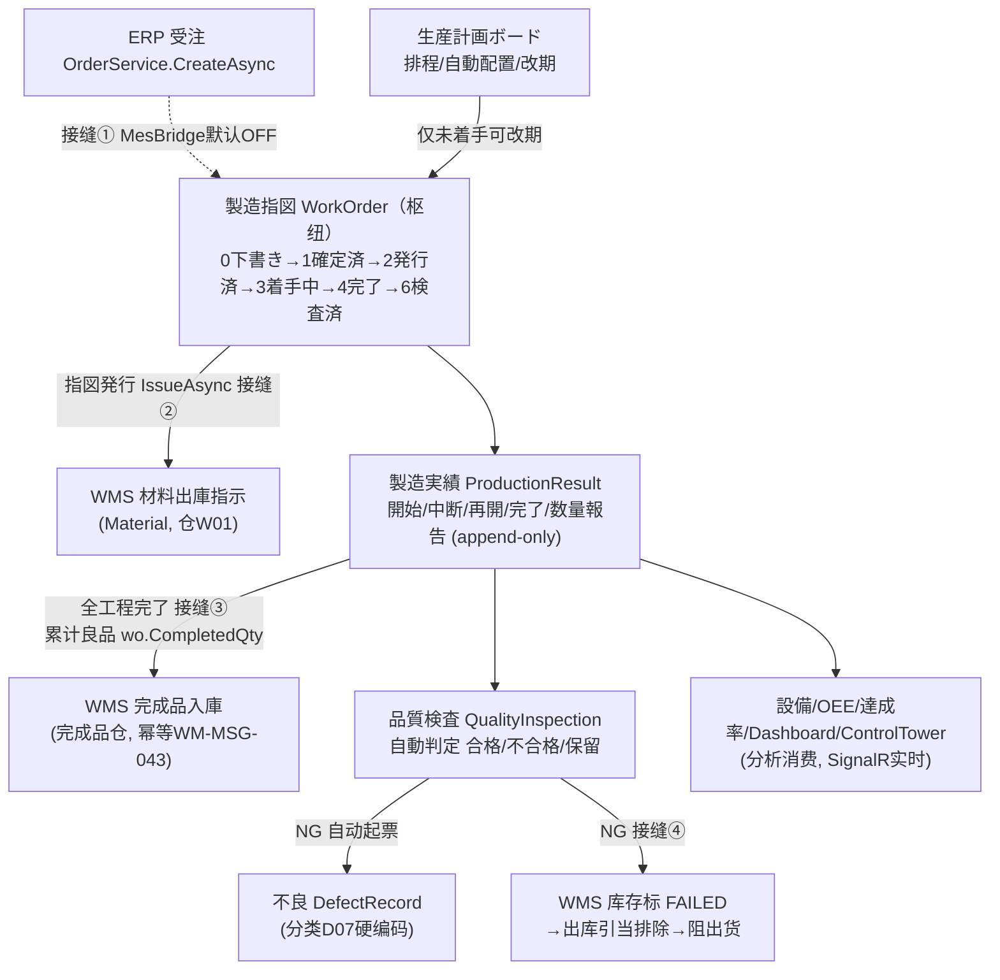

# 生产管理 MES（製造執行）· 最详细用户操作培训手册（模块总册 A · BOOK-M05）

> **作用**：MES 模块的**全局用户操作培训总册**。建立模块业务定位/角色/全流程/15 页总览，并逐页给出 14 小节细化（核心主链页含 `5.x.1a~1e` 增强块）+ 模块级场景/测试矩阵/验收/术语/待确认/培训脚本。配套单页 SOP 见 `mes-pages/`（待 W5 逐页出）。
> **基准**：分支 `feat/wfs-inbox-core`，盘点日 2026-06-28；**后端/接缝/错误码/状态机/采番**逐行实测于 `docs/codemap-mes/`（README+01~05，2026-06-22 权威快照），**前端 UI 粒度**经 5 组并行 agent 实读 18 个 view。查不到标 `待业务确认`；功能没写标 `待实现`；代码无该项标 `代码未发现`。
> **与 ERP 衔接**：MES 是 ERP→MES→WMS 闭环**中段**；样例数据承接销售总册 §0（受注 → 製造指図）。详见 [`docs/codemap-mes/README.md`](../../codemap-mes/README.md)。

---

## 0. 本手册使用的培训样例数据

> 标「培训样例」= 非系统内置，需在测试环境预置主数据；带"系统采番"的编号由系统自动生成（**月级** `{前缀}{yyyyMM}{NNNN}`，如 `WO2026070001`，**全期累计不重置**；实体注释里的 `WOYYYYMMDD-NNNN` 带日带连字符是**错的，以实现为准**）。本册操作步骤/SOP/测试用例尽量沿用这一套数据。

| 数据项 | 培训样例值 | 来源/说明 |
|---|---|---|
| 製品CD / 名称 | `PRD2026070001` / A社向け5号BC楞4色印刷箱 | 承接销售总册 §0；MES 工程/材料按 PA050 製品マスタ展开 |
| 来源受注 | `WO20260701000001`（ERP Web受注NO） | 受注创建经接缝①可自动展开成製造指図 |
| 製造指図NO | `WO2026070001`（系统采番，前缀 `WO`，月级） | 受注展开或手动新建 |
| 拠点CD | `BASE01` 本社 | 培训样例 |
| 工程（路由） | 印刷 `0600` → 製函 → 検査 | 由 PA050 製品マスタ工程展开 |
| 号機/设备 | `MC01` 印刷機 / `MC02` 製函機 | 設備マスタ培训样例 |
| 工作中心 | `WG01` 印刷工程グループ（日产能 16h） | 工作中心 A2 培训样例 |
| 工序费率 | `WG01`：人工 `¥1500/h` / 制费 `¥800/h`，生效日 2026-07-01 | 工序费率 A2；金额计算在财务成本归集 |
| 材料 | 原紙 `K280`（区分=印刷原紙4）数量 5000 | 指図材料子表 |
| 生産数量 / 客先納期 | 5000 枚 / 2026-07-10 | 展开时 PlanEnd=納期−1、PlanStart=納期−7 |
| 製造実績NO | `PR2026070001`（系统采番，前缀 `PR`，月级） | 開始/完了/数量報告每次报告一条 |
| 作業者CD | `OP01` 田中 | 実績入力必填 |
| 品質検査NO | `QC2026070001`（系统采番，前缀 `QC`） | 検査种类默认=3 最終 |
| 検査模板 | `TPL01`（尺寸/印刷/外観 3 项，含上下限） | 品質検査入力可引入 |
| 不良NO / 分类 | `DF2026070001`（前缀 `DF`）；分类 `D07`「検査由来・その他」 | QC NG 自动起票硬编码 D07 |
| 停机NO | `DT…`（前缀 `DT`） | 停止登记采番 |
| OEE 三率（示例） | 可用率 85% × 性能 90% × 良品 98% = OEE 74.97% | 説明用，实际由引擎按设备算 |

> ⚠️ 除"系统采番"项外，其余主数据（製品/设备/工作中心/费率/材料/检查模板/不良分类）须**先建档**，否则展开为空、引入失败、成本/OEE 算不出。各页"业务前置检查清单"会再次提示。

---

## 1. 模块业务定位

**生产管理 MES（製造執行）是 ERP→MES→WMS 闭环的"中段执行层"**：把销售接到的**受注**转成可执行的**製造指図**，驱动现场按工程报**実績**，做**品質検査**与**不良**管理，并用**設備/OEE/达成率/看板**度量制造绩效。

- **解决什么业务问题**：纸箱按图定制，"接了单怎么排产、按什么工艺做、做到哪一步、做得好不好、设备效率如何"——这一切由 MES 承接。
- **枢纽 = 製造指図 WorkOrder**：上游受注经 **Bridge Hook 自动展开**成它；它的**発行**触发 WMS 领料；它的**全工程完了**触发 WMS 完成品入庫；它的**品質 NG** 反向阻止出货。
- **在 CP6 整体中的位置**：

| 维度 | 内容 |
|---|---|
| 上游 | ERP 受注（接缝①自动展开）、製品マスタ（PA050 工程/材料 BOM）、設備/工作中心/费率/检查模板 主数据 |
| 本模块主链 | 生産計画ボード（排程）→ 製造指図（发行）→ 製造実績（開始/完了）→ 品質検査 →（不良）→ 設備/OEE/达成率 分析 |
| 下游 | **WMS**（指図発行→材料出庫；完工→完成品入庫；QC NG→库存 FAILED 阻出货）、**财务**（工时×费率→成本归集）、ERP（达成/OTD 间接） |
| 数据影响面 | 工单状态、工程进度、库存领料/入库/QC 状态、设备稼働与 OEE、达成率/不良率 KPI |

---

## 2. 适用角色与职责

| 角色 | 主要职责 | 可操作页面 | 不能随意操作 | 备注 |
|---|---|---|---|---|
| 生产计划员 | 受注展开/确认指図、排程改期、自动配置 | 生産計画ボード、製造指図入力/一覧 | 已着手指図改期（仅未着手可改） | 主排产 |
| 制造担当（现场作业者） | 工程開始/中断/再開/完了、数量報告 | 製造実績入力、製造実績一覧 | 発行前指図不可入力实绩 | 现场主力 |
| 品质检查员 | 录入品質検査、判合否、登记/处置不良 | 品質検査入力/一覧、不良管理 | — | 判 NG 触发联动 |
| 设备保全员 | 设备主数据、停机登记/关闭 | 設備一覧 | 设备CD（编辑禁改） | 停机驱动 OEE |
| MES 管理员/主管 | 工作中心/工序费率主数据、看板/分析监看 | 工作中心、工序费率、Dashboard、OEE、達成率、Control Tower | 主数据删除前确认引用 | 多为只读监看 |

> 角色与权限为**数据驱动**（PUB 四粒度）；多数 MES 端点仅 `[Authorize]`，**按钮级细粒度权限未明确**（`待业务确认`，见 §10）。

---

## 3. 模块完整业务流程

**起点**：受注成立（ERP）。**终点**：完成品入庫 + 品質合格 + 绩效可度量。

**四个跨模块接缝**（全部 best-effort + `IntegrationEvent` 持久化审计，Hook 内 try/catch 吞错，绝不让父操作回滚）：

| 接缝 | 触发 | 目标 | 开关 |
|---|---|---|---|
| ① 受注→指図 | `Order.CreateAsync` 后 | `ExpandFromOrderAsync` 按 PA050 BOM/路由展开指図(Status=1) | `MesBridge:Enabled`（**默认 false**，需手动展开或开启） |
| ② 指図発行→材料出庫 | `IssueAsync` 后 | WMS 生成材料出庫指示(类型=Material, 仓 W01) | `WmsBridge:Enabled`（默认 true） |
| ③ 全工程完了→完成品入庫 | 完了判定 | WMS 用累计良品 `wo.CompletedQty` 入完成品仓（幂等 `WM-MSG-043`） | `WmsBridge:Enabled` |
| ④ QC NG→阻出货 | `QualityInspection.CreateAsync` 判 NG | 建 DefectRecord + 标库存 `FAILED`，WMS 出库引当 `QcStatus != FAILED` 排除 | 无独立开关（`IStockQcService` 可选注入，生产真注册） |

---

## 4. 菜单页面总览（15 页）

| § | 画面ID | 页面 | 路由 | 优先级 | 一句话 | 读/写 |
|---|---|---|---|---|---|---|
| 5.1 | A2 | 工作中心 | /mes/work-center | P2 | CRP/费率地基主数据（只维护不消费） | 写(CRUD) |
| 5.2 | A2 | 工序费率 | /mes/process-cost-rate | P2 | 人工/制费费率+生效区间（成本归集取值源） | 写(CRUD) |
| 5.3 | MSBBME020 | **製造指図入力** | /mes/work-order | **P0** | 枢纽：受注展开/手动建/発行→WMS领料 | 写(向导) |
| 5.4 | MSBBME030 | 製造指図一覧 | /mes/work-order-list | P0 | 指図检索/进度/遅延/删除 | 读+删 |
| 5.5 | MSBBME040 | **製造実績入力** | /mes/production-result | **P0** | 工程開始/完了/数量報告→完工触发入庫 | 写(append) |
| 5.6 | MSBBME050 | 製造実績一覧 | /mes/production-result-list | P1 | 实绩流水检索/CSV | 只读 |
| 5.7 | MSBBME060 | **品質検査入力** | /mes/quality-inspection | **P0** | 模板+项目判定+处置；NG 联动 | 写 |
| 5.8 | MSBBME070 | 品質検査一覧 | /mes/quality-inspection-list | P1 | 检查检索/合格率进度条 | 只读 |
| 5.9 | MSBBME080 | **不良管理** | /mes/defect | **P1** | 不良起票/分析(5Why)/是正/状态流 | 写 |
| 5.10 | ME010 | 生産計画ボード | /mes/planning-board | P1 | CSS 甘特+改期+自動配置+KPI | 读+改期 |
| 5.11 | ME090 | MES Dashboard | /mes/dashboard | P2 | 本日 KPI+进度+不良 TOP5+热图 | 只读 |
| 5.12 | Phase4 | 設備一覧 | /mes/machine-list | P2 | 设备主数据+灯格+停机登记 | 写(CRUD) |
| 5.13 | Phase4 | OEE 分析 | /mes/oee | P2 | 三率+趋势+日次+再计算 | 读+再算 |
| 5.14 | ME分析 | 達成率 | /mes/plan-achievement | P2 | 计划达成率/不良率/CSV | 只读 |
| 5.15 | Phase4 | Control Tower | /mes/control-tower | P2 | 4 象限大屏+SignalR 实时 | 只读 |

> 状态机贯穿全模块（`WorkOrderStatus`）：`0 下書き / 1 確定済 / 2 発行済 / 3 着手中 / 4 完了 / 5 中断中 / 6 検査済 / 9 取消`。**可编辑/删除/発行仅 `Status∈{0,1}`**（Service 硬校验，否则 `ME-MSG-042`）。工程状态 `ProcessStatus`：`0 未着手 / 1 着手中 / 2 完了 / 3 中断 / 9 取消`。

---

## 5. 页面详细操作说明

> 每页 14 小节；核心主链页（5.3/5.5/5.7/5.9）含 `5.x.1a~1e` 增强块。**坑点统一提醒**：MES 更新**不做乐观锁**（仅製造指図删除用 RowVersion）、子表"全删全插"、错误码 `ME-MSG-005/040/042/043/CANCEL-001` **无 i18n 词条（前端显示裸码）**。

---

### 5.1 工作中心（WorkCenter · A2 主数据 · /mes/work-center）

**5.1.1 页面业务目的**：维护"工作中心（WG）"主数据——日可用产能时数，作为 CRP/排产/费率挂靠的地基。代码注释明示"A2 只维护不消费"（CRP 引擎尚未消费它）。

**5.1.2 流程位置**：上游无；下游=工序费率（费率挂在 WG）、製造指図工程行的 `WgCd`、（未来）CRP。

**5.1.3 谁使用**：MES 管理员/主数据维护员。

**5.1.4 操作前准备**：确定工作中心编码规则（如 `WG01`）。

**5.1.5 页面区域**：页头（标题+副标题）→ 工具条（关键字检索框 + 查询/新增 + 计数「共 N 条」）→ 数据表格 → 新增/编辑弹窗（520px）。

**5.1.6 字段填写说明**（弹窗）：

| 字段 | 控件 | 必填 | 怎么填 | 填错影响 |
|---|---|---|---|---|
| 工作中心(WgCd) | 输入框(≤10) | 是 | 唯一编码；**编辑时禁改**（主键） | 空→`E-A2-WC-001` |
| 名称(WgName) | 输入框(≤100) | 否 | 业务名 | — |
| 日可用产能(DailyCapacityHours) | 数字(≥0,2位) | 否 | 小时数（如 16） | 负数→`E-A2-WC-003` |
| 启用(Enable) | 开关 | 否 | 默认开 | 停用不参与（未来CRP） |

**5.1.7 按钮操作**：查询/新增/编辑(行)/删除(行,软删)/确定/取消。

**5.1.8 业务规则与校验**：`E-A2-WC-001`(CD 必填/删除时复用为不存在)、`E-A2-WC-003`(产能负)。**删除为软删**，无级联校验（删了被费率引用的 WG 影响 `待业务确认`）。

**5.1.9 完成后检查**：列表出现该 WG；工序费率页可挂靠。

**5.1.10 状态流转**：无状态机（仅启用/停用）。

**5.1.11 常见错误**：编辑想改 WgCd（禁改）；产能填负。

**5.1.12 注意事项**：A2 主数据，低频；CRP 暂未消费（`待实现`/`待业务确认`）。

**5.1.13 标准操作步骤**：进入→新增→填 WG01+名称+产能→确定→列表确认。

**5.1.14 本页面测试点汇总**：CD 必填(`E-A2-WC-001`)/产能负(`E-A2-WC-003`)/编辑禁改 CD/软删/重复 CD 行为(`待业务确认`)。

---

### 5.2 工序费率（ProcessCostRate · A2 主数据 · /mes/process-cost-rate）

**5.2.1 页面业务目的**：维护工作中心的**人工费率 / 制造费率**及**生效区间**（ValidFrom~ValidTo）。是财务成本归集按基准日解析费率的**唯一取值源**（MES 只维护，金额计算在财务）。

**5.2.2 流程位置**：上游=工作中心（WG 必须先存在）；下游=财务 `CostCollectService` 按基准日 `ResolveAsync` 取费率算成本。

**5.2.3 谁使用**：MES 管理员/成本会计协同。

**5.2.4 操作前准备**：对应 WG 已建；明确费率生效日。

**5.2.5 页面区域**：页头 → 工具条(按工作中心过滤 + 查询/新增 + 计数) → 表格(工作中心/人工费率/制造费率/生效日/失效日/操作) → 弹窗(560px，费率与日期各两列)。

**5.2.6 字段填写说明**（弹窗）：

| 字段 | 控件 | 必填 | 怎么填 | 填错影响 |
|---|---|---|---|---|
| 工作中心(WgCd) | 输入框(≤10) | 是 | 须为已存在 WG；编辑禁改 | 不存在→`E-A2-WC-001`；空→warning |
| 人工费率(LaborRate) | 数字(≥0,2位) | 否 | ¥/小时 | 负→`E-A2-RATE-003` |
| 制造费率(OverheadRate) | 数字(≥0,2位) | 否 | ¥/小时（列名「制造费率」） | 负→`E-A2-RATE-003` |
| 生效日(ValidFrom) | 日期 | 是 | 区间起 | 空→warning |
| 失效日(ValidTo) | 日期(可空) | 否 | 空=长期有效 | 早于生效日→`E-A2-RATE-004` |

**5.2.7 按钮操作**：查询/新增(可预填过滤的 WG)/编辑/删除/确定/取消。

**5.2.8 业务规则与校验**：①费率不可负 `E-A2-RATE-003`；②失效<生效 `E-A2-RATE-004`；③WG 不存在 `E-A2-WC-001`；④**同 WG 生效区间不可重叠** `E-A2-RATE-001`（`ValidFrom≤已存sTo && 已存ValidFrom≤newTo`）。`ResolveAsync` 取 `ValidFrom≤onDate≤(ValidTo??+∞)` 中 ValidFrom 最新一条。

**5.2.9 完成后检查**：列表显示；财务成本归集能解析到该费率（基准日落在区间内）。

**5.2.10 状态流转**：无。

**5.2.11 常见错误**：区间重叠(`E-A2-RATE-001`)、失效早于生效(`E-A2-RATE-004`)。

**5.2.12 注意事项**：**金额公式在财务**——人工=実人工工时×LaborRate、制费=実機時×OverheadRate；实绩缺失回退标准工时并打 `W-A2-COST-001` 警告。

**5.2.13 标准操作步骤**：选 WG→新增→填费率+生效日→确定→区间不重叠校验通过→落库。

**5.2.14 本页面测试点汇总**：费率负(`-003`)/失效<生效(`-004`)/WG 不存在(`-001`)/区间重叠(`-001`)/失效日空=长期/ResolveAsync 按基准日取最新生效。

---

### 5.3 製造指図入力（WorkOrder · 枢纽 · MSBBME020 · /mes/work-order）

**5.3.1 页面业务目的**：**MES 的枢纽页**。把受注转成可执行的製造指図（头+工程+材料三表一体）；可手动新建，也可从受注 Web NO 一键展开；保存后可**指図発行**——发行即触发 WMS 材料出庫（接缝②）。

**5.3.1a 业务前置检查清单（操作前必看）**
- [ ] 製品 `PRD2026070001` 已在 PA050 製品マスタ建档（含工程/材料 BOM），否则受注展开出空工程/材料。
- [ ] 若走受注展开：来源受注 `WO20260701000001` 已在 ERP 成立。
- [ ] 工程的号機/WG 主数据（`MC01`/`WG01`）已建（供后续排程/成本）。
- [ ] 明确 `MesBridge:Enabled`：**默认 false** → 受注不会自动展开，需在本页手动「受注展开」或开启开关。

**5.3.1b 关键字段业务填写口径**
| 字段 | 谁提供 | 怎么填 | 填错影响 |
|---|---|---|---|
| 手配NO1/2/3 | 计划/受注带出 | 手配号；新建时"手配NO 或 製品CD 至少填一项" | 都空→`ME-MSG-001` |
| 製品CD | 製品マスタ/受注带出 | `PRD2026070001` | 与手配NO 均空→`ME-MSG-001` |
| 生産数量 | 计划 | >0 整数（如 5000） | ≤0→`ME-MSG-002` |
| 客先納期 | 受注 | 日期 | 計画完了>納期→`ME-MSG-004`(确认框,可继续) |
| 計画開始日/完了日 | 计划 | 開始≤完了 | 開始>完了→`ME-MSG-003` |
| 完了数量/不良数量 | 系统 | **只读**，由实绩累计回填 | — |
| 工程行(工程CD+作業CD) | 製品 BOM/手填 | 组合唯一 | 重复→`ME-MSG-007` |
| 材料行(区分) | 手填 | 1仕掛品/2連産品/3原料/4印刷原紙(默认3) | — |

**5.3.1c 灰按钮 / 不可操作说明**
| 按钮/字段 | 何时灰/只读 | 原因 |
|---|---|---|
| 指図発行 | 仅 `isEdit && Status∈{0,1}` 才显示 | 已发行(≥2)不再显示 |
| 全部输入字段 | `Status≥2`(発行済以后) | `isEditable=Status===0‖1`，发行后只读 |
| 指図NO/完了数量/不良数量 | 永久只读 | 采番自动 / 实绩回填 |
| 受注展开放大镜 | `!isEditable` 或无 webOrderNo | 已发行/无受注号 |

**5.3.1d 完成后检查点与下游验证（★保存/发行后必做★）**
- 保存：生成指図NO、转编辑态、Status=下書き(0)或確定済(1)。
- **発行后**：① Status→発行済(2)；② **WMS 出庫指示一覧**出现该指図的**材料出庫指示**（类型=Material，仓 W01，数量=材料計画必要数量）；③ 注文追溯（若来自受注）可见 MES→WMS 事件。
- 受注展开：受注每条明细 → 一张指図(Status=1)+按 PA050 展开工程/材料。

**5.3.1e 详细操作场景（SOP）**
- **场景一·受注展开建指図（主流程）**：Step1 受注Web NO 框点放大镜→确认框→自动展开（多明细=多指图）→载入第一张→核对工程/材料→保存。
- **场景二·手动新建指図**：Step1 填手配NO/製品CD/数量/納期/計画日→Step2 工程追加→Step3 材料追加→保存。
- **场景三·指図発行触发领料**：编辑态 Step3「指図発行」→确认→Status→2→去 WMS 看材料出庫指示。
- **场景四·发行前修正**：Status∈{0,1} 时改工程/材料→保存（子表全删全插）。
- **场景五·发行后只读核对**：Status≥2 全字段只读，仅供查看，改动需走实绩/取消级联。

**5.3.2 流程位置**：上游 ERP 受注（接缝①）；下游 WMS 材料出庫（接缝②）、製造実績。

**5.3.3 谁使用**：生产计划员。

**5.3.4 操作前准备**：见 5.3.1a。

**5.3.5 页面区域**：卡片头(操作种别标签+指図NO+状态标签+戻る) → 步骤条(①基本情報 ②工程計画 ③材料手配+保存) → 步骤主体 → 底部按钮(戻る/次画面/保存/指図発行)。

**5.3.6 字段填写说明**：见 5.3.1b（Step1 基本情報 17 字段；Step2 工程行：工程CD/作業CD/工程名/号機/WG/計画開始完了日時/計画数量/LT/状態；Step3 材料行：工程CD/材料CD/材料名/区分/計画数量/単位/手配状況/実績消費/備考）。

**5.3.7 按钮操作**：

| 按钮 | 动作 | 启用条件 |
|---|---|---|
| 次画面→ | 校验 Step1/2 后进下一步 | step<2 |
| ←戻る | 上一步 | step>0 |
| 保存 | create/update | step===2 |
| 指図発行 | issue→Status=2→WMS 领料 | `isEdit && Status∈{0,1}` |
| 受注展开(放大镜) | expandFromOrder | isEditable 且有 webOrderNo |
| 工程追加/材料追加/行削除 | 子表行增删 | Step2/3，isEditable |
| 並び順 再付番 | 工程 sortOrder 重排 | Step2 |

**5.3.8 业务规则与校验**：前端 `ME-MSG-001`(手配/製品CD均空)、`-002`(数量≤0)、`-003`(開始>完了)、`-004`(完了>納期,确认)、`-006`(无工程)、`-007`(工程+作業CD重复)。发行后端：不存在`-043`、`Status≥2`幂等return、`Status∉{0,1}`→`-042`、无工程→`-006`。展开：WebOrderNo空`-001`、受注头/明细0件`-040`、同`WebOrderNo+ProductCd`已有未取消指图`-005`。**更新不做乐观锁**；子表全删全插。

**5.3.9 完成后检查**：见 5.3.1d。

**5.3.10 状态流转**：`0下書き→(保存)→1確定済→(発行)→2発行済→(実績開始)→3着手中→(全工程完了)→4完了→(品質全合格)→6検査済`；受注取消级联→9（无前端入口）。

**5.3.11 常见错误**：发行后想改字段（只读）；展开同製品重复(`ME-MSG-005` 裸码)；`MesBridge` 默认 off 误以为受注会自动展开。

**5.3.12 注意事项**：取消**无前端按钮**（`CancelAsync` 是受注取消的后端级联，`着手済≥3 不可取消`→`ME-MSG-CANCEL-001`）；删除仅 `Status≤1` 显示。

**5.3.13 标准操作步骤**：见 5.3.1e 场景一/三。

**5.3.14 本页面测试点汇总**：受注展开(多明细→多指图)/手动建/必填校验(`001/002/003/004/006/007`)/発行触发 WMS 材料出庫/发行幂等(`Status≥2` return)/状态守卫(`042`)/重复指图(`005` 裸码)/发行后只读/删除仅≤1/更新无乐观锁。

---

### 5.4 製造指図一覧（WorkOrderList · MSBBME030 · /mes/work-order-list）

**5.4.1 页面业务目的**：检索製造指図、看进度/遅延、跳详情/实绩、删除（仅未发行）。

**5.4.2 流程位置**：製造指図的台账入口；行操作跳 5.3 详情、5.5 实绩。

**5.4.3 谁使用**：计划员/现场/管理。

**5.4.4 操作前准备**：已有指图数据。

**5.4.5 页面区域**：检索条件卡(inline) + 结果卡(合计件数 + 表格 max-height600 + 分页)。

**5.4.6 检索条件**：拠点CD/指図NO/手配NO(=手配NO或受注WebNO)/製品CD/得意先CD/納期From-To/計画開始From-To/優先度/工程CD/WG/ステータス(**多选复选组**)/遅延のみ(复选)。

**5.4.7 按钮操作**：検索/クリア/新規作成(→5.3)/CSV出力(空结果 warning)；行：詳細(→/mes/work-order?no=)、実績(→/mes/production-result?no=)、削除(`v-if status≤1`)。

**5.4.8 业务规则与校验**：`DelayedOnly`=`PlanEndDate<today && Status∉{4,6,9}`；进度批量化(GroupBy 工程总数/完成数→ProgressRate)；分页 size 上限 500。无业务错误码。

**5.4.9 完成后检查**：检索命中；删除后列表消失（软删，`status≤1` 才可删）。

**5.4.10 状态流转**：见 §4 状态机（列以 tag 着色）。

**5.4.11 常见错误**：对已发行单找删除按钮（不显示）。

**5.4.12 注意事项**：列表「遅延」=`DelayDays>0` 显红；「工程」列=完了/总。

**5.4.13 标准操作步骤**：填条件→検索→詳細/実績/删除→CSV。

**5.4.14 本页面测试点汇总**：组合检索/状态多选/遅延のみ过滤/进度率正确/删除仅≤1/CSV 与查询一致/分页 500 上限。

---

### 5.5 製造実績入力（ProductionResult · MSBBME040 · /mes/production-result）

**5.5.1 页面业务目的**：现场按工程报实绩——開始/中断/再開/完了/数量報告（5 动作，**append-only 流水**，无改/删）。完了判定全工程完成→触发 WMS 完成品入庫（接缝③）。

**5.5.1a 业务前置检查清单**
- [ ] 目标製造指図已**発行**（`Status≥2`），否则取得后提示"発行前不可入力"。
- [ ] 作業者CD（如 `OP01`）准备好（每次报告必填）。
- [ ] 工程顺序清楚（哪些先做）。

**5.5.1b 关键字段填写口径**（对话框，按动作显示不同字段）
| 字段 | 动作 | 必填 | 口径 |
|---|---|---|---|
| 作業者CD | 全部 | 是 | `OP01`；空→`ME-MSG-011` |
| 実績開始日時 | 開始(1) | 否 | 默认当前时刻 |
| 良品数 | 完了(4)/数量報告(5) | 是 | >0；完了且良+不良均≤0→`ME-MSG-012` |
| 不良数 | 完了(4)/数量報告(5) | 否 | ≥0 |
| 不良理由CD | 完了/数量报告且不良数>0 | 是(条件) | 如 `D01`；缺→`ME-MSG-014` |
| 完了日時 | 完了(4) | 否 | 默认当前；早于开始→`ME-MSG-016` |
| 中断理由CD | 中断(2) | 是 | 如 `S01`；缺→中断理由必填(`ME-MSG-024`) |

**5.5.1c 灰按钮 / 不可操作说明**：工程行按钮随 `processStatus` 显隐——0未着手→**開始**；1着手中→**中断/完了**；3中断→**中断解除**；1或2→**数量追加報告**；2完了/9取消基本无按钮（仅完了可数量追加）。

**5.5.1d 完成后检查点与下游验证（★完了后必做★）**
- 每次报告：生成実績NO（`PR…`），toast `ME-MSG-041`，工程状态推进。
- 三级数量累计：行级（新実績）→工程级（`proc.GoodQty/DefectQty +=`）→指図级（`wo.CompletedQty/DefectQty +=`，仅完了4/数量報告5）。
- **全工程完了**：指図 Status→4 完了 → **WMS 完成品入庫**（用 `wo.CompletedQty` 累计良品，入完成品仓，幂等 `WM-MSG-043`）→ 注文追溯可见 MES→WMS 完了事件。**不良不入完成品仓**（只取良品累计）。

**5.5.1e 详细操作场景（SOP）**
- **场景一·正常完工链**：取得指図→工程1「開始」→…作业…→「完了」(填良品/不良)→工程2 同样→末工程完了→全完→WMS 自动入庫。
- **场景二·中断与再開**：着手中→「中断」(填中断理由)→指图 Status=5→「中断解除」→继续。
- **场景三·数量追加報告**：着手中/完了→「数量追加報告」(只累计，不迁移状态)。
- **场景四·完工触发入庫核对**：末工程完了后到 WMS 完成品入庫一览核对数量=累计良品。
- **场景五·发行前误入力**：取得 `Status<2` 指图→提示"発行前不可入力"。

**5.5.2 流程位置**：上游=已发行指図；下游=WMS 完成品入庫(接缝③)、品質検査、OEE 良/不良来源。

**5.5.3 谁使用**：现场制造担当。

**5.5.4 操作前准备**：见 5.5.1a。

**5.5.5 页面区域**：指図サマリ卡(指図NO取得框+作業者CD+取得后摘要) + 工程別実績入力表 + 実績入力对话框(560px)。

**5.5.6 字段填写说明**：见 5.5.1b。

**5.5.7 按钮操作**：取得/工程行 開始·中断·中断解除·完了·数量追加報告/对话框 確定·キャンセル。

**5.5.8 业务规则与校验**：`WriteAsync` 前置 `WorkOrderNo空-001`/`OperatorCd空-011`/指図不存在`-040`/`Status<2`→`-042`/工程不存在`-040`；完了 `-012`(良品≤0)/`-014`(不良>0无理由)/`-016`(完了<开始)；中断 `-024`(理由空)；成功 `-041`。**无 PUT/DELETE 端点**（append-only）。

**5.5.9 完成后检查**：见 5.5.1d。

**5.5.10 状态流转**：工程 `0→(開始)1→(中断)3→(再開)1→(完了)2`；指図随之 `3着手中/5中断中/4完了`。

**5.5.11 常见错误**：发行前入力(`-042`)；完了忘填良品(`-012`)；不良>0 漏理由(`-014`)。

**5.5.12 注意事项**：实绩**不可改/删**（错了只能再报修正记录）；NG 数**不会**自动建品質/不良单（品質检查是独立入口），只供 OEE/Dashboard 分析。

**5.5.13 标准操作步骤**：见 5.5.1e 场景一。

**5.5.14 本页面测试点汇总**：発行前禁入力(`042`)/開始→完了链/中断再開/数量報告只累计/三级累计正确/全完触发 WMS 入庫(累计良品,幂等`WM-MSG-043`)/完了良品≤0(`012`)/不良无理由(`014`)/完了<开始(`016`)/作業者空(`011`)/无改删端点。

---

### 5.6 製造実績一覧（ProductionResultList · MSBBME050 · /mes/production-result-list）

**5.6.1 页面业务目的**：检索实绩流水、CSV 导出。纯只读，无行内操作。

**5.6.2 流程位置**：实绩台账。**5.6.3 谁使用**：现场/管理。**5.6.4 操作前准备**：有实绩。

**5.6.5 页面区域**：检索卡 + 结果卡(合计件数+表格 max-height600+分页)。

**5.6.6 检索条件**：指図NO/工程CD/作業者CD/実績種別(下拉 1開始~5数量報告)/日付From-To。

**5.6.7 按钮操作**：検索/クリア/CSV出力(前端导出,空结果 warning)。无行操作。

**5.6.8 业务规则**：软删过滤+size 上限 500+按 CreateDate 降序+名称补完（产品名/工程名）。无错误码。

**5.6.9~5.6.13**：列含 実績NO/指図NO/製品名/工程/実績種別(tag)/作業者/号機/実績開始完了/良品数/不良数/ロス率%/不良理由/中断理由/備考/登録日時；只读无状态机。

**5.6.14 本页面测试点汇总**：按种别/作業者/日付检索/CSV 一致/分页/ロス率显示(空=`-`)。

---

### 5.7 品質検査入力（QualityInspection · MSBBME060 · /mes/quality-inspection）

**5.7.1 页面业务目的**：录入品質検査（头+检查项目明细），支持模板引入与自动判定；判 NG 触发联动（自动起票不良 + 标库存 FAILED 阻出货，接缝④）。

**5.7.1a 业务前置检查清单**
- [ ] 目标指図存在（最好已有完成品/完工，QC 多在完工后）。
- [ ] 检查模板 `TPL01` 已建（可引入项目），或准备手动加项目。
- [ ] 明确检查种类（默认 3 最終）与检查者CD。

**5.7.1b 关键字段填写口径**
| 字段 | 必填 | 口径 |
|---|---|---|
| 指図NO | 是 | 点放大镜带出製品/工程；空→`ME-MSG-020` |
| 検査者CD | 是 | 空→`ME-MSG-021` |
| 検査日/検査種類 | 是 | 默认今天/3最終 |
| テンプレートCD | 否 | 选后「テンプレ引入」拉项目 |
| 検査対象数量/サンプル数 | 否 | 对象数空则带出 completedQty |
| 项目行(計測値) | — | 录入触发单项自动判定(上下限优先) |
| 総合判定 | 否(自动) | 1合格/2不合格/9保留 |
| 処置内容 | **当総合=2不合格时必填** | 1手直し/2特別採用/3返品/4廃棄；缺→`ME-MSG-023` |

**5.7.1c 灰按钮/不可操作说明**：指図NO 编辑态禁改；放大镜在 NO 空时禁用；「テンプレ引入」未选模板时禁用；「処置内容」仅総合判定=2 不合格时启用。

**5.7.1d 完成后检查点与下游验证（★NG 必做★）**
- 合格(总合=1)：保存后若指図 Status==4(完了)且合格→指图 Status→6 検査済。
- **NG(总合=2)**：① 同事务自动起票 **DefectRecord**（`DefectNo=DF…`，`InspectionNo` 回填关联，`CategoryCd="D07"` 硬编码，Status=0）；② 提交后 **标关联库存 FAILED**（`WorkOrder→InboundReceipt→Detail(ProductCd+LotNo)→Stock.QcStatus=FAILED`）；③ WMS 出库引当 `QcStatus != FAILED` 排除→**阻止出货**。去不良管理(5.9)看自动起票单、去 WMS 在庫照会看 QcStatus。
- ⚠️ **改判只在新建生效**：Update 路径改判 NG **不**补建不良、**不**标 FAILED。

**5.7.1e 详细操作场景（SOP）**
- **场景一·模板引入合格**：填指図NO 放大镜→选模板「引入」→各项填計測値(自动判定)→「全項目 自動判定」→総合=合格→保存→（完工指图）转検査済。
- **场景二·NG 起票联动**：某项超限→判定不合格→総合=2→选処置(如返品)→保存→去不良管理见 `DF…`、去 WMS 见库存 FAILED。
- **场景三·手动加项目**：不用模板，「項目追加」逐行→填规格/上下限/計測値。
- **场景四·改判（注意不联动）**：列表詳細进编辑→改判 NG→保存（**不会**补建不良/标 FAILED，需手工）。
- **场景五·缺处置拦截**：総合=2 但不选処置→`ME-MSG-023`。

**5.7.2 流程位置**：上游=指図/实绩；下游=不良(自动)、WMS 库存 QC(NG)、指图検査済。

**5.7.3 谁使用**：品质检查员。**5.7.4 操作前准备**：见 5.7.1a。

**5.7.5 页面区域**：卡片头(种别标签+检査NO+总合判定彩标+戻る) + 基本情報区 + 検査項目区(动态标题「合格x/全y、合格率z%」+明细表) + 総合判定区 + 底部保存。

**5.7.6 字段填写说明**：见 5.7.1b（项目行：項目名/方法/規格値/下限/上限/計測値/計測文字/単位/判定/備考）。

**5.7.7 按钮操作**：放大镜(带出指図)/テンプレ引入/項目追加/全項目自動判定/行削除/保存。

**5.7.8 业务规则与校验**：`-020`(无指図)/`-021`(无检查者)/`-023`(不合格无处置)/`-022`(有未录项目仅 warning 不阻断)；成功 `-041`。自动判定：上下限优先→区间内合格；总合：任一项 NG→总合 NG，全合→合格，否则保留。

**5.7.9 完成后检查**：见 5.7.1d。

**5.7.10 状态流转**：総合判定 1合格/2不合格/9保留；指图完了→检査済需总合合格。

**5.7.11 常见错误**：NG 漏处置(`-023`)；以为 Update 改判会联动（不会）。

**5.7.12 注意事项**：自动不良分类硬编码 `D07`，需人工后调；NG 阻出货真实落点在 WMS 出库引当。

**5.7.13 标准操作步骤**：见 5.7.1e 场景一/二。

**5.7.14 本页面测试点汇总**：模板引入/单项+总合自动判定/合格率统计/NG 自动起票不良(D07)/NG 标库存 FAILED/合格→指图検査済/无指図(`020`)/无检查者(`021`)/NG 无处置(`023`)/未录项目 warning(`022`)/Update 改判不联动。

---

### 5.8 品質検査一覧（QualityInspectionList · MSBBME070 · /mes/quality-inspection-list）

**5.8.1 业务目的**：检索品質検査、合格率进度条可视化、跳详情/改判。

**5.8.2~5.8.4**：检查台账；品质/管理使用；有检查数据。

**5.8.5 页面区域**：检索卡 + 列表卡(合计+表格 max-height600+分页)。

**5.8.6 检索条件**：検査NO/指図NO/工程CD/検査者CD/検査種類/総合判定/検査日 From-To。

**5.8.7 按钮操作**：検索/クリア/新規検査(→5.7)/CSV出力；行：詳細(→/mes/quality-inspection?no=)。

**5.8.8 业务规则**：列表算 `PassRate=Pass/Total*100`(进度条)，关联补产品名；分页 size 500。

**5.8.9~5.8.13**：列含 検査NO/指図NO/製品/工程/種類/検査日/検査者/项目数·合格/合格率(进度条)/総合判定(tag)/処置/登録日時。

**5.8.14 本页面测试点汇总**：组合检索/合格率进度条/总合判定过滤/CSV/详情改判入口。

---

### 5.9 不良管理（DefectRecord · MSBBME080 · /mes/defect）

**5.9.1 页面业务目的**：不良记录的起票（手动或 QC 自动）、原因分析(5Why)、是正処置、状态流转(起票済み→分析中→是正中→完了)。

**5.9.1a 业务前置检查清单**
- [ ] 不良分类主数据已建（大/小分类，如 `D07`）。
- [ ] 关联指図/检查NO（QC 自动起票会带 `InspectionNo`）。

**5.9.1b 关键字段填写口径**（弹窗）
| 字段 | 必填 | 口径 |
|---|---|---|
| 指図NO | 是 | 编辑禁改；空→"指図NOを入力してください" |
| 不良大分類 | 是 | 级联清空小分类；空→`ME-MSG-030` |
| 不良小分類 | 否 | 按大分类过滤 |
| 不良数 | 是 | ≥0 |
| 不良内容 | 是 | 描述；空→`ME-MSG-031` |
| 原因分析(5Why)/是正処置 | 否 | 文本，多行 |
| ステータス | 否 | 0起票済み/1分析中/2是正中/3完了(默认0)；置 3 且无完了日→自动补 |
| 処置期限/完了日/検査NO/担当者CD | 否 | 検査NO 编辑禁改 |

**5.9.1c 灰按钮**：指図NO/検査NO 编辑态禁改。

**5.9.1d 完成后检查点**：列表出现/更新；QC 自动起票的单 `CategoryCd=D07`、`InspectionNo` 可溯源 QC；置完了态自动补完了日。

**5.9.1e 详细操作场景（SOP）**
- **场景一·手动起票**：「手動起票」→填指図NO+大分类+不良数+内容→保存。
- **场景二·QC 自动起票后人工补全**：从 QC NG 自动生成的 `DF…`(分类 D07)→编辑→改正确分类+填 5Why/是正→置状态。
- **场景三·状态推进**：起票済み→分析中(填 5Why)→是正中(填是正処置)→完了(自动补完了日)。
- **场景四·删除(软删)**：行「削除」确认→软删。
- **场景五·分类级联**：大分类 change→小分类清空+按大分类过滤。

**5.9.2 流程位置**：上游=QC NG 自动 / 手动；下游=OEE/Dashboard 不良分析消费。

**5.9.3 谁使用**：品质/工艺。**5.9.4 操作前准备**：见 5.9.1a。

**5.9.5 页面区域**：检索卡 + 列表卡(合计+表格+分页) + 編集/起票弹窗(800px)。

**5.9.6 检索条件**：不良NO/指図NO/大分類/小分類(级联)/担当者CD/発生日From-To/ステータス(**多选复选组**)。

**5.9.7 按钮操作**：検索/クリア/手動起票/CSV出力；行 編集·削除(确认软删)；弹窗 保存·キャンセル。

**5.9.8 业务规则与校验**：`-020`(无指図,grep 实证)/`-030`(无分类)/`-031`(无内容)/`-043`(不存在)；成功 `-041`。`Status==3 && !CompletedDate`→自动补完了日。删除软删。

**5.9.9 完成后检查**：见 5.9.1d。

**5.9.10 状态流转**：`0起票済み→1分析中→2是正中→3完了`。

**5.9.11 常见错误**：漏大分类(`-030`)/漏内容(`-031`)。

**5.9.12 注意事项**：本页**无自动判定/处置下拉**（处置靠状态流+5Why/是正文本）；与品質検査入力的"処置内容(DISPOSITION)"不同（那是 QC 页字段）。

**5.9.13 标准操作步骤**：见 5.9.1e。

**5.9.14 本页面测试点汇总**：手动起票/QC 自动起票溯源(D07,InspectionNo)/大小分类级联/状态推进+完了日自动补/无分类(`030`)/无内容(`031`)/软删/状态多选检索/CSV。

---

### 5.10 生産計画ボード（PlanningBoard · ME010 · /mes/planning-board）

**5.10.1 页面业务目的**：CSS 自绘甘特看板（按号機分组的工程 Bar）+ 改期 + 自動配置 + KPI。"拖拽"实为**点击 Bar→弹窗改计划日时→PUT**。

**5.10.2 流程位置**：上游=已展开指图的工程；下游=改期落 `T_WorkOrderProcess`。

**5.10.3 谁使用**：生产计划员。**5.10.4 操作前准备**：有工程数据。

**5.10.5 页面区域**：検索+KPI 头卡(5 KPI) + 凡例卡 + 甘特本体(左固定号機/工程 + 右日付刻度 + Bar) + Bar 编辑弹窗(500px)。

**5.10.6 字段/检索**：检索 拠点CD/期間(默认 今-7~今+14)/工程CD/WG/号機/ステータス(多选,默认[0,1,3])/表示単位(日/週/月)。改期弹窗：指図NO/工程(只读)、号機CD(可改)、計画開始/完了日時(必填)、状態(只读)。

**5.10.7 按钮操作**：検索/クリア/自動配置(confirm→优先度降序+納期升序排程)/弹窗 保存(`canEdit=processStatus===0`)·キャンセル。

**5.10.8 业务规则与校验**：改期 `RescheduleAsync`：行不存在`-043`、`ProcessStatus!=0`→`-042`(仅未着手可改)、开始>结束`-003`；成功 `-041`。自動配置：仅未着手→按 优先度↓→纳期↑→SortOrder，每号机时间游标朝 8 时首尾相接(LeadTime 日×8h 或默认 2h)。KPI：总/着手中(3)/完了(4‖6)/遅延/平均遅延/完了率(完了工程数/全工程数)。

**5.10.9 完成后检查**：改期后 Bar 移位；自動配置返回"{n}件"。

**5.10.10 状态流转**：Bar 颜色随 ProcessStatus；优先度 3 红框/2 橙框；纳期红线；实绩半透明绿 overlay。

**5.10.11 常见错误**：对已着手工程改期(`-042`,前端 `canEdit` 已挡)。

**5.10.12 注意事项**：**60 秒自动刷新**；甘特非真拖拽。**达成率口径①**=完了工程数/全工程数（与 5.14 不同）。

**5.10.13 标准操作步骤**：检索→点 Bar→改日時/号機→保存；或自動配置。

**5.10.14 本页面测试点汇总**：甘特渲染/点 Bar 改期(仅未着手`-042`)/开始>结束(`-003`)/自動配置排程/KPI 口径/60 秒刷新/状态多选筛。

---

### 5.11 MES Dashboard（ME090 · /mes/dashboard）

**5.11.1 业务目的**：本日生产 KPI + 工程进度 + 不良 TOP5 + 日别推移 + 号机×时段热图 + 遅延/直近完了。纯只读看板（自绘图表）。

**5.11.2~5.11.4**：制造监看；管理/计划使用；有当日生产数据。

**5.11.5 页面区域**：本日 KPI 行(4 卡) + 工程別進捗/不良 TOP5 + 日別推移(7/14/30 切换) + 工程稼働热图/納期遅延 + 直近完了。

**5.11.6 展示项**：KPI=着手中指図/本日良品/本日不良率/遅延件数；图表全自绘(无图表库)。

**5.11.7 按钮操作**：日别推移 7/14/30 日切换（唯一交互）。

**5.11.8 业务规则**：纯只读，EF 聚合版（默认）。`GetSummary/ProcessProgress/DelayAlerts/DefectTop5/MachineHeatmap` 等。**另有 Dapper/存储过程 `/sp` 性能版**（配覆盖索引，注释快 30-60%，**前端默认未接入**，是性能样板）。

**5.11.9~5.11.13**：自动刷新——**全量 60 秒 + 納期遅延 10 秒**；无写操作；无状态机。

**5.11.14 本页面测试点汇总**：KPI 正确/进度三段/不良 TOP5/推移 7·14·30 切换/热图/遅延 10 秒刷新/全量 60 秒刷新/(可选)SP 版性能对比。

---

### 5.12 設備一覧（Machine · Phase4 · /mes/machine-list）

**5.12.1 业务目的**：设备主数据 CRUD + 稼働状态灯格看板 + 停机登记。设备的计划稼働分/能力/标准CT 是 OEE 计算输入。

**5.12.2 流程位置**：上游无；下游=OEE 计算（计划稼働/能力）、停机驱动 OEE 可用率。

**5.12.3 谁使用**：设备保全员。**5.12.4 操作前准备**：设备编码规则。

**5.12.5 页面区域**：检索卡 + 稼働状态灯格(绿/红/黄/蓝/灰 + OEE) + 一覧表 + 设备编辑弹窗(700px) + 停机登记弹窗(600px)。

**5.12.6 字段填写说明**：设备弹窗——設備CD(必填,编辑禁改)/設備名(必填)/種別/工程CD/WG/拠点CD/計画稼働(分/日,默认480)/能力(個/時間)/標準サイクル(秒)/導入日/メンテ日×2/メーカ/型番/状態(0停止/1稼働中/2故障/3メンテ/4段取り)/有効FLG/備考。停机弹窗——設備CD(只读)/停止区分(1計画停止/2故障/3材料待ち/4作業者不在/9その他,默认2)/停止開始日時(必填)/停止終了日時(空=継続中)/関連指図NO/担当者CD/停止内容。

**5.12.7 按钮操作**：検索/クリア/新規/行 編集·停止登録·削除(确认)/弹窗 保存(CD+名校验)·登録·キャンセル；灯格整块可点→编辑。

**5.12.8 业务规则与校验**：新建 `-001`(CD空,**复用**原义"手配/製品CD")/`-031`(名空,**复用**原义"不良内容")/`-005`(CD 重复,**无i18n**)；编辑 `-043`(不存在,不改 CD/Status)；删除软删无级联。停机登记：`-001`(MachineCd 空)，采番 `DT…`，**联动设备状态**(故障2→2、计划1→3メンテ、其他→0)，双推 SignalR。停机关闭(`/close`)：已终了`-042`、复位稼働(1)。

**5.12.9 完成后检查**：列表/灯格出现设备；停机登记后灯色变(故障红/メンテ黄)，ControlTower/灯格即时刷新(SignalR)。

**5.12.10 状态流转**：0停止/1稼働中/2故障/3メンテ/4段取り（灯色：灰/绿/红/黄/蓝）。

**5.12.11 常见错误**：CD 重复(`-005` 裸码)；想改 CD(禁改)。

**5.12.12 注意事项**：`changeStatus`/停机一览/关闭 API 存在但**前端未挂直接入口**（扩展预留）；后台 `MachineStatusMonitor` 每 30 秒扫空闲(10 分无实绩)→自动停机(推 SignalR)。

**5.12.13 标准操作步骤**：新规→填设备→保存；行停止登録→填停止区分+开始→登録。

**5.12.14 本页面测试点汇总**：CRUD/CD 必填(`001`)·名必填(`031`)·重复(`005`)/编辑禁改 CD/停机登记联动状态+灯色+SignalR/停机关闭复位/自动空闲停机(30秒 Worker)/灯格点击编辑。

---

### 5.13 OEE 分析（Oee · Phase4 · /mes/oee）

**5.13.1 业务目的**：按设备看 OEE 三率（可用率×性能×良品率）——本日实时卡片(30 秒轮询)、历史日次表、趋势折线、手动再计算。

**5.13.2 流程位置**：上游=设备(计划稼働/能力)+停机+实绩(良/不良)；下游=绩效度量。

**5.13.3 谁使用**：设备/生产管理。**5.13.4 操作前准备**：有设备+实绩+停机数据。

**5.13.5 页面区域**：检索卡 + 本日实时 OEE 卡片网格 + OEE 推移 SVG 折线 + OEE 日次データ表。

**5.13.6 字段/检索**：設備CD(下拉,全设备)/期間(默认近 14 天)；趋势 7/14/30 日切换。

**5.13.7 按钮操作**：検索(today+历史+trend)/本日 OEE 再計算(UPSERT 落库,提示"{n}件")/趋势周期切换。

**5.13.8 业务规则（OEE 公式）**：
- **可用率 = 実稼働 / 計画稼働 ×100**（計画稼働默认 480 分；停机累加重叠区间封顶 planned；実稼働=計画−停机）。
- **性能率 = 実産量 /（CapacityPerHour×実稼働/60）×100**，封顶 100%；**降级**：CapacityPerHour 缺失/≤0 或実稼働=0 → 有产量记 100%、无产量记 0%。
- **良品率 = 良品 /（良品+不良）×100**（来自 ProductionResult 按设备+CreateDate 落日）。
- **OEE = 可用率×性能×良品率 ÷10000**（百分制）。例 85×90×98÷10000=74.97%。
- 两路径：`/today`(现算不落库,30 秒轮询) vs `/recalculate`+Worker(UPSERT `T_OeeDaily`,趋势/历史/灯格依赖)。

**5.13.9 完成后检查**：再计算后日次表/趋势更新；本日卡片 30 秒自动刷新。

**5.13.10 状态流转**：无（OEE 配色阈值：≥80 绿/≥60 橙/<60 红）。

**5.13.11 常见错误**：能力(CapacityPerHour)未填→性能率降级为 100%（误读为满效率）。

**5.13.12 注意事项**：后台 `OeeCalculationService` 每 5 分钟 UPSERT 落库(不推 SignalR)；趋势/历史只读已落库数据。

**5.13.13 标准操作步骤**：选设备+期间→検索→看三率→需要时再計算。

**5.13.14 本页面测试点汇总**：三率公式/性能降级(能力缺)/OEE 阈值配色/本日 30 秒轮询/再计算 UPSERT/趋势 7·14·30/边界(无实绩无停机→OEE=0)。

---

### 5.14 達成率（PlanAchievement · ME 分析 · /mes/plan-achievement）

**5.14.1 业务目的**：按 制品/月/客户 维度看**计划达成率**(Σ良品/Σ计划数量) + 不良率 + 达标数 + CSV。纯只读分析（**POST body 查询**）。

**5.14.2~5.14.4**：绩效分析；管理使用；有完工/实绩数据。

**5.14.5 页面区域**：页头(刷新) + 筛选卡 + KPI 行(4 卡) + 横向条形列表(前 12) + 明细表。

**5.14.6 字段/筛选**：dateFrom/dateTo(默认近 90 天)/groupBy(product/month/customer,默认 product)/制品CD/onlyCompleted(默认 on)。注：客户CD 输入框**代码未发现**（客户筛选仅靠 groupBy=customer）。label 全走 i18n key。

**5.14.7 按钮操作**：刷新/検索/CSV导出(blob 下载)/重置。

**5.14.8 业务规则（达成率口径②）**：`AchievementRate=Σ良品(CompletedQty)/Σ计划(ProductionQty)`；`DefectRate=不良/(良+不良)`；`OnTargetCount=Good>=Planned 的组数`；过滤 `!IsDeleted && Status!=Cancelled && ProductionQty>0`(onlyCompleted→只取完了/検査済,否则 Status≥発行)；按基准日 `ActualEndDate??PlanEndDate??PlanStartDate` 落组；**按达成率升序**(要改善在上)。纯报表无错误码。

**5.14.9~5.14.13**：明细列=群组/工单数/计划数/良品/不良/达成率(进度条)/不良率/达标数；无状态机；onMounted 即查、**无自动刷新**。

**5.14.14 本页面测试点汇总**：达成率口径②(Σ良品/Σ计划)/三 groupBy/onlyCompleted 过滤/基准日落组/升序排列/CSV 导出/不良率标红。

---

### 5.15 Control Tower（Phase4 大屏 · /mes/control-tower，另 standalone 全屏）

**5.15.1 业务目的**：深色 4 象限制造大屏——本日 KPI / 设备状态灯格 / 日别生产推移 / 实时事件+納期遅延 TOP5。**纯只读**，SignalR 实时驱动。

**5.15.2~5.15.4**：车间大屏监看；管理/现场看；运行中数据。

**5.15.5 页面区域**：ヘッダー(标题+时钟+Hub 连接徽标+全屏+返回) + 4 象限(左上 KPI/右上 设备灯格/左下 推移/右下 实时事件+遅延 TOP5)。

**5.15.6 展示项**：KPI=着手中指図/良品数/不良率/遅延件数；设备灯格(同 5.12 灯色,深色适配)+OEE；推移=良品绿/不良红双折线；实时事件(最多 12 条,5 类色标)；遅延 TOP5。**无任何输入/表单/弹窗**。

**5.15.7 按钮操作**：全屏切换/返回（仅这两个）。

**5.15.8 业务规则（实时基建）**：SignalR `/hubs/mes` 监听 5 事件(ProductionReported/DefectIssued/MachineStatusChanged/WorkOrderStatusChanged/DowntimeRegistered)；连接徽标 ● LIVE/○ Offline；轮询=时钟 1 秒 + loadAll 兜底 10 秒(SignalR fallback)。

**5.15.9~5.15.13**：纯只读；无状态机/无校验；onBeforeUnmount 清定时器+断 Hub。

**5.15.14 本页面测试点汇总**：4 象限渲染/SignalR 5 事件实时刷新/连接徽标/1 秒时钟/10 秒兜底轮询/全屏切换/灯格闪烁/遅延 TOP5。

---

## 6. 模块级业务场景（≥5）

| 场景 | 链路 | 关键验证 |
|---|---|---|
| 场景一·受注→指図→発行→领料 | 受注(接缝①展开)→製造指図→指図発行(接缝②)→WMS 材料出庫 | MesBridge 开关；材料出庫(W01)生成 |
| 场景二·完工自动入庫 | 製造実績逐工程開始/完了→全工程完了(接缝③)→WMS 完成品入庫 | 累计良品=入庫数；幂等 `WM-MSG-043` |
| 场景三·QC NG 阻出货 | 品質検査判 NG(接缝④)→自动起票不良(D07)+标库存 FAILED→WMS 出库引当排除 | 不良单溯源；库存 QcStatus=FAILED；不可被引当 |
| 场景四·排程与改期 | 生産計画ボード自動配置/点 Bar 改期(仅未着手) | 优先度+纳期排程；`-042` 守卫 |
| 场景五·成本归集 | 工序费率维护→财务按基准日 ResolveAsync→工时×费率算成本 | 人工=実人工×LaborRate；制费=実機時×OverheadRate；缺实绩回退+`W-A2-COST-001` |
| 场景六·OEE 绩效 | 设备+停机+实绩→OEE 三率→Dashboard/ControlTower | 三率公式；性能降级；Worker 5 分重算 |

---

## 7. 模块级测试矩阵

| 编号 | 页面 | 功能点 | 类型 | 前置 | 步骤 | 预期 | 优 | 自动化 |
|---|---|---|---|---|---|---|---|---|
| M05-001 | 製造指図入力 | 受注展开 | 联动 | MesBridge 开/受注存在 | 受注NO 展开 | 指图(Status=1)+工程/材料按 BOM | P0 | E2E |
| M05-002 | 製造指図入力 | 必填校验 | 必填 | — | 触发各前端校验 | `ME-MSG-001~007` | P0 | 单测 |
| M05-003 | 製造指図入力 | 発行→WMS 领料 | 联动 | 指图 Status∈{0,1}+有工程 | 発行 | Status→2 + WMS 材料出庫(W01) | P0 | E2E |
| M05-004 | 製造指図入力 | 发行幂等/守卫 | 状态 | 已发行/着手 | 再发行/改 | `Status≥2` return / `-042` | P1 | API |
| M05-005 | 製造指図一覧 | 检索+遅延+进度 | 查询 | 有数据 | 组合查询 | 命中/遅延标红/进度率 | P1 | API |
| M05-006 | 製造実績入力 | 開始→完了链 | 状态 | 指图已发行 | 逐工程開始/完了 | 工程/指图状态推进 | P0 | E2E |
| M05-007 | 製造実績入力 | 全完→完成品入庫 | 联动 | 末工程完了 | 完了 | WMS 完成品入庫(累计良品,幂等) | P0 | E2E |
| M05-008 | 製造実績入力 | 完了校验 | 必填 | — | 良品≤0/不良无理由/完了<开始 | `-012/-014/-016` | P0 | 单测 |
| M05-009 | 製造実績入力 | 発行前禁入力 | 边界 | Status<2 | 取得+入力 | `-042` | P1 | API |
| M05-010 | 品質検査入力 | NG 自动起票+标库存 | 联动 | NG | 总合=2 保存 | 建不良(D07)+库存 FAILED | P0 | E2E |
| M05-011 | 品質検査入力 | 模板+自动判定 | 功能 | 有模板 | 引入+计测 | 单项/总合自动判定 | P1 | API |
| M05-012 | 品質検査入力 | NG 无处置/Update 不联动 | 边界 | — | NG 无处置 / Update 改判 | `-023` / 不补建不良 | P1 | API |
| M05-013 | 不良管理 | 起票/状态流/级联 | 功能 | — | 起票+大小分类+状态 | 落库+完了日自动补 | P1 | API |
| M05-014 | 生産計画ボード | 改期(仅未着手) | 状态 | 工程 | 点 Bar 改期 | 未着手成功/`-042` 拦 | P1 | API |
| M05-015 | 生産計画ボード | 自動配置 | 功能 | 未着手工程 | 自動配置 | 优先度+纳期排程 | P2 | API |
| M05-016 | 設備一覧 | CRUD+停机联动 | 功能 | — | 建设备/停机登记 | 状态+灯色+SignalR | P2 | API |
| M05-017 | OEE 分析 | 三率+再计算 | 计算 | 有实绩 | 再计算 | 三率正确/UPSERT 落库 | P2 | API |
| M05-018 | OEE 分析 | 性能降级 | 边界 | 能力缺 | 算 OEE | 有产量记 100% | P2 | 单测 |
| M05-019 | 達成率 | 达成率口径② | 计算 | 有完工 | 查询 | Σ良品/Σ计划 | P2 | API |
| M05-020 | Control Tower | SignalR 实时 | 实时 | Hub 连 | 触发实绩/停机 | 大屏即时刷新 | P2 | 手动 |
| M05-021 | 全模块 | 更新无乐观锁 | 并发 | 两端改指图 | 同存 | 无 409(后者覆盖,记录现状) | P2 | 手动 |
| M05-022 | 全模块 | 软删除 | 删除 | 有数据 | 删后查 | 列表消失/物理留 | P1 | API |
| M05-023 | 全模块 | 错误码 i18n 缺口 | i18n | — | 触发 `005/040/042/043` | 前端显示裸码(`待业务确认`) | P2 | 手动 |
| M05-024 | A2 工序费率 | 区间重叠 | 业务 | 有费率 | 重叠区间 | `E-A2-RATE-001` | P2 | API |

> 优先级：P0 核心闭环必过 / P1 常用重点 / P2 边界异常分析。

### 7.1 可执行测试用例样例（≥10）

**TC-M05-001 受注→指図→発行→WMS 领料（端到端）**
- 页面：5.3→WMS　优先级：P0
- 前置：`MesBridge:Enabled=true`，受注 `WO20260701000001` 含製品 `PRD2026070001`(PA050 有工程/材料)。
- 步骤：1) 受注创建（或本页受注展开）；2) 载入指图核对工程/材料；3) Step3「指図発行」；4) 查 WMS 出庫指示一覧。
- 预期：指图 Status=1→2；WMS 出现材料出庫指示(类型=Material,仓 W01,数量=材料計画必要数量)；注文追溯有 MES/WMS 事件。

**TC-M05-002 製造指図必填校验**
- 页面：5.3　P0
- 步骤：手配NO+製品CD 均空保存 / 数量 0 / 開始>完了 / 工程空 / 工程+作業CD 重复。
- 预期：分别 `ME-MSG-001/002/003/006/007`，不能保存（完了>納期为确认框可继续）。

**TC-M05-003 全工程完了→完成品自动入庫**
- 页面：5.5→WMS　P0
- 前置：指图已发行、多工程。
- 步骤：逐工程開始→完了（末工程填良品 4800/不良 200）。
- 预期：全完 indik图 Status=4；WMS 完成品入庫数=累计良品 `wo.CompletedQty`(=4800)，入完成品仓；再次完了重复入庫被 `WM-MSG-043` 幂等拦截。

**TC-M05-004 実績完了校验**
- 页面：5.5　P0
- 步骤：完了良品=0 / 不良>0 无理由 / 完了日时早于开始。
- 预期：`ME-MSG-012 / -014 / -016`。

**TC-M05-005 発行前禁入力**
- 页面：5.5　P1
- 步骤：取得 `Status<2`(下書き/確定済)指图→试图開始。
- 预期：提示"発行前不可入力"(`-042`)。

**TC-M05-006 QC NG 自动起票+标库存 FAILED+阻出货**
- 页面：5.7→5.9→WMS　P0
- 前置：指图有关联入庫库存（完工入庫过）。
- 步骤：品質検査 总合=2 不合格+选处置→保存→查不良管理→查 WMS 在庫照会→尝试 WMS 出库引当。
- 预期：① 自动 `DF…`(CategoryCd=D07,InspectionNo 回填)；② 关联库存 `QcStatus=FAILED`；③ 出库引当 `FindCandidateStockAsync` 排除 FAILED→不可出货。

**TC-M05-007 QC 模板引入+自动判定+合格转検査済**
- 页面：5.7　P1
- 步骤：引入模板 `TPL01`→各项填計測値(在上下限内)→全項目自動判定→总合=合格→保存(指图为完了态)。
- 预期：单项/总合自动判定正确；指图 Status 4→6 検査済。

**TC-M05-008 QC NG 无处置 / Update 改判不联动**
- 页面：5.7　P1
- 步骤：NG 不选处置保存；另：已存检查 Update 改判 NG。
- 预期：无处置→`-023`；Update 改判 NG **不**补建不良、**不**标 FAILED（仅 Create 联动）。

**TC-M05-009 计划板改期仅未着手**
- 页面：5.10　P1
- 步骤：点未着手工程 Bar 改日时→保存；点着手中工程 Bar 试改。
- 预期：未着手成功(`ME-MSG-041`)；着手中前端 `canEdit=false` 禁用，后端 `-042`；开始>结束→`-003`。

**TC-M05-010 OEE 三率与性能降级**
- 页面：5.13　P2
- 前置：设备 A 有能力(CapacityPerHour=1000)+停机+实绩；设备 B 无能力(null)。
- 步骤：再計算→看本日 OEE。
- 预期：A 三率按公式(可用×性能×良品÷10000)；B 性能率降级(有产量记 100%)；无实绩无停机→OEE=0。

**TC-M05-011 設備停机登记联动状态+SignalR**
- 页面：5.12→5.15　P2
- 步骤：某设备停止登録 停止区分=故障(2)→登録；开 Control Tower。
- 预期：采番 `DT…`；设备状态→故障(2)、灯色红；ControlTower 经 SignalR 即时刷新灯格。

**TC-M05-012 工序费率区间重叠**
- 页面：5.2　P2
- 步骤：同 WG 建生效区间与已存重叠 / 费率负 / 失效<生效。
- 预期：`E-A2-RATE-001 / -003 / -004`。

---

## 8. 模块验收标准

| 编号 | 验收项 | 标准 | 方式 | 关联 |
|---|---|---|---|---|
| AC-M05-01 | 受注展开成指图 | 接缝① 按 PA050 展开工程/材料(Status=1) | E2E | 5.3 |
| AC-M05-02 | 指図发行触发领料 | 接缝② WMS 材料出庫(W01)生成 | E2E | 5.3 |
| AC-M05-03 | 指図必填/状态守卫 | `001~007`/发行仅 `Status∈{0,1}` | 功能 | 5.3 |
| AC-M05-04 | 实绩推进与累计 | 三级累计(行/工程/指图)正确 | 数据核对 | 5.5 |
| AC-M05-05 | 完工自动入庫 | 接缝③ 累计良品入完成品仓+幂等 | E2E | 5.5 |
| AC-M05-06 | QC NG 联动 | 接缝④ 自动不良(D07)+库存 FAILED+阻出货 | E2E | 5.7 |
| AC-M05-07 | QC 自动判定 | 上下限优先单项+总合判定 | 功能 | 5.7 |
| AC-M05-08 | 不良状态流 | 起票→分析→是正→完了(自动补完了日) | 功能 | 5.9 |
| AC-M05-09 | 计划板改期守卫 | 仅 `ProcessStatus==0` 可改期 | 功能 | 5.10 |
| AC-M05-10 | OEE 三率公式 | 可用×性能×良品÷10000，性能降级正确 | 计算 | 5.13 |
| AC-M05-11 | 达成率口径② | Σ良品/Σ计划 | 计算 | 5.14 |
| AC-M05-12 | 实时大屏 | SignalR 5 事件即时刷新 | 手动 | 5.15 |
| AC-M05-13 | 工序费率区间 | 区间不重叠+按基准日解析 | 功能 | 5.2 |
| AC-M05-14 | 软删除 | 删除逻辑删、列表消失 | 数据核对 | 全 |

---

## 9. 术语说明

| 术语 | 解释 | 关联 |
|---|---|---|
| 製造指図 WorkOrder | 工单（头+工程+材料三表一体），MES 枢纽 | 5.3 |
| 接缝①②③④ | 受注→指図 / 発行→材料出庫 / 完了→完成品入庫 / QC NG→阻出货 | §3 |
| MesBridge / WmsBridge | 跨模块联动开关（MesBridge 默认 off，WmsBridge 默认 on） | §3 |
| ExpandFromOrder | 受注按 PA050 BOM/路由展开成指图 | 5.3 |
| 実績種別 ResultType | 1開始/2中断/3中断解除/4完了/5数量報告 | 5.5 |
| append-only | 实绩流水只增不改不删 | 5.5 |
| 三级累计 | 行→工程(GoodQty)→指图(CompletedQty) | 5.5 |
| OverallResult/Disposition | 总合判定(1合格/2不合格/9保留)/处置(1手直し/2特別採用/3返品/4廃棄) | 5.7 |
| QcStatus=FAILED | 库存被 QC NG 标记，出库引当排除 | 5.7 |
| OEE 三率 | 可用率×性能率×良品率 | 5.13 |
| 达成率口径①/② | 完了工程数/全工程数(计划板) ‖ Σ良品/Σ计划(达成率页) | 5.10/5.14 |
| 工时×费率 | 人工=実人工工时×LaborRate、制费=実機時×OverheadRate（财务侧） | 5.2 |
| SignalR `/hubs/mes` | 实时推送(实绩/不良/设备/指图/停机) | 5.15 |
| 采番 | `{前缀}{yyyyMM}{NNNN}` 月级累计（WO/PR/QC/DF/DT） | §0 |

---

## 10. 待业务确认项

| 编号 | 页面 | 发现 | 需确认 | 建议 |
|---|---|---|---|---|
| C-M05-01 | 全部 | 多数端点仅 `[Authorize]`，按钮级权限未明确 | 各角色可见/可操作范围 | 读 PUB 权限配置（回填 M02 结论） |
| C-M05-02 | 全部 | 更新不做乐观锁（仅指图删除用 RowVersion） | 是否需补并发保护 | 开发确认 |
| C-M05-03 | 全部 | `ME-MSG-005/040/042/043/CANCEL-001` 无 i18n 词条 | 是否补翻译（现裸码） | 补 `I18nMesScreenSeed` |
| C-M05-04 | 設備 | `ME-MSG-001/031` 被复用与原义不符 | 是否单独建码 | 开发确认 |
| C-M05-05 | 製造指図 | 采番注释 `WOYYYYMMDD-NNNN` 与实现 `WO{yyyyMM}{NNNN}` 不符 | 以哪个为准 | 实现为准，改注释 |
| C-M05-06 | 品質検査 | NG 自动不良分类硬编码 `D07` | 是否按工程/项目智能分类 | 产品确认 |
| C-M05-07 | 品質検査 | Update 改判 NG 不触发联动 | 改判是否也应联动 | 业务确认 |
| C-M05-08 | 設備 | `changeStatus`/停机一览/关闭 前端无入口 | 是否铺前端 | 产品确认 |
| C-M05-09 | OEE | CapacityPerHour 缺失→性能率降级 100% | 降级口径是否合理 | 业务确认 |
| C-M05-10 | Dashboard | Dapper/SP 性能版前端未接入 | 是否切换 SP 版 | 性能评估后定 |
| C-M05-11 | 達成率 | 客户CD 输入框代码未发现 | 是否需客户筛选框 | 产品确认 |
| C-M05-12 | A2 主数据 | 软删无级联校验（删被引用 WG/费率） | 删除限制 | 开发确认 |
| C-M05-13 | 製造指図 | 取消无前端入口（仅受注取消后端级联） | 是否需手动取消 | 业务确认 |
| C-M05-14 | A2 工作中心 | CRP 尚未消费 DailyCapacityHours | CRP 上线时机 | `待实现` |

---

## 11. 代码与文档来源

| 类型 | 路径 | 用途 |
|---|---|---|
| 逐行源码手册 | `docs/codemap-mes/`（README+01 指図/02 実績/03 品質-不良/04 設備-OEE/05 計画板-主数据-分析） | 后端/接缝/错误码/状态机/采番（权威） |
| 前端页面 | `cp6.web/src/views/mes/`：WorkOrderEntryView(+work-order/steps/WoStep1~3)/WorkOrderListView/ProductionResultEntryView/ProductionResultListView/QualityInspectionEntryView/QualityInspectionListView/DefectManagementView/PlanningBoardView/MesDashboardView/MachineListView/OeeAnalysisView/PlanAchievementView/ControlTowerView/WorkCenterView/ProcessCostRateView | 页面/区域/字段/按钮 |
| API/类型 | `cp6.web/src/api/mes/`(mes.ts/processCost.ts/planAchievement.ts)、`cp6.web/src/types/mes/`(mes.ts 枚举 OPTIONS) | 接口/枚举文案 |
| 实时 | `cp6.web/src/utils/mesHub.ts`、`CP6.WebApi/Hubs/MesHub.cs`、`SignalRMesNotifier.cs` | SignalR |
| 后端 Controller | `CP6.WebApi/Controllers/Mes/`(WorkOrder/ProductionResult/QualityInspection/DefectRecord/Machine/Oee/PlanningBoard/PlanAchievement/WorkCenter/ProcessCostRate/MesDashboard) | 路由/权限 |
| 后端 Service | `CP6.Core/Services/Mes/`(同名 Service + MesSequenceService + MesBridgeHook) | 业务逻辑 |
| 接缝对端 | `CP6.Core/Services/Wms/`(OutboundService/InboundService/StockQcService)、`Integration/IWmsBridgeHook`、`Erp/OrderService`、`Fin/CostCollectService` | 跨模块落地 |
| 后台 Worker | `CP6.Core/BackgroundServices/`(OeeCalculationService/MachineStatusMonitor/TenantScopeRunner) | 周期重算/空闲监视 |
| 实体/DTO | `CP6.Entity/DomainModels/Mes/`、`CP6.Entity/DTOs/Mes/` | 数据模型 |
| 存储过程 | `Migrations/20260518115050_AddMesStoredProcedures.cs` | Dashboard SP 性能版 |
| i18n | `CP6.WebApi/Seed/I18nMesScreenSeed.cs` | 仅 001-007/011/012/014/020~023/030/031/041（缺 005/040/042/043） |

---

## 12. 待补清单

> 本册已覆盖 15 页 14 小节（核心主链 4 页含 1a~1e）+ 模块场景/测试矩阵/验收/术语/待确认/培训脚本。以下为后续工作：

| 项 | 内容 | 备注 |
|---|---|---|
| 单页 SOP（B） | 15 页 `mes-pages/02-NN-页面名-单页面操作SOP.md`（16 节/≥5 场景/≥25 用例） | W5 逐页出，优先核心主链 5.3/5.5/5.7 |
| 测试汇编（C） | TEST-M05（从本册 §7.1+各 SOP §13 反推） | W10 |
| 闭环交叉 | 与 M07 闭环总册联动（接缝①②③④ 的 E2E） | W4 BOOK-M07 |

### 12.1 待补页面业务价值与后续测试影响

| 页面 | 业务价值 | 与主链关系 | 必补测试点 |
|---|---|---|---|
| 製造指図入力 | 闭环枢纽 | 受注↔WMS 两接缝 | 展开/发行/状态守卫/发行后只读 |
| 製造実績入力 | 现场执行+完工触发入庫 | 接缝③ | 三级累计/全完判定/完了校验 |
| 品質検査入力 | 质量门+阻出货 | 接缝④ | NG 联动(不良+FAILED)/自动判定/Update 不联动 |
| 不良管理 | 质量改善闭环 | QC 自动起票 | 状态流/分类级联/溯源 |
| 生産計画ボード | 排程 | 改期/自動配置 | 仅未着手改期/排程算法 |
| 設備/OEE/达成率/Dashboard/ControlTower | 绩效度量 | 分析消费 | 三率公式/达成率口径/SignalR 实时 |

---

## 13. 培训讲解脚本（建议 90~120 分钟）

| 阶段 | 时长 | 讲什么 | 演示页面 | 注意点 |
|---|---|---|---|---|
| 0 业务背景 | 5min | MES 在 ERP→MES→WMS 中段；枢纽=製造指図 | §1+§3 流程图 | 强调四接缝 |
| 1 主链总览 | 8min | 受注→指図→实绩→品質→分析 五段 | §4 页面总览 | 状态机 0~9 |
| 2 製造指図（重点） | 18min | 受注展开/手动建/発行→领料 | 5.3 场景一/三 | MesBridge 默认 off；发行后只读 |
| 3 製造実績（重点） | 18min | 開始/完了/数量報告→完工入庫 | 5.5 场景一/二 | append-only；三级累计；发行前禁入力 |
| 4 品質+不良（重点） | 18min | 模板判定/NG 联动(不良+阻出货) | 5.7 场景一/二 + 5.9 | NG 阻出货；Update 不联动；D07 硬编码 |
| 5 排程与改期 | 10min | 甘特/自動配置/改期(仅未着手) | 5.10 | 非真拖拽；60 秒刷新 |
| 6 主数据与成本 | 8min | 工作中心/工序费率→财务工时×费率 | 5.1/5.2 | 区间不重叠；金额在财务 |
| 7 绩效度量 | 12min | OEE 三率/达成率两口径/Dashboard/大屏 | 5.13/5.14/5.11/5.15 | 性能降级；达成率口径区别；SignalR |
| 8 测试与验收要点 | 10min | §7 矩阵/§7.1 用例/§8 验收 | §7/§8 | 据此拆 SOP 与用例 |
| 9 答疑 | 余下 | 收集 §10 待确认反馈 | §10 | 现场登记 |

---

## 最后更新来源

- 代码：见 §11（codemap-mes 逐行权威 + 18 个 view 实读 + types 枚举 + Controller/Service/Hook/Worker/迁移）。
- 文档：`docs/codemap-mes/`(README+01~05)、`docs/CODEMAP.md`、`docs/manuals/user-training/00-用户操作手册页面盘点表.md`。
- 基准：分支 `feat/wfs-inbox-core`，盘点日 2026-06-28（codemap 实测快照 2026-06-22）。
- 覆盖：15 页 14 小节（核心主链 4 页含 1a~1e）+ 模块级场景(6)/测试矩阵(24)/可执行用例(12)/验收(14)/术语/待确认(14)/来源/待补/培训脚本。
