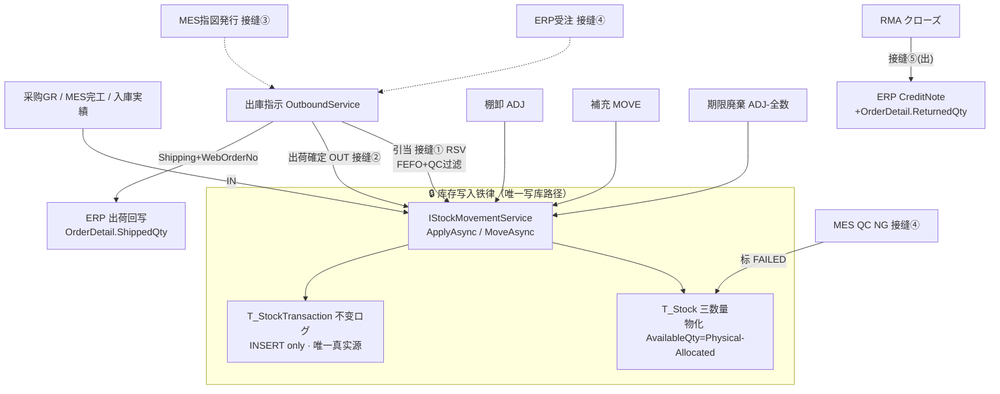

# 库存物流 WMS（倉庫管理）· 最详细用户操作培训手册（模块总册 A · BOOK-M06）

> **作用**：WMS 模块的**全局用户操作培训总册**。建立模块业务定位/角色/全流程/37 页总览，并对**主链与核心页**逐页给出 14 小节细化（7 个核心页含 `5.x.1a~1e` 增强块），对**特化/扩展页**做表格式概述；附模块级场景/测试矩阵/可执行用例/验收/术语/待确认/培训脚本。配套单页 SOP 见 `wms-pages/`（待 W5 逐页出，每页 16 节）。
> **基准**：分支 `feat/wfs-inbox-core`，盘点日 2026-06-29；**后端/接缝/错误码/状态机/采番**逐行实测于 `docs/codemap-wms/`（README+01~06，2026-06-22 权威快照），**前端 UI 粒度**经 6 组并行 agent 实读 37 个 view + `types/wms`。查不到标 `待业务确认`；功能没写标 `待实现`；代码无该项标 `代码未发现`。
> **在闭环中的位置**：WMS 是 ERP→MES→WMS 闭环的**末段**，接缝最多；样例数据承接销售总册 §0、生产总册 §0（受注/製造指図 → WMS 出入庫）。详见 [`docs/codemap-wms/README.md`](../../codemap-wms/README.md)。

---

## 0. 本手册使用的培训样例数据

> 标「培训样例」= 非系统内置，需在测试环境预置主数据；带"系统采番"的编号由系统自动生成（**月级累计** `{前缀}{yyyyMM}{NNNN}`，如 `RC2026070001`，**跨月不归零**）。本册操作步骤/SOP/测试用例尽量沿用这一套数据，与 M04 销售、M05 MES 同一条业务链。

| 数据项 | 培训样例值 | 来源/说明 |
|---|---|---|
| 製品CD / 名称 | `PRD2026070001` / A社向け5号BC楞4色印刷箱 | 承接销售总册 §0、MES 总册 §0 |
| 得意先（客户） | `CUST-A` A社 | 出荷/RMA/VMI 客户 |
| 仕入先（供应商） | `SUP01` | 入庫指示供应商（购买入库） |
| 倉庫CD | `W01`（主倉，`AllowNegative=false`） | 接缝③④的既定仓；材料出庫/完成品入庫均落 W01 |
| 库位（Location） | 完成品 `W01-FG`／收货暂存 `RECV`／拣货棚 `PIK-A-01`／保管棚 `RES-C-01`／QC合格 `W01-RCV`／RMA保留 `W01-RMA-HOLD` | 5 阶层库位（1ゾーン~5ビン），含拣货/保管/暂存/QC/RMA 各用途 |
| LotNo（批号） | `LOT2026070001`（无批管理时 `LotNo=""` 非 null） | 业务唯一键四列之一 |
| 入庫指示NO | `IN2026070001`（系统采番，前缀 `IN`） | 计划，不触达库存 |
| 入庫実績NO | `RC2026070001`（系统采番，前缀 `RC`） | **真增库存**（经铁律 `ApplyAsync(IN)`） |
| 出庫指示NO | `OUT2026070001`（系统采番，前缀 `OUT`） | 引当/出荷 |
| 梱包NO | `PKG2026070001`（系统采番，前缀 `PKG`） | 出荷確定生成（仅 Shipping 型） |
| 库存流水NO | `TXN2026070001`（系统采番，前缀 `TXN`） | 不变ログ，唯一真实源 |
| 棚卸NO | `ST2026070001`（系统采番，前缀 `ST`） | 盘点计划/快照 |
| 来源製造指図 | `WO2026070001`（MES 指図NO） | 材料出庫/完成品入庫接缝键 |
| 来源受注 | `WO20260701000001`（ERP Web受注NO） | 製品出荷指示/出荷回写接缝键 |
| 原紙ロールNO | `ROLL2026070001`（前缀 `ROLL`），grade `K280`，巾 `1600mm` | 紙器特化（独立专用表，与主 Stock 解耦） |
| 単価（評価额用） | `¥120/枚` | 库存金额/差异金额/滞留分析用 |

**采番前缀总表**（`WmsSequenceService`，月级累计、跨月不归零）：

| 主线 | 前缀 | 紙器/连携特化 | 前缀 |
|---|---|---|---|
| 入庫指示 | `IN` | 原紙ロール | `ROLL` |
| 入庫実績 | `RC` | インキ | `INK` |
| 出庫指示 | `OUT` | 残材 | `REM` |
| 梱包 | `PKG` | Kit | `KIT` |
| 库存流水 | `TXN` | Slotting | `SLP` |
| 棚卸 | `ST` | Cross-Dock | `XD` |
| 運送便 | `SHIP` | サンプル | `SMP` |
| QC検品 | `QC` | パレット | `PLT` |
| — | — | 版型在庫 | `PLT2`（`PLT` 被パレット占用） |

> ⚠️ 除"系统采番"项外，倉庫/库位/製品/客户/供应商等主数据须**先建档**，否则入庫无处落、引当找不到候选、展开为空。各核心页"业务前置检查清单"会再次提示。

---

## 1. 模块业务定位

**库存物流 WMS（倉庫管理）是 ERP→MES→WMS 闭环的"末段执行层"**：把采购收货、生产完工、销售出荷、退货返品等所有**实物移动**收口为一套可追溯的库存账，并向上游回写出荷/退货结果。

- **解决什么业务问题**：货放在哪、还剩多少、能不能引当、先出哪一批（FEFO）、出了货要不要回写订单、退回来怎么处理、纸卷/油墨/托盘/版型这些非标库存怎么管——全由 WMS 承接。
- **铁律 = 库存写入唯一入口 `IStockMovementService`**：`T_Stock` 严禁直接 `Update/Add`，所有数量变动必经它，在**单事务**内同时①更新三数量②追加不变ログ `T_StockTransaction`。这是整个模块的地基（详见 §3、§5.3）。
- **在 CP6 整体中的位置**：

| 维度 | 内容 |
|---|---|
| 上游 | 采购 GR（委托入庫）、MES 完工（完成品入庫）、MES 指図発行（材料出庫）、ERP 受注（製品出荷指示）、ERP 受注取消（解引当级联） |
| 本模块主链 | 入庫指示→入庫実績（真增库存）→在庫照会→出庫指示→引当→ピッキング→梱包・出荷（真减库存+回写）；旁链 棚卸/補充/期限/QC/RMA |
| 下游 | **ERP**（出荷確定→`OrderDetail.ShippedQty` 回写；RMA クローズ→CreditNote+`ReturnedQty`）、**MES**（材料不足→缺料看板）、财务（间接，经 ERP） |
| 数据影响面 | 库存三数量（实物/引当/可用）、不变流水账、出荷/退货回写、缺料告警、批次追溯、紙器特化在库 |

---

## 2. 适用角色与职责

| 角色 | 主要职责 | 可操作页面 | 不能随意操作 | 备注 |
|---|---|---|---|---|
| 仓库管理员 | 倉庫/库位主数据、出庫ルーティング、滞留/报表监看 | 倉庫マスタ、ロケーション、出庫ルーティング、Dashboard、报表中心 | 主数据删除（有库存残不可删）、库位编码（禁改） | 底座维护 |
| 库管员（入出庫担当） | 入庫指示/実績、出庫指示/引当、棚卸、补充、期限处置 | 入庫指示/実績、出庫指示、棚卸、補充、期限管理 | 已发行/已完了单据改字段 | 现场主力 |
| 现场作业者（拣货/RF） | ピッキング、RF 手持作业、梱包出荷 | ピッキング、RF移动作業、梱包・出荷 | — | RF MOVE 真移库存 |
| 品保/检品员 | 入荷検品、QC 状态设置、Lot 追溯/召回、RMA 判定 | 検品QC、在庫照会(QC)、ロットトレース、返品RMA | — | NG/FAILED 阻出货 |
| 调墨/纸器担当 | 原紙巾割/消費、インキ混合/调色、版型使用记录、残材/パレット/サンプル | 原紙ロール、インキ、版型在庫、残材、パレット、サンプル | — | 特化在库 |
| 仓库主管/运营 | KPI 监看、ABC/滞留分析、VMI 保管料、Bridge 健康（M07） | Dashboard、报表中心、VMI、（Bridge健康看板归 M07） | — | 多为只读 |
| 运维/设备 | WCS 任务下发、IoT 监控 | WCS連携、IoT監視 | — | 自动化连携 |

> 角色与权限为**数据驱动**（PUB 四粒度）；多数 WMS 端点仅 `[Authorize]`，**按钮级细粒度权限未明确**（`待业务确认`，见 §10，回填 M02 PUB 结论）。

---

## 3. 模块完整业务流程

**起点**：货物到达（采购/生产/退货）或订单需出货。**终点**：库存账平、出荷/退货已回写上游、可追溯。

**八个跨模块接缝**（全部 best-effort + `IntegrationEvent` 持久化审计，Hook 内 try/catch 吞错，绝不让父操作回滚；Bridge 健康看板属 M07）：

| 接缝 | 方向 | 触发 | 动作 | 开关 |
|---|---|---|---|---|
| ① 引当 Phase7 | WMS 内 | `AllocateAsync` | `QcStatus∉{FAILED,HOLD}`+FEFO 选候选→RSV；材料不足写缺料看板不抛、非材料抛异常 | — |
| ② 出荷回写 | WMS→ERP | `ShipAsync`（Shipping+WebOrderNo） | `OnShipmentConfirmedAsync` 按製品CD充当 `OrderDetail.ShippedQty/ShipStatus` | `ErpBridge:Enabled` |
| ③ 材料出庫 | MES→WMS | 指図 `IssueAsync` | `CreateFromWorkOrderAsync` 指図材料→Material 出庫指示(W01,Draft) | `WmsBridge:Enabled`（默认 true） |
| ④ 製品出荷 | ERP→WMS | 受注 `CreateAsync` | `CreateFromOrderAsync` 受注明细→Shipping 出庫指示(W01,Draft) | `MesBridge`/`WmsBridge` |
| ⑤ 取消级联 | ERP→WMS | 受注取消 | `CancelOrderAsync` UNRSV 解引当（仅 `Status<Picking` 自动） | — |
| (入)完成品入庫 | MES→WMS | 全工程完了 | `CreateFinishedGoodsFromWorkOrderAsync`（幂等 `WM-MSG-043`，W01/W01-FG） | `WmsBridge:Enabled` |
| (QC)NG 阻出 | MES→WMS | QC 判 NG | `MarkLinkedStockByWorkOrder(FAILED)`→引当排除 | `IStockQcService` 注入 |
| (出)RMA回写 | WMS→ERP | RMA クローズ | `OnReturnConfirmedAsync` 生成 CreditNote+`ReturnedQty` | `ErpBridge:Enabled` |

> 接缝对端的 MES/ERP 触发点见 [codemap-mes](../../codemap-mes/README.md) 与 [codemap-erp 受注篇](../../codemap-erp/05-受注-order.md)。

---

## 4. 菜单页面总览（37 页）

> 状态机贯穿全模块；最易踩的是**出庫指示状态机含 `PartialAllocated=5`（前端 statusMap 缺这档，置 5 时裸显数字）**、**六种 `WmsTxnType`（IN/OUT/MOVE/ADJ/RSV/UNRSV）经 `ApplyDelta` 分流**、**WM-MSG 错误码全是内联字面量未入 i18n（裸码显示）**。

**A. 主链与核心页（§5.1~§5.16，14 小节详写；★=核心含 5.x.1a~1e）**

| § | 画面ID | 页面 | 路由 | 优先级 | 一句话 | 读/写 |
|---|---|---|---|---|---|---|
| 5.1 | WM010 | 倉庫マスタ | /wms/warehouse | P1 | 仓库主数据（无 Service 直操 DbContext，乐观锁） | 写(CRUD) |
| 5.2 | WM010 | ロケーション | /wms/location | P1 | 5 阶层库位树（IsPickable/IsBlocked/Barcode） | 写(CRUD) |
| 5.3 | WM020 | **在庫照会** ★ | /wms/stock | **P0** | 库存查询+履历+QC状态设置（铁律地基） | 读+QC写 |
| 5.4 | WM030 | 入庫指示一覧 | /wms/inbound-order-list | P1 | 入库计划检索/开/受入 | 读 |
| 5.5 | WM030 | 入庫指示 | /wms/inbound-order | P1 | 入库计划录入/确定/取消（不触库存） | 写 |
| 5.6 | WM040 | **入庫実績** ★ | /wms/inbound-receipt | **P0** | 確定収貨→真增库存（唯一入口，参照/直入两模式） | 写(IN) |
| 5.7 | WM040 | 完成品入庫 | /wms/product-inbound | P1 | MES 完工 Bridge 入库的手工屏（W03/W04 不过幂等护栏） | 写(IN) |
| 5.8 | WM050 | 出庫指示一覧 | /wms/outbound-order-list | P0 | 出库计划检索+自動展開 | 读 |
| 5.9 | WM050 | **出庫指示** ★ | /wms/outbound-order | **P0** | 录入/引当(接缝①)/出荷(接缝②)/取消(接缝⑤) | 写 |
| 5.10 | WM060 | **ピッキング** ★ | /wms/picking | **P0** | 扫描式拣货（行级不落库，真出库在出荷） | 写(状态) |
| 5.11 | WM070 | **梱包・出荷** ★ | /wms/packaging | **P0** | 出荷確定→真减库存+ERP 回写（接缝②） | 写(OUT) |
| 5.12 | WM090 | 棚卸一覧 | /wms/stock-take-list | P1 | 盘点检索+快照建计划 | 读 |
| 5.13 | WM090 | **棚卸** ★ | /wms/stock-take | **P1** | 盘点录入/差异确认/承认→ADJ 调整库存 | 写(ADJ) |
| 5.14 | WM050 | 材料欠品 | /wms/material-shortage | P1 | 缺料看板 resolve/dismiss（纯状态收尾不补料） | 写(状态) |
| 5.15 | WM100 | 検品QC | /wms/inspection | P1 | 入荷検品+判定（PASS 自动入库） | 写(IN) |
| 5.16 | WM150 | **返品RMA** ★ | /wms/rma | **P1** | 退货状态机+判定处置+クローズ→ERP CreditNote | 写(IN/MOVE/ADJ) |

**B. 特化与扩展页（§5.17~§5.21，表格概述）**

| § | 分组 | 页面（画面ID/路由） |
|---|---|---|
| 5.17 | 库存分析与设置 | 在庫滞留 WM020(/stock-dwell)、出庫ルーティング(/outbound-routing)、期限管理 WM170(/expiry)、ロットトレース WM160(/lot-trace) |
| 5.18 | 物流优化作业 | 補充 WM120(/replenish)、クロスドック WM130(/cross-dock)、スロッティング WM110(/slotting)、キット WM140(/kit) |
| 5.19 | 紙器業特化 | 原紙ロール WM200(/paper-roll)、残材 WM210(/remnant)、版型在庫 WM220(/plate-mold-stock)、インキ WM230(/ink-lot)、パレット WM240(/pallet)、サンプル WM260(/sample-stock) |
| 5.20 | 業界連携・寄售 | RF移动作業 WM300(/mobile-task)、WCS連携 WM310(/wcs-task)、配送Carrier WM320(/carrier)、IoT監視 WM330(/iot-monitor)、VMI WM250(/vmi) |
| 5.21 | 看板与报表 | WMS Dashboard(/dashboard)、报表中心 WM900(/report-center) |

> **状态机速查**：入庫指示 `0下書き/1確定/2入庫中/3完了/9取消`；出庫指示 `0Draft/1Confirmed/2Allocated/3Picking/4Completed/5PartialAllocated/9Cancelled`；棚卸 `0Planned/1Counting/2DiffReview/3AwaitingApproval/4Completed/9Cancelled`；RMA `1Authorized/2Received/3Inspecting/4Judged/5Closed/9`；六种 `WmsTxnType`=IN/OUT/MOVE/ADJ/RSV/UNRSV。

---

## 5. 页面详细操作说明

> 主链与核心页（§5.1~§5.16）每页 14 小节，核心页（5.3/5.6/5.9/5.10/5.11/5.13/5.16）含 `5.x.1a~1e` 增强块。特化/扩展页（§5.17~§5.21）表格概述。**坑点统一提醒**：①库存数量变动**必经 `IStockMovementService`**，主数据 CRUD 与 QC 状态设置是合法例外；②`WM-MSG-xxx` 错误码**无 i18n 词条（前端裸码显示）**；③子表多为"全删全插"；④倉庫/库位用 `RowVersion` 乐观锁（冲突 409 `WM-MSG-072`），库存/业务单据多数**不做乐观锁**。

### 5.1 倉庫マスタ（Warehouse · WM010 · /wms/warehouse）

**5.1.1 页面业务目的**：维护仓库主档（增删改查），含仓库类型、**负库存允许标志 `allowNegative`**（直接决定库存铁律的负库存守卫放不放行）、管理者、地址。

**5.1.2 流程位置**：上游无；下游=所有入出庫/库位/库存（仓必须先存在）。

**5.1.3 谁使用**：仓库管理员/主数据维护员。

**5.1.4 操作前准备**：确定仓库编码规则（如 `W01`）与类型。

**5.1.5 页面区域**：搜索卡（仓库代码/类型/拠点 + 検索/新規）→ 列表（7 列+操作）→ 编辑弹窗（560px，8 字段）。

**5.1.6 字段填写说明**（弹窗）：

| 字段 | 控件 | 必填 | 怎么填 | 填错影响 |
|---|---|---|---|---|
| 倉庫CD(warehouseCd) | 输入(≤10) | 是(仅视觉) | 唯一编码；**编辑时禁改**（`:disabled=!!editing.id`） | 空/重复→后端 `WM-MSG-001`（前端无校验，发请求由后端拒） |
| 倉庫名(warehouseName) | 输入(≤100) | 是(仅视觉) | 业务名 | 空→后端拒 |
| 倉庫タイプ(warehouseType) | 下拉(1~5) | 否(默认1) | 1原材料/2半製品/3完成品/4不良品/5外注 | tag 着色：2 与 3 同绿色肉眼难分 |
| 拠点CD/管理者CD/住所 | 输入 | 否 | — | — |
| **負在庫許可(allowNegative)** | 开关 | 否(默认 false) | **高危**：开=该仓允许出现负库存（铁律负库存守卫放行） | 误开→可超卖出负库存 |
| 備考 | 文本域 | 否 | — | — |

**5.1.7 按钮操作**：検索/新規/編集(行)/削除(行,逻辑删)/保存/取消。

**5.1.8 业务规则与校验**：`WM-MSG-001`(CD 空/重复)、`WM-MSG-070`(更新时不存在)、`WM-MSG-072`(乐观锁 409，`RowVersion`)、**`WM-MSG-004`(有物理库存残 `PhysicalQty!=0` 不可删)**。前端必填仅视觉星号，空值由后端兜底。

**5.1.9 完成后检查**：列表出现该仓；可在其下建库位、做入庫。

**5.1.10 状态流转**：无状态机（仅启用/逻辑删）。

**5.1.11 常见错误**：编辑想改 CD（禁改）；删除有库存残的仓（`WM-MSG-004`）；误开 `allowNegative`。

**5.1.12 注意事项**：**倉庫/库位 CRUD 无 Service 层**（Controller 直操 DbContext），是库存铁律的对照例外——铁律只约束库存数量变动。

**5.1.13 标准操作步骤**：新規→填 W01+名称+类型+（视需要）allowNegative→保存→列表确认。

**5.1.14 本页面测试点汇总**：CD 必填/重复(`WM-MSG-001`)/编辑禁改 CD/乐观锁冲突(`WM-MSG-072`)/有库存残拒删(`WM-MSG-004`)/allowNegative 影响负库存守卫/类型 tag 2·3 同色(`待业务确认`)。

---

### 5.2 ロケーション（Location · WM010 · /wms/location）

**5.2.1 页面业务目的**：维护库位（左选仓库右维护该仓库位），含 5 阶层（1ゾーン~5ビン）、坐标、容量、`IsPickable`(可拣货)/`IsBlocked`(冻结)/`Barcode`。

**5.2.2 流程位置**：上游=倉庫；下游=入庫上架货位、引当/拣货位（`PIK-`）、保管位（`RES-`）。

**5.2.3 谁使用**：仓库管理员。**5.2.4 操作前准备**：仓库已建；明确库位编码与层级。

**5.2.5 页面区域**：左卡（仓库列表 span6，点选高亮）→ 右卡（该仓库位表 span18，三态空提示）→ 编辑弹窗（540px，11 字段，X/Y/Z 整数坐标）。

**5.2.6 字段填写说明**：

| 字段 | 控件 | 必填 | 怎么填 | 填错影响 |
|---|---|---|---|---|
| 库位CD(locationCd) | 输入(≤30) | 是 | 唯一；**编辑禁改**（`:disabled=!isNew`） | 空→前端 warning 拦截 |
| 倉庫CD(warehouseCd) | 输入 | — | 自动带选中仓，**永远禁用** | — |
| 上级库位(parentLocationCd) | 输入(≤30) | 否 | 建树用 | 父不存在→`WM-MSG`(裸文本)；父冻结→`WM-MSG-003` |
| 层级(locationLevel) | 下拉(1~5) | 否(默认5) | 1区/2通道/3货架/4层/5货位 | `>5`→`WM-MSG-002`（5 段封顶） |
| 坐标 X/Y/Z | 数字(整数) | 否 | 整数坐标（precision 0，不支持小数） | — |
| 容量(capacityQty) | 数字(≥0) | 否(默认0) | **0=無制限** | — |
| 可拣货(isPickable) | 开关 | 否(默认true) | 关→不可拣货 | — |
| 冻结(isBlocked) | 开关 | 否(默认false) | 开→冻结（下游禁用） | — |
| 条码(barcode) | 输入(≤50) | 否 | RF 扫码用 | — |

**5.2.7 按钮操作**：左刷新/右新規(未选仓灰)/右刷新/編集/削除/保存/取消。

**5.2.8 业务规则与校验**：`WM-MSG-001`(CD 重复)、`WM-MSG-002`(层级>5)、`WM-MSG-003`(父冻结)、`WM-MSG-004`(有库存残不可删)。`onSave` 仅校验 CD 非空。

**5.2.9 完成后检查**：库位表出现该位；可作入庫/引当目标。

**5.2.10 状态流转**：无（仅 isPickable/isBlocked 标志 + 逻辑删）。

**5.2.11 常见错误**：未选仓库就想新建（按钮灰）；编辑想改 CD（禁改）。

**5.2.12 注意事项**：⚠️ **`isNew` 用"该 CD 是否已在当前列表"启发判断**（前端 bug 隐患）：新建时若输入一个与现有库位重复的 CD，`isNew` 翻 false→保存会走 `updateLocation` 静默覆盖已有库位，无冲突提示（`LocationListView.vue:137,201-205`，记 `待业务确认`）。

**5.2.13 标准操作步骤**：左选 W01→右新規→填库位CD+层级+（视需要）父/坐标/容量/标志→保存。

**5.2.14 本页面测试点汇总**：CD 必填/重复(`WM-MSG-001`)/层级>5(`WM-MSG-002`)/父冻结(`WM-MSG-003`)/有库存残拒删(`WM-MSG-004`)/编辑禁改 CD/未选仓按钮灰/**重复 CD 静默覆盖 bug**(`待业务确认`)/容量0=无限。

---

### 5.3 在庫照会（StockQuery · WM020 · 核心 · /wms/stock）

**5.3.1 页面业务目的**：库存照会的中枢——按仓库/库位/品番/批次查实时三数量（物理/引当/可用），看单条库存的**变动履历**，并设置 **QC 检验状态**（PENDING/PASSED/FAILED/HOLD）。本页是理解库存铁律的窗口：照会**只读**，QC 设置是铁律的合法例外（只改属性标志、三数量不动、不发 Txn）。

**5.3.1a 业务前置检查清单（操作前必看）**
- [ ] 仓库/库位主数据已建；已有入庫产生的库存（否则查无数据）。
- [ ] 业务唯一键四列概念清楚：`倉庫CD+库位CD+品番CD+LotNo`（无批管理时 `LotNo=""` 非 null）。
- [ ] 三数量恒等式 `可用 = 物理 − 引当`，**可用永不手填**，每次变动末尾强制重算。
- [ ] 要设 QC 状态前，先想清下游影响：标 **FAILED/HOLD 即被出库引当排除**（只 PENDING/PASSED 可引当）。

**5.3.1b 关键字段业务填写口径**
| 字段 | 谁提供 | 怎么填 | 填错影响 |
|---|---|---|---|
| 检索·所有者(ownerType) | 仓管 | SELF=自社 / CUSTOMER=客供(VMI) | 选 CUSTOMER 看寄售库存 |
| 检索·hasStockOnly | 仓管 | 默认勾选（只看有库存行）；取消→含 0 库存行 | — |
| QC·新状态(qcNewStatus) | 品保 | 4 选 1：PENDING/PASSED/FAILED/HOLD | **必选**（不选确认按钮灰）；FAILED→阻出货 |
| QC·事由(qcReason) | 品保 | ≤200 字，可空 | 留痕用 |

**5.3.1c 灰按钮 / 不可操作说明**
| 按钮/字段 | 何时灰/只读 | 原因 |
|---|---|---|
| QC 弹窗·确认 | `!qcNewStatus`（未选新状态） | 防空提交 |
| QC 弹窗·取消 | 保存中（`qcSaving`） | 防并发 |
| 物理/引当/可用 等所有表格列 | 永久只读 | 照会页不在此改数量（移库/调整走专属流程） |

**5.3.1d 完成后检查点与下游验证（★设 QC 后必做★）**
- 查询：命中行三数量正确；可用<0 时**红色加粗**（class `neg`）= 该仓允许负库存或异常。
- **设 QC=FAILED 后**：① 该行 qc 列 tag 变红（FAILED）；② 去出庫指示做引当，`FindCandidateStockAsync` 的 `QcStatus∉{Failed,Hold}` 过滤会**排除该批**→不可被引当出货。
- 履历：点行「履歴」看该业务键的 `T_StockTransaction` 全时序流水（按四列反查，**不靠外键**，证明 Txn 是唯一真实源）。

**5.3.1e 详细操作场景（SOP）**
- **场景一·查在库**：填仓库/品番→検索→看物理/引当/可用→（可用红字=负库存预警）。
- **场景二·看履历溯源**：行「履歴」→弹窗看 IN/OUT/RSV/UNRSV/MOVE/ADJ 流水（默认拉近 365 天）。
- **场景三·QC 判 FAILED 阻出货**：行「QC設定」→选 FAILED+填事由→确认→该批被引当排除。
- **场景四·解除 HOLD 恢复可引当**：行「QC設定」→改回 PASSED→可再被引当。
- **场景五·VMI 客供库存核对**：所有者选 CUSTOMER→査客先寄售在库（owner 列显黄 tag）。

**5.3.2 流程位置**：所有库存的查询枢纽；上游=入庫/调整产生库存，下游=出庫引当（受 QC 状态影响）。

**5.3.3 谁使用**：仓库管理员/库管员（查）、品保（QC 设置）。

**5.3.4 操作前准备**：见 5.3.1a。

**5.3.5 页面区域**：搜索卡（5 检索框+hasStockOnly 复选+検索/クリア）→ 列表卡（total + 13 列，含 owner/flag(recall)/qc tag + 分页 50/100/200）→ QC 设置弹窗（520px）→ 履历弹窗（900px，descriptions+流水表）。

**5.3.6 字段填写说明**：见 5.3.1b（检索 5 字段 + QC 弹窗 2 字段）。

**5.3.7 按钮操作**：

| 按钮 | 动作 | 启用条件 | 影响 |
|---|---|---|---|
| 検索/クリア | reload / 重置(hasStockOnly 复位 true) | 常显 | 只读 |
| 履歴(行) | `stockApi.history(id, 365)` 弹窗 | 每行 | 只读 |
| QC設定(行) | 开 QC 弹窗 | 每行 | 仅开窗 |
| QC 确认 | `setQcStatus(id,status,reason)`→局部更新+reload | `!qcNewStatus` 时灰 | **改 QC 状态**（FAILED→阻出货） |

**5.3.8 业务规则与校验**：QC 状态非法值→`WM-MSG-QC-001`；Stock 不存在→`WM-MSG-QC-404`；新状态空→裸文本。`StockQcStatus.IsAllocatable` = PENDING/PASSED 可引当，FAILED/HOLD 阻断。

**5.3.9 完成后检查**：见 5.3.1d。

**5.3.10 状态流转**：QC 状态 PENDING↔PASSED↔FAILED↔HOLD（无固定单向，由人工/QC 接缝设置）；库存数量本身不在此页变。

**5.3.11 常见错误**：误以为照会页能改数量（不能，须走入出庫/调整）；履历裸显交易类型英文码（`IN/OUT/...` 无 i18n）。

**5.3.12 注意事项**：履历调用硬编码 365 天（无天数选择器）；`stockApi` 另有 `apply/move/transactions/按工单批量 QC` 但**本页无入口**（通用入口供其他模块/手工调）。

**5.3.13 标准操作步骤**：见 5.3.1e 场景一/三。

**5.3.14 本页面测试点汇总**：三数量恒等式/可用<0 红字/履历按四列反查/QC 设 FAILED→引当排除(`待业务确认`联动)/QC 非法值(`WM-MSG-QC-001`)/Stock 不存在(`WM-MSG-QC-404`)/VMI owner 过滤/交易类型裸码(i18n 缺口)。

---

### 5.4 入庫指示一覧（InboundOrderList · WM030 · /wms/inbound-order-list）

**5.4.1 页面业务目的**：检索入庫予定（入庫指示单）清单，跳开单或去收货。**不写库存**，纯查询+导航。

**5.4.2 流程位置**：入庫指示的台账入口；行操作跳 5.5 详情、5.6 收货。

**5.4.3 谁使用**：库管员/采购。**5.4.4 操作前准备**：已有入庫指示数据。

**5.4.5 页面区域**：检索卡（6 条件 inline + 査找/新規）→ 结果表（8 列含状态/类型 tag，`pageSize:100` **无分页器**）。

**5.4.6 检索条件**：入庫指示No/仕入先CD/倉庫/状態(下拉)/入荷予定 From-To。

**5.4.7 按钮操作**：検索/新規(→5.5)；行：開く(→/wms/inbound-order?no=)、入庫実績(→/wms/inbound-receipt?inboundNo=)。

**5.4.8 业务规则与校验**：纯查询无业务错误码。⚠️ 行内「入庫実績」按钮**无状态门控**（下書き/取消/完了单也显示），跳到收货页才靠 `loadOrder` 校验状态。

**5.4.9 完成后检查**：检索命中；导航正确。**5.4.10 状态流转**：见 §4（列以 tag 着色：0灰/1蓝/2橙/3绿/9红）。

**5.4.11 常见错误**：>100 条被截断（无分页）；对非可收货单点「入庫実績」（跳过去才报状态错）。

**5.4.12 注意事项**：类型 typeMap 1購買/2外注戻/3返品/9その他。

**5.4.13 标准操作步骤**：填条件→検索→開く/入庫実績。

**5.4.14 本页面测试点汇总**：组合检索/状态过滤/类型 tag/行导航/超 100 条截断(无分页)/收货按钮无状态门控。

---

### 5.5 入庫指示（InboundOrder · WM030 · /wms/inbound-order）

**5.5.1 页面业务目的**：录入/编辑一张入庫予定单（头+明细），保存→確定→（去收货）。**不触达库存**，只管单据生命周期 `0下書き→1確定→9取消`（计划是计划）。

**5.5.2 流程位置**：上游=计划/采购 PO；下游=入庫実績（参照本单收货）。

**5.5.3 谁使用**：库管员/采购。**5.5.4 操作前准备**：仓库已建；明确品番/予定数量/予定棚。

**5.5.5 页面区域**：头卡（标题+状态 tag + 7 头字段）→ 明细卡（9 列，editable 时显「明細追加」）→ 底部固定操作条（戻る/保存/確定/取消/削除/入庫実績登録）。

**5.5.6 字段填写说明**（头+明细，`editable=status===0`）：

| 字段 | 控件 | 必填 | 怎么填 | 填错影响 |
|---|---|---|---|---|
| タイプ(inboundType) | 下拉 | 视觉 | 1購買/2外注戻/3返品/9その他 | **onSave 不校验**，靠后端 |
| 入庫倉庫(warehouseCd) | 输入(≤10) | 视觉 | 仓库代码 | 同上未强制 |
| 入荷予定日(expectedArrivalDate) | 日期(默认今天) | 视觉 | — | 同上 |
| 仕入先CD/名、PO No、備考 | 输入 | 否 | PO No 手填（关联采购，非选） | — |
| 明细·製品CD(productCd) | 输入(≤20) | 实务必填 | 产品代码 | 仅校验「明细行数>0」 |
| 明细·予定数量(expectedQty) | 数字(≥0) | 实务必填 | 预计到货数 | 收货差额算法的基数 |
| 明细·入庫済(累計) | **只读** | — | 系统回填已收量 | — |
| 明细·予定棚(expectedLocationCd) | 输入(≤30) | 否 | 预定货位，收货时带入 | — |
| 明细·単位/単価 | 输入/数字 | 否 | — | 带入收货行 |

**5.5.7 按钮操作**：

| 按钮 | 动作 | 显示/启用条件 | 影响 |
|---|---|---|---|
| 明細追加/行削除 | 增删明细行 | `editable`(status===0) | — |
| 保存 | create/update | `editable`；空明细→warning | 持久化单据，不动库存 |
| 確定 | confirm（→1） | `!isNew && status===0` | 改状态 0→1 |
| 取消 | cancel（→9） | `!isNew && status≠9 && status≠3` | 改状态→9 |
| 削除 | 逻辑删 | `!isNew && status===0` | 软删单据 |
| 入庫実績登録 | →收货页 | `!isNew && (status===1‖2)` | 仅导航，真写库存在收货页 |

**5.5.8 业务规则与校验**：`WM-MSG-070`(不存在)、`WM-MSG-043`(状态守卫：更新须 `Draft‖Confirmed`、確定须 `Draft`、Completed 不可取消)、`WM-MSG-020`(明细0件)、`WM-MSG-021`(予定数量≤0)。**明细全删全插**（保留既往 `ReceivedQty` 累计）。

**5.5.9 完成后检查**：確定后 Status→1，可去收货；列表状态更新。

**5.5.10 状态流转**：`0下書き→(確定)→1確定→(收货)→2入庫中→3完了`，旁路 9取消。

**5.5.11 常见错误**：確定/入庫中后想改字段（全屏只读）；头字段必填未前端强制（空仓库也能提交）。

**5.5.12 注意事项**：**单据一旦確定(1)/入庫中(2)/完了(3)/取消(9) 即全屏只读**（`editable=status===0`）；不触库存。

**5.5.13 标准操作步骤**：新規→填头+明细→保存→確定→入庫実績登録（去 5.6）。

**5.5.14 本页面测试点汇总**：录入/确定/取消/删除生命周期/状态守卫(`WM-MSG-043`)/明细0件(`WM-MSG-020`)/全删全插保留累计/确定后只读/必填仅视觉(后端兜底)。

---

### 5.6 入庫実績（InboundReceipt · WM040 · 核心 · /wms/inbound-receipt）

**5.6.1 页面业务目的**：**真增库存的唯一入口屏**。登记实际收货并**当场确定+反映库存**（API 注释「受入登録=同時に確定+在庫反映」）。「入庫確定」按钮一点，逐明细经 `IStockMovementService.ApplyAsync(IN)` 真增库存、追加不变ログ、回填 `StockTxnNo`。两种模式：参照（带 `?inboundNo=`）/ 直入。

**5.6.1a 业务前置检查清单（操作前必看）**
- [ ] 库存铁律：本页确定=唯一真增库存动作，会进单事务（更新 Stock 三数量 + 追加 Txn）。
- [ ] 参照模式：来源入庫指示状态须 `Confirmed(1)‖PartialReceived(2)`，否则取込被拒（`WM-MSG-043`）。
- [ ] 上架库位（locationCd）已在库位主数据存在；批次（LotNo）策略明确（无批填空字符串）。
- [ ] 负库存：IN 是正数加库存，一般不触发负库存守卫；但 `ApplyAsync` 校验 `Qty>0`（`WM-MSG-021`）。

**5.6.1b 关键字段业务填写口径**
| 字段 | 谁提供 | 怎么填 | 填错影响 |
|---|---|---|---|
| 参照入庫指示No(inboundNo) | 库管 | 填予定单号点「取込」；留空=直入 | 已有值即只读 |
| 入庫区分(sourceType) | 系统/库管 | PURCHASE/PRODUCTION/RMA/MANUAL；**取込强制改 PURCHASE** | 参照模式下手选失效 |
| 入庫倉庫(warehouseCd) | 库管 | 仓库代码 | 空→warning 拦截 |
| 明细·製品CD/棚番/入庫数 | 库管 | 三者必填，入庫数>0 | 任一不过→warning 拦截不发请求 |
| 明细·LotNo | 库管 | 批次（**类型必填但 UI 未校验，可空提交**） | 后端按 lot 建库存键 |
| 明细·賞味期限(expiryDate) | 库管 | FEFO 引当用 | — |

**5.6.1c 灰按钮 / 不可操作说明**
| 按钮/字段 | 何时灰/只读 | 原因 |
|---|---|---|
| 取込 | `!form.inboundNo` | 无予定号不可取 |
| 参照入庫指示No 框 | 已有值（`!!form.inboundNo`） | 取过号即锁死不可改 |
| 入庫確定 | 校验不过（明细0/仓库空/行字段缺） | 防脏数据真增库存 |

**5.6.1d 完成后检查点与下游验证（★确定后必做★）**
- 确定：生成实绩NO（`RC…`），`WM-MSG-071` 成功，跳回列表。
- **库存真增**：去在庫照会（5.3）查 → 该业务键 `PhysicalQty += 入庫数`；行「履歴」见一条 `IN` 流水（`RelatedType=INBOUND`，`StockTxnNo` 回填到实绩明细）。
- **参照模式**：来源入庫指示明细 `ReceivedQty += 入庫数`，予定状态自动迁移：全收→`Completed(3)`/部分→`PartialReceived(2)`。

**5.6.1e 详细操作场景（SOP）**
- **场景一·参照予定收货（主流程）**：填予定单号→「取込」→自动拉未收满行、按"予定−已收"差额回填→核对/改库位→「入庫確定」→库存真增。
- **场景二·直入收货（无予定）**：留空单号→手工逐行录製品/库位/数量→確定。
- **场景三·部分收货**：取込后改某行入庫数<差额→確定→予定状态→PartialReceived(2)，可再次收货。
- **场景四·收货校验拦截**：仓库空/行缺库位/数量≤0→「入庫確定」warning 拦截不发请求。
- **场景五·采购 GR 委托入庫（后台）**：采购收货经 `WmsReceiveServiceAdapter` 自动建予定→確定→收货实绩（落 `RECV` 暂存位，`PoNo` 钩子），无需本屏手操（见 §3、§5.15）。

**5.6.2 流程位置**：上游=入庫指示（参照）/采购GR/MES完工/直入；下游=在庫（真增）→可被引当出货。

**5.6.3 谁使用**：收货员/库管员。

**5.6.4 操作前准备**：见 5.6.1a。

**5.6.5 页面区域**：头卡（模式徽标「直接入庫/予定参照」+ 7 头字段，参照No 带「取込」append）→ 明细卡（10 列，「明細追加」常显）→ 底部固定条（戻る/入庫確定）。**本页无列表/查询入口**，只能从 5.4/5.5 导航或 URL 进入。

**5.6.6 字段填写说明**：见 5.6.1b。

**5.6.7 按钮操作**：

| 按钮 | 动作 | 启用条件 | 影响库存 |
|---|---|---|---|
| 取込 | `loadOrder()` 拉予定差额 | `!form.inboundNo` 时灰 | 否（仅取予定） |
| 明細追加/行削除 | 增删明细 | 常显 | 否 |
| **入庫確定** | `confirm(form)`→`ApplyAsync(IN)` | 校验不过则中断 | **★真增库存★** + 生成 receiptNo |

**5.6.8 业务规则与校验**：`ValidateReceipt`→`WM-MSG-031`(仓库空/明细0/行字段缺/数量≤0)、参照状态错`WM-MSG-043`、予定不存在`WM-MSG-070`、IN 要求正数`WM-MSG-021`、库存不足`InsufficientStockException`(`WM-MSG-040`，IN 一般不触发)。

**5.6.9 完成后检查**：见 5.6.1d。

**5.6.10 状态流转**：实绩本身 `status` 恒 0 直到提交（新建即确定型）；影响来源予定 1/2→3。

**5.6.11 常见错误**：取込后忘了 sourceType 被强制改 PURCHASE；LotNo 漏填（UI 未校验，可空提交）；超收（实收>差额）前端不拦靠后端。

**5.6.12 注意事项**：**取込强制 `sourceType=PURCHASE`**（覆盖手选）；收货页无查询入口；真增库存按钮就这一个。

**5.6.13 标准操作步骤**：见 5.6.1e 场景一。

**5.6.14 本页面测试点汇总**：参照取込差额回填/直入收货/部分收货→予定状态迁移/确定真增库存(`IN`+`StockTxnNo`回填)/校验拦截(`WM-MSG-031`)/参照状态错(`WM-MSG-043`)/取込强制 PURCHASE/LotNo 漏校验/采购GR委托链(RECV+PoNo)。

---

### 5.7 完成品入庫（ProductionInbound · WM040 · /wms/product-inbound）

**5.7.1 页面业务目的**：产线/仓管的大字号扫码式快录屏，手工登记完成品（良品/不良品）入库，**确定即写库存**（复用 `inboundReceipt.confirm`，`sourceType=PRODUCTION`）。与 MES 完工自动入庫（接缝(入)）并存。

**5.7.2 流程位置**：上游=MES 完工（自动通道）或手工录入；下游=完成品在库→出荷。

**5.7.3 谁使用**：产线/仓管。**5.7.4 操作前准备**：完成品已下线；明确良/不良与落仓。

**5.7.5 页面区域**：左 14 栏简易入庫表单（大号控件，WO 扫码框→製品→ロット→数量→品質→倉庫→棚番→賞味期限→備考→巨型确定按钮）→ 右 10 栏直近入庫履歴（只读，`filter(sourceType==='PRODUCTION')`）。

**5.7.6 字段填写说明**：

| 字段 | 控件 | 必填 | 怎么填 | 填错影响 |
|---|---|---|---|---|
| 製造指図No(workOrderNo) | 输入(回车) | 否 | 扫码/手填；回车仅在 LotNo 空时拼建议 lot，**不查 MES** | — |
| 製品CD/製品名 | 输入 | 製品CD 必填 | — | 校验拦截 |
| ロット(lotNo) | 输入+自動採番 | 是 | 手填或点採番（`WO-YYYYMMDD-随机4位`） | 空→拦截 |
| 数量(receivedQty) | 数字(≥0) large | 是>0 | 完成数 | ≤0→拦截 |
| **品質(quality)** | 单选 GOOD/DEFECTIVE | 是 | 良品/不良品 | **切换自动改倉庫** |
| 倉庫(warehouseCd) | 输入 large | 是 | 默认 GOOD→W03 / DEFECTIVE→W04（硬编码，可手改） | 空→拦截 |
| 棚番(locationCd)/賞味期限/備考 | 输入/日期/文本 | 棚番必填 | — | 棚番空→拦截 |

**5.7.7 按钮操作**：自動採番（生成 lot）/刷新（拉履历）/**入庫確定**（组 DTO sourceType=PRODUCTION,status=1→`confirm`→**真增库存**，成功清屏+聚焦+reload）。

**5.7.8 业务规则与校验**：5 项手工 if 校验（lot/wh/loc/qty>0），`required` 仅视觉；后端走 `ConfirmReceiptAsync→ApplyAsync(IN)`。

**5.7.9 完成后检查**：在庫照会查到完成品库存（默认 W03/W04）；右栏履历新增一条。

**5.7.10 状态流转**：无状态机（每次新建即确定，写死 status=1）。

**5.7.11 常见错误**：⚠️ **默认落仓 W03(良)/W04(不良)，与 MES 自动通道的 W01/W01-FG 不一致**；手工屏**无幂等/防重护栏**（同一 WO+lot 可重复确定多次，每次新增库存）；WO 扫码不联动 MES（`待实现`）；不良品直入 W04 完全旁路 QC（不置 FAILED）。

**5.7.12 注意事项**：自动完成品入庫的幂等护栏只在后端 `CreateFinishedGoodsFromWorkOrderAsync`（键 `WorkOrderNo+PRODUCTION`，`WM-MSG-043`）；本手工屏不过护栏。

**5.7.13 标准操作步骤**：扫 WO→填製品/lot/数量→选品質→（确认仓/棚）→入庫確定。

**5.7.14 本页面测试点汇总**：良/不良切换改仓/确定真增库存/无幂等护栏(重复入庫)(`待业务确认`)/默认 W03·W04≠W01-FG/WO 不联 MES(`待实现`)/不良旁路 QC/必填手工校验。

---

### 5.8 出庫指示一覧（OutboundOrderList · WM050 · /wms/outbound-order-list）

**5.8.1 页面业务目的**：出庫指示（材料出庫/出荷）检索清单，又是「自動展開」桥——从 MES 製造指図 / ERP 受注 一键生成出庫指示。

**5.8.2 流程位置**：出庫指示台账入口 + 接缝③④的手动触发点；行跳 5.9 详情。

**5.8.3 谁使用**：出荷担当/库管。**5.8.4 操作前准备**：有出庫数据或待展开的指図/受注。

**5.8.5 页面区域**：检索卡（6 条件 + 検索/新規/桥）→ 表格（含 type/status tag，`pageSize:100` **无分页**）→ bridgeDialog（500px，fromWo/fromOrder 两输入各带「展開」）。

**5.8.6 检索条件**：出庫No/種別/ステータス(**下拉缺 5**)/製造指図No/Web受注No/得意先CD。

**5.8.7 按钮操作**：検索/新規(→5.9)/桥(开 bridgeDialog)；行 開く(→详情)；展開(fromWo/fromOrder)→后端生成新出庫指示→跳详情。

**5.8.8 业务规则与校验**：展開即接缝③④，去重键 `WorkOrderNo`/`WebOrderNo`（已有未取消单→`WM-MSG-043`）。

**5.8.9 完成后检查**：展開后生成 Draft 出庫指示，需后续 Confirm→Allocate。**5.8.10 状态流转**：见 §4。

**5.8.11 常见错误**：⚠️ **statusMap 缺 `5 PartialAllocated`**→列表该档**裸显数字 5**，tag 降级 info；>100 条截断（无分页）。

**5.8.12 注意事项**：种别 1材料/2出荷/3社内振替/9その他。

**5.8.13 标准操作步骤**：填条件→検索→開く；或 桥→填指図/受注号→展開。

**5.8.14 本页面测试点汇总**：组合检索/自動展開生成(接缝③④)/去重(`WM-MSG-043`)/状态5裸显数字(UI 盲点)/超100条截断。

---

### 5.9 出庫指示（OutboundOrder · WM050 · 核心 · /wms/outbound-order）

**5.9.1 页面业务目的**：单张出庫指示的录入与全生命周期操作台——保存→確定→**引当(接缝①RSV)**→**出荷(接缝②OUT+ERP回写)**→取消(接缝⑤UNRSV)。底部操作栏按状态机切换按钮。两种 `outboundType`：材料(1，缺料反流缺料看板)/出荷(2，缺料抛异常+回写 ERP)。

**5.9.1a 业务前置检查清单（操作前必看）**
- [ ] 引当前库存铁律：引当=RSV 只动 `AllocatedQty`，PhysicalQty 不变，可用随减；出荷=OUT 同减 Physical+Allocated。
- [ ] 候选库存须 `QcStatus∉{FAILED,HOLD}`、`!RecallFlag`、`OwnerType=Self`、`AvailableQty>=需求`（第一版「1明细=1lot」单行须足）。
- [ ] 出荷型（type=2）若要回写 ERP：须有 `WebOrderNo` 且 `ErpBridge:Enabled`。
- [ ] 材料型（type=1）引当不足不抛异常，写缺料看板（5.14）；出荷型不足直接抛 `WM-MSG-040` 整批回滚。

**5.9.1b 关键字段业务填写口径**
| 字段 | 谁提供 | 怎么填 | 填错影响 |
|---|---|---|---|
| 種別(outboundType) | 库管 | 1材料/2出荷/3振替/9其他；决定下方字段显隐 | — |
| 倉庫CD(warehouseCd) | 库管 | 引当源仓（多仓时由 routing 解析候选） | — |
| 製造指図No | 计划 | **仅 type=1 显**（材料出庫关联工单） | — |
| Web受注No/得意先 | 受注 | **仅 type=2 显**；WebOrderNo 是接缝②回写键 | 缺 WebOrderNo→出荷不回写 ERP |
| 明细·必要数(requiredQty) | 计划 | >0 | ≤0→`WM-MSG-021` |
| 明细·引当済/出荷済/Lot/棚番 | 系统 | **只读**，引当/出荷后回填 | — |

**5.9.1c 灰按钮 / 不可操作说明**
| 按钮/字段 | 何时灰/只读 | 原因 |
|---|---|---|
| 全部头/明细字段 | `!editable`（status≠0） | 确定后只读 |
| 保存/明細追加/行削除 | status≠0 | 仅 Draft 可编辑 |
| 確定 | `isNew‖status≠0` | 仅 Draft 可确定 |
| 引当 | `isNew‖status≠1` | 仅 Confirmed 可引当 |
| 出荷 | `isNew‖!(status===2‖3)` | 仅 Allocated/Picking 可出荷 |
| 取消 | `isNew‖status===4‖9` | 完了/已取消不可取消 |
| **5 PartialAllocated 档** | 仅剩 戻る+取消 | ⚠️ **UI 死胡同**：无 allocate/ship 前进按钮 |

**5.9.1d 完成后检查点与下游验证（★引当/出荷后必做★）**
- 引当后：① Status→Allocated(2) 或 PartialAllocated(5)；② 明细 `AllocatedQty` 回填、Lot/棚番由 FEFO 选定回填、`AllocateTxnNo` 显 RSV tag；③ 在庫照会该批 `AvailableQty` 减少（Physical 不变）。
- 出荷后：① Status→Completed(4)；② 在庫照会 Physical+Allocated 同减；③ 出荷型生成梱包NO（PKG）；④ **接缝②**：去 ERP 受注看 `OrderDetail.ShippedQty` 充当、注文追溯有 WMS→ERP 事件。
- 材料不足：写缺料看板（5.14，OPEN），Status→PartialAllocated(5)。

**5.9.1e 详细操作场景（SOP）**
- **场景一·出荷指示全链**：新規(type=2)→填 WebOrderNo/得意先/明细→保存→確定→引当（FEFO 选批）→出荷（填重量/carrier/tracking）→ERP 回写。
- **场景二·材料出庫引当不足反流**：type=1 材料单→引当→某料无候选→写缺料看板+`continue`→Status=PartialAllocated(5)。
- **场景三·出荷型引当不足整批回滚**：type=2→引当→候选不足→抛 `WM-MSG-040`，不部分引当。
- **场景四·取消解引当**：Allocated/Picking 单→取消→UNRSV 释放 `AllocatedQty-ShippedQty`（已出货部分不退）→Status=9。
- **场景五·自動展開来单确认**：从 5.8 桥展開的 Draft 单→確定→引当（接通接缝①）。

**5.9.2 流程位置**：上游=手动/接缝③④展開；下游=ピッキング/梱包出荷、ERP 回写、缺料看板。

**5.9.3 谁使用**：出荷担当/库管。**5.9.4 操作前准备**：见 5.9.1a。

**5.9.5 页面区域**：头卡（标题+状态/种别 tag + 按 type 动态显隐字段）→ 明细卡（可编辑表 + 引当済/出荷済/TXN tag）→ 底部固定条 → shipDialog（500px，出荷型显重量/carrier/tracking，材料型显提示）。

**5.9.6 字段填写说明**：见 5.9.1b。

**5.9.7 按钮操作**：

| 按钮 | 动作 | 显示条件 | 影响 |
|---|---|---|---|
| 保存 | create/update | `editable`(status0)；空明细 warning | 草稿，不动库存 |
| 確定 | confirm | `!isNew&&status===0` | 0→1 |
| 引当 | allocate（FEFO+QC过滤） | `!isNew&&status===1` | **RSV 锁库存**，1→2 或 →5 |
| 出荷 | 开 shipDialog→ship | `!isNew&&(status2‖3)` | **OUT 减库存**+梱包+回写 |
| 取消 | cancel | `!isNew&&status≠4&&≠9` | **UNRSV 解引当**，→9 |
| 削除 | delete | `!isNew&&status===0` | 删草稿 |

**5.9.8 业务规则与校验**：header 不存在→`WM-MSG-070`；非 Confirmed 引当→`WM-MSG-043`；出荷型不足→`WM-MSG-040`；明细0→`WM-MSG-020`；数量≤0→`WM-MSG-021`；ship 无可出明细→`WM-MSG-041`。**更新明细全删全插；不做乐观锁。**

**5.9.9 完成后检查**：见 5.9.1d。

**5.9.10 状态流转**：`0Draft→1Confirmed→2Allocated→3Picking→4Completed`，旁路 `5PartialAllocated`(材料不足)/`9Cancelled`。

**5.9.11 常见错误**：⚠️ **statusMap 缺 5**（标题区显「—」）+ **PartialAllocated 死胡同**（无前进按钮，只能取消，记 `待业务确认`）；引当后想改明细（只读）。

**5.9.12 注意事项**：拣货行级不在本页（见 5.10）；多仓引当由 `OutboundRoutingService` 解析候选仓（5.17）。

**5.9.13 标准操作步骤**：见 5.9.1e 场景一。

**5.9.14 本页面测试点汇总**：录入/确定/引当(RSV+FEFO+QC过滤)/出荷(OUT+回写接缝②)/取消(UNRSV)/材料不足→缺料看板+PartialAllocated/出荷不足→`WM-MSG-040`整批回滚/状态5死胡同(UI盲点)/状态守卫(`WM-MSG-043`)/全删全插无乐观锁。

---

### 5.10 ピッキング（PickingWork · WM060 · 核心 · /wms/picking）

**5.10.1 页面业务目的**：扫描式拣货作业台（左任务队列/右作业区）。⚠️ **行级拣选/短缺确认全是 client-side 本地状态，不落库**——只有「開始」会发后端请求（Status 2→3）；真正出库+库存扣减在梱包出荷（5.11）。

**5.10.1a 业务前置检查清单（操作前必看）**
- [ ] 任务队列**只收 `status=2(引当済)+3(拣货中)`**两批——`PartialAllocated(5)` 进不了拣货队列。
- [ ] 拣货是"按引当结果去库位取货"的物理动作，本系统拣货完成≠库存变动（库存在出荷扣）。
- [ ] 扫库位/扫商品须与引当回填的 locationCd/productCd 一致，否则确认按钮灰。

**5.10.1b 关键字段业务填写口径**（pick 弹窗）
| 字段 | 谁提供 | 怎么填 | 填错影响 |
|---|---|---|---|
| 棚番(扫 scan.location) | 现场扫码 | 扫库位条码 | ≠引当库位→红 alert+确认灰 |
| 商品(扫 scan.product) | 现场扫码 | 扫商品条码 | ≠引当品番→红 alert+确认灰 |
| 実績数(scan.qty) | 现场 | 默认预填=必要数；min0 max=必要数 | qty>0 才可确认 |
| 短缺·実数/理由 | 现场 | 短拣时填实数+理由 | **仅本地，不落库、不写缺料表** |

**5.10.1c 灰按钮 / 不可操作说明**
| 按钮 | 何时灰/不显 | 原因 |
|---|---|---|
| 開始 | `current.status≠2` | 仅 Allocated 可开始 |
| 完了 | `!(status===3 && allDone)` | 须拣货中且全行已处理 |
| 行確定/短缺 | 行已 done/short 或 `status≠3` | 已处理或非拣货中 |
| pick 確定 | `!canConfirmPick`（扫错/数量0） | 防误拣 |

**5.10.1d 完成后检查点与下游验证（★拣货后必做★）**
- ⚠️ **拣货「完了」不落库**：`onComplete` 仅弹提示→清空当前任务→reload，**无 complete/ship 后端调用**；`confirmPick`/`confirmShort` 仅改本地 `lineState`。刷新或切任务后本地态清空、短缺数量/理由丢失，后端 `ShippedQty` 不变。
- **真正出库**：去梱包出荷（5.11）或出庫指示详情（5.9）点「出荷確定」，才走 OUT 扣库存。
- 验证：拣货完成后**库存数量不应变**（仅引当锁定），出荷后才减。

**5.10.1e 详细操作场景（SOP）**
- **场景一·标准拣货**：左选任务（status=2）→「開始」(2→3)→逐行「行確定」扫库位+商品+数量→全行 done→「完了」（仅清任务，不落库）。
- **场景二·短拣**：某行实物不足→「短缺」填实数+理由（本地）→继续其他行→完了。
- **场景三·扫错拦截**：扫库位/商品与引当不符→红 alert，pick 確定灰，无法确认。
- **场景四·切任务丢失**：未出荷就切任务/刷新→本地拣货态全丢（需重新拣或直接去出荷）。
- **场景五·衔接出荷**：拣完→去 5.11 PackingShip 队列（status=3,type=2）→出荷確定真扣库存。

**5.10.2 流程位置**：上游=出庫指示引当(status=2)；下游=梱包出荷(真出库)。

**5.10.3 谁使用**：拣货员/现场。**5.10.4 操作前准备**：见 5.10.1a。

**5.10.5 页面区域**：左 md8 任务卡（空态 empty，任务项 No/status tag/急 tag/客户/予定日）→ 右 md16 作业区（头卡进度条+開始/完了；明细卡逐行 line-item）→ pickDialog(500px 扫库位/商品/实数)/shortDialog(420px 短缺实数+理由)。

**5.10.6 字段填写说明**：见 5.10.1b。

**5.10.7 按钮操作**：刷新（reloadTasks）/開始（startPicking,**唯一落库前提**,2→3）/完了（**仅清任务不落库**）/行確定（开 pick 弹窗）/短缺（开 short 弹窗）/pick 確定（仅本地）/short 確定（仅本地）。

**5.10.8 业务规则与校验**：`StartPickingAsync` 仅 Allocated 可（否则 `WM-MSG-043`），header 2→3；**行级数据不持久化**。

**5.10.9 完成后检查**：见 5.10.1d。

**5.10.10 状态流转**：本页只推进 header 2→3（開始）；拣货完成是前端语义，无后端状态变化。

**5.10.11 常见错误**：以为「完了」就出库了（实际不落库）；短缺以为写了缺料表（实际只本地，缺料看板由引当时产生）；statusMap 只有 2/3，其他状态 tag 渲染空。

**5.10.12 注意事项**：本页与梱包出荷脱钩（lineState 不传递）；真实出库唯一靠 `ship` API。

**5.10.13 标准操作步骤**：见 5.10.1e 场景一。

**5.10.14 本页面测试点汇总**：队列仅收 status2/3/開始落库(2→3)/**行確定·短缺·完了均不落库**(关键)/扫错拦截/切任务丢失本地态/短缺不写缺料表/真出库在出荷。

---

### 5.11 梱包・出荷（PackingShip · WM070 · 核心 · /wms/packaging）

**5.11.1 页面业务目的**：出荷类订单的梱包/出荷確定台（左待梱包队列/右梱包表单+历史）。「出荷確定」一点即调 `ship` API：逐明细 `ApplyAsync(OUT)` **真减库存**（同减 Physical+Allocated）+ 梱包採番（PKG）+ **ERP 出荷回写（接缝②）**。

**5.11.1a 业务前置检查清单（操作前必看）**
- [ ] OUT 同减 `PhysicalQty` 和 `AllocatedQty`（故注释「UNRSV 不要」）。
- [ ] 队列**固定 `status=3(拣货中) + outboundType=2(出荷)`**——材料出庫(type1)不走此页。
- [ ] 出荷型回写 ERP 需 `WebOrderNo`+`ErpBridge:Enabled`；回写靠累计 `ShippedQty` 幂等。
- [ ] 出荷数=`AllocatedQty - ShippedQty`（按引当数出，非拣货实绩——本页用 allocatedQty 而非拣货 lineState）。

**5.11.1b 关键字段业务填写口径**（梱包表单）
| 字段 | 谁提供 | 怎么填 | 填错影响 |
|---|---|---|---|
| パッケージNo(autoPkgNo) | 系统 | **只读**，出荷后回填（PKG） | — |
| CaseQty | 现场 | 默认=明细条数；min1 | — |
| 重量Kg/Volume m³ | 现场 | 实测 | — |
| 運送業者(carrierCd) | 现场 | 默认取单上或 YAMATO；YAMATO/SAGAWA/JP/SELF/OTHER | — |
| 追跡番号(trackingNo) | 现场/系统 | 手填或「採番」自动（`carrier-YYYYMMDD-rnd`） | — |

**5.11.1c 灰按钮 / 不可操作说明**
| 按钮/字段 | 何时灰/只读 | 原因 |
|---|---|---|
| パッケージNo 框 | 永久只读 | 系统采番 |
| 出荷確定 | 未选订单 | 须先选队列项 |

**5.11.1d 完成后检查点与下游验证（★出荷確定后必做★）**
- 確定：① Status→Completed(4)；② 在庫照会该批 Physical+Allocated 同减、`ShipTxnNo` 显 OUT tag；③ 生成梱包NO（PKG），落 `ShippingPackage`；④ 移出队列+刷新历史。
- **接缝②（出荷型+WebOrderNo）**：去 ERP 受注看 `OrderDetail.ShippedQty` 充当、`ShipStatus`（5部分/9全出）、注文追溯有出荷回写事件。
- best-effort SignalR `OutboundShipped` 推 WMS Dashboard。

**5.11.1e 详细操作场景（SOP）**
- **场景一·标准出荷**：左选队列项（status=3,type=2）→右填 CaseQty/重量/carrier/tracking→「出荷確定」→真减库存+采 PKG+回写 ERP。
- **场景二·追跡号自動採番**：「採番」生成 `carrier-日期-随机`→確定。
- **场景三·部分出荷复核**：出荷数=Allocated-Shipped；分批出荷累计回写 `ShippedQty`。
- **场景四·两入口共用**：也可在出庫指示详情（5.9）shipDialog 出荷，二者共用 `ship` 端点。
- **场景五·历史核对**：右下「直近出荷済パッケージ」表核对 PKG/carrier/tracking/departureTime。

**5.11.2 流程位置**：上游=拣货中出荷单(status=3,type=2)；下游=ERP 出荷回写、运送便/Carrier。

**5.11.3 谁使用**：出荷担当/现场。**5.11.4 操作前准备**：见 5.11.1a。

**5.11.5 页面区域**：左 md9 待梱包队列（空态 empty）→ 右 md15（头卡 + 商品列表只读 + 梱包入力表单 + 绿色大「出荷確定」）→ 历史卡（直近出荷済 PKG 表，调 `/wms/shipping/packages`）。

**5.11.6 字段填写说明**：见 5.11.1b。

**5.11.7 按钮操作**：刷新队列/採番（本地生成追跡号）/**出荷確定**（confirm→ship→OUT+采 PKG+回写，成功移出队列+刷历史）/刷新历史。

**5.11.8 业务规则与校验**：`ShipAsync` 状态须 `Allocated‖Picking`（否则 `WM-MSG-043`）、无可出明细→`WM-MSG-041`、header 不存在→`WM-MSG-070`。

**5.11.9 完成后检查**：见 5.11.1d。

**5.11.10 状态流转**：出荷確定→Completed(4)（终态，不可再出荷）。

**5.11.11 常见错误**：⚠️ **与拣货脱钩**——本页用 `AllocatedQty` 作梱包数（非拣货实绩 lineState）；历史读 `/wms/shipping/packages` 绕过 api 模块直连 http。

**5.11.12 注意事项**：材料出庫(type1)不在此页；梱包记录由 `ShipAsync` 内部创建（ShippingController 仅只读）。

**5.11.13 标准操作步骤**：见 5.11.1e 场景一。

**5.11.14 本页面测试点汇总**：出荷確定真减库存(OUT 同减 Physical+Allocated)/采 PKG/接缝②回写 ERP(`ShippedQty`/`ShipStatus`)/队列固定 status3+type2/状态守卫(`WM-MSG-043`/`041`)/用 allocatedQty 非拣货实绩/两入口共用 ship。

---

### 5.12 棚卸一覧（StockTakeList · WM090 · /wms/stock-take-list）

**5.12.1 页面业务目的**：列出所有棚卸（盘点）计划单并检索，由「スナップショット」弹窗建一张新盘点计划（建好跳详情录入）。

**5.12.2 流程位置**：盘点台账入口 + 计划/快照创建点；跳 5.13 详情。

**5.12.3 谁使用**：仓管/盘点负责人。**5.12.4 操作前准备**：明确盘点范围（仓/库位前缀/品番）。

**5.12.5 页面区域**：检索卡（4 条件 + 検索/スナップショット）→ 列表（盘点单表，行「開く」，`pageSize:100` 无分页）→ 建计划弹窗（種別/予定日/対象倉庫/ロケ前缀/対象製品/承認閾値金額/備考）。

**5.12.6 字段填写说明**（建计划弹窗）：

| 字段 | 控件 | 必填 | 怎么填 | 填错影响 |
|---|---|---|---|---|
| 種別(stockTakeType) | 下拉(默认1) | 否 | 1全/2サイクル/3臨時 | — |
| 予定日(plannedDate) | 日期(默认今日) | 否 | 计划盘点日 | — |
| 対象倉庫(targetWarehouseCd) | 输入(≤10) | 是 | 快照范围仓 | 空→`onCreatePlan` 拦截 |
| 対象ロケ前缀(targetLocationPrefix) | 输入(≤30) | 否 | 如 `A-01-` 限定 | — |
| 対象製品(targetProductCd) | 输入(≤20) | 否 | 限定单品盘点 | — |
| 承認閾値金額(approvalThresholdAmount) | 数字(≥0) | 否 | 差异金额超此值需审批 | 前端不校验，传后端 |

**5.12.7 按钮操作**：検索/スナップショット(开建计划弹窗)；行 開く(→5.13)；作成(createPlan→建 status0 单→跳详情，**不动库存**)。

**5.12.8 业务规则与校验**：建计划倉庫必填(前端拦截)；快照查询0件后端抛错。`WM-MSG-070` 等。

**5.12.9 完成后检查**：列表出现新盘点单（Planned）；自动跳详情。**5.12.10 状态流转**：见 §4（3=承認待 danger 红，9=取消灰）。

**5.12.11 常见错误**：>100 条无分页看不全；承認閾値前端零校验。

**5.12.12 注意事项**：快照=把当前 Stock `PhysicalQty` 定格为 `BookQty`（账面）。

**5.12.13 标准操作步骤**：スナップショット→填倉庫+范围→作成→跳详情盘点。

**5.12.14 本页面测试点汇总**：检索/建快照计划(BookQty 定格)/倉庫必填拦截/状态 tag(3红/9灰)/超100条无分页。

---

### 5.13 棚卸（StockTake · WM090 · 核心 · /wms/stock-take）

**5.13.1 页面业务目的**：对一张盘点单做全生命周期——開始盘点→录实数→提交差异确认→**承认（真正调库存 ADJ：把账面校正到实盘数）**。底部操作栏按状态显隐；只有「承認+調整」真正动库存。

**5.13.1a 业务前置检查清单（操作前必看）**
- [ ] 承認=对差异≠0 行调 `ApplyAsync(ADJ, Qty=符号差分)`，`ApplyDelta` ADJ 分支 `PhysicalQty += Qty` 校正账面，不可逆。
- [ ] 差异行须填理由（否则提交被拦 `WM-MSG-061`）；未盘点行残留→`WM-MSG-060`。
- [ ] 阈值：差异金额超 `ApprovalThresholdAmount` → 提交后进 `AwaitingApproval(3)`，否则 `DiffReview(2)`。

**5.13.1b 关键字段业务填写口径**（明细行，仅 `status===1` 可编辑）
| 字段 | 谁提供 | 怎么填 | 填错影响 |
|---|---|---|---|
| 実数(countedQty) | 盘点员 | 实盘数；`@change` 即时算差异 | 为 null 的行 onSaveCounts 不提交 |
| 差異/差異金額 | 系统 | 只读，=実数−帳簿（服务端重算，不信前端） | — |
| 差異理由(diffReasonCd) | 盘点员 | **自由文本**（非下拉枚举） | 差异≠0 无理由→提交 `WM-MSG-061` |

**5.13.1c 灰按钮 / 不可操作说明**
| 按钮/字段 | 何时灰/只读 | 原因 |
|---|---|---|
| 実数/理由 输入 | `!editable`（status≠1） | 仅盘点中可改 |
| 開始盘点 | `status≠0` | 仅 Planned |
| 保存/差異確認提出 | `status≠1` | 仅 Counting |
| 承認+調整 | `!(status===2‖3)` | 仅差异确认/待承认 |
| 取消 | `status===4‖9` | 完了/已取消不可 |

**5.13.1d 完成后检查点与下游验证（★承认后必做★）**
- 承認：仅差异≠0 行发 ADJ；行 `AdjustTxnNo` 显 ADJ tag（已调库存证据）；Status→Completed(4)，写 ApproverCd/CompletedDate。
- **库存校正**：去在庫照会该批 → `PhysicalQty` 已等于实盘数；行「履歴」见一条 `ADJ` 流水（`RelatedType=STOCKTAKE`）。
- 差异为 0 的行不发 Txn。

**5.13.1e 详细操作场景（SOP）**
- **场景一·标准盘点**：開始盘点(0→1)→逐行录実数→保存→差異確認提出(1→2)→承認+調整(ADJ 校正,→4)。
- **场景二·超阈值待承认**：差异金额超阈值→提出后 Status=3(AwaitingApproval)→上级承認。
- **场景三·差异未填理由拦截**：差异≠0 行无理由→提出 `WM-MSG-061`。
- **场景四·未盘点残留**：有 countedQty=null 行→提出 `WM-MSG-060`。
- **场景五·取消盘点**：非完了/取消态→取消→Status=9（不动库存）。

**5.13.2 流程位置**：上游=棚卸一覧建计划；下游=库存校正（ADJ）。

**5.13.3 谁使用**：盘点员/仓库管理员。**5.13.4 操作前准备**：见 5.13.1a。

**5.13.5 页面区域**：头卡（单号+状态/种别 tag + 8 项 descriptions）→ 明细卡（标题显「明细数/差异数」+ 过滤框 + 明细表含实数/差异/差异金额/理由/行状态 tag/ADJ tag）→ 底部固定条（戻る+5 按钮）。

**5.13.6 字段填写说明**：见 5.13.1b。

**5.13.7 按钮操作**：

| 按钮 | 动作 | 显示条件 | 影响 |
|---|---|---|---|
| 開始盘点 | startCount | `status===0` | 0→1，生成快照，不动库存 |
| 保存 | updateCounts（仅传 countedQty≠null 行，服务端重算差异） | `status===1` | 存实数/理由，不动库存 |
| 差異確認提出 | submitForReview | `status===1` | 1→2 或 →3，不动库存 |
| **承認+調整** | approveAndApply（ADJ） | `status===2‖3` | **真调库存**，→4 |
| 取消 | cancel | `status≠4&&≠9` | →9 |

**5.13.8 业务规则与校验**：`WM-MSG-043`(状态守卫)、`WM-MSG-060`(未盘点残留)、`WM-MSG-061`(差异行未填理由)。服务端重算 `DiffQty/DiffAmount`（不信前端）。

**5.13.9 完成后检查**：见 5.13.1d。

**5.13.10 状态流转**：`0Planned→1Counting→2DiffReview/3AwaitingApproval→4Completed`，旁路 9Cancelled。

**5.13.11 常见错误**：差异理由是自由文本（与"理由码"命名不符）；无 per 行「却下」按钮（`ApprovalStatus=9` 只能后端产生）。

**5.13.12 注意事项**：`recalcDiff` 前端算差异仅供显示，真正调整以后端 approve 为准；submit 走 2 还是 3 由后端按阈值判定（前端无提示）。

**5.13.13 标准操作步骤**：见 5.13.1e 场景一。

**5.13.14 本页面测试点汇总**：開始/录数/提出/承認全链/承認→ADJ 校正库存(`RelatedType=STOCKTAKE`)/差异未填理由(`WM-MSG-061`)/未盘点残留(`WM-MSG-060`)/服务端重算差异/阈值分流2·3/无 per 行却下(`待业务确认`)。

---

### 5.14 材料欠品（MaterialShortage · WM050 · /wms/material-shortage）

**5.14.1 页面业务目的**：材料欠品（引当时不足）一览与处理。按状态检索、KPI 显未处理数、对 OPEN 项 resolve(解决)/dismiss(忽略)。⚠️ **纯状态收尾——不补料、不重引当、不回 OutboundOrder**（仅看板登记）。

**5.14.2 流程位置**：上游=出庫指示引当材料不足分支（接缝①唯一创建路径）；下游无（纯收尾）。

**5.14.3 谁使用**：生产/仓库管理。**5.14.4 操作前准备**：已有引当产生的缺料记录。

**5.14.5 页面区域**：检索卡（workOrderNo + status 含 ALL，默认 OPEN）→ KPI 行（openCount，>0 红边）→ 表格（含不足数=max(0,required-available) 红字 + 分页 50/100/200）→ actionDialog（520px，备注+确认）。

**5.14.6 字段/检索**：workOrderNo/status(ALL/OPEN/RESOLVED/DISMISSED)；表格列 detectedAt/workOrderNo/relatedOutboundNo/productCd/lotNo/requiredQty/availableQty/不足数/status tag/remark。

**5.14.7 按钮操作**：検索/重置(status 回 OPEN)；行 解決/棄却（`:disabled="row.status!=='OPEN'"`）；dialog 確認（resolve/dismiss→改 status+写 remark）。

**5.14.8 业务规则与校验**：不存在→`WM-MSG-070`；非 OPEN（重复处理）→`WM-MSG-SHORTAGE-409`（前端 409）；置 Status/Remark/ResolvedAt。`MaterialShortage.AvailableQty` 后端硬编码 0（命中即不缺）。

**5.14.9 完成后检查**：处理后状态→RESOLVED/DISMISSED；openCount 减少。**5.14.10 状态流转**：`OPEN→RESOLVED` 或 `OPEN→DISMISSED`（单向终态，无反悔）。

**5.14.11 常见错误**：以为 resolve 会自动补料/重引当（不会，纯状态）；重复处理→409。

**5.14.12 注意事项**：openCount 与列表两次并行查询；后端分页字段大小写不统一，前端 `normalizePaged` 兼容 items/Items；无批量入口。

**5.14.13 标准操作步骤**：检索 OPEN→选行 解決/棄却→填备注→確認。

**5.14.14 本页面测试点汇总**：仅 OPEN 可处理/resolve·dismiss 单向终态/重复处理 409(`WM-MSG-SHORTAGE-409`)/不补料不重引当/openCount KPI/无批量。

---

### 5.15 検品QC（QcInspection · WM100 · /wms/inspection）

**5.15.1 页面业务目的**：入荷検品——单页内 list↔detail 双模式：检索检验单 / 录入合格-不良-保留数 / 下判定。**判定=PASS 时后端自动生成入庫実績（generatedReceiptNo）真增库存**（合格量计入库存，LotNo 自动 `QC{yyyyMMdd}-NNN`，库位 `{wh}-RCV`）；非 PASS 不动库存。

**5.15.2 流程位置**：上游=入庫予定（「入庫から作成」）；下游=PASS 自动入庫→在库。

**5.15.3 谁使用**：品检员。**5.15.4 操作前准备**：有入庫予定（状态 Confirmed/PartialReceived）可建检验单。

**5.15.5 页面区域**：list 模式（检索卡 4 条件 + 検索/入庫から作成；结果表含 generatedReceiptNo）→ detail 模式（头描述卡 + 明细卡 9 列含合格/不良/保留数 + 底部条戻る/保存/判定/取消）→ bridge 弹窗(500px)/judge 弹窗(540px)。

**5.15.6 字段填写说明**：

| 字段 | 控件 | 必填 | 怎么填 | 填错影响 |
|---|---|---|---|---|
| 明细·入荷/合格/不良/保留数 | 数字(仅 editable) | 否 | 各数量；**前端无勾稽校验**（受入=合格+不良+保留 不验） | 靠后端 |
| 明细·不良理由CD(defectReasonCd) | 输入(≤20) | 否 | 手填（非选） | — |
| judge·判定(finalJudgement) | 下拉 | 视觉 | PASS/CONDITIONAL/HOLD/FAIL/RETURN | — |
| judge·入庫先倉庫(acceptWarehouseCd) | 输入 | 否 | **仅 PASS 显**；空=用原入庫予定仓 | — |

**5.15.7 按钮操作**：検索/入庫から作成(createFromInbound→自动 openDetail)；開く(切 detail)；保存(saveItems,`editable=status∈{0,1}`)；判定(开 judge 弹窗,`canJudge=status≠2&&≠9`)；取消(→9)；**判定確定**（PASS 时自动入庫真增库存，返 generatedReceiptNo）。

**5.15.8 业务规则与校验**：`WM-MSG-043`(状态守卫)、`WM-MSG-020`(无明细)、`WM-MSG-070`、`WM-MSG-102`(判定理由必填)。

**5.15.9 完成后检查**：PASS 后 generatedReceiptNo 回填+库存真增（`{wh}-RCV`,LotNo `QC日期-NNN`）；状态→判定済(2)。**5.15.10 状态流转**：`0作成→1検査中→2判定済`，旁路 9取消。

**5.15.11 常见错误**：数量勾稽前端不校验（合格可>受入，靠后端）；裸 i18n key（`'例: {sample}'`/`'（空=元入庫予定の倉庫）'` 含硬编码示例号 `IN20260523-00001`）。

**5.15.12 注意事项**：api 有 `createDirect` 但 UI 只有「入庫から作成」入口（脱离入庫单直建 QC **未实现入口**）；PASS 自动入庫无货位字段（`acceptLocations` 类型有 UI 无，落位后端定）；照片 `photoUrls` 类型有 UI 无（`待实现`）。

**5.15.13 标准操作步骤**：入庫から作成→录合格/不良数→判定（PASS+入庫先）→確定（自动入庫）。

**5.15.14 本页面测试点汇总**：建单(从入庫)/录数/判定 PASS→自动入庫真增库存(generatedReceiptNo)/非 PASS 不动库存/判定理由必填(`WM-MSG-102`)/数量无勾稽/createDirect 无入口(`待实现`)/裸 i18n key。

---

### 5.16 返品RMA（Rma · WM150 · 核心 · /wms/rma）

**5.16.1 页面业务目的**：客户退货全流程——建单→受領(入庫IN)→検品開始→判定(按 RESELL/REPAIR→MOVE，SCRAP/SUPPLIER_RETURN→ADJ)→**クローズ（触发 ERP 赤伝 CreditNote+回填 `OrderDetail.ReturnedQty`，不动库存）**。判定処分才动库存，クローズ只动 ERP。

**5.16.1a 业务前置检查清单（操作前必看）**
- [ ] 受領=退货物 IN 到 `{倉庫}-RMA-HOLD` 保留位；判定処分才决定货物去向。
- [ ] クローズ接缝(出)：按 `OriginalShippingNo` 解析出库单 WebOrderNo→每明细生成一张 `CreditNote(Refund)`+累加 `ReturnedQty`，best-effort 不阻断（异常只 LogWarning）。
- [ ] `ErpBridge:Enabled=false` 时 CreditNote 走 NoOp 返 SKIPPED。

**5.16.1b 关键字段业务填写口径**
| 字段 | 谁提供 | 怎么填 | 填错影响 |
|---|---|---|---|
| 顧客CD(customerCd) | 客服 | 退货客户；**建单后锁**（`!isNew` 禁） | 空→`onSave` 拦截 |
| 倉庫(warehouseCd) | 库管 | 收退货仓；建单后锁 | 空→拦截 |
| 元出荷No(originalShippingNo) | 客服 | 原始出货单（クローズ追溯 WebOrderNo 的键） | 缺→回写可能 Skipped |
| 明细·状态(conditionLevel) | 检品 | NEW/OPEN/DAMAGED；**仅建单可选** | — |
| 明细·判定(judgement) | 检品 | RESELL/REPAIR/SCRAP/SUPPLIER_RETURN；**仅 canJudge 可填** | 判定时缺→`judgementRequired` 拦截 |
| 明细·移動先(destLocationCd) | 检品 | 判定后入库目标库位 | — |

**5.16.1c 灰按钮 / 不可操作说明**
| 按钮/字段 | 何时灰/只读 | 原因 |
|---|---|---|
| 头字段+condition | `!isNew` | 建单后锁定 |
| judgement/destLoc | `!canJudge`（非受領/检品档） | 只在 status 2/3 可填判定 |
| 受領 | `status≠1` | 仅 Authorized 可受領 |
| 判定 | `!(status===2‖3)` | 受領后可判 |
| クローズ | `status≠4` | 仅 Judged 可クローズ |

**5.16.1d 完成后检查点与下游验证（★各动作后必做★）**
- 受領后：Status 1→2，退货 IN 到 RMA-HOLD（行 inboundTxnNo 显 IN tag），在庫照会可见保留库存。
- 判定后：Status→4；RESELL/REPAIR→MOVE 移到 good 库位、SCRAP/SUPPLIER_RETURN→ADJ 减库；行 dispositionTxnNo 显 DISP tag。
- **クローズ后（接缝出）**：Status 4→5；**不动库存**；去 ERP 看每退货明细一张 `CreditNote(Refund)`+`OrderDetail.ReturnedQty += 退货量`；落 `IntegrationEvent`。

**5.16.1e 详细操作场景（SOP）**
- **场景一·标准退货全链**：作成(顾客/仓/元出荷/明细)→受領(IN→RMA-HOLD)→検品開始→判定(逐行判 RESELL/SCRAP…→MOVE/ADJ)→クローズ(→ERP CreditNote)。
- **场景二·再販判定**：判定 RESELL+移動先 good 库位→MOVE→可再出货。
- **场景三·廃棄判定**：判定 SCRAP→ADJ 减库→不入可用。
- **场景四·クローズ生成赤伝**：Judged→クローズ→ERP 每明细 CreditNote+`ReturnedQty`。
- **场景五·取消**：非 Closed/Cancelled 态→取消→9。

**5.16.2 流程位置**：上游=客户退货/原出荷单；下游=库存（判定）、ERP CreditNote（クローズ，接缝出）。

**5.16.3 谁使用**：客服/仓管/检品。**5.16.4 操作前准备**：见 5.16.1a。

**5.16.5 页面区域**：list 模式（检索卡 + 列表行「開く」）→ detail 模式（头卡 `!isNew` 全禁 + 明细卡可增删行 + 底部固定条 戻る/保存/受領/検品開始/判定/クローズ/取消）。

**5.16.6 字段填写说明**：见 5.16.1b。

**5.16.7 按钮操作**：

| 按钮 | 动作 | 显示条件 | 影响 |
|---|---|---|---|
| 保存 | create | `isNew` | 建单(status0)，不动库存 |
| 受領 | receive | `status===1` | **IN 入 RMA-HOLD**，1→2 |
| 検品開始 | startInspection（**无确认框**） | `status===2` | 2→3，不动库存 |
| 判定 | judge（全行判定） | `status===2‖3` | **MOVE/ADJ 处分**，→4 |
| クローズ | close（**无确认框**） | `status===4` | →5；**仅触发 ERP CreditNote** |
| 取消 | cancel | `status≠5&&≠9&&!isNew` | →9 |

**5.16.8 业务规则与校验**：`CloseAsync` 须 Judged（否则 `WM-MSG-043`）；RMA 空→`WM-MSG-RMA-404`(Skipped)；明细空→`WM-MSG-020`；判定缺→`judgementRequired`。

**5.16.9 完成后检查**：见 5.16.1d。

**5.16.10 状态流转**：`1Authorized→2Received→3Inspecting→4Judged→5Closed`，旁路 9Cancelled。

**5.16.11 常见错误**：⚠️ **状态 0→1（Applied→Authorized「承認」）无前端按钮**（建单 status=0，受領要 status===1，中间无 UI 入口，疑后端 create 时自动置 1 或缺承認入口，`待业务确认`）；検品開始/クローズ无确认框（与其他动作不一致）；クローズ后前端无 CreditNote 单号回显。

**5.16.12 注意事项**：判定処分才动库存，クローズ只动 ERP；`onJudge` 确认框借用出庫文案 key（非 RMA 专属）。

**5.16.13 标准操作步骤**：见 5.16.1e 场景一。

**5.16.14 本页面测试点汇总**：建单/受領(IN→RMA-HOLD)/判定(RESELL·REPAIR→MOVE，SCRAP·SUPPLIER_RETURN→ADJ)/クローズ→ERP CreditNote+ReturnedQty(接缝出)/クローズ不动库存/0→1承認无前端入口(`待业务确认`)/检品·クローズ无确认框/`ErpBridge` off→Skipped。

---

## 5.17 库存分析与设置类（表格概述）

> 4 页：滞留分析/出庫ルーティング/期限/Lot追溯。除期限「廃棄」走 ADJ 减库存外，其余为只读分析或配置/打标。

| 页面（路由） | 给谁·一句话 | 核心动作（按钮→效果） | 动库存? | 关键校验/错误码 | UI 盲点·特化点 |
|---|---|---|---|---|---|
| **在庫滞留** WM020(/stock-dwell) | 库存/经营层看呆滞——按品番/客户分库龄分桶(0-30/31-60/61-90/>90) | 検索/リセット（POST body 查询） | 否（只读） | 纯只读无错误码 | 图表**只画前 8 行**；金额无货币符号(按 0 位当数量格式)；`over90Value` 后端有 UI 不显；无分页全量渲染 |
| **出庫ルーティング** (/outbound-routing) | WMS 配置员维护"出库该从哪个仓引当"路由规则(客户/品番前缀/出库类型→目标仓,sortOrder 优先) | 新規/編集/削除/プレビュー（候补仓预览验证） | 间接（决定下游引当仓） | `submit` 仅校验 ruleName/targetWarehouseCd | `targetWarehouseCd` 开 `allow-create` **可填不存在仓**(无存在性校验)；出库类型 9 缺失(仅 1/2/3)；列表恒含禁用规则无过滤；预览 outboundType 默认2无 clearable |
| **期限管理** WM170(/expiry) | 质量/仓管看 N 天内近效期+已过期,勾选一括廃棄 | 検索/**廃棄(N)→ADJ 全数减为0** | **是（ADJ）** | 选中数=0 时灰；`dispose` 走 `ApplyAsync(ADJ,Qty=-PhysicalQty)` | 默认理由 `t('賞味期限切れ廃棄')` 硬编码日文 key；只批量无单条；不可撤销仅两步确认；金额取整 |
| **ロットトレース** WM160(/lot-trace) | 召回负责人正向(→顾客)/反向(→仕入先)追溯+设/解召回 | 追溯/サマリ/**召回設定→Stock.recallFlag 打标** | 打标（非移库，阻引当） | 製品/ロット必填；纯查 `T_StockTransaction` | 时间线 txnType 裸码未 i18n；召回仅"打标"非物理隔离/回收工单；须先 trace/summary 才出召回按钮；`affectedList` 用 any 弱类型 |

**关键机制**：FEFO 真正实现不在期限页，而在出庫 `OutboundService.FindCandidateStockAsync`（`ExpiryDate ASC→ReceiveDate ASC→LotNo ASC` + 过滤 `!RecallFlag/AvailableQty>=needed/OwnerType==Self/QcStatus∉{Failed,Hold}`）；召回置 `RecallFlag` 即自动排除引当。

---

## 5.18 物流优化作业类（表格概述）

> 4 页：補充/クロスドック/スロッティング/キット。**補充(MOVE)/クロスドック(IN+OUT)/キット(BOM OUT+成品 IN) 走库存铁律**；スロッティング只分析建议不搬货。

| 页面（路由） | 给谁·一句话 | 核心动作（按钮→效果） | 动库存(走铁律)? | 状态机 | UI 盲点·特化点 |
|---|---|---|---|---|---|
| **補充** WM120(/replenish) | 仓管把储位 RES 补到拣货位 PIK(手工建/一括生成/単条実行) | 一括生成(阈值)/作成/**実行→MOVE(源OUT+先IN)** | **是（MOVE 一对）** | 0Pending→1Executed/9Cancelled | 実行/取消仅 status0；qty 可填0(后端兜底)；无失败重试入口；无分页 |
| **クロスドック** WM130(/cross-dock) | 收发货调度越库直发(到港不入正式库位经临时位直转) | 新規/**実行→IN+OUT 双笔流水** | **是（IN+OUT 各一笔）** | 0計画→1実行済/9取消 | 采番 placeholder `auto: XD<date>-<seq>` 前端可见；execute 后无 inTxnNo/outTxnNo 列；supplierCd/customerCd 借词条 |
| **スロッティング** WM110(/slotting) | 仓储优化按近 N 日 OUT 频次跑 ABC,推荐高频A靠出口库位,主管审批 | 分析(ABC)/承認/取消 | 否（纯建议不搬货） | 0分析中→1推奨済→2承認済/9取消 | **承認后无生成移库/补充任务联动**(建议≠执行)；阈值帕累托 0.80/0.95；多处借 `wms.stocktake/outbound` 词条 |
| **キット** WM140(/kit) | 套件作业维护 Kit BOM 主数据+下組立/分解指示 | 主数据 CRUD/**実行→組立(部品OUT×N+Kit IN)/分解(反向)** | **是（多笔 Txn,executedTxnNos 回显）** | 0草稿→1実行済/9取消 | execute 前不预检组件库存(后端拦)；分解 kitLotNo 必填仅 placeholder 未强校验；方向 ASSEMBLE/DISASSEMBLE |

**关键机制**：補充源/Kit 扣料用同向简化 FEFO；Kit 分解部品新采 lot `DKIT{date}-{尾4}-{line}` 防混；CrossDock 同库位连发 IN+OUT 净变化 0 但留两条 Txn 关联入荷/出荷。错误码 `WM-MSG-070/043/021/020/001`+`InsufficientStockException`。

---

## 5.19 紙器業特化类（表格概述）

> 6 页：原紙ロール/残材/版型在庫/インキ/パレット/サンプル。**全部用各自独立专用表（`T_PaperRoll` 等）自管理在库，与主 `Stock` 表解耦、不走库存铁律**（状态只在自身表内迁移）。

| 页面（路由） | 给谁·一句话 | 核心动作 | 状态机 | 特化点 | UI 盲点/硬编码 |
|---|---|---|---|---|---|
| **原紙ロール** WM200(/paper-roll) | 原紙库管 消費(按 m 扣残长)/巾割(1母→N子)/廃棄 | 新規/消費/巾割slit/廃棄 | 0在庫→1使用中→2残材→3廃棄 | 连续长度资产,剩余/原始比进度条+母子卷血缘 | **巾割超亲巾前端无校验**(`WM-MSG-203` 只后端拦,需文档无文案)；placeholder `t('例:{sample}')` 硬编码 |
| **残材管理** WM210(/remnant) | 现场登记加工余料并按"最小宽×长"撮合回用 | 新規/再利用検索match/予約/使用/廃棄 | 0利用可→1予約済→2使用済→3廃棄 | 非标碎料按尺寸下限撮合,reservedFor 先占防争抢 | 再利用検索仅列候选**无一键预约/使用联动**；`registeredAt` 借 sample 词条 |
| **版型在庫** WM220(/plate-mold-stock) | 制版/资产管印版·木型,按 shots 记寿命 | 新規/使用記録(shots累加)/保养/廃棄/寿命警報 | 0使用可→1保養中→2寿命到達→3廃棄 | 工装资产按打数计寿命,到 MaxShots 自动锁,保养重置计数 | 预警阈值前端写死 0.9 无可调；采番 `PLT2`(PLT 被パレット占,后端不可见)；借 vmi 词条 |
| **インキ** WM230(/ink-lot) | 印刷/调色管油墨批次(开封/有效期)+混合+调色配方 | 新規/混合mix(A+B→新批,期限取早)/開封/調色登記 | UNOPENED/OPENED+有效期着色 | 双墨混合生新批双父血缘+CMYK 配方 JSON 履历 | 混合不校验 inkType/单位兼容(仅非空+量>0)；formulaJson 纯文本框无格式校验 |
| **パレット** WM240(/pallet) | 出荷段取管成品托盘生命周期 | 新規/組立完了/移動→出荷区/出荷確定(绑出库单)/削除 | 0組立中→1在庫→2待出荷→3出荷済 | **一托=单 productCd+单 lotNo 结构性禁混载**,四段单向 | maxStackLayers 只存不做 UI 堆叠校验；混载靠数据结构非弹窗校验 |
| **サンプル在庫** WM260(/sample-stock) | 营业/样品室管样品貸出↔返却+超期 | 新規/貸出/返却/期限切れ | 0在庫→1貸出中→2返却済→3失効 | 可循环借还(已返可再借),返却予定日超期红高亮 | **超期不自动改状态**(仍貸出中,需人工 expire)；超期筛选与着色两套逻辑 |

**错误码**：`WM-MSG-202/203`(原紙)、`WM-MSG-070/043`(各页状态守卫/不存在)、`WM-MSG-001/020/021`(Kit 类)；混合/Slotting 部分校验用本地中日文 message 非 WM-MSG 码。

---

## 5.20 業界連携・寄售类（表格概述）

> 5 页：RF移动/WCS/Carrier/IoT/VMI。RF MOVE 走铁律；其余只改任务状态或落本表。⚠️ **IoT 是 30 秒轮询非 SignalR**；**WCS 无外部设备回调**；**VMI 无 ERP 接缝**。

| 页面（路由） | 给谁·一句话 | 核心动作 | 动库存? | 状态机/实时 | UI 盲点·特化点 |
|---|---|---|---|---|---|
| **RF移动作業** WM300(/mobile-task) | 现场手持(扫码+5 类作业 tab) | 開始/**完了(MOVE 类型→MoveAsync 真移库存)**/取消 | **MOVE 真移(双笔)** 余类只改状态 | 0未着手/1進行中/2完了/9取消；无实时(手动 reload) | `t('至急')` 硬编码；盘点 tab 占位空(`待实现`)；MOVE 缺字段→`WM-MSG-303`,数量≤0→`WM-MSG-031`,重复→`WM-MSG-043` |
| **WCS連携** WM310(/wcs-task) | 自动化设备(AGV/输送线)调度 | 新規/派発dispatch/開始/完了/失敗 | 否（纯状态机） | 0Created→1Dispatched→2Executing→3Completed/9Failed | **无设备回调/webhook 入口**,start→complete 全人工模拟；deviceCd 纯文本无主数据下拉；英文 label 硬编码；`deviceCd required`/`WM-MSG-043` |
| **配送Carrier** WM320(/carrier) | 物流追踪集荷→輸送中→配達完了/失敗+事件履历 | 新規/集荷/輸送中/配達完了/失敗/追加事件 | 否（状态机+事件JSON） | 0作成→1集荷済→2輸送中→3配達完了/9失敗(3/9终态) | 与 ShippingPackage/OutboundOrder 无外键仅 PackageNo 弱关联,与 ERP 无 Hook(mock)；carrierMap/事件 label 明文裸 key；timeline 颜色靠 includes 匹配 |
| **IoT監視** WM330(/iot-monitor) | 质量/仓储看温湿度/冲击/货架传感器+告警 | シミュレート/投入読数/新規センサ | 否 | **30 秒 setInterval 轮询(非 SignalR,最长 30s 延迟)** | 默认阈值硬编码(℃/2/8)；ReadAt/Message/Range label 硬编码；`isAlert` 前端按 min/max 重算；`WM-MSG-070` |
| **VMI** WM250(/vmi) | 寄售业务/财务看客户寄存在库(OwnerType=Customer)+月次保管料 | 客户汇总/明细/**計算(月级 upsert)/確認** | 否（只落 VmiBilling） | confirmed 布尔；无实时 | ⚠️ **无 ERP/AR/凭证接缝**(只落 VmiBilling 人工对接)；`confirmed=false` 标签显「—」易误解；年月须 YYYYMM+费率>0 |

**实时机制两分**：唯一 SignalR 消费者是 WMS Dashboard（`/hubs/wms`，StockChanged/InboundReceived/OutboundShipped + 300ms 防抖）；IoT 固定 30s 全量轮询；其余页无实时（手动 reload）。缺料告警 `MaterialShortageDetected` 走 `MaterialShortageNotifier` 反射推送（Core 不引 SignalR）。

---

## 5.21 看板与报表类（表格概述）

> 2 页：WMS Dashboard/报表中心。纯只读聚合，全 EF Core（注释明示 Dapper 仅"将来移行"）。

| 页面（路由） | 给谁·一句话 | 展示/动作 | 实时 | UI 盲点·特化点 |
|---|---|---|---|---|
| **WMS Dashboard** WM(/dashboard) | 仓库主管驾驶舱——8 项 KPI+趋势(IN/OUT/ADJ)+各仓金额+到期/延迟告警+实时事件流 | 清空(本地)/7·30·90 趋势切换；KPI 8 项一把 GroupBy | **SignalR `/hubs/wms`**(StockChanged 进时间线>50截断/InboundReceived/OutboundShipped toast)+300ms 防抖 reload | 唯一 SignalR 消费者；趋势是 CSS 柱状非图表库；金额取整(精度0)与报表/VMI 不一致 |
| **报表中心** WM900(/report-center) | 仓管/财务出 5 报表(月报/ABC/滞留/入庫/出庫)+CSV | 査询(按类型 switch)/CSV 导出(blob+anchor) | 无 | **Take5000 上限告警**(超出不提示丢量)；ABC 帕累托 0.80/0.95；数量精度 4 位；CSV 反射读属性+UTF-8 BOM |

> 数量精度三处不一致：Dashboard 取整(0 位) / VMI 2 位 / 报表中心 4 位（`待业务确认`）。

---

## 6. 模块级业务场景（≥5）

| 场景 | 链路 | 关键验证 |
|---|---|---|
| 场景一·入库真增库存 | 入庫指示→入庫実績確定(`ApplyAsync(IN)`)→在庫照会 | 库存 `PhysicalQty +=`；一条 `IN` 流水+`StockTxnNo` 回填；予定状态迁移 PartialReceived/Completed |
| 场景二·出荷全链回写 ERP | 出庫指示確定→引当(接缝①RSV,FEFO+QC过滤)→ピッキング(不落库)→梱包出荷(接缝②OUT)→ERP `ShippedQty` | 引当只动 Allocated；出荷同减 Physical+Allocated+采 PKG；`OrderDetail.ShippedQty/ShipStatus` 充当 |
| 场景三·MES 接缝③④(入)(QC) | 指図発行→材料出庫指示(W01)；全工程完了→完成品入庫(W01/W01-FG 幂等)；QC NG→库存 FAILED | 材料出庫(Material)生成；完成品入庫累计良品幂等 `WM-MSG-043`；FAILED 被引当排除 |
| 场景四·受注取消反向级联(接缝⑤) | 受注取消→`OrderCancelBridgeHook` 先取消 Outbound(UNRSV 解引当)后取消 WO | 仅 `Status<Picking` 自动；释放 `AllocatedQty-ShippedQty`(已出货不退) |
| 场景五·棚卸差异校正 | 棚卸快照→录実数→差異確認→承認(ADJ) | 仅差异≠0 行发 ADJ；账面校正到实盘；`RelatedType=STOCKTAKE` 追溯 |
| 场景六·RMA 退货回写 ERP | RMA 受領(IN→RMA-HOLD)→判定(MOVE/ADJ)→クローズ(接缝出) | クローズ生成 `CreditNote(Refund)`+`OrderDetail.ReturnedQty`；不动库存 best-effort |
| 场景七·材料不足反流缺料看板 | 材料出庫引当不足→写 `MaterialShortage`(OPEN)+`continue`→PartialAllocated(5) | 材料型不抛异常；出荷型抛 `WM-MSG-040` 整批回滚 |
| 场景八·Lot 召回阻出货 | ロットトレース 召回設定(RecallFlag=true)→该批被 FEFO `!RecallFlag` 排除 | 召回打标即阻引当；正向追溯到受影响客户 |

---

## 7. 模块级测试矩阵

| 编号 | 页面 | 功能点 | 类型 | 前置 | 步骤 | 预期 | 优 | 自动化 |
|---|---|---|---|---|---|---|---|---|
| M06-001 | 入庫実績 | 确定真增库存 | 联动 | 有予定/库位 | 参照取込→確定 | `PhysicalQty +=`+`IN`流水+`StockTxnNo`回填 | P0 | E2E |
| M06-002 | 入庫実績 | 校验拦截 | 必填 | — | 仓库空/行缺/数量≤0 | `WM-MSG-031` 拦截不发请求 | P0 | 单测 |
| M06-003 | 出庫指示 | 引当 FEFO+QC过滤 | 联动 | 有库存 Confirmed 单 | 引当 | RSV 锁库存(只动 Allocated)+FEFO 选批+排除 FAILED | P0 | E2E |
| M06-004 | 出庫指示 | 材料不足反流 | 边界 | 材料型无候选 | 引当 | 写缺料看板+不抛+PartialAllocated(5) | P0 | API |
| M06-005 | 出庫指示 | 出荷型不足回滚 | 边界 | 出荷型无候选 | 引当 | 抛 `WM-MSG-040` 整批回滚 | P1 | API |
| M06-006 | 梱包出荷 | 出荷確定+ERP回写 | 联动 | Allocated/Picking+WebOrderNo | 出荷確定 | OUT 同减 Physical+Allocated+PKG+`ShippedQty` 充当 | P0 | E2E |
| M06-007 | ピッキング | 行级不落库 | 边界 | 拣货中 | 行確定/短缺/完了 | 仅本地 lineState,刷新即丢,后端 ShippedQty 不变 | P0 | 手动 |
| M06-008 | 出庫指示一覧/详情 | statusMap 缺5 | UI | 置 PartialAllocated | 看列表/详情 | 裸显数字5/标题「—」+死胡同 | P1 | 手动 |
| M06-009 | 棚卸 | 承認→ADJ 校正 | 联动 | 有差异 | 承認 | 差异行发 ADJ+`PhysicalQty` 校正实盘+`AdjustTxnNo` | P1 | E2E |
| M06-010 | 棚卸 | 差异未填理由/未盘点 | 必填 | — | 提出 | `WM-MSG-061`/`WM-MSG-060` | P1 | API |
| M06-011 | RMA | クローズ→CreditNote | 联动 | Judged | クローズ | ERP `CreditNote(Refund)`+`ReturnedQty`+不动库存 | P1 | E2E |
| M06-012 | RMA | 0→1 承認入口 | 边界 | 建单 status0 | 找承認按钮 | 无前端入口(`待业务确认`) | P2 | 手动 |
| M06-013 | 検品QC | 判定 PASS 自动入库 | 联动 | 有检验单 | 判定 PASS | `generatedReceiptNo`+库存真增(`{wh}-RCV`) | P1 | E2E |
| M06-014 | 完成品入庫 | 手工屏无幂等 | 边界 | — | 同 WO+lot 重复确定 | 每次新增库存(无护栏,W03/W04) | P1 | API |
| M06-015 | 倉庫/库位 | 有库存残拒删+乐观锁 | 业务 | 有库存 | 删/并发改 | `WM-MSG-004`/`WM-MSG-072` | P1 | API |
| M06-016 | 库位 | 重复CD静默覆盖 | 边界 | 有库位 | 新建已存 CD | 误走 update 覆盖(`待业务确认`) | P2 | 手动 |
| M06-017 | 在庫照会 | QC FAILED 阻出货 | 联动 | 有库存 | 设 FAILED→引当 | 被 `FindCandidateStock` 排除 | P0 | E2E |
| M06-018 | 期限管理 | 一括廃棄 ADJ | 联动 | 近效期库存 | 勾选廃棄 | ADJ 全数减0+损失金额 | P2 | API |
| M06-019 | 補充/CrossDock | MOVE/IN+OUT 流水 | 联动 | 有库存 | 実行 | 補充 MOVE 一对/CrossDock IN+OUT 双笔 | P2 | API |
| M06-020 | キット | execute 走铁律 | 联动 | 有 BOM+组件库存 | 組立 execute | 部品 OUT×N+Kit IN+`executedTxnNos` | P2 | API |
| M06-021 | 材料欠品 | 重复处理 409 | 边界 | 已处理 | 再 resolve | `WM-MSG-SHORTAGE-409` | P2 | API |
| M06-022 | 全模块 | WM-MSG i18n 缺口 | i18n | — | 触发各 WM-MSG | 前端裸码显示(`待业务确认`) | P2 | 手动 |
| M06-023 | Dashboard | SignalR 实时 | 实时 | Hub 连 | 触发库存变动 | StockChanged 进时间线+300ms 防抖 reload | P2 | 手动 |
| M06-024 | IoT/WCS | 轮询/无回调 | 边界 | — | 投读数/派发 | IoT 30s 轮询告警;WCS 纯状态机无回调 | P2 | 手动 |

> 优先级：P0 核心闭环必过 / P1 常用重点 / P2 边界异常分析。

### 7.1 可执行测试用例样例（≥10）

**TC-M06-001 入庫実績确定真增库存（端到端）**
- 页面：5.6→5.3　优先级：P0
- 前置：入庫指示 `IN2026070001`(Confirmed)，库位 `RECV` 存在。
- 步骤：1) 收货页填 `?inboundNo=IN2026070001`→取込；2) 核对差额行/库位；3) 入庫確定。
- 预期：生成 `RC…`；在庫照会 `PhysicalQty += 入庫数`；行履历一条 `IN`(`RelatedType=INBOUND`,`StockTxnNo` 回填)；予定状态→PartialReceived/Completed。

**TC-M06-002 出荷全链+ERP 回写**
- 页面：5.9→5.11→ERP　P0
- 前置：出荷型出庫指示(WebOrderNo=`WO20260701000001`)+有库存。
- 步骤：確定→引当→（拣货）→梱包出荷確定。
- 预期：引当 RSV 只动 Allocated+FEFO 选批；出荷 OUT 同减 Physical+Allocated+采 PKG；ERP `OrderDetail.ShippedQty` 充当、`ShipStatus`(5/9)、注文追溯有回写事件。

**TC-M06-003 引当 FEFO+QC 过滤**
- 页面：5.9　P0
- 前置：同品多批(不同 ExpiryDate)，其中一批 QC=FAILED。
- 步骤：引当。
- 预期：选 `ExpiryDate` 最早且 `QcStatus∉{FAILED,HOLD}/!RecallFlag/OwnerType=Self/Available>=needed` 的批；FAILED 批被排除。

**TC-M06-004 材料不足反流缺料看板**
- 页面：5.9→5.14　P0
- 前置：材料型出庫指示，某料无候选。
- 步骤：引当→查材料欠品。
- 预期：写 `MaterialShortage`(OPEN)+不抛+Status=PartialAllocated(5)；缺料看板 openCount+1；对比出荷型不足→`WM-MSG-040` 整批回滚。

**TC-M06-005 ピッキング行级不落库**
- 页面：5.10　P0
- 步骤：開始(2→3)→行確定/短缺→（不出荷）切任务/刷新。
- 预期：開始落库(2→3)；行確定/短缺/完了**仅本地 lineState 不发请求**；切任务后本地态清空；库存数量不变（真出库在出荷）。

**TC-M06-006 QC FAILED 阻出货**
- 页面：5.3→5.9　P0
- 步骤：在庫照会设某批 QC=FAILED→出庫指示引当该品。
- 预期：`FindCandidateStockAsync` 排除 FAILED→不可被引当；可用未变（仅标志改）。

**TC-M06-007 棚卸承認→ADJ 校正库存**
- 页面：5.13→5.3　P1
- 前置：盘点单有差异行+填理由。
- 步骤：開始盘点→录実数→差異確認提出→承認+調整。
- 预期：差异≠0 行发 ADJ；在庫照会 `PhysicalQty`=实盘数；行履历 `ADJ`(`RelatedType=STOCKTAKE`)；`AdjustTxnNo` 回填；差异为0行不发 Txn。

**TC-M06-008 棚卸提出校验**
- 页面：5.13　P1
- 步骤：差异行不填理由提出 / 留未盘点(countedQty=null)行提出。
- 预期：`WM-MSG-061`(差异未填理由) / `WM-MSG-060`(未盘点残留)。

**TC-M06-009 RMA クローズ→ERP CreditNote**
- 页面：5.16→ERP　P1
- 前置：RMA 已判定(Judged)，元出荷No 可解析 WebOrderNo。
- 步骤：クローズ。
- 预期：Status 4→5；每退货明细一张 `CreditNote(Refund)`+`OrderDetail.ReturnedQty +=`；不动库存；落 `IntegrationEvent`；`ErpBridge` off→Skipped。

**TC-M06-010 完成品手工屏无幂等护栏**
- 页面：5.7　P1
- 步骤：同一 WO+lot 连续两次入庫確定。
- 预期：两次都成功各生成 receiptNo、各增库存（手工屏无防重，默认 W03/W04），与 MES 自动通道 W01/W01-FG+幂等 `WM-MSG-043` 对比。

**TC-M06-011 倉庫有库存残拒删+乐观锁**
- 页面：5.1　P1
- 步骤：删有 `PhysicalQty!=0` 的仓 / 两端并发改同一仓。
- 预期：`WM-MSG-004`(拒删) / `WM-MSG-072`(乐观锁 409)。

**TC-M06-012 出庫指示状态5死胡同**
- 页面：5.9　P1
- 前置：材料不足产生 PartialAllocated(5)。
- 步骤：打开该单。
- 预期：statusMap 缺5→标题区显「—」；底部仅戻る+取消（无 allocate/ship 前进按钮）→部分引当无法推进(`待业务确认`)。

**TC-M06-013 キット組立走铁律**
- 页面：5.18(キット)　P2
- 前置：Kit BOM+组件库存充足。
- 步骤：組立指示→execute。
- 预期：部品 OUT×N+Kit 品 IN(经 `IStockMovementService`)；`executedTxnNos` 回显多笔；组件不足→`InsufficientStockException`。

**TC-M06-014 Dashboard SignalR 实时**
- 页面：5.21　P2
- 步骤：开 Dashboard→另端触发入庫/出荷。
- 预期：StockChanged 进时间线(>50截断)、InboundReceived/OutboundShipped toast；300ms 防抖 reload KPI/告警；趋势/仓金额不随事件刷新。

---

## 8. 模块验收标准

| 编号 | 验收项 | 标准 | 方式 | 关联 |
|---|---|---|---|---|
| AC-M06-01 | 库存写入铁律 | 所有数量变动必经 `IStockMovementService`(单事务 Stock+Txn)，主数据/QC 例外 | 代码核对+E2E | §3/5.3/5.6 |
| AC-M06-02 | 入库真增 | 入庫実績確定 `ApplyAsync(IN)`+`StockTxnNo` 回填+予定状态迁移 | E2E | 5.6 |
| AC-M06-03 | 引当 FEFO+QC | `ExpiryDate→ReceiveDate→LotNo`+排除 FAILED/HOLD/Recall/非Self | E2E | 5.9 |
| AC-M06-04 | 出荷回写 ERP | 接缝② `OrderDetail.ShippedQty/ShipStatus` 充当+采 PKG | E2E | 5.11 |
| AC-M06-05 | 材料不足分流 | 材料型写缺料看板不抛/出荷型抛 `WM-MSG-040` | 功能 | 5.9/5.14 |
| AC-M06-06 | 取消解引当级联 | 接缝⑤ UNRSV 释放(仅 Status<Picking 自动) | E2E | 5.9 |
| AC-M06-07 | 棚卸校正 | 承認对差异≠0 行 ADJ 校正账面到实盘 | E2E | 5.13 |
| AC-M06-08 | QC NG 阻出货 | 库存 FAILED→引当排除 | E2E | 5.3 |
| AC-M06-09 | RMA 回写 | クローズ生成 CreditNote+ReturnedQty,不动库存 | E2E | 5.16 |
| AC-M06-10 | 完成品入庫幂等 | 自动通道 W01/W01-FG+`WM-MSG-043` 幂等(手工屏无护栏须标注) | E2E | 5.7 |
| AC-M06-11 | 紙器特化解耦 | 原紙/残材/版型/インキ/パレット/サンプル 独立专用表不走铁律;Kit/CrossDock 走铁律 | 代码核对 | 5.18/5.19 |
| AC-M06-12 | 主数据守卫 | 有库存残拒删(`WM-MSG-004`)+乐观锁(`WM-MSG-072`) | 功能 | 5.1/5.2 |
| AC-M06-13 | 实时机制 | Dashboard SignalR+300ms 防抖;IoT 30s 轮询 | 手动 | 5.21/5.20 |
| AC-M06-14 | 拣货不落库 | 行级 lineState 仅本地,真出库在出荷 | 手动 | 5.10 |

---

## 9. 术语说明

| 术语 | 解释 | 关联 |
|---|---|---|
| 库存写入铁律 | `T_Stock` 禁直接 Update/Add，所有数量变动必经 `IStockMovementService`(单事务更新三数量+追加不变ログ) | §3/5.3 |
| 三数量 | 物理 PhysicalQty / 引当 AllocatedQty / 可用 AvailableQty(=物理−引当，物化但永不手填) | 5.3 |
| 六种 WmsTxnType | IN(+物理)/OUT(−物理且−引当)/MOVE(成对)/ADJ(符号差分)/RSV(+引当)/UNRSV(−引当) | §4/5.9 |
| 业务唯一键 | `倉庫CD+库位CD+品番CD+LotNo` 四列(无批 LotNo="") | 5.3 |
| 八接缝 | ①引当/②出荷回写/③材料出庫/④製品出荷/⑤取消级联/(入)完成品入庫/(QC)NG阻出/(出)RMA回写 | §3 |
| FEFO | 先过期先出，`OutboundService.FindCandidateStockAsync`(ExpiryDate→ReceiveDate→LotNo+过滤) | 5.9/5.17 |
| PartialAllocated(5) | 材料不足部分引当；前端 statusMap 缺这档→裸显数字/死胡同 | 5.9 |
| 参照/直入模式 | 入庫実績带 `?inboundNo=`(取予定差额+强 PURCHASE)/留空(直入) | 5.6 |
| 行级不落库 | 拣货 confirmPick/confirmShort/onComplete 仅本地态，真出库在出荷 | 5.10 |
| QcStatus | PENDING/PASSED 可引当，FAILED/HOLD 阻断(铁律例外，改标志不动数量) | 5.3 |
| 专用表解耦 | 紙器特化(原紙/インキ/パレット…)用 `T_PaperRoll` 等独立表，不走主 Stock 铁律 | 5.19 |
| 采番 | `{前缀}{yyyyMM}{NNNN}` 月级累计(IN/RC/OUT/PKG/TXN/ST/SHIP+ROLL/INK/PLT/PLT2…) | §0 |
| WM-MSG-xxx | 内联字面量错误码，未入 i18n→前端裸码显示 | §10 |
| SignalR `/hubs/wms` | 库存变动实时推送，唯一消费者是 Dashboard | 5.21 |

---

## 10. 待业务确认项

| 编号 | 页面 | 发现 | 需确认 | 建议 |
|---|---|---|---|---|
| C-M06-01 | 全部 | 多数端点仅 `[Authorize]`，按钮级权限未明确 | 各角色可见/可操作范围 | 读 PUB 权限配置(回填 M02) |
| C-M06-02 | 全部 | `WM-MSG-xxx` 全内联字面量无 i18n 词条 | 是否补翻译(现裸码) | 补 i18n Seed |
| C-M06-03 | 出庫指示 | 前端 statusMap 缺 PartialAllocated(5)→裸显数字+死胡同 | 是否补 5 档+前进路径 | 开发补 statusMap+引当继续入口 |
| C-M06-04 | ピッキング | 行级拣选/短缺/完了全不落库(刷新即丢) | 是否需持久化拣货实绩 | 产品/开发确认 |
| C-M06-05 | 完成品入庫 | 手工屏默认 W03/W04≠自动 W01/W01-FG,且无幂等护栏 | 仓库默认值统一+手工防重 | 开发确认 |
| C-M06-06 | 库位 | `isNew` 启发判断→重复 CD 可静默覆盖 | 是否补冲突校验 | 开发修复 |
| C-M06-07 | RMA | 0→1(Applied→Authorized)承認无前端按钮 | create 是否自动置1/缺承認入口 | 后端确认 |
| C-M06-08 | 出庫ルーティング | targetWarehouseCd allow-create 可填不存在仓 | 是否补存在性校验 | 开发确认 |
| C-M06-09 | 検品QC | createDirect 无入口/照片/货位字段未实现 | 是否铺前端 | 产品确认(`待实现`) |
| C-M06-10 | 原紙ロール | 巾割超亲巾(`WM-MSG-203`)前端无校验+需求无文案 | 是否补前端校验+文案 | 开发/产品确认 |
| C-M06-11 | スロッティング/Sample | 分析承認/超期无后续落地联动(建议≠执行/不自动改状态) | 是否补移库任务/自动失效 | 产品确认 |
| C-M06-12 | VMI | 月次保管料无 ERP/AR/凭证接缝(只落 VmiBilling) | 是否回写应收 | 业务确认 |
| C-M06-13 | WCS/IoT | WCS 无设备回调端点;IoT 30s 轮询非实时 | 是否接真实设备/SignalR | 集成评估 |
| C-M06-14 | 全部 | 数量精度三处不一致(Dashboard 0/VMI 2/报表 4)；多处跨模块借 i18n 词条 | 是否统一 | 开发确认 |
| C-M06-15 | 主数据/列表 | 倉庫/库位必填仅视觉星号;多数列表 `pageSize:100` 无分页器 | 是否补前端校验+分页 | 开发确认 |

---

## 11. 代码与文档来源

| 类型 | 路径 | 用途 |
|---|---|---|
| 逐行源码手册 | `docs/codemap-wms/`(README+01 库存核心铁律/02 入庫/03 出庫-出荷/04 棚卸-補充-期限-QC/05 紙器特化/06 業界連携-报表) | 后端/铁律/接缝/错误码/状态机/采番(权威，2026-06-22 快照) |
| 前端页面 | `cp6.web/src/views/wms/`：Warehouse/Location/StockQuery/StockDwell/OutboundRouting/InboundOrder(List)/InboundReceipt/ProductionInbound/QcInspection/OutboundOrder(List)/PickingWork/PackingShip/MaterialShortage/Carrier/StockTake(List)/Replenish/Expiry/LotTrace/Rma/PaperRoll/Remnant/PlateMold/InkLot/Pallet/SampleStock/Kit/Slotting/CrossDock/WmsDashboard/ReportCenter/MobileTask/WcsTask/IotMonitor/Vmi(共 37 页) | 页面/区域/字段/按钮/灰因/状态显隐/检索列(6 组并行 agent 实读) |
| API/类型 | `cp6.web/src/api/wms/`(stock/warehouse/inboundOrder/inboundReceipt/outboundOrder/stockTake/logistics/paperIndustry(2)/connectivity/mobile/reportCenter/wmsDashboard…)、`cp6.web/src/types/wms/`(wms.ts/materialShortage/outboundRouting/stockDwell) | 接口/枚举文案 |
| 实时 | `cp6.web/src/utils/wmsHub.ts`、`CP6.WebApi/Hubs/WmsHub.cs`、`SignalRWmsNotifier.cs`、`MaterialShortageNotifier.cs`(反射) | SignalR(Dashboard 唯一消费者) |
| 后端 Controller | `CP6.WebApi/Controllers/Wms/`(Warehouse/Stock/StockQc/StockDwell/InboundOrder/InboundReceipt/OutboundOrder/Shipping/Carrier/MaterialShortage/StockTake/Replenish/Expiry/LotTrace/QcInspection/Rma/PaperRoll/Remnant/PlateMold/Ink/Pallet/SampleStock/Kitting/Slotting/CrossDock/WcsTask/Mobile/IotMonitor/Vmi/WmsDashboard/ReportCenter/OutboundRouting) | 路由/权限 |
| **后端 铁律核心** | `CP6.Core/Services/Wms/IStockMovementService.cs` / `StockMovementService.cs`(ApplyAsync/MoveAsync/ApplyDelta/Validate **唯一写库路径**) | 库存写入铁律 |
| 后端 Service | `CP6.Core/Services/Wms/`(InboundService/OutboundService/StockTakeService/ReplenishService/ExpiryService/LotTraceService/QcInspectionService/RmaService/StockQcService/WmsSequenceService 等) | 业务逻辑 |
| 接缝对端 | `Services/Wms/`(ErpBridgeHook②(出)/WmsBridgeHook③④/Integration/OrderCancelBridgeHook⑤)、`Mes/`(WorkOrderService/ProductionResultService)、`Erp/OrderService` | 跨模块落地 |
| 实体/DTO | `CP6.Entity/DomainModels/Wms/`(Stock/StockTransaction/Warehouse/Location/Inbound*/Outbound*/StockTake*/各特化实体/WmsTxnType.cs 状态常量)、`CP6.Entity/DTOs/Wms/` | 数据模型 |

---

## 12. 待补清单

> 本册已覆盖 37 页（16 页 14 小节详写[7 核心含 1a~1e] + 21 页 5 组表格概述）+ 模块场景/测试矩阵/可执行用例/验收/术语/待确认/培训脚本。以下为后续工作：

| 项 | 内容 | 备注 |
|---|---|---|
| 单页 SOP（B） | 37 页 `wms-pages/03-NN-页面名-单页面操作SOP.md`(16 节/≥5 场景/≥25 用例) | W5 逐页出，优先核心主链 5.3/5.6/5.9/5.10/5.11/5.13/5.16 |
| 测试汇编（C） | TEST-M06(从本册 §7.1+各 SOP §13 反推) | W10 |
| 闭环交叉 | 与 M07 闭环总册联动(八接缝 E2E)+Bridge 健康看板(/wms/bridge-health 归 M07) | W4 BOOK-M07 |

### 12.1 待补页面业务价值与后续测试影响

| 页面 | 业务价值 | 与主链关系 | 必补测试点 |
|---|---|---|---|
| 入庫実績 | 真增库存唯一入口 | 铁律地基 | 参照差额/确定真增/校验拦截 |
| 出庫指示+梱包出荷 | 出货闭环+回写 ERP | 接缝①② | 引当 FEFO+QC/出荷回写/材料不足分流/状态5 |
| 棚卸 | 账实校正 | ADJ | 承認校正/差异理由/阈值分流 |
| RMA | 退货闭环 | 接缝出 | 受領 IN/判定 MOVE·ADJ/クローズ CreditNote |
| 在庫照会 | 库存窗口+QC | 铁律/阻出货 | 三数量/QC FAILED 阻引当/履历溯源 |
| 紙器特化 6 页 | 行业差异化 | 专用表解耦 | 巾割/混合/寿命/禁混载/借还/超期 |

---

## 13. 培训讲解脚本（建议 120~150 分钟，WMS 最厚）

| 阶段 | 时长 | 讲什么 | 演示页面 | 注意点 |
|---|---|---|---|---|
| 0 业务背景 | 6min | WMS 在 ERP→MES→WMS 末段；八接缝 | §1+§3 流程图 | 强调库存写入铁律 |
| 1 铁律地基 | 12min | `IStockMovementService` 唯一写库+六种 TxnType+三数量恒等式 | §3+5.3 在庫照会 | 主数据/QC 是例外 |
| 2 入库链(重点) | 18min | 入庫指示→入庫実績(真增)→参照/直入 | 5.5/5.6 场景一 | 确定=真增库存唯一动作；取込强制 PURCHASE |
| 3 出库链(重点) | 22min | 出庫指示→引当(FEFO+QC)→拣货(不落库)→出荷(回写) | 5.9/5.10/5.11 | 拣货不落库；状态5死胡同；出荷=真减+回写 |
| 4 盘点与差异 | 12min | 快照→录数→差异→承認(ADJ 校正) | 5.12/5.13 场景一 | 仅承認动库存；差异理由必填 |
| 5 退货 RMA(重点) | 12min | 受領→判定(MOVE/ADJ)→クローズ(CreditNote) | 5.16 场景一 | クローズ只动 ERP；0→1 承認入口待确认 |
| 6 检品与质量 | 8min | 検品 QC(PASS 自动入库)+QC 状态阻出货+Lot 召回 | 5.15/5.3/5.17 | NG→FAILED→引当排除 |
| 7 物流优化 | 10min | 補充 MOVE/CrossDock IN+OUT/Slotting ABC/Kit BOM | 5.18 | Kit/CrossDock 走铁律,Slotting 不落地 |
| 8 紙器特化 | 12min | 原紙巾割/インキ混合/版型寿命/パレット禁混载/サンプル借还 | 5.19 | 专用表解耦,不走铁律 |
| 9 连携与看板 | 12min | RF MOVE/WCS/Carrier/IoT(轮询)/VMI/Dashboard(SignalR)/报表 | 5.20/5.21 | Dashboard SignalR vs IoT 30s 轮询 |
| 10 测试与验收 | 12min | §7 矩阵/§7.1 用例/§8 验收 | §7/§8 | 据此拆 37 页 SOP 与用例 |
| 11 答疑 | 余下 | 收集 §10 待确认反馈 | §10 | 现场登记(15 项) |

---

## 最后更新来源

- 代码：见 §11（codemap-wms 逐行权威[README+01~06] + 37 个 view 6 组并行 agent 实读 + types/wms 枚举 + Controller/Service/Hook/SignalR/实体）。
- 文档：`docs/codemap-wms/`(README+01~06)、`docs/CODEMAP.md`、`docs/manuals/user-training/00-用户操作手册页面盘点表.md`。
- 基准：分支 `feat/wfs-inbox-core`，盘点日 2026-06-29（codemap 实测快照 2026-06-22）。
- 覆盖：37 页（16 页 14 小节详写[7 核心含 1a~1e] + 21 页 5 组表格概述）+ 模块级场景(8)/测试矩阵(24)/可执行用例(14)/验收(14)/术语/待确认(15)/来源/待补/培训脚本(12 阶段)。

