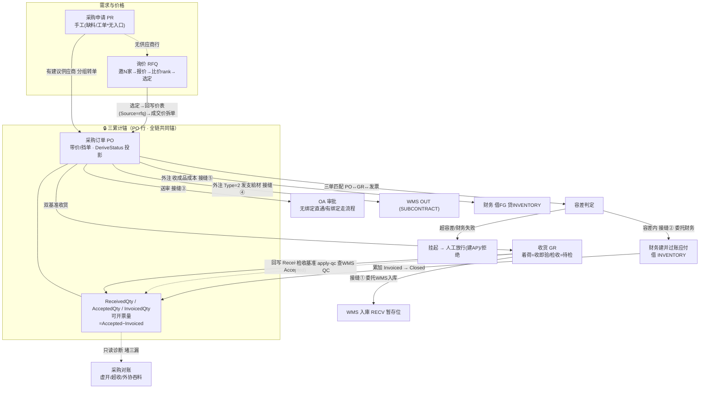

# 采购管理（仕入・発注・検収・支払照合）· 最详细用户操作培训手册（模块总册 A · BOOK-M09）

> **作用**：采购模块的**全局用户操作培训总册**。建立模块业务定位/角色/全流程/8 页总览，对**主链与核心页**逐页给出 14 小节细化（PO/GR/三单匹配/外注 4 个核心页含 `5.x.1a~1e` 增强块），对其余页做 14 小节常规细化；附模块级场景/测试矩阵/可执行用例/验收/术语/待确认/培训脚本。配套单页 SOP 见 `pur-pages/`（待 W6 逐页出，每页 16 节）。
> **基准**：分支 `feat/training-m07`（基于 `main` `9f56591`），盘点日 2026-06-29；**后端三累计锚/派生状态机/三接缝委托/容差/采番/错误码**逐行实测于 `docs/codemap-pur/`（README+01~02，2026-06-22 权威快照），**前端 8 个 view 的 UI 粒度**经 3 组并行 agent 实读 + `api/pur/pur.ts`+`types/pur/pur.ts`。查不到标 `待业务确认`；功能没写标 `待实现`；代码无该项标 `代码未发现`。
> **在闭环中的位置**：采购是 ERP→MES→WMS 闭环的**前置供应段**——把"买什么/向谁买/收没收到/该不该付钱"收口，并**真实委托**下游：收货→WMS 物理入库、匹配→财务建并过账应付、送审→OA 审批、外注→WMS 发料+财务入成本。样例数据承接 M06 WMS §0（原紙 K280）。详见 [`docs/codemap-pur/README.md`](../../codemap-pur/README.md)。

---

## 0. 本手册使用的培训样例数据

> 标「培训样例」= 非系统内置，需在测试环境预置主数据；带"系统采番"的编号由系统自动生成。本册操作步骤/SOP/测试用例尽量沿用这一套数据，与 M06 WMS 同一条供应链（采购的料 → WMS 入库 → 生产消费）。

| 数据项 | 培训样例值 | 来源/说明 |
|---|---|---|
| 仕入先（供应商） | `SUP01` A 供应商（`SupplierFlg=true`） | **复用 ERP `BusinessPartner`**，须 `SupplierFlg` 真 |
| 采购物料CD | `MAT-K280` K280 原紙・巾1600mm | 承接 M06 §0 原紙；采购入库后供生产消费 |
| 外注成品CD | `PRD-OEM01` 外协印刷加工品 | 外注 PO（Type=2），加工费计价 |
| 支給材CD | `MAT-K280`（支給原紙） | 外注发给外协厂的材料 |
| 仓库CD（收货落仓） | `W01`（落 `RECV` 暂存位） | GR 委托 WMS 入库的既定暂存位 |
| 采购申请NO | `PR2026070001`（系统采番，前缀 `PR`） | 需求入口 |
| 询价NO | `RFQ2026070001`（系统采番，前缀 `RFQ`） | 价格发现 |
| 采购订单NO | `PO2026070001`（系统采番，前缀 `PO`） | 标准采购 / 外注（Type=2） |
| 收货单NO | `GR2026070001`（系统采番，前缀 `GR`） | 双基准收货 |
| 三单匹配NO / 供方发票号 | `MATCH…` / `INV-SUP01-001` | 匹配 PO↔GR↔发票 |
| 应付发票NO | 财务侧采番（匹配通过自动生成） | 接缝产物（财务 AP） |
| 容差（缺省演示） | 价率 5% / 金额绝对 0 / 数量 0 | 具体供应商 > 全局缺省 > 硬缺省 `{0,0,0}` 严格 |
| 借方 GL 角色 | `INVENTORY`（采购应付借方）/ `FG`（外注成品） | 财务凭证科目角色解析键 |

**采番前缀总表**（采购各单据 `_seq.NextAsync`，系统采番）：

| 单据 | 前缀 | 单据 | 前缀 |
|---|---|---|---|
| 采购申请 | `PR` | 收货 | `GR` |
| 询价 | `RFQ` | 三单匹配 | `MATCH` |
| 采购订单 | `PO` | 应付发票 | 财务侧采番 |

> ⚠️ 除"系统采番"项外，供应商（须 `SupplierFlg`）、物料、税码、汇率（外币）等主数据须**先建档**，否则建单被挡（`E-PUR-020/021/022/023`）。各核心页"业务前置检查清单"会再次提示。

---

## 1. 模块业务定位

**采购管理是 ERP→MES→WMS 闭环的"前置供应段"**：把"买什么、向谁买、收没收到、该不该付钱"收口为一套带防漏闸门的可追溯账，并向下游**真实委托**入库、应付、审批、成本。

- **解决什么业务问题**：缺料了谁提需求（PR）、没合同价向谁询价（RFQ）、下单按什么价（PO 带价/挡单）、货到了怎么收（GR 双基准）、收的和发票对不对得上（三单匹配容差）、外协加工的料有没有被吞（外注对账）、虚开/超收怎么堵（采购对账）——全由采购承接。
- **地基 = 三累计锚 `PurchaseOrderLine.ReceivedQty / AcceptedQty / InvoicedQty`**：全链共同锚——GR 写 Received（着荷基准同写 Accepted）、检收写 Accepted、匹配写 Invoiced；**PO 状态全部由 `DeriveStatus` 从三锚投影**（非手工）。`可开票量 = AcceptedQty − InvoicedQty` 是三单匹配的硬约束（详见 §3、§5.4）。
- **三接缝全接真实 + 外注双委托**（无桩，DI `Program.cs:163-168` 真实注册）：

| 委托 | 适配器 | 委托给 | 动作 |
|---|---|---|---|
| GR→WMS 入库 | `WmsReceiveServiceAdapter` | WMS `IInboundService` | 真实入库落 `RECV` 暂存位（经库存铁律 IN） |
| 匹配→财务 AP | `FinApServiceAdapter` | 财务 `IFinAp` | 建**并过账**应付，借方 GL 角色 `INVENTORY` |
| 送审→OA | `ApprovalServiceAdapter` | OA `Wf.IApprovalService` | 无绑定兜底直通，有绑定走审批 |
| 外注发料→WMS | `WmsIssueServiceAdapter` | `IStockMovementService` | OUT（`RelatedType=SUBCONTRACT`） |
| 外注成本→财务 | `FinCostServiceAdapter` | `IAutoVoucherEngine` | 借 FG 贷 INVENTORY（幂等键 `SC-{PoNo}-{LineNo}`） |

> ⚠️ `Program.cs:178-182` 有一段**过时注释**称几个适配器为 Stub，与 `:163-168` 实际真实注册**矛盾**——**以注册为准**（采购跨模块委托全接真实零桩；桩类仅供单测，主链未注册）。

- **在 CP6 整体中的位置**：

| 维度 | 内容 |
|---|---|
| 上游 | 需求（手工 PR / 缺料反流 / 工单 BOM 缺料*）、报价（RFQ） |
| 本模块主链 | PR →（有建议供应商分组转）PO /（无供应商）RFQ 询价→选定回写价表→PO；PO→GR 双基准收货→三单匹配→应付 |
| 下游 | **WMS**（收货入库 RECV / 外注发料 OUT）、**财务**（匹配建应付借 INVENTORY / 外注成本借 FG 贷 INVENTORY）、**OA**（PO/PR 送审） |
| 数据影响面 | 三累计锚、PO 派生状态、供应商价表（rfq 回写）、应付发票、库存（委托 WMS）、财务凭证（委托 AutoVoucher） |

> *缺料反流 / 工单 BOM 缺料驱动 PR：`PrGenerationService` 落码完整但**无 Controller 端点、无生产调用方、前端无入口**——已知遗留（待 MES 数据），见 §10。

---

## 2. 适用角色与职责

| 角色 | 主要职责 | 可操作页面 | 不能随意操作 | 备注 |
|---|---|---|---|---|
| 采购员（バイヤー） | 建 PR/RFQ/PO、询价比价选定、送审、维护供应商价表 | 采购申请、询价比价、采购订单、供应商价表 | PO 确认后改价/改量（状态守卫） | 主力 |
| 收货员（検収担当） | 双基准收货、载入订单行、检收应用 | 收货 GR | 超收（被 `E-PUR-031` 挡） | 委托 WMS 真实入库 |
| 品保/检验 | 检收基准下质检判定（PASS/FAIL → AcceptedQty） | 收货 GR（apply-qc，经 WMS QC） | — | 检收基准才需 |
| 应付/财务对接 | 三单匹配、挂起单放行/拒绝、采购对账 | 三单匹配、采购对账 | 越容差强行建 AP（须走放行） | 匹配→财务建并过账应付 |
| 外协担当 | 外注 PO、发支給材、收成品成本、防吞料对账 | 外注加工 | — | 外注双委托 WMS/财务 |
| 采购主管 | 审批 PO/PR（经 OA）、监看对账异常 | （OA 待办）+ 采购对账（只读） | — | 送审接缝对端在 OA |

> 角色与权限为**数据驱动**（PUB 四粒度）。**核心页有按钮级细粒度权限点**：`pur-supplier-price`(add/delete)、`pur-po`(add/submit/cancel)、`pur-gr`(add/qc)、`pur-match`(add/release/reject)；**PR / RFQ / 外注 / 对账 4 个 Controller 仅 `[Authorize]`，按钮级权限未明确**（`待业务确认`，见 §10，回填 M02 PUB 结论）。

---

## 3. 模块完整业务流程

**起点**：有采购需求（缺料/计划/手工）。**终点**：货已入库、发票已匹配建应付、PO 派生 Closed、三方账平可追溯。

### 3.1 跨模块接缝目录（与 [M06 §3](03-库存物流WMS-最详细用户操作培训手册.md) / [M07 §3.1](10-ERP-MES-WMS闭环集成-最详细用户操作培训手册.md) 对接）

| 接缝 | 方向 | 触发页面/方法 | 落地动作 | 适配器 | 备注 |
|---|---|---|---|---|---|
| ① GR 入库 | 采购→WMS | 收货「确认收货」`ConfirmReceiveAsync` | WM030→WM040 三段：建入庫指示(PoNo钩子)→確定→収貨実績(SourceType=Purchase,落 RECV,经库存铁律 IN) | `WmsReceiveServiceAdapter` | 真实入库；回写 `WmsInboundNo` |
| ② 匹配建应付 | 采购→财务 | 三单匹配「匹配」`MatchInvoiceAsync`（容差内） | `IFinAp.CreateInvoiceFromPurchaseAsync` 建**并过账**应付，借 GL 角色 `INVENTORY`，到期 +30 天 | `FinApServiceAdapter` | 财务侧幂等（同供应商+发票号返既有） |
| ③ PO/PR 送审 | 采购→OA | 「送审」`SubmitForApprovalAsync` | 无启用 `Wf_ApprovalBinding`→`AutoApproved=true` 直通 Confirmed；有绑定→PendingApproval 走 OA | `ApprovalServiceAdapter` | OA 终态回调 `PoApprovalCallback`，**不 SaveChanges**（与 OA 共享 scoped DbContext 同事务原子） |
| ④ 外注发料 | 采购→WMS | 外注「发料」`IssueConsignAsync` | `IStockMovementService.ApplyAsync(OUT,RelatedType="SUBCONTRACT")`，按实出累加 `IssuedQty`（防吞料锚） | `WmsIssueServiceAdapter` | 库存不足→`E-PUR-080` |
| ⑤ 外注成本 | 采购→财务 | 外注「核算成品成本」`CalcFinishedCostAsync` | `IAutoVoucherEngine` 借 FG 贷 INVENTORY＝FinishedCost，幂等键 `SC-{PoNo}-{LineNo}` | `FinCostServiceAdapter` | 加工费应付由三单匹配独立记，本适配器不碰应付（零重复） |

> 接缝对端的 WMS/财务/OA 落地详见 [codemap-wms 入庫篇](../../codemap-wms/02-入庫.md)、[codemap-fin](../../codemap-fin/README.md)、[codemap-wf 审批引擎](../../codemap-wf/01-审批引擎.md)。

---

## 4. 菜单页面总览（8 页）

> 最易踩的是**PO 状态全由三累计锚投影（DeriveStatus），不可手工改**、**单价留空＝按供应商阶梯价带出，无适用价则挡单（`E-PUR-022`）**、**双基准（着荷 PostingBasis=1 收即验 / 检收=2 待检）**、**可开票量 = Accepted − Invoiced 是匹配硬约束**、**外注 `IssuedQty` 实发是防吞料锚**。

| § | 页面 | 路由 | 优先级 | 一句话 | 读/写 |
|---|---|---|---|---|---|
| 5.1 | 供应商价表 | /pur/supplier-price | P1 | 阶梯价（满足起订量∧有效取最大档）+ 带价试算 | 写(CRUD) |
| 5.2 | 采购申请 PR | /pur/pr | P1 | 需求入口（手工）→ 送审 → 分组转 PO / 无供应商走 RFQ | 写 |
| 5.3 | 询价比价 RFQ | /pur/rfq | P1 | 邀 N 家→报价矩阵→比价 rank→选定→回写价表→转 PO | 写 |
| 5.4 | **采购订单 PO** ★ | /pur/po | **P0** | 建单带价/挡单 + 派生状态机 + 送审（接缝③） | 写 |
| 5.5 | **收货 GR** ★ | /pur/gr | **P0** | 双基准收货 + 委托 WMS 入库（接缝①）+ 回写三锚 | 写 |
| 5.6 | **三单匹配** ★ | /pur/match | **P0** | 容差判定 → 建应付（接缝②）/ 挂起放行拒绝 | 写 |
| 5.7 | **外注加工** ★ | /pur/subcontract | **P1** | PO Type=2：发支給材（接缝④）+ 成品成本（接缝⑤）+ 防吞料对账 | 写 |
| 5.8 | 采购对账 | /pur/reconcile | P1 | 只读诊断：堵三漏（虚开/超收/外协吞料） | 读 |

> **状态机速查**：
> - **PO `PoStatus`**：0 草稿 / 1 送审中 / 2 已确认 / 3 部分收货 / 4 收货完毕 / 5 部分开票 / 6 关闭 / 9 已取消（**3/4/5/6 全由三累计锚 `DeriveStatus` 投影**；草稿/送审/取消不参与）。
> - **GR `GrStatus`**：0 草稿 / 1 已收货 / 2 检验中 / 3 已完成 / 9 取消；QC：`NONE 免检 / PENDING 待检 / PASS 合格 / FAIL 不良`（字符串键）。
> - **匹配 `MatchStatus`**：0 通过 / 1 差异挂起 / 2 人工放行 / 3 拒绝。
> - **PR `PrStatus`**：0 草稿 / 1 已提交 / 2 已批准 / 3 已拒绝 / 4 已转PO / 9 关闭；来源 `manual/shortage/workorder`。
> - **RFQ `RfqStatus`**：0 草稿 / 1 邀请中 / 2 报价中 / 3 已选定 / 4 已转PO / 8 关闭 / 9 取消；邀请 `0 待邀请 / 1 已邀请 / 2 已报价`。

---

## 5. 页面详细操作说明

> 主链与核心页（PO/GR/三单匹配/外注）每页 14 小节，含 `5.x.1a~1e` 增强块；其余页 14 小节常规细化。**坑点统一提醒**：①PO 状态**不可手工改**（三累计锚投影）；②单价留空＝带价，**无适用价挡单 `E-PUR-022`**；③`E-PUR-xxx` 错误码由后端抛出（前端预校验用友好中文，**后端硬闸门返 `E-PUR` 码可能裸显**，`待业务确认` i18n）；④页面 label 走 `t()`（显中文），与 WM-MSG 裸码不同；⑤多数列表 `max-height` 滚动**无分页器**。

### 5.1 供应商价表（SupplierPrice · /pur/supplier-price）

**5.1.1 页面业务目的**：维护"供应商 × 物料"的阶梯采购价（按"满足起订量 ∧ 当时有效，取 `MinQty` 最大档、同档取 `ValidFrom` 最新"解析），供 PO 建单带价复用；并提供**带价试算**当场验证。

**5.1.2 流程位置**：上游＝供应商/物料主数据；下游＝PO 建单带价、RFQ 选定回写（`Source=rfq`）。

**5.1.3 谁使用**：采购员。**5.1.4 操作前准备**：供应商（`SupplierFlg`）/物料已建；明确阶梯（起订量分档）与有效期。

**5.1.5 页面区域**：搜索卡（供应商CD 必填 + 物料CD 可选 + 査询/新增 + 共 n 条 tag）→ 列表（物料/单价/币种/起订量/有效自/有效至/来源 tag/删除）→ **带价试算卡**（物料+数量+基准日 → 解析单价）→ 新增弹窗（560px）。

**5.1.6 字段填写说明**（新增弹窗）：

| 字段 | 控件 | 必填 | 怎么填 | 填错影响 |
|---|---|---|---|---|
| 供应商(supplierId) | 输入(禁用,自动带页面筛选值) | 是 | 由列表筛选供应商带入，不可改 | — |
| 物料(itemId) | 输入(≤40) | 是 | 物料代码 | 空→后端 `E-PUR-012` |
| 单价(price) | 数字(≥0,precision4) | 是 | 采购单价 | 负→`E-PUR-013` |
| 币种(currencyCd) | 输入(≤3) | 否 | 留空＝本位币 | — |
| 起订量(minQty) | 数字(≥0) | 否 | 阶梯下限（解析取满足量的最大档） | 负→`E-PUR-014` |
| 有效自(validFrom) | 日期 | 是 | 生效日 | — |
| 有效至(validTo) | 日期 | 否 | 留空＝长期 | — |

**5.1.7 按钮操作**：査询/新增(供应商空时灰)/删除(行)/解析单价(带价试算,供应商&物料空时灰)/保存/取消。

**5.1.8 业务规则与校验**：`E-PUR-011`供应商必填/`012`物料必填/`013`单价负/`014`阶梯量负/`015`价档不存在(删)。业务键 `(SupplierId,ItemId,MinQty,ValidFrom)`；`Source=manual` 手工维护 / `rfq` 询价回写（tag 区分）。

**5.1.9 完成后检查**：列表出现该档；带价试算解析正确（`无适用采购价` 或 `解析单价：xxx`）；可在 PO 建单留空带出。

**5.1.10 状态流转**：无状态机（仅逻辑删 + Source 标志）。

**5.1.11 常见错误**：忘填供应商（新增按钮灰）；带价试算未填供应商/物料（解析按钮灰）；阶梯档重叠时按"最大满足档+最新生效"取（非报错）。

**5.1.12 注意事项**：此解析逻辑**被 PO 建单带价、PR 估价、RFQ 转 PO 复用**；RFQ 选定回写写入 `Source="rfq"`、`ValidFrom=today`。

**5.1.13 标准操作步骤**：填供应商査询→新增→填物料/单价/起订量/有效自→保存→带价试算验证。

**5.1.14 本页面测试点汇总**：阶梯解析(最大满足档+最新生效)/带价试算/起订量分档/有效期过滤/Source manual·rfq/删除 `E-PUR-015`/必填校验。

---

### 5.2 采购申请 PR（PurchaseRequest · /pur/pr）

**5.2.1 页面业务目的**：采购需求的入口——手工建申请（头+明细），送审批准后**按建议供应商分组转 PO**（一供应商一张 PO），无建议供应商的行留待 RFQ 询价。

**5.2.2 流程位置**：上游＝需求（手工；缺料/工单驱动**无 UI 入口**）；下游＝PO（有供应商行分组转）/ RFQ（无供应商行）。

**5.2.3 谁使用**：采购员/需求部门。**5.2.4 操作前准备**：明确物料/数量/要求交期；若有建议供应商先确认其 `SupplierFlg`。

**5.2.5 页面区域**：搜索卡（状态 + 来源 两下拉 + 新建申请/刷新 + 共 n 条）→ 列表（申请单号/日期/申请人/来源 tag/行数/状态 tag/操作）→ 新建弹窗（860px，头 日期+备注 / 明细行）→ 详情弹窗（900px，只读 + 送审/转PO 按钮）。

**5.2.6 字段填写说明**（新建弹窗·明细行）：

| 字段 | 控件 | 必填 | 怎么填 | 填错影响 |
|---|---|---|---|---|
| 物料(itemId) | 输入(≤40) | 是 | 物料代码 | 空→前端 warning(`每行需填物料且数量大于0`) |
| 数量(qty) | 数字(≥0) | 是>0 | 申请量 | ≤0→warning |
| 单位(unitCd) | 输入(≤10) | 否 | — | — |
| 要求交期(requiredDate) | 日期 | 否 | 带入 PO 行 | — |
| 估价(estPrice) | 数字(≥0,precision4) | 否 | 作 PO 行 UnitPrice（null 则 PO 侧阶梯价解析） | — |
| 建议供应商(suggestSupplierId) | 输入(≤20) | 否 | **留空＝走询价**；有值＝转 PO 时按此分组 | 无供应商行不进 PO，走 RFQ |

**5.2.7 按钮操作**：新建申请/刷新/查看(行)/**送审**(行 status===0)/**转采购订单**(行 status===2)；详情弹窗同步送审/转PO。

**5.2.8 业务规则与校验**：`E-PUR-050`行空/`051`物料空/`055`数量≤0（建单）；`E-PUR-056`不存在/`053`非批准/`054`无可转行（转 PO）。**转 PO**＝按 `SuggestSupplierId` GroupBy 拆单（一供应商一 PO，`EstPrice` 作 UnitPrice，null 则 PO 侧带价）；无有效未转行→`Converted`，部分转→保持 `Approved`。

**5.2.9 完成后检查**：送审后 status→已提交；批准后可转 PO，提示「已转 {n} 张采购订单」，行 `ConvertedPoNo` 回填。

**5.2.10 状态流转**：`0草稿→(送审)→1已提交→(OA批准)→2已批准→(转PO)→4已转PO`，旁路 3 拒绝 / 9 关闭。

**5.2.11 常见错误**：⚠️ **想从缺料/工单"生成"PR——UI 无此入口**（副标题写"手工/缺料/工单"是来源概念，非按钮，见 §10）；建议供应商不存在则转 PO 时该行进 PO 后由 PO 侧校验。

**5.2.12 注意事项**：PR 送审走 `IApprovalService(BizType="PUR_PR",Amount=0)`，回调 `PrApprovalCallback`；部分转后余行走 RFQ。

**5.2.13 标准操作步骤**：新建申请→填明细（物料/数量/[建议供应商]）→保存→送审→（批准后）转采购订单。

**5.2.14 本页面测试点汇总**：手工建单/送审/批准后转 PO 分组拆单/有供应商→PO·无供应商→RFQ/部分转保持 Approved/`E-PUR-053/054/056`/**无生成按钮**(`待实现`)。

---

### 5.3 询价比价 RFQ（Rfq · /pur/rfq）

**5.3.1 页面业务目的**：无合同价时的价格发现——从 PR 发起询价，邀 N 家供应商→收报价矩阵→按行比价 rank→人工选定→回写价表（`Source=rfq`）→成交价拆单转 PO。

**5.3.2 流程位置**：上游＝PR（无建议供应商行）；下游＝供应商价表（回写）+ PO（成交价拆单）。

**5.3.3 谁使用**：采购员。**5.3.4 操作前准备**：有 Approved PR（含无供应商行）；候选供应商 `SupplierFlg` 已建。

**5.3.5 页面区域**：搜索卡（状态下拉 + 采购申请号输入 + 从PR发起询价/刷新）→ 列表（询价单号/日期/询价员/来源PR/行·供应商数/状态 tag/比价台）→ **比价台弹窗（960px）**：头 descriptions + **动作条**（邀请供应商/录入报价/比价排名/确认选定/回写价表/转采购订单）+ 被邀供应商 tag + **比价矩阵**（行×供应商，单元 radio 选定）→ 邀请弹窗（480px）→ 录入报价弹窗（720px）。

**5.3.6 字段填写说明**：邀请＝供应商编码（逗号/换行分隔，textarea）；录入报价＝选供应商 + 逐行 报价单价(precision4)/交期天/有效期。

**5.3.7 按钮操作**（比价台动作条，均有启用条件）：

| 按钮 | 动作 | 启用条件 | 影响 |
|---|---|---|---|
| 邀请供应商 | 开邀请弹窗→`addSuppliers` | 常显 | 加 `RfqSupplier(Invited)`，Draft→Inviting |
| 录入报价 | 开报价弹窗→`recordQuote` | `suppliers.length>0` | upsert `RfqQuote`，推 Quoting |
| 比价排名 | `rank` | `quotes.length>0` | 按 `价格→交期→供应商` 赋 rank（过期 rank=0；**仅建议不自动选**） |
| 确认选定 | `select`(矩阵 radio→picks) | `hasPicks` | 一行一选（改选清旧），全行选→Selected |
| 回写价表 | `writeBack` | `hasSelected` | 选中报价 upsert `SupplierPrice`，`Source=rfq` |
| 转采购订单 | `convert`(确认框) | `hasSelected` | 按选中供应商 GroupBy 拆 PO，`UnitPrice=成交价`（不走价表），提示「已转 {n} 张」 |

**5.3.8 业务规则与校验**：`E-PUR-060`无可询价行/`062`供应商不存在/`063`非供应商/`064`未被邀/`065`报价行非询价行/`066`无报价行/`067`PR不存在/`068`选中过期/`069`报价不存在/`070`无选中转PO。**过期报价**（`ValidUntil<today`）红字标 `已过期`，radio 禁用不可选。

**5.3.9 完成后检查**：选定后 Selected；回写后价表出现 `Source=rfq` 档；转 PO 后生成成交价 PO（`SourceRfqNo` 追溯）。

**5.3.10 状态流转**：`0草稿→1邀请中→2报价中→3已选定→4已转PO`，旁路 8 关闭 / 9 取消。

**5.3.11 常见错误**：未邀供应商就想录报价（按钮灰）；未 rank/未选就转 PO（`E-PUR-070`）；选了过期报价（`E-PUR-068`）。

**5.3.12 注意事项**：rank **仅建议**（价格优先→交期），最终由人按行 radio 选定；行级追溯 `SourcePrNo+SourcePrLineNo`、`SourceRfqNo`。

**5.3.13 标准操作步骤**：填 PR 号→从PR发起→比价台：邀请供应商→录入报价→比价排名→矩阵选定→确认选定→回写价表→转采购订单。

**5.3.14 本页面测试点汇总**：从PR发起/邀请幂等/收报价 upsert/rank(价→交期,过期 rank0)/矩阵选定一行一选/过期不可选(`E-PUR-068`)/回写 Source=rfq/转 PO 成交价拆单/各 `E-PUR-060~070`。

---

### 5.4 采购订单 PO（PurchaseOrder · 核心 · /pur/po）

**5.4.1 页面业务目的**：采购下单的中枢——建单时**带出供应商币种/税码/汇率**、单价**手填优先否则带价、无价挡单**，行的三累计锚（收货/验收/开票）**派生订单状态**；可送审走 OA、可取消。

**5.4.1a 业务前置检查清单（操作前必看）**
- [ ] 供应商已建且 `SupplierFlg=true`（否则 `E-PUR-020/021`）；外币供应商汇率已登记（否则 `E-PUR-023`）。
- [ ] 单价策略明确：**手填 > 供应商阶梯价解析 > 无价挡单**（`E-PUR-022`）；留空＝带价。
- [ ] 三累计锚概念清楚：`ReceivedQty/AcceptedQty/InvoicedQty` 初始 0，由 GR/检收/匹配回写，**PO 状态由 `DeriveStatus` 从锚投影，不可手工改**。
- [ ] 过账基准 `PostingBasis`：建单时取供应商 `PurchasePostingDiv`（缺省"2"检收），决定下游 GR 是着荷(1)还是检收(2)。

**5.4.1b 关键字段业务填写口径**
| 字段 | 谁提供 | 怎么填 | 填错影响 |
|---|---|---|---|
| 供应商(supplierId) | 采购 | 发注先编码（须 SupplierFlg） | 不存在 `E-PUR-020`/非供应商 `E-PUR-021` |
| 类型(type) | 采购 | 1 标准采购 / 2 外注委托 | 2＝外注（走 §5.7 独有流程） |
| 单价(unitPrice) | 采购 | **留空＝带价**（阶梯解析）；手填则优先 | 无价且无手填→挡单 `E-PUR-022` |
| 数量(qty) | 采购 | >0 | ≤0→`E-PUR-026` |
| 要求交期(requiredDate) | 采购 | 行交期 | — |

**5.4.1c 灰按钮 / 不可操作说明**
| 按钮/字段 | 何时灰/不显 | 原因 |
|---|---|---|
| 送审 | 仅 `status===0`(草稿) 显示 | 仅 Draft 可送审（否则 `E-PUR-028`） |
| 取消 | 仅 `status===0 或 2` 显示 | 仅 Draft/PendingApproval/Confirmed 可取消（否则 `E-PUR-029`） |
| 三累计锚列(已收货/已验收/已开票) | 永久只读 | 由 GR/检收/匹配回写，非手工 |
| 提交（建单） | 供应商空 / 行缺物料或数量≤0 | 前端预校验拦截 |

**5.4.1d 完成后检查点与下游验证（★建单/送审后必做★）**
- 建单：生成 `PO…`、状态 Draft；详情见冻结币种/汇率、净额/税额/价税合计、过账基准。
- **送审**：无启用审批绑定→`AutoApproved`→直接 `Confirmed(2)`；有绑定→`PendingApproval(1)` 进 OA 待办，OA 通过回调→Confirmed / 驳回→Draft。
- **派生验证**：收货后查 PO 行 `ReceivedQty +=`、状态自动 `部分收货(3)/收货完毕(4)`；匹配后 `InvoicedQty +=`、`部分开票(5)/关闭(6)`——**全程不手工改状态**。

**5.4.1e 详细操作场景（SOP）**
- **场景一·带价建单**：填供应商→加明细行（物料/数量/单价留空）→提交→单价按阶梯价带出。
- **场景二·手填价建单**：单价手填→提交→以手填为准（不查价表）。
- **场景三·无价挡单**：物料无适用价表且单价留空→提交被挡 `E-PUR-022`。
- **场景四·送审直通**：无审批绑定→送审→直接 Confirmed。
- **场景五·送审走 OA**：有绑定→送审→PendingApproval→OA 待办审批→回调 Confirmed/Draft。
- **场景六·取消**：Draft/Confirmed→取消（`E-PUR-029` 守卫已收货后不可取消）。

**5.4.2 流程位置**：上游＝PR 转单 / RFQ 转单 / 手工；下游＝GR 收货、三单匹配、外注（Type=2）。

**5.4.3 谁使用**：采购员（建/送审/取消）、采购主管（OA 审批）。**5.4.4 操作前准备**：见 5.4.1a。

**5.4.5 页面区域**：搜索卡（供应商 + 状态下拉 + 新建/刷新 + 共 n 条）→ 列表（订单号/供应商/类型 tag/订单日/币种/净额/价税合计/状态 tag/操作[查看·送审·取消]）→ 建单弹窗（820px，头 供应商/类型/订单日/备注 + 明细行表，单价列 placeholder「留空=带价」）→ 详情弹窗（900px，头 descriptions[币种/汇率/过账基准/净额/税额/价税合计] + 行表[含三累计锚 + 匹配状态]）。

**5.4.6 字段填写说明**：见 5.4.1b。建单提示「单价留空时按供应商阶梯价自动带出，无适用价则挡单」。

**5.4.7 按钮操作**：

| 按钮 | 动作 | 显示/启用条件 | 影响 |
|---|---|---|---|
| 新建/刷新 | 开建单弹窗 / reload | 常显 | — |
| 查看 | 详情弹窗 | 每行 | 只读 |
| **送审** | `submit(poNo)` | `status===0` | 接缝③→Confirmed/PendingApproval |
| **取消** | `cancel(poNo)` | `status===0 或 2` | →Cancelled(9)（守卫 `E-PUR-029`） |
| 提交（建单） | `create` | 供应商必填、行必填 | 建头+行（带价/挡单）+冻结汇率 |

**5.4.8 业务规则与校验**：`E-PUR-020/021`(供应商)、`022`(无价挡单)、`023`(汇率未登记)、`024`(行空)、`025`(物料空)、`026`(数量≤0)、`028`(非草稿送审)、`029`(状态不可取消)。币种快照＝供应商 `CurrencyCd ?? BaseCurrency`，外币冻结汇率（`IFxRateService`）。

**5.4.9 完成后检查**：见 5.4.1d。**5.4.10 状态流转**：`0草稿→(送审)→1送审中/2已确认→(收货)→3部分收货/4收货完毕→(匹配)→5部分开票/6关闭`，旁路 9 取消（**3~6 全 DeriveStatus 投影**）。

**5.4.11 常见错误**：想手工改状态（不能，锚投影）；外币忘登记汇率（`E-PUR-023`）；无价表又留空单价（`E-PUR-022`）；已收货后想取消（`E-PUR-029`）。

**5.4.12 注意事项**：**PO 状态全由三累计锚派生**（`DeriveStatus` 纯函数，草稿/送审/取消不参与）；列表无分页（`max-height` 滚动）。

**5.4.13 标准操作步骤**：见 5.4.1e 场景一/四。

**5.4.14 本页面测试点汇总**：带价/手填/挡单(`E-PUR-022`)/外币冻结汇率(`E-PUR-023`)/送审直通 vs 走OA/取消守卫(`E-PUR-029`)/派生状态投影(收货→3·4,匹配→5·6)/三累计锚只读。

---

### 5.5 收货 GR（GoodsReceipt · 核心 · /pur/gr）

**5.5.1 页面业务目的**：采购收货——**双基准**（着荷=收货即验收 / 检收=收货待检质检后验收），「载入订单行」预填剩余未收量，「确认收货」**委托 WMS 物理入库**（落 RECV 暂存位）并回写 PO 三累计锚。

**5.5.1a 业务前置检查清单（操作前必看）**
- [ ] PO 已 `Confirmed/PartiallyReceived/Received/PartiallyInvoiced`（仅这些可收货，否则 `E-PUR-032`）。
- [ ] 仓库（落 RECV）已建；明确过账基准（PO 带来 `PostingBasis`：1 着荷收即验 / 2 检收待检）。
- [ ] 本次收货量**不得超过订购未收量**（超收挡 `E-PUR-031`）。
- [ ] 检收基准下：收货后状态＝`检验中(2)`，须再「应用检收」（查 WMS QC）才累加 AcceptedQty。

**5.5.1b 关键字段业务填写口径**
| 字段 | 谁提供 | 怎么填 | 填错影响 |
|---|---|---|---|
| 采购订单号(poNo) | 收货员 | 填后点「载入订单行」 | 不存在 `E-PUR-027` |
| 仓库CD(warehouseCd) | 收货员 | 收货落仓（W01→RECV） | 委托 WMS 入库目标 |
| 本次收货量(thisQty) | 收货员 | 「载入」预填＝`max(0,订购−已收)`，可改 | 超订购未收→`E-PUR-031` |

**5.5.1c 灰按钮 / 不可操作说明**
| 按钮/字段 | 何时灰/不显 | 原因 |
|---|---|---|
| 确认收货（提交） | 无 `thisQty>0` 行 | 至少一行有量才可提交 |
| 应用检收（apply-qc） | 仅 `status===2`(检验中) 显示 | 仅检收基准、收货后待检状态可应用 |
| 订购量/已收货 列 | 只读（载入预填） | 来自 PO，不可改 |

**5.5.1d 完成后检查点与下游验证（★确认收货后必做★）**
- 收货：生成 `GR…`；着荷基准→状态 `已完成(3)`；检收基准→`检验中(2)`。
- **委托 WMS 真实入库**：`WmsInboundNo` 回填；去 WMS 在庫照会查 RECV 暂存位库存 `PhysicalQty +=`（经库存铁律 IN）。
- **回写 PO 三累计锚**：PO 行 `ReceivedQty += 本次收货`，着荷基准同写 `AcceptedQty +=`；PO 状态派生 `部分收货/收货完毕`。
- **检收应用**（检收基准）：「应用检收」查 `IWmsQcQuery.QueryByReceiptAsync(WmsInboundNo)`（QC `Status==2`，无记录默认全合格 PASS）→累加 `AcceptedQty`→状态→已完成。

**5.5.1e 详细操作场景（SOP）**
- **场景一·着荷基准收货**：PO（PostingBasis=1）→新建收货→载入订单行→改本次收货量→确认收货→收即验（Received+Accepted 同写），状态已完成。
- **场景二·检收基准收货**：PO（=2）→收货→确认（状态检验中，只写 Received）→品保质检→「应用检收」（查 WMS QC）→累加 Accepted→已完成。
- **场景三·部分收货**：本次收货量<剩余→确认→PO 派生 `部分收货(3)`，可再次收货。
- **场景四·超收挡**：本次收货量>订购未收量→确认被挡 `E-PUR-031`。
- **场景五·载入订单行预填**：填 PO 号→载入→拉 `(l.status??0)===0` 行，`thisQty=max(0,订购−已收)`。

**5.5.2 流程位置**：上游＝PO（Confirmed+）；下游＝WMS 入库（RECV）、三单匹配（按 Accepted 可开票）。

**5.5.3 谁使用**：收货员、品保（检收）。**5.5.4 操作前准备**：见 5.5.1a。

**5.5.5 页面区域**：搜索卡（PO号 + 供应商 + 新建/刷新）→ 列表（收货单号/PO号/供应商/收货日/过账基准 tag/WMS入库号/状态 tag/操作[查看·应用检收]）→ 新建弹窗（820px，头 PO号[带「载入订单行」append]/收货日/仓库/备注 + 收货明细表[订购量·已收货 只读 + 本次收货量 可编辑]）→ 详情弹窗（820px，头 + 行[收货量/合格量/不良量/QC状态]）。

**5.5.6 字段填写说明**：见 5.5.1b。提示「本次收货量超出订购未收量将被挡（超收）」。

**5.5.7 按钮操作**：

| 按钮 | 动作 | 启用条件 | 影响 |
|---|---|---|---|
| 载入订单行 | `loadPoLines`→拉 PO 行预填 | PO 号非空 | 预填剩余量（不写库存） |
| 确认收货 | `confirm`→委托 WMS 入库 | 有 `thisQty>0` 行 | **接缝①真实入库**+回写三锚+派生 |
| 应用检收 | `applyQc`→查 WMS QC | `status===2` | 累加 AcceptedQty→已完成 |

**5.5.8 业务规则与校验**：`E-PUR-030`(行空)、`027`(PO不存在)、`032`(PO状态守卫)、`031`(超收)、`026`(数量)、`036`(非检验中应用检收)。双基准 `accrual = PostingBasis=="1"`；着荷 GR 头 `Completed`、检收 `Inspecting`。

**5.5.9 完成后检查**：见 5.5.1d。**5.5.10 状态流转**：GR `0草稿→1已收货/3已完成(着荷)/2检验中(检收)→(应用检收)→3已完成`，旁路 9 取消；QC `NONE/PENDING/PASS/FAIL`。

**5.5.11 常见错误**：检收基准忘了「应用检收」（Accepted 不增→不可开票）；超收（`E-PUR-031`）；PO 非可收状态（`E-PUR-032`）。

**5.5.12 注意事项**：收货**真实委托 WMS**（`WmsReceiveServiceAdapter` 三段 WM030→WM040，落 RECV，经库存铁律 IN）；着荷＝Received+Accepted 同写、检收＝先 Received 后 apply-qc 写 Accepted。

**5.5.13 标准操作步骤**：见 5.5.1e 场景一/二。

**5.5.14 本页面测试点汇总**：着荷收即验/检收待检应用/载入预填剩余/超收挡(`E-PUR-031`)/委托 WMS 入库 RECV+WmsInboundNo/回写三锚+PO派生/检收应用查WMS QC默认PASS/PO状态守卫(`E-PUR-032`)。

---

### 5.6 三单匹配（ThreeWayMatch · 核心 · /pur/match）

**5.6.1 页面业务目的**：PO ↔ 收货验收 ↔ 供应商发票三方对齐——「载入可开票行」算 `可开票量=Accepted−Invoiced`，逐行**容差判定**（率容差或小额绝对放行 + 数量硬约束），**容差内自动建并过账应付**（接缝②，借 INVENTORY），超容差/财务失败→**挂起**人工放行（建 AP）或拒绝。

**5.6.1a 业务前置检查清单（操作前必看）**
- [ ] PO 有已验收量（`AcceptedQty>InvoicedQty` 才有可开票量）；着荷基准收货即有 Accepted，检收基准须先 apply-qc。
- [ ] 同 `(PoNo,SupplierInvoiceNo)` 不可重复匹配（幂等防重复开票 `E-PUR-043`）。
- [ ] 容差来源：具体供应商 `MatchTolerance` > 全局缺省 > 硬缺省 `{0,0,0}` 严格。
- [ ] 数量是硬约束：发票数量**不得超过可开票量**；价差走容差（率 或 小额绝对）。

**5.6.1b 关键字段业务填写口径**
| 字段 | 谁提供 | 怎么填 | 填错影响 |
|---|---|---|---|
| 采购订单号(poNo) | 财务对接 | 填后点「载入可开票行」 | 不存在 `E-PUR-027` |
| 供方发票号(supplierInvoiceNo) | 财务对接 | 供应商发票号 | 空→warning；重复→`E-PUR-043` |
| 发票数量(qty) | 财务对接 | ≤可开票量（硬约束） | 超→挂起 |
| 发票单价(unitPrice) | 财务对接 | 与 PO 单价比，超容差→挂起 | — |

**5.6.1c 灰按钮 / 不可操作说明**
| 按钮/字段 | 何时灰/不显 | 原因 |
|---|---|---|
| 匹配（提交） | `lineRows.length===0`（未载入行） | 无可开票行不可匹配 |
| 放行 / 拒绝 | 仅 `status===1`(差异挂起) 显示 | 仅挂起单可人工裁决 |
| 可开票量/订单单价 列 | 只读 | 来自 PO 三累计锚 |

**5.6.1d 完成后检查点与下游验证（★匹配后必做★）**
- 容差内：状态 `通过(0)`、`ApInvoiceNo` 回填，提示「匹配通过，已建应付发票 {no}」；累加 PO 行 `InvoicedQty +=`、PO 派生 `部分开票/关闭`。
- **委托财务**：`FinApServiceAdapter` 建并过账应付（借 GL 角色 `INVENTORY`，到期 +30 天，财务侧幂等）；去财务 AP 查该发票已过账。
- 超容差/财务失败：状态 `差异挂起(1)`，**不累加锚**，提示「差异超容差，已挂起待人工裁决」；挂起单可「放行」（填说明→重走建 AP）或「拒绝」（→Rejected，不建 AP）。

**5.6.1e 详细操作场景（SOP）**
- **场景一·容差内自动建应付**：载入可开票行→填发票号/数量/单价（容差内）→匹配→Passed+建 AP+累加 Invoiced。
- **场景二·超容差挂起**：发票单价超价容差→匹配→Suspended（不动锚）。
- **场景三·超可开票量挂起**：发票数量>可开票量→匹配→Suspended（数量硬约束）。
- **场景四·人工放行**：挂起单「放行」→填处理说明→重走 BuildApAsync 建 AP→Released。
- **场景五·人工拒绝**：挂起单「拒绝」→填原因→Rejected（不建 AP）。
- **场景六·重复开票拦截**：同 PO+发票号再匹配→`E-PUR-043`。

**5.6.2 流程位置**：上游＝PO（有 Accepted）+ 供应商发票；下游＝财务应付（接缝②）、PO 派生 Closed。

**5.6.3 谁使用**：应付/财务对接。**5.6.4 操作前准备**：见 5.6.1a。

**5.6.5 页面区域**：搜索卡（PO号 + 状态下拉 + 匹配供应商发票/刷新）→ 列表（匹配单号/PO号/供方发票号/匹配日/最大价差/应付发票号/状态 tag/操作[查看·放行·拒绝]）→ 匹配弹窗（860px，头 PO号[带「载入可开票行」]/发票号/发票日 + 行表[可开票量·订单单价 只读 + 发票数量·发票单价 可编辑]）→ 详情弹窗（880px，含 处理人/差异说明 + 行[价差·容差内 tag]）。

**5.6.6 字段填写说明**：见 5.6.1b。提示「容差内自动建应付并累加已开票量；超容差或超可开票量则挂起待人工放行」。

**5.6.7 按钮操作**：

| 按钮 | 动作 | 启用条件 | 影响 |
|---|---|---|---|
| 载入可开票行 | `loadPoLines`→`remain=max(0,Accepted−Invoiced)` | PO 号非空 | 只拉 remain>0 行 |
| 匹配 | `match`→容差判定分流 | 有行 | 通过建 AP / 超容差挂起 |
| 放行(行) | `release`(填说明) | `status===1` | 重走建 AP→Released |
| 拒绝(行) | `reject`(填原因) | `status===1` | →Rejected，不建 AP |

**5.6.8 业务规则与校验**：`E-PUR-040`(行空)、`027`(PO不存在)、`043`(重复开票)、`041`、`045`(非挂起放行)、`046`、`044`(GL角色 INVENTORY 未解析)。容差 `priceOk = priceVar<=PriceTolPct 或 amountVar<=AmountTolAbs`；`qtyOk = qty<=remainAccepted`（硬）；`within = qtyOk && priceOk`。

**5.6.9 完成后检查**：见 5.6.1d。**5.6.10 状态流转**：`0通过`（建 AP）/`1差异挂起`→（放行）`2人工放行`/（拒绝）`3拒绝`。

**5.6.11 常见错误**：发票数量超可开票量（挂起，非报错）；以为挂起就丢了（可放行/拒绝）；重复匹配（`E-PUR-043`）；GL 角色 INVENTORY 未配（`E-PUR-044`）。

**5.6.12 注意事项**：匹配通过才 `RefreshStatus`（喂 PO 派生 Closed）；财务 AP 端**幂等**（同供应商+发票号返既有）；放行重走 BuildApAsync。

**5.6.13 标准操作步骤**：见 5.6.1e 场景一/四。

**5.6.14 本页面测试点汇总**：可开票量=Accepted−Invoiced/容差内建AP(借INVENTORY)/超容差挂起/超量挂起(数量硬约束)/放行建AP/拒绝不建AP/重复开票(`E-PUR-043`)/累加 Invoiced→PO Closed/财务幂等。

---

### 5.7 外注加工（Subcontract · 核心 · /pur/subcontract · PO Type=2）

**5.7.1 页面业务目的**：外协委托闭环（外注 PO 行 UnitPrice=加工费）——登记/发支給材（接缝④委托 WMS OUT，`IssuedQty` 实发防吞料）→收成品成本核算（接缝⑤委托财务 借 FG 贷 INVENTORY）→防吞料对账（实发 vs 应耗）。

**5.7.1a 业务前置检查清单（操作前必看）**
- [ ] PO 是外注（`Type=2`，否则 `E-PUR-072`）；成品行存在（`E-PUR-073`）。
- [ ] 支給材库存充足（发料委托 WMS OUT，不足→`E-PUR-080`）。
- [ ] `IssuedQty` 实发是防吞料锚：发料按实出累加，对账以"成品反推应耗"对比。
- [ ] 成品成本＝加工费（PO 单价×成品数）+ 支給材成本（**并入非另付**）；加工费应付由三单匹配独立记（零重复）。

**5.7.1b 关键字段业务填写口径**
| 字段 | 谁提供 | 怎么填 | 填错影响 |
|---|---|---|---|
| 成品行(lineNo) | 外协担当 | 选外注 PO 的成品行 | — |
| 支給材物料/应发/单位成本 | 外协担当 | 登记发给外协的料 | 物料空或应发≤0 不保存 |
| 分批发料量/一次发齐 | 外协担当 | 分批量>0；或一次发齐剩余 | 量≤0→warning；库存不足→`E-PUR-080` |
| 收成品数(finishedQty) | 外协担当 | 收到的成品数（成本/对账基数） | ≤0→`E-PUR-077/079` |
| 损耗容差(%)（对账） | 外协担当 | 默认 5%，反推应耗的允许差 | — |

**5.7.1c 灰按钮 / 不可操作说明**
| 按钮/字段 | 何时灰 | 原因 |
|---|---|---|
| 一次发齐剩余 | 无已登记支給材（`!hasConsign`） | 须先登记支給材 |
| 保存支給材 | 物料空 / 应发≤0 | 前端校验 |
| 已发/剩余 列 | 只读 | `IssuedQty` 实发由发料累加 |

**5.7.1d 完成后检查点与下游验证（★发料/核算后必做★）**
- 发料：`IssuedQty` 按实出累加、`WmsIssueNo` 回填；去 WMS 查支給材库存 OUT（`RelatedType=SUBCONTRACT`）。
- 成本核算：`finishedCost = 加工费(PO单价×成品数) + 支給材成本(ΣConsignQty×ConsignUnitCost)`；`costVoucherNo` 回填；去财务查 借 FG 贷 INVENTORY（幂等键 `SC-{PoNo}-{LineNo}`）。
- 防吞料对账：`应耗=单耗×实收成品数`、`差异=实发−应耗`、`容许差异=应耗×容差`；超损耗→`hasAnomaly` 红 alert「发现支給材超损耗容差，已挂起核查」。

**5.7.1e 详细操作场景（SOP）**
- **场景一·登记+发支給材**：选成品行→支給材 tab→添加行（物料/应发/单位成本）→保存支給材→「一次发齐剩余」或逐料「分批发料」。
- **场景二·收成品成本核算**：成品成本核算 tab→填收成品数→核算→显加工费/支給材成本/成品成本/成本凭证。
- **场景三·防吞料对账**：防吞料对账 tab→填收成品数+损耗容差→对账→看实发/应耗/差异/异常 + 红绿 alert。
- **场景四·库存不足发料**：支給材库存不足→发料→`E-PUR-080`。

**5.7.2 流程位置**：上游＝外注 PO（Type=2）；下游＝WMS（支給材 OUT）、财务（成品成本）、采购对账（外协吞料诊断）。

**5.7.3 谁使用**：外协担当。**5.7.4 操作前准备**：见 5.7.1a。

**5.7.5 页面区域**：列表（仅 Type=2 PO：订单号/外协厂/订单日/成品行数/外注作业）→ 外注作业弹窗（940px）：成品行选择 + 三 tab[**支給材**（登记表 + 已登记实发追踪 + 分批发料）/ **成品成本核算**（收成品数→核算→descriptions）/ **防吞料对账**（收成品数+损耗容差→对账→alert+行表）]。

**5.7.6 字段填写说明**：见 5.7.1b。

**5.7.7 按钮操作**：

| 按钮 | 动作 | 启用条件 | 影响 |
|---|---|---|---|
| 添加行/保存支給材 | 登记 `addConsign` | 物料非空+应发>0 | upsert `PoConsignMaterial` |
| 一次发齐剩余 | `issue(null)` | `hasConsign` | 接缝④委托 WMS OUT 全部剩余 |
| 分批发料(行) | `issue([{item,qty}])` | 量>0 | 按批量 OUT，累加 IssuedQty |
| 核算成品成本 | `finishedCost` | 收成品数>0 | 接缝⑤委托财务 借FG贷INVENTORY |
| 对账 | `reconcile` | 收成品数>0 | 实发 vs 应耗，hasAnomaly alert |

**5.7.8 业务规则与校验**：`E-PUR-071`(PO不存在)、`072`(非外注)、`073`(成品行不存在)、`074`(应发≤0)、`075`(无支給材)、`076`(分批量≤0)、`077`(收成品数≤0,成本)、`078`(财务失败)、`079`(对账成品数)、`080`(库存不足)。

**5.7.9 完成后检查**：见 5.7.1d。**5.7.10 状态流转**：无独立状态机（外注复用 PO Type=2 派生状态；支給材按 `IssuedQty` 累加追踪）。

**5.7.11 常见错误**：非外注 PO 想做外注（`E-PUR-072`）；支給材未登记就发齐（`!hasConsign` 灰）；库存不足发料（`E-PUR-080`）；以为支給材成本另付（实为并入成品成本）。

**5.7.12 注意事项**：`IssuedQty` 实发＝防吞料锚；支給材成本"并入非另付"，加工费应付由三单匹配独立记（**零重复**）；成本幂等键 `SC-{PoNo}-{LineNo}`。

**5.7.13 标准操作步骤**：见 5.7.1e 场景一/二/三。

**5.7.14 本页面测试点汇总**：登记支給材/一次发齐·分批发料(委托WMS OUT SUBCONTRACT)/IssuedQty实发累加/成本=加工费+支給材成本(借FG贷INVENTORY幂等SC-)/防吞料对账实发vs应耗+hasAnomaly/库存不足(`E-PUR-080`)/非外注(`E-PUR-072`)。

---

### 5.8 采购对账（PurReconcile · /pur/reconcile）

**5.8.1 页面业务目的**：完整性收口的**只读诊断层**——输入 PO 号，PO↔GR↔AP 三方核对，堵三个漏：①虚开/重复开票（Invoiced>Accepted×(1+容差)）②超量/重复收货（Received>Qty×(1+容差)）③外协吞料（仅 Type=2，以合格成品 Accepted 反推应耗对比实发）。

**5.8.2 流程位置**：诊断终点（**不写库不改状态**）；硬闸门在收货超量挡/三单匹配/外注 IssuedQty。

**5.8.3 谁使用**：财务对接/采购主管/审计。**5.8.4 操作前准备**：知道要查的 PO 号；该 PO 有 GR/匹配/（外注）数据。

**5.8.5 页面区域**：查询卡（PO号输入 + 对账按钮）→ 报告区（PO descriptions[订单号/外协厂/类型 tag] + **hasIssue 红/绿 alert** + 行表[订购/收货/合格/开票/待收/待开票/诊断 tag] + 外协吞料子表[仅 Type=2，每成品行 实发/应耗/差异/容许差异/异常 tag]）→ 空态「输入采购订单号后对账」。

**5.8.6 字段填写说明**：仅 PO 号一个输入（回车或点对账）。

**5.8.7 按钮操作**：对账（`reconcile(poNo)`，PO 空 warning）。

**5.8.8 业务规则与校验**：`E-PUR-027`(PO不存在)。诊断 tag `RECON_STATUS_TAG`：完成 success / 待收 info / 待检 warning / 待开票（无 tag）/ **虚开嫌疑 danger** / **超量收货 danger**。`hasIssue` 任一行异常即红 alert「存在完整性异常，请挂起核查」。

**5.8.9 完成后检查**：报告渲染；有异常行 danger tag + 红 alert；外协吞料子表（Type=2）显异常。

**5.8.10 状态流转**：无（只读诊断）。

**5.8.11 常见错误**：以为对账会自动修（只读诊断，须回源页处理）；标准采购无外协吞料子表（仅 Type=2 有）。

**5.8.12 注意事项**：对账是**只读诊断**，硬闸门在收货/匹配/外注层；三漏判据全基于三累计锚（+外注 `IssuedQty`）。

**5.8.13 标准操作步骤**：填 PO 号→对账→看 alert + 行诊断 + 外协子表。

**5.8.14 本页面测试点汇总**：三方核对/虚开(Invoiced>Accepted)/超收(Received>Qty)/外协吞料(Type=2反推)/hasIssue红绿/诊断tag/只读不改状态/`E-PUR-027`。

---

## 6. 模块级业务场景（≥5）

| 场景 | 链路 | 关键验证 |
|---|---|---|
| 场景一·标准采购全链 | PO 带价建单→送审→GR 双基准收货(委托 WMS 入库)→三单匹配(建应付借 INVENTORY)→PO Closed | 三累计锚逐环回写；PO 状态全派生；接缝①②真实落 WMS/财务 |
| 场景二·PR→PO/RFQ 分流 | PR 批准→有建议供应商行分组转 PO / 无供应商行→RFQ 询价→选定回写价表→成交价转 PO | 一供应商一 PO；RFQ rank 建议+人工选定+过期不可选+Source=rfq 回写 |
| 场景三·收货双基准 | 着荷(收即验 Received+Accepted)；检收(Received→检验中→apply-qc 查 WMS QC→Accepted) | 着荷/检收 AcceptedQty 写入时机不同；检收须 apply-qc 才可开票 |
| 场景四·匹配容差分流 | 容差内→建并过账应付 / 超容差或超可开票量→挂起→放行(建AP)/拒绝 | 率容差或小额绝对；数量硬约束；幂等防重复开票 `E-PUR-043` |
| 场景五·外注闭环 | 外注 PO(Type=2)→登记/发支給材(WMS OUT)→收成品成本(借FG贷INVENTORY)→防吞料对账 | IssuedQty 实发防吞料；成本=加工费+支給材成本并入；幂等 SC- |
| 场景六·采购对账堵三漏 | 对账 PO→虚开/超收/外协吞料诊断 | 只读诊断；三漏基于三累计锚；红/绿 alert |
| 场景七·送审接缝直通 vs 走 OA | 无审批绑定→送审直通 Confirmed / 有绑定→PendingApproval→OA 回调 | AutoApproved 分流；回调不 SaveChanges 同事务原子 |
| 场景八·无价挡单 | 物料无价表 + 单价留空→PO 提交 | `E-PUR-022` 挡单（带价策略：手填>带价>挡单） |

---

## 7. 模块级测试矩阵

| 编号 | 页面 | 功能点 | 类型 | 前置 | 步骤 | 预期 | 优 | 自动化 |
|---|---|---|---|---|---|---|---|---|
| M09-001 | PO | 带价/手填/挡单 | 业务 | 有/无价表 | 留空/手填/无价提交 | 带价 / 手填优先 / `E-PUR-022` 挡单 | P0 | E2E |
| M09-002 | PO | 外币冻结汇率 | 业务 | 外币供应商 | 建单 | 冻结汇率；未登记→`E-PUR-023` | P1 | API |
| M09-003 | PO | 派生状态机 | 联动 | 有 PO | 收货/匹配 | `DeriveStatus` 投影 3·4·5·6；不可手工改 | P0 | E2E |
| M09-004 | PO | 送审直通/走OA | 联动 | 无/有绑定 | 送审 | AutoApproved→Confirmed / →PendingApproval | P0 | E2E |
| M09-005 | PO | 取消守卫 | 边界 | 已收货 | 取消 | `E-PUR-029` | P1 | API |
| M09-006 | GR | 着荷收即验 | 联动 | PostingBasis=1 | 确认收货 | Received+Accepted 同写+委托 WMS 入库 | P0 | E2E |
| M09-007 | GR | 检收待检应用 | 联动 | =2 | 收货→apply-qc | 先 Received→查 WMS QC→Accepted | P0 | E2E |
| M09-008 | GR | 超收挡 | 边界 | 有 PO | 收>未收量 | `E-PUR-031` | P0 | API |
| M09-009 | GR | 委托 WMS 入库 | 联动 | 有 PO | 确认收货 | RECV 暂存位 IN+`WmsInboundNo` 回填 | P0 | E2E |
| M09-010 | 匹配 | 可开票量约束 | 业务 | 有 Accepted | 载入可开票行 | `remain=Accepted−Invoiced`；超量挂起 | P0 | E2E |
| M09-011 | 匹配 | 容差内建应付 | 联动 | 容差内 | 匹配 | Passed+建并过账 AP(借 INVENTORY)+累加 Invoiced | P0 | E2E |
| M09-012 | 匹配 | 超容差挂起+放行/拒绝 | 联动 | 超容差 | 匹配→放行/拒绝 | Suspended→Released(建AP)/Rejected | P1 | E2E |
| M09-013 | 匹配 | 重复开票拦截 | 边界 | 已匹配 | 同发票号再匹配 | `E-PUR-043` | P1 | API |
| M09-014 | PR | 批准转 PO 分组 | 联动 | Approved | 转 PO | 按建议供应商 GroupBy 一供应商一 PO | P0 | E2E |
| M09-015 | PR | 无生成入口 | 边界 | — | 找缺料/工单生成按钮 | 无 UI 入口（`待实现`） | P2 | 手动 |
| M09-016 | RFQ | 比价选定转 PO | 联动 | 有 PR | 邀→报价→rank→选定→回写→转 PO | rank 建议+过期不可选+Source=rfq+成交价拆单 | P1 | E2E |
| M09-017 | RFQ | 过期报价不可选 | 边界 | 报价过期 | 选定 | `E-PUR-068`/radio 禁用 | P1 | API |
| M09-018 | 外注 | 发支給材+IssuedQty | 联动 | Type=2 | 发料 | 委托 WMS OUT(SUBCONTRACT)+IssuedQty 累加 | P1 | E2E |
| M09-019 | 外注 | 成品成本 | 联动 | 有支給材 | 核算 | 加工费+支給材成本=借FG贷INVENTORY 幂等 SC- | P1 | E2E |
| M09-020 | 外注 | 防吞料对账 | 联动 | 有实发 | 对账 | 实发 vs 应耗+hasAnomaly | P1 | API |
| M09-021 | 外注 | 库存不足 | 边界 | 库存不足 | 发料 | `E-PUR-080` | P2 | API |
| M09-022 | 对账 | 堵三漏 | 联动 | 有异常 | 对账 | 虚开/超收/外协吞料诊断+hasIssue | P1 | API |
| M09-023 | 全模块 | 三接缝真实 | 联动 | — | 收货/匹配/送审 | WMS入库/财务AP/OA 全真实(非桩) | P0 | E2E |
| M09-024 | 全模块 | 按钮级权限 | 权限 | 各角色 | 操作核心页 | 核心页有 `pur-*` 点；PR/RFQ/外注/对账仅 Authorize(`待业务确认`) | P2 | 手动 |

> 优先级：P0 核心闭环必过 / P1 常用重点 / P2 边界异常分析。

### 7.1 可执行测试用例样例（≥10）

**TC-M09-001 PO 带价建单（端到端）**
- 页面：5.4　优先级：P0
- 前置：供应商 `SUP01`(SupplierFlg)、物料 `MAT-K280` 有价表档。
- 步骤：建单→加行（物料/数量/单价留空）→提交。
- 预期：单价按阶梯价带出；生成 `PO…`；状态 Draft；详情见冻结币种/汇率/净额/税额/价税合计。

**TC-M09-002 无价挡单**
- 页面：5.4　P0
- 前置：物料无适用价表。
- 步骤：单价留空→提交。
- 预期：`E-PUR-022` 挡单（带价策略 手填>带价>挡单）。

**TC-M09-003 PO 派生状态机**
- 页面：5.4→5.5→5.6　P0
- 步骤：PO Confirmed→收货→匹配。
- 预期：收货后 `部分收货(3)/收货完毕(4)`，匹配后 `部分开票(5)/关闭(6)`；全 `DeriveStatus` 投影，不可手工改。

**TC-M09-004 GR 着荷收即验 + 委托 WMS 入库**
- 页面：5.5　P0
- 前置：PO `PostingBasis=1`。
- 步骤：新建收货→载入订单行→改本次收货量→确认收货。
- 预期：`ReceivedQty+AcceptedQty` 同写；委托 WMS 入库 RECV（IN 真增库存）+`WmsInboundNo` 回填；PO 派生；状态已完成。

**TC-M09-005 GR 检收待检 + apply-qc**
- 页面：5.5　P0
- 前置：PO `PostingBasis=2`。
- 步骤：收货确认（检验中）→品保质检→应用检收。
- 预期：先只写 Received（检验中）；apply-qc 查 WMS QC（默认 PASS）→累加 Accepted→已完成。

**TC-M09-006 超收挡**
- 页面：5.5　P0
- 步骤：本次收货量>订购未收量→确认收货。
- 预期：`E-PUR-031` 挡。

**TC-M09-007 三单匹配容差内建应付**
- 页面：5.6→财务　P0
- 前置：PO 有 Accepted；容差内发票。
- 步骤：载入可开票行→填发票号/数量/单价→匹配。
- 预期：Passed+建并过账 AP（借 INVENTORY，到期+30天）+`ApInvoiceNo` 回填+累加 InvoicedQty→PO Closed。

**TC-M09-008 超容差挂起→放行/拒绝**
- 页面：5.6　P1
- 步骤：发票单价超价容差→匹配（挂起）→「放行」填说明 / 「拒绝」填原因。
- 预期：Suspended（不动锚）；放行→重走建 AP→Released；拒绝→Rejected 不建 AP。

**TC-M09-009 重复开票拦截**
- 页面：5.6　P1
- 步骤：同 PO+发票号再匹配。
- 预期：`E-PUR-043`。

**TC-M09-010 PR 批准转 PO 分组拆单**
- 页面：5.2　P0
- 前置：PR Approved，多行不同建议供应商。
- 步骤：转采购订单。
- 预期：按 `SuggestSupplierId` GroupBy，一供应商一 PO；无供应商行不进 PO（走 RFQ）；提示「已转 {n} 张」。

**TC-M09-011 RFQ 比价选定转 PO**
- 页面：5.3　P1
- 步骤：从 PR 发起→邀供应商→录入报价→比价排名→矩阵选定→回写价表→转 PO。
- 预期：rank 建议（价→交期）；过期报价不可选；回写 `Source=rfq`；转 PO 用成交价拆单。

**TC-M09-012 外注闭环**
- 页面：5.7　P1
- 前置：外注 PO（Type=2）。
- 步骤：登记支給材→发料→核算成品成本→防吞料对账。
- 预期：发料委托 WMS OUT(SUBCONTRACT)+IssuedQty 累加；成本=加工费+支給材成本（借FG贷INVENTORY 幂等 SC-）；对账实发 vs 应耗+hasAnomaly。

**TC-M09-013 采购对账堵三漏**
- 页面：5.8　P1
- 步骤：对账 PO。
- 预期：虚开(Invoiced>Accepted)/超收(Received>Qty)/外协吞料(Type=2)诊断；hasIssue 红/绿 alert；只读不改状态。

---

## 8. 模块验收标准

| 编号 | 验收项 | 标准 | 方式 | 关联 |
|---|---|---|---|---|
| AC-M09-01 | 三累计锚地基 | Received/Accepted/Invoiced 全链共同锚；可开票量=Accepted−Invoiced | 代码核对+E2E | §3/5.4/5.6 |
| AC-M09-02 | PO 派生状态机 | `DeriveStatus` 从锚投影 3·4·5·6，不可手工改 | E2E | 5.4 |
| AC-M09-03 | 带价/挡单 | 手填>带价>挡单(`E-PUR-022`) | E2E | 5.4 |
| AC-M09-04 | GR 双基准 | 着荷收即验/检收待检 apply-qc | E2E | 5.5 |
| AC-M09-05 | 接缝① WMS 入库 | 委托真实入库 RECV+WmsInboundNo+回写三锚 | E2E | 5.5 |
| AC-M09-06 | 匹配容差分流 | 容差内建AP/超容差挂起放行拒绝；可开票量硬约束 | E2E | 5.6 |
| AC-M09-07 | 接缝② 财务 AP | 委托建并过账(借 INVENTORY)+财务幂等 | E2E | 5.6 |
| AC-M09-08 | 幂等防重复开票 | 同 PO+发票号→`E-PUR-043` | 功能 | 5.6 |
| AC-M09-09 | PR 分组转单 | 按建议供应商 GroupBy 一供应商一 PO | E2E | 5.2 |
| AC-M09-10 | RFQ 价格发现 | 邀→报价→rank→选定→回写(Source=rfq)→成交价转 PO；过期不可选 | E2E | 5.3 |
| AC-M09-11 | 接缝③ OA 送审 | 无绑定直通/有绑定走 OA；回调不 SaveChanges | E2E | 5.4 |
| AC-M09-12 | 外注双委托 | 发料 WMS OUT(SUBCONTRACT)+成本借FG贷INVENTORY(幂等SC-) | E2E | 5.7 |
| AC-M09-13 | 防吞料锚 | IssuedQty 实发+对账实发 vs 应耗 | 功能 | 5.7 |
| AC-M09-14 | 对账堵三漏 | 虚开/超收/外协吞料只读诊断 | 功能 | 5.8 |
| AC-M09-15 | 三接缝零桩 | DI `:163-168` 真实注册（`:178-182` 过时注释作废） | 代码核对 | §1 |

---

## 9. 术语说明

| 术语 | 解释 | 关联 |
|---|---|---|
| 三累计锚 | `PurchaseOrderLine.ReceivedQty/AcceptedQty/InvoicedQty` 全链共同锚，PO 状态由其投影 | §3/5.4 |
| 可开票量 | `AcceptedQty − InvoicedQty`，三单匹配硬约束 | 5.6 |
| 派生状态机 | `DeriveStatus` 纯函数从三锚投影 PO 状态（草稿/送审/取消不参与） | 5.4 |
| 双基准 | 着荷(PostingBasis=1 收即验 Received+Accepted)/检收(=2 待检 apply-qc 写 Accepted) | 5.5 |
| 带价/挡单 | 单价 手填>供应商阶梯价解析>无价挡单(`E-PUR-022`) | 5.1/5.4 |
| 三接缝 | ①GR→WMS入库 ②匹配→财务AP(借INVENTORY) ③送审→OA，全真实委托零桩 | §1/§3 |
| 外注双委托 | ④发料→WMS OUT(SUBCONTRACT) ⑤成本→财务借FG贷INVENTORY(幂等SC-) | §3/5.7 |
| 防吞料锚 | `PoConsignMaterial.IssuedQty` 实发；对账以成品反推应耗对比 | 5.7 |
| 容差判定 | 率容差(PriceTolPct)或小额绝对(AmountTolAbs)放行+数量硬约束；供应商>全局>硬缺省{0,0,0} | 5.6 |
| 堵三漏 | 虚开(Invoiced>Accepted)/超收(Received>Qty)/外协吞料(Issued>应耗)只读诊断 | 5.8 |
| 阶梯价解析 | 满足起订量∧有效，取 MinQty 最大档、同档 ValidFrom 最新；被 PO/PR/RFQ 复用 | 5.1 |
| 采番 | PO/PR/RFQ/GR/MATCH（系统采番）；AP 发票财务侧采番 | §0 |
| E-PUR-xxx | 采购错误码连续段 011~080（无 `PUR-` 连字符形态） | §10 |

---

## 10. 待业务确认项

| 编号 | 页面 | 发现 | 需确认 | 建议 |
|---|---|---|---|---|
| C-M09-01 | PR | 缺料/工单驱动生成 PR（`PrGenerationService`）落码完整但**无 Controller/无生产调用方/前端无入口** | 是否铺设触发缝 | 待 MES 数据；补端点+前端入口 |
| C-M09-02 | 全部 | `Program.cs:178-182` 过时注释称适配器为 Stub，与 `:163-168` 真实注册矛盾 | 清理过时注释 | 以注册为准（三接缝真实） |
| C-M09-03 | PR/RFQ/外注/对账 | 4 Controller 仅 `[Authorize]`，无按钮级 `pur-*` 权限点（核心页有） | 各角色可操作范围 | 读 PUB 权限配置（回填 M02） |
| C-M09-04 | 全部 | `E-PUR-xxx` 后端硬闸门返码是否入 i18n（前端预校验用友好中文，后端码可能裸显） | 是否补翻译 | 补 i18n Seed（确认现状） |
| C-M09-05 | 各列表 | 多数列表 `max-height` 滚动无分页器 | 是否补分页 | 大数据量评估 |
| C-M09-06 | GR | 检收基准 apply-qc 无 WMS QC 记录时默认全合格 PASS | 是否预期"无记录即合格" | 业务确认 |
| C-M09-07 | 匹配 | 容差缺省硬 `{0,0,0}`（严格）；具体供应商/全局可配 | 是否预置全局缺省容差 | 配 `MatchTolerance` |
| C-M09-08 | 外注 | 支給材成本"并入成品成本非另付"，加工费应付由三单匹配独立记 | 确认成本归集口径 | 财务确认（零重复设计） |
| C-M09-09 | 采购对账 | 只读诊断不写库不改状态 | 发现异常后处理路径 | 回源页（收货/匹配/外注）处理 |
| C-M09-10 | RFQ | rank 仅建议不自动选；最终人工按行 radio 选定 | 是否需自动选最优 | 产品确认 |

---

## 11. 代码与文档来源

| 类型 | 路径 | 用途 |
|---|---|---|
| 逐行源码手册 | `docs/codemap-pur/`（README + 01 主数据-PO-收货-匹配 + 02 申请-询价-外注-对账） | 三累计锚/派生状态机/三接缝/容差/采番/错误码（权威，2026-06-22 快照） |
| 前端页面 | `cp6.web/src/views/pur/`：SupplierPrice/PurchaseOrder/GoodsReceipt/ThreeWayMatch/Pr/Rfq/Subcontract/PurReconcile（共 8 页，3 组并行 agent 实读） | 页面/区域/字段/按钮/灰因/状态显隐/检索列 |
| API/类型 | `cp6.web/src/api/pur/pur.ts`（supplierPrice/po/gr/match/pr/rfq/subcontract/reconcile）、`cp6.web/src/types/pur/pur.ts`（状态/容差/锚枚举+TAG/LABEL 映射） | 接口/枚举文案 |
| 后端 Service | `CP6.Core/Services/Pur/`（SupplierPriceService/PurchaseOrderService[DeriveStatus 230]/GoodsReceiptService[双基准 51]/ThreeWayMatchService[容差 48]/PurchaseRequestService/PrGenerationService[无触发点]/RfqService/SubcontractService/PurReconcileService） | 业务逻辑 |
| 接缝（Contracts） | `WmsReceiveServiceAdapter`/`WmsQcQueryAdapter`/`FinApServiceAdapter`(借 INVENTORY)/`ApprovalServiceAdapter`/`WmsIssueServiceAdapter`(SUBCONTRACT)/`FinCostServiceAdapter`(借FG贷INVENTORY) | 跨模块真实委托 |
| 后端 Controller | `CP6.WebApi/Controllers/Pur/`（SupplierPrice/PurchaseOrder/GoodsReceipt/ThreeWayMatch/PurchaseRequest/Rfq/Subcontract/PurReconcile） | 路由/权限点 `pur-*` |
| 实体 | `CP6.Entity/DomainModels/Pur/`（SupplierPrice/PurchaseOrder/PurchaseOrderLine[三累计锚]/GoodsReceipt/ThreeWayMatch/MatchTolerance/PurchaseRequest/Rfq*/PoConsignMaterial） | 数据模型 |
| DI | `CP6.WebApi/Program.cs:161-182`（`:163-168` 真实适配器注册；`:178-182` 过时注释） | 接缝注册（以注册为准） |
| 接缝对端 | [codemap-wms 02 入庫](../../codemap-wms/02-入庫.md)、[codemap-fin](../../codemap-fin/README.md)、[codemap-wf 01 审批引擎](../../codemap-wf/01-审批引擎.md) | WMS/财务/OA 落地 |

---

## 12. 待补清单

> 本册已覆盖 8 页（4 核心含 1a~1e + 4 常规，均 14 小节）+ 模块场景/测试矩阵/可执行用例/验收/术语/待确认/培训脚本。以下为后续工作：

| 项 | 内容 | 备注 |
|---|---|---|
| 单页 SOP（B） | 8 页 `pur-pages/04-NN-页面名-单页面操作SOP.md`（16 节/≥5 场景/≥25 用例） | W6 逐页出，优先核心 5.4/5.5/5.6/5.7 |
| 测试汇编（C） | TEST-M09（从本册 §7.1 + 各 SOP §13 反推） | W10 |
| 闭环交叉 | 与 M06 WMS（收货入库/外注出料）、M08 财务（应付/成本）、M07 闭环（接缝 E2E）联动 | W6 财务总册 |

---

## 13. 培训讲解脚本（建议 90~110 分钟）

| 阶段 | 时长 | 讲什么 | 演示页面 | 注意点 |
|---|---|---|---|---|
| 0 业务背景 | 6min | 采购在闭环前置供应段；三累计锚地基 | §1+§3 流程图 | 强调状态全派生不可手工改 |
| 1 主数据与价格 | 12min | 供应商价表阶梯解析 + RFQ 价格发现 | 5.1/5.3 | 带价复用；rank 仅建议+过期不可选 |
| 2 需求入口 | 8min | PR 手工建单→送审→分组转 PO/RFQ | 5.2 | 缺料/工单生成无 UI 入口 |
| 3 下单（核心） | 16min | PO 带价/挡单+派生状态机+送审 | 5.4 场景一/四 | 手填>带价>挡单；外币冻结汇率；送审直通 vs OA |
| 4 收货（核心） | 16min | GR 双基准+委托 WMS 入库+回写三锚 | 5.5 场景一/二 | 着荷收即验/检收 apply-qc；超收挡；RECV 暂存 |
| 5 匹配（核心） | 16min | 三单匹配容差+建应付+挂起放行拒绝 | 5.6 场景一/四 | 可开票量硬约束；借 INVENTORY；幂等防重 |
| 6 外注（核心） | 14min | 发支給材+成品成本+防吞料对账 | 5.7 场景一/二/三 | IssuedQty 防吞料；成本并入；借FG贷INVENTORY |
| 7 对账与完整性 | 8min | 采购对账堵三漏（只读诊断） | 5.8 | 硬闸门在收货/匹配/外注 |
| 8 接缝与测试 | 10min | 三接缝真实零桩 + §7 矩阵/§7.1 用例/§8 验收 | §1/§7/§8 | DI 真实注册；据此拆 SOP |
| 9 答疑 | 余下 | 收集 §10 待确认反馈 | §10 | 现场登记（10 项） |

---

## 最后更新来源

- 代码：见 §11（codemap-pur 逐行权威[README+01~02] + 8 个 view 3 组并行 agent 实读 + api/types/pur 枚举 + Program.cs DI + Controller 权限点 + Service/Adapter/实体）。
- 文档：`docs/codemap-pur/`、`docs/CODEMAP.md`、`docs/manuals/user-training/00-用户操作手册页面盘点表.md`。
- 基准：分支 `feat/training-m07`（基于 `main` `9f56591`），盘点日 2026-06-29（codemap 实测快照 2026-06-22）。
- 覆盖：8 页（4 核心含 1a~1e：PO/GR/三单匹配/外注 + 4 常规：价表/PR/RFQ/对账，均 14 小节）+ 模块级场景(8)/测试矩阵(24)/可执行用例(13)/验收(15)/术语/待确认(10)/来源/待补/培训脚本(9 阶段)。
</content>
</invoke>
