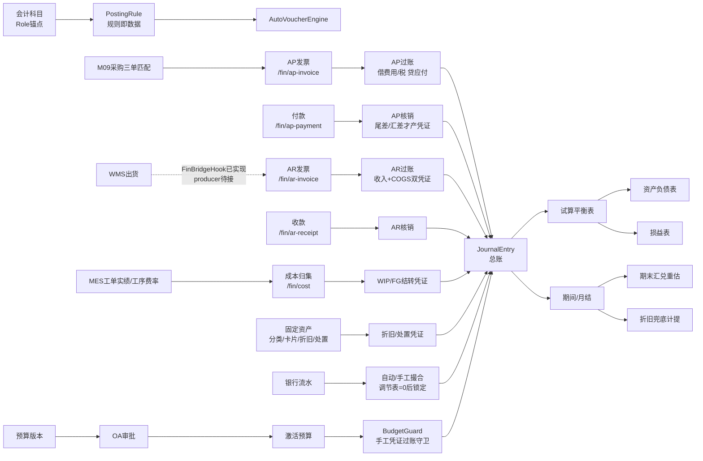

# 财务管理（GL/AP/AR/成本/资产/资金/预算）· 最详细用户操作培训手册（模块总册 A · BOOK-M08）

> **作用**：财务模块的**全局用户操作培训总册**。建立模块业务定位/角色/全流程/22 页总览，对总账、期间、AP、AR、报表、成本、固定资产、银行对账、预算 9 条业务线逐页给出 14 小节细化；附模块级场景/测试矩阵/可执行用例/验收/术语/待确认/培训脚本。配套单页 SOP 后续见 `fin-pages/`（待 W6/W10 逐页出，每页 16 节）。
> **基准**：分支 `feat/training-m07`（基于现有工作树），盘点日 2026-06-30；后端总账铁律/自动凭证/AP/AR/三表/成本/银行对账/资产/预算逐行实测于 `docs/codemap-fin/`（README+01~04，2026-06-22 权威快照）和 `docs/_inventory/core-fin.md`；前端 22 个 view 取自 `cp6.web/src/views/fin/`，路由取自 `cp6.web/src/router/index.ts:49-70`，API 取自 `cp6.web/src/api/fin/`。查不到标 `待业务确认`；功能没写标 `待实现`；代码无该项标 `代码未发现`。
> **在闭环中的位置**：财务是 ERP-MES-WMS-PUR 闭环的**价值落账层**。M09 采购三单匹配会委托财务创建 AP；WMS 出货到 AR 自动开票 Hook 已实现但出货主流程 producer 端未发现 live 调用；MES 实绩/费率进入成本归集；OA 审批回调过账凭证和激活预算；银行流水、预算、资产折旧又反向约束凭证过账与月结。

---

## 0. 本手册使用的培训样例数据

> 标「培训样例」= 非系统内置，需在测试环境预置主数据；带"系统采番"的编号由系统自动生成。财务样例承接 M09 采购的 `MAT-K280` 原纸链和 M04/M06 的出货链，用同一批业务数据贯穿 AP、AR、成本、报表、对账。

| 类别 | 样例 | 用途 |
|---|---|---|
| 会计期间 | `FY2026 P07`（2026-07-01~2026-07-31） | 记账、试算、月结、折旧、银行对账、预算执行 |
| 科目方案 | `CN-GAAP` | 科目表模板导入；角色锚点如 `AP_CONTROL`、`AR_CONTROL`、`BANK`、`FG`、`COGS` |
| 供应商 | `SUP-K280` / 原紙供应商 | AP 发票、付款、核销、AP 账龄、采购三单匹配接缝 |
| 客户 | `CUS-A001` / A社 | AR 发票、收款、信用查询、AR 账龄 |
| 银行账户 | `B-A0001` / 三井住友-基本户 | 付款/收款银行科目、银行流水、银行对账 |
| AP 发票 | 供应商票号 `SUPINV-202607-001`，金额 1,200,000，税 10% | 手工录入或由 M09 三单匹配创建，过账后生成 GL 凭证 |
| 付款 | `PAY` 系统采番，金额 1,200,000 | AP 付款、核销；测试尾差/汇差时可拆两笔付款 |
| AR 发票 | `AR` 系统采番，销售金额 1,800,000，成本估算 1,100,000 | 出货开票/手工开票、收入确认、成本结转、收款核销 |
| 成本对象 | 工单 `WO2026070001` | 成本归集：料=MES 真实消耗×BOM 受给单价，工/费=工时×费率 |
| 固定资产 | `FA` 系统采番，四色印刷机，原值 8,000,000 | 资产卡片、折旧、处置 |
| 银行流水 | 2026-07 基本户对账单，期初/期末余额 | 自动撮合、手工撮合、银行单方凭证、锁定 |
| 预算 | `BUD-2026-*` 销售与制造费用预算 | 预算编制、OA 审批、预算 vs 实际、过账前预控 |

> ⚠️ 财务演示前必须确认：科目表模板已导入；关键 Role 锚点科目已启用；会计期间开启；银行账户绑定 GL 银行科目；税码方向与可抵扣性正确；AP/AR 往来对象已有；成本页要有 MES 工单实绩与工序费率；预算硬控只拦**手工凭证过账**，自动凭证不经过 BudgetGuard。

---

## 1. 模块业务定位

财务模块不是单纯的"发票页面集合"，而是 CP6 从"进销存 + MES"升级为 ERP 的账层。它把每个业务动作翻译成凭证，并用总账、子账、报表、对账、预算、资产生命周期共同保证账不坏。

### 1.1 财务三铁律

| 铁律 | 系统实现 | 操作影响 |
|---|---|---|
| 借贷恒等 | `JournalEntryService.ValidateBalance`：整张凭证 `ΣDebit == ΣCredit`，每行借/贷互斥，科目必须末级且启用 | 手工凭证可先存草稿，提交/过账时不平必挡 |
| 凭证不可改不可删 | `JournalEntryController` 无 PUT/DELETE；错账走 `Reverse` 红冲 | 用户不能修改已过账凭证，只能红冲再重做 |
| maker-checker | 手工过账 `MakerId == CheckerId` 拒 `E-FIN-111`；自动凭证 `SYSTEM` 可信直过 | 制单人与复核/过账人必须分离 |

### 1.2 财务六个核心锚

1. **Role 锚点科目**：自动凭证规则不写死科目 Id，而按 `GlAccount.Role` 找科目。换科目模板只换数据。
2. **自动凭证引擎**：AP/AR/成本/折旧/处置等业务服务构造 `FinBizEvent`，由 `AutoVoucherEngine` 找 `PostingRule` 生成凭证并直过。
3. **子账 ↔ GL 勾稽**：AP/AR 未结余额必须等于 GL 控制科目余额；每日 Worker 会跑 AP、AR、试算平衡三类检查。
4. **期间锁期**：凭证按记账日归入期间；期间关闭后不允许再过账；月结前检查未过账凭证、试算不平、上期未结、工作量法漏录。
5. **银行/预算守卫**：银行对账锁定后，命中锁定期银行科目的凭证不允许过账；预算硬控只作用于手工凭证过账。
6. **报表复用试算表**：试算表是三表基石；资产负债表用期末余额，损益表用本期发生，报表无独立存储。

### 1.3 已知边界

| 边界 | 现状 | 培训口径 |
|---|---|---|
| 出货→AR 自动开票 | `FinBridgeHook`、dispatcher、DI 已有；`OutboundService` 未发现 live producer 组装 `FinShipmentInvoiceRequest` 调 Fin Hook | 作为已实现 Hook + 待接生产触发点讲，不承诺出货主流程自动出现 AR |
| 信用控制 | Fin 信用接口可查询客户额度与未结 AR；未在出货前做硬拦截 | 当作"信用查询/提示"，不是发货硬闸门 |
| 预算硬控 | `BudgetGuard` 只挂手工 `JournalEntryService.PostAsync`；`AutoPostAsync` 不调预算守卫 | 自动凭证不被预算挡，培训要讲清 |
| 成本中心维护 | 有 `/api/fin/cost-center` lookup，无独立 `CostCenterView.vue` | 成本中心作为预算/凭证维度引用，维护入口待确认 |
| 资产错误码 | 固定资产多数为裸码 `FA001~FA012`，工作量法纯函数有 `E-FA-008` | 不统一为 `E-FIN`，SOP 写明 |

---

## 2. 适用角色与职责

| 角色 | 主要职责 | 可操作页面 | 不能随意操作 | 备注 |
|---|---|---|---|---|
| 总账会计 | 科目、手工凭证、试算、报表 | 会计科目、记账凭证、试算平衡表、资产负债表、损益表 | 不能独自制单又过账；不能改已过账凭证 | maker-checker 硬约束 |
| 财务主管 | 月结、反结账、复核、报表确认 | 期间/月结、凭证过账/驳回/红冲、三表 | 反结账是危险动作，需留痕 | `fin-period.reopen` 高风险 |
| 应付会计 | AP 发票、付款、核销、供应商账龄 | 应付发票、付款/核销、应付账龄 | 不直接修改 GL 控制科目余额 | AP 过账自动进 GL |
| 应收会计 | AR 发票、收款、核销、客户账龄 | 应收发票、收款/核销、应收账龄、信用查询 | 不能把信用查询当发货硬挡 | 信用控制当前查询/提示 |
| 成本会计 | 工单成本归集、WIP/FG 结转 | 成本核算、MES 工序费率关联 | 不手工改成本结转凭证 | 料工费来自 MES/BOM/费率 |
| 固定资产会计 | 资产分类、卡片、折旧、处置 | 资产分类、资产卡片、折旧计提、资产处置 | 处置后反冲需按顺序回退 | 处置先补提当月折旧 |
| 资金会计 | 银行流水导入、撮合、锁定 | 银行流水、导入模板、银行对账撮合台 | 锁定前必须双向调节表为 0 | 锁后守卫影响凭证过账 |
| 预算管理员 | 预算方案/版本/行、审批、执行分析 | 预算编制、预算执行分析 | 预算版本非草稿不能改行 | OA 回调激活版本 |
| 审批人 | 审批凭证/预算 | OA 审批中心（非本册页面） | 不能绕过 OA 回调手工改状态 | 回调在同事务原子持久化 |
| 系统管理员 | 角色权限、科目模板、种子数据 | PUB 权限、基础资料、财务主数据 | 不直接改生产账表 | 权限点见 §11 来源 |

> 角色与权限为数据驱动（PUB 四粒度）。财务 Controller 的读端点多为 `[Authorize]`，变更端点贴 `fin-*` 细粒度权限；银行对账/资产/预算权限点更细。SOP 拆页时需把每页按钮权限写进 §4/§11。

---

## 3. 模块完整业务流程

### 3.1 跨模块接缝目录

| 接缝 | 方向 | 触发页面/方法 | 落地动作 | 实现状态 | 培训提醒 |
|---|---|---|---|---|---|
| 采购三单匹配→AP | M09→M08 | `/pur/match` 释放匹配 | `IFinAp.CreateInvoiceFromPurchaseAsync` 创建并过账 AP | 已接真实适配器 | AP 发票来源可以是采购，不仅是手工 |
| WMS 出货→AR | M06→M08 | `IFinBridgeHook.OnShipmentConfirmedAsync` | 创建 AR 发票并过账收入/成本 | Hook 已实现；出货主流程 producer 未发现 | 讲清"钩子可用，但 live 主流程待接" |
| WMS 出货取消→AR 红冲 | M06→M08 | `OnShipmentCancelledAsync` | 反查出货 AR 发票并红冲 | Hook 已实现 | 红冲而不是删发票 |
| MES→成本 | M05→M08 | `/fin/cost/{wo}/collect` | 取 MES 实际消耗、工时、费率归集成本 | 已实现 | 缺费率 strict 模式挡，迁移模式回退 |
| 财务凭证→OA | M08→M10 | `JournalApprovalCallback` | OA 通过后 `PostAsync`，驳回 `RejectAsync` | 已实现 | 过账人取 OA 决策人，满足 maker-checker |
| 预算→OA | M08→M10 | 预算版本提交审批 | 通过激活、旧版归档；驳回置 Rejected | 已实现 | 回调不独立 SaveChanges，依赖 OA 事务 |
| 银行对账→GL 守卫 | M08内部 | 对账单锁定 | 锁后命中银行科目的凭证过账被挡 | 已实现 | 锁定前必须调节表为 0 |
| 月结→折旧/汇兑 | M08内部 | `/fin/period/{id}/close` | 兜底计提折旧、期末汇兑重估 | 已实现 | 结账不是只改状态 |

### 3.2 状态机速查

| 对象 | 状态 |
|---|---|
| 凭证 `JournalStatus` | 0 草稿 / 1 待复核 / 2 已过账 / 3 已驳回 / 4 已红冲 |
| 会计期间 `PeriodStatus` | 0 开启 / 1 已结账 |
| AP/AR 发票 | 0 草稿 / 1 已过账 / 2 部分核销 / 3 已核销 / 4 已红冲 |
| 付款/收款 | 1 已过账 / 2 已撤销 |
| 成本单 | 0 草稿 / 1 已归集 / 2 已结转 |
| 银行对账单 | 0 Open / 1 Locked |
| 银行流水匹配 | 0 未匹配 / 1 已匹配 / 2 标记未达 |
| 资产卡片 | 0 草稿 / 1 使用中 / 2 已提足 / 3 已处置（前端按 status tag） |
| 折旧批次 | 0 草稿 / 1 已过账 / 2 已反冲 |
| 资产处置 | 0 草稿 / 1 已确认 / 2 已反冲 |
| 预算版本 | 0 草稿 / 1 审批中 / 2 已批准 / 3 已驳回 / 4 已归档 |
| 预算控制模式 | 0 不控制 / 1 预警 / 2 硬控制 |
| 预算控制口径 | 0 累计(YTD) / 1 单期 |

---

## 4. 菜单页面总览（22 页）

> 最易踩的是：①手工凭证必须借贷恒等且 maker-checker；②已过账凭证不能改删，只能红冲；③AP/AR 过账都走自动凭证规则，科目 Role 缺失会 `E-FIN-141`；④月结前会跑多重守卫；⑤银行对账锁定会反向挡银行科目凭证；⑥预算硬控只挡手工凭证；⑦出货→AR live producer 未发现；⑧资产折旧/处置错误码不是统一 `E-FIN`。

| § | 页面 | 路由 | 优先级 | 一句话 | 读/写 |
|---|---|---|---|---|---|
| 5.1 | 会计科目 | `/fin/account` | P0 | 科目表 CoA + Role 锚点 | 写 |
| 5.2 | 记账凭证 | `/fin/journal` | P0 | 手工凭证、复核、过账、红冲 | 写 |
| 5.3 | 试算平衡表 | `/fin/trial-balance` | P1 | 期初+本期+期末三栏试算 | 读 |
| 5.4 | 期间/月结 | `/fin/period` | P0 | 关账、锁期、反结账 | 写 |
| 5.5 | 应付发票 | `/fin/ap-invoice` | P0 | AP 发票录入/过账/供应商红字 | 写 |
| 5.6 | 付款/核销 | `/fin/ap-payment` | P0 | AP 付款、撤销、发票核销 | 写 |
| 5.7 | 应付账龄 | `/fin/ap-aging` | P1 | AP 账龄 + AP↔GL 勾稽 | 读 |
| 5.8 | 应收发票 | `/fin/ar-invoice` | P0 | AR 发票/红字/红冲/成本结转 | 写 |
| 5.9 | 收款/核销 | `/fin/ar-receipt` | P0 | AR 收款、撤销、发票核销、信用查询 | 写 |
| 5.10 | 应收账龄 | `/fin/ar-aging` | P1 | AR 账龄 + AR↔GL 勾稽 | 读 |
| 5.11 | 资产负债表 | `/fin/balance-sheet` | P1 | 期末余额报表，资产=负债+权益+本年利润 | 读 |
| 5.12 | 损益表 | `/fin/income-statement` | P1 | 本期收入/成本/费用/利润 | 读 |
| 5.13 | 成本核算 | `/fin/cost` | P1 | MES 实绩归集成本 + WIP/FG 结转 | 写 |
| 5.14 | 资产分类 | `/fin/asset-category` | P2 | A3 资产分类 + 三科目锚点 | 写 |
| 5.15 | 资产卡片 | `/fin/asset-card` | P1 | 固定资产台账 + 折旧参数 | 写 |
| 5.16 | 折旧计提 | `/fin/asset-deprec` | P1 | 试算/计提/过账/反冲 | 写 |
| 5.17 | 资产处置 | `/fin/asset-disposal` | P2 | 出售/报废/转让/盘亏处置 | 写 |
| 5.18 | 银行对账撮合台 | `/fin/bank-reconciliation` | P1 | 自动/手工撮合、调节表、锁定 | 写 |
| 5.19 | 银行流水 | `/fin/bank-statement` | P1 | 对账会话、流水导入/手工维护 | 写 |
| 5.20 | 银行导入模板 | `/fin/bank-import-profile` | P2 | CSV/Excel 字段映射配置 | 写 |
| 5.21 | 预算编制 | `/fin/budget` | P1 | 预算方案/版本/行/导入/审批 | 写 |
| 5.22 | 预算执行分析 | `/fin/budget/vs-actual` | P1 | 预算 vs 实际、未编预算、预检 | 读 |

---

## 5. 页面详细操作说明

> 每页 14 小节；GL/AP/AR/月结/银行/预算等核心页把"后端硬规则"写进 §5.x.8。**坑点统一提醒**：`E-FIN-xxx` 多数有 i18n；资产页存在裸码 `FA001~FA012`；预算用 `E-A5-*`；银行对账用 `E-A4-*`；成本会出现 `E-A2-*`/`W-A2-*`；不要把前端按钮灰因当成唯一校验，后端仍是硬闸门。

### 5.1 会计科目（GlAccount · /fin/account）

**5.1.1 页面业务目的**：维护科目表（Chart of Accounts）和自动凭证 Role 锚点。没有科目表，AP/AR/成本/资产/预算都无法正确落凭证。

**5.1.2 流程位置**：上游＝科目模板包 `CN-GAAP/INTL`；下游＝手工凭证、自动凭证引擎、报表、资产分类、银行账户、预算行。

**5.1.3 谁使用**：总账会计/财务主管。**5.1.4 操作前准备**：确认使用的标准方案；明确哪些科目是末级、控制科目、是否要求往来单位。

**5.1.5 页面区域**：方案筛选 + 是否含停用 + 导入模板 + 新建；科目树/列表；新增/编辑弹窗。

**5.1.6 字段填写说明**：`Code` 唯一；`Name` 必填；`Type`=资产/负债/权益/收入/费用；`NormalSide`=借/贷；`ParentId` 形成树；`IsLeaf` 决定能否记账；`IsControl/SubLedgerType/RequirePartner` 决定勾稽与往来校验；`Role` 是自动凭证的科目锚点；`StandardScheme` 导入后不应随意改。

**5.1.7 按钮操作**：导入模板、查询、新建、编辑、停用。停用不是删除，历史凭证仍引用原科目。

**5.1.8 业务规则与校验**：Code 空 `E-FIN-004`；重复 `E-FIN-001`；未知方案 `E-FIN-010`；模板已导入 `E-FIN-002`；自动凭证按 Role 找不到科目会 `E-FIN-141`。

**5.1.9 完成后检查**：末级科目可在凭证行下拉选择；`AP_CONTROL/AR_CONTROL/BANK/FG/COGS/TAX_INPUT/TAX_OUTPUT` 等关键 Role 有且启用。

**5.1.10 状态流转**：启用→停用；无删除。

**5.1.11 常见错误**：把非末级科目用于凭证行，过账时被 `E-FIN-104` 拦；控制科目没要求 Partner，AP/AR 子账勾稽失去往来维度。

**5.1.12 注意事项**：模板包只解决初始科目，不解决客户自定义科目映射。Role 锚点变更会影响所有自动凭证。

**5.1.13 标准操作步骤**：选择方案→导入模板→核对 Role 锚点→新建补充科目→必要时停用不用科目。

**5.1.14 本页面测试点汇总**：模板导入幂等/Code 唯一/停用后不可记账/非末级不可记账/RequirePartner 必填/Role 缺失导致自动凭证失败。

---

### 5.2 记账凭证（JournalEntry · /fin/journal）

**5.2.1 页面业务目的**：录入手工凭证，并执行提交复核、过账、驳回、红冲。它是财务铁律最集中体现的页面。

**5.2.2 流程位置**：上游＝会计科目、会计期间、预算、银行对账锁定状态；下游＝试算表、三表、月结、预算执行、银行对账。

**5.2.3 谁使用**：总账会计制单，财务主管/复核人过账或驳回。**5.2.4 操作前准备**：科目表已导入；期间开启；预算和银行对账锁定边界已确认。

**5.2.5 页面区域**：状态筛选 + 新建凭证；凭证列表；新建弹窗；凭证明细查看弹窗。

**5.2.6 字段填写说明**：头部填 `voucherDate/source/description`；行填 `accountId/debit/credit/partnerId/costCenterId/costObject/memo`。每行借贷只能一边有金额，金额不能负数；需要往来单位的科目必须填 Partner。

**5.2.7 按钮操作**：保存草稿、添加分录行、提交复核、过账、驳回、红冲、查看。前端用 `<0.005` 容差提示是否平衡，后端用 decimal 精确校验。

**5.2.8 业务规则与校验**：草稿可借贷不平；提交/过账必跑 `ValidateBalance`。少于两行 `E-FIN-101`；负数 `102`；同借同贷或空行 `103`；非末级 `104`；停用 `105`；往来缺失 `106`；借贷不等 `107`；科目不存在 `108`；非待复核过账 `110`；制单人=过账人 `111`；锁期 `112`；手工凭证不可自动直过 `113`。

**5.2.9 完成后检查**：提交后状态待复核；过账后状态已过账并生成 Checker；红冲后原凭证变已红冲，新增反向凭证。

**5.2.10 状态流转**：草稿→提交复核→待复核→过账；待复核可驳回；已过账可红冲。无修改/删除已过账凭证。

**5.2.11 常见错误**：同一用户制单又过账；用银行科目过账到已锁定银行对账期间；费用凭证超预算硬控被挡。

**5.2.12 注意事项**：`PostAsync` 会调用 BankReconGuard 和 BudgetGuard；`AutoPostAsync` 只调 BankReconGuard，不调 BudgetGuard。

**5.2.13 标准操作步骤**：新建凭证→录两行或多行→确认借贷平衡→保存草稿→提交复核→复核人过账；错账走红冲。

**5.2.14 本页面测试点汇总**：借贷恒等/末级科目/停用科目/RequirePartner/maker-checker/锁期/银行锁后守卫/预算硬控/红冲借贷对调。

---

### 5.3 试算平衡表（TrialBalance · /fin/trial-balance）

**5.3.1 页面业务目的**：按期间实时滚算期初、本期借贷、期末余额，并给出本期发生平衡与期末余额平衡两层标志。

**5.3.2 流程位置**：上游＝已过账凭证；下游＝月结预检、资产负债表、损益表、每日对账 Worker。

**5.3.3 谁使用**：总账会计/财务主管。**5.3.4 操作前准备**：选择会计期间；确认凭证已过账。

**5.3.5 页面区域**：期间下拉 + 刷新；试算表格；合计行；平衡标识。

**5.3.6 字段说明**：`OpenBal` 是期初余额，`PeriodDebit/PeriodCredit` 是本期发生，`CloseBal` 是期末余额，`NormalSide` 控制余额正负方向。

**5.3.7 按钮操作**：刷新/重算。无写入动作。

**5.3.8 业务规则与校验**：期间不存在 `E-FIN-140`；只统计 Posted 凭证；期初含历史累计；不平会记录错误日志。

**5.3.9 完成后检查**：`MovementBalanced=true` 且 `ClosingBalanced=true`；合计行借贷平。

**5.3.10 状态流转**：无状态机，实时查询。

**5.3.11 常见错误**：选错期间导致看不到本期发生；把损益表口径误用为期末余额。

**5.3.12 注意事项**：资产负债表取 `CloseBal`，损益表取 `PeriodDebit/Credit`，不要混。

**5.3.13 标准操作步骤**：选期间→刷新→检查平衡标志→钻回凭证列表排查异常。

**5.3.14 本页面测试点汇总**：期初累计/本期发生/期末余额/两层平衡/未过账凭证不入表/期间不存在。

---

### 5.4 期间/月结（FiscalPeriod · /fin/period）

**5.4.1 页面业务目的**：管理会计期间，执行结账预检、结账锁期和反结账。

**5.4.2 流程位置**：上游＝试算表、未过账凭证、折旧、汇兑重估、上一期间；下游＝锁期守卫、报表定版、银行对账。

**5.4.3 谁使用**：财务主管。**5.4.4 操作前准备**：所有本期凭证已处理；AP/AR/银行/资产/预算问题已关闭。

**5.4.5 页面区域**：年份筛选 + 刷新；期间列表；行操作：结账预检/结账/反结账。

**5.4.6 字段说明**：`FiscalYear/PeriodNo/PeriodStart/PeriodEnd/Status/ClosedBy/ClosedAt`；财年起始月由 `Fin:FiscalYearStartMonth` 配置。

**5.4.7 按钮操作**：结账预检只检查不改状态；结账会执行折旧兜底和汇兑重估后锁期；反结账是危险动作。

**5.4.8 业务规则与校验**：已结账 `E-FIN-142`；有 Draft/Pending 凭证 `143`；试算不平 `144`；上一期间未结 `145`；反结账非 Closed `146`；期间不存在 `140`。

**5.4.9 完成后检查**：状态已结账；关闭时间/关闭人有值；锁期后新凭证过账会 `E-FIN-112`。

**5.4.10 状态流转**：开启→已结账；已结账可反结账回开启。

**5.4.11 常见错误**：只做预检没点结账；以为结账只改状态，忽略自动折旧/汇兑重估；跳月结账被挡。

**5.4.12 注意事项**：资产工作量法漏录会阻断；反结账需审计留痕，生产环境必须高权限。

**5.4.13 标准操作步骤**：刷新期间→点预检→处理问题→点结账→抽查凭证锁期和报表。

**5.4.14 本页面测试点汇总**：未过账凭证挡/月结顺序挡/试算不平挡/折旧兜底/汇兑重估/锁期过账挡/反结账权限。

---

### 5.5 应付发票（ApInvoice · /fin/ap-invoice）

**5.5.1 页面业务目的**：录入供应商发票或供应商红字，过账后自动生成 AP 凭证，形成应付子账。

**5.5.2 流程位置**：上游＝供应商、税码、费用/存货科目、M09 三单匹配；下游＝付款核销、AP 账龄、AP↔GL 勾稽。

**5.5.3 谁使用**：应付会计。**5.5.4 操作前准备**：供应商、税码、费用/原材料科目、会计期间已准备；供应商原始票号不重复。

**5.5.5 页面区域**：供应商/状态筛选；新建发票/供应商红字/刷新；发票列表；发票弹窗（头+明细行）。

**5.5.6 字段说明**：头部填供应商、发票日、到期日、币种、汇率；行填物料、数量、单价、金额、税码、费用科目、成本中心。税额由后端按税码算。

**5.5.7 按钮操作**：新建发票、供应商红字、添加行、删除行、确定、过账。

**5.5.8 业务规则与校验**：供应商票号重复 `E-FIN-201`；发票不存在 `202`；非草稿过账 `203`；无行 `204`。可抵扣进项税单独借 `TAX_INPUT`；不可抵扣税并入成本行；过账事件 `AP.InvoicePosted`/`AP.CreditMemo`。

**5.5.9 完成后检查**：状态已过账；`JournalEntryId` 回填；AP 账龄出现未付款余额；GL 应付控制科目增加。

**5.5.10 状态流转**：草稿→已过账→部分核销→已核销；红字/红冲进入已红冲。

**5.5.11 常见错误**：税码 Recoverable 设错导致成本和税额口径错；费用科目不是末级；Role 锚点缺导致自动凭证失败。

**5.5.12 注意事项**：M09 三单匹配创建 AP 时走同一应付服务；手工发票也走同一自动凭证引擎。

**5.5.13 标准操作步骤**：筛供应商→新建发票→填头/行→保存→过账→查 AP 账龄和凭证。

**5.5.14 本页面测试点汇总**：防重票号/无行挡/税码可抵扣/不可抵扣并入成本/红字/过账生成 AP 凭证/AP↔GL 勾稽。

---

### 5.6 付款/核销（Payment · /fin/ap-payment）

**5.6.1 页面业务目的**：记录供应商付款并核销 AP 发票；付款过账生成银行/应付凭证，核销本身不产凭证，只有尾差/汇差产差额凭证。

**5.6.2 流程位置**：上游＝已过账 AP 发票、银行账户；下游＝AP 核销、AP 账龄、银行对账。

**5.6.3 谁使用**：应付会计/资金会计。**5.6.4 操作前准备**：银行账户绑定 GL 银行科目；发票已过账；付款金额和汇率确认。

**5.6.5 页面区域**：供应商/状态筛选；新建付款、银行账户、刷新；付款列表；付款弹窗；核销弹窗；银行账户弹窗。

**5.6.6 字段说明**：付款填供应商、付款日、金额、币种/汇率、付款方式、银行账户、是否预付款；核销行填本次核销金额、折扣金额、折扣科目。

**5.6.7 按钮操作**：新建付款、核销、撤销、银行账户新建。

**5.6.8 业务规则与校验**：银行账户不存在 `E-FIN-210`；付款不存在 `211`；非已过账 `212`；可用余额不足 `220`；供应商不一致 `221`；超欠款 `222`；有折扣无科目 `223`；发票状态不允许 `224`。撤销顺序：先解核销并红冲差额凭证，再红冲付款凭证。

**5.6.9 完成后检查**：付款状态已过账；核销后发票 `SettledAmount` 推进；全额核销后发票已核销；差额凭证仅在尾差/汇差不为 0 时出现。

**5.6.10 状态流转**：付款已过账→已撤销；发票已过账→部分核销→已核销。

**5.6.11 常见错误**：拿未过账发票核销；折扣未填折扣科目；误以为核销一定产生凭证。

**5.6.12 注意事项**：AP 汇差公式为 `AppliedAmount × (发票汇率 - 付款汇率)`，方向与 AR 相反。

**5.6.13 标准操作步骤**：新建付款→选择银行账户→过账→打开核销→勾选发票并填金额/折扣→确认→查账龄。

**5.6.14 本页面测试点汇总**：付款凭证/预付款凭证/多发票核销/超额挡/折扣科目必填/汇差凭证/撤销回退顺序。

---

### 5.7 应付账龄（ApAging · /fin/ap-aging）

**5.7.1 页面业务目的**：按供应商查看未付余额账龄，并展示 AP 子账与 GL 应付控制科目的勾稽结果。

**5.7.2 流程位置**：上游＝AP 发票和核销；下游＝付款计划、月结检查、供应商对账。

**5.7.3 谁使用**：应付会计/财务主管。**5.7.4 操作前准备**：AP 发票已过账，核销已完成。

**5.7.5 页面区域**：供应商筛选、截止日、刷新；账龄表；勾稽结果。

**5.7.6 字段说明**：未到期、逾期 1-30、31-60、60+、合计、逾期合计。金额按发票记账汇率折本位币。

**5.7.7 按钮操作**：刷新。无写入。

**5.7.8 业务规则与校验**：未付余额 = `(GrossAmount - SettledAmount) × FxRate`；红字反向；GL 侧取 `AP_CONTROL` 已过账分录 `Credit - Debit`。

**5.7.9 完成后检查**：`SubLedger == GlBalance`；逾期供应商清单可用于付款计划。

**5.7.10 状态流转**：无状态机。

**5.7.11 常见错误**：截止日不一致导致账龄与月结报告差异；忘记核销导致逾期虚高。

**5.7.12 注意事项**：这是只读诊断页，发现不平要回 AP 发票/付款/凭证排查，不在本页改账。

**5.7.13 标准操作步骤**：选截止日/供应商→刷新→检查账龄桶→检查勾稽结果。

**5.7.14 本页面测试点汇总**：四桶账龄/红字反向/部分核销/全额核销消失/AP↔GL 不平提示。

---

### 5.8 应收发票（ArInvoice · /fin/ar-invoice）

**5.8.1 页面业务目的**：录入/过账客户发票、销售红字和红冲；过账时生成收入确认凭证，必要时生成成本结转凭证。

**5.8.2 流程位置**：上游＝客户、税码、收入科目、出货 Hook；下游＝收款核销、AR 账龄、收入/成本报表。

**5.8.3 谁使用**：应收会计。**5.8.4 操作前准备**：客户、税码、收入科目、会计期间已准备；如要成本结转需填 `CostAmount`。

**5.8.5 页面区域**：客户/状态筛选；新建发票、销售红字、刷新；发票列表；发票弹窗。

**5.8.6 字段说明**：头部填客户、发票日、到期日、币种/汇率、成本金额；行填物料、数量、单价、税码、收入科目、成本中心。

**5.8.7 按钮操作**：新建发票、销售红字、过账、红冲。

**5.8.8 业务规则与校验**：发票不存在 `E-FIN-302`；非草稿过账 `303`；行异常 `304`。过账分两类事件：`AR.Revenue` 借应收贷收入/税；`AR.Cogs` 借主营成本贷成品。成本结转凭证 `Source=Cost`，与收入凭证分开幂等。

**5.8.9 完成后检查**：收入凭证回填 `JournalEntryId`；成本凭证回填 `CostJournalEntryId`；AR 账龄出现未收余额。

**5.8.10 状态流转**：草稿→已过账→部分核销→已核销；可红冲。

**5.8.11 常见错误**：把出货自动开票当成已接 live 主流程；实际 Hook 已实现但出货主流程 producer 端待接。

**5.8.12 注意事项**：AR 销项税不涉及可抵扣；收入与成本是两张凭证，排查利润时要看两边。

**5.8.13 标准操作步骤**：新建发票→填头/行/成本金额→保存→过账→检查收入凭证和成本凭证。

**5.8.14 本页面测试点汇总**：收入凭证/成本凭证/红字/红冲/成本为 0 时不结转 COGS/出货 Hook 已实现但 producer 待接。

---

### 5.9 收款/核销（Receipt · /fin/ar-receipt）

**5.9.1 页面业务目的**：记录客户收款并核销 AR 发票；提供信用查询。

**5.9.2 流程位置**：上游＝已过账 AR 发票、银行账户、客户信用额度；下游＝AR 账龄、银行对账、信用风险。

**5.9.3 谁使用**：应收会计/资金会计。**5.9.4 操作前准备**：银行账户已绑定 GL；客户未结发票已过账。

**5.9.5 页面区域**：客户/状态筛选；新建收款、信用查询、银行账户、刷新；收款列表；收款弹窗；核销弹窗；信用查询弹窗。

**5.9.6 字段说明**：收款填客户、收款日、金额、币种/汇率、方式、银行账户、是否预收；核销填应用金额、销售折扣、折扣科目。

**5.9.7 按钮操作**：新建收款、核销、撤销、信用查询、银行账户新建。

**5.9.8 业务规则与校验**：银行不存在 `E-FIN-310`；收款不存在 `311`；非已过账 `312`；核销错误族 `320~324` 镜像 AP。AR 汇差公式为 `AppliedAmount × (收款汇率 - 发票汇率)`。

**5.9.9 完成后检查**：收款凭证已生成；核销推进发票状态；信用查询显示额度、未结 AR、本单金额、是否超额。

**5.9.10 状态流转**：收款已过账→已撤销；AR 发票已过账→部分核销→已核销。

**5.9.11 常见错误**：把信用查询当硬拦截；当前 Fin 信用控制未在发货前硬挡。

**5.9.12 注意事项**：预收走预收账款；撤销同 AP 一样先解核销再红冲收款凭证。

**5.9.13 标准操作步骤**：新建收款→选择银行账户→确认→打开核销→选择发票→确认→查 AR 账龄。

**5.9.14 本页面测试点汇总**：收款/预收/撤销/多发票核销/折扣凭证/汇差方向/信用查询非硬挡。

---

### 5.10 应收账龄（ArAging · /fin/ar-aging）

**5.10.1 页面业务目的**：按客户查看未收余额账龄，并展示 AR 子账与 GL 应收控制科目的勾稽结果。

**5.10.2 流程位置**：上游＝AR 发票和收款核销；下游＝催收、信用控制、月结。

**5.10.3 谁使用**：应收会计/财务主管。**5.10.4 操作前准备**：AR 发票已过账，收款核销已录。

**5.10.5 页面区域**：客户筛选、截止日、刷新；账龄表；勾稽结果。

**5.10.6 字段说明**：未到期、逾期 1-30、31-60、60+、合计、逾期。

**5.10.7 按钮操作**：刷新。无写入。

**5.10.8 业务规则与校验**：未收余额 = `(GrossAmount - SettledAmount) × FxRate`；红字反向；GL 取 `AR_CONTROL` 已过账分录 `Debit - Credit`。

**5.10.9 完成后检查**：子账与 GL 匹配；逾期客户用于催收。

**5.10.10 状态流转**：无状态机。

**5.10.11 常见错误**：未核销导致逾期虚高；信用额度查询和账龄截止日口径不一致。

**5.10.12 注意事项**：发现不平回发票/收款/凭证查，不在账龄页改数据。

**5.10.13 标准操作步骤**：选截止日/客户→刷新→看逾期桶→看勾稽。

**5.10.14 本页面测试点汇总**：账龄桶/红字/部分核销/全额核销/AR↔GL 勾稽。

---

### 5.11 资产负债表（BalanceSheet · /fin/balance-sheet）

**5.11.1 页面业务目的**：从试算表期末余额生成资产负债表，验证资产=负债+权益+本年利润。

**5.11.2 流程位置**：上游＝试算表；下游＝财务报表、月结归档。

**5.11.3 谁使用**：财务主管/总账会计。**5.11.4 操作前准备**：期间选择正确；凭证已过账。

**5.11.5 页面区域**：期间选择 + 刷新；资产、负债、权益三栏；本年利润与平衡标识。

**5.11.6 字段说明**：资产取资产类 CloseBal；负债/权益同理；收入费用转本年利润并入权益侧。

**5.11.7 按钮操作**：刷新。无写入。

**5.11.8 业务规则与校验**：复用 `TrialBalanceService`；期间不存在走 `E-FIN-140`；报表无独立存储。

**5.11.9 完成后检查**：`IsBalanced=true`；总资产等于负债权益合计。

**5.11.10 状态流转**：无状态机。

**5.11.11 常见错误**：用未结账期间看正式报表；把损益类科目直接列入权益而不理解本年利润并入。

**5.11.12 注意事项**：报表数字实时来自凭证，锁账前仍会变。

**5.11.13 标准操作步骤**：选期间→刷新→核对平衡→导出/截图交付（导出功能若无则待实现）。

**5.11.14 本页面测试点汇总**：资产负债恒等/本年利润并入/凭证新增后实时变化/期间不存在。

---

### 5.12 损益表（IncomeStatement · /fin/income-statement）

**5.12.1 页面业务目的**：从试算表本期发生额生成收入、成本、费用、毛利、净利。

**5.12.2 流程位置**：上游＝收入、成本、费用凭证；下游＝经营分析、预算执行。

**5.12.3 谁使用**：财务主管/成本会计。**5.12.4 操作前准备**：期间、收入/成本凭证已确认。

**5.12.5 页面区域**：期间选择 + 刷新；收入、成本、费用分组；毛利/净利汇总。

**5.12.6 字段说明**：收入=本期贷方-借方；费用=本期借方-贷方；`COGS` Role 拆主营成本，其它费用进营业费用。

**5.12.7 按钮操作**：刷新。无写入。

**5.12.8 业务规则与校验**：复用试算表 `PeriodDebit/PeriodCredit`，不是 `CloseBal`。

**5.12.9 完成后检查**：Revenue、Cost、GrossProfit、OperatingExpense、NetProfit 逻辑正确。

**5.12.10 状态流转**：无状态机。

**5.12.11 常见错误**：成本凭证未生成导致毛利虚高；把资产负债表口径混入损益表。

**5.12.12 注意事项**：AR 成本结转如果出货 Hook producer 未接，需手工/测试数据确认 COGS 来源。

**5.12.13 标准操作步骤**：选期间→刷新→核对收入/成本/费用→对照 AR 和成本核算页面。

**5.12.14 本页面测试点汇总**：收入净发生/COGS Role/费用净发生/毛利/净利/成本缺失风险。

---

### 5.13 成本核算（CostSheet · /fin/cost）

**5.13.1 页面业务目的**：按工单归集真实料工费，并将料工费结转到 WIP 与 FG。

**5.13.2 流程位置**：上游＝MES 工单、物料实际消耗、工序费率；下游＝AR 成本结转、损益表、库存价值。

**5.13.3 谁使用**：成本会计。**5.13.4 操作前准备**：工单完工或有实绩；BOM 受给单价、MES 费率、实际工时/机时准备。

**5.13.5 页面区域**：状态筛选、工单号输入、归集成本、结转成本；成本单列表/明细。

**5.13.6 字段说明**：`laborStd/overheadStd` 是迁移模式缺费率时回退值；明细行分直接材料、直接人工、制造费用；`FgUnitCost` 供 AR 成本结转。

**5.13.7 按钮操作**：归集成本、结转成本、刷新/查看。

**5.13.8 业务规则与校验**：工单不存在 `E-FIN-401`；已结转不可再归集 `402`；成本单不存在/草稿不可结转 `403`；strict 模式缺工序/费率用 `E-A2-*` 挡；迁移模式给 `W-A2-*` 警告。结转生成两张凭证：料工费→WIP、WIP→FG。

**5.13.9 完成后检查**：状态已归集或已结转；`TotalActual/StandardCost/Variance/FgUnitCost` 正确；成本凭证已过账。

**5.13.10 状态流转**：草稿→已归集→已结转。

**5.13.11 常见错误**：以为成本只是标准成本；实际料来自 MES 实际消耗，工费来自工时×费率。

**5.13.12 注意事项**：成本是 M08 与 M05 的关键接缝；缺费率时训练环境可走迁移模式，但生产口径应收紧。

**5.13.13 标准操作步骤**：输入工单→归集成本→核对料工费明细→结转成本→检查 WIP/FG 凭证。

**5.13.14 本页面测试点汇总**：真实材料成本/工时费率/strict vs fallback/重复归集/结转两凭证/FgUnitCost 供 AR。

---

### 5.14 资产分类（AssetCategory · /fin/asset-category）

**5.14.1 页面业务目的**：维护固定资产分类及默认折旧规则、资产/累计折旧/折旧费用三类科目。

**5.14.2 流程位置**：上游＝会计科目；下游＝资产卡片、折旧凭证、处置凭证。

**5.14.3 谁使用**：固定资产会计。**5.14.4 操作前准备**：固定资产、累计折旧、折旧费用科目已配置。

**5.14.5 页面区域**：分类列表；新建/编辑弹窗；删除按钮。

**5.14.6 字段说明**：分类编码、名称、父级、层级、默认折旧方法、默认使用月数、默认残值率、三类科目、是否启用。

**5.14.7 按钮操作**：新建、编辑、删除、刷新。

**5.14.8 业务规则与校验**：分类不存在 `FA006`；有子分类或被卡片引用删除 `FA012`。

**5.14.9 完成后检查**：资产卡片选择分类时能带出默认方法、月数、残值率。

**5.14.10 状态流转**：启用/停用；删除有守卫。

**5.14.11 常见错误**：三类科目配置错导致折旧借贷方向错。

**5.14.12 注意事项**：删除分类是高风险动作，有引用时必须挡。

**5.14.13 标准操作步骤**：新建分类→填三类科目→保存→到资产卡片验证默认值。

**5.14.14 本页面测试点汇总**：默认值带出/三科目必填/引用删除守卫/父子分类。

---

### 5.15 资产卡片（AssetCard · /fin/asset-card）

**5.15.1 页面业务目的**：建立固定资产台账，记录原值、残值、折旧方法、起折期、累计折旧、净值。

**5.15.2 流程位置**：上游＝资产分类；下游＝折旧计提、资产处置、报表。

**5.15.3 谁使用**：固定资产会计。**5.15.4 操作前准备**：资产分类与科目已建；购置日期、原值、残值率、使用年限明确。

**5.15.5 页面区域**：分类/状态筛选；新建、刷新；资产列表；卡片弹窗；折旧计划抽屉。

**5.15.6 字段说明**：`OriginalValue/SalvageRate/SalvageValue/Method/UsefulLifeMonths/TotalWorkload/AcquisitionDate/DepreciationStartPeriod/CostCenter/Machine/Dept/IsOpeningImport`。

**5.15.7 按钮操作**：新建、保存、激活、查看计划。

**5.15.8 业务规则与校验**：分类不存在 `FA001`；对象不存在 `FA006`；非草稿激活 `FA009`。起折期=购置次月；非期初导入时累计折旧和已提期数从 0 开始。

**5.15.9 完成后检查**：资产编号 `FA` 系统采番；草稿可激活；折旧计划金额合理。

**5.15.10 状态流转**：草稿→使用中→已提足/已处置。

**5.15.11 常见错误**：工作量法未填总工作量；期初导入和新购资产混淆。

**5.15.12 注意事项**：更新只允许业务/挂靠维度，不动金额和折旧参数。

**5.15.13 标准操作步骤**：新建卡片→选分类带默认→填原值/日期/方法→保存→激活→查看计划。

**5.15.14 本页面测试点汇总**：分类默认带出/起折期/四法字段显隐/期初导入/激活守卫/折旧计划。

---

### 5.16 折旧计提（AssetDepreciation · /fin/asset-deprec）

**5.16.1 页面业务目的**：按期间试算折旧、生成折旧批次、过账折旧凭证、必要时反冲。

**5.16.2 流程位置**：上游＝资产卡片、会计期间、工作量录入；下游＝月结、损益表、资产净值。

**5.16.3 谁使用**：固定资产会计/财务主管。**5.16.4 操作前准备**：期间开启；资产已激活；工作量法本期工作量已录。

**5.16.5 页面区域**：期间选择；试算表；折旧批次列表；批次操作。

**5.16.6 字段说明**：折旧方法、折旧额、期初累计、期末累计、费用科目、累计折旧科目、成本中心、工作量。

**5.16.7 按钮操作**：试算、计提、过账、反冲。

**5.16.8 业务规则与校验**：期间非 Open `FA007`；本期已有批次 `FA003`；工作量法缺量 `FA008`/`E-FA-008`；反冲次序受处置单守卫 `FA011`。过账按费用科目/成本中心借方分组，按累计折旧科目贷方分组。

**5.16.9 完成后检查**：批次已过账；资产累计折旧增加、已提期数推进；凭证 Source=Depreciation。

**5.16.10 状态流转**：草稿→已过账→已反冲。

**5.16.11 常见错误**：以为 Worker 会自动过账；实际 Worker 只在月末备草稿，不过账。

**5.16.12 注意事项**：月结会调用折旧 Accrue 兜底；已处置相关折旧反冲必须按处置反冲顺序处理。

**5.16.13 标准操作步骤**：选期间→试算→计提→检查批次→过账→抽查资产卡片累计折旧。

**5.16.14 本页面测试点汇总**：四法折旧/工作量法缺量/月末 Worker 草稿/结账兜底/过账凭证/反冲次序。

---

### 5.17 资产处置（AssetDisposal · /fin/asset-disposal）

**5.17.1 页面业务目的**：处理固定资产出售、报废、转让、盘亏，并生成清理/损益凭证。

**5.17.2 流程位置**：上游＝资产卡片、折旧、会计期间、银行账户；下游＝资产状态、损益表、资产负债表。

**5.17.3 谁使用**：固定资产会计/财务主管。**5.17.4 操作前准备**：资产在使用中或已提足；期间开启；有价款时银行账户已配置。

**5.17.5 页面区域**：状态筛选；新建/刷新；处置列表；处置弹窗。

**5.17.6 字段说明**：资产卡片、处置类型、处置日期、期间、价款、税额、清理费、银行账户、原因。

**5.17.7 按钮操作**：新建、确认、反冲。

**5.17.8 业务规则与校验**：资产不允许处置 `FA002`；期间非 Open `FA007`；有价款无银行 `FA010`；确认时先补提处置月折旧，再重算净值和损益，再建处置凭证。

**5.17.9 完成后检查**：资产状态已处置；处置凭证过账；如有补提折旧，关联折旧凭证存在。

**5.17.10 状态流转**：草稿→已确认→已反冲；资产状态按 PriorStatus 精确还原。

**5.17.11 常见错误**：未补提处置月折旧就算损益；反冲时忘记同步红冲补提折旧。

**5.17.12 注意事项**：盘亏走待处理财产损溢/营业外支出独立路径；出售/转让/报废走清理科目。

**5.17.13 标准操作步骤**：新建处置→填类型/价款/期间/银行→确认→检查资产状态和凭证→必要时反冲。

**5.17.14 本页面测试点汇总**：四类处置/处置月补提/有价款银行必填/净值重算/反冲回退。

---

### 5.18 银行对账撮合台（BankReconciliation · /fin/bank-reconciliation）

**5.18.1 页面业务目的**：把银行流水与 GL 银行科目凭证行撮合，生成双向调节表，调节差为 0 后锁定。

**5.18.2 流程位置**：上游＝银行流水、GL 已过账银行凭证；下游＝银行对账锁定、凭证过账守卫。

**5.18.3 谁使用**：资金会计/财务主管。**5.18.4 操作前准备**：银行流水已导入；银行账户绑定 GL 科目；相关凭证已过账。

**5.18.5 页面区域**：对账单选择；左侧银行流水；右侧候选凭证行；自动撮合/手工撮合/解撮合/生成单边凭证/标记未达；调节表；锁定/解锁。

**5.18.6 字段说明**：流水方向、金额、RefNo、匹配状态、候选行 EntryNo/VoucherDate/BankSignedAmount/Rank；调节表中的在途存款、未取付支票、银行单边项、调节差。

**5.18.7 按钮操作**：自动撮合、手工撮合、解撮合、生成银行单方凭证、标记未达、查看调节表、锁定、解锁。

**5.18.8 业务规则与校验**：自动撮合三阶：1:1、1:N、N:1；子集和 K=8；**唯一解才自动撮合**。手工撮合金额不等 `E-A4-MATCH-001`；凭证行占用 `002`；流水单不可用 `004`；锁定要求流水内部差=0、调节差=0、各组金额一致、期间未结账。

**5.18.9 完成后检查**：所有可匹配项已匹配或标记未达；`ReconciledDiff=0`；锁定后快照写入。

**5.18.10 状态流转**：Open→Locked；匹配状态 未匹配→已匹配/标记未达。

**5.18.11 常见错误**：多个候选金额都能凑平时自动撮合不会选；锁定后再过账命中银行科目会被 BankReconGuard 拦。

**5.18.12 注意事项**：解锁需原因；已结账期间不能解锁。

**5.18.13 标准操作步骤**：选择对账单→自动撮合→处理剩余候选→生成单边凭证或标未达→检查调节表→锁定。

**5.18.14 本页面测试点汇总**：唯一解撮合/多解不撮合/手工金额相等/RowVersion 并发/调节表公式/锁后守卫/解锁原因。

---

### 5.19 银行流水（BankStatement · /fin/bank-statement）

**5.19.1 页面业务目的**：创建银行对账会话，导入或维护银行流水，并跳转到撮合台。

**5.19.2 流程位置**：上游＝银行账户、会计期间、导入模板；下游＝银行对账撮合台。

**5.19.3 谁使用**：资金会计。**5.19.4 操作前准备**：银行账户与导入模板已配置；银行文件准备。

**5.19.5 页面区域**：银行账户/期间/状态筛选；新建会话；导入预览/确认；流水行增改删；跳转对账。

**5.19.6 字段说明**：对账单头含银行账户、期间、期初/期末余额、状态；流水行含日期、方向、金额、摘要、对方户名、参考号、余额、来源、匹配状态、RowVersion。

**5.19.7 按钮操作**：新建会话、导入预览、确认导入、添加行、编辑行、删除行、进入对账。

**5.19.8 业务规则与校验**：每账户每期唯一；导入 dryRun 只预览；确认时有 fatal parse error 整批拒 `E-A4-IMPORT-001`；强重复跳过；Profile 错误 `E-A4-PROFILE-*`。

**5.19.9 完成后检查**：流水行数与导入报告一致；强重复/疑似重复正确标识；期初期末余额可用于调节表。

**5.19.10 状态流转**：Open→Locked（锁定在撮合台）。

**5.19.11 常见错误**：导入模板列名不匹配；金额方向 SignRule 错导致入/出款反向。

**5.19.12 注意事项**：已匹配或已锁定后的流水编辑应谨慎，SOP 中需注明实际按钮可用性。

**5.19.13 标准操作步骤**：新建会话→选 Profile 上传文件预览→确认导入→补手工行→进入撮合台。

**5.19.14 本页面测试点汇总**：唯一会话/CSV/Excel/强重复/疑似重复/fatal 拒绝/手工行/跳转撮合。

---

### 5.20 银行导入模板（BankImportProfile · /fin/bank-import-profile）

**5.20.1 页面业务目的**：维护银行文件的 CSV/Excel 字段映射、日期格式、金额模式和符号规则。

**5.20.2 流程位置**：上游＝银行文件格式；下游＝银行流水导入。

**5.20.3 谁使用**：资金会计/系统管理员。**5.20.4 操作前准备**：拿到银行文件样例，明确列名与日期格式。

**5.20.5 页面区域**：模板列表；新建/编辑弹窗；删除。

**5.20.6 字段说明**：文件格式、编码、分隔符、跳过表头行数、日期字段/格式、金额模式（单列带符号或收付双列）、金额字段、摘要/对方/参考号/余额字段、千分位/小数分隔符。

**5.20.7 按钮操作**：保存、删除、刷新。

**5.20.8 业务规则与校验**：Profile 创建/删除错误码 `E-A4-PROFILE-001/002`；解析错误在导入页体现。

**5.20.9 完成后检查**：用同一模板在银行流水页 dryRun 成功。

**5.20.10 状态流转**：启用/停用。

**5.20.11 常见错误**：日期格式大小写或分隔符错；Deposit/Withdrawal 双列和 SignedSingle 混用。

**5.20.12 注意事项**：模板不是导入结果，必须到流水页验证。

**5.20.13 标准操作步骤**：新建模板→填列映射→保存→去流水页预览文件。

**5.20.14 本页面测试点汇总**：CSV/Excel/日期解析/金额方向/字段缺失/模板删除。

---

### 5.21 预算编制（BudgetEdit · /fin/budget）

**5.21.1 页面业务目的**：维护预算方案、版本、预算行，支持复制、Excel 导入、提交 OA 审批、激活。

**5.21.2 流程位置**：上游＝科目、成本中心、OA；下游＝预算 vs 实际、手工凭证过账预控。

**5.21.3 谁使用**：预算管理员/财务主管。**5.21.4 操作前准备**：财年、预算范围、费用/收入科目、成本中心和审批流程准备。

**5.21.5 页面区域**：左侧预算方案；中间版本列表；右侧预算行网格；版本动作；导入预览；12 期分摊。

**5.21.6 字段说明**：预算方案按财年唯一；版本有默认控制模式/口径；预算行按科目×成本中心×成本对象建桶，年额可 even/seasonal/manual 分摊到 12 期；每行可覆盖控制模式/口径。

**5.21.7 按钮操作**：新建方案、编辑方案、停用；新建版本、复制版本/上年实际、编辑、删除草稿、提交审批、激活；预算行新增/编辑/删除；Excel 预览/确认导入。

**5.21.8 业务规则与校验**：财年唯一 `E-A5-BUDGET-001`；非草稿改/删 `E-A5-VERSION-005`；提交非草稿 `E-A5-VERSION-002`；无行提交 `006`；OA 防重 `003`；激活仅 Approved `004`；预算行科目必须叶子费用/收入 `E-A5-LINE-002`；成本对象同填同空 `004`；RowVersion 并发 `E-A5-CONCURRENCY-001`。

**5.21.9 完成后检查**：预算版本审批通过后状态 Approved/Active；旧版归档；预算行 12 期合计等于年额。

**5.21.10 状态流转**：草稿→审批中→已批准→激活；驳回；旧版归档。

**5.21.11 常见错误**：想直接激活草稿；导入后有 fatal 仍确认；以为预算硬控挡所有自动凭证。

**5.21.12 注意事项**：OA 回调激活版本不单独 SaveChanges，依赖 OA 引擎同事务；预算硬控只在手工凭证过账时生效。

**5.21.13 标准操作步骤**：新建方案→新建版本→录/导预算行→提交审批→OA 通过→激活→到执行分析查看。

**5.21.14 本页面测试点汇总**：财年唯一/版本状态机/OA 回调/12 期分摊/Excel 导入/RowVersion/控制模式/硬控边界。

---

### 5.22 预算执行分析（BudgetVsActual · /fin/budget/vs-actual）

**5.22.1 页面业务目的**：按财年、版本、期间范围对比预算与实际，显示差异和未编预算项目，并提供过账前预检。

**5.22.2 流程位置**：上游＝已激活预算、已过账凭证；下游＝经营分析、费用控制、凭证预检。

**5.22.3 谁使用**：预算管理员/财务主管。**5.22.4 操作前准备**：预算版本已批准/激活；期间范围明确。

**5.22.5 页面区域**：财年/版本/期间筛选；预算 vs 实际表；汇总；预检入口。

**5.22.6 字段说明**：预算额、实际额、差异、差异率、12 期预算/实际、未编预算标记。

**5.22.7 按钮操作**：查询/刷新、预检（如页面暴露）。

**5.22.8 业务规则与校验**：实际侧只取 Posted 凭证；费用=借-贷，收入=贷-借；按最具体桶匹配预算；无匹配不丢弃，归入未编预算组；预检返回 Warn 和 Block 全量。

**5.22.9 完成后检查**：合计预算、合计实际、差异合理；未编预算项目单独标出。

**5.22.10 状态流转**：无状态机。

**5.22.11 常见错误**：维度桶太粗导致预算匹配到上级通配；未激活版本导致报告取不到目标预算。

**5.22.12 注意事项**：预检只提示/模拟；真正硬挡在手工凭证过账时发生。

**5.22.13 标准操作步骤**：选财年/版本/期间→查询→检查差异和未编预算→对 Block 项回预算或凭证处理。

**5.22.14 本页面测试点汇总**：最具体桶匹配/未编预算/期间范围/YTD vs 单期/预检 Warn+Block/只取 Posted。

---

## 6. 模块级业务场景（≥5）

| 场景 | 主线 | 起点 | 终点 | 关键观察 |
|---|---|---|---|---|
| 场景一：总账地基 | 导入科目→手工凭证→复核过账→试算平衡 | 会计科目 | 试算平衡表 | 借贷恒等、maker-checker、Role 锚点 |
| 场景二：AP 采购付款闭环 | M09 三单匹配/手工 AP→AP 过账→付款→核销→AP 账龄 | 应付发票 | 应付账龄 | AP 子账=GL 应付控制 |
| 场景三：AR 收款闭环 | AR 发票→过账双凭证→收款→核销→AR 账龄 | 应收发票 | 应收账龄 | 收入和 COGS 分开，信用查询非硬挡 |
| 场景四：月结闭环 | 凭证处理→试算平→折旧/汇兑→结账锁期 | 期间/月结 | 锁期 | 多重预检，锁后过账挡 |
| 场景五：成本闭环 | MES 实绩→成本归集→WIP/FG 结转→损益表 | 成本核算 | 损益表 | 料工费真实、成本结转影响毛利 |
| 场景六：固定资产闭环 | 分类→卡片→折旧→处置→报表 | 资产分类 | 资产处置 | 处置月补提，净值重算 |
| 场景七：银行对账闭环 | 银行模板→流水导入→撮合→调节表→锁定 | 银行流水 | 银行对账撮合台 | 唯一解自动撮合、锁后守卫 |
| 场景八：预算控制闭环 | 预算编制→OA审批→激活→执行分析→手工凭证预控 | 预算编制 | 预算执行分析 | 硬控只挡手工凭证 |
| 场景九：报表闭环 | 已过账凭证→试算表→资产负债表/损益表 | 记账凭证 | 三表 | 报表无独立存储，实时来自 GL |
| 场景十：异常与红冲 | 错账→红冲→重做→报表修复 | 记账凭证 | 试算/报表 | 不改不删，审计轨迹保留 |

---

## 7. 模块级测试矩阵

| 编号 | 页面 | 功能点 | 类型 | 前置 | 步骤 | 预期 | 优 | 自动化 |
|---|---|---|---|---|---|---|---|---|
| TC-M08-001 | 会计科目 | 导入模板 | 正常 | 空方案 | 导入 CN-GAAP | 生成科目，重复导入挡 | P0 | API |
| TC-M08-002 | 会计科目 | Role 缺失 | 异常 | 删除/停用 Role 科目 | 过账 AP | `E-FIN-141` | P0 | 单测 |
| TC-M08-003 | 凭证 | 借贷恒等 | 异常 | 草稿凭证 | 借贷不平提交 | `E-FIN-107` | P0 | 单测 |
| TC-M08-004 | 凭证 | maker-checker | 异常 | 同一用户 | 制单后过账 | `E-FIN-111` | P0 | API |
| TC-M08-005 | 凭证 | 红冲 | 正常 | 已过账凭证 | 红冲 | 新反向凭证，原状态 Reversed | P0 | API |
| TC-M08-006 | 期间 | 未过账挡月结 | 异常 | 本期有 Draft | 预检 | `E-FIN-143` | P0 | API |
| TC-M08-007 | 期间 | 锁期挡过账 | 异常 | 期间 Closed | 过账凭证 | `E-FIN-112` | P0 | API |
| TC-M08-008 | AP | 票号防重 | 异常 | 同供应商同票号 | 新建发票 | `E-FIN-201` | P1 | API |
| TC-M08-009 | AP | 不可抵扣税 | 正常 | 税码 recoverable=false | AP 过账 | 税并入成本行 | P1 | 单测 |
| TC-M08-010 | AP付款 | 多发票核销 | 正常 | 两张 AP | 一笔付款核销两张 | 发票 Settled 推进 | P0 | API |
| TC-M08-011 | AP付款 | 折扣科目必填 | 异常 | 有折扣 | 不填科目核销 | `E-FIN-223` | P1 | API |
| TC-M08-012 | AP账龄 | AP↔GL 勾稽 | 正常 | 已过账 AP | 刷新账龄 | SubLedger=GlBalance | P0 | API |
| TC-M08-013 | AR | 收入+成本双凭证 | 正常 | AR 成本>0 | 过账 | 两张凭证 | P0 | API |
| TC-M08-014 | AR | 红冲 | 正常 | 已过账 AR | 红冲 | 原发票已红冲，凭证反向 | P1 | API |
| TC-M08-015 | 收款 | AR 汇差方向 | 正常 | 外币发票/收款 | 核销 | 汇差方向符合公式 | P1 | 单测 |
| TC-M08-016 | 信用 | 查询非硬挡 | 边界 | 客户超额 | 信用查询 | 返回 exceeded，不阻断发货 | P1 | API |
| TC-M08-017 | 报表 | BS 恒等 | 正常 | 凭证已过账 | 查 BS | IsBalanced=true | P0 | API |
| TC-M08-018 | 报表 | P&L 口径 | 正常 | 收入/费用凭证 | 查 P&L | 用本期发生非期末余额 | P1 | 单测 |
| TC-M08-019 | 成本 | 真实料工费 | 正常 | MES 实绩/费率 | 归集 | 实际成本来自 ActualQty/小时×费率 | P0 | 单测 |
| TC-M08-020 | 成本 | 完工结转 | 正常 | 已归集成本 | 结转 | WIP/FG 两凭证 | P0 | API |
| TC-M08-021 | 资产 | 卡片起折期 | 正常 | 分类已建 | 新建卡片 | 起折期=购置次月 | P1 | API |
| TC-M08-022 | 折旧 | 工作量缺量 | 异常 | 工作量法资产 | 过账折旧 | `FA008`/`E-FA-008` | P1 | 单测 |
| TC-M08-023 | 处置 | 处置月补提 | 正常 | 使用中资产 | 确认处置 | 先补提再重算损益 | P1 | 单测 |
| TC-M08-024 | 银行流水 | 导入 fatal 拒绝 | 异常 | 错列文件 | 确认导入 | `E-A4-IMPORT-001` | P1 | API |
| TC-M08-025 | 银行对账 | 唯一解撮合 | 正常 | 流水/凭证 | 自动撮合 | 仅唯一解匹配 | P0 | 单测 |
| TC-M08-026 | 银行对账 | 调节差不为0锁定 | 异常 | 未对平 | 锁定 | `E-A4-RECON-001` | P0 | API |
| TC-M08-027 | 预算 | 提交无行 | 异常 | 草稿版本无行 | 提交审批 | `E-A5-VERSION-006` | P1 | API |
| TC-M08-028 | 预算 | OA激活归档旧版 | 正常 | 审批通过 | 回调 | 新版 Active，旧版 Archived | P1 | 单测 |
| TC-M08-029 | 预算执行 | 未编预算不丢弃 | 正常 | 有无预算费用 | 查 vs actual | 未编预算组显示 | P1 | API |
| TC-M08-030 | 预算守卫 | 硬控边界 | 边界 | Block 预算 | 手工凭证/自动凭证 | 手工挡，自动不挡 | P0 | 单测 |

> 优先级：P0 财务铁律/闭环必过；P1 常用重点；P2 边界异常分析。

### 7.1 可执行测试用例样例（≥10）

| 用例 | 步骤 | 预期 |
|---|---|---|
| TC-M08-E2E-001 总账地基 | 导入 CN-GAAP→新建借银行贷资本凭证→提交→另一用户过账→查试算 | 试算两层平衡，凭证状态 Posted |
| TC-M08-E2E-002 不平凭证挡 | 新建借 100 贷 99 凭证→提交 | 后端拒 `E-FIN-107` |
| TC-M08-E2E-003 AP 闭环 | 新建 AP 发票→过账→付款→核销→查 AP 账龄 | AP 子账余额归零，GL 应付控制归零 |
| TC-M08-E2E-004 AP 尾差 | AP 发票 1000，付款核销 999 + 折扣 1，填折扣科目 | 生成差额冲销凭证 |
| TC-M08-E2E-005 AR 双凭证 | 新建 AR 发票成本金额>0→过账 | 收入凭证与 COGS 凭证均 Posted |
| TC-M08-E2E-006 月结锁期 | 所有凭证过账→预检→结账→尝试再过账本期凭证 | 结账成功；再过账 `E-FIN-112` |
| TC-M08-E2E-007 成本归集结转 | 工单有 MES 实绩→归集→结转 | 成本单 Settled，WIP/FG 凭证生成 |
| TC-M08-E2E-008 折旧处置 | 建卡激活→计提折旧→处置出售 | 处置前补提，资产 Disposed，损益凭证生成 |
| TC-M08-E2E-009 银行对账 | 导入流水→自动撮合→未达标记→调节差0→锁定 | 状态 Locked，锁后银行科目过账被挡 |
| TC-M08-E2E-010 预算审批 | 新建预算版本→录行→提交 OA→回调通过→执行分析 | 版本 Approved/Active，执行分析可取预算 |
| TC-M08-E2E-011 预算硬控 | 激活 Block 预算→手工费用凭证超额过账→自动折旧过账 | 手工被挡；自动折旧不被预算挡 |
| TC-M08-E2E-012 报表口径 | 本期录收入/费用凭证→查 BS/PL | BS 用 CloseBal，PL 用 PeriodDebit/Credit |
| TC-M08-E2E-013 AR 信用查询 | 客户未结 AR 超额度→查询信用 | `exceeded=true`，但说明不是发货硬挡 |
| TC-M08-E2E-014 反结账 | 已结期间→高权限反结账→再过账 | 状态回 Open，危险动作需留痕 |

---

## 8. 模块验收标准

| 编号 | 验收点 | 标准 | 方式 | 关联 |
|---|---|---|---|---|
| AC-M08-01 | 科目模板 | `CN-GAAP/INTL` 可导入且幂等 | API+UI | §5.1 |
| AC-M08-02 | Role 锚点 | 自动凭证所需 Role 全启用 | 数据核查 | §1/5.1 |
| AC-M08-03 | 借贷恒等 | 手工/自动凭证共用同一校验 | 单测+E2E | §5.2 |
| AC-M08-04 | maker-checker | 同人过账被挡 | API | §5.2 |
| AC-M08-05 | 红冲 | 已过账凭证不可改删，只能反向凭证 | UI+API | §5.2 |
| AC-M08-06 | 月结 | 未过账、试算不平、上期未结、工作量漏录均挡 | API | §5.4 |
| AC-M08-07 | AP | AP 过账自动凭证，核销推进余额 | E2E | §5.5/5.6 |
| AC-M08-08 | AP勾稽 | AP 子账 = GL 应付控制科目 | 报表 | §5.7 |
| AC-M08-09 | AR | AR 收入与成本双凭证可生成 | E2E | §5.8 |
| AC-M08-10 | AR勾稽 | AR 子账 = GL 应收控制科目 | 报表 | §5.10 |
| AC-M08-11 | 三表 | 试算平衡，BS/PL 口径正确 | UI+API | §5.3/5.11/5.12 |
| AC-M08-12 | 成本 | MES 真实消耗与工时费率进入成本 | 单测+UI | §5.13 |
| AC-M08-13 | 资产 | 四法折旧、处置月补提、反冲顺序成立 | 单测+UI | §5.15~5.17 |
| AC-M08-14 | 银行对账 | 唯一解撮合、调节表为 0 才锁定 | UI+API | §5.18/5.19 |
| AC-M08-15 | 银行锁后守卫 | 锁定期银行科目凭证过账被挡 | API | §5.18 |
| AC-M08-16 | 预算 | 版本审批、激活、归档、vs actual 正常 | UI+API | §5.21/5.22 |
| AC-M08-17 | 预算边界 | 硬控只挡手工凭证，自动凭证不挡 | 单测 | §5.21 |
| AC-M08-18 | 接缝诚实 | 出货→AR live producer 待接、信用控制非硬挡已写明 | 文档审阅 | §1/3/10 |

---

## 9. 术语说明

| 术语 | 说明 | 关联 |
|---|---|---|
| GL | General Ledger，总账。所有凭证最终归集处 | §1/5.2 |
| CoA | Chart of Accounts，会计科目表 | §5.1 |
| Role 锚点 | 科目角色，如 `AP_CONTROL`、`AR_CONTROL`，自动凭证按角色找科目 | §1/5.1 |
| JournalEntry/Line | 凭证头/分录行 | §5.2 |
| 借贷恒等 | 每张凭证借方合计等于贷方合计 | §1/5.2 |
| maker-checker | 制单人与复核/过账人分离 | §1/5.2 |
| 红冲 | 用反向凭证冲销错误凭证 | §5.2 |
| FiscalPeriod | 会计期间，决定锁期/月结 | §5.4 |
| Trial Balance | 试算平衡表，三表共同基石 | §5.3 |
| AP | Accounts Payable，应付 | §5.5~5.7 |
| AR | Accounts Receivable，应收 | §5.8~5.10 |
| 子账↔GL 勾稽 | AP/AR 未结余额等于 GL 控制科目余额 | §5.7/5.10 |
| AutoVoucherEngine | 自动凭证引擎，按 PostingRule 把业务事件翻译成凭证 | §1 |
| PostingRule | 入账规则，规则即数据 | §1 |
| WIP/FG | 在制品/成品，成本结转科目 | §5.13 |
| COGS | 主营业务成本 | §5.8/5.12 |
| 银行对账锁定 | 对账单调节差为 0 后锁定，并反向约束银行科目凭证 | §5.18 |
| BudgetGuard | 预算过账守卫，只拦手工凭证 | §5.21 |
| 未编预算 | 实际发生找不到匹配预算桶，不丢弃而单独展示 | §5.22 |
| 工作量法 | 固定资产折旧方法之一，需要本期工作量 | §5.16 |

---

## 10. 待业务确认项

| 编号 | 页面 | 发现 | 需确认 | 建议 |
|---|---|---|---|---|
| C-M08-01 | AR 发票 | `FinBridgeHook` 出货开票已实现，但 `OutboundService` 未发现 live producer 调用 | 是否要补接出货主流程 | 若要自动 AR，需补出货→FinShipmentInvoiceRequest |
| C-M08-02 | 信用控制 | Fin 信用查询未在发货前硬拦截 | 是否要升级为发货硬控 | 先作为查询提示，硬控另立 WMS/ERP 需求 |
| C-M08-03 | 预算 | BudgetGuard 不挡 AutoPost 自动凭证 | 是否符合预算控制口径 | 若要挡自动凭证，需评估折旧/AP/AR自动链风险 |
| C-M08-04 | 成本中心 | 有 lookup，无独立维护页 | 成本中心维护放哪 | 可归 M03 基础资料或预算页内嵌维护 |
| C-M08-05 | 资产错误码 | `FA001~FA012` 裸码，另有 `E-FA-008` | 是否统一 i18n 命名 | 保持现状但 SOP 写清 |
| C-M08-06 | AP 采购来源 | 手工 AP 和 M09 三单匹配 AP 同服务 | UI 是否需要显示来源单号/匹配号 | SOP 单页建议加来源字段检查 |
| C-M08-07 | 报表导出 | 三表页面是否有导出按钮待确认 | UAT 是否要求 Excel/PDF | 若无导出，标待实现 |
| C-M08-08 | 银行对账 | 锁定后是否允许部分解锁/单行重开 | 审计要求 | 当前按整张对账单锁/解锁讲 |
| C-M08-09 | 月结 | 反结账权限和审批是否需要 OA | 风险动作治理 | 建议后续接 OA 或双人确认 |
| C-M08-10 | 预算审批 | OA 流程 BizType `A5_Budget` 的实际审批模板 | 审批人/金额阈值 | 回填 M10 OA 手册 |
| C-M08-11 | 外币 | 期末汇兑重估无独立 UI | 是否需要手动重估页面 | 现阶段由月结触发即可 |
| C-M08-12 | 每日对账 | FinReconciliationWorker 无前端 | 是否需要财务健康看板 | 可并入 M07 Bridge 或 M08 报表中心待办 |
| C-M08-13 | AP/AR 主数据 | 银行账户/税码入口在付款/收款页弹窗 | 是否需要独立主数据页 | 若财务用户频繁维护，建议拆页 |
| C-M08-14 | 权限命名 | 读端点多 `[Authorize]`，变更端点细权限 | 是否需要统一只读权限点 | 回填 M02 PUB |

---

## 11. 代码与文档来源

| 类型 | 来源 | 用途 |
|---|---|---|
| 页面盘点 | `docs/manuals/user-training/00-用户操作手册页面盘点表.md` M08 行 81~102 | 22 页范围、路由、页面类型 |
| 计划 | `docs/manuals/user-training/PLAN-全模块执行计划.md` M08 | 任务拆分、优先级、A/B/C 状态 |
| codemap | `docs/codemap-fin/README.md`、`01-总账内核.md`、`02-往来AP-AR.md`、`03-三表-成本-对账.md`、`04-资产-预算.md` | 财务硬规则、错误码、接缝、关键发现 |
| 库存 | `docs/_inventory/core-fin.md` | Services/Fin 文件职责总览 |
| 设计丛书 | `docs/finance/README.md` + 01~10 | 财务模块心智模型和设计基线 |
| 前端路由 | `cp6.web/src/router/index.ts:49-70` | `/fin/*` 22 路由 |
| 前端页面 | `cp6.web/src/views/fin/*.vue`（22 文件） | 页面区域、按钮、字段、状态标签 |
| 前端 API | `cp6.web/src/api/fin/fin.ts`、`asset.ts`、`bankRecon.ts`、`budget.ts` | 端点与动作映射 |
| 前端类型 | `cp6.web/src/types/fin/*.ts` | 状态码、字段结构、标签 |
| 后端 Controller | `CP6.WebApi/Controllers/Fin/*.cs` | 路由、权限、动作端点 |
| 后端 Service | `CP6.Core/Services/Fin/*.cs` | 借贷恒等、自动凭证、核销、月结、折旧、银行撮合、预算守卫 |
| 实体 | `CP6.Entity/DomainModels/Fin/*.cs` | 状态字段、业务字段 |
| 测试 | `CP6.Tests/Fin/*.cs` | 预期行为和边界 |

---

## 12. 待补清单

> 本册已覆盖 22 页总览 + 每页 14 小节 + 模块级场景/测试矩阵/可执行用例/验收/术语/待确认/来源/培训脚本。以下为后续工作：

| 类别 | 待补 | 建议时机 |
|---|---|---|
| 单页 SOP（B） | 22 页 `fin-pages/05-NN-页面名-单页面操作SOP.md`（16 节/≥5 场景/≥25 用例） | W6 继续，优先 GL/AP/月结/银行/预算核心页 |
| 测试汇编（C） | TEST-M08（从本册 §7.1 + 各 SOP §13 反推） | W10 |
| live 接缝 | 出货→AR 自动开票 producer 端 | 功能实现任务，不混入手册 |
| 权限回填 | 细权限点与角色菜单 | M02 PUB 手册后回填 |
| 报表导出 | 三表/账龄/预算/对账是否需要导出 | UAT 确认后补 |

---

## 13. 培训讲解脚本（建议 120~150 分钟）

| 阶段 | 时长 | 讲什么 | 演示页面 | 注意点 |
|---|---:|---|---|---|
| 0 财务心智 | 10min | 财务三铁律：借贷恒等、不可改删、maker-checker | §1 | 先讲为什么不能像业务单据一样改 |
| 1 科目地基 | 10min | 科目模板、末级、Role 锚点 | 会计科目 | Role 缺失会导致所有自动凭证失败 |
| 2 手工凭证 | 15min | 草稿→提交→过账→红冲 | 记账凭证/试算 | 同人过账挡、借贷不平挡 |
| 3 月结 | 12min | 预检、结账、锁期、反结账 | 期间/月结 | 结账会触发折旧和汇兑 |
| 4 AP 主链 | 18min | AP 发票→付款→核销→AP 账龄 | 应付发票/付款/账龄 | 核销本身不产凭证，尾差/汇差才产 |
| 5 AR 主链 | 18min | AR 发票→收款→核销→AR 账龄 | 应收发票/收款/账龄 | 收入与成本双凭证；出货 producer 待接 |
| 6 三表 | 10min | 试算表、BS、P&L 口径 | 三表 | BS 期末余额，P&L 本期发生 |
| 7 成本 | 12min | MES 实绩归集料工费、WIP/FG 结转 | 成本核算 | 真实成本不是纯标准 |
| 8 固定资产 | 15min | 分类、卡片、折旧、处置 | 资产四页 | Worker 只备草稿；处置先补提 |
| 9 银行对账 | 18min | 导入模板→流水→撮合→调节表→锁定 | 银行三页 | 唯一解才自动撮合；锁后守卫 |
| 10 预算 | 15min | 预算版本、OA 审批、执行分析、硬控边界 | 预算两页 | 硬控只挡手工凭证 |
| 11 测试与验收 | 10min | §7 矩阵/§7.1 用例/§8 验收 | 本册 | 据此拆 22 页 SOP |
| 12 答疑 | 余下 | 收集 §10 待确认反馈 | §10 | 现场登记 |

---

## 最后更新来源

- 2026-06-30：Codex 按 `PLAN-全模块执行计划.md` 继续 W6，新增 M08 财务管理模块总册 A。
- 证据基线：`docs/codemap-fin/`、`docs/_inventory/core-fin.md`、`docs/finance/README.md`、`cp6.web/src/views/fin/`、`cp6.web/src/api/fin/`、`cp6.web/src/types/fin/`、`CP6.WebApi/Controllers/Fin/`、`CP6.Core/Services/Fin/`。
