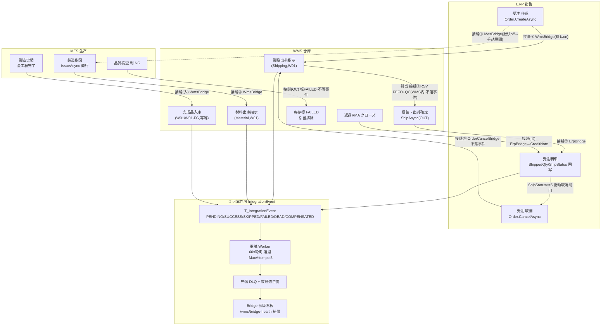

# ERP-MES-WMS 闭环集成（跨模块连携・Bridge）· 最详细用户操作培训手册（模块总册 A · BOOK-M07）

> **作用**：本册不是"又一套页面"，而是把已分散在 M04 销售 / M05 MES / M06 WMS 三册里的**跨模块联动接缝**收口成一条可演示、可验收、可排障的**端到端业务链**。它回答三个问题：①一张受注录进去，系统在三个模块之间到底自动做了哪些动作（八接缝 + FIN/SPACE 附加）；②这些自动动作失败了会怎样（同步 best-effort + 异步重試 + DLQ + 手动补偿）；③运维/运营在哪里看健康、怎么补偿（唯一独立页面 = **Bridge 健康看板 `/wms/bridge-health`**）。
> **基准**：分支 `feat/training-m07`（基于 `main` `9f56591`），盘点日 2026-06-29；**后端接缝/Hook/IntegrationEvent/重試 Worker/DLQ/补偿**逐行实测于 `CP6.Core/Services/Integration`、`CP6.WebApi/BackgroundServices`、`CP6.WebApi/Controllers/Integration` 与 `docs/codemap-{erp,mes,wms}/`（2026-06-22 权威快照）；**前端 Bridge 看板 UI 粒度**实读 `cp6.web/src/views/wms/BridgeHealthView.vue`。八接缝框架沿用 [M06 WMS 总册 §3](03-库存物流WMS-最详细用户操作培训手册.md)。查不到标 `待业务确认`；功能没写标 `待实现`；代码无该项标 `代码未发现`。
> **在闭环中的位置**：M07 横跨 ERP→MES→WMS（并旁触 FIN/SPACE），是 **UAT / E2E 验收的核心载体**。样例数据与 M04/M05/M06 §0 共用同一条业务链。

---

## 0. 本手册使用的培训样例数据

> 本册沿用 M04 销售 §0、M05 MES §0、M06 WMS §0 的**同一条业务链**，只补充"接缝/事件"两类追踪标识。带"系统采番"的编号由系统自动生成（**月级累计** `{前缀}{yyyyMM}{NNNN}`，跨月不归零）。

| 数据项 | 培训样例值 | 来源/说明 |
|---|---|---|
| 製品CD / 名称 | `PRD2026070001` / A社向け5号BC楞4色印刷箱 | 承接 M04/M05/M06 §0 |
| 得意先（客户） | `CUST-A` A社 | 受注/出荷/RMA 客户 |
| 仕入先（供应商） | `SUP01` | 材料采购入庫 |
| 倉庫CD | `W01`（主倉，接缝既定仓） | 材料出庫/完成品入庫/製品出荷均落 W01 |
| **ERP Web受注NO** | `WO20260701000001`（承接 M06 §0 同一业务链；实际采番键 `ORD`、13 桁，见 codemap-erp） | 接缝④/②/⑤/出 RMA 回写的**跨模块业务键** |
| **MES 製造指図NO** | `WO2026070001`（系统采番，前缀 `WO`） | 接缝①(展开)/③(材料出庫)/(入)(完成品入庫) 业务键 |
| WMS 出庫指示NO（製品） | `OUT2026070001`（系统采番，前缀 `OUT`） | 接缝④ 自动生成的 Shipping 出庫指示 |
| WMS 出庫指示NO（材料） | `OUT2026070002`（前缀 `OUT`） | 接缝③ 自动生成的 Material 出庫指示 |
| WMS 入庫実績NO | `RC2026070001`（系统采番，前缀 `RC`） | 接缝(入) 完成品入庫生成 |
| 梱包NO | `PKG2026070001`（系统采番，前缀 `PKG`） | 出荷確定生成（驱动接缝② 回写） |
| RMA NO / 信用单NO | `RMA2026070001` / `CN20260701-xxxx` | 接缝(出) RMA→CreditNote |
| **CorrelationId** | 形如 `8f3c…-…`（GUID） | IntegrationEvent 上的"业务链追踪键"（⚠️ 实测每 Hook 各自新建，未跨 Hook 串联，见 §10 C-M07-01） |
| **eventId** | IntegrationEvent.Id（GUID） | 死信补偿的目标键（看板「補償」按钮入参） |

**跨模块接缝触发"开关"与默认值**（`CP6.WebApi/Program.cs:406-461` 逐行实测；`?? x` 为代码缺省值，appsettings 未配则取此值）：

| 开关键 | 代码缺省 | appsettings.json | 实际默认 | 关时替换为 |
|---|---|---|---|---|
| `WmsBridge:Enabled` | `?? true` | `true` | **ON** | `NoOpWmsBridgeHook` |
| `ErpBridge:Enabled` | `?? true` | （未配） | **ON** | `NoOpErpBridgeHook` |
| `MesBridge:Enabled` | `?? false` | （未配） | **OFF（手动展开为既定）** | `NoOpMesBridgeHook` |
| `OrderCancelBridge:Enabled` | `?? true` | `true` | **ON** | `NoOpOrderCancelBridgeHook` |
| `IntegrationEvent:Enabled` | — | `true` | **ON** | 重試 Worker no-op（Failed 永不重試/不进 DLQ） |

> ⚠️ **最易误解的两点**：① **MesBridge 默认 OFF** —— 录受注**不会**自动生成製造指図，需在 MES 手动「受注展開」或显式开 `MesBridge:Enabled=true`；② **ErpBridge 默认 ON 但不在 appsettings** —— 出荷回写/RMA 回写默认生效，靠代码缺省 `?? true`。

---

## 1. 模块业务定位

**ERP-MES-WMS 闭环集成不是一个"画面模块"，而是一套贯穿三模块的"自动联动 + 可靠性保障"机制**：让销售、生产、仓库三套子系统在用户只操作各自页面的前提下，把数据自动接力到下一环，并对每一次接力做持久化审计、失败重試、死信告警与人工补偿。

- **解决什么业务问题**：录一张受注，要不要手工再去 MES 开工单、去 WMS 开出库单？工单发行后材料谁去配？完工的成品谁登记入库？出荷了订单的已出数谁回填？退货的钱怎么冲回应收？——闭环集成把这些**跨模块的"二次录入"全部自动化**，并保证"自动动作失败不拖垮用户当前操作、且失败有迹可循可补救"。
- **两层可靠性模型（本册地基，务必先懂）**：

| 层 | 机制 | 行为 | 代码锚点 |
|---|---|---|---|
| **L1 同步 best-effort Hook** | 父操作 `SaveChanges` 成功后，**内联**顺次调用接缝 Hook，Hook 内 `try/catch` 吞错**绝不让父操作回滚** | 成功落 `IntegrationEvent(SUCCESS)`；业务可跳过落 `SKIPPED`；异常落 `FAILED` | `BridgeHookBase.PersistEventAsync` |
| **L2 异步重試 Worker + DLQ** | 后台 `IntegrationEventRetryWorker` 每 60s 轮询 `FAILED` 且到期事件，按指数退避 `[60,120,240,480,960]s` 重試（反序列化 `PayloadJson` 重调 Hook），最多 `MaxAttempts=5` 次 | 重試成功→改态；耗尽→`DEAD`（死信）+ 双通道告警 | `IntegrationEventRetryWorker` / `DeadLetterNotifier` |
| **L3 人工补偿** | 运维在 Bridge 健康看板对死信点「補償」 | 仅把 `DEAD→COMPENSATED` **标记关闭**，⚠️**不自动重放 Hook** | `BridgeHealthService.CompensateAsync` |

- **唯一可视化入口** = **Bridge 健康看板 `/wms/bridge-health`**：24h 成功率 / 各 Hook 统计 / 待重試积压(QueueDepth) / 死信(DLQ)列表 / 手动补偿。这是本册唯一一张"独立页面"（其余接缝都嵌在 M04/M05/M06 既有页面的某个按钮里）。
- **在 CP6 整体中的位置**：

| 维度 | 内容 |
|---|---|
| 跨越模块 | ERP（受注/取消/回写终点）↔ MES（指図/実績）↔ WMS（出入庫/出荷/RMA），旁触 **FIN**（出荷/完工→财务）、**SPACE**（库位发布→WMS） |
| 触发主体 | **各模块的普通操作员**（录受注、发行指図、报完工、确定出荷、关 RMA）——他们不知道"接缝"也能跑通；接缝是后台自动的 |
| 监看主体 | **运维 / 运营 / IT**：只在 Bridge 健康看板看成功率、捞死信、做补偿 |
| 数据影响面 | 出庫/製造指図自动展开、材料/完成品自动出入庫、出荷数回写受注、退货冲应收、事件审计账（`T_IntegrationEvent`） |

---

## 2. 适用角色与职责

> 闭环集成**没有专属录入角色**——接缝由"谁触发那个业务动作"的人无感触发。本册角色聚焦"谁监看、谁补偿、谁是接缝触发者"。

| 角色 | 在闭环中的职责 | 主要触点 | 不负责 | 备注 |
|---|---|---|---|---|
| 营业担当 | 录受注 → 触发接缝④（製品出荷展开）+①（指図展开，若开 MesBridge） | 受注入力 `/order`、受注一覧取消 `/order-list` | 不管下游成败（看板由运维看） | 闭环起点 |
| 生産管理 | 発行指図→触发接缝③（材料出庫）；报完工→触发接缝(入)（完成品入庫） | 製造指図 `/mes/work-order`、製造実績 `/mes/production-result` | — | 闭环中段 |
| 品保 | QC 判 NG→触发接缝(QC)（库存标 FAILED 阻出货） | 品質検査 `/mes/quality-inspection` | — | 质量门 |
| 出荷担当/库管 | 引当（接缝①）→拣货→出荷確定（触发接缝② 回写 ERP） | 出庫指示/ピッキング/梱包出荷 | — | 闭环出口 |
| 品保/客服 | RMA クローズ→触发接缝(出)（生成 CreditNote 冲应收） | 返品RMA `/wms/rma` | — | 逆向闭环 |
| **运维 / IT 运营** | **监看 Bridge 健康、处置死信、人工补偿、排障 trace** | **Bridge 健康看板 `/wms/bridge-health`** | 不录业务单据 | **本册主操作者** |
| 系统管理员 | 配 Bridge 开关（MesBridge/ErpBridge…）、重試参数 | `appsettings.json` / 环境变量 | — | 部署期 |

> 角色与权限为数据驱动（PUB 四粒度）；Bridge 看板端点 `[Authorize]`，**按钮级权限（谁能点「補償」）未明确**（`待业务确认`，见 §10，回填 M02 PUB 结论）。

---

## 3. 模块完整业务流程（端到端闭环）

**起点**：营业录一张受注。**终点**：货出了、订单已出数回写、（如有退货）应收已冲、且所有自动接力都在 `T_IntegrationEvent` 留痕、失败的已重試/补偿。

### 3.1 全接缝目录（跨模块 · 权威）

> 沿用 [M06 §3 八接缝](03-库存物流WMS-最详细用户操作培训手册.md) 编号并补全 ERP→MES 指図展开与 FIN/SPACE 附加接缝。**"落事件"列 = 是否经 `BridgeHookBase` 持久化 `IntegrationEvent`**（决定它在 Bridge 健康看板上**看不看得见**）。

| 接缝 | 方向 | 触发页面/方法 | 落地动作 | Hook（落地实现） | 开关·默认 | 落事件? | 可发 Status |
|---|---|---|---|---|---|---|---|
| ① 引当 | WMS 内 | 出庫指示「引当」`AllocateAsync` | FEFO+QC 选候选→RSV | OutboundService（**非 Hook**） | — | **否** | — |
| ④ 製品出荷展开 | ERP→WMS | 受注 `CreateAsync` 后 | `CreateFromOrderAsync`→Shipping 出庫指示(W01,Draft) | `WmsBridgeHook.OnOrderCreatedAsync` | WmsBridge·**ON** | 是 | S/Sk/F |
| ① 指図展开 | ERP→MES | 受注 `CreateAsync` 后 | `ExpandFromOrderAsync`→製造指図(+工程+材料) | `MesBridgeHook.OnOrderCreatedAsync` | MesBridge·**OFF** | 是 | S/Sk/F |
| ③ 材料出庫 | MES→WMS | 指図 `IssueAsync` 后 | `CreateFromWorkOrderAsync`→Material 出庫指示(W01) | `WmsBridgeHook.OnWorkOrderIssuedAsync` | WmsBridge·**ON** | 是 | S/Sk/F |
| (入) 完成品入庫 | MES→WMS | 製造実績全工程完了后 | `CreateFinishedGoodsFromWorkOrderAsync`（幂等 `WM-MSG-043`，W01/W01-FG，累计良品） | `WmsBridgeHook.OnProductionCompletedAsync` | WmsBridge·**ON** | 是 | S/Sk/F |
| (QC) NG 阻出 | MES→WMS | 品質検査判 NG | `MarkLinkedStockByWorkOrder(FAILED)`→引当排除 | `IStockQcService`（**非 Hook**） | 可选注入 | **否** | — |
| ② 出荷回写 | WMS→ERP | 梱包出荷 `ShipAsync`（Shipping+WebOrderNo）后 | `OnShipmentConfirmedAsync` 按製品CD充当 `OrderDetail.ShippedQty/ShipStatus` | `ErpBridgeHook.OnShipmentConfirmedAsync` | ErpBridge·**ON** | 是 | S/Sk |
| ⑤ 取消级联 | ERP→WMS | 受注取消 `CancelAsync`（force=true） | 先取消 Outbound（UNRSV 解引当）再取消 WO，仅 `Status<Picking/着手前` 自动 | `OrderCancelBridgeHook.OnOrderCancelledAsync` | OrderCancelBridge·**ON** | **否** | — |
| (出) RMA 回写 | WMS→ERP | RMA `CloseAsync`（クローズ）后 | `OnReturnConfirmedAsync` 生成 `CreditNote(Refund)`+回填 `OrderDetail.ReturnedQty` | `ErpBridgeHook.OnReturnConfirmedAsync` | ErpBridge·**ON** | 是 | S/Sk |
| 〔附〕完工/出荷→财务 | MES/WMS→FIN | 完工/出荷/出荷取消 | 生成财务凭证/发票（M08 范畴） | `FinBridgeHook`（3 法） | FinBridge | 是 | S/Sk/F |
| 〔附〕库位发布→WMS | SPACE→WMS | Space 库位发布 | 库位主数据同步 | `SpaceBridgeHook.OnLocationPublishedAsync` | SpaceBridge | 是 | S/Sk/F |

### 3.2 ⚠️ 三处"看板盲区"（接缝有动作但不落 IntegrationEvent）

| 接缝 | 为何看不见 | 影响 | 怎么排查 |
|---|---|---|---|
| ① 引当（WMS 内） | 非跨模块 Hook，由 OutboundService 直接动库存 | 引当失败不进看板/DLQ；材料不足走"缺料看板"，出荷不足抛 `WM-MSG-040` 整批回滚 | M06 §5.9 出庫指示状态 + 材料欠品 `/wms/material-shortage` |
| (QC) NG 阻出 | `IStockQcService` 直接改 `Stock.QcStatus=FAILED`，不经 `BridgeHookBase` | QC→FAILED 联动不在看板留痕 | M06 §5.3 在庫照会 QC 列 + 引当候选排除 |
| ⑤ 取消反向级联 | `OrderCancelBridgeHook` **不调** `PersistEventAsync`（仅级联，绕过持久化层） | **受注取消的级联成败不在 Bridge 看板可见**；靠 `CancelAsync` 返回 `FullyCascaded/PartiallyCascaded` + 探查弹窗当场反馈 | M04 §5.8 受注一覧取消二段弹窗 / `OrderCancelDialog.vue` |

> 一句话：**Bridge 健康看板覆盖的是"落事件"的 6 类 Hook（Wms/Mes/Erp/Fin/Space）；引当、QC 阻出、取消级联三条不在其雷达内**，排障要回到对应业务页面。这是看板的边界，培训务必讲清。

---

## 4. 入口与触发点总览

> 闭环集成**只有 1 张独立菜单页**（Bridge 健康看板）；其余"接缝"都嵌在 M04/M05/M06 既有页面的某个按钮里。下表是"接缝在哪触发"的导航，方便排障时回溯到源动作页面。

**A. 独立页面（§5.1 详写 14 小节，核心含 5.1.1a~1e）**

| § | 页面 | 路由 | 优先级 | 一句话 | 读/写 |
|---|---|---|---|---|---|
| 5.1 | **Bridge 健康看板** ★ | /wms/bridge-health | **P0** | 24h 成功率/各 Hook 统计/待重試积压/死信列表/手动補償 | 读 + 補償(写态) |

**B. 接缝触发点（嵌在各模块页面，§5.2~§5.9 以 E2E 链路讲）**

| § | 链路段 | 触发页面（所属册） | 触发按钮/动作 | 接缝 | 落事件方向 |
|---|---|---|---|---|---|
| 5.2 | 受注→双展开 | 受注入力 `/order`（M04） | 「保存」 | ④ +①(off) | ERP→WMS / ERP→MES |
| 5.3 | 指図発行→材料出庫 | 製造指図 `/mes/work-order`（M05） | 「指図発行」 | ③ | MES→WMS |
| 5.4 | 完工→完成品入庫 | 製造実績 `/mes/production-result`（M05） | 全工程「完了」 | (入) | MES→WMS |
| 5.5 | QC NG→阻出货 | 品質検査 `/mes/quality-inspection`（M05） | 判定「NG」 | (QC) | 不落事件 |
| 5.6 | 引当→拣货→出荷→回写 | 出庫指示/ピッキング/梱包出荷（M06） | 「引当」/「出荷確定」 | ① +② | ②=WMS→ERP |
| 5.7 | 受注取消→反向级联 | 受注一覧 `/order-list`（M04） | 「取消」二段 | ⑤ | 不落事件 |
| 5.8 | RMA→CreditNote | 返品RMA `/wms/rma`（M06） | 「クローズ」 | (出) | WMS→ERP |
| 5.9 | 异常→重試/DLQ/補償 | Bridge 健康看板 `/wms/bridge-health` | 「補償」 | L2/L3 | — |

> **状态机速查（事件层）**：`PENDING`(默认初值,几乎不留存)→ Hook 当场落 `SUCCESS`/`SKIPPED`/`FAILED` → Worker 重試 `FAILED` →（耗尽）`DEAD` →（人工）`COMPENSATED`。看板的 **QueueDepth=全部 FAILED 计数（待重試积压，非 24h 窗口）**；Hooks 统计/成功率=**最近 24h 窗口**；DeadLetters=**最新 10 条** DEAD。

---

## 5. 详细操作说明（§5.1 独立页 14 小节；§5.2~§5.9 E2E 链路）

> **坑点统一提醒**：①接缝全 best-effort，父操作永不因接缝失败而回滚；②**只有 `FAILED` 事件进重試/DLQ**——`SKIPPED`（业务跳过）与回写类 Hook 的未捕获异常**不进** DLQ；③「補償」只标记不重放，真正补救要回源页面重做；④看板 i18n 完整（`wms.bridgeHealth.*`），与 WM-MSG/ME-MSG 裸码不同；⑤接缝①/QC/⑤ 三条不落事件（§3.2 盲区）。

### 5.1 Bridge 健康看板（BridgeHealth · /wms/bridge-health）★ 核心

**5.1.1 页面业务目的**：闭环集成的**唯一可视化运维台**。一屏看清：最近 24h 跨模块接缝**整体成功率**、**各 Hook**（来源→目标）的总数/成功率/跳过/失败/死信、当前**待重試积压**（QueueDepth）、**死信明细**（最新 10 条），并对死信做**人工補償**（标记关闭）。

**5.1.1a 业务前置检查清单（操作前必看）**
- [ ] 理解两层模型：看板看到的"失败/死信"是 L1 Hook 落的 `FAILED`/L2 耗尽的 `DEAD`，不是业务单据本身的错误。
- [ ] 理解口径差异：**成功率/各 Hook 统计 = 最近 24h 窗口**；**QueueDepth = 全期 `FAILED` 计数**（待重試积压，不限 24h）；**DeadLetters = 最新 10 条**。
- [ ] 理解盲区：引当①/QC 阻出/取消级联⑤**不在本看板**（§3.2）；FIN/SPACE 方向的 Hook **会**出现在本看板。
- [ ] 理解「補償」语义：仅把 `DEAD→COMPENSATED`，**不自动重放**——补偿前先想清这笔业务在源页面要不要手工重做。

**5.1.1b 关键字段业务填写口径**（本页只读 + 1 个补偿动作，无录入表单）
| 区域/字段 | 含义 | 口径 | 注意 |
|---|---|---|---|
| 时间窗（windowStart~End,UTC） | 当前快照统计窗口 | **固定最近 24h，只读不可改** | 显示为 UTC，与本地时区可能差 8~9h |
| KPI·成功率(overallSuccessRate) | 全 Hook `Σsuccess/Σtotal` | 计算自 24h 窗口；阈值 ≥98% 绿/≥90% 橙/<90% 红 | 跨所有 Hook 汇总，单 Hook 差会被稀释 |
| KPI·QueueDepth | 待重試积压 | =全部 `Status==FAILED` 计数 | >0 卡片橙边；积压不降说明 Worker 没跑或一直失败 |
| KPI·DeadLetterCount | 死信总数 | =全部 `Status==DEAD` 计数 | >0 卡片红边；需人工补偿 |
| 死信行·補償(eventId) | 选定要关闭的死信 | 点行「補償」按 eventId 提交 | 仅 DEAD 行有效；非 DEAD 返 404 |

**5.1.1c 灰按钮 / 不可操作说明**
| 按钮/字段 | 何时灰/只读 | 原因 |
|---|---|---|
| 「補償」按钮 | 该行 `compensatingId===eventId`（提交中） | 防重复补偿（loading 态）；**注意：本身无状态门控，非 DEAD 也可点，但后端按 `Status==DeadLetter` 过滤，不符返 404** |
| 时间窗/各 KPI/各表列 | 永久只读 | 看板是只读监看 + 单一補償动作 |
| 时间窗选择 / 状态筛选 / Hook 筛选 | **不存在**（`待实现`） | 当前无任何筛选器（见 §10 C-M07-09） |

**5.1.1d 完成后检查点与下游验证（★補償后必做★）**
- 補償：弹确认框 →「確定」→ 调 `POST /api/bridge-health/compensate/{eventId}` → 成功 toast → **自动 reload** → 该死信从 DeadLetters 列表消失、DeadLetterCount −1。
- **⚠️ 补偿≠业务已补救**：補償只把事件 `DEAD→COMPENSATED`，**未重放 Hook**。若该死信代表"出荷回写没成功/材料出庫没生成/完成品没入庫"，**必须回源页面手工重做**（如 M06 出庫指示自動展開、M05 重新発行、手工完成品入庫）。
- 端到端追溯：理论上同一业务链可用 `CorrelationId` 串联，但⚠️**实测每 Hook 各自 `Guid.NewGuid()`，CorrelationId 未跨 Hook 共享**（§10 C-M07-01）——目前只能靠 `SourceNo`（受注/指図/出庫号）人工串链。

**5.1.1e 详细操作场景（SOP）**
- **场景一·日常巡检**：开看板→看成功率卡（绿=健康）→QueueDepth/DeadLetterCount 卡是否>0→各 Hook 行 `failedCount/deadCount` 是否有红字→无异常即可（30s 自动刷新，无需手点）。
- **场景二·定位失败 Hook**：Hooks 表按 `deadLetterCount→failedCount` 降序排（后端已排），最上方即问题最重的 Hook→看其 `sourceModule→targetModule` 判断是哪条接缝（如 `MES→WMS` = 材料出庫/完成品入庫）。
- **场景三·处置死信**：DeadLetters 表看 `hookName`/`sourceNo`(业务号)/`lastError`(错因)/`attempts`(已試 5 次)→回源页面手工补做业务→回看板对该行「補償」关闭。
- **场景四·确认重試在跑**：刷新看 QueueDepth 是否随时间下降（Worker 每 60s 捞一批重試）；若长期不降→查 `IntegrationEvent:Enabled` 是否 true、Worker 是否启动。
- **场景五·死信告警联动**：死信产生时后台已双通道告警（SignalR `IntegrationDeadLetter`→WMS Hub + OperLog `StatusCode=500/IsAlert=true`）；运维可由告警跳本看板处置。

**5.1.2 流程位置**：闭环可靠性层的总出口；上游=所有"落事件"的 6 类 Hook，下游=人工补偿 + 源页面重做。

**5.1.3 谁使用**：运维 / 运营 / IT（监看 + 补偿）。**5.1.4 操作前准备**：见 5.1.1a。

**5.1.5 页面区域**（实读 `BridgeHealthView.vue`，306 行）：顶部工具条（标题 + 时间窗文本 + 右侧刷新圆钮）→ 3 张 KPI 卡（成功率/QueueDepth/DeadLetterCount，后两者>0 变橙/红边）→ 面板1 Hooks 表（7 列）→ 面板2 最新死信表（7 列，末列「補償」固定右）。

**5.1.6 字段填写说明**：见 5.1.1b（本页无录入表单）。

**Hooks 表 7 列**：`hookName`(220px,溢出 tooltip) / `sourceModule→targetModule`(info+default 双 tag) / `totalCount`(右对齐) / `successRate`(el-progress,≥98 绿/≥90 橙/<90 红) / `skippedCount` / `failedCount`(>0 红字 `.bad`) / `deadLetterCount`(>0 红字)。

**死信表 7 列**：`hookName`(200px) / `sourceNo`(140px,业务号) / `status`(**恒显 DEAD 红 tag**) / `attempts`(已試次数) / `lastError`(260px,错因) / `createDate`(格式化时分秒) / **`action`「補償」**(link primary,fixed right)。

**5.1.7 按钮操作**：

| 按钮 | 动作 | 启用条件 | 影响 |
|---|---|---|---|
| 刷新（圆钮） | `loadMetrics()`→`GET /bridge-health/metrics` | 常显（`:loading`） | 只读，重拉全指标 |
| 補償（死信行） | 确认框→`compensate(eventId)`→`POST /bridge-health/compensate/{eventId}`→reload | 提交中该行 loading | **DEAD→COMPENSATED 标记关闭**（不重放） |
| （自动刷新） | `setInterval(loadMetrics,30000)` | onMounted 起，onUnmounted 清 | 每 30s 静默刷新（**非 SignalR**） |

**5.1.8 业务规则与校验**：補償仅对 `Status==DeadLetter` 生效，否则 `CompensateAsync` 返 false→控制器 404「Dead letter event was not found.」。成功率=`Σsuccess/Σtotal`（total=0 时 0）。各计数来自 24h 窗口事件 `GroupBy(HookName,SourceModule,TargetModule)`；QueueDepth=`Count(Status==FAILED)`（全期）；DeadLetters=最新 10 条 DEAD。

**5.1.9 完成后检查**：见 5.1.1d。**5.1.10 状态流转**：事件 `PENDING→SUCCESS/SKIPPED/FAILED→(重試耗尽)DEAD→(補償)COMPENSATED`；本页只触发最后一跳。

**5.1.11 常见错误**：①把"成功率掉到 90%"当业务事故——实为某 Hook 接缝失败，需看是哪条；②以为「補償」会重新跑业务——不会，仅关闭死信；③拿 UTC 时间窗当本地时间误判"没有最近数据"；④以为取消级联/QC/引当失败也在这看——不在（§3.2）。

**5.1.12 注意事项**：**无时间窗/状态/Hook 任何筛选器**（`待实现`）；死信只显**最新 10 条**（更多需后端补分页）；補償按钮**无前端状态门控**（靠后端 404 兜底）；成功率阈值 98/90 硬编码。

**5.1.13 标准操作步骤**：见 5.1.1e 场景一/三。

**5.1.14 本页面测试点汇总**：成功率阈值着色(98/90)/QueueDepth=FAILED 全期计数/DeadLetterCount/Hooks 降序排(dead→failed)/死信 status 恒 DEAD/補償 DEAD→COMPENSATED+reload/補償非 DEAD 返 404/30s 自动刷新/无筛选器(`待实现`)/i18n 完整(`wms.bridgeHealth.*`)/UTC 时间窗。

---

### 5.2 链路段一：受注作成 → 双展开（接缝④ 製品出荷 + 接缝① 製造指図）

**触发**：营业在受注入力 `/order`（M04 §5.7）点「保存」→ `OrderService.CreateAsync`（采番 `ORD`→冻结汇率→建 5 表→`SaveChanges`）后，**best-effort 顺次调 2 个 Hook**（`OrderService.cs:228-231`）：

| 接缝 | Hook | 落地 | 默认 | 结果 |
|---|---|---|---|---|
| ④ 製品出荷展开 | `WmsBridgeHook.OnOrderCreatedAsync` | `OutboundService.CreateFromOrderAsync`→生成 **Shipping 出庫指示**(W01,Draft)，明细=受注明细 | WmsBridge **ON** | 落 `IntegrationEvent(ERP→WMS, SUCCESS)`；已有未取消单→`SKIPPED` |
| ① 製造指図展开 | `MesBridgeHook.OnOrderCreatedAsync` | `WorkOrderService.ExpandFromOrderAsync`→逐明细生成 **製造指図(Status=1)+工程+材料**（按 PA050 BOM/路由） | MesBridge **OFF** | 默认 `NoOpMesBridgeHook`→`Skipped("MesBridge:Enabled=false")`，**不展开** |

**关键事实**：
- **MesBridge 默认 OFF** → 录受注**不自动开工单**。要工单：在 MES 製造指図页手动「受注展開」（M05 §5.3，输 Web受注NO 放大镜），或运维开 `MesBridge:Enabled=true`。
- 接缝④ 生成的出庫指示是 **Draft**，需后续在 M06 出庫指示页「確定→引当」推进（§5.6）。
- 重复守卫：接缝④ 同 `WebOrderNo` 已有未取消 Outbound→`SKIPPED`；接缝① 同 `WebOrderNo+ProductCd` 已有未取消指図→`ME-MSG-005`→`SKIPPED`。
- **验证**：看板 Hooks 表出现 `OnOrderCreatedAsync`(ERP→WMS) 行；出庫指示一覧 `/wms/outbound-order-list` 可见新 Draft 单。

**5.2.1 测试点**：录受注→出庫指示自动生成(Draft)/MesBridge off 不开工单(`待业务确认`确认是否预期)/手动受注展開补工单/重复录同受注→SKIPPED/接缝失败→看板 FAILED+进重試。

---

### 5.3 链路段二：製造指図発行 → 材料出庫（接缝③）

**触发**：生産管理在製造指図 `/mes/work-order`（M05 §5.3 Step3）点「指図発行」→ `WorkOrderService.IssueAsync`（`Status 0/1→2 発行済`，幂等：`Status>=2` 直接 return）后调 `WmsBridgeHook.OnWorkOrderIssuedAsync`。

- **落地** `OutboundService.CreateFromWorkOrderAsync`：取指図材料明细→生成 **Material 出庫指示**(W01,Draft)，明细 `ProductCd=材料CD`、`RequiredQty=材料計画必要数量`。
- **去重**：同指図已有未取消 Material 出庫→`WM-MSG-043`→`SKIPPED`。
- **落事件**：`IntegrationEvent(MES→WMS, OnWorkOrderIssuedAsync)`，S/Sk/F。
- **验证**：看板 `MES→WMS` 行 +1；出庫指示一覧出现 Material 型新单。

**5.3.1 测试点**：発行→材料出庫指示自动生成/重复発行幂等(Status>=2 return,材料不重生 `WM-MSG-043`→SKIPPED)/无工程不可発行(`ME-MSG-006`)/接缝失败→看板 FAILED 进重試。

---

### 5.4 链路段三：製造実績全工程完了 → 完成品入庫（接缝入·幂等）

**触发**：在製造実績 `/mes/production-result`（M05 §5.5）逐工程报数，**最后一道工程「完了」判定 `justCompleted`** 后（Commit 之后）调 `WmsBridgeHook.OnProductionCompletedAsync(WorkOrderNo, wo.CompletedQty)`。

- **落地** `InboundService.CreateFinishedGoodsFromWorkOrderAsync`：入庫数=**累计良品** `wo.CompletedQty`，落**完成品仓**（W01/W01-FG），终调 `ConfirmReceiptAsync` 真增库存（经库存铁律 `ApplyAsync(IN)`）。
- **★幂等护栏**：同指図已有 `Production` 入庫→抛 `WM-MSG-043`→被 Hook `catch`→`SKIPPED`，**防完工二次触发重复入库**。
- **⚠️ 与手工屏的差异**：MES 自动通道落 **W01/W01-FG + 幂等**；M06 §5.7 完成品入庫**手工屏**默认落 **W03/W04 且无幂等护栏**（同 WO+lot 可重复入库）——两条通道**仓库默认值不一致**（§10 沿用 M06 C-M06-05）。
- **落事件**：`IntegrationEvent(MES→WMS, OnProductionCompletedAsync)`，S/Sk/F。

**5.4.1 测试点**：全工程完了→完成品自动入庫(W01/W01-FG,累计良品)/重复完了幂等(`WM-MSG-043`→SKIPPED)/良品数 0→不入庫/自动 vs 手工仓库默认不一致(`待业务确认`)/接缝失败→看板 FAILED 进重試。

---

### 5.5 链路段四：QC NG → 库存标 FAILED 阻出货（接缝QC·不落事件）

**触发**：品保在品質検査 `/mes/quality-inspection`（M05 §5.7）判 **NG** → `StockQcService.MarkLinkedStockByWorkOrder` 把该指図关联库存 `QcStatus=FAILED`。

- **效果**：出库引当 `FindCandidateStockAsync` 用 `QcStatus∉{FAILED,HOLD}` 过滤→**该批被引当排除，阻止出货**（接缝①引当处生效）。
- **⚠️ 看板盲区**：此接缝**不经 `BridgeHookBase`、不落 IntegrationEvent**→Bridge 健康看板看不到 QC→FAILED 联动（§3.2）。排障回 M06 §5.3 在庫照会 QC 列确认。
- **注意**：ProductionResult 的 NG 数**不自动**建品質/不良单（仅供 OEE/Dashboard 分析）；品質検査是独立录入入口，靠 `WorkOrderNo` 关联。

**5.5.1 测试点**：QC 判 NG→关联库存 FAILED→引当排除该批/解除 HOLD/PASSED 恢复可引当/此联动不在 Bridge 看板(`待业务确认`是否需可视化)。

---

### 5.6 链路段五：引当（接缝①）→ 拣货 → 梱包出荷 → ERP 回写（接缝②）

**触发链**（M06 §5.9→5.10→5.11）：出庫指示「確定→引当」→ ピッキング → 梱包・出荷「出荷確定」。

| 步 | 动作 | 接缝 | 落事件? | 关键 |
|---|---|---|---|---|
| 引当 | `AllocateAsync` FEFO+QC 过滤→RSV 锁库存（只动 Allocated） | ① | 否 | 材料不足→缺料看板(不抛)；出荷不足→`WM-MSG-040` 整批回滚 |
| 拣货 | ピッキング 行確定/短缺/完了 | — | — | **行级不落库**（仅本地态），真出库在出荷 |
| 出荷確定 | `ShipAsync`→`OUT` 同减 Physical+Allocated+采 PKG | — | — | Shipping 型 + 有 WebOrderNo 才触发回写 |
| **回写** | `ErpBridgeHook.OnShipmentConfirmedAsync` 按製品CD 把出荷数充当 `OrderDetail.ShippedQty`，置 `ShipStatus`(全=9/部分=5)，头 roll-up | **②** | **是(WMS→ERP)** | **幂等由 `ShippedQty` 累计担保**；best-effort |

- **闭环关键**：回写后的 `Order.ShipStatus>=5` **反过来驱动受注取消闸门**（`CancelAsync` 的 `PA-MSG-CANCEL-003`：有出荷实绩不可取消）——出荷与取消互锁成环。
- **⚠️ 回写类 Hook 落 S/Sk 两态**：实测 `OnShipmentConfirmedAsync` 主要落 SUCCESS/SKIPPED；若桥接体内未捕获异常，外层 `ShipAsync` 的 `try/catch` 吞错**不落 FAILED**→**不进 DLQ**（§10 C-M07-02，回写可靠性弱于 WMS 方向接缝）。
- **验证**：看板 `WMS→ERP` 行 +1；M04 受注/注文追溯 `/erp/order-trace` 见 `ShippedQty/ShipStatus/LastOutboundNo` 回填。

**5.6.1 测试点**：引当 FEFO+QC 排除 FAILED/拣货不落库/出荷 OUT 真减+采 PKG/回写 ShippedQty 充当(同製品多行未充足顺充)/ShipStatus 5·9/回写幂等(累计)/回写驱动取消闸门(闭环)/回写异常不进 DLQ(`待业务确认`)。

---

### 5.7 链路段六：受注取消 → 反向级联（接缝⑤·不落事件）

**触发**：营业在受注一覧 `/order-list`（M04 §5.8）点「取消」二段（探查 force=false → 决策弹窗 → 实施 force=true）→ `OrderService.CancelAsync` 调 `OrderCancelBridgeHook.OnOrderCancelledAsync`。

- **闸门**（取消前）：已取消→`-001`；出荷済→`-002`；`ShipStatus>=5`（有出荷实绩）→`-003` 拒绝。
- **级联顺序**（防库存二重解除）：① 受注紐付 Outbound（出荷指示）先取消（含 UNRSV 解引当）→ ② WO 取消 → ③ WO 紐付 Outbound（材料出庫）。
- **自动条件**：Outbound 仅 `Status<Picking(3)` 自动；WO 仅 `IsCancellable`（Draft0/Confirmed1/Issued2，着手≥3 不可）。不满足→探查返 `NeedsDecision`，弹窗列不可自动项让人工决策。
- **⚠️ 看板盲区**：`OrderCancelBridgeHook` **不调 PersistEventAsync、不落 IntegrationEvent**（§3.2）→**取消级联成败不在 Bridge 看板**；靠 `CancelAsync` 返回 `FullyCascaded/PartiallyCascaded` + 取消弹窗当场反馈（`OrderCancelDialog.vue` 三步状态机）。
- **开关**：OrderCancelBridge **ON**；关则 `NoOp`→探查 0 件、`CancelAsync` 不级联仍改受注状态。

**5.7.1 测试点**：取消闸门(-001/-002/-003)/探查 NeedsDecision 弹窗/实施 force 级联顺序/仅 Status<Picking & 着手前自动/PartiallyCascaded/级联不落事件看板看不到(`待业务确认`)/UNRSV 解引当只释放未出货量。

---

### 5.8 链路段七：RMA クローズ → ERP CreditNote（接缝出）

**触发**：品保/客服在返品RMA `/wms/rma`（M06 §5.16）对 `Judged(4)` 单点「クローズ」→ `RmaService.CloseAsync`（先落 `Closed(5)`）后 best-effort 调 `ErpBridgeHook.OnReturnConfirmedAsync`。

- **落地**：`ResolveWebOrderNoAsync`（按元出荷No 找受注）→逐退货明细生成一张 `CreditNote(Refund, 单号 CN{yyyyMMdd}-{GUID4})`+回填 `OrderDetail.ReturnedQty`→落事件。
- **不动库存**：クローズ只动 ERP（CreditNote+ReturnedQty）；库存变动在更早的 RMA **判定処分**（Resell/Repair 走 MOVE，Scrap/SupplierReturn 走 ADJ−，受領 IN→`{倉庫}-RMA-HOLD`）。
- **落事件**：`IntegrationEvent(WMS→ERP, OnReturnConfirmedAsync)`，S/Sk。`ErpBridge` off→`NoOp`→`SKIPPED`。
- **验证**：看板 `WMS→ERP` 行 +1；M04 信用单 `/erp/credit-note` 见新 CreditNote；受注明细 `ReturnedQty` 回填。

**5.8.1 测试点**：Judged 才可クローズ(`WM-MSG-043`)/每退货明细一张 CreditNote(Refund)/回填 ReturnedQty/クローズ不动库存/ErpBridge off→SKIPPED/解析不到 WebOrderNo→SKIPPED。

---

### 5.9 链路段八：异常 → 重試 → DLQ → 補償（可靠性层 L2/L3）

**当任一"落事件"Hook 落 `FAILED`**（业务异常之外的意外异常）后的处置全链：

| 阶段 | 机制 | 行为 | 锚点 |
|---|---|---|---|
| 落 FAILED | `PersistEventAsync` | `Status=FAILED`、`Attempts=1`、`NextRetryAt=UtcNow+60s`、记 `LastError` | `BridgeHookBase` |
| 自动重試 | `IntegrationEventRetryWorker`（60s 轮询） | 捞 `FAILED & NextRetryAt<=now & Attempts<5`，按 `PayloadJson` 反序列化重调 Hook（反射 Dispatcher）；失败则 `Attempts++`+下一档退避 `[60,120,240,480,960]s` | `IntegrationEventRetryWorker` |
| 进 DLQ | 重試耗尽（`Attempts>=5` 仍 FAILED） | `Status=DEAD`、`NextRetryAt=null`，**双通道告警**：SignalR `IntegrationDeadLetter`→WMS Hub + OperLog `StatusCode=500/IsAlert=true` | `DeadLetterNotifier` |
| 人工補償 | Bridge 看板「補償」 | `DEAD→COMPENSATED`（**仅标记，不重放 Hook**） | `BridgeHealthService.CompensateAsync` |

- **总重試窗口** ≈ 60+120+240+480+960 = **~30 分钟**（5 次）。
- **开关**：`IntegrationEvent:Enabled=false`→Worker no-op→**FAILED 永不重試、永不进 DLQ**（事件停在 FAILED）。
- **⚠️ 补偿真相**：補償**不重放**业务——它只把死信标记为已处理。真正补救须回源页面手工重做（出庫自動展開/重新発行/手工入庫/手工出荷回写等）。
- **⚠️ 哪些失败进不了这条流水**：①`SKIPPED`（业务跳过，非失败，不重試）；②回写类 Hook（Erp 方向）外层吞错不落 FAILED（§10 C-M07-02）；③不落事件的接缝（引当①/QC/取消⑤，§3.2）。

**5.9.1 测试点**：Hook 异常→FAILED+NextRetryAt+60s/Worker 60s 捞重試/退避 [60,120,240,480,960]/Attempts<5 边界/耗尽→DEAD+双通道告警/補償 DEAD→COMPENSATED 不重放/`IntegrationEvent:Enabled=false`→不重試/SKIPPED 不进重試。

---

## 6. 模块级业务场景（≥5，E2E 为主）

| 场景 | 链路 | 关键验证 |
|---|---|---|
| 场景一·正常全链闭环 | 受注→(接缝④出荷指示)→確定/引当→拣货→出荷確定→(接缝②回写 ShippedQty/ShipStatus) | 出庫指示自动生成；引当 RSV；出荷 OUT 真减+PKG；受注 `ShippedQty/ShipStatus(5/9)` 回填；看板 ERP→WMS、WMS→ERP 各 +1 SUCCESS |
| 场景二·MesBridge OFF 手动补工单 | 受注作成（接缝①SKIPPED 不展开）→ MES 手动「受注展開」生成指図→発行(接缝③材料出庫)→完了(接缝入完成品入庫) | 默认不自动开工单；手动展開补上；発行/完了各触发 WMS 出入庫并落事件 |
| 场景三·完成品入庫幂等 | 全工程完了→完成品入庫(W01/W01-FG)；再次触发完了 | 首次 SUCCESS 真增库存；重复→`WM-MSG-043`→SKIPPED 不重复入库；对比手工屏(W03/W04)无幂等 |
| 场景四·QC NG 阻出货 | QC 判 NG→库存 FAILED→出庫指示引当该品 | 该批被 `FindCandidateStock` 排除；此联动**不在 Bridge 看板**（盲区） |
| 场景五·出荷回写驱动取消闸门 | 出荷確定回写 `ShipStatus>=5`→去受注一覧取消 | 取消被 `PA-MSG-CANCEL-003` 拒绝（有出荷实绩）——回写与取消互锁成环 |
| 场景六·受注取消反向级联 | 受注取消二段→Outbound(UNRSV)→WO 取消（仅 Status<Picking/着手前） | FullyCascaded/PartiallyCascaded；级联**不落事件**，靠弹窗反馈 |
| 场景七·接缝失败→重試→DLQ→補償 | 模拟 WMS Hook 异常→FAILED→Worker 重試 5 次→DEAD→双通道告警→看板補償 | QueueDepth 升/降；DeadLetterCount +1；補償后 DEAD→COMPENSATED；**补偿不重放须源页重做** |
| 场景八·RMA 逆向闭环 | RMA 受領(IN→RMA-HOLD)→判定(MOVE/ADJ)→クローズ(接缝出→CreditNote+ReturnedQty) | クローズ生成 CreditNote(Refund)+回填 ReturnedQty+落事件；不动库存；ErpBridge off→SKIPPED |

---

## 7. 模块级测试矩阵

| 编号 | 链路/页面 | 功能点 | 类型 | 前置 | 步骤 | 预期 | 优 | 自动化 |
|---|---|---|---|---|---|---|---|---|
| M07-001 | 受注→WMS | 接缝④製品出荷展开 | 联动 | WmsBridge ON | 录受注保存 | 自动生成 Shipping 出庫指示(Draft)+落事件 ERP→WMS SUCCESS | P0 | E2E |
| M07-002 | 受注→MES | 接缝①默认 OFF | 联动 | MesBridge 默认 | 录受注保存 | **不自动开工单**；事件 SKIPPED(`MesBridge:Enabled=false`) | P0 | API |
| M07-003 | 受注→MES | 手动受注展開 | 联动 | — | MES 手动展開 | 生成指図(Status=1)+工程+材料 | P0 | E2E |
| M07-004 | 指図発行 | 接缝③材料出庫 | 联动 | 有指図材料 | 発行 | 生成 Material 出庫指示(W01)+落事件 MES→WMS | P0 | E2E |
| M07-005 | 指図発行 | 重复発行幂等 | 边界 | 已発行 | 再発行 | Status>=2 return；材料不重生(`WM-MSG-043`→SKIPPED) | P1 | API |
| M07-006 | 完工 | 接缝入完成品入庫 | 联动 | 全工程完了 | 完了报数 | W01/W01-FG 真增库存(累计良品)+落事件；幂等 `WM-MSG-043` | P0 | E2E |
| M07-007 | QC NG | 接缝QC 阻出货 | 联动 | 有库存 | 判 NG→引当 | 库存 FAILED→引当排除；**不在看板** | P0 | E2E |
| M07-008 | 出荷確定 | 接缝②出荷回写 | 联动 | Shipping+WebOrderNo | 出荷確定 | `OrderDetail.ShippedQty` 充当+`ShipStatus(5/9)`+落事件 WMS→ERP | P0 | E2E |
| M07-009 | 出荷↔取消 | 回写驱动取消闸门 | 联动 | 已出荷回写 | 取消受注 | `PA-MSG-CANCEL-003` 拒绝（闭环互锁） | P1 | API |
| M07-010 | 受注取消 | 接缝⑤反向级联 | 联动 | Status<Picking | 取消二段 force | Outbound UNRSV→WO 取消；FullyCascaded；**不落事件** | P0 | E2E |
| M07-011 | RMA | 接缝出 CreditNote | 联动 | Judged | クローズ | 每明细一张 CreditNote(Refund)+ReturnedQty+落事件；不动库存 | P1 | E2E |
| M07-012 | 可靠性 | Hook 失败→FAILED+重試 | 异常 | Hook 抛异常 | 触发接缝 | FAILED+NextRetryAt+60s；Worker 60s 重試；退避 [60..960] | P0 | 集成 |
| M07-013 | 可靠性 | 重試耗尽→DLQ | 异常 | 持续失败 | 等 5 次 | Attempts>=5→DEAD+SignalR+OperLog(500/IsAlert) | P1 | 集成 |
| M07-014 | 看板 | 補償 DEAD→COMPENSATED | 联动 | 有死信 | 点補償 | DEAD→COMPENSATED+reload；**不重放**；非 DEAD→404 | P0 | E2E |
| M07-015 | 看板 | 成功率/QueueDepth 口径 | UI | 有混合事件 | 看 KPI | 成功率=24h Σsuccess/Σtotal+阈值色；QueueDepth=全期 FAILED 计数 | P1 | 手动 |
| M07-016 | 看板 | 盲区不可见 | 边界 | 引当/QC/取消失败 | 看看板 | 三类**不在看板**（不落事件） | P1 | 手动 |
| M07-017 | 开关 | IntegrationEvent OFF | 边界 | Enabled=false | Hook 失败 | Worker no-op；FAILED 永不重試/不进 DLQ | P2 | 集成 |
| M07-018 | trace | CorrelationId 不串链 | 边界 | 全链 | 查同链事件 | 各 Hook CorrelationId 互不相同(`待业务确认`)；只能靠 SourceNo 串 | P2 | API |

> 优先级：P0 核心闭环必过 / P1 常用重点 / P2 边界异常分析。

### 7.1 可执行测试用例样例（≥10）

**TC-M07-001 正常全链闭环（端到端）**
- 链路：受注→出庫指示→引当→拣货→梱包出荷→ERP 回写　优先级：P0
- 前置：WmsBridge/ErpBridge ON；製品 `PRD2026070001`、客户 `CUST-A`、W01 有库存。
- 步骤：1) `/order` 录受注保存；2) `/wms/outbound-order` 確定→引当；3) `/wms/picking` 拣货；4) `/wms/packaging` 出荷確定。
- 预期：①保存即生成 Shipping 出庫指示(Draft)；②引当 RSV 只动 Allocated；③出荷 OUT 同减 Physical+Allocated+采 `PKG…`；④受注明细 `ShippedQty += 出荷数`、`ShipStatus=9/5`，`LastOutboundNo` 回填；⑤Bridge 看板 `ERP→WMS`、`WMS→ERP` 各 +1 SUCCESS。

**TC-M07-002 MesBridge OFF → 手动补工单**
- 链路：受注→（不展开）→手动受注展開　P0
- 步骤：录受注保存→看 MES 无新指図→`/mes/work-order` 输 Web受注NO「受注展開」。
- 预期：保存时接缝① `SKIPPED("MesBridge:Enabled=false")`；手动展開后生成指図(Status=1)+按 PA050 工程/材料。

**TC-M07-003 指図発行→材料出庫**
- 链路：`/mes/work-order` 発行　P0
- 前置：指図有材料明细。
- 步骤：Step3「指図発行」。
- 预期：Status 0/1→2；生成 Material 出庫指示(W01,Draft)，明细=指图材料；看板 `MES→WMS` +1。

**TC-M07-004 完成品入庫幂等**
- 链路：`/mes/production-result` 完了　P0
- 步骤：全工程完了报数；再次触发完了。
- 预期：首次完成品入庫 W01/W01-FG（累计良品）SUCCESS；重复→`WM-MSG-043`→SKIPPED 不重复入库。

**TC-M07-005 QC NG 阻出货（看板盲区）**
- 链路：`/mes/quality-inspection` NG → `/wms/outbound-order` 引当　P0
- 步骤：判 NG→对该品引当。
- 预期：库存 `QcStatus=FAILED`→引当排除该批；**Bridge 看板无此事件**（确认盲区）。

**TC-M07-006 出荷回写 + 驱动取消闸门**
- 链路：出荷確定→回写→取消　P0
- 步骤：出荷確定→去 `/order-list` 取消该受注。
- 预期：回写 `ShipStatus>=5`；取消被 `PA-MSG-CANCEL-003` 拒绝（闭环互锁）。

**TC-M07-007 受注取消反向级联**
- 链路：`/order-list` 取消二段　P0
- 前置：出庫指示 `Status<Picking`、WO 着手前。
- 步骤：取消探查(force=false)→决策→实施(force=true)。
- 预期：先取消 Outbound(UNRSV 解引当)再取消 WO；FullyCascaded；释放 `AllocatedQty-ShippedQty`（已出货不退）；**级联不落事件**，看板看不到（靠弹窗反馈）。

**TC-M07-008 接缝失败→重試→DLQ→補償**
- 链路：可靠性层 L1→L2→L3　P0
- 步骤：模拟某 WMS Hook 抛异常→观察事件→等重試耗尽→看板補償。
- 预期：FAILED+`NextRetryAt=+60s`；Worker 每 60s 重試，退避 `[60,120,240,480,960]`；`Attempts>=5`→DEAD+双通道告警；看板 DeadLetters 出现该行→「補償」→DEAD→COMPENSATED+reload；**补偿未重放，须回源页重做**。

**TC-M07-009 補償非死信返 404**
- 链路：看板補償　P1
- 步骤：对一个非 DEAD 事件的 eventId 调补偿端点。
- 预期：`CompensateAsync` 返 false→404「Dead letter event was not found.」。

**TC-M07-010 看板 KPI 口径**
- 链路：`/wms/bridge-health`　P1
- 前置：制造 24h 内若干 SUCCESS/SKIPPED/FAILED + 若干全期 FAILED + 若干 DEAD。
- 预期：成功率=24h `Σsuccess/Σtotal`，≥98 绿/≥90 橙/<90 红；QueueDepth=**全期** `FAILED` 计数；DeadLetterCount=DEAD 计数；Hooks 表按 `dead→failed` 降序；DeadLetters 仅最新 10 条。

**TC-M07-011 RMA 逆向闭环**
- 链路：`/wms/rma` クローズ　P1
- 前置：RMA Judged，元出荷No 可解析 WebOrderNo。
- 步骤：クローズ。
- 预期：每退货明细一张 `CreditNote(Refund)`+`OrderDetail.ReturnedQty +=`；不动库存；看板 `WMS→ERP` +1；ErpBridge off→SKIPPED。

**TC-M07-012 IntegrationEvent 关闭→不重試**
- 链路：可靠性层开关　P2
- 前置：`IntegrationEvent:Enabled=false`。
- 步骤：触发一个会 FAILED 的 Hook。
- 预期：事件停在 FAILED；Worker no-op；永不重試、永不进 DLQ。

---

## 8. 模块验收标准

| 编号 | 验收项 | 标准 | 方式 | 关联 |
|---|---|---|---|---|
| AC-M07-01 | 受注双展开 | 受注作成触发接缝④(出庫指示)；接缝①受 MesBridge 开关控制（默认 OFF） | E2E | 5.2 |
| AC-M07-02 | 指図发行→材料出庫 | `IssueAsync` 触发 Material 出庫指示(W01)+落事件 MES→WMS | E2E | 5.3 |
| AC-M07-03 | 完成品入庫幂等 | 自动通道 W01/W01-FG+`WM-MSG-043` 幂等；手工屏 W03/W04 无护栏须标注 | E2E | 5.4 |
| AC-M07-04 | QC NG 阻出货 | 库存 FAILED→引当排除；不落事件（看板盲区） | E2E | 5.5 |
| AC-M07-05 | 出荷回写 | 接缝② `OrderDetail.ShippedQty/ShipStatus` 充当+幂等累计 | E2E | 5.6 |
| AC-M07-06 | 回写↔取消互锁 | `ShipStatus>=5` 驱动 `PA-MSG-CANCEL-003` 取消闸门 | E2E | 5.6/5.7 |
| AC-M07-07 | 取消反向级联 | 接缝⑤ Outbound(UNRSV)→WO，仅 Status<Picking/着手前；不落事件 | E2E | 5.7 |
| AC-M07-08 | RMA 回写 | クローズ生成 CreditNote+ReturnedQty，不动库存，落事件 | E2E | 5.8 |
| AC-M07-09 | 事件三态持久化 | Hook 落 SUCCESS/SKIPPED/FAILED 至 `T_IntegrationEvent` | 代码核对+API | 5.9 |
| AC-M07-10 | 自动重試 | Worker 60s 轮询 FAILED，退避 `[60,120,240,480,960]`，MaxAttempts 5 | 集成 | 5.9 |
| AC-M07-11 | DLQ + 告警 | 耗尽→DEAD+SignalR `IntegrationDeadLetter`+OperLog(500/IsAlert) | 集成 | 5.9 |
| AC-M07-12 | 手动补偿 | 看板 DEAD→COMPENSATED（仅标记不重放），非 DEAD→404 | E2E | 5.1/5.9 |
| AC-M07-13 | 看板口径 | 成功率/各 Hook=24h 窗口；QueueDepth=全期 FAILED；DeadLetters 最新 10 | 手动 | 5.1 |
| AC-M07-14 | 盲区诚实 | 引当①/QC/取消⑤ 不落事件，看板不可见；回源页面排查 | 代码核对 | 3.2 |

---

## 9. 术语说明

| 术语 | 解释 | 关联 |
|---|---|---|
| 接缝（Bridge Hook） | 跨模块联动点；父操作 SaveChanges 后 best-effort 调用，try/catch 吞错不回滚父操作 | §3.1 |
| L1/L2/L3 | L1 同步 best-effort Hook / L2 异步重試 Worker+DLQ / L3 人工補償 | §1 |
| IntegrationEvent | `T_IntegrationEvent` 事件审计账；字段 SourceModule/TargetModule/HookName/SourceNo/TargetNo/Status/Attempts/LastError/NextRetryAt/CorrelationId/PayloadJson | §5.1 |
| 事件六态 | PENDING(初值)/SUCCESS/SKIPPED/FAILED/DEAD/COMPENSATED（字符串常量） | §4 |
| best-effort | 接缝失败只落事件+LogWarning，绝不让受注/発行/出荷等父操作回滚 | §1 |
| 重試 Worker | `IntegrationEventRetryWorker` 每 60s 捞 FAILED 重試，退避 [60,120,240,480,960]，MaxAttempts 5，反射 Dispatcher 重调 Hook | §5.9 |
| DLQ / 死信 | 重試耗尽→Status=DEAD；双通道告警 SignalR `IntegrationDeadLetter`+OperLog(500/IsAlert) | §5.9 |
| 補償（Compensate） | 看板把 DEAD→COMPENSATED **仅标记关闭，不重放 Hook**；真正补救须源页面重做 | §5.1/5.9 |
| QueueDepth | 待重試积压=**全期** `Status==FAILED` 计数（非 24h 窗口） | §5.1 |
| 成功率 | 24h 窗口 `Σsuccess/Σtotal`；阈值 ≥98% 绿/≥90% 橙/<90% 红 | §5.1 |
| CorrelationId | 设计为业务链 trace 键；⚠️ 实测每 Hook 各自 `Guid.NewGuid()`，未跨 Hook 串联 | §10 |
| 看板盲区 | 引当①/QC 阻出/取消级联⑤ 不落事件→Bridge 看板不可见 | §3.2 |
| Bridge 开关 | WmsBridge(on)/ErpBridge(on)/MesBridge(off)/OrderCancelBridge(on)/IntegrationEvent(on) | §0 |

---

## 10. 待业务确认项

| 编号 | 发现 | 需确认 | 建议 |
|---|---|---|---|
| C-M07-01 | `CorrelationId` 字段设计为端到端 trace 键，但每个 Hook 方法各自 `Guid.NewGuid()`，**未跨 Hook 共享** | 是否需真正串联同一业务链（受注→指図→出庫→回写共用一 corrId） | 在受注作成处生成 corrId 并透传各 Hook |
| C-M07-02 | 回写类 Hook（ErpBridge `OnShipmentConfirmed/OnReturnConfirmed`）主要落 SUCCESS/SKIPPED；桥接体内未捕获异常被外层 `try/catch` 吞错**不落 FAILED→不进 DLQ** | WMS→ERP 回写失败是否需进重試/DLQ | 回写 Hook 内补 catch→落 FAILED |
| C-M07-03 | 接缝① 引当 / (QC) NG 阻出 / ⑤ 取消反向级联**不落 IntegrationEvent**，Bridge 看板看不到其成败 | 这三条联动是否需可视化/可补偿 | 评估是否纳入事件持久化 |
| C-M07-04 | `MesBridge` 默认 OFF（受注不自动开工单） | 是否预期手动展開为常态 | 业务确认；如需自动则开 `MesBridge:Enabled=true` |
| C-M07-05 | 完成品入庫自动通道(W01/W01-FG+幂等) 与手工屏(W03/W04+无幂等) 仓库默认值/护栏不一致（沿用 M06 C-M06-05） | 统一默认仓 + 手工屏防重 | 开发确认 |
| C-M07-06 | 「補償」仅标记 DEAD→COMPENSATED，**不重放**业务 Hook | 是否需"一键重放"按钮 | 补一个 replay 端点（复用 Dispatcher） |
| C-M07-07 | Bridge 看板按钮级权限未明确（谁能補償） | 各角色可见/可补偿范围 | 读 PUB 权限配置（回填 M02） |
| C-M07-08 | `OrderCancelBridge` off 时 `CancelAsync` 探查 0 件仍改受注状态（级联静默跳过） | off 时取消是否安全 | 业务确认开关语义 |
| C-M07-09 | Bridge 看板无时间窗/状态/Hook 任何筛选器；死信仅最新 10 条 | 是否需筛选 + 分页 | 开发补 |
| C-M07-10 | DeadLetter 告警走 SignalR(WMS Hub)+OperLog，但无邮件/IM 外发 | 是否需外部告警渠道 | 集成评估 |
| C-M07-11 | FIN/SPACE 方向 Hook 也上 Bridge 看板（八接缝之外） | 看板是否应区分模块域 | 产品确认 |

---

## 11. 代码与文档来源

| 类型 | 路径 | 用途 |
|---|---|---|
| 事件实体 | `CP6.Entity/DomainModels/Integration/IntegrationEvent.cs`（`T_IntegrationEvent`，字段+`IntegrationEventStatus` 六态常量） | 事件审计账模型 |
| Hook 基类 | `CP6.Core/Services/Integration/BridgeHookBase.cs`（`PersistEventAsync`：Attempts=1/NextRetryAt+60s/SafeSerialize payload/吞自身失败） | 接缝持久化地基 |
| 接缝 Hook | `CP6.Core/Services/Integration/MesBridgeHook.cs`、`Services/Wms/WmsBridgeHook.cs`、`Services/Wms/ErpBridgeHook.cs`、`Services/Integration/OrderCancelBridgeHook.cs`（不落事件）、`FinBridgeHook.cs`、`SpaceBridgeHook.cs` | 6 类 Hook 落地 |
| 接缝接口/NoOp | `Services/Integration/I{Mes,Wms,Erp,OrderCancel,Fin}BridgeHook.cs` | 开关替换的 NoOp 实现 |
| 重試 Worker | `CP6.WebApi/BackgroundServices/IntegrationEventRetryWorker.cs`（60s 轮询/退避/MaxAttempts/反射 Dispatcher） | L2 自动重試 |
| Dispatcher | `CP6.Core/Services/Integration/IntegrationEventDispatcher.cs`（反射路由表，仅 Worker 内部用，无 HTTP） | 重試重调 Hook |
| 死信告警 | `CP6.Core/Services/Integration/DeadLetterNotifier.cs`（SignalR `IntegrationDeadLetter`+OperLog 500/IsAlert） | DLQ 双通道告警 |
| 看板后端 | `CP6.WebApi/Controllers/Integration/BridgeHealthController.cs`（metrics/compensate）、`CP6.Core/Services/Integration/BridgeHealthService.cs`（GetMetrics/Compensate） | L3 看板 + 补偿 |
| 看板前端 | `cp6.web/src/views/wms/BridgeHealthView.vue`、`api/wms/bridgeHealth.ts`、`types/wms/wms.ts`（BridgeHealthMetrics/BridgeHookStats/DeadLetterItem） | 看板 UI/API/类型 |
| 触发点 | `Services/Erp/OrderService.cs`(CreateAsync:228-231/CancelAsync)、`Services/Mes/WorkOrderService.cs`(IssueAsync:323/ExpandFromOrderAsync)、`Services/Mes/ProductionResultService.cs`(完了:94-96)、`Services/Wms/OutboundService.cs`(ShipAsync:524-529/CreateFromOrder/CreateFromWorkOrder)、`Services/Wms/RmaService.cs`(CloseAsync:237-260)、`Services/Wms/InboundService.cs`(CreateFinishedGoods:423-463) | 各接缝触发源 |
| 配置 | `CP6.WebApi/Program.cs:406-461`（4 Bridge 开关）、`appsettings.json:37-54`（WmsBridge/OrderCancelBridge/IntegrationEvent） | 开关与重試参数 |
| 逐行源码手册 | `docs/codemap-erp/05-受注-order.md`（接缝④⑤②回写）、`docs/codemap-mes/`（README §0.1 四接缝+01 製造指図+02 製造実績）、`docs/codemap-wms/06-業界連携-报表.md`（RMA 接缝） | 接缝对端权威 |
| 上游总册 | `docs/manuals/user-training/03-库存物流WMS-...md` §3 八接缝、`01-销售管理MSBB-...md`、`02-生産管理MES-...md` | 接缝触发页面操作 |

---

## 12. 待补清单

> 本册以 E2E 业务链 + Bridge 机制 + 异常补偿为主轴，覆盖：1 张独立页(§5.1 14 小节)+8 段链路(§5.2~5.9)+模块场景(8)+测试矩阵(18)+可执行用例(12)+验收(14)+术语+待确认(11)+培训脚本。以下为后续：

| 项 | 内容 | 备注 |
|---|---|---|
| 单页 SOP（B） | `integration-pages/10-01-Bridge健康看板-单页面操作SOP.md`（16 节/≥5 场景/≥25 用例） | W4 续做（仿 M05/M06 节奏） |
| 测试汇编（C） | TEST-M07（从本册 §7.1 + SOP §13 反推；**E2E 用例重点**：受注→工单→材料出庫→完工入庫→出荷→回写→取消级联→RMA 信用单） | W10 |
| 接缝对端细节 | 各接缝触发页面的录入/按钮细节见 M04/M05/M06 对应 SOP（本册只讲接缝段，不重复页面 14 小节） | — |

---

## 13. 培训讲解脚本（建议 70~90 分钟，需先讲完 M04/M05/M06）

| 阶段 | 时长 | 讲什么 | 演示页面 | 注意点 |
|---|---|---|---|---|
| 0 闭环全景 | 8min | 三模块如何用接缝接力 + 两层可靠性模型 | §1+§3 流程图 | 强调"用户无感、后台自动" |
| 1 全接缝目录 | 10min | 八接缝(+FIN/SPACE)方向/触发/开关/落事件 | §3.1 表 | **MesBridge off / ErpBridge on(不在 appsettings)** |
| 2 看板盲区 | 6min | 引当①/QC/取消⑤ 不落事件→看板看不见 | §3.2 | 排障要回源页面 |
| 3 正向全链 | 14min | 受注→出庫指示→引当→拣货→出荷→回写 | §5.2/5.6 场景一 | 回写充当 ShippedQty/ShipStatus；回写驱动取消闸门 |
| 4 MES 接缝 | 10min | 指図発行→材料出庫；完了→完成品入庫(幂等) | §5.3/5.4 | MesBridge off 须手动展開；自动 vs 手工仓库默认 |
| 5 逆向闭环 | 8min | 受注取消反向级联 + RMA→CreditNote | §5.7/5.8 | 级联顺序防二重解除；级联不落事件 |
| 6 可靠性层 | 14min | 事件三态→重試 Worker→DLQ→補償 | §5.9+§5.1 看板 | **補償只标记不重放**；退避 30 分钟窗口 |
| 7 看板实操 | 10min | 巡检/定位失败 Hook/处置死信/确认重試 | §5.1 场景一~五 | KPI 口径差异；UTC 时间窗 |
| 8 测试与验收 | 8min | §7 矩阵/§7.1 用例/§8 验收 | §7/§8 | E2E 用例是 UAT 主线 |
| 9 答疑 | 余下 | 收集 §10 待确认反馈 | §10 | 现场登记(11 项) |

---

## 最后更新来源

- 代码：见 §11（`Integration` 后端逐行实测[IntegrationEvent/BridgeHookBase/各 Hook/RetryWorker/DeadLetterNotifier/BridgeHealthService] + `Program.cs` 开关 + `appsettings.json` 重試参数 + `BridgeHealthView.vue` 前端实读 + codemap-erp/mes/wms 接缝权威）。
- 文档：`docs/codemap-{erp,mes,wms}/`、`docs/CODEMAP.md`、`docs/manuals/user-training/{01,02,03}-…`（M04/M05/M06 三册接缝触发页面）。
- 基准：分支 `feat/training-m07`（基于 `main` `9f56591`），盘点日 2026-06-29（codemap 实测快照 2026-06-22；后端 Integration/前端看板 2026-06-29 本会话实读）。
- 覆盖：1 张独立页(§5.1 14 小节[核心含 5.1.1a~1e]) + 8 段 E2E 链路(§5.2~5.9) + 全接缝目录(§3.1)+看板盲区(§3.2) + 模块场景(8)/测试矩阵(18)/可执行用例(12)/验收(14)/术语/待确认(11)/来源/待补/培训脚本(10 阶段)。
</content>
</invoke>
