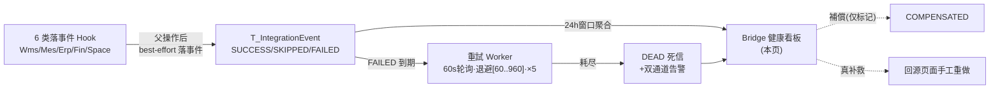
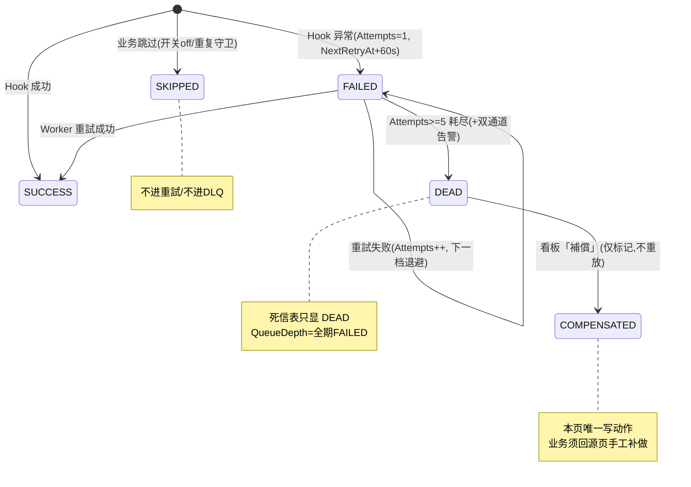

# Bridge 健康看板（跨模块接缝健康・補償）单页面操作 SOP（手把手版）

> **用途**：给**运维/IT 运营监看跨模块接缝健康、处置死信、培训老师讲、测试人员拆用例**。比模块总册（`10-ERP-MES-WMS闭环集成` §5.1）更细。
> **页面**：Bridge 健康看板（M07 · ERP-MES-WMS 闭环集成）　**路由**：`/wms/bridge-health`　**前端**：`views/wms/BridgeHealthView.vue`　**API**：`api/wms/bridgeHealth.ts`（2 端点 metrics / compensate）　**类型**：`types/wms/wms.ts`（BridgeHealthMetrics / BridgeHookStats / DeadLetterItem）　**后端**：`Integration/BridgeHealthController` → `BridgeHealthService`（**全 EF Core**）
> **基准**：分支 `feat/training-m07`（基于 `main` `9f56591`），盘点日 2026-06-29；后端实测 `CP6.Core/Services/Integration/BridgeHealthService.cs`、`CP6.WebApi/Controllers/Integration/BridgeHealthController.cs`、`BackgroundServices/IntegrationEventRetryWorker.cs`、`DeadLetterNotifier.cs`，UI 经实读 `BridgeHealthView.vue`（306 行）。
> **样例数据**：受注 `WO20260701000001`、製造指図 `WO2026070001`、製品 `PRD2026070001`、倉庫 `W01`。

---

## 1. 页面一句话说明

**Bridge 健康看板，就是跨模块联动（接缝/Bridge）的"运维驾驶舱"——一屏看最近 24h 接缝整体成功率＋各 Hook（来源→目标）的总数/成功率/跳过/失败/死信＋当前待重試积压（QueueDepth）＋死信明细（最新 10 条），并对死信做唯一的写动作「補償」。** 它**几乎纯只读**：除了死信行的「補償」按钮，全页没有新增/编辑/删除/录入；所有数字都是后端从 `T_IntegrationEvent` 事件账聚合查出来的。

> **★ 关键认知三连**：①看板看到的"失败/死信"是**接缝（后台自动联动）**的失败，不是业务单据本身的错；②**「補償」只把死信标记为已处理（DEAD→COMPENSATED），不会重新跑业务**——真要补救得回源页面手工重做；③**三条接缝（引当①/QC NG/取消级联⑤）不在本看板**（它们不落事件，见 §10）。

---

## 2. 这个页面在业务流程中的位置

- **上游**：所有"落事件"的接缝 Hook（受注双展开④①/材料出庫③/完成品入庫(入)/出荷回写②/RMA(出)，+FIN/SPACE）→ 落 `IntegrationEvent`；失败的经重試 Worker，耗尽变死信。
- **本页**：聚合展示（24h 窗口）+ 死信处置（補償）。
- **下游**：補償标记关闭 → 真补救须回各源页面（出庫指示自動展開/重新発行/手工入庫/手工出荷等）。

---

## 3. 谁使用这个页面

| 角色 | 用途 |
|---|---|
| 运维 / IT 运营 | 监看接缝健康、捞死信、人工補償、排障 trace（**本页主操作者**） |
| 仓库主管/运营 | 关注出入庫/出荷接缝是否健康 |
| 系统管理员 | 结合 Bridge 开关/重試参数判断配置是否生效 |
| 测试/培训 | 验证三态持久化、重試/DLQ、補償语义、KPI 口径 |

> 各模块**普通操作员不直接用本页**——他们在自己页面触发接缝，无感；本页是给"看后台成败的人"。

---

## 4. 操作前准备

- [ ] 理解两层模型：L1 同步 best-effort Hook 落 SUCCESS/SKIPPED/FAILED → L2 重試 Worker（60s 轮询，退避 `[60,120,240,480,960]s`，最多 5 次）→ 耗尽 DEAD → L3 人工補償。
- [ ] 理解口径差异：**成功率/各 Hook 统计 = 最近 24h 窗口**；**QueueDepth = 全期 `FAILED` 计数**（待重試积压，不限 24h）；**DeadLetters = 最新 10 条**。
- [ ] 理解盲区：引当①/QC 阻出/取消级联⑤ **不落事件→本看板看不见**（见 §10）；FIN/SPACE 方向 Hook **会**出现。
- [ ] 理解「補償」语义：仅 `DEAD→COMPENSATED`，**不自动重放**——補償前先想清这笔业务在源页面要不要手工重做。
- [ ] 想测死信：需让某 Hook 持续失败 ≥5 次（约 30 分钟重試窗口）才会变 DEAD；或直接构造 DEAD 事件测補償。

---

## 5. 页面区域说明

| 区域 | 内容 |
|---|---|
| 顶部工具条 | 左：页面标题 + **时间窗文本**（`formatRange(windowStartUtc, windowEndUtc)`，**UTC、只读**）；右：刷新圆钮（icon `Refresh`，`:loading`） |
| KPI 卡区（3 张，`el-row :gutter=12`） | ① 成功率（`overallSuccessRate`，进度色 ≥98 绿/≥90 橙/<90 红）；② QueueDepth（`metrics.queueDepth`，>0 卡橙边 `.warn`）；③ DeadLetterCount（`metrics.deadLetterCount`，>0 卡红边 `.danger`） |
| 面板 1 · Hooks 表 | 标题 + 计数徽标（`hooks.length`）；7 列：`hookName`(220,溢出tooltip) / `源→目标`(info+default 双tag) / `totalCount`(右) / `successRate`(el-progress) / `skippedCount` / `failedCount`(>0红`.bad`) / `deadLetterCount`(>0红)；`border/stripe/size=small`，`v-loading` |
| 面板 2 · 最新死信表 | 标题 + 计数徽标（danger，`deadLetters.length`）；7 列：`hookName`(200) / `sourceNo`(140,业务号) / `status`(**恒 DEAD 红tag**) / `attempts`(已試次数) / `lastError`(260,错因) / `createDate`(格式化) / **`action`「補償」**(link primary,**fixed right**)；空态 `empty-text=" "`(空白) |

> **数据来源**：全屏一个端点 `GET /api/bridge-health/metrics` 返回 `BridgeHealthMetrics{windowStartUtc, windowEndUtc, hooks[], queueDepth, deadLetterCount, deadLetters[]}`。補償走 `POST /api/bridge-health/compensate/{eventId}`。

---

## 6. 字段填写说明（口语版）

**本页没有任何输入框、没有表单、不需要填任何字段**——纯监看 + 一个補償动作。下面解释"看到的数字/颜色/标签是什么意思"。

**KPI 3 项**：

| KPI | 含义 | 怎么算（后端 EF Core） | 着色规则 |
|---|---|---|---|
| 成功率（overallSuccessRate） | 最近 24h 全 Hook 整体成功比例 | 前端 `ΣsuccessCount / ΣtotalCount`（total=0 时 0）；后端各 Hook `successRate=Math.Round(success/total,4)` | el-progress：≥0.98 绿(success)/≥0.90 橙(warning)/<0.90 红(exception) |
| QueueDepth（待重試积压） | 还在排队等重試的失败事件数 | 后端 `Count(Status==FAILED)`，**全期非 24h** | 卡片 >0 橙边（`.warn`） |
| DeadLetterCount（死信总数） | 重試耗尽、需人工处置的事件数 | 后端 `Count(Status==DEAD)` | 卡片 >0 红边（`.danger`） |

**Hooks 表列**：

| 列 | 含义 | 备注 |
|---|---|---|
| hookName | Hook 方法名（如 `OnWorkOrderIssuedAsync`） | 溢出 tooltip |
| 源→目标 | `sourceModule → targetModule`（ERP/MES/WMS/FIN/SPACE） | 判断是哪条接缝：`MES→WMS`=材料出庫/完成品入庫，`WMS→ERP`=出荷/RMA 回写 |
| totalCount | 24h 该 Hook 触发总数 | 右对齐 |
| successRate | 该 Hook 成功率进度条 | ≥98 绿/≥90 橙/<90 红 |
| skippedCount | 业务跳过数（如开关 off、重复守卫） | SKIPPED 不算失败、不重試 |
| failedCount | 失败数 | >0 红字加粗（`.bad`） |
| deadLetterCount | 死信数 | >0 红字 |

**死信表列**：`hookName`/`sourceNo`(源业务号=受注/指図/出庫号)/`status`(**恒 DEAD**)/`attempts`(已試次数,通常=5)/`lastError`(最后异常 ToString)/`createDate`/「補償」。

> **状态恒 DEAD 的原因**：死信表只装 `Status==DEAD` 的最新 10 条（后端 `BridgeHealthService` 限定），所以 status 列永远红 tag「DEAD」。i18n 键 `wms.bridgeHealth.status.DEAD`（SUCCESS/FAILED/SKIPPED/COMPENSATED 键存在但本表不渲染）。

---

## 7. 按钮操作说明

> 全页**只有 3 个交互**：刷新（查询）、30s 自动刷新（被动）、補償（**唯一写动作**）。

| 操作 | 何时出现 | 点了会怎样 |
|---|---|---|
| 刷新（圆钮） | 工具条常显 | 调 `GET /bridge-health/metrics` 重拉全部指标（KPI+两表）；`:loading` 期间转圈 |
| 自动刷新 | onMounted 起 | `setInterval(loadMetrics, 30000)` **每 30s 静默刷新**（**非 SignalR**）；onUnmounted 清 timer |
| **補償（死信行）** | 死信表每行末列 | 弹确认框（`wms.bridgeHealth.compensateConfirm`）→「確定」→ `POST /bridge-health/compensate/{eventId}` → 成功 toast → **自动 reload**；该行 `compensatingId===eventId` 时按钮 loading |

> **没有"重試/再実行/replay"按钮**：自动重試由后台 Worker 做；本页对死信**只能「補償」（标记关闭），不能一键重放**（`待实现`，见 §10）。
> **没有筛选器**：无时间窗选择、无状态/Hook 筛选、无搜索框；死信只显**最新 10 条**。

---

## 8. 标准业务操作 SOP（照着点）

### 场景一：日常巡检（首屏加载 + 30s 自动刷新）
- **背景**：运维早上打开看板看接缝全局健康。
- **步骤**：1) 进 `/wms/bridge-health`；2) `onMounted` 调 `metrics` 端点；3) 看 3 张 KPI 卡 + 两张表；4) 之后每 30s 自动刷新，无需手点。
- **完成后检查**：成功率卡有值（绿=健康）；QueueDepth/DeadLetterCount 卡是否>0（>0 变橙/红边）；Hooks 表有各接缝行；时间窗显 UTC 区间。
- **异常**：无事件→成功率 0、QueueDepth/DeadLetterCount 0、两表空（死信表空白 `empty-text=" "`）。
- **用例**：TC-M07-BRIDGE-001~006、028。

### 场景二：读懂成功率 KPI 着色（阈值 98/90）
- **背景**：靠颜色一眼判断健康度。
- **步骤**：看成功率 KPI 卡的进度色。
- **检查**：成功率=24h `Σsuccess/Σtotal`；**≥98% 绿 / ≥90% 橙 / <90% 红**；total=0 时显 0。注意**跨所有 Hook 汇总**——单个 Hook 失败会被其它高量 Hook 稀释。
- **用例**：TC-M07-BRIDGE-007~011。

### 场景三：定位失败最重的 Hook（Hooks 表降序）
- **背景**：成功率掉了，要快速定位是哪条接缝出问题。
- **步骤**：看 Hooks 表——后端已按 `deadLetterCount→failedCount→hookName` 降序排，**最上方即问题最重的 Hook**。
- **检查**：看其 `源→目标` 双 tag 判断接缝（`MES→WMS`=材料出庫/完成品入庫；`WMS→ERP`=出荷/RMA 回写；`ERP→WMS`=製品出荷展开；`ERP→MES`=指図展开）；`failedCount`/`deadLetterCount` 红字定位严重度。
- **用例**：TC-M07-BRIDGE-012~016。

### 场景四：处置死信 → 補償（核心写动作）
- **背景**：某接缝重試 5 次仍失败变成死信，需人工处置。
- **步骤**：1) 死信表看 `hookName`/`sourceNo`(业务号)/`lastError`(错因)/`attempts`(=5)；2) **先回源页面把这笔业务手工补做**（见场景五）；3) 回看板对该死信行点「補償」；4) 确认框「確定」。
- **检查**：调 `compensate(eventId)`→成功 toast→**自动 reload**→该死信从列表消失、DeadLetterCount −1（事件 `DEAD→COMPENSATED`）。
- **异常**：補償一个非 DEAD 的 eventId→后端 `CompensateAsync` 返 false→404「Dead letter event was not found.」。
- **用例**：TC-M07-BRIDGE-017~022。

### 场景五：補償后回源页手工重做（補償≠补救）
- **背景**：理解「補償」只是关闭死信，业务没自动补回。
- **步骤**：根据死信的 `源→目标` + `sourceNo` 判断缺了什么，回对应源页面手工重做：
  - `ERP→WMS`(製品出荷展开) 失败 → 去 M06 出庫指示一覧 `/wms/outbound-order-list` 用「展開」按 Web受注NO 手动生成。
  - `MES→WMS`(材料出庫) 失败 → 去 M06 出庫指示一覧用「展開」按製造指図NO，或回 M05 重新発行。
  - `MES→WMS`(完成品入庫) 失败 → 去 M06 完成品入庫 `/wms/product-inbound` 手工入库。
  - `WMS→ERP`(出荷/RMA 回写) 失败 → 影响受注 ShippedQty/CreditNote，需财务/营业核对补回。
- **检查**：源页面业务补做成功后，再回看板「補償」关闭死信。
- **用例**：TC-M07-BRIDGE-023、024。

### 场景六：确认重試在跑（QueueDepth 下降）
- **背景**：想确认后台重試 Worker 在工作。
- **步骤**：隔一段时间手动刷新（或等 30s 自动刷新），观察 QueueDepth。
- **检查**：Worker 每 60s 捞一批 `FAILED & 到期 & Attempts<5` 重試→QueueDepth 应随时间**下降**（成功转走/或耗尽变 DEAD）；若长期不降→查 `IntegrationEvent:Enabled` 是否 true、Worker 是否启动。
- **用例**：TC-M07-BRIDGE-025、026。

### 场景七：看板盲区——查不到引当/QC/取消的成败
- **背景**：出库引当失败、QC NG、受注取消级联失败，运维来看板找不到。
- **步骤**：在看板搜这三类——**找不到**。
- **检查**：引当①（OutboundService 直接动库存）/QC NG（StockQcService 改 QcStatus）/取消级联⑤（OrderCancelBridgeHook **不调** PersistEvent）**都不落 IntegrationEvent**→看板无记录。排障改去：引当→材料欠品 `/wms/material-shortage` + 出庫指示状态；QC→在庫照会 QC 列；取消→受注一覧取消弹窗（`OrderCancelDialog`）。
- **用例**：TC-M07-BRIDGE-027、029、030。

### 场景八：死信告警联动 + 補償边界
- **背景**：死信产生时如何被通知 + 補償的边界。
- **步骤**：1) 死信产生时后台双通道告警（SignalR `IntegrationDeadLetter`→WMS Hub + OperLog `StatusCode=500/IsAlert=true`）；2) 运维由告警/巡检进看板；3) 测補償按钮的 loading、确认取消、非 DEAD 404。
- **检查**：告警可在操作日志 `/operlog` 查到 IsAlert 记录；補償确认框点「取消」→不发请求不变化；補償中按钮 loading 防重复。
- **用例**：TC-M07-BRIDGE-019、021、031、032。

---

## 9. 状态变化说明

> 本页本身无业务状态机；它操作的是 **IntegrationEvent 事件状态机**，本页只触发最后一跳 `DEAD→COMPENSATED`。

> 退避时间表 `[60,120,240,480,960]s`（≈30 分钟总窗口）；`PENDING` 是字段默认初值，Hook 落事件时即写为 SUCCESS/SKIPPED/FAILED，几乎不留存。

---

## 10. 按钮不可用 / 灰色 / 找不到的原因

| 现象 | 原因 |
|---|---|
| 找不到"新增/编辑/删除/录入" | **本页几乎纯只读**，唯一写动作是死信行「補償」 |
| 找不到"重試/再実行/replay"按钮 | 自动重試由后台 Worker 做；本页对死信**只能補償（标记关闭），无一键重放**（`待实现`） |
| 找不到时间窗/状态/Hook 筛选器、搜索框 | **当前无任何筛选器**（`待实现`）；时间窗固定最近 24h、UTC、只读 |
| 死信只看到 10 条 | 后端只返**最新 10 条** DEAD（更多需后端补分页） |
| 「補償」点了报 404 | 该 eventId 不是 DEAD 状态（`CompensateAsync` 仅对 `Status==DeadLetter` 生效）；可能已被別人補償过 |
| 引当/QC/取消失败在看板找不到 | 这三条接缝**不落 IntegrationEvent**（§8 场景七），看板天然看不到 |
| 取消级联的成败查不到 | `OrderCancelBridgeHook` 不调 PersistEventAsync，靠取消弹窗当场反馈 |
| 同链多条事件 CorrelationId 不一样 | 每个 Hook 各自 `Guid.NewGuid()`，**CorrelationId 未跨 Hook 串联**（`待业务确认`）；串链只能靠 `sourceNo` |

---

## 11. 常见错误与处理

> **本页只读 + 1 个補償动作**；補償端点错误码仅 404（非 DEAD）。下面是"看着不对劲"的排查。

| 现象 | 原因 | 处理 |
|---|---|---|
| 成功率掉到 90% 以下变红 | 某 Hook 接缝在失败 | Hooks 表降序看最上方 Hook，按 `源→目标` 定位接缝→处置 |
| QueueDepth 一直不降 | Worker 没跑（`IntegrationEvent:Enabled=false`）或事件一直失败 | 查开关/Worker 启动；看 Hooks 表 failedCount 是否持续涨 |
| 補償了死信但业务还是缺 | **補償不重放**，只标记关闭 | 必须回源页面手工重做该业务（§8 场景五） |
| 时间窗显示的时间不对 | 时间窗是 **UTC**，与本地时区差 8~9h | 按 UTC 理解，别当本地时间误判"没有最近数据" |
| 出荷回写失败却没进死信 | **回写类 ErpBridge Hook 外层吞错不落 FAILED→不进 DLQ** | 回写可靠性弱于 WMS 方向接缝（`待业务确认`）；靠注文追溯/受注核对 |
| 补偿按钮点了没反应 | 确认框点了「取消」，或正在 loading | 重新点「補償」→「確定」 |
| 看板数字和实际感觉对不上 | 成功率/Hooks=24h 窗口，QueueDepth=全期 FAILED，口径不同 | 按口径理解（§6） |

---

## 12. 操作完成后的检查清单

- [ ] 进页面 `metrics` 端点加载完成；3 张 KPI 卡有值；时间窗显 UTC 区间。
- [ ] 30s 自动刷新生效（QueueDepth/DeadLetterCount 会随后台变化更新）。
- [ ] 成功率着色：≥98 绿 / ≥90 橙 / <90 红；QueueDepth>0 橙边、DeadLetterCount>0 红边。
- [ ] Hooks 表按 `dead→failed` 降序；failedCount/deadCount>0 红字；FIN/SPACE 行也显示。
- [ ] 死信表 status 恒 DEAD；显 attempts/lastError/sourceNo；最多 10 条。
- [ ] 補償：「確定」后 DEAD→COMPENSATED、列表移除、count−1；**已回源页手工补做业务**；非 DEAD→404。
- [ ] 确认理解三条盲区接缝（引当①/QC/取消⑤）不在本看板。

---

## 13. 页面级测试用例（≥25 条，可执行）

> 编号 `TC-M07-BRIDGE-xxx`；样例：受注 `WO20260701000001`、指図 `WO2026070001`、製品 `PRD2026070001`、倉庫 `W01`。

| 用例编号 | 用例名称 | 优先级 | 前置条件 | 测试数据 | 操作步骤 | 预期结果 | 下游检查 | 备注 |
|---|---|---|---|---|---|---|---|---|
| TC-M07-BRIDGE-001 | 进页面 metrics 加载 | P1 | 有事件 | — | 进 `/wms/bridge-health` | 调 `GET /bridge-health/metrics` 返回全指标 | 网络面板 1 请求 | onMounted |
| TC-M07-BRIDGE-002 | 3 张 KPI 卡渲染 | P1 | 有事件 | — | 看 KPI 区 | 成功率/QueueDepth/DeadLetterCount 三卡有值 | — | 核心 |
| TC-M07-BRIDGE-003 | 时间窗 UTC 显示 | P2 | — | — | 看工具条 | `formatRange(windowStartUtc,windowEndUtc)`，UTC、只读 | — | 易误时区 |
| TC-M07-BRIDGE-004 | 手动刷新钮 | P2 | — | — | 点刷新圆钮 | 重调 metrics、`:loading` 转圈 | 1 请求 | — |
| TC-M07-BRIDGE-005 | 30s 自动刷新 | P1 | 停留页面 | — | 等 30s | `setInterval` 再调 metrics | 周期请求 | 非 SignalR |
| TC-M07-BRIDGE-006 | 空事件空态 | P2 | 无事件 | — | 进页面 | KPI 全 0、两表空（死信表空白） | — | 边界 |
| TC-M07-BRIDGE-007 | 成功率计算 | P1 | 混合事件 | 成功/失败若干 | 看成功率卡 | =24h `Σsuccess/Σtotal` | — | 跨 Hook 汇总 |
| TC-M07-BRIDGE-008 | 成功率≥98 绿 | P1 | 高成功率 | — | 看进度条 | success(绿) | — | 阈值 |
| TC-M07-BRIDGE-009 | 成功率≥90 橙 | P2 | 90~98% | — | 看进度条 | warning(橙) | — | 阈值 |
| TC-M07-BRIDGE-010 | 成功率<90 红 | P1 | <90% | — | 看进度条 | exception(红) | — | 阈值 |
| TC-M07-BRIDGE-011 | total=0 成功率 0 | P2 | 无事件 | — | 看成功率 | 显 0、不报错 | — | 除零保护 |
| TC-M07-BRIDGE-012 | Hooks 表 7 列 | P1 | 有 Hook | — | 看面板1 | hookName/源→目标/total/successRate/skipped/failed/dead | — | — |
| TC-M07-BRIDGE-013 | 源→目标双 tag | P2 | — | — | 看第2列 | info+default 两 tag（如 MES→WMS） | — | — |
| TC-M07-BRIDGE-014 | failedCount>0 红字 | P2 | 有失败 | — | 看 failed 列 | 红字加粗（`.bad`） | — | — |
| TC-M07-BRIDGE-015 | Hooks 降序排 | P1 | 多 Hook 有死信/失败 | — | 看排序 | 按 `dead→failed→hookName` 降序 | — | 最重在上 |
| TC-M07-BRIDGE-016 | FIN/SPACE Hook 也显 | P2 | 有 Fin/Space 事件 | — | 看 Hooks 表 | WMS→FIN / SPACE→WMS 行出现 | — | 八接缝之外 |
| TC-M07-BRIDGE-017 | 死信表 7 列 | P1 | 有死信 | — | 看面板2 | hookName/sourceNo/status/attempts/lastError/createDate/補償 | — | — |
| TC-M07-BRIDGE-018 | status 恒 DEAD | P1 | 有死信 | — | 看 status 列 | 恒红 tag「DEAD」 | — | 只装 DEAD |
| TC-M07-BRIDGE-019 | 死信仅最新 10 条 | P2 | 死信>10 | — | 看死信表 | 只显最新 10 条 | — | 无分页 |
| TC-M07-BRIDGE-020 | attempts/lastError 显示 | P2 | 有死信 | — | 看列 | attempts=5、lastError 显错因 | — | — |
| TC-M07-BRIDGE-021 | 補償确认框 | P1 | 有死信 | — | 点「補償」 | 弹确认框（compensateConfirm） | — | — |
| TC-M07-BRIDGE-022 | 補償成功 DEAD→COMPENSATED | P0 | 有死信 | eventId | 補償→確定 | `POST compensate/{eventId}`→成功 toast→reload→该行消失、count−1 | 事件 Status=COMPENSATED | 核心 |
| TC-M07-BRIDGE-023 | 補償非 DEAD→404 | P1 | 非 DEAD 事件 | eventId | 对其補償 | 后端返 false→404「not found」 | — | 边界 |
| TC-M07-BRIDGE-024 | 補償不重放业务 | P0 | 有死信 | — | 補償后查源业务 | 业务**未自动补回**（仅标记关闭） | 源页仍缺单 | ★关键 |
| TC-M07-BRIDGE-025 | 補償后回源页手工重做 | P1 | 死信(ERP→WMS) | — | 去出庫指示一覧「展開」 | 手动生成出庫指示补回 | 出庫单出现 | §8 场景五 |
| TC-M07-BRIDGE-026 | 補償确认取消 | P2 | 有死信 | — | 補償→取消 | 不发请求、不变化 | — | — |
| TC-M07-BRIDGE-027 | 補償中按钮 loading | P2 | 有死信 | — | 点補償 | `compensatingId===eventId` 按钮 loading 防重 | — | — |
| TC-M07-BRIDGE-028 | QueueDepth 随重試下降 | P1 | 有 FAILED 积压 | — | 等/刷新观察 | Worker 60s 重試→QueueDepth 下降 | — | L2 |
| TC-M07-BRIDGE-029 | QueueDepth=全期 FAILED | P2 | 有 FAILED | — | 看 QueueDepth | =`Count(Status==FAILED)` 非 24h 窗口 | — | 口径 |
| TC-M07-BRIDGE-030 | 盲区·引当不显 | P1 | 引当失败 | — | 看看板 | 无引当事件（不落事件） | 材料欠品页查 | 盲区 |
| TC-M07-BRIDGE-031 | 盲区·取消级联不显 | P1 | 取消失败 | — | 看看板 | 无取消事件 | 取消弹窗反馈 | 盲区 |
| TC-M07-BRIDGE-032 | CorrelationId 不串链 | P2 | 全链事件 | — | 查同链事件 corrId | 各 Hook corrId 互不相同 | 靠 sourceNo 串 | `待业务确认` |
| TC-M07-BRIDGE-033 | i18n 完整非裸码 | P2 | — | — | 看全页文案 | `wms.bridgeHealth.*` 翻译完整（与 WM-MSG 裸码不同） | — | — |
| TC-M07-BRIDGE-034 | 无重試/筛选按钮 | P2 | — | — | 全页找 | 无 replay/无时间窗/状态/Hook 筛选器 | — | `待实现` |
| TC-M07-BRIDGE-035 | 离开页清 timer | P2 | 已加载 | — | 离开页面 | onUnmounted 清 `setInterval` | 无泄漏 | — |
| TC-M07-BRIDGE-036 | 補償权限 | P2 | 无权账号 | — | 点補償 | 待业务确认(隐藏/拒绝) | — | 权限 |

---

## 14. 培训讲解建议

| 顺序 | 讲什么 | 演示 | 易误解点 |
|---|---|---|---|
| 1 | 这是接缝"运维驾驶舱"，看后台自动联动成败 | §1 + 全页找写按钮(只有補償) | 以为是业务录入页 |
| 2 | 两层模型：best-effort Hook→重試 Worker→DLQ→補償 | §9 状态机 | 把"接缝失败"当业务单错误 |
| 3 | 成功率 98/90 阈值 + 跨 Hook 汇总 | §8 场景二 | 单 Hook 失败被稀释看不出 |
| 4 | Hooks 表降序定位最重接缝 | §8 场景三 | 不会用源→目标判接缝 |
| 5 | **補償只标记不重放** | §8 场景四/五 + TC-024 | 以为補償会重新跑业务 |
| 6 | 三条盲区接缝不在看板 | §8 场景七 | 来这找引当/QC/取消的成败 |
| 7 | QueueDepth=全期 FAILED、时间窗 UTC | §6 + §11 | 口径/时区误判 |
| 8 | 回写类 Hook 失败不进 DLQ | §11 | 以为所有接缝失败都进死信 |

---

## 15. 与模块级手册的关系

对应 `10-ERP-MES-WMS闭环集成-...md` §5.1（Bridge 健康看板 14 小节，含 5.1.1a~1e）。两层可靠性模型见总册 §1；全接缝目录见 §3.1；看板盲区见 §3.2；八段 E2E 链路见 §5.2~5.9；模块场景 §6（场景七 重試/DLQ/補償）；测试矩阵 M07-014/015/016（補償/KPI 口径/盲区）；可执行用例 TC-M07-008/009/010（重試 DLQ 補償/補償 404/看板口径）；验收 AC-M07-12/13/14（补偿/看板口径/盲区诚实）；待确认 C-M07-01~03/06/09（CorrelationId 不串链/回写不进 DLQ/盲区/補償不重放/无筛选器）。

---

## 16. 代码与文档来源

| 层 | 文件 |
|---|---|
| 模块总册 | `docs/manuals/user-training/10-ERP-MES-WMS闭环集成-最详细用户操作培训手册.md` §5.1 |
| 前端 view | `cp6.web/src/views/wms/BridgeHealthView.vue`（306 行，实读） |
| API | `cp6.web/src/api/wms/bridgeHealth.ts`（metrics / compensate 2 端点） |
| 类型 | `cp6.web/src/types/wms/wms.ts`（BridgeHealthMetrics / BridgeHookStats / DeadLetterItem） |
| i18n | `wms.bridgeHealth.*`（title/successRate/queueDepth/deadLetterCount/hooks/各列/status.DEAD/compensateBtn/compensateConfirm/compensateSuccess） |
| 后端 Controller | `CP6.WebApi/Controllers/Integration/BridgeHealthController.cs`（GET metrics / POST compensate/{eventId:guid}） |
| 后端 Service | `CP6.Core/Services/Integration/BridgeHealthService.cs`（GetMetricsAsync 24h 窗口聚合 / CompensateAsync 仅 DEAD→COMPENSATED） |
| 事件实体 | `CP6.Entity/DomainModels/Integration/IntegrationEvent.cs`（`T_IntegrationEvent`，六态常量 `IntegrationEventStatus`） |
| Hook 基类 | `CP6.Core/Services/Integration/BridgeHookBase.cs`（PersistEventAsync） |
| 重試 Worker | `CP6.WebApi/BackgroundServices/IntegrationEventRetryWorker.cs`（60s 轮询/退避 [60,120,240,480,960]/MaxAttempts 5） |
| 死信告警 | `CP6.Core/Services/Integration/DeadLetterNotifier.cs`（SignalR `IntegrationDeadLetter`+OperLog 500/IsAlert） |
| 配置 | `CP6.WebApi/appsettings.json`（`IntegrationEvent:Enabled/MaxAttempts/BackoffSeconds/PollIntervalSeconds`）、`Program.cs:406-461`（4 Bridge 开关） |

---

## 最后更新来源

- 代码：见 §16（后端 Integration 逐行实读 + `BridgeHealthView.vue` 前端实读）。
- 基准：分支 `feat/training-m07`（基于 `main` `9f56591`），盘点日 2026-06-29。
- 覆盖：16 节 / 8 场景 / 36 用例（TC-M07-BRIDGE-001~036）。
</content>
</invoke>
