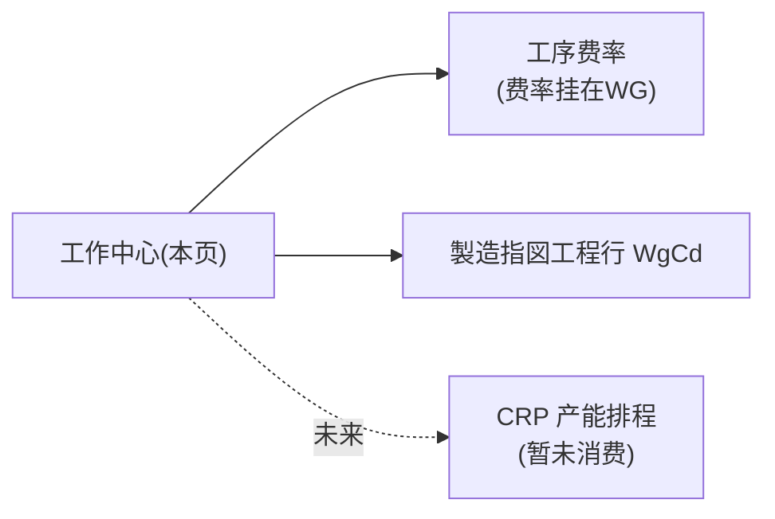

# 工作中心（WorkCenter · A2）单页面操作 SOP（手把手版）

> **用途**：给**MES 管理员/主数据维护操作、培训老师讲、测试人员拆用例**。对应模块总册（`02-生产管理MES` §5.1）。
> **页面**：工作中心（A2 主数据 · 生产管理 MES）　**路由**：`/mes/work-center`　**前端**：`views/mes/WorkCenterView.vue`　**API**：`api/mes/processCost.ts workCenterApi`　**后端**：`Mes/WorkCenterController` → `WorkCenterService`
> **基准**：分支 `feat/wfs-inbox-core`，2026-06-28；后端实测 `docs/codemap-mes/05-計画板-主数据-分析.md §二`，UI 经 agent 实读 view。
> **样例数据**：工作中心 `WG01` 印刷工程グループ、日可用产能 16（小时）。

---

## 1. 页面一句话说明

**工作中心（WG），就是把车间产能"按组"登记的主数据——每个工作中心维护一个"日可用产能时数"，它是工序费率挂靠点、（未来）CRP 排产的产能地基。代码注释明示"A2 只维护不消费"（CRP 引擎暂未消费它）。** 纯主数据 CRUD，无状态机。

---

## 2. 这个页面在业务流程中的位置

- **上游**：无。
- **本页**：维护 WG 主数据。
- **下游**：工序费率（挂 WG）、製造指図工程行的 WgCd、（待实现）CRP。

---

## 3. 谁使用这个页面

| 角色 | 用途 |
|---|---|
| MES 管理员 | 建/改/停用工作中心 |
| 主数据维护员 | 维护产能时数 |

---

## 4. 操作前准备

- [ ] 确定工作中心编码规则（如 `WG01`）与日可用产能口径（小时/日）。

---

## 5. 页面区域说明

| 区域 | 内容 |
|---|---|
| 页头 | h2「工作中心」+ 副标题「日可用产能 / 工序费率 / 产能」 |
| 工具条 | 关键字检索框 + 查询/新增 + 计数「共 N 条」 |
| 数据表格 | 工作中心 / 名称 / 日可用产能 / 启用(tag) / 操作(编辑·删除) |
| 弹窗(520px) | 工作中心 / 名称 / 日可用产能 / 启用 |

---

## 6. 字段填写说明（弹窗）

| 字段 | 怎么填 | 填错影响 |
|---|---|---|
| 工作中心(WgCd) | 唯一编码（≤10）；**编辑时禁改**（主键） | 空→`E-A2-WC-001` |
| 名称(WgName) | 业务名（≤100） | — |
| 日可用产能(DailyCapacityHours) | 小时数（≥0，如 16） | 负数→`E-A2-WC-003` |
| 启用(Enable) | 开关（默认开） | 停用不参与（未来 CRP） |

---

## 7. 按钮操作说明

| 按钮 | 点了会怎样 | 影响 |
|---|---|---|
| 查询 | 按关键字 reload | 否 |
| 新增 | 打开空弹窗 | — |
| 编辑（行） | 打开带值弹窗 | — |
| 删除（行） | 确认→**软删** | **软删** |
| 确定（弹窗） | save→「已保存」 | **落库** |
| 取消（弹窗） | 关闭 | — |

---

## 8. 标准业务操作 SOP（照着点）

### 场景一：新建工作中心（主流程）
- **步骤**：「新增」→填 WgCd `WG01`+名称+日可用产能 16→确定。
- **检查**：列表出现 WG01；工序费率页可挂靠它。
- **异常**：WgCd 空→`E-A2-WC-001`；产能负→`E-A2-WC-003`。
- **用例**：TC-M05-WC-002~004。

### 场景二：编辑产能
- **步骤**：行「编辑」→改日可用产能→确定。
- **检查**：落库；WgCd 灰（禁改）。
- **用例**：TC-M05-WC-005、006。

### 场景三：停用工作中心
- **步骤**：编辑→「启用」开关关→确定。
- **检查**：列表启用列显「停用」（info tag）。
- **用例**：TC-M05-WC-007。

### 场景四：关键字检索
- **步骤**：检索框输 WG01/名称关键字→查询（或回车）。
- **检查**：命中；计数更新。
- **用例**：TC-M05-WC-008。

### 场景五：删除（软删）
- **步骤**：行「删除」→确认。
- **检查**：软删消失（**无级联校验**，删被费率/指图引用的 WG 影响 `待业务确认`）。
- **用例**：TC-M05-WC-009、010。

---

## 9. 状态变化说明

无业务状态机；仅 启用/停用 二态 + 软删。

---

## 10. 按钮不可用 / 灰色原因

| 现象 | 原因 |
|---|---|
| WgCd 编辑禁改 | 主键 |
| 确定灰/loading | saving 中 |

---

## 11. 常见错误与处理

| 错误 | 原因 | 处理 |
|---|---|---|
| `E-A2-WC-001` | WgCd 空（删除时复用为不存在） | 填 WgCd |
| `E-A2-WC-003` | 日可用产能负 | 填 ≥0 |
| 编辑改不了 WgCd | 主键禁改 | 删了重建或新建 |

---

## 12. 操作完成后的检查清单

- [ ] 列表出现/更新该 WG。
- [ ] 工序费率页能挂靠它。
- [ ] 删除软删、列表消失（注意被引用的影响待确认）。

---

## 13. 页面级测试用例（≥25 条，可执行）

> 编号 `TC-M05-WC-xxx`。

| 用例编号 | 用例名称 | 优先级 | 前置条件 | 测试数据 | 操作步骤 | 预期结果 | 下游检查 | 备注 |
|---|---|---|---|---|---|---|---|---|
| TC-M05-WC-001 | 页面打开 | P1 | 有权限 | — | 进入 | 工具条+表格+计数 | — | — |
| TC-M05-WC-002 | 新建保存 | P0 | — | WG01/16 | 新增→填→确定 | 列表出现 | — | 核心 |
| TC-M05-WC-003 | WgCd 空 | P0 | 新建 | 空CD | 确定 | E-A2-WC-001 | 不落库 | — |
| TC-M05-WC-004 | 产能负 | P0 | 新建 | -1 | 确定 | E-A2-WC-003 | 不落库 | — |
| TC-M05-WC-005 | 编辑产能 | P1 | 有WG | 改16→20 | 编辑→改→确定 | 落库 | — | — |
| TC-M05-WC-006 | 编辑禁改WgCd | P1 | 有WG | — | 编辑 | WgCd 灰 | — | 主键 |
| TC-M05-WC-007 | 停用 | P1 | 有WG | 关启用 | 编辑→关→确定 | 启用列显停用 | — | — |
| TC-M05-WC-008 | 关键字检索 | P1 | 有数据 | WG01 | 查询 | 命中+计数 | — | — |
| TC-M05-WC-009 | 删除软删 | P1 | 有WG | WG01 | 删除→确认 | 软删消失 | — | — |
| TC-M05-WC-010 | 删被引用WG | P2 | WG被引用 | — | 删除 | 待业务确认(无级联校验) | — | — |
| TC-M05-WC-011 | 重复WgCd | P1 | 已有WG01 | WG01 | 新建确定 | 待业务确认(行为) | — | — |
| TC-M05-WC-012 | 名称≤100 | P2 | 新建 | 长名 | 填名称 | maxlength 100 | — | — |
| TC-M05-WC-013 | WgCd≤10 | P2 | 新建 | 长CD | 填CD | maxlength 10 | — | — |
| TC-M05-WC-014 | 产能精度 | P2 | 新建 | 16.5 | 填产能 | precision 2 | — | — |
| TC-M05-WC-015 | 启用默认开 | P2 | 新建 | — | 打开弹窗 | 启用默认 true | — | — |
| TC-M05-WC-016 | 启用列 tag | P2 | 各态 | — | 看列表 | 启用 success/停用 info | — | — |
| TC-M05-WC-017 | 取消不保存 | P2 | 编辑中 | — | 取消 | 不落库 | — | — |
| TC-M05-WC-018 | 回车检索 | P2 | 有数据 | 关键字 | 回车 | 触发 reload | — | — |
| TC-M05-WC-019 | 清空检索 | P2 | 已检索 | clearable | 清空 | 重查全部 | — | — |
| TC-M05-WC-020 | 计数正确 | P2 | 有数据 | — | 看计数 | 共 N 条 | — | — |
| TC-M05-WC-021 | 进入即reload | P2 | — | — | 进入 | 自动加载 | — | — |
| TC-M05-WC-022 | 日可用产能列右对齐 | P3 | 有数据 | — | 看列 | 右对齐 | — | — |
| TC-M05-WC-023 | 无自动刷新 | P3 | — | — | 停留 | 无定时刷新 | — | — |
| TC-M05-WC-024 | 费率挂靠验证 | P1 | 有WG | WG01 | 去工序费率新增 | 可选/校验到 WG01 | 工序费率 | 下游 |
| TC-M05-WC-025 | CRP 未消费 | P3 | — | — | — | 待实现(注释:只维护不消费) | — | — |
| TC-M05-WC-026 | 权限不足 | P2 | 无权账号 | — | 进/操作 | 待业务确认(隐藏/拒绝) | — | 权限 |
| TC-M05-WC-027 | 网络异常 | P2 | 断网 | — | 查询/保存 | 友好错误可重试 | — | — |

---

## 14. 培训讲解建议

| 顺序 | 讲什么 | 演示 | 易误解点 |
|---|---|---|---|
| 1 | WG 是产能"分组"主数据 | 新建 | 以为是工序 |
| 2 | 日可用产能口径 | 填 16 | 单位（小时/日） |
| 3 | 费率挂在 WG | 关联工序费率 | — |
| 4 | CRP 暂未消费 | 讲"只维护不消费" | 以为已排产 |

---

## 15. 与模块级手册的关系

对应 `02-生产管理MES-...md` §5.1。模块测试矩阵 §7（A2 相关）、验收 §8（AC-M05-13）。

---

## 16. 代码与文档来源

| 层 | 文件 |
|---|---|
| 逐行源码手册 | `docs/codemap-mes/05-計画板-主数据-分析.md §二` |
| 前端 | `views/mes/WorkCenterView.vue` |
| API/类型 | `api/mes/processCost.ts`(workCenterApi)、`types/mes/processCost.ts`(WorkCenter) |
| 后端 | `Mes/WorkCenterController.cs`、`Services/Mes/WorkCenterService.cs`(UpsertAsync/DeleteAsync 软删) |
| 实体 | `DomainModels/Mes/WorkCenter.cs`(T_WorkCenter, DailyCapacityHours decimal(21,8)) |

---

## 最后更新来源

- 代码：见 §16。基准：`feat/wfs-inbox-core`，2026-06-28（codemap 2026-06-22）。
- 覆盖：16 节 / 5 场景 / 27 用例（TC-M05-WC-001~027）。
