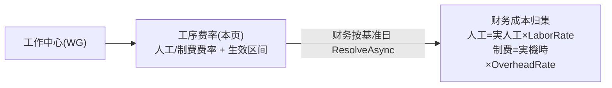

# 工序费率（ProcessCostRate · A2）单页面操作 SOP（手把手版）

> **用途**：给**MES 管理员/成本会计操作、培训老师讲、测试人员拆用例**。对应模块总册（`02-生产管理MES` §5.2）。
> **页面**：工序费率（A2 主数据 · 生产管理 MES）　**路由**：`/mes/process-cost-rate`　**前端**：`views/mes/ProcessCostRateView.vue`　**API**：`api/mes/processCost.ts processCostRateApi`　**后端**：`Mes/ProcessCostRateController` → `ProcessCostRateService`
> **基准**：分支 `feat/wfs-inbox-core`，2026-06-28；后端实测 `docs/codemap-mes/05-計画板-主数据-分析.md §三`，UI 经 agent 实读 view。
> **样例数据**：工作中心 `WG01`、人工费率 ¥1500/h、制造费率 ¥800/h、生效日 2026-07-01、失效日 空（长期）。

---

## 1. 页面一句话说明

**工序费率，就是给每个工作中心维护"人工费率/制造费率"及其"生效区间"的主数据——它是财务成本归集按基准日解析费率的唯一取值源（MES 只维护费率，真正的金额计算在财务 CostCollectService）。同一工作中心的多条费率，生效区间不能重叠。**

---

## 2. 这个页面在业务流程中的位置

- **上游**：工作中心（WG 必须先存在）。
- **本页**：维护费率与生效区间。
- **下游**：财务 `CostCollectService` 按基准日取费率算成本。

---

## 3. 谁使用这个页面

| 角色 | 用途 |
|---|---|
| MES 管理员 | 维护费率主数据 |
| 成本会计 | 复核费率与生效日 |

---

## 4. 操作前准备

- [ ] 对应工作中心（如 `WG01`）已建。
- [ ] 明确费率金额与生效日；同 WG 的历史费率区间清楚（避免重叠）。

---

## 5. 页面区域说明

| 区域 | 内容 |
|---|---|
| 页头 | h2「工序费率」+ 副标题「人工费率 / 制造费率 / 生效日」 |
| 工具条 | 按工作中心过滤框 + 查询/新增 + 计数 |
| 数据表格 | 工作中心 / 人工费率 / 制造费率 / 生效日 / 失效日(空=长期) / 操作 |
| 弹窗(560px) | 工作中心 / 人工费率·制造费率(两列) / 生效日·失效日(两列) |

---

## 6. 字段填写说明（弹窗）

| 字段 | 怎么填 | 填错影响 |
|---|---|---|
| 工作中心(WgCd) | 须为已存在 WG（≤10）；**编辑禁改**；新增时若过滤框有值则预填 | 不存在→`E-A2-WC-001`；空→warning |
| 人工费率(LaborRate) | ¥/小时（≥0，如 1500） | 负→`E-A2-RATE-003` |
| 制造费率(OverheadRate) | ¥/小时（≥0，如 800）（列名「制造费率」） | 负→`E-A2-RATE-003` |
| 生效日(ValidFrom) | 区间起（必填，如 2026-07-01） | 空→warning |
| 失效日(ValidTo) | 空=长期有效 | 早于生效日→`E-A2-RATE-004` |

---

## 7. 按钮操作说明

| 按钮 | 点了会怎样 | 影响 |
|---|---|---|
| 查询 | 按 filterWgCd reload | 否 |
| 新增 | 打开弹窗（预填过滤 WG） | — |
| 编辑（行） | 打开带值弹窗 | — |
| 删除（行） | 无 id→warning；否则确认→删除 | **删除** |
| 确定（弹窗） | save（失效日空归 null）→「已保存」 | **落库** |
| 取消 | 关闭 | — |

---

## 8. 标准业务操作 SOP（照着点）

### 场景一：新建费率（主流程）
- **步骤**：「新增」（或先过滤 WG01）→填 WG01+人工 1500+制费 800+生效日 2026-07-01→失效日留空→确定。
- **检查**：列表出现；失效日列显「长期」；财务能按基准日解析到。
- **异常**：WG 不存在→`E-A2-WC-001`；费率负→`E-A2-RATE-003`；失效<生效→`E-A2-RATE-004`。
- **用例**：TC-M05-RATE-002~006。

### 场景二：费率换代（区间不重叠）
- **背景**：新费率从某日起生效，旧费率封口。
- **步骤**：先把旧费率「编辑」失效日设为 2026-09-30→新建一条生效日 2026-10-01。
- **检查**：两条不重叠，落库成功。
- **异常**：区间与已存重叠→`E-A2-RATE-001`。
- **用例**：TC-M05-RATE-007、008。

### 场景三：按工作中心过滤
- **步骤**：过滤框输 WG01→查询。
- **检查**：仅 WG01 的费率历史。
- **用例**：TC-M05-RATE-009。

### 场景四：失效日=长期
- **步骤**：失效日留空保存。
- **检查**：列表显「长期」，DB 存 null；ResolveAsync 视为 +∞。
- **用例**：TC-M05-RATE-010。

### 场景五：财务按基准日取费率（下游验证）
- **背景**：确认成本归集取对费率。
- **步骤**：在生效区间内/外各取一个基准日，看财务成本归集解析结果。
- **检查**：取 `ValidFrom≤onDate≤(ValidTo??+∞)` 中 ValidFrom 最新一条；区间外则无费率（财务侧 `E-A2-RATE-002` / 警告 `W-A2-COST-001`）。
- **用例**：TC-M05-RATE-011、012。

---

## 9. 状态变化说明

无业务状态机；生效区间靠 ValidFrom/ValidTo 表达（失效日空=长期）+ 软删。

---

## 10. 按钮不可用 / 灰色原因

| 现象 | 原因 |
|---|---|
| WgCd 编辑禁改 | 主键 |
| 删除被拦 | 行无 id（warning） |

---

## 11. 常见错误与处理

| 错误 | 原因 | 处理 |
|---|---|---|
| `E-A2-RATE-001` | 同 WG 生效区间重叠 | 先封旧区间再建新 |
| `E-A2-RATE-003` | 费率负 | 填 ≥0 |
| `E-A2-RATE-004` | 失效<生效 | 调日期 |
| `E-A2-WC-001` | WG 不存在 | 先建工作中心 |

---

## 12. 操作完成后的检查清单

- [ ] 列表出现/更新；失效日空显「长期」。
- [ ] 同 WG 无区间重叠。
- [ ] 财务成本归集能按基准日解析到（人工=実人工工时×LaborRate、制费=実機時×OverheadRate）。

---

## 13. 页面级测试用例（≥25 条，可执行）

> 编号 `TC-M05-RATE-xxx`。

| 用例编号 | 用例名称 | 优先级 | 前置条件 | 测试数据 | 操作步骤 | 预期结果 | 下游检查 | 备注 |
|---|---|---|---|---|---|---|---|---|
| TC-M05-RATE-001 | 页面打开 | P1 | 有权限 | — | 进入 | 工具条+表格+计数 | — | — |
| TC-M05-RATE-002 | 新建费率 | P0 | WG存在 | WG01/1500/800/07-01 | 新增→填→确定 | 列表出现、失效显长期 | — | 核心 |
| TC-M05-RATE-003 | WG不存在 | P0 | — | 不存在WG | 确定 | E-A2-WC-001 | 不落库 | — |
| TC-M05-RATE-004 | 费率负 | P0 | 新建 | -1 | 确定 | E-A2-RATE-003 | 不落库 | — |
| TC-M05-RATE-005 | 失效<生效 | P0 | 新建 | 失效早于生效 | 确定 | E-A2-RATE-004 | 不落库 | — |
| TC-M05-RATE-006 | 生效日空 | P1 | 新建 | 空生效日 | 确定 | warning「生效日」 | 不落库 | — |
| TC-M05-RATE-007 | 区间重叠 | P0 | 已有费率 | 重叠区间 | 新建确定 | E-A2-RATE-001 | 不落库 | — |
| TC-M05-RATE-008 | 费率换代 | P1 | 有旧费率 | 封旧+建新 | 编辑失效+新建 | 两条不重叠落库 | — | — |
| TC-M05-RATE-009 | 按WG过滤 | P1 | 有数据 | WG01 | 查询 | 仅WG01费率 | — | — |
| TC-M05-RATE-010 | 失效日长期 | P1 | 新建 | 空失效日 | 保存 | 列显长期、DB null | — | — |
| TC-M05-RATE-011 | 财务区间内解析 | P1 | 有费率 | 基准日在区间 | 财务成本归集 | 取ValidFrom最新一条 | 财务 | 下游 |
| TC-M05-RATE-012 | 财务区间外无费率 | P2 | 有费率 | 基准日在区间外 | 财务成本归集 | 无费率(E-A2-RATE-002/W-A2-COST-001) | 财务 | — |
| TC-M05-RATE-013 | 编辑禁改WgCd | P1 | 有费率 | — | 编辑 | WgCd 灰 | — | 主键 |
| TC-M05-RATE-014 | 删除 | P1 | 有费率 | id | 删除→确认 | 删除消失 | — | — |
| TC-M05-RATE-015 | 删除无id拦截 | P2 | 行无id | — | 删除 | warning | — | — |
| TC-M05-RATE-016 | 人工/制费精度 | P2 | 新建 | 1500.50 | 填 | precision 2 | — | — |
| TC-M05-RATE-017 | 新增预填过滤WG | P2 | 过滤WG01 | — | 新增 | 预填 WG01 | — | — |
| TC-M05-RATE-018 | 制造费率列名 | P3 | 有数据 | — | 看列 | 「制造费率」(overheadRate) | — | — |
| TC-M05-RATE-019 | 生效/失效日格式 | P3 | 有数据 | — | 看列 | 前10位日期/空=长期 | — | — |
| TC-M05-RATE-020 | 计数 | P2 | 有数据 | — | 看计数 | 共 N 条 | — | — |
| TC-M05-RATE-021 | 取消不保存 | P2 | 编辑中 | — | 取消 | 不落库 | — | — |
| TC-M05-RATE-022 | 回车过滤 | P2 | 有数据 | WG01 | 回车 | reload | — | — |
| TC-M05-RATE-023 | 进入即reload | P2 | — | — | 进入 | 自动加载 | — | — |
| TC-M05-RATE-024 | ResolveAsync取最新生效 | P1 | 多条费率 | 多生效日 | 财务取值 | ValidFrom≤onDate 最新一条 | 财务 | 口径 |
| TC-M05-RATE-025 | 无自动刷新 | P3 | — | — | 停留 | 无定时刷新 | — | — |
| TC-M05-RATE-026 | 权限不足 | P2 | 无权账号 | — | 进/操作 | 待业务确认(隐藏/拒绝) | — | 权限 |
| TC-M05-RATE-027 | 网络异常 | P2 | 断网 | — | 查询/保存 | 友好错误可重试 | — | — |

---

## 14. 培训讲解建议

| 顺序 | 讲什么 | 演示 | 易误解点 |
|---|---|---|---|
| 1 | 费率挂在 WG | 选 WG | 以为挂工序 |
| 2 | 生效区间不重叠 | 演示 E-A2-RATE-001 | 直接建新覆盖 |
| 3 | 失效日空=长期 | 留空保存 | 必须填失效日 |
| 4 | 金额在财务算 | 讲 CostCollectService | 以为这页出金额 |

---

## 15. 与模块级手册的关系

对应 `02-生产管理MES-...md` §5.2。验收 §8（AC-M05-13）。

---

## 16. 代码与文档来源

| 层 | 文件 |
|---|---|
| 逐行源码手册 | `docs/codemap-mes/05-計画板-主数据-分析.md §三`（含工时×费率财务公式） |
| 前端 | `views/mes/ProcessCostRateView.vue` |
| API/类型 | `api/mes/processCost.ts`(processCostRateApi)、`types/mes/processCost.ts` |
| 后端 | `Mes/ProcessCostRateController.cs`(含 resolve)、`Services/Mes/ProcessCostRateService.cs`(UpsertAsync 区间重叠校验/ResolveAsync) |
| 消费方 | `Services/Fin/CostCollectService.cs`(人工=実人工×LaborRate、制费=実機時×OverheadRate) |
| 实体 | `DomainModels/Mes/ProcessCostRate.cs`(LaborRate/OverheadRate decimal(21,8), ValidFrom/ValidTo?) |

---

## 最后更新来源

- 代码：见 §16。基准：`feat/wfs-inbox-core`，2026-06-28（codemap 2026-06-22）。
- 覆盖：16 节 / 5 场景 / 27 用例（TC-M05-RATE-001~027）。
