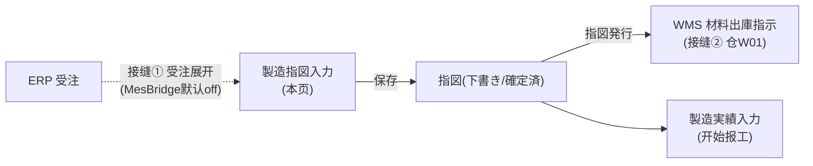
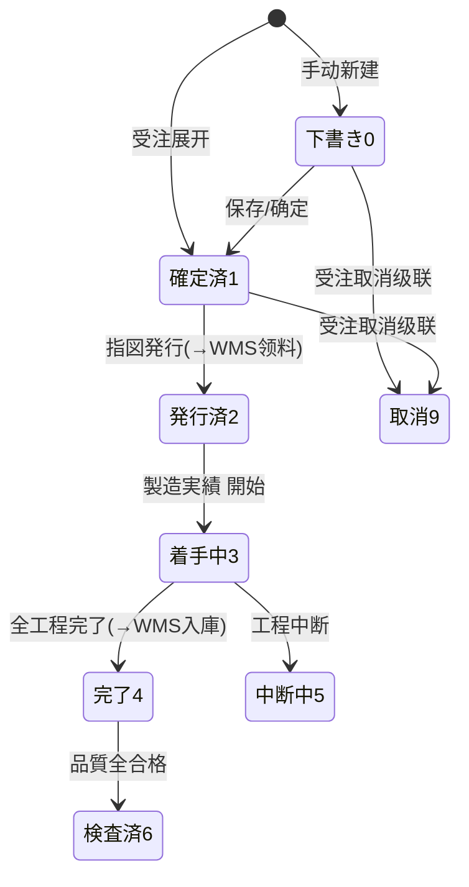

# 製造指図入力 单页面操作 SOP（手把手版）

> **用途**：给**生产计划员操作、培训老师讲、测试人员拆用例**的单页面手册。比模块总册（`02-生产管理MES` §5.3）更细、更口语。
> **页面**：製造指図入力（MSBBME020 · 生产管理 MES）　**路由**：`/mes/work-order`（带 `?no=` 进訂正）　**前端**：`views/mes/WorkOrderEntryView.vue`（+ `work-order/steps/WoStep1~3`）　**API**：`api/mes/mes.ts workOrderApi`　**后端**：`Mes/WorkOrderController` → `WorkOrderService`
> **基准**：分支 `feat/wfs-inbox-core`，2026-06-28；后端实测 `docs/codemap-mes/01-製造指図-workorder.md`（2026-06-22 权威），UI 经 agent 实读 view。查不到标 `待业务确认`/`代码未发现`。
> **样例数据**：製品 `PRD2026070001`、来源受注 `WO20260701000001`、生産数量 5000、客先納期 2026-07-10、工程 印刷→製函→検査。

---

## 1. 页面一句话说明

**製造指図入力，就是把"要做哪款产品、做多少、什么时候交"变成一张可执行的工单（製造指図）——它是 MES 的枢纽：可以从受注一键"展开"自动生成，也可以手动新建；填好头部+工程+材料三部分后保存，再点"指図発行"，系统就会自动通知 WMS 去备料（材料出庫）。** 一张指図 = 头 + N 个工程 + N 个材料，三表一次保存。

---

## 2. 这个页面在业务流程中的位置

- **上游**：ERP 受注（经接缝①可自动展开成指图）、PA050 製品マスタ（提供工程/材料 BOM）。
- **本页**：建/改製造指図，并触发发行。
- **下游**：发行→WMS 领料（接缝②）；之后到製造実績入力报工。

---

## 3. 谁使用这个页面

| 角色 | 用途 |
|---|---|
| 生产计划员 | 受注展开/手动建指图、排工程材料、发行 |
| 车间主管 | 复核/调整指图、发行 |
| （只读）现场 | 从一覧跳详情查看 |

---

## 4. 操作前准备（不准备好，下面会卡住）

- [ ] 製品 `PRD2026070001` 已在 PA050 製品マスタ建档（含工程/材料），否则受注展开出空工程/材料。
- [ ] 若走受注展开：来源受注 `WO20260701000001` 已在 ERP 成立。
- [ ] 号機/WG 主数据（`MC01`/`WG01`）已建（供排程/成本）。
- [ ] 清楚 `MesBridge:Enabled`：**默认 false** → 受注不会自动变成指图，需本页"受注展开"或开开关。

---

## 5. 页面区域说明

| 区域 | 内容 |
|---|---|
| 卡片头 | 操作种别标签（新規/訂正）+ 标题「製造指図入力 (MSBBME020)」+ 指図NO（有号才显示，蓝字）+ 状态标签 + 戻る |
| 步骤条 | ①指図基本情報 ②工程計画 ③材料手配+保存 |
| Step1 基本情報 | 4 分区：顶部(指図NO/拠点/優先度) / 受注情報 / 製品情報 / 数量・納期 + 備考 |
| Step2 工程計画 | 工具按钮（工程追加 / 並び順 再付番）+ 行内可编辑工程表 |
| Step3 材料手配 | 工具按钮（材料追加）+ 行内可编辑材料表 |
| 底部按钮区 | 戻る / 次画面 / 保存 / 指図発行 |

---

## 6. 字段填写说明（口语版：到底怎么填）

**Step1 基本情報**

| 字段 | 怎么填 | 谁提供 | 填错影响 |
|---|---|---|---|
| 指図NO | 不用填，保存后自动采番（`WO2026070001`，月级） | 系统 | 永久只读 |
| 拠点CD | 本社 `BASE01`（必填） | 计划 | — |
| 優先度 | 通常/急ぎ/特急（默认通常） | 计划 | 影响排程顺序 |
| 手配NO1/2/3 | 手配号（手配NO 或 製品CD 至少填一项） | 受注/手填 | 与製品CD 均空→`ME-MSG-001` |
| 受注Web NO | 受注号；点后面放大镜可一键展开 | 受注 | — |
| 製品CD | `PRD2026070001`（必填级） | 製品マスタ | 与手配NO 均空→`ME-MSG-001` |
| 製品名/得意先CD | 受注/製品带出 | 自动/手填 | — |
| 生産数量 | >0 整数（如 5000，必填） | 计划 | ≤0→`ME-MSG-002` |
| ロットNO | 批次号（可空） | 手填 | — |
| 客先納期 | 日期（必填） | 受注 | 計画完了>納期→`ME-MSG-004`（确认框，可继续） |
| 計画開始日/完了日 | 開始≤完了（必填） | 计划 | 開始>完了→`ME-MSG-003` |
| 完了数量/不良数量 | **只读**，实绩累计回填 | 系统 | — |
| 備考 | 备注 | 手填 | — |

**Step2 工程行**：順(自动)/工程CD/作業CD/工程名/号機/WG/計画開始完了日時/計画数量(默认=生産数量)/LT(日)/状態(只读)。**工程CD+作業CD 组合不可重复**。
**Step3 材料行**：順/工程CD/材料CD/材料名/区分(1仕掛品/2連産品/3原料/4印刷原紙，默认3)/計画数量(默认=生産数量)/単位/手配状況(0未手配/1手配中/2入荷済/3不足，默认0)/実績消費(只读)/備考。

---

## 7. 按钮操作说明

| 按钮 | 点了会怎样 | 是否影响状态/库存/下游 |
|---|---|---|
| 次画面 → | 校验当前 Step 后进下一步 | 否 |
| ← 戻る | 回上一步 | 否 |
| 受注展开（放大镜，Step1） | 确认框→按受注明细展开成指图（多明细=多指图） | **建指图（Status=1）** |
| 工程追加 / 材料追加 / 行削除 | 子表行增删（仅 isEditable） | 否（保存才落库） |
| 並び順 再付番 | 工程 sortOrder 重排 1..n | 否 |
| 保存 | 新建采番 / 编辑覆盖（子表全删全插） | **落库**，不触发 MES/WMS |
| 指図発行 | Status→発行済(2) + **触发 WMS 材料出庫** | **改状态 + 起 WMS 领料（接缝②）** |

---

## 8. 标准业务操作 SOP（照着点）

### 场景一：从受注展开建指図（主流程）
- **业务背景**：销售接了单，计划要把它变成可执行工单。
- **样例数据**：受注 `WO20260701000001`（含製品 PRD2026070001，数量 5000）。
- **前置条件**：受注已成立；製品 PA050 有工程/材料；`MesBridge:Enabled` 任意（本页是手动展开路径）。
- **详细步骤**：1) 进 `/mes/work-order`（新規态）；2) Step1「受注Web NO」填 `WO20260701000001`→点放大镜；3) 确认框「确定展开？」→确定；4) 多明细则展开多张指图、载入第一张；5) 切 Step2/3 核对工程/材料是否按 BOM 带出；6) 保存。
- **完成后检查**：生成指図NO；工程/材料子表按製品 BOM 展开；Status=確定済(1)。
- **异常处理**：受注头/明细 0 件→`ME-MSG-040`（裸码）；同製品已有未取消指图→`ME-MSG-005`（裸码）。
- **可拆测试用例**：TC-M05-WO-002、003。

### 场景二：手动新建指図（不走受注）
- **背景**：临时追加/试做，没有受注。
- **样例数据**：製品 PRD2026070001、数量 3000、納期 2026-07-15。
- **步骤**：1) Step1 填拠点+製品CD+生産数量+納期+計画開始/完了；2) Step2「工程追加」逐行填 工程CD/作業CD/工程名/号機；3) Step3「材料追加」逐行填材料CD/区分/数量；4) 保存。
- **检查**：生成指図NO（下書き 0 或 確定済 1）；三表落库。
- **异常**：手配NO 与製品CD 均空→`ME-MSG-001`；数量 0→`ME-MSG-002`；工程 CD+作業CD 重复→`ME-MSG-007`。
- **用例**：TC-M05-WO-004~010。

### 场景三：指図発行触发 WMS 领料
- **背景**：指图确认无误，要开始备料生产。
- **前置**：指图 Status∈{0,1}、至少 1 个工程。
- **步骤**：1) 编辑态进 Step3；2) 点「指図発行」→确认框（提示发行后不可编辑）；3) 确定；4) 到 WMS 出庫指示一覧查材料出庫。
- **检查**：Status→発行済(2)；WMS 出现该指图的**材料出庫指示**（类型=Material，仓 W01，数量=材料計画必要数量）。
- **异常**：无工程→`ME-MSG-006`；状态不可发行→`ME-MSG-042`（裸码）；已发行再点→幂等直接返回（不报错）。
- **用例**：TC-M05-WO-011~014。

### 场景四：发行前修改指図
- **背景**：发行前发现工程/数量要调整。
- **前置**：Status∈{0,1}。
- **步骤**：訂正读込（`?no=`）→改 Step1/2/3→保存。
- **检查**：落库成功；子表全删全插为最新集。
- **异常**：Status≥2 时全字段只读，改不了。
- **用例**：TC-M05-WO-015、016。

### 场景五：发行后只读核对
- **背景**：已发行，只能查看不能改。
- **步骤**：列表「詳細」进来→各 Step 只读浏览。
- **检查**：所有输入字段灰/只读；只剩「戻る」。
- **用例**：TC-M05-WO-017。

### 场景六：删除未发行指図
- **背景**：建错了要删。
- **前置**：Status≤1（一覧的删除按钮仅 `status≤1` 显示）。
- **步骤**：製造指図一覧→该行「削除」→确认。
- **检查**：软删（IsDeleted=true），列表消失；状态≥2 无删除按钮。
- **异常**：状态≥2 删除→`ME-MSG-042`。
- **用例**：TC-M05-WO-018。

---

## 9. 状态变化说明

> 可编辑/删除/发行仅 `Status∈{0,1}`；着手(≥3)不可取消。

---

## 10. 按钮不可用 / 灰色原因

| 现象 | 原因 |
|---|---|
| 指図発行 不显示 | 非编辑态，或 Status≥2（已发行） |
| 全部输入字段灰 | Status≥2（发行后只读，`isEditable=Status===0‖1`） |
| 指図NO/完了数量/不良数量 永久灰 | 采番自动 / 实绩回填 |
| 受注展开放大镜 灰 | 非编辑态或无受注号 |
| 一覧 削除 不显示 | Status≥2 |

---

## 11. 常见错误与处理

| 错误/现象 | 原因 | 处理 |
|---|---|---|
| `ME-MSG-001` | 手配NO 与製品CD 均空 | 至少填一个 |
| `ME-MSG-002` | 生産数量≤0 | 填 >0 |
| `ME-MSG-003` | 計画開始>完了 | 调日期 |
| `ME-MSG-004`（确认框） | 計画完了>客先納期 | 确认可继续或调期 |
| `ME-MSG-006` | 无工程就发行 | 先加工程 |
| `ME-MSG-007` | 工程CD+作業CD 重复 | 改唯一 |
| `ME-MSG-005`（裸码） | 同受注+製品已有未取消指图 | 别重复展开 |
| `ME-MSG-040/042/043`（裸码） | 受注/指图不存在·状态不可操作 | 按提示码处理（**这些无 i18n，显示裸码**） |
| 受注没自动变指图 | `MesBridge:Enabled=false` | 本页手动展开或开开关 |

---

## 12. 操作完成后的检查清单（保存/发行后必做）

- [ ] 保存：指図NO 生成、转编辑态、Status=0/1。
- [ ] 发行：Status→2；**WMS 出庫指示一覧**出现材料出庫（Material/W01/数量=材料計画必要数量）。
- [ ] 受注展开：每条受注明细 → 一张指图(Status=1)，工程/材料按 BOM。
- [ ] 后续：到 製造実績入力（`/mes/production-result?no=`）能取得该指图报工。

---

## 13. 页面级测试用例（≥25 条，可执行）

> 编号 `TC-M05-WO-xxx`；数据用样例。测试人员补"实际结果/是否通过/缺陷编号"。

| 用例编号 | 用例名称 | 优先级 | 前置条件 | 测试数据 | 操作步骤 | 预期结果 | 下游检查 | 备注 |
|---|---|---|---|---|---|---|---|---|
| TC-M05-WO-001 | 页面打开默认新規 | P1 | 有权限 | — | 进入 /mes/work-order | 操作种别=新規、Step1、指図NO 空 | — | — |
| TC-M05-WO-002 | 受注展开建指图 | P0 | 受注存在+製品有BOM | WO20260701000001 | 受注NO→放大镜→确认 | 生成指图(Status=1)+工程/材料按BOM | — | 核心 |
| TC-M05-WO-003 | 受注多明细多指图 | P1 | 受注多明细 | 多明细受注 | 展开 | 多张指图、载入第一张 | — | — |
| TC-M05-WO-004 | 手动新建保存 | P0 | 主数据齐 | PRD/数量3000 | 填头+工程+材料→保存 | 采番+三表落库 | — | — |
| TC-M05-WO-005 | 必填-手配/製品均空 | P0 | 新建 | 都空 | 保存 | ME-MSG-001 | 不落库 | — |
| TC-M05-WO-006 | 必填-数量0 | P0 | 新建 | 数量0 | 保存 | ME-MSG-002 | 不落库 | — |
| TC-M05-WO-007 | 開始>完了 | P0 | 新建 | 開始晚于完了 | 保存 | ME-MSG-003 | 不落库 | — |
| TC-M05-WO-008 | 完了>納期确认 | P1 | 新建 | 完了晚于納期 | 保存 | ME-MSG-004 确认框 | 确认可继续 | — |
| TC-M05-WO-009 | 无工程发行 | P0 | 无工程 | — | 発行 | ME-MSG-006 | — | — |
| TC-M05-WO-010 | 工程CD+作業CD重复 | P1 | Step2 | 两行同CD | 校验/保存 | ME-MSG-007 | — | — |
| TC-M05-WO-011 | 指図発行→WMS领料 | P0 | Status∈{0,1}+有工程 | 样例指图 | 発行→确认 | Status→2+WMS材料出庫(W01) | WMS出庫指示一覧 | 接缝② |
| TC-M05-WO-012 | 发行幂等 | P1 | 已发行 | Status=2 | 再発行 | 直接返回不报错 | 不重复领料 | — |
| TC-M05-WO-013 | 发行状态守卫 | P1 | Status≥3 | 着手中 | 発行 | ME-MSG-042(裸码) | — | — |
| TC-M05-WO-014 | 发行后材料出庫数量 | P1 | 已发行 | 材料計画数量 | 查WMS | 出庫数量=材料計画必要数量 | WMS | 一致性 |
| TC-M05-WO-015 | 发行前修改保存 | P1 | Status∈{0,1} | 改工程 | 訂正→改→保存 | 子表全删全插为最新 | — | — |
| TC-M05-WO-016 | 重复展开拦截 | P1 | 已有指图 | 同受注+製品 | 再展开 | ME-MSG-005(裸码) | — | — |
| TC-M05-WO-017 | 发行后只读 | P2 | Status≥2 | 已发行 | 詳細进入 | 全字段只读、无保存/发行 | — | — |
| TC-M05-WO-018 | 删除仅未发行 | P1 | 有指图 | Status≤1 | 一覧删除 | 软删消失；≥2无删除按钮 | IsDeleted=true | — |
| TC-M05-WO-019 | 优先度排程影响 | P2 | — | 特急/通常 | 设优先度 | 计划板排程顺序受影响 | 计划板 | — |
| TC-M05-WO-020 | 材料区分默认 | P2 | Step3 | 新材料行 | 追加 | 区分默认3原料、手配状況默认0 | — | — |
| TC-M05-WO-021 | 工程计划数量默认 | P2 | Step2 | 新工程行 | 追加 | 計画数量默认=生産数量 | — | — |
| TC-M05-WO-022 | 並び順再付番 | P2 | 多工程 | 乱序 | 点再付番 | sortOrder=1..n | — | — |
| TC-M05-WO-023 | 完了/不良数量只读 | P2 | — | — | 看Step1 | 永久只读(实绩回填) | — | — |
| TC-M05-WO-024 | MesBridge off 受注不自动展开 | P1 | Bridge off | 新受注 | 建受注后查指图 | 无自动指图(需手动展开) | — | 开关 |
| TC-M05-WO-025 | 一覧检索+进度 | P1 | 有数据 | 组合条件 | 検索 | 命中+进度率+遅延标红 | — | — |
| TC-M05-WO-026 | 一覧跳详情/实绩 | P1 | 有指图 | WO号 | 詳細/実績 | 跳 /mes/work-order?no= 或 production-result?no= | — | — |
| TC-M05-WO-027 | 更新无乐观锁 | P2 | 两端改同指图 | 同指图 | 先后保存 | 后者覆盖(无409)——记录现状 | — | 现状 |
| TC-M05-WO-028 | 取消无前端入口 | P2 | — | — | 找取消按钮 | 本页/一覧无取消(受注取消后端级联) | — | — |
| TC-M05-WO-029 | CSV导出一致 | P1 | 一覧有数据 | 当前条件 | CSV出力 | 内容=查询结果 | — | — |
| TC-M05-WO-030 | 权限不足 | P2 | 无权账号 | — | 进页面/操作 | 待业务确认(隐藏/拒绝) | — | 权限 |
| TC-M05-WO-031 | 网络异常 | P2 | 断网 | — | 保存/发行 | 友好错误可重试 | — | — |

---

## 14. 培训讲解建议

| 顺序 | 讲什么 | 演示动作 | 易误解点 |
|---|---|---|---|
| 1 | 这页是"把订单变工单"的开关 | §2 流程图 | 以为保存就开始生产 |
| 2 | 受注展开 vs 手动建 | 演示放大镜展开 | MesBridge 默认 off |
| 3 | 三表一次保存 | 走 Step1→2→3 | 忘了至少 1 个工程 |
| 4 | 发行=通知 WMS 领料 | 发行后开 WMS 出庫指示 | 保存≠发行 |
| 5 | 发行后只读 | 演示改不了 | 发行后还想改字段 |
| 6 | 删除≠取消 | 一覧删除仅未发行 | 用删除来"撤单" |

---

## 15. 与模块级手册的关系

本 SOP 对应 `02-生产管理MES-最详细用户操作培训手册.md` §5.3（含 5.3.1a~1e 增强块）。模块级测试矩阵见总册 §7（M05-001~004）、可执行用例 §7.1（TC-M05-001/002）、验收 §8（AC-M05-01/02/03）。

---

## 16. 代码与文档来源

| 层 | 文件 |
|---|---|
| 逐行源码手册 | `docs/codemap-mes/01-製造指図-workorder.md`（权威） |
| 前端 | `cp6.web/src/views/mes/WorkOrderEntryView.vue`、`work-order/steps/WoStep1~3`、`WorkOrderListView.vue` |
| API/类型 | `cp6.web/src/api/mes/mes.ts`(workOrderApi)、`types/mes/mes.ts`(WORK_ORDER_STATUS/PRIORITY/PROCESS_STATUS_OPTIONS) |
| 后端 | `Mes/WorkOrderController.cs`、`Services/Mes/WorkOrderService.cs`(Search/Create/Update/Issue/Expand)、`MesSequenceService.cs` |
| 接缝 | `MesBridgeHook.cs`(①)、`WmsBridgeHook.OnWorkOrderIssuedAsync`+`OutboundService.CreateFromWorkOrderAsync`(②) |
| 实体/DTO | `DomainModels/Mes/WorkOrder.cs`(+Process+Material)、`DTOs/Mes/WorkOrderDto.cs` |

---

## 最后更新来源

- 代码：见 §16（codemap-mes 01 + view 实读 + types 枚举）。
- 基准：分支 `feat/wfs-inbox-core`，盘点日 2026-06-28（codemap 实测 2026-06-22）。
- 覆盖：16 节 / 6 场景 / 31 用例（TC-M05-WO-001~031）。
