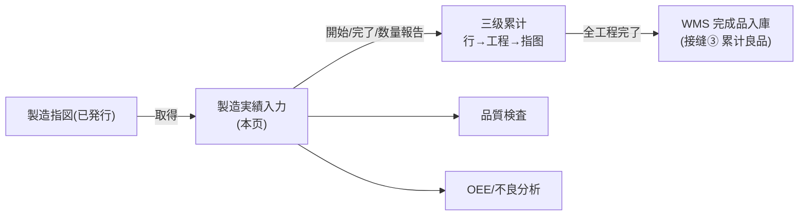
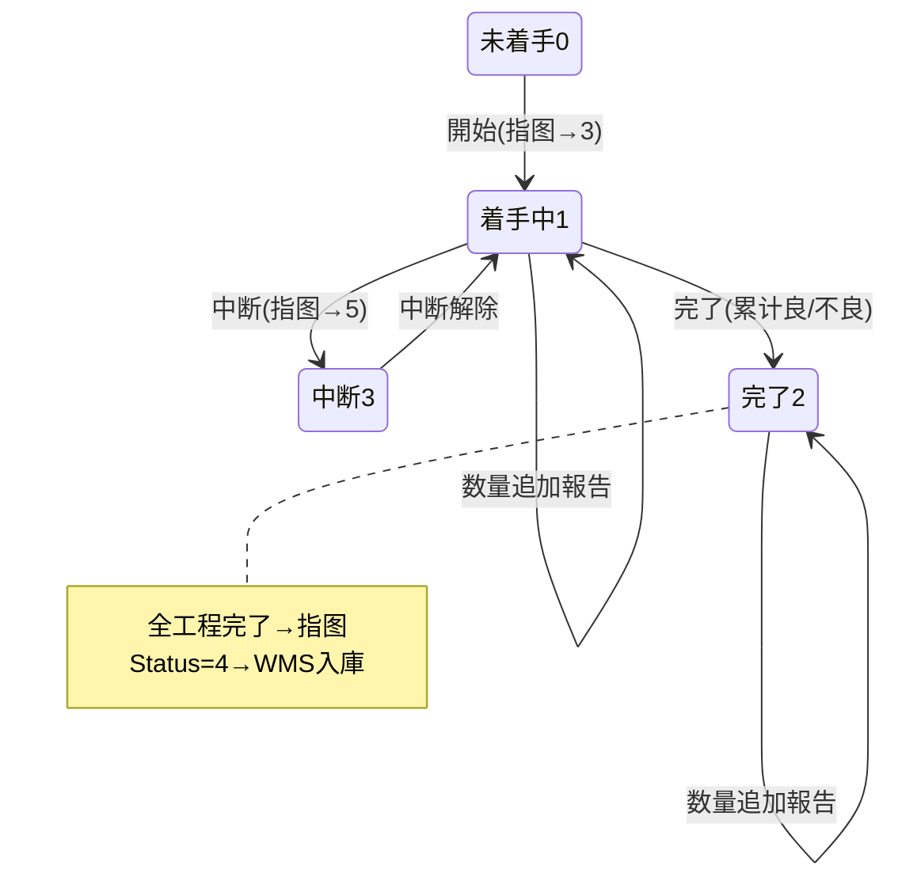

# 製造実績入力 单页面操作 SOP（手把手版）

> **用途**：给**现场制造担当操作、培训老师讲、测试人员拆用例**。比模块总册（`02-生产管理MES` §5.5）更细。
> **页面**：製造実績入力（MSBBME040 · 生产管理 MES）　**路由**：`/mes/production-result`（带 `?no=` 取得指图）　**前端**：`views/mes/ProductionResultEntryView.vue`　**API**：`api/mes/mes.ts productionResultApi`　**后端**：`Mes/ProductionResultController` → `ProductionResultService.WriteAsync`
> **基准**：分支 `feat/wfs-inbox-core`，2026-06-28；后端实测 `docs/codemap-mes/02-製造実績-productionresult.md`（2026-06-22 权威），UI 经 agent 实读 view。
> **样例数据**：指図 `WO2026070001`（已发行）、作業者 `OP01` 田中、工程 印刷→製函→検査、良品 4800 / 不良 200。

---

## 1. 页面一句话说明

**製造実績入力，就是现场作业者按"工程"报工的地方——每个工程可以"開始 / 中断 / 中断解除 / 完了 / 数量追加報告"，每次报告系统记一条流水（只增不改不删）；当一张指图的所有工程都"完了"，系统自动把累计良品送去 WMS 完成品入庫。** 它是"实际做了多少、好品多少、坏品多少"的唯一录入口。

---

## 2. 这个页面在业务流程中的位置

- **上游**：已**発行**的製造指図（Status≥2 才能报工）。
- **本页**：按工程报实绩。
- **下游**：全工程完了→WMS 完成品入庫（接缝③）；良/不良数供 OEE/Dashboard 分析；品質検査独立录入。

---

## 3. 谁使用这个页面

| 角色 | 用途 |
|---|---|
| 现场制造担当（作业者） | 开工/中断/完工/报数量 |
| 班组长 | 替班组报实绩、核对进度 |

---

## 4. 操作前准备

- [ ] 目标指图已**発行**（Status≥2）；下書き/確定済（<2）取得后会提示"発行前不可入力"。
- [ ] 作業者CD（如 `OP01`）准备好——**每次报告必填**。
- [ ] 清楚工程顺序与本次要报哪个工程、报多少良品/不良。

---

## 5. 页面区域说明

| 区域 | 内容 |
|---|---|
| 指図サマリ卡 | 取得区：指図NO 输入框 + 作業者CD + 「取得」按钮；取得后摘要：状态 tag / 製品 / 得意先 / 生産数量 / 完了 / 不良 / 納期 |
| 工程別実績入力表 | 每行：順 / 工程CD / 作業CD / 工程名 / 号機 / 状態 tag / 計画·完了·不良 / 実績開始·完了 / 操作按钮 |
| 実績入力対話框 | 560px；标题随动作变（工程開始/中断/中断解除/完了/数量追加報告）；字段随动作显示不同 |

---

## 6. 字段填写说明（口语版）

**取得区**：指図NO（回车或点「取得」加载该指图全工程）、作業者CD（带入对话框作业者）。

**実績入力対話框**（按动作显示不同字段）：

| 字段 | 哪些动作显示 | 怎么填 | 填错影响 |
|---|---|---|---|
| 工程（只读 tag） | 全部 | 自动显示 工程CD-工程名 | — |
| 作業者CD | 全部 | 必填，如 `OP01` | 空→`ME-MSG-011` |
| 作業者名 | 全部 | 可空 | — |
| 実績開始日時 | 開始(1) | 默认当前时刻 | — |
| 良品数 | 完了(4)/数量追加報告(5) | 必填，>0（如 4800） | 完了且良+不良均≤0→`ME-MSG-012` |
| 不良数 | 完了(4)/数量追加報告(5) | ≥0（如 200） | — |
| 不良理由CD | 完了/数量报告且不良数>0 | 必填(条件)，如 `D01` | 缺→`ME-MSG-014` |
| 完了日時 | 完了(4) | 默认当前 | 早于开始→`ME-MSG-016` |
| 中断理由CD | 中断(2) | 必填，如 `S01` | 缺→中断理由必填(`ME-MSG-024`) |
| 号機 / 備考 | 全部 | 带入行/手填 | — |

---

## 7. 按钮操作说明

| 按钮 | 何时出现（按工程 processStatus） | 点了会怎样 |
|---|---|---|
| 取得 | 取得区常显 | 加载指图全工程；Status<2 提示发行前不可入力 |
| 開始 | 0 未着手 | 工程→着手中(1)、指图→着手中(3)、首启记実績開始 |
| 中断 | 1 着手中 | 工程→中断(3)、指图→中断中(5)（需中断理由） |
| 中断解除 | 3 中断 | 工程→着手中(1)、指图→着手中(3) |
| 完了 | 1 着手中 | 工程→完了(2)、累计良/不良；全工程完了→指图完了(4)+**WMS入庫** |
| 数量追加報告 | 1 着手中 / 2 完了 | 仅累计良/不良，不迁移状态 |
| 確定（对话框） | — | 提交对应动作，成功 toast `ME-MSG-041`（含実績NO） |

> 完了(2)、取消(9)工程除"数量追加報告"(仅完了命中)外无其他按钮。

---

## 8. 标准业务操作 SOP（照着点）

### 场景一：正常完工链（主流程）
- **背景**：一张已发行指图，现场按工程逐个做完。
- **样例数据**：指図 `WO2026070001`、作業者 `OP01`、末工程良品 4800/不良 200。
- **前置**：指图 Status≥2。
- **步骤**：1) 取得区填指图NO+作業者CD→「取得」；2) 工程1「開始」→填作业者→確定；3) 做完→工程1「完了」→填良品/不良→確定；4) 工程2、3 同样開始→完了；5) 末工程完了。
- **完成后检查**：每次生成実績NO（`PR…`）；三级累计（行→工程 GoodQty→指图 CompletedQty）；全完→指图 Status=4 完了→**WMS 完成品入庫**（数量=累计良品 4800，入完成品仓）。
- **异常**：发行前→`ME-MSG-042`；良品≤0→`ME-MSG-012`；不良无理由→`ME-MSG-014`。
- **用例**：TC-M05-RESULT-002~009。

### 场景二：中断与再開
- **背景**：作业中途停（换料/休息）。
- **步骤**：着手中工程「中断」→填中断理由(如 S01)→確定（指图→中断中5）；恢复时「中断解除」→確定（→着手中）。
- **检查**：工程状态 1→3→1；指图状态相应变化。
- **异常**：中断理由空→`ME-MSG-024`。
- **用例**：TC-M05-RESULT-010、011。

### 场景三：数量追加報告
- **背景**：分批报产量，不改工程状态。
- **步骤**：着手中/完了工程「数量追加報告」→填良品/不良→確定。
- **检查**：累计增加，状态不迁移。
- **用例**：TC-M05-RESULT-012。

### 场景四：完工触发入庫核对
- **背景**：确认完工后 WMS 真的入了库。
- **步骤**：末工程完了后→到 WMS 完成品入庫一览→按指图查。
- **检查**：入庫数=累计良品；**不良不入完成品仓**；再次触发被 `WM-MSG-043` 幂等拦截。
- **用例**：TC-M05-RESULT-013、014。

### 场景五：发行前误入力
- **背景**：指图还没发行就想报工。
- **步骤**：取得 Status<2 指图。
- **检查**：提示"発行前の指図です。実績入力できません。"（`ME-MSG-042`）。
- **用例**：TC-M05-RESULT-015。

### 场景六：完了日时早于开始
- **背景**：填错完了时间。
- **步骤**：完了对话框填完了日时早于実績開始。
- **检查**：`ME-MSG-016` 拦截。
- **用例**：TC-M05-RESULT-016。

---

## 9. 状态变化说明

---

## 10. 按钮不可用 / 灰色原因

| 现象 | 原因 |
|---|---|
| 工程行无"開始" | 非未着手(0) |
| 无"完了/中断" | 非着手中(1) |
| 无"中断解除" | 非中断(3) |
| 整页不能报工 | 指图 Status<2（发行前） |
| 找不到改/删 | **append-only，无 PUT/DELETE 端点**（报错只能再报修正记录） |

---

## 11. 常见错误与处理

| 错误 | 原因 | 处理 |
|---|---|---|
| 発行前不可入力(`ME-MSG-042`) | 指图未发行 | 先到 5.3 发行 |
| `ME-MSG-011` | 作業者CD 空 | 填作业者 |
| `ME-MSG-012` | 完了良品≤0（或数量报告良+不良均≤0） | 填良品数 |
| `ME-MSG-014` | 不良数>0 但理由空 | 填不良理由CD |
| `ME-MSG-016` | 完了日时早于开始 | 改完了时间 |
| `ME-MSG-024` | 中断理由空 | 填中断理由CD |
| `ME-MSG-040` | 指图/工程不存在 | 核对指图NO |
| 报错了改不掉 | append-only | 再报一条修正（不能改删） |

---

## 12. 操作完成后的检查清单

- [ ] 每次报告生成実績NO、toast `ME-MSG-041`、工程状态推进。
- [ ] 三级累计：行级（新実績）→工程级（proc.GoodQty/DefectQty）→指图级（wo.CompletedQty/DefectQty，仅完了4/数量报告5）。
- [ ] 全工程完了：指图 Status=4；**WMS 完成品入庫**（累计良品，完成品仓，幂等 `WM-MSG-043`）。
- [ ] 不良数**不**入完成品仓；NG 数**不**自动建品質/不良单（品質检查独立录入）。

---

## 13. 页面级测试用例（≥25 条，可执行）

> 编号 `TC-M05-RESULT-xxx`；数据用样例。

| 用例编号 | 用例名称 | 优先级 | 前置条件 | 测试数据 | 操作步骤 | 预期结果 | 下游检查 | 备注 |
|---|---|---|---|---|---|---|---|---|
| TC-M05-RESULT-001 | 取得指图加载工程 | P1 | 指图已发行 | WO2026070001 | 填NO→取得 | 显示摘要+全工程表 | — | — |
| TC-M05-RESULT-002 | 工程開始 | P0 | 工程未着手 | OP01 | 開始→確定 | 工程→1、指图→3、记実績開始 | — | — |
| TC-M05-RESULT-003 | 工程完了 | P0 | 工程着手中 | 良品4800/不良200 | 完了→填→確定 | 工程→2、累计良/不良 | — | 核心 |
| TC-M05-RESULT-004 | 作業者CD空 | P0 | 任意动作 | 空作業者 | 確定 | ME-MSG-011 | 不落库 | — |
| TC-M05-RESULT-005 | 完了良品≤0 | P0 | 着手中 | 良品0 | 完了→確定 | ME-MSG-012 | 不落库 | — |
| TC-M05-RESULT-006 | 不良无理由 | P0 | 着手中 | 不良200/理由空 | 完了→確定 | ME-MSG-014 | 不落库 | — |
| TC-M05-RESULT-007 | 成功提示带実績NO | P1 | 着手中 | 良品100 | 完了→確定 | toast ME-MSG-041(含PR号) | — | — |
| TC-M05-RESULT-008 | 三级累计正确 | P0 | 多次报告 | 累计良品 | 多次完了/报告 | 行→工程→指图累计一致 | — | 一致性 |
| TC-M05-RESULT-009 | 全工程完了→入庫 | P0 | 末工程完了 | 累计良品4800 | 末工程完了 | 指图→4 + WMS完成品入庫(4800) | WMS入庫一览 | 接缝③ |
| TC-M05-RESULT-010 | 工程中断 | P1 | 着手中 | 中断理由S01 | 中断→填→確定 | 工程→3、指图→5 | — | — |
| TC-M05-RESULT-011 | 中断理由空 | P1 | 着手中 | 理由空 | 中断→確定 | ME-MSG-024 | 不落库 | — |
| TC-M05-RESULT-012 | 中断解除 | P1 | 工程中断 | OP01 | 中断解除→確定 | 工程→1、指图→3 | — | — |
| TC-M05-RESULT-013 | 数量追加報告只累计 | P1 | 着手中/完了 | 良品500 | 数量追加報告→確定 | 仅累计、状态不迁移 | — | — |
| TC-M05-RESULT-014 | 入庫数=累计良品 | P1 | 全完 | 4800 | 完了后查WMS | 入庫=4800、不良不入 | WMS | — |
| TC-M05-RESULT-015 | 完工入庫幂等 | P1 | 已入庫 | 同指图 | 再触发 | WM-MSG-043 跳过 | 不重复入庫 | — |
| TC-M05-RESULT-016 | 発行前禁入力 | P1 | Status<2 | 下書き指图 | 取得→開始 | 提示发行前不可入力(042) | — | — |
| TC-M05-RESULT-017 | 完了<开始 | P1 | 着手中 | 完了早于开始 | 完了→確定 | ME-MSG-016 | 不落库 | — |
| TC-M05-RESULT-018 | 工程不存在 | P2 | — | 错工程 | 报工 | ME-MSG-040 | — | — |
| TC-M05-RESULT-019 | 按钮随状态显隐 | P2 | 各状态工程 | — | 看操作列 | 0→開始/1→中断·完了/3→中断解除 | — | — |
| TC-M05-RESULT-020 | 完了工程无开始按钮 | P2 | 完了工程 | — | 看操作列 | 仅数量追加報告 | — | — |
| TC-M05-RESULT-021 | append-only无改删 | P2 | 有实绩 | — | 找改/删 | 无PUT/DELETE入口 | — | 现状 |
| TC-M05-RESULT-022 | 开始记实绩开始时刻 | P2 | 未着手 | 默认now | 開始 | ActualStartTime 落库 | — | — |
| TC-M05-RESULT-023 | 指图累计仅完了/报告 | P2 | — | — | case1/2/3 | 仅type4/5 累计指图级 | — | — |
| TC-M05-RESULT-024 | 一覧检索 | P1 | 有实绩 | 指图NO/作業者/種別/日付 | 検索 | 命中 | — | 列表页 |
| TC-M05-RESULT-025 | 一覧CSV | P1 | 有结果 | 当前条件 | CSV出力 | 与查询一致 | — | — |
| TC-M05-RESULT-026 | 一覧只读无操作 | P2 | — | — | 看列表 | 无行内改/删 | — | — |
| TC-M05-RESULT-027 | ロス率显示 | P3 | 有实绩 | — | 看列表 | ロス率%、空=`-` | — | — |
| TC-M05-RESULT-028 | NG数不自动建不良 | P1 | 完了有不良 | 不良200 | 完了后查不良管理 | 无自动不良单(品質独立) | — | 区别 |
| TC-M05-RESULT-029 | 权限不足 | P2 | 无权账号 | — | 进页面/报工 | 待业务确认(隐藏/拒绝) | — | 权限 |
| TC-M05-RESULT-030 | 网络异常 | P2 | 断网 | — | 確定 | 友好错误可重试 | — | — |

---

## 14. 培训讲解建议

| 顺序 | 讲什么 | 演示 | 易误解点 |
|---|---|---|---|
| 1 | 这页是现场"报工"的地方 | §2 流程图 | 以为是计划员用 |
| 2 | 先取得指图再报工 | 取得→工程表 | 发行前取不到/不可入力 |
| 3 | 5 个动作的区别 | 開始→完了→数量报告 | 数量报告不迁移状态 |
| 4 | 完了=可能触发入庫 | 末工程完了后看 WMS | 不良也会入库（错） |
| 5 | 报错了不能改 | 讲 append-only | 想"修改"上一条 |
| 6 | NG 数 ≠ 品質检查 | 讲两者独立 | 以为报了不良就建了不良单 |

---

## 15. 与模块级手册的关系

对应 `02-生产管理MES-...md` §5.5（含 5.5.1a~1e）。模块测试矩阵 §7（M05-006~009）、可执行用例 §7.1（TC-M05-003/004/005）、验收 §8（AC-M05-04/05）。

---

## 16. 代码与文档来源

| 层 | 文件 |
|---|---|
| 逐行源码手册 | `docs/codemap-mes/02-製造実績-productionresult.md`（权威） |
| 前端 | `views/mes/ProductionResultEntryView.vue`、`ProductionResultListView.vue` |
| API/类型 | `api/mes/mes.ts`(productionResultApi)、`types/mes/mes.ts`(RESULT_TYPE/PROCESS_STATUS_OPTIONS) |
| 后端 | `Mes/ProductionResultController.cs`、`Services/Mes/ProductionResultService.cs`(**WriteAsync 5 动作共用**) |
| 接缝③ | `WmsBridgeHook.OnProductionCompletedAsync`+`InboundService.CreateFinishedGoodsFromWorkOrderAsync`(幂等 WM-MSG-043) |
| 实体/DTO | `DomainModels/Mes/ProductionResult.cs`、`WorkOrder.cs`(累计)、`DTOs/Mes/ProductionResultDto.cs` |

---

## 最后更新来源

- 代码：见 §16（codemap-mes 02 + view 实读 + types 枚举）。
- 基准：分支 `feat/wfs-inbox-core`，2026-06-28（codemap 2026-06-22）。
- 覆盖：16 节 / 6 场景 / 30 用例（TC-M05-RESULT-001~030）。
