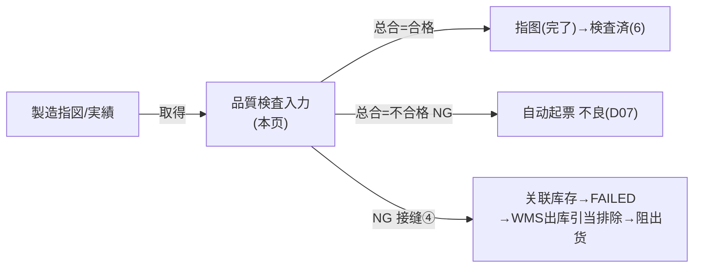
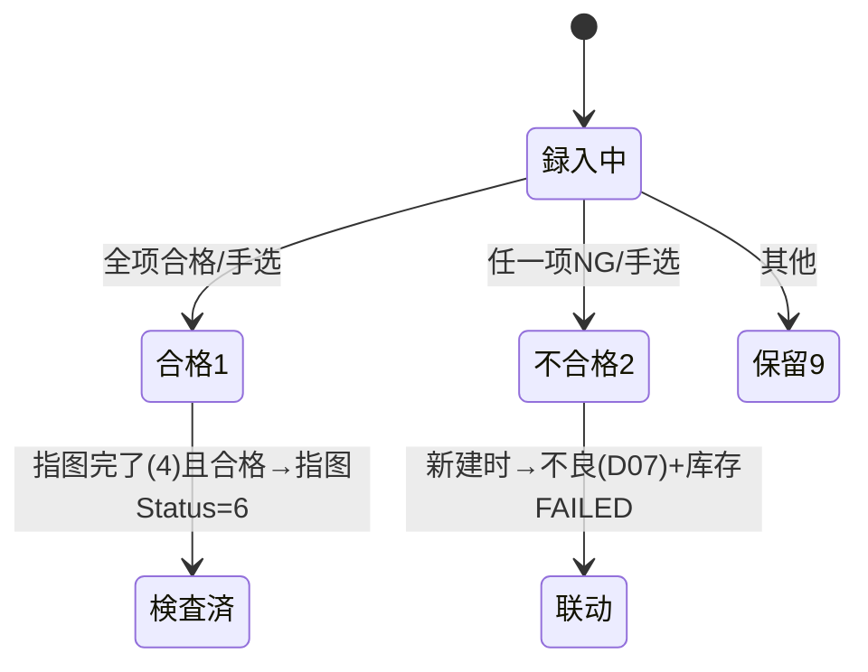

# 品質検査入力 单页面操作 SOP（手把手版）

> **用途**：给**品质检查员操作、培训老师讲、测试人员拆用例**。比模块总册（`02-生产管理MES` §5.7）更细。
> **页面**：品質検査入力（MSBBME060 · 生产管理 MES）　**路由**：`/mes/quality-inspection`（带 `?no=` 进訂正/改判）　**前端**：`views/mes/QualityInspectionEntryView.vue`　**API**：`api/mes/mes.ts qualityInspectionApi`　**后端**：`Mes/QualityInspectionController` → `QualityInspectionService`
> **基准**：分支 `feat/wfs-inbox-core`，2026-06-28；后端实测 `docs/codemap-mes/03-品質検査-不良.md`（2026-06-22 权威），UI 经 agent 实读 view。
> **样例数据**：指図 `WO2026070001`、模板 `TPL01`（尺寸/印刷/外観）、检查者 `OP01`、检查种类 最終、检查对象数 5000。

---

## 1. 页面一句话说明

**品質検査入力，就是录入一张质量检查单——填指图、引入检查模板（或手填项目）、对每个检查项填实测值（系统按上下限自动判合否），得出总合判定（合格/不合格/保留）；一旦判"不合格"，系统会自动起票一张不良记录、并把关联库存标成 FAILED，让它出不了货。** 它是制造过程的"质量门"。

---

## 2. 这个页面在业务流程中的位置

- **上游**：製造指図/実績（完工后多做最終检查）、检查模板主数据。
- **本页**：录检查、判合否、（NG）处置。
- **下游（仅新建判 NG 时）**：自动不良记录、库存 FAILED 阻出货；合格则指图（完了态）转検査済。

---

## 3. 谁使用这个页面

| 角色 | 用途 |
|---|---|
| 品质检查员 | 录检查、判合否、选处置 |
| 品质主管 | 复核/改判（注意改判不联动） |

---

## 4. 操作前准备

- [ ] 目标指图存在（通常完工后检查）。
- [ ] 检查模板 `TPL01` 已建（可一键引入项目），或准备手动加项目。
- [ ] 明确检查种类（默认 3 最終）、检查者CD。
- [ ] 知道各项的规格值/上下限（决定自动判定）。

---

## 5. 页面区域说明

| 区域 | 内容 |
|---|---|
| 卡片头 | 操作种别(新規/訂正) + 标题「品質検査入力 (MSBBME060)」+ 検査NO + 总合判定彩标 + 戻る |
| 基本情報区 | 指図NO(放大镜带出製品/工程) / 工程CD / 検査日 / 検査種類 / 検査者CD·名 / テンプレートCD + 引入按钮 / 検査対象数量 / サンプル数 / 製品情報(只读) |
| 検査項目区 | 动态标题「合格 x / 全 y、合格率 z%」+ 可编辑项目明细表 |
| 総合判定区 | 総合判定 / 処置内容 / 判定理由 / 備考 |
| 底部 | 保存 |

---

## 6. 字段填写说明（口语版）

**基本情報**

| 字段 | 怎么填 | 填错影响 |
|---|---|---|
| 指図NO | 填后点放大镜带出製品/工程（必填级）；编辑态禁改 | 空→`ME-MSG-020` |
| 工程CD | 载入指图后从下拉选 | — |
| 検査日 | 默认今天 | — |
| 検査種類 | 1受入/2工程内/3最終/4出荷前（默认 3 最終） | — |
| 検査者CD | 必填 | 空→`ME-MSG-021` |
| テンプレートCD | 选后点「テンプレ引入」拉项目 | — |
| 検査対象数量 | 空则带出指图 completedQty | — |

**検査項目行**：項目名/方法/規格値/下限/上限/計測値(录入触发自动判定)/計測文字/単位/判定(1合格/2不合格/9保留)/備考。

**総合判定区**：

| 字段 | 怎么填 | 填错影响 |
|---|---|---|
| 総合判定 | 留空自动判（也可手选 1合格/2不合格/9保留） | — |
| 処置内容 | **总合=2 不合格时必填**：1手直し/2特別採用/3返品/4廃棄 | 缺→`ME-MSG-023`；仅总合=2 时启用 |
| 判定理由/備考 | 可空 | — |

---

## 7. 按钮操作说明

| 按钮 | 点了会怎样 | 影响 |
|---|---|---|
| 放大镜（指図NO 后） | 带出製品/工程；NO 空时禁用 | 否 |
| テンプレ引入 | 把模板项目拉进明细；未选模板禁用、模板无项目 warning | 否 |
| 項目追加 | 加一行检查项 | 否 |
| 全項目 自動判定 | 逐行判定→推总合（任一NG→总合NG，全合→合格，否则保留） | 否 |
| 削除（行） | 删检查项 | 否 |
| 保存 | create/update；**新建判 NG→联动起票不良+标库存 FAILED** | **落库 +（NG 新建时）联动** |

---

## 8. 标准业务操作 SOP（照着点）

### 场景一：模板引入 + 合格（主流程）
- **背景**：完工后做最終检查，全部合格。
- **样例数据**：指図 `WO2026070001`、模板 `TPL01`、检查者 `OP01`。
- **前置**：指图存在；模板已建。
- **步骤**：1) 填指图NO→放大镜带出製品；2) 选 `TPL01`→「テンプレ引入」；3) 各项填計測値（在上下限内，自动判合格）；4) 「全項目 自動判定」→总合=合格；5) 保存。
- **完成后检查**：生成検査NO；若指图为完了(4)且合格→指图转検査済(6)。
- **异常**：无指图→`ME-MSG-020`；无检查者→`ME-MSG-021`；有未录项目→`ME-MSG-022`（仅 warning，仍可保存）。
- **用例**：TC-M05-QI-002~007。

### 场景二：判 NG 触发联动（核心）
- **背景**：某检查项超限，判不合格。
- **步骤**：1) 引入模板/手填项目；2) 某项計測値超上下限→自动判 2 不合格；3) 总合=2；4) 选処置（如 3 返品）；5) 保存。
- **完成后检查**：① 同事务自动起票不良 `DF…`（CategoryCd=`D07` 硬编码、`InspectionNo` 回填关联）；② 提交后关联库存 `QcStatus=FAILED`；③ 到不良管理看 `DF…`、到 WMS 在庫照会看 FAILED、WMS 出库引当排除该库存。
- **异常**：总合=2 不选处置→`ME-MSG-023`。
- **用例**：TC-M05-QI-008~012。

### 场景三：手动加项目（不用模板）
- **步骤**：「項目追加」逐行填 項目名/规格/上下限/計測値。
- **检查**：自动判定按上下限工作。
- **用例**：TC-M05-QI-013。

### 场景四：改判（注意不联动）
- **背景**：已存检查要改判。
- **步骤**：列表「詳細」进编辑→改判 NG→保存。
- **完成后检查**：⚠️ **Update 改判 NG 不补建不良、不标库存 FAILED**（联动仅在新建 Create 路径）；需人工补处理。
- **用例**：TC-M05-QI-014。

### 场景五：单项与总合自动判定
- **步骤**：录計測値（有上下限）→单项自动判；「全項目自動判定」推总合。
- **检查**：在 [下限,上限] 内→合格；否则不合格；无上下限有規格値→等于则合格。合格率标题实时更新。
- **用例**：TC-M05-QI-015~017。

---

## 9. 状态变化说明

---

## 10. 按钮不可用 / 灰色原因

| 现象 | 原因 |
|---|---|
| 放大镜灰 | 指図NO 为空 |
| テンプレ引入灰 | 未选模板 |
| 処置内容禁用 | 总合判定≠2 不合格（仅 NG 时启用） |
| 指図NO 禁改 | 编辑态（主键） |

---

## 11. 常见错误与处理

| 错误 | 原因 | 处理 |
|---|---|---|
| `ME-MSG-020` | 无指图NO | 填指图 |
| `ME-MSG-021` | 无检查者 | 填检查者CD |
| `ME-MSG-022`（warning） | 有项目未录判定 | 可继续，建议补全 |
| `ME-MSG-023` | NG 无处置 | 选处置内容 |
| NG 没建不良/没标 FAILED | 走了 Update 改判路径 | 联动仅新建；手工补 |
| 自动不良分类不对 | 硬编码 `D07` | 到不良管理改正确分类 |

---

## 12. 操作完成后的检查清单

- [ ] 合格：生成検査NO；指图(完了4)→検査済(6)。
- [ ] **NG（新建）**：① 不良管理出现 `DF…`（D07、InspectionNo 可溯源 QC）；② WMS 在庫照会该批 `QcStatus=FAILED`；③ WMS 出库引当排除（阻出货）。
- [ ] 改判（Update）：**不**联动，需人工处理不良与库存。

---

## 13. 页面级测试用例（≥25 条，可执行）

> 编号 `TC-M05-QI-xxx`；数据用样例。

| 用例编号 | 用例名称 | 优先级 | 前置条件 | 测试数据 | 操作步骤 | 预期结果 | 下游检查 | 备注 |
|---|---|---|---|---|---|---|---|---|
| TC-M05-QI-001 | 页面打开默认新規 | P1 | 有权限 | — | 进入 | 新規态、检査NO 空 | — | — |
| TC-M05-QI-002 | 放大镜带出製品 | P1 | 指图存在 | WO2026070001 | 填NO→放大镜 | 带出製品CD/名+工程下拉 | — | — |
| TC-M05-QI-003 | 模板引入项目 | P1 | 模板存在 | TPL01 | 选模板→引入 | 项目填入明细 | — | — |
| TC-M05-QI-004 | 单项自动判定(上下限) | P1 | 有上下限 | 計測値在区间 | 录計測値 | 判定→合格/超限不合格 | — | — |
| TC-M05-QI-005 | 全項目自動判定 | P1 | 多项 | — | 点全項目自動判定 | 任一NG→总合NG、全合→合格 | — | — |
| TC-M05-QI-006 | 合格率统计 | P2 | 有判定 | — | 改判定 | 标题「合格x/全y、合格率z%」实时 | — | — |
| TC-M05-QI-007 | 合格保存→検査済 | P0 | 指图完了(4) | 全合格 | 保存 | 生成検査NO；指图→検査済(6) | 指图状态 | — |
| TC-M05-QI-008 | NG 自动起票不良 | P0 | NG | 总合=2+处置 | 保存 | 自动 DF…(D07,InspectionNo回填) | 不良管理 | 接缝④ |
| TC-M05-QI-009 | NG 标库存 FAILED | P0 | NG+关联库存 | 总合=2 | 保存 | 关联库存 QcStatus=FAILED | WMS在庫照会 | 接缝④ |
| TC-M05-QI-010 | FAILED 阻出货 | P0 | 库存FAILED | — | WMS出库引当 | FAILED 被排除不可出货 | WMS出库 | 接缝④ |
| TC-M05-QI-011 | NG 无处置拦截 | P0 | NG | 总合=2/无处置 | 保存 | ME-MSG-023 | 不落库 | — |
| TC-M05-QI-012 | 处置仅NG启用 | P2 | 总合≠2 | — | 看处置下拉 | 禁用 | — | — |
| TC-M05-QI-013 | 手动加项目 | P1 | — | 手填项目 | 項目追加→填 | 可判定保存 | — | — |
| TC-M05-QI-014 | Update改判不联动 | P1 | 已存检查 | 改判NG | 詳細→改判→保存 | 不补建不良/不标FAILED | — | 重要 |
| TC-M05-QI-015 | 无指图NO | P0 | 新建 | 空指图 | 保存 | ME-MSG-020 | 不落库 | — |
| TC-M05-QI-016 | 无检查者 | P0 | 新建 | 空检查者 | 保存 | ME-MSG-021 | 不落库 | — |
| TC-M05-QI-017 | 未录项目warning | P1 | 有空项目 | — | 保存 | ME-MSG-022(warning,仍保存) | — | — |
| TC-M05-QI-018 | 检查对象数带出 | P2 | 指图有完成 | — | 取得后看对象数 | 空则带出 completedQty | — | — |
| TC-M05-QI-019 | 检查种类默认 | P2 | 新建 | — | 看检查种类 | 默认 3 最終 | — | — |
| TC-M05-QI-020 | 总合彩标 | P3 | 有总合 | — | 看卡片头 | 合格绿/不合格红/保留橙 | — | UI |
| TC-M05-QI-021 | 项目删除 | P2 | 有项目 | — | 行删除 | 行消失、合格率重算 | — | — |
| TC-M05-QI-022 | 一覧检索 | P1 | 有检查 | 指图NO/种类/总合/日期 | 検索 | 命中 | — | 列表页 |
| TC-M05-QI-023 | 一覧合格率进度条 | P1 | 有检查 | — | 看列表 | el-progress 合格率 | — | — |
| TC-M05-QI-024 | 一覧詳細改判 | P1 | 有检查 | 検査NO | 詳細 | 跳 /mes/quality-inspection?no= 编辑 | — | — |
| TC-M05-QI-025 | 一覧CSV | P1 | 有结果 | — | CSV出力 | 与查询一致 | — | — |
| TC-M05-QI-026 | 无上下限按规格值判 | P2 | 项目无上下限 | 計測値=规格 | 录值 | 等于→合格 | — | — |
| TC-M05-QI-027 | 自动不良分类D07 | P1 | NG | — | 看自动不良 | CategoryCd=D07(待人工调) | 不良管理 | — |
| TC-M05-QI-028 | 权限不足 | P2 | 无权账号 | — | 进/保存 | 待业务确认(隐藏/拒绝) | — | 权限 |
| TC-M05-QI-029 | 网络异常 | P2 | 断网 | — | 保存 | 友好错误可重试 | — | — |

---

## 14. 培训讲解建议

| 顺序 | 讲什么 | 演示 | 易误解点 |
|---|---|---|---|
| 1 | 这页是质量门 | §2 流程图 | 以为只是记录 |
| 2 | 模板引入省事 | 选模板→引入 | 手动一条条加 |
| 3 | 上下限自动判 | 录計測値看判定 | 手动改判定列 |
| 4 | NG 会连锁反应 | NG 后看不良+库存FAILED | 以为只是标记 |
| 5 | NG 必须填处置 | 演示 ME-MSG-023 | 漏处置 |
| 6 | 改判不联动 | 讲 Update vs Create | 以为改判也会建不良 |

---

## 15. 与模块级手册的关系

对应 `02-生产管理MES-...md` §5.7（含 5.7.1a~1e）。模块测试矩阵 §7（M05-010~012）、可执行用例 §7.1（TC-M05-006/007/008）、验收 §8（AC-M05-06/07）。

---

## 16. 代码与文档来源

| 层 | 文件 |
|---|---|
| 逐行源码手册 | `docs/codemap-mes/03-品質検査-不良.md`（权威） |
| 前端 | `views/mes/QualityInspectionEntryView.vue`、`QualityInspectionListView.vue` |
| API/类型 | `api/mes/mes.ts`(qualityInspectionApi)、`types/mes/mes.ts`(INSPECTION_TYPE/OVERALL_RESULT/DISPOSITION/ITEM_RESULT_OPTIONS) |
| 后端 | `Mes/QualityInspectionController.cs`、`Services/Mes/QualityInspectionService.cs`(Create/AutoJudge/**NG建不良+标库存**) |
| 接缝④ | `StockQcService.MarkLinkedStockByWorkOrderAsync`、`OutboundService.FindCandidateStockAsync`(滤 FAILED) |
| 实体/DTO | `DomainModels/Mes/QualityInspection.cs`/`QualityInspectionItem.cs`/`InspectionTemplate.cs`/`DefectRecord.cs`、`DTOs/Mes/QualityInspectionDto.cs` |

---

## 最后更新来源

- 代码：见 §16（codemap-mes 03 + view 实读 + types 枚举）。
- 基准：分支 `feat/wfs-inbox-core`，2026-06-28（codemap 2026-06-22）。
- 覆盖：16 节 / 5 场景 / 29 用例（TC-M05-QI-001~029）。
