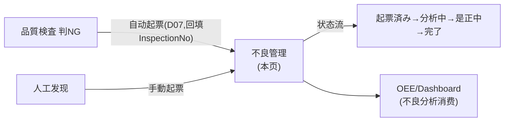
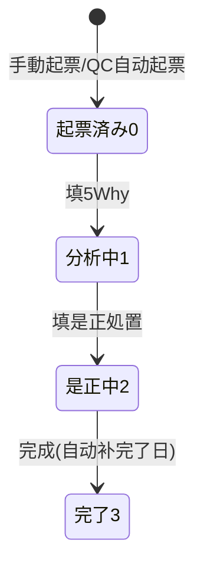

# 不良管理 单页面操作 SOP（手把手版）

> **用途**：给**品质/工艺操作、培训老师讲、测试人员拆用例**。对应模块总册（`02-生产管理MES` §5.9）。
> **页面**：不良管理（MSBBME080 · 生产管理 MES）　**路由**：`/mes/defect`　**前端**：`views/mes/DefectManagementView.vue`　**API**：`api/mes/mes.ts defectRecordApi`　**后端**：`Mes/DefectRecordController` → `DefectRecordService`
> **基准**：分支 `feat/wfs-inbox-core`，2026-06-28；后端实测 `docs/codemap-mes/03-品質検査-不良.md`，UI 经 agent 实读 view。
> **样例数据**：不良 `DF2026070001`、指図 `WO2026070001`、分类 `D07`「検査由来・その他」、不良数 200。

---

## 1. 页面一句话说明

**不良管理，就是记录与跟踪"做坏了的品"——可以手动起票一张不良记录，也可能由品質検査判 NG 自动起票（分类硬编码 D07，可溯源到检查单）；填大/小分类、不良数、不良内容，再做原因分析(5Why)、是正処置，按"起票済み→分析中→是正中→完了"推进状态。** 它是质量改善的闭环载体。

---

## 2. 这个页面在业务流程中的位置

- **上游**：品質検査 NG（自动）/ 人工起票。
- **本页**：起票/分析/是正/状态推进。
- **下游**：不良数据被 OEE/Dashboard 不良分析消费。

---

## 3. 谁使用这个页面

| 角色 | 用途 |
|---|---|
| 品质检查员 | 起票不良、补全分类 |
| 工艺/改善担当 | 原因分析(5Why)、是正処置、推状态 |

---

## 4. 操作前准备

- [ ] 不良分类主数据已建（大/小分类，如 `D07`）。
- [ ] 关联指图/检查NO（QC 自动起票会带 `InspectionNo`）。

---

## 5. 页面区域说明

| 区域 | 内容 |
|---|---|
| 检索卡 | inline 表单：不良NO/指図NO/大分類/小分類(级联)/担当者CD/発生日 From-To/ステータス(多选) + 検索/クリア/手動起票/CSV出力 |
| 列表卡 | 合计标签 + 表格(max-height600，左固定不良NO、右固定操作) + 分页 |
| 編集/起票弹窗 | 800px；标题随 有无不良NO=「不良品 編集」/「不良品 手動起票」 |

---

## 6. 字段填写说明（口语版）

**检索条件**：不良NO/指図NO/大分類(change 清空小分類)/小分類(按大分类过滤)/担当者CD/発生日 From-To/ステータス(复选组：起票済み/分析中/是正中/完了)。

**弹窗字段**：

| 字段 | 怎么填 | 填错影响 |
|---|---|---|
| 指図NO | 必填；编辑态禁改 | 空→"指図NOを入力してください" |
| 工程CD | 可空 | — |
| 発生日 | 默认今天 | — |
| 発見者CD | 可空 | — |
| 不良大分類 | 必填；change 清空小分類 | 空→`ME-MSG-030` |
| 不良小分類 | 按大分类过滤 | — |
| 不良数 | 必填，≥0（如 200） | — |
| ステータス | 0起票済み/1分析中/2是正中/3完了（默认0）；置 3 且无完了日→自动补 | — |
| 不良内容 | 必填，多行 | 空→`ME-MSG-031` |
| 原因分析(5Why)/是正処置 | 多行，可空 | — |
| 担当者CD/処置期限/完了日 | 可空 | — |
| 検査NO | 编辑态禁改（QC 自动起票溯源） | — |
| 備考 | 可空 | — |

---

## 7. 按钮操作说明

| 按钮 | 点了会怎样 | 影响 |
|---|---|---|
| 検索 | 按条件查询 | 否 |
| クリア | 重置并重查 | 否 |
| 手動起票 | 打开空弹窗新建 | — |
| CSV出力 | 导出当前结果（BOM+17列；空结果 warning） | 否 |
| 編集（行） | 拉详情进弹窗编辑 | — |
| 削除（行） | 确认→**软删**→重查 | **软删** |
| 保存（弹窗） | create/update | **落库** |
| キャンセル（弹窗） | 关闭 | — |

---

## 8. 标准业务操作 SOP（照着点）

### 场景一：手动起票不良（主流程）
- **背景**：现场人工发现不良。
- **样例数据**：指図 `WO2026070001`、大分类 `D07`、不良数 200、内容"印刷ズレ"。
- **步骤**：1)「手動起票」；2) 填指図NO+大分类(级联选小分类)+不良数+不良内容；3) 保存。
- **完成后检查**：生成不良NO（`DF…`）；列表出现、状态=起票済み(0)。
- **异常**：无指图NO→提示；无大分类→`ME-MSG-030`；无不良内容→`ME-MSG-031`。
- **用例**：TC-M05-DEFECT-002~005。

### 场景二：QC 自动起票后人工补全
- **背景**：品質検査判 NG 自动生成的不良（分类 D07）需补正。
- **步骤**：检索（或按検査NO）找到自动单→「編集」→改正确分类+填 5Why/是正処置→保存。
- **检查**：CategoryCd 由 D07 改为正确分类；`InspectionNo` 可溯源到 QC 单。
- **用例**：TC-M05-DEFECT-006、007。

### 场景三：状态推进（改善闭环）
- **步骤**：起票済み→编辑置「分析中」(填5Why)→「是正中」(填是正処置)→「完了」。
- **检查**：置「完了(3)」且无完了日→系统自动补完了日。
- **用例**：TC-M05-DEFECT-008、009。

### 场景四：大小分类级联
- **步骤**：检索区/弹窗 大分类 change。
- **检查**：小分类清空、按大分类过滤。
- **用例**：TC-M05-DEFECT-010。

### 场景五：按状态多选检索
- **步骤**：ステータス 勾 分析中+是正中→検索。
- **检查**：仅这两类（状态 tag 着色）。
- **用例**：TC-M05-DEFECT-011。

### 场景六：删除不良（软删）
- **步骤**：行「削除」→确认。
- **检查**：软删（IsDeleted=true），列表消失。
- **用例**：TC-M05-DEFECT-012。

---

## 9. 状态变化说明

---

## 10. 按钮不可用 / 灰色原因

| 现象 | 原因 |
|---|---|
| 指図NO/検査NO 编辑禁改 | 编辑态主键/溯源字段 |
| 小分类下拉空 | 未选大分类（级联） |

---

## 11. 常见错误与处理

| 错误 | 原因 | 处理 |
|---|---|---|
| "指図NOを入力してください" | 无指图NO | 填指图 |
| `ME-MSG-030` | 无大分类 | 选大分类 |
| `ME-MSG-031` | 无不良内容 | 填内容 |
| 自动单分类是 D07 | QC 自动起票硬编码 | 人工改正确分类 |
| 完了没补日期 | 仅置 Status=3 且原无完了日才自动补 | 检查状态 |

---

## 12. 操作完成后的检查清单

- [ ] 起票生成 `DF…`、列表出现、状态正确。
- [ ] QC 自动单可经 `InspectionNo` 溯源到检查单、分类初值 D07。
- [ ] 置完了态自动补完了日。
- [ ] 删除软删、列表消失。

---

## 13. 页面级测试用例（≥25 条，可执行）

> 编号 `TC-M05-DEFECT-xxx`。

| 用例编号 | 用例名称 | 优先级 | 前置条件 | 测试数据 | 操作步骤 | 预期结果 | 下游检查 | 备注 |
|---|---|---|---|---|---|---|---|---|
| TC-M05-DEFECT-001 | 页面打开 | P1 | 有权限 | — | 进入 | 检索区+列表(先拉分类) | — | — |
| TC-M05-DEFECT-002 | 手動起票 | P0 | 主数据齐 | WO/D07/200 | 起票→填→保存 | 生成DF…、状态0 | — | 核心 |
| TC-M05-DEFECT-003 | 无指图NO | P0 | 起票 | 空指图 | 保存 | "指図NOを入力してください" | 不落库 | — |
| TC-M05-DEFECT-004 | 无大分类 | P0 | 起票 | 空大分类 | 保存 | ME-MSG-030 | 不落库 | — |
| TC-M05-DEFECT-005 | 无不良内容 | P0 | 起票 | 空内容 | 保存 | ME-MSG-031 | 不落库 | — |
| TC-M05-DEFECT-006 | QC自动单溯源 | P1 | QC NG产生 | 自动DF | 编辑看検査NO | InspectionNo 溯源QC、分类D07 | 品質検査 | — |
| TC-M05-DEFECT-007 | 自动单改正确分类 | P1 | 自动DF | 改分类 | 编辑→改→保存 | CategoryCd 更新 | — | — |
| TC-M05-DEFECT-008 | 状态推进 | P1 | 有不良 | 0→1→2→3 | 编辑改状态 | 状态流转 | — | — |
| TC-M05-DEFECT-009 | 完了自动补日期 | P1 | 无完了日 | 置完了 | 编辑置3保存 | 自动补完了日 | — | — |
| TC-M05-DEFECT-010 | 大小分类级联 | P1 | — | 改大分类 | change | 小分类清空+过滤 | — | — |
| TC-M05-DEFECT-011 | 状态多选检索 | P0 | 各状态 | 勾分析中+是正中 | 検索 | 仅两类 | — | — |
| TC-M05-DEFECT-012 | 删除软删 | P1 | 有不良 | DF号 | 削除→确认 | 软删消失 | IsDeleted=true | — |
| TC-M05-DEFECT-013 | 按指図检索 | P0 | 有不良 | WO2026070001 | 検索 | 命中 | — | — |
| TC-M05-DEFECT-014 | 按不良NO检索 | P1 | 有不良 | DF2026070001 | 検索 | 命中 | — | — |
| TC-M05-DEFECT-015 | 按大/小分类检索 | P1 | 有不良 | D07 | 検索 | 命中 | — | — |
| TC-M05-DEFECT-016 | 按担当者检索 | P2 | 有不良 | 担当CD | 検索 | 命中 | — | — |
| TC-M05-DEFECT-017 | 按発生日区间 | P1 | 有不良 | From-To | 検索 | 区间内 | — | — |
| TC-M05-DEFECT-018 | 编辑指図NO禁改 | P2 | 有不良 | — | 编辑 | 指図NO/検査NO 禁改 | — | — |
| TC-M05-DEFECT-019 | 不良数填写 | P1 | 起票 | 200 | 填不良数 | ≥0 落库 | — | — |
| TC-M05-DEFECT-020 | 5Why/是正処置 | P2 | 编辑 | 文本 | 填多行 | 落库 | — | — |
| TC-M05-DEFECT-021 | 状态 tag 着色 | P2 | 各状态 | — | 看状态列 | 起票灰/分析蓝/是正橙/完了绿 | — | — |
| TC-M05-DEFECT-022 | CSV 一致 | P1 | 有结果 | 当前条件 | CSV出力 | 内容=结果(17列BOM) | — | — |
| TC-M05-DEFECT-023 | CSV 空结果 | P2 | 无结果 | 不存在 | CSV出力 | warning | — | — |
| TC-M05-DEFECT-024 | 検査NO列溯源 | P2 | QC自动单 | — | 看検査NO列 | 显来源QC单 | — | — |
| TC-M05-DEFECT-025 | クリア重置 | P2 | 已填条件 | — | クリア | 重置并重查 | — | — |
| TC-M05-DEFECT-026 | 分页 | P1 | 多数据 | 10/20/50/100 | 翻页 | 数据正确 | — | — |
| TC-M05-DEFECT-027 | 空结果 | P1 | — | 不存在 | 検索 | 列表空 | — | — |
| TC-M05-DEFECT-028 | 弹窗取消不保存 | P2 | 编辑中 | — | キャンセル | 不落库 | — | — |
| TC-M05-DEFECT-029 | 本页无自动判定/处置下拉 | P2 | — | — | 看弹窗 | 无DISPOSITION(那是QC页) | — | 区别 |
| TC-M05-DEFECT-030 | 权限不足 | P2 | 无权账号 | — | 进/起票 | 待业务确认(隐藏/拒绝) | — | 权限 |
| TC-M05-DEFECT-031 | 网络异常 | P2 | 断网 | — | 检索/保存 | 友好错误可重试 | — | — |

---

## 14. 培训讲解建议

| 顺序 | 讲什么 | 演示 | 易误解点 |
|---|---|---|---|
| 1 | 这是不良记录与改善 | §2 流程图 | 以为只记录 |
| 2 | 手动 vs QC 自动起票 | 起票+看自动单 | 自动单分类是 D07 |
| 3 | 大小分类级联 | 改大分类 | — |
| 4 | 状态流 0→3 | 推状态 | 完了自动补日期 |
| 5 | 5Why/是正 | 填分析 | 与 QC 处置(DISPOSITION)不同 |
| 6 | 删除软删 | 删除 | — |

---

## 15. 与模块级手册的关系

对应 `02-生产管理MES-...md` §5.9。模块测试矩阵 §7（M05-013）、验收 §8（AC-M05-08）。

---

## 16. 代码与文档来源

| 层 | 文件 |
|---|---|
| 逐行源码手册 | `docs/codemap-mes/03-品質検査-不良.md`（不良段） |
| 前端 | `views/mes/DefectManagementView.vue` |
| API/类型 | `api/mes/mes.ts`(defectRecordApi)、`types/mes/mes.ts`(DEFECT_STATUS_OPTIONS) |
| 后端 | `Mes/DefectRecordController.cs`、`Services/Mes/DefectRecordService.cs`(CRUD+通知+Enrich+完了日自动补) |
| 实体 | `DomainModels/Mes/DefectRecord.cs`(CauseAnalysis/CorrectiveAction)、`DefectCategory.cs`(M_DefectCategory 复合PK) |

---

## 最后更新来源

- 代码：见 §16。基准：`feat/wfs-inbox-core`，2026-06-28（codemap 2026-06-22）。
- 覆盖：16 节 / 6 场景 / 31 用例（TC-M05-DEFECT-001~031）。
