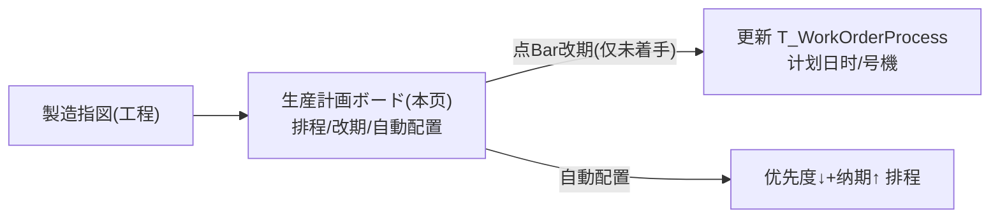

# 生産計画ボード 单页面操作 SOP（手把手版）

> **用途**：给**生产计划员操作、培训老师讲、测试人员拆用例**。对应模块总册（`02-生产管理MES` §5.10）。
> **页面**：生産計画ボード（ME010 · 生产管理 MES）　**路由**：`/mes/planning-board`　**前端**：`views/mes/PlanningBoardView.vue`　**API**：`api/mes/mes.ts planningBoardApi`　**后端**：`Mes/PlanningBoardController` → `PlanningBoardService`
> **基准**：分支 `feat/wfs-inbox-core`，2026-06-28；后端实测 `docs/codemap-mes/05-計画板-主数据-分析.md §一`，UI 经 agent 实读 view。
> **样例数据**：期間 今天-7~今天+14、号機 `MC01`、工程印刷(未着手)。

---

## 1. 页面一句话说明

**生産計画ボード，就是用甘特图把"哪台号機、什么时候、做哪个工程"排出来的看板——按号機分组显示工程 Bar（颜色随状态、优先度红/橙框、纳期红线、实绩绿叠条），点 Bar 可改计划日时/号機（只有"未着手"工程能改），还能"自動配置"按优先度+纳期自动排程。注意：它是 CSS 自绘看板（不是真拖拽），改期=点 Bar→弹窗→保存。**

---

## 2. 这个页面在业务流程中的位置

- **上游**：已展开指图的工程（`T_WorkOrderProcess`）。
- **本页**：可视化排程 + 改期 + 自動配置。
- **下游**：改期落库工程计划日时（影响现场执行顺序）。

---

## 3. 谁使用这个页面

| 角色 | 用途 |
|---|---|
| 生产计划员 | 排程、改期、自動配置、看 KPI/遅延 |
| 车间主管 | 监看负荷与遅延 |

---

## 4. 操作前准备

- [ ] 已有展开的指图工程数据。
- [ ] 工程的号機已设（否则归"(未設定)"组）。

---

## 5. 页面区域说明

| 区域 | 内容 |
|---|---|
| 検索+KPI 头卡 | inline 检索 + 5 KPI(総指図/着手中/完了/遅延+平均/完了率) |
| 凡例卡 | 状态色块 + 実績 overlay(半透明绿) + 納期ライン(红) |
| 甘特本体 | 左固定「号機/工程」+ 右日付刻度网格 + 按号機分组的 Bar |
| Bar 编辑弹窗(500px) | 指図NO(只读)/工程(只读)/号機CD(可改)/計画開始·完了日時(必填)/状態(只读) |

---

## 6. 字段填写说明

**检索条件**：拠点CD/期間(默认 今-7~今+14)/工程CD/WG/号機/ステータス(多选,默认勾[未着手0/着手中1/中断3])/表示単位(日/週/月)。
**改期弹窗**：

| 字段 | 怎么填 | 填错影响 |
|---|---|---|
| 指図NO/工程/状態 | 只读 | — |
| 号機CD | 可改派号機 | — |
| 計画開始日時/計画完了日時 | 必填；開始≤完了 | 空→"計画日時を入力してください"；開始>完了→`ME-MSG-003` |

---

## 7. 按钮操作说明

| 按钮 | 点了会怎样 | 影响 |
|---|---|---|
| 検索 | reload(bars+kpi) | 否 |
| クリア | 恢复默认并重载 | 否 |
| 自動配置 | confirm→按优先度↓+纳期↑排未着手工程→「{n}件」 | **改未着手工程计划日时** |
| 点击 Bar | 打开改期弹窗 | — |
| 保存（弹窗） | reschedule→「ME-MSG-041」 | **改期落库**（仅未着手） |
| キャンセル | 关闭 | — |

---

## 8. 标准业务操作 SOP（照着点）

### 场景一：查看甘特排程（主流程）
- **步骤**：设期間+号機→検索。
- **检查**：Bar 按号機分组、颜色随状态、优先度3红框/2橙框、纳期红线、有实绩则绿叠条；KPI 5 卡正确。
- **用例**：TC-M05-PB-002~004。

### 场景二：点 Bar 改期（仅未着手）
- **背景**：调整某未着手工程的计划时间/号機。
- **步骤**：点未着手工程 Bar→弹窗改计划開始/完了日時(或号機CD)→保存。
- **检查**：「ME-MSG-041」；Bar 移位；落库 `T_WorkOrderProcess`。
- **异常**：着手中工程 Bar 弹窗"保存"灰（`canEdit=processStatus===0`）；后端守卫 `ME-MSG-042`；開始>完了→`ME-MSG-003`。
- **用例**：TC-M05-PB-005~008。

### 场景三：自動配置
- **背景**：一键给未着手工程排程。
- **步骤**：「自動配置」→confirm「未着手の工程に対し優先度+納期で自動配置」→确定。
- **检查**：提示「{n}件の工程を自動配置しました」；未着手工程按 优先度降序→纳期升序→每号機时间游标朝 8 时首尾相接（LeadTime 日×8h 或默认 2h）。
- **用例**：TC-M05-PB-009、010。

### 场景四：状态/表示単位切换
- **步骤**：ステータス 多选过滤；表示単位 切 日/週/月。
- **检查**：刻度密度变（cellWidth 日60/週80/月32）。
- **用例**：TC-M05-PB-011、012。

### 场景五：遅延监看
- **步骤**：看 KPI「遅延」卡 + Bar 超纳期红线。
- **检查**：遅延数与平均遅延正确（PlanEndDate<today 且未完了/検査済）。
- **用例**：TC-M05-PB-013。

### 场景六：60 秒自动刷新
- **步骤**：停留页面。
- **检查**：每 60 秒自动 reload（无显式倒计时）。
- **用例**：TC-M05-PB-014。

---

## 9. 状态变化说明

本页不直接改工程业务状态（仅改计划日时/号機）。Bar 颜色映射 ProcessStatus（0未着手灰/1着手中橙/2完了绿/3中断红）；改期只放行未着手(0)。

---

## 10. 按钮不可用 / 灰色原因

| 现象 | 原因 |
|---|---|
| 弹窗"保存"灰 | `canEdit=processStatus!==0`（仅未着手可改期） |
| 甘特空 | bars 为空（el-empty「表示できる工程がありません」） |

---

## 11. 常见错误与处理

| 现象 | 原因 | 处理 |
|---|---|---|
| `ME-MSG-042` | 改非未着手工程 | 仅未着手可改期 |
| `ME-MSG-003` | 开始>结束 | 调日期 |
| 「計画日時を入力してください」 | 计划日时空 | 填日时 |
| 拖不动 Bar | 非真拖拽 | 点 Bar→弹窗改 |

---

## 12. 操作完成后的检查清单

- [ ] 改期后 Bar 移位、落库工程计划日时。
- [ ] 自動配置返回件数、未着手工程按规则排布。
- [ ] KPI/遅延显示正确。

---

## 13. 页面级测试用例（≥25 条，可执行）

> 编号 `TC-M05-PB-xxx`。

| 用例编号 | 用例名称 | 优先级 | 前置条件 | 测试数据 | 操作步骤 | 预期结果 | 下游检查 | 备注 |
|---|---|---|---|---|---|---|---|---|
| TC-M05-PB-001 | 页面打开 | P1 | 有权限 | — | 进入 | 检索+KPI+凡例+甘特 | — | — |
| TC-M05-PB-002 | 甘特按号機分组 | P1 | 有工程 | — | 検索 | Bar 按 machineCd 分组 | — | — |
| TC-M05-PB-003 | Bar 状态着色 | P2 | 各状态 | — | 看Bar | 颜色随 ProcessStatus | — | — |
| TC-M05-PB-004 | 优先度框/纳期线/实绩叠条 | P2 | 有数据 | — | 看Bar | 优先3红/2橙框、纳期红线、实绩绿叠 | — | — |
| TC-M05-PB-005 | 点未着手Bar改期 | P0 | 未着手工程 | 改日时 | 点Bar→改→保存 | ME-MSG-041、Bar移位 | T_WorkOrderProcess | 核心 |
| TC-M05-PB-006 | 着手中不可改期 | P0 | 着手中工程 | — | 点Bar | 保存灰(canEdit=false) | — | — |
| TC-M05-PB-007 | 后端改期守卫 | P1 | 着手中 | 绕前端 | reschedule | ME-MSG-042 | — | — |
| TC-M05-PB-008 | 开始>结束 | P1 | 改期 | 倒置 | 保存 | ME-MSG-003 | — | — |
| TC-M05-PB-009 | 自動配置 | P1 | 未着手工程 | — | 自動配置→确认 | 「{n}件」、按优先度+纳期排 | T_WorkOrderProcess | — |
| TC-M05-PB-010 | 自動配置只动未着手 | P1 | 混合状态 | — | 自動配置 | 仅未着手被排 | — | — |
| TC-M05-PB-011 | 状态多选过滤 | P1 | 各状态 | 勾选 | 検索 | 仅勾选状态Bar | — | — |
| TC-M05-PB-012 | 表示単位切换 | P2 | 有数据 | 日/週/月 | 切换 | 刻度密度变 | — | — |
| TC-M05-PB-013 | 遅延KPI | P1 | 有遅延 | — | 看KPI | 遅延数+平均遅延 | — | — |
| TC-M05-PB-014 | 60秒自动刷新 | P2 | — | — | 停留 | 每60秒reload | — | — |
| TC-M05-PB-015 | KPI 5卡 | P1 | 有数据 | — | 看KPI | 総指図/着手中/完了/遅延/完了率 | — | — |
| TC-M05-PB-016 | 完了率口径 | P2 | 有工程 | — | 看完了率 | 完了工程数/全工程数 | — | 口径① |
| TC-M05-PB-017 | 期间过滤重叠 | P1 | 有数据 | From-To | 検索 | 计划或实绩区间与范围重叠 | — | — |
| TC-M05-PB-018 | 号機改派 | P2 | 未着手 | 改号機CD | 弹窗改保存 | machineCd 更新 | — | — |
| TC-M05-PB-019 | 改号機后分组移动 | P2 | 改派后 | — | 重载 | Bar 移到新号機组 | — | — |
| TC-M05-PB-020 | 空甘特 | P1 | 无工程 | — | 検索 | el-empty 提示 | — | — |
| TC-M05-PB-021 | クリア重置 | P2 | 已改条件 | — | クリア | 恢复默认重载 | — | — |
| TC-M05-PB-022 | 凡例显示 | P3 | — | — | 看凡例 | 状态色+overlay+纳期线 | — | — |
| TC-M05-PB-023 | 行不存在/并发 | P2 | 改期 | 不存在id | reschedule | ME-MSG-043 | — | — |
| TC-M05-PB-024 | Bar hover 提示 | P3 | 有Bar | — | hover | 多行 title(指图/製品/工程/计划/实绩/进捗) | — | — |
| TC-M05-PB-025 | 自動配置游标朝8时 | P2 | 未着手 | — | 自動配置 | 每号機从8时首尾相接 | — | — |
| TC-M05-PB-026 | 工程CD/WG/拠点过滤 | P2 | 有数据 | 各条件 | 検索 | 命中 | — | — |
| TC-M05-PB-027 | 非真拖拽 | P3 | — | — | 试拖Bar | 拖不动(点Bar弹窗) | — | — |
| TC-M05-PB-028 | 权限不足 | P2 | 无权账号 | — | 进/改期 | 待业务确认(隐藏/拒绝) | — | 权限 |
| TC-M05-PB-029 | 网络异常 | P2 | 断网 | — | 検索/改期 | 友好错误可重试 | — | — |

---

## 14. 培训讲解建议

| 顺序 | 讲什么 | 演示 | 易误解点 |
|---|---|---|---|
| 1 | 甘特看排程 | §2 + 检索 | — |
| 2 | 颜色/框/线含义 | 看 Bar | 优先度框/纳期线 |
| 3 | 改期=点Bar弹窗 | 点未着手Bar | 以为能拖拽 |
| 4 | 仅未着手可改 | 演示着手中灰 | 改进行中工程 |
| 5 | 自動配置规则 | 自動配置 | 以为会动已着手 |

---

## 15. 与模块级手册的关系

对应 `02-生产管理MES-...md` §5.10。模块测试矩阵 §7（M05-014/015）、验收 §8（AC-M05-09）。

---

## 16. 代码与文档来源

| 层 | 文件 |
|---|---|
| 逐行源码手册 | `docs/codemap-mes/05-計画板-主数据-分析.md §一` |
| 前端 | `views/mes/PlanningBoardView.vue`(CSS甘特/calcLeftWidth/barStyle) |
| API/类型 | `api/mes/mes.ts`(planningBoardApi)、`types/mes/mes.ts`(PROCESS_STATUS_OPTIONS) |
| 后端 | `Mes/PlanningBoardController.cs`、`Services/Mes/PlanningBoardService.cs`(GetBars/Reschedule/AutoArrange/Kpi) |
| 实体 | `DomainModels/Mes/WorkOrderProcess.cs`(PlanStartTime/PlanEndTime/MachineCd) |

---

## 最后更新来源

- 代码：见 §16。基准：`feat/wfs-inbox-core`，2026-06-28（codemap 2026-06-22）。
- 覆盖：16 节 / 6 场景 / 29 用例（TC-M05-PB-001~029）。
