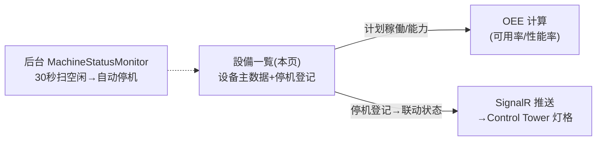

# 設備一覧 单页面操作 SOP（手把手版）

> **用途**：给**设备保全员操作、培训老师讲、测试人员拆用例**。对应模块总册（`02-生产管理MES` §5.12）。
> **页面**：設備一覧（Phase4 · 生产管理 MES）　**路由**：`/mes/machine-list`　**前端**：`views/mes/MachineListView.vue`　**API**：`api/mes/mes.ts machineApi`　**后端**：`Mes/MachineController` → `MachineService`
> **基准**：分支 `feat/wfs-inbox-core`，2026-06-28；后端实测 `docs/codemap-mes/04-設備-oee.md`，UI 经 agent 实读 view。
> **样例数据**：设备 `MC01` 印刷機、计划稼働 480 分/日、能力 1000 個/時、状态 稼働中。

---

## 1. 页面一句话说明

**設備一覧，就是设备主数据的维护页 + 稼働状态灯格看板——建/改设备（计划稼働分、能力、标准CT 是 OEE 计算的输入），看绿/红/黄/蓝/灰灯实时稼働状态，并登记停机（停机会联动设备状态并经 SignalR 推到大屏）。** 还有个后台 Worker 每 30 秒扫空闲设备自动停机。

---

## 2. 这个页面在业务流程中的位置

- **上游**：无。
- **本页**：设备 CRUD + 停机登记。
- **下游**：OEE（计划稼働/能力/停机）、Control Tower 灯格（SignalR 实时）。

---

## 3. 谁使用这个页面

| 角色 | 用途 |
|---|---|
| 设备保全员 | 建/改设备、登记停机 |
| 生产管理 | 看稼働状态灯格 |

---

## 4. 操作前准备

- [ ] 设备编码规则（如 `MC01`）。
- [ ] 知道计划稼働分/日（默认 480=8h）、能力(個/時)、标准CT(秒)——影响 OEE。

---

## 5. 页面区域说明

| 区域 | 内容 |
|---|---|
| 検索カード | inline：設備CD/工程CD/WG/状態(多选)/有効のみ |
| 設備稼働状態グリッド | 灯格看板（绿/红/黄/蓝/灰 + 指図 + OEE，整块可点=编辑） |
| 一覧表 | 設備CD/名/種別/工程/WG/状態(tag)/能力/计划稼働/本日OEE/現在指図/次回メンテ/有効/操作 |
| 設備編集/新規弹窗(700px) | 设备全字段（见 §6） |
| 設備停止登録弹窗(600px) | 停止区分/开始/结束/关联指图/担当/内容 |

---

## 6. 字段填写说明

**设备弹窗**：

| 字段 | 怎么填 | 填错影响 |
|---|---|---|
| 設備CD | 唯一编码；**编辑禁改** | 空→`ME-MSG-001`(复用)；重复→`ME-MSG-005`(裸码) |
| 設備名 | 必填 | 空→`ME-MSG-031`(复用) |
| 種別/工程CD/WG/拠点CD | 可空 | — |
| 計画稼働(分/日) | 默认 480（OEE 可用率分母） | — |
| 能力(個/時間) | OEE 性能率用；缺则性能率降级 | 缺失→性能率有产量记100% |
| 標準サイクル(秒) | 标准CT | — |
| 導入日/メンテ日/次回メンテ予定 | 日期 | — |
| メーカ/型番/備考 | 文本 | — |
| 状態 | 0停止/1稼働中/2故障/3メンテ/4段取り（新建默认0） | 编辑不覆写运行态 |
| 有効FLG | 开关（默认 true） | — |

**停机弹窗**：

| 字段 | 怎么填 | 填错影响 |
|---|---|---|
| 設備CD | 只读（从行带入） | — |
| 停止区分 | 1計画停止/2故障/3材料待ち/4作業者不在/9その他（默认2） | 联动状态 |
| 停止開始日時 | 必填，默认当前 | — |
| 停止終了日時 | 空=継続中 | — |
| 関連指図NO/担当者CD/停止内容 | 可空 | — |

---

## 7. 按钮操作说明

| 按钮 | 点了会怎样 | 影响 |
|---|---|---|
| 検索/クリア | 查询/重置重查 | 否 |
| 新規 | 打开空设备弹窗 | — |
| 編集（行/点灯格） | 打开带值弹窗 | — |
| 停止登録（行） | 打开停机弹窗 | — |
| 削除（行） | 确认→**软删** | **软删** |
| 保存（设备弹窗） | CD+名校验后 create/update | **落库** |
| 登録（停机弹窗） | 采番 `DT…`+联动状态+双推 SignalR | **建停机+改状态** |

---

## 8. 标准业务操作 SOP（照着点）

### 场景一：新建设备（主流程）
- **步骤**：「新規」→填 設備CD `MC01`+設備名+计划稼働480+能力1000→保存。
- **检查**：列表/灯格出现；状态默认 停止(0)灰灯。
- **异常**：CD 空→`ME-MSG-001`；名空→`ME-MSG-031`；CD 重复→`ME-MSG-005`(裸码)。
- **用例**：TC-M05-MC-002~005。

### 场景二：编辑设备
- **步骤**：行「編集」(或点灯格)→改能力/メンテ日→保存。
- **检查**：落库；設備CD/状態 不被覆写（编辑不改主键与运行态）。
- **用例**：TC-M05-MC-006、007。

### 场景三：停机登记（联动状态+SignalR）
- **背景**：设备故障停机。
- **步骤**：行「停止登録」→停止区分=故障(2)+开始时刻→登録。
- **检查**：采番 `DT…`；设备状态→故障(2)、灯红；Control Tower 经 SignalR 即时变红。停止终了空=継続中。
- **用例**：TC-M05-MC-008~010。

### 场景四：稼働状态灯格
- **步骤**：看灯格（绿稼働/红故障/黄メンテ/蓝段取り/灰停止 + 指図 + OEE）。
- **检查**：灯色映射正确；点灯格=编辑该设备。
- **用例**：TC-M05-MC-011、012。

### 场景五：检索过滤
- **步骤**：状態 多选 + 有効のみ→検索。
- **检查**：命中。
- **用例**：TC-M05-MC-013。

### 场景六：删除设备
- **步骤**：行「削除」→确认「設備 {CD} を削除しますか？」。
- **检查**：软删（无级联校验）。
- **用例**：TC-M05-MC-014。

---

## 9. 状态变化说明

设备状态 0停止/1稼働中/2故障/3メンテ/4段取り（灯色 灰/绿/红/黄/蓝）。停机登记联动：故障(2)→状态2；计划停止(1)→メンテ(3)；其他→停止(0)。后台 `MachineStatusMonitor` 每 30 秒扫空闲(10 分无实绩)→自动停止(0)+推 SignalR。

---

## 10. 按钮不可用 / 灰色原因

| 现象 | 原因 |
|---|---|
| 設備CD 编辑禁改 | 主键 |
| 保存报"設備CDと設備名は必須です" | CD/名空 |
| 找不到"状态切换"直接按钮 | `changeStatus` 端点存在但前端未挂入口 |
| 找不到停机一览/关闭 | `searchDowntimes`/`closeDowntime` 前端未挂（扩展预留） |

---

## 11. 常见错误与处理

| 错误 | 原因 | 处理 |
|---|---|---|
| `ME-MSG-001` | 設備CD 空（复用原义手配/製品CD） | 填 CD |
| `ME-MSG-031` | 設備名 空（复用原义不良内容） | 填名 |
| `ME-MSG-005`(裸码) | 設備CD 重复 | 改唯一 |
| 设备无故停机 | 后台 30 秒空闲监视自动停机 | 正常（10 分无实绩） |

---

## 12. 操作完成后的检查清单

- [ ] 列表/灯格出现/更新设备。
- [ ] 停机登记后灯色变（故障红/メンテ黄）、Control Tower 即时刷新（SignalR）。
- [ ] 计划稼働/能力填好（供 OEE 计算）。

---

## 13. 页面级测试用例（≥25 条，可执行）

> 编号 `TC-M05-MC-xxx`。

| 用例编号 | 用例名称 | 优先级 | 前置条件 | 测试数据 | 操作步骤 | 预期结果 | 下游检查 | 备注 |
|---|---|---|---|---|---|---|---|---|
| TC-M05-MC-001 | 页面打开 | P1 | 有权限 | — | 进入 | 检索+灯格+表格 | — | — |
| TC-M05-MC-002 | 新建设备 | P0 | — | MC01/480/1000 | 新規→填→保存 | 列表/灯格出现 | — | 核心 |
| TC-M05-MC-003 | CD空 | P0 | 新建 | 空CD | 保存 | ME-MSG-001 | 不落库 | — |
| TC-M05-MC-004 | 名空 | P0 | 新建 | 空名 | 保存 | ME-MSG-031 | 不落库 | — |
| TC-M05-MC-005 | CD重复 | P1 | 已有MC01 | MC01 | 新建保存 | ME-MSG-005(裸码) | 不落库 | — |
| TC-M05-MC-006 | 编辑保存 | P1 | 有设备 | 改能力 | 編集→改→保存 | 落库 | — | — |
| TC-M05-MC-007 | 编辑不覆写CD/状态 | P1 | 有设备 | — | 編集 | CD灰、状态不覆写 | — | — |
| TC-M05-MC-008 | 停机登记 | P0 | 有设备 | 故障(2)+开始 | 停止登録→登録 | 采番DT…+状态→故障 | — | — |
| TC-M05-MC-009 | 停机联动状态 | P1 | 各区分 | 1/2/其他 | 登録 | 故障→2/计划→3メンテ/其他→0 | — | — |
| TC-M05-MC-010 | 停机推SignalR | P1 | 开ControlTower | 故障停机 | 登録 | 大屏灯格即时变红 | Control Tower | 实时 |
| TC-M05-MC-011 | 灯色映射 | P2 | 各状态 | — | 看灯格 | 灰绿红黄蓝对应0~4 | — | — |
| TC-M05-MC-012 | 点灯格编辑 | P2 | 有设备 | — | 点灯格 | 打开编辑弹窗 | — | — |
| TC-M05-MC-013 | 状态多选+有効过滤 | P1 | 有数据 | 勾状态 | 検索 | 命中 | — | — |
| TC-M05-MC-014 | 删除软删 | P1 | 有设备 | MC01 | 削除→确认 | 软删消失 | — | — |
| TC-M05-MC-015 | 灯格显示指図/OEE | P2 | 有现役指图 | — | 看灯格 | 显示 指図 + OEE% | — | — |
| TC-M05-MC-016 | 一覧本日OEE列 | P2 | 有OEE | — | 看列 | 本日OEE% 或 `-` | — | — |
| TC-M05-MC-017 | 现在指図列 | P2 | 有现役 | — | 看列 | currentWorkOrderNo 或 `-` | — | — |
| TC-M05-MC-018 | 计划稼働默认480 | P2 | 新建 | 空 | 看字段 | 默认 480 | — | — |
| TC-M05-MC-019 | 停机终了空=継続中 | P2 | 停机 | 空终了 | 登録 | 継続中 | — | — |
| TC-M05-MC-020 | 后台空闲自动停机 | P2 | 稼働中无实绩 | — | 等待30秒Worker | 自动→停止(0)+推SignalR | — | Worker |
| TC-M05-MC-021 | changeStatus无前端入口 | P3 | — | — | 找切换按钮 | 端点存在但未挂入口 | — | 现状 |
| TC-M05-MC-022 | 停机一览/关闭无入口 | P3 | — | — | 找停机一览 | 未挂(扩展预留) | — | 现状 |
| TC-M05-MC-023 | 状态tag着色(表) | P2 | 各状态 | — | 看状态列 | dark tag 背景=状态色 | — | — |
| TC-M05-MC-024 | 有効FLG列 | P2 | — | — | 看有効列 | true 绿Check | — | — |
| TC-M05-MC-025 | 能力缺失影响OEE | P1 | 设备无能力 | null | 看OEE | 性能率降级(有产量100%) | OEE | 下游 |
| TC-M05-MC-026 | 取消不保存 | P2 | 弹窗 | — | キャンセル | 不落库 | — | — |
| TC-M05-MC-027 | 删除确认文案 | P3 | 有设备 | — | 削除 | 「設備 {CD} を削除しますか？」 | — | — |
| TC-M05-MC-028 | 灯格闪烁 | P3 | — | — | 看灯格 | 白点 blink(纯CSS,全闪) | — | — |
| TC-M05-MC-029 | 权限不足 | P2 | 无权账号 | — | 进/操作 | 待业务确认(隐藏/拒绝) | — | 权限 |
| TC-M05-MC-030 | 网络异常 | P2 | 断网 | — | 检索/保存 | 友好错误可重试 | — | — |

---

## 14. 培训讲解建议

| 顺序 | 讲什么 | 演示 | 易误解点 |
|---|---|---|---|
| 1 | 设备主数据+灯格 | 检索+灯格 | — |
| 2 | 计划稼働/能力影响OEE | 填字段 | 能力缺→性能降级 |
| 3 | 停机登记联动状态 | 故障停机 | 联动状态+SignalR |
| 4 | 自动空闲停机 | 讲 Worker | 以为系统故障 |
| 5 | CD 禁改 | 编辑 | 改主键 |

---

## 15. 与模块级手册的关系

对应 `02-生产管理MES-...md` §5.12。模块测试矩阵 §7（M05-016）。

---

## 16. 代码与文档来源

| 层 | 文件 |
|---|---|
| 逐行源码手册 | `docs/codemap-mes/04-設備-oee.md`（设备/停机段） |
| 前端 | `views/mes/MachineListView.vue` |
| API/类型 | `api/mes/mes.ts`(machineApi)、`types/mes/mes.ts`(MACHINE_STATUS/DOWNTIME_TYPE_OPTIONS) |
| 后端 | `Mes/MachineController.cs`、`Services/Mes/MachineService.cs`(Create/Update/Delete/RegisterDowntime 联动+SignalR) |
| 后台 | `BackgroundServices/MachineStatusMonitor.cs`(30秒空闲→自动停机+SignalR) |
| 实体 | `DomainModels/Mes/Machine.cs`(M_Machine, PlannedRunMinutesPerDay/CapacityPerHour/StandardCycleSec)/`MachineDowntime.cs` |

---

## 最后更新来源

- 代码：见 §16。基准：`feat/wfs-inbox-core`，2026-06-28（codemap 2026-06-22）。
- 覆盖：16 节 / 6 场景 / 30 用例（TC-M05-MC-001~030）。
