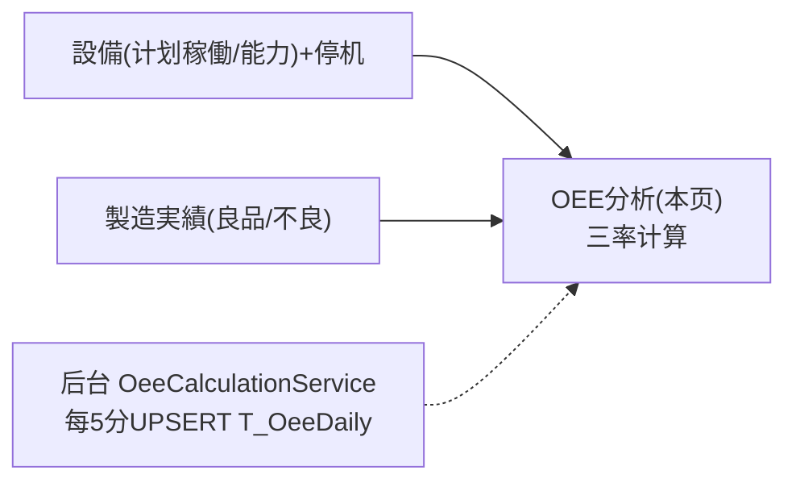

# OEE 分析 单页面操作 SOP（手把手版）

> **用途**：给**设备/生产管理查阅、培训老师讲、测试人员拆用例**。对应模块总册（`02-生产管理MES` §5.13）。
> **页面**：OEE 分析（Phase4 · 生产管理 MES）　**路由**：`/mes/oee`　**前端**：`views/mes/OeeAnalysisView.vue`　**API**：`api/mes/mes.ts oeeApi`　**后端**：`Mes/OeeController` → `OeeService`
> **基准**：分支 `feat/wfs-inbox-core`，2026-06-28；后端实测 `docs/codemap-mes/04-設備-oee.md`，UI 经 agent 实读 view。
> **样例数据**：設備 `MC01`、期間近 14 天、示例 可用率85%×性能90%×良品98%=OEE 74.97%。

---

## 1. 页面一句话说明

**OEE 分析，就是按设备看综合设备效率（OEE = 可用率 × 性能率 × 良品率）的页面——本日实时 OEE 卡片（每 30 秒自动刷新）、历史日次表、跨设备趋势折线（7/14/30 日），还能手动"本日 OEE 再計算"把结果落库。** OEE 主要供管理评估设备产能利用与损失。

---

## 2. 这个页面在业务流程中的位置

- **上游**：设备（计划稼働/能力）+停机（可用率）+实绩（良品率）。
- **本页**：三率计算/展示/再计算。
- **关联**：后台 Worker 每 5 分钟重算落库（趋势/历史/灯格依赖）。

---

## 3. 谁使用这个页面

| 角色 | 用途 |
|---|---|
| 设备保全/生产管理 | 评估设备效率与损失 |
| 主管 | 监看 OEE 趋势 |

---

## 4. 操作前准备

- [ ] 设备已建（计划稼働分/能力）；有实绩与停机数据，否则 OEE=0/降级。

---

## 5. 页面区域说明

| 区域 | 内容 |
|---|---|
| 検索カード | 設備CD(下拉「全設備」) + 期間(daterange，默认近14天) |
| 本日リアルタイム OEE | 卡片网格：每台 OEE 主数值(配色) + 可用率/性能/品質 + 稼働/良品/不良 |
| OEE 推移グラフ | SVG 折线（每设备一线，7/14/30 切换） |
| OEE 日次データ | 表格：日付/設備/计划/实稼働/停止/良品/不良/三率(进度条)/OEE |

---

## 6. 字段填写说明（检索）

| 字段 | 怎么填 | 说明 |
|---|---|---|
| 設備CD | 下拉(可清,filterable) | 留空=全设备 |
| 期間 | daterange | 默认近 14 天 |
| 趋势周期 | radio 7/14/30 | 默认 14 |

---

## 7. 按钮操作说明

| 按钮 | 点了会怎样 | 影响 |
|---|---|---|
| 検索 | loadAll（today+历史+trend） | 否 |
| 本日 OEE 再計算 | recalculate(targetDate=今日)→「{n}件再計算」→重载 | **UPSERT `T_OeeDaily`** |
| 趋势 7/14/30 | 改 trendDays→loadTrend | 否 |

---

## 8. 标准业务操作 SOP（照着点）

### 场景一：看本日实时 OEE（主流程）
- **步骤**：进入→（可选选设备/期间）検索。
- **检查**：本日卡片显示每台 OEE 主数值（配色 ≥80绿/≥60橙/<60红）+ 三率 + 稼働/良品/不良明细；本区每 30 秒自动刷新。
- **用例**：TC-M05-OEE-002、003。

### 场景二：理解三率公式
- **检查**：可用率=実稼働/計画稼働(默认480分)；性能率=実産量/(能力×実稼働/60)封顶100；良品率=良品/(良+不良)；OEE=三率乘÷10000。例 85×90×98÷10000=74.97%。
- **用例**：TC-M05-OEE-004~006。

### 场景三：性能率降级
- **背景**：设备未填能力(CapacityPerHour)。
- **检查**：性能率降级——有产量记 100%、无产量记 0%（易被误读为满效率）。
- **用例**：TC-M05-OEE-007。

### 场景四：本日 OEE 再計算
- **步骤**：点「本日 OEE 再計算」。
- **检查**：「{n}件再計算しました」(`ME-MSG-041`)；UPSERT `T_OeeDaily`；日次表/趋势更新。
- **用例**：TC-M05-OEE-008、009。

### 场景五：趋势与日次表
- **步骤**：切 7/14/30 日；看日次表三率进度条。
- **检查**：折线按设备多线；日次表 OEE 配色。
- **用例**：TC-M05-OEE-010、011。

---

## 9. 状态变化说明

无业务状态机。OEE 配色阈值：≥80% 绿 / ≥60% 橙 / <60% 红。两路径：`/today`(现算不落库,30秒轮询) vs `/recalculate`+Worker(UPSERT 落库)。

---

## 10. 按钮不可用 / 灰色原因

| 现象 | 原因 |
|---|---|
| 趋势/日次表无写操作 | 只读展示 |
| OEE=0 | 无实绩无停机(可用100/性能0/良品0) |

---

## 11. 常见错误与处理

| 现象 | 原因 | 处理 |
|---|---|---|
| 性能率 100% 但产量低 | 能力未填→降级 | 给设备填 CapacityPerHour |
| 趋势/历史空 | 未再计算/Worker 未跑 | 点再計算或等 Worker(5分) |
| 本日 OEE 不更新 | 30 秒轮询周期 | 等刷新 |

---

## 12. 操作完成后的检查清单

- [ ] 本日卡片三率与公式一致、配色正确。
- [ ] 再計算后日次表/趋势更新（UPSERT 落库）。
- [ ] 本日区 30 秒自动刷新。

---

## 13. 页面级测试用例（≥25 条，可执行）

> 编号 `TC-M05-OEE-xxx`。

| 用例编号 | 用例名称 | 优先级 | 前置条件 | 测试数据 | 操作步骤 | 预期结果 | 下游检查 | 备注 |
|---|---|---|---|---|---|---|---|---|
| TC-M05-OEE-001 | 页面打开 | P1 | 有权限 | — | 进入 | 检索+本日卡+趋势+日次表 | — | — |
| TC-M05-OEE-002 | 本日实时OEE | P0 | 有数据 | MC01 | 検索 | 每台OEE+三率+明细 | — | — |
| TC-M05-OEE-003 | 30秒轮询 | P2 | — | — | 停留 | 本日区每30秒刷 | — | — |
| TC-M05-OEE-004 | 可用率公式 | P1 | 有停机 | — | 看可用率 | 実稼働/計画稼働 | — | — |
| TC-M05-OEE-005 | 良品率公式 | P1 | 有良/不良 | — | 看品質 | 良品/(良+不良) | — | — |
| TC-M05-OEE-006 | OEE乘积 | P0 | 三率齐 | 85/90/98 | 看OEE | 三率乘÷10000=74.97% | — | 核心 |
| TC-M05-OEE-007 | 性能率降级 | P1 | 能力缺 | null能力 | 看性能 | 有产量100%/无产量0% | — | — |
| TC-M05-OEE-008 | 本日再計算 | P0 | 有数据 | 今日 | 再計算 | 「{n}件」ME-MSG-041 | T_OeeDaily UPSERT | — |
| TC-M05-OEE-009 | 再計算后更新 | P1 | 再算后 | — | 看日次/趋势 | 数据更新 | — | — |
| TC-M05-OEE-010 | 趋势7/14/30 | P1 | 有历史 | 切换 | 点radio | 折线重绘 | — | — |
| TC-M05-OEE-011 | 日次表三率进度条 | P1 | 有历史 | — | 看表 | 可用蓝/性能橙/品質绿 | — | — |
| TC-M05-OEE-012 | OEE配色阈值 | P2 | 各档 | — | 看OEE值 | ≥80绿/≥60橙/<60红 | — | — |
| TC-M05-OEE-013 | 边界OEE=0 | P2 | 无实绩无停机 | — | 看OEE | 可用100/性能0/品質0→OEE0 | — | — |
| TC-M05-OEE-014 | 设备过滤 | P1 | 多设备 | MC01 | 検索 | 仅MC01 | — | — |
| TC-M05-OEE-015 | 全设备 | P2 | 多设备 | 留空 | 検索 | 全设备 | — | — |
| TC-M05-OEE-016 | 期间默认14天 | P2 | — | — | 进入 | 默认近14天 | — | — |
| TC-M05-OEE-017 | 趋势默认14 | P2 | — | — | 进入 | trendDays默认14 | — | — |
| TC-M05-OEE-018 | 计划稼働默认480 | P2 | 设备无计划稼働 | — | 看可用率 | 分母默认480 | — | — |
| TC-M05-OEE-019 | 停机封顶 | P2 | 停机超计划 | — | 看可用率 | downtime封顶planned | — | — |
| TC-M05-OEE-020 | Worker 5分重算 | P2 | — | — | 等待 | 后台UPSERT(不推SignalR) | — | Worker |
| TC-M05-OEE-021 | 趋势空态 | P1 | 无历史 | — | 看趋势 | 「データなし」 | — | — |
| TC-M05-OEE-022 | 本日卡明细 | P2 | 有数据 | — | 看卡 | 稼働分/良品/不良 | — | — |
| TC-M05-OEE-023 | 只读(除再计算) | P2 | — | — | 找写操作 | 仅再計算可写 | — | — |
| TC-M05-OEE-024 | 与实绩良率一致 | P1 | 有实绩 | — | 对照 | 良品率与实绩一致 | 製造実績 | 一致性 |
| TC-M05-OEE-025 | 离开清轮询 | P2 | — | — | 离开 | onBeforeUnmount 清interval | — | — |
| TC-M05-OEE-026 | 权限不足 | P2 | 无权账号 | — | 进/再计算 | 待业务确认(隐藏/拒绝) | — | 权限 |
| TC-M05-OEE-027 | 网络异常 | P2 | 断网 | — | 检索/再计算 | 友好错误可重试 | — | — |

---

## 14. 培训讲解建议

| 顺序 | 讲什么 | 演示 | 易误解点 |
|---|---|---|---|
| 1 | OEE=三率乘积 | 看本日卡 | 不是相加 |
| 2 | 三率各自口径 | 拆解 | 可用/性能/品質分母 |
| 3 | 性能降级陷阱 | 能力缺 | 100% 不等于满效率 |
| 4 | 再計算 vs 实时 | today vs recalculate | 趋势依赖落库 |

---

## 15. 与模块级手册的关系

对应 `02-生产管理MES-...md` §5.13。模块测试矩阵 §7（M05-017/018）、可执行用例 §7.1（TC-M05-010）、验收 §8（AC-M05-10）。

---

## 16. 代码与文档来源

| 层 | 文件 |
|---|---|
| 逐行源码手册 | `docs/codemap-mes/04-設備-oee.md`（OEE 公式专讲） |
| 前端 | `views/mes/OeeAnalysisView.vue`（自绘趋势 SVG） |
| API | `api/mes/mes.ts`(oeeApi: search/today/recalculate/trend) |
| 后端 | `Mes/OeeController.cs`、`Services/Mes/OeeService.cs`(CalculateForAsync 三率 141-210) |
| 后台 | `BackgroundServices/OeeCalculationService.cs`(5分UPSERT,不推SignalR) |
| 实体 | `DomainModels/Mes/OeeDaily.cs`(T_OeeDaily 复合PK OeeDate+MachineCd) |

---

## 最后更新来源

- 代码：见 §16。基准：`feat/wfs-inbox-core`，2026-06-28（codemap 2026-06-22）。
- 覆盖：16 节 / 5 场景 / 27 用例（TC-M05-OEE-001~027）。
