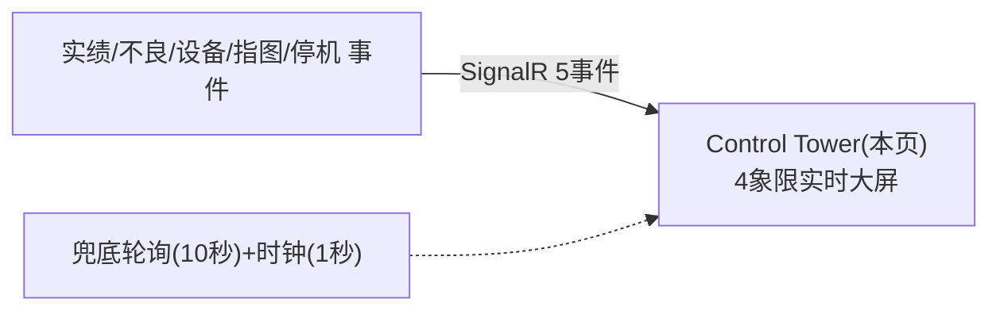

# Control Tower 大屏 单页面操作 SOP（手把手版）

> **用途**：给**车间监看/主管、培训老师讲、测试人员拆用例**。对应模块总册（`02-生产管理MES` §5.15）。
> **页面**：Control Tower（Phase4 大屏 · 生产管理 MES）　**路由**：`/mes/control-tower`（另 standalone 全屏 `/mes/control-tower/standalone`）　**前端**：`views/mes/ControlTowerView.vue`　**API**：复用 dashboard/oee/machine 端点　**实时**：SignalR `/hubs/mes`
> **基准**：分支 `feat/wfs-inbox-core`，2026-06-28；后端实测 `docs/codemap-mes/04-設備-oee.md §12`，UI 经 agent 实读 view。
> **样例数据**：运行中实时数据（实绩/不良/设备状态/遅延）。

---

## 1. 页面一句话说明

**Control Tower，就是挂在车间墙上的深色科技风"指挥大屏"——4 象限实时显示：本日 KPI、设备状态灯格、日别生产推移、实时事件流 + 納期遅延 TOP5。它纯只读、无任何输入，靠 SignalR 实时推送（实绩/不良/设备/指图/停机 5 类事件）+ 兜底轮询驱动，右上角显示 Hub 连接状态（● LIVE / ○ Offline）。**

---

## 2. 这个页面在业务流程中的位置

- **上游**：MES 各业务事件经 SignalR `/hubs/mes` 推送。
- **本页**：纯只读监看大屏。

---

## 3. 谁使用这个页面

| 角色 | 用途 |
|---|---|
| 车间主管/调度 | 实时盯产能/遅延/异常 |
| 现场大屏 | 挂墙常显（standalone 全屏） |

---

## 4. 操作前准备

- [ ] 后端 SignalR `/hubs/mes` 可用；有运行中数据。

---

## 5. 页面区域说明

| 区域 | 内容 |
|---|---|
| ヘッダー | 标题「⚙ CP6 MES Control Tower」+ 时钟 + Hub 连接徽标 + 全屏按钮 + 返回 |
| 左上 q-kpi | 本日 KPI 2×2：着手中指図/良品数/不良率/遅延件数 |
| 右上 q-machines | 設備状態灯格（同 §5.12 灯色，深色适配 + OEE） |
| 左下 q-trend | 日別生産推移（良品绿/不良红双折线，14日） |
| 右下 q-events | リアルタイムイベント（最多12条，5类色标）+ 納期遅延 TOP5 |

---

## 6. 展示项说明（无输入字段，纯看板）

| 展示项 | 含义 |
|---|---|
| KPI 着手中/良品/不良率/遅延 | 同 Dashboard |
| 设备灯格 | 設備CD+状态+OEE；灯色 0灰/1绿/2红/3黄/4蓝；白点 blink |
| 日別推移 | 良品绿/不良红双折线（14日）|
| 实时事件行 | 时间｜tag｜msg；5类色标：prod实績绿/defect不良红/machine設備橙/wo指図蓝/downtime停止灰；最多12条头插 |
| 納期遅延 TOP5 | workOrderNo｜製品名｜遅延N日（取前5） |
| Hub 徽标 | ● LIVE(绿,已连)/○ Offline(红,断开) |

---

## 7. 按钮操作说明

| 按钮 | 点了会怎样 | 影响 |
|---|---|---|
| 全屏切换 | requestFullscreen/exitFullscreen | 否 |
| 返回 | `$router.back()` | 否 |

> 无检索/CRUD/保存（纯看板）。

---

## 8. 标准业务操作 SOP（照着点）

### 场景一：开大屏监看（主流程）
- **步骤**：进入 `/mes/control-tower`（或 standalone 全屏）。
- **检查**：4 象限渲染；loadAll 拉 summary/dailyTrend(14)/delayAlerts(20)/有效设备；Hub 徽标 ● LIVE。
- **用例**：TC-M05-CT-002~004。

### 场景二：实时事件刷新
- **背景**：现场报实绩/判不良/设备停机时大屏即时反应。
- **步骤**：在别处触发 製造実績/不良/设备停机。
- **检查**：实时事件流头插新行（对应色标 tag）；MachineStatusChanged 触发 refreshMachines；ProductionReported 触发 loadAll 轻量重取。
- **用例**：TC-M05-CT-005~007。

### 场景三：Hub 连接状态
- **步骤**：观察右上徽标；断开后台。
- **检查**：连接 ● LIVE；断开 ○ Offline；onreconnecting/onclose/onreconnected 切换。
- **用例**：TC-M05-CT-008、009。

### 场景四：全屏/返回
- **步骤**：点全屏→退出；点返回。
- **检查**：全屏切换；返回上一页。
- **用例**：TC-M05-CT-010。

### 场景五：兜底轮询与时钟
- **步骤**：停留页面（不触发事件）。
- **检查**：时钟每 1 秒刷新；每 10 秒 loadAll 兜底（SignalR fallback）；离开清两定时器+断 Hub。
- **用例**：TC-M05-CT-011、012。

---

## 9. 状态变化说明

纯只读大屏，不改任何状态/数据；设备灯色随后端状态实时变。

---

## 10. 按钮不可用 / 灰色原因

| 现象 | 原因 |
|---|---|
| 无检索/输入/编辑 | 纯只读大屏 |
| 徽标 ○ Offline | SignalR 断开（靠兜底轮询） |
| 事件区「イベント待機中...」 | 暂无事件 |

---

## 11. 常见错误与处理

| 现象 | 原因 | 处理 |
|---|---|---|
| 大屏不实时刷新 | SignalR 断（Offline） | 检查 `/hubs/mes`；兜底轮询仍每 10 秒刷 |
| 设备灯不变 | 状态未变/事件未推 | 正常；或查 SignalR |
| 事件只留最近 | 最多保留 12 条 | 设计如此 |

---

## 12. 操作完成后的检查清单

- [ ] 4 象限渲染、KPI/灯格/推移/事件正确。
- [ ] SignalR 5 事件即时刷新；徽标反映连接。
- [ ] 时钟 1 秒 + 兜底 10 秒轮询工作；离开清定时器。

---

## 13. 页面级测试用例（≥25 条，可执行）

> 编号 `TC-M05-CT-xxx`。

| 用例编号 | 用例名称 | 优先级 | 前置条件 | 测试数据 | 操作步骤 | 预期结果 | 下游检查 | 备注 |
|---|---|---|---|---|---|---|---|---|
| TC-M05-CT-001 | 页面打开 | P1 | 有权限 | — | 进入 | 4象限大屏渲染 | — | — |
| TC-M05-CT-002 | 4象限渲染 | P0 | 有数据 | — | 进入 | KPI/灯格/推移/事件 | — | — |
| TC-M05-CT-003 | loadAll 初始拉取 | P1 | — | — | 进入 | summary/trend14/delay20/设备 | — | — |
| TC-M05-CT-004 | KPI 显示 | P1 | 有数据 | — | 看KPI | 着手中/良品/不良率/遅延 | — | — |
| TC-M05-CT-005 | 实绩事件刷新 | P0 | Hub连 | 报实绩 | 别处完了 | 事件流头插 prod(绿) + loadAll | 製造実績 | 实时 |
| TC-M05-CT-006 | 不良事件 | P1 | Hub连 | 判NG | 别处NG | 事件 defect(红) | 品質検査 | — |
| TC-M05-CT-007 | 设备状态事件 | P1 | Hub连 | 停机 | 别处停机 | 事件 machine(橙)+refreshMachines灯变 | 設備 | — |
| TC-M05-CT-008 | Hub连接徽标 LIVE | P1 | Hub连 | — | 看徽标 | ● LIVE 绿 | — | — |
| TC-M05-CT-009 | 断开 Offline | P2 | 断后台 | — | 断Hub | ○ Offline 红 | — | — |
| TC-M05-CT-010 | 全屏/返回 | P2 | — | — | 点全屏/返回 | 切全屏/返回上页 | — | — |
| TC-M05-CT-011 | 时钟1秒 | P2 | — | — | 停留 | 每秒刷新时钟 | — | — |
| TC-M05-CT-012 | 兜底10秒轮询 | P2 | — | — | 停留 | 每10秒loadAll | — | fallback |
| TC-M05-CT-013 | 设备灯色 | P2 | 各状态 | — | 看灯格 | 0灰/1绿/2红/3黄/4蓝 | — | — |
| TC-M05-CT-014 | 灯格OEE | P2 | 有OEE | — | 看灯格 | 显 OEE%（非null） | — | — |
| TC-M05-CT-015 | 日別推移双线 | P2 | 有数据 | — | 看推移 | 良品绿/不良红 | — | — |
| TC-M05-CT-016 | 納期遅延TOP5 | P1 | 有遅延 | — | 看遅延区 | 取前5+遅延天数 | — | — |
| TC-M05-CT-017 | 事件最多12条 | P2 | 多事件 | — | 触发>12 | 仅留最近12条 | — | — |
| TC-M05-CT-018 | 事件色标5类 | P2 | 各事件 | — | 看事件 | prod/defect/machine/wo/downtime 各色 | — | — |
| TC-M05-CT-019 | 指图状态事件 | P2 | Hub连 | 指图变 | 别处变更 | 事件 wo(蓝) | — | — |
| TC-M05-CT-020 | 停机事件 | P2 | Hub连 | 停机 | 别处停机 | 事件 downtime(灰) | — | — |
| TC-M05-CT-021 | standalone全屏路由 | P2 | — | — | 进 /standalone | 无侧边栏全屏 | — | — |
| TC-M05-CT-022 | 空事件态 | P1 | 无事件 | — | 进入 | 「イベント待機中...」 | — | — |
| TC-M05-CT-023 | 无遅延态 | P2 | 无遅延 | — | 看遅延区 | 「遅延なし」 | — | — |
| TC-M05-CT-024 | 离开清定时器 | P2 | — | — | 离开 | 清两定时器+stopMesHub | — | — |
| TC-M05-CT-025 | 灯格闪烁 | P3 | — | — | 看灯格 | 白点 blink(纯CSS) | — | — |
| TC-M05-CT-026 | 纯只读 | P2 | — | — | 找写操作 | 无任何输入/CRUD | — | — |
| TC-M05-CT-027 | 自动重连 | P2 | 断后恢复 | — | 恢复Hub | onreconnected→LIVE | — | — |
| TC-M05-CT-028 | 权限不足 | P2 | 无权账号 | — | 进页面 | 待业务确认(隐藏/拒绝) | — | 权限 |
| TC-M05-CT-029 | 网络异常 | P2 | 断网 | — | 进入 | 友好降级(Offline+兜底) | — | — |

---

## 14. 培训讲解建议

| 顺序 | 讲什么 | 演示 | 易误解点 |
|---|---|---|---|
| 1 | 这是实时指挥大屏 | 4象限 | 以为可操作 |
| 2 | SignalR 实时 | 别处触发看刷新 | 以为定时刷 |
| 3 | 连接徽标 | LIVE/Offline | 断了靠兜底轮询 |
| 4 | standalone 全屏 | 挂墙 | — |

---

## 15. 与模块级手册的关系

对应 `02-生产管理MES-...md` §5.15。模块测试矩阵 §7（M05-020 SignalR 实时）。实时基建（SignalR/Worker）见总册 §0.6 及 §5.12/5.13。

---

## 16. 代码与文档来源

| 层 | 文件 |
|---|---|
| 逐行源码手册 | `docs/codemap-mes/04-設備-oee.md §12`（Control Tower + SignalR） |
| 前端 | `views/mes/ControlTowerView.vue`、`utils/mesHub.ts`(单例连 /hubs/mes) |
| 后端实时 | `WebApi/Hubs/MesHub.cs`、`SignalRMesNotifier.cs`(5推送方法)、`Services/Mes/IMesNotifier.cs` |
| 复用端点 | dashboard(summary/dailyTrend/delayAlerts)+machine(有效设备) |

---

## 最后更新来源

- 代码：见 §16。基准：`feat/wfs-inbox-core`，2026-06-28（codemap 2026-06-22）。
- 覆盖：16 节 / 5 场景 / 29 用例（TC-M05-CT-001~029）。
