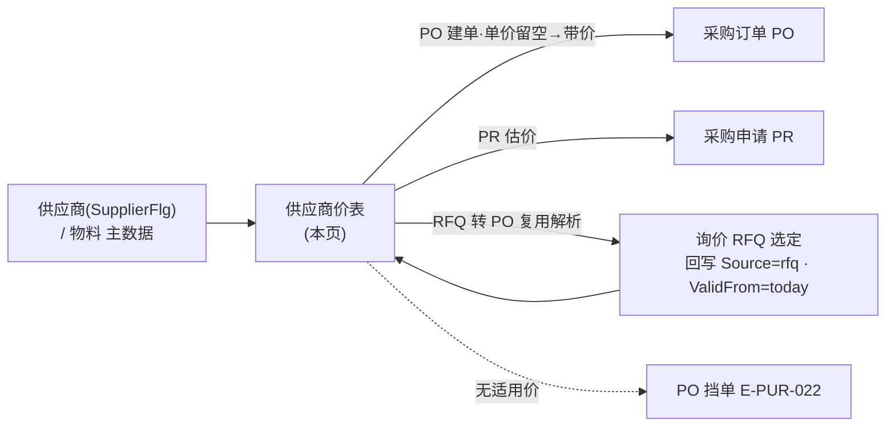
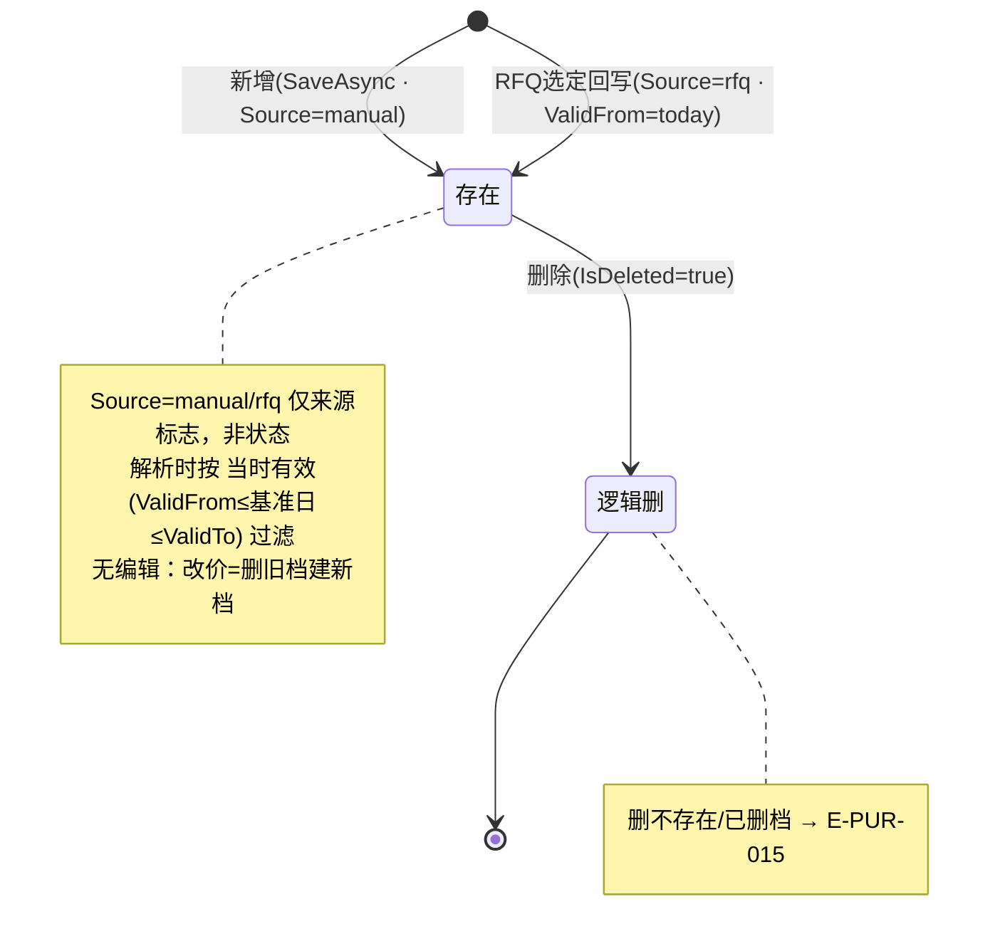

# 供应商价表 单页面操作 SOP（手把手版）

> **用途**：给**采购员/采购主数据维护员操作、培训老师讲、测试人员拆用例**。比模块总册（`04-采购管理` §5.1）更细。
> **页面**：供应商价表（采购 PUR · BOOK-M09）　**路由**：`/pur/supplier-price`　**前端**：`views/pur/SupplierPriceView.vue`　**API**：`api/pur/pur.ts supplierPriceApi`（list/resolve/save/remove）　**后端**：`Pur/SupplierPriceController`→`SupplierPriceService`（有 Service 层）
> **基准**：分支 `feat/training-m07`（基于 `main` `9f56591`），盘点日 2026-06-29；后端阶梯解析/错误码逐行实测于 `docs/codemap-pur/01-主数据-PO-收货-匹配.md`（2026-06-22 权威），UI 经实读 `SupplierPriceView.vue` + `types/pur/pur.ts`。
> **样例数据**：供应商 `SUP01`（须 `SupplierFlg=true`）、物料 `MAT-K280`（K280 原紙・巾1600mm）。

---

## 1. 页面一句话说明

**供应商价表，就是维护"供应商 × 物料"的阶梯采购价的地方——给某供应商的某物料登记"起订量 ≥ 多少时单价是多少、什么时段有效"，并当场用"带价试算"卡验证解析结果。** 它是采购的**价格底座**：PO 建单单价留空时按这里"满足起订量 ∧ 当时有效取最大档"自动带价，无适用价就挡单（`E-PUR-022`）。⚠️ 特别之处：**同一套解析规则被 PO 建单带价、PR 估价、RFQ 转 PO 复用**；价档来源分 `manual` 手工维护 / `rfq` 询价回写（RFQ 选定时回写 `Source=rfq`、`ValidFrom=today`），用 tag 区分。

---

## 2. 这个页面在业务流程中的位置

- **上游**：供应商（须 `SupplierFlg`）与物料主数据；以及 RFQ 选定回写（写入 `Source=rfq` 的价档）。
- **本页**：维护阶梯价档（增 / 删 / 解析试算），无编辑态、无审批、无状态机。
- **下游**：PO 建单带价、PR 估价、RFQ 转 PO 成交价拆单**全部复用同一条解析规则**；无适用价时 PO 挡单 `E-PUR-022`。

---

## 3. 谁使用这个页面

| 角色 | 用途 |
|---|---|
| 采购员（バイヤー） | 维护供应商合同价/阶梯价，建单前用带价试算验证 |
| 采购主数据维护员 | 统一价档规则、起订量分档、有效期，复核 rfq 回写价 |
| 测试 / 培训 | 用带价试算卡验证阶梯解析逻辑（最大满足档 + 最新生效） |

---

## 4. 操作前准备

- [ ] 确认**供应商已建档且 `SupplierFlg=true`**（复用 ERP `BusinessPartner`），样例 `SUP01`。
- [ ] 确认**物料已建档**，样例 `MAT-K280`。
- [ ] 想清楚**阶梯分档**：用 `起订量(MinQty)` 划档（如 0 起 / 1000 起 / 5000 起），解析时取"满足量的最大档"。
- [ ] 想清楚**有效期**：`有效自(ValidFrom)` 必填、`有效至(ValidTo)` 留空＝长期；解析按"当时有效"过滤。
- [ ] 明确**币种**：留空＝本位币（列表显 `JPY`）。
- [ ] 备好按钮级权限点 `pur-supplier-price`（`add` 新增 / `delete` 删除）。

---

## 5. 页面区域说明

| 区域 | 内容 |
|---|---|
| 页头 | 标题「供应商价表」+ 副标题「供应商×物料 阶梯价，建采购单时按"满足起订量∧当时有效取最大档"带价」 |
| 搜索/工具卡 | 供应商编码（输入，必填才能查/新增）/ 物料编码（输入，可选 filter）+「查询」「新增价档」按钮 +「共 n 条」info tag |
| 列表表格 | 7 列：物料 / 单价(右对齐) / 币种(空显 `JPY`) / 起订量(右对齐) / 生效日(取前10位) / 失效日(空显「长期」) / 来源(tag：rfq=橙warning「询价回写」/ 其余=灰info「手工维护」)；右固定操作列「删除」。**无分页**（max-height 560 滚动） |
| 带价试算卡 | 物料编码 + 数量(`el-input-number` ≥0) + 基准日(可选) +「解析单价」按钮；结果以 tag 显示 |
| 新增弹窗 | 560px，标题「新增价档」；7 字段；底部「取消」「确定」 |

> **空态两种**：未输供应商→「请先输入供应商编码查询」；已输供应商但无价档→「暂无数据」（前端 `supplierId.trim() ? '暂无数据' : '请先输入供应商编码查询'`）。

---

## 6. 字段填写说明（口语版）

**搜索区**：供应商编码（必填，空着查不出也不能新增）、物料编码（可选，填了＝再按物料精确过滤 `ItemId==`）。两框都支持回车触发查询。

**带价试算卡**：物料编码（必填才能点解析）、数量（默认 1，≥0）、基准日（**可选，留空＝后端按今天 `DateTime.Now`**）。

**新增弹窗**（7 字段）：

| 字段 | 控件（上限） | 必填 | 怎么填 | 填错影响 |
|---|---|---|---|---|
| 供应商（supplierId） | 输入（**禁用**） | 是 | **自动带入页面筛选的供应商值，不可改**（`disabled`） | 空（理论上不会）→后端 `E-PUR-011` |
| 物料（itemId） | 输入（≤40） | 是 | 物料代码（如 `MAT-K280`） | 空→前端友好提示「物料必填」，后端兜底 `E-PUR-012` |
| 单价（price） | 数字（≥0，precision4） | 是 | 采购单价，最多 4 位小数 | 负→前端「单价不可为负」，后端兜底 `E-PUR-013` |
| 币种（currencyCd） | 输入（≤3） | 否 | **留空＝本位币**（列表显 `JPY`） | — |
| 起订量（minQty） | 数字（≥0） | 否 | 阶梯下限；解析取"满足量的最大档" | 负→后端 `E-PUR-014`（`el-input-number :min="0"` 基本拦住） |
| 有效自（validFrom） | 日期 | 是 | 生效日（默认今天）；解析按"当时有效"过滤 | — |
| 有效至（validTo） | 日期 | 否 | **留空＝长期**（列表显「长期」） | — |

> ⚠️ **业务键 `(SupplierId, ItemId, MinQty, ValidFrom)`**：同一供应商+物料下，靠"起订量分档 + 生效日"区分多条价档。重叠时解析**不报错**，按"最大满足档、同档取 ValidFrom 最新"取一条。
> ⚠️ **盲点**：本页**只有新增 + 删除，没有编辑入口**——弹窗 `form` 永远不带 `id`，提交一律走"新增"。后端 `SaveAsync` 虽支持按 id 改，但 UI 不传 id（要改价＝删旧档建新档）。

---

## 7. 按钮操作说明

| 按钮 | 何时出现 | 点了会怎样 |
|---|---|---|
| 查询 | 工具卡常显 | 供应商空→直接清空列表；非空→`supplierPriceApi.list(supplierId, itemId?)` 加载未删价档 |
| 新增价档 | 工具卡常显 | **供应商编码空时灰**（`:disabled="!supplierId.trim()"`）；可点→开弹窗（供应商自动带入、生效日默认今天、Source=manual） |
| 删除（行） | 每行常显 | 二次确认「确认删除该价档？」→`supplierPriceApi.remove(id)`（**逻辑删 `IsDeleted=true`**）→toast「已删除」→刷新 |
| 解析单价 | 带价试算卡常显 | **供应商或物料为空时灰**（`:disabled="!supplierId.trim() || !probe.itemId.trim()"`）；可点→`resolve(supplierId, itemId, qty, onDate?)`→结果落 tag |
| 确定（弹窗） | — | 前端先校验（物料空→「物料必填」/单价负→「单价不可为负」）→`supplierPriceApi.save`（`currencyCd`/`validTo` 留空转 `null`）→toast「已保存」→关弹窗→刷新 |
| 取消（弹窗） | — | 关弹窗不保存（保存中禁用） |

> 解析结果 tag：`probe.result === null`→红色「无适用采购价」；有值→绿色「解析单价：xxx」；首次解析前 tag 不显（`result === undefined`）。

---

## 8. 标准业务操作 SOP（照着点）

### 场景一：维护首条手工价档（主流程）
- **背景**：与 `SUP01` 谈定原紙 `MAT-K280` 合同价，登记进价表供 PO 带价。
- **样例数据**：供应商 `SUP01`、物料 `MAT-K280`、单价 `280`、币种留空、起订量 `0`、有效自＝今天、有效至留空。
- **前置**：`SUP01`（`SupplierFlg`）/`MAT-K280` 已建档；有 `pur-supplier-price/add` 权限。
- **步骤**：1) 供应商编码填 `SUP01`→「查询」；2) 点「新增价档」（此时按钮已亮）；3) 弹窗里**供应商已自动带入 `SUP01`（灰掉）**；4) 物料填 `MAT-K280`；5) 单价填 `280`；6) 起订量 `0`、有效自默认今天；7)「确定」。
- **完成后检查**：toast「已保存」；列表出现一行：物料 `MAT-K280`、单价 280、币种 `JPY`、起订量 0、生效日＝今天、失效日「长期」、来源 tag「手工维护」(灰)。
- **异常**：物料空→「物料必填」；单价负→「单价不可为负」。
- **可拆用例**：TC-M09-SP-001~005。

### 场景二：维护阶梯多档（按起订量分档）
- **背景**：量大有折扣，给 `MAT-K280` 建三档：0 起 280 / 1000 起 270 / 5000 起 260。
- **样例数据**：同供应商物料，分三次新增，起订量分别 0/1000/5000，单价 280/270/260。
- **前置**：场景一首档已在。
- **步骤**：重复「新增价档」三次（或在首档基础上再加两档），每次只改起订量与单价→「确定」。
- **完成后检查**：列表三行（按物料、起订量升序排），起订量 0/1000/5000；业务键 `(SUP01, MAT-K280, MinQty, ValidFrom)` 各不相同，互不覆盖。
- **异常**：起订量填负→`el-input-number :min=0` 拦；强行传负→后端 `E-PUR-014`。
- **可拆用例**：TC-M09-SP-006~008。

### 场景三：带价试算——验证取"最大满足档"
- **背景**：建单前先在本页确认数量落哪一档价。
- **样例数据**：物料 `MAT-K280`、数量 `1200`、基准日留空（＝今天）。
- **前置**：场景二三档已在且当前有效。
- **步骤**：1) 带价试算卡物料填 `MAT-K280`；2) 数量填 `1200`；3) 基准日留空；4)「解析单价」。
- **完成后检查**：绿 tag「解析单价：270」——1200 满足 0 与 1000 两档，取**起订量最大的满足档**（1000 起＝270），不是 280 也不是 260。
- **异常**：数量改 `6000`→解析 260；数量改 `500`→解析 280。
- **可拆用例**：TC-M09-SP-009~012。

### 场景四：带价试算——无适用价（三种落空）
- **背景**：验证解析"找不到价"的几种情况。
- **样例数据**：物料 `MAT-K280`，分别试 (a) 数量 `0` 但最低档起订量>0；(b) 基准日早于所有 `ValidFrom`；(c) 基准日晚于 `ValidTo`。
- **前置**：价档存在但条件不命中。
- **步骤**：在带价试算卡分别构造上述三种数量/基准日→「解析单价」。
- **完成后检查**：均显红 tag「无适用采购价」（`result===null`）。同样地，PO 建单遇此会挡单 `E-PUR-022`。
- **异常**：物料编码填错（无任何档）→同样「无适用采购价」。
- **可拆用例**：TC-M09-SP-013~016。

### 场景五：阶梯档/生效日重叠——取最大满足档+最新生效（非报错）
- **背景**：同一档（起订量相同）因调价存在两个生效日（旧 280 起 6/1 / 新 270 起 6/20）。
- **样例数据**：`(SUP01, MAT-K280, MinQty=1000, ValidFrom=2026-06-01, 280)` 与 `(…, ValidFrom=2026-06-20, 270)`。
- **前置**：两条都当前有效（ValidTo 留空）。
- **步骤**：带价试算数量 `1500`、基准日 `2026-06-25`→「解析单价」。
- **完成后检查**：绿 tag「解析单价：270」——同档取 `ValidFrom` 最新（6/20），**重叠不报错**（`OrderByDescending(MinQty).ThenByDescending(ValidFrom)`）。
- **异常**：把基准日改 `2026-06-10`（新档尚未生效）→解析回 280。
- **可拆用例**：TC-M09-SP-017~019。

### 场景六：删除价档（逻辑删）
- **背景**：某档作废，从价表移除。
- **样例数据**：列表里某一行（如 5000 起 260 那档）。
- **前置**：该档存在；有 `pur-supplier-price/delete` 权限。
- **步骤**：目标行点「删除」→确认框「确认删除该价档？」点确定。
- **完成后检查**：toast「已删除」；列表该行消失（`IsDeleted=true`，数据保留）；再解析时该档不参与。
- **异常**：删一个已不存在/已删的档→后端 `E-PUR-015`（价档不存在）。
- **可拆用例**：TC-M09-SP-020~022。

### 场景七：来源区分 manual / rfq（观测 RFQ 回写）
- **背景**：RFQ 选定后会自动回写一条 `Source=rfq` 的价档，采购员复核。
- **样例数据**：RFQ 对 `SUP01`×`MAT-K280` 选定成交价 → 回写价档（`Source=rfq`、`ValidFrom=today`）。
- **前置**：已在询价比价页对该供应商物料完成选定（见 §5.3）。
- **步骤**：本页查询 `SUP01`→看列表来源列。
- **完成后检查**：手工建的档 tag「手工维护」(灰)；RFQ 回写的档 tag「询价回写」(橙)、生效日＝回写当天；二者并存、解析时一并参与（同样按最大满足档+最新生效）。
- **异常**：— （本页不产生 rfq 档，只观测）。
- **可拆用例**：TC-M09-SP-023~025。

### 场景八：必填/负值校验 + 空态/灰按钮
- **背景**：验证前端友好预校验与后端 E-PUR 兜底，以及供应商空时的限制。
- **样例数据**：空物料 / 负单价 / 空供应商。
- **前置**：弹窗已开或工具卡空供应商。
- **步骤**：1) 不填供应商→看「新增价档」「解析单价」是否灰；2) 新增弹窗物料留空点确定；3) 单价填负点确定。
- **完成后检查**：供应商空→两按钮灰、列表空态「请先输入供应商编码查询」；物料空→「物料必填」未发请求；单价负→「单价不可为负」未发请求。
- **异常**：绕过前端直发空物料/负价→后端 `E-PUR-012`/`E-PUR-013`（可能裸码显，i18n 待确认）。
- **可拆用例**：TC-M09-SP-026~032。

---

## 9. 状态变化说明

> 供应商价表**无业务状态机**，只有"存在 / 逻辑删"两态 + `Source` 来源标志（`manual`/`rfq`），且**本页无编辑态**（改价＝删旧建新）。

---

## 10. 按钮不可用 / 灰色原因

| 现象 | 原因 |
|---|---|
| 「新增价档」灰 | 供应商编码空（`:disabled="!supplierId.trim()"`）——先填供应商查询 |
| 「解析单价」灰 | 供应商编码空 **或** 带价试算物料空（`!supplierId.trim() \|\| !probe.itemId.trim()`） |
| 弹窗供应商框灰 | `disabled` 设计如此——供应商由页面筛选值自动带入，不可改 |
| 列表空、提示「请先输入供应商编码查询」 | 供应商未输（空态分支一），非"无数据" |
| 列表空、提示「暂无数据」 | 供应商已输但该供应商无价档（空态分支二） |
| 找不到编辑按钮 | **本页设计无编辑入口**，只有新增 + 删除（改价＝删旧建新） |
| 弹窗「确定」点了无反应 | 前端预校验未过（物料空 / 单价负，弹友好提示后 return，不发请求） |
| 解析后没出 tag | 还没点过「解析单价」（`probe.result === undefined` 时 tag 不显） |

> ⚠️ **诚实标注**：阶梯档/生效日**重叠不是错误**——后端按"最大满足档 + 同档最新生效"取一条（`OrderByDescending(MinQty).ThenByDescending(ValidFrom)`），不报冲突；维护时需自行确保分档语义清晰。

---

## 11. 常见错误与处理

| 错误 | 原因 | 处理 |
|---|---|---|
| `E-PUR-011` | 供应商必填（保存时 `SupplierId` 空） | 正常流程不会触发（供应商自动带入且灰）；如裸显，重新从工具卡填供应商再新增 |
| `E-PUR-012` | 物料必填（保存时 `ItemId` 空） | 前端先弹「物料必填」；补填物料 |
| `E-PUR-013` | 单价为负 | 前端先弹「单价不可为负」；填 ≥0 |
| `E-PUR-014` | 阶梯量（起订量）为负 | `el-input-number :min=0` 基本拦住；填 ≥0 |
| `E-PUR-015` | 价档不存在（删除/更新已删或不存在的档） | 刷新列表取最新再操作 |
| 解析总是「无适用采购价」 | 数量 < 最低档起订量 / 基准日不在有效区间 / 物料编码错 | 核对起订量分档、`ValidFrom~ValidTo`、物料代码 |
| 解析单价不是预期那档 | 落到了"满足量的最大档 + 最新生效" | 按 §8 场景三/五规则核对，非 bug |
| PO 建单留空带不出价 | 价表无适用档 | 先在本页建/查档；否则 PO 挡单 `E-PUR-022` |
| 改了价没生效 | 本页无编辑，旧档还在 | 删旧档、建新档（或调 RFQ 回写） |

> ⚠️ **UX 缺口（诚实标注）**：前端预校验用**友好中文**（「物料必填」「单价不可为负」），但后端硬闸门返回的 **`E-PUR-xxx` 码是否有前端 i18n 词条＝`待业务确认`**，存在裸码直显给用户的可能（与本页 label 走 `t()` 显中文不同）。

---

## 12. 操作完成后的检查清单

- [ ] 新增：列表出现该档，币种空显 `JPY`、失效日空显「长期」、来源 tag「手工维护」(灰)。
- [ ] 阶梯多档：按起订量升序排列，各档业务键 `(供应商,物料,起订量,生效日)` 不重复、互不覆盖。
- [ ] 带价试算：数量落档正确（取满足量的最大档），重叠/调价时取最新生效；落空显红「无适用采购价」。
- [ ] 删除：逻辑删（列表消失、数据保留），删不存在档报 `E-PUR-015`。
- [ ] 来源：RFQ 回写档 tag「询价回写」(橙)、生效日＝回写当天，与手工档并存。
- [ ] 校验：物料空/单价负被前端友好提示拦住；供应商空时新增/解析按钮灰。
- [ ] 下游一致：本页解析结果应与 PO 建单留空带出的价一致（同一规则）。

---

## 13. 页面级测试用例（≥25 条，可执行）

> 编号 `TC-M09-SP-xxx`；数据用样例（供应商 `SUP01` / 物料 `MAT-K280`）。

| 用例编号 | 用例名称 | 优先级 | 前置条件 | 测试数据 | 操作步骤 | 预期结果 | 下游检查 | 备注 |
|---|---|---|---|---|---|---|---|---|
| TC-M09-SP-001 | 新增首条手工价档 | P0 | 有 add 权限 | SUP01/MAT-K280/280/起订0/今起/长期 | 查询→新增→填→确定 | toast「已保存」、列表出现该档 | PO 留空可带 280 | 主流程 |
| TC-M09-SP-002 | 供应商自动带入且灰 | P0 | 工具卡供应商=SUP01 | — | 新增→看供应商框 | 供应商=SUP01、灰掉不可改 | — | `disabled` |
| TC-M09-SP-003 | 币种留空显本位币 | P1 | 新增 | 币种空 | 确定→看列表 | 币种列显 `JPY` | — | currencyCd→null |
| TC-M09-SP-004 | 失效日留空显长期 | P1 | 新增 | 有效至空 | 确定→看列表 | 失效日列显「长期」 | — | validTo→null |
| TC-M09-SP-005 | 物料 maxlength 限制 | P3 | 新增弹窗 | 超 40 字物料 | 输入 | 截断至 40 | — | `maxlength=40` |
| TC-M09-SP-006 | 阶梯多档·起订量分档 | P0 | 首档已在 | 0/1000/5000 三档 | 新增三次 | 列表三行按起订量升序 | 业务键各不同 | 互不覆盖 |
| TC-M09-SP-007 | 阶梯档不互相覆盖 | P1 | 三档已在 | — | 查询 | 三行并存（非只剩一行） | — | 不同 MinQty |
| TC-M09-SP-008 | 起订量负被拦 | P1 | 新增弹窗 | 起订量 -1 | 输入/确定 | min=0 拦，绕过则 `E-PUR-014` | 不落库 | — |
| TC-M09-SP-009 | 解析取最大满足档 | P0 | 三档(280/270/260)有效 | 数量1200/今天 | 解析单价 | 绿 tag「解析单价：270」 | 与 PO 带价一致 | 1000 起档 |
| TC-M09-SP-010 | 解析落最低档 | P1 | 同上 | 数量500 | 解析 | 解析单价：280 | — | 0 起档 |
| TC-M09-SP-011 | 解析落最高档 | P1 | 同上 | 数量6000 | 解析 | 解析单价：260 | — | 5000 起档 |
| TC-M09-SP-012 | 基准日留空＝今天 | P1 | 档当前有效 | 数量1200/基准日空 | 解析 | 按今天解析有值 | 后端 DateTime.Now | onDate 可选 |
| TC-M09-SP-013 | 数量低于最低档→无价 | P1 | 最低档起订量>0 | 数量=0 | 解析 | 红 tag「无适用采购价」 | result=null | — |
| TC-M09-SP-014 | 基准日早于生效→无价 | P1 | 档 ValidFrom=今天 | 基准日=昨天 | 解析 | 「无适用采购价」 | — | ValidFrom 过滤 |
| TC-M09-SP-015 | 基准日晚于失效→无价 | P1 | 档有 ValidTo | 基准日>ValidTo | 解析 | 「无适用采购价」 | — | ValidTo 过滤 |
| TC-M09-SP-016 | 物料无任何档→无价 | P2 | — | 物料=不存在 | 解析 | 「无适用采购价」 | PO 挡单 E-PUR-022 | — |
| TC-M09-SP-017 | 重叠同档取最新生效 | P0 | 同档两生效日(6/1·6/20) | 数量1500/基准6-25 | 解析 | 解析单价：270(6/20) | 不报错 | ThenByDesc(ValidFrom) |
| TC-M09-SP-018 | 重叠·新档未生效回旧 | P1 | 同上 | 基准日6-10 | 解析 | 解析单价：280 | — | 新档未到 ValidFrom |
| TC-M09-SP-019 | 重叠不报冲突 | P2 | 重叠两档 | — | 解析 | 正常返一条，无报错 | — | 诚实标注 |
| TC-M09-SP-020 | 删除价档(逻辑删) | P0 | 某档存在 | 任一行 | 删除→确认 | toast「已删除」、列表消失 | IsDeleted=true 保留 | — |
| TC-M09-SP-021 | 删除二次确认 | P1 | 某档存在 | — | 删除 | 弹「确认删除该价档？」 | 取消则不删 | — |
| TC-M09-SP-022 | 删不存在档 | P2 | 档已删 | 旧 id | 删除 | `E-PUR-015` | — | 价档不存在 |
| TC-M09-SP-023 | rfq 来源 tag | P1 | RFQ 已回写档 | — | 查询看来源列 | 橙 tag「询价回写」 | ValidFrom=回写当天 | Source=rfq |
| TC-M09-SP-024 | manual 来源 tag | P1 | 手工建档 | — | 查询看来源列 | 灰 tag「手工维护」 | — | Source=manual |
| TC-M09-SP-025 | manual/rfq 并存解析 | P2 | 两来源档都有效 | 数量/基准日 | 解析 | 一并参与，取最大满足+最新 | — | 来源不影响解析 |
| TC-M09-SP-026 | 供应商空·新增灰 | P0 | 供应商框空 | — | 看「新增价档」 | 按钮灰不可点 | — | `!supplierId.trim()` |
| TC-M09-SP-027 | 供应商空·解析灰 | P0 | 供应商框空 | — | 看「解析单价」 | 按钮灰 | — | — |
| TC-M09-SP-028 | 试算物料空·解析灰 | P1 | 供应商有/试算物料空 | — | 看「解析单价」 | 按钮灰 | — | `!probe.itemId.trim()` |
| TC-M09-SP-029 | 物料必填(前端) | P0 | 新增弹窗 | 物料空 | 确定 | 弹「物料必填」，不发请求 | 不落库 | 后端 E-PUR-012 兜底 |
| TC-M09-SP-030 | 单价负(前端) | P0 | 新增弹窗 | 单价 -1 | 确定 | 弹「单价不可为负」，不发请求 | 不落库 | 后端 E-PUR-013 兜底 |
| TC-M09-SP-031 | 空态·未输供应商 | P1 | 进入页面 | 供应商空 | 看列表空态 | 「请先输入供应商编码查询」 | — | 空态分支一 |
| TC-M09-SP-032 | 空态·已输无数据 | P1 | 供应商无价档 | SUP02 | 查询 | 「暂无数据」 | — | 空态分支二 |
| TC-M09-SP-033 | 物料过滤查询 | P2 | 有多物料档 | 物料=MAT-K280 | 查询 | 只显该物料档 | — | ItemId== 精确 |
| TC-M09-SP-034 | E-PUR 裸码显示 | P2 | 触发后端校验 | — | 绕前端发非法 | E-PUR 码可能裸显 | — | i18n 待确认 |
| TC-M09-SP-035 | 权限不足 | P2 | 无 add/delete 权限 | — | 新增/删除 | 待业务确认(隐藏/拒绝) | — | pur-supplier-price |

---

## 14. 培训讲解建议

| 顺序 | 讲什么 | 演示 | 易误解点 |
|---|---|---|---|
| 1 | 这页是采购的价格底座（PO 留空带价） | §2 流程图 | 以为只是台账、与建单无关 |
| 2 | 先填供应商才能查/新增 | 看灰按钮 + 两种空态 | 以为页面坏了 |
| 3 | 阶梯靠"起订量分档" | 建 0/1000/5000 三档 | 以为只能一个物料一个价 |
| 4 | 带价试算＝当场验证解析 | 数量 1200→270 | 以为取最低价/最高价 |
| 5 | 重叠取"最大满足档+最新生效"（不报错） | 同档两生效日 | 以为重叠会冲突报错 |
| 6 | 本页无编辑，改价＝删旧建新 | 找不到编辑按钮 | 到处找"修改" |
| 7 | 来源 manual / rfq 区分 | 看 tag 颜色 | 以为 rfq 档要手工建 |
| 8 | 前端友好提示 vs 后端 E-PUR 码 | 空物料→「物料必填」 | 以为 E-PUR 码也是中文 |

---

## 15. 与模块级手册的关系

对应 `04-采购管理-最详细用户操作培训手册.md` **§5.1 供应商价表（5.1.1~5.1.14）**。页面清单见 §4（/pur/supplier-price / P1 / 写 CRUD）；样例数据见 §0（`SUP01`/`MAT-K280`）；坑点统一提醒见 §5 开篇（单价留空＝带价无适用价挡单 `E-PUR-022`、`E-PUR` 码可能裸显 i18n 待确认、label 走 `t()` 显中文、列表无分页）。下游 PO 建单带价见 §5.4。

---

## 16. 代码与文档来源

| 层 | 文件 |
|---|---|
| 逐行源码手册 | `docs/codemap-pur/01-主数据-PO-收货-匹配.md` 一、供应商价表·阶梯带价解析（权威，2026-06-22 实测） |
| 前端 view | `cp6.web/src/views/pur/SupplierPriceView.vue`（实读，含带价试算卡 + 新增弹窗 + 两种空态） |
| API | `cp6.web/src/api/pur/pur.ts` `supplierPriceApi`（list / resolve / save / remove） |
| 类型 | `cp6.web/src/types/pur/pur.ts` `SupplierPrice` 接口（supplierId/itemId/price/currencyCd/minQty/validFrom/validTo/source） |
| 后端 Controller | `CP6.WebApi/Controllers/Pur/SupplierPriceController.cs`（`[Route("api/pur/supplier-price")][Authorize]`；List/Resolve 无权限点、Save=`pur-supplier-price/add`、Delete=`pur-supplier-price/delete`） |
| 后端 Service | `CP6.Core/Services/Pur/SupplierPriceService.cs`（`ResolvePriceAsync` 阶梯规则 + `SaveAsync`/`DeleteAsync` 抛 `E-PUR-011~015`） |
| 实体 | `CP6.Entity/DomainModels/Pur/SupplierPrice.cs`（`Pur_SupplierPrice`，业务键 `(SupplierId,ItemId,MinQty,ValidFrom)`，`Source=manual/rfq`，`IsDeleted` 逻辑删） |
| 解析复用 | `PurchaseOrderService.CreateAsync`（PO 建单带价，无价 `E-PUR-022`）、PR 估价、RFQ 转 PO |

---

## 最后更新来源

- 代码：见 §16（codemap-pur 01 供应商价表专章 + SupplierPriceView.vue 实读 + pur.ts API/类型 + SupplierPriceController.cs/SupplierPriceService.cs 后端核对）。
- 基准：分支 `feat/training-m07`（基于 `main` `9f56591`），2026-06-29（codemap 2026-06-22 实测快照）。
- 覆盖：16 节 / 8 场景 / 35 用例（TC-M09-SP-001~035）。
- 诚实标注：① 阶梯档/生效日重叠按"最大满足档 + 最新生效"取（非报错，`OrderByDescending(MinQty).ThenByDescending(ValidFrom)`）；② `E-PUR-xxx` 错误码前端 i18n＝`待业务确认`（可能裸码直显）；③ 本页无编辑入口（改价＝删旧建新）；④ List/Resolve 端点仅 `[Authorize]` 无按钮级权限点；按钮级权限粒度 `待业务确认`。
</content>
</invoke>
