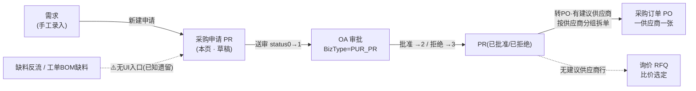
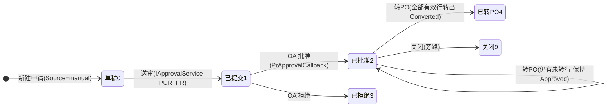

# 采购申请 PR 单页面操作 SOP（手把手版）

> **用途**：给**采购员/需求部门操作、培训老师讲、测试人员拆用例**。比模块总册（`04-采购管理` §5.2，5.2.1~5.2.14）更细。
> **页面**：采购申请 PR（PurchaseRequest · 采购管理 M09）　**路由**：`/pur/pr`　**前端**：`views/pur/PrView.vue`　**API**：`api/pur/pur.ts prApi`（list/get/create/submit/convert）　**后端**：`Controllers/Pur/PurchaseRequestController.cs` → `Services/Pur/PurchaseRequestService.cs`
> **基准**：分支 `feat/training-m07`（基于 `main` `9f56591`），盘点日 2026-06-29；后端逐行实测 `docs/codemap-pur/02-申请-询价-外注-对账.md`（2026-06-22 权威），UI 经实读 view + `types/pur/pur.ts`。
> **样例数据**：采购申请 `PR2026070001`（系统采番·前缀 `PR`）、采购物料 `MAT-K280`（K280 原紙）、建议供应商 `SUP01`（须 `SupplierFlg=true`）、收货落仓 `W01`、采购订单 `PO2026070001`（转 PO 产物）、询价 `RFQ2026070001`（无供应商行下游）。

---

## 1. 页面一句话说明

**采购申请 PR，就是把"要买什么、要多少、向谁买"提出来的需求入口屏——手工建头+明细（每行可填建议供应商），送审批准后一点「转采购订单」，系统就按 `SuggestSupplierId` 把行分组，一个供应商拆出一张采购订单（`EstPrice` 作 PO 行单价，留空则 PO 侧阶梯价解析）；没有填建议供应商的行不进 PO，留待询价 RFQ 比价。** 它是采购主链的最前一站——需求在这里立账、走审批、再分流到 PO 或 RFQ。

---

## 2. 这个页面在业务流程中的位置

- **上游**：采购需求——本页**手工录入**；缺料反流 / 工单 BOM 缺料驱动虽落码（`PrGenerationService`）但**无 UI 入口**（见 §10/§11，已知遗留）。
- **本页**：建需求账、送审、批准后分流。
- **下游**：有建议供应商的行→**PO**（分组拆单）；无供应商的行→**RFQ**（询价）。

---

## 3. 谁使用这个页面

| 角色 | 用途 |
|---|---|
| 采购员（バイヤー） | 建采购申请、填建议供应商、送审、批准后转 PO |
| 需求部门 | 提出物料需求（建头+明细），不一定填供应商 |
| 采购主管 | 在 OA 待办里审批 PR（送审的对端在 OA，不在本屏） |

---

## 4. 操作前准备

- [ ] **物料/数量/要求交期想清楚**：每行**物料必填（≤40 字符）**、**数量必填且 >0**；单位/要求交期/估价可空。
- [ ] **建议供应商策略明确**：知道哪一行要直接转 PO（填 `suggestSupplierId`，如 `SUP01`，须该供应商已建档且 `SupplierFlg=true`）、哪一行要走询价（**留空**）。
- [ ] **转 PO 是批准后才出现的动作**：行/详情上「转采购订单」按钮**仅 `status===2`（已批准）时显示**；草稿态只能先「送审」。
- [ ] **送审走 OA 审批**：`IApprovalService(BizType="PUR_PR", Amount=0)`，回调 `PrApprovalCallback`；无绑定流程则兜底直通（具体审批链以 OA 配置为准）。
- [ ] **缺料/工单不能在本页"生成"**：副标题"手工/缺料/工单"是**来源概念**不是按钮——本页只能手工建单（见 §10/§11）。

---

## 5. 页面区域说明

| 区域 | 内容 |
|---|---|
| 搜索/工具条（el-card） | **状态下拉**（`PR_STATUS_LABEL` 0~9，clearable）+ **来源下拉**（`PR_SOURCE_OPTIONS` 手工/缺料/工单，clearable）+「新建申请」（primary）+「刷新」+「共 {n} 条」tag；改下拉即 `reload` |
| 列表（el-table，无分页） | 6 列+操作：申请单号(prNo)/申请日期(取前10位)/申请人(requesterId)/来源(tag)/行数(lines.length)/状态(tag)；**操作列**：查看（常显）+ 送审（`status===0`）+ 转采购订单（`status===2`），`max-height=620` |
| 新建弹窗（el-dialog，**width 860**） | 头：申请日期(date,默认今天)/备注(≤500)；「明细行」+「添加行」；明细 el-table 8 列：行号/物料/数量/单位/要求交期/估价/建议供应商/操作(删)；底部 hint「有建议供应商的行转PO时按供应商分组拆单；留空的行留待询价(RFQ)比价」；footer：取消/确定 |
| 详情弹窗（el-dialog，**width 900**） | 只读 el-descriptions(3列)：申请单号/申请人/申请日期/来源/来源单号(sourceRefNo)/状态/备注；明细 el-table 8 列：行/物料/数量/单位/要求交期/估价/建议供应商(空显「待询价」)/已转PO(convertedPoNo,空显「—」)；footer：送审(`status===0`)/转采购订单(`status===2`)/关闭 |

> 列表**无分页控件**（一次取全量 `rows.length`）。新建弹窗 `openCreate` 重置表单为「申请日期=今天、单空行(qty=1)」。

---

## 6. 字段填写说明（口语版）

**头部字段（新建弹窗）**：

| 字段 | 谁提供 | 怎么填 | 填错影响 |
|---|---|---|---|
| 申请日期(requestDate) | 系统/采购 | 默认今天，可改；`value-format=YYYY-MM-DD` | 带入 PO 行 `OrderDate`（转 PO 时） |
| 备注(remarks) | 采购 | 自由文本，≤500 | — |

**明细字段（每行 · 新建弹窗）**：

| 字段 | 必填 | 怎么填 | 填错影响 |
|---|---|---|---|
| 物料(itemId) | **是（≤40）** | 物料代码，如 `MAT-K280` | 空→前端 warning（`每行需填物料且数量大于0`）；后端 `E-PUR-051` |
| 数量(qty) | **是 >0** | 申请量，`el-input-number :min=0` 默认 1 | ≤0→前端 warning；后端 `E-PUR-055` |
| 单位(unitCd) | 否（≤10） | 单位代码 | 带入 PO 行 |
| 要求交期(requiredDate) | 否 | 日期，转 PO 时带入 PO 行 `RequiredDate` | — |
| 估价(estPrice) | 否（**precision 4**） | 单价，`:min=0`；**转 PO 时作 PO 行 `UnitPrice`** | 留空→PO 侧按阶梯价解析（可能挡单/带不出价） |
| 建议供应商(suggestSupplierId) | 否（≤20） | placeholder**「留空走询价」**；填了→转 PO 时按此分组；如 `SUP01` | **留空＝该行不进 PO，留待 RFQ 询价** |

> ⚠️ 建单时**只校验 物料+数量**；单位/交期/估价/建议供应商全可空。建议供应商是"分流开关"：有值→PO，空→RFQ。

---

## 7. 按钮操作说明

| 按钮 | 何时出现/启用 | 点了会怎样 |
|---|---|---|
| 新建申请 | 工具条常显 | `openCreate`：重置表单（今天+单空行 qty=1）、打开 860px 新建弹窗 |
| 刷新 / 状态下拉 / 来源下拉 | 常显 | `reload`：按 status+source 调 `prApi.list` 重拉列表 |
| 添加行 | 新建弹窗内常显 | `addLine`：表尾增一空行（itemId 空、qty=1、其余空） |
| 删 | 每明细行 | `form.lines.splice($index,1)` 删该行 |
| 取消 | 新建弹窗 footer | 关弹窗不保存（saving 时禁用） |
| **确定** | 新建弹窗 footer（saving 时 loading） | 前端校验（行数>0 且每行 物料非空+数量>0）→`prApi.create`→toast「已新建」→关弹窗→`reload`；校验不过弹 warning **不发请求** |
| 查看 | 列表行/详情，常显 | `openDetail`：`prApi.get(prNo)` 拉详情、打开 900px 详情弹窗 |
| **送审** | 行/详情，**`status===0`（草稿）才显示** | `doSubmit`：`prApi.submit(prNo)`→走 OA（`BizType=PUR_PR, Amount=0`，回调 `PrApprovalCallback`）→toast「已送审」→`reload` |
| **转采购订单** | 行/详情，**`status===2`（已批准）才显示** | `doConvert`：`ElMessageBox.confirm`→`prApi.convert(prNo)`→**按建议供应商分组拆单**→toast「已转 {n} 张采购订单」→`reload`，行 `ConvertedPoNo` 回填 |

> **本屏没有"改/删已建 PR"的按钮**——建完只能查看/送审/转 PO；修改需求要重新建单或走 OA 流程。

---

## 8. 标准业务操作 SOP（照着点）

### 场景一：手工建采购申请（主流程）
- **背景**：采购员把一笔采购需求录进系统。
- **样例数据**：明细行 物料 `MAT-K280`、数量 100、单位 `KG`、要求交期、估价、建议供应商 `SUP01`。
- **前置**：物料/供应商已建档（`SUP01` 须 `SupplierFlg=true`）。
- **步骤**：1) 点「新建申请」开 860px 弹窗；2) 头部留默认申请日期（今天）、可填备注；3) 明细第一行填 `MAT-K280`/数量 100/建议供应商 `SUP01`，按需「添加行」加更多行；4) 点「确定」。
- **完成后检查**：toast「已新建」；列表刷新出现新单 `PR2026070001`，状态 **草稿(0)**、来源 **手工录入(manual)**、行数正确。
- **异常**：物料空/数量≤0→前端 warning「每行需填物料且数量大于0」**不发请求**；后端兜底 `E-PUR-050`(行空)/`E-PUR-051`(物料空)/`E-PUR-055`(数量≤0)。
- **可拆用例**：TC-M09-PR-001、002、003、004、005、006。

### 场景二：送审（草稿 → 已提交）
- **背景**：新建后把申请送到 OA 审批。
- **样例数据**：`PR2026070001`（状态 草稿0）。
- **前置**：PR 处于 `status===0`。
- **步骤**：1) 列表该行点「送审」（或先「查看」在详情 footer 点「送审」）；2) 等待 toast。
- **完成后检查**：toast「已送审」；列表刷新该单状态→**已提交(1)**；送审走 `IApprovalService(BizType="PUR_PR", Amount=0)`、回调 `PrApprovalCallback`；OA 侧出现待办（具体链路以 OA 配置为准，无绑定则兜底直通）。
- **异常**：非草稿态不显示「送审」按钮（见 §10）。
- **可拆用例**：TC-M09-PR-007、008、009。

### 场景三：批准后转 PO（有建议供应商·分组拆单·主流程）
- **背景**：审批通过后，把有建议供应商的行转成采购订单。
- **样例数据**：`PR2026070001`（状态 已批准2），两行均填建议供应商：行1 `SUP01`、行2 `SUP01`（同供应商）。
- **前置**：PR `status===2`（OA 批准后）。
- **步骤**：1) 列表该行点「转采购订单」（或详情 footer）；2) 确认弹窗「将有建议供应商的行按供应商分组转为采购订单？」点确定。
- **完成后检查**：toast「已转 1 张采购订单」（同供应商合一张）；**一供应商一张 PO**，`EstPrice` 作 PO 行 `UnitPrice`（留空则 PO 侧阶梯价解析）；PR 行 `ConvertedPoNo` 回填（详情「已转PO」列显 `PO…`）；全行均有效转出→PR 状态→**已转PO(4 / Converted)**。
- **异常**：PR 不存在`E-PUR-056`；非批准态`E-PUR-053`；无可转行`E-PUR-054`。
- **可拆用例**：TC-M09-PR-010、011、012、013、014。

### 场景四：多供应商拆多单 + 部分转（混行保持 Approved）
- **背景**：申请里既有不同建议供应商的行，又有留空走询价的行。
- **样例数据**：行1 `MAT-K280` 供应商 `SUP01`、行2 另一物料 供应商 `SUP02`、行3 留空（走询价）。
- **前置**：PR `status===2`。
- **步骤**：1) 点「转采购订单」确认。
- **完成后检查**：toast「已转 2 张采购订单」（`SUP01`/`SUP02` 各一张）；**留空的行不进 PO**；因仍有未转有效行→PR 状态**保持 已批准(2 / Approved)**（非 Converted），余下无供应商行可后续走 RFQ 询价。
- **异常**：若所有有建议供应商行都已转、仅剩无供应商行→再点「转采购订单」会 `E-PUR-054`（无可转行）。
- **可拆用例**：TC-M09-PR-015、016、017、018。

### 场景五：建单前端校验拦截
- **背景**：点确定前漏填物料或数量≤0，被前端 warning 拦住、**不发请求**。
- **样例数据**：行 物料留空 / 数量改 0 / 删到 0 行 任一。
- **前置**：在确定前故意留空。
- **步骤**：1) 制造缺失（清空 itemId 或把 qty 设 0，或删到无行）；2) 点「确定」。
- **完成后检查**：弹 warning「每行需填物料且数量大于0」，**不调用 `prApi.create`、不建单**；若被绕过到后端，`E-PUR-050/051/055` 兜底。
- **异常**：—（本场景就是验证拦截本身）。
- **可拆用例**：TC-M09-PR-019、020、021、022。

### 场景六：想从"缺料/工单"生成 PR —— 无 UI 入口（盲点验证）
- **背景**：副标题写"需求入口：手工/缺料/工单"，学员可能找"生成"按钮。
- **样例数据**：—。
- **前置**：观察页面所有按钮。
- **步骤**：1) 在列表/工具条/弹窗里找"从缺料生成 / 从工单生成"按钮。
- **完成后检查**：**找不到任何生成入口**——`PrGenerationService`（缺料反流 `GenerateFromShortageAsync` / 工单 BOM `GenerateFromWorkOrderAsync`）落码完整，但**无 Controller 端点、无生产调用方、前端无按钮**；来源下拉里的"缺料反流/工单驱动"仅是**来源标签概念**，非生成动作。已知遗留（待 MES 数据）。
- **异常**：—（本场景验证现状遗留）。
- **可拆用例**：TC-M09-PR-023、024。

---

## 9. 状态变化说明

- **新建即草稿(0)**；送审→已提交(1)；OA 批准→已批准(2)、拒绝→已拒绝(3)。
- **转 PO 分两态**：无任何有效未转行→`Converted(4)`；部分转（仍有未转有效行/留空行）→**保持 `Approved(2)`**（`PurchaseRequestService.cs:150-204`）。
- `关闭(9)` 为旁路终态。

---

## 10. 按钮不可用 / 灰色（不显示）原因

| 现象 | 原因 |
|---|---|
| 行/详情无「送审」按钮 | 仅 `status===0`（草稿）显示；已提交/已批准/已拒绝/已转PO 均不显示 |
| 行/详情无「转采购订单」按钮 | 仅 `status===2`（已批准）显示；草稿/已提交/已拒绝/已转PO 均不显示 |
| 新建弹窗「确定」点了无反应 | 前端校验不过：0 行 / 某行物料空 / 某行数量≤0 → warning 中断不发请求 |
| **找不到"缺料生成/工单生成"按钮** | **本页无生成入口**——`PrGenerationService` 无 Controller、无生产调用方、前端无按钮；"缺料/工单"仅来源标签（已知遗留，待 MES 数据） |
| 找不到"改/删已建 PR"按钮 | 本屏只有查看/送审/转PO，无编辑/删除入口 |
| 列表无翻页 | 本页**无分页控件**，一次取全量 |

---

## 11. 常见错误与处理

| 错误 | 原因 | 处理 |
|---|---|---|
| 前端 warning「每行需填物料且数量大于0」 | 物料空 / 数量≤0 / 0 行 | 补齐物料与数量(>0)再确定 |
| `E-PUR-050` 行空 | 提交无明细行（绕过前端） | 至少一行 |
| `E-PUR-051` 物料空 | 某行物料为空 | 填物料代码 |
| `E-PUR-055` 数量≤0 | 某行数量非正 | 数量填 >0 |
| `E-PUR-056` PR 不存在（转PO/送审） | prNo 错/已删 | 核对申请单号 |
| `E-PUR-053` 非批准态转 PO | PR 不是 `Approved(2)` | 先送审并等 OA 批准 |
| `E-PUR-054` 无可转行 | 无"有建议供应商且未转出"的行 | 给行补建议供应商，或无供应商行走 RFQ 询价 |
| 想从缺料/工单"生成"PR 却没按钮 | 无 UI 入口（已知遗留） | 暂只能手工建单；待 MES 数据后补 Controller/入口 |
| **E-PUR 错误码可能裸显** | 错误码 i18n 映射**待确认**，可能直接显码 | 对照本表理解；提报前端补 i18n（`待业务确认`） |
| 转 PO 后某行没进 PO | 该行建议供应商留空（设计如此：留空走询价） | 无供应商行用 RFQ 比价后转 PO |

---

## 12. 操作完成后的检查清单（下游验证）

- [ ] **建单**：列表出现 `PR…`（系统采番），状态 **草稿(0)**、来源 **手工录入(manual)**、行数正确；详情明细物料/数量/建议供应商如实。
- [ ] **送审**：状态→**已提交(1)**；OA 侧产生待办（`BizType=PUR_PR`，无绑定兜底直通）。
- [ ] **批准**：OA 批准后状态→**已批准(2)**，「转采购订单」按钮出现。
- [ ] **转 PO**：toast「已转 {n} 张采购订单」；**一供应商一张 PO**（同供应商合并），`EstPrice` 作 PO 行单价（空则 PO 侧阶梯价解析）；PR 详情「已转PO」列回填 `PO…`；全行有效转出→**已转PO(4)**、部分转→**保持已批准(2)**。
- [ ] **无供应商行**：留空行不进 PO，留待 RFQ 询价（详情"建议供应商"列显「待询价」）。

---

## 13. 页面级测试用例（≥25 条，可执行）

> 编号 `TC-M09-PR-xxx`；数据用样例（PR2026070001 / MAT-K280 / SUP01 / SUP02 / W01 / PO2026070001 / RFQ2026070001）。

| 用例编号 | 用例名称 | 优先级 | 前置条件 | 测试数据 | 操作步骤 | 预期结果 | 下游检查 | 备注 |
|---|---|---|---|---|---|---|---|---|
| TC-M09-PR-001 | 手工建单成功 | P0 | 物料已建档 | MAT-K280/100/SUP01 | 新建申请→填→确定 | toast「已新建」、列表出新单 | 状态草稿0、来源manual | 主流程 |
| TC-M09-PR-002 | 默认申请日期=今天 | P2 | — | — | 开新建弹窗 | requestDate=今天 | — | emptyForm |
| TC-M09-PR-003 | 添加多明细行 | P1 | — | 多行 | 连点「添加行」 | 表尾增空行(qty=1) | — | addLine |
| TC-M09-PR-004 | 删除明细行 | P2 | 多行 | — | 点行「删」 | 该行移除 | — | splice |
| TC-M09-PR-005 | 建议供应商可空 | P1 | — | 行留空 suggestSupplierId | 确定 | 建单成功 | 该行后续走RFQ | placeholder留空走询价 |
| TC-M09-PR-006 | 估价 precision 4 | P2 | — | estPrice=12.3456 | 填估价 | 接受4位小数 | 转PO作UnitPrice | input-number precision |
| TC-M09-PR-007 | 送审草稿单 | P0 | PR 草稿0 | PR2026070001 | 点「送审」 | toast「已送审」、状态→1 | OA出待办 | submit |
| TC-M09-PR-008 | 送审走PUR_PR | P1 | 草稿 | — | 送审 | IApprovalService(PUR_PR,0) | PrApprovalCallback | 接缝 |
| TC-M09-PR-009 | 非草稿无送审按钮 | P1 | PR 已提交1 | — | 看列表/详情 | 无「送审」按钮 | — | v-if status===0 |
| TC-M09-PR-010 | 批准后转PO（单供应商） | P0 | PR 已批准2 | 两行同SUP01 | 点「转采购订单」确认 | toast「已转1张」 | 一供应商一PO | GroupBy |
| TC-M09-PR-011 | 转PO确认弹窗 | P2 | 已批准2 | — | 点转PO | 弹「按供应商分组转为采购订单？」 | — | ElMessageBox |
| TC-M09-PR-012 | EstPrice 作 PO 行单价 | P1 | 行有 estPrice | estPrice=10 | 转PO | PO行UnitPrice=10 | — | 带价 |
| TC-M09-PR-013 | EstPrice 空→PO侧阶梯价 | P1 | 行 estPrice 空 | SUP01价表有 | 转PO | PO行按阶梯价解析 | — | null fallback |
| TC-M09-PR-014 | 全转→Converted | P0 | 全行有供应商 | 都填SUP01 | 转PO | PR状态→已转PO4 | ConvertedPoNo回填 | 状态推进 |
| TC-M09-PR-015 | 多供应商拆多单 | P0 | 已批准2 | 行1 SUP01/行2 SUP02 | 转PO | toast「已转2张」 | 两张PO | GroupBy 拆单 |
| TC-M09-PR-016 | 部分转保持Approved | P0 | 有供应商行+留空行 | SUP01+空 | 转PO | toast「已转1张」、PR仍2 | 留空行不进PO | 部分转 |
| TC-M09-PR-017 | ConvertedPoNo 回填 | P1 | 转PO成功 | — | 查详情 | 「已转PO」列显PO… | — | 回填 |
| TC-M09-PR-018 | 无供应商行显「待询价」 | P2 | 行留空 | — | 查详情 | 建议供应商列显「待询价」 | 走RFQ | UI |
| TC-M09-PR-019 | 物料空前端拦截 | P0 | — | itemId 空 | 确定 | warning不发请求 | 不建单 | 前端校验 |
| TC-M09-PR-020 | 数量≤0前端拦截 | P0 | — | qty=0 | 确定 | warning不发请求 | 不建单 | 前端校验 |
| TC-M09-PR-021 | 0行前端拦截 | P1 | 删到0行 | lines=[] | 确定 | warning不发请求 | 不建单 | length===0 |
| TC-M09-PR-022 | 后端建单校验兜底 | P1 | 绕过前端 | 物料空/数量≤0 | 直接调create | E-PUR-051/055 | 不落库 | CreateAsync |
| TC-M09-PR-023 | 无缺料生成按钮 | P1 | — | — | 找"缺料生成" | 无入口 | 已知遗留 | 盲点 |
| TC-M09-PR-024 | 无工单生成按钮 | P1 | — | — | 找"工单生成" | 无入口 | 待MES数据 | 盲点 |
| TC-M09-PR-025 | 转PO·PR不存在 | P2 | 错号 | PR9999999999 | convert | E-PUR-056 | — | — |
| TC-M09-PR-026 | 转PO·非批准态 | P1 | PR 草稿0 | — | 绕过UI调convert | E-PUR-053 | — | 非Approved |
| TC-M09-PR-027 | 转PO·无可转行 | P1 | 全行留空 | 无供应商 | 转PO | E-PUR-054 | — | 无SuggestSupplierId |
| TC-M09-PR-028 | 状态筛选 | P2 | 多状态单 | status=2 | 选状态下拉 | 仅已批准单 | — | reload |
| TC-M09-PR-029 | 来源筛选 | P2 | 多来源单 | source=manual | 选来源下拉 | 仅手工录入单 | — | reload |
| TC-M09-PR-030 | 列表无分页 | P3 | 多单 | — | 看列表 | 一次全量、无翻页 | — | 现状 |
| TC-M09-PR-031 | 查看详情只读 | P3 | 有单 | — | 点「查看」 | 900px详情、明细只读 | — | openDetail |
| TC-M09-PR-032 | E-PUR码可能裸显 | P2 | 触发错误 | 任一E-PUR | 触发 | 可能直接显码 | i18n待确认 | 诚实标注 |
| TC-M09-PR-033 | 权限·仅[Authorize] | P2 | 登录态 | — | 访问 | 登录即可操作 | 无pur-*细粒度点 | 待业务确认 |

---

## 14. 培训讲解建议

| 顺序 | 讲什么 | 演示 | 易误解点 |
|---|---|---|---|
| 1 | 这页是"采购需求入口" | §2 流程图（PR→PO/RFQ 分流） | 以为 PR 直接就是订单 |
| 2 | 建单只校验物料+数量 | 留空建议供应商照样建 | 以为建议供应商必填 |
| 3 | 建议供应商=分流开关 | 填 SUP01 走 PO / 留空走 RFQ | 以为留空就报错 |
| 4 | 送审走 OA、批准后才能转 PO | 草稿→送审→（批准）→转PO | 想在草稿直接转 PO |
| 5 | 转 PO=按供应商分组、一供应商一张 | 两行同 SUP01 合一张、不同供应商拆多张 | 以为一行一张 PO |
| 6 | 部分转保持 Approved | 混留空行→转后仍已批准 | 以为转一次就 Converted |
| 7 | 盲点：缺料/工单无生成入口 | 找不到生成按钮 | 以为来源下拉能"生成" |
| 8 | E-PUR 码可能裸显 / 仅 [Authorize] | 触发错误看提示 | 以为都有中文/有细粒度权限 |

---

## 15. 与模块级手册的关系

对应 `04-采购管理-最详细用户操作培训手册.md` **§5.2 采购申请 PR**（5.2.1~5.2.14：业务目的/流程位置/角色/前置/页面区域/字段/按钮/规则校验/完成后检查/状态流转/常见错误/注意事项/标准步骤/测试点）。相邻页：§5.3 询价比价 RFQ（无建议供应商行的下游，从 PR 发起）、§5.4 采购订单 PO（有建议供应商行分组转单的产物）；模块全局/三累计锚/三接缝见 §0/§1/§3；缺料/工单驱动 PR 无 UI 入口的遗留同记 §1（脚注）与 §10。

---

## 16. 代码与文档来源

| 层 | 文件 |
|---|---|
| 逐行源码手册 | `docs/codemap-pur/02-申请-询价-外注-对账.md`（权威，2026-06-22 实测，"一、采购申请 PR"） |
| 前端 view | `cp6.web/src/views/pur/PrView.vue`（submit 校验 :176-189、doConvert :206-213、doSubmit :198-204、列表按钮 v-if :41-42） |
| 前端 API | `cp6.web/src/api/pur/pur.ts`（`prApi` list/get/create/submit/convert :85-102） |
| 前端类型/枚举 | `cp6.web/src/types/pur/pur.ts`（`PurchaseRequest`/`PrCreateForm`/`PrLineCreateForm` :172-214、`PR_STATUS_LABEL`/`PR_SOURCE_*` :309-319） |
| 后端 Controller | `Controllers/Pur/PurchaseRequestController.cs`（Create :32-37，仅 `[Authorize]`） |
| 后端 Service | `Services/Pur/PurchaseRequestService.cs`（CreateAsync :58-102 含 E-PUR-050/051/055 / ConvertToPoAsync :150-204 含 GroupBy 拆单+E-PUR-056/053/054） |
| 需求驱动生成（⚠️无入口） | `Services/Pur/PrGenerationService.cs`（GenerateFromShortageAsync :25-62 / GenerateFromWorkOrderAsync :65-118 / EstimateAsync :136-160；无 Controller/无生产调用方/前端无按钮——已知遗留） |
| 实体 | `DomainModels/Pur/PurchaseRequest.cs` / `PurchaseRequestLine.cs`（PrStatus 0/1/2/3/4/9、PrSource manual/shortage/workorder） |
| 送审接缝 | `IApprovalService(BizType="PUR_PR", Amount=0)`，回调 `PrApprovalCallback` |

---

## 最后更新来源

- 代码：见 §16（codemap-pur 02「采购申请 PR」+ PrView.vue 实读 + pur.ts/types 类型/枚举）。
- 基准：分支 `feat/training-m07`（基于 main `9f56591`），2026-06-29（codemap 2026-06-22 权威）。
- 覆盖：16 节 / 6 场景 / 33 用例（TC-M09-PR-001~033）。
- 诚实标注盲点：**缺料反流/工单 BOM 缺料驱动生成 PR 无 UI 入口**（PrGenerationService 落码完整但无 Controller 端点/无生产调用方/前端无生成按钮，已知遗留待 MES 数据）；PR Controller **仅 `[Authorize]`** 无 `pur-*` 细粒度权限点（待业务确认）；**E-PUR 错误码 i18n 映射待确认**，可能裸显；本页**无分页**、无"改/删已建 PR"入口；建议供应商留空＝该行不进 PO 走 RFQ（分流设计）。
