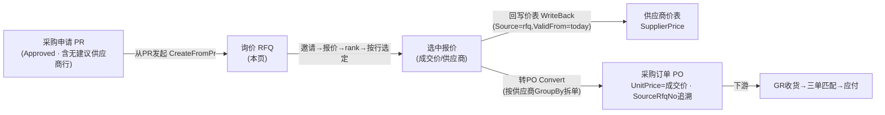
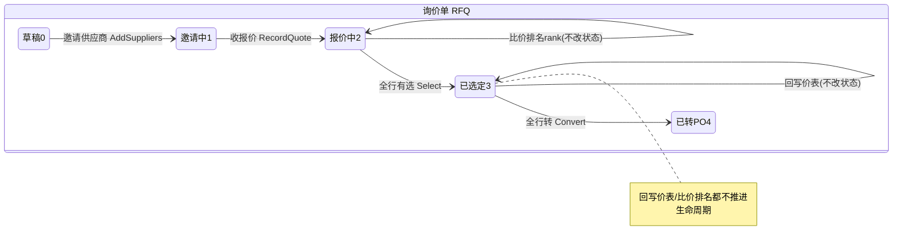

# 询价比价 RFQ 单页面操作 SOP（手把手版）

> **用途**：给**采购员操作、培训老师讲、测试人员拆用例**。比模块总册（`04-采购管理` §5.3，含 5.3.1~5.3.14）更细，把整条「价格发现」生命周期拆成一步一步可照点的动作。
> **页面**：询价比价 RFQ（采购管理 · BOOK-M09）　**路由**：`/pur/rfq`　**前端**：`views/pur/RfqView.vue`（一个列表屏 + 一个 960px「比价台」弹窗 + 邀请/录入报价两个子弹窗）　**API**：`api/pur/pur.ts rfqApi`　**后端**：`Controllers/Pur/RfqController.cs` → `Services/Pur/RfqService.cs`
> **基准**：分支 `feat/training-m07`（基于 `main` `9f56591`），盘点日 2026-06-29；后端逻辑/采番/错误码逐行实测于 `docs/codemap-pur/02-申请-询价-外注-对账.md`（2026-06-22 权威），UI 经实读 `RfqView.vue` + `types/pur/pur.ts`。
> **样例数据**：询价单 `RFQ2026070001`、来源采购申请 `PR2026070001`、物料 `MAT-K280`（K280 原紙）、候选供应商 `SUP01`（A 供应商）/ `SUP02`（B 供应商，均须 `SupplierFlg=true`）。

---

## 1. 页面一句话说明

**询价比价 RFQ，就是"没有合同价时去问价、比价、选定、把成交价回填系统"的地方——从一张已批准的采购申请（PR）发起询价，邀 N 家供应商→收回报价矩阵→按行比价排名（rank）→人工逐行选定→把选中价回写供应商价表（`Source=rfq`）→按成交价拆单转成采购订单（PO）。** 它是采购主链里**无价物料的价格发现入口**：PR 上"没有建议供应商"的行不能直接转 PO，必须先经本页询价比价，定下成交价和供应商后，再以成交价（不走价表）拆单进 PO。整条链条都靠**行级追溯**（`SourcePrNo+SourcePrLineNo`、`SourceRfqNo`）串起来。

---

## 2. 这个页面在业务流程中的位置

- **上游**：已 **Approved** 的采购申请 PR，其中**无建议供应商（SuggestSupplierId 空）**的可询价行（`PrView` 转 PO 时这些行不转，留给 RFQ）。
- **本页**：邀供应商、收报价、比价、选定，定出"向谁买、什么价"。
- **下游**：①回写供应商价表（沉淀长期协议价，`Source=rfq`）；②按成交价拆单转 PO，再走 GR 收货→三单匹配→财务应付。

---

## 3. 谁使用这个页面

| 角色 | 用途 |
|---|---|
| 采购员（バイヤー） | 主力——从 PR 发起询价、邀请供应商、登记/汇总各家报价、比价排名、按行选定成交方、回写价表、转 PO |
| 采购主管 | 监看比价结果是否合理（rank 仅建议，最终人工定），把关回写价表/转单 |
| 供应商对接（线下） | 实际收报价的人——本页不发邮件/无门户，报价由采购员**代录**进系统 |

> 注：本页报价是**采购员代录**（系统无供应商自助门户），"邀请供应商"只是把候选方登记进来并标记邀请状态，并不真正对外发函。

---

## 4. 操作前准备

- [ ] **先有一张 Approved 的 PR**，且其中**至少一行没有建议供应商**（`SuggestSupplierId` 空且未转出）——有建议供应商的行在 `PrView` 直接分组转 PO，不进 RFQ；全是有供应商的行→从 PR 发起会被 `E-PUR-060`（无可询价行）挡。
- [ ] **候选供应商已建档且 `SupplierFlg=true`**（如 `SUP01`/`SUP02`）——否则邀请时 `E-PUR-062`（不存在）/`E-PUR-063`（非供应商）。
- [ ] **拿到 PR 号**（如 `PR2026070001`）：本页"从 PR 发起询价"需手填 `fromPrNo`，留空点不动（前端 warning「请先填采购申请号」）。
- [ ] **理解"全生命周期串行"**：邀请→报价→比价→选定→回写/转 PO 是**有先后依赖的链**，动作条按钮按"前一步是否完成"逐个解锁（详见 §7/§10）。
- [ ] **理解"rank 仅建议"**：比价排名只是按价格/交期算个名次提示（#1 绿），**不会自动选定**，最终必须人工在矩阵里按行点 radio 再「确认选定」。
- [ ] **理解"有效期"**：报价行可填有效期（validUntil），**过期（< 今天）的报价红字标「已过期」且 radio 禁用、不能选、选中后转 PO 也会被后端 `E-PUR-068` 挡**。

---

## 5. 页面区域说明

| 区域 | 内容 |
|---|---|
| 列表搜索条（el-card 顶部） | 状态下拉（`RFQ_STATUS_LABEL`，clearable）+ 竖分隔 + **采购申请号输入框（fromPrNo）** + **「从PR发起询价」** + 「刷新」+ 共 {n} 条 tag |
| 列表表格（el-table，无分页） | 7 列：询价单号 / 询价日期（slice 前 10）/ 询价员 buyer / 来源PR sourcePrNo / 行·供应商数（lines / suppliers）/ 状态 tag / 操作「比价台」 |
| **比价台弹窗（el-dialog 960px，top 5vh）** | 头部 descriptions（询价单号/询价员/来源PR/状态）+ **动作条**（6 按钮，见 §7）+ 被邀供应商 tag 区 + **比价矩阵**（行×供应商）+ 提示行 |
| 邀请供应商弹窗（el-dialog 480px） | 一个 textarea（供应商编码，逗号/换行分隔，3 行）+ 取消/确定 |
| 录入报价弹窗（el-dialog 720px） | 选供应商下拉（被邀方）+ 逐行表格（行/物料/**报价单价 precision4**/交期天/有效期）+ 取消/提交报价 |

> **比价矩阵单元格**：有报价时显示 radio（选定本行此供应商，`picks[lineNo]`）+ 报价价 + rank tag（#1 success / 其余 info）+ 交期 + 过期标记；**过期报价 radio 禁用+「已过期」红字**；无报价显「—」。每行只能选一个供应商（radio 同 `lineNo` 互斥）。

---

## 6. 字段填写说明（口语版）

**列表搜索条**：

| 字段 | 谁提供 | 怎么填 | 填错影响 |
|---|---|---|---|
| 状态（status） | 采购 | 下拉过滤询价单状态，可清空看全部 | 仅过滤显示，不影响数据 |
| 采购申请号（fromPrNo） | 采购 | 发起询价的来源 PR 号，如 `PR2026070001` | 空→点「从PR发起」前端 warning，不发请求 |

**邀请供应商弹窗**：

| 字段 | 怎么填 | 填错影响 |
|---|---|---|
| 供应商（inviteCodes，textarea） | 供应商编码，多个用**逗号/中文逗号/空白/换行**分隔（如 `SUP01,SUP02`） | 全空→warning「请填写至少一个供应商」；编码不存在→`E-PUR-062`；非供应商→`E-PUR-063` |

**录入报价弹窗**（先选供应商，再逐行填）：

| 字段 | 怎么填 | 填错影响 |
|---|---|---|
| 供应商（quoteSupplier，下拉） | 从**被邀供应商**里选一家 | 空→warning「请选择供应商」；该供应商未被邀→后端 `E-PUR-064` |
| 报价单价（quotedPrice） | 该行报价，**精度 4 位**，>0 才会被提交（`filter quotedPrice>0`） | 全行 ≤0→warning「请至少为一行填报价」；无有效报价行→后端 `E-PUR-066` |
| 交期（leadDays，天） | 该供应商承诺交期天数，可空 | 比价排名时作第二排序键 |
| 报价有效期（validUntil，日期） | 该报价到期日，可空 | **过期则不可选/不可转 PO**（`E-PUR-068`） |

> 比价矩阵里没有手填字段——选定靠 radio 点击，写进 `picks[lineNo]=supplierId`。

---

## 7. 按钮操作说明

**列表区**：

| 按钮 | 何时启用 | 点了会怎样 |
|---|---|---|
| 从PR发起询价 | 常显（fromPrNo 空时点击被前端 warning 拦） | `createFromPr(prNo)`→后端 `CreateFromPrAsync` 取 PR 可询价行建 RFQ 头+行（拷 `SourcePrNo/SourcePrLineNo`），成功 toast「已发起询价 {no}」并自动打开比价台 |
| 刷新 | 常显 | `reload()` 重新拉列表 |
| 比价台（行内 link） | 每行 | `openDetailByNo(rfqNo)` 拉详情、用已选中报价回填 `picks`、打开 960px 弹窗 |

**比价台动作条（6 个，启用条件是关键）**：

| 按钮 | 启用条件 | 点了会怎样 |
|---|---|---|
| 邀请供应商 | **常显** | 开 480px 弹窗→`addSuppliers(rfqNo, codes)`→后端逐供应商校验并加 `RfqSupplier(Invited)`，Draft→Inviting；已邀幂等 |
| 录入报价 | `detail.suppliers.length>0`（有被邀供应商才亮） | 开 720px 弹窗→`recordQuote(rfqNo, supplier, lines)`→按 LineNo upsert `RfqQuote`，该供应商→已报价，推 Quoting |
| 比价排名 | `detail.quotes.length>0`（有报价才亮，primary） | `rank(rfqNo)`→后端按行分组：过期 Rank=0，非过期按 `价格→交期→供应商` 赋 #1/#2/#3；**仅建议不自动选**，toast「已比价」 |
| 确认选定 | `hasPicks`（矩阵里至少点了一行 radio，success） | `select(rfqNo, selections)`→后端校验报价存在/未过期，一行一选（改选清旧），全行有选→Selected，toast「已选定」 |
| 回写价表 | `hasSelected`（已有选中报价） | `writeBack(rfqNo)`→选中报价逐条 upsert `SupplierPrice`（`Source=rfq`、`ValidFrom=today`），toast「已回写采购价表」；**不改 RFQ 状态** |
| 转采购订单 | `hasSelected`（warning，**带确认框**） | 弹确认「将选中报价按供应商分组转为采购订单？」→`convert(rfqNo)`→按选中供应商 GroupBy 拆 PO（`UnitPrice=成交价` 不走价表、`SourceRfqNo` 追溯），全行转→Converted，toast「已转 {n} 张采购订单」 |

> **顺序铁律**：必须先「邀请供应商」→才能「录入报价」→才能「比价排名」；矩阵里点 radio 才能「确认选定」；选定后才能「回写价表 / 转采购订单」。前一步没做，后一步按钮就是灰的（§10）。

---

## 8. 标准业务操作 SOP（照着点）

> 因生命周期长，按"一步一场景"拆。完整跑一遍 = 场景一→二→三→四→五/六。

### 场景一：从 PR 发起询价（建 RFQ）
- **背景**：PR 已批准，里面有无建议供应商的行，要去问价。
- **样例数据**：来源 `PR2026070001`（Approved，含物料 `MAT-K280` 数量行、无建议供应商）。
- **前置**：PR 状态 Approved；该行 `SuggestSupplierId` 空且未转出。
- **步骤**：1) 列表搜索条「采购申请号」填 `PR2026070001`；2) 点「从PR发起询价」。
- **完成后检查**：toast「已发起询价 `RFQ2026070001`」；**自动弹开比价台**；新 RFQ 头 `SourcePrNo=PR2026070001`、状态 `草稿(0)`、行已从 PR 拷过来（带 `SourcePrLineNo` 追溯）。
- **异常**：fromPrNo 留空→前端 warning 不发请求；PR 不存在→`E-PUR-067`；PR 里无可询价行（全是有建议供应商/已转）→`E-PUR-060`。
- **可拆用例**：TC-M09-RFQ-001、002、003、004。

### 场景二：邀请供应商
- **背景**：RFQ 建好后，登记要向哪几家询价。
- **样例数据**：比价台里 RFQ `RFQ2026070001`；邀 `SUP01,SUP02`。
- **前置**：已在比价台（场景一自动打开，或列表点「比价台」）。
- **步骤**：1) 动作条点「邀请供应商」；2) 弹窗 textarea 填 `SUP01,SUP02`（逗号/换行均可）；3) 点「确定」。
- **完成后检查**：toast「已邀请」；被邀供应商区出现两枚 tag（`已邀请` info）；RFQ 状态 `草稿(0)→邀请中(1)`；「录入报价」按钮由灰转亮。
- **异常**：textarea 全空→warning「请填写至少一个供应商」；编码不存在→`E-PUR-062`；该编码非供应商（`SupplierFlg=false`）→`E-PUR-063`；重复邀同一家→幂等不报错。
- **可拆用例**：TC-M09-RFQ-005、006、007、008。

### 场景三：录入报价（逐家代录）
- **背景**：拿到各家线下报价，采购员代录进系统。
- **样例数据**：先录 `SUP01`：`MAT-K280` 报价 `280.0000`、交期 7 天、有效期 2026-08-31；再录 `SUP02`：报价 `275.0000`、交期 10 天、有效期 2026-08-31。
- **前置**：已邀至少一家供应商（状态 ≥ 邀请中）。
- **步骤**：1) 动作条点「录入报价」；2) 弹窗顶部选供应商 `SUP01`；3) 行表格填报价单价/交期/有效期（精度 4 位）；4) 点「提交报价」；5) 重复 2~4 录 `SUP02`。
- **完成后检查**：toast「报价已录入」；该供应商 tag 变 `已报价(success)`；RFQ 状态推到 `报价中(2)`；比价矩阵该列出现报价单元格；「比价排名」按钮转亮。
- **异常**：未选供应商→warning「请选择供应商」；所有行报价 ≤0→warning「请至少为一行填报价」；选了未被邀供应商→`E-PUR-064`；报价行不是询价行→`E-PUR-065`；空报价行集→`E-PUR-066`。
- **可拆用例**：TC-M09-RFQ-009、010、011、012、013。

### 场景四：比价排名 + 矩阵按行选定 + 确认选定
- **背景**：把各家报价排个名（仅参考），再人工按行定成交方。
- **样例数据**：行 1 物料 `MAT-K280`，`SUP01`=280 / `SUP02`=275；选 `SUP02`（价低）。
- **前置**：至少一家已报价（状态 报价中）。
- **步骤**：1) 点「比价排名」→矩阵里最低价方挂 `#1`（success 绿底）、次方 `#2`（info）；2) 在矩阵行 1 点 `SUP02` 单元格的 radio；3) 点「确认选定」。
- **完成后检查**：toast「已比价」「已选定」；选中报价 `isSelected=true`；全部行都选了→RFQ 状态 `已选定(3)`；「回写价表」「转采购订单」转亮。
- **异常**：rank 只给名次**不会自动选**（必须人工点 radio）；没点任何 radio 直接「确认选定」→warning「请先在矩阵中按行选定」；选了不存在的报价→`E-PUR-069`；同一行改选会清旧选。
- **可拆用例**：TC-M09-RFQ-014、015、016、017、018。

### 场景五：回写价表（沉淀协议价）
- **背景**：把这次选定的成交价存进供应商价表，下次直接带价。
- **样例数据**：选中 `SUP02` @ `MAT-K280` 275。
- **前置**：已「确认选定」（`hasSelected`）。
- **步骤**：1) 点「回写价表」。
- **完成后检查**：toast「已回写采购价表」；供应商价表新增/更新一档 `SupplierPrice`（`SupplierId=SUP02`、`ItemId=MAT-K280`、`Price=275`、**`Source=rfq`**、`ValidFrom=today`）；**RFQ 状态不变**（回写不推进生命周期，可与转 PO 各做各的）。
- **异常**：未选定就点→按钮是灰的（`hasSelected` 假），点不动。
- **可拆用例**：TC-M09-RFQ-019、020。

### 场景六：转采购订单（成交价拆单）
- **背景**：把选定结果落成正式采购订单。
- **样例数据**：选中 `SUP02`，转 PO。
- **前置**：已「确认选定」；选中报价均未过期。
- **步骤**：1) 点「转采购订单」；2) 确认框点「确定」。
- **完成后检查**：toast「已转 {n} 张采购订单」（按选中供应商分组，一家一张）；新 PO 行 `UnitPrice=成交价`（**不查价表**）、`SourceRfqNo=RFQ2026070001` 追溯；全行转出→RFQ 状态 `已转PO(4)`；去 PO 屏（§5.4）能查到对应 `PO…`。
- **异常**：没选定→按钮灰；选中里有**过期报价**→后端 `E-PUR-068`；无任何选中转 PO→`E-PUR-070`；确认框点「取消」→不转。
- **可拆用例**：TC-M09-RFQ-021、022、023、024。

### 场景七：过期报价不可选（盲点/校验验证）
- **背景**：有效期已过的报价，系统从 UI 到后端层层挡，防止用陈旧价转单。
- **样例数据**：`SUP01` 报价有效期填 `2026-06-01`（早于今天 2026-06-29）。
- **前置**：录入了一条过期有效期的报价并 rank。
- **步骤**：1) 看矩阵该单元格；2) 试着点它的 radio。
- **完成后检查**：单元格红字标「已过期」、半透明、rank=0、**radio 禁用点不动**；即便绕过 UI 选中并转 PO，后端也 `E-PUR-068` 挡。
- **异常**：—（本场景就是验证过期防线）。
- **可拆用例**：TC-M09-RFQ-025、026。

### 场景八：列表筛选与重进比价台（续作）
- **背景**：换天回来继续没做完的询价，靠状态/PR 号找回。
- **样例数据**：状态选「报价中(2)」，找 `RFQ2026070001`。
- **前置**：已有进行中的 RFQ。
- **步骤**：1) 列表状态下拉选「报价中」（或清空看全部）；2) 点目标行「比价台」。
- **完成后检查**：弹窗按当前数据重建，已选中报价**自动回填 `picks`**（便于续选）；动作条按钮按当前状态解锁。
- **异常**：—。
- **可拆用例**：TC-M09-RFQ-027、028。

---

## 9. 状态变化说明

- **主线**：`草稿(0)→邀请中(1)→报价中(2)→已选定(3)→已转PO(4)`；旁路 `关闭(8)/取消(9)`（本页 UI 无显式关闭/取消按钮）。
- **被邀供应商子状态**（每家）：`待邀请(0)→已邀请(1)→已报价(2)`（`RFQ_INVITE_LABEL`），录入该家报价时由 1→2。
- **比价排名 rank / 回写价表 不改 RFQ 状态**——rank 只算名次，回写只落价表，二者都不推进生命周期。

---

## 10. 按钮不可用 / 灰色原因

| 现象 | 原因 |
|---|---|
| 「录入报价」灰 | `!detail.suppliers.length`——还没邀任何供应商，先点「邀请供应商」 |
| 「比价排名」灰 | `!detail.quotes.length`——还没录任何报价，先「录入报价」 |
| 「确认选定」灰 | `!hasPicks`——矩阵里一行 radio 都没点，先在矩阵按行选 |
| 「回写价表」/「转采购订单」灰 | `!hasSelected`——还没「确认选定」过，先选定 |
| 矩阵某单元格 radio 点不动 | 该报价**已过期**（`validUntil<today`），`isExpired` 真→radio `disabled` |
| 点「从PR发起询价」无反应 | `fromPrNo` 为空→前端 warning「请先填采购申请号」，不发请求 |
| 找不到「关闭/取消询价」按钮 | 本页 UI 未提供关闭(8)/取消(9)入口（状态枚举有，但无前端操作）——`待业务确认` |
| 找不到删除报价/删供应商按钮 | 本页无删除入口；改报价靠 upsert 覆盖，改选定靠重新点 radio |

---

## 11. 常见错误与处理

| 错误 | 原因 | 处理 |
|---|---|---|
| `E-PUR-060` 无可询价行 | 从 PR 发起时该 PR 没有"无建议供应商且未转出"的行 | 确认 PR 里确有需询价（无供应商）的行；有建议供应商的行应在 PR 屏直接转 PO |
| `E-PUR-067` PR 不存在 | fromPrNo 填错/已删 | 核对采购申请号 |
| `E-PUR-062` 供应商不存在 | 邀请编码拼错/未建档 | 先到供应商主数据建档 |
| `E-PUR-063` 非供应商 | 该业务伙伴 `SupplierFlg=false` | 仅 `SupplierFlg=true` 的可邀 |
| `E-PUR-064` 未被邀 | 录报价选了没邀过的供应商 | 先「邀请供应商」再录报价 |
| `E-PUR-065` 报价行非询价行 | 报价 LineNo 不在该 RFQ 行集 | 只为 RFQ 既有行报价 |
| `E-PUR-066` 无报价行 | 提交的报价全 ≤0 被过滤空了 | 至少一行填 >0 的报价单价 |
| `E-PUR-069` 报价不存在 | 选定指向不存在的报价 | 重新比价台读取后再选 |
| `E-PUR-068` 选中过期 | 选中/转 PO 的报价已过有效期 | 重新录有效报价或选未过期方 |
| `E-PUR-070` 无选中转 PO | 没「确认选定」就转 PO | 先在矩阵选定再转 |
| 比价 rank 没自动选成交方 | 设计如此——**rank 仅建议** | 必须人工点 radio 再「确认选定」（`待业务确认`是否要自动选 #1） |
| 错误以 `E-PUR-0xx` 裸码弹出 | 部分 E-PUR 码可能未配 i18n 词条 | 对照本表/§16 释义；`待业务确认` i18n 补全 |

---

## 12. 操作完成后的检查清单（下游验证）

- [ ] **建 RFQ**：列表出现新 `RFQ…`（如 `RFQ2026070001`）、`SourcePrNo` 指向来源 PR、行带 `SourcePrLineNo` 追溯、状态 `草稿(0)`。
- [ ] **邀请**：被邀供应商区出现 tag（`已邀请`）、状态 `邀请中(1)`。
- [ ] **报价**：矩阵对应单元格出现报价、该供应商 tag `已报价`、状态 `报价中(2)`。
- [ ] **比价/选定**：rank 名次显示（#1 绿）、选中报价 `isSelected=true`、全行选→`已选定(3)`。
- [ ] **回写价表**：去供应商价表查到一档 `Source=rfq`、`ValidFrom=today`、`Price=成交价` 的记录（RFQ 状态不变）。
- [ ] **转 PO**：生成 `PO…`（按供应商分组，一家一张）、PO 行 `UnitPrice=成交价`、`SourceRfqNo` 追溯、RFQ 状态 `已转PO(4)`；可在 PO 屏（§5.4）继续走收货/匹配。

---

## 13. 页面级测试用例（≥28 条，可执行）

> 编号 `TC-M09-RFQ-xxx`；数据用样例（RFQ2026070001 / PR2026070001 / MAT-K280 / SUP01 / SUP02 / 报价 280·275）。

| 用例编号 | 用例名称 | 优先级 | 前置条件 | 测试数据 | 操作步骤 | 预期结果 | 下游检查 | 备注 |
|---|---|---|---|---|---|---|---|---|
| TC-M09-RFQ-001 | 从 PR 发起询价成功 | P0 | PR2026070001 Approved 含无供应商行 | fromPrNo=PR2026070001 | 填 PR 号→从PR发起 | 生成 RFQ2026070001、自动开比价台 | SourcePrNo 回填 | CreateFromPr |
| TC-M09-RFQ-002 | fromPrNo 空拦截 | P1 | — | fromPrNo 空 | 直接点从PR发起 | warning 不发请求 | — | 前端校验 |
| TC-M09-RFQ-003 | PR 不存在 | P2 | — | PR9999999999 | 从PR发起 | E-PUR-067 | — | 后端 |
| TC-M09-RFQ-004 | 无可询价行 | P1 | PR 全行有建议供应商 | 该 PR 号 | 从PR发起 | E-PUR-060 | — | 行筛选 |
| TC-M09-RFQ-005 | 邀请单个供应商 | P0 | 在比价台 | SUP01 | 邀请→填→确定 | tag 已邀请、状态→邀请中 | suppliers+1 | AddSuppliers |
| TC-M09-RFQ-006 | 邀请多家（逗号分隔） | P1 | 在比价台 | SUP01,SUP02 | 邀请→填→确定 | 两枚 tag | — | 分隔解析 |
| TC-M09-RFQ-007 | 邀请空拦截 | P1 | 在比价台 | 空 textarea | 邀请→确定 | warning 至少一个 | — | 前端校验 |
| TC-M09-RFQ-008 | 邀请非供应商 | P1 | 在比价台 | 非供应商编码 | 邀请→确定 | E-PUR-063 | — | SupplierFlg |
| TC-M09-RFQ-009 | 邀请不存在编码 | P2 | 在比价台 | BADCODE | 邀请→确定 | E-PUR-062 | — | 后端 |
| TC-M09-RFQ-010 | 重复邀请幂等 | P2 | 已邀 SUP01 | SUP01 | 再邀 SUP01 | 不报错、不重复 | suppliers 不增 | 幂等 |
| TC-M09-RFQ-011 | 录入报价成功 | P0 | 已邀 SUP01 | 280/7天/有效期 | 录入报价→选SUP01→填→提交 | tag 已报价、状态→报价中 | quotes+1 | RecordQuote |
| TC-M09-RFQ-012 | 录报价未选供应商 | P1 | 已邀 | 不选 | 录入报价→提交 | warning 请选择供应商 | — | 前端校验 |
| TC-M09-RFQ-013 | 录报价全行≤0拦截 | P1 | 已邀 | 全行 0 | 提交 | warning 至少一行 | — | filter>0 |
| TC-M09-RFQ-014 | 录报价 upsert 覆盖 | P2 | SUP01 已报价 | 同行新价 | 再录 SUP01 | 同行报价被覆盖 | quotes 不翻倍 | upsert |
| TC-M09-RFQ-015 | 比价排名赋名次 | P0 | 两家已报价 | 280/275 | 比价排名 | 低价方 #1 绿、次 #2 | rank 写入 | rank 价→交期 |
| TC-M09-RFQ-016 | 比价排名灰（无报价） | P1 | 未录报价 | — | 看按钮 | 比价排名灰 | — | quotes.length |
| TC-M09-RFQ-017 | rank 仅建议不自动选 | P0 | 已 rank | — | 不点 radio | isSelected 全空 | — | 盲点·待确认 |
| TC-M09-RFQ-018 | 矩阵按行选定 | P0 | 已 rank | 行1选 SUP02 | 点 radio→确认选定 | picks 写入、全选→已选定 | isSelected=true | Select |
| TC-M09-RFQ-019 | 未选直接确认选定 | P1 | 已 rank | 不点 radio | 确认选定 | warning 请先选定 | — | 前端校验 |
| TC-M09-RFQ-020 | 同行改选清旧 | P2 | 行1已选 SUP01 | 改选 SUP02 | 点 SUP02 radio→选定 | 仅 SUP02 选中 | 旧选清除 | 一行一选 |
| TC-M09-RFQ-021 | 回写价表 Source=rfq | P0 | 已选定 | — | 回写价表 | toast 已回写、RFQ 状态不变 | SupplierPrice Source=rfq/ValidFrom=today | WriteBack |
| TC-M09-RFQ-022 | 回写按钮灰（未选定） | P2 | 未选定 | — | 看按钮 | 回写价表灰 | — | hasSelected |
| TC-M09-RFQ-023 | 转 PO 成交价拆单 | P0 | 已选定·未过期 | SUP02 | 转采购订单→确定 | toast 已转 1 张、状态→已转PO | PO UnitPrice=成交价/SourceRfqNo | Convert |
| TC-M09-RFQ-024 | 转 PO 按供应商分组 | P1 | 多家被选 | SUP01+SUP02 | 转采购订单 | 拆成 2 张 PO | 一家一张 | GroupBy |
| TC-M09-RFQ-025 | 转 PO 确认框取消 | P2 | 已选定 | — | 转采购订单→取消 | 不转、无 PO | — | ElMessageBox |
| TC-M09-RFQ-026 | 无选中转 PO | P2 | 未选定 | — | (绕过)convert | E-PUR-070 | — | 后端 |
| TC-M09-RFQ-027 | 过期报价 radio 禁用 | P1 | 报价有效期<今天 | validUntil=2026-06-01 | 看矩阵→点 radio | 红字已过期、radio 禁用 | — | isExpired |
| TC-M09-RFQ-028 | 选中过期转 PO 被挡 | P1 | 选中过期报价 | — | (绕过)转 PO | E-PUR-068 | 不生成 PO | 后端兜底 |
| TC-M09-RFQ-029 | 列表状态筛选 | P3 | 多张 RFQ | 状态=报价中 | 下拉选状态 | 仅列报价中单 | — | list filter |
| TC-M09-RFQ-030 | 重进比价台回填 picks | P2 | 有已选中报价 | — | 列表点比价台 | picks 自动回填已选 | — | openDetailByNo |
| TC-M09-RFQ-031 | 列表无分页全量显示 | P3 | 多张 RFQ | — | 看列表 | 全量（共 {n} 条）、无分页 | — | 现状 |
| TC-M09-RFQ-032 | 仅 [Authorize] 无细粒度点 | P3 | 任意角色 | — | 访问 RFQ 接口 | 登录即可、无 pur-* 按钮点 | — | 待业务确认 |

---

## 14. 培训讲解建议

| 顺序 | 讲什么 | 演示 | 易误解点 |
|---|---|---|---|
| 1 | 这页解决"无合同价怎么买" | §2 流程图（PR 无供应商行→RFQ→PO） | 以为所有 PR 都要询价（有建议供应商的直接转 PO） |
| 2 | 生命周期是串行链 | 动作条按钮逐个解锁演示 | 以为按钮随便点 |
| 3 | 邀请→报价是代录 | 邀 SUP01/SUP02 再代录两家价 | 以为系统会自动给供应商发函收价 |
| 4 | 比价矩阵怎么看 | 行×供应商、#1 绿、交期、过期红 | 以为 #1 就是最终成交方 |
| 5 | **rank 仅建议、必须人工选** | rank 后不点 radio→选不了 | 以为排名即选定 |
| 6 | 回写价表 vs 转 PO 是两件事 | 回写不改状态、转 PO 才推进 | 以为回写就等于下单 |
| 7 | 转 PO 用成交价不走价表 | 看 PO 行 UnitPrice=成交价/SourceRfqNo | 以为转 PO 还会再查价表 |
| 8 | 过期报价层层挡 | 过期单元格禁用 + E-PUR-068 | 以为过期价也能选 |

---

## 15. 与模块级手册的关系

对应 `04-采购管理-最详细用户操作培训手册.md` **§5.3 询价比价 RFQ**（5.3.1~5.3.14：业务目的/流程位置/谁使用/操作前准备/页面区域/字段/按钮动作条/校验/完成后检查/状态流转/常见错误/注意事项/标准步骤/测试点）。上游 §5.2 采购申请 PR（无建议供应商行流向本页）；下游 §5.4 采购订单 PO（成交价拆单转入）、供应商价表（回写 `Source=rfq`）。样例数据承接总册 §0（`MAT-K280`/`SUP01`/采番前缀 `RFQ`）。

---

## 16. 代码与文档来源

| 层 | 文件 |
|---|---|
| 逐行源码手册 | `docs/codemap-pur/02-申请-询价-外注-对账.md` 二、询价 RFQ（权威，2026-06-22 实测） |
| 前端 view | `cp6.web/src/views/pur/RfqView.vue`（动作条 :56-63、比价矩阵 :76-95、isExpired :179-181、doRank/doSelect/doWriteBack/doConvert :258-283） |
| 前端 API | `cp6.web/src/api/pur/pur.ts`（`rfqApi` :105-133：createFromPr/addSuppliers/recordQuote/rank/select/writeBack/convert） |
| 前端类型/标签 | `cp6.web/src/types/pur/pur.ts`（`Rfq`/`RfqLine`/`RfqSupplier`/`RfqQuote` :217-275、`RFQ_STATUS_LABEL`/`RFQ_STATUS_TAG`/`RFQ_INVITE_LABEL` :302-307） |
| 后端 Controller | `Controllers/Pur/RfqController.cs` |
| 后端 Service | `Services/Pur/RfqService.cs`（CreateFromPrAsync :68-116 / AddSuppliersAsync :119-162 / RecordQuoteAsync :165-229 / RankQuotesAsync :232-265 / SelectAsync :268-311 / WriteBackPricesAsync :314-348 / ConvertToPoAsync :351-404） |
| 实体 | `DomainModels/Pur/Rfq.cs`/`RfqLine.cs`/`RfqSupplier.cs`/`RfqQuote.cs` |
| 错误码 | `E-PUR-060~070`（codemap-pur 02 实证） |

---

## 最后更新来源

- 代码：见 §16（codemap-pur 02 二、询价 RFQ + `RfqView.vue` 实读 + `pur.ts` API/类型）。
- 基准：分支 `feat/training-m07`（基于 `main` `9f56591`），2026-06-29（codemap 2026-06-22 权威）。
- 覆盖：16 节 / 8 场景 / 32 用例（TC-M09-RFQ-001~032）。
- 诚实标注（待业务确认）：① 比价 rank **仅建议不自动选**，最终人工按行 radio 选定（是否要自动选 #1 待业务确认）；② RFQ 4 个 Controller **仅 `[Authorize]`，无 `pur-*` 细粒度按钮权限点**（待业务确认，回填 M02 PUB 结论）；③ 部分 `E-PUR` 码可能未配 i18n 词条、会裸显（待业务确认补全）；④ 本页 UI 无关闭(8)/取消(9)、无删报价/删供应商入口（现状）。
