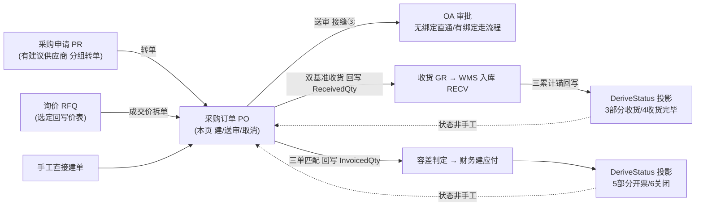
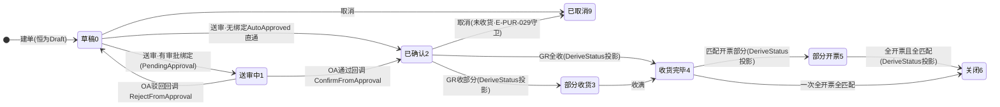

# 采购订单 PO 单页面操作 SOP（手把手版）

> **用途**：给**采购员建单/送审/取消、采购主管审批、培训老师讲、测试人员拆用例**。比模块总册（`04-采购管理` §5.4，含 5.4.1a~1e）更细。
> **页面**：采购订单 PO（PurchaseOrder · 采购管理 BOOK-M09 核心页）　**路由**：`/pur/po`　**前端**：`views/pur/PurchaseOrderView.vue`　**API**：`api/pur/pur.ts poApi.{list,get,create,submit,cancel}`（前缀 `/api/pur/po`）　**后端**：`Controllers/Pur/PurchaseOrderController` → `PurchaseOrderService.{CreateAsync, SubmitForApprovalAsync, CancelAsync, DeriveStatus}`
> **基准**：分支 `feat/training-m07`（基于 `main` `9f56591`），2026-06-29；后端逐行实测 `docs/codemap-pur/01-主数据-PO-收货-匹配.md`（二、PO 建单 + 五、PO 送审，2026-06-22 权威），UI 经实读 view + `types/pur/pur.ts`。
> **样例数据**：供应商 `SUP01`（`SupplierFlg=true`）、采购物料 `MAT-K280`（K280 原紙・巾1600mm）、采购订单 `PO2026070001`（系统采番，前缀 `PO`）、仓库 `W01`（落 `RECV` 暂存位）。

---

## 1. 页面一句话说明

**采购订单 PO，就是"向谁、买什么、按什么价、下多少量"的下单中枢——建单时系统自动带出供应商的币种/税码/汇率（外币当场冻结），单价按"手填优先、否则查供应商阶梯价带出、两者都没有就挡单 `E-PUR-022`"成交，并把每行的三累计锚（已收货 `ReceivedQty` / 已验收 `AcceptedQty` / 已开票 `InvoicedQty`）初始化为 0。** 它最关键的设计是：**PO 的运行态状态（部分收货/收货完毕/部分开票/关闭）从来不是手工点出来的，而是 `DeriveStatus` 这个纯函数从三累计锚投影出来的**——你在这页只能"建/送审/取消"，状态怎么走由下游 GR 收货、检收、三单匹配回写锚后系统自己算。

---

## 2. 这个页面在业务流程中的位置

- **上游**：采购申请 PR（有建议供应商分组转单）、询价 RFQ（选定回写价表后拆单）、或采购员手工直接建单。
- **本页**：建头+行（带价/挡单、冻结汇率）、送审走 OA、取消。
- **下游**：送审→OA 审批；GR 收货回写 `ReceivedQty`/`AcceptedQty`、三单匹配回写 `InvoicedQty`；**这些锚一变，PO 状态由 `DeriveStatus` 自动投影**（3 部分收货 / 4 收货完毕 / 5 部分开票 / 6 关闭）。

---

## 3. 谁使用这个页面

| 角色 | 用途 |
|---|---|
| 采购员（バイヤー） | 建单（带价/手填/外注 Type=2）、送审、取消草稿/已确认单 |
| 采购主管 | 经 OA 待办审批送审上来的 PO（通过→Confirmed / 驳回→Draft），本页只读监看 |
| 财务/收货对接 | 只读查看 PO 详情核对三累计锚、币种/汇率/过账基准、匹配状态 |

> 权限点 `pur-po`：`add`（建单）/`submit`（送审）/`cancel`（取消）三个细粒度操作分别校验（PUB 四粒度）。

---

## 4. 操作前准备

- [ ] **供应商先建档且 `SupplierFlg=true`**：本页供应商编码（如 `SUP01`）须是 ERP `BusinessPartner` 里真实存在且勾了供应商标志的——不存在→`E-PUR-020`、存在但非供应商→`E-PUR-021`。
- [ ] **外币供应商先登记汇率**：建单按"供应商币种快照 `CurrencyCd ?? BaseCurrency`"，外币会**当场冻结汇率**（`IFxRateService.ResolveRateAsync`），汇率没登记→`E-PUR-023`，建单被挡。
- [ ] **单价策略想清楚**：每行单价**留空＝按供应商阶梯价自动带出**（建单提示「单价留空时按供应商阶梯价自动带出，无适用价则挡单」），手填则以手填为准；既没手填又没价表→`E-PUR-022` 挡单。物料如 `MAT-K280` 需在供应商价表有适用阶梯档（才能带价）。
- [ ] **三累计锚是只读概念**：`ReceivedQty/AcceptedQty/InvoicedQty` 建单时全是 0，之后由 GR/检收/匹配回写；**PO 状态由 `DeriveStatus` 从这三锚投影，本页和任何屏都不能手工改状态**（重要，反复强调）。
- [ ] **过账基准看供应商**：建单时 `PostingBasis` 取供应商 `PurchasePostingDiv`、缺省 `"2"`（检收基准），它决定下游 GR 是着荷(1)收即验、还是检收(2)收货待检——本页只显示不直接填。
- [ ] **类型 1/2 分清**：1 标准采购走本套收货匹配；2 外注委托建出来后**走外注加工页（§5.7）独有流程**（发支給材/收成品成本），不要在本页期待外注子表。

---

## 5. 页面区域说明

| 区域 | 内容 |
|---|---|
| 页头 | 标题「采购订单」+ 副标题「建单带出币种/税码/汇率，行三累计锚（收货/验收/开票）派生订单状态」 |
| 搜索卡（el-card） | 工具条：供应商输入框（filter，回车 reload）/ 状态下拉（`PO_STATUS_LABEL` 八态可筛）/ **新建采购单** / 刷新 / 「共 n 条」tag |
| 列表（el-table，**无分页**） | `max-height="620"` 滚动；列：订单号 `poNo` / 供应商（`supplierName‖supplierId`）/ 类型 tag / 订单日期(slice 10) / 币种(默认 JPY) / 净额 / 价税合计 / 状态 tag(`PO_STATUS_TAG` 配色) / 操作[查看·送审·取消] |
| 建单弹窗（el-dialog **820px**） | 头：供应商(required)/类型(下拉 1·2)/订单日期/备注；明细行表（添加行/删行）：行号 / 物料 `itemId` / 数量 `qty`(min 0) / **单价 `unitPrice`(min 0·precision 4·placeholder「留空=带价」)** / 要求交期 / 删；底部 hint「单价留空时按供应商阶梯价自动带出，无适用价则挡单」 |
| 详情弹窗（el-dialog **900px**） | 头 descriptions(3列)：供应商/类型/状态 tag/币种/**汇率**/**入账基准**/净额/税额/价税合计；行表：行号/物料/数量/单价/**已收货/已验收/已开票（三累计锚 永久只读）**/匹配状态(`LINE_MATCH_LABEL`) |

> 列表无分页，靠 `max-height` 滚动；`rows.length` 显示在「共 n 条」tag。

---

## 6. 字段填写说明（口语版）

**建单头部字段**：

| 字段 | 谁提供 | 怎么填 | 填错影响 |
|---|---|---|---|
| 供应商(supplierId) | 采购 | 发注先编码如 `SUP01`，**required 必填**；须 `SupplierFlg=true` | 空→前端 warning「供应商必填」；不存在→`E-PUR-020`；非供应商→`E-PUR-021` |
| 类型(type) | 采购 | 下拉：1 标准采购 / 2 外注委托；默认 1 | 选 2＝外注，建出来走外注页独有流程 |
| 订单日期(orderDate) | 采购 | 默认当天，可改；`YYYY-MM-DD` | 作为 `orderDate` 与带价解析 `onDate` 基准 |
| 备注(remarks) | 采购 | 可空，最长 500 | — |

**建单明细行字段**（每行）：

| 字段 | 谁提供 | 怎么填 | 填错影响 |
|---|---|---|---|
| 物料(itemId) | 采购 | **必填**，如 `MAT-K280`，最长 40 | 空→前端 warning；后端行物料空→`E-PUR-025` |
| 数量(qty) | 采购 | **必填且 >0**，el-input-number min 0 | ≤0→前端 warning「每行需填物料且数量大于0」；后端→`E-PUR-026` |
| 单价(unitPrice) | 采购 | **留空＝带价**（按供应商阶梯价自动解析）；手填则优先；精度 4 位 | 既无手填又无适用价表→挡单 `E-PUR-022` |
| 要求交期(requiredDate) | 采购 | 行交期，`YYYY-MM-DD`，可空 | — |

> **建单时不填、也填不了**的：币种/税码/汇率（系统按供应商带出、外币冻结）、净额/税额/价税合计（系统按 `AwayFromZero` 算）、三累计锚（初始 0，下游回写）、过账基准（取供应商 `PurchasePostingDiv` 缺省 "2"）、状态（建出来恒为 `Draft(0)`）。

---

## 7. 按钮操作说明

| 按钮 | 何时出现/启用 | 点了会怎样 |
|---|---|---|
| 新建采购单 | 常显 | 开建单弹窗（820px），重置 form 为单空行 |
| 添加行 | 建单弹窗内常显 | 表尾增一空行（itemId 空、qty=1、unitPrice=null） |
| 删（行） | 每行 | `form.lines.splice` 删该行 |
| 确定（建单提交） | 建单弹窗底部（saving 时 loading） | 前端预校验（供应商必填、每行物料且数量>0）→`poApi.create`→后端 `CreateAsync`（带价/挡单+冻结汇率+建头建行三锚=0）→成功 toast「已新建」→关弹窗+reload |
| 查看 | 每行常显 | `poApi.get(poNo)`→详情弹窗（900px，只读，含三累计锚+匹配状态） |
| **送审** | **仅 `status===0`（草稿）行显示** | `poApi.submit(poNo)`→`SubmitForApprovalAsync`（接缝③）→无审批绑定 `AutoApproved`→直接 `Confirmed(2)`；有绑定→`PendingApproval(1)` 进 OA 待办→toast「已送审」+reload |
| **取消** | **仅 `status===0 或 2` 行显示** | 二次确认弹框→`poApi.cancel(poNo)`→`CancelAsync`（守卫已收货后不可取消 `E-PUR-029`）→`Cancelled(9)`→toast「已取消」+reload |
| 刷新 | 常显 | reload（带当前供应商/状态 filter） |

> **本页没有"改单/删单/改状态"按钮**——确认后改价改量受状态守卫，状态全由三累计锚派生。送审/取消按行状态条件显示（见 §10）。

---

## 8. 标准业务操作 SOP（照着点）

### 场景一：带价建单（主流程·单价留空走阶梯价）
- **背景**：供应商价表已维护，下单不手填价、让系统按阶梯价带出。
- **样例数据**：供应商 `SUP01`、物料 `MAT-K280`、数量 100、**单价留空**、类型 1 标准采购。
- **前置**：`SUP01` 已建且 `SupplierFlg=true`；`MAT-K280` 在 `SUP01` 价表有适用阶梯档（MinQty≤100、在效期内）。
- **步骤**：1) 点「新建采购单」；2) 填供应商 `SUP01`、类型选 1、订单日期默认当天；3) 行填物料 `MAT-K280`、数量 100、**单价不填**、要求交期按需；4) 点「确定」。
- **完成后检查**：toast「已新建」；列表多一条 `PO2026070001`、状态 `草稿(0)`；点「查看」→单价＝价表带出值、币种/汇率冻结、净额/税额/价税合计已算、三累计锚全 0、匹配「未匹配」。
- **异常**：供应商空→前端 warning；物料无适用价表且留空→后端 `E-PUR-022`。
- **可拆用例**：TC-M09-PO-001、002、010、011。

### 场景二：手填价建单（手填优先不查价表）
- **背景**：本单价格临时议定，直接手填，不走价表。
- **样例数据**：`SUP01`、`MAT-K280`、数量 50、**单价手填 280**。
- **前置**：同上但价表可有可无（手填优先）。
- **步骤**：1) 新建→填供应商；2) 行填物料/数量/**单价 280**；3) 确定。
- **完成后检查**：详情单价＝280（不查价表）；净额=50×280 按 `AwayFromZero`。
- **异常**：数量填 0 或负→前端 warning「每行需填物料且数量大于0」，不发请求。
- **可拆用例**：TC-M09-PO-003、012。

### 场景三：无价挡单（E-PUR-022）
- **背景**：物料既没手填价、价表又查不到适用档，系统拒绝建单。
- **样例数据**：`SUP01`、物料 `MAT-NOPRICE`（无价表）、数量 10、单价留空。
- **前置**：该物料在 `SUP01` 价表无适用阶梯档。
- **步骤**：1) 新建→填供应商；2) 行填物料/数量、单价留空；3) 确定。
- **完成后检查**：后端抛 `E-PUR-022`、**不建单**；列表无新行。
- **异常**：错误码可能裸显 `E-PUR-022`（i18n 待业务确认，见 §11）。
- **可拆用例**：TC-M09-PO-013、014。

### 场景四：外币冻结汇率（缺汇率挡单 E-PUR-023）
- **背景**：供应商是外币结算，建单当场冻结汇率；汇率没登记则挡单。
- **样例数据**：外币供应商 `SUP-USD`（CurrencyCd=USD）、物料 `MAT-K280`、数量 100、单价手填。
- **前置**：`SUP-USD` 已建且为供应商。
- **步骤**：1) 新建→填供应商 `SUP-USD`；2) 行填齐；3) 确定。
- **完成后检查**：若 USD 当日汇率已登记→建单成功，详情「币种 USD / 汇率＝冻结值」；若未登记→`E-PUR-023` 挡单不建。
- **异常**：汇率缺→`E-PUR-023`。
- **可拆用例**：TC-M09-PO-015、016。

### 场景五：送审直通（无审批绑定→AutoApproved→Confirmed）
- **背景**：该业务类型没启用审批绑定，送审即自动通过、直接确认。
- **样例数据**：草稿 `PO2026070001`、无启用 `Wf_ApprovalBinding`。
- **前置**：PO 状态 `草稿(0)`；`BizType="PUR_PO"` 无启用审批绑定。
- **步骤**：1) 列表找草稿行；2) 点「送审」。
- **完成后检查**：toast「已送审」；reload 后该行状态直接变 `已确认(2)`（`AutoApproved=true` 直通），送审按钮消失（status≠0）。
- **异常**：对非草稿点送审→后端 `E-PUR-028`（但 UI 已不显示送审按钮，仅绕过时触发）。
- **可拆用例**：TC-M09-PO-017、018、019。

### 场景六：送审走 OA（有绑定→PendingApproval→回调）
- **背景**：该类型配了审批绑定，送审进 OA 待办，主管审批后回调。
- **样例数据**：草稿 `PO2026070001`、`BizType="PUR_PO"` 有启用审批绑定。
- **前置**：PO 状态 `草稿(0)`；存在启用的 `Wf_ApprovalBinding`。
- **步骤**：1) 点「送审」；2) 采购主管去 OA 待办审批。
- **完成后检查**：送审后状态变 `送审中(1)`（PendingApproval）；OA **通过**→回调 `ConfirmFromApprovalAsync`→`Confirmed(2)`；**驳回**→`RejectFromApprovalAsync`→回 `Draft(0)`（回调不 SaveChanges，与 OA 引擎共享事务原子）。
- **异常**：—（OA 端流程，本页只发起）。
- **可拆用例**：TC-M09-PO-020、021、022。

### 场景七：取消草稿/已确认（守卫已收货后不可取消 E-PUR-029）
- **背景**：草稿或已确认但还没收货的单，可取消作废。
- **样例数据**：`PO2026070001` 状态 `草稿(0)` 或 `已确认(2)`、`ReceivedQty=0`。
- **前置**：状态为 0 或 2 才显示取消按钮。
- **步骤**：1) 点「取消」；2) 二次确认弹框点确定。
- **完成后检查**：toast「已取消」；状态变 `已取消(9)`、tag 红色；送审/取消按钮均消失。
- **异常**：已开始收货（`ReceivedQty>0`，状态已派生到 3/4 等）→后端 `E-PUR-029`，取消被挡（且 UI 此时也不显示取消按钮）。
- **可拆用例**：TC-M09-PO-023、024、025。

### 场景八：建单前端预校验拦截（不发请求）
- **背景**：点确定前漏填供应商或行字段，被前端 warning 中断、不调接口。
- **样例数据**：供应商空 / 某行物料空 / 某行数量≤0 任一。
- **前置**：建单弹窗内故意留空。
- **步骤**：1) 制造一处缺失；2) 点「确定」。
- **完成后检查**：弹 warning（供应商空→「供应商必填」；行缺物料或数量≤0→「每行需填物料且数量大于0」），**不调 `poApi.create`、不建单**；补齐后再提交正常。
- **异常**：—（本场景就是验证前端拦截）。
- **可拆用例**：TC-M09-PO-026、027、028。

### 场景九：派生状态投影验证（收货/匹配后状态自动走）
- **背景**：确认本页不手工改状态，下游回写锚后状态自动投影。
- **样例数据**：已确认 PO 行 数量 100；GR 收 60、匹配开票 100。
- **前置**：PO `已确认(2)`。
- **步骤（跨页验证，本页只读看结果）**：1) 去 GR 收 60→回本页查看；2) 收满 100→查看；3) 三单匹配开票满→查看。
- **完成后检查**：收 60→状态自动 `部分收货(3)`；收满→`收货完毕(4)`；部分开票→`部分开票(5)`；全开票且全匹配→`关闭(6)`——**全程本页无任何手工改状态动作**（`DeriveStatus` 投影）。
- **异常**：—（验证非手工）。
- **可拆用例**：TC-M09-PO-029、030、031。

---

## 9. 状态变化说明

- **本页可点出来的迁移**：建单→`草稿(0)`；送审→`送审中(1)`/`已确认(2)`；取消→`已取消(9)`。
- **派生（非手工）迁移**：`3部分收货/4收货完毕/5部分开票/6关闭` 全由 `DeriveStatus` 从三累计锚（ReceivedQty/AcceptedQty/InvoicedQty）投影，草稿/送审中/取消不参与派生（`DeriveStatus` 规则：全开票且全匹配→Closed / 任一开票→PartiallyInvoiced / 全收→Received / 任一收→PartiallyReceived / 否则 Confirmed）。
- **PO_STATUS 全表**：0 草稿 / 1 送审中 / 2 已确认 / 3 部分收货 / 4 收货完毕 / 5 部分开票 / 6 关闭 / 9 已取消（`PO_STATUS_LABEL`，配色 `PO_STATUS_TAG`）。

---

## 10. 按钮不可用 / 灰色 / 找不到的原因

| 现象 | 原因 |
|---|---|
| 某行没有「送审」按钮 | **仅 `status===0`（草稿）行显示**；已确认/送审中/已收货/取消的单不显示 |
| 某行没有「取消」按钮 | **仅 `status===0 或 2`（草稿/已确认）行显示**；已开始收货(3/4/5/6)或已取消(9)不显示 |
| 送审中(1)的单想取消却没按钮 | UI 只对 0/2 显示取消，**后端 `CancelAsync` 其实允许 Draft/PendingApproval/Confirmed**——送审中单的取消无前端入口（盲点，见 §11） |
| 建单「确定」点了没反应 | 前端预校验未过：供应商空 / 某行物料空 / 某行数量≤0（弹 warning 不发请求） |
| 详情里「已收货/已验收/已开票」改不了 | 三累计锚**永久只读**，由 GR/检收/匹配回写，非手工 |
| 找不到"改状态/改价改量"按钮 | 本页无改单入口；状态由 `DeriveStatus` 派生、确认后改价改量受状态守卫 |
| 列表翻不到下一页 | **本页无分页**，靠 `max-height="620"` 滚动；用供应商/状态 filter 收窄 |
| 操作按钮全无（只剩查看） | 当前登录无 `pur-po` 的 `add/submit/cancel` 对应权限点 |

---

## 11. 常见错误与处理

| 错误 | 原因 | 处理 |
|---|---|---|
| `E-PUR-020` | 供应商编码在 `BusinessPartner` 不存在 | 先建供应商主数据 |
| `E-PUR-021` | 该编码存在但 `SupplierFlg≠true`（不是供应商） | 勾选供应商标志或换正确编码 |
| `E-PUR-022` 无价挡单 | 单价留空且供应商价表无适用阶梯档 | 手填单价，或先维护供应商价表（含 MinQty/效期） |
| `E-PUR-023` 汇率未登记 | 外币供应商当日汇率没登记 | 先登记该币种汇率再建单 |
| `E-PUR-024` 行空 | 提交时没有任何明细行 | 至少加一行 |
| `E-PUR-025` 物料空 | 某行物料未填 | 补物料编码（前端通常已拦） |
| `E-PUR-026` 数量≤0 | 某行数量 0 或负 | 数量填 >0（前端通常已拦） |
| `E-PUR-028` 非草稿送审 | 对非 Draft 单送审（绕过 UI） | 仅草稿可送审；UI 已只对 status===0 显示送审 |
| `E-PUR-029` 状态不可取消 | 已开始收货后想取消 | 收货后不可取消；走采购对账等其他流程处理 |
| 想手工改 PO 状态 | **状态由三累计锚 `DeriveStatus` 投影，不可手工改**（诚实标注：这是设计如此，任何屏都没有改状态入口） | 通过 GR 收货/三单匹配回写锚来推进状态 |
| 送审中(1)的单找不到取消按钮 | UI 只对 0/2 显示取消，送审中无前端入口（后端其实允许） | 等 OA 回调到 Draft/Confirmed 后再取消，或走 OA 撤回（盲点，待业务确认） |
| 错误提示显示成 `E-PUR-0xx` 裸码 | **采购 E-PUR 错误码是否走 i18n 中文化待业务确认**（label 走 `t()` 显中文，但后端 E-PUR 码可能裸显） | 按错误码表对照处理；i18n 化为待确认项 |

---

## 12. 操作完成后的检查清单

- [ ] **建单**：列表多一条 `PO…`（如 `PO2026070001`）、状态 `草稿(0)`、「共 n 条」+1；点「查看」→单价（带价/手填）、币种/**冻结汇率**、**入账基准**（缺省检收 2）、净额/税额/价税合计已算、三累计锚全 0、匹配「未匹配」。
- [ ] **送审·无绑定**：状态直接 `已确认(2)`、送审按钮消失（`AutoApproved` 直通）。
- [ ] **送审·有绑定**：状态 `送审中(1)`，去 OA 待办看到该 PO；主管通过→回 `已确认(2)`、驳回→回 `草稿(0)`。
- [ ] **取消**：状态 `已取消(9)`、tag 红、送审/取消按钮消失（前提未收货，否则被 `E-PUR-029` 挡）。
- [ ] **派生验证（下游回写后回本页查看）**：GR 收货后行 `已收货 +=`、状态自动 `部分收货(3)/收货完毕(4)`；三单匹配后行 `已开票 +=`、状态自动 `部分开票(5)/关闭(6)`——**全程未手工改状态**。

---

## 13. 页面级测试用例（≥30 条，可执行）

> 编号 `TC-M09-PO-xxx`；数据用样例（SUP01 / MAT-K280 / PO2026070001 / W01）。优先级 P0 主链、P1 重要、P2 边界、P3 体验。

| 用例编号 | 用例名称 | 优先级 | 前置条件 | 测试数据 | 操作步骤 | 预期结果 | 下游检查 | 备注 |
|---|---|---|---|---|---|---|---|---|
| TC-M09-PO-001 | 带价建单成功 | P0 | SUP01 价表有 MAT-K280 适用档 | SUP01/MAT-K280/100/单价空 | 新建→填→确定 | 生成 PO…、状态草稿 | 详情单价=价表带出值 | 主流程 |
| TC-M09-PO-002 | 阶梯价取 MinQty 最大档 | P1 | 多档价表 | qty 跨档 | 建单留空价 | 取符合 qty 的最大 MinQty 档价 | — | 复用 ResolvePrice |
| TC-M09-PO-003 | 手填价优先不查价表 | P0 | 价表可有可无 | 单价手填 280 | 建单填 280 | 单价=280（不查价表） | 净额=qty×280 | 手填优先 |
| TC-M09-PO-004 | 供应商空前端拦截 | P0 | 建单弹窗 | supplierId 空 | 确定 | warning「供应商必填」不发请求 | 不建单 | 前端预校验 |
| TC-M09-PO-005 | 行物料空前端拦截 | P0 | 有行 | itemId 空 | 确定 | warning「每行需填物料且数量大于0」 | 不建单 | 前端预校验 |
| TC-M09-PO-006 | 行数量≤0前端拦截 | P0 | 有行 | qty=0 | 确定 | warning 同上不发请求 | 不建单 | 前端预校验 |
| TC-M09-PO-007 | 添加行 | P3 | 建单弹窗 | — | 点添加行 | 表尾增空行(qty=1,unitPrice=null) | — | UI |
| TC-M09-PO-008 | 删行 | P3 | 多行 | — | 点某行「删」 | splice 删该行 | — | UI |
| TC-M09-PO-009 | 类型选外注(2) | P1 | 建单 | type=2 | 选外注委托建单 | 建出 Type=2 PO | 走外注页流程 | 类型 |
| TC-M09-PO-010 | 建单初始化三累计锚=0 | P0 | 建单成功 | — | 查看详情 | 已收货/已验收/已开票 均 0 | 匹配「未匹配」 | 锚初始 |
| TC-M09-PO-011 | 建单冻结币种/汇率 | P1 | 本币供应商 | SUP01 | 建单→查看 | 币种=供应商币种、汇率冻结 | — | 快照 |
| TC-M09-PO-012 | 净额/税额 AwayFromZero | P2 | 建单 | qty×price 含小数 | 建单→查看 | net/tax 按 AwayFromZero 取整 | grossAmount=net+tax | 金额 |
| TC-M09-PO-013 | 无价挡单 E-PUR-022 | P0 | 物料无价表 | MAT-NOPRICE/单价空 | 建单 | E-PUR-022、不建单 | 列表无新行 | 挡单 |
| TC-M09-PO-014 | 有手填则无价也建 | P1 | 物料无价表 | 单价手填 | 建单填价 | 建单成功（手填兜底） | — | 手填优先 |
| TC-M09-PO-015 | 外币冻结汇率成功 | P1 | USD 汇率已登记 | SUP-USD/手填 | 建单 | 成功、币种USD汇率冻结 | — | FxRate |
| TC-M09-PO-016 | 外币汇率未登记挡单 | P1 | USD 汇率缺 | SUP-USD | 建单 | E-PUR-023、不建单 | — | 汇率守卫 |
| TC-M09-PO-017 | 送审仅草稿显示 | P0 | 草稿 PO | — | 看列表操作列 | status===0 才显示「送审」 | — | 条件显示 |
| TC-M09-PO-018 | 送审无绑定直通 Confirmed | P0 | 无审批绑定 | 草稿 PO | 点送审 | 状态直接已确认(2) | AutoApproved | 接缝③ |
| TC-M09-PO-019 | 送审成功 toast | P2 | 草稿 | — | 送审 | toast「已送审」+reload | — | — |
| TC-M09-PO-020 | 送审有绑定→送审中 | P0 | 有审批绑定 | 草稿 PO | 送审 | 状态 送审中(1)、进 OA 待办 | OA 出现该 PO | PendingApproval |
| TC-M09-PO-021 | OA通过回调→Confirmed | P0 | 送审中 | — | OA 审批通过 | 回调→已确认(2) | 不 SaveChanges 共享事务 | 回调 |
| TC-M09-PO-022 | OA驳回回调→Draft | P1 | 送审中 | — | OA 驳回 | 回调→回草稿(0) | 可再送审 | 回调 |
| TC-M09-PO-023 | 取消仅0/2显示 | P0 | 各状态 PO | — | 看操作列 | status===0或2 才显示「取消」 | — | 条件显示 |
| TC-M09-PO-024 | 取消草稿成功 | P0 | 草稿 PO | — | 取消→确认 | 状态已取消(9) | tag 红 | — |
| TC-M09-PO-025 | 已收货取消被挡 E-PUR-029 | P1 | 已收货(3/4) | — | (绕UI)取消 | E-PUR-029、不取消 | UI此态无取消按钮 | 守卫 |
| TC-M09-PO-026 | 取消二次确认 | P2 | 草稿 | — | 取消→点取消弹框取消 | 不执行取消 | — | ElMessageBox |
| TC-M09-PO-027 | 行空建单后端兜底 | P2 | 绕前端 | lines=[] | 直接调 create | E-PUR-024 | 不建单 | 后端校验 |
| TC-M09-PO-028 | 物料空后端兜底 | P2 | 绕前端 | itemId 空 | 调 create | E-PUR-025 | — | 后端校验 |
| TC-M09-PO-029 | 数量≤0后端兜底 | P2 | 绕前端 | qty=0 | 调 create | E-PUR-026 | — | 后端校验 |
| TC-M09-PO-030 | 收货后派生部分收货 | P0 | 已确认 PO qty100 | GR 收60 | 收货后看本页 | 状态自动 部分收货(3) | 行已收货=60 | DeriveStatus |
| TC-M09-PO-031 | 全收派生收货完毕 | P0 | 已确认 PO | GR 收满 | 收货后看 | 状态自动 收货完毕(4) | 行已收货=qty | DeriveStatus |
| TC-M09-PO-032 | 匹配后派生开票/关闭 | P0 | 收货完毕 | 匹配开票满 | 匹配后看 | 部分开票(5)/关闭(6) | 行已开票=qty | DeriveStatus |
| TC-M09-PO-033 | 状态不可手工改 | P0 | 任意 PO | — | 找改状态入口 | 全屏无改状态按钮 | 锚投影 | 诚实标注 |
| TC-M09-PO-034 | 供应商filter | P3 | 多供应商 PO | SUP01 | 输 SUP01 回车 | 仅 SUP01 的 PO | — | 列表 filter |
| TC-M09-PO-035 | 状态filter | P3 | 多状态 PO | 选 草稿 | 选状态下拉 | 仅该状态 PO | — | 列表 filter |
| TC-M09-PO-036 | 列表无分页滚动 | P3 | >屏行数 | — | 滚动列表 | max-height 滚动无分页器 | — | 现状 |
| TC-M09-PO-037 | E-PUR 裸码显示 | P2 | 触发任一 E-PUR | — | 看错误提示 | 可能裸显 E-PUR-0xx | i18n 待确认 | 诚实标注 |
| TC-M09-PO-038 | 送审中无取消入口 | P2 | 送审中(1) | — | 看操作列 | 无取消按钮(后端却允许) | 盲点 | 诚实标注 |

---

## 14. 培训讲解建议

| 顺序 | 讲什么 | 演示 | 易误解点 |
|---|---|---|---|
| 1 | 这页是"下单中枢"+三累计锚地基 | §2 流程图 | 以为 PO 自己管收货开票 |
| 2 | 单价三策略：手填>带价>挡单 | 留空带价 / 手填 / 无价 E-PUR-022 | 以为留空就是 0 价 |
| 3 | 外币当场冻结汇率 | 建外币单看详情汇率 | 以为汇率随当日浮动 |
| 4 | **状态全由 DeriveStatus 投影、不可手工改** | 收货后回看状态自动变 | 想在本页手工点"已收货" |
| 5 | 送审两条路：直通 vs 走 OA | 无绑定直接 Confirmed / 有绑定进待办 | 以为送审一定要人审 |
| 6 | 取消的状态守卫 | 草稿/已确认可取消、收货后 E-PUR-029 | 以为啥时候都能取消 |
| 7 | 类型 1 vs 2（外注另走页） | 选 2 后说明去外注页 | 以为外注子表在本页 |
| 8 | 盲点：送审中无取消入口、E-PUR 裸码 | 演示送审中操作列 | 以为系统一定中文提示 |

---

## 15. 与模块级手册的关系

对应 `04-采购管理-最详细用户操作培训手册.md` **§5.4 采购订单 PO**（含 5.4.1a~1e：业务前置/字段口径/灰按钮/完成后下游验证/详细场景）。相邻页：§5.5 收货 GR（双基准收货、委托 WMS 入库、回写 `ReceivedQty/AcceptedQty`）；§5.6 三单匹配（容差判定、回写 `InvoicedQty`、建并过账应付）；§5.7 外注加工（Type=2 PO 的发支給材/收成品成本独有流程）。三累计锚与 `DeriveStatus` 派生贯穿见 §1、§3。模块样例数据见 §0（与 M06 WMS 同一条供应链，原紙 `MAT-K280`）。

---

## 16. 代码与文档来源

| 层 | 文件 |
|---|---|
| 逐行源码手册 | `docs/codemap-pur/01-主数据-PO-收货-匹配.md`（二、PO 建单+DeriveStatus 230 / 五、PO 送审，2026-06-22 实测） |
| 前端 view | `cp6.web/src/views/pur/PurchaseOrderView.vue`（submit 预校验 :168-182、doSubmit :191-196、doCancel :198-204、送审/取消条件显示 :43-44） |
| 前端 API | `cp6.web/src/api/pur/pur.ts`（`poApi` list/get/create/submit/cancel :32-48） |
| 前端类型/枚举 | `cp6.web/src/types/pur/pur.ts`（PurchaseOrder/PoCreateForm :42-78、PO_STATUS_LABEL/TAG :283-286、PO_TYPE_LABEL :278、POSTING_BASIS_LABEL :300） |
| 后端 Controller | `Controllers/Pur/PurchaseOrderController.cs`（Create :33-39 `[RequirePermission("pur-po","add")]`、submit、cancel） |
| 后端 Service | `Services/Pur/PurchaseOrderService.cs`（**CreateAsync :55-145** 带价/挡单/冻结汇率 / **DeriveStatus :230-245** 派生 / RefreshStatusAsync :207-224 / **SubmitForApprovalAsync :148-169** / CancelAsync 守卫 E-PUR-029） |
| 价表带价复用 | `Services/Pur/SupplierPriceService.cs`（ResolvePriceAsync :15-31 阶梯规则，被 PO 建单复用） |
| 送审接缝 | `Services/Pur/Contracts/ApprovalServiceAdapter.cs`（:27-43 无绑定 AutoApproved 直通/有绑定走 OA）+ `PurApprovalCallback.cs`（PoApprovalCallback 通过/驳回回调，不 SaveChanges） |
| 实体 | `DomainModels/Pur/PurchaseOrder.cs` / `PurchaseOrderLine.cs`（三累计锚 ReceivedQty/AcceptedQty/InvoicedQty） |
| 测试佐证 | `CP6.Tests`（采购 PO 建单/派生状态/送审测试） |

---

## 最后更新来源

- 代码：见 §16（codemap-pur 01 二/五 + PurchaseOrderView.vue 实读 + pur.ts/api 实读）。
- 基准：分支 `feat/training-m07`（基于 main `9f56591`），2026-06-29（codemap 2026-06-22 权威）。
- 覆盖：16 节 / 9 场景 / 38 用例（TC-M09-PO-001~038）。
- 诚实标注盲点：①PO 状态全由 `DeriveStatus` 从三累计锚投影、**任何屏都不可手工改状态**；②采购 E-PUR 错误码是否 i18n 中文化**待业务确认**（label 走 `t()` 中文，后端 E-PUR 码可能裸显）；③送审中(1)单后端 `CancelAsync` 允许取消但 UI 无入口；④列表无分页（max-height 滚动）；⑤外注 Type=2 建出后走外注页独有流程，本页无外注子表。
</content>
</invoke>
