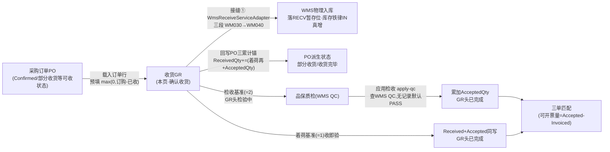
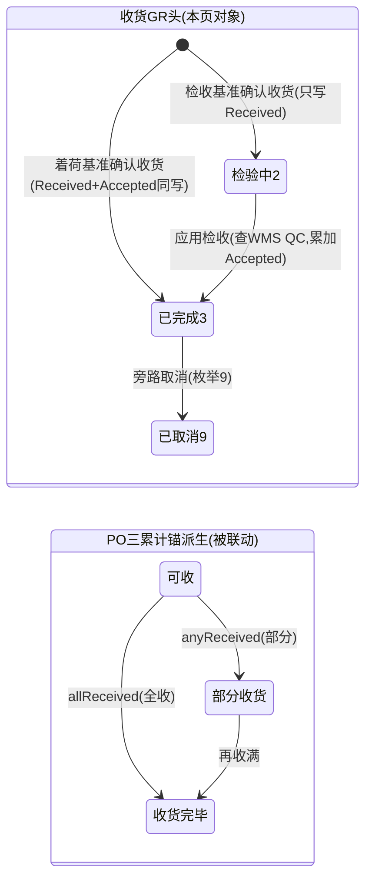

# 收货 GR 单页面操作 SOP（手把手版）

> **用途**：给**收货员/品保（检收）操作、培训老师讲、测试人员拆用例**。比模块总册（`04-采购管理` §5.5，含 5.5.1a~1e）更细到"照着点"。
> **页面**：收货 GR（采购管理 · 核心）　**路由**：`/pur/gr`　**前端**：`views/pur/GoodsReceiptView.vue`　**API**：`api/pur/pur.ts grApi.confirm`（确认收货）/ `grApi.applyQc`（应用检收）　**后端**：`Controllers/Pur/GoodsReceiptController.Confirm` → `GoodsReceiptService.ConfirmReceiveAsync`（双基准 + 委托 WMS 入库 + 回写三锚）/ `ApplyQcResultAsync`（检收应用）
> **基准**：分支 `feat/wfs-inbox-core`，2026-06-29；后端实测 `docs/codemap-pur/01-主数据-PO-收货-匹配.md` 三、（2026-06-22 权威），UI 经实读 `GoodsReceiptView.vue` + `types/pur/pur.ts`。
> **样例数据**：采购订单 `PO2026070001`、收货单 `GR2026070001`、物料 `MAT-K280`（K280 原紙）、供应商 `SUP01`、仓库 `W01`（落 `RECV` 暂存位）、WMS 入库单 `WmsInboundNo`（系统采番回填）。

---

## 1. 页面一句话说明

**收货 GR，就是把"采购订单的货收进来"登记进系统的地方——填好 PO 号点「载入订单行」预填本次收货量，再点「确认收货」，系统就按 PO 的过账基准走两条路：着荷基准（PostingBasis=1）收即验（同时写 Received + Accepted、GR 头直接「已完成」）；检收基准（=2）先只写 Received、GR 头「检验中」，等品保质检后再点「应用检收」累加 Accepted。** 无论哪条路，确认收货都会**真实委托 WMS 物理入库**（接缝① `WmsReceiveServiceAdapter` 三段 WM030→WM040，落 `RECV` 暂存位，经库存铁律 IN 真增库存、回填 `WmsInboundNo`），并**回写 PO 三累计锚 ReceivedQty/AcceptedQty**，触发 PO 派生状态（部分收货 / 收货完毕）。它是采购"货到了没、收没收对"的收口屏，也是 ERP 真正触发 WMS 加库存的采购侧唯一入口。

---

## 2. 这个页面在业务流程中的位置

- **上游**：PO 已 `Confirmed/PartiallyReceived/Received/PartiallyInvoiced`（仅这些可收货，否则 `E-PUR-032`）。
- **本页**：登记实收、确认收货 → 委托 WMS 真实入库 + 回写 PO 三锚；检收基准再走一步「应用检收」。
- **下游**：库存（RECV 暂存位真增，可被引当出货）；PO 派生状态；三单匹配（按 `AcceptedQty` 开票）。

---

## 3. 谁使用这个页面

| 角色 | 用途 |
|---|---|
| 收货员 | 货到后填 PO 号载入订单行、核对/改本次收货量、确认收货 |
| 品保（检收岗） | 检收基准下，质检后点「应用检收」累加合格量 |
| 系统（接缝） | 确认收货时经 `WmsReceiveServiceAdapter` 自动委托 WMS 入库、`WmsQcQueryAdapter` 查 QC（无人工） |

---

## 4. 操作前准备

- [ ] **PO 处于可收状态**：`Confirmed/PartiallyReceived/Received/PartiallyInvoiced` 之一，否则确认收货被挡 `E-PUR-032`；草稿/送审中/已取消不可收。
- [ ] **看清过账基准**：PO 带来 `PostingBasis`（1 着荷=收即验 / 2 检收=收货待检），决定确认后 GR 头是「已完成」还是「检验中」、Accepted 何时累加。列表「入账基准」列可直接看到。
- [ ] **仓库已建**：`warehouseCd`（如 `W01`）——WMS 入库会落到该仓的 `RECV` 暂存位。
- [ ] **本次收货量不得超过订购未收量**（超收挡 `E-PUR-031`）；「载入订单行」会按 `max(0, 订购量 − 已收货)` 预填，可改。
- [ ] **检收基准要记得第二步**：确认收货后状态＝`检验中(2)`，须再点「应用检收」（查 WMS QC）才累加 `AcceptedQty`，否则不可开票。
- [ ] **权限**：需 `pur-gr` 操作点（新建收货=`add`；应用检收=`qc`，apply-qc action 名 **待确认**）。

---

## 5. 页面区域说明

| 区域 | 内容 |
|---|---|
| 搜索/工具条 | 采购订单号过滤框（poNo，@change reload）/ 供应商过滤框（supplierId）/ **新建收货**（openCreate）/ **刷新**（reload）/ 「共 {n} 条」计数 tag |
| 列表（el-table，max-height 620，无分页） | 8 列：收货单号(grNo) / 采购订单号(poNo) / 供应商(supplierId) / 收货日期(receiptDate 取前 10 位) / **入账基准**(着荷/检收 tag，默认 '2') / WMS入库单(wmsInboundNo，空显「—」) / 状态(status tag) / 操作[查看 · **应用检收**(仅 status===2 显示)] |
| 新建收货弹窗（el-dialog 820px） | 头：**采购订单号**(required，带「载入订单行」append 按钮) / 收货日期(默认今天) / 入库仓库(warehouseCd) / 备注；明细表 5 列：行(poLineNo) / 物料(itemId) / 订购量(orderedQty 只读) / 已收货(receivedQty 只读) / **本次收货**(thisQty，el-input-number min=0 可编辑)；底部提示「本次收货量超出订购未收量将被挡（超收）」；footer：取消 / **确认收货**(lineRows 为空时禁用) |
| 详情弹窗（el-dialog 820px） | 描述区：采购订单号/供应商/状态/入账基准/WMS入库单/入库仓库；明细表 6 列：行/物料/收货量(receivedQty)/合格量(acceptedQty)/不良量(rejectedQty)/检收状态(qcStatus：免检/待检/合格/不良) |

> 列表无分页（`max-height` 滚动）；新建/详情两个弹窗都是 820px。

---

## 6. 字段填写说明（口语版）

**新建收货 — 头部字段**：

| 字段 | 谁提供 | 怎么填 | 填错影响 |
|---|---|---|---|
| 采购订单号(poNo) | 收货员 | 必填，填 `PO2026070001` 后点「载入订单行」 | 空点载入→warning「请先填采购订单号」；不存在→后端 `E-PUR-027` |
| 收货日期(receiptDate) | 系统 | 默认今天(YYYY-MM-DD)，可改 | 落 GR 头收货日 |
| 入库仓库(warehouseCd) | 收货员 | 仓库代码如 `W01`；提交时空则传 null | WMS 入库目标仓（落 `RECV` 暂存位） |
| 备注(remarks) | 收货员 | 可空，≤500 字 | — |

**新建收货 — 明细字段**（每行，由「载入订单行」生成）：

| 字段 | 来源 | 怎么填 | 填错影响 |
|---|---|---|---|
| 行(poLineNo) | 载入自动 | 来自 PO 行号，只读 | 回写 PO 行靠它命中 |
| 物料(itemId) | 载入自动 | 来自 PO 行，只读，如 `MAT-K280` | — |
| 订购量(orderedQty) | 载入自动 | PO 行订购数，只读 | — |
| 已收货(receivedQty) | 载入自动 | PO 行累计已收，只读 | — |
| **本次收货(thisQty)** | 收货员 | 预填 `max(0, 订购量−已收货)`，可改；**必须 >0 才会被提交** | >订购未收→`E-PUR-031`；全为 0→warning「请填写至少一行收货量」 |

> 提交时只取 `thisQty>0` 的行（`poLineNo + receivedQty=thisQty`）；thisQty=0 的行直接被丢弃，不发后端。

---

## 7. 按钮操作说明

| 按钮 | 何时出现/启用 | 点了会怎样 |
|---|---|---|
| 新建收货 | 常显 | `openCreate()`：重置表单、清空明细、打开 820px 弹窗 |
| 刷新 | 常显 | `reload()`：按 poNo/supplierId 过滤重拉列表 |
| 载入订单行（poNo append） | 弹窗内常显 | `loadPoLines()`：拉 PO，**只取 `(l.status??0)===0` 行**，按 `max(0,订购−已收)` 预填 thisQty；PO 不存在→warning「采购订单不存在」；无可收行→info「该订单无可收货明细」；**不写库存** |
| 确认收货 | `lineRows.length>0` 才可点（空则禁用，loading 时禁用） | 取 `thisQty>0` 行→`grApi.confirm`→后端 `ConfirmReceiveAsync`：双基准定 GR 头状态、**超收挡 `E-PUR-031`**、**委托 WMS 真实入库**回填 `WmsInboundNo`、回写 PO 三锚、刷新 PO 派生→成功 toast「已收货」→关弹窗+刷新列表 |
| 查看 | 每行常显 | `openDetail()`：拉 GR 详情，打开 820px 详情弹窗（看收货量/合格量/不良量/检收状态） |
| **应用检收** | **仅 `status===2`（检验中）行显示** | `doApplyQc()`→`grApi.applyQc`→后端 `ApplyQcResultAsync`：查 WMS QC（`QcInspection.Status==2`，**无记录默认全合格 PASS**）→累加 `AcceptedQty`→GR 头→已完成→toast「检收已应用」→刷新 |

> **本屏没有"改/删已确认收货"的按钮**——确认即委托 WMS 真增库存，修正只能走盘点调整等其他屏；着荷基准一步到位、检收基准两步（确认 + 应用检收）。

---

## 8. 标准业务操作 SOP（照着点）

### 场景一：着荷基准收货（收即验，主流程）
- **背景**：PO 的过账基准是着荷（PostingBasis=1），货到即验收，一步到位。
- **样例数据**：`PO2026070001`（PostingBasis=1、行 物料 `MAT-K280` 订购 100、已收 0）、仓库 `W01`、供应商 `SUP01`。
- **前置**：PO 状态 `Confirmed`（或部分收货等可收状态）。
- **步骤**：1) 点「新建收货」；2) 填采购订单号 `PO2026070001` → 点「载入订单行」（明细按 100−0=100 预填 thisQty）；3) 填入库仓库 `W01`；4) 按需改本次收货量（默认 100）；5) 点「确认收货」。
- **完成后检查**：toast「已收货」、生成 `GR2026070001`；列表入账基准列显「着荷基准」、状态直接 **已完成(3)**、WMS入库单列回填 `WmsInboundNo`；去 WMS 在庫照会查 `MAT-K280@W01/RECV` → `PhysicalQty += 100`（库存铁律 IN）；PO 行 `ReceivedQty += 100`、`AcceptedQty += 100`（着荷同写）、PO 状态派生「收货完毕」。
- **异常**：仓库/PO 状态/超收等见后续场景。
- **可拆用例**：TC-M09-GR-001、002、010、011、012。

### 场景二：检收基准收货 → 应用检收（两步）
- **背景**：PO 过账基准是检收（=2），收货只先入账 Received、待品保质检后再验收。
- **样例数据**：`PO2026070001`（PostingBasis=2、行 `MAT-K280` 订购 100、已收 0）、仓库 `W01`。
- **前置**：PO 可收状态；品保会在 WMS 侧出 QC 结果（或无 QC 记录）。
- **步骤**：1) 新建收货→载入订单行→确认收货（GR 头落 **检验中(2)**，只写 ReceivedQty，行 QcStatus=待检 PENDING、AcceptedQty=0）；2) 品保完成质检；3) 回列表，对该 `GR2026070001`（status===2）行点「应用检收」。
- **完成后检查**：第 1 步后状态「检验中」、Accepted 未增、WMS 已真增库存到 RECV；第 2 步 toast「检收已应用」，后端查 WMS QC 累加 `AcceptedQty`、GR 头→**已完成(3)**；之后才进得了三单匹配（可开票量=Accepted−Invoiced）。
- **异常**：对非「检验中」的 GR 调 apply-qc→后端 `E-PUR-036`。
- **可拆用例**：TC-M09-GR-003、004、013、014、015。

### 场景三：部分收货 → PO 派生「部分收货」
- **背景**：货分批到，先收一部分。
- **样例数据**：`PO2026070001` 行订购 100、已收 0；本次只收 60。
- **前置**：着荷或检收基准均可。
- **步骤**：1) 新建收货→载入订单行（预填 100）；2) 把本次收货由 100 改为 60；3) 确认收货。
- **完成后检查**：库存 RECV `+60`；PO 行 `ReceivedQty=60`、PO 状态派生「部分收货(PartiallyReceived=3)」；可再次新建收货收剩余 40（载入预填 `max(0,100−60)=40`），收满后 PO 派生「收货完毕」。
- **异常**：第二批若把 40 改大于剩余→`E-PUR-031`。
- **可拆用例**：TC-M09-GR-016、017、018。

### 场景四：超收被挡（E-PUR-031）
- **背景**：本次收货量超过订购未收量，被后端硬挡。
- **样例数据**：`PO2026070001` 行订购 100、已收 0；本次填 120。
- **前置**：可收状态。
- **步骤**：1) 新建收货→载入订单行；2) 把本次收货由 100 改为 120；3) 确认收货。
- **完成后检查**：后端 `poLine.ReceivedQty + ld.ReceivedQty > poLine.Qty` 命中→抛 **`E-PUR-031`**，整单不落库、PO 三锚不变、无 GR 生成；前端不预拦（仅底部文字提示），靠后端守门。
- **异常**：—（本场景即验证超收守门）。
- **可拆用例**：TC-M09-GR-019、020。

### 场景五：载入订单行预填规则（只拉未收行、只提交有量行）
- **背景**：验证「载入订单行」的过滤与预填、提交时的取舍。
- **样例数据**：`PO2026070001` 有多行，部分行 `status` 非 0（已收满/关闭）；某行预填本次收货留 0。
- **前置**：PO 存在且有行。
- **步骤**：1) 填 PO 号→载入订单行（观察：仅 `(l.status??0)===0` 行入表，thisQty=`max(0,订购−已收)`）；2) 把其中一行 thisQty 改成 0；3) 确认收货。
- **完成后检查**：非 status=0 的行根本不进明细；提交时只取 `thisQty>0` 行（thisQty=0 行被丢弃，不发后端）；若全部为 0→warning「请填写至少一行收货量」、不发请求。
- **异常**：PO 无可收行→info「该订单无可收货明细」、明细空、确认收货按钮禁用。
- **可拆用例**：TC-M09-GR-021、022、023、024。

### 场景六：PO 状态守卫 / PO 不存在 / 行空拦截
- **背景**：在不可收状态或脏数据下确认收货被后端拦。
- **样例数据**：草稿/送审中/已取消的 PO；或错误 PO 号 `PO9999999999`；或明细全 0。
- **前置**：构造对应坏状态。
- **步骤**：1) 用不可收状态 PO 载入→改量→确认收货 → `E-PUR-032`；2) 用不存在 PO 号确认 → `E-PUR-027`；3) 行全部为 0 提交 → 前端 warning「请填写至少一行收货量」（绕过则后端 `E-PUR-030`）。
- **完成后检查**：均不落库、无 GR 生成、PO 三锚不变；错误码可能裸显（i18n 待确认）。
- **异常**：—（本场景即验证守门）。
- **可拆用例**：TC-M09-GR-025、026、027。

### 场景七：检收无 QC 记录默认 PASS（盲点验证）
- **背景**：检收基准 GR 应用检收时，WMS 侧没有任何 QC 记录，系统**默认全合格 PASS**。
- **样例数据**：检收基准 `GR2026070001`（status===2）、对应 `WmsInboundNo` 在 WMS QC 无记录。
- **前置**：场景二第 1 步完成（已确认、检验中）。
- **步骤**：1) WMS 侧不录任何 QC；2) 点「应用检收」。
- **完成后检查**：`ApplyQcResultAsync` 查 `IWmsQcQuery.QueryByReceiptAsync(WmsInboundNo)` 无记录→**默认 PASS**→把本次收货量全额累加到 `AcceptedQty`、GR 头→已完成；提醒培训学员：**这是"默认放行"行为（待业务确认）**，质检流程须保证该录 QC 的确有录。
- **异常**：—（本场景验证现状盲点）。
- **可拆用例**：TC-M09-GR-028、029。

### 场景八：委托 WMS 物理入库验证（接缝①）
- **背景**：确认收货不仅记账，还**真实**让 WMS 加库存。
- **样例数据**：着荷基准 `PO2026070001`、物料 `MAT-K280`、仓库 `W01`、收 100。
- **前置**：可收状态。
- **步骤（人工只点确认收货，链路自动）**：1) 确认收货；2) 后台 `WmsReceiveServiceAdapter` 三段：CreateOrderAsync（写 `PoNo` 钩子、InboundType=1）→ConfirmOrderAsync→ConfirmReceiptAsync（SourceType=Purchase、落 `RECV`、经 `IStockMovementService` IN）。
- **完成后检查**：GR 头 `WmsInboundNo` 回填、每行 `WmsReceiptDetailRef` 回填；WMS 在庫照会 `MAT-K280@W01/RECV` 真增 + 一条 IN 流水（`RelatedType=INBOUND`）；检收基准后续按 `WmsInboundNo` 查 QcInspection。
- **异常**：WMS 链路任一步抛 `InvalidOperationException`→采购侧确认收货整体失败回滚。
- **可拆用例**：TC-M09-GR-030、031、032。

---

## 9. 状态变化说明

- **GR 头是确定型**：确认收货即落 `着荷→已完成(3)` 或 `检收→检验中(2)`；检验中再经「应用检收」→已完成。枚举里另有 `0草稿/1已收货`，但本链确认即定型，不停在这两态。
- **QC 字符串键**：`NONE`(免检·着荷)/`PENDING`(待检·检收收货后)/`PASS`(合格)/`FAIL`(不良)。
- **PO 状态全由三累计锚 `DeriveStatus` 投影**（非手工）：GR 回写 ReceivedQty/AcceptedQty 后触发派生（部分收货/收货完毕）。

---

## 10. 按钮不可用 / 找不到原因

| 现象 | 原因 |
|---|---|
| 「确认收货」灰/禁用 | `lineRows.length===0`（没载入任何明细，或 PO 无可收行）；或正在提交(saving) |
| 行里没有「应用检收」按钮 | 仅 `status===2`(检验中) 行才显示；着荷基准 GR 直接已完成、检收基准已应用过的也不显示 |
| 订购量/已收货列改不了 | 只读，来自 PO 载入，不可改（只能改本次收货） |
| 点「载入订单行」无明细 | PO 无 `(status??0)===0` 行→info「该订单无可收货明细」；或 PO 不存在→warning「采购订单不存在」 |
| 找不到"改/删已确认收货"按钮 | 确认即委托 WMS 真增库存，本屏无修正入口（现状），修正走盘点调整等其他屏 |
| 应用检收"没查到 QC 却也通过了" | 检收无 QC 记录时**默认全合格 PASS**（盲点·待业务确认），非按钮故障 |

---

## 11. 常见错误与处理

| 错误 | 原因 | 处理 |
|---|---|---|
| `E-PUR-032`（PO 状态守卫） | PO 非 `Confirmed/PartiallyReceived/Received/PartiallyInvoiced` | 先把 PO 确认/送审通过到可收状态再收货 |
| `E-PUR-027`（PO 不存在） | PO 号填错/已删 | 核对采购订单号 |
| `E-PUR-031`（超收挡） | 本次收货量 > 订购未收量 | 改本次收货 ≤ `订购量−已收货` |
| `E-PUR-030`（行空） | 提交无有效收货行 | 至少一行本次收货 >0（前端 warning「请填写至少一行收货量」先拦） |
| `E-PUR-026`（数量） | 收货数量非法 | 填正数 |
| `E-PUR-036`（非检验中应用检收） | 对非 `检验中(2)` 的 GR 调 apply-qc | 仅检收基准、收货后待检状态可应用；着荷基准无需检收 |
| 检收忘了「应用检收」 | 检收基准确认后停在「检验中」，Accepted 未增 | 品保质检后点「应用检收」，否则不可开票 |
| 检收无 QC 却通过 | 无 QC 记录默认 PASS（盲点·待确认） | 保证该录 QC 的确实录入；业务侧约束 |
| 错误码裸显（如 `E-PUR-031`） | E-PUR 码 i18n 可能未配（待业务确认） | 对照本表释义；提报 i18n 补词条 |

---

## 12. 操作完成后的检查清单（下游验证）

- [ ] 生成收货单号（`GR…`，如 `GR2026070001`）、toast「已收货」、弹窗关闭、列表刷新。
- [ ] **状态正确**：着荷基准→**已完成(3)**；检收基准→**检验中(2)**（应用检收后再→已完成(3)）。
- [ ] **委托 WMS 真实入库**：列表 WMS入库单列 `WmsInboundNo` 已回填；去 WMS 在庫照会查 `MAT-K280@W01/RECV` → `PhysicalQty +=`（经库存铁律 IN），有一条 IN 流水（`RelatedType=INBOUND`）。
- [ ] **回写 PO 三累计锚**：PO 行 `ReceivedQty += 本次收货`；着荷基准同写 `AcceptedQty +=`；PO 状态派生「部分收货 / 收货完毕」。
- [ ] **检收应用（检收基准）**：「应用检收」后查 WMS QC（无记录默认 PASS）→`AcceptedQty +=`→GR 头已完成；之后才进得了三单匹配（可开票量=Accepted−Invoiced）。
- [ ] **详情核对**：打开详情弹窗，收货量/合格量/不良量/检收状态（免检/待检/合格/不良）与预期一致。

---

## 13. 页面级测试用例（≥30 条，可执行）

> 编号 `TC-M09-GR-xxx`；数据用样例（PO2026070001 / GR2026070001 / MAT-K280 / SUP01 / W01→RECV / WmsInboundNo）。

| 用例编号 | 用例名称 | 优先级 | 前置条件 | 测试数据 | 操作步骤 | 预期结果 | 下游检查 | 备注 |
|---|---|---|---|---|---|---|---|---|
| TC-M09-GR-001 | 着荷基准收货收即验 | P0 | PO PostingBasis=1 可收 | MAT-K280/100/W01 | 新建→载入→确认收货 | 生成 GR、状态已完成(3) | 库存RECV+100、PO ReceivedQty/AcceptedQty+=100 | 主流程 |
| TC-M09-GR-002 | 着荷基准 QcStatus=免检 | P1 | 着荷确认成功 | — | 看详情 | 行 QcStatus=免检(NONE) | — | 双基准 |
| TC-M09-GR-003 | 检收基准确认→检验中 | P0 | PO PostingBasis=2 可收 | MAT-K280/100 | 新建→载入→确认收货 | 状态检验中(2)、只写Received | AcceptedQty=0、行QcStatus=待检 | 双基准 |
| TC-M09-GR-004 | 检收后应用检收→已完成 | P0 | GR status===2 | — | 点应用检收 | toast「检收已应用」、已完成(3) | AcceptedQty 累加 | apply-qc |
| TC-M09-GR-005 | 应用检收按钮仅检验中显示 | P1 | 不同状态 GR 各一 | — | 看操作列 | 仅 status===2 行显「应用检收」 | — | UI |
| TC-M09-GR-006 | 着荷基准无应用检收按钮 | P2 | 着荷 GR 已完成 | — | 看操作列 | 不显「应用检收」 | — | UI |
| TC-M09-GR-007 | 列表按 PO 号过滤 | P2 | 多张 GR | poNo=PO2026070001 | 输入 PO 号回车 | 仅该 PO 的 GR | — | reload |
| TC-M09-GR-008 | 列表按供应商过滤 | P3 | 多供应商 | supplierId=SUP01 | 输入供应商回车 | 仅该供应商 GR | — | reload |
| TC-M09-GR-009 | 入账基准列正确显示 | P2 | 着荷/检收各一 | — | 看入账基准列 | 着荷基准/检收基准 tag | — | POSTING_BASIS_LABEL |
| TC-M09-GR-010 | 确认收货回填 WmsInboundNo | P0 | 确认成功 | — | 看 WMS入库单列 | WmsInboundNo 非空 | — | 接缝① |
| TC-M09-GR-011 | 委托 WMS 真增库存 | P0 | 着荷确认成功 | MAT-K280/W01/RECV | 查在庫照会 | RECV PhysicalQty+=100 | 一条 IN 流水 | 库存铁律 |
| TC-M09-GR-012 | 回写 PO 三累计锚 | P0 | 确认成功 | — | 查 PO 行 | ReceivedQty+=（着荷再+Accepted） | PO 派生状态 | 三锚 |
| TC-M09-GR-013 | 检收应用累加 Accepted | P0 | 检收 GR 检验中 | — | 应用检收 | PO 行 AcceptedQty 累加 | — | apply-qc |
| TC-M09-GR-014 | 非检验中应用检收挡 | P1 | 着荷已完成 GR | — | 绕过UI调 apply-qc | E-PUR-036 | 不动锚 | 守卫 |
| TC-M09-GR-015 | 检收行 QcStatus 待检 | P2 | 检收确认后 | — | 看详情 | 行 QcStatus=待检(PENDING) | — | UI |
| TC-M09-GR-016 | 部分收货→PO 部分收货 | P0 | PO 订购100已收0 | 本次60 | 改60→确认 | GR 成功 | PO ReceivedQty=60、派生部分收货 | 派生 |
| TC-M09-GR-017 | 二次收剩余→收货完毕 | P0 | 已部分收60 | 本次40 | 新建→载入(预填40)→确认 | 收满 | PO ReceivedQty=100、派生收货完毕 | 派生 |
| TC-M09-GR-018 | 部分收货预填剩余量 | P1 | 已收60 | — | 载入订单行 | thisQty 预填 max(0,100-60)=40 | — | loadPoLines |
| TC-M09-GR-019 | 超收被挡 E-PUR-031 | P0 | 订购100已收0 | 本次120 | 改120→确认 | E-PUR-031 不落库 | PO 三锚不变 | 超收守门 |
| TC-M09-GR-020 | 超收前端不预拦 | P2 | 订购100 | 本次120 | 改120 | 仅底部文字提示、可点确认 | 靠后端挡 | 盲点 |
| TC-M09-GR-021 | 载入只取未收行 | P1 | PO 含 status≠0 行 | 混合行 | 载入订单行 | 仅 (status??0)===0 行入表 | — | 过滤 |
| TC-M09-GR-022 | 载入预填 max(0,订购-已收) | P1 | 订购100已收30 | — | 载入 | thisQty 预填 70 | — | loadPoLines |
| TC-M09-GR-023 | thisQty=0 行不提交 | P1 | 多行 | 某行改0 | 确认收货 | 仅 thisQty>0 行入后端 | 0 行被丢弃 | submit 过滤 |
| TC-M09-GR-024 | 全为 0 拦截 | P0 | 有行全 0 | thisQty 全 0 | 确认收货 | warning「请填写至少一行收货量」 | 不发请求 | 前端校验 |
| TC-M09-GR-025 | PO 状态守卫 E-PUR-032 | P0 | PO 草稿/取消 | 不可收 PO | 载入→改量→确认 | E-PUR-032 | 不落库 | 守卫 |
| TC-M09-GR-026 | PO 不存在 E-PUR-027 | P1 | — | PO9999999999 | 填错号→载入/确认 | 载入warning「采购订单不存在」/后端 E-PUR-027 | — | 守卫 |
| TC-M09-GR-027 | 行空 E-PUR-030 | P2 | 绕过前端 | lines=[] | 直接调 confirm | E-PUR-030 | 不落库 | 后端兜底 |
| TC-M09-GR-028 | 检收无 QC 默认 PASS | P1 | 检收 GR、WMS 无 QC | — | 应用检收 | 默认全合格、Accepted 全额累加 | GR 已完成 | 盲点·待确认 |
| TC-M09-GR-029 | 检收有 QC 按结果累加 | P2 | 检收 GR、WMS 有 QC(Status==2) | — | 应用检收 | 按 QC 合格/不良累加 | — | WmsQcQueryAdapter |
| TC-M09-GR-030 | 委托三段链贯穿 | P1 | 确认成功 | — | 查 WMS 入库予定 | InboundOrder.PoNo 钩子有值、InboundType=1 | 落 RECV | 接缝链 |
| TC-M09-GR-031 | 行 WmsReceiptDetailRef 回填 | P2 | 确认成功 | — | 查 GR 行 | WmsReceiptDetailRef 非空 | 可追溯 | 接缝 |
| TC-M09-GR-032 | WMS 链失败整体回滚 | P1 | WMS 抛异常 | — | 确认收货 | 整单失败、无 GR、PO 三锚不变 | 库存不变 | 事务 |
| TC-M09-GR-033 | 详情弹窗字段核对 | P3 | 有 GR | — | 点查看 | 收货量/合格量/不良量/检收状态正确 | — | UI |
| TC-M09-GR-034 | 收货日期默认今天 | P3 | 新建 | — | 打开新建弹窗 | receiptDate 默认当天 | — | UI |
| TC-M09-GR-035 | E-PUR 码裸显观察 | P3 | 触发任一错误 | — | 触发 E-PUR-031 等 | 错误码是否裸显 | — | i18n 待确认 |

---

## 14. 培训讲解建议

| 顺序 | 讲什么 | 演示 | 易误解点 |
|---|---|---|---|
| 1 | 这页是采购"收货收口 + 触发 WMS 入库" | §2 流程图 | 以为收货只是记账不影响库存 |
| 2 | 双基准：着荷收即验 vs 检收待检 | 看 PO PostingBasis、确认后状态对比 | 以为所有 PO 收货都一步到位 |
| 3 | 检收基准必须第二步「应用检收」 | 确认→检验中→应用检收→已完成 | 收完就以为完事、忘了应用导致不可开票 |
| 4 | 载入订单行=预填剩余、提交只取有量行 | 改 thisQty 演示过滤 | 以为载入即收货、以为 0 行也提交 |
| 5 | 超收靠后端挡（前端不预拦） | 改 120 演示 E-PUR-031 | 以为前端会先拦 |
| 6 | 确认收货=委托 WMS 真增库存 | 确认后看在庫照会 RECV + WmsInboundNo | 以为库存要去 WMS 屏另收一次 |
| 7 | PO 状态全由三累计锚派生 | 部分收→部分收货、收满→收货完毕 | 想手工改 PO 状态 |
| 8 | 盲点：检收无 QC 默认 PASS、E-PUR 码可能裸显 | 无 QC 应用检收仍通过 | 以为系统一定会拦/会翻译错误码 |

---

## 15. 与模块级手册的关系

对应 `04-采购管理-最详细用户操作培训手册.md` **§5.5 收货 GR**（含 5.5.1a~1e：业务前置/字段口径/灰按钮/完成后下游验证/详细场景）。相邻页：上游 §5.4 采购订单 PO（可收状态来源、三累计锚地基）；下游 §5.6 三单匹配（按 `AcceptedQty` 算可开票量）；委托对象见 WMS 总册 `03-库存物流WMS` §5.6 入庫実績（同走库存铁律 IN，落 RECV 暂存位）。三累计锚/派生状态机/三接缝总述见 §1、§3。

---

## 16. 代码与文档来源

| 层 | 文件 |
|---|---|
| 逐行源码手册 | `docs/codemap-pur/01-主数据-PO-收货-匹配.md` 三、GR 双基准收货（权威，2026-06-22 实测） |
| 前端 view | `cp6.web/src/views/pur/GoodsReceiptView.vue`（loadPoLines 过滤+预填 :149-167、submit 取 thisQty>0 :169-181、doApplyQc :190-195） |
| 前端 API | `cp6.web/src/api/pur/pur.ts`（grApi.confirm `POST /pur/gr` :58-60 / applyQc `POST /pur/gr/{grNo}/apply-qc` :61-63 / list :52-53 / get :55-56） |
| 前端类型 | `cp6.web/src/types/pur/pur.ts`（GoodsReceipt/GoodsReceiptLine :81-119、GR_STATUS_LABEL :288、QC_STATUS_LABEL :298、POSTING_BASIS_LABEL :300） |
| 后端 Controller | `Controllers/Pur/GoodsReceiptController.cs`（Confirm :33-39，`[RequirePermission("pur-gr","add")]`） |
| 后端 Service | `Services/Pur/GoodsReceiptService.cs`（**ConfirmReceiveAsync :51-131** 双基准/超收 E-PUR-031/委托 WMS/回写三锚 / ApplyQcResultAsync :134-191 检收应用） |
| 接缝① WMS 入库 | `Services/Pur/Contracts/WmsReceiveServiceAdapter.cs`（:24-66 三段 WM030→WM040，PoNo 钩子/SourceType=Purchase/落 RECV/库存铁律 IN） |
| 接缝 QC 查询 | `Services/Pur/Contracts/WmsQcQueryAdapter.cs`（QueryByReceiptAsync 按 InboundNo 查 QcInspection.Status==2，无记录默认 PASS） |
| PO 派生 | `Services/Pur/PurchaseOrderService.cs`（DeriveStatus :230-245 / RefreshStatusAsync :207-224） |
| 实体 | `DomainModels/Pur/GoodsReceipt.cs` / `PurchaseOrderLine.cs`（三累计锚 ReceivedQty/AcceptedQty/InvoicedQty） |

---

## 最后更新来源

- 代码：见 §16（codemap-pur 01 三、 + GoodsReceiptView.vue 实读 + pur.ts API/types）。
- 基准：分支 `feat/wfs-inbox-core`，2026-06-29（codemap-pur 2026-06-22 权威）。
- 覆盖：16 节 / 8 场景 / 35 用例（TC-M09-GR-001~035）。
- 诚实标注盲点：检收无 QC 记录默认全合格 PASS（待业务确认）；E-PUR 错误码可能裸显（i18n 待确认）；超收前端不预拦仅底部文字提示靠后端 `E-PUR-031` 守门；apply-qc 权限 action 名（pur-gr qc）待确认；确认收货不可撤销、本屏无改删入口。
