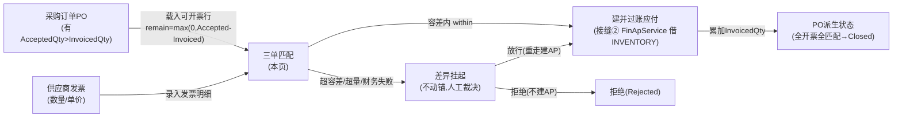
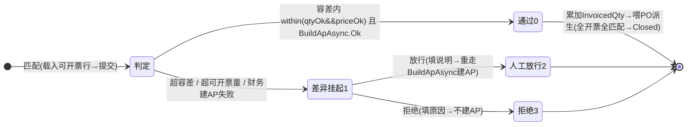

# 三单匹配 单页面操作 SOP（手把手版）

> **用途**：给**应付/财务对接操作、培训老师讲、测试人员拆用例**。比模块总册（`04-采购管理` §5.6，含 5.6.1a~1e）更细。
> **页面**：三单匹配（ThreeWayMatch · 采购管理 PUR · 核心）　**路由**：`/pur/match`　**前端**：`views/pur/ThreeWayMatchView.vue`　**API**：`api/pur/pur.ts matchApi.{list,get,match,release,reject}`　**后端**：`Controllers/Pur/ThreeWayMatchController.cs` → `ThreeWayMatchService.MatchInvoiceAsync`
> **基准**：分支 `feat/wfs-inbox-core`，2026-06-29；后端实测 `docs/codemap-pur/01-主数据-PO-收货-匹配.md` 四（2026-06-22 权威），UI 经实读 view + `types/pur/pur.ts`。
> **样例数据**：采购订单 `PO2026070001`、供方发票号 `INV-SUP01-001`、供应商 `SUP01`、物料 `MAT-K280`、容差价率 `5%`、借方 GL 角色 `INVENTORY`、匹配单号系统采番前缀 `MATCH`。

---

## 1. 页面一句话说明

**三单匹配，就是把"采购订单（该买多少、单价多少）↔ 收货验收（实际验收了多少）↔ 供应商发票（要我付多少）"三方对齐的地方——一点「匹配」，系统就逐行做容差判定：容差内 → 自动建并过账应付（接缝② `FinApServiceAdapter`，借 GL 角色 `INVENTORY`，到期 +30 天），状态「通过」并累加 `InvoicedQty` 喂 PO 派生 Closed；超容差 / 超可开票量 / 财务失败 → 挂起待人工裁决。** 它是采购"该不该付钱、付多少"的最后闸门——**可开票量 = AcceptedQty − InvoicedQty** 是贯穿全链的硬约束，没有任何旁路绕过它直接开票。

---

## 2. 这个页面在业务流程中的位置

- **上游**：有已验收量的 PO（`AcceptedQty > InvoicedQty` 才有可开票量；着荷基准收货即有 Accepted，检收基准须先 apply-qc）+ 供应商发票。
- **本页**：录发票、容差判定、自动建应付或挂起；挂起单人工放行/拒绝。
- **下游**：财务应付（接缝② 建并过账，借 INVENTORY）；PO 三累计锚 `InvoicedQty` 累加 → `DeriveStatus` 派生（全开票全匹配→`Closed`）。

---

## 3. 谁使用这个页面

| 角色 | 用途 |
|---|---|
| 应付/财务对接 | 录供应商发票、跑容差匹配、自动建应付 |
| 应付主管 | 处理挂起单：放行（接受差异建 AP）或拒绝（不建 AP） |
| 采购对账员 | 查看匹配结果/价差，与 PO·GR 三方核对 |

---

## 4. 操作前准备

- [ ] **可开票量先明白**：`可开票量 = AcceptedQty − InvoicedQty`（来自 PO 三累计锚）。PO 须有**已验收量**才有可开票量——着荷基准收货即写 Accepted，检收基准须先在 GR 屏「应用检收」写 Accepted，否则本页载不出可开票行。
- [ ] **容差三层来源**：具体供应商 `MatchTolerance` > 全局缺省 > **硬缺省 `{PriceTolPct:0, AmountTolAbs:0, QtyTolPct:0}` 严格**（未配任何容差时分毫不差才放行）。样例供应商 `SUP01` 配价率 5%。
- [ ] **数量是硬约束**：发票数量**不得超过可开票量**（`qtyOk = qty ≤ remainAccepted`）；价差走容差（率 或 小额绝对）。
- [ ] **幂等防重复开票**：同 `(PoNo, SupplierInvoiceNo)` 已存在 Passed/Released 的匹配 → `E-PUR-043` 挡，禁止重复开票。
- [ ] **借方 GL 角色 `INVENTORY` 须已配**：建 AP 时按角色解析借方科目，未解析 → `E-PUR-044`。
- [ ] **本页无分页**：列表按 PO 号 / 状态过滤，一次拉全；行数仅 `共 {n} 条` tag 显示。

---

## 5. 页面区域说明

| 区域 | 内容 |
|---|---|
| 页头（page-header） | 标题「三单匹配」+ 副标题「PO+收货验收+供应商发票三方对齐：容差内自动建应付，超容差挂起人工裁决」 |
| 搜索/工具条（el-card toolbar） | 采购订单号输入（150px，change 触发 reload）/ 状态下拉（130px，选项=MATCH_STATUS_LABEL）/「匹配供应商发票」按钮（开弹窗）/「刷新」/ `共 {n} 条` 行数 tag |
| 列表（el-table，max-height 620，无分页） | 8 列：匹配单号 / 采购订单号 / 供方发票号 / 匹配日期（slice 10）/ 最大价差（pct）/ 应付发票号（空显「—」）/ 状态 tag（MATCH_STATUS_TAG）/ 操作[查看 · 放行(仅status===1) · 拒绝(仅status===1)] |
| 匹配弹窗（el-dialog，**860px**） | 头 3 字段：采购订单号(required，带「载入可开票行」append)/ 供方发票号(required)/ 发票日期（默认今天）；行表 6 列：行/物料/**可开票量(只读)**/**订单单价(只读)**/发票数量(el-input-number 可编辑)/发票单价(el-input-number precision=4 可编辑)；底部提示「容差内自动建应付并累加已开票量；超容差或超可开票量则挂起待人工放行」 |
| 详情弹窗（el-dialog，**880px**） | el-descriptions（PO号/供方发票号/状态 tag/应付发票号/最大价差/处理人/差异说明）+ 行表（行/物料/发票数量/发票单价/可开票量/**价差(pct)**/**容差内(是·success/否·danger tag)**） |

> 列表/匹配/详情三段：列表是入口，匹配弹窗是录入，详情弹窗是逐行价差与容差内/外的复盘。

---

## 6. 字段填写说明（口语版）

**匹配弹窗·头字段**：

| 字段 | 谁提供 | 怎么填 | 填错影响 |
|---|---|---|---|
| 采购订单号(poNo) | 财务对接 | 填 `PO2026070001` 后点「载入可开票行」 | 空→点载入弹「请先填采购订单号」；PO 不存在→载入弹「采购订单不存在」、提交后端 `E-PUR-027` |
| 供方发票号(supplierInvoiceNo) | 财务对接 | 供应商发票号如 `INV-SUP01-001`，**required** | 空→提交 warning「供方发票号必填」；与同 PO 重复→`E-PUR-043` |
| 发票日期(invoiceDate) | 财务对接 | 默认今天，可改（财务侧 AP 到期日基准 = 此日 +30 天） | — |

**匹配弹窗·行字段**（每行）：

| 字段 | 只读/可编辑 | 怎么填 | 填错影响 |
|---|---|---|---|
| 行(poLineNo) | 只读 | 来自 PO 行号 | — |
| 物料(itemId) | 只读 | 来自 PO 行 | — |
| 可开票量(remainAccepted) | **只读** | 载入时算 `max(0, Accepted − Invoiced)` | 来自三累计锚，不可手改 |
| 订单单价(poUnitPrice) | **只读** | 来自 PO 行单价 | 价差判定基准 |
| 发票数量(qty) | 可编辑（el-input-number min 0） | 本次开票数，**≤ 可开票量**（硬约束）；默认带入 remain | 超可开票量→**挂起**（非报错） |
| 发票单价(unitPrice) | 可编辑（precision 4） | 发票实际单价，与订单单价比；默认带入 PO 单价 | 价差超容差且无小额放行→**挂起** |

> **容差判定（后端逐行）**：
> `priceVar = |发票单价 − 订单单价| / 订单单价`（订单单价 0 时 priceVar=0）；
> `amountVar = 发票数量 × |发票单价 − 订单单价|`；
> `priceOk = priceVar ≤ PriceTolPct 或 amountVar ≤ AmountTolAbs`（**小额绝对放行**）；
> `qtyOk = 发票数量 ≤ 可开票量`（**数量硬约束**）；`within = qtyOk && priceOk`。

---

## 7. 按钮操作说明

| 按钮 | 何时出现/启用 | 点了会怎样 |
|---|---|---|
| 匹配供应商发票（工具条） | 常显 | `openCreate()`：重置表单、清空行、打开 860px 匹配弹窗 |
| 载入可开票行（弹窗 append） | 常显（PO 号空时点会提示） | `loadPoLines()`：PO 号空→warning「请先填采购订单号」；拉 PO，不存在→warning「采购订单不存在」；逐行**仅取 `status===0` 行**算 `remain=max(0,Accepted−Invoiced)`，**只保留 remain>0 行**、qty/unitPrice 默认带入；全无→info「该订单当前无可开票量」 |
| 匹配（弹窗提交） | `lineRows.length===0` 时禁用 | `submit()`：只取 `qty>0` 行；行 0→warning「请填写至少一行发票明细」；供方发票号空→warning「供方发票号必填」；调 `matchApi.match`→按返回 `apCreated` 分流提示 |
| 查看（行） | 常显 | `openDetail()`：拉详情，开 880px 详情弹窗（逐行价差 + 容差内/外 tag） |
| 放行（行） | **仅 `status===1`（差异挂起）显示** | `doRelease()`：prompt「接受差异并建应付，请填处理说明」→`matchApi.release`→**重走 BuildApAsync 建 AP**→状态变「人工放行(2)」、toast「已放行，应付发票 {no}」 |
| 拒绝（行） | **仅 `status===1`（差异挂起）显示** | `doReject()`：prompt「拒绝该匹配（不建应付），请填原因」→`matchApi.reject`→状态变「拒绝(3)」、**不建 AP**、toast「已拒绝」 |
| 刷新 | 常显 | `reload()`：按当前 PO 号 + 状态过滤重拉列表 |

> **权限点 `pur-match`**：add（匹配）/ release（放行）/ reject（拒绝）三粒度。i18n label 走 `t()`；E-PUR 错误码可能裸显（`待业务确认`，见 §11）。

---

## 8. 标准业务操作 SOP（照着点）

### 场景一：容差内自动建并过账应付（主流程）
- **背景**：发票数量、单价都在容差内，匹配通过自动建应付。
- **样例数据**：`PO2026070001`（行 1 物料 `MAT-K280`，AcceptedQty 100、InvoicedQty 0 → 可开票量 100，订单单价 ¥10.00），供方发票号 `INV-SUP01-001`，发票数量 100、发票单价 ¥10.20（价差 2% ≤ 容差 5%），供应商 `SUP01` 容差价率 5%。
- **前置**：PO 有已验收量；借方 GL 角色 `INVENTORY` 已配。
- **步骤**：1) 工具条点「匹配供应商发票」→弹窗；2) PO 号填 `PO2026070001`→点「载入可开票行」（行表回填可开票量 100、订单单价 ¥10.00、qty=100、unitPrice=10.00）；3) 改发票单价为 ¥10.20、填供方发票号 `INV-SUP01-001`；4) 点「匹配」。
- **完成后检查**：toast「匹配通过，已建应付发票 {no}」；列表新增匹配单（`MATCH…`），状态「通过(0)」、应付发票号回填；PO 行 `InvoicedQty += 100`、PO 派生（全开票全匹配→`Closed`）；去财务 AP 查该发票已**过账**（借 INVENTORY，到期 = 发票日 +30 天）。
- **异常**：行空→`E-PUR-040`；PO 不存在→`E-PUR-027`；GL 角色未解析→`E-PUR-044`（建 AP 失败转挂起）。
- **可拆用例**：TC-M09-MATCH-006、012、013、014、015、016。

### 场景二：发票单价超价容差 → 挂起
- **背景**：单价偏离过大、又够不上小额绝对放行，匹配挂起。
- **样例数据**：`PO2026070001` 订单单价 ¥10.00、可开票量 100；发票单价 ¥11.00（价差 10% > 容差 5%），发票数量 100（amountVar = 100×1.00 = 100，超 AmountTolAbs）。
- **前置**：同场景一。
- **步骤**：1) 载入可开票行；2) 发票单价改 ¥11.00、填发票号；3) 点「匹配」。
- **完成后检查**：toast「差异超容差，已挂起待人工裁决」；列表状态「差异挂起(1)」、应付发票号「—」；**PO 锚不动**（`InvoicedQty` 不变、不 RefreshStatus）；行可「放行」或「拒绝」。
- **异常**：—（本场景就是验证挂起分流）。
- **可拆用例**：TC-M09-MATCH-017、020、021。

### 场景三：发票数量超可开票量 → 挂起（数量硬约束）
- **背景**：单价没问题，但开票数量超过可开票量，数量硬约束触发挂起。
- **样例数据**：`PO2026070001` 可开票量 100、订单单价 ¥10.00；发票数量 120（> 100）、发票单价 ¥10.00（价差 0）。
- **前置**：同场景一。
- **步骤**：1) 载入可开票行；2) 发票数量改 120；3) 点「匹配」。
- **完成后检查**：`qtyOk=false`→`within=false`→状态「差异挂起(1)」、toast「差异超容差，已挂起待人工裁决」；锚不动。
- **异常**：—（数量硬约束，价 OK 也挂起）。
- **可拆用例**：TC-M09-MATCH-018、019。

### 场景四：小额绝对放行救回价差（amountVar ≤ AmountTolAbs）
- **背景**：价率超了，但金额绝对差很小、在 `AmountTolAbs` 内，仍判容差内自动建 AP。
- **样例数据**：供应商配 `PriceTolPct=5%`、`AmountTolAbs=50`；订单单价 ¥10.00、发票单价 ¥11.00（价差 10%>5%），但发票数量仅 3 → amountVar=3×1.00=3 ≤ 50。
- **前置**：供应商 `MatchTolerance` 配了 `AmountTolAbs`（否则硬缺省 0 不放行）。
- **步骤**：1) 载入可开票行；2) 发票数量改 3、单价 ¥11.00；3) 点「匹配」。
- **完成后检查**：`priceOk = (10%≤5% 否) 或 (amountVar 3 ≤ 50 是) = true`→`within=true`→**建 AP**、状态「通过(0)」、toast「匹配通过，已建应付发票」。
- **异常**：若 `AmountTolAbs` 缺省 0（未配）则不放行→挂起（盲点，见 §11）。
- **可拆用例**：TC-M09-MATCH-022、023。

### 场景五：人工放行挂起单（→ 建 AP → 人工放行）
- **背景**：挂起单经复核可接受差异，放行建应付。
- **样例数据**：场景二/三产出的「差异挂起(1)」匹配单 `MATCH…`。
- **前置**：列表中该行 `status===1`（放行/拒绝按钮才显示）。
- **步骤**：1) 列表该行点「放行」；2) 弹 prompt「接受差异并建应付，请填处理说明」→填说明（如"已与供应商确认涨价"）→确定。
- **完成后检查**：`matchApi.release`→**重走 BuildApAsync 建 AP**→状态「人工放行(2)」、应付发票号回填、toast「已放行，应付发票 {no}」；差异说明落 `note`、处理人落 `handledBy`；PO 锚累加。
- **异常**：对非挂起单（如已通过/已拒绝）放行→后端 `E-PUR-045`。
- **可拆用例**：TC-M09-MATCH-029、030、031。

### 场景六：人工拒绝挂起单（→ 拒绝，不建 AP）
- **背景**：挂起单复核后判定该发票不应付，拒绝。
- **样例数据**：「差异挂起(1)」匹配单 `MATCH…`。
- **前置**：`status===1`。
- **步骤**：1) 列表该行点「拒绝」；2) 弹 prompt「拒绝该匹配（不建应付），请填原因」→填原因→确定。
- **完成后检查**：`matchApi.reject`→状态「拒绝(3)」、**不建 AP**（应付发票号仍「—」）、toast「已拒绝」；原因落 `note`；**PO 锚不动**。
- **异常**：—。
- **可拆用例**：TC-M09-MATCH-032、033。

### 场景七：重复开票幂等拦截（E-PUR-043）
- **背景**：同一 PO + 同一供方发票号已开过票（Passed/Released），再匹配被挡。
- **样例数据**：`PO2026070001` + `INV-SUP01-001` 已在场景一匹配通过。
- **前置**：已有一条 Passed/Released 的同键匹配单。
- **步骤**：1) 再次「匹配供应商发票」→填同 PO 号 + 同发票号 + 载入行；2) 点「匹配」。
- **完成后检查**：后端抛 `E-PUR-043`（幂等防重复开票），不新建匹配单、不重复建 AP。
- **异常**：错误码可能裸显（i18n `待业务确认`）。
- **可拆用例**：TC-M09-MATCH-024。

### 场景八：载入可开票行的过滤与空提示
- **背景**：验证载入逻辑——只取 `status===0` 且 `remain>0` 行；全无可开票量时提示。
- **样例数据**：`PO2026070001` 全部行 `AcceptedQty == InvoicedQty`（已开满）。
- **前置**：PO 存在但无剩余可开票量。
- **步骤**：1) 弹窗填 PO 号；2) 点「载入可开票行」。
- **完成后检查**：行表为空、info 提示「该订单当前无可开票量」；「匹配」按钮因 `lineRows.length===0` 禁用。
- **异常**：PO 号空→「请先填采购订单号」；PO 不存在→「采购订单不存在」。
- **可拆用例**：TC-M09-MATCH-007、008、009、010、011、036。

---

## 9. 状态变化说明

- **MATCH_STATUS**：`0通过`（建 AP，success tag）/ `1差异挂起`（warning tag）/ `2人工放行`（建 AP，success tag）/ `3拒绝`（不建 AP，danger tag）。
- **只有 `apCreated`（通过/放行）才累加 `InvoicedQty` 并 `RefreshStatusAsync`** 喂 PO 派生；挂起/拒绝**不动锚**。
- PO 派生：`InvoicedQty>=Qty` 行 `MatchStatus=2`，全开票全匹配 → `DeriveStatus` 投影 `Closed`。

---

## 10. 按钮不可用 / 灰色原因

| 现象 | 原因 |
|---|---|
| 「匹配」按钮禁用 | `lineRows.length === 0`（未载入任何可开票行） |
| 行表点「载入可开票行」无行 | 该 PO 所有行 `remain = Accepted − Invoiced ≤ 0`（已开满/未验收），或行 `status !== 0`；提示「该订单当前无可开票量」 |
| 看不到「放行」/「拒绝」按钮 | 该匹配单 `status !== 1`（仅「差异挂起(1)」才显示这两个按钮） |
| 可开票量 / 订单单价 列不可改 | 只读列——来自 PO 三累计锚与 PO 行单价，非人工录入 |
| 列表没有分页 | 设计如此——按 PO 号/状态过滤一次拉全，行数看 `共 {n} 条` tag |
| 找不到"改/删已通过匹配单"按钮 | 通过即建 AP，本屏无修正入口；挂起单只能放行/拒绝 |

---

## 11. 常见错误与处理

| 错误 | 原因 | 处理 |
|---|---|---|
| 载入无可开票行 | PO 未验收（着荷未收/检收未 apply-qc）或已开满 | 先在 GR 屏完成收货/检收，确认 `AcceptedQty > InvoicedQty` |
| 提交弹「供方发票号必填」 | supplierInvoiceNo 空 | 补填供方发票号再匹配 |
| 提交弹「请填写至少一行发票明细」 | 所有行 `qty ≤ 0` | 至少一行发票数量 >0 |
| 匹配后「差异超容差，已挂起待人工裁决」 | 价差超率且不够小额放行 / 数量超可开票量 / 财务建 AP 失败 | 复核后走「放行」（建 AP）或「拒绝」（不建 AP） |
| `E-PUR-043` 重复开票 | 同 (PoNo, SupplierInvoiceNo) 已 Passed/Released | 换发票号或确认是否重复，禁止重复开票 |
| `E-PUR-040` 行空 | 提交时无有效明细行 | 载入可开票行并填数量 |
| `E-PUR-027` PO 不存在 | PO 号填错 | 核对采购订单号 |
| `E-PUR-044` GL 角色 INVENTORY 未解析 | 借方科目角色未配 | 财务配 `INVENTORY` 科目映射再匹配 |
| `E-PUR-045` 非挂起放行 | 对已通过/已拒绝单点放行 | 仅「差异挂起(1)」可放行 |
| 以为挂起就丢了 | 挂起是中间态非终态 | 挂起单可放行/拒绝，不会自动消失 |
| **盲点·容差缺省 `{0,0,0}` 严格** | 未配任何容差时分毫不差才放行，正常采购易频繁挂起（`待业务确认`：缺省容差应否放宽/配置化） | 给目标供应商配 `MatchTolerance`（价率/金额绝对/数量） |
| **盲点·E-PUR 码裸显** | 部分 E-PUR 错误码可能直接显代码、未走 i18n（`待业务确认`） | 业务确认是否补 i18n 文案；测试以行为为准 |

---

## 12. 操作完成后的检查清单（下游验证）

- [ ] **匹配通过**：列表新增匹配单（`MATCH…`）状态「通过(0)」、应付发票号回填、最大价差列有值；toast「匹配通过，已建应付发票 {no}」。
- [ ] **委托财务建并过账**：去财务 AP 查该应付发票**已过账**（借 GL 角色 `INVENTORY`、到期 = 发票日 +30 天）；财务侧幂等（同供应商+发票号返既有，不重复建）。
- [ ] **三累计锚累加**：PO 行 `InvoicedQty += 发票数量`；`InvoicedQty>=Qty` 行 `MatchStatus=2`。
- [ ] **PO 派生状态**：仅 `apCreated` 才 `RefreshStatus`——全开票全匹配 → PO `DeriveStatus` 投影 `Closed`。
- [ ] **挂起**：状态「差异挂起(1)」、应付发票号「—」、**PO 锚未变**；放行后→「人工放行(2)」+ 建 AP；拒绝后→「拒绝(3)」+ 不建 AP。
- [ ] **详情复盘**：查看详情弹窗逐行价差（pct）与「容差内（是/否）」tag，与发票数量/可开票量比对。

---

## 13. 页面级测试用例（≥30 条，可执行）

> 编号 `TC-M09-MATCH-xxx`；数据用样例（PO2026070001 / INV-SUP01-001 / SUP01 / MAT-K280 / 容差价率5% / 借方 INVENTORY / MATCH…）。

| 用例编号 | 用例名称 | 优先级 | 前置条件 | 测试数据 | 操作步骤 | 预期结果 | 下游检查 | 备注 |
|---|---|---|---|---|---|---|---|---|
| TC-M09-MATCH-001 | 列表默认加载 | P1 | 有匹配单 | — | 进页面 | onMounted reload 拉列表 | — | onMounted |
| TC-M09-MATCH-002 | PO号筛选 | P2 | 多 PO 匹配单 | PO2026070001 | 填PO号 change | 仅该 PO 行 | — | reload |
| TC-M09-MATCH-003 | 状态筛选 | P2 | 含各状态 | 选「差异挂起」 | 选状态 | 仅 status=1 行 | — | MATCH_STATUS |
| TC-M09-MATCH-004 | 行数tag显示 | P3 | 有数据 | — | 看 tag | `共 N 条` 等于行数 | — | 无分页 |
| TC-M09-MATCH-005 | 打开匹配弹窗重置 | P2 | — | — | 点匹配供应商发票 | 表单清空、行清空、弹窗开 | — | openCreate |
| TC-M09-MATCH-006 | 载入算可开票量 | P0 | PO Accepted100/Invoiced0 | PO2026070001 | 载入可开票行 | remain=max(0,100-0)=100 回填 | — | loadPoLines |
| TC-M09-MATCH-007 | 载入只取status0行 | P1 | PO 含非0状态行 | 混合行 | 载入 | 仅 l.status===0 行入表 | — | 过滤 |
| TC-M09-MATCH-008 | 载入只取remain>0行 | P1 | 部分行已开满 | 混合行 | 载入 | 仅 remain>0 行入表 | — | 过滤 |
| TC-M09-MATCH-009 | 无可开票量提示 | P1 | 全行已开满 | PO2026070001 | 载入 | info「该订单当前无可开票量」 | — | 空提示 |
| TC-M09-MATCH-010 | 载入PO不存在 | P2 | 错号 | PO9999999999 | 载入 | warning「采购订单不存在」 | — | loadPoLines |
| TC-M09-MATCH-011 | 载入PO号空 | P2 | — | poNo 空 | 载入 | warning「请先填采购订单号」 | — | trim 校验 |
| TC-M09-MATCH-012 | 容差内匹配建AP | P0 | 可开票100、价率5% | 数量100/单价¥10.20(价差2%) | 匹配 | within→Passed、状态「通过(0)」 | 建AP | 主流程 |
| TC-M09-MATCH-013 | 成功toast含发票号 | P1 | 容差内 | — | 匹配 | toast「匹配通过，已建应付发票 {no}」 | — | apCreated |
| TC-M09-MATCH-014 | 累加InvoicedQty | P0 | 通过 | 数量100 | 匹配后查PO | InvoicedQty += 100 | PO行锚 | Accumulate |
| TC-M09-MATCH-015 | 通过才RefreshStatus→Closed | P0 | 全开票全匹配 | — | 匹配 | PO DeriveStatus→Closed | 派生 | 仅apCreated |
| TC-M09-MATCH-016 | 委托财务过账借INVENTORY | P0 | 容差内 | 发票日+30天 | 匹配后查AP | AP已过账、借INVENTORY、到期+30天 | 接缝② | FinApServiceAdapter |
| TC-M09-MATCH-017 | 价率超容差挂起 | P0 | 价率5% | 单价¥11.00(价差10%)、数量100 | 匹配 | priceOk=false→Suspended(1) | 不动锚 | 容差 |
| TC-M09-MATCH-018 | 数量超可开票量挂起 | P0 | 可开票100 | 数量120/单价¥10.00 | 匹配 | qtyOk=false→Suspended(1) | 不动锚 | 数量硬约束 |
| TC-M09-MATCH-019 | 价OK量超也挂起 | P1 | 可开票100 | 数量120/价差0 | 匹配 | within=false(量硬约束) | — | qtyOk&&priceOk |
| TC-M09-MATCH-020 | 挂起不动锚 | P0 | 超容差 | — | 匹配后查PO | InvoicedQty 不变、不RefreshStatus | — | 分流 |
| TC-M09-MATCH-021 | 挂起toast | P1 | 超容差 | — | 匹配 | warning「差异超容差，已挂起待人工裁决」 | — | !apCreated |
| TC-M09-MATCH-022 | 小额绝对放行救回 | P1 | AmountTolAbs=50 | 单价¥11.00(价差10%)、数量3(amountVar=3) | 匹配 | priceOk=true(amountVar≤50)→Passed | 建AP | 小额放行 |
| TC-M09-MATCH-023 | 小额未配则挂起 | P2 | AmountTolAbs缺省0 | 同上数量3 | 匹配 | amountVar3>0→priceOk=false→挂起 | — | 盲点 |
| TC-M09-MATCH-024 | 重复开票幂等 | P0 | 同PO+发票号已Passed | INV-SUP01-001 | 再匹配 | E-PUR-043、不新建不重复建AP | — | 幂等 |
| TC-M09-MATCH-025 | 行空报错 | P1 | 绕过前端 | lines=[] | 提交 | E-PUR-040 | 不落库 | 后端 |
| TC-M09-MATCH-026 | PO不存在(提交) | P2 | 错号绕过 | PO9999 | 提交 | E-PUR-027 | — | 后端 |
| TC-M09-MATCH-027 | GL角色未解析 | P1 | INVENTORY未配 | 容差内 | 匹配 | E-PUR-044(建AP失败)→挂起 | 不建AP | 借方 |
| TC-M09-MATCH-028 | 供方发票号空拦截 | P0 | 弹窗有行 | supplierInvoiceNo空 | 匹配 | warning「供方发票号必填」不发请求 | — | 前端校验 |
| TC-M09-MATCH-029 | 提交只取qty>0行 | P1 | 多行有0量行 | 部分qty=0 | 匹配 | 仅 qty>0 行入参 | — | submit filter |
| TC-M09-MATCH-030 | 提交全0量拦截 | P1 | 所有行qty=0 | — | 匹配 | warning「请填写至少一行发票明细」 | — | 前端校验 |
| TC-M09-MATCH-031 | 放行挂起单建AP | P0 | status=1 | MATCH… | 放行→填说明 | 重走BuildAp→「人工放行(2)」 | 建AP+累锚 | release |
| TC-M09-MATCH-032 | 放行toast含发票号 | P1 | 放行成功 | — | 放行 | toast「已放行，应付发票 {no}」 | — | — |
| TC-M09-MATCH-033 | 非挂起放行报错 | P2 | status≠1绕过 | 已通过单 | release | E-PUR-045 | — | 守卫 |
| TC-M09-MATCH-034 | 拒绝挂起单不建AP | P0 | status=1 | MATCH… | 拒绝→填原因 | 「拒绝(3)」、应付发票号「—」 | 不建AP、不动锚 | reject |
| TC-M09-MATCH-035 | 拒绝toast | P2 | 拒绝成功 | — | 拒绝 | toast「已拒绝」 | — | — |
| TC-M09-MATCH-036 | 放行/拒绝按钮仅status1 | P1 | 各状态行 | — | 看操作列 | 仅 status===1 显示放行/拒绝 | — | UI v-if |
| TC-M09-MATCH-037 | 详情价差+容差内tag | P2 | 有匹配单 | — | 点查看 | 880px弹窗逐行价差pct+容差内(是/否)tag | — | openDetail |
| TC-M09-MATCH-038 | 匹配按钮无行禁用 | P2 | 未载入行 | lineRows=[] | 看匹配按钮 | disabled | — | UI |
| TC-M09-MATCH-039 | 权限点pur-match | P2 | 无 release 权限 | — | 调放行 | 403/按钮控权 | — | add/release/reject |
| TC-M09-MATCH-040 | 财务侧幂等 | P2 | 同供应商+发票号 | — | 重走建AP | 返既有AP不重复 | — | 接缝幂等 |

---

## 14. 培训讲解建议

| 顺序 | 讲什么 | 演示 | 易误解点 |
|---|---|---|---|
| 1 | 这页是"三方对齐、该不该付钱"的闸门 | §2 流程图（PO↔GR↔发票） | 以为匹配只是登记发票 |
| 2 | 可开票量 = Accepted − Invoiced（硬约束） | 载入可开票行看 remain | 以为可随便开多少 |
| 3 | 容差三层：供应商 > 全局 > 硬缺省{0,0,0} | 改供应商容差演示放行/挂起 | 以为有内置宽松容差 |
| 4 | within = qtyOk && priceOk（量硬·价容差） | 数量超量挂起 vs 价差小额放行 | 以为价 OK 就一定通过 |
| 5 | 容差内自动建并过账应付（借 INVENTORY） | 通过后查财务 AP 已过账 | 以为还要手工去财务建 |
| 6 | 挂起不是终态：放行(建AP) / 拒绝(不建) | 演示放行/拒绝两条路 | 以为挂起就丢了 |
| 7 | 幂等防重复开票 E-PUR-043 | 同 PO+发票号再匹配被挡 | 以为能重复开票 |
| 8 | 盲点：缺省容差严格 + E-PUR 码裸显 | 不配容差易频繁挂起 | 以为是 bug |

---

## 15. 与模块级手册的关系

对应 `04-采购管理-最详细用户操作培训手册.md` §5.6（三单匹配 · 核心，含 5.6.1a~1e：业务前置/字段口径/灰按钮/完成后下游验证/详细场景）。相邻页：上游 §5.5 收货 GR（双基准，着荷即写 Accepted / 检收须 apply-qc 才写 Accepted——决定有无可开票量）；§5.2 采购订单 PO（三累计锚来源、DeriveStatus 派生）；下游接缝②财务 AP（`FinApServiceAdapter` 建并过账借 INVENTORY）。三累计锚总论见 §1/§3。

---

## 16. 代码与文档来源

| 层 | 文件 |
|---|---|
| 逐行源码手册 | `docs/codemap-pur/01-主数据-PO-收货-匹配.md` 四（三单匹配，权威，2026-06-22 实测） |
| 前端 view | `cp6.web/src/views/pur/ThreeWayMatchView.vue`（loadPoLines remain :162-180、submit 分流 :182-197、放行/拒绝 :206-220） |
| 前端 API | `cp6.web/src/api/pur/pur.ts`（matchApi list/get/match/release/reject :67-83） |
| 前端类型 | `cp6.web/src/types/pur/pur.ts`（ThreeWayMatch/Line :122-150、MatchInvoiceForm :159-164、MATCH_STATUS_LABEL/TAG :293-296） |
| 后端 Controller | `Controllers/Pur/ThreeWayMatchController.cs`（Match :33-40，`[RequirePermission("pur-match","add")]`） |
| 后端 Service | `Services/Pur/ThreeWayMatchService.cs`（**MatchInvoiceAsync :48-150** 容差判定 :78-114 / 分流 :118-142 / AccumulateInvoiced 96 / ReleaseAsync / RejectAsync） |
| 接缝②财务 AP | `Services/Pur/Contracts/FinApServiceAdapter.cs`（BuildApAsync :26-58，借 INVENTORY、到期 +30 天、财务侧幂等） |
| 实体/容差 | `DomainModels/Pur/ThreeWayMatch.cs` / `MatchTolerance.cs`（PriceTolPct/AmountTolAbs/QtyTolPct）/ `PurchaseOrderLine.cs`（三累计锚 Received/Accepted/InvoicedQty） |
| PO 派生 | `Services/Pur/PurchaseOrderService.cs`（DeriveStatus :230-245 / RefreshStatusAsync :207-224） |
| 测试佐证 | `CP6.Tests`（采购三单匹配/容差/挂起放行用例） |

---

## 最后更新来源

- 代码：见 §16（codemap-pur 01 四 + ThreeWayMatchView.vue 实读 + pur.ts/types 类型）。
- 基准：分支 `feat/wfs-inbox-core`，2026-06-29（codemap 2026-06-22 权威）。
- 覆盖：16 节 / 8 场景 / 40 用例（TC-M09-MATCH-001~040）。
- 诚实标注盲点：容差硬缺省 `{0,0,0}` 严格（未配容差易频繁挂起，`待业务确认` 是否放宽/配置化）；部分 E-PUR 错误码可能裸显未走 i18n（`待业务确认`）；数量是硬约束（价 OK 也会因超量挂起）；通过/放行才动 PO 锚，挂起/拒绝不动锚；本页无分页、无改删已通过匹配单入口（挂起单仅放行/拒绝）。
