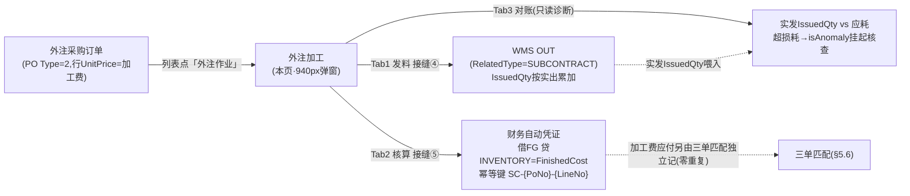

# 外注加工 单页面操作 SOP（手把手版）

> **用途**：给**外协担当（外注作业操作）、培训老师讲、测试人员拆用例**。比模块总册（`04-采购管理` §5.7，含 5.7.1a~1e）更细。
> **页面**：外注加工（Subcontract · 采购管理 PUR）　**路由**：`/pur/subcontract`（PO Type=2）　**前端**：`views/pur/SubcontractView.vue`　**API**：`api/pur/pur.ts subcontractApi`（listOrders/getConsign/addConsign/issue/finishedCost/reconcile）　**后端**：`Controllers/Pur/SubcontractController.cs` → `Services/Pur/SubcontractService.cs`
> **基准**：分支 `feat/wfs-inbox-core`，2026-06-29；后端实测 `docs/codemap-pur/02-申请-询价-外注-对账.md` 三、外注加工（2026-06-22 权威），UI 经实读 view。
> **样例数据**：外注采购订单 `PO2026070001`（**Type=2**）、外协厂 `SUP01`、外注成品 `PRD-OEM01`（加工费单价 `¥8`/件、数量 1000）、支給材 `MAT-K280`（支給原紙，应发 1200、单位成本 `¥3`）、成本幂等键 `SC-PO2026070001-1`。

---

## 1. 页面一句话说明

**外注加工，就是把"委托外协厂加工"这件事在系统里跑完整闭环的地方——先在「仅列 Type=2 外注 PO」的列表里点「外注作业」开 940px 弹窗，选一条成品行后分三 tab 干三件事：① 登记并发支給材（接缝④真委托 WMS OUT 扣库存，按实出累加 `IssuedQty` 防吞料）、② 收成品成本核算（接缝⑤真委托财务 借 FG 贷 INVENTORY=成品成本，幂等键 `SC-{PoNo}-{LineNo}`）、③ 防吞料对账（只读诊断：实发 vs 成品反推的应耗，超损耗容差就挂起核查）。** 它是采购模块里**唯一同时把材料发出去（扣库存）和把成品成本收回来（建凭证）的双委托页**，外注 PO 不另起状态机——复用 `PurchaseOrder`（Type=2，行 UnitPrice=加工费），支給材按 `IssuedQty` 累加追踪。

---

## 2. 这个页面在业务流程中的位置

- **上游**：外注采购订单（PO **Type=2**，每条成品行 UnitPrice=加工费），由 §5.4 PO 页建立。
- **本页**：发支給材给外协（扣 WMS 库存）、收成品时核算并入财务成本、防吞料对账。
- **下游**：WMS（支給材 OUT 扣库）、财务（成品成本凭证）、采购对账（§5.8 外协吞料只读诊断复用本页对账逻辑）。

---

## 3. 谁使用这个页面

| 角色 | 用途 |
|---|---|
| 外协担当 | 登记/发支給材、收成品成本核算、防吞料对账（本页主操作者） |
| 采购主管 | 监看对账异常（超损耗挂起核查），与 §5.8 采购对账互为印证 |
| 财务/库管（下游验证） | 财务查 借 FG 贷 INVENTORY 凭证；库管查支給材 OUT 流水（`RelatedType=SUBCONTRACT`） |

---

## 4. 操作前准备

- [ ] **PO 必须是外注**：列表只列 `Type=2` 的 PO；若拿标准采购 PO（Type=1）走外注接口→后端 `E-PUR-072`。
- [ ] **成品行存在**：弹窗里先在「选择成品行」下拉选一条；成品行不存在→`E-PUR-073`。
- [ ] **支給材库存充足**：发料是**真扣 WMS 库存**（接缝④委托 `IStockMovementService.ApplyAsync(OUT)`），不足→`E-PUR-080`。
- [ ] **理解 `IssuedQty` 实发=防吞料锚**：发料按 WMS 实际出库量累加，对账以"成品反推应耗"对比实发，多领超损耗即异常。
- [ ] **理解成本口径**：成品成本=加工费（PO 行单价×成品数）+ 支給材成本（**并入非另付**，ΣConsignQty×ConsignUnitCost）；加工费的应付由三单匹配独立记（零重复，本页不碰应付）。
- [ ] **进入路径**：从外注加工列表（`/pur/subcontract`）点行尾「外注作业」开弹窗——本页**无新建外注 PO 入口**，建单在 §5.4 PO 页选 Type=2。

---

## 5. 页面区域说明

| 区域 | 内容 |
|---|---|
| 列表卡（el-card + el-table） | 工具条：刷新 / 「共 N 条」标签 / 「仅列外注委托单(Type=2)」提示。表格 6 列：采购订单号(poNo) / 外协厂(supplierId) / 外协厂名(supplierName) / 订单日期(orderDate 前 10 位) / 成品行数(lines.length) / 操作（「外注作业」链接按钮） |
| 外注作业弹窗（el-dialog，width=940，top=5vh） | 标题「外注作业 + poNo」。顶部「选择成品行」下拉（label=`#行号 物料 ×数量 @加工费单价价格`）；选行后显三 tab |
| Tab1 支給材（name=consign） | 上：登记表（添加行→物料/应发数量/单位成本/删）+「保存支給材」「一次发齐剩余」按钮；下：已登记支給材实发追踪表（物料/应发/单位成本/已发/剩余/WMS出库单号/分批发料单元格<数量+发料>） |
| Tab2 成品成本核算（name=cost） | 收成品数 input + 「核算成品成本」按钮 + 提示行；核算后 descriptions（加工费/支給材成本/**成品成本**/成本凭证） |
| Tab3 防吞料对账（name=reconcile） | 收成品数 + 损耗容差(%) input + 「对账」按钮；对账后 红/绿 alert + 行表（物料/实发/应耗/差异/容许差异/是否异常 tag） |
| 弹窗底部 | 「关闭」按钮（仅关闭弹窗，不影响已落库的发料/成本） |

> 弹窗一打开默认选第一条成品行、tab=consign 并自动 `loadConsigns()` 拉已登记支給材；切换成品行（onLineChange）会 `resetLineState()` 重置所有 tab 录入态再重拉。

---

## 6. 字段填写说明（口语版）

**列表/弹窗头部**：

| 字段 | 谁提供 | 怎么填 | 填错影响 |
|---|---|---|---|
| 选择成品行(lineNo) | 外协担当 | 弹窗顶部下拉选外注 PO 的成品行；切换会重置三 tab | 不选行→不显示 tab；行不存在后端 `E-PUR-073` |

**Tab1 登记支給材（每行，登记表 consignForm）**：

| 字段 | 怎么填 | 填错影响 |
|---|---|---|
| 支給材物料(consignItemId) | 必填，如 `MAT-K280`，maxlength 40 | 空（trim 后）→前端不纳入提交；全空→warning「请填写支給材物料与应发数量」 |
| 应发数量(consignQty) | 必填且 >0，如 1200 | ≤0→前端过滤不提交；后端应发≤0→`E-PUR-074` |
| 单位成本(consignUnitCost) | 单位料成本，如 `¥3`，精度 4 位 | 进成品成本核算的支給材成本项（ΣConsignQty×ConsignUnitCost） |

**Tab1 发料（已登记表分批发料单元格）**：

| 字段 | 怎么填 | 填错影响 |
|---|---|---|
| 分批发料量(batchQty[物料]) | 本次要发的量，>0；点行内「发料」按 `issue([{consignItemId,qty}])` | ≤0→warning「本次发料量须大于0」；库存不足→`E-PUR-080` |

**Tab2 成本核算**：

| 字段 | 怎么填 | 填错影响 |
|---|---|---|
| 收成品数(finishedQty) | 收到的合格成品数，>0；加工费=PO 单价×此数 | ≤0→warning「请填收成品数」；后端 `E-PUR-077` |

**Tab3 防吞料对账**：

| 字段 | 怎么填 | 填错影响 |
|---|---|---|
| 收成品数(recQty) | 实收成品数，>0；应耗=单耗×此数 | ≤0→warning「请填收成品数」；后端 `E-PUR-079` |
| 损耗容差(%)(recTolPct) | 默认 5，0~100，精度 1；前端 `/100` 传后端 | 容许差异=应耗×容差，调小→更易判异常 |

---

## 7. 按钮操作说明

| 按钮 | 何时出现/启用 | 点了会怎样 |
|---|---|---|
| 刷新（列表） | 常显 | `reload()`→`listOrders()` 重拉仅 Type=2 PO |
| 外注作业（行） | 每行 | `openWork(row)`：设 current、默认选首行、tab=consign、resetLineState、打开弹窗并 loadConsigns |
| 选择成品行（下拉 change） | 选行后 | `onLineChange()`：resetLineState 重置三 tab 录入态→loadConsigns 重拉已登记支給材 |
| 添加行（Tab1） | 常显 | `addConsignRow()`：登记表尾增一空行（物料空/应发0/单位成本0） |
| 删（登记表行） | 每登记行 | `consignForm.splice` 删该行 |
| **保存支給材** | 常显（saving 时禁用） | `saveConsign()`：过滤"物料非空且应发>0"行→空则 warning；否则 `addConsign` upsert `PoConsignMaterial`→toast「已登记 N 项」→清登记表→重拉 |
| **一次发齐剩余** | `hasConsign`（有已登记支給材）才可点，否则**灰** | `issueAll()`→`issue(poNo,lineNo,null)`：**接缝④**逐支給材按剩余应发委托 WMS OUT，IssuedQty 按实累加→toast「已发料」→重拉 |
| **发料（分批，每登记行）** | 每登记行 | `issueBatch(row)`：本批量≤0→warning；否则 `issue([{consignItemId,qty}])` 委托 WMS OUT 该料该批量→清该行批量→重拉 |
| **核算成品成本（Tab2）** | 常显（saving 时禁用） | `calcCost()`：收成品数≤0→warning；否则 `finishedCost`→**接缝⑤**委托财务建凭证→显加工费/支給材成本/成品成本/成本凭证 |
| **对账（Tab3）** | 常显（saving 时禁用） | `doReconcile()`：收成品数≤0→warning；否则 `reconcile(...,tolPct/100)`→显红/绿 alert + 逐料行表 |
| 关闭（弹窗底部） | 常显 | 关弹窗（不撤销已落库的发料/成本，发料/凭证已是事实） |

> **本页无"撤回发料/冲销成本"按钮**——发料即真扣库存、核算即真建凭证（幂等键防重复），修正走 WMS/财务侧；对账是**只读诊断**不写库不改状态。

---

## 8. 标准业务操作 SOP（照着点）

### 场景一：登记支給材（建子表）
- **背景**：把要发给外协厂的材料先登记进外注 PO 成品行。
- **样例数据**：`PO2026070001` 成品行 `#1 PRD-OEM01 ×1000 @加工费单价¥8`；支給材 `MAT-K280` 应发 1200、单位成本 `¥3`。
- **前置**：列表里该 PO 是 Type=2；从行尾点「外注作业」开弹窗，已默认选首行。
- **步骤**：1) 停在「支給材」tab；2) 点「添加行」→填物料 `MAT-K280`、应发 1200、单位成本 3；3) 点「保存支給材」。
- **完成后检查**：toast「已登记 1 项支給材」；登记表清空；下方「已登记支給材」表新增一行 `MAT-K280` 应发 1200、已发 0、剩余 1200.00、WMS出库单号空。
- **异常**：物料空或应发≤0→前端过滤后无有效行→warning「请填写支給材物料与应发数量」（不发请求）；后端应发≤0→`E-PUR-074`；PO 非 Type=2→`E-PUR-072`；成品行不存在→`E-PUR-073`。
- **可拆用例**：TC-M09-SUB-001、002、003、004。

### 场景二：一次发齐剩余（接缝④委托 WMS OUT）
- **背景**：支給材一次性全部发给外协，真扣 WMS 库存。
- **样例数据**：`MAT-K280` 应发 1200、已发 0、库存充足。
- **前置**：已登记支給材（`hasConsign`=true，否则「一次发齐剩余」灰）。
- **步骤**：1) 在「支給材」tab 确认已登记表有 `MAT-K280`；2) 点「一次发齐剩余」。
- **完成后检查**：toast「已发料」；已登记表 `MAT-K280` 已发→1200、剩余→0.00、WMS出库单号回填（如 `OUT...`）；去 WMS 在庫照会查 `MAT-K280` `PhysicalQty -= 1200`、一条 OUT 流水（`RelatedType=SUBCONTRACT`、RefNo=`PO2026070001-1`）。
- **异常**：未登记支給材→按钮灰（`!hasConsign`）；库存不足→`E-PUR-080`（按实出累加，可能部分发出）。
- **可拆用例**：TC-M09-SUB-005、006、007、008。

### 场景三：逐料分批发料（IssuedQty 按实累加=防吞料锚）
- **背景**：分批发料，先发一部分，IssuedQty 逐批累加。
- **样例数据**：`MAT-K280` 应发 1200、已发 0；本批先发 500。
- **前置**：已登记支給材；库存≥500。
- **步骤**：1) 在已登记表 `MAT-K280` 行的「分批发料」单元格填 500；2) 点该行「发料」。
- **完成后检查**：toast「已发料」；该行已发→500、剩余→700.00、WMS出库单号回填；批量框清 0；再发 700 后已发→1200、剩余→0.00；WMS 见两条 OUT 流水累计 1200。
- **异常**：本批量≤0→warning「本次发料量须大于0」（不发请求）；库存不足该批→`E-PUR-080`，IssuedQty 仅累加实出部分。
- **可拆用例**：TC-M09-SUB-009、010、011、012。

### 场景四：库存不足发料（接缝④硬约束）
- **背景**：支給材 WMS 库存不够，发料被挡。
- **样例数据**：`MAT-K280` 应发 1200，但 WMS 现存仅 800。
- **前置**：已登记支給材，库存 < 应发/批量。
- **步骤**：1) 点「一次发齐剩余」或分批发 1200。
- **完成后检查**：后端 `WmsIssueServiceAdapter` 经 `ApplyAsync(OUT)` 库存不足→抛 `E-PUR-080`；按实出累加（IssuedQty 仅记真正出库部分）；前端弹错误（E-PUR 码可能裸显，i18n 待确认）。
- **异常**：—（本场景即验证库存硬约束）。
- **可拆用例**：TC-M09-SUB-013、014。

### 场景五：收成品成本核算（接缝⑤委托财务，幂等）
- **背景**：外协交回成品，按收成品数核算成本并入财务（借 FG 贷 INVENTORY）。
- **样例数据**：成品行 `#1` 加工费单价 `¥8`、收成品数 1000；支給材 `MAT-K280` 应发 1200×单位成本 `¥3`。
- **前置**：已登记/发支給材（核算用 ΣConsignQty×ConsignUnitCost）；切到「成品成本核算」tab。
- **步骤**：1) 填收成品数 1000；2) 点「核算成品成本」。
- **完成后检查**：descriptions 显 加工费=8×1000=`8000`、支給材成本=1200×3=`3600`、**成品成本=11600**、成本凭证 `costVoucherNo` 回填；去财务查自动凭证 借 FG 贷 INVENTORY=11600、幂等键 `SC-PO2026070001-1`（再核算同键不重复建）。
- **异常**：收成品数≤0→warning「请填收成品数」（不发请求）；后端 `E-PUR-077`；财务建凭证失败→`E-PUR-078`。
- **可拆用例**：TC-M09-SUB-015、016、017、018、019。

### 场景六：防吞料对账正常（只读诊断·绿）
- **背景**：用成品反推应耗，对比实发，确认外协没多领/吞料。
- **样例数据**：`MAT-K280` 应发 1200、实发 1200；PO 计划成品 1000、实收成品 1000；容差 5%。单耗=1200÷1000=1.2，应耗=1.2×1000=1200，差异=1200−1200=0，容许=1200×5%=60。
- **前置**：已发支給材（有 IssuedQty）；切到「防吞料对账」tab。
- **步骤**：1) 填收成品数 1000、损耗容差 5；2) 点「对账」。
- **完成后检查**：绿 alert「对账正常，无吞料」（`hasAnomaly=false`）；行表 `MAT-K280` 实发 1200、应耗 1200、差异 0、容许差异 60、是否异常=正常 tag。
- **异常**：收成品数≤0→warning「请填收成品数」；后端 `E-PUR-079`。
- **可拆用例**：TC-M09-SUB-020、021、022、023。

### 场景七：防吞料对账异常超损耗（只读诊断·红挂起）
- **背景**：实发明显多于应耗，超损耗容差，判定外协吞料/多领。
- **样例数据**：`MAT-K280` 实发 1500，PO 计划成品 1000、实收成品 1000、容差 5%。单耗=1200÷1000=1.2，应耗=1.2×1000=1200，差异=1500−1200=300>容许 60→`isAnomaly`。
- **前置**：实发显著大于应耗。
- **步骤**：1) 填收成品数 1000、容差 5；2) 点「对账」。
- **完成后检查**：红 alert「发现支給材超损耗容差，已挂起核查」（`hasAnomaly=true`）；行表该料 差异 300、容许 60、是否异常=异常 tag；与 §5.8 采购对账第三漏（外协吞料）口径一致。
- **异常**：把容差调大（如 30%→容许 360 > 差异 300）则转正常——演示容差对判定的影响。
- **可拆用例**：TC-M09-SUB-024、025、026、027。

### 场景八：切换成品行/重置录入态
- **背景**：一张外注 PO 有多条成品行，切换时各 tab 录入态须重置，避免串行。
- **样例数据**：PO 有成品行 `#1 PRD-OEM01`、`#2`。
- **前置**：弹窗已打开、在 `#1` 录了部分支給材未保存。
- **步骤**：1) 顶部下拉从 `#1` 切到 `#2`。
- **完成后检查**：`onLineChange` 触发 resetLineState（清登记表/已登记/批量/成本/对账/收成品数）→loadConsigns 重拉 `#2` 的已登记支給材；`#1` 未保存的登记行丢失（提示培训：先保存再切行）。
- **异常**：—（验证切行重置本身）。
- **可拆用例**：TC-M09-SUB-028、029。

---

## 9. 状态变化说明

```mermaid
stateDiagram-v2
  direction LR
  state "支給材(PoConsignMaterial)" as C {
    未登记 --> 已登记: 保存支給材(addConsign,IssuedQty=0)
    已登记 --> 部分已发: 分批发料(issue batch,IssuedQty<ConsignQty)
    已登记 --> 全部已发: 一次发齐剩余(issue null,IssuedQty=ConsignQty)
    部分已发 --> 全部已发: 再发至发齐
  }
  note right of C: IssuedQty按WMS实出累加=防吞料锚;外注无独立状态机(复用PO Type=2派生);成本/对账不改状态
```

- **外注 PO 本身**：**无独立状态机**——复用 `PurchaseOrder`（Type=2），状态由 PO 三累计锚派生（见 §5.4），本页不直接改 PO 状态。
- **支給材**：靠 `IssuedQty` 累加追踪（登记=0、分批发<应发=部分、发齐=全部）；非枚举状态，是数量进度。
- **成本核算/对账**：核算建财务凭证（幂等键防重复），对账只读诊断——两者都不改任何状态机。

---

## 10. 按钮不可用 / 灰色原因

| 现象 | 原因 |
|---|---|
| 「一次发齐剩余」灰 | `!hasConsign`（无已登记支給材）——须先「保存支給材」 |
| 点「保存支給材」无反应/被 warning | 登记表无"物料非空且应发>0"的有效行→warning「请填写支給材物料与应发数量」（不发请求） |
| 点行内「发料」被 warning | 本批发料量≤0→warning「本次发料量须大于0」 |
| 点「核算成品成本」/「对账」被 warning | 收成品数≤0→warning「请填收成品数」 |
| 列表为空/找不到某 PO | **列表仅列 Type=2 外注 PO**；标准采购 PO（Type=1）不在此页 |
| 已发/剩余/WMS出库单号 列不可改 | 只读——`IssuedQty` 实发由发料按 WMS 实出累加，不可手填 |
| 找不到"撤回发料/冲销成本"按钮 | 发料即真扣库存、核算即真建凭证（幂等），本页无撤销入口，修正走 WMS/财务侧 |
| 找不到"新建外注 PO"入口 | 本页只做外注作业；建外注 PO 在 §5.4 PO 页选 Type=2 |

---

## 11. 常见错误与处理

| 错误 | 原因 | 处理 |
|---|---|---|
| `E-PUR-071` PO 不存在 | poNo 错/已删 | 核对采购订单号 |
| `E-PUR-072` 非外注 | 对 Type≠2 的 PO 走外注接口 | 只在 Type=2 外注 PO 上操作 |
| `E-PUR-073` 成品行不存在 | lineNo 错 | 选弹窗下拉里的有效成品行 |
| `E-PUR-074` 应发≤0 | 登记支給材应发数量非正 | 应发填 >0 |
| `E-PUR-075` 无支給材 | 未登记支給材就发料 | 先「保存支給材」再发 |
| `E-PUR-076` 分批量≤0 | 分批发料量非正 | 本批量填 >0（前端也拦） |
| `E-PUR-077` 收成品数≤0（成本） | 核算时 finishedQty 非正 | 收成品数填 >0 |
| `E-PUR-078` 财务失败 | 接缝⑤建凭证失败 | 查财务自动凭证规则/科目角色 FG/INVENTORY 配置 |
| `E-PUR-079` 收成品数≤0（对账） | 对账时 finishedQty 非正 | 收成品数填 >0 |
| `E-PUR-080` 库存不足 | 支給材 WMS 库存不够发 | 先补库或减发料量；IssuedQty 仅累加实出部分 |
| 以为支給材成本"另付" | 实为**并入成品成本非另付** | 加工费应付由三单匹配独立记（零重复），支給材成本进 FG |
| E-PUR 码裸显（无中文） | 部分 E-PUR 码 i18n 映射**待确认** | 暂照错误码排查；i18n 待业务确认（见末尾标注） |

---

## 12. 操作完成后的检查清单（下游验证）

- [ ] **登记**：已登记支給材表出现该料，应发/单位成本正确，已发 0、剩余=应发。
- [ ] **发料（接缝④）**：已发 `IssuedQty` 按实出累加、剩余递减、`WmsIssueNo` 回填；去 WMS 在庫照会查支給材 `PhysicalQty` 减少 + 一条 OUT 流水（`RelatedType=SUBCONTRACT`、RefNo=`{poNo}-{lineNo}`）。
- [ ] **成本核算（接缝⑤）**：descriptions 加工费=PO 单价×成品数、支給材成本=ΣConsignQty×ConsignUnitCost、成品成本=两者和、`costVoucherNo` 回填；去财务查 借 FG 贷 INVENTORY=成品成本、幂等键 `SC-{PoNo}-{LineNo}`（重核算不重复建）。
- [ ] **防吞料对账（只读）**：应耗=单耗×实收成品数（单耗=应发÷计划成品数）、差异=实发−应耗、容许差异=应耗×容差；超损耗→红 alert「…已挂起核查」`hasAnomaly=true`，否则绿「对账正常，无吞料」；与 §5.8 采购对账第三漏口径一致。
- [ ] **零重复确认**：加工费应付不在本页建（由三单匹配独立记），支給材成本不另付（并入 FG）。

---

## 13. 页面级测试用例（≥30 条，可执行）

> 编号 `TC-M09-SUB-xxx`；数据用样例（PO2026070001 Type=2 / SUP01 / 成品 PRD-OEM01 加工费¥8 / 支給材 MAT-K280 应发1200 单位成本¥3 / 幂等键 SC-PO2026070001-1）。

| 用例编号 | 用例名称 | 优先级 | 前置条件 | 测试数据 | 操作步骤 | 预期结果 | 下游检查 | 备注 |
|---|---|---|---|---|---|---|---|---|
| TC-M09-SUB-001 | 列表仅列 Type=2 PO | P0 | 有 Type=1/2 PO | — | 进 /pur/subcontract | 只见外注(Type=2)PO | — | listOrders |
| TC-M09-SUB-002 | 登记支給材成功 | P0 | 外注作业弹窗开 | MAT-K280/1200/3 | 添加行→填→保存支給材 | toast「已登记1项」 | 已登记表新增行 | addConsign |
| TC-M09-SUB-003 | 登记物料空被过滤 | P1 | 弹窗开 | 物料空/应发1200 | 保存支給材 | warning不发请求 | — | 前端 filter |
| TC-M09-SUB-004 | 登记应发≤0被拦 | P1 | 弹窗开 | MAT-K280/应发0 | 保存支給材 | 过滤后warning；后端E-PUR-074 | — | 074 |
| TC-M09-SUB-005 | 一次发齐剩余成功 | P0 | 已登记/库存足 | MAT-K280应发1200 | 点一次发齐剩余 | toast已发料、剩余0 | WMS OUT 1200 | issue(null)接缝④ |
| TC-M09-SUB-006 | 一次发齐前按钮灰 | P0 | 未登记支給材 | — | 看「一次发齐剩余」 | 按钮灰(!hasConsign) | — | disabled |
| TC-M09-SUB-007 | 发料 RelatedType=SUBCONTRACT | P1 | 发齐完成 | — | 查 WMS 流水 | OUT RelatedType=SUBCONTRACT | RefNo=PO…-1 | 接缝④ |
| TC-M09-SUB-008 | 发料回填 WmsIssueNo | P1 | 发齐完成 | — | 看已登记表 | WMS出库单号非空 | — | 回填 |
| TC-M09-SUB-009 | 分批发料部分发出 | P0 | 已登记 | 本批500 | 填500→行内发料 | 已发500剩余700 | WMS OUT 500 | issue(batch) |
| TC-M09-SUB-010 | 分批再发至发齐 | P1 | 已发500 | 本批700 | 填700→发料 | 已发1200剩余0 | 累计两条OUT | IssuedQty累加 |
| TC-M09-SUB-011 | 分批量≤0被拦 | P1 | 已登记 | 批量0 | 行内发料 | warning「须大于0」 | 不发请求 | 前端/E-PUR-076 |
| TC-M09-SUB-012 | IssuedQty 防吞料锚 | P0 | 多次发料 | — | 累计发料 | IssuedQty=Σ实出 | 对账据此 | 锚 |
| TC-M09-SUB-013 | 库存不足发料 E-PUR-080 | P0 | 库存800<1200 | 发1200 | 一次发齐 | E-PUR-080 | 仅累加实出 | 接缝④硬约束 |
| TC-M09-SUB-014 | 库存不足部分出 | P2 | 库存不足 | — | 发料 | IssuedQty=实出非请求量 | — | 按实累加 |
| TC-M09-SUB-015 | 核算成品成本成功 | P0 | 已发支給材 | 收成品1000 | 填→核算 | 加工费8000/料3600/成品11600 | — | finishedCost |
| TC-M09-SUB-016 | 加工费=PO单价×成品数 | P1 | 单价8 | 1000 | 核算 | processingFee=8000 | — | ① |
| TC-M09-SUB-017 | 支給材成本=ΣQty×UnitCost | P1 | 1200×3 | — | 核算 | consignCost=3600 | 并入非另付 | ② |
| TC-M09-SUB-018 | 财务凭证借FG贷INVENTORY | P0 | 核算成功 | — | 查财务 | 借FG贷INVENTORY=11600 | costVoucherNo回填 | 接缝⑤ |
| TC-M09-SUB-019 | 成本幂等键防重 | P1 | 已核算 | 同行再核算 | 重核算 | 同键SC-PO…-1不重复建 | — | 幂等 |
| TC-M09-SUB-020 | 收成品数≤0拦(成本) | P1 | 弹窗开 | 0 | 核算 | warning；后端E-PUR-077 | 不建凭证 | 077 |
| TC-M09-SUB-021 | 对账正常(绿) | P0 | 实发1200 | 收1000/容差5 | 对账 | 绿「对账正常,无吞料」 | hasAnomaly=false | reconcile |
| TC-M09-SUB-022 | 应耗=单耗×实收 | P1 | 应发1200计划1000 | 收1000 | 对账 | 应耗1200(单耗1.2) | — | 公式 |
| TC-M09-SUB-023 | 容许差异=应耗×容差 | P1 | 应耗1200/5% | — | 对账 | 容许60 | — | 公式 |
| TC-M09-SUB-024 | 对账异常(红) | P0 | 实发1500 | 收1000/5% | 对账 | 红「超损耗…挂起核查」 | hasAnomaly=true | isAnomaly |
| TC-M09-SUB-025 | 差异=实发−应耗 | P1 | 实发1500应耗1200 | — | 对账 | 差异300>容许60 | 行异常tag | 公式 |
| TC-M09-SUB-026 | 调大容差转正常 | P2 | 差异300 | 容差30% | 对账 | 容许360>300→正常 | — | 容差影响 |
| TC-M09-SUB-027 | 收成品数≤0拦(对账) | P1 | 弹窗开 | 0 | 对账 | warning；后端E-PUR-079 | 不诊断 | 079 |
| TC-M09-SUB-028 | 切成品行重置态 | P1 | 录了未保存 | 切#1→#2 | 下拉切行 | resetLineState清录入 | 重拉#2支給材 | onLineChange |
| TC-M09-SUB-029 | 切行未保存丢失 | P2 | #1录登记行 | 切#2 | 切行 | #1登记行丢失 | — | 提示先保存 |
| TC-M09-SUB-030 | 非外注PO E-PUR-072 | P1 | Type=1 PO | — | 走外注接口 | E-PUR-072 | — | 072 |
| TC-M09-SUB-031 | PO不存在 E-PUR-071 | P2 | 错号 | PO9999 | 操作 | E-PUR-071 | — | 071 |
| TC-M09-SUB-032 | 成品行不存在 E-PUR-073 | P2 | 错lineNo | — | 操作 | E-PUR-073 | — | 073 |
| TC-M09-SUB-033 | 无支給材发料 E-PUR-075 | P2 | 未登记 | — | 后端发料 | E-PUR-075 | — | 075 |
| TC-M09-SUB-034 | 财务失败 E-PUR-078 | P2 | 凭证规则缺 | — | 核算 | E-PUR-078 | 不建凭证 | 078 |
| TC-M09-SUB-035 | 关闭弹窗不撤销 | P3 | 已发/已核算 | — | 点关闭 | 关弹窗,落库事实保留 | 流水/凭证仍在 | — |
| TC-M09-SUB-036 | 列表刷新计数 | P3 | — | — | 点刷新 | 重拉、「共N条」更新 | — | reload |
| TC-M09-SUB-037 | 加工费应付零重复 | P2 | 已核算成本 | — | 查财务应付 | 应付不在本页建(三单匹配独立) | — | 零重复 |

---

## 14. 培训讲解建议

| 顺序 | 讲什么 | 演示 | 易误解点 |
|---|---|---|---|
| 1 | 外注=Type=2 PO，列表只列外注单 | §2 流程图（双委托+只读对账） | 以为标准采购也在这页 |
| 2 | 弹窗先选成品行再三 tab | 选行后才出 tab | 不选行以为页面坏了 |
| 3 | 登记→发料两路：一次发齐 vs 分批 | 一次发齐 vs 行内分批 | 以为只能整发 |
| 4 | 发料=真扣 WMS 库存（接缝④） | 发后看 WMS OUT 流水 | 以为只是登记数字 |
| 5 | `IssuedQty` 实发是防吞料锚 | 多批发料看累加 | 以为发料量=应发即可 |
| 6 | 成本=加工费+支給材成本（并入非另付） | 核算看 11600 拆解 | 以为支給材另付/重复记应付 |
| 7 | 成本委托财务借FG贷INVENTORY+幂等 | 重核算看不重复建 | 以为多核算多建凭证 |
| 8 | 对账只读诊断，超损耗挂起 | 实发1500看红 alert | 以为对账会改库存/状态 |
| 9 | 库存不足/无支給材等错误码 | 故意触发 E-PUR-080/075 | 以为系统会自动补料 |
| 10 | 切成品行会重置录入态 | 切行看清空 | 录一半切行丢数据 |

---

## 15. 与模块级手册的关系

对应 `04-采购管理-最详细用户操作培训手册.md` **§5.7 外注加工**（含 5.7.1a~1e：业务前置/字段口径/灰按钮/完成后下游验证/详细场景）。相邻：§5.4 采购订单 PO（外注 PO Type=2 建单来源）；§5.6 三单匹配（外注加工费应付独立记，与本页成品成本零重复）；§5.8 采购对账（第三漏"外协吞料"复用本页 `ReconcileConsignAsync` 逻辑，以合格成品 Accepted 反推应耗）。接缝④/⑤目录见 §3.1；样例数据承接 M06 WMS §0（原紙 K280）。

---

## 16. 代码与文档来源

| 层 | 文件 |
|---|---|
| 逐行源码手册 | `docs/codemap-pur/02-申请-询价-外注-对账.md` 三、外注加工（权威，2026-06-22 实测） |
| 前端 view | `cp6.web/src/views/pur/SubcontractView.vue`（列表+940px 弹窗+三 tab；saveConsign :218-231 / issueAll :233-243 / issueBatch :245-258 / calcCost :260-270 / doReconcile :272-282 / hasConsign :172） |
| 前端 API | `cp6.web/src/api/pur/pur.ts subcontractApi`（:136-155：listOrders/getConsign/addConsign/issue(null=发齐, []=分批)/finishedCost/reconcile） |
| 前端类型 | `cp6.web/src/types/pur/pur.ts`（PoConsignMaterial :324-333 含 issuedQty/wmsIssueNo / SubcontractCostResult :349-354 / ConsignReconcileResult :367-374） |
| 后端 Controller | `Controllers/Pur/SubcontractController.cs`（仅 `[Authorize]`，无细粒度权限点） |
| 后端 Service | `Services/Pur/SubcontractService.cs`（AddConsignAsync :25-69 / IssueConsignAsync :97-141 按实累加 IssuedQty / CalcFinishedCostAsync :144-182 成本公式 / ReconcileConsignAsync :185-235 反推应耗） |
| 接缝④ WMS | `Services/Pur/Contracts/WmsIssueServiceAdapter.cs`（:28-58，委托 `IStockMovementService.ApplyAsync(OUT, RelatedType="SUBCONTRACT")`，库存不足 E-PUR-080） |
| 接缝⑤ 财务 | `Services/Pur/Contracts/FinCostServiceAdapter.cs`（:28-52，经 `IAutoVoucherEngine` 借 FG 贷 INVENTORY=FinishedCost，幂等键 SC-{PoNo}-{LineNo}） |
| 实体 | `DomainModels/Pur/PoConsignMaterial.cs`（ConsignQty 应发 / IssuedQty 实发防吞料锚 / WmsIssueNo） |
| 关联诊断 | `Services/Pur/PurReconcileService.cs`（:67-81 第三漏外协吞料复用 ReconcileConsignAsync） |

---

## 最后更新来源

- 代码：见 §16（codemap-pur 02 三、外注加工 + SubcontractView.vue 实读 + api/types pur.ts 实读 + 两接缝适配器）。
- 基准：分支 `feat/wfs-inbox-core`，2026-06-29（codemap 2026-06-22 权威）。
- 覆盖：16 节 / 8 场景 / 37 用例（TC-M09-SUB-001~037）。
- 诚实标注：① 支給材成本**并入成品成本非另付**，加工费应付由三单匹配独立记（零重复）；② 外注 Controller **仅 `[Authorize]`，无 pur-* 细粒度权限点**（待业务确认）；③ 部分 **E-PUR 码 i18n 映射待确认**，可能裸显错误码；④ 发料即真扣库存、核算即真建凭证（幂等），本页无撤销/冲销入口，修正走 WMS/财务侧；⑤ 对账为只读诊断，不写库不改状态。
