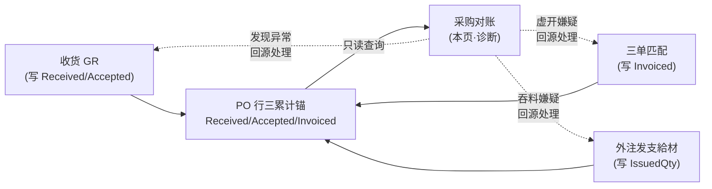
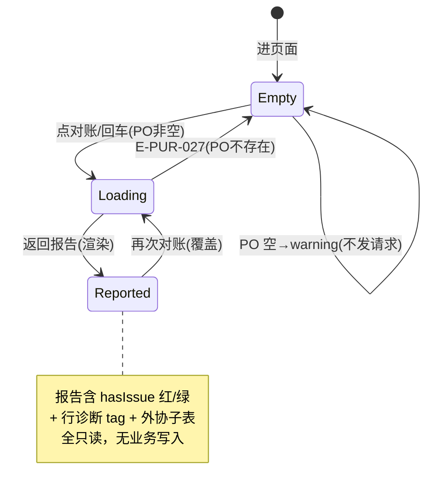

# 采购对账（PurReconcile · 完整性收口）单页面操作 SOP（手把手版）

> **用途**：给**财务对接/采购主管/审计监看完整性、培训老师讲、测试人员拆用例**。比模块总册（`04-采购管理-...md` §5.8）更细。
> **页面**：采购对账（PUR · 采购管理）　**路由**：`/pur/reconcile`　**前端**：`views/pur/PurReconcileView.vue`　**API**：`api/pur/pur.ts` → `reconcileApi.reconcile(poNo)`（GET `/pur/reconcile/{poNo}`，**单端点**）　**后端**：`PurReconcileController` → `PurReconcileService.ReconcilePoAsync`（**只读诊断**）
> **基准**：分支 `feat/wfs-inbox-core`，2026-06-29；后端实测 `docs/codemap-pur/02-申请-询价-外注-对账.md`（四、采购对账·堵三漏，2026-06-22 权威），UI 经实读 view + types。
> **样例数据**：标准采购 PO `PO2026070001`、外注委托 PO（`Type=2`）。

---

## 1. 页面一句话说明

**采购对账，就是采购完整性的"体检报告机"——你输入一个采购订单号、点「对账」，它就把这张 PO 的 订购→收货→合格→开票 四个累计数一字排开，再对外注 PO 反推支給材应耗，告诉你这张单"健不健康"。** 它专门堵三个漏：**①虚开/重复开票**（开票数 > 合格数×(1+容差)）、**②超量/重复收货**（收货数 > 订购数×(1+容差)）、**③外协吞料**（仅外注 Type=2，以合格成品反推应耗对比实发）。

> **★ 只读诊断层**：本页**不写库、不改任何状态**——它只是"照镜子"。真正的硬闸门在别处：收货时超量挡、三单匹配时容差挡、外注发料时按 `IssuedQty` 实发追踪。这页发现问题，你得**回源头页面**（收货/匹配/外注）去处理。

---

## 2. 这个页面在业务流程中的位置

- **上游**：收货（写 Received/Accepted）、三单匹配（写 Invoiced）、外注发料（写 IssuedQty）——三累计锚逐环回写到 PO 行。
- **本页**：把锚一把读出来三方核对 + 外注反推，**纯诊断终点，不回写任何业务**。
- **下游**：无自动动作。发现异常→人工回到收货/匹配/外注页处理。

---

## 3. 谁使用这个页面

| 角色 | 用途 |
|---|---|
| 财务对接/AP | 开票前/月结时核对"有没有虚开、重复开票" |
| 采购主管 | 抽查某张 PO 的收货/开票完整性 |
| 审计/内控 | 查外协 PO 有没有"吞料"（多领支給材未用） |
| 测试/培训 | 验证三漏判据、诊断 tag 着色、红/绿 alert |

---

## 4. 操作前准备

- [ ] 知道要查的**采购订单号**（PO 号）。
- [ ] 该 PO 已有业务数据才有看头：有收货（GR）/有三单匹配（开票）/（外注的）有发支給材，否则各列多为 0、诊断多显"待收/待检"。
- [ ] 清楚三漏判据（§6）与诊断 tag 含义（§6 表）——尤其 **红=danger（虚开嫌疑/超量收货/吞料异常）才是要立刻处理的**。
- [ ] 明白这页**只诊断不修**：看到红 alert，是去**源头页**改，不是在这页改。

---

## 5. 页面区域说明

| 区域 | 内容 |
|---|---|
| 页头 | 标题「采购对账」+ 副标题「完整性收口：PO↔GR↔AP 三方核对，堵三个漏(虚开/超收·重复收货/外协吞料)」 |
| 查询工具条 | 一个 PO 号输入框（宽 220，可清空，回车即查）+「对账」按钮（带 loading） |
| 报告头（descriptions 3 列） | 采购订单号 / 外协厂(supplierId) / 类型 tag（`Type=2`→warning「外注委托」，否则 info「标准采购」） |
| 完整性 alert（hasIssue 红/绿） | `hasIssue=true`→红 error「存在完整性异常，请挂起核查」；`false`→绿 success「对账正常，三方一致」 |
| 三方核对行表 | 8 列：行 / 物料 / 订购(ordered) / 收货(received) / 合格(accepted) / 开票(invoiced) / 待收(openToReceive) / 待开票(openToInvoice) / 诊断 tag |
| 外协吞料子表（仅 Type=2） | `consignReconciles` 有值才显示；每成品行一块，块头「行 #n · 收成品数 m」+ 6 列：支給材物料 / 实发(issuedQty) / 应耗(expectedQty) / 差异(variance) / 容许差异(allowedVariance) / 是否异常 tag |
| 空态 | 未对账时显 `el-empty`「输入采购订单号后对账」 |

> **数据全来自一次 GET**：`reconcileApi.reconcile(poNo)` 一把返回 `PoReconcileReport`（含 `lines[]` + `consignReconciles[]`），**无分页、无二次请求**。

---

## 6. 字段填写说明（口语版）

**本页是只读诊断报告，整页只有 1 个输入框 = 采购订单号**，其它全是"看报告"，没有任何表单要填、没有"保存/确定"。

**唯一输入**：

| 字段 | 怎么填 | 说明 |
|---|---|---|
| 采购订单号（poNo） | 手填或粘贴 PO 号，回车或点「对账」 | 留空点对账→`ElMessage.warning`「请输入采购订单号」；提交前 `trim()` 去空白 |

**报告区数字怎么读（看到的列是什么意思）**：

| 列 | 含义 | 怎么来 |
|---|---|---|
| 订购 ordered | PO 行订购数量 Qty | 三累计锚基准 |
| 收货 received | 累计已收货 ReceivedQty | 收货时回写 |
| 合格 accepted | 累计已检收合格 AcceptedQty | 收货/检收时回写 |
| 开票 invoiced | 累计已开票 InvoicedQty | 三单匹配时回写 |
| 待收 openToReceive | 还能收多少 | = 订购 − 收货 |
| 待开票 openToInvoice | 还能开多少 | = 收货 − 开票 |

**三漏判据（后端 `ReconcilePoAsync` 逐行算，基于三累计锚 + 外注 IssuedQty）**：

| 漏 | 判据 | 锚 | 命中后 |
|---|---|---|---|
| ① 虚开/重复开票 | `Invoiced > Accepted×(1+容差)` | PO 行三累计锚 | 诊断 tag「虚开嫌疑」danger + `hasIssue` 红 |
| ② 超量/重复收货 | `Received > Qty×(1+容差)` | PO 行三累计锚 | 诊断 tag「超量收货」danger + `hasIssue` 红 |
| ③ 外协吞料（仅 Type=2） | `Issued − 应耗 > 应耗×容差`（以合格成品 Accepted 反推应耗） | `PoConsignMaterial.IssuedQty` | 子表行「异常」danger + `hasIssue` 红 |

**诊断 tag `RECON_STATUS_TAG`（行级 status 字符串 → 颜色）**：

| status | tag 颜色 | 含义 |
|---|---|---|
| 完成 | success（绿） | 收货/开票都到位、三方一致 |
| 待收 | info（灰） | 还没收齐 |
| 待检 | warning（黄） | 收了还没检收合格 |
| 待开票 | `''`（空）→ 实渲染 info（灰） | 模板用 `RECON_STATUS_TAG[status] \|\| 'info'`，空串被 `\|\| 'info'` 兜成灰 tag（即无特殊高亮） |
| **虚开嫌疑** | **danger（红）** | 命中漏① |
| **超量收货** | **danger（红）** | 命中漏② |

> 记法：**只有红 tag（虚开嫌疑/超量收货 + 外协子表"异常"）才是要立刻挂起核查的硬异常**；info/warning 只是"流程没走完"，不是错。

---

## 7. 按钮操作说明

> 全页**只有 1 个动作按钮**，且是只读查询，**不写任何数据**。

| 操作 | 何时出现 | 点了会怎样 |
|---|---|---|
| 对账（type=primary） | 工具条常显 | 校验 PO 非空→`reconcileApi.reconcile(poNo.trim())` GET 一次→渲染报告；按钮 loading 期间禁重点 |
| 回车（输入框 @keyup.enter） | 焦点在 PO 输入框 | 等价于点「对账」 |
| 清空（输入框 clearable 的 ×） | 框内有字时 | 仅清输入框文本，**不清已渲染的报告**（report 仍在，直到下次对账覆盖） |

> **没有"刷新/保存/导出/修复"按钮**：本页只读诊断，结果想更新就重新对账；要修问题去源头页（收货/匹配/外注）。

---

## 8. 标准业务操作 SOP（照着点）

### 场景一：对账一张正常 PO（三方一致 → 绿）
- **背景**：财务月结前核对某标准采购单完整性。
- **样例数据**：PO `PO2026070001`（标准采购，已收齐已开票）。
- **步骤**：1) 进 `/pur/reconcile`（空态显「输入采购订单号后对账」）；2) 输入 `PO2026070001`；3) 回车或点「对账」。
- **完成后检查**：报告头显订单号/外协厂/类型 tag「标准采购」(info)；**绿 success alert「对账正常，三方一致」**；行表各行诊断 tag「完成」(success)；无外协吞料子表（标准采购）。
- **异常**：PO 不存在→`E-PUR-027`（见场景七）。
- **用例**：TC-M09-REC-001、003、004、007、008、010、015。

### 场景二：虚开/重复开票嫌疑（漏① → 红）
- **背景**：审计怀疑某 PO 开票数超过了合格收货数。
- **判据**：`Invoiced > Accepted×(1+容差)`。
- **步骤**：1) 输入该 PO；2) 对账。
- **检查**：命中行诊断 tag「**虚开嫌疑**」(danger/红)；顶部 **红 error alert「存在完整性异常，请挂起核查」**（`hasIssue=true`）；该行 开票 > 合格 一眼可见。
- **处置**：**回三单匹配页**核查是否重复开票/虚开（本页不修）。
- **用例**：TC-M09-REC-011、019、021、030。

### 场景三：超量/重复收货（漏② → 红）
- **背景**：怀疑某 PO 收货数超过了订购数。
- **判据**：`Received > Qty×(1+容差)`。
- **步骤**：1) 输入该 PO；2) 对账。
- **检查**：命中行诊断 tag「**超量收货**」(danger/红)；红 alert；该行 收货 > 订购。
- **处置**：**回收货（GR）页**核查（正常收货时硬闸门会挡超量，这里是事后体检兜底）。
- **用例**：TC-M09-REC-020、022。

### 场景四：外协吞料对账（外注 Type=2 → 子表）
- **背景**：核查外注厂有没有"多领支給材未用"（吞料）。
- **样例数据**：外注委托 PO（`Type=2`）。
- **步骤**：1) 输入外注 PO；2) 对账。
- **检查**：类型 tag「外注委托」(warning)；**出现「支給材防吞料对账」子表**；每成品行一块「行 #n · 收成品数 m」，6 列 实发/应耗/差异/容许差异/异常；吞料行（`实发−应耗 > 应耗×容差`）显「**异常**」(danger)，正常行显「正常」(success)；任一异常→`hasIssue` 红 alert。
- **机制**：以合格成品数 Accepted 反推应耗（单耗×实收成品数），对比实发 IssuedQty。
- **处置**：**回外注发料页**核查支給材实发账。
- **用例**：TC-M09-REC-009、023、025、026、027、028、029。

### 场景五：诊断 tag 全谱（流程未走完的正常分流）
- **背景**：理解 info/warning 不是错，只是"还没走完"。
- **步骤**：对账一张收了一半、还没检收/开票的 PO。
- **检查**：未收齐行→tag「待收」(info)；收了未合格→「待检」(warning)；合格未开票→「待开票」（空串经 `||'info'` 兜成灰 tag，无高亮）；都到位→「完成」(success)；**这些都不触发红 alert**（hasIssue=false 时仍绿）。
- **用例**：TC-M09-REC-016、017、018、013、014。

### 场景六：发现异常 → 回源处理（只读边界）
- **背景**：强调"对账不修"。
- **步骤**：1) 对账出红 alert；2) 在本页找"修复/放行"按钮——**找不到**。
- **检查**：本页无任何写按钮；处置路径：虚开→三单匹配页；超收→收货页；吞料→外注发料页。再次对账可复核是否已处理。
- **用例**：TC-M09-REC-031、033。

### 场景七：PO 不存在 / 空输入
- **背景**：输错单号或没填。
- **步骤**：A) 留空点「对账」；B) 输入不存在的 PO 点「对账」。
- **检查**：A)→`ElMessage.warning`「请输入采购订单号」，不发请求；B)→后端 `E-PUR-027`（PO 不存在），报告不渲染（i18n 待确认，E-PUR 码可能裸显）。
- **用例**：TC-M09-REC-002、005。

### 场景八：标准采购 vs 外注的子表差异
- **背景**：理解外协吞料子表只对外注出现。
- **步骤**：分别对账标准采购 PO 和外注 PO。
- **检查**：标准采购→类型 info、**无**外协吞料子表；外注 Type=2→类型 warning、**有**子表（`consignReconciles?.length` 控制 `v-if`）。
- **用例**：TC-M09-REC-008、009、023、024。

---

## 9. 状态变化说明

> 本页**无任何业务状态机**——它是只读诊断层，**不写库、不改 PO/GR/AP/外注的任何状态**。所谓"状态"只是查询请求的本地 UI 态。

- 行级 `status` 字符串（完成/待收/待检/待开票/虚开嫌疑/超量收货）是**后端算出来的诊断标签，不是可流转的实体状态**。

---

## 10. 按钮不可用 / 灰色 / 找不到的原因

| 现象 | 原因 |
|---|---|
| 找不到"保存/确定/修复/放行" | **本页纯只读诊断，设计上就没有写操作**；异常须回源页（收货/匹配/外注）处理 |
| 找不到"导出/打印" | 当前 view 未提供（仅屏显报告） |
| 找不到"刷新" | 重新对账即覆盖；无独立刷新键 |
| 点「对账」没反应/弹 warning | PO 输入框为空（`!poNo.trim()`）→`ElMessage.warning` 拦下，不发请求 |
| 报告头有了但没有外协吞料子表 | 该 PO 是**标准采购**（非 Type=2），`consignReconciles` 空→`v-if` 不渲染（正常） |
| 「对账」按钮转圈点不动 | `loading=true` 期间禁重点，等本次返回 |
| 清了输入框但报告还在 | 输入框 `clearable` 只清文本，不清已渲染 report（下次对账才覆盖） |

---

## 11. 常见错误与处理

> 本页只读，唯一后端错误码 `E-PUR-027`（PO 不存在）。其余多是"看着不对劲"的理解偏差。

| 现象 | 原因 | 处理 |
|---|---|---|
| 输 PO 报 `E-PUR-027` | PO 号不存在/打错 | 核对单号；E-PUR 码可能裸显（**i18n 待确认**） |
| 以为对账会自动修异常 | 误解：这是**只读诊断**，不写库不改状态 | 红 alert 后**回源页**：虚开→三单匹配 / 超收→收货 / 吞料→外注发料 |
| 标准采购没有外协吞料子表 | 子表**仅 Type=2 外注**才有 | 正常；标准采购不反推支給材 |
| 「待开票」行没特殊颜色 | `RECON_STATUS_TAG['待开票']=''`，经 `\|\|'info'` 兜成灰 tag | 设计如此，非 bug；info/warning 都是"流程未走完"不是错 |
| 收货/开票数恰好等于阈值却不报 | 判据是**严格大于** `>`（含容差），等于不算超 | 正常；容差边界设计 |
| 红 alert 但找不到哪行有问题 | 多行混合，红 tag 在具体行；外协异常在子表 | 逐行看诊断 tag + 翻外协子表「异常」行 |
| 担心多次对账会改数据 | 只读 GET，幂等 | 连点同 PO 结果一致，绝不写库 |
| 没有 pur-* 细粒度权限点 | 后端仅 `[Authorize]`（**细粒度待业务确认**） | 现状；按账号能否进路由判断 |

---

## 12. 操作完成后的检查清单

- [ ] 进页面空态显「输入采购订单号后对账」。
- [ ] 输入 PO + 对账 → 报告头三项（订单号/外协厂/类型 tag）正确。
- [ ] 类型 tag：标准采购 info「标准采购」/ 外注 Type=2 warning「外注委托」。
- [ ] 完整性 alert：正常绿「对账正常，三方一致」/ 异常红「存在完整性异常，请挂起核查」。
- [ ] 行表 8 列齐；待收=订购−收货、待开票=收货−开票算对。
- [ ] 诊断 tag 着色对：完成 success / 待收 info / 待检 warning / 待开票 灰 / 虚开嫌疑·超量收货 danger。
- [ ] 外注 PO 出现外协吞料子表（6 列），异常行 danger；标准采购无子表。
- [ ] 任一行/外协异常 → `hasIssue` 红 alert。
- [ ] 全程**无任何写操作发生**（无新增/编辑/删除/状态变更请求）。

---

## 13. 页面级测试用例（≥25 条，可执行）

> 编号 `TC-M09-REC-xxx`；样例：标准采购 `PO2026070001`、外注 PO（`Type=2`）。后端单端点 GET `/pur/reconcile/{poNo}`。

| 用例编号 | 用例名称 | 优先级 | 前置条件 | 测试数据 | 操作步骤 | 预期结果 | 下游检查 | 备注 |
|---|---|---|---|---|---|---|---|---|
| TC-M09-REC-001 | 进页面空态 | P1 | — | — | 进 `/pur/reconcile` | 显 el-empty「输入采购订单号后对账」 | — | 空态 |
| TC-M09-REC-002 | 空 PO 点对账拦截 | P1 | — | poNo 留空 | 点「对账」 | warning「请输入采购订单号」，不发请求 | 网络面板无请求 | 前端校验 |
| TC-M09-REC-003 | 回车触发对账 | P1 | PO 存在 | PO2026070001 | 框内回车 | 等价点对账，渲染报告 | — | @keyup.enter |
| TC-M09-REC-004 | 点按钮触发对账 | P1 | PO 存在 | PO2026070001 | 点「对账」 | GET `/pur/reconcile/PO2026070001` 渲染 | 1 个请求 | 核心 |
| TC-M09-REC-005 | PO 不存在 | P1 | PO 不存在 | BADPO | 对账 | 后端 `E-PUR-027`，报告不渲染 | — | i18n 待确认 |
| TC-M09-REC-006 | 对账 loading 态 | P2 | PO 存在 | PO2026070001 | 点对账观察 | 按钮 loading、禁重点 | — | UX |
| TC-M09-REC-007 | 报告头 3 项 | P1 | PO 存在 | PO2026070001 | 看 descriptions | 订单号/外协厂/类型 三项 | — | — |
| TC-M09-REC-008 | 类型 tag 标准采购 | P1 | Type=1 | PO2026070001 | 看类型 tag | info「标准采购」 | — | — |
| TC-M09-REC-009 | 类型 tag 外注委托 | P1 | Type=2 | 外注 PO | 看类型 tag | warning「外注委托」 | — | — |
| TC-M09-REC-010 | 正常三方一致绿 | P1 | 无异常 PO | PO2026070001 | 对账 | 绿 success「对账正常，三方一致」 | hasIssue=false | — |
| TC-M09-REC-011 | 异常红 alert | P1 | 有异常 PO | 虚开 PO | 对账 | 红 error「存在完整性异常，请挂起核查」 | hasIssue=true | — |
| TC-M09-REC-012 | 行表 8 列渲染 | P1 | 有行 | PO2026070001 | 看行表 | 行/物料/订购/收货/合格/开票/待收/待开票/诊断 | — | — |
| TC-M09-REC-013 | 待收=订购−收货 | P2 | 有行 | 订购10收6 | 看待收列 | openToReceive=4 | — | 计算 |
| TC-M09-REC-014 | 待开票=收货−开票 | P2 | 有行 | 收6开4 | 看待开票列 | openToInvoice=2 | — | 计算 |
| TC-M09-REC-015 | 诊断 tag 完成 | P1 | 收开齐 | PO2026070001 | 看诊断列 | tag「完成」success | — | — |
| TC-M09-REC-016 | 诊断 tag 待收 | P2 | 未收齐 | 部分收货 PO | 看诊断列 | tag「待收」info | — | — |
| TC-M09-REC-017 | 诊断 tag 待检 | P2 | 收未合格 | 检验中 PO | 看诊断列 | tag「待检」warning | — | — |
| TC-M09-REC-018 | 诊断 tag 待开票（灰） | P2 | 合格未开票 | 待开票 PO | 看诊断列 | 空串经 `\|\|'info'` 渲染灰 tag | — | 无高亮 |
| TC-M09-REC-019 | 诊断 tag 虚开嫌疑 | P0 | Invoiced>Accepted×(1+容差) | 虚开 PO | 对账 | tag「虚开嫌疑」danger | — | 漏① |
| TC-M09-REC-020 | 诊断 tag 超量收货 | P0 | Received>Qty×(1+容差) | 超收 PO | 对账 | tag「超量收货」danger | — | 漏② |
| TC-M09-REC-021 | 虚开触发 hasIssue 红 | P1 | 含虚开行 | 虚开 PO | 对账 | 顶部红 alert | hasIssue=true | — |
| TC-M09-REC-022 | 超收触发 hasIssue 红 | P1 | 含超收行 | 超收 PO | 对账 | 顶部红 alert | hasIssue=true | — |
| TC-M09-REC-023 | 外协子表仅 Type=2 | P1 | Type=2 | 外注 PO | 对账 | 显「支給材防吞料对账」子表 | consignReconciles 有值 | v-if |
| TC-M09-REC-024 | 标准采购无子表 | P1 | Type=1 | PO2026070001 | 对账 | 无外协吞料子表 | consignReconciles 空 | — |
| TC-M09-REC-025 | 外协子表块头 | P2 | Type=2 | 外注 PO | 看子表 | 块头「行 #n · 收成品数 m」 | — | — |
| TC-M09-REC-026 | 外协子表 6 列 | P2 | Type=2 | 外注 PO | 看子表 | 支給材物料/实发/应耗/差异/容许差异/异常 | — | — |
| TC-M09-REC-027 | 外协吞料异常 danger | P0 | 实发−应耗>应耗×容差 | 吞料外注 PO | 对账 | 子表行「异常」danger | — | 漏③ |
| TC-M09-REC-028 | 外协吞料正常 | P2 | 实发≈应耗 | 正常外注 PO | 对账 | 子表行「正常」success | — | — |
| TC-M09-REC-029 | 外协异常触发 hasIssue 红 | P1 | 含吞料异常 | 吞料外注 PO | 对账 | 顶部红 alert | hasIssue=true | — |
| TC-M09-REC-030 | 容差边界严格大于 | P2 | Invoiced=Accepted×(1+容差) | 边界 PO | 对账 | 不报虚开（等于不算超，须 >） | — | 边界 |
| TC-M09-REC-031 | 只读不改状态 | P0 | 任意 PO | PO2026070001 | 对账前后查 PO/库存 | PO 状态、库存、AP 均无变化 | DB 断言 | 核心 |
| TC-M09-REC-032 | 多行混合 | P2 | 部分行异常 | 混合 PO | 对账 | 异常行各 danger tag、正常行各自 tag，顶部红 alert | — | — |
| TC-M09-REC-033 | 重复对账幂等 | P2 | 任意 PO | PO2026070001 | 连点两次对账 | 两次结果一致，绝不写库 | — | 幂等 |
| TC-M09-REC-034 | i18n / 裸码 | P3 | — | — | 看界面文字 | label 走 t()；`E-PUR-027` 可能裸显 | — | 待确认 |
| TC-M09-REC-035 | 无分页一次渲染 | P3 | 多行 PO | 大 PO | 对账 | 行表一次性渲染、无分页器 | — | — |
| TC-M09-REC-036 | 权限（仅 Authorize） | P2 | 无权账号 | — | 进页面 | 仅 `[Authorize]`，无 pur-* 细粒度（待确认） | — | 权限 |
| TC-M09-REC-037 | 清输入框不清报告 | P3 | 已有报告 | — | 点输入框 × | 文本清空、已渲染报告仍在 | — | clearable |

---

## 14. 培训讲解建议

| 顺序 | 讲什么 | 演示 | 易误解点 |
|---|---|---|---|
| 1 | 这是"只读体检报告"，不修不写 | §1 + 全页找不到保存/修复按钮 | 以为对账会自动修异常 |
| 2 | 一个输入框：PO 号→对账 | §6 + 回车/按钮两种触发 | 找别的输入框/筛选 |
| 3 | 三方四数：订购→收货→合格→开票 | §6 行表读法 | 把"合格"当"收货" |
| 4 | 堵三漏判据（红才是硬异常） | §8 场景二/三/四 | 把 info/待收当成错误 |
| 5 | 外协吞料子表只对外注（Type=2） | §8 场景八对比 | 标准采购找子表 |
| 6 | 红 alert 后回源处理 | §8 场景六 + §10 | 等着在本页修 |
| 7 | 待开票"灰 tag"= 空串兜底 | §6 tag 表脚注 | 以为掉色/bug |

---

## 15. 与模块级手册的关系

对应 `04-采购管理-最详细用户操作培训手册.md` **§5.8 采购对账（PurReconcile · /pur/reconcile）**：§5.8.1 业务目的（只读诊断层堵三漏）、§5.8.5 页面区域（查询卡→报告区→空态）、§5.8.8 业务规则（`E-PUR-027` + `RECON_STATUS_TAG` 六态 + hasIssue 红/绿）、§5.8.11 常见错误（以为自动修/标准采购无子表）。模块级业务场景见 §6「场景六·采购对账堵三漏」。本页是 §5.8 的"手把手"细化版（场景 + ≥25 用例粒度）。

---

## 16. 代码与文档来源

| 层 | 文件 |
|---|---|
| 逐行源码手册 | `docs/codemap-pur/02-申请-询价-外注-对账.md`（四、采购对账·堵三漏，权威 2026-06-22） |
| 前端 view | `cp6.web/src/views/pur/PurReconcileView.vue`（实读） |
| API | `cp6.web/src/api/pur/pur.ts` → `reconcileApi.reconcile(poNo)`（GET `/pur/reconcile/{poNo}`） |
| 类型 | `cp6.web/src/types/pur/pur.ts`（`PoReconcileReport` / `PoReconcileLine` / `ConsignReconcileResult` / `ConsignReconcileLine` / `RECON_STATUS_TAG`） |
| 后端 | `Controllers/Pur/PurReconcileController.cs`、`Services/Pur/PurReconcileService.cs`（`ReconcilePoAsync` 22-92，`E-PUR-027`、`ResolveToleranceAsync`、Type==2 外协反推 67-81） |
| 模块手册 | `docs/manuals/user-training/04-采购管理-最详细用户操作培训手册.md` §5.8 / §0 / §3 |

---

## 最后更新来源

- 代码：见 §16（codemap-pur 02 + view/api/types 实读）。
- 基准：分支 `feat/wfs-inbox-core`，2026-06-29（codemap 2026-06-22 权威）。
- 覆盖：16 节 / 8 场景 / 37 用例（TC-M09-REC-001~037）。
- 诚实标注：①只读诊断发现异常须**回源页**（收货/匹配/外注）处理，本页不修；②后端仅 `[Authorize]`，无 pur-* 细粒度权限点（**待业务确认**）；③`E-PUR-027` 等错误码 i18n 可能裸显（**待业务确认**）；④「待开票」诊断 tag 为空串经 `||'info'` 兜成灰 tag。
