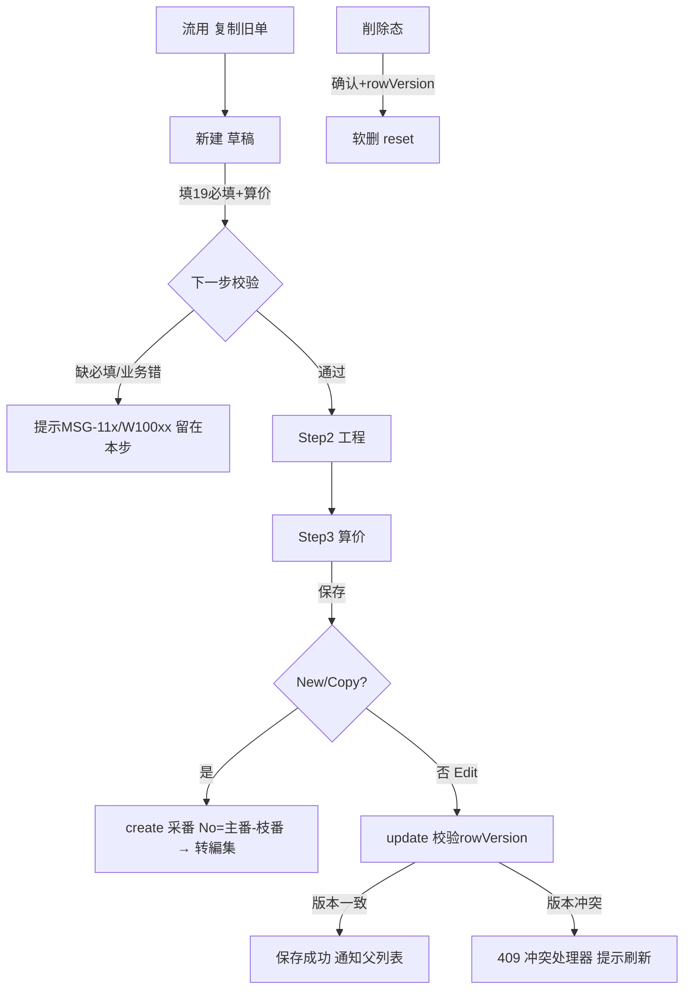

# 見積計算書 单页面操作 SOP（手把手版）

> **用途**：给**业务用户照着点、培训老师照着讲、测试人员照着拆用例**的单页面手册。比模块总册更细、更口语。
> **页面**：見積計算書（MSBBPA010 · 销售管理 MSBB · 模块总册 §5.1）　**前端**：`views/erp/EstimateCalcView.vue`（三步子组件 `estimate/Step1BasicInfo.vue`/`Step2Processes.vue`/`Step3Result.vue`）　**API**：`api/erp/estimateCalc.ts`　**后端**：`Erp/EstimateCalcController` → `EstimateCalcService`
> **基准**：分支 `feat/wfs-inbox-core`，2026-06-28，均实测真实代码。查不到的标 `待业务确认` / `代码未发现`。
> **样例数据**：客户 `C0001`(A社)、商品コード `A4-BOX-001`、見積拠点/受注拠点 `BASE01`、担当者 `S001`、見積計算書No `EMC2026060001-01`（保存时系统采番=主番`機能コードEMC+年月YYYYMM+4桁自増`-枝番`01`；页面查询框示例简写作 `00000001-01`）、受注数量 `10000`、見積り数量段 `1000/3000/5000/10000`。

---

## 1. 页面一句话说明

**見積計算書，就是销售给纸箱/纸器产品"算成本、定报价"的核心算价台——你按一个 3 步向导（基本信息 → 工程明细 → 计算结果）把产品规格、原纸、印刷、工程、数量段一项项填进去，系统就替你算出見積面積、標準原価、見積単価，并按 8 个数量段列出"数量×单价=金额"；它是后面"御見積書、受注"的源头单据，但本身不碰生产和库存。**

---

## 2. 这个页面在业务流程中的位置

```
上游(主数据/前置)              本页面(3步向导)                       下游
────────────────         ──────────────────────────         ────────────────────
取引先マスタ(客户) ─┐                                          御見積書(quotation)
シート単価マスタ    ├─→  見積計算書 MSBBPA010                  ↑ 束ね(多个見積汇总报价)
原紙/印刷/工程 码表 ─┤    Step1 基本信息(19必填)                     │
為替レート(外币)   ─┘    Step2 工程明細(リサイクル法A/B/C)     →  見積計算一覧(检索/流用/软删)
                         Step3 計算結果(算价/8数量段/確定単価)        │
                         保存→系统采番 No=主番-枝番                  受注入力(参照见積→建单)
```

- **上游（算价要靠的主数据）**：客户(取引先)、シート単価マスタ、原紙/印刷/工程/形状等通用码表、為替レート（外币报价时）。这些没维护好，下拉选不到、算价会偏。
- **本页面**：3 步向导填一张見積計算書 → 算出単価/金额 → 保存（系统采番 `主番-枝番`，如 `00000001-01`）。支持 新建/编辑/流用(复制)/查看/删除 五种操作。
- **下游**：① 在【見積計算一覧】检索、流用、软删；② 多张見積在【御見積書】束ね汇总成对客报价并発行；③ 受注入力参照見積建受注。
- **关键认知**：① 本页**只算价、出报价底稿，不触发 MES/WMS/任何 Bridge**（那是受注保存才发生）；② 算价是 **Phase 3 模拟引擎**（见 §6.4，结果会附"計算ロジック"自解释，便于核对）；③ 一张見積有"主番-枝番"，**流用**会基于已有 No 生成新枝/新单（改型号比价常用）。

---

## 3. 谁使用这个页面

| 角色 | 使用目的 | 常用操作 | 权限要求 | 注意事项 |
|---|---|---|---|---|
| 销售/营业担当 | 给客户算价、出报价底稿 | 新建→3步→保存、流用比价 | 见積编辑权限(`[Authorize]`，细粒度`待业务确认`) | 19必填要齐 |
| 销售内勤/见積担当 | 维护/修订見積 | 编辑、再計算、查看 | 编辑权限 | 编辑时主键不可改 |
| 销售主管 | 审报价、定確定単価 | 查看、改確定単価 | 查看/编辑 | 確定単価可手改覆盖系统値 |
| 生产/工务(协助) | 帮填工程明細/规格 | Step2 工程明細 | 编辑权限 | リサイクル法A/B/C |
| 测试/UAT | 验证算价与必填校验 | 全流程 | 登录 | 核对8数量段金额 |

> 📌 **权限现状**：后端 `EstimateCalcController` 标 `[Authorize]`（登录可用），细粒度操作点授权 `待业务确认`。

---

## 4. 操作前准备（不准备好，下面会卡住）

| 准备项 | 为什么需要 | 不满足会怎样 | 去哪里维护/确认 | 测试关注点 |
|---|---|---|---|---|
| 客户(取引先)已建 | 顧客コード必填、关联报价 | 填不出有效客户 | 取引先マスタ | 必填MSG-116 |
| 拠点/担当者主数据齐 | 見積/受注拠点、担当者必填且联动 | 下拉空、担当者选不出 | 拠点·担当者主数据 | 担当者依赖受注拠点 |
| 商品分类码表(大/中/小)维护 | 大→中→小级联必填 | 中分類选不出 | 通用码表 | 级联MSG-118/119 |
| 原紙/印刷/工程/形状/单位码表 | 多个必填下拉来源 | 选不出、算价缺输入 | 通用码表 | 必填MSG-123~129 |
| シート単価/原紙单价主数据 | 算价引擎要用 | 算出价偏低/为0 | シート単価マスタ | 算价输入 |
| 為替レート(外币时) | 非JPY报价换算 | 外币算价不准 | 為替レート | 外币 |
| 编辑/查看/删除需先有 No | 这些操作针对已存単 | 提示请输入No(E10022) | 先新建保存或输No加载 | E10022 |

---

## 5. 页面区域说明

| 区域 | 页面位置 | 用户要做什么 | 注意事项 |
|---|---|---|---|
| 操作种别条 | 顶部左 | 看当前是 新建/编辑/流用/查看/删除（彩色标签+No） | 无No时编辑/流用/查看/删除禁用 |
| 操作种别切换 | 顶部右(单选钮组) | 切 新建/編集/流用/参照/削除 | 有未保存改动会先确认 |
| 步骤条 | 操作条下 | 看当前在 Step1/2/3 | Step1校验过才让进Step2 |
| 查询入力卡 | 步骤条下(非新建时显示) | 输見積No→読込加载 | 新建模式不显示 |
| Step1 基本信息 | 步骤内容 | 填10区块、19必填 | 大中小级联、blur联动 |
| Step2 工程明細 | 步骤内容 | 增删工程行、リサイクル法A/B/C | 行号自动重排 |
| Step3 計算結果 | 步骤内容 | 点再計算、看面積/原価/单价/8段金额、改確定単価 | 进入即自动算一次 |
| 底部按钮条 | 页面底 | 上一步/下一步/保存/删除/取消 | 按操作种别显隐 |
| 独立窗口模式 | popup 打开时 | 同上，保存后回写父列表、可关窗 | URL带 op/no 参数 |

---

## 6. 字段填写说明（口语版）

### 6.1 操作种别（5 种，先选对再填）

| 操作种别 | 值 | 什么时候用 | 字段状态 | 底部按钮 |
|---|---|---|---|---|
| 新建(登録) New | 10 | 算一张新報価 | 全可编辑(主键系统采番禁用) | 上/下一步·保存·取消 |
| 編集(訂正) Edit | 20 | 改已存見積 | 主键只读、其余可编辑 | 上/下一步·保存·取消 |
| 流用(複製) Copy | 50 | 基于旧見積复制比价 | 全可编辑(复制来数据) | 上/下一步·保存·取消 |
| 参照(査看) View | 40 | 只看不改 | 全字段只读 | 下一步·关闭·取消 |
| 削除 Delete | 30 | 软删見積 | 全字段只读 | 删除·取消 |

> 切到 編集/参照/削除 但页面没数据时 → 提示"请输入No"(E10022)，先用查询入力読込。

### 6.2 Step1 基本信息 · 19 必填项（怎么填）

| # | 字段(label) | 字段名 | 怎么填 | 谁提供 | 填错影响 | 校验码 |
|---|---|---|---|---|---|---|
| 1 | 商品コード | `proCd` | 输产品代码 | 销售/商品主数据 | 关联不到产品 | MSG-111 |
| 2 | 見積日 | `qtnDate` | 选日期(默认今天) | 系统默认 | 报价日期错 | MSG-112 |
| 3 | 見積拠点 | `qtnBaseCd` | 选据点 | 拠点主数据 | 归属错 | MSG-113 |
| 4 | 受注拠点 | `orderBaseCd` | 选据点(决定担当者列表) | 拠点主数据 | 担当者选不出 | MSG-114 |
| 5 | 担当者 | `staffCd` | 选(**先选受注拠点**) | 担当者主数据 | 责任人空 | MSG-115 |
| 6 | 顧客コード | `customerCd` | 输客户代码 | 取引先マスタ | 报价无客户 | MSG-116 |
| 7 | 受注形態 | `orderType` | 选区分 | 码表 | 形态错 | MSG-117 |
| 8 | 大分類 | `productCategoryBig` | 选(级联起点) | 码表 | 中分類选不出 | MSG-118 |
| 9 | 中分類 | `productCategoryMid` | 选(**先选大分類**) | 码表 | 分类不全 | MSG-119 |
| 10 | 顧客品名1 | `customerProductName1` | 输客户称呼的品名 | 客户提供 | 对客名缺 | MSG-120 |
| 11 | 受注数量 | `orderQty` | 输>0数量 | 客户订量 | 0被拦 | MSG-121 |
| 12 | 親子区分 | `parentChildDiv` | 选 | 码表 | 套件关系错 | MSG-122 |
| 13 | シート・フルート | `sheetFlute` | 选楞型/瓦楞 | 码表 | 算价偏 | MSG-123 |
| 14 | 原紙(F) | `paperCdF` | 选面纸原纸 | 码表/シート単価 | 原价错 | MSG-124 |
| 15 | 印刷(F) | `printCdF` | 选面印刷 | 码表 | 印刷费错 | MSG-125 |
| 16 | 最終工程 | `finalMachineProc` | 选最终加工机 | 码表 | 工程费错 | MSG-126 |
| 17 | 形状1 | `productShape1` | 选箱型 | 码表 | 展开尺寸错 | MSG-127 |
| 18 | 流通区分 | `distDiv` | 选 | 码表 | 流通错 | MSG-128 |
| 19 | 単位 | `unit` | 选(枚/セット等) | 码表 | 单位错 | MSG-129 |

> 其余**非必填**但重要的字段：参照元No、親/子案件No、材質、小分類(`productCategorySml`)、顧客品名2、受注年月、FSC商品/原紙、原紙(C/B)、印刷(C/B)、エンボス(F/C/B)、型数(F/B)、刃渡り/流れ/のりしろFB·LR、シート寸法W/F、形状2、再利用払込、IDマーク、AD形状、戦略区分1~10(勾选)、見積り数量1~8段、パレット1~8、提案ロット1/2、決定予定、各类備考(印刷/製造/伝票/納入/出荷1·2)。

### 6.3 Step1 联动与业务校验（容易踩）

| 规则 | 说明 | 触发 | 提示码 |
|---|---|---|---|
| 担当者依赖受注拠点 | 没选受注拠点，担当者下拉禁用 | 选受注拠点后才加载担当者 | — |
| 大→中→小级联 | 大变→清中/小；中变→清小；中按大过滤(attr1) | 选择联动 | — |
| 小分類有则中分類必须有 | 业务校验 | 保存/下一步 | MSG-W10010 |
| 見積り数量至少1段>0 | 否则算价无意义 | 保存/下一步 | MSG-W10011 |
| 刃渡り有则流れ必填 | 尺寸成对 | 保存/下一步 | MSG-W10012 |

### 6.4 Step3 計算結果（算价怎么读）

> 点【再計算】或进入 Step3 自动调 `POST /estimate-calcs/calculate`（带表头+工程明細），返回计算结果。**当前为 Phase 3 简化/模拟引擎**——产线最终算法待业务定，结果附"計算ロジック"逐条自解释，便于人工核对。算价**纯计算无副作用**（后端 `Calculate` 端点 `[AllowAnonymous]`，缺字段走兜底不报错），算出的值经 Step3 回填后**要再点保存才落库**。
>
> **真实算价链路（后端 `CalculateAsync`，便于核对）**：
> 1. **原紙単価**：查通用码 `Paper(=原紙(F)).Num1`；缺则 fallback `30 円/m²`。
> 2. **シート単価マスタ覆盖(PA130)**：若 `客户+シート・フルート+原紙(F)` 命中【見積用シート単価マスタ】当日最新改定价，则覆盖步1。
> 3. **段成率(良率)**：查通用码 `M067(=シート・フルート).Num1`；缺则 fallback `1.00`(无损耗)。
> 4. **面積/枚** = `シート寸法W × シート寸法F ÷ 1,000,000`。
> 5. **見積面積** = `面積/枚 × 受注数量`（4位小数）。
> 6. **工程原価** = `工程明細行数 × 5 円`（Step2 行数驱动）。
> 7. **標準原価** = `原紙原価/枚 + 工程原価`（3位小数）。
> 8. **見積単価** = `標準原価 × 1.20`（固定利益率20%，3位小数）。
> 9. **確定単価** = 見積単価（可手改覆盖）。
> 10. **各数量段金額** = `round(数量 × 見積単価, 0)`，对 見積り数量1~8 中 >0 的段逐段算。
>
> 📌 与 MRP 共用同一单耗内核 `MaterialUsageCalculator.CalcDimensional`，保证算料一致。シート寸法、原紙、工程行数、数量段填错都会直接影响上面各步。

| 结果字段 | 业务含义 | 怎么看 | 注意 |
|---|---|---|---|
| 見積面積(m²) `estimateSqm` | 由シート寸法/展开算出 | 4位小数 | 尺寸填错→面积偏 |
| 標準原価 `standardUnitPrice` | 原纸+印刷+工程成本 | 货币 | 主数据单价驱动 |
| 見積単価 `estimateUnitPrice` | 系统建议报价(含利) | 红色高亮 | 报价基准 |
| 確定単価 `confirmedUnitPrice` | **可手改**的最终敲定价 | 可编辑数字框 | 留空则取系统値 |
| 見積区分 `qtnDiv` | A 積算/B 実績/C 概算 | 下拉 | 标算价口径 |
| 数量別金額表 | 8 数量段 各 数量×単価=金額 | 表格 | 段全0则空表提示 |
| 計算ロジック `notes` | 引擎逐条说明怎么算的 | 列表(等宽字体) | 核对依据 |

---

## 7. 按钮操作说明

| 按钮 | 在哪步/哪操作 | 点了以后系统会做什么 | 成功后看到 | 失败处理 | 测试关注点 |
|---|---|---|---|---|---|
| 操作种别(单选) | 顶部 | 切换操作；有脏数据先确认 | 字段状态/按钮随之变 | 无No切编辑等→E10022 | 5×4矩阵 |
| 読込(加载) | 查询入力卡 | 按見積No拉明细 | 表单载入该単 | No空→E10022；查无→提示 | 加载 |
| 下一步 | Step1/2 | Step1先校验(19必填+业务)，过则进下一步 | 进 Step2/3 | 校验失败→提示首个错误 | 校验拦截 |
| 上一步 | Step2/3 | 回上一步 | 回 Step1/2 | — | 返回 |
| 再計算 | Step3 | 调 calculate，回填面積/原価/单价/8段金额/notes | 计算完了提示 | — | 算价 |
| 行追加 | Step2 | 加一行工程，seqNo自增 | 新空行 | — | 增行 |
| 選択削除/削除 | Step2 | 删勾选行/单行，行号重排 | 行减少、重排 | 只读态禁用 | 删行 |
| リサイクル法A/B/C | Step2 | 开对应弹窗，确认后写回并追加工程行 | 適用完了提示 | — | 回收法 |
| 保存 | New/Edit/Copy | New/Copy→create(采番)、Edit→update(乐观锁) | 采番No出现、转編集、提示成功、通知父列表 | 409冲突→冲突处理器 | 采番/乐观锁 |
| 削除 | Delete | 二次确认→软删(带rowVersion) | 删除成功、reset | 409→冲突 | 软删 |
| 取消/关闭 | 各态 | 独立窗→关窗(脏先确认)；普通→reset | 清空/关闭 | — | 取消 |

> ⚠️ **保存才采番**：新建时見積No框禁用、占位"保存时系统采番"；保存后得到 `主番-枝番`（如 `00000001-01`），并自动切到"編集"态。
> ⚠️ **独立窗口模式**(`/estimate-calc/window?op=...&no=...`)：保存/删除成功会 `postMessage` 通知打开它的列表页自动刷新。

---

## 8. 标准业务操作 SOP（照着点）

### 场景一：新建一张見積計算書并算出报价（主流程）
- **业务背景**：A社询价一款 A4 包装箱 1 万只，销售要算价报价。
- **使用样例数据**：客户 C0001、商品コード A4-BOX-001、受注数量 10000、見積り数量段 1000/3000/5000/10000。
- **前置条件**：① 登录有編集权限；② 客户/拠点/担当者/码表/シート単価 已维护。
- **详细操作步骤**：
  1. 打开【销售管理 → 見積計算書】，操作种别默认"新建"。
  2. **Step1 基本信息**：填 19 必填——商品コード A4-BOX-001；見積日(默认今天)；見積拠点/受注拠点 BASE01；**先选受注拠点**再选担当者 S001；顧客コード C0001；受注形態；大分類→中分類(级联)；顧客品名1；受注数量 10000；親子区分；シート・フルート；原紙(F)；印刷(F)；最終工程；形状1；流通区分；単位。再按需填尺寸(刃渡り/流れ/シート寸法)、見積り数量1~8段。
  3. 点【下一步】（系统校验19必填+业务规则，过则进 Step2）。
  4. **Step2 工程明細**：点【行追加】逐行选工程、填规格/版No/备注；需要时用【リサイクル法A/B/C】。
  5. 点【下一步】进 **Step3**，页面自动【再計算】。
  6. 看 見積面積、標準原価、見積単価(红)、8 数量段金额；按需在【確定単価】手改最终价；选【見積区分】。
  7. 点【保存】→ 顶部出现采番 No(如 00000001-01)、操作态变"編集"、提示保存成功。
- **完成后检查**：① 得到見積No；② 8 数量段金额正确；③ 列表(見積計算一覧)能查到。
- **异常处理**：必填缺→提示首个 MSG-11x；見積数量全0→MSG-W10011；并发→见场景五。
- **可拆测试用例**：TC-M04-EST-001~006、020~024。

### 场景二：流用(复制)一张旧見積改型号比价
- **业务背景**：客户在原箱型上改尺寸要重新比价。
- **使用样例数据**：源見積 00000001-01。
- **前置条件**：已有源見積。
- **详细操作步骤**：
  1. 操作种别切【流用】，或在查询入力読込源 No 后切流用。
  2. 系统调 copy 复制源数据到新表单（No 清空待采番）。
  3. 改动要变的字段（尺寸/原紙/数量段）。
  4. Step3 再計算看新价。
  5. 保存 → 得到新 No（新枝番/新主番）。
- **完成后检查**：① 新单数据来自源单且改动生效；② 新 No 与源不同；③ 源单不受影响。
- **异常处理**：源 No 不存在→読込提示查无。
- **可拆测试用例**：TC-M04-EST-010/011。

### 场景三：编辑已存見積并改確定単価
- **业务背景**：主管核价后下调最终单价。
- **使用样例数据**：見積 00000001-01。
- **前置条件**：见積存在、有編集权限。
- **详细操作步骤**：
  1. 操作种别【編集】，查询入力输 00000001-01【読込】。
  2. 改字段（如数量段/工程）；見積No 主键只读不可改。
  3. Step3【再計算】，在【確定単価】手填最终价。
  4. 【保存】(走 update，乐观锁校验)。
- **完成后检查**：① 改动落库；② 確定単価为手填值；③ modifyDate 更新。
- **异常处理**：保存时 409 → 别人已改，按冲突处理器提示刷新重载再改。
- **可拆测试用例**：TC-M04-EST-012/013/021。

### 场景四：参照(只读)查看 + 工程明細/计算核对
- **业务背景**：内勤复核一张見積但不改。
- **使用样例数据**：見積 00000001-01。
- **前置条件**：见積存在。
- **详细操作步骤**：
  1. 操作种别【参照】，読込该 No。
  2. 全字段只读；可点【下一步】浏览 Step2 工程、Step3 計算結果。
  3. Step3 仍可【再計算】查看（只读态下计算按钮按 isPageReadOnly 控制，确认行为）。
- **完成后检查**：① 不能改任何字段；② 底部只有"关闭/取消"，无保存。
- **异常处理**：误改→只读拦截。
- **可拆测试用例**：TC-M04-EST-014/015。

### 场景五：保存遇并发冲突(乐观锁)
- **业务背景**：两人同时改同一張見積。
- **使用样例数据**：見積 00000001-01，两端同时打开。
- **前置条件**：两端都在編集。
- **详细操作步骤**：
  1. A、B 两端都【読込】同一 No。
  2. A 先改并【保存】成功（rowVersion 前进）。
  3. B 再改并【保存】→ 后端比对 rowVersion 不一致返回 409。
  4. B 端冲突处理器弹出提示 → B 重新读取最新再改再存。
- **完成后检查**：① B 收到冲突提示而非静默覆盖；② 重载后 B 改动基于最新版。
- **异常处理**：B 直接放弃则源数据保持 A 的版本。
- **可拆测试用例**：TC-M04-EST-022。

### 场景六：删除一张見積（软删）
- **业务背景**：报错的見積要作废。
- **使用样例数据**：見積 00000002-01。
- **前置条件**：见積存在、有删除权限。
- **详细操作步骤**：
  1. 操作种别【削除】，読込该 No。
  2. 全字段只读，底部出现【删除】。
  3. 点【删除】→ 二次确认(显示 No) → 软删(带 rowVersion)。
  4. 提示删除成功，页面 reset。
- **完成后检查**：① 列表默认查不到（软删）；② 带 includeDeleted 仍可追溯；③ 关联御見積已束ね的需先处理(`待业务确认`)。
- **异常处理**：409→冲突；已被删→提示。
- **可拆测试用例**：TC-M04-EST-016/017。

### 场景七：独立窗口模式(popup)算价并回写列表
- **业务背景**：从見積計算一覧点"新页签编辑"打开独立窗口算价。
- **使用样例数据**：URL `/estimate-calc/window?op=new` 或 `?op=edit&no=00000001-01`。
- **前置条件**：从列表打开 popup。
- **详细操作步骤**：
  1. 列表打开独立窗口，URL 的 `op/no` 自动驱动操作种别与加载。
  2. 完成 3 步算价。
  3. 【保存】成功 → 窗口 `postMessage` 通知父列表刷新。
  4. 点【取消/关闭】（有脏数据先确认）关窗。
- **完成后检查**：① 父列表自动出现/更新该単；② 关窗不残留脏数据(卸载 reset)。
- **异常处理**：跨源/父窗已关→静默忽略，不影响保存。
- **可拆测试用例**：TC-M04-EST-018/019。

---

## 9. 状态变化说明

> 本页有两层"状态"：① 前台**操作种别(5)×字段控制**（决定能改什么）；② 后台**记录 Status**：`0 未確定`(保存后默认) → `1 確定`(由下游【御見積書】确定时回写) → `9 削除`(软删)。本页只能新建/改/删見積本体，"確定"由御見積触发，不在本页点。

| 状态/动作 | 用户看到什么 | 代表什么 | 可做什么 | 不能做什么 | 下一步 |
|---|---|---|---|---|---|
| 新建(未保存) | 蓝标签·No空·全可编辑 | 草稿态 | 填/算/保存 | 无 No 不能编辑/删除 | 保存采番 |
| 保存后(編集) | No出现·态转編集 | 已落库 Status=0未確定 | 改后再存、删除、流用 | 改主键 | 下游引用 |
| 流用(未保存) | 绿标签·复制数据·No空 | 基于旧单的新草稿 | 改并保存得新No | — | 保存 |
| 参照 | 灰标签·全只读 | 只读浏览 | 看·浏览各步·再計算查看 | 改任何字段/保存 | 关闭 |
| 削除 | 红标签·全只读·删除钮 | 待删 | 删除 | 改字段 | 软删 Status=9 |
| 確定(下游回写) | 在御見積确定后 | Status=1，已被对客报价采用 | 查看 | 随意改/删(`待业务确认`) | 受注参照 |



---

## 10. 按钮不可用 / 灰色 / 不出现原因

| 按钮/字段 | 何时不可用/不出现 | 为什么 | 怎么处理 | 测试关注点 |
|---|---|---|---|---|
| 編集/流用/参照/削除 单选 | 当前无見積No | 这些操作针对已存単 | 先新建保存或読込No | 无No禁用 |
| 見積No 输入 | 任何时候 | 系统采番，禁手填 | 保存后自动得 | 采番 |
| 主键字段(編集态) | 編集时 | 主键不可改(RO) | 用流用建新单 | 主键锁 |
| 所有字段(参照/削除) | 参照/削除态 | 只读保护 | 切編集才改 | 全只读 |
| 担当者 | 未选受注拠点 | 依赖拠点过滤 | 先选受注拠点 | 联动禁用 |
| 中分類/小分類 | 上级未选 | 级联依赖 | 先选大/中分類 | 级联 |
| 保存 | 参照/削除态 | 只读无保存 | 切編集/新建 | 按钮显隐 |
| 删除 | 非削除态 | 只在删除态出现 | 切削除 | 按钮显隐 |
| 工程行 増删/リサイクル法 | 只读态 | isPageReadOnly | 切可编辑态 | Step2只读 |
| 下一步(Step1) | 必填未过 | 19必填+业务校验拦截 | 补齐必填 | 校验 |

---

## 11. 常见错误与处理

| 错误/提示 | 可能原因 | 用户处理方法 | 是否需要管理员 | 测试关注点 |
|---|---|---|---|---|
| MSG-111~129 必填提示 | 19必填项漏填 | 按提示补该项 | 否 | 必填 |
| MSG-W10010 小分類有中分類空 | 级联不完整 | 补中分類或清小分類 | 否 | 业务校验 |
| MSG-W10011 見積数量未入 | 8段全0 | 至少填1段>0 | 否 | 业务校验 |
| MSG-W10012 刃渡り有流れ空 | 尺寸不成对 | 补流れ | 否 | 业务校验 |
| E10022 请输入No | 切编辑/删除/查看无数据 | 先読込No或新建 | 否 | E10022 |
| MSG-102 見積No未登録 | 読込的No不存在 | 核对見積No | 否 | 404 |
| 受注数量必须>0 | 填0或负 | 填正数 | 否 | MSG-121 |
| 担当者选不出 | 没选受注拠点 | 先选受注拠点 | 否 | 联动 |
| 中分類选不出 | 没选大分類 | 先选大分類 | 否 | 级联 |
| MSG-W10002 保存/删除冲突(409) | 他人已改同単(rowVersion不符) | 刷新重载再改 | 否 | 乐观锁 |
| 算价为0/偏低 | シート単価/原紙单价缺→走fallback(原紙30/良率1.0) | 维护主数据再算(算价本身不报错) | 是(主数据) | 算价fallback |
| 下拉空 | 码表/主数据未维护 | 维护对应码表 | 是 | 主数据 |
| 流用源不存在 | No错/已删 | 核对源No | 否 | 流用 |
| 离开后数据没了 | 卸载自动reset | 保存后再离开 | 否 | 防脏 |
| 权限不足 | 无編集/删除权限 | 申请权限 | 是 | 权限`待确认` |

---

## 12. 操作完成后的检查清单

| 操作 | 当前页面检查 | 見積計算一覧检查 | 下游(御見積/受注)检查 | 数据状态检查 | 测试关注点 |
|---|---|---|---|---|---|
| 新建保存 | 出现采番No、转編集 | 列表能查到该単 | 可被御見積束ね/受注参照 | qtnCalcNo=主番-枝番 | 采番 |
| 算价 | 8段金额、面積/单价合理 | 列表估单价一致 | — | estimateUnitPrice回填 | 算价 |
| 编辑保存 | 改动落、modifyDate更新 | 列表反映新值 | 下游引用更新 | rowVersion前进 | 乐观锁 |
| 流用 | 新No、数据来自源 | 新单入列表 | — | 源单不变 | 复制 |
| 删除 | reset、提示成功 | 默认查不到 | 已束ね的需处理 | isDeleted=1 | 软删 |

> 📌 本页**不触发** MES/WMS/Bridge——故无需到注文追溯/工单/出库验证（那是受注保存后的事）。

---

## 13. 页面级测试用例（≥25 条，可执行）

> 编号 `TC-M04-EST-xxx`；数据用 §0/样例。测试人员补"实际结果/是否通过/缺陷编号"。

| 用例编号 | 用例名称 | 优先级 | 前置条件 | 测试数据 | 操作步骤 | 预期结果 | 备注 |
|---|---|---|---|---|---|---|---|
| TC-M04-EST-001 | 页面打开默认新建 | P1 | 有权限 | — | 进入页面 | 操作种别=新建、Step1、No空 | — |
| TC-M04-EST-002 | 19必填全填保存 | P0 | 主数据齐 | 样例 | 填19必填→下一步×2→保存 | 采番成功、转編集 | 主流程 |
| TC-M04-EST-003 | 漏填必填拦截 | P0 | — | 缺顧客コード | 下一步 | 提示MSG-116、留Step1 | 必填 |
| TC-M04-EST-004 | 受注数量为0拦截 | P1 | — | orderQty=0 | 下一步 | MSG-121 >0 | 边界 |
| TC-M04-EST-005 | 大中小级联 | P1 | 码表齐 | 大→中→小 | 选大分類 | 中分類按大过滤、改大清中小 | 级联 |
| TC-M04-EST-006 | 担当者依赖受注拠点 | P1 | — | 不选拠点 | 看担当者 | 担当者禁用；选拠点后可选 | 联动 |
| TC-M04-EST-007 | 小分類有中分類空 | P2 | — | 仅小分類 | 下一步 | MSG-W10010 | 业务校验 |
| TC-M04-EST-008 | 見積数量全0 | P1 | — | 8段全0 | 下一步 | MSG-W10011 | 业务校验 |
| TC-M04-EST-009 | 刃渡り有流れ空 | P2 | — | 刃渡り>0,流れ0 | 下一步 | MSG-W10012 | 业务校验 |
| TC-M04-EST-010 | 流用复制 | P1 | 有源単 | 00000001-01 | 切流用 | 复制源数据、No空 | 复制 |
| TC-M04-EST-011 | 流用保存得新No | P1 | 流用中 | — | 改后保存 | 新No、源单不变 | 复制 |
| TC-M04-EST-012 | 编辑读取 | P0 | 有単 | 00000001-01 | 編集→読込 | 载入数据、主键只读 | 编辑 |
| TC-M04-EST-013 | 编辑保存 | P0 | 编辑中 | 改数量段 | 保存 | update成功、modifyDate更新 | 编辑 |
| TC-M04-EST-014 | 参照只读 | P1 | 有単 | 00000001-01 | 参照→読込 | 全字段只读、无保存钮 | 只读 |
| TC-M04-EST-015 | 参照浏览各步 | P2 | 参照中 | — | 下一步浏览 | 可看Step2/3 | 浏览 |
| TC-M04-EST-016 | 删除二次确认 | P1 | 有単 | 00000002-01 | 削除→删除 | 弹确认显No | 软删 |
| TC-M04-EST-017 | 删除软删落库 | P1 | 删除确认 | — | 确认删除 | reset、列表默认查不到、isDeleted=1 | 软删 |
| TC-M04-EST-018 | 独立窗口new | P2 | popup | ?op=new | 打开窗口 | 新建态、保存通知父列表 | popup |
| TC-M04-EST-019 | 独立窗口edit | P2 | popup | ?op=edit&no=.. | 打开窗口 | 载入编辑、保存回写 | popup |
| TC-M04-EST-020 | 进Step3自动算 | P0 | Step2完成 | — | 进Step3 | 自动再計算出结果 | 算价 |
| TC-M04-EST-021 | 再計算结果 | P0 | Step3 | 样例 | 点再計算 | 面積/原価/単价/8段金额/notes | 算价 |
| TC-M04-EST-022 | 乐观锁冲突 | P1 | 两端同単 | 00000001-01 | A存→B存 | B得409 MSG-W10002 冲突提示 | 并发 |
| TC-M04-EST-023 | 確定単価手改 | P1 | Step3 | 改confirmed | 改后保存 | 保存为手填值 | 確定単价 |
| TC-M04-EST-024 | 見積区分A/B/C | P2 | Step3 | 选区分 | 切区分保存 | qtnDiv落库 | — |
| TC-M04-EST-025 | 工程行増删 | P1 | Step2 | — | 行追加/選択削除 | 行增减、seqNo重排 | 工程 |
| TC-M04-EST-026 | 工程码回填名 | P2 | Step2 | 选工程 | 选processCd | 回填processName | 工程 |
| TC-M04-EST-027 | リサイクル法A | P2 | Step2 | — | 开法A确认 | 写回+追加工程行 | 回收法 |
| TC-M04-EST-028 | 切操作有脏确认 | P2 | 有改动 | — | 切操作种别 | 弹未保存确认 | 防脏 |
| TC-M04-EST-029 | 切編集无数据 | P2 | 无No | — | 切編集 | 提示E10022、回退 | E10022 |
| TC-M04-EST-030 | 离开页reset | P2 | 有草稿 | — | 离开再进 | 不残留脏数据 | 防脏 |
| TC-M04-EST-031 | 移动端3步 | P3 | 移动端 | — | 窄屏走流程 | sticky底部、步骤可用 | 响应式 |
| TC-M04-EST-032 | 不触发下游 | P1 | 保存后 | — | 查注文追溯/工单 | 无MES/WMS/Bridge事件 | 边界 |
| TC-M04-EST-033 | 网络异常 | P2 | 断网/停 | — | 保存/算价 | 友好错误可重试 | 异常 |
| TC-M04-EST-034 | 読込不存在No | P2 | — | 错号 | 編集→読込错号 | MSG-102 見積No未登録 | 404 |
| TC-M04-EST-035 | 算价缺主数据走fallback | P2 | 原紙/良率码缺 | — | 再計算 | 用fallback(30/1.0)出值不报错 | fallback |

---

## 14. 培训讲解建议

| 讲解顺序 | 讲什么 | 演示动作 | 用户容易误解的点 |
|---|---|---|---|
| 1 | 这页是报价源头(3步向导) | 展示 §2 流程图 | 以为会触发生产/库存 |
| 2 | 操作种别5种先选对 | 切新建/编辑/流用/参照/删除 | 无No乱切编辑 |
| 3 | Step1 19必填+级联 | 演示大中小、担当者联动 | 担当者为何选不出 |
| 4 | 业务校验(数量/尺寸) | 故意触发MSG-W100xx | 8段忘填 |
| 5 | Step2 工程+リサイクル法 | 加行、用回收法 | 行号手改 |
| 6 | Step3 算价读结果 | 看面積/単价/8段/notes | 把模拟引擎当最终算法 |
| 7 | 確定単価可手改 | 改最终价 | 以为系统价不可动 |
| 8 | 保存采番+流用 | 保存得No、流用比价 | 流用与编辑混 |
| 9 | 乐观锁与软删 | 演示409、软删 | 以为删=物理删 |

---

## 15. 与模块级手册的关系

本单页 SOP 对应模块总册 `docs/manuals/user-training/01-销售管理MSBB-最详细用户操作培训手册.md`：

| 本SOP章节 | 对应总册章节 |
|---|---|
| §1/§2 定位与流程 | 总册 §3、§5.1.1 |
| §0样例数据 | 总册 §0 |
| §4 操作前准备 | 总册 §5.1.1a 业务前置检查清单 |
| §6 字段(19必填/算价) | 总册 §5.1.1b + §5.1.5/5.1.6 |
| §7 按钮 | 总册 §5.1.9 |
| §8 SOP | 总册 §5.1.1e（本SOP更细化） |
| §9 状态(操作矩阵) | 总册 §5.1.10 |
| §10 灰按钮 | 总册 §5.1.1c |
| §12 完成后检查 | 总册 §5.1.1d |
| §13 测试用例 | 总册 §7.1（本SOP页面级更全） |
| §14 培训讲解 | 总册 §13 |

> 下游配套：`01-03-御見積書-单页面操作SOP`（束ね/発行）、`01-02-見積計算一覧-单页面操作SOP`（检索/流用/软删入口）。

---

## 16. 代码与文档来源

| 类型 | 路径 | 用途 |
|---|---|---|
| 前端主页 | `cp6.web/src/views/erp/EstimateCalcView.vue` | 3步壳/操作矩阵/采番/乐观锁/独立窗口 |
| Step1 | `cp6.web/src/views/erp/estimate/Step1BasicInfo.vue` | 基本信息10区块/19必填/级联 |
| Step2 | `cp6.web/src/views/erp/estimate/Step2Processes.vue` | 工程明細/リサイクル法 |
| Step3 | `cp6.web/src/views/erp/estimate/Step3Result.vue` | 算价/8段金额/確定単価 |
| 回收法弹窗 | `cp6.web/src/components/estimate/RecycleLawDialog.vue` | リサイクル法A/B/C |
| Store | `cp6.web/src/stores/estimate.ts` | 跨步数据/操作种别/脏标记 |
| 字段控制 | `cp6.web/src/composables/useFieldControl.ts` | 5×4矩阵 E/RO/D/R + 按钮显隐 |
| 校验 | `cp6.web/src/composables/useValidation.ts` | 19必填MSG-111~129 + 业务MSG-W100xx |
| 联动 | `cp6.web/src/composables/useLinkage.ts` | blade/数量 blur 联动 |
| 冲突处理 | `cp6.web/src/composables/useConflictHandler.ts` | 409乐观锁冲突 |
| API | `cp6.web/src/api/erp/estimateCalc.ts` | getList/getByNo/create/update/remove/copy/calculate |
| 类型 | `cp6.web/src/types/erp/estimateCalc.ts` | EstimateCalcDto/ProcessDto/Result/OperationType |
| 路由 | `cp6.web/src/router/index.ts`(`/estimate-calc`、`/estimate-calc/window`) | 主页/独立窗口 |
| 后端 Controller | `CP6.WebApi/Controllers/Erp/EstimateCalcController.cs`(list/{no}/create/update/delete/copy；`calculate` 为 `[AllowAnonymous]`) | 端点；404=MSG-102/409=MSG-W10002 |
| Service | `CP6.Core/Services/Erp/EstimateCalcService.cs`(`CalculateAsync` 算价链/`CreateAsync`/`CopyAsync` 采番/乐观锁/软删) | 算价引擎(Phase 3 简化)/CRUD |
| 共享单耗内核 | `CP6.Core/Services/Common/IMaterialUsageCalculator.cs`(`CalcDimensional`，見積/MRP共用) | 面積/单耗 |
| 采番 | `CP6.Core/Services/Common/DocNumber.cs`(`NextAsync(db,"EMC")` → 主番`EMC+YYYYMM+4桁`-枝番) | 見積No生成 |
| シート単价覆盖 | `T_SheetUnitPriceEstimates`(见積用シート単価マスタ PA130) | 客户协商价覆盖原紙単価 |
| Entity | `CP6.Entity/DomainModels/Erp/EstimateCalc.cs`(T_EstimateCalc，Status 0未確定/1確定/9削除)、`EstimateCalcProcess.cs`(工程明細子表) | 主表+子表+状态 |
| DTO | `CP6.Entity/DTOs/Erp/EstimateCalcDto.cs`(Dto/Query/Result/ListItem) | 主档+工程明細+算价结果 |
| 模块总册 | `docs/manuals/user-training/01-销售管理MSBB-最详细用户操作培训手册.md` | 上级手册 §5.1 |
| 逐行源码手册 | `docs/codemap-erp/02-見積計算-estimatecalc.md` | 代码级实现 |
| 页面盘点表 | `docs/manuals/user-training/00-用户操作手册页面盘点表.md` | 页面索引(序号1) |

---

## 最后更新来源

- 代码：见 §16（EstimateCalcView + Step1/2/3 + store + useFieldControl/useValidation + estimateCalc.ts/types，逐文件实测；后端 Controller/Service 以 API 注释与 codemap 为据）
- 文档：模块总册 §5.1(待补)、`docs/codemap-erp/02-見積計算-estimatecalc.md`、页面盘点表
- 基准：分支 `feat/wfs-inbox-core`，盘点日 2026-06-28
- 不确定项均标 `待业务确认`（细粒度权限、删除已束ね見積的处理）；算价引擎诚实标注 **Phase 3 模拟引擎**；本页不触发生产/库存已显式说明
</content>
