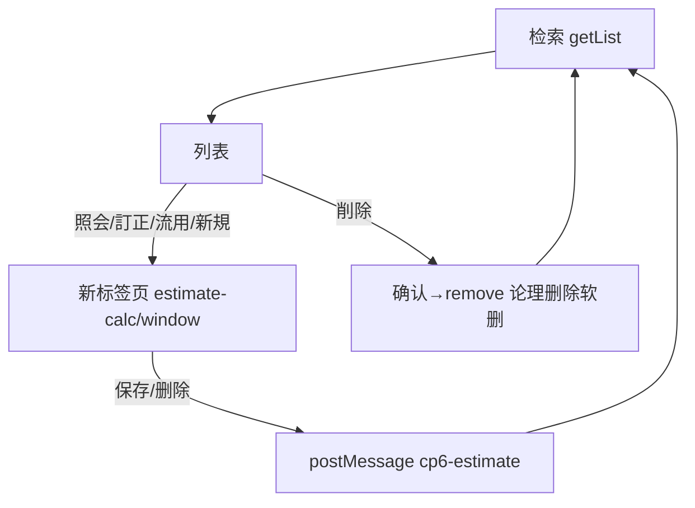

# 見積計算一覧 单页面操作 SOP（手把手版）

> **用途**：给**业务用户照着点、培训老师照着讲、测试人员照着拆用例**的单页面手册。比模块总册更细、更口语。
> **页面**：見積計算一覧（見積計算書 MSBBPA010 的检索台账 · 销售管理 MSBB · 模块总册 §5.2）　**前端**：`views/erp/EstimateCalcListView.vue`　**API**：`api/erp/estimateCalc.ts`(`getList`/`remove`)　**后端**：`Erp/EstimateCalcController.GetList` → `EstimateCalcService.GetPageListAsync`
> **基准**：分支 `feat/wfs-inbox-core`，2026-06-28，均实测真实代码。查不到的标 `待业务确认` / `代码未发现`。
> **样例数据**：見積計算書No `EMC2026060001-01`（列表查询框示例简写 `00000001`）、客户 `C0001`(A社)、拠点 `BASE01`、見積日 `2026-06-01~30`。

---

## 1. 页面一句话说明

**見積計算一覧，就是销售用来"找見積計算書、看估价单价、再打开去改/复制/删"的台账页——它按見積No/客户/拠点/見積日检索，列出見積计算書，支持排序分页；点行操作会**用新页签**打开見積計算書编辑页(照会/訂正/流用/新規)，删除是**论理删除(软删)**；新页签存完会自动回刷本列表。**

---

## 2. 这个页面在业务流程中的位置

```
上游(算价底稿)              本页面(检索台账)                       下游(新页签跳转)
──────────────         ──────────────────────         ────────────────────────
見積計算書(算价保存) ──→  見積計算一覧                    照会/訂正/流用/新規 → 見積計算書编辑页
 (采番落库)              (检索/排序/分页/软删)            (新标签页 /estimate-calc/window)
                                                       └ 存/删后 postMessage 回刷本列表
                        删除=论理删除(软删)              御見積書(束ね用这些見積)
```

- **上游**：【見積計算書】算价保存后的記録。
- **本页面**：按条件检索見積计算書台账、看估价单价、排序分页；行操作**用新页签**打开编辑页。
- **下游**：① 照会/訂正/流用/新規 都在**新标签页**打开見積計算書(`/estimate-calc/window`)；② 这些見積后续供【御見積書】束ね。
- **关键认知**：① 行操作是**新页签**(window.open)，不是本页内编辑；② 删除=**论理删除(软删)**，确认后不可复旧；③ 新页签存/删完会 `postMessage` 通知本列表**自动刷新**；④ 本页是查询页，**没有内联编辑表单**。

---

## 3. 谁使用这个页面

| 角色 | 使用目的 | 常用操作 | 权限要求 | 注意事项 |
|---|---|---|---|---|
| 销售/营业担当 | 找見積、改/复制 | 检索、訂正、流用 | 见積查看/编辑(`[Authorize]`，细粒度`待业务确认`) | 改在新页签 |
| 销售内勤 | 维护見積、删错档 | 訂正、削除 | 编辑/删除权限 | 软删不可复旧 |
| 销售主管 | 看估价、复核 | 检索、照会 | 查看 | 只读 |
| 报价人员 | 找可束ね的見積 | 检索 | 查看 | 配合御見積 |
| 测试/UAT | 验检索/新页签/软删 | 全流程 | 登录 | postMessage刷新 |

> 📌 **权限现状**：`EstimateCalcController` 标 `[Authorize]`；编辑/删除细粒度授权 `待业务确认`。

---

## 4. 操作前准备（不准备好，下面会卡住）

| 准备项 | 为什么需要 | 不满足会怎样 | 去哪里维护/确认 | 测试关注点 |
|---|---|---|---|---|
| 系统已有見積計算書 | 列表才有内容 | 查询空 | 先建見積計算書 | 空结果 |
| 浏览器允许新标签页 | 行操作开新页签 | 提示被拦截 | 浏览器设置 | 弹窗拦截 |
| 检索条件合理 | 范围影响结果 | 查不到/过多 | 调条件 | 条件 |
| 知道删除=软删 | 误以为物删 | 删后以为没了 | 见§9 | 软删 |
| 知道改在新页签 | 找不到内联编辑 | 想在本页改 | 见§7 | 跳转 |

---

## 5. 页面区域说明

| 区域 | 页面位置 | 用户要做什么 | 注意事项 |
|---|---|---|---|
| 查询区 | 顶部 | 填見積No/客户CD/拠点(下拉)/見積日范围 | 都非必填 |
| 工具按钮区 | 查询区内 | 検索 / クリア / 新規 | 新規开新页签 |
| 结果列表 | 中部(桌面表格/移动卡片) | 看見積、排序、点行操作 | 双击行=照会 |
| 行操作区 | 每行右侧(固定列) | 照会/訂正/流用/削除 | 软删=红 |
| 分页区 | 列表下方 | 翻页/改每页 | 10/20/50 |

---

## 6. 字段填写说明（口语版）

### 6.1 查询条件（怎么填）

| 字段 | 字段名 | 怎么填 | 必填 | 注意 |
|---|---|---|---|---|
| 計算書No | `qtnCalcNo` | 输見積No(模糊/精确) | 否 | 例 00000001 |
| 得意先 | `customerCd` | 输客户CD | 否 | — |
| 拠点 | `baseCd` | 下拉选据点 | 否 | 全部=不限 |
| 見積日(范围) | `dateFrom~dateTo` | 选日期区间 | 否 | from≤to |

### 6.2 列表列（怎么看，均可排序）

| 列 | 字段 | 含义 | 注意 |
|---|---|---|---|
| 計算書No | `qtnCalcNo` | 見積编号 | 双击行=照会 |
| 見積日 | `qtnDate` | 估价日 | — |
| 拠点 | `qtnBaseCd` | 见積拠点 | — |
| 担当 | `staffCd` | 担当者 | — |
| 得意先 | `customerCd` | 客户 | — |
| 顧客品名 | `customerProductName1` | 品名 | 超长省略+悬浮 |
| 数量 | `orderQty` | 受注数量 | 右对齐 |
| 単価 | `estimateUnitPrice` | 見積単価 | 右对齐 |
| 見積区分 | `qtnDiv` | A/B/C(算价口径) | — |
| 最終更新 | `modifyDate` | 更新时间(无则创建) | — |
| 操作 | — | 照会/訂正/流用/削除 | 固定列 |

> 本页是查询页，**无新增/编辑表单**(建/改在新页签的見積計算書)。

---

## 7. 按钮操作说明

| 按钮 | 何时点 | 系统做什么 | 成功后 | 失败处理 | 测试关注点 |
|---|---|---|---|---|---|
| 検索 | 设好条件 | 调 getList 分页返回 | 列表出结果+总数 | 0件→空 | 检索 |
| クリア | 重查 | 清条件(留分页)重查 | 条件清空 | — | 重置 |
| 新規 | 建新見積 | window.open `/estimate-calc/window?op=new` | 新标签页打开見積計算書 | 被拦→提示允许新页签 | 新建 |
| (双击行)/照会 | 看某単 | 新页签 op=view 打开 | 新标签照会 | 拦截提示 | 跳转 |
| (行)訂正 | 改某単 | 新页签 op=edit | 新标签编辑 | 拦截提示 | 跳转 |
| (行)流用 | 复制某単 | 新页签 op=copy | 新标签复制 | 拦截提示 | 跳转 |
| (行)削除 | 删某単 | 确认→remove(论理删除) | 提示删除完了、刷新列表 | — | 软删 |
| (表头)排序 | 按列排 | onSortChange 传 sortField/Order 重查 | 列表重排 | — | 排序 |
| (分页) | 翻页/改每页 | 重查 | 翻页 | — | 10/20/50 |

> ⚠️ **行操作都开新标签页**(`/estimate-calc/window?op=&no=`)；编辑细节见 `01-01-見積計算書-单页面操作SOP`。新页签保存/删除会 `postMessage(source=cp6-estimate)` 让本列表**自动刷新**。
> ⚠️ **删除是论理删除(软删)**——列表删除直接调 remove(不带 rowVersion)，确认后软删、不可复旧。

---

## 8. 标准业务操作 SOP（照着点）

### 场景一：按見積No / 客户 / 拠点 / 日期检索
- **业务背景**：销售要找 A社本月的見積。
- **使用样例数据**：客户 C0001、拠点 BASE01、見積日 2026-06-01~30。
- **前置条件**：① 登录有查看权限；② 有見積数据。
- **详细操作步骤**：
  1. 打开【销售管理 → 見積計算一覧】。
  2. 填【得意先】C0001、【拠点】BASE01、【見積日】范围。
  3. 点【検索】→ 看列表与总件数。
  4. 需要时点表头排序、底部分页翻页。
- **完成后检查**：① 结果符合条件；② 排序/分页正常。
- **异常处理**：0件→列表空(放宽条件)。
- **可拆测试用例**：TC-M04-ESTL-002/003/008/009/010。

### 场景二：照会查看某見積（新页签）
- **业务背景**：复核某見積单价。
- **使用样例数据**：EMC2026060001-01。
- **前置条件**：查到该見積。
- **详细操作步骤**：
  1. 查到目标行，双击行或点【照会】。
  2. 浏览器**新标签页**打开見積計算書(op=view)只读。
  3. 看 Step1~3(基本/工程/算价)。
- **完成后检查**：① 新页签打开对应見積；② 只读浏览。
- **异常处理**：新页签被拦→允许本站新页签。
- **可拆测试用例**：TC-M04-ESTL-011/012。

### 场景三：訂正 / 流用某見積（新页签）
- **业务背景**：改单价或复制比价。
- **使用样例数据**：EMC2026060001-01。
- **前置条件**：有编辑权限。
- **详细操作步骤**：
  1. 点行【訂正】(op=edit) 或【流用】(op=copy)→新标签页打开。
  2. 在見積計算書改/复制并保存(详见 01-01 SOP)。
  3. 回到本列表标签页——已**自动刷新**(收到 postMessage)。
- **完成后检查**：① 新页签正确载入訂正/流用；② 存完本列表自动反映新值/新单。
- **异常处理**：未自动刷新→手动【検索】。
- **可拆测试用例**：TC-M04-ESTL-013/014/020。

### 场景四：新規建見積（新页签）
- **业务背景**：直接从列表新建一张見積。
- **使用样例数据**：—。
- **前置条件**：有编辑权限。
- **详细操作步骤**：1) 点【新規】→新标签页 op=new；2) 走 3 步算价保存(01-01 SOP)；3) 回列表已刷新。
- **完成后检查**：① 新页签新建；② 保存后列表出现新見積。
- **异常处理**：新页签被拦→允许。
- **可拆测试用例**：TC-M04-ESTL-015。

### 场景五：删除見積（论理删除/软删）
- **业务背景**：删一张错的見積。
- **使用样例数据**：EMC2026060002-01。
- **前置条件**：有删除权限。
- **详细操作步骤**：
  1. 查到目标行，点【削除】。
  2. 确认弹窗"削除 No?（論理削除、復旧不可）"→确定。
  3. 系统软删、提示删除完了、列表刷新。
- **完成后检查**：① 列表默认查不到(软删)；② 数据库 IsDeleted=1(带 includeDeleted 仍可追溯)；③ 已被御見積束ね的处理`待业务确认`。
- **异常处理**：误删→软删可由开发带 includeDeleted 找回(`待业务确认`恢复路径)。
- **可拆测试用例**：TC-M04-ESTL-016/017。

### 场景六：新页签保存后列表自动刷新（postMessage）
- **业务背景**：验证编辑后台账实时更新。
- **使用样例数据**：任一見積。
- **前置条件**：从本列表打开新页签编辑。
- **详细操作步骤**：1) 訂正打开新页签；2) 改后保存；3) 切回列表标签页观察。
- **完成后检查**：① 列表自动刷新(无需手点検索)；② 新值反映。
- **异常处理**：跨源/被拦→手动検索兜底。
- **可拆测试用例**：TC-M04-ESTL-021/022。

### 场景七：移动端卡片操作
- **业务背景**：手机上查見積。
- **使用样例数据**：—。
- **前置条件**：窄屏。
- **详细操作步骤**：1) 窄屏打开→卡片列表；2) 点卡片照会；3) 卡片内訂正/流用/削除。
- **完成后检查**：① 卡片视图正常；② 操作可用。
- **异常处理**：—。
- **可拆测试用例**：TC-M04-ESTL-023。

---

## 9. 状态变化说明

> 本页是台账，无业务状态机；关键是"删除=软删"与"新页签编辑回刷"。見積本身的状态(見積区分/確定)见 01-01 与御見積。

| 动作 | 用户看到 | 含义 | 下一步 |
|---|---|---|---|
| 检索 | 列表+总数 | 当前条件结果 | 排序/分页/操作 |
| 删除(软删) | 提示删除完了、消失 | IsDeleted=1 | 默认不再显示 |
| 新页签存/删 | 列表自动刷新 | postMessage 触发 | 看最新 |



---

## 10. 按钮不可用 / 灰色 / 不出现原因

| 按钮 | 何时不可用 | 为什么 | 怎么处理 | 测试关注点 |
|---|---|---|---|---|
| 行操作(照会/訂正/流用/削除) | 未定位行 | 需先找到行 | 检索定位 | — |
| 新页签打开 | 浏览器拦截弹窗/新页签 | 浏览器策略 | 允许本站新页签 | 拦截 |
| 删除 | (无权限时) | 删除权限`待确认` | 申请权限 | 权限 |
| 排序 | — | 全列sortable | — | — |

---

## 11. 常见错误与处理

| 错误/现象 | 可能原因 | 用户处理方法 | 是否需要管理员 | 测试关注点 |
|---|---|---|---|---|
| 列表无数据 | 条件过严/无数据 | 放宽条件 | 否 | 空结果 |
| 新页签没打开 | 浏览器拦截 | 允许本站新页签 | 否 | 拦截 |
| 删了还想找回 | 软删 | 开发带includeDeleted找回(`待确认`) | 是 | 软删恢复 |
| 改完列表没变 | postMessage未触发/跨源 | 手动検索 | 否 | 刷新 |
| 删了被御見積引用的見積 | 引用关系 | 删前确认未被束ね(`待业务确认`) | 是(业务) | 引用 |
| 权限不足 | 无编辑/删除权 | 申请权限 | 是 | 权限`待确认` |
| 网络/接口异常 | 后端/网络 | 稍后重试 | 是(运维) | 异常 |

---

## 12. 操作完成后的检查清单

| 操作 | 当前页面检查 | 新页签(見積計算書)检查 | 数据状态 | 测试关注点 |
|---|---|---|---|---|
| 检索 | 结果符合条件、总数对 | — | — | 条件 |
| 照会/訂正/流用/新規 | 新标签页打开对应操作 | 正确载入/新建(01-01) | — | 跳转 |
| 新页签保存 | 列表自动刷新 | 見積已存 | 新值/新単 | postMessage |
| 删除 | 提示、行消失 | — | IsDeleted=1 | 软删 |

---

## 13. 页面级测试用例（≥25 条，可执行）

> 编号 `TC-M04-ESTL-xxx`；数据用样例。测试人员补"实际结果/是否通过/缺陷编号"。

| 用例编号 | 用例名称 | 优先级 | 前置条件 | 测试数据 | 操作步骤 | 预期结果 | 备注 |
|---|---|---|---|---|---|---|---|
| TC-M04-ESTL-001 | 页面打开 | P1 | 有权限 | — | 进入 | 查询区+默认列表 | — |
| TC-M04-ESTL-002 | 按No检索 | P0 | 有数据 | 00000001 | 填No→検索 | 命中 | 检索 |
| TC-M04-ESTL-003 | 按客户检索 | P0 | 有数据 | C0001 | 填客户→検索 | 均属C0001 | — |
| TC-M04-ESTL-004 | 按拠点检索 | P1 | 有数据 | BASE01 | 选拠点→検索 | 均属BASE01 | — |
| TC-M04-ESTL-005 | 按見積日范围 | P0 | 有数据 | 2026-06 | 选日期→検索 | 在范围内 | 范围 |
| TC-M04-ESTL-006 | 组合条件 | P1 | 有数据 | 客户+日期 | 多条件→検索 | 全满足 | 组合 |
| TC-M04-ESTL-007 | クリア重置 | P2 | 已填条件 | — | クリア | 条件清空重查 | 重置 |
| TC-M04-ESTL-008 | 排序 | P2 | 多数据 | 按単価 | 点表头 | 排序生效 | 排序 |
| TC-M04-ESTL-009 | 分页 | P1 | 多数据 | 10/20/50 | 改每页/翻页 | 数据正确 | 分页 |
| TC-M04-ESTL-010 | 空结果 | P1 | — | 不存在条件 | 検索 | 列表空 | 空 |
| TC-M04-ESTL-011 | 双击照会 | P1 | 有单 | EMC..01 | 双击行 | 新页签view打开 | 跳转 |
| TC-M04-ESTL-012 | 照会按钮 | P1 | 有单 | — | 点照会 | 新页签view | 跳转 |
| TC-M04-ESTL-013 | 訂正打开 | P0 | 有单 | — | 点訂正 | 新页签edit | 跳转 |
| TC-M04-ESTL-014 | 流用打开 | P1 | 有单 | — | 点流用 | 新页签copy | 跳转 |
| TC-M04-ESTL-015 | 新規打开 | P1 | — | — | 点新規 | 新页签new | 新建 |
| TC-M04-ESTL-016 | 删除确认 | P0 | 有单 | EMC..02 | 点削除 | 弹确认(论理删除) | 软删 |
| TC-M04-ESTL-017 | 删除软删 | P0 | 确认删 | — | 确定 | 软删、列表刷新、查不到 | 软删 |
| TC-M04-ESTL-018 | 取消删除 | P2 | 有单 | — | 删除→取消 | 不删 | 二次确认 |
| TC-M04-ESTL-019 | 新页签被拦提示 | P2 | 浏览器拦截 | — | 点操作 | 提示允许新页签 | 拦截 |
| TC-M04-ESTL-020 | 訂正存回刷 | P1 | 訂正中 | — | 新页签存→回列表 | 列表自动刷新 | postMessage |
| TC-M04-ESTL-021 | 删除回刷 | P1 | 新页签删 | — | 新页签删→回列表 | 列表自动刷新 | postMessage |
| TC-M04-ESTL-022 | 跨源消息忽略 | P3 | 异源 | — | 异源message | 忽略不刷 | 安全 |
| TC-M04-ESTL-023 | 移动端卡片 | P3 | 移动端 | — | 窄屏打开 | 卡片+操作可用 | 响应式 |
| TC-M04-ESTL-024 | 顾客品名超长 | P2 | 长品名 | — | 看列 | 省略+悬浮全文 | UI |
| TC-M04-ESTL-025 | 单价/数量右对齐格式 | P3 | 有数据 | — | 看列 | 金额数量格式化右对齐 | 格式 |
| TC-M04-ESTL-026 | 删被束ね見積 | P2 | 已束ね | — | 删除 | 删前确认(`待业务确认`) | 引用 |
| TC-M04-ESTL-027 | 权限不足 | P2 | 无权账号 | — | 找编辑/删除 | `待业务确认`(隐藏/拒绝) | 权限 |
| TC-M04-ESTL-028 | 网络异常 | P2 | 断网 | — | 検索/删除 | 友好错误可重试 | 异常 |

---

## 14. 培训讲解建议

| 讲解顺序 | 讲什么 | 演示动作 | 用户容易误解的点 |
|---|---|---|---|
| 1 | 这页是見積台账(查/开/删) | 展示 §2 流程图 | 以为能内联改 |
| 2 | 多条件检索+排序分页 | 演示按客户+日期查 | 条件填法 |
| 3 | 行操作开新标签页 | 点訂正看新页签 | 找不到内联编辑 |
| 4 | 存完自动回刷 | 新页签存→看列表刷新 | 以为要手刷 |
| 5 | 删除=软删 | 演示论理删除 | 当成物删 |
| 6 | 新規也开新页签 | 点新規 | — |
| 7 | 移动端卡片 | 窄屏演示 | — |

---

## 15. 与模块级手册的关系

本单页 SOP 对应模块总册 `docs/manuals/user-training/01-销售管理MSBB-最详细用户操作培训手册.md`：

| 本SOP章节 | 对应总册章节 |
|---|---|
| §1/§2 定位与流程 | 总册 §3、§5.2.1 |
| §4 操作前准备 | 总册 §5.2.1a |
| §6 字段(检索/列表) | 总册 §5.2.1b + §5.2.5/5.2.6 |
| §7 按钮 | 总册 §5.2.9 |
| §8 SOP | 总册 §5.2.1e |
| §9 状态(软删/回刷) | 总册 §5.2.10 |
| §10 灰按钮 | 总册 §5.2.1c |
| §12 完成后检查 | 总册 §5.2.1d |
| §13 测试用例 | 总册 §7.1 |
| §14 培训讲解 | 总册 §13 |

> 配套：编辑目标 `01-01-見積計算書-单页面操作SOP`(新页签打开的页)；下游 `01-03-御見積書`(束ね这些見積)。

---

## 16. 代码与文档来源

| 类型 | 路径 | 用途 |
|---|---|---|
| 前端页面 | `cp6.web/src/views/erp/EstimateCalcListView.vue` | 检索/列表/排序/分页/新页签/软删/移动卡片 |
| API | `cp6.web/src/api/erp/estimateCalc.ts`(`getList`/`remove`) | 查询/软删 |
| 类型 | `cp6.web/src/types/erp/estimateCalc.ts`(EstimateCalcQuery/EstimateCalcListItem) | 查询/列表行 |
| 路由 | `cp6.web/src/router/index.ts`(`/estimate-calc-list`；新页签 `/estimate-calc/window`) | 路径/新页签 |
| 后端 Controller | `CP6.WebApi/Controllers/Erp/EstimateCalcController.cs`(GetList/Delete) | 端点 |
| Service | `CP6.Core/Services/Erp/EstimateCalcService.cs`(GetPageListAsync/DeleteAsync软删) | 查询/软删 |
| 编辑页 | `cp6.web/src/views/erp/EstimateCalcView.vue` | 新页签打开的見積計算書 |
| 模块总册 | `docs/manuals/user-training/01-销售管理MSBB-最详细用户操作培训手册.md` | 上级手册 §5.2 |
| 同级SOP | `docs/manuals/user-training/sales-msbb-pages/01-01-見積計算書-单页面操作SOP.md` | 编辑目标页 |
| 逐行源码手册 | `docs/codemap-erp/02-見積計算-estimatecalc.md` | 代码级实现 |
| 页面盘点表 | `docs/manuals/user-training/00-用户操作手册页面盘点表.md` | 页面索引(序号2) |

---

## 最后更新来源

- 代码：见 §16（EstimateCalcListView + estimateCalc.ts/types 逐文件实测；后端 GetList/Delete 与 SOP-M04-01 同源 codemap）
- 文档：模块总册 §5.2(待补)、`docs/codemap-erp/02-見積計算-estimatecalc.md`、页面盘点表
- 基准：分支 `feat/wfs-inbox-core`，盘点日 2026-06-28
- 诚实标注：行操作均**新标签页**打开見積計算書；删除为**论理删除(软删)**，恢复路径与被束ね見積删除处理 `待业务确认`；细粒度权限 `待业务确认`
</content>
